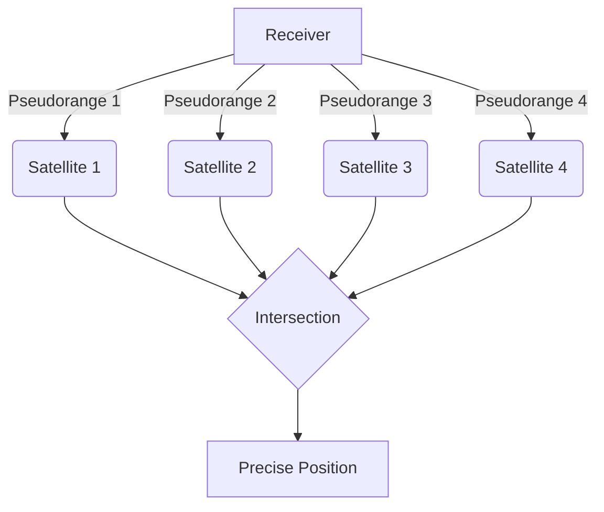

---
jupytext:
  text_representation:
    extension: .md
    format_name: myst
kernelspec:
  display_name: Python 3
  language: python
  name: python3
---

(gnss_section)=
# How GNSS Works

Understanding the Global Navigation Satellite Systems (GNSS) is critical as it serves as the foundational geometric infrastructure for mapping and creating Digital Elevation Models (DEMs).

## Constellations

At any given time, a multitude of navigation satellites are orbiting the Earth, each broadcasting signals that allow receivers on the ground to calculate their position. These satellites are organized into systems called "constellations." The primary constellations in operation today are:

- **GPS (Global Positioning System):** Operated by the United States, this is the most widely known GNSS.
- **GLONASS (Global Navigation Satellite System):** Operated by Russia, this system provides global coverage.
- **Galileo:** Operated by the European Union, this is a modern system with high-accuracy services.

The availability of multiple constellations (a multi-constellation receiver) enhances the reliability and accuracy of positioning by increasing the number of satellites visible to a receiver at any time.

## Signals

Each GNSS satellite continuously transmits radio signals on specific frequencies, primarily in the L-band. These signals contain precise timing information, generated by atomic clocks on board the satellites, as well as the satellite's exact orbital position (ephemeris).

A GNSS receiver on or near the Earth's surface captures these signals and calculates the time it took for the signal to travel from the satellite to the receiver. Since the radio signals travel at the speed of light, this time difference can be converted into a distance, also known as a "pseudorange."
## Trilateration

Trilateration is the geometric method used to determine a precise location on Earth. By measuring the distance to at least four satellites, a GNSS receiver can pinpoint its position in three-dimensional space (latitude, longitude, and altitude).

Here's a simplified breakdown of the process:
1.  **One Satellite:** Measuring the distance from one satellite tells us we are located somewhere on the surface of a sphere with the satellite at its center.
2.  **Two Satellites:** The intersection of two satellite spheres creates a circle. Our position is somewhere on this circle.
3.  **Three Satellites:** The intersection of three spheres narrows our position down to just two points. One of these points can usually be discarded as it is either in space or moving at an impossible velocity.
4.  **Four Satellites:** A fourth satellite is required to resolve the receiver's clock error, which is the tiny discrepancy between the receiver's clock and the highly accurate atomic clocks in the satellites. This fourth measurement allows for a precise 3D position.

