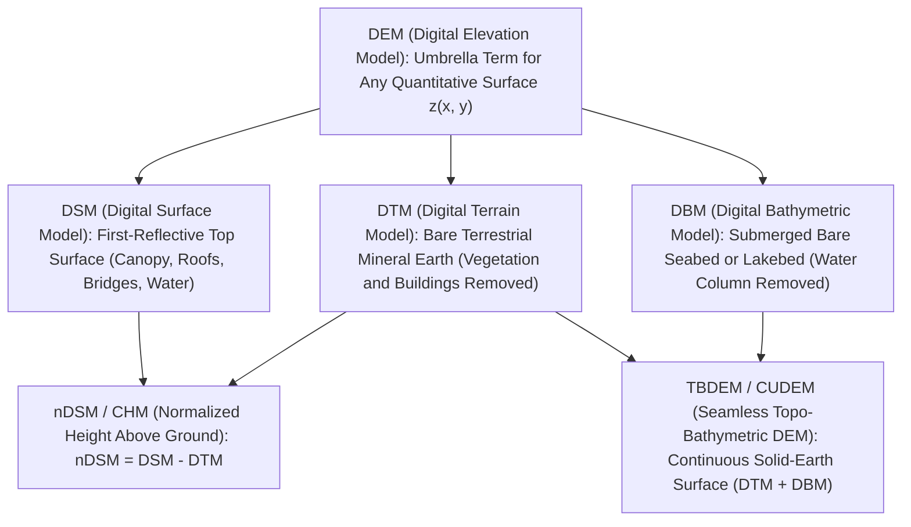
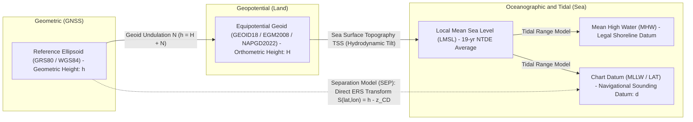

# Acronyms and Technical Glossary

Precise terminology is the first defense against catastrophic engineering and navigational errors in elevation modeling. Across geodesy, photogrammetry, terrestrial surveying, hydrography, oceanography, and computer graphics, identical words—such as *"elevation,"* *"ground,"* *"resolution,"* or *"datum"*—frequently carry incompatible mathematical or legal definitions. Conversely, a single physical concept may be known by entirely different acronyms depending on whether the practitioner operates above or below the air–water interface.

This reference establishes the canonical definitions, mathematical conventions, and standard-backed ontologies used throughout *The Digital Elevation Models Handbook* (Chapters 1–35).

---

## 1. Master Acronym Table

The following alphabetical table compiles the primary acronyms spanning terrestrial, marine/bathymetric, geodetic, positioning, sensor physics, file format, standards, and uncertainty domains used across this handbook.

| Acronym | Full Expansion | Domain | Brief Technical Definition |
| :--- | :--- | :--- | :--- |
| **3DEP** | 3D Elevation Program | Standards / Terrestrial | U.S. Geological Survey (USGS) national program acquiring high-resolution bare-earth LiDAR (QL0–QL2) and IfSAR (Alaska) across the United States. |
| **3DGS** | 3D Gaussian Splatting | Visualization / Vision | Explicit radiance field representation modeling 3D scenes as millions of anisotropic 3D Gaussians $(\boldsymbol{\mu}_i, \boldsymbol{\Sigma}_i, \alpha_i, \text{SH}_i)$ rasterized via differentiable alpha blending. |
| **ADCP** | Acoustic Doppler Current Profiler | Sonar / Oceanography | Acoustic current profiler using the Doppler shift of backscattered sound; its 3- or 4-beam bottom-track mode provides opportunistic bathymetry. |
| **ADS-B** | Automatic Dependent Surveillance–Broadcast | Aviation / Filtering | Cooperative aviation transponder system broadcasting real-time aircraft GNSS position, altitude, and velocity; used to filter airborne returns from LiDAR/stereo. |
| **AEM** | Airborne Electromagnetics | Geophysics | Inductive electromagnetic sounding from aircraft used to map subsurface conductivity, coastal saltwater intrusion, and depth to bedrock. |
| **AGL** | Above Ground Level | Aviation / Surveying | Height of an aircraft, drone, or sensor measured relative to the local underlying terrain or obstacle surface ($\text{AGL} = H_{\text{orthometric}} - z_{\text{terrain}}$). |
| **AIS** | Automatic Identification System | Maritime / Filtering | VHF maritime transceiver system broadcasting vessel identity, dimensions, course, and GNSS position (ITU-R M.1371); used to mask ship and wake artifacts in DEMs. |
| **ALOS** | Advanced Land Observing Satellite | Spaceborne / Stereo & SAR | JAXA Earth observation satellite series carrying the PRISM optical tri-stereo scanner (source of AW3D/AW3D30) and PALSAR L-band SAR. |
| **AMR** | Adaptive Mesh Refinement | Data Structures | Numerical discretization method that dynamically subdivides computational cells where terrain curvature, gradient, or hydrodynamic error is high. |
| **ANTEX** | Antenna Exchange Format | Geodesy / GNSS | IGS standard format tabulating satellite and receiver GNSS antenna Phase Center Offsets (PCO) and elevation/azimuth-dependent Phase Center Variations (PCV). |
| **APD** | Avalanche Photodiode | LiDAR Physics | Semiconductor photodetector operating in linear or Geiger (single-photon) mode to detect weak backscattered laser pulses. |
| **ARA** | Angular Range Analysis | Sonar / Backscatter | Inversion technique estimating seafloor acoustic impedance, roughness, and grain size from the incidence-angle dependence of multibeam backscatter $S_b(\theta_i)$. |
| **ARP** | Antenna Reference Point | Geodesy / GNSS | Physical mechanical reference point on a GNSS antenna (typically the base of the mounting thread) to which monument heights and PCO vectors are referenced. |
| **ASP** | Ames Stereo Pipeline | Software / Photogrammetry | NASA open-source automated stereogrammetry and photoclinometry suite for planetary, satellite, and historical frame imagery. |
| **ASPRS** | American Society for Photogrammetry and Remote Sensing | Standards / Governance | Professional society maintaining the LAS point cloud specification and the *Positional Accuracy Standards for Digital Geospatial Data*. |
| **ASTER** | Advanced Spaceborne Thermal Emission and Reflection Radiometer | Spaceborne / Stereo | Japanese-US nadir/aft NIR stereo imager aboard NASA's Terra satellite; source of the global 30 m ASTER GDEM. |
| **ATLAS** | Advanced Topographic Laser Altimeter System | Spaceborne LiDAR | 532 nm green photon-counting six-beam laser altimeter aboard NASA's ICESat-2 spacecraft, capable of both terrestrial and nearshore bathymetric ranging. |
| **AUV** | Autonomous Underwater Vehicle | Marine Platforms | Untethered robotic submarine flying pre-programmed missions close to the seabed ($5\text{–}50\text{ m}$ altitude) for decimeter-scale deep-water multibeam/SAS mapping. |
| **AW3D30** | ALOS World 3D – 30m | Public DEM Products | Global 1-arcsecond ($\sim 30\text{ m}$) Digital Surface Model derived by JAXA from ALOS PRISM optical tri-stereo imagery. |
| **BAG** | Bathymetric Attributed Grid | File Formats / Hydrography | Open Navigation Surface / IHO HDF5-based raster format storing mandatory co-registered **elevation/depth** and **uncertainty** bands plus tracking lists. |
| **BAN** | Bathymetric-Aided Navigation | Navigation / Marine | Underwater localization technique matching real-time sonar swaths or altimeter profiles against an a priori bathymetric DEM via Bayesian particle filtering. |
| **BIM** | Building Information Modeling | Vector / Urban 3D | Object-oriented digital representation of physical and functional characteristics of buildings and infrastructure (standardized via IFC). |
| **BPI** | Bathymetric Position Index | Geomorphometry | Marine analog of Topographic Position Index (TPI), comparing a cell's depth to the mean depth of an annular neighborhood to classify ridges, flats, and troughs. |
| **B-Rep** | Boundary Representation | Vector / 3D Geometry | Solid modeling scheme representing 3D objects by their bounding topological faces, edges, and vertices with consistent outward surface normals. |
| **CATZOC** | Category of Zone of Confidence | Standards / Hydrography | IHO S-57/S-101 composite quality indicator (Categories A1, A2, B, C, D, U) encoding position accuracy, depth accuracy, and seafloor coverage on nautical charts. |
| **CD** | Chart Datum | Vertical Datums | Low-water vertical reference surface (typically LAT or MLLW) to which soundings on nautical charts and tide predictions are referenced. |
| **CDT** | Constrained Delaunay Triangulation | Data Structures / TIN | Generalization of Delaunay triangulation forcing predefined vector breaklines (e.g., retaining walls, stream banks) to be preserved as triangle edges. |
| **CGVD2013** | Canadian Geodetic Vertical Datum of 2013 | Vertical Datums | Modern gravimetric geoid-based orthometric vertical datum of Canada, defined by the CGG2013 equipotential surface ($W_0 = 62,636,856.0\text{ m}^2\text{s}^{-2}$). |
| **CHM** | Canopy Height Model | Surface Semantics | Raster or point cloud representing the height of vegetation above bare mineral ground ($\text{CHM} = \text{DSM}_{\text{canopy}} - \text{DTM}$). |
| **CHRT** | CUBE with Hierarchical Resolution | Gridding / Hydrography | Variable-resolution extension of the CUBE algorithm that dynamically adapts grid cell size based on local sounding density and water depth. |
| **CI** | Contour Interval | Cartography | Constant vertical elevation or depth difference between adjacent regular contour lines (isohypses or isobaths) on a topographic or bathymetric map. |
| **COG** | Cloud-Optimized GeoTIFF | File Formats | Standard GeoTIFF file structured with internal tiling, pre-computed overview pyramids, and an HTTP-Range-friendly byte layout for serverless cloud streaming. |
| **COPC** | Cloud-Optimized Point Cloud | File Formats | Valid ASPRS LAZ 1.4 file organized internally as a clustered octree (via a COPC info VLR and octree hierarchy EVLRs) allowing spatial and octree-level streaming over HTTP Range requests. |
| **CORS** | Continuously Operating Reference Station | Geodesy / Positioning | Permanent monumented multi-GNSS receiver station providing continuous carrier-phase observations for PPK/RTK ties and crustal velocity monitoring. |
| **CP** | Check Point | Validation / QA | Independent high-accuracy surveyed point withheld completely from calibration and bundle adjustment to provide an unbiased accuracy estimate (RMSE, NVA, VVA). |
| **CRM** | Coastal Relief Model | Public DEM Products | NOAA NCEI regional 3-arcsecond ($\sim 90\text{ m}$) integrated topographic-bathymetric elevation models of the U.S. coastal zone. |
| **CRS** | Coordinate Reference System | Geodesy | Mathematical framework binding a coordinate system (axes, units) to the physical Earth via a geodetic datum and optional map projection (ISO 19111 / WKT2). |
| **CSB** | Crowdsourced Bathymetry | Marine Surveying | Collection of opportunistic depth soundings and GNSS positions from commercial, fishing, and recreational vessels under IHO Publication B-12 guidelines. |
| **CSF** | Cloth Simulation Filter / Combined Scale Factor | Filtering / Geodesy | (1) LiDAR ground-filtering algorithm (Zhang et al., 2016) simulating a physical cloth draped over an inverted point cloud; (2) Product of projection scale factor and elevation factor ($k_0 \frac{R}{R+h}$). |
| **CSDGM** | Content Standard for Digital Geospatial Metadata | Metadata | Legacy U.S. Federal Geographic Data Committee (FGDC-STD-001-1998, originally adopted 1994) metadata standard, largely superseded by ISO 19115. |
| **CTD** | Conductivity, Temperature, and Depth | Oceanography / Sonar | Oceanographic profiler measuring electrical conductivity, temperature, and hydrostatic pressure to derive salinity, density, and sound velocity profiles (SVP). |
| **CUBE** | Combined Uncertainty and Bathymetric Estimator | Gridding / Hydrography | Bayesian sequential estimation algorithm (Calder & Mayer, 2003) that tracks multiple competing depth hypotheses at each grid node weighted by sounding TPU. |
| **CUDEM** | Continuously Updated Digital Elevation Model | Public DEM Products | NOAA NCEI seamless, tiled coastal topographic-bathymetric DEM framework ($1/9$- and $1/3$-arcsecond) with automated supercession and uncertainty tracking. |
| **CVD** | Color-Vision Deficiency | Visualization | Reduced ability to distinguish certain chromatic channels (protanopia, deuteranopia, tritanopia), requiring monotonic-luminance colormaps (`viridis`, `cividis`). |
| **CW** | Continuous Wave | Sensor Physics | Sonar or radar transmission mode emitting an unmodulated constant-frequency carrier pulse, whose range resolution is governed by pulse duration $\tau$. |
| **DAS** | Distributed Acoustic Sensing | Geophysics | Photonic technique turning telecommunication fiber-optic cables into dense arrays of strain/acoustic sensors via Rayleigh optical time-domain reflectometry. |
| **DBM** | Digital Bathymetric Model | Surface Semantics | Digital representation of the submerged solid seabed, lakebed, or riverbed topography (water column and biological/pelagic clutter removed). |
| **DCDB** | Data Centre for Digital Bathymetry | Archiving / Marine | International Hydrographic Organization (IHO) global archive for oceanic bathymetry hosted by NOAA NCEI in Boulder, Colorado. |
| **DEM** | Digital Elevation Model | Surface Semantics | Umbrella term for any quantitative digital representation of Earth's (or another planetary body's) surface elevation or depth; in strict USGS usage, a bare-earth raster. |
| **DGGS** | Discrete Global Grid System | Data Structures | Spatial reference system that tessellates the entire globe into a hierarchical, seamless multi-resolution set of cells (e.g., S2 quads, H3 hexagons, rHEALPix). |
| **DGPS** | Differential Global Positioning System | Positioning | Code-phase differential correction architecture broadcasting pseudorange corrections from known base stations to rovers (typically $0.3\text{–}2\text{ m}$ accuracy). |
| **DLG** | Digital Line Graph | Vector / Historical | Legacy USGS vector map format encoding hydrography, hypsography (contours), boundaries, and transportation networks with topological relationships. |
| **DMI** | Distance Measuring Indicator | Mobile Mapping | Wheel-mounted rotary shaft encoder providing high-rate longitudinal velocity constraints to prevent INS drift during GNSS dropouts in urban canyons or tunnels. |
| **DoD** | DEM of Difference | Change Detection | Raster generated by subtracting an earlier DEM from a later co-registered DEM ($\Delta z(x,y) = z_{t_2}(x,y) - z_{t_1}(x,y)$) to quantify erosion, deposition, or deformation. |
| **DOP** | Dilution of Precision | Positioning / GNSS | Dimensionless geometric multiplier (GDOP, PDOP, HDOP, VDOP, TDOP) relating ranging measurement noise to 3D position and clock variance ($\boldsymbol{\Sigma}_x = \sigma_{\text{UERE}}^2 (\mathbf{G}^T\mathbf{G})^{-1}$). |
| **DSM** | Digital Surface Model | Surface Semantics | Elevation model representing the uppermost reflective surface of the Earth, including buildings, tree canopies, bridges, vehicles, and water surfaces. |
| **DTM** | Digital Terrain Model | Surface Semantics | Bare-earth elevation model representing the mineral soil, rock, or seabed with vegetation and anthropogenic structures removed, often augmented by vector breaklines. |
| **DTON** | Danger to Navigation | Hydrography / Safety | High-priority uncharted or shoaler-than-charted submerged hazard (wreck, rock, shoal) requiring immediate reporting to charting authorities for Notice to Mariners. |
| **DVL** | Doppler Velocity Log | Underwater Positioning | Bottom-tracking acoustic Doppler sensor mounted on AUVs/ROVs/submarines measuring 3-axis velocity relative to the seabed to bound INS dead-reckoning drift. |
| **ECEF** | Earth-Centered, Earth-Fixed | Geodesy | Right-handed 3D Cartesian coordinate frame $(X, Y, Z)$ with origin at the Earth's center of mass, $Z$-axis along the IERS Reference Pole, and $X$-axis at the IERS Reference Meridian. |
| **ECDIS** | Electronic Chart Display and Information System | Navigation / Marine | IMO-compliant shipboard computer navigation system integrating official Electronic Navigational Charts (ENCs), GNSS, radar, AIS, and depth sounders. |
| **EDL** | Eye-Dome Lighting | Visualization | Non-photorealistic screen-space depth-discontinuity shading algorithm (Boucheny, 2009) that computes artificial relief contrast on unlit 3D point clouds without requiring normal vectors. |
| **EDM** | Electronic Distance Measurement | Surveying | Optical, infrared, or microwave instrument measuring distance via phase comparison or transit time of modulated electromagnetic waves. |
| **EEZ** | Exclusive Economic Zone | Maritime Law | Sea zone prescribed by UNCLOS extending up to 200 nautical miles from a coastal state's baseline, within which the state holds sovereign resource and survey jurisdiction. |
| **EGM2008** | Earth Gravitational Model 2008 | Geodesy / Vertical Datums | Spherical harmonic geopotential and geoid model ($n_{\max} = 2190$, $\sim 5\text{ arcmin}$ resolution) published by NGA. |
| **EGPWS** | Enhanced Ground Proximity Warning System | Aviation Safety | Aircraft onboard terrain-avoidance system comparing GNSS/barometric position against an internal global tallest-obstacle DSM to prevent Controlled Flight Into Terrain (CFIT). |
| **EKF** | Extended Kalman Filter | Positioning / Fusion | Recursive Bayesian state estimator that linearizes non-linear system dynamics and observation equations around the current state estimate via first-order Taylor Jacobians. |
| **ENC** | Electronic Navigational Chart | Charting / Marine | Official vector database published by a national hydrographic office conforming to IHO S-57 or S-101 standards for use in ECDIS. |
| **EPSG / IOGP** | European Petroleum Survey Group / International Association of Oil & Gas Producers | Geodesy / Standards | Originator (EPSG, founded 1986; public dataset 1993) and current steward (IOGP) of the EPSG Geodetic Parameter Dataset assigning unique integer authority codes (e.g., `EPSG:4326`, `EPSG:3857`) to CRSs and transformations. |
| **EPT** | Entwine Point Tiles | File Formats | Lossless octree-based directory hierarchy of LAZ or binary point cloud chunks designed for out-of-core web visualization and streaming. |
| **ERS** | Ellipsoidally Referenced Surveying | Hydrography / Datums | Hydrographic surveying paradigm in which vessel altitude is measured directly relative to the reference ellipsoid via RTK/PPK/PPP GNSS and reduced to Chart Datum via a Separation Model (SEP). |
| **ESF** | Edge Spread Function | Calibration / Resolution | Cross-edge intensity or elevation profile across a sharp knife-edge or step target; its first derivative yields the Line Spread Function (LSF) and MTF. |
| **ETRS89** | European Terrestrial Reference System 1989 | Geodesy | Plate-fixed geodetic reference frame co-moving with the stable Eurasian continental plate, coincident with ITRS at epoch 1989.0. |
| **FABDEM** | Forest And Buildings removed Copernicus DEM | Public DEM Products | Global 1-arcsecond ($\sim 30\text{ m}$) bare-earth approximation derived by applying machine-learning building and tree-height corrections (trained on LiDAR/GEDI) to Copernicus GLO-30. |
| **FGDC** | Federal Geographic Data Committee | Standards / Governance | U.S. interagency committee coordinating the National Spatial Data Infrastructure (NSDI) and geospatial accuracy/metadata standards (NSSDA, CSDGM). |
| **FITS** | Flexible Image Transport System | File Formats / Planetary | Self-describing raster and table archival format standardized by the IAU and NASA for astronomical and planetary DEM datasets (e.g., LOLA, MOLA). |
| **FMCW** | Frequency-Modulated Continuous-Wave | Sensor Physics | Radar, LiDAR, or sonar ranging technique that sweeps carrier frequency linearly with time (chirp), converting time-of-flight delay into a beat frequency via heterodyne mixing. |
| **FOG** | Fiber-Optic Gyroscope | Positioning / IMU | Solid-state optical gyroscope measuring angular rotation rate via the relativistic Sagnac interference phase shift between counter-propagating laser beams in a fiber coil. |
| **FPM** | Field Procedures Manual | Standards / Hydrography | NOAA Office of Coast Survey operational manual (established in modern digital swath era 1997; regularly updated through 2020+) specifying standard field procedures for hydrographic calibration, patch tests, SVP casts, and quality control. |
| **GCD** | Geomorphic Change Detection | Software / Geomorphology | Methodological and software framework for computing volumetric sediment budgets from repeat DEMs using spatially variable Fuzzy Inference error propagation. |
| **GCJ-02** | GuojiaCehuiJu 02 ("Mars Coordinates") | Geopolitics / Geodesy | Mandatory Chinese coordinate obfuscation algorithm that applies a non-linear pseudo-random sinusoidal offset ($100\text{–}700\text{ m}$) to WGS84 latitude and longitude. |
| **GCP** | Ground Control Point | Calibration / Photogrammetry | Physical target or distinct feature with accurately surveyed 3D coordinates used as a mathematical constraint during bundle adjustment or georeferencing. |
| **GDAL** | Geospatial Data Abstraction Library | Software Ecosystem | Foundational open-source C++/Python library (initiated by Frank Warmerdam in 1998; now OSGeo) for reading, writing, warping, and processing raster (GDAL) and vector (OGR) geospatial formats. |
| **GEBCO** | General Bathymetric Chart of the Oceans | Public DEM Products | Joint IHO–IOC project (initiated in 1903 by Prince Albert I of Monaco) publishing the authoritative global 15-arcsecond ($\sim 450\text{ m}$) ocean and land bathymetric grid. |
| **GEDI** | Global Ecosystem Dynamics Investigation | Spaceborne LiDAR | Full-waveform 1064 nm laser altimeter aboard the International Space Station ($51.6^\circ\text{N–S}$) measuring forest vertical canopy structure and sub-canopy ground elevation. |
| **GIA** | Glacial Isostatic Adjustment | Geodesy / Geodynamics | Viscoelastic response of the Earth's lithosphere and mantle to the loading and unloading of Pleistocene and modern ice sheets, causing $\pm 1\text{–}15\text{ mm/yr}$ vertical crustal motion. |
| **GLAS** | Geoscience Laser Altimeter System | Spaceborne LiDAR | First spaceborne Earth laser altimeter (1064/532 nm, 70 m footprint) flown aboard NASA's ICESat mission (2003–2009). |
| **GLO-30** | Copernicus DEM Global 30m | Public DEM Products | Open global 1-arcsecond ($\sim 30\text{ m}$) Digital Surface Model derived from edited TanDEM-X bistatic X-band InSAR (WorldDEM). |
| **GLONASS** | Globalnaya Navigatsionnaya Sputnikovaya Sistema | Positioning / GNSS | Russian Federation global navigation satellite system. |
| **GMRT** | Global Multi-Resolution Topography | Public DEM Products | Marine Geoscience Data System (MGDS / Lamont-Doherty) synthesis combining quality-controlled multibeam swath bathymetry with GEBCO and terrestrial DEMs across multi-resolution tiles. |
| **GMT** | Generic Mapping Tools | Software Ecosystem | Open-source collection of command-line tools and C/Python libraries (Wessel & Smith, 1988–present) for processing gridded topography, gravity, and publication cartography. |
| **GNSS** | Global Navigation Satellite System | Positioning | Umbrella term encompassing all satellite navigation constellations (GPS, GLONASS, Galileo, BeiDou) and regional augmentations (QZSS, NavIC, SBAS). |
| **GNSS-R** | GNSS Reflectometry | Opportunistic Sensing | Remote sensing technique using interference fringes (SNR multipath) or delay-Doppler maps of reflected GNSS signals to measure water level, snow depth, and ocean roughness. |
| **GPR** | Ground-Penetrating Radar | Geophysics | High-frequency ($10\text{ MHz–}2\text{ GHz}$) electromagnetic pulse reflection method used to map ice thickness, subglacial bed topography, soil horizons, and buried utilities. |
| **GPS** | Global Positioning System | Positioning / GNSS | United States NAVSTAR space-based radio-navigation system (first Block I launch 1978; Full Operational Capability 1995), referenced to WGS84 and GPS Time. |
| **GRAV-D** | Gravity for the Redefinition of the American Vertical Datum | Geodesy | NOAA NGS airborne gravimetry campaign acquiring seamless gravity data to define the $1\text{ cm}$-accurate NAPGD2022 gravimetric geoid. |
| **GRS80** | Geodetic Reference System 1980 | Geodesy | IUGG reference ellipsoid ($a = 6,378,137.0\text{ m}$, $1/f = 298.257222101$) underlying NAD83, ETRS89, and ITRF coordinate conversions. |
| **GSD** | Ground Sample Distance | Photogrammetry / Resolution | Linear distance on the ground between the centers of two adjacent optical sensor pixels ($\text{GSD} = \frac{H \cdot p_{\text{pixel}}}{f}$). |
| **GSF** | Generic Sensor Format | File Formats / Sonar | Open binary swath bathymetry exchange format recording ping-by-ping travel times, angles, amplitudes, attitude, and applied sound velocity corrections. |
| **GTG** | Geodetic Transformation Grid | File Formats / Geodesy | GeoTIFF-based grid format adopted by PROJ (RFC 4) for storing horizontal datum shifts, vertical geoid models, and crustal deformation velocities. |
| **H3** | Uber H3 Hexagonal Hierarchical Spatial Index | Data Structures / DGGS | Discrete Global Grid System partitioning the sphere into hierarchical hexagons (and 12 vertex pentagons) across 16 resolution levels with aperture-7 refinement. |
| **HAT** | Highest Astronomical Tide | Vertical Datums / Tides | Highest water level predicted to occur under average meteorological conditions and any combination of astronomical gravitational forces over an 18.6-year nodal cycle. |
| **HDOP** | Horizontal Dilution of Precision | Positioning / GNSS | Geometric multiplier quantifying the sensitivity of horizontal $(E, N)$ GNSS positioning error to pseudorange/carrier-phase measurement noise. |
| **HDF5** | Hierarchical Data Format version 5 | File Formats | Self-describing, chunked hierarchical scientific file format underlying NetCDF-4, BAG, ICESat-2 (ATL03/ATL08), GEDI, and NISAR products. |
| **HLZ** | Helicopter Landing Zone | Defense / Aviation | Terrain suitability product identifying flat, obstacle-free, firm-ground patches meeting rotor clearance and slope tolerances ($<7^\circ\text{–}15^\circ$). |
| **HSSD** | Hydrographic Surveys Specifications and Deliverables | Standards / Hydrography | NOAA Office of Coast Survey mandatory specification governing coverage, THU/TVU accuracy, BAG resolution, feature detection, and deliverables for U.S. hydrographic surveys. |
| **HTDP** | Horizontal Time-Dependent Positioning | Geodesy / Kinematics | NOAA NGS software and mathematical model predicting 3D secular tectonic velocities, elastic interseismic strain, and coseismic/postseismic earthquake displacements. |
| **ICESat-2** | Ice, Cloud, and land Elevation Satellite-2 | Spaceborne LiDAR | NASA mission launched in 2018 carrying the ATLAS 532 nm photon-counting laser altimeter, providing global sub-decimeter elevation reference tracks and shallow bathymetry. |
| **ICP** | Iterative Closest Point | Registration / SLAM | Point-to-point or point-to-plane non-linear optimization algorithm (Besl & McKay, 1992; Chen & Medioni, 1992) that iteratively solves for the rigid or affine transformation aligning two overlapping 3D point clouds. |
| **IDW** | Inverse Distance Weighting | Gridding / Interpolation | Deterministic spatial interpolation estimator computing grid node elevation as a weighted average of nearby points with weights $w_i = d_i^{-p}$. |
| **IFC** | Industry Foundation Classes | Vector / BIM | ISO 16739 open standard schema for exchanging 3D Building Information Modeling (BIM) geometry and semantics with GIS. |
| **IFOV** | Instantaneous Field of View | Sensor Physics | Planar angle $\beta$ (or solid angle $\Omega$) subtended by a single detector element or laser beam divergence, determining the physical sensor footprint diameter $D = 2 R \tan(\beta/2)$ at range $R$. |
| **IGLD85** | International Great Lakes Datum of 1985 | Vertical Datums | Dynamic height vertical datum used throughout the Laurentian Great Lakes–St. Lawrence River system to ensure hydraulic consistency across large lake surfaces. |
| **IGS** | International GNSS Service | Geodesy | Global federation operating permanent GNSS tracking stations and producing precise satellite orbits, clocks, ANTEX calibrations, and ITRF realizations. |
| **IHO** | International Hydrographic Organization | Standards / Hydrography | Intergovernmental consultative and technical organization (established 1921 as the IHB) publishing global hydrographic standards (S-44, S-57, S-100, S-101, S-102, B-12). |
| **IMU** | Inertial Measurement Unit | Positioning / Attitude | Sensor assembly containing a triad of orthogonal accelerometers and a triad of orthogonal gyroscopes measuring specific force and angular velocity in the body frame. |
| **InSAR** | Interferometric Synthetic Aperture Radar | Radar / Remote Sensing | Technique exploiting phase differences ($\Delta \phi$) between two co-registered SAR images acquired from slightly different positions (bistatic/single-pass) or times (repeat-pass) to measure topography or deformation. |
| **InSAS** | Interferometric Synthetic Aperture Sonar | Sonar | Underwater acoustic analog of InSAR combining synthetic aperture processing along-track with vertical phase interferometry to produce centimeter-resolution co-registered imagery and bathymetry. |
| **INS** | Inertial Navigation System | Positioning | Integrated navigation processor combining IMU measurements with a gravity model and strapdown mechanization equations to compute position, velocity, and attitude. |
| **INSPIRE** | Infrastructure for Spatial Information in the European Community | Standards / Governance | European Union directive (2007/2/EC) establishing harmonized data specifications and metadata standards for elevation, hydrography, and orthoimagery across EU member states. |
| **ITRF** | International Terrestrial Reference Frame | Geodesy | Space-geodetic realization of the International Terrestrial Reference System (ITRS) combining VLBI, SLR, DORIS, and GNSS station coordinates and velocities (e.g., ITRF2014, ITRF2020). |
| **JALBTCX** | Joint Airborne Lidar Bathymetry Technical Center of Expertise | Bathymetric LiDAR | U.S. partnership (USACE, NOAA, USN, USGS; founded 1998) advancing airborne coastal topographic-bathymetric LiDAR and hyperspectral mapping. |
| **KaRIn** | Ka-band Radar Interferometer | Spaceborne Altimetry | Bistatic $35.75\text{ GHz}$ wide-swath radar interferometer aboard the SWOT satellite mapping 2D ocean eddies and inland river/lake water surface elevations. |
| **LAS / LAZ** | LASer File Format / LASzip Compressed LAS | File Formats / LiDAR | Industry-standard binary format (ASPRS LAS 1.0–1.4, introduced 2003) for storing 3D LiDAR/sonar point clouds and waveforms, and its lossless arithmetically compressed counterpart (LAZ, Isenburg 2013). |
| **LAT** | Lowest Astronomical Tide | Vertical Datums / Tides | Lowest water level predicted to occur under average meteorological conditions and any combination of astronomical forces; the IHO recommended Chart Datum in regions with significant tides. |
| **LBL** | Long Baseline | Underwater Positioning | Subsea acoustic positioning system in which an AUV/ROV interrogates an array of 3+ moored seafloor transponders separated by hundreds to thousands of meters. |
| **LDP** | Low-Distortion Projection | Geodesy / Engineering | Custom local conformal map projection scaled to the mean terrain elevation of a county or engineering corridor so projected grid distance matches horizontal ground distance within $<10\text{–}20\text{ ppm}$. |
| **LE95** | Linear Error at 95% Confidence | Uncertainty / QA | Vertical accuracy metric indicating the half-width of the symmetric interval containing 95% of vertical errors ($\text{LE95} = 1.9600 \cdot \text{RMSE}_z$ under zero-mean Gaussian assumptions). |
| **LERC** | Limited Error Raster Compression | File Formats / Compression | High-speed floating-point raster compression algorithm (Esri / GDAL) guaranteeing a user-specified maximum absolute error bound $\|\hat{z} - z\|_\infty \le \epsilon_{\max}$ per pixel (`MAX_Z_ERROR=0` for lossless). |
| **LiDAR** | Light Detection and Ranging | Sensor Physics | Active optical remote sensing technology measuring range, reflectance, and vertical structure via pulsed or continuous-wave laser illumination. |
| **LIO** | LiDAR-Inertial Odometry | SLAM / Positioning | Tightly coupled state estimation fusing 3D LiDAR scan registration with high-rate IMU pre-integration (e.g., LIO-SAM, Fast-LIO2). |
| **LMSL** | Local Mean Sea Level | Vertical Datums / Tides | Arithmetic mean of hourly water elevations observed over a 19-year National Tidal Datum Epoch (NTDE) at a specific tide station. |
| **LoD** | Level of Detection / Level of Detail | Change Detection / 3D GIS | (1) Minimum threshold $\text{LoD}_{95\%}$ above which an elevation change $\Delta z$ is statistically distinguishable from propagated noise; (2) Geometric complexity tier (LoD 0–4) in CityGML / 3D Tiles. |
| **LOLA** | Lunar Orbiter Laser Altimeter | Planetary DEMs | Five-beam 1064 nm pulse-detection laser altimeter aboard NASA's Lunar Reconnaissance Orbiter (LRO, launched 2009) defining the global geodetic lunar topographic reference frame. |
| **LRM** | Local Relief Model | Visualization | Archaeological and geomorphic visualization technique (Hesse, 2010) that subtracts a trend-smoothed DTM from the original DTM to isolate decimeter-scale micro-topography. |
| **M3C2** | Multiscale Model to Model Cloud Comparison | Change Detection | Direct 3D point-cloud-to-point-cloud distance and uncertainty algorithm (Lague et al., 2013) measuring change along local surface normals within cylindrical neighborhoods. |
| **MBES** | Multibeam Echosounder | Sonar | Swath sonar system using orthogonal transmit and receive arrays (Mills Cross) to form hundreds of narrow acoustic beams across-track, measuring dense seafloor bathymetry and backscatter. |
| **MEMS** | Micro-Electro-Mechanical Systems | Positioning / Sensors | Chip-scale micromachined silicon inertial sensors (accelerometers, gyroscopes) or oscillating LiDAR micro-mirrors. |
| **MGRS** | Military Grid Reference System | Location Coding | Alphanumeric geocoordinate standard based on UTM and UPS projections used by NATO militaries. |
| **MHHW** | Mean Higher High Water | Vertical Datums / Tides | Arithmetic average of the higher high water height of each tidal day observed over the National Tidal Datum Epoch. |
| **MHW** | Mean High Water | Vertical Datums / Tides | Arithmetic average of all high water heights observed over the NTDE; defines the legal U.S. shoreline on NOAA nautical charts and the boundary of many state tidelands. |
| **MLLW** | Mean Lower Low Water | Vertical Datums / Tides | Arithmetic average of the lower low water height of each tidal day observed over the NTDE; the official Chart Datum for all U.S. coastal waters managed by NOAA. |
| **MLW** | Mean Low Water | Vertical Datums / Tides | Arithmetic average of all low water heights observed over the NTDE. |
| **MMS** | Mobile Mapping System | Platforms | Vehicle-, rail-, boat-, or backpack-mounted multi-sensor rig integrating LiDAR scanners, calibrated cameras, GNSS, IMU, and wheel odometry. |
| **MOLA** | Mars Orbiter Laser Altimeter | Planetary DEMs | 1064 nm laser altimeter aboard Mars Global Surveyor (1997–2001) that established the global topographic and areoid datum of Mars. |
| **MTF** | Modulation Transfer Function | Calibration / Resolution | Magnitude of the Fourier transform of the Point/Line Spread Function ($|\mathcal{F}\{\text{LSF}\}|$), quantifying spatial contrast preservation as a function of spatial frequency (cycles/meter). |
| **MTL** | Mean Tide Level | Vertical Datums / Tides | Arithmetic mean of Mean High Water (MHW) and Mean Low Water (MLW): $\text{MTL} = \frac{1}{2}(\text{MHW} + \text{MLW})$. |
| **MVP** | Moving Vessel Profiler | Sonar / Oceanography | Free-fall CTD/sound-velocity probe deployed and winched back aboard automatically while the hydrographic survey vessel remains underway at full survey speed. |
| **MVS** | Multi-View Stereo | Photogrammetry | Dense 3D surface reconstruction stage that matches pixel patches across multiple overlapping images using camera poses solved during Structure from Motion (SfM). |
| **NAD27** | North American Datum of 1927 | Geodesy | Legacy horizontal triangulation datum based on the Clarke 1866 ellipsoid and anchored at Meades Ranch, Kansas. |
| **NAD83** | North American Datum of 1983 | Geodesy | Geocentric horizontal/3D datum based on the GRS80 ellipsoid fixed to the North American tectonic plate (current realization: `NAD83(2011)` epoch 2010.00). |
| **NAPGD2022** | North American-Pacific Geopotential Datum of 2022 | Vertical Datums | Next-generation gravimetric geoid-based orthometric datum replacing NAVD88, CGVD28, and island vertical datums across North America and the Pacific. |
| **NATRF2022** | North American Terrestrial Reference Frame of 2022 | Geodesy | Plate-fixed dynamic terrestrial reference frame replacing NAD83(2011) in the modernized NSRS, aligned with ITRF2020 and paired with an Euler-pole + deformation velocity model. |
| **NAVD88** | North American Vertical Datum of 1988 | Vertical Datums | Spirit-leveled Helmert orthometric vertical datum of the United States and Mexico anchored at Father Point / Rimouski, Quebec (known to have a $\sim 1.5\text{ m}$ tilt across CONUS relative to the gravimetric geoid). |
| **nDSM** | Normalized Digital Surface Model | Surface Semantics | Difference surface ($\text{nDSM} = \text{DSM} - \text{DTM}$) expressing the height of buildings, trees, and structures relative to the local bare ground ($z_{\text{ground}} = 0$). |
| **NeRF** | Neural Radiance Field | Visualization / Vision | Implicit volumetric scene representation parameterizing 3D volume density $\sigma(\mathbf{x})$ and view-dependent radiance $\mathbf{c}(\mathbf{x}, \mathbf{d})$ via a coordinate neural network (MLP) or hash grid. |
| **NGVD29** | National Geodetic Vertical Datum of 1929 | Vertical Datums | Legacy U.S. spirit-leveled vertical datum (formerly "Sea Level Datum of 1929") constrained to 26 coastal tide gauges across the U.S. and Canada. |
| **NIR** | Near-Infrared | Sensor Physics | Electromagnetic spectral region ($\sim 750\text{–}1600\text{ nm}$); $1064\text{ nm}$ (Nd:YAG) and $1550\text{ nm}$ are the standard wavelengths for topographic LiDAR and water-surface detection. |
| **NMAD** | Normalized Median Absolute Deviation | Uncertainty / Statistics | Robust scale estimator of vertical error dispersion insensitive to heavy-tailed outliers: $\text{NMAD} = 1.4826 \cdot \text{median}_j(|\Delta z_j - \text{median}(\Delta z)|)$. |
| **NMEA** | National Marine Electronics Association | File Formats / Telemetry | Standards body defining serial ASCII (`NMEA 0183`, e.g., `$GPGGA`, `$GPZDA`) and CAN-bus (`NMEA 2000`) telemetry sentences for GNSS receivers and marine echo sounders. |
| **NNR** | No-Net-Rotation | Geodesy / Kinematics | Global kinematic condition requiring the surface integral of lithospheric angular momentum over the entire Earth to vanish ($\oint \mathbf{r} \times \mathbf{v} \, dA = \mathbf{0}$). |
| **NSSDA** | National Standard for Spatial Data Accuracy | Standards / QA | FGDC (1998) statistical methodology reporting horizontal and vertical positional accuracy at the 95% confidence level. |
| **NTDE** | National Tidal Datum Epoch | Vertical Datums / Tides | Specific 19-year period (currently 1983–2001 in the U.S., transitioning to 2002–2020) adopted by NOAA CO-OPS over which tidal observations are averaged to encompass the 18.61-year lunar nodal cycle. |
| **NTRIP** | Networked Transport of RTCM via Internet Protocol | Positioning / GNSS | HTTP-based streaming protocol transmitting real-time RTK/PPP GNSS differential corrections from CORS base networks to rovers in the field. |
| **NVA** | Non-Vegetated Vertical Accuracy | Standards / QA | ASPRS/USGS 95th-percentile vertical accuracy metric evaluated exclusively in open, bare-earth, or low-grass terrain classes where errors follow an approximately normal distribution ($\text{NVA} = 1.9600 \cdot \text{RMSE}_z$). |
| **NWLON** | National Water Level Observation Network | Tides / Calibration | NOAA network of long-term, continuously operating water-level stations providing the primary reference for U.S. tidal datums and VDatum models. |
| **OGC** | Open Geospatial Consortium | Standards | International standards organization (founded 1994) maintaining GeoTIFF, Simple Features, WKT2, GeoPackage, 3D Tiles, DGGS, and WCS/WMS/OGC API specifications. |
| **OLC** | Open Location Code (Plus Codes) | Location Coding | Open-source, offline hierarchical alphanumeric geocoding system developed by Google that partitions WGS84 latitude/longitude into nested rectangular cells. |
| **OPUS** | Online Positioning User Service | Geodesy / Positioning | NOAA NGS automated cloud service that processes static user GNSS RINEX files against nearby CORS stations to compute centimeter-level geodetic coordinates. |
| **PARC** | Polarimetric Active Radar Calibrator | Calibration / SAR | Active electronic radar transponder with selectable polarization delay and gain used to calibrate spaceborne and airborne SAR/InSAR systems. |
| **PCO / PCV** | Phase Center Offset / Phase Center Variation | Geodesy / GNSS | Vector offset (PCO) and direction-dependent millimeter wave-front distortion (PCV) between the physical Antenna Reference Point (ARP) and the electrical GNSS signal phase center. |
| **PDAL** | Point Data Abstraction Library | Software Ecosystem | Open-source C++/Python library (OSGeo) providing declarative pipeline filtering, transformation, classification, and I/O for massive 3D point clouds. |
| **PDBS** | Phase-Differencing Bathymetric Sonar | Sonar | Interferometric swath sonar measuring the phase difference of returning acoustic wavefronts across multiple vertically spaced receive staves to achieve wide shallow-water swaths ($8\text{–}12\times$ depth). |
| **PDOP** | Position Dilution of Precision | Positioning / GNSS | 3D geometric dilution factor $\text{PDOP} = \sqrt{\text{HDOP}^2 + \text{VDOP}^2}$ governing 3D GNSS coordinate precision. |
| **PIANC** | World Association for Waterborne Transport Infrastructure | Standards / Marine | International maritime engineering organization that standardized the rheological definition of **Nautical Depth** in fluid-mud harbors (Report 121). |
| **PICS** | Pseudo-Invariant Calibration Sites | Calibration | Radiometrically and geometrically stable desert/ice-sheet locations (e.g., Railroad Valley Playa, Libya-4, Dome C) endorsed by CEOS/USGS for on-orbit sensor calibration. |
| **PMF** | Progressive Morphological Filter | Filtering / LiDAR | Point-cloud ground-classification algorithm (Zhang et al., 2003) using iterative morphological opening (erosion followed by dilation) with increasing window sizes. |
| **PolInSAR** | Polarimetric Interferometric SAR | Radar | Synthesis of radar polarimetry and interferometry used to separate canopy volume scattering phase centers from the underlying bare-ground topography. |
| **PPK** | Post-Processed Kinematic | Positioning / GNSS | Differential carrier-phase GNSS processing performed after survey completion using forward and backward filters, eliminating real-time radio link dropouts. |
| **PPP / PPP-AR** | Precise Point Positioning (with Ambiguity Resolution) | Positioning / GNSS | Global single-receiver centimeter-level positioning using precise IGS satellite orbit/clock products and atmospheric modeling without a local base station. |
| **PPS** | Pulse Per Second | Hardware Timing | High-precision $1\text{ Hz}$ TTL voltage edge output by a GNSS receiver or atomic clock used to synchronize the internal hardware clocks of IMUs, LiDARs, and sonars to within $<50\text{ ns}$. |
| **PROJ** | PROJ Coordinate Transformation Software | Software Ecosystem | Foundational open-source C/C++ library (initiated by Gerald Evenden at USGS in 1983) performing cartographic projections and 3D/4D geodetic datum transformations. |
| **PSF** | Point Spread Function | Sensor Physics | 2D/3D impulse response of an imaging, radar, LiDAR, or gridding system to a point source target. |
| **PTP** | Precision Time Protocol (IEEE 1588) | Hardware Timing | Packet-based Ethernet hardware timestamping protocol achieving sub-microsecond clock synchronization across distributed multi-sensor mapping networks. |
| **QL0 / QL1 / QL2** | Quality Level 0, 1, 2 (USGS 3DEP) | Standards / LiDAR | USGS Lidar Base Specification tiers: **QL0** ($\ge 8\text{ pts/m}^2, \text{RMSE}_z \le 5\text{ cm}$), **QL1** ($\ge 8\text{ pts/m}^2, \text{RMSE}_z \le 10\text{ cm}$), and **QL2** ($\ge 2\text{ pts/m}^2, \text{RMSE}_z \le 10\text{ cm}$). |
| **RANSAC** | Random Sample Consensus | Computer Vision / Filtering | Iterative robust estimation paradigm (Fischler & Bolles, 1981) fitting mathematical models (planes, fundamental matrices) in the presence of high outlier proportions. |
| **RCR** | Remove-Compute-Restore | Geodesy / Blending | Geostatistical and gravimetric workflow that subtracts a long-wavelength reference field, models or interpolates the high-frequency residual, and restores the reference field. |
| **REMA** | Reference Elevation Model of Antarctica | Public DEM Products | High-resolution ($2\text{ m}$) time-stamped optical stereo DSM of the Antarctic continent produced by the Polar Geospatial Center (PGC). |
| **RES** | Radio-Echo Sounding | Cryosphere / Geophysics | VHF/UHF airborne ice-penetrating radar ($1\text{–}150\text{ MHz}$) used to measure glacier ice thickness and subglacial bed topography. |
| **RINEX** | Receiver Independent Exchange Format | File Formats / GNSS | Standard ASCII/binary format for archiving raw GNSS pseudorange, carrier-phase, Doppler, and signal-strength observables alongside broadcast navigation messages. |
| **RLG** | Ring Laser Gyroscope | Positioning / IMU | Navigation-grade optical gyroscope measuring rotation via the Sagnac beat frequency between counter-rotating laser beams inside a triangular or square quartz cavity. |
| **RMSE** | Root Mean Square Error | Uncertainty / QA | Square root of the mean of squared differences between DEM values $\hat{z}_i$ and independent reference check points $z_{\text{ref},i}$: $\text{RMSE}_z = \sqrt{\frac{1}{N}\sum_{i=1}^N (\hat{z}_i - z_{\text{ref},i})^2}$. |
| **ROV** | Remotely Operated Vehicle | Marine Platforms | Tethered underwater robot powered and controlled from a surface vessel, used for ultra-high-resolution visual, photogrammetric, and multibeam inspection of subsea structures and vertical cliffs. |
| **RPC** | Rational Polynomial Coefficients | Photogrammetry | Generalized sensor model representing the mapping from 3D geodetic coordinates $(\phi, \lambda, h)$ to 2D image line/sample coordinates $(l, s)$ as ratios of cubic polynomials (80 coefficients). |
| **RRIM** | Red Relief Image Map | Visualization | Direction-independent terrain visualization technique (Chiba et al., 2008) overlaying chromatic red saturation on topographic slope with a positive/negative openness luminance base. |
| **RTIN** | Right-Triangulated Irregular Network | Data Structures / Meshes | Hierarchical binary triangle tree (e.g., Evans et al. / MARTINI) that recursively splits right isosceles triangles at their hypotenuse midpoints for fast terrain mesh generation without T-junction cracks. |
| **RTK** | Real-Time Kinematic | Positioning / GNSS | Carrier-phase differential GNSS technique resolving integer wavelength ambiguities in real time against a local base station or VRS network to achieve $1\text{–}3\text{ cm}$ positioning. |
| **RTS** | Rauch-Tung-Striebel Smoother | Positioning / INS | Optimal two-pass (forward Extended Kalman Filter followed by backward recursion) trajectory smoothing algorithm used to generate post-processed SBET trajectories. |
| **S2** | Google S2 Geometry Library | Data Structures / DGGS | Hierarchical Discrete Global Grid System projecting the unit sphere onto six cube faces with a quadratic area-equalizing warp, indexed by a 64-bit Hilbert curve down to $<1\text{ cm}^2$. |
| **S-44 / S-57 / S-100 / S-102** | IHO Hydrographic & Universal Hydrographic Data Model Standards | Standards / Hydrography | IHO standards suite: **S-44** (Survey Orders & THU/TVU accuracy), **S-57** (legacy ENC vector format), **S-100** (Universal Hydrographic Data Model), **S-101** (next-gen ENC), and **S-102** (Bathymetric Surface HDF5 grid). |
| **SAR** | Synthetic Aperture Radar | Radar | Coherent side-looking microwave imaging radar that synthesizes a long virtual antenna along the platform flight path via Doppler phase history processing. |
| **SAS** | Synthetic Aperture Sonar | Sonar | Coherent side-looking acoustic imaging and interferometric bathymetry system that combines multiple pings along a precision motion-compensated trajectory to achieve range-independent centimeter resolution. |
| **SBA** | Sparse Bundle Adjustment | Photogrammetry | Non-linear least-squares optimization exploiting the sparse block structure of the visibility Schur complement to simultaneously refine thousands of camera poses and millions of 3D tie points. |
| **SBAS** | Satellite-Based Augmentation System / Small Baseline Subset | Positioning / InSAR | (1) Geostationary GNSS augmentation broadcasting wide-area ionospheric and clock corrections (WAAS, EGNOS, MSAS); (2) Multi-temporal InSAR time-series inversion using short spatial/temporal baseline pairs. |
| **SBES** | Single-Beam Echosounder | Sonar | Vertical nadir-pointing acoustic depth sounder transmitting a single conical beam to measure depth directly beneath the vessel. |
| **SBET** | Smoothed Best Estimate of Trajectory | File Formats / Positioning | Binary trajectory file format (Applanix $200\text{ Hz}$) storing post-processed RTS-smoothed latitude, longitude, ellipsoidal height, 3-axis velocity, roll, pitch, heading, and wander angle, alongside companion `SMRMSG` RMS error bounds. |
| **SBL** | Short Baseline | Underwater Positioning | Subsea acoustic positioning system using 3–4 hydrophones mounted at the ends of a vessel's hull or pontoons ($10\text{–}50\text{ m}$ baseline) to triangulate a subsea transponder. |
| **SBP** | Sub-Bottom Profiler | Sonar / Geophysics | Low-frequency ($0.5\text{–}24\text{ kHz}$ Chirp, parametric, boomer, sparker) acoustic system that penetrates the seafloor to image sediment stratigraphy, buried paleochannels, and fluid mud. |
| **SDB** | Satellite-Derived Bathymetry | Bathymetry / Optical | Extraction of shallow coastal water depths ($0\text{–}30\text{ m}$) from multispectral/hyperspectral satellite imagery via radiative transfer inversion, log-band ratios, or surface wave kinematics. |
| **SDF / TSDF** | (Truncated) Signed Distance Field | Data Structures / 3D | Volumetric 3D voxel grid storing the signed Euclidean distance $d(\mathbf{x})$ to the nearest surface ($d = 0$ isosurface), capable of representing arbitrary overhangs, caves, and tunnels via Marching Cubes. |
| **SEP** | Separation Model | Vertical Datums / ERS | Spatially varying 2D surface grid $\text{SEP}(\phi, \lambda) = h_{\text{ellipsoid}} - z_{\text{CD}} = h_{\text{ellipsoid}} + d_{\text{CD}}$ giving the ellipsoidal height of a hydrographic Chart Datum (e.g., VDatum, VORF). |
| **SfM** | Structure from Motion | Photogrammetry | Photogrammetric pipeline that simultaneously estimates camera interior parameters, 6-DoF exterior camera poses, and sparse 3D scene structure from unordered overlapping 2D images without requiring prior pose knowledge. |
| **SfS** | Shape from Shading (Photoclinometry) | Photogrammetry / Planetary | Reconstruction of single-pixel surface slope vectors $\nabla z$ and micro-topography from pixel radiance variations under known solar illumination geometry and surface bidirectional reflectance (BRDF). |
| **SGM** | Semi-Global Matching | Photogrammetry | Dense stereo disparity algorithm (Hirschmüller, 2008) that approximates 2D smoothness energy minimization by aggregating 1D dynamic programming costs along 8 or 16 radial paths toward each pixel. |
| **SGS** | Sequential Gaussian Simulation | Geostatistics / Uncertainty | Conditional Monte Carlo simulation algorithm generating equiprobable 2D DEM error fields that honor both local variance and spatial variogram structure. |
| **SLAM** | Simultaneous Localization and Mapping | Robotics / Positioning | Computational framework in which a mobile platform incrementally constructs a 3D map of an unknown environment while simultaneously estimating its own 6-DoF trajectory within that map. |
| **SLR** | Satellite Laser Ranging | Geodesy | Space-geodetic technique measuring round-trip picosecond laser flight times to retroreflector satellites (LAGEOS) to precisely determine Earth's center of mass ($GM$) and ITRF scale. |
| **SMRF** | Simple Morphological Filter | Filtering / LiDAR | Open-source bare-earth point cloud classification filter (Pingel et al., 2013; `filters.smrf` in PDAL) combining morphological opening with linear inpainting. |
| **SOR** | Statistical Outlier Removal | Filtering / Point Clouds | Point cloud denoising filter that removes points whose mean distance to their $k$-nearest neighbors exceeds the global mean plus a multiple of the standard deviation ($\mu + m\sigma$). |
| **SPC** | Stereophotoclinometry | Planetary DEMs | Hybrid technique (Gaskell) combining multi-angle stereo geometry and multi-illumination shading to build 3D landmark-tile meshes of irregular asteroids and comets. |
| **SPICE** | Spacecraft, Planet, Instrument, Camera-matrix, Events | Planetary Geodesy | NASA NAIF observation geometry system archiving trajectories (`SPK`), body orientations (`PCK`), sensor attitudes (`CK`), frames (`FK`), and spacecraft clocks (`SCLK`). |
| **SPL** | Single-Photon LiDAR | LiDAR Physics | Laser ranging architecture using Geiger-mode APD or photomultiplier arrays sensitive to individual returning photons, enabling high-altitude wide-area collection at the cost of solar background noise. |
| **SRTM** | Shuttle Radar Topography Mission | Public DEM Products | Historic 11-day mission aboard Space Shuttle *Endeavour* (Feb 2000) that used single-pass C-band and X-band radar interferometry to map global land topography between $60^\circ\text{N}$ and $56^\circ\text{S}$. |
| **SSS** | Side-Scan Sonar | Sonar | Towed or hull-mounted acoustic imaging system emitting fan-shaped beams to either side of the track to record high-resolution seafloor backscatter and acoustic shadows. |
| **STAC** | SpatioTemporal Asset Catalog | Metadata / Discovery | Open JSON and GeoParquet specification providing a common structure and queryable API for indexing spatiotemporal geospatial assets (rasters, point clouds, meshes) in the cloud. |
| **SVF** | Sky-View Factor | Visualization | Diffuse illumination terrain metric $\text{SVF} \in [0, 1]$ quantifying the fraction of the visible sky hemisphere unobstructed by surrounding topography at each pixel. |
| **SVP** | Sound Velocity Profile | Sonar / Oceanography | Vertical profile of acoustic wave speed $c(z)$ as a function of water depth $z$, required to ray-trace oblique sonar beams through refracting thermoclines and haloclines. |
| **SVS** | Sound Velocity Sensor | Sonar | High-rate time-of-flight velocimeter mounted directly at the face of a multibeam transducer array to measure the instantaneous sound speed $c_0$ required for electronic beam steering. |
| **SWOT** | Surface Water and Ocean Topography | Spaceborne Altimetry | Joint NASA–CNES satellite mission (launched Dec 2022) using the KaRIn Ka-band radar interferometer to map global ocean mesoscale topography, marine gravity, and terrestrial river/lake elevations. |
| **TAI** | Temps Atomique International | Hardware Timing | Continuous, leap-second-free atomic timescale maintained by the BIPM from a weighted average of $>400$ global cesium, hydrogen-maser, and optical atomic clocks ($\text{TAI} - \text{GPST} = 19.000\text{ s}$). |
| **TanDEM-X** | TerraSAR-X add-on for Digital Elevation Measurement | Spaceborne InSAR | German Aerospace Center (DLR) twin X-band radar satellites flying in a close Helix formation ($120\text{–}500\text{ m}$ baseline) to acquire single-pass bistatic InSAR for the global WorldDEM / Copernicus DEM. |
| **TAWS** | Terrain Awareness and Warning System | Aviation Safety | ICAO/FAA generic regulatory term for onboard aircraft terrain-avoidance avionics (such as EGPWS). |
| **TBDEM** | Topo-Bathymetric Digital Elevation Model | Surface Semantics | Seamless elevation model integrating terrestrial bare-earth topography and submerged bathymetry across the coastal zone on a common vertical datum (see also CUDEM). |
| **TERCOM** | Terrain Contour Matching | Navigation / Defense | Early correlation-based Terrain-Relative Navigation system comparing radar-minus-barometric altimeter strips against onboard pre-mapped terrain elevation matrices. |
| **THU** | Total Horizontal Uncertainty | Uncertainty / Hydrography | Propagated 2D horizontal radial positional uncertainty of a sounding or DEM node at the 95% confidence level (combining GNSS, lever-arm, attitude, and ray-tracing horizontal errors). |
| **TID** | Type Identifier Grid | Public DEM Products | Companion provenance raster distributed with GEBCO and SRTM15+ encoding the exact measurement source of every pixel (e.g., multibeam vs. single-beam vs. gravity prediction). |
| **TIN** | Triangulated Irregular Network | Data Structures | Vector surface representation (Peucker et al., 1978) partitioning a domain into non-overlapping contiguous triangles whose vertices sit at irregularly spaced sample points and breaklines. |
| **TLS** | Terrestrial Laser Scanner | Platforms / LiDAR | Tripod-mounted static panoramic 3D LiDAR scanner acquiring millimeter-to-centimeter point clouds of outcrops, buildings, bridges, and dams. |
| **TPI** | Topographic Position Index | Geomorphometry | Difference between a pixel's elevation $z_0$ and the mean elevation $\bar{z}_R$ within a surrounding neighborhood of radius $R$ ($\text{TPI} = z_0 - \bar{z}_R$). |
| **TPU** | Total Propagated Uncertainty | Uncertainty | Comprehensive 3D statistical error estimate combining all sensor, positioning, attitude, timing, refraction, and datum-transformation variances through the georeferencing Jacobian into THU and TVU. |
| **TRN** | Terrain-Relative Navigation | Navigation | Autonomous localization method correlating real-time range/optical/sonar measurements against an onboard reference DEM to bound inertial drift without GNSS. |
| **TSS** | Topography of the Sea Surface | Vertical Datums / Oceanography | Stationary difference between Local Mean Sea Level (LMSL) and the gravimetric geoid ($\text{TSS} = H_{\text{LMSL}} - H_{\text{geoid}}$, also termed Mean Dynamic Topography—MDT), driven by ocean currents, wind stress, and water density. |
| **TVG** | Time-Varying Gain | Sonar / Radiometry | Amplifier gain ramp applied to returning sonar signals as a function of two-way travel time to compensate for spherical spreading ($20\log_{10} R$) and absorption ($2\alpha R$). |
| **TVU** | Total Vertical Uncertainty | Uncertainty / Hydrography | Propagated 1D vertical uncertainty of a depth sounding or DEM node at the 95% confidence level. |
| **TWI** | Topographic Wetness Index | Hydrologic Modeling | Steady-state terrain index $\text{TWI} = \ln\left(\frac{a}{\tan\beta}\right)$ relating specific upslope catchment area $a$ to local slope angle $\beta$ to predict soil moisture saturation zones. |
| **UAS / UAV** | Uncrewed Aerial System / Vehicle | Platforms | Remotely piloted or autonomous rotary-wing, VTOL, or fixed-wing aircraft (drone) used for low-altitude photogrammetric and LiDAR mapping. |
| **UKC** | Under-Keel Clearance | Maritime Safety | Vertical safety margin between the deepest point of a vessel's hull (accounting for static draft, dynamic squat, wave heave/pitch/roll, and list) and the charted seabed or nautical bottom. |
| **UNCLOS** | United Nations Convention on the Law of the Sea | Maritime Law | International treaty (1982, effective 1994) governing maritime baselines, territorial seas (12 nm), EEZs (200 nm), and Extended Continental Shelf (ECS) bathymetric claims under Article 76. |
| **USBL** | Ultra-Short Baseline (Super-Short Baseline—SSBL) | Underwater Positioning | Subsea acoustic positioning system using a single compact transceiver head ($<30\text{ cm}$ diameter) containing tightly spaced hydrophone elements to measure both range and phase-derived bearing to a subsea transponder. |
| **USGS** | United States Geological Survey | Standards / Governance | Primary U.S. civilian mapping and earth science agency (founded 1879), steward of *The National Map* and the 3D Elevation Program (3DEP). |
| **USV / ASV** | Uncrewed / Autonomous Surface Vessel | Marine Platforms | Robotic surface boat or ocean-going drone equipped with multibeam or single-beam sonar for hazardous nearshore or long-endurance offshore hydrographic surveying. |
| **UTC** | Coordinated Universal Time | Hardware Timing | Primary civil time standard matching the atomic second of TAI while staying within $\pm 0.9\text{ s}$ of Earth rotational time (UT1) via discontinuous $1\text{ s}$ leap seconds. |
| **UTM** | Universal Transverse Mercator | Geodesy / Projections | Global system of 60 conformal secant transverse Mercator projection zones (each $6^\circ$ longitude wide with central meridian scale factor $k_0 = 0.9996$). |
| **VCSEL** | Vertical-Cavity Surface-Emitting Laser | LiDAR Physics | Compact semiconductor laser diode array emitting perpendicular to the wafer surface, widely used in automotive flash LiDAR and consumer mobile/tablet ToF scanners. |
| **VDatum** | Vertical Datum Transformation Tool | Vertical Datums / Software | NOAA open-source software and grid suite transforming elevation and bathymetric data among 3D ellipsoidal frames, orthometric datums, and tidal chart datums across U.S. coastal waters. |
| **VDOP** | Vertical Dilution of Precision | Positioning / GNSS | Geometric multiplier quantifying the degradation of vertical GNSS height precision relative to horizontal precision (typically $\text{VDOP} \approx 1.5\text{–}3.0 \times \text{HDOP}$ because visible satellites lie only in the upper hemisphere). |
| **VIO** | Visual-Inertial Odometry | SLAM / Positioning | State estimation fusing monocular or stereo camera feature tracking with high-rate IMU measurements. |
| **VLBI** | Very Long Baseline Interferometry | Geodesy | Space-geodetic technique cross-correlating extragalactic quasar radio signals across intercontinental radio telescopes to define Earth orientation parameters (UT1) and the absolute scale/orientation of ITRF. |
| **VLR / EVLR** | Variable Length Record / Extended VLR | File Formats / LiDAR | Extensible metadata blocks inside ASPRS LAS/LAZ files storing CRS WKT2 strings, sensor calibration parameters, waveform descriptors, and COPC octree hierarchies. |
| **VORF** | Vertical Offshore Reference Frame | Vertical Datums / UKHO | United Kingdom Hydrographic Office separation model linking ETRS89/ITRF ellipsoidal heights to Chart Datum (LAT) and terrestrial Ordnance Datum across UK and Irish waters. |
| **VR-BAG** | Variable-Resolution Bathymetric Attributed Grid | File Formats / Hydrography | Extension of the BAG HDF5 standard allowing each coarse super-cell of a bathymetric grid to contain an independent higher-resolution sub-grid where data density permits. |
| **VRS** | Virtual Reference Station | Positioning / GNSS | Network RTK architecture in which a central server interpolates carrier-phase atmospheric and clock errors from surrounding CORS stations to synthesize a virtual base station right next to the user's rover. |
| **VVA** | Vegetated Vertical Accuracy | Standards / QA | ASPRS/USGS 95th-percentile vertical accuracy metric evaluated under forest, shrub, or tall-crop canopy using non-parametric sample quantiles (because canopy penetration errors are positively skewed and non-Gaussian). |
| **WAAS** | Wide Area Augmentation System | Positioning / GNSS | FAA Satellite-Based Augmentation System (SBAS) broadcasting real-time differential GPS corrections across North America. |
| **WCI** | Water Column Imaging | Sonar | Recording the full acoustic backscatter time series along every beam of a multibeam ping (from transducer to past the seafloor) to detect gas seeps, wrecks, masts, kelp, and fish schools. |
| **WGS84** | World Geodetic System 1984 | Geodesy | Global reference ellipsoid and dynamic terrestrial reference frame maintained by the U.S. NGA for GPS broadcast orbits (realized through progressive updates from `G730` to `G2139`/`G2296`). |
| **WKT / WKT2** | Well-Known Text (for CRS) | Standards / Geodesy | OGC / ISO 19162 human- and machine-readable text markup standard for unambiguously representing Coordinate Reference Systems, datum ensembles, epochs, and transformation pipelines. |
| **WSE** | Water Surface Elevation | Hydrology / Altimetry | Instantaneous orthometric or ellipsoidal elevation of the air–water interface of a river, lake, reservoir, or coastal estuary. |

---

## 2. Detailed Ontological and Technical Glossary

While acronyms provide shorthand, rigorous elevation engineering requires exact mathematical and semantic boundaries between closely related terms. The subsections below define the foundational concepts that recur throughout this handbook.

### 2.1 The Elevation Model Family: DEM, DSM, DTM, nDSM, CHM, DBM, and TBDEM

Across geospatial literature and national mapping specifications, the terms describing elevation surfaces form a hierarchical ontology based on **which physical boundary** the surface $z(x, y)$ tracks:

* **Digital Elevation Model (DEM):**
  1. *Broad (International / Scientific) Definition:* The generic umbrella term for any digital representation of continuous elevation or depth values over a 2D domain, regardless of whether it represents the top of canopy (DSM), bare mineral earth (DTM), or submerged seabed (DBM), and regardless of whether it is stored as a regular raster grid or a TIN.
  2. *Narrow (Historical USGS) Definition:* Specifically a regular array (raster grid) of bare-earth elevations referenced to a common vertical datum, stripped of vegetation and human-made structures. Because global datasets like *Copernicus DEM* and *SRTM* are called "DEMs" despite actually being radar *DSMs*, practitioners must never assume a dataset labeled "DEM" is bare earth without inspecting its ontological specification.
* **Digital Surface Model (DSM):**
  A geometric model representing the uppermost physical boundary intercepted by optical photons, radar waves, or first-return laser pulses:
  $$z_{\text{DSM}}(x, y) = \max_{z \in \mathcal{S}_{\text{reflective}}(x, y)} z$$
  A DSM includes the roofs of buildings, the upper crowns of forest canopies, bridge decks, highway overpasses, parked vehicles, utility towers, and the instantaneous reflective surface of lakes and oceans. DSMs are required for aviation obstacle clearance (TAWS), telecommunications line-of-sight (5G RF propagation), solar rooftop insolation, and **True Orthorectification** (where bridge decks and building roofs must be retained so aerial imagery of elevated structures is not radially misprojected onto the ground below).
* **Digital Terrain Model (DTM):**
  A bare-earth surface representing the contiguous interface between the solid mineral lithosphere (soil, sand, rock, and permanent earthen works such as levees and earth-fill dams) and the atmosphere:
  $$z_{\text{DTM}}(x, y) = z_{\text{mineral earth}}(x, y)$$
  All above-ground vegetation (trees, shrubs, crops) and anthropogenic superstructures (buildings, free-spanning bridge decks, vehicles, powerlines) are removed, and the resulting voids under buildings and dense canopy are filled by spatial interpolation constrained by 3D topological **breaklines** (retaining walls, road edges, stream banks).
* **Normalized Digital Surface Model (nDSM) and Canopy Height Model (CHM):**
  The local height of above-ground objects obtained by subtracting the bare-earth DTM from a co-registered DSM:
  $$\text{nDSM}(x, y) = z_{\text{DSM}}(x, y) - z_{\text{DTM}}(x, y) \ge 0$$
  When evaluated specifically over vegetated or forested landscapes (or after masking out anthropogenic buildings), the nDSM is termed a **Canopy Height Model (CHM)** and serves as the primary predictor for above-ground forest biomass and wildfire fuel modeling.
* **Digital Bathymetric Model (DBM):**
  The marine, estuarine, or lacustrine analog of a DTM, representing the submerged solid earth—seabed, riverbed, or lakebed—with the overlying water column, surface waves, fish schools, kelp fronds (where penetrable), and suspended acoustic clutter removed. While historical nautical charts express depth $d$ as a positive-down quantity below Chart Datum ($d > 0$ underwater), modern integrated geospatial pipelines store DBM values as signed elevation $z = -d$ ($z < 0$ below datum, $z > 0$ for drying intertidal rocks).
* **Topo-Bathymetric Digital Elevation Model (TBDEM) / Continuously Updated DEM (CUDEM):**
  A seamless, continuous solid-earth surface spanning both subaerial land (DTM) and submerged waterbodies (DBM) across the coastal or riparian transition zone. Constructing a valid TBDEM requires: (1) transforming both terrestrial orthometric heights (e.g., NAVD88) and hydrographic chart-datum depths (e.g., MLLW) into a single continuous vertical datum via a hydrodynamic separation model (such as NOAA VDatum), and (2) stripping the water surface from the terrestrial sensor data while bridging the shallow intertidal "white ribbon" gap.

---

### 2.2 Hydrologic Surface Conditioning: Hydro-Flattened vs. Hydro-Enforced vs. Hydro-Conditioned

Standard LiDAR and photogrammetric DTMs cannot be fed directly into 2D hydraulic or watershed routing models without specialized treatment of waterbodies and drainage structures. Three distinct levels of hydrologic processing exist (standardized by the USGS Lidar Base Specification):

| Term | Physical / Geometric Modification | Bridges & Culverts | Primary Intended Use |
| :--- | :--- | :--- | :--- |
| **Raw Geometric DTM** | Ground-classified LiDAR returns interpolated directly across water dropouts. | Bridge decks removed; earthen road embankments over culverts **remain as solid dams**. | General civil engineering, site grading, slope stability outside waterbodies. |
| **Hydro-Flattened DTM** | Waterbodies ($\ge 2\text{ acres}$) are set to a single flat elevation; rivers ($\ge 30\text{ m}$ wide) are constrained by 3D breaklines to step **monotonically downhill** from bank to bank. | Free-spanning bridge decks removed; earthen culverts **remain unbreached** (blocking overland flow). | Cartographic map production (*US Topo*), visual aesthetics, aesthetic hillshading. |
| **Hydro-Enforced DTM** | All modifications of Hydro-Flattening **PLUS** earthen road embankments, railway grades, and false terrain dams are breached/cut along verified culvert and drainage paths (`burnlines`). | Both bridges **and** buried culverts are opened so simulated water flows continuously through the drainage network. | 1D/2D flood inundation modeling (HEC-RAS, ANUGA), storm surge, overland flow routing. |
| **Hydro-Conditioned (Pit-Filled) DEM** | Algorithmic removal of *all* internal topographic depressions (sinks/pits) via Priority-Flood filling or breaching so every pixel drains to the grid boundary. | All depressions (including real karst sinkholes, kettle lakes, and quarries unless masked) are filled to their pour-point elevation. | Continental/regional D8 and $\text{D}\infty$ flow-direction and catchment-area delineation. |

> [!WARNING]
> **Never Confuse Hydro-Flattened with Hydro-Enforced**
> A **Hydro-Flattened** USGS 3DEP 1 m DTM looks smooth and flat across rivers, leading many engineers to assume it is ready for flood modeling. However, because buried highway culverts are covered by solid asphalt and soil, a hydro-flattened DTM retains every highway crossing over a small creek as a $3\text{–}10\text{ m}$ high earthen dam. Running a rainfall-runoff simulation on a hydro-flattened (non-hydro-enforced) DTM will create hundreds of non-existent reservoirs upstream of every road crossing.

---

### 2.3 Raster Registration Semantics: Pixel-is-Area vs. Pixel-is-Point

A 2D raster DEM is an array of $M \times N$ numbers $Z[r, c]$ with row index $r \in \{0, \dots, M-1\}$ (top-to-bottom) and column index $c \in \{0, \dots, N-1\}$ (left-to-right). Mapping $(r, c)$ to projected map coordinates $(x, y)$ requires both an **Affine Geotransform** and an explicit **Grid Registration Convention**:

* **Pixel-is-Area (`AREA_OR_POINT=Area` / Cell-Registered):**
  Each matrix element $Z[r, c]$ represents the integrated or representative value over a finite rectangular cell of width $\Delta x$ and height $|\Delta y|$. In the standard GDAL 6-parameter geotransform $[x_0, \Delta x, R_x, y_0, R_y, \Delta y]$ (with north-up $R_x = R_y = 0$ and $\Delta y < 0$), the origin $(x_0, y_0)$ is the **outer top-left corner of the top-left pixel** $(0, 0)$. The geometric center of pixel $(r, c)$ is located at:
  $$x_{\text{center}}(c) = x_0 + \left(c + \frac{1}{2}\right)\Delta x, \quad y_{\text{center}}(r) = y_0 + \left(r + \frac{1}{2}\right)\Delta y$$
  *Used by:* Standard GeoTIFF orthoimagery, Copernicus DEM (DGED), USGS 3DEP GeoTIFFs.
* **Pixel-is-Point (`AREA_OR_POINT=Point` / Grid-Node Registered):**
  Each matrix element $Z[r, c]$ represents a point sample evaluated at the exact intersection of two grid lines (a 0-dimensional lattice node). The origin $(x_0, y_0)$ of the grid is the exact coordinate of node $(0, 0)$ itself:
  $$x_{\text{node}}(c) = x_{\text{origin}} + c\,\Delta x, \quad y_{\text{node}}(r) = y_{\text{origin}} + r\,\Delta y$$
  Note that when GDAL reads a `Pixel-is-Point` GeoTIFF, it shifts its reported bounding-box origin outward by half a pixel ($x_0 = x_{\text{origin}} - \frac{1}{2}\Delta x, y_0 = y_{\text{origin}} - \frac{1}{2}\Delta y$) so that the standard $(c + 0.5)$ formula still recovers the true node location—**provided** the `GTRasterTypeGeoKey = RasterPixelIsPoint (2)` tag was not stripped!
  *Used by:* SRTM, NASADEM, GEBCO, GMT NetCDF grid-line registration (`-r` / `node` registration), NOAA BAG grids.

> [!IMPORTANT]
> **The Half-Pixel Shift Hazard**
> If a software script strips GeoTIFF metadata or exports a `Pixel-is-Point` DEM (like SRTM at $\Delta x = 30\text{ m}$) into a raw array and reloads it assuming `Pixel-is-Area`, the entire planet shifts horizontally by $(\frac{1}{2}\Delta x, \frac{1}{2}\Delta y) = (15\text{ m East}, 15\text{ m South})$. On a $35^\circ$ mountain slope, that $21.2\text{ m}$ diagonal shift induces a systematic vertical error of $\Delta z = 21.2\tan(35^\circ) \approx 14.8\text{ m}$!

---

### 2.4 Surface Estimation Philosophies: Shoal-Biased, Tallest-Point Biased, and Mean/CUBE Surfaces

When $K$ raw elevation or depth points $\{z_1, z_2, \dots, z_K\}$ fall within a single output grid cell of size $\Delta x \times \Delta y$, there is no single "correct" value to assign to that cell; the estimator must match the physical loss function of the application:

1. **Shoal-Biased (Minimum-Depth) Surface:**
   Assigns the shallowest ("shoalest") verified sounding within the cell footprint (or maintains a safety-critical upward envelope):
   $$\hat{d}_{\text{shoal}} = \min_{k \in \mathcal{V}_{\text{valid}}} d_k \quad \Longleftrightarrow \quad \hat{z}_{\text{shoal}} = \max_{k \in \mathcal{V}_{\text{valid}}} z_k$$
   *Rationale:* A ship's hull strikes the highest rock pinnacle inside a $5\text{ m} \times 5\text{ m}$ grid cell, not the mean depth of the surrounding sand. Required for nautical charting soundings, safety contours, and shoal-biased overview pyramids (`gdaladdo -r min` for positive-down depth or `-r max` for positive-up elevation).
2. **Tallest-Point (Obstacle-Biased) Surface:**
   Preserves the maximum subaerial elevation $\hat{z} = \max_k z_k$ (plus vertical uncertainty buffer) within every grid cell across all overview levels.
   *Rationale:* Required for aviation Terrain Awareness and Warning Systems (TAWS / EGPWS) and crane/obstacle clearance envelopes so radio masts and ridge crests are never smoothed down.
3. **Unbiased Central-Tendency (Mean / Median / Kriging) Surface:**
   Estimates the expected value $\hat{z} = \mathbb{E}[z \mid \text{data}]$ across the cell area:
   $$\hat{z}_{\text{mean}} = \frac{\sum_{k=1}^K w_k z_k}{\sum_{k=1}^K w_k}$$
   *Rationale:* Required for earthwork cut-and-fill volume calculations, glacial mass balance, and sediment budget differencing ($\int \Delta z \, dA$), where systematic shoal or peak biasing would fabricate huge volumetric biases.
4. **CUBE Disambiguated Hypothesis Surface (Calder & Mayer, 2003):**
   Rather than blindly taking the minimum (which locks onto random acoustic noise spikes or fish) or the mean (which averages away real rock pinnacles), the **Combined Uncertainty and Bathymetric Estimator (CUBE)** clusters incoming soundings into one or more competing sequential Kalman-filter depth hypotheses $\{h_1, h_2, \dots, h_M\}$ at each node. If a single hypothesis dominates, CUBE outputs a statistically optimal uncertainty-weighted estimate; if a genuine boulder or wreck sits on a flat seabed, CUBE maintains a separate shoal hypothesis and flags a high **Hypothesis Strength / Ratio** so the hydrographer (or an automated **Designated Sounding** override rule) can preserve the true shoal summit without accepting random noise.

---

### 2.5 Vertical Datums, Reference Surfaces, and the Separation Model (SEP)

Every elevation $z$ or depth $d$ is a signed scalar distance measured along a local vertical plumb line or surface normal from a specified 2D reference surface (the **Vertical Datum**):

* **Ellipsoidal Height ($h$):**
  The purely geometric distance measured along the outward normal from a mathematical biaxial reference ellipsoid (such as GRS80 or WGS84) to the point of interest. GNSS receivers (GPS, Galileo, etc.) natively measure $h$. Because the ellipsoid ignores lateral variations in crustal density and gravity, **water can flow toward higher ellipsoidal height $h$** (for example, along low-gradient rivers crossing major gravity anomalies).
* **Geoid and Geoid Undulation ($N$):**
  The **Geoid** is the equipotential surface of the Earth's gravity field ($W(\mathbf{r}) = W_0 = \text{const}$) that best fits global mean sea level in a least-squares sense, extended continuously beneath the continents. The **Geoid Undulation** (or geoid height) $N(\phi, \lambda)$ is the height of the geoid above (positive) or below (negative) the reference ellipsoid, ranging globally from $-106\text{ m}$ (Indian Ocean Geoid Low) to $+85\text{ m}$ (North Atlantic / New Guinea).
* **Orthometric Height ($H$) vs. Normal Height ($H^*$):**
  * **Orthometric Height ($H$):** The physical distance measured along the curved plumb line from the geoid ($W = W_0$) to the surface point, related to the geopotential number $C = W_0 - W(P) = \int_0^H g\,dH$ by $H = \frac{C}{\bar{g}}$, where $\bar{g}$ is the mean gravity along the plumb line inside the topographic mass (approximated via the Poincaré–Prey reduction in **Helmert Orthometric Heights** such as NAVD88).
  * **Normal Height ($H^*$):** Introduced by M. S. Molodensky to avoid guessing crustal rock density $\rho$ inside mountains; defined as $H^* = \frac{C}{\bar{\gamma}}$, where $\bar{\gamma}$ is the mean normal gravity along the plumb line above the telluroid/quasi-geoid.
  * **The Fundamental Geodetic Height Triad:** To sub-millimeter accuracy (neglecting the curvature/deflection of the vertical $\theta_{\text{deflection}} < 1'$ between the plumb line and ellipsoid normal):
    $$h \approx H + N$$
* **Tidal Datums and Chart Datums (LAT, MLLW, MLW, LMSL, MHW, MHHW, HAT):**
  Coastal water levels referenced to specific phases of the tide averaged over a 19-year **National Tidal Datum Epoch (NTDE)** to sample the full $18.61\text{-year}$ regression of the lunar nodes. Because the tidal range varies spatially due to basin resonance, Coriolis deflection (amphidromic systems), and bottom friction, **tidal datums are not equipotential surfaces**—a surface of $0\text{ m MLLW}$ has a physical geopotential slope across an estuary or inlet!
* **Separation Model (SEP) and Ellipsoidally Referenced Surveying (ERS):**
  In modern hydrography (**ERS**), a survey vessel uses RTK/PPK/PPP GNSS and an INS to position the sonar transducer directly relative to the reference ellipsoid ($h_{\text{sonar}}(t)$), completely bypassing noisy real-time water-level gauges, offshore tide-zoning polygons, and dynamic vessel draft/squat uncertainties during acquisition. The ellipsoidal seafloor height $h_{\text{seafloor}}$ is then converted to Chart Datum elevation $z_{\text{CD}}$ (positive-up) or charted depth $d_{\text{CD}} = -z_{\text{CD}}$ (positive-down) using a spatially continuous **Separation Model** $\text{SEP}(\phi, \lambda)$ (such as NOAA VDatum or UKHO VORF) that gives the ellipsoidal height of the Chart Datum surface itself:
  $$z_{\text{CD}}(\phi, \lambda) = h_{\text{seafloor}}(\phi, \lambda) - \text{SEP}(\phi, \lambda) \quad \Longleftrightarrow \quad d_{\text{CD}}(\phi, \lambda) = \text{SEP}(\phi, \lambda) - h_{\text{seafloor}}(\phi, \lambda)$$
  $$\text{where } \text{SEP}(\phi, \lambda) = h_{\text{CD}}(\phi, \lambda) = N(\phi, \lambda) + \text{TSS}(\phi, \lambda) + \left(z_{\text{CD}} - z_{\text{LMSL}}\right)(\phi, \lambda)$$
  *Worked Numerical ERS Example:* At a U.S. Atlantic harbor where the geoid sits $30.00\text{ m}$ below the NAD83/WGS84 ellipsoid ($N = -30.00\text{ m}$), Local Mean Sea Level sits $0.10\text{ m}$ above the geoid ($\text{TSS} = +0.10\text{ m}$, so $h_{\text{LMSL}} = -29.90\text{ m}$), and Mean Lower Low Water (MLLW) sits $0.80\text{ m}$ below LMSL ($z_{\text{MLLW}} - z_{\text{LMSL}} = -0.80\text{ m}$), the separation model value is $\text{SEP} = -30.00 + 0.10 - 0.80 = -30.70\text{ m}$. If a multibeam echosounder measures the seabed at ellipsoidal height $h_{\text{seafloor}} = -42.70\text{ m}$, its Chart Datum elevation is $z_{\text{MLLW}} = -42.70 - (-30.70) = -12.00\text{ m}$, corresponding to a positive-down charted depth of $d_{\text{MLLW}} = +12.00\text{ m}$.

---

### 2.6 Subsurface & Rheological Horizons: Acoustic Bottom, Lutocline, and Nautical Depth

In high-turbidity estuaries, mudflats, and navigation channels (e.g., Rotterdam, Yangtze, Mississippi Southwest Pass, Amazon, Guiana coast), the seafloor does not exhibit a step discontinuity between water ($\rho \approx 1025\text{ kg/m}^3$) and solid rock/sand ($\rho \approx 1900\text{–}2650\text{ kg/m}^3$). Instead, a continuous vertical suspension gradient exists, requiring strict distinction between three surfaces:

1. **Lutocline (High-Frequency Acoustic Horizon):**
   A sharp pycnocline/gradient in suspended sediment concentration near the top of a **fluid mud** layer ($\rho \approx 1030\text{–}1080\text{ kg/m}^3$). High-frequency hydrographic echosounders ($100\text{–}400\text{ kHz}$) reflect off the lutocline, mapping the *top* of the fluid mud suspension even though the fluid mud has near-zero shear strength and poses no physical barrier to a ship's hull.
2. **PIANC Nautical Depth (Rheological Navigable Bottom):**
   Defined by PIANC Report 121 as *"the level where physical characteristics of the bottom reach a critical limit beyond which contact with a ship's keel causes either damage or unacceptable effects on controllability and maneuverability."* Operationalized via in-situ rheological/densitometric profiling as the horizon where dynamic yield stress reaches $\tau_y \approx 70\text{–}100\text{ Pa}$ or bulk wet density reaches $\rho_{\text{crit}} = 1200\text{–}1250\text{ kg/m}^3$.
3. **Consolidated Acoustic Basement (Low-Frequency Horizon):**
   The underlying cohesive clay, compact sand, or bedrock horizon ($\rho > 1400\text{–}1800\text{ kg/m}^3$) detected by low-frequency single-beam sounders ($15\text{–}33\text{ kHz}$) or parametric sub-bottom profilers.

---

### 2.7 Uncertainty, Error Budgets, and Positional Accuracy Metrics

* **Error vs. Uncertainty:**
  * **Error ($e$):** The signed difference between a measured/interpolated DEM value $\hat{z}$ and the true (or higher-order reference) value $z_{\text{true}}$: $e = \hat{z} - z_{\text{true}}$. Error is a concrete realization that can be decomposed into **gross blunders**, **systematic bias ($\mu_e$)**, and **random noise**.
  * **Uncertainty ($\sigma_z$ or $\text{TVU}_{95\%}$):** A parameter characterizing the dispersion of values that could reasonably be attributed to the measurand based on a formal propagation of sensor, positioning, environmental, and interpolation variances when the true value at that pixel is unknown.
* **Total Propagated Uncertainty (TPU), THU, and TVU:**
  For any 3D georeferenced measurement $\mathbf{p} = \mathbf{f}(\boldsymbol{\theta})$ depending on $P$ noisy input parameters $\boldsymbol{\theta} = [x_{\text{GNSS}}, y_{\text{GNSS}}, z_{\text{GNSS}}, \phi, \theta, \psi, r, \theta_{\text{beam}}, c_{\text{SVP}}, \dots]^T$ with parameter covariance matrix $\boldsymbol{\Sigma}_{\boldsymbol{\theta}}$, first-order Taylor expansion propagates uncertainty into a $3\times 3$ local tangent plane $(E, N, U)$ covariance matrix:
  $$\boldsymbol{\Sigma}_{ENU} = \mathbf{J} \, \boldsymbol{\Sigma}_{\boldsymbol{\theta}} \, \mathbf{J}^T = \begin{bmatrix} \sigma_E^2 & \sigma_{EN} & \sigma_{EU} \\ \sigma_{EN} & \sigma_N^2 & \sigma_{NU} \\ \sigma_{EU} & \sigma_{NU} & \sigma_U^2 \end{bmatrix}, \quad \text{where } J_{ij} = \frac{\partial f_i}{\partial \theta_j}$$
  From $\boldsymbol{\Sigma}_{ENU}$, hydrographic standards (IHO S-44 / NOAA HSSD) define:
  * **Total Vertical Uncertainty ($\text{TVU}$ at 95% confidence, 1D Gaussian $\chi^2_1$ quantile $\sqrt{3.8415} = 1.9600$):**
    $$\text{TVU}_{95\%} = 1.9600 \, \sigma_U$$
  * **Total Horizontal Uncertainty ($\text{THU}$ at 95% confidence, 2D radial Rayleigh / $\chi^2_2$ quantile $\sqrt{5.9915} = 2.4477$):**
    $$\text{THU}_{95\%} \approx 2.4477 \sqrt{\frac{\sigma_E^2 + \sigma_N^2}{2}} = 1.7308 \, \text{RMSE}_r \quad \text{(for isotropic } \sigma_E \approx \sigma_N = \sigma_{1D}\text{)}$$
  Under **IHO S-44 (6th Edition, 2020)** and **NOAA HSSD**, hydrographic surveys are classified into five accuracy orders with depth-dependent maximum allowable 95% vertical limits $\text{TVU}_{\max}(d) = \sqrt{a^2 + (b \cdot d)^2}$ (where $a$ represents depth-independent errors and $b \cdot d$ represents depth-dependent errors):

| IHO S-44 Survey Order | Typical Operational Domain | $a$ ($\text{m}$) | $b$ (dimensionless) | $\text{THU}_{\max}$ (95% Radial) | Cubic Feature Detection | Bathymetric Coverage |
| :--- | :--- | :--- | :--- | :--- | :--- | :--- |
| **Exclusive Order** | Critical shallow channels, berths, locks, strict UKC | $0.15\text{ m}$ | $0.0075$ | $1.0\text{ m}$ | $\ge 0.5\text{ m}$ or $1.0\text{ m}$ | $200\%$ |
| **Special Order** | Harbors, approach channels, critical under-keel clearance | $0.25\text{ m}$ | $0.0075$ | $2.0\text{ m}$ | $\ge 1.0\text{ m}$ | $100\%$ |
| **Order 1a** | Coastal waters, approaches, depths $<100\text{ m}$ with hazards | $0.50\text{ m}$ | $0.013$ | $5.0\text{ m} + 5\%\,d$ | $\ge 2.0\text{ m}$ ($d \le 40\text{ m}$) or $10\%\,d$ | $100\%$ |
| **Order 1b** | Coastal waters $<100\text{ m}$ where under-keel clearance is not critical | $0.50\text{ m}$ | $0.013$ | $5.0\text{ m} + 5\%\,d$ | Not required | $5\%$ (recommended) |
| **Order 2** | Offshore waters $>100\text{ m}$ depth, general ocean mapping | $1.00\text{ m}$ | $0.023$ | $20.0\text{ m} + 10\%\,d$ | Not required | $5\%$ (recommended) |

* **Slope-Coupled Vertical Error Propagation:**
  Horizontal uncertainty is never independent of vertical accuracy on sloped terrain! A horizontal displacement $\Delta \mathbf{x}_{xy}$ on a surface with local slope angle $\alpha = \tan^{-1}(\|\nabla z\|)$ induces an apparent vertical error $\Delta z_{\text{horiz}} = -\nabla z \cdot \Delta \mathbf{x}_{xy} = -\|\nabla z\| (\Delta \mathbf{x}_{xy} \cdot \hat{\mathbf{g}})$, where $\hat{\mathbf{g}} = \nabla z / \|\nabla z\|$ is the 1D unit vector along steepest ascent. Consequently, the total effective $1\sigma$ vertical error variance and $95\%$ vertical uncertainty of a DEM pixel on slope $\alpha$ are:
  $$\sigma_{z,\text{total}}^2(x, y) = \sigma_U^2 + \tan^2\alpha(x, y) \cdot \sigma_{xy}^2, \quad \text{where } \sigma_{xy}^2 = \hat{\mathbf{g}}^T \boldsymbol{\Sigma}_{EN} \hat{\mathbf{g}}$$
  $$\text{TVU}_{\text{total}, 95\%}(x, y) = 1.9600 \, \sigma_{z,\text{total}}(x, y) = \sqrt{\text{TVU}_{95\%}^2 + \left(\frac{1.9600}{2.4477}\right)^2 \tan^2\alpha(x, y) \cdot \text{THU}_{95\%}^2}$$
  *(Note the scale factor $1.9600 / 2.4477 \approx 0.8007$, which converts the 2D circular radial 95% bound $\text{THU}_{95\%}$ to the 1D directional 95% bound along the slope gradient vector $\hat{\mathbf{g}}$).*
* **Non-Vegetated Vertical Accuracy (NVA) vs. Vegetated Vertical Accuracy (VVA):**
  Standardized by the **ASPRS Positional Accuracy Standards for Digital Geospatial Data** (2014 / Ed. 2, 2023) and the **USGS 3DEP Lidar Base Specification**:
  * **NVA (Non-Vegetated Vertical Accuracy):** Evaluated at independent Check Points located in open terrain (bare soil, sand, rock, asphalt/concrete, and short mowed grass) where errors follow a zero-mean Gaussian distribution. Computed parametrically at the 95% confidence level as:
    $$\text{NVA} = 1.9600 \times \text{RMSE}_z = 1.9600 \sqrt{\frac{1}{n}\sum_{i=1}^n (z_{\text{DEM},i} - z_{\text{CP},i})^2}$$
  * **VVA (Vegetated Vertical Accuracy):** Evaluated at independent Check Points beneath forest, shrub, brush, or tall-crop canopy. Because laser pulses and stereo matching suffer positive asymmetric biases in vegetation (incomplete penetration to the ground), errors in vegetated terrain are non-Gaussian and positively skewed. Therefore, VVA is defined **non-parametrically** as the **95th percentile of the absolute vertical errors** $|e_i| = |z_{\text{DEM},i} - z_{\text{CP},i}|$ across all vegetated check points:

| USGS 3DEP Quality Level | Aggregate Nominal Pulse Density (ANPD) | Nominal Pulse Spacing (ANPS) | Max Swath $\text{RMSE}_z$ | Max Swath / DEM $\text{NVA}_{95\%}$ | Max DEM $\text{VVA}_{95\text{th}}$ |
| :--- | :--- | :--- | :--- | :--- | :--- |
| **QL0** | $\ge 8.0\text{ pulses/m}^2$ | $\le 0.35\text{ m}$ | $\le 0.050\text{ m}$ | $\le 0.098\text{ m}$ | $\le 0.150\text{ m}$ |
| **QL1** | $\ge 8.0\text{ pulses/m}^2$ | $\le 0.35\text{ m}$ | $\le 0.100\text{ m}$ | $\le 0.196\text{ m}$ | $\le 0.300\text{ m}$ |
| **QL2** | $\ge 2.0\text{ pulses/m}^2$ | $\le 0.71\text{ m}$ | $\le 0.100\text{ m}$ | $\le 0.196\text{ m}$ | $\le 0.300\text{ m}$ |

> [!TIP]
> **Always Report Robust Dispersion Metrics (NMAD) Alongside RMSE**
> Standard $\text{RMSE}_z$ and standard deviation $\sigma$ are non-robust: a single unmasked bird, tree branch, or acoustic multiple in a sample of $1,000$ check points can inflate $\text{RMSE}_z$ by $300\%$. Following Höhle & Höhle (2009), every accuracy audit in this handbook pairs classical metrics ($\mu, \sigma, \text{RMSE}_z$) with robust non-parametric estimators—specifically the **Median Bias** ($m_e = \text{median}(e)$), the **Normalized Median Absolute Deviation** ($\text{NMAD} = 1.4826 \cdot \text{median}(|e - m_e|)$, which equals $\sigma$ for a pure Gaussian distribution), and the empirical $68.3\%$ and $95\%$ absolute error quantiles ($Q_{68.3\%}, Q_{95\%}$).

---

### 2.8 Sign Conventions and Coordinate Frames Across This Handbook

To prevent sign-flip bugs across terrestrial and marine equations, all chapters in this handbook adhere to the following explicit mathematical conventions:

1. **Elevation ($z$) vs. Depth ($d$):**
   * **Elevation $z$ (Geodetic / GIS / TBDEM Convention):** Always **positive upward** ($+\hat{\mathbf{u}}$) away from the Earth's center of mass relative to the specified vertical datum ($z > 0$ above datum, $z < 0$ below datum).
   * **Depth $d$ (Hydrographic / Oceanographic Convention):** Always **positive downward** ($+\hat{\mathbf{d}}$) from the water surface or Chart Datum toward the seafloor ($d = -z > 0$ for submerged bottoms; $d < 0$ for drying intertidal heights). Every equation in this handbook explicitly states whether $z$ (positive-up) or $d$ (positive-down) is used.
2. **Local Tangent Plane Frames ($ENU$ vs. $NED$):**
   * **Geodetic / Mapping Frame ($E, N, U$):** Right-handed Cartesian frame with $+X = \text{East}$, $+Y = \text{North}$, and $+Z = \text{Up}$ (outward ellipsoid normal).
   * **Vehicle / Vessel Navigation Frame ($N, E, D$):** Right-handed aerospace and marine strapdown INS frame with $+X = \text{North}$, $+Y = \text{East}$, and $+Z = \text{Down}$, paired with right-handed Euler angles: **Roll ($\phi$)** positive starboard-down, **Pitch ($\theta$)** positive bow-up, and **Yaw/Heading ($\psi$)** clockwise from True North ($0^\circ$ to $360^\circ$).
3. **Terrain Aspect ($\psi_{\text{aspect}}$) vs. Mathematical Gradient Angle:**
   * **Mathematical Gradient $\nabla z = \left(\frac{\partial z}{\partial x}, \frac{\partial z}{\partial y}\right)$:** Points in the direction of **steepest ascent (uphill)**, with angle $\theta_{\text{math}} = \text{atan2}\left(\frac{\partial z}{\partial y}, \frac{\partial z}{\partial x}\right)$ measured counter-clockwise from East.
   * **Geomorphometric Aspect ($\psi_{\text{aspect}} \in [0^\circ, 360^\circ)$):** Points in the direction of **steepest descent (downhill—the direction water flows)**, measured **clockwise from North**:
     $$\psi_{\text{aspect}} = \left(270^\circ - \text{atan2}\left(\frac{\partial z}{\partial y}, \frac{\partial z}{\partial x}\right)\frac{180^\circ}{\pi}\right) \bmod 360^\circ$$
     *Flat-Terrain Edge Case:* Where $\|\nabla z\| = 0$ (e.g., hydro-flattened lakes or perfectly horizontal plains), $\text{atan2}(0, 0)$ is mathematically undefined; tools such as GDAL (`gdaldem aspect`) assign a sentinel value of `-9999` (or `-1.0` with `-zero_for_flat` outputting `0.0`) that must be masked before computing circular aspect statistics.

---

### 2.9 Hydrographic & Cloud-Native Data Structures: CATZOC, BAG, VR-BAG, COG, and COPC

* **Category of Zone of Confidence (CATZOC):**
  The IHO S-57 / S-101 composite quality classification displayed on Electronic Navigational Charts (ENCs) to inform mariners and route-planning algorithms of the reliability of underlying hydrographic surveys:
  * **ZOC A1:** Full area seafloor search (multibeam/interferometric/sidescan); position accuracy $\pm (5\text{ m} + 5\%\,d)$; depth accuracy $\pm (0.50\text{ m} + 1\%\,d)$.
  * **ZOC A2:** Full area seafloor search; position accuracy $\pm 20\text{ m}$; depth accuracy $\pm (1.00\text{ m} + 2\%\,d)$.
  * **ZOC B:** Full area search not achieved; uncharted hazardous pinnacles may exist; position accuracy $\pm 50\text{ m}$; depth accuracy $\pm (1.00\text{ m} + 2\%\,d)$.
  * **ZOC C / D / U:** Low-accuracy reconnaissance/passage soundings (**C**), worse than ZOC C (**D**), or Unassessed (**U**).
* **Bathymetric Attributed Grid (BAG) and Variable-Resolution BAG (VR-BAG):**
  Developed by the Open Navigation Surface Working Group (2006) and harmonized with **IHO S-102**, a **BAG** is an HDF5 container storing two mandatory co-registered 2D floating-point bands—`/BAG_root/elevation` and `/BAG_root/uncertainty`—accompanied by an ISO 19115 XML metadata block and a `/BAG_root/tracking_list` table that records exact coordinates and provenance for every **Designated Sounding** (human-verified shoal override). Because multibeam footprint spacing scales linearly with water depth ($D_{\text{footprint}} \propto d$), a **Variable-Resolution BAG (VR-BAG)** adds `/BAG_root/varres_metadata` and `/BAG_root/varres_refinements`, allowing each coarse super-cell to point to an arbitrarily fine sub-grid (computed via **CHRT**—CUBE with Hierarchical Resolution) without padding shallow harbor resolutions across deep offshore waters.
* **Cloud-Optimized GeoTIFF (COG) and Cloud-Optimized Point Cloud (COPC):**
  * **COG:** A backward-compatible GeoTIFF (`OGC 19-008r4` / `OGC 21-026`) organized with internal tiles (e.g., $512 \times 512$ pixels), pre-computed multi-scale overview pyramids (`IFDs`), and all image header metadata consolidated at the very beginning of the file. A client issuing HTTP `Range: bytes=...` requests can read the header and fetch only the exact compressed tile chunks intersecting an arbitrary bounding box and zoom level from object storage (S3, GCS, Azure Blob) without downloading the entire file.
  * **COPC:** A backward-compatible ASPRS **LAZ 1.4** point cloud file where point chunks are spatially sorted and indexed as a clustered octree (similar to Entwine Point Tiles), with a root COPC info Variable Length Record (VLR) and the octree hierarchy pages stored inside Extended Variable Length Records (EVLRs). Clients can stream either a coarse global decimation (root octree nodes) or full-density points within a 3D bounding box directly via HTTP Range requests.

---

## 3. Curated Reference Standards for Terminology and Specifications

* **ASPRS** (2023). *ASPRS Positional Accuracy Standards for Digital Geospatial Data* (Edition 2, Version 1.0). American Society for Photogrammetry and Remote Sensing.
* **ASPRS** (2019). *LAS Specification 1.4 – R15*. American Society for Photogrammetry and Remote Sensing.
* **Calder, B. R., & Mayer, L. A.** (2003). Automatic processing of high-rate, high-density multibeam echosounder data. *Geochemistry, Geophysics, Geosystems*, 4(6), 1048. https://doi.org/10.1029/2002GC000486
* **Höhle, J., & Höhle, M.** (2009). Accuracy assessment of digital elevation models by means of robust statistical methods. *ISPRS Journal of Photogrammetry and Remote Sensing*, 64(4), 398–406. https://doi.org/10.1016/j.isprsjprs.2009.02.003
* **International Hydrographic Organization (IHO)** (2020). *IHO Standards for Hydrographic Surveys (S-44)* (6th ed.). Monaco: IHO.
* **International Hydrographic Organization (IHO)** (2022). *Bathymetric Surface Product Specification (S-102)* (Edition 2.1.0). Monaco: IHO.
* **ISO 19111:2019** (2019). *Geographic information — Referencing by coordinates*. Geneva: International Organization for Standardization.
* **ISO 19162:2019** (2019). *Geographic information — Well-known text representation of coordinate reference systems (WKT2)*. Geneva: International Organization for Standardization.
* **Maune, D. F.** (Ed.). (2018). *Digital Elevation Model Technologies and Applications: The DEM Users Manual* (3rd ed.). Bethesda, MD: ASPRS.
* **NOAA Office of Coast Survey** (1997/2020). *Field Procedures Manual (FPM)*. Silver Spring, MD: National Oceanic and Atmospheric Administration.
* **NOAA Office of Coast Survey** (2024). *Hydrographic Surveys Specifications and Deliverables (HSSD)*. Silver Spring, MD: National Oceanic and Atmospheric Administration.
* **Open Geospatial Consortium (OGC)** (2019). *OGC GeoTIFF Standard* (Version 1.1, OGC 19-008r4). Wayland, MA: OGC.
* **Open Geospatial Consortium (OGC)** (2023). *OGC Cloud Optimized GeoTIFF (COG) Standard* (Version 1.0, OGC 21-026). Wayland, MA: OGC.
* **PIANC** (2014). *Harbour Approach Channels — Design Guidelines* (MarCom Report 121). Brussels: World Association for Waterborne Transport Infrastructure.
* **U.S. Geological Survey (USGS)** (2024). *Lidar Base Specification* (Techniques and Methods 11-B4). Reston, VA: USGS.
