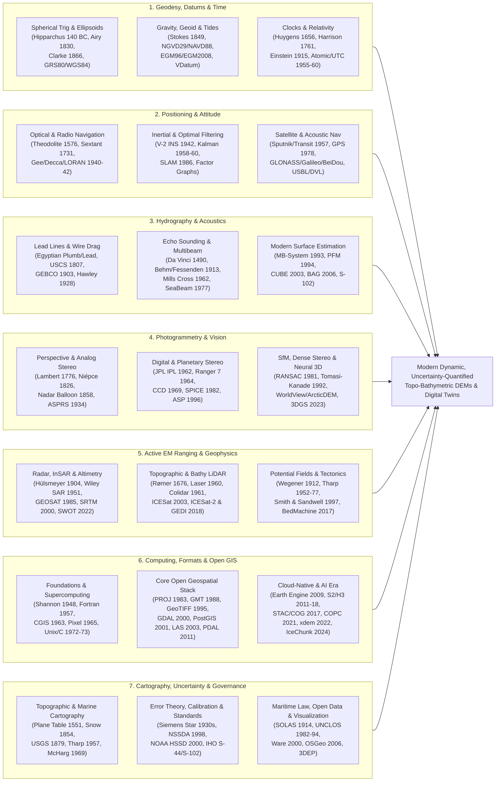

# 0.3.3 Master Historical Timeline: Geodesy, Positioning, Hydrography, Remote Sensing, and Geospatial Computing (`gis-history` Reference)

> **Why History Is an Operational Requirement in Elevation Modeling:** Unlike consumer software engineering—where five-year-old code is considered legacy—digital elevation and bathymetric models are cumulative historical artifacts. Over $40\%$ of coastal nautical charts still incorporate lead-line or early single-beam soundings governed by the 1928 and 1976 *Hydrographic Manuals*; flood insurance maps routinely reference vertical datums (NGVD29, NAVD88) leveled with optical spirit instruments; pre-urbanization and pre-glacier-retreat change detection relies on 1959–1984 declassified CORONA film; and modern cloud pipelines break daily when 1990s `PROJ.4` strings silently strip datum shifts from 2020s dynamic reference frames. Understanding *when* and *how* a measurement or software convention was created is the single most powerful forensic tool for diagnosing DEM errors.

---

## The Seven Converging Streams of Elevation Science

Modern three-dimensional Earth and planetary mapping did not emerge from a single discipline. Rather, it represents the mathematical and engineering convergence of seven distinct historical traditions, each contributing fundamental constraints to the governing equation of a surface coordinate $\mathbf{p}(t) = (x(t), y(t), z(t))$ and its covariance $\boldsymbol{\Sigma}_{\mathbf{p}}(t)$:

Every chapter in this handbook includes a dedicated **Historical Evolution (`gis-history` Context)** subsection that traces how the mathematical formulas, sensor architectures, and software tools of that chapter evolved. The master chronological timeline below synthesizes all milestones referenced across Chapters 1 through 35, linking each event to its physical or algorithmic impact and the handbook sections where it is examined in detail.

---

## Era I: Deep-Time Geological Baseline, Antiquity, and the Renaissance of Measurement (350 Ma – 1799)

*Before digital grids could exist, humanity had to establish the spherical and oblate geometry of the planet, invent gravity-referenced leveling and angular surveying instruments, prove that light travels at a finite velocity, and solve the marine longitude problem through mechanical horology.*

| Date / Period | Milestone, Pioneers, and Historical Context | Primary Domain | Physical, Mathematical, or Operational Impact on DEMs | Handbook Cross-References |
| :--- | :--- | :--- | :--- | :--- |
| **~350 Ma & ~200 Ma** | **Oldest Surviving Oceanic Crust & Magnetic Quiet Zones:** Remnant Carboniferous/Permian crust in the eastern Mediterranean Herodotus Basin (~340–350 Ma), oldest open-ocean Jurassic lithosphere (~180–200 Ma), and the Jurassic and Cretaceous Normal Superchron (121–83 Ma) magnetic quiet zones. | Geophysics & Bathymetry | Establishes the thermal subsidence age-depth ceiling of the ocean basins ($d \propto \sqrt{t}$ with flattening at $>80\text{ Myr}$) and explains why marine magnetic striping cannot constrain crustal age inside superchron quiet zones. | Ch. 4 (§4.3), Ch. 11 (§11.4, §11.5) |
| **~0.78 Ma (780 ka)** | **Brunhes–Matuyama Geomagnetic Reversal:** Most recent global $180^\circ$ polarity reversal of Earth's main geodynamo dipole field. | Geophysics & Geodesy | Provides the primary central-anomaly magnetic calibration stripe across global mid-ocean ridges used to measure plate spreading velocities ($\mathbf{v} = \boldsymbol{\Omega} \times \mathbf{r}$). | Ch. 4 (§4.1, §4.3), Ch. 11 (§11.4, §11.5) |
| **~2600 BC** | **Ancient Egyptian Plumb Bob, A-Frame Level, and Sounding Lead Line:** Gravity-aligned stone plumb bobs and tallow-armed lead lines used along the Nile and Mediterranean coast. | Surveying & Hydrography | Defines the local direction of the gravity vector $\mathbf{g} = \nabla W$ (the astronomical vertical, perpendicular to the geoid) and establishes discrete point-sampling of water depth $d$ and seabed substrate. | Ch. 1 (§1.4), Ch. 3 (§3.1), Ch. 5 (§5.1) |
| **~240 BC** | **Eratosthenes of Cyrene Measures Earth's Radius:** Uses summer solstice solar zenith angle difference ($\Delta \theta \approx 7.2^\circ$) between Syene and Alexandria and caravan pacing distance. | Geodesy | First quantitative determination of Earth's spherical radius ($R \approx 6,371\text{ km}$), establishing the scale of planetary curvature ($h_{\text{curv}} \approx \frac{s^2}{2R}$). | Ch. 2 (§2.1, §2.4) |
| **~206 BC** | **Invention of the Magnetic Compass (Han Dynasty China):** Lodestone spoon (*sinan*) aligning with Earth's horizontal magnetic field component, later adopted globally for maritime and land azimuths. | Positioning & Navigation | Introduces continuous azimuth reference relative to Magnetic North ($\text{MN}$), requiring time- and location-dependent magnetic declination corrections ($\delta_{\text{mag}}(x,y,t)$) on all topographic maps and compass traverses. | Ch. 5 (§5.1), Ch. 26 (§26.3) |
| **~140 BC** | **Hipparchus of Nicaea Formulates Spherical Trigonometry & the $(\varphi, \lambda)$ Graticule:** Develops chord tables and proposes a continuous planetary coordinate grid of latitude (*climata*) from solar altitude and longitude from simultaneous lunar eclipse timings. | Geodesy & Cartography | Creates the mathematical foundation for geographic coordinate reference systems $(\varphi, \lambda)$ and spherical triangle solution of geodetic networks. | Ch. 2 (§2.1, §2.4), Ch. 26 (§26.3) |
| **1490** | **Leonardo da Vinci's Underwater Acoustic Tube:** Notes that inserting a long tube into the water from a stopped ship allows detection of distant vessels by sound propagation through water. | Underwater Acoustics | First recorded scientific observation of low-attenuation acoustic wave propagation in the marine medium, foreshadowing passive and active sonar. | Ch. 10 (§10.1, §10.3) |
| **1551** | **Invention of the Surveying Plane Table (*Mensula*):** Described by Abel Foullon (1551) and Gemma Frisius; combines a leveled drawing board on a tripod with a sighting alidade. | Topographic Surveying | Enables direct graphical forward intersection, resection, and in-field contour sketching—serving as the primary topographic mapping instrument for four centuries until aerial photogrammetry. | Ch. 5 (§5.1), Ch. 26 (§26.2, §26.4) |
| **1562–1620** | **Early Submersible & Submarine Concepts:** From 1562 enclosed diving demonstrations and William Bourne's 1578 ballast-volume principles to Cornelis Drebbel's 1620 navigable Thames submarine. | Marine Platforms | Initiates submerged 3D navigation where electromagnetic signals fail and where uncharted bathymetric pinnacles pose existential collision risks. | Ch. 1 (§1.2), Ch. 7 (§7.4, §7.7) |
| **1569** | **Gerardus Mercator's Conformal World Map:** Publishes *Nova et Aucta Orbis Terrae Descriptio* with latitude spacing stretched by $\int \sec\varphi\,d\varphi = \ln\tan(\frac{\pi}{4} + \frac{\varphi}{2})$. | Map Projections | Preserves local angles ($\text{conformal}$) so constant-azimuth rhumb lines are straight, at the cost of isotropic scale inflation $k(\varphi) = \sec\varphi$ that severely distorts DEM pixel areas and naive planar slopes at high latitudes. | Ch. 2 (§2.2, §2.4), Ch. 26 (§26.3, §26.4) |
| **1576** | **Joshua Habermel's Integrated Theodolite:** Building on Leonard Digges's *theodelitus* (1571), constructs precision brass instruments combining azimuthal and zenith graduated circles. | Geodesy & Surveying | Enables simultaneous measurement of horizontal angles $\alpha$ and vertical zenith angles $z$ for 3D triangulation and trigonometric leveling ($\Delta H = s \cot z + \frac{1-k}{2R}s^2$). | Ch. 5 (§5.1), Ch. 7 (§7.1) |
| **1620** | **Edmund Gunter Invents Gunter's Chain:** A $66\text{-foot}$ ($4\text{-rod}$) iron chain divided into $100\text{ links}$ ($1\text{ link} = 7.92\text{ inches}$). | Surveying & Cadastre | Harmonizes English statutory land measures with decimal arithmetic ($10\text{ sq chains} = 1\text{ acre}$; $80\text{ chains} = 1\text{ statute mile}$), establishing the cadastral baseline for North American Public Land Survey System (PLSS) DEM alignments. | Ch. 2 (§2.3), Ch. 5 (§5.1) |
| **1656** | **Christiaan Huygens Invents the Pendulum Clock:** Applies isochronous pendulum mechanics ($T = 2\pi\sqrt{L/g}$) to regulate escapement timekeeping. | Timekeeping & Gravimetry | Increases timekeeping precision by two orders of magnitude and enables Jean Richer (1672) to discover that pendulum clocks run slower at the Equator ($g_{\text{eq}} < g_{\text{poles}}$), proving Earth's oblate ellipsoidal flattening. | Ch. 2 (§2.1), Ch. 5 (§5.1), Ch. 32 (§32.4) |
| **1676** | **Ole Rømer Demonstrates the Finite Speed of Light ($c$):** Measures systematic $\pm 8\text{-minute}$ phase leads/lags in eclipses of Jupiter's moon Io as Earth moves toward and away from Jupiter. | Physics of Ranging | Establishes the universal constant $c$ (defined exactly as $299,792,458\text{ m/s}$ in 1983) that converts electromagnetic time-of-flight $\Delta t$ into geometric range $R = \frac{c}{2 n_g}\Delta t$ in EDM, radar, GNSS, and LiDAR. | Ch. 5 (§5.1), Ch. 9 (§9.1, §9.4), Ch. 32 (§32.3, §32.4) |
| **1699** | **Isaac Newton's Reflecting Quadrant:** Presents a double-reflecting mirror instrument design to the Royal Society (published posthumously via Edmond Halley in 1742). | Celestial Navigation | Introduces double-reflection optics, allowing the horizon and a celestial body (or two terrestrial targets) to be brought into coincidence despite vessel pitch and roll. | Ch. 5 (§5.1) |
| **1731 & 1757** | **Invention of the Octant and Marine Sextant:** John Hadley and Thomas Godfrey independently invent the reflecting octant (1731); Capt. John Campbell extends the arc to $120^\circ$ to create the marine sextant (1757). | Hydrography & Navigation | Becomes both the primary open-ocean celestial latitude/lunar-distance instrument and the standard nearshore hydrographic positioning tool (measuring two horizontal angles between three shore signals plotted via a three-arm protractor). | Ch. 5 (§5.1), Ch. 13 (§13.4) |
| **1732** | **Early Discrete Binary / Bit Representations:** Early mathematical and mechanical binary encoding schemes building on Leibniz's *Explication de l'Arithmétique Binaire* (1703) and Bouchon/Falcon punched-paper loom controls (1725–1732). | Information & Computing | Precursor to discrete bit-depth quantization ($2^b$ levels) and digital representation of continuous mathematical functions. | Ch. 18 (§18.2, §18.5) |
| **1761** | **John Harrison's H4 Marine Chronometer Sea Trial:** Temperature-compensated high-beat pocket watch maintains time to within $5.1\text{ s}$ across an 81-day voyage from Portsmouth to Jamaica. | Positioning & Timekeeping | Solves the marine longitude problem ($\Delta \lambda = \omega_\oplus \Delta t_{\text{GMT}}$), allowing hydrographic survey ships to place offshore soundings on a global coordinate grid. | Ch. 5 (§5.1), Ch. 32 (§32.1, §32.4) |
| **1776** | **Mathematical Foundations of Photogrammetry:** Johann Heinrich Lambert publishes *Freye Perspective* (2nd ed. 1774/1776) formalizing inverse perspective geometry, soon applied by Beautemps-Beaupré (1791) to reconstruct coastal topography from shipboard perspective views. | Photogrammetry | Establishes the projective geometry of central perspective, vanishing points, and space resection/intersection from multiple 2D images. | Ch. 8 (§8.1, §8.3) |
| **1785** | **William Herschel's Star-Gauging & Galactic Coordinates:** Maps the 3D flattened disk geometry of the Milky Way, initiating galactic reference frames. | Planetary & Celestial Frames | Establishes non-terrestrial 3D coordinate system conventions later standardized by the IAU (1918/1958) for deep-space navigation and planetary orientation kernels. | Ch. 31 (§31.1, §31.4) |
| **1791–1853** | **Principal Triangulation of Great Britain:** Initiated by Major-General William Roy and the Board of Ordnance using Jesse Ramsden's $36\text{-inch}$ theodolite, steel baseline chains, and spherical excess adjustment. | Geodesy & National Mapping | Establishes the **Ordnance Survey (OS)** and demonstrates continent-scale high-precision geodetic triangulation networks and trigonometric heighting. | Ch. 2 (§2.1, §2.4), Ch. 26 (§26.2) |
| **1797** | **Alexander von Humboldt Discovers Strong Rock Magnetization:** Identifies intense remanent magnetic anomalies in serpentine outcrops of the Fichtelgebirge and initiates global geomagnetic intensity mapping. | Geophysics | Launches magnetic anomaly surveying, which later provides the key to seafloor spreading stripes, depth-to-basement estimation, and marine UXO/pipeline detection. | Ch. 11 (§11.4, §11.5) |

---

## Era II: Reference Ellipsoids, National Surveys, Photography, and Spatial Logic (1800 – 1899)

*The 19th century saw the founding of national hydrographic and geological survey agencies, the mathematical definition of regional reference ellipsoids, the birth of photography and balloon aerial imaging, the global standardization of the Greenwich Prime Meridian, and the discovery of space-filling curves.*

| Date / Period | Milestone, Pioneers, and Historical Context | Primary Domain | Physical, Mathematical, or Operational Impact on DEMs | Handbook Cross-References |
| :--- | :--- | :--- | :--- | :--- |
| **1807** | **Establishment of the U.S. Survey of the Coast:** Signed by President Thomas Jefferson on February 10, 1807, and led by Ferdinand Rudolph Hassler (later USC&GS, now NOAA NGS and Office of Coast Survey). | Hydrography & Geodesy | Establishes rigorous baseline triangulation, polyconic map projections, tidal observation networks, and systematic coastal hydrographic surveying in the United States. | Ch. 1 (§1.4), Ch. 3 (§3.1), Ch. 12 (§12.2, §12.5), Ch. 26 (§26.4) |
| **1826** | **First Permanent Camera Photograph:** Joseph Nicéphore Niépce captures *View from the Window at Le Gras* on bitumen-coated pewter, followed by Daguerre (1839) and Aimé Laussedat's terrestrial photogrammetry (1851). | Photogrammetry | Replaces manual perspective sketching with physical optical-chemical image recording, enabling metric stereophotogrammetry. | Ch. 8 (§8.1, §8.3) |
| **1830** | **Airy 1830 Reference Ellipsoid:** Astronomer Royal George Biddell Airy computes Earth's semi-major axis $a = 6,377,563.396\text{ m}$ and inverse flattening $1/f = 299.3249646$ from meridian and parallel arc measurements. | Geodesy | Serves as the mathematical reference surface for the Ordnance Survey of Great Britain (**OSGB36**, EPSG:27700) and British Admiralty charts for over 150 years. | Ch. 2 (§2.1, §2.4) |
| **1833** | **Installation of the *Buttermilk* Geodetic Survey Mark:** Set by Ferdinand Hassler's U.S. Coast Survey party on Buttermilk Hill, Westchester County, NY (station stamped `U.S.C.S.`). | Calibration & Monuments | Oldest surviving monumental geodetic triangulation station in the United States, illustrating two centuries of physical monumentation stability and datum re-occupation. | Ch. 3 (§3.4), Ch. 12 (§12.2, §12.5) |
| **1841** | **Bessel 1841 Reference Ellipsoid:** Friedrich Wilhelm Bessel applies least-squares adjustment to 10 meridian arcs ($a = 6,377,397.155\text{ m}, 1/f = 299.1528128$). | Geodesy | Becomes the foundational reference ellipsoid for Central European (DHDN/Potsdam), Japanese (Tokyo Datum), and Dutch triangulation networks. | Ch. 2 (§2.1) |
| **1854** | **Dr. John Snow's Soho Cholera Map:** Plots fatal cholera cases relative to London water pumps (with walking-time catchment boundary added in 1855), proving waterborne transmission at the Broad Street pump. | Spatial Analysis & GIS | Foundational demonstration of spatial point-pattern aggregation, network distance vs. Euclidean distance, and multi-layer causal inference. | Ch. 1 (§1.4) |
| **1855** | **James Gall's Stereographic Cylindrical Projection:** Projects the sphere from the antipodal equatorial point onto a secant cylinder cutting at $\pm 45^\circ$ latitude. | Map Projections | Demonstrates compromise and equal-area/stereographic alternatives to Mercator, highlighting how projection distortion alters high-latitude terrain representation. | Ch. 2 (§2.2, §2.4) |
| **1858** | **Nadar's First Aerial Photographs from a Tethered Balloon:** Gaspard-Félix Tournachon ("Nadar") photographs Petit-Bicêtre near Paris from $80\text{ m}$ altitude in a basket darkroom. | Airborne Platforms & Photogrammetry | Proves that nadir and oblique airborne photography can directly capture planimetric and topographic geometry, initiating airborne remote sensing. | Ch. 7 (§7.3, §7.7), Ch. 8 (§8.3) |
| **1861 & 1866** | **Clarke Reference Ellipsoids:** Capt. Alexander Ross Clarke (Ordnance Survey) publishes his 1861 figure-of-the-Earth models and the landmark **Clarke 1866 ellipsoid** ($a = 6,378,206.4\text{ m}, b = 6,356,583.8\text{ m}$). | Geodesy | Adopted by the USC&GS in 1880 and used to define **NAD27** across North America; shifting from Clarke 1866 (NAD27) to GRS80 (NAD83) displaces DEM pixels horizontally by $10\text{–}100+\text{ m}$. | Ch. 2 (§2.1, §2.4) |
| **1879** | **Formation of the United States Geological Survey (USGS):** Established March 3, 1879, under first director Clarence King (succeeded by John Wesley Powell in 1881). | National Mapping & Standards | Launches systematic national topographic contour mapping ($1:250,000 \to 1:62,500 \to 1:24,000$ $7.5\text{-minute}$ quadrangles) and later the National Elevation Dataset (NED) and 3DEP. | Ch. 1 (§1.4), Ch. 24 (§24.1, §24.3), Ch. 26 (§26.2, §26.4) |
| **1884** | **International Meridian Conference (Washington, D.C.):** 25 nations vote to adopt the Greenwich meridian as the universal **Prime Meridian ($0^\circ$ longitude)** and define the universal day. | Geodesy & Cartography | Ends the proliferation of national prime meridians (Paris, Ferro, Madrid, Washington, Pulkovo) that still cause longitudinal degree-offset blunders when digitizing 19th-century topographic maps and nautical charts. | Ch. 2 (§2.1, §2.4), Ch. 26 (§26.3, §26.4) |
| **1890 & 1891** | **Peano (1890) and Hilbert (1891) Space-Filling Curves:** Giuseppe Peano and David Hilbert construct continuous bijective mappings from the 1D interval $[0, 1]$ onto the 2D square $[0, 1]^2$. | Spatial Indexing & DGGS | The Hilbert curve's optimal locality bound ($\|\mathbf{p}(i) - \mathbf{p}(j)\|_2 \le \sqrt{6}\sqrt{|i-j|}$) directly powers **Google S2** 64-bit cell IDs, **COPC** point-cloud octree ordering, and cloud-native GeoParquet spatial sorting. | Ch. 15 (§15.2), Ch. 16 (§16.1, §16.4, §16.5) |
| **1894** | **Brunton Pocket Transit Patented:** Mining engineer David W. Brunton patents the compact induction-damped compass, clinometer, and mirror sight (US Patent 526,021). | Field Surveying | Standardizes rapid field measurement of terrain slope angle ($\alpha$), aspect ($\psi$), and structural strike/dip for geological mapping and DEM ground-truthing. | Ch. 5 (§5.1), Ch. 7 (§7.1) |

---

## Era III: Underwater Acoustics, Radio Navigation, Information Theory, and Early Computing (1900 – 1956)

*Driven by maritime disasters, two World Wars, and the birth of electronics, the early 20th century replaced mechanical sounding wires and optical triangulation with acoustic echo sounders, hyperbolic radio navigation, Synthetic Aperture Radar, atomic clocks, Kriging geostatistics, and the Nyquist–Shannon sampling theorem.*

| Date / Period | Milestone, Pioneers, and Historical Context | Primary Domain | Physical, Mathematical, or Operational Impact on DEMs | Handbook Cross-References |
| :--- | :--- | :--- | :--- | :--- |
| **1902** | **Founding of Atlas Elektronik (Bremen, Germany):** Established as *Norddeutsche Maschinen- und Armaturenfabrik*, pioneering submarine acoustic telegraphy and echo sounding. | Sonar Systems | Develops early merchant/hydrographic echosounders and later the **Krupp-Atlas Hydrosweep DS** deep-water multibeam series. | Ch. 10 (§10.2, §10.3) |
| **1903** | **Initiation of GEBCO (General Bathymetric Chart of the Oceans):** Founded by Prince Albert I of Monaco with a commission of geographers and oceanographers. | Global Bathymetry | Creates the enduring international governance body (now joint IHO–IOC, leading **Seabed 2030**) responsible for compiling global ocean bathymetry from wire soundings (1st ed., 18,400 points) to modern 15-arcsecond grids. | Ch. 1 (§1.4), Ch. 23 (§23.3), Ch. 24 (§24.2, §24.3), Ch. 26 (§26.4) |
| **1904** | **First Radar Patent and Demonstration (Christian Hülsmeyer):** Demonstrates the *Telemobiloskop* in Cologne and Rotterdam, detecting ships via reflected electromagnetic waves. | Radar & Remote Sensing | Establishes active electromagnetic reflection ranging, the progenitor of radar altimetry, airborne IFSAR, and spaceborne InSAR. | Ch. 11 (§11.1, §11.5) |
| **1912 (Jan)** | **Alfred Wegener Proposes Continental Drift:** Presents geophysical, paleoclimatic, and bathymetric continental-margin fit evidence that continents move horizontally over geological time. | Crustal Deformation | Overturns the static-Earth assumption, leading to plate kinematics and time-dependent coordinate reference frames ($X(t) = X(t_0) + \mathbf{v}(t - t_0)$). | Ch. 4 (§4.1, §4.3) |
| **1912 (Apr) & 1914** | **Sinking of the *RMS Titanic* (1912) & First SOLAS Convention (1914):** *Titanic* strikes an iceberg on April 14–15, 1912; maritime nations adopt the **International Convention for the Safety of Life at Sea (SOLAS)** in 1914. | Maritime Safety & Law | Directly motivates the invention of active acoustic echo ranging and establishes mandatory international obligations for hydrographic charting, hazard warnings, and later AIS carriage. | Ch. 1 (§1.2, §1.4), Ch. 10 (§10.3), Ch. 27 (§27.1, §27.5) |
| **1913** | **First Acoustic Echo Sounder Patent (Alexander Behm & Reginald Fessenden):** Behm patents the *Behm-Echolot* in Germany (1913) while Fessenden tests his electrodynamic fathom-oscillator in Boston (1913–1914) and Paul Langevin develops piezoelectric quartz sonar (1917). | Hydrography & Sonar | Replaces stationary multi-hour deep-sea wire casts with underway acoustic travel-time measurement ($d = \frac{1}{2}\bar{c}\Delta t$), increasing sounding productivity by orders of magnitude while introducing sound-speed refraction and beam-cone slope biases. | Ch. 10 (§10.1–§10.3), Ch. 29 (§29.4) |
| **1915** | **Albert Einstein Publishes General Relativity:** Formulates curved spacetime gravitation ($G_{\mu\nu} = \frac{8\pi G}{c^4}T_{\mu\nu}$) and gravitational frequency shift. | Relativistic Geodesy & Timing | Predicts that satellite atomic clocks at $r \approx 26,560\text{ km}$ run faster by $+45.7\text{ \mu s/day}$ (net $+38.6\text{ \mu s/day}$ after $-7.1\text{ \mu s/day}$ Special Relativity velocity dilation)—without which GNSS elevations would drift by $>11\text{ km/day}$! Also links geopotential differences directly to optical atomic clock frequency ratios ($\frac{\Delta f}{f} = \frac{\Delta W}{c^2}$). | Ch. 3 (§3.1), Ch. 5 (§5.2), Ch. 32 (§32.3–§32.5) |
| **1917** | **Standardization of Nautical Time Zones at Sea:** Anglo-French conference adopts 24 hourly maritime time zones ($\text{GMT} \pm 1\dots 12\text{ hr}$) across the world's oceans. | Timekeeping & Navigation | Eliminates arbitrary ship-local apparent time in deck logs and tidal reduction records during hydrographic cruises. | Ch. 5 (§5.1), Ch. 32 (§32.4) |
| **1918** | **Harlow Shapley Maps the Galactic Center:** Uses Cepheid variables in globular clusters to establish the Sun's eccentric position in the Milky Way and refine Galactic coordinates. | Celestial Reference Frames | Advances extrasolar coordinate systems and inertial star-tracker orientation frames used by spacecraft. | Ch. 31 (§31.4) |
| **1927 & 1929** | **North American Datum of 1927 (NAD27) & Sea Level Datum of 1929 (NGVD29):** Continental horizontal network adjustment anchored at Meades Ranch, KS (Clarke 1866) and spirit-leveling adjustment held fixed to 26 coastal tide gauges. | Horizontal & Vertical Datums | Defines the coordinate system of virtually all 20th-century USGS $7.5'$ topographic maps and legacy DEMs; converting legacy NGVD29/NAD27 DEMs to NAVD88/NAD83 requires `VERTCON` and `NADCON` grid shifts. | Ch. 2 (§2.1, §2.4), Ch. 3 (§3.1) |
| **1928** | **Hawley's USC&GS *Hydrographic Manual* & IAU Universal Time (UT):** Jean-Henri Hawley publishes USC&GS Special Publication 143 codifying hydrographic survey standards; the IAU formalizes **Universal Time (UT)**. | Hydrographic Standards & Time | Documents the exact operational procedures, sounding-line spacings, lead-line graduations, and radio-acoustic ranging (RAR) error budgets needed to evaluate pre-WWII bathymetry. | Ch. 3 (§3.4), Ch. 5 (§5.1), Ch. 13 (§13.4), Ch. 24 (§24.1, §24.3), Ch. 32 (§32.4) |
| **1929 (Nov 18)** | **Grand Banks Earthquake & Submarine Turbidity Current Cable Break:** $M_w\text{ 7.2}$ earthquake off Newfoundland triggers a massive submarine slump and high-velocity ($>20\text{ m/s}$) turbidity current that sequentially breaks 12 transatlantic telegraph cables over $600\text{ km}$. | Marine Geomorphology & Hazards | Proves (via Heezen & Ewing 1952) that deep submarine canyons are actively carved by catastrophic sediment flows, establishing why subsea fiber-optic cable routing requires high-resolution multibeam DEMs and slope-stability analysis. | Ch. 1 (§1.2, §1.4), Ch. 22 (§22.1, §22.5), Ch. 29 (§29.4) |
| **1930s** | **Invention of the Siemens Star Optical Test Target:** Siemens & Halske introduce the radial spoke star pattern ($r\theta$ square-wave grating whose spatial frequency $f = \frac{N}{2\pi r}$ varies continuously from $\infty$ at the center to 0 at the rim). | Sensor Calibration & Resolution | Provides a single compact target for measuring omnidirectional Point Spread Function (PSF), Modulation Transfer Function (MTF), and azimuthal blur of aerial/satellite cameras. | Ch. 12 (§12.2, §12.5), Ch. 18 (§18.1, §18.5) |
| **1931** | **Founding of Simrad (now Kongsberg Maritime):** Founded in Oslo by Willy Simonsen as *Simonsen Radio*, evolving into the premier manufacturer of scientific and hydrographic multibeam sonars. | Sonar Systems | Produces the industry-standard Kongsberg `EM` multibeam family (`EM122`, `EM304`, `EM712`, `EM2040`) and `.all`/`.kmall` data formats. | Ch. 10 (§10.2, §10.3), Ch. 19 (§19.1) |
| **1934** | **Founding of the American Society of Photogrammetry (ASP / ASPRS):** Twelve photogrammetric pioneers meet in Washington, D.C., to form ASP. | Photogrammetry & Standards | Establishes camera calibration standards, photogrammetric stereoplotter workflows, the **LAS point cloud specification**, and the **ASPRS Positional Accuracy Standards** (NVA/VVA). | Ch. 8 (§8.3), Ch. 12 (§12.4, §12.9), Ch. 24 (§24.1) |
| **1940–1942** | **Hyperbolic Radio Navigation: Gee (1940), Project 3 (1940), Decca (1942), and LORAN (1942):** Robert Dippy (UK Gee), Alfred Loomis / MIT Rad Lab (Project 3 $\to$ LORAN pulsed time-difference), and William O'Brien (Decca phase-comparison) deploy all-weather radio navigation. | Positioning & Navigation | Allows hydrographic ships and survey aircraft to determine positions far beyond visual sight of land by intersecting hyperbolic lines of constant range difference ($\Delta R = c \Delta t$). | Ch. 5 (§5.1) |
| **1941 & 1945** | **First Programmable Digital Computers: Zuse Z3 (1941) & ENIAC (1945):** Konrad Zuse completes the binary floating-point electromechanical Z3 in Berlin; J. Presper Eckert and John Mauchly complete the electronic ENIAC in Philadelphia. | Computing Architecture | Launches numerical matrix inversion, digital ballistic/geodetic triangulation adjustment, and automated coordinate transformation. | Ch. 34 (§34.1) |
| **1942** | **Universal Transverse Mercator (UTM) Grid & First Inertial Navigation System (INS):** UTM $6^\circ$ conformal zoning adopted for military mapping; Helmut Hoelzer and Fritz Mueller build the first gyroscopic platform + analog integrator INS on the V-2 rocket. | Projections & Inertial Navigation | **UTM** provides the standard metric planar coordinate system for regional DEM gridding; **INS** establishes strapdown/gimbaled dead reckoning ($\iint \mathbf{a}\,dt^2$) essential for bridging GNSS dropouts and measuring high-frequency sensor roll/pitch/heave. | Ch. 2 (§2.2, §2.4), Ch. 5 (§5.1, §5.3), Ch. 26 (§26.4) |
| **1948** | **Claude Shannon's *A Mathematical Theory of Communication*:** Formalizes information entropy, noisy channel coding, and the **Nyquist–Shannon Sampling Theorem** ($f_s \ge 2 f_{\max}$). | Resolution, Aliasing & Compression | Proves mathematically that a DEM with grid spacing $\Delta x$ cannot resolve terrain wavelengths shorter than the Nyquist limit $\lambda_{\min} = 2\Delta x$, explains aliasing when downsampling without low-pass filtering, and provides the entropy bound for lossless `LAZ` and `ZSTD`/`DEFLATE` DEM compression. | Ch. 14 (§14.3, §14.4), Ch. 18 (§18.1, §18.5, §18.9), Ch. 19 (§19.6) |
| **1949 & 1955** | **Invention of Atomic Clocks (Ammonia 1949, Cesium 1955, Atomichron 1956):** Harold Lyons (NBS, 1949) builds the first ammonia maser/absorption clock; Louis Essen & Jack Parry (NPL, 1955) build the first practical cesium-133 hyperfine transition clock ($9,192,631,770\text{ Hz}$). | Timekeeping & GNSS | Enables nanosecond-accurate time synchronization across spaceborne constellations, making passive one-way pseudorange and carrier-phase GNSS positioning physically possible. | Ch. 5 (§5.1, §5.2), Ch. 32 (§32.1, §32.4) |
| **1951** | **Carl Wiley Invents Synthetic Aperture Radar (SAR), Danie Krige Founds Geostatistics, & UNIVAC I:** Wiley patents Doppler beam sharpening (SAR); Krige publishes lognormal gold-grade spatial estimation in South Africa; UNIVAC I enters service. | Radar, Geostatistics & Computing | **SAR** allows spaceborne radar to achieve meter-scale azimuth resolution independent of orbit altitude; **Kriging** introduces variogram-based optimal linear unbiased interpolation ($\hat{z}(\mathbf{x}_0)$) with explicit estimation variance $\sigma_K^2(\mathbf{x}_0)$. | Ch. 11 (§11.1, §11.5), Ch. 15 (§15.3), Ch. 33 (§33.1, §33.4), Ch. 34 (§34.1) |
| **1952, 1957 & 1977** | **Marie Tharp & Bruce Heezen Map the Global Ocean Floor:** Tharp discovers the axial rift valley of the Mid-Atlantic Ridge from continuous echo-sounder profiles (1952), publishing the *Physiographic Diagram of the North Atlantic* (1957) and the *World Ocean Floor* panorama with Heinrich Berann (1977). | Marine Cartography & Tectonics | Reveals the continuous $65,000\text{ km}$ mid-ocean ridge system, fracture zones, and abyssal plains—overcoming Cold War classification restrictions on raw bathymetric contours through scientifically rigorous physiographic rendering. | Ch. 1 (§1.2, §1.4), Ch. 26 (§26.4), Ch. 35 (§35.4) |
| **1956** | **P. M. S. Blackett's Astatic Magnetometer & Paleomagnetism:** Nobel laureate Patrick Blackett develops ultra-sensitive magnetometers to measure weak remanent magnetization in rocks. | Geophysics & Plate Motion | Provides quantitative paleolatitude measurements proving continental drift and inspiring marine proton-precession and fluxgate magnetometers. | Ch. 11 (§11.4, §11.5) |

---

## Era IV: The Space Age, Lasers, Multibeam Sonar, Kalman Filtering, and the Birth of GIS (1957 – 1979)

*Between 1957 and 1979, every core pillar of modern elevation technology was invented: artificial satellites (Sputnik, CORONA, Landsat, GPS Block I), the laser and LiDAR rangefinder, the Kalman filter, multibeam swath sonar (SASS / SeaBeam), digital image processing (JPL VICAR, the "pixel", CCDs), and both raster and topological vector GIS (CGIS, GIRAS, TINs).*

| Date / Period | Milestone, Pioneers, and Historical Context | Primary Domain | Physical, Mathematical, or Operational Impact on DEMs | Handbook Cross-References |
| :--- | :--- | :--- | :--- | :--- |
| **1957** | **IGY, Tellurometer EDM, FORTRAN, and Launch of Sputnik 1 (Oct 4, 1957):** International Geophysical Year launches global polar/ocean surveys; Trevor Wadley invents the Tellurometer microwave EDM; IBM releases FORTRAN; USSR launches Sputnik 1, whose Doppler shift is inverted by Guier & Weiffenbach at APL to create satellite navigation (**TRANSIT**). | Space Geodesy, Surveying & Computing | Replaces manual baseline taping with microwave Electronic Distance Measurement, launches scientific Fortran libraries (`GCTP`, `LAPACK`), and proves that tracking radio frequency shifts from orbiting satellites can determine 3D ground coordinates anywhere on Earth. | Ch. 5 (§5.1), Ch. 7 (§7.5, §7.7), Ch. 30 (§30.3), Ch. 34 (§34.1) |
| **1958–1960** | **Invention of the Kalman Filter (Peter Swerling & Rudolf E. Kálmán):** Swerling (1958) and Kálmán (1960) derive recursive minimum-variance state estimation for linear dynamical systems. | Trajectory Estimation, SLAM & Gridding | Becomes the universal mathematical engine for loosely/tightly coupled GNSS/INS navigation (EKF/RTS smoother), EKF-SLAM, and sequential Bayesian bathymetric gridding (CUBE). | Ch. 5 (§5.1, §5.3, §5.8), Ch. 6 (§6.1, §6.3), Ch. 14 (§14.4), Ch. 15 (§15.3, §15.7) |
| **1959** | **Bézier Curves & Launch of the CORONA (Keyhole) Reconnaissance Satellites:** De Casteljau and Bézier formulate parametric polynomial splines; the US launches the classified CORONA film-return stereo satellite program (KH-1 to KH-9 Hexagon, 1959–1984). | Vector Geometry & Historical Stereo DEMs | **Bézier/B-splines** underpin CAD/GIS surface modeling; **CORONA/Hexagon** declassified panoramic stereo film (1995/2002) enables $2\text{–}8\text{ m}$ DEM reconstruction of global glaciers, faults, and cities from the 1960s–1970s via modern bundle adjustment in ASP. | Ch. 7 (§7.5, §7.7), Ch. 8 (§8.1), Ch. 17 (§17.5) |
| **1960** | **First Laser (Theodore Maiman), UTC Coordination, $M_w\text{ 9.5}$ Valdivia Earthquake, & Seafloor Spreading:** Maiman fires the first ruby laser (May 16); UTC time coordination begins; the Great Chilean Earthquake ruptures $1,000\text{ km}$ of subduction zone (May 22); Harry Hess circulates his seafloor spreading paper. | LiDAR Physics, Time & Tectonics | The **laser** provides coherent, narrow-divergence nanosecond optical pulses for LiDAR; the **Valdivia earthquake** demonstrates meter-scale coseismic vertical datum deformation and trans-oceanic tsunami propagation. | Ch. 4 (§4.2, §4.3), Ch. 5 (§5.1), Ch. 9 (§9.1, §9.4), Ch. 11 (§11.5), Ch. 32 (§32.1, §32.4) |
| **1961** | **First LiDAR System Built (Hughes Aircraft *Colidar*):** Malcolm Stitch and team couple a Q-switched ruby laser with a photoelectric receiver and counter to measure target range by optical time-of-flight. | LiDAR Systems | Inaugurates active laser ranging ($R = \frac{1}{2}c\Delta t$), evolving from single-point airborne laser profilers in the late 1960s/1970s to scanning multi-return, full-waveform, and photon-counting LiDAR. | Ch. 9 (§9.1, §9.4) |
| **1962** | **Multibeam Sonar Patent (US3144631A), Vine–Matthews–Morley Hypothesis, & JPL Image Processing Lab:** General Instrument Corp. files the crossed-fan multibeam sonar patent (*Submarine radiation mapping system*); Vine, Matthews, and Morley link marine magnetic stripes to geomagnetic reversals; Robert Nathan founds the JPL IPL. | Multibeam Sonar, Geophysics & Digital Imaging | **Mills Cross multibeam architecture** orthogonalizes a narrow along-track transmit fan with an across-track receive beamforming array to measure dozens to hundreds of simultaneous depth soundings across a wide swath. | Ch. 4 (§4.3), Ch. 8 (§8.3), Ch. 10 (§10.2, §10.3), Ch. 11 (§11.4, §11.5), Ch. 28 (§28.4), Ch. 31 (§31.4) |
| **1963** | **Canada Geographic Information System (CGIS — Roger Tomlinson):** Commissioned for the Canada Land Inventory to digitize, store, and analyze national land-capability maps. | GIS Foundations | Coins the term **GIS**, introduces digital drum scanning, topological arc-polygon storage, map projection normalization, and Morton Z-order spatial indexing of continental tiles. | Ch. 1 (§1.4) |
| **1964** | **NASA Ranger 7 Lunar Impact Imaging:** Transmits 4,308 high-resolution television images down to $<0.5\text{ m}$ resolution prior to lunar impact, processed digitally at JPL. | Planetary Photogrammetry & Photoclinometry | Catalyzes digital radiometric calibration, geometric reseau-mark rectification, and photoclinometry (Shape-from-Shading) to extract lunar landing-site DEMs. | Ch. 7 (§7.5, §7.7), Ch. 8 (§8.3), Ch. 31 (§31.2, §31.4) |
| **1965** | **Fred Billingsley Coins "Pixel" at JPL & Harvard Lab for Computer Graphics Founded:** Billingsley publishes the term *pixel* (picture element); Howard Fisher founds the Harvard Lab (developing *SYMAP* and *SYMVU* 3D perspective terrain plots). | Raster Representation & Visualization | Formalizes the discrete 2D raster matrix representation of continuous spatial fields and introduces automated 3D wireframe and hillshaded terrain visualization. | Ch. 15 (§15.3, §15.6), Ch. 18 (§18.1, §18.5), Ch. 25 (§25.5) |
| **1966** | **NASA JPL Releases VICAR (*Video Image Communication and Retrieval*):** Comprehensive batch processing system and self-describing binary raster format for planetary missions (Mariner, Viking, Voyager, Cassini). | Raster Formats & Pipelines | Establishes the paradigm of modular command-line raster pipelines and embedded ASCII key-value metadata headers in scientific imagery and DEMs. | Ch. 8 (§8.3), Ch. 19 (§19.1, §19.5), Ch. 31 (§31.4), Ch. 34 (§34.1) |
| **1967** | **Experimental Cartography Unit (ECU) Founded in London:** Directed by David Bickmore at the Royal College of Art. | Digital Cartography | Pioneers high-accuracy vector contour digitization, automated cartographic generalization, and perceptual terrain relief experiments. | Ch. 25 (§25.5), Ch. 26 (§26.2) |
| **1969** | **Ian McHarg's *Design with Nature*, Invention of the CCD, CHAYKA, & Founding of Esri:** McHarg formalizes multi-layer ecological suitability overlay; Boyle & Smith invent the CCD at Bell Labs; USSR deploys CHAYKA radio navigation; Jack & Laura Dangermond found Esri. | GIS Methodology & Optical Sensors | **McHarg's overlay paradigm** defines how DEM derivatives (slope, aspect, flood stage, viewshed) are combined in planning; the **CCD** enables digital photogrammetric cameras and pushbroom satellite scanners. | Ch. 1 (§1.1, §1.4, §1.8), Ch. 5 (§5.1), Ch. 8 (§8.1, §8.3) |
| **1970** | **Formation of NOAA, Unix Epoch 0 (`1970-01-01T00:00:00Z`), & ISO 3166 WG:** NOAA consolidates US ocean, coastal, and geodetic agencies; Unix defines integer/float seconds since Jan 1, 1970; ISO initiates standardized country codes. | Governance, Timing & Geocoding | Unites US hydrographic charting, tide gauges, and geodetic vertical datums under NOAA; **Unix time** becomes the ubiquitous (though leap-second-ambiguous) computing timestamp. | Ch. 16 (§16.3, §16.4), Ch. 24 (§24.1, §24.3), Ch. 32 (§32.1, §32.4) |
| **1972** | **Launch of Landsat 1 (ERTS-1), Apollo 17 Lunar Sounding & Field Geology (Jack Schmitt), & the C Language:** Landsat 1 launches civilian multispectral Earth observation (July 23); Apollo 17 conducts orbital laser altimetry, VHF radar sounding, and geologist Harrison "Jack" Schmitt's lunar field survey (Dec); Dennis Ritchie creates C at Bell Labs. | Satellite Remote Sensing, Planetary Altimetry & Systems Code | **Landsat** inaugurates continuous global land-cover and coastal optical monitoring; **Apollo 17** demonstrates orbital laser altimetry + crossover orbit adjustment + in-situ planetary ground truth; **C** becomes the systems foundation for PROJ, GDAL, GEOS, and GMT. | Ch. 7 (§7.5, §7.7), Ch. 11 (§11.3, §11.5), Ch. 31 (§31.1, §31.4), Ch. 34 (§34.1) |
| **1973** | **Unix Rewritten in C, SCCS Version Control, FAA ATCRBS, & USGS GIRAS:** Unix becomes portable; Rochkind creates SCCS; ATCRBS radar transponders standardize aircraft altitude reporting; USGS builds GIRAS with topological arc-node polygons and LULC classes. | Computing, Aviation Tracking & Vector Topology | **GIRAS** establishes topological vector polygon checking and hierarchical land-cover ontologies; **ATCRBS** lays the foundation for ADS-B aircraft trajectory filtering in airborne/satellite remote sensing. | Ch. 17 (§17.2, §17.5), Ch. 20 (§20.5), Ch. 22 (§22.2, §22.5), Ch. 34 (§34.1) |
| **1974** | **Invention of the Quadtree (Finkel & Bentley), Civilian LORAN-C, & FIPS Codes:** Finkel & Bentley publish the Quadtree spatial tree; LORAN-C designated for civilian marine navigation; US standardizes FIPS geographic codes. | Multi-Resolution Data Structures | **Quadtrees** enable adaptive spatial subdivision ($1 \to 4$ recursive child cells), forming the basis of Variable-Resolution grids, terrain mesh LoD rendering (RTIN/Quantized-Mesh), and Google S2. | Ch. 5 (§5.1), Ch. 15 (§15.4, §15.6), Ch. 16 (§16.1, §16.3, §16.4), Ch. 19 (§19.5) |
| **1975** | **Delivery of the Cray-1 Vector Supercomputer:** Seymour Cray introduces vector registers and $160\text{ MFLOPS}$ high-throughput scientific computing. | High-Performance Computing | Enables numerical hydrodynamic storm-surge, tsunami, and geopotential spherical harmonic modeling on regional and global grids. | Ch. 34 (§34.1) |
| **1976** | **Publication of the NOAA *Hydrographic Manual* (4th Edition — Melvin J. Umbach):** Comprehensive modernization of US hydrographic survey specifications for electronic positioning and automated single-beam logging. | Hydrographic Standards | Defines the quantitative accuracy tolerances, sounding density rules, and vertical reduction formulas for late-20th-century hydrographic smooth sheets. | Ch. 13 (§13.4), Ch. 24 (§24.1, §24.3), Ch. 29 (§29.4) |
| **1977** | **SeaBeam Classic Commercial Multibeam, Parsons & Sclater Depth-Age Law, Tharp World Ocean Panorama, & IDL:** General Instrument delivers the 16-beam SeaBeam multibeam sonar for research vessels; Parsons & Sclater prove $d(t) \propto \sqrt{t}$; Tharp & Heezen publish the global ocean floor map; David Stern creates IDL. | Multibeam Bathymetry & Marine Geophysics | **SeaBeam** transitions academic and hydrographic ocean mapping from 1D profiles to 2D swath contour strips, revealing mid-ocean ridge segment offsets, propagating rifts, and seamount chains. | Ch. 1 (§1.4), Ch. 4 (§4.1, §4.3, §4.7), Ch. 10 (§10.2, §10.3), Ch. 26 (§26.4), Ch. 28 (§28.4), Ch. 34 (§34.1) |
| **1978** | **Launch of First GPS Block I Satellite (Feb 22) & Peucker et al. TIN Paper:** Navstar 1 launches spaceborne atomic-clock navigation; Peucker, Fowler, Little, and Mark publish *The Triangulated Irregular Network (TIN)*. | GNSS Positioning & Surface Representations | **GPS** begins the revolution in 3D space-geodetic positioning; **TINs** allow elevation surfaces to adapt vertex density to terrain curvature and enforce hard breaklines along ridges, streams, and road edges. | Ch. 5 (§5.1, §5.2), Ch. 15 (§15.3, §15.6, §15.10) |
| **1979** | **Corbett's *Topological Principles in Cartography*, MOSS GIS, CARIS Founded at UNB, MATLAB, & Early NTP:** James Corbett formalizes algebraic topology for digital maps; USFWS deploys MOSS; CARIS forms at UNB; Cleve Moler creates MATLAB; David Mills begins network clock synchronization (NTP). | Vector Topology, Hydrographic Software & Computing | **Corbett's topology** prevents polygon slivers and gaps; **CARIS** becomes a foundational commercial hydrographic processing suite; **NTP** introduces network time synchronization (and highlights why software millisecond NTP is insufficient for microsecond sonar/LiDAR attitude). | Ch. 10 (§10.3, §10.5), Ch. 17 (§17.2, §17.5, §17.9), Ch. 32 (§32.2, §32.4), Ch. 34 (§34.1) |

---

## Era V: Space Geodesy, Open-Source Foundations (PROJ, GMT, MB-System, GDAL), and Global Altimetry (1980 – 1999)

*During the 1980s and 1990s, geocentric reference frames (GRS80, WGS84, ITRF) and satellite radar altimeters (GEOSAT, TOPEX/Poseidon) unified the globe, while visionary scientist-programmers created the open-source libraries (`PROJ`, `GMT`, `MB-System`, `libtiff`/`GeoTIFF`) and standards (`RINEX`, `NMEA 0183`, `WKT`, `FGDC`) that still run the geospatial world today.*

| Date / Period | Milestone, Pioneers, and Historical Context | Primary Domain | Physical, Mathematical, or Operational Impact on DEMs | Handbook Cross-References |
| :--- | :--- | :--- | :--- | :--- |
| **1980** | **Adoption of GRS80 Ellipsoid, USGS GCTP (Snyder & Elassal), & GPS Time Zero (`1980-01-06`):** IUGG adopts the geocentric GRS80 ellipsoid; USGS releases the Fortran General Cartographic Transformation Package; GPS continuous timescale begins. | Geodesy, Projections & Timing | **GRS80** provides the metric ellipsoid underlying NAD83, ETRS89, and ITRF; **GPS Time** runs continuously without leap seconds ($\text{TAI} - \text{GPST} = 19\text{ s}$ constant; $\text{GPST} - \text{UTC} = 18\text{ s}$ since 2017, causing catastrophic $1\text{ km}$ trajectory shifts if mixed in airborne LiDAR/sonar processing). | Ch. 2 (§2.1, §2.4), Ch. 32 (§32.1, §32.4) |
| **1981** | **RANSAC (Fischler & Bolles), FITS Raster Standard, & Founding of Silicon Graphics (SGI):** Fischler & Bolles publish Random Sample Consensus; astronomy adopts FITS; Jim Clark founds SGI. | Computer Vision, Formats & 3D Graphics | **RANSAC** enables automated outlier rejection in SfM epipolar geometry and point-cloud plane segmentation; **FITS** pioneers self-describing multi-extension scientific rasters; **SGI** workstations enable interactive 3D terrain rendering. | Ch. 6 (§6.3), Ch. 8 (§8.2, §8.3), Ch. 19 (§19.1, §19.4, §19.5), Ch. 22 (§22.4, §22.5), Ch. 25 (§25.5), Ch. 31 (§31.4) |
| **1982** | **GLONASS Launch, UNCLOS Signed, Esri ARC/INFO, GRASS GIS, JPL SPICE, PostScript, & RCS:** USSR launches first GLONASS satellite; UNCLOS signed; ARC/INFO 1.0 and US Army CERL GRASS GIS begin; JPL initiates SPICE; Adobe creates PostScript; Tichy releases RCS. | GNSS, Maritime Law, GIS & Planetary Geometry | **UNCLOS Article 76** makes continental-slope bathymetry a trillion-dollar geopolitical instrument; **GRASS GIS** provides open-source raster terrain/hydrology modules (`r.watershed`, `r.slope.aspect`); **JPL SPICE** standardizes rigorous spacecraft/sensor attitude and ephemeris kernels. | Ch. 1 (§1.2, §1.6), Ch. 3 (§3.3), Ch. 5 (§5.1, §5.2), Ch. 17 (§17.5), Ch. 26 (§26.4), Ch. 27 (§27.1, §27.5, §27.9), Ch. 31 (§31.1, §31.4), Ch. 34 (§34.1) |
| **1983** | **Gerald I. Evenden Releases PROJ at the USGS:** Written to support marine and continental cartographic projections on Unix workstations. | Coordinate Reference Systems | Evolves into the universal open-source geodetic and cartographic engine (**PROJ**) embedded inside GDAL, QGIS, PostGIS, PyPROJ, R, and virtually all modern GIS software. | Ch. 2 (§2.4, §2.6) |
| **1984** | **WGS84 & EGM84 Defined, NMEA 0183 Released, Landsat 5 Launched, & X11 Window System:** DMA defines the global WGS84 datum and EGM84 geoid; NMEA standardizes marine serial ASCII messages; Landsat 5 begins its 29-year mission. | Global Datums & Sensor Interfaces | **WGS84** unifies global satellite navigation (though its evolution through six realizations `G730`–`G2296` creates $\sim 1.5\text{ m}$ ensemble ambiguity when treated as static); **NMEA 0183** standardizes real-time position/depth/time logging (`$GPGGA`, `$GPZDA`). | Ch. 2 (§2.1, §2.4, §2.7), Ch. 3 (§3.1, §3.4), Ch. 5 (§5.1), Ch. 7 (§7.5, §7.7), Ch. 19 (§19.1, §19.5), Ch. 32 (§32.2, §32.4), Ch. 34 (§34.1) |
| **1985** | **Launch of GEOSAT Radar Altimeter, EPSG Dataset Initiated, & Intergraph CAD-GIS:** US Navy launches GEOSAT (March 12); European Petroleum Survey Group begins compiling its geodetic parameter database. | Satellite Altimetry & CRS Registries | **GEOSAT** maps global sea-surface gravity slopes at unprecedented density; the **EPSG registry** provides the numeric authority codes (`EPSG:4326`, `EPSG:4979`, `EPSG:32610`) that prevent projection ambiguity. | Ch. 2 (§2.4), Ch. 3 (§3.4), Ch. 7 (§7.5), Ch. 11 (§11.2, §11.4, §11.5), Ch. 20 (§20.5), Ch. 24 (§24.3), Ch. 30 (§30.3) |
| **1986** | **Smith & Cheeseman SLAM Paper, Etak In-Car Navigation, Swedish Digital Cadastre, & Archival Fish Tags:** Smith & Cheeseman publish stochastic mapping (SLAM); Etak launches map-matched dead-reckoning car navigation; Sweden completes the first national digital cadastre; marine archival depth tags deployed. | SLAM, Mobile Navigation & Cadastres | Establishes the joint state-and-landmark covariance matrix estimation of **SLAM** ($\mathcal{X}, \mathcal{L}$), enabling mapping in GNSS-denied caves, forests, tunnels, and undersea environments. | Ch. 5 (§5.1), Ch. 6 (§6.1, §6.3, §6.7), Ch. 7 (§7.4, §7.7), Ch. 27 (§27.5) |
| **1987** | **Snyder's *Map Projections—A Working Manual* (USGS PP 1395), NASA GCMD Keywords, & MIT License:** John P. Snyder publishes the definitive mathematical reference on map projections; NASA establishes GCMD metadata keywords; MIT License released. | Map Projections, Metadata & Open Licensing | **USGS PP 1395** provides exact ellipsoidal projection formulas, scale factor ($k, h$) derivatives, and numerical test tables used to verify `PROJ` and commercial projection engines. | Ch. 2 (§2.2, §2.4, §2.8), Ch. 19 (§19.2, §19.5), Ch. 27 (§27.1, §27.5) |
| **1988** | **Wessel & Smith Release GMT (Generic Mapping Tools) & Unidata Releases NetCDF 1.0:** Paul Wessel and Walter H. F. Smith create GMT at LDEO; Unidata releases NetCDF. | Gridding, Cartography & Array Formats | Introduces Smith & Wessel's **continuous curvature splines in tension (`surface`: $(1-T)\nabla^4 z - T\nabla^2 z = 0$)**—suppressing polynomial overshoot near steep continental slopes—and establishes reproducible scriptable cartography over **NetCDF** grids. | Ch. 11 (§11.5, §11.7), Ch. 15 (§15.3, §15.6, §15.7, §15.10), Ch. 19 (§19.1, §19.5), Ch. 23 (§23.2, §23.3), Ch. 25 (§25.5), Ch. 26 (§26.4, §26.6, §26.8), Ch. 33 (§33.4) |
| **1989** | **RINEX Format (Werner Gurtner), Garmin Founded, Hydrosweep DS Multibeam, SGI OpenInventor, & GPL:** Gurtner defines vendor-neutral RINEX GNSS files; Garmin founded; Krupp-Atlas deploys 2nd-gen Hydrosweep DS ($90^\circ$ swath); SGI creates OpenInventor; FSF publishes GNU GPL. | GNSS Post-Processing & Wide-Swath Multibeam | **RINEX** makes multi-vendor static/PPK/PPP GNSS networks possible; **Hydrosweep DS** doubles deep-sea multibeam swath width and introduces cross-fan sound-velocity calibration. | Ch. 5 (§5.1, §5.2), Ch. 10 (§10.2, §10.3, §10.7), Ch. 19 (§19.1, §19.5), Ch. 25 (§25.5), Ch. 27 (§27.1, §27.5) |
| **1990** | **HDF Format, FGDC Established, Scott Fisher VR at NASA Ames, CVS, & BSD License:** NCSA releases HDF; OMB establishes the US Federal Geographic Data Committee; Fisher demonstrates head-tracked VR terrain telepresence; CVS and BSD open-source ecosystems expand. | Scientific Formats, Governance & VR | **HDF (and HDF5)** provides the hierarchical chunked container for `BAG`, `IHO S-102`, `ICESat-2 ATL03/08`, and `GEDI`; **FGDC** coordinates national elevation and accuracy standards. | Ch. 19 (§19.1, §19.2, §19.5), Ch. 25 (§25.5), Ch. 27 (§27.1, §27.5), Ch. 34 (§34.1), Ch. 35 (§35.3, §35.4) |
| **1991** | **Linux Kernel, Sam Leffler's `libtiff`, GNU LGPL, & USGS Alacarte:** Linus Torvalds releases Linux; Sam Leffler releases `libtiff`; FSF publishes LGPL; USGS develops Alacarte for digital cartography. | Operating Systems & Raster Foundations | **`libtiff`** provides the rock-solid binary tiled/striped raster I/O engine upon which GeoTIFF, GDAL, and Cloud-Optimized GeoTIFFs (COGs) are built. | Ch. 19 (§19.1, §19.5, §19.7), Ch. 26 (§26.4), Ch. 27 (§27.1, §27.5), Ch. 34 (§34.1) |
| **1992** | **TOPEX/Poseidon Launch, Tomasi & Kanade Factorization (SfM), Cande & Kent GPTS, NOAA HTDP 1.0, OpenGL 1.0, & Python:** NASA/CNES launch TOPEX/Poseidon radar altimeter; Tomasi & Kanade publish multi-frame Structure from Motion; Cande & Kent calibrate geomagnetic reversals; NGS releases HTDP 1.0; SGI releases OpenGL 1.0; Python matures. | Altimetry, SfM, Dynamic Datums & Graphics | **TOPEX/Poseidon** revolutionizes global ocean tide models (FES, TPXO, GOT) and marine gravity; **Tomasi & Kanade** prove simultaneous recovery of 3D structure and camera motion without prior calibration; **HTDP** introduces time-dependent tectonic velocity transformations. | Ch. 3 (§3.1, §3.4), Ch. 4 (§4.1–§4.5, §4.7), Ch. 7 (§7.5), Ch. 8 (§8.2, §8.3, §8.7), Ch. 11 (§11.2, §11.5), Ch. 25 (§25.5), Ch. 34 (§34.1) |
| **1993** | **MB-System First Commit (Caress & Chayes), EPSG Public Release, NASA Ames VEVI, PDF 1.0, R, & Octave:** David Caress & Dale Chayes release MB-System; EPSG dataset published; NASA Ames uses VEVI VR to pilot an ROV under Antarctic ice over live 3D bathymetry; Adobe releases PDF; R and Octave debut. | Open-Source Sonar Processing & Virtual Environments | **MB-System** democratizes end-to-end multibeam ray-tracing, patch testing, bathymetric gridding (`mbgrid`), and sidescan/backscatter mosaicking (`mbmosaic`) across the global oceanographic fleet. | Ch. 2 (§2.4), Ch. 6 (§6.3), Ch. 7 (§7.7), Ch. 10 (§10.3, §10.5, §10.7), Ch. 23 (§23.2, §23.3, §23.5), Ch. 25 (§25.5), Ch. 26 (§26.4), Ch. 28 (§28.4, §28.6), Ch. 34 (§34.1), Ch. 35 (§35.3, §35.4) |
| **1994** | **UNCLOS Enters into Force, PROJ.4, OGC Founded, NAVO `pfmabe` (PFM), CMU Dante II Volcano Robot, & FGDC CSDGM:** UNCLOS becomes binding international law; Evenden releases PROJ.4; OGC founded; NAVO creates Pure File Magic 3D hydrographic bin editing; Dante II maps Mt. Spurr crater autonomously; FGDC adopts metadata standard. | Standards, Hydrographic Editing & Field Robotics | **NAVO `pfmabe`** pioneers 3D binned multi-sounding management over millions of multibeam pings; **Dante II** demonstrates autonomous robotic laser terrain mapping in extreme hazardous environments; **FGDC CSDGM** mandates lineage and accuracy metadata. | Ch. 2 (§2.4), Ch. 3 (§3.3, §3.4), Ch. 6 (§6.3), Ch. 10 (§10.3, §10.5), Ch. 19 (§19.1, §19.2, §19.5), Ch. 23 (§23.3), Ch. 27 (§27.1, §27.5) |
| **1995** | **GeoTIFF 1.0 Specification (Ritter & Ruth), Exif Camera Metadata, Numeric/NumPy, & Perforce:** Ritter & Ruth publish GeoTIFF 1.0; JEIDA standardizes Exif tags in digital photos; Numeric launches array computing in Python. | Raster Formats & Photogrammetric Metadata | **GeoTIFF** embeds projection, datum, pixel scale (`ModelPixelScaleTag`), tiepoints, and `PixelIsArea` vs. `PixelIsPoint` registration directly inside the TIFF file, becoming the gold-standard raster DEM format. | Ch. 8 (§8.1, §8.3), Ch. 15 (§15.3), Ch. 19 (§19.1, §19.5, §19.9), Ch. 34 (§34.1) |
| **1996** | **EGM96 Geoid, USCG DGPS Full Operational Capability, CGAL Founded, Safe FME, NASA Ames Stereo Pipeline (ASP), XML, & US NSDI:** NIMA/NASA release EGM96; USCG maritime DGPS goes operational; CGAL C++ computational geometry library founded; Safe Software releases FME; NASA Ames begins ASP; W3C drafts XML. | Geopotential Models, Computational Geometry & Stereo | **EGM96** ($360\times 360$) provides the global geoid undulation $N$ used by SRTM; **CGAL** provides exact geometric predicates and constrained Delaunay triangulations; **NASA ASP** becomes the premier open-source satellite/planetary pushbroom stereo DEM pipeline. | Ch. 3 (§3.1, §3.4), Ch. 5 (§5.1, §5.2), Ch. 8 (§8.1, §8.3, §8.5, §8.7), Ch. 12 (§12.5), Ch. 15 (§15.3, §15.8), Ch. 17 (§17.5, §17.7), Ch. 19 (§19.5), Ch. 21 (§21.4), Ch. 27 (§27.5), Ch. 31 (§31.2, §31.4, §31.6) |
| **1997** | **Smith & Sandwell Global Seafloor Topography (*Science*), Shewchuk Exact Predicates, OGC Simple Features & WKT, VRML97/X3D, NASA Ames Viz, NOAA FPM 1st Ed., & Kyl–Bingaman Amendment:** Smith & Sandwell fuse satellite altimetry gravity with ship soundings; Shewchuk solves floating-point orientation predicates; OGC standardizes Simple Features; NASA Ames Viz renders Mars Pathfinder 3D terrain; NOAA publishes Field Procedures Manual. | Global Bathymetry, Computational Robustness & Law | **Smith & Sandwell (1997)** maps the entire world ocean floor by inverting altimetric sea-surface gravity slopes ($\mathcal{F}\{\Delta g\} = 2\pi G\Delta\rho e^{-|\mathbf{k}|d}\mathcal{F}\{H\}$) within the $12\text{–}160\text{ km}$ flexural band, while warning that narrow seamounts can remain underestimated without ship soundings. | Ch. 11 (§11.4–§11.6, §11.8, §11.9), Ch. 13 (§13.4), Ch. 17 (§17.1, §17.2, §17.5, §17.6, §17.9), Ch. 20 (§20.5), Ch. 24 (§24.1–§24.3), Ch. 25 (§25.5), Ch. 27 (§27.3, §27.5), Ch. 31 (§31.4), Ch. 35 (§35.4) |
| **1998** | **Esri Shapefile Spec, Generic Sensor Format (GSF), AIS ITU-R M.1371-0, & FGDC NSSDA:** Esri publishes the Shapefile spec; SAIC/NAVO release GSF for multibeam sonar; ITU adopts the AIS VHF ship tracking spec; FGDC publishes the National Standard for Spatial Data Accuracy (NSSDA). | Formats, Vessel Tracking & Accuracy Standards | **GSF** enables archival of full ping/beam ray-tracing telemetry across sonar vendors; **AIS** creates a global real-time stream of ship positions/dimensions used to filter vessel artifacts out of satellite/sonar DEMs; **NSSDA** standardizes 95% vertical accuracy reporting. | Ch. 10 (§10.3), Ch. 14 (§14.2, §14.4), Ch. 17 (§17.5), Ch. 19 (§19.1, §19.5), Ch. 22 (§22.2, §22.5) |
| **1999** | **Launch of IKONOS, `libgeotiff` & OGC WKT CRS, & Founding of Keyhole, Inc.:** Space Imaging launches IKONOS ($0.82\text{ m}$ commercial stereo with RPC camera models); Warmerdam releases `libgeotiff`; OGC standardizes WKT for CRS; Keyhole founded to build streaming 3D Earth visualization. | Commercial Satellite Stereo & Virtual Globes | **IKONOS** introduces Rational Polynomial Coefficients (RPCs) for vendor-agnostic satellite stereo bundle adjustment and DEM extraction without exposing proprietary physical camera interiors. | Ch. 2 (§2.4), Ch. 7 (§7.5, §7.7), Ch. 8 (§8.1), Ch. 19 (§19.1, §19.5), Ch. 25 (§25.5) |

---

## Era VI: Global InSAR/LiDAR Missions, Modern Open-Source GIS (GDAL, PostGIS, QGIS, PDAL), and Uncertainty-Driven Hydrography (2000 – 2014)

*The opening year of the 21st century—2000—was arguably the single most transformative year in the history of elevation mapping: within months, the Shuttle Radar Topography Mission (SRTM) mapped $80\%$ of Earth's landmass, GPS Selective Availability was turned off, Frank Warmerdam released GDAL, and NOAA modernized its hydrographic specifications. Over the next decade, ICESat, ASPRS LAS, CUBE, BAG, PostGIS, QGIS, OpenStreetMap, Google Earth, and PDAL established the modern paradigm of uncertainty-attributed 3D geospatial computing.*

| Date / Period | Milestone, Pioneers, and Historical Context | Primary Domain | Physical, Mathematical, or Operational Impact on DEMs | Handbook Cross-References |
| :--- | :--- | :--- | :--- | :--- |
| **2000** | **SRTM Mission (Feb), GPS SA Disabled (May 1), BeiDou-1, EO-1 Hyperion, GDAL Released, Axelsson TIN Ground Filter, Wardriving, SQLite, JTS & GML, OpenCV, NOAA HSSD, Colin Ware *InfoVis*, Coin3D, R 1.0, & SVN:** Space Shuttle *Endeavour* flies single-pass C/X-band InSAR; US turns off GPS intentional clock dithering (SA); Warmerdam releases GDAL; Axelsson publishes progressive TIN ground filtering; Shipley pioneers Wardriving; Hipp creates SQLite; Davis starts JTS; Intel releases OpenCV; NOAA publishes HSSD. | Global InSAR DEMs, GNSS, Open-Source Stack & Standards | **SRTM** provides the first near-global $30\text{ m}/90\text{ m}$ radar DSM; turning off **GPS SA** improves civilian positioning 10-fold overnight; **GDAL** (`gdalwarp`, `gdal_translate`, `gdaldem`) becomes the universal raster/DEM engine; **NOAA HSSD** codifies depth-dependent TVU/THU error budgets; **Axelsson's TIN densification** defines bare-earth LiDAR filtering. | Ch. 2 (§2.6), Ch. 5 (§5.1), Ch. 6 (§6.3), Ch. 7 (§7.5, §7.7), Ch. 8 (§8.3), Ch. 11 (§11.1, §11.3, §11.5), Ch. 13 (§13.4), Ch. 14 (§14.4), Ch. 15 (§15.8), Ch. 17 (§17.2, §17.5), Ch. 19 (§19.1, §19.5), Ch. 21 (§21.1, §21.4), Ch. 24 (§24.1–§24.3), Ch. 25 (§25.1, §25.5), Ch. 33 (§33.4), Ch. 34 (§34.1) |
| **2001** | **PostGIS 0.1 (Refractions Research), Keyhole EarthViewer 1.0, QuickBird Launch, SciPy & IPython, & Creative Commons:** Paul Ramsey & team release PostGIS; Keyhole launches 3D streaming EarthViewer; QuickBird ($0.61\text{ m}$ stereo) launches; SciPy/IPython ecosystem forms. | Spatial Databases & Scientific Python | **PostGIS** brings OGC Simple Features, R-tree spatial indexing, and 3D geometry predicates directly into transactional SQL databases. | Ch. 7 (§7.5), Ch. 17 (§17.5, §17.7), Ch. 25 (§25.5), Ch. 27 (§27.1, §27.5), Ch. 34 (§34.1) |
| **2002** | **IMO AIS Carriage Mandate, GEOS Library, QGIS Started, GPSBabel, & Blender Open-Sourced:** IMO mandates AIS on large ships; JTS ported to C++ as GEOS; Gary Sherman starts QGIS; Robert Lipe creates GPSBabel; Blender open-sourced under GPL. | Desktop GIS, Geometry Engines & 3D Rendering | **GEOS** and **QGIS** provide every scientist and municipality with free, industrial-strength topological vector and raster DEM analysis; **Blender** enables photorealistic ray-traced 3D terrain rendering and 3D-printable mesh preparation. | Ch. 1 (§1.6), Ch. 5 (§5.1, §5.6), Ch. 17 (§17.2, §17.5, §17.7), Ch. 22 (§22.2, §22.5), Ch. 25 (§25.5, §25.7), Ch. 35 (§35.2, §35.4, §35.6) |
| **2003** | **ICESat (GLAS) Launch, ASPRS LAS 1.0 Format, CUBE Algorithm (Calder & Mayer), WAAS Commissioned, ISO 19115:2003, NASA WorldWind, & US Commercial Remote Sensing Policy:** NASA launches ICESat laser altimeter; ASPRS standardizes binary `.las` point clouds; Calder & Mayer publish CUBE; FAA commissions WAAS; ISO 19115 metadata adopted. | Spaceborne LiDAR, Point Clouds & Bayesian Gridding | **ICESat** provides global sub-decimeter laser reference elevations; **LAS 1.0** standardizes LiDAR return numbers, GPS timestamps, intensity, and semantic classification codes; **CUBE** revolutionizes hydrography by propagating per-sounding TPU into competing depth hypotheses at every grid node. | Ch. 5 (§5.1, §5.2), Ch. 7 (§7.5), Ch. 9 (§9.3, §9.4), Ch. 14 (§14.4), Ch. 15 (§15.2, §15.3, §15.6, §15.7, §15.10), Ch. 19 (§19.1, §19.2, §19.5), Ch. 20 (§20.5), Ch. 24 (§24.3), Ch. 25 (§25.5), Ch. 27 (§27.3, §27.5), Ch. 28 (§28.4), Ch. 30 (§30.1, §30.3) |
| **2004** | **$M_w\text{ 9.2}$ Indian Ocean Earthquake & Tsunami (Dec 26), OpenStreetMap Founded, GeoMapApp (Haxby & Ryan), Google MapReduce, AWS Cloud, & Apache 2.0:** Catastrophic Sumatra tsunami underscores coastal DEM needs; Steve Coast founds OSM; Haxby & Ryan launch GeoMapApp/GMRT; MapReduce and AWS launch distributed cloud computing. | Coastal Hazard Modeling, Crowdsourced GIS & Cloud | The **2004 Tsunami** proves that shallow-water wave speed ($c = \sqrt{gh}$) and coastal runup cannot be modeled without continuous, datum-harmonized Topo-Bathymetric DEMs across the intertidal zone; **OSM** creates a global open vector dataset of buildings, roads, bridges, and coastlines. | Ch. 1 (§1.2, §1.4, §1.5), Ch. 4 (§4.2, §4.3), Ch. 17 (§17.5), Ch. 20 (§20.2, §20.5), Ch. 25 (§25.2, §25.5), Ch. 27 (§27.1, §27.5), Ch. 34 (§34.1) |
| **2005** | ***USS San Francisco* Submarine Seamount Grounding (Jan 8), Google Maps & Google Earth Launched, & Git Created:** Submarine *USS San Francisco* strikes an uncharted seamount at 33 knots; Google launches slippy-tile Maps and 3D Google Earth; Linus Torvalds creates Git. | Submarine Navigation Safety, Web Mapping & Version Control | The ***USS San Francisco* collision** proves that relying on sparse lead-line/single-beam charts or smoothed altimetric gravity (which attenuates steep volcanic cones by $\exp(-2\pi kd)$) can be fatal when optical discoloration (SDB) and multi-source compilation are neglected. | Ch. 1 (§1.2, §1.4), Ch. 11 (§11.4, §11.8), Ch. 25 (§25.4, §25.5), Ch. 26 (§26.1, §26.4), Ch. 34 (§34.1, §34.5) |
| **2006** | **BAG Format (Open Navigation Surface), OSGeo Founded, NOAA ERMA, DJI Founded, VisionWorkbench, OpenLayers, & AGU Virtual Globes Session:** ONS releases the Bathymetric Attributed Grid (`.bag`); OSGeo founded; NOAA/UNH create ERMA; DJI founded; NASA Ames releases VisionWorkbench; AGU hosts landmark Virtual Globes sessions. | Uncertainty Grids, Drones & Open-Source Governance | **BAG** makes co-registered vertical uncertainty ($\text{TVU}_{95\%}$) a mandatory second band in every hydrographic DEM; **DJI** sparks the UAS photogrammetry/LiDAR revolution; **OSGeo** secures institutional backing for GDAL, PROJ, PostGIS, and QGIS. | Ch. 1 (§1.2, §1.4), Ch. 7 (§7.3, §7.7), Ch. 8 (§8.3, §8.5), Ch. 14 (§14.2, §14.4), Ch. 15 (§15.3, §15.6), Ch. 19 (§19.1, §19.7, §19.9), Ch. 23 (§23.2, §23.3), Ch. 25 (§25.5), Ch. 27 (§27.5, §27.7), Ch. 33 (§33.4), Ch. 35 (§35.4) |
| **2007** | **USGS/CEOS Cal/Val Test Sites Catalog, EU INSPIRE Directive, & Google Earth Expansion:** CEOS and USGS catalog pseudo-invariant calibration sites (Railroad Valley, Dome C); EU mandates INSPIRE spatial data interoperability. | Sensor Calibration & International Standards | Establishes desert playas and Antarctic ice domes as shared radiometric and laser-altimetry absolute calibration references across international space agencies. | Ch. 12 (§12.2, §12.5, §12.7), Ch. 19 (§19.2, §19.5), Ch. 25 (§25.5), Ch. 27 (§27.5) |
| **2008** | **EGM2008 Geopotential Model, GeoJSON Spec, SpatiaLite, `libLAS`/LAZ, Google Street View Fleet, Open Data Kit (ODK), & Ware's *Visual Thinking*:** NGA releases EGM2008 ($n_{\max}=2190$); GeoJSON and SpatiaLite debut; Isenburg develops lossless `LAZ` arithmetic point-cloud compression; Street View and ODK scale mobile mapping. | Global Geoid, Point Cloud Compression & Mobile Mapping | **EGM2008** improves global gravimetric geoid resolution $6\times$ over EGM96, becoming the standard vertical reference for modern global DEMs (Copernicus GLO-30, TanDEM-X); **LAZ** compresses LAS point clouds by $5\times\text{–}10\times$ with zero information loss. | Ch. 3 (§3.1, §3.4, §3.8), Ch. 7 (§7.1, §7.2, §7.7), Ch. 17 (§17.5), Ch. 19 (§19.1, §19.5, §19.6), Ch. 25 (§25.1, §25.5) |
| **2009** | **Google Ocean in Google Earth 5.0, SGI Bankruptcy, Google Earth Engine Debut, WorldView-2 (Coastal Blue Band), & CC0 License:** Google Ocean brings global bathymetry to the public; SGI ceases operations; Earth Engine debuts at COP15; WorldView-2 launches with a $400\text{–}450\text{ nm}$ coastal band; Creative Commons releases CC0. | Bathymetric Visualization, SDB & Cloud Computing | **WorldView-2** enables high-resolution two-band log-ratio Satellite-Derived Bathymetry (Stumpf method) in clear coastal waters; **Google Earth Engine** inaugurates petabyte-scale serverless planetary raster analysis. | Ch. 11 (§11.3, §11.5), Ch. 19 (§19.4), Ch. 25 (§25.5), Ch. 27 (§27.1, §27.5), Ch. 34 (§34.1) |
| **2010** | **Deepwater Horizon Spill Response & `libais` (Kurt Schwehr), Google Rooftop Siemens Star, Planet Labs Founded, Three.js, & Leaflet:** Deepwater Horizon blowout (Apr 20) drives real-time 3D ROV/acoustic seafloor mapping, NOAA ERMA integration, and `libais` vessel tracking; Google paints its Mountain View rooftop Siemens Star; Planet Labs founded; Three.js and Leaflet released. | Disaster Response, AIS Decoding, CubeSats & WebGL | **`libais`** unlocks open, high-throughput decoding of global maritime AIS telemetry for environmental response and remote-sensing ship-artifact removal; **Planet Labs** pioneers large constellations of small satellites. | Ch. 1 (§1.2), Ch. 7 (§7.5, §7.7), Ch. 12 (§12.2, §12.5), Ch. 18 (§18.5), Ch. 22 (§22.2, §22.5, §22.7), Ch. 25 (§25.4, §25.5) |
| **2011** | **$M_w\text{ 9.1}$ Tōhoku Earthquake & Tsunami (Mar 11), PDAL Initiated, Galileo Launches, Google S2 Open-Sourced, CesiumJS, OpenROV, CalTopo, & Jupyter:** Tōhoku megathrust earthquake shifts Japan by meters; Howard Butler & team create PDAL; Galileo launches; Google releases S2 geometry library; CesiumJS, OpenROV, CalTopo, and Jupyter debut. | Point-Cloud Pipelines, DGGS, 3D Web Globes & Tectonics | **PDAL** provides declarative, composable point-cloud processing pipelines; **S2** introduces hierarchical Hilbert-indexed spherical quadtrees free of polar singularities; **Tōhoku** demonstrates seafloor GNSS-Acoustic geodesy and coseismic DEM deformation patching. | Ch. 1 (§1.2), Ch. 4 (§4.2, §4.3), Ch. 5 (§5.1, §5.2), Ch. 7 (§7.4, §7.7), Ch. 9 (§9.4, §9.6), Ch. 15 (§15.1, §15.6, §15.8), Ch. 16 (§16.1, §16.2, §16.4, §16.6), Ch. 19 (§19.5, §19.7), Ch. 21 (§21.1, §21.4, §21.6), Ch. 25 (§25.4, §25.5), Ch. 26 (§26.4, §26.6), Ch. 34 (§34.1) |
| **2012** | **WhaleAlert (AIS + Acoustic Buoy Fusion) & Niantic Field Trip:** WhaleAlert integrates live AIS ship tracks, acoustic whale detections, and bathymetric charts on iPads for mariners; Niantic releases Field Trip mobile AR. | Marine Conservation GIS & Field AR | Demonstrates real-time operational fusion of moving-object telemetry (AIS), dynamic biological hazards, and nautical charts on mobile bridge displays. | Ch. 22 (§22.2, §22.5), Ch. 35 (§35.3, §35.4) |
| **2013** | ***All the Ships* & Earth Engine Timelapse (Google I/O), GeoPandas, `xarray`, Mapbox/MapLibre GL JS, & What3Words:** Schwehr & Kenny visualize global satellite AIS alongside multi-decade Landsat Timelapse; GeoPandas and `xarray` transform Python GIS; Mapbox GL JS debuts; What3Words launches. | Spatiotemporal Big Data, Python Ecosystem & Geocodes | **`xarray`** and **GeoPandas** become the core Python data structures for multidimensional elevation cubes and vector breaklines; **What3Words** highlights why non-hierarchical, proprietary word hashes with homophone vulnerabilities must never replace numeric coordinates in safety-critical surveying. | Ch. 16 (§16.3, §16.4, §16.7), Ch. 17 (§17.5, §17.7), Ch. 19 (§19.7), Ch. 22 (§22.2, §22.5), Ch. 25 (§25.4, §25.5), Ch. 34 (§34.1, §34.5) |
| **2014** | **Sentinel-1A & WorldView-3 Launches, OGC GeoPackage, Open Location Code (Plus Codes), NOAA CUDEM, & PIANC Report 121 (Nautical Depth):** ESA launches Sentinel-1A C-band SAR; WorldView-3 ($0.31\text{ m}$) launches; OGC standardizes GeoPackage; Google releases open-source Plus Codes; NOAA initiates CUDEM; PIANC codifies Nautical Depth. | InSAR Monitoring, Seamless Topo-Bathy & Fluid Mud | **Sentinel-1** makes global repeat-pass InSAR subsidence/deformation monitoring free and routine; **NOAA CUDEM** (`waffles`/`fetches`) establishes reproducible, datum-transformed coastal topo-bathy DEM synthesis; **PIANC 121** defines navigable bottom by yield stress/density ($\rho = 1200\text{ kg/m}^3$) in fluid-mud ports. | Ch. 7 (§7.5), Ch. 11 (§11.1, §11.5), Ch. 16 (§16.3, §16.4, §16.6), Ch. 19 (§19.1, §19.5), Ch. 23 (§23.2, §23.3, §23.5, §23.7), Ch. 24 (§24.2), Ch. 29 (§29.2, §29.4, §29.8) |

---

## Era VII: Photon-Counting LiDAR, Swath Altimetry, Cloud-Native Geospatial (COG, STAC, COPC, Zarr, IceChunk), and Neural 3D (2015 – 2026)

*The past decade has transformed elevation modeling from static local files into dynamic, cloud-native, uncertainty-aware planetary systems. Spaceborne photon-counting lasers (ICESat-2), full-waveform forest lidars (GEDI), wide-swath Ka-band interferometers (SWOT), and P/L-band radars (Biomass, NISAR) now provide global 3D reference frameworks, while PROJ 6+, `xdem`, COG, COPC, STAC GeoParquet, and 3D Gaussian Splatting redefine how 3D surfaces are calibrated, queried, and rendered.*

| Date / Period | Milestone, Pioneers, and Historical Context | Primary Domain | Physical, Mathematical, or Operational Impact on DEMs | Handbook Cross-References |
| :--- | :--- | :--- | :--- | :--- |
| **2015** | **Sentinel-2A Launch, Zarr, Dask, TensorFlow, & NPS King Hall Rooftop QR Code Target:** ESA launches Sentinel-2A ($10\text{ m}$ multispectral); Alistair Miles creates Zarr; Dask and TensorFlow released; Naval Postgraduate School installs rooftop QR-code calibration fiducial. | Optical SDB, Cloud Arrays, ML & Calibration Targets | **Sentinel-2** becomes the global workhorse for coastal Satellite-Derived Bathymetry (empirical log-ratio, radiative transfer, and wave kinematics); **Zarr + Dask** enable chunked, out-of-core parallel computation over petabyte elevation cubes in cloud object storage. | Ch. 11 (§11.3, §11.5), Ch. 12 (§12.2, §12.5), Ch. 18 (§18.4, §18.5), Ch. 19 (§19.1, §19.5, §19.7), Ch. 22 (§22.5), Ch. 34 (§34.1, §34.2, §34.5) |
| **2016** | **ArcticDEM Released, Global Fishing Watch, Google TPU, Rockd App, deck.gl & `d3-geo`, & Pokémon Go:** PGC releases $2\text{ m}$ time-stamped ArcticDEM from WorldView optical stereo; Global Fishing Watch launches; Google deploys TPU ASICs; Rockd, deck.gl, and Pokémon Go debut. | Polar Stereo DEMs, AI Hardware & WebGL/AR | **ArcticDEM** proves that automated petabyte pushbroom stereo processing can replace static low-resolution polar maps with high-cadence $2\text{ m}$ elevation time series capable of tracking glacier melt, thermokarst slumps, and volcanic inflation. | Ch. 7 (§7.1), Ch. 22 (§22.2, §22.5), Ch. 24 (§24.2), Ch. 25 (§25.4, §25.5), Ch. 30 (§30.1, §30.3), Ch. 34 (§34.1), Ch. 35 (§35.3, §35.4) |
| **2017** | **BedMachine Greenland (Morlighem et al.), STAC & Cloud-Optimized GeoTIFF (COG) Initiated, & FieldKit:** Morlighem et al. publish mass-conservation subglacial bed topography; STAC specification and COG ecosystem form; FieldKit open hardware launched. | Subglacial Bed DEMs & Cloud-Native Catalogs | **BedMachine** solves $\nabla \cdot (H\bar{\mathbf{v}}) = \dot{b} - \partial H/\partial t$ to map deep subglacial troughs between sparse radar flight lines; **COG** + **STAC** allow clients to discover and stream arbitrary spatial windows of DEMs via HTTP `Range` requests without downloading whole files. | Ch. 7 (§7.1, §7.7), Ch. 19 (§19.1, §19.3, §19.5, §19.9), Ch. 30 (§30.2–§30.4, §30.7) |
| **2018** | **Launches of ICESat-2 (Sept 15) & ISS GEDI (Dec 5), REMA $2\text{ m}$ Antarctica DEM, PROJ RFC 1, GeoHab Backscatter Guidelines, Uber H3 Open-Sourced, `kepler.gl`, DuckDB, MovingPandas, & Google Ground / Earth Engine Catalog:** NASA launches photon-counting green laser ICESat-2 and full-waveform NIR GEDI; PGC releases REMA; PROJ RFC 1 modernizes geodetic pipelines; Uber releases H3 hexagonal DGGS and `kepler.gl`; DuckDB initiated. | Spaceborne LiDAR, Geodetic Pipelines, Hexagonal DGGS & Analytics | **ICESat-2 ATLAS** ($532\text{ nm}$ single-photon counting) provides a global, centimeter-accurate vertical reference grid across ice, land, and shallow coastal waters (down to $\sim 40\text{ m}$ depth, enabling zero-in-situ-data SDB calibration and 3D Nuth & Kääb auditing of third-party DEMs); **GEDI** maps sub-canopy ground elevation across tropical/temperate forests; **H3** provides isotropic 6-neighbor hexagonal indexing. | Ch. 2 (§2.4), Ch. 7 (§7.1, §7.5, §7.7), Ch. 9 (§9.1–§9.4), Ch. 11 (§11.3), Ch. 14 (§14.3, §14.4), Ch. 16 (§16.1, §16.2, §16.4–§16.8), Ch. 19 (§19.3, §19.5, §19.7), Ch. 22 (§22.5, §22.7), Ch. 24 (§24.2, §24.3, §24.7), Ch. 25 (§25.5), Ch. 28 (§28.4, §28.8), Ch. 30 (§30.1, §30.3, §30.7), Ch. 34 (§34.1) |
| **2019** | **OGC/ISO WKT2:2019 & GDAL RFC 73 (PROJ 6 Integration):** ISO 19162:2019 standardizes WKT2; Even Rouault & PROJ team integrate PROJ 6 (`proj.db` SQLite registry, late-binding coordinate transformation pipelines, and dynamic epochs) into GDAL 3.0. | Coordinate Reference Systems & Metadata | Eliminates the destructive `TOWGS84` hub-and-spoke approximation of legacy `PROJ.4` strings, enforcing explicit datum ensembles, realization tags, coordinate epochs, and vertical transformation grids (`GTG`). | Ch. 2 (§2.4, §2.6, §2.7), Ch. 3 (§3.6), Ch. 19 (§19.2, §19.5), Ch. 34 (§34.3, §34.6) |
| **2020** | **Copernicus DEM (GLO-30/90) & NASADEM Released, NOAA FPM 2020 Ed., Microsoft Planetary Computer, GeoArrow Initiated, & Adobe Flash EOL:** ESA opens global $30\text{ m}$ TanDEM-X Copernicus DSM; NASA releases reprocessed SRTM (NASADEM); NOAA updates FPM for ERS workflows; GeoArrow starts; Flash EOL bricks legacy web portals. | Global Reference DSMs & Cloud Interoperability | **Copernicus GLO-30** becomes the highest-accuracy open global $30\text{ m}$ DSM; **Flash EOL** provides a stark archival lesson on why scientific data and visualization tools must be built on open standards (HTML5/WebGL, COG, STAC). | Ch. 13 (§13.4, §13.8), Ch. 19 (§19.1, §19.3–§19.5), Ch. 24 (§24.1, §24.2) |
| **2021** | **COPC 1.0 (Cloud-Optimized Point Cloud), STAC 1.0.0, GeoParquet, & TorchGeo Released:** Hobu Inc. releases the COPC 1.0 specification; STAC reaches 1.0.0; GeoParquet brings columnar cloud storage to vectors; TorchGeo brings CRS-aware deep learning to PyTorch. | Cloud-Native Point Clouds & Geospatial ML | **COPC** embeds an octree index inside a standard valid `LAZ 1.4` file, allowing web viewers (Potree, QGIS) and PDAL pipelines to stream only the required 3D bounding box and LoD directly from S3/GCS without unpacking terabytes of points. | Ch. 9 (§9.4), Ch. 15 (§15.2, §15.6), Ch. 17 (§17.5), Ch. 18 (§18.5, §18.7), Ch. 19 (§19.1, §19.3, §19.5, §19.9), Ch. 22 (§22.4, §22.5, §22.7) |
| **2022** | **Launch of SWOT (Dec 16) & ISS EMIT, FABDEM Global Bare-Earth DEM, `xdem` Framework, Dynamic World, & Earth Engine Jsonnet Catalog:** NASA/CNES launch SWOT KaRIn wide-swath radar interferometer; EMIT imaging spectrometer deployed; Hawker et al. release FABDEM; Hugonnet et al. publish `xdem`; Dynamic World launched. | Wide-Swath Altimetry, Global Bare-Earth DTMs & Error Modeling | **SWOT** maps 2D water-surface elevations and slopes across global rivers/lakes and resolves sub-kilometer marine gravity; **FABDEM** strips forest and building height biases from Copernicus GLO-30; **`xdem`** standardizes 3D DEM co-registration and heteroscedastic spatial error propagation. | Ch. 7 (§7.5), Ch. 11 (§11.2, §11.3, §11.5), Ch. 14 (§14.3, §14.6), Ch. 18 (§18.7), Ch. 19 (§19.3), Ch. 21 (§21.1, §21.4, §21.8), Ch. 22 (§22.3, §22.5, §22.7), Ch. 24 (§24.2), Ch. 30 (§30.5), Ch. 33 (§33.1, §33.4, §33.6, §33.8) |
| **2023** | **3D Gaussian Splatting (Kerbl et al.), Overture Maps Foundation, & Earth Engine GitHub STAC Catalog & Checker:** Kerbl et al. introduce real-time 3D Gaussian Splatting (3DGS); Overture Maps releases open global 3D-attributed building/road data; Earth Engine open-sources its STAC catalog validation pipeline. | Neural Radiance/Splat Rendering & Automated QA | **3DGS** enables real-time photorealistic rendering of overhanging cliffs, bridges, lattice towers, and vegetation (driving research into surface-aligned 2DGS for metric mesh extraction); **automated STAC/schema checkers** enforce metadata correctness in CI/CD pipelines. | Ch. 17 (§17.4, §17.5), Ch. 19 (§19.3, §19.5), Ch. 25 (§25.4–§25.7, §25.9), Ch. 34 (§34.1, §34.3) |
| **2024** | **NASA PACE Launch, Smartphone Crowd-Sourced Ionosphere Mapping (*Nature*), STAC 1.1.0 & STAC GeoParquet, IceChunk, Clay 1.0 Foundation Model, & Earth Engine Python API v1.0:** PACE hyperspectral ocean mission launches (Feb 8); Google maps high-resolution ionospheric delays using millions of dual-frequency Android phones; IceChunk introduces transactional cloud Zarr storage; STAC GeoParquet enables serverless DuckDB catalog queries. | Hyperspectral SDB, Crowd-Sourced GNSS & Transactional Cloud Storage | **PACE** provides global $5\text{ nm}$ hyperspectral water reflectance; **smartphone ionospheric tomography** resolves fine-scale plasma bubbles that degrade vertical GNSS accuracy; **IceChunk** + **STAC GeoParquet** turn petabyte cloud DEM archives into version-controlled, SQL-queryable databases. | Ch. 5 (§5.1, §5.2), Ch. 11 (§11.3, §11.5), Ch. 19 (§19.1, §19.3, §19.5, §19.7), Ch. 22 (§22.4, §22.5), Ch. 34 (§34.1, §34.5) |
| **2025–2026** | **ESA Biomass (P-Band PolInSAR) & NASA–ISRO NISAR (L/S-Band SAR), NAPGD2022 / NATRF2022 Geodetic Modernization, & IHO S-100 / S-102 Operational Transition:** ESA launches Biomass ($435\text{ MHz}$, $\lambda \approx 69\text{ cm}$ P-band radar penetrating dense tropical forest canopies to the ground); NISAR ($\lambda \approx 24\text{ cm}$ L-band & $9.4\text{ cm}$ S-band) maps global crustal/cryospheric deformation every 12 days; NGS transitions North America from NAD83/NAVD88 to plate-fixed dynamic frames and gravimetric geoid `GEOID2022`; maritime ECDIS adopts IHO S-102 uncertainty-attributed bathymetric surfaces. | Sub-Canopy Radar, Dynamic Geopotential Datums & S-100 Navigation | Closes two of the longest-standing blind spots in global elevation mapping—**sub-canopy bare-earth topography in dense tropical rainforests** (via P-band PolInSAR tomography) and **continent-wide leveling tilt errors** (via gravimetric geoid datums)—while bringing mandatory per-pixel uncertainty grids (`S-102` / `BAG`) directly to the ship's bridge. | Ch. 1 (§1.2), Ch. 2 (§2.1), Ch. 3 (§3.1, §3.2), Ch. 4 (§4.1), Ch. 7 (§7.5), Ch. 11 (§11.1, §11.5), Ch. 19 (§19.1, §19.5), Ch. 24 (§24.1, §24.2), Ch. 26 (§26.1) |

---

## Forensic Legacy-Data Guide: Diagnosing DEMs by Their Historical Era

When you ingest an external or archival elevation dataset into a modern engineering or scientific workflow, its date of creation and lineage immediately predict its dominant systematic error modes. Use the forensic lookup table below to design your validation and remediation pipeline:

| Historical Era & Product Archetype | Typical Sensor & Compilation Method | Native Horizontal & Vertical Datums / Units | Characteristic Error Signature (Forensic Fingerprint) | Mandatory Modern Remediation Pipeline |
| :--- | :--- | :--- | :--- | :--- |
| **Pre-1940 Coastal Charts & Smooth Sheets** *(USC&GS, Admiralty, GEBCO early editions)* | Hand-cast **lead lines** & wire drag; visual sextant three-point fixes (nearshore) or celestial dead reckoning (offshore). | Local astronomical datums (or NAD27), U.S. Survey Feet or **Fathoms** ($1\text{ fm} = 6\text{ ft} = 1.8288\text{ m}$); local MLW / MLLW chart datum. | **Point-sampling bias:** Soundings are exact at measured points (often shoal-selected on rocks), but dangerous pinnacles **between** sparse lines ($100\text{–}1000\text{ m}$ apart) are completely unmeasured; offshore horizontal errors of $0.5\text{–}5\text{ km}$. | Never interpolate smooth surfaces across sparse lead-line soundings without flagging **CATZOC D/U** (high uncertainty); convert fathoms/feet carefully; apply `NADCON` + `VDatum` and cross-check against optical SDB and ICESat-2 in shallow water (Ch. 11, Ch. 14, Ch. 24). |
| **1940–1985 Topographic Quadrangle DEMs** *(USGS 7.5' Level 1 & Level 2 DEMs)* | Manual photogrammetric stereoplotters (Kelsh, Wild B8) or Gestalt Photo Mapper II; **digitized contour lines** interpolated to grids. | **NAD27** (Clarke 1866) or early NAD83; **NGVD29**; elevations often stored as **`Int16` Feet or Meters** in UTM. | **Contour "terracing" (wedding-cake plateaus):** Elevation histogram shows sharp spikes at $10\text{ ft} / 20\text{ ft} / 5\text{ m}$ contour intervals; slope maps show alternating zero-slope benches and steep rings; Gestalt correlation patches show $7\times 7$ checkerboard striping in 2D FFT. | Audit fractional elevation histogram $(z \bmod 1)$ and 2D FFT (Ch. 14 §14.3); never use `Int16` contour-derived DEMs for slope/curvature/TWI; transform NAD27 $\to$ NAD83(2011) via `NADCON5` and NGVD29 $\to$ NAVD88/NAPGD2022 via `VERTCON3` in PROJ 9+ (Ch. 2, Ch. 3, Ch. 18). |
| **1959–1984 Declassified Reconnaissance Film** *(CORONA KH-4A/B, KH-9 Hexagon)* | Spaceborne panoramic or frame film cameras returned in re-entry capsules; scanned at $7\text{–}14\text{ \mu m}$. | No native georeferencing; ephemeris accurate to kilometers. | **Panoramic S-bend & film shrinkage distortion:** Severe non-linear optical scan-arm velocity distortion, vacuum platen warping, and scratch/dust blunders. | Process raw scans in **NASA Ames Stereo Pipeline (ASP)** using physical optical-bar camera models (`opticalbar`), reseau-mark rectification, and bundle adjustment tied to stable bare-rock Ground Control Points extracted from modern LiDAR/Copernicus DEM (Ch. 7, Ch. 8, Ch. 12). |
| **1977–1995 Early Multibeam & Single-Beam Swaths** *(SeaBeam Classic, early Hydrosweep, SBES)* | 16- to 59-beam hull-mounted sonar; transit satellite / LORAN-C / early GPS positioning (with **Selective Availability** active 1990–2000!). | WGS72 or early WGS84; uncorrected or coarsely zoned tides; Generic Sensor Format (GSF) or vendor raw logs. | **Outer-beam refraction "smiles/frowns" & SA navigation jumps:** $50\text{–}100\text{ m}$ horizontal position wanders before May 2000 cause lateral shifts of canyon walls; uncalibrated roll biases tilt swaths across-track. | Re-navigate pre-2000 ship tracks using crossover adjustment (`mbnavadjust` in MB-System); re-raytrace with historical CTD/XBT sound velocity profiles; downweight or trim outer beams ($>45^\circ$) before spline-in-tension blending (Ch. 5, Ch. 10, Ch. 23). |
| **2000–2015 First-Generation Global Satellite DSMs** *(SRTM v1–v3, ASTER GDEM v1–v3, early AW3D30)* | Spaceborne C-band single-pass InSAR (SRTM) or along-track NIR optical stereo (ASTER). | WGS84 horizontal (`EPSG:4326`, *Pixel-is-Point* for SRTM `.hgt`!); **EGM96** geoid vertical datum; `Int16` meters. | **Canopy/building positive bias ($+5\text{ to }+25\text{ m}$):** Radar/optical phase center sits near top of forests and roofs; SRTM has $60\text{ m}$ mast-oscillation cross-track ripples; ASTER GDEM has severe cloud-edge pits ($30\text{–}100\text{ m}$ deep) and low effective resolution ($\sim 90\text{ m}$). | Check `AREA_OR_POINT` tag to prevent $\frac{1}{2}\text{-pixel}$ ($15\text{ m}$) shift (Ch. 15); transform EGM96 $\to$ EGM2008 if fusing with modern datasets; prefer **Copernicus GLO-30** (DSM) or **FABDEM** (bare-earth pseudo-DTM) and audit 3D co-registration against ICESat-2 using `xdem` (Ch. 14, Ch. 21, Ch. 24). |
| **2015–2026 Modern High-Density LiDAR, MBES & Cloud Cubes** *(USGS 3DEP QL1/QL2, CUDEM, IHO S-102, ArcticDEM)* | Airborne topo/bathy LiDAR, 512+ beam MBES with RTK/PPK/ERS, or sub-meter satellite stereo; stored as **COG, COPC, BAG, or Zarr**. | Realization- and epoch-explicit dynamic frames (`NAD83(2011) epoch 2010.00`, `ITRF2020`, `NAPGD2022`); `Float32` meters. | **Dynamic epoch & semantic mismatches:** Centimeter precision exposes tectonic plate motion ($\mathbf{v}\Delta t$), unbreached road culverts blocking 2D flood models, powerline thermal sag differences, and interpolated voids under removed buildings. | Preserve full **WKT2:2019** CRS + coordinate epoch; propagate tectonic shifts via `PROJ` deformation models / `HTDP` before differencing multi-year surveys (Ch. 4); inspect the co-registered **TVU uncertainty** and **source provenance (TID)** bands (Ch. 19, Ch. 24, Ch. 33). |

> [!IMPORTANT]
> **Key Takeaways from the History of Elevation Modeling**
> 1. **Every Sensor Measures Time and Angle, Not Elevation:** From Ole Rømer's 1676 speed of light ($c$) and Alexander Behm's 1913 echo sounder to 2018 ICESat-2 green single-photon counting, active sensors measure round-trip travel time ($\Delta t$) and beam pointing angles. Converting $(\Delta t, \theta, \phi)$ into elevation $z$ requires knowing the speed of wave propagation along a refracted path ($n_g(z)$ in air or $c(z)$ in water), the 6-DOF position and attitude of the platform at that microsecond, and the gravity-referenced vertical datum surface.
> 2. **Software Longevity Outlasts Hardware by Decades:** Proprietary graphics workstations (SGI, 1981–2009) and closed web plugins (Adobe Flash, EOL 2020) vanished, whereas open-source C/C++/Python libraries built on clean mathematical abstractions—**PROJ (1983)**, **GMT (1988)**, **libtiff (1991)**, **MB-System (1993)**, **GeoTIFF (1995)**, **CGAL (1996)**, **GDAL (2000)**, **PostGIS (2001)**, **QGIS (2002)**, and **PDAL (2011)**—form the permanent infrastructure of planetary science and civil engineering.
> 3. **Uncertainty Has Evolved from an Afterthought to a Mandatory Band:** Historically, accuracy was summarized by a single text note in the map margin (e.g., *"90% of points within one-half contour interval"*). The introduction of **CUBE (2003)**, **BAG (2006)**, **IHO S-102**, and **`xdem` (2022)** transformed uncertainty into a spatially explicit, heteroscedastic, autocorrelated field $\sigma_z(x,y,t)$ that travels alongside every pixel and propagates quantitatively into downstream decisions.

---

## Curated Historical & Archival References

* **Schwehr, K.** *`gis-history`: A Timeline of the History of GIS, Remote Sensing, Hydrography, and Computing*. GitHub Repository (`https://github.com/schwehr/gis-history`).
* **Hawley, J. H.** (1928). *Hydrographic Manual*. U.S. Coast and Geodetic Survey Special Publication No. 143, U.S. Government Printing Office.
* **Umbach, M. J.** (1976). *Hydrographic Manual* (4th ed.). National Oceanic and Atmospheric Administration (NOAA), U.S. Department of Commerce.
* **Snyder, J. P.** (1987). *Map Projections—A Working Manual*. U.S. Geological Survey Professional Paper 1395.
* **Heezen, B. C., & Tharp, M.** (1977). *World Ocean Floor* (Panorama painted by H. C. Berann). U.S. Navy Office of Naval Research.
* **Foresman, T. W.** (Ed.). (1998). *The History of Geographic Information Systems: Perspectives from the Pioneers*. Prentice Hall.
* **Maune, D. F., & Nayegandhi, A.** (Eds.). (2018). *Digital Elevation Model Technologies and Applications: The DEM Users Manual* (3rd ed.). American Society for Photogrammetry and Remote Sensing (ASPRS).
