# Mathematical Notation, Coordinate Conventions, and Master Symbol Reference

Digital Elevation Modeling sits at the intersection of space geodesy, physical oceanography, optical and microwave remote sensing, underwater acoustics, inertial navigation, differential geometry, and geostatistics. Historically, each of these disciplines developed its own mathematical notation in isolation. When they converge in a modern topographic or topo-bathymetric elevation pipeline, severe notational collisions and sign-convention ambiguities arise:

* The symbol $N$ simultaneously denotes **Northing** in map projections, the **prime vertical radius of curvature** $N(\varphi)$ in ellipsoidal geodesy, the **geoid undulation** (geoid-ellipsoid separation) in physical geodesy, the **integer carrier-phase ambiguity** in GNSS positioning, and the **total number of samples** in statistics.
* The Greek letter $\phi$ (or $\varphi$) denotes **geodetic latitude** in geodesy, **roll angle** in aircraft and vessel attitude kinematics, **wrapped or unwrapped interferometric phase** in InSAR and phase-differencing sonar, and **grain-size scale** ($\phi = -\log_2 d_{\text{grain}}$) in sedimentology.
* The letter $f$ denotes **ellipsoidal flattening** in geodesy, **principal focal length** in photogrammetry, **wave or acoustic frequency** in sonar and radar, **nodal modulation factor** in harmonic tidal analysis, and **Coriolis parameter** in physical oceanography.
* Even the vertical coordinate itself splits along disciplinary lines: terrestrial cartographers and engineers define **elevation** ($z$, $H$, or $h$) as **positive upward** ($\uparrow$), whereas hydrographers, oceanographers, and acousticians define **depth** ($d$) as **positive downward** ($\downarrow$) into the water column.

This section establishes the unified mathematical notation, coordinate frame conventions, operator definitions, and SI unit standards enforced throughout all 35 chapters of *The Digital Elevation Models Handbook*. Whenever a disciplinary standard dictates a locally overloaded symbol, explicit subscripts or typographic distinctions (such as $\varphi$ for geodetic latitude versus $\phi$ for roll angle) are used to eliminate ambiguity.

---

## 1. Coordinate Frames and Sign Conventions

Every 3D position, velocity, attitude angle, or surface normal in an elevation model is meaningless unless anchored to an explicitly defined coordinate reference frame, realization epoch, and handedness convention. Throughout this handbook, all three-dimensional Cartesian coordinate systems are **right-handed** ($\hat{\mathbf{e}}_1 \times \hat{\mathbf{e}}_2 = \hat{\mathbf{e}}_3$).

```mermaid
flowchart LR
    subgraph Global["Global Geocentric Frames"]
        ECEF["ECEF Cartesian\n(X, Y, Z)\nITRF2020 / WGS84"]
        GEO["Ellipsoidal Geodetic\n(φ, λ, h)\nGRS80 / WGS84"]
    end

    subgraph Local["Local Horizon Frames (Topocentric)"]
        ENU["Terrestrial LTP (ENU)\n(E, N, U)\nUp (+z) ↑"]
        NED["Marine / Aero LTP (NED)\n(N, E, D)\nDown (+d) ↓"]
    end

    subgraph Platform["Platform & Sensor Frames"]
        BODY["Platform Body Frame (b)\n(x_b, y_b, z_b)\nIMU Center, Roll φ, Pitch θ, Yaw ψ"]
        SENS["Sensor Optical/Acoustic Frame (s)\n(x_s, y_s, z_s)\nLaser/Sonar/Camera Center"]
    end

    ECEF <-->|"Bowring / Vermeille\n(a, f, e²)"| GEO
    GEO <-->|"Topocentric Rotation R_e^l\nOrigin (φ₀, λ₀, h₀)"| ENU
    ENU <-->|"Axis Permutation &\nVertical Sign Flip"| NED
    NED <-->|"Attitude Rotation R_b^l(φ,θ,ψ)\n& Trajectory p_IMU(t)"| BODY
    BODY <-->|"Lever Arm l_lever &\nBoresight R_s^b(δφ,δθ,δψ)"| SENS
```

### 1.1 Terrestrial vs. Marine Local Tangent Plane (LTP) Conventions

A major source of catastrophic software bugs in airborne LiDAR, photogrammetry, and multibeam echo sounder (MBES) processing is the transition between the terrestrial **East-North-Up (ENU)** local tangent plane and the aerospace/marine **North-East-Down (NED)** local tangent plane:

1. **Terrestrial Local Tangent Plane ($\text{ENU}$):**
   * First axis ($x$ or $E$): Positive toward local geodetic **East**.
   * Second axis ($y$ or $N$): Positive toward local geodetic **North**.
   * Third axis ($z$ or $U$): Positive **Upward** along the outward ellipsoidal normal ($\hat{\mathbf{u}} = \hat{\mathbf{e}} \times \hat{\mathbf{n}}_{\text{north}}$).
   * Azimuth $\alpha$ is measured clockwise from North ($\alpha = \text{atan2}(\Delta E, \Delta N)$), whereas standard planar mathematical polar angles are measured counterclockwise from East.

2. **Marine and Aerospace Local Tangent Plane ($\text{NED}$):**
   * First axis ($x$ or $N$): Positive toward local geodetic **North**.
   * Second axis ($y$ or $E$): Positive toward local geodetic **East**.
   * Third axis ($z_{\text{NED}}$ or $D$): Positive **Downward** along the inward ellipsoidal normal ($\hat{\mathbf{d}} = \hat{\mathbf{n}}_{\text{north}} \times \hat{\mathbf{e}} = -\hat{\mathbf{u}}$).
   * Preserves right-handedness while making positive yaw ($\psi$) correspond directly to a clockwise compass heading from North ($0^\circ\text{–}360^\circ$) and positive vertical coordinates correspond to depth $d$ below the reference surface.

 The coordinate transformation between $\text{ENU}$ and $\text{NED}$ is a symmetric involutory permutation-reflection matrix $\mathbf{P}_{\text{ENU}\leftrightarrow\text{NED}}$ with determinant $+1$ (a proper $180^\circ$ 3D rotation about the northeast diagonal axis $E = N, U = 0$):

$$
\begin{bmatrix} N \\ E \\ D \end{bmatrix}_{\text{NED}} = \underbrace{\begin{bmatrix} 0 & 1 & 0 \\ 1 & 0 & 0 \\ 0 & 0 & -1 \end{bmatrix}}_{\mathbf{P}_{\text{ENU}\leftrightarrow\text{NED}}} \begin{bmatrix} E \\ N \\ U \end{bmatrix}_{\text{ENU}}, \qquad \det(\mathbf{P}_{\text{ENU}\leftrightarrow\text{NED}}) = -1(0 - 1) = +1
$$

> [!WARNING]
> **The Elevation ($+z$ Up) vs. Bathymetric Depth ($+d$ Down) Sign Convention Trap**
> Throughout this handbook, **elevation** $z$ (as well as ellipsoidal height $h$ and orthometric height $H$) is strictly defined as **positive upward** ($\uparrow$, in $\text{m}$), whereas **water depth** $d$ is defined as **positive downward** ($\downarrow$, in $\text{m}$) below the designated water-surface or vertical datum:
> $$z = -d \quad \text{(when referenced to the exact same vertical datum zero surface)}$$
> In seamless Topo-Bathymetric DEMs (TBDEMs) and international hydrographic standards such as **IHO S-102** (Bathymetric Surface Product Specification) and **OGC NetCDF/CF**, gridded elevation values are stored as **positive-up ($z$)** so that subaqueous terrain carries negative values ($z < 0$) and subaerial terrain carries positive values ($z > 0$). Conversely, legacy hydrographic soundings, IHO S-44 Total Vertical Uncertainty (TVU) formulas, and acoustic ray-tracing equations operate on positive-down depth $d > 0$. Every equation in this book explicitly uses $z$ (or $h, H$) for positive-up coordinates and $d$ for positive-down depths.

### 1.2 Master Table: Coordinate Frames, Positions, and Attitude Angles

| Symbol | Name / Physical Meaning | Definition / Governing Relation | SI Unit | Primary Chapters |
| :--- | :--- | :--- | :--- | :--- |
| $(X, Y, Z)$ or $\mathbf{X}_e$ | Earth-Centered, Earth-Fixed (ECEF) Cartesian coordinates | Origin at Earth's center of mass; $Z$ along IERS Reference Pole (IRP); $X$ at IERS Reference Meridian (IRM); $\hat{\mathbf{e}}_Y = \hat{\mathbf{e}}_Z \times \hat{\mathbf{e}}_X$ | $\text{m}$ | Ch. 2, 4, 5, 9, 32 |
| $\varphi$ | Geodetic latitude | Angle between the equatorial plane and the ellipsoidal normal through point $\mathbf{p}$ ($\varphi \in [-\pi/2, +\pi/2]$, positive North; distinct from planetocentric latitude $\varphi_c$ in Ch. 31) | $\text{rad}$ (or $^\circ$) | Ch. 2, 3, 4, 5, 31 |
| $\lambda$ | Geodetic longitude | Dihedral angle east from the IERS Reference Meridian to the meridian plane of $\mathbf{p}$ ($\lambda \in [-\pi, +\pi]$, positive East) | $\text{rad}$ (or $^\circ$) | Ch. 2, 3, 4, 5, 31 |
| $h$ | Ellipsoidal (geometric) height | Signed distance along the outward normal from the reference ellipsoid to point $\mathbf{p}$ (positive upward) | $\text{m}$ | Ch. 2, 3, 4, 5, 9 |
| $(E, N, U)$ | Local Tangent Plane (Terrestrial) | Easting, Northing, and Up coordinates relative to topocentric origin $(\varphi_0, \lambda_0, h_0)$ | $\text{m}$ | Ch. 2, 5, 8, 9, 12 |
| $(N, E, D)$ | Local Tangent Plane (Marine / Aero) | Northing, Easting, and Down coordinates relative to topocentric origin $(\varphi_0, \lambda_0, h_0)$ | $\text{m}$ | Ch. 2, 5, 7, 9, 10 |
| $(x, y)$ or $\mathbf{x}$ | Projected horizontal map coordinates | Planar Cartesian coordinates in a map projection: $\mathbf{x} = [x, y]^\top = [E_{\text{proj}}, N_{\text{proj}}]^\top$ | $\text{m}$ | Ch. 2, 14–26 |
| $z$ or $z(x, y, t)$ | Topographic / topo-bathymetric elevation | Vertical coordinate positive **upward** ($\uparrow$) relative to a specified vertical datum at position $(x,y)$ and epoch $t$ | $\text{m}$ | All Chapters |
| $d$ or $d(x, y, t)$ | Bathymetric depth | Vertical coordinate positive **downward** ($\downarrow$) below the water surface or chart datum ($d = -z$ on a shared datum) | $\text{m}$ | Ch. 1, 3, 7, 9–11, 24, 26, 28, 29 |
| $(x_b, y_b, z_b)$ | Platform body frame ($b$-frame) | Origin at IMU reference center; for marine/aero NED convention: $x_b$ forward (bow/nose), $y_b$ starboard (right wing), $z_b$ down (keel/belly) | $\text{m}$ | Ch. 5, 6, 7, 9, 10, 13 |
| $(x_s, y_s, z_s)$ | Sensor coordinate frame ($s$-frame) | Origin at optical nodal point, laser mirror center, or acoustic transducer acoustic center | $\text{m}$ | Ch. 5, 8, 9, 10, 11, 13 |
| $\phi$ | Roll angle | Rotation about the longitudinal body axis $x_b$ (positive starboard wing / side down in NED) | $\text{rad}$ (or $^\circ$) | Ch. 5, 7, 9, 10, 13 |
| $\theta$ | Pitch angle | Rotation about the transverse body axis $y_b$ (positive nose / bow up in NED) | $\text{rad}$ (or $^\circ$) | Ch. 5, 7, 9, 10, 13 |
| $\psi$ | Yaw / Heading angle | Rotation about the vertical axis $z_b$ (positive clockwise from North in NED, $\psi \in [0, 2\pi)$) | $\text{rad}$ (or $^\circ$) | Ch. 5, 7, 9, 10, 13 |
| $t, t_0$ | Coordinate epoch / observation time | Observation epoch $t$ and reference frame realization epoch $t_0$ (e.g., $t_0 = 2010.0$ or $2020.0$) | $\text{s}$ or $\text{yr}$ | Ch. 2, 4, 5, 22, 32 |
| $\boldsymbol{\Omega}_{\text{plate}}$ | Plate Euler angular velocity vector | 3D rotation rate vector governing rigid tectonic plate velocity $\mathbf{v}_{\text{plate}}(\mathbf{X}) = \boldsymbol{\Omega}_{\text{plate}} \times \mathbf{X}$ | $\text{rad}\cdot\text{yr}^{-1}$ (or $\text{rad}\cdot\text{s}^{-1}$) | Ch. 4 |

---

## 2. Linear Algebra, Matrices, Operators, and Differential Geometry

Consistent typographic conventions distinguish scalars, vectors, matrices, continuous fields, and differential or integral operators:

* **Scalars:** Italicized lowercase or uppercase Latin and Greek letters ($a, z, \sigma, \varphi, N$).
* **Vectors:** Boldface lowercase letters ($\mathbf{x}, \mathbf{p}, \mathbf{v}, \mathbf{n}$). By default, a vector $\mathbf{x} \in \mathbb{R}^n$ is a column vector: $\mathbf{x} = [x_1, x_2, \dots, x_n]^\top$. Unit vectors are denoted with a circumflex (hat), e.g., $\hat{\mathbf{n}} = \mathbf{n} / \|\mathbf{n}\|_2$.
* **Matrices and Second-Order Tensors:** Boldface uppercase letters ($\mathbf{R}, \mathbf{A}, \mathbf{\Sigma}, \mathbf{J}, \mathbf{H}$).
* **Sets, Lie Groups, Domains, and Manifolds:** Calligraphic or blackboard bold uppercase letters ($\Omega \subset \mathbb{R}^2$, $\mathcal{M} \subset \mathbb{R}^3$, $\mathcal{V}$, $\mathbb{R}$, $\mathbb{Z}$, $\text{SO}(3)$, $\text{SE}(3)$).

### 2.1 Coordinate Frame Transformation and Rotation Conventions

A coordinate rotation matrix $\mathbf{R}_a^b \in \text{SO}(3)$ transforms the coordinates of a vector expressed in source frame $a$ ($\mathbf{v}^a$) into target frame $b$ ($\mathbf{v}^b$):

$$
\mathbf{v}^b = \mathbf{R}_a^b \mathbf{v}^a, \qquad (\mathbf{R}_a^b)^{-1} = (\mathbf{R}_a^b)^\top = \mathbf{R}_b^a, \qquad \det(\mathbf{R}_a^b) = +1
$$

Notice the superscript-subscript cancellation rule when chaining multi-frame transformations (e.g., from sensor frame $s$ to body frame $b$, local horizon frame $l$, and ECEF frame $e$):

$$
\mathbf{v}^e = \mathbf{R}_l^e \mathbf{R}_b^l \mathbf{R}_s^b \mathbf{v}^s
$$

For an infinitesimal or small-angle rotation vector $\boldsymbol{\theta} = [\delta\phi, \delta\theta, \delta\psi]^\top$ ($\|\boldsymbol{\theta}\| \ll 1\text{ rad}$), the rotation matrix is approximated to first order using the skew-symmetric cross-product matrix $[\boldsymbol{\theta}]_\times$:

$$
\mathbf{R}(\boldsymbol{\theta}) = \exp([\boldsymbol{\theta}]_\times) \approx \mathbf{I}_3 + [\boldsymbol{\theta}]_\times, \qquad \text{where} \quad [\mathbf{r}]_\times = \begin{bmatrix} 0 & -r_z & r_y \\ r_z & 0 & -r_x \\ -r_y & r_x & 0 \end{bmatrix} \quad \text{such that} \quad [\mathbf{r}]_\times \mathbf{v} = \mathbf{r} \times \mathbf{v}
$$

### 2.2 Differential Geometry of a 2.5D Elevation Surface

When a topographic or bathymetric surface is represented as a twice-differentiable scalar field $z = z(x, y)$ over a local metric Cartesian plane $(x, y) \in \Omega \subset \mathbb{R}^2$, its first and second partial derivatives govern all local morphometric, optical, and hydrodynamic properties:

$$
p = \frac{\partial z}{\partial x} = z_x, \qquad q = \frac{\partial z}{\partial y} = z_y, \qquad r = \frac{\partial^2 z}{\partial x^2} = z_{xx}, \qquad s = \frac{\partial^2 z}{\partial x \partial y} = z_{xy}, \qquad t = \frac{\partial^2 z}{\partial y^2} = z_{yy}
$$

*(Note: In terrain analysis and surface gridding across Chapters 2, 14, 15, and 25, $(p, q, r, s, t)$ denote Monge's classical surface partial derivatives; context clearly separates them from acoustic ray parameter $p_{\text{ray}}$ or time $t$.)*

From these derivatives, the surface gradient, slope angle $\alpha$ (or $\beta$), outward unit surface normal $\hat{\mathbf{n}}$, and differential surface area element $dA_{\text{3D}}$ are given by:

$$
\nabla z = \begin{bmatrix} \dfrac{\partial z}{\partial x} \\[6pt] \dfrac{\partial z}{\partial y} \end{bmatrix} = \begin{bmatrix} p \\ q \end{bmatrix}, \qquad \tan\alpha = \|\nabla z\|_2 = \sqrt{p^2 + q^2}, \qquad \hat{\mathbf{n}} = \frac{1}{\sqrt{1 + p^2 + q^2}} \begin{bmatrix} -p \\ -q \\ 1 \end{bmatrix}, \qquad dA_{\text{3D}} = \sqrt{1 + p^2 + q^2}\,dx\,dy
$$

### 2.3 Master Table: Linear Algebra, Operators, and Differential Geometry

| Symbol | Name / Meaning | Definition / Formula | SI Unit | Primary Chapters |
| :--- | :--- | :--- | :--- | :--- |
| $\mathbf{R}_a^b \in \text{SO}(3)$ | Direction Cosine / Rotation Matrix | Orthogonal transformation matrix ($\mathbf{R}^\top\mathbf{R} = \mathbf{I}_3, \det\mathbf{R}=+1$) mapping coordinates from frame $a$ to frame $b$ | dimensionless | Ch. 2, 5, 6, 8–10, 13 |
| $\mathbf{T}_a^b \in \text{SE}(3)$ | Rigid-body pose transformation matrix | $4\times 4$ homogeneous matrix $\begin{bmatrix} \mathbf{R}_a^b & \mathbf{t}_a^b \\ \mathbf{0}^\top & 1 \end{bmatrix}$ in Special Euclidean group $\text{SE}(3)$ | $\text{m}$ (translation block) | Ch. 5, 6, 8 |
| $[\mathbf{r}]_\times$ | Skew-symmetric cross-product matrix | $3\times 3$ antisymmetric matrix ($[\mathbf{r}]_\times^\top = -[\mathbf{r}]_\times$) satisfying $[\mathbf{r}]_\times \mathbf{v} = \mathbf{r} \times \mathbf{v}$ | Same as $\mathbf{r}$ | Ch. 4, 5, 6, 9, 10, 13 |
| $\|\mathbf{r}\|_{\mathbf{\Sigma}}^2$ | Squared Mahalanobis distance | Covariance-weighted quadratic form $\mathbf{r}^\top \mathbf{\Sigma}^{-1} \mathbf{r}$ in Kalman filtering, factor graphs, and bundle adjustment | dimensionless | Ch. 5, 6, 8, 14 |
| $\mathbf{J}$ | Jacobian matrix | Matrix of first-order partial derivatives $J_{ij} = \partial f_i / \partial x_j$ of a vector-valued transformation $\mathbf{f}(\mathbf{x})$ | varies ($[f_i]/[x_j]$) | Ch. 2, 5, 6, 8, 13, 14, 25, 33 |
| $\nabla z$ | Spatial gradient of elevation | $\nabla z = \left[\frac{\partial z}{\partial x}, \frac{\partial z}{\partial y}\right]^\top$; points in the direction of steepest **upslope** ascent | $\text{m}\cdot\text{m}^{-1}$ (dimensionless) | Ch. 1, 2, 14, 15, 18, 23, 25 |
| $\mathbf{H}(z)$ | Hessian matrix of elevation | Symmetric $2\times 2$ matrix of second partial derivatives: $\mathbf{H}(z) = \begin{bmatrix} z_{xx} & z_{xy} \\ z_{xy} & z_{yy} \end{bmatrix}$ | $\text{m}^{-1}$ | Ch. 14, 15, 21 |
| $\nabla^2 z$ or $\Delta z$ | Laplacian operator | $\nabla^2 z = \nabla \cdot \nabla z = \frac{\partial^2 z}{\partial x^2} + \frac{\partial^2 z}{\partial y^2} = \text{tr}(\mathbf{H}(z))$; measures total local curvature / divergence of slope | $\text{m}^{-1}$ | Ch. 14, 15, 16, 23 |
| $\nabla^4 z$ | Biharmonic operator | $\nabla^4 z = \nabla^2(\nabla^2 z) = \frac{\partial^4 z}{\partial x^4} + 2\frac{\partial^4 z}{\partial x^2 \partial y^2} + \frac{\partial^4 z}{\partial y^4}$; thin-plate spline bending operator (in Smith & Wessel spline-in-tension $(1-T)L_c^2\nabla^4 z - T\nabla^2 z = 0$, scaled by characteristic grid length $L_c = \Delta x$) | $\text{m}^{-3}$ | Ch. 15, 23 |
| $\hat{\mathbf{n}}$ | Outward unit surface normal | $\hat{\mathbf{n}} = \frac{[-z_x, -z_y, 1]^\top}{\sqrt{1 + z_x^2 + z_y^2}}$ for a 2.5D surface $z(x,y)$ | dimensionless | Ch. 6, 8, 9, 22, 25, 28, 35 |
| $\alpha$ or $\beta$ | Terrain slope angle | $\alpha = \arctan\left(\|\nabla z\|_2\right) = \arctan\left(\sqrt{z_x^2 + z_y^2}\right) \in [0, \pi/2)$ | $\text{rad}$ (or $^\circ$) | Ch. 1, 2, 13, 14, 21, 25, 33 |
| $\psi_{\text{aspect}}$ | Terrain aspect (downslope azimuth) | Clockwise angle from North of the steepest downslope vector $-\nabla z$: $\psi_{\text{aspect}} = \text{atan2}(-z_x, -z_y) \pmod{2\pi}$ | $\text{rad}$ (or $^\circ$) | Ch. 2, 14, 25 |
| $\kappa_p, \kappa_c, \kappa_m, K$ | Profile, plan/contour, mean, and Gaussian curvatures | Differential surface curvatures derived from $\nabla z$ and $\mathbf{H}(z)$; Gaussian curvature $K = \frac{z_{xx}z_{yy} - z_{xy}^2}{(1+z_x^2+z_y^2)^2}$ | $\text{m}^{-1}$ ($\text{m}^{-2}$ for $K$) | Ch. 2, 14, 15, 21 |
| $g_{ij}$ | First fundamental form (metric tensor) | $g_{11} = 1 + z_x^2, \; g_{12} = g_{21} = z_x z_y, \; g_{22} = 1 + z_y^2$; $\det(g_{ij}) = 1 + z_x^2 + z_y^2$ | dimensionless | Ch. 2, 15 |
| $\mathcal{F}\{f\}, \mathcal{F}^{-1}\{F\}$ | 2D Continuous Fourier Transform and Inverse | $F(\mathbf{k}) = \mathcal{F}\{f(\mathbf{x})\} = \iint_{\mathbb{R}^2} f(\mathbf{x}) e^{-i \mathbf{k}\cdot\mathbf{x}}\,d\mathbf{x}$, where $\mathbf{k} = [k_x, k_y]^\top$ is radial spatial wavenumber ($\text{rad}\cdot\text{m}^{-1}$) | $[f]\cdot\text{m}^2$ | Ch. 11, 12, 14, 33 |
| $*$ | 2D Spatial Convolution | $(f * g)(\mathbf{x}) = \iint_{\mathbb{R}^2} f(\boldsymbol{\tau}) g(\mathbf{x} - \boldsymbol{\tau})\,d\boldsymbol{\tau} = \mathcal{F}^{-1}\{\mathcal{F}\{f\}\cdot\mathcal{F}\{g\}\}$ | $[f]\cdot[g]\cdot\text{m}^2$ | Ch. 9, 12, 14, 15, 18, 34 |
| $\oplus, \ominus, \circ, \bullet$ | Mathematical Morphology Operators | Grayscale dilation ($z \oplus B$), erosion ($z \ominus B$), morphological opening ($\gamma_B(z) = z \circ B = (z \ominus B) \oplus B$), and closing ($z \bullet B = (z \oplus B) \ominus B$) with structuring element $B$ | $\text{m}$ | Ch. 21 |
| $\Delta x, \Delta y$ | Grid cell spacing (nominal pixel size) | Horizontal sampling intervals along the $x$ and $y$ axes of a regular raster grid (often $\Delta x = \Delta y = \Delta s$) | $\text{m}$ | Ch. 1, 2, 14, 15, 18, 27 |
| $\chi = V - E + F$ | Euler-Poincaré characteristic | Topological invariant linking vertices $V$, edges $E$, faces $F$, and genus $g$ ($\chi = 2(1-g) = 2$ for a closed watertight 3D printable terrain solid) | dimensionless | Ch. 17, 35 |

---

## 3. Geodesy, Gravity, Vertical Datums, and Tides

A rigorous distinction is maintained throughout this book between **geometric heights** ($h$, referenced to a mathematical ellipsoid of revolution), **geopotential-based heights** ($H$ and $H^*$, governed by the Earth's gravity field $W$), and **tidal / chart heights and depths** (governed by hydrodynamic water levels relative to the land-sea interface).

### 3.1 Ellipsoidal Geometry and Radius of Curvature

A reference ellipsoid of revolution (such as GRS80 or WGS84) is defined by its equatorial semi-major axis $a$ and flattening $f = (a - b)/a$, where $b$ is the polar semi-minor axis. Its first eccentricity squared $e^2$, prime vertical radius of curvature $N(\varphi)$, and meridional radius of curvature $M(\varphi)$ at geodetic latitude $\varphi$ are:

$$
e^2 = \frac{a^2 - b^2}{a^2} = 2f - f^2, \qquad N(\varphi) = \frac{a}{\sqrt{1 - e^2 \sin^2\varphi}}, \qquad M(\varphi) = \frac{a(1 - e^2)}{\left(1 - e^2 \sin^2\varphi\right)^{3/2}}
$$

The forward transformation from geodetic coordinates $(\varphi, \lambda, h)$ to geocentric ECEF Cartesian coordinates $(X, Y, Z)$ is:

$$
\begin{bmatrix} X \\ Y \\ Z \end{bmatrix} = \begin{bmatrix} \left(N(\varphi) + h\right) \cos\varphi \cos\lambda \\ \left(N(\varphi) + h\right) \cos\varphi \sin\lambda \\ \left(N(\varphi)(1 - e^2) + h\right) \sin\varphi \end{bmatrix}
$$

### 3.2 Physical Geodesy, the Geoid, and Vertical Datum Transformations

The Earth's true gravity potential $W(\mathbf{X})$ is the sum of the gravitational potential $V(\mathbf{X})$ and the centrifugal potential $\Phi_c(\mathbf{X}) = \frac{1}{2}\omega_\oplus^2(X^2 + Y^2)$. The reference ellipsoid generates a normal gravity potential $U(\mathbf{X})$, and their difference is the **disturbing potential** $T(\mathbf{X}) = W(\mathbf{X}) - U(\mathbf{X})$. By **Bruns' formula**, the **geoid undulation** $N_{\text{geoid}}$ (written simply as $N$ when not accompanied by latitude argument $\varphi$) and the **geopotential number** $C$ are:

$$
N = \frac{T}{\gamma_0}, \qquad C = W_0 - W = \int_0^H g\,dH, \qquad H = \frac{C}{\bar{g}}, \qquad H^* = \frac{C}{\bar{\gamma}}
$$

This yields the fundamental vertical datum triad linking ellipsoidal height $h$, orthometric height $H$ (above the geoid), normal height $H^*$ (above the quasigeoid with height anomaly $\zeta$), and chart-datum elevation $H_{\text{CD}} = -d_{\text{CD}}$ (via the **Ellipsoid-to-Chart-Datum Separation** $\text{SEP} = N + \text{TSS} + z_{\text{CD}\to\text{LMSL}}$):

$$
h = H + N = H^* + \zeta = H_{\text{CD}} + \text{SEP} = \text{SEP} - d_{\text{CD}}
$$

> [!IMPORTANT]
> **Disambiguating $N(\varphi)$ vs. $N$ (Geoid Undulation) vs. $N$ (Northing)**
> In Chapters 2 and 3, whenever the prime vertical radius of curvature and the geoid undulation appear in the same context, the prime vertical radius is written with its explicit functional dependence $N(\varphi)$ (approx. $6.38 \times 10^6\text{ m}$), whereas the geoid undulation is written as $N$ or $N_{\text{geoid}}$ (ranging from $-106\text{ m}$ to $+85\text{ m}$ globally). Map projection Northing is denoted $N_{\text{proj}}$ or $y$ when alongside physical geodesy formulas.

### 3.3 Master Table: Geodesy, Gravity, Vertical Datums, and Tides

| Symbol | Name / Physical Meaning | Definition / Governing Relation | SI Unit | Primary Chapters |
| :--- | :--- | :--- | :--- | :--- |
| $a, b$ | Ellipsoid semi-major and semi-minor axes | Equatorial radius $a$ (e.g., $6\,378\,137.0\text{ m}$ for GRS80/WGS84) and polar radius $b = a(1-f)$ | $\text{m}$ | Ch. 2, 3, 11, 31 |
| $f$ | Ellipsoidal flattening | $f = (a - b)/a$ (e.g., $1/298.257222101$ for GRS80; $1/298.257223563$ for WGS84) | dimensionless | Ch. 2, 3, 31 |
| $e^2, e'^2$ | First and second eccentricity squared | $e^2 = (a^2 - b^2)/a^2 = 2f - f^2$; $e'^2 = (a^2 - b^2)/b^2 = e^2/(1 - e^2)$ | dimensionless | Ch. 2, 3 |
| $N(\varphi)$ | Prime vertical radius of curvature | Radius of curvature in the plane perpendicular to the meridian: $N(\varphi) = a / \sqrt{1 - e^2 \sin^2\varphi}$ | $\text{m}$ | Ch. 2, 5, 9 |
| $M(\varphi)$ | Meridional radius of curvature | Radius of curvature in the north-south meridian plane: $M(\varphi) = a(1 - e^2) / (1 - e^2 \sin^2\varphi)^{3/2}$ | $\text{m}$ | Ch. 2, 5 |
| $k, k_0$ | Point scale factor and central scale factor | Ratio of differential projected map distance to ellipsoidal geodesic distance ($k_0 = 0.9996$ for UTM) | dimensionless | Ch. 2, 26 |
| $\gamma_{\text{conv}}$ | Map projection grid convergence | Angle from True North (meridian) to Grid North ($y$-axis); $\gamma_{\text{conv}} \approx (\lambda - \lambda_0)\sin\varphi$ | $\text{rad}$ (or $^\circ$) | Ch. 2, 26 |
| $\text{CSF}$ | Combined Scale Factor | Ground-to-grid scale factor combining elevation factor and projection factor: $\text{CSF} = k \cdot \frac{R_\oplus}{R_\oplus + h}$ | dimensionless | Ch. 2, 23 |
| $G, G M_\oplus$ | Newtonian and geocentric gravitational constants | $G = 6.67430 \times 10^{-11}\text{ m}^3\cdot\text{kg}^{-1}\cdot\text{s}^{-2}$; $G M_\oplus = 3.986004418 \times 10^{14}\text{ m}^3\cdot\text{s}^{-2}$ | $\text{m}^3\cdot\text{kg}^{-1}\cdot\text{s}^{-2}$, $\text{m}^3\cdot\text{s}^{-2}$ | Ch. 3, 5, 11, 31, 32 |
| $\omega_\oplus$ | Earth mean angular velocity | Nominal rotational angular speed of the Earth ($7.292115 \times 10^{-5}\text{ rad}\cdot\text{s}^{-1}$) | $\text{rad}\cdot\text{s}^{-1}$ | Ch. 3, 5, 31, 32 |
| $W, U, T$ | Actual, normal, and disturbing gravity potential | $W(\mathbf{X}) = U(\mathbf{X}) + T(\mathbf{X})$; geoid is the equipotential surface $W(\mathbf{X}) = W_0$ | $\text{m}^2\cdot\text{s}^{-2}$ | Ch. 3, 11, 31 |
| $C$ | Geopotential number | Geopotential difference from the geoid: $C = W_0 - W = \int_0^H g\,dH$ (1 geopotential unit $\text{gpu} = 10\text{ m}^2\cdot\text{s}^{-2}$) | $\text{m}^2\cdot\text{s}^{-2}$ | Ch. 3, 31 |
| $g, \bar{g}$ | Gravity acceleration and mean plumbline gravity | $g = \|\nabla W\|$; $\bar{g}$ is integral mean of $g$ along the plumbline between geoid and surface | $\text{m}\cdot\text{s}^{-2}$ | Ch. 1, 3, 7, 11, 31 |
| $\gamma, \gamma_0, \bar{\gamma}$ | Normal gravity, ellipsoidal normal gravity, and mean normal gravity | $\gamma = \|\nabla U\|$; $\gamma_0$ is normal gravity on the reference ellipsoid (Somigliana-Pizzetti formula) | $\text{m}\cdot\text{s}^{-2}$ | Ch. 3, 11 |
| $N$ (or $N_{\text{geoid}}$) | Geoid undulation | Height of the geoid above the reference ellipsoid: $N = h - H = T / \gamma_0$ | $\text{m}$ | Ch. 3, 5, 11 |
| $\zeta$ | Height anomaly (quasigeoid separation) | Height of the Molodensky quasigeoid above the reference ellipsoid: $\zeta = h - H^* = T_{\text{surface}} / \gamma_{\text{telluroid}}$ | $\text{m}$ | Ch. 3 |
| $H$ | Orthometric height | Distance along the curved plumbline from the geoid to the point: $H = C / \bar{g} = h - N$ | $\text{m}$ | Ch. 2, 3, 24 |
| $H^*$ | Normal height | Molodensky height above the quasigeoid free of crustal density hypotheses: $H^* = C / \bar{\gamma} = h - \zeta$ | $\text{m}$ | Ch. 3 |
| $(\xi, \eta)$ | Deflection of the vertical | North-south ($\xi = \Phi_{\text{astro}} - \varphi = -\frac{1}{R}\frac{\partial N}{\partial \varphi}$) and east-west ($\eta = (\Lambda_{\text{astro}} - \lambda)\cos\varphi = -\frac{1}{R\cos\varphi}\frac{\partial N}{\partial \lambda}$) slopes of the geoid | $\text{rad}$ (or arcsec $''$) | Ch. 3, 11 |
| $\bar{C}_{nm}, \bar{S}_{nm}$ | Fully normalized spherical harmonic coefficients | Dimensionless Stokes coefficients of degree $n$ and order $m$ in global geopotential models (e.g., EGM2008) | dimensionless | Ch. 3, 11, 31 |
| $\text{SEP}$ | Ellipsoid-to-Chart-Datum Separation | Ellipsoidal height of the chart datum zero surface ($\text{SEP} = h - H_{\text{CD}} = h + d_{\text{CD}} = N + \text{TSS} + z_{\text{CD}\to\text{LMSL}}$) | $\text{m}$ | Ch. 3, 10, 23, 24 |
| $\text{TSS}$ | Topography of the Sea Surface | Mean Dynamic Topography (MDT) separating Local Mean Sea Level ($\text{LMSL}$) from the gravimetric geoid | $\text{m}$ | Ch. 3, 11 |
| $Z_0$ | Mean water level offset | Datum offset in harmonic tidal prediction: $z_{\text{tide}}(t) = Z_0 + \sum_{k=1}^K f_k A_k \cos(\omega_k t + (V_0+u)_k - \kappa_k)$ | $\text{m}$ | Ch. 3, 10, 11 |
| $A_k, \omega_k, \kappa_k$ | Tidal constituent amplitude, angular speed, and phase lag | Harmonic amplitude $A_k$ ($\text{m}$), astronomical frequency $\omega_k$ ($\text{rad}\cdot\text{s}^{-1}$), and Greenwich/local epoch phase lag $\kappa_k$ ($\text{rad}$) of tidal constituent $k$ (e.g., $M_2, S_2, K_1, O_1$) | $\text{m}$, $\text{rad}\cdot\text{s}^{-1}$, $\text{rad}$ | Ch. 3, 10, 11 |
| $f_k, u_k$ | Lunar nodal amplitude factor and phase modulation | 18.61-year lunar nodal cycle corrections to constituent amplitude $A_k$ and astronomical argument $V_{0,k}$ | dimensionless, $\text{rad}$ | Ch. 3 |

---

## 4. GNSS, Inertial Navigation, Timing, and Relativity

Modern airborne, terrestrial mobile, satellite, and hydrographic surveying platforms (Chapters 5, 6, 7, 13, and 32) rely on tightly coupled Global Navigation Satellite Systems (GNSS) and Inertial Measurement Units (IMUs) to georeference every laser pulse, radar echo, camera exposure, or acoustic ping in a dynamic 4D reference frame.

### 4.1 GNSS Observation Equations

For a GNSS satellite $s$ and receiver $r$ operating at carrier frequency $f_{\text{GNSS}}$ (wavelength $\lambda_{\text{GNSS}} = c_0 / f_{\text{GNSS}}$), the fundamental code **pseudorange** observation $P_r^s$ (in meters) and **carrier-phase** observation $\Phi_r^s$ (expressed in meters, or $\phi_r^s = \Phi_r^s / \lambda_{\text{GNSS}}$ in cycles) are governed by:

$$
P_r^s = \rho_r^s + c_0\left(\delta t_r - \delta t^s + \Delta t_{\text{rel}}\right) + T_r^s + I_r^s + b_{r,P} - b_P^s + M_{P} + \epsilon_P
$$

$$
\Phi_r^s = \rho_r^s + c_0\left(\delta t_r - \delta t^s + \Delta t_{\text{rel}}\right) + T_r^s - I_r^s + \lambda_{\text{GNSS}}\left(N_r^s + b_{r,\Phi} - b_\Phi^s\right) + m_{\Phi} + \epsilon_\Phi
$$

where $\rho_r^s = \|\mathbf{X}^s(t_{\text{tx}}) - \mathbf{X}_r(t_{\text{rx}})\|_2 + \Delta\rho_{\text{Sagnac}}$ is the geometric range between the satellite antenna phase center at transmission epoch $t_{\text{tx}}$ and the receiver antenna phase center at reception epoch $t_{\text{rx}}$ (including the Sagnac Earth-rotation correction $\Delta\rho_{\text{Sagnac}} = \frac{\boldsymbol{\omega}_\oplus \cdot (\mathbf{X}^s \times \mathbf{X}_r)}{c_0}$), and note the opposite sign of the dispersive **ionospheric delay** ($+I_r^s$ group delay in pseudorange vs. $-I_r^s$ phase advance in carrier phase).

### 4.2 Direct Georeferencing, Lever Arms, Boresight, and Latency

Every point cloud sensor measures a 3D target vector $\mathbf{r}_{\text{target}}^s(t)$ in its own instantaneous sensor frame $s$. To transform that measurement into the local mapping frame $l$ (or ECEF frame $e$) at sensor epoch $t$, the **Direct Georeferencing Equation** combines the trajectory of the IMU reference point $\mathbf{p}_{\text{IMU}}^l(t + \delta t_{\text{lat}})$, the platform attitude matrix $\mathbf{R}_b^l\big(\phi(t + \delta t_{\text{lat}}), \theta(t + \delta t_{\text{lat}}), \psi(t + \delta t_{\text{lat}})\big)$ evaluated at the latency-corrected IMU epoch, the physical **lever-arm offset vector** $\mathbf{l}_{\text{lever}}^b$ from the IMU center to the sensor acoustic/optical center, and the angular **boresight misalignment matrix** $\mathbf{R}_s^b(\delta\phi, \delta\theta, \delta\psi)$:

$$
\mathbf{p}_{\text{target}}^l(t) = \mathbf{p}_{\text{IMU}}^l(t + \delta t_{\text{lat}}) + \mathbf{R}_b^l\big(\phi(t + \delta t_{\text{lat}}), \theta(t + \delta t_{\text{lat}}), \psi(t + \delta t_{\text{lat}})\big) \left[ \mathbf{l}_{\text{lever}}^b + \mathbf{R}_s^b(\delta\phi, \delta\theta, \delta\psi)\,\mathbf{r}_{\text{target}}^s(t) \right]
$$

### 4.3 Master Table: GNSS, Inertial Navigation, Timing, and Relativity

| Symbol | Name / Physical Meaning | Definition / Governing Relation | SI Unit | Primary Chapters |
| :--- | :--- | :--- | :--- | :--- |
| $c_0$ | Speed of light in vacuum | Exact SI defining constant: $c_0 = 299\,792\,458\text{ m}\cdot\text{s}^{-1}$ | $\text{m}\cdot\text{s}^{-1}$ | Ch. 5, 9, 11, 31, 32 |
| $P_r^s$ | GNSS code pseudorange | Measured PRN code travel time multiplied by $c_0$ between satellite $s$ and receiver $r$ | $\text{m}$ | Ch. 5, 32 |
| $\Phi_r^s$ (or $\phi_r^s$) | GNSS carrier-phase observation | Beat phase between received Doppler-shifted carrier and receiver oscillator in meters ($\Phi_r^s = \lambda_{\text{GNSS}}\phi_r^s$) | $\text{m}$ (or cycles) | Ch. 5, 32 |
| $\rho_r^s$ | Geometric satellite-receiver range | Euclidean distance $\|\mathbf{X}^s(t_{\text{tx}}) - \mathbf{X}_r(t_{\text{rx}})\|_2$ corrected for Earth rotation (Sagnac effect $\Delta\rho_{\text{Sagnac}}$) | $\text{m}$ | Ch. 5, 32 |
| $N_r^s$ | Carrier-phase integer ambiguity | Integer number of full carrier wavelengths ($N_r^s \in \mathbb{Z}$ after double-differencing or PPP-AR bias calibration) | cycles (dimensionless) | Ch. 5 |
| $I_r^s$ | Ionospheric slant delay | First-order dispersive delay $I_r^s = \frac{40.308}{f^2} \text{STEC}$, where $\text{STEC} = \int N_e\,ds$ is Slant Total Electron Content ($1\text{ TECU} = 10^{16}\text{ el}\cdot\text{m}^{-2}$) | $\text{m}$ | Ch. 5, 11, 13, 32 |
| $T_r^s$ | Tropospheric slant delay | Non-dispersive neutral-atmosphere delay: $T_r^s = m_h(\theta_{\text{el}})\text{ZHD} + m_w(\theta_{\text{el}})\text{ZWD}$ (hydrostatic + wet zenith delays and mapping functions) | $\text{m}$ | Ch. 5, 11, 32 |
| $\delta t_r, \delta t^s$ | Receiver and satellite clock offsets | Synchronization offsets of receiver and satellite clocks relative to GNSS system time | $\text{s}$ | Ch. 5, 32 |
| $\Delta t_{\text{rel}}$ | Relativistic clock correction | Special + general relativistic orbital eccentricity correction: $\Delta t_{\text{rel}} = -2\frac{\mathbf{X}^s \cdot \mathbf{V}^s}{c_0^2}$ ($\Delta\rho_{\text{rel}} = c_0\Delta t_{\text{rel}}$) | $\text{s}$ | Ch. 5, 32 |
| $\text{PDOP}, \text{VDOP}, \text{HDOP}$ | Dilution of Precision factors | Geometric cofactor trace amplification metrics from $(\mathbf{G}^\top\mathbf{G})^{-1}$: $\text{PDOP} = \sqrt{\text{HDOP}^2 + \text{VDOP}^2}$ | dimensionless | Ch. 5, 13 |
| $\mathbf{f}^b, \boldsymbol{\omega}_{ib}^b$ | Specific force and angular rate vectors | 3-axis accelerometer specific force $\mathbf{f}^b = \mathbf{a}^b - \mathbf{g}^b$ ($\text{m}\cdot\text{s}^{-2}$) and gyroscope angular velocity $\boldsymbol{\omega}_{ib}^b$ ($\text{rad}\cdot\text{s}^{-1}$) in body frame | $\text{m}\cdot\text{s}^{-2}$, $\text{rad}\cdot\text{s}^{-1}$ | Ch. 5, 6 |
| $\mathbf{b}_a, \mathbf{b}_g$ | Accelerometer and gyroscope biases | Time-varying stochastic sensor biases modeled via Gauss-Markov processes in Kalman filtering | $\text{m}\cdot\text{s}^{-2}$, $\text{rad}\cdot\text{s}^{-1}$ | Ch. 5, 6 |
| $\mathbf{l}_{\text{lever}}^b$ | Lever-arm offset vector | 3D Cartesian vector $[\Delta x_b, \Delta y_b, \Delta z_b]^\top$ from the IMU reference center to the sensor center or GNSS ARP in the body frame | $\text{m}$ | Ch. 5, 9, 10, 13 |
| $(\delta\phi, \delta\theta, \delta\psi)$ | Boresight misalignment angles | Roll, pitch, and yaw mounting misalignment angles between the sensor frame $s$ and the IMU body frame $b$ | $\text{rad}$ (or $^\circ$) | Ch. 5, 9, 10, 13 |
| $\delta t_{\text{lat}}$ | Time synchronization latency | Hardware/timestamp delay between IMU/GNSS PPS clock and sensor trigger epoch ($\Delta\mathbf{p} \approx \mathbf{v}_{\text{IMU}}\delta t_{\text{lat}} + \dot{\mathbf{R}}_b^l\mathbf{R}_s^b\mathbf{r}^s\delta t_{\text{lat}}$) | $\text{s}$ | Ch. 5, 9, 10, 13, 32 |
| $\text{TAI}, \text{UTC}, \text{GPST}$ | Atomic and satellite time scales | International Atomic Time ($\text{TAI}$), Coordinated Universal Time ($\text{UTC} = \text{TAI} - \Delta\text{AT}$, $37\text{ s}$ offset in 2017–2026), and GPS Time ($\text{GPST} = \text{TAI} - 19\text{ s} = \text{UTC} + 18\text{ s}$) | $\text{s}$ | Ch. 5, 32 |

---

## 5. Photogrammetry, LiDAR, Sonar, Radar/InSAR, and Radiometry

Across Chapters 7 through 12 (and Chapters 28–31), physical wave propagation—whether optical photons in air and water, microwave radar pulses in the atmosphere and snowpack, or acoustic pressure waves in the ocean and fluid mud—governs how raw sensor observables (image coordinates, time-of-flight, phase differences, and backscatter intensities) are inverted into 3D surface coordinates.

### 5.1 Optical Photogrammetry and Pushbroom Geometry

In central-perspective frame photogrammetry (Chapter 8), a 3D object point $\mathbf{X}_p = [X_p, Y_p, Z_p]^\top$ is projected through perspective center $\mathbf{X}_0 = [X_0, Y_0, Z_0]^\top$ onto image plane coordinates $(x_{\text{img}}, y_{\text{img}})$ with principal point $(x_0, y_0)$, principal focal length $f_{\text{cam}}$, and lens distortion corrections $(\Delta x_{\text{lens}}, \Delta y_{\text{lens}})$ via the **Collinearity Equations**:

$$
x_{\text{img}} - x_0 + \Delta x_{\text{lens}} = -f_{\text{cam}} \frac{r_{11}(X_p - X_0) + r_{12}(Y_p - Y_0) + r_{13}(Z_p - Z_0)}{r_{31}(X_p - X_0) + r_{32}(Y_p - Y_0) + r_{33}(Z_p - Z_0)}
$$

$$
y_{\text{img}} - y_0 + \Delta y_{\text{lens}} = -f_{\text{cam}} \frac{r_{21}(X_p - X_0) + r_{22}(Y_p - Y_0) + r_{23}(Z_p - Z_0)}{r_{31}(X_p - X_0) + r_{32}(Y_p - Y_0) + r_{33}(Z_p - Z_0)}
$$

In stereo photogrammetry with baseline $B$, flying height $H_{\text{agl}}$ above ground, and image matching parallax accuracy $\sigma_{px}$, the vertical accuracy is governed by the **base-to-height ratio** $(B / H_{\text{agl}})$:

$$
\sigma_z = \frac{H_{\text{agl}}}{B} \frac{H_{\text{agl}}}{f_{\text{cam}}} \sigma_{px} = \left(\frac{B}{H_{\text{agl}}}\right)^{-1} \text{GSD} \cdot \frac{\sigma_{px}}{p_{\text{pixel}}}
$$

### 5.2 Topographic and Bathymetric LiDAR, SDB, and Radiative Transfer

For an airborne or spaceborne laser altimeter (Chapters 9, 31, and 32), the one-way slant range $R$ from the two-way travel time $\tau$ in an atmosphere of group refractive index $n_g$ is $R = \frac{c_0 \tau}{2 n_g}$. For **Airborne Lidar Bathymetry (ALB)** (Chapter 9) using a green $532\text{ nm}$ laser entering a water surface with phase refractive index $n_w \approx 1.334$ at air incidence angle $\theta_a$, **Snell's Law** bends the subaqueous beam to angle $\theta_w$ and slows the pulse group velocity by $n_{g,w} \approx 1.341$:

$$
n_a \sin\theta_a = n_w \sin\theta_w, \qquad R_w = \frac{c_0 \tau_w}{2 n_{g,w}}, \qquad d = R_w \cos\theta_w
$$

In both ALB (Chapter 9) and **Satellite-Derived Bathymetry (SDB)** (Chapter 11), the exponential decay of spectral downwelling irradiance $E_d(d, \lambda)$ with water depth $d$ is governed by the **Beer-Lambert Law** with diffuse attenuation coefficient $K_d(\lambda)$:

$$
E_d(d, \lambda) = E_d(0^-, \lambda) \exp\big(-K_d(\lambda)\,d\big)
$$

### 5.3 Underwater Acoustics and Multibeam Echo Sounding (MBES)

In hydrographic sonar (Chapters 10, 28, and 29), acoustic waves propagate through a horizontally stratified water column with depth-dependent **sound speed profile (SSP / SVP)** $c(d)$ governed by temperature $T_w$ ($^\circ\text{C}$), practical salinity $S_w$ ($\text{PSU}$), and pressure/depth $d$. By **Snell's Law for continuous media**, the **ray parameter** $p_{\text{ray}}$ remains invariant along an acoustic ray path:

$$
p_{\text{ray}} = \frac{\sin\theta(d)}{c(d)} = \frac{\sin\theta_0}{c_0^{\text{sound}}} = \text{constant}
$$

In a linear constant-gradient layer $c(d) = c_i + g_i(d - d_i)$ with vertical sound-speed gradient $g_i = dc/dd$, the ray traces a circular arc of radius of curvature $R_c = -\frac{1}{p_{\text{ray}} g_i}$ (with magnitude $|R_c| = \frac{1}{p_{\text{ray}} |g_i|}$).

> [!WARNING]
> **Incidence Angle ($\theta_i$) vs. Grazing Angle ($\theta_g$) in Radar and Sonar**
> Always check whether an equation uses the **incidence angle** $\theta_i$ (measured from the **surface normal** or vertical nadir, $\theta_i = 0^\circ$ at nadir) or the **grazing / depression angle** $\theta_g$ (measured from the **horizontal plane** or tangent surface, $\theta_g = 90^\circ$ at nadir):
> $$\theta_i + \theta_g = \frac{\pi}{2} \quad (90^\circ) \implies \sin\theta_i = \cos\theta_g, \quad \cos\theta_i = \sin\theta_g$$
> Photogrammetry, LiDAR, SAR/InSAR, and multibeam swath analysis near-nadir equations predominantly use incidence/off-nadir angle $\theta_i$ (or beam angle $\theta$), whereas sidescan sonar, shallow-water phase-differencing sonar, acoustic backscatter (Chapter 28), and coastal radar frequently parameterize shadow zones and grazing curves in terms of grazing angle $\theta_g$.

### 5.4 Synthetic Aperture Radar (SAR) and Interferometry (InSAR)

In repeat-pass or single-pass bistatic **InSAR** (Chapter 11), the unwrapped interferometric phase difference $\Delta\phi_{\text{InSAR}}$ at slant range $R$ and look/incidence angle $\theta_i$ is related to the **perpendicular baseline** $B_\perp$, radar wavelength $\lambda_{\text{SAR}}$, topographic elevation change $\Delta z$, and line-of-sight surface displacement $\Delta r_{\text{disp}}$ by:

$$
\Delta\phi_{\text{InSAR}} = -\frac{4\pi}{\lambda_{\text{SAR}} m_{\text{mode}}} \frac{B_\perp}{R \sin\theta_i} \Delta z - \frac{4\pi}{\lambda_{\text{SAR}}} \Delta r_{\text{disp}} + \Delta\phi_{\text{atm}} + \Delta\phi_{\text{noise}}, \qquad h_a = \frac{\lambda_{\text{SAR}} m_{\text{mode}} R \sin\theta_i}{2 B_\perp}
$$

where $m_{\text{mode}} = 1$ for bistatic ping-pong / single-transmit mode (e.g., SRTM, TanDEM-X standard) and $m_{\text{mode}} = 2$ for monostatic repeat-pass mode, and $h_a$ is the **height of ambiguity** (the elevation change corresponding to one $2\pi$ phase cycle).

### 5.5 Master Table: Photogrammetry, LiDAR, Sonar, Radar, Radiometry, and Geophysical Inversion

| Symbol | Name / Physical Meaning | Definition / Governing Relation | SI Unit | Primary Chapters |
| :--- | :--- | :--- | :--- | :--- |
| $f_{\text{cam}}$ | Camera principal focal length | Calibrated distance from perspective center to image plane | $\text{m}$ (or $\text{mm}$) | Ch. 8 |
| $(x_0, y_0)$ or $(c_x, c_y)$ | Principal point offsets | Image coordinates of the optical axis intersection in camera calibration matrix $\mathbf{K}$ | $\text{m}$ (or $\text{mm}$, px) | Ch. 8 |
| $k_1, k_2, k_3, p_1, p_2$ | Brown-Conrady lens distortion coefficients | Radial ($k_1, k_2, k_3$) and decentering ($p_1, p_2$) optical distortion parameters | $\text{m}^{-2}, \text{m}^{-4}, \dots$ | Ch. 8 |
| $B / H_{\text{agl}}$ | Base-to-height ratio | Ratio of stereo air-base distance $B$ to altitude above ground level $H_{\text{agl}}$ | dimensionless | Ch. 8, 22 |
| $\text{GSD}$ | Ground Sample Distance | Footprint size of a single image pixel projected onto the ground: $\text{GSD} = \frac{H_{\text{agl}}}{f_{\text{cam}}} p_{\text{pixel}}$ | $\text{m}$ | Ch. 8, 12, 18 |
| $\rho_{\text{pts}}, \Delta s$ | Spatial point density and nominal point spacing | Number of 3D returns per unit area $\rho_{\text{pts}}$ ($\text{pts}\cdot\text{m}^{-2}$); mean spacing $\Delta s \approx 1/\sqrt{\rho_{\text{pts}}}$; Nyquist wavelength $\lambda_{\text{Nyquist}} = 2\,\Delta s$ | $\text{m}^{-2}$, $\text{m}$ | Ch. 9, 10, 15, 18, 24 |
| $\lambda_{\text{opt}}, \lambda_{\text{SAR}}, \lambda_{\text{ac}}$ | Electromagnetic or acoustic wavelength | $\lambda_{\text{opt}}$ ($532\text{ nm}$ green ALB, $1064\text{ nm}$ NIR topo LiDAR, $1550\text{ nm}$ SWIR); $\lambda_{\text{SAR}}$ ($3.1\text{ cm}$ X-band, $5.6\text{ cm}$ C-band, $23.5\text{ cm}$ L-band, $70\text{ cm}$ P-band); $\lambda_{\text{ac}} = c / f_{\text{ac}}$ | $\text{m}$ | Ch. 9, 10, 11 |
| $n_a, n_w, n_{g,w}$ | Phase and group refractive indices | Refractive index of air ($n_a \approx 1.00028$), water phase index ($n_w \approx 1.334$), and water group index ($n_{g,w} \approx 1.341$) | dimensionless | Ch. 8, 9, 32 |
| $K_d(\lambda)$ | Diffuse attenuation coefficient of downwelling irradiance | Exponential decay rate of light in water: $E_d(d) = E_d(0^-) e^{-K_d d}$; Secchi depth $Z_{\text{SD}} \approx 1.44 / K_d$ | $\text{m}^{-1}$ | Ch. 9, 11 |
| $R_{\text{rs}}(\lambda), r_{\text{rs}}(\lambda)$ | Above-water and subsurface remote sensing reflectance | Ratio of water-leaving radiance $L_w(\lambda)$ to downwelling irradiance $E_d(\lambda)$ | $\text{sr}^{-1}$ | Ch. 11 |
| $P_r, P_t$ | Received and transmitted laser/radar/acoustic power | Governed by the laser/radar range equation ($P_r \propto P_t R^{-2}$ for extended targets, $R^{-4}$ for point targets) | $\text{W}$ | Ch. 9, 10, 11 |
| $c(d)$ or $c(z)$ | Acoustic sound speed in water | Speed of sound in water ($\approx 1450\text{–}1550\text{ m}\cdot\text{s}^{-1}$), function of temperature $T_w$, salinity $S_w$, and pressure/depth $d$ | $\text{m}\cdot\text{s}^{-1}$ | Ch. 5, 10, 13 |
| $p_{\text{ray}}$ | Acoustic ray parameter (Snell's invariant) | $p_{\text{ray}} = \frac{\sin\theta(d)}{c(d)} = \text{constant}$ along a ray in a horizontally stratified medium | $\text{s}\cdot\text{m}^{-1}$ | Ch. 10 |
| $\alpha_{\text{ac}}$ | Acoustic absorption coefficient | Frequency- and chemistry-dependent acoustic attenuation in water (Francois-Garrison equation, in $\text{dB}\cdot\text{km}^{-1}$) | $\text{dB}\cdot\text{m}^{-1}$ (or $\text{Np}\cdot\text{m}^{-1}$) | Ch. 10, 28 |
| $\text{SL}, \text{EL}, \text{TL}, \text{BS}(\theta_g)$ | Sonar equation terms | Source Level $\text{SL}$, Echo Level $\text{EL}$, Transmission Loss $2\text{TL}(R) = 40\log_{10}R + 2\alpha_{\text{ac}}R$, and Bottom Backscatter Strength $\text{BS}(\theta_g)$ | $\text{dB re } 1\,\mu\text{Pa}$ ($\text{dB re } 1\text{ m}^2$) | Ch. 10, 28 |
| $\psi_{\text{tx}}, \psi_{\text{rx}}$ | Mills Cross transmit and receive beamwidths | Angular $-3\text{ dB}$ beamwidths of MBES projector (along-track $\psi_{\text{tx}}$) and hydrophone array (across-track $\psi_{\text{rx}}$) | $\text{rad}$ (or $^\circ$) | Ch. 10, 18 |
| $\theta_i, \theta_g$ | Incidence angle and grazing angle | $\theta_i$ measured from surface normal (or nadir); $\theta_g = \frac{\pi}{2} - \theta_i$ measured from tangent plane (or horizontal) | $\text{rad}$ (or $^\circ$) | Ch. 8–11, 28 |
| $B_\perp, B_\parallel$ | InSAR perpendicular and parallel baselines | Components of the spatial baseline vector $\mathbf{B}$ perpendicular and parallel to the radar line of sight | $\text{m}$ | Ch. 11 |
| $h_a$ | InSAR height of ambiguity | Elevation difference producing a $2\pi$ interferometric phase change: $h_a = \frac{\lambda_{\text{SAR}} m_{\text{mode}} R \sin\theta_i}{2 B_\perp}$ | $\text{m}$ | Ch. 11 |
| $\gamma_{\text{coh}}$ | Complex interferometric coherence | Cross-correlation magnitude $\gamma_{\text{coh}} = \frac{|\mathbb{E}[s_1 s_2^*]|}{\sqrt{\mathbb{E}[|s_1|^2]\mathbb{E}[|s_2|^2]}} \in [0, 1]$ between two SAR images | dimensionless | Ch. 11 |
| $\sigma^0, \gamma^0, \beta^0$ | Radar backscatter coefficients | Normalized radar cross-section per unit ground area ($\sigma^0$), per unit area perpendicular to look direction ($\gamma^0 = \sigma^0 / \cos\theta_i = \beta^0\tan\theta_i$), and in slant range ($\beta^0 = \sigma^0 / \sin\theta_i$) | $\text{m}^2\cdot\text{m}^{-2}$ (or $\text{dB}$) | Ch. 11, 28 |
| $\rho_w, \rho_c, \rho_{\text{mud}}, \rho_{\text{ice}}$ | Bulk mass densities of water, crust, fluid mud, and ice | Seawater ($\rho_w \approx 1025\text{ kg}\cdot\text{m}^{-3}$), oceanic crust ($\rho_c \approx 2700\text{–}2900$), PIANC nautical-bottom fluid mud ($\rho_{\text{mud}} = 1200$), glacier ice ($\rho_{\text{ice}} \approx 917$) | $\text{kg}\cdot\text{m}^{-3}$ | Ch. 11, 29, 30, 31 |
| $\tau_y, Z_{\text{ac}}$ | Fluid-mud yield stress and acoustic impedance | Rheological yield stress $\tau_y$ ($\approx 70\text{–}100\text{ Pa}$ at nautical bottom) and characteristic acoustic impedance $Z_{\text{ac}} = \rho c$ | $\text{Pa}$, $\text{Pa}\cdot\text{s}\cdot\text{m}^{-1}$ | Ch. 29 |
| $H_{\text{ice}}, h_f, \dot{b}$ | Ice thickness, freeboard, and surface mass balance | Ice thickness $H_{\text{ice}} = z_{\text{surf}} - z_{\text{bed}}$, floating hydrostatic freeboard $h_f$, and net accumulation/ablation rate $\dot{b}$ | $\text{m}$, $\text{m}$, $\text{m}\cdot\text{yr}^{-1}$ | Ch. 30 |

---

## 6. Error Theory, Geostatistics, and Uncertainty Metrics

In accordance with the core philosophy of this handbook, every elevation or depth estimate $\hat{z}(\mathbf{x}, t)$ is treated as a random variable characterized by systematic error (bias), random dispersion (variance/standard deviation), heavy-tailed outlier behavior (robust statistics), and spatial autocorrelation (geostatistical covariance and variogram functions).

### 6.1 Classical vs. Robust Accuracy Metrics

Let $e_i = \hat{z}_i - z_{\text{ref},i}$ for $i = 1, \dots, M$ denote the vertical error (residual) of a DEM evaluated at $M$ independent higher-accuracy reference checkpoints (Chapters 12, 14, and 24). Because elevation errors in photogrammetry, LiDAR under canopy, InSAR phase unwrapping, and multibeam sonar frequently exhibit non-Gaussian heavy tails (outliers), both classical Gaussian estimators and **robust non-parametric estimators** (Höhle & Höhle, 2009; ASPRS, 2015/2023) are used throughout this handbook:

$$
\mu_e = \frac{1}{M}\sum_{i=1}^M e_i, \qquad \sigma_e = \sqrt{\frac{1}{M-1}\sum_{i=1}^M (e_i - \mu_e)^2}, \qquad \text{RMSE}_z = \sqrt{\frac{1}{M}\sum_{i=1}^M e_i^2} = \sqrt{\mu_e^2 + \frac{M-1}{M}\sigma_e^2}
$$

$$
m_e = \text{median}_{i}(e_i), \qquad \text{MAD} = \text{median}_{i}\big(|e_i - m_e|\big), \qquad \text{NMAD} = 1.4826 \cdot \text{MAD}
$$

where the scale factor $\frac{1}{\Phi^{-1}(0.75)} \approx 1.4826$ makes the **Normalized Median Absolute Deviation ($\text{NMAD}$)** an asymptotically consistent estimator of the standard deviation $\sigma_e$ when the underlying error distribution is Gaussian ($\mathcal{N}(\mu_e, \sigma_e^2)$), while maintaining a $50\%$ breakdown point against gross outliers.

### 6.2 Confidence Intervals, IHO S-44 TVU/THU, and Slope-Coupled Uncertainty

Under a zero-bias Gaussian error assumption, the $95\%$ linear vertical accuracy ($\text{LE95}$, or **Non-Vegetated Vertical Accuracy** $\text{NVA}$ in ASPRS standards) and $95\%$ circular horizontal accuracy ($\text{CE95}$ or $\text{THU}_{95\%}$ for isotropic single-axis horizontal error $\sigma_x = \sigma_y = \sigma_H$) are scaled from the $1\sigma$ standard deviations by:

$$
\text{LE95} = \text{NVA} = 1.9600\,\sigma_z, \qquad \text{LE90} = 1.6449\,\sigma_z, \qquad \text{CE95} = \text{THU}_{95\%} = 2.4477\,\sigma_H = 1.7308\,\text{RMSE}_r
$$

where $\text{RMSE}_r = \sqrt{\text{RMSE}_x^2 + \text{RMSE}_y^2} = \sqrt{2}\,\sigma_H$, and **Vegetated Vertical Accuracy ($\text{VVA}$)** is reported using the non-parametric $95\text{th}$ percentile of absolute errors $Q_{0.95}(|e|)$.

In hydrography (Chapters 1, 10, 14, and 24), the **International Hydrographic Organization (IHO) S-44 Standard for Hydrographic Surveys** and **NOAA HSSD** specify the maximum allowable **Total Vertical Uncertainty ($\text{TVU}_{\max}$)** and **Total Horizontal Uncertainty ($\text{THU}_{\max}$)** at the $95\%$ confidence level as a function of water depth $d$:

$$
\text{TVU}_{\max}(d) = \sqrt{a_{\text{IHO}}^2 + \left(b_{\text{IHO}} \cdot d\right)^2}, \qquad \text{THU}_{\max}(d) = c_{\text{THU}} + p_{\text{THU}} \cdot d \qquad \text{(at 95\% confidence)}
$$

where $1\sigma_{\text{TVU}} = \frac{\text{TVU}_{95\%}}{1.9600}$ and the $1\sigma$ single-axis horizontal standard deviation is $\sigma_H = \frac{\text{THU}_{95\%}}{2.4477}$ (or $1\sigma$ radial horizontal standard deviation $\sigma_r = \sqrt{2}\,\sigma_H = \frac{\text{THU}_{95\%}}{1.7308}$).

On sloping terrain or seafloor with slope angle $\alpha$ ($\tan\alpha = \|\nabla z\|_2$), any horizontal positioning uncertainty $\sigma_H$ ($1\sigma$ single-axis horizontal standard deviation along the slope gradient direction) induces an apparent vertical error $\delta z_{\text{horiz}} \approx -\nabla z \cdot \delta\mathbf{x}$. By first-order variance propagation (Chapters 14 and 33), the **total effective vertical variance** $\sigma_{z,\text{total}}^2$ at a grid cell is:

$$
\sigma_{z,\text{total}}^2 = \sigma_{z,0}^2 + \tan^2\alpha \cdot \sigma_H^2 = \left(\frac{\text{TVU}_{95\%}}{1.9600}\right)^2 + \tan^2\alpha \left(\frac{\text{THU}_{95\%}}{2.4477}\right)^2
$$

### 6.3 Geostatistical Spatial Autocorrelation

Elevation errors are spatially correlated across multiple lag distances due to trajectory/attitude errors, atmospheric delays, sound-speed profile errors, and interpolation smoothing. For a second-order stationary (or intrinsic) spatial error field $e(\mathbf{x})$, the **semivariogram** $\gamma(\mathbf{h})$, **autocovariance** $C(\mathbf{h})$, and **spatial autocorrelation function (correlogram)** $\rho(\mathbf{h})$ separated by lag vector $\mathbf{h} = \mathbf{x} - \mathbf{x}'$ (lag distance $h_{\text{lag}} = \|\mathbf{h}\|_2$) are related by:

$$
\gamma(\mathbf{h}) = \frac{1}{2}\mathbb{E}\left[\big(e(\mathbf{x} + \mathbf{h}) - e(\mathbf{x})\big)^2\right] = C(\mathbf{0}) - C(\mathbf{h}) = \sigma_e^2\big(1 - \rho(\mathbf{h})\big)
$$

When integrating elevation changes $\Delta z(\mathbf{x})$ over a spatial domain $\Omega$ of total area $A_\Omega = |\Omega|$ to compute a volumetric budget $V = \iint_\Omega \Delta z(\mathbf{x})\,d\mathbf{x}$ (Chapters 1, 14, 22, and 33), the variance of the volume estimate $\sigma_V^2$ depends critically on the spatial correlation length (range $r_{\text{var}}$) and the **effective number of independent samples** $N_{\text{eff}}$:

$$
\sigma_V^2 = \iint_\Omega \iint_\Omega \text{Cov}\big(e(\mathbf{x}), e(\mathbf{x}')\big)\,d\mathbf{x}\,d\mathbf{x}' = A_\Omega^2 \frac{\sigma_e^2}{N_{\text{eff}}}
$$

### 6.4 Master Table: Error Theory, Geostatistics, and Uncertainty Metrics

| Symbol | Name / Statistical Meaning | Definition / Governing Relation | SI Unit | Primary Chapters |
| :--- | :--- | :--- | :--- | :--- |
| $e_i$ or $e(\mathbf{x})$ | Vertical error (residual) | $\hat{z}(\mathbf{x}) - z_{\text{ref}}(\mathbf{x})$, where $z_{\text{ref}}$ is an independent reference surface or checkpoint | $\text{m}$ | All Chapters |
| $\mu_e$ (or $\text{Bias}$) | Mean systematic vertical error | Sample mean $\frac{1}{M}\sum_{i=1}^M e_i$ estimating $\mathbb{E}[e]$ | $\text{m}$ | Ch. 1, 14, 22, 24, 33 |
| $\sigma_e$ or $\sigma_z$ | Random vertical standard deviation ($1\sigma$) | Sample standard deviation $\sqrt{\frac{1}{M-1}\sum_{i=1}^M (e_i - \mu_e)^2}$ | $\text{m}$ | All Chapters |
| $\text{RMSE}_z$ | Vertical Root Mean Square Error | $\sqrt{\frac{1}{M}\sum_{i=1}^M e_i^2} = \sqrt{\mu_e^2 + \frac{M-1}{M}\sigma_e^2}$; combines systematic bias and random dispersion | $\text{m}$ | Ch. 8–14, 24, 26 |
| $\text{RMSE}_r$ | Horizontal Radial RMSE | $\sqrt{\text{RMSE}_x^2 + \text{RMSE}_y^2} = \sqrt{\frac{1}{M}\sum_{i=1}^M (e_{x,i}^2 + e_{y,i}^2)} = \sqrt{2}\,\sigma_H$ | $\text{m}$ | Ch. 8, 9, 12, 14, 24 |
| $m_e$ | Median vertical error | Robust central-tendency estimator: $50\text{th}$ percentile $Q_{0.50}(e)$ | $\text{m}$ | Ch. 14, 22, 24, 33 |
| $\text{NMAD}$ | Normalized Median Absolute Deviation | Robust dispersion estimator: $\text{NMAD} = 1.4826 \cdot \text{median}\big(|e_i - m_e|\big)$ | $\text{m}$ | Ch. 14, 22, 24, 33 |
| $Q_{p}$ ($Q_{0.683}, Q_{0.95}$) | Empirical error quantiles | Non-parametric $68.3\%$ and $95\%$ absolute error quantiles $|e|_{Q}$ for skewed or vegetated error distributions | $\text{m}$ | Ch. 14, 24 |
| $\text{NVA}, \text{VVA}$ | Non-Vegetated and Vegetated Vertical Accuracy | ASPRS accuracy standards: $\text{NVA} = \text{LE95} = 1.9600\,\text{RMSE}_z$ in open terrain; $\text{VVA} = Q_{0.95}(|e|)$ under canopy | $\text{m}$ | Ch. 12, 14, 19, 24 |
| $\text{LE90}, \text{LE95}$ | Linear Error at $90\%$ and $95\%$ confidence | Vertical accuracy metrics: $\text{LE90} = 1.6449\,\text{RMSE}_z$ and $\text{LE95} = 1.9600\,\text{RMSE}_z$ (under zero bias, Gaussian error) | $\text{m}$ | Ch. 1, 9, 14, 24 |
| $\text{CE90}, \text{CE95}$ | Circular Error at $90\%$ and $95\%$ confidence | Horizontal accuracy metrics: $\text{CE90} = 2.1460\,\sigma_H$ and $\text{CE95} = 2.4477\,\sigma_H = 1.7308\,\text{RMSE}_r$ (for $\sigma_x = \sigma_y = \sigma_H$) | $\text{m}$ | Ch. 1, 9, 14, 24 |
| $\text{TVU}$ | Total Vertical Uncertainty | Propagated vertical uncertainty of a sounding or grid node (reported at $95\%$ confidence in IHO S-44/BAG, or $1\sigma = \text{TVU}_{95\%}/1.9600$ in variance propagation) | $\text{m}$ | Ch. 1, 3, 10, 14, 15, 24, 26 |
| $\text{THU}$ | Total Horizontal Uncertainty | Propagated 2D radial horizontal uncertainty at $95\%$ confidence ($\text{THU}_{95\%} = 2.4477\,\sigma_H$), or $1\sigma$ axis standard deviation $\sigma_H$ | $\text{m}$ | Ch. 1, 10, 14, 15, 24, 33 |
| $a_{\text{IHO}}, b_{\text{IHO}}, c_{\text{THU}}, p_{\text{THU}}$ | IHO S-44 TVU and THU order parameters | Parameters in $\text{TVU}_{\max}(d) = \sqrt{a_{\text{IHO}}^2 + (b_{\text{IHO}} d)^2}$ and $\text{THU}_{\max}(d) = c_{\text{THU}} + p_{\text{THU}} d$ across Exclusive, Special, 1a/1b, and 2 Orders | $\text{m}$, dimensionless | Ch. 1, 10, 14, 24 |
| $\mathbf{\Sigma}_{xx}, \mathbf{\Sigma}_{yy}$ | Variance-covariance matrices | Symmetric positive semi-definite covariance matrix; linear propagation $\mathbf{\Sigma}_{yy} = \mathbf{J}\,\mathbf{\Sigma}_{xx}\,\mathbf{J}^\top$ | varies ($[x_i][x_j]$) | Ch. 5, 6, 8, 10, 14, 25, 33 |
| $\gamma(\mathbf{h})$ | Semivariogram | Half the mean squared difference of errors separated by lag vector $\mathbf{h}$: $\gamma(\mathbf{h}) = \frac{1}{2}\mathbb{E}[(e(\mathbf{x}+\mathbf{h}) - e(\mathbf{x}))^2]$ | $\text{m}^2$ | Ch. 14, 15, 21, 33 |
| $c_0^{\text{nug}}, c_s, r_{\text{var}}$ | Variogram nugget, partial sill, and range | Nugget variance $c_0^{\text{nug}}$ at $\|\mathbf{h}\| \to 0^+$, structured variance $c_s$ (total sill $\sigma_e^2 = c_0^{\text{nug}} + c_s$), and correlation range $r_{\text{var}}$ | $\text{m}^2, \text{m}^2, \text{m}$ | Ch. 14, 15, 21, 33 |
| $C(\mathbf{h}), \rho(\mathbf{h})$ | Spatial covariance and correlogram | $C(\mathbf{h}) = \text{Cov}(e(\mathbf{x}), e(\mathbf{x}+\mathbf{h}))$; $\rho(\mathbf{h}) = C(\mathbf{h}) / C(\mathbf{0}) \in [-1, +1]$ | $\text{m}^2$, dimensionless | Ch. 1, 14, 15, 21, 33 |
| $\text{LoD}_{95\%}$ | Level of Detection in DoD change analysis | Minimum statistically significant elevation change at $95\%$ confidence: $\text{LoD}_{95\%} = 1.9600\sqrt{\sigma_{z,t_1}^2 + \sigma_{z,t_2}^2}$ | $\text{m}$ | Ch. 22 |
| $N_{\text{eff}}$ | Effective number of independent samples | Degrees of freedom accounting for spatial autocorrelation over region $\Omega$: $N_{\text{eff}} = \frac{A_\Omega^2 \sigma_e^2}{\iint_\Omega\iint_\Omega C(\mathbf{x}-\mathbf{x}')\,d\mathbf{x}\,d\mathbf{x}'}$ | dimensionless | Ch. 1, 14, 22, 33 |
| $\epsilon_{\max}$ | LERC maximum quantization error bound | Guaranteed per-pixel compression tolerance $\|\hat{z}_{i,j} - z_{i,j}\|_\infty \le \epsilon_{\max}$ | $\text{m}$ | Ch. 18, 19, 27 |

---

## 7. Quick-Reference Disambiguation Guide for Overloaded Symbols

When reading across chapters that bridge multiple disciplines, consult this quick-reference lookup whenever a classic symbol appears in different physical contexts:

| Symbol | Geodesy, Positioning & Datums (Ch. 2–5, 31–32) | Remote Sensing, Optics & Acoustics (Ch. 7–12, 28–30) | Terrain Analysis, Gridding & Geostatistics (Ch. 14–27, 33–35) |
| :--- | :--- | :--- | :--- |
| **$N$** | Prime vertical radius $N(\varphi)$ ($\text{m}$); Geoid undulation $N$ ($\text{m}$); Map Northing $N$ ($\text{m}$); GNSS integer ambiguity $N_r^s$ (cycles); Atmospheric refractivity $N_g$ | Number of array elements, beams, or SAR multi-looks $N_{\text{looks}}$ | Number of grid nodes, points, or Monte Carlo realizations $N$; Effective sample size $N_{\text{eff}}$ |
| **$\varphi$ vs. $\phi$** | $\varphi$: Geodetic latitude ($\text{rad}$) $\phi$: Platform roll angle ($\text{rad}$) or GNSS carrier phase $\phi_r^s$ (cycles) | $\phi$: Roll angle ($\text{rad}$) or Interferometric / acoustic phase ($\text{rad}$) | $\phi_{\text{az}}$: Illumination azimuth ($\text{rad}$); Sediment grain-size scale ($-\log_2 d$); Radial basis function $\phi(r)$ |
| **$\theta$** | $\theta$: Co-latitude ($\pi/2 - \varphi$) in spherical harmonics; Pitch angle ($\text{rad}$); Helmert rotation angles $(\theta_x, \theta_y, \theta_z)$ | $\theta$: Pitch angle ($\text{rad}$); Beam/off-nadir angle $\theta$; Incidence angle $\theta_i$; Grazing angle $\theta_g$; Solar zenith angle $\theta_z$ | $\theta$: Anisotropy orientation angle in directional variograms |
| **$\gamma$** | Normal gravity $\gamma, \gamma_0, \bar{\gamma}$ ($\text{m}\cdot\text{s}^{-2}$); Map projection grid convergence angle $\gamma_{\text{conv}}$ ($\text{rad}$) | Complex InSAR coherence $\gamma_{\text{coh}} \in [0, 1]$; Terrain-flattened radar backscatter $\gamma^0$ ($\text{dB}$) | Semivariogram $\gamma(\mathbf{h})$ ($\text{m}^2$); Morphological opening operator $\gamma_B(z)$ ($\text{m}$); Horizon elevation angle $\gamma_i$ in Sky-View Factor |
| **$\rho$** | Geometric satellite-receiver range $\rho_r^s$ ($\text{m}$) | Bulk mass density $\rho_w, \rho_c, \rho_{\text{mud}}, \rho_{\text{ice}}$ ($\text{kg}\cdot\text{m}^{-3}$); Surface optical reflectance / albedo $\rho(\lambda)$ | Point density $\rho_{\text{pts}}$ ($\text{pts}\cdot\text{m}^{-2}$); Spatial autocorrelation $\rho(\mathbf{h}) \in [-1, +1]$; Robust loss function $\rho(r)$ in Bundle Adjustment |
| **$\lambda$** | Geodetic longitude $\lambda$ ($\text{rad}$ or $^\circ$) | Electromagnetic or acoustic wavelength $\lambda$ ($\text{m}$) | Eigenvalue of covariance/Hessian matrix; Tikhonov regularization weight $\lambda$ |
| **$f$** | Ellipsoidal flattening $f = (a-b)/a$; Tidal nodal factor $f_k$; Specific force $\mathbf{f}^b$ ($\text{m}\cdot\text{s}^{-2}$) | Camera focal length $f_{\text{cam}}$ ($\text{mm}$); Wave/carrier frequency $f$ ($\text{Hz}$); Froude function $f(\text{Fr}_h)$ | Spatial frequency $f_x, f_y$ ($\text{cycles}\cdot\text{m}^{-1}$) in MTF and 2D FFT forensics |
| **$a, b$** | Ellipsoid semi-major ($a$) and semi-minor ($b$) axes ($\text{m}$); IMU biases $\mathbf{b}_a, \mathbf{b}_g$ | Corner reflector edge length $a$ ($\text{m}$); Water absorption $a(\lambda)$ and backscattering $b_b(\lambda)$ ($\text{m}^{-1}$); Surface mass balance $\dot{b}$ | IHO S-44 TVU coefficients $a_{\text{IHO}}$ ($\text{m}$) and $b_{\text{IHO}}$; Nuth & Kääb horizontal shift parameters $(a, b, c)$ |
| **$h$ vs. $H$** | $h$: Ellipsoidal height ($\text{m}$) $H$: Orthometric height ($\text{m}$) $H^*$: Normal height ($\text{m}$) $H(t)$: Heaviside step function | $H_{\text{agl}}$: Sensor flying altitude above ground ($\text{m}$); $h_a$: InSAR ambiguity height ($\text{m}$); $H_{\text{ice}}, h_f$: Ice thickness and freeboard ($\text{m}$) | $\mathbf{h}$: Spatial lag vector ($\text{m}$) in variogram $\gamma(\mathbf{h})$; $\mathbf{H}(z)$: Hessian matrix ($\text{m}^{-1}$); $H_{\text{ent}}$: Shannon entropy (bits); $H(T)$: Powerline horizontal tension ($\text{N}$) |
| **$T$** | Disturbing potential $T = W - U$ ($\text{m}^2\cdot\text{s}^{-2}$); Tropospheric delay $T_r^s$ ($\text{m}$); Helmert translation $\mathbf{T}$ ($\text{m}$) | Water/conductor temperature $T_w, T$ ($^\circ\text{C}$); Pose matrix $\mathbf{T} \in \text{SE}(3)$ | Spline-in-tension parameter $T \in [0, 1]$ (Smith & Wessel); Hydrological return period $T_R$ ($\text{yr}$) |

### 7.1 Worked Numerical Verification Example: End-to-End Coordinate, Datum, and Uncertainty Chain

To illustrate how the coordinate frames, vertical datum conventions, and confidence multipliers in Sections 1–6 interact in a single calculation, consider a coastal **Ellipsoidally Referenced Survey (ERS)** multibeam sounding acquired over a continental shelf slope:

1. **Local Tangent Plane Permutation ($\text{NED} \to \text{ENU}$):**
   After applying lever-arm, boresight, latency, and sound-speed ray-tracing corrections (Section 4.2), a seafloor sounding relative to the vessel's topocentric reference point $(\varphi_0, \lambda_0, h_0 = -28.00\text{ m})$ has marine $\text{NED}$ coordinates $[N, E, D]_{\text{NED}}^\top = [120.00\text{ m}, -45.00\text{ m}, +20.00\text{ m}]^\top$. Applying $\mathbf{P}_{\text{ENU}\leftrightarrow\text{NED}}$ (Equation 61):
   $$
   \begin{bmatrix} E \\ N \\ U \end{bmatrix}_{\text{ENU}} = \begin{bmatrix} 0 & 1 & 0 \\ 1 & 0 & 0 \\ 0 & 0 & -1 \end{bmatrix} \begin{bmatrix} 120.00 \\ -45.00 \\ +20.00 \end{bmatrix} = \begin{bmatrix} -45.00\text{ m} \\ +120.00\text{ m} \\ -20.00\text{ m} \end{bmatrix}
   $$
   Ignoring minor Earth-curvature drop over $128\text{ m}$ horizontal distance ($\Delta h_{\text{curv}} \approx \frac{E^2 + N^2}{2 R_\oplus} \approx 1.3\text{ mm}$), the seafloor's **ellipsoidal height** is $h = h_0 + U = -28.00\text{ m} + (-20.00\text{ m}) = -48.00\text{ m}$.

2. **Vertical Datum Triad and Sign Convention ($h \to H_{\text{NAVD88}}$ vs. $d_{\text{MLLW}}$):**
   At this coastal location, the gravimetric geoid undulation is $N = -30.50\text{ m}$ and the VDatum Ellipsoid-to-MLLW separation is $\text{SEP} = -31.20\text{ m}$.
   * **Positive-Up Orthometric Elevation ($H$):**
     $$H = h - N = -48.00\text{ m} - (-30.50\text{ m}) = -17.50\text{ m} \quad (\text{above geoid / NAVD88})$$
   * **Positive-Up Chart-Datum Elevation ($z_{\text{MLLW}}$) vs. Positive-Down Chart Depth ($d_{\text{MLLW}}$):**
     $$z_{\text{MLLW}} = H_{\text{MLLW}} = h - \text{SEP} = -48.00\text{ m} - (-31.20\text{ m}) = -16.80\text{ m} \quad (\uparrow \text{ in IHO S-102 / TBDEM})$$
     $$d_{\text{MLLW}} = -z_{\text{MLLW}} = \text{SEP} - h = -31.20\text{ m} - (-48.00\text{ m}) = +16.80\text{ m} \quad (\downarrow \text{ in IHO S-44 / ENC})$$

3. **IHO S-44 Uncertainty Compliance and Slope-Coupled Variance ($95\%$ vs. $1\sigma$):**
   For **IHO S-44 Special Order** ($a_{\text{IHO}} = 0.25\text{ m}, b_{\text{IHO}} = 0.0075, \text{THU}_{\max} = 2.00\text{ m}$) at depth $d = 16.80\text{ m}$, the maximum allowable $95\%$ vertical uncertainty is:
   $$\text{TVU}_{\max}(16.80\text{ m}) = \sqrt{(0.25)^2 + (0.0075 \times 16.80)^2} = \sqrt{0.0625 + 0.01588} = 0.280\text{ m} \quad (\text{at } 95\%)$$
   Suppose the sounding's flat-bottom $95\%$ uncertainties are $\text{TVU}_{95\%} = 0.20\text{ m}$ and $\text{THU}_{95\%} = 1.20\text{ m}$, and the local seafloor slope is $\alpha = 15^\circ$ ($\tan 15^\circ = 0.2679$). Converting both to **$1\sigma$ standard deviations** before variance propagation:
   $$\sigma_{z,0} = \frac{\text{TVU}_{95\%}}{1.9600} = \frac{0.20}{1.9600} = 0.1020\text{ m}, \qquad \sigma_H = \frac{\text{THU}_{95\%}}{2.4477} = \frac{1.20}{2.4477} = 0.4903\text{ m}$$
   $$\sigma_{z,\text{total}} = \sqrt{\sigma_{z,0}^2 + \tan^2(15^\circ)\,\sigma_H^2} = \sqrt{(0.1020)^2 + (0.2679 \times 0.4903)^2} = \sqrt{0.01041 + 0.01725} = 0.1663\text{ m} \quad (1\sigma)$$
   Scaling back to $95\%$ linear vertical confidence yields $\text{TVU}_{95\%,\text{total}} = 1.9600 \times 0.1663\text{ m} = 0.326\text{ m}$—showing that while the sensor easily passes Special Order on a flat seabed ($0.20\text{ m} \le 0.280\text{ m}$), horizontal positioning uncertainty on a $15^\circ$ slope inflates the effective vertical uncertainty to $0.326\text{ m}$, exceeding the Special Order limit!

> [!TIP]
> **Unit and Coordinate Sanity-Checking Rule**
> Before implementing any equation from this handbook in code (Python, C++, Rust, CUDA, or SQL/PROJ pipelines), verify three invariants:
> 1. **Angular Units:** Hardware logs, LAS/LAZ headers, and WKT strings usually store angles in **decimal degrees ($^\circ$)**, whereas every trigonometric, small-angle Jacobian ($\sigma_z \approx R \sin\theta\,\sigma_\phi$), and spherical harmonic equation in physics requires **radians ($\text{rad} = \text{deg} \times \frac{\pi}{180}$)**.
> 2. **Confidence Level Scaling ($1\sigma$ vs. $95\%$):** Variance propagation equations ($\sigma_{\text{total}}^2 = \sum_i (\frac{\partial f}{\partial x_i})^2 \sigma_i^2$) operate strictly on **$1\sigma$ variances** (or covariance matrices $\mathbf{\Sigma}$). Never plug a $95\%$ metric ($\text{LE95}$, $\text{TVU}_{95\%}$, or $\text{THU}_{95\%}$) into a $1\sigma$ formula without first dividing by $1.9600$ (for 1D normal) or $2.4477$ (for 2D circular normal to 1D axis $\sigma_H$)—or ensure all terms in a root-sum-square equation share the exact same Gaussian confidence multiplier.
> 3. **Vertical Sign Convention:** Explicitly assert whether vertical coordinates represent positive-up elevation ($z, h, H$) or positive-down depth ($d$) at every module boundary.

---

## Curated Key References for Notation, Metrology, and Standards

* **ASPRS** (2015/2023). *ASPRS Positional Accuracy Standards for Digital Geospatial Data* (Edition 1, Version 1.0, 2015; Edition 2, Version 1.0, 2023). *Photogrammetric Engineering & Remote Sensing*, 81(3), A1–A26. https://doi.org/10.14358/PERS.81.3.A1-A26
* **BIPM** (2019). *The International System of Units (SI)* (9th ed., v3.01, 2024 update). Bureau International des Poids et Mesures. ISBN 978-92-822-2272-0.
* **Höhle, J., & Höhle, M.** (2009). Accuracy assessment of digital elevation models by means of robust statistical methods. *ISPRS Journal of Photogrammetry and Remote Sensing*, 64(4), 398–406. https://doi.org/10.1016/j.isprsjprs.2009.02.003
* **IHO** (2020/2022). *IHO Standards for Hydrographic Surveys* (Special Publication No. 44, S-44, 6th ed.). International Hydrographic Organization, Monaco.
* **ISO 80000-2:2019** & **ISO 80000-3:2019**. *Quantities and units — Part 2: Mathematics; Part 3: Space and time*. International Organization for Standardization, Geneva.
* **JCGM 100:2008** (GUM). *Evaluation of measurement data — Guide to the expression of uncertainty in measurement*. Joint Committee for Guides in Metrology (BIPM, IEC, IFCC, ILAC, ISO, IUPAC, IUPAP, OIML).
* **Petit, G., & Luzum, B.** (Eds.). (2010). *IERS Conventions (2010)* (IERS Technical Note No. 36). Verlag des Bundesamts für Kartographie und Geodäsie, Frankfurt am Main.
* **Torge, W., Müller, J., & Pail, R.** (2023). *Geodesy* (5th ed.). De Gruyter. https://doi.org/10.1515/9783110723304

