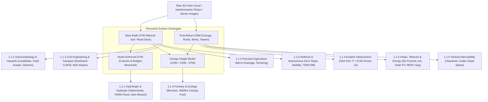

# Chapter 1: The Landscape and Seascape of DEM Applications

Every digital elevation model (DEM) is a purposeful mathematical abstraction of a physical interface. Whether representing the subaerial land surface, the upper envelope of a forest canopy, or the submerged seabed, an elevation grid $z(x, y, t)$ is never a neutral, all-purpose replica of reality. Rather, the intended engineering, scientific, or operational application dictates **what physical surface is measured** (bare mineral soil, vegetation top, water surface, or hydrologically connected channel bed), **what spatial and temporal scales must be resolved**, and **which direction of vertical or horizontal error carries catastrophic consequences**. Before examining the physics of remote sensing sensors, geodetic reference frames, or spatial interpolation estimators in subsequent chapters, we first survey the landscape and seascape of DEM applications to establish how end-use constraints govern product design.

---

## 1.1 Terrestrial (Land) Applications

On land, topography acts as the primary boundary condition for gravity-driven mass and energy fluxes, structural engineering alignments, electromagnetic wave propagation, and ecological organization. Across the six primary terrestrial application domains examined below, seemingly minor differences in surface ontology—specifically the distinction between a bare-earth **Digital Terrain Model (DTM)**, an all-inclusive first-return **Digital Surface Model (DSM)**, a hydrologically enforced terrain surface, and a **Canopy Height Model (CHM)**—determine whether a numerical model converges to physical reality or fails catastrophically.

---

### 1.1.1 Hydrologic and Hydraulic Modeling

Water movement across the terrestrial landscape is governed by gravitational potential gradients that are directly controlled by surface elevation $z(x,y)$ (positive-up relative to an orthometric vertical datum) and its first and second spatial derivatives. Consequently, hydrologic (rainfall-runoff and watershed routing) and hydraulic (open-channel and floodplain fluid mechanics) modeling represent some of the most demanding consumers of high-resolution bare-earth DTMs.

#### Watershed Delineation and Overland Flow Routing
At the catchment scale, distributed hydrologic models partition the terrain into drainage basins, sub-catchments, and channel networks by computing local slope vectors $\nabla z = (\partial z/\partial x, \partial z/\partial y)^T$. Classic deterministic eight-neighbor routing (**D8**; O'Callaghan & Mark, 1984) on a regular grid with square cell spacing $\Delta x = \Delta y$ $[\text{m}]$ assigns all flow from a grid cell $(i,j)$ to the single adjacent or diagonal neighbor $k \in \{1,\dots,8\}$ that maximizes the steepest downward slope $S_k$ $[\text{m}\,\text{m}^{-1}]$:

$$S_k = \frac{z_{i,j} - z_k}{d_k}, \quad d_k = \begin{cases} \Delta x & \text{cardinal neighbors} \\ \sqrt{2}\,\Delta x & \text{diagonal neighbors} \end{cases}$$

While computationally efficient, D8 restricts flow directions to multiples of $45^\circ$, introducing severe grid-orientation artifacts on planar or divergent hillslopes. Multiple-flow-direction algorithms such as **$\text{D}\infty$** (Tarboton, 1997) resolve this by fitting eight planar triangular facets around each cell and apportioning flow between the two adjacent neighbors that bound the steepest downward vector angle $\theta \in [0, 2\pi)$. From the resulting specific catchment area $a(x,y) = A_c(x,y)/b$ $[\text{m}^2\,\text{m}^{-1} = \text{m}]$ (upslope contributing area $A_c$ per unit contour width $b$) and local slope angle $\beta = \arctan(\|\nabla z\|)$, hydrologists compute the **Topographic Wetness Index (TWI)** (Beven & Kirkby, 1979; TOPMODEL):

$$\text{TWI}(x,y) = \ln\!\left(\frac{a(x,y)}{\tan \beta(x,y)}\right)$$

which predicts zones of soil saturation, variable source-area runoff generation, and riparian wetland extent. On flat valley floors, wetland flats, or hydro-flattened water bodies where $\tan\beta \to 0$, $\text{TWI}$ exhibits a logarithmic singularity ($\text{TWI} \to +\infty$); operational implementations must enforce a numerical slope floor (typically $\tan\beta_{\min} \approx 10^{-4}\text{--}10^{-3}$) or switch to diffusive wave routing.

#### Riverine Flood Inundation (FEMA FIRM) and 2D Shallow-Water Hydraulics
When discharge exceeds channel bankfull capacity, water spills onto floodplains where flow is governed by the two-dimensional depth-averaged **Saint-Venant (Shallow-Water) Equations**. Denoting water depth by $h(x,y,t) \ge 0$ $[\text{m}]$, bed elevation by $z_b(x,y)$ $[\text{m}]$, and the water surface elevation (stage) by $\eta(x,y,t) = z_b(x,y) + h(x,y,t)$ $[\text{m}]$, conservation of mass and momentum read:

$$\frac{\partial h}{\partial t} + \frac{\partial (hu)}{\partial x} + \frac{\partial (hv)}{\partial y} = R - I$$

$$\frac{\partial (hu)}{\partial t} + \frac{\partial}{\partial x}\!\left(hu^2 + \frac{1}{2}gh^2\right) + \frac{\partial (huv)}{\partial y} = -gh\frac{\partial z_b}{\partial x} - gh S_{fx}$$

$$\frac{\partial (hv)}{\partial t} + \frac{\partial (huv)}{\partial x} + \frac{\partial}{\partial y}\!\left(hv^2 + \frac{1}{2}gh^2\right) = -gh\frac{\partial z_b}{\partial y} - gh S_{fy}$$

where $(u,v)$ are depth-averaged velocity components $[\text{m}\,\text{s}^{-1}]$, $g \approx 9.80665\,\text{m}\,\text{s}^{-2}$ is standard gravitational acceleration, $R - I$ is net rainfall minus infiltration rate $[\text{m}\,\text{s}^{-1}]$, and $\mathbf{S}_f = (S_{fx}, S_{fy})^T = \frac{n^2 \sqrt{u^2+v^2}}{h^{4/3}}(u, v)^T$ is the dimensionless friction slope vector parameterized via Manning's roughness coefficient $n$ $[\text{s}\,\text{m}^{-1/3}]$.

Notice that the bed slope source term $-gh\,\nabla z_b$ and the hydrostatic pressure gradient $-gh\,\nabla h$ combine to form the water surface gradient $-gh\,\nabla \eta$. In regulatory floodplain mapping—such as U.S. Federal Emergency Management Agency (**FEMA**) **Flood Insurance Rate Maps (FIRMs)** delineating the 1% annual exceedance probability (100-year) **Base Flood Elevation (BFE)**—FEMA requires bare-earth lidar meeting at minimum **USGS 3D Elevation Program (3DEP) Quality Level 2 (QL2)** ($\text{RMSE}_z \le 10.0\,\text{cm}$, Non-Vegetated Vertical Accuracy $\text{NVA}_{95\%} = 1.96\,\text{RMSE}_z \le 19.6\,\text{cm}$ under **ASPRS Positional Accuracy Standards**, and nominal pulse density $\ge 2\,\text{pts}\,\text{m}^{-2}$) or **QL1** ($\ge 8\,\text{pts}\,\text{m}^{-2}$, $\text{RMSE}_z \le 10.0\,\text{cm}$) / **QL0** ($\ge 8\,\text{pts}\,\text{m}^{-2}$, $\text{RMSE}_z \le 5.0\,\text{cm}$) in low-relief valleys. Furthermore, because standard near-infrared ($1064\,\text{nm}$) topographic lidar reflects off the water surface rather than penetrating to the submerged riverbed, hydro-flattened topographic DTMs omit sub-aqueous channel conveyance capacity; accurate 2D flood modeling requires fusing the terrestrial DTM with green-wavelength ($532\,\text{nm}$) **topobathymetric lidar** or acoustic sonar cross-sections below the normal water line.

On a low-gradient alluvial floodplain with transverse cross-slope $\tan \beta_{\text{bank}} > 0$, a vertical elevation error $\delta z_b$ in the floodplain DEM shifts the horizontal inundation boundary outward by:

$$\delta W_{\text{flood}} \approx -\frac{\delta z_b}{\tan \beta_{\text{bank}}}$$

For a typical river valley floodplain where $\tan \beta_{\text{bank}} = 0.001$ ($1\,\text{m}$ rise per kilometer), a negative DEM bias of $\delta z_b = -0.15\,\text{m}$ expands the mapped flood hazard zone outward by **$+150\,\text{m}$**, whereas a positive elevation bias of $\delta z_b = +0.15\,\text{m}$ (e.g., from dense riparian reeds or marsh grass imperfectly filtered in a vegetated floodplain) contracts the mapped boundary inward by **$-150\,\text{m}$**, erroneously excluding hundreds of at-risk structures from flood protection requirements.

#### Urban Stormwater, Dam/Levee Breach, and Groundwater-Surface Water Interaction
* **Urban Stormwater:** In urban environments, overland pluvial flooding is guided by street curbs ($10\text{--}15\,\text{cm}$ vertical relief), crown slopes, building walls, and storm-drain inlets. If the grid spacing $\Delta x > 1\,\text{m}$, street curbs are smoothed out by spatial averaging, causing simulated stormwater to spill prematurely into adjacent parcels rather than remaining confined within street gutters. Operational urban flood modeling therefore requires lidar- or mobile-mapping-derived DTMs/DSMs at $\Delta x \in [0.10, 0.50]\,\text{m}$ with relative vertical precision $\sigma_z \le 2\text{--}5\,\text{cm}$.
* **Dam and Levee Breach Simulation:** Flow overtopping a levee crest or dam embankment (for $\eta > z_{\text{crest}}$) is governed by the broad-crested weir equation:
  $$Q_{\text{weir}} = C_w L_{\text{crest}} \left(\eta - z_{\text{crest}}\right)^{3/2}, \quad \eta > z_{\text{crest}}$$
  where $C_w \approx 1.6\text{--}1.8\,\text{m}^{1/2}\,\text{s}^{-1}$ is the dimensional weir discharge coefficient and $L_{\text{crest}}$ $[\text{m}]$ is the breach or overtopping length. Because discharge scales as the $3/2$ power of the hydraulic head $(\eta - z_{\text{crest}})$ above the crest, and cohesive soil erosion rate during a breach scales nonlinearly with shear stress $\tau_b \propto (\eta - z_{\text{crest}})$, a localized $20\,\text{cm}$ vertical DEM artifact along a narrow levee crown (for example, where a $5\,\text{m}$ DEM smooths a $3\,\text{m}$ wide levee crest down into its flanking side slopes) will trigger catastrophic false overtopping in the model—or, conversely, if riparian vegetation on the levee is misclassified as ground, artificially raise $z_{\text{crest}}$ and conceal an imminent breach.
* **Groundwater-Surface Water Interaction:** Coupled surface-subsurface models (e.g., ParFlow, HydroGeoSphere, MODFLOW-SFR) compute Darcy exchange flux $q_{\text{ex}} = -K_{\text{bed}} (h_{\text{gw}} - \eta_{\text{stream}}) / b_{\text{bed}}$ $[\text{m}\,\text{s}^{-1}]$ across a streambed of thickness $b_{\text{bed}}$ $[\text{m}]$ and vertical hydraulic conductivity $K_{\text{bed}}$ $[\text{m}\,\text{s}^{-1}]$, driven by the difference between the phreatic aquifer total hydraulic head $h_{\text{gw}} = z + \psi_{\text{gw}}$ $[\text{m}]$ and stream stage $\eta_{\text{stream}} = z_{\text{bed}} + d_{\text{stream}}$ $[\text{m}]$. Because near-stream hydraulic head gradients are often only a few centimeters per meter, decimeter-level vertical bias in the DEM streambed thalweg elevation $z_{\text{bed}}$ reverses the simulated direction of hyporheic exchange (turning a gaining stream into a losing stream).

> [!WARNING]
> **Catastrophic Failure Mode: Unbreached Culverts and Digital Dams**
> Airborne lidar and photogrammetry measure the top of road embankments and bridge decks rather than the subterranean culverts and under-bridge waterway openings beneath them. In a standard bare-earth DTM, every road crossing acts as an impermeable "digital dam" up to $5\text{--}15\,\text{m}$ tall. Running a watershed delineation or 2D flood model on an unconditioned DTM causes massive artificial backwater ponding upstream of every highway and railway crossing, completely severing downstream flow routing. Hydrologic DTMs **must** undergo **hydro-enforcement** (breaching/burning of culverts and removal of bridge decks) prior to simulation.

---

### 1.1.2 Geomorphology, Geology, and Natural Hazards

Quantitative geomorphology ("geomorphometry") treats the land surface $z(x,y,t)$ as a dynamic record of competing tectonic uplift, volcanic construction, glacial scouring, and hillslope/fluvial denudation.

#### Landslide Susceptibility and Debris-Flow / Rockfall Runout
Shallow translational landslides are frequently modeled by coupling steady-state or transient pore-water pressure routing with the infinite-slope Mohr-Coulomb **Factor of Safety ($FS$)** (Montgomery & Dietrich, 1994; Pack et al., 1998):

$$FS(x,y) = \frac{c' + \left[\gamma_s z_s - m(x,y)\,\gamma_w z_s\right] \cos^2\beta(x,y)\,\tan\phi'}{\gamma_s z_s \sin\beta(x,y)\,\cos\beta(x,y)}$$

where $c'$ is effective soil plus root cohesion $[\text{Pa} = \text{N}\,\text{m}^{-2}]$, $\phi'$ is effective internal friction angle, $z_s$ is vertical soil thickness $[\text{m}]$, $\gamma_s$ and $\gamma_w$ are the unit weights of bulk soil and water $[\text{N}\,\text{m}^{-3}]$, $\beta(x,y)$ is the local terrain slope, and $m(x,y) = h_w(x,y)/z_s = \min\!\left(\frac{q_{\text{rain}}\,a(x,y)}{T_{\text{soil}} \sin\beta(x,y)}, \, 1\right) \in [0,1]$ is the relative saturated thickness driven by steady-state recharge $q_{\text{rain}}$ $[\text{m}\,\text{s}^{-1}]$, depth-integrated soil transmissivity $T_{\text{soil}}$ $[\text{m}^2\,\text{s}^{-1}]$, and specific catchment area $a(x,y)$ $[\text{m}]$. When $FS < 1$, the hillslope fails. Because $\sin\beta \cos\beta = \frac{1}{2}\sin(2\beta)$ appears in the denominator and $\cos^2\beta$ in the numerator, coarse DEMs ($\Delta x \ge 10\text{--}30\,\text{m}$) systematically smooth steep headwall hollows ($\beta > 35^\circ$ smoothed to $\beta \approx 22^\circ$), artificially inflating $FS > 1$ and failing to identify lethal landslide initiation zones.

Once initiated, **debris-flow runout** models (e.g., RAMMS, D-Claw) integrate depth-averaged granular-fluid conservation laws with Voellmy basal friction $\tau_f = \mu \sigma_n + \rho g \|\mathbf{u}\|^2 / \xi$ $[\text{Pa}]$ (where $\mu$ is the dimensionless dry-Coulomb friction coefficient, $\sigma_n = \rho g h \cos\beta$ is normal stress, and $\xi \approx 100\text{--}1000\,\text{m}\,\text{s}^{-2}$ is the Voellmy turbulent drag coefficient) over the valley DTM, where subtle avulsion channels and alluvial fan levees ($\Delta z \sim 0.5\,\text{m}$) dictate whether a debris flow inundates a town. Similarly, **3D rockfall trajectory** simulators (e.g., RockyFor3D, CRSP) compute ballistic rebound angles at each bounce; sub-meter ledges and talus surface roughness on $\Delta x \le 0.5\,\text{m}$ TLS/UAV DTMs control lateral dispersion and kinetic energy runout envelopes.

#### Fault Scarp Paleoseismology and Volcanic Hazards
* **Tectonic Fault Scarps:** The advent of airborne laser swath mapping (lidar) revolutionized active tectonics by stripping away dense forest canopy to reveal subtle fault scarps, shutter ridges, and offset stream channels (Hudnut et al., 2002). By extracting topographic profiles perpendicular to a normal or thrust fault scarp and fitting a linear hillslope diffusion-degradation model $\frac{\partial z}{\partial t} = \kappa \frac{\partial^2 z}{\partial x^2}$ (Wallace, 1977; Andrews & Bucknam, 1987), where $\kappa$ $[\text{m}^2\,\text{kyr}^{-1}]$ is the geomorphic mass diffusivity, geologists estimate both the vertical coseismic slip $\Delta z_{\text{throw}}$ (requiring $\sigma_z \le 5\text{--}10\,\text{cm}$) and the morphologic age $\kappa t$ $[\text{m}^2]$ of prehistoric earthquakes. Along strike-slip faults, back-slipping 3D channel thalwegs across fault traces measures cumulative horizontal displacement $\Delta x_{\text{slip}}$ to decimeter precision.
* **Volcanic Dome Inflation and Lava Flow Routing:** Repeat-pass DEMs from satellite stereo photogrammetry, InSAR (e.g., TanDEM-X), and UAV surveys measure volcanic dome extrusion rates $\partial z/\partial t$ (often meters per day during active episodes) and flank bulging that precede sector collapse. Downslope **lava flow routing** models (e.g., MAGFLOW, DOWNFLOW) rely on steepest-descent paths modified by Bingham yield strength and crust cooling; outdated DEMs that do not reflect recent tephra cones or earlier lava lobes route simulated flows into the wrong drainage basins.

#### Glacier Mass Balance, Permafrost Thermokarst, and Soil Erosion Budgets
* **Geodetic Glacier Mass Balance:** Integrating elevation change across a glacier domain $\Omega_{\text{glacier}}$ between epochs $t_1$ and $t_2$ yields the geodetic mass balance (Berthier et al., 2014; Hugonnet et al., 2021):
  $$\Delta M = \bar{\rho} \iint_{\Omega_{\text{glacier}}} \left[z(x,y,t_2) - z(x,y,t_1)\right] dx\,dy$$
  where $\bar{\rho} \approx 850 \pm 60\,\text{kg}\,\text{m}^{-3}$ is the volume-to-mass conversion density. Because a horizontal shift of just $2\,\text{m}$ between $z(t_1)$ and $z(t_2)$ on a $25^\circ$ glacial slope induces a spurious vertical difference $\Delta z = \Delta x_{\text{shift}} \tan 25^\circ \approx 0.93\,\text{m}$, sub-pixel 3D co-registration on stable off-ice bedrock (Nuth & Kääb, 2011; implemented in `xdem`) is mandatory before computing $\Delta M$.
* **Permafrost Thermokarst Subsidence:** In Arctic and sub-Arctic periglacial terrain, ground-ice melt causes **thermokarst subsidence** ($2\text{--}10\,\text{cm}\,\text{yr}^{-1}$ secular trend superimposed on $3\text{--}8\,\text{cm}$ seasonal active-layer frost heave/thaw settlement) and abrupt retrogressive thaw slumps ($2\text{--}15\,\text{m}$ headwall retreat). Distinguishing secular permafrost carbon-feedback degradation from seasonal oscillation requires multi-temporal lidar or InSAR DEMs tied to bedrock or deep-anchored GNSS benchmarks with vertical accuracy $\le 1\text{--}2\,\text{cm}$.
* **Soil Erosion and Sediment Budgets:** In agricultural and badland catchments, empirical erosion models such as the Revised Universal Soil Loss Equation (**RUSLE**) compute potential soil loss $A = R \cdot K \cdot LS \cdot C \cdot P$, where the topographic factor $LS(x,y)$ depends nonlinearly on upslope contributing area and slope angle. Direct **Geomorphic Change Detection (GCD)** (Wheaton et al., 2010) differences repeat high-resolution DTMs ($\text{DoD} = z_{t_2} - z_{t_1}$) and applies a spatially variable 95% confidence Level of Detection ($\text{LoD}_{95\%} = 1.96\sqrt{\sigma_{z,t_1}^2(x,y) + \sigma_{z,t_2}^2(x,y)}$) to separate genuine gully incision and bank erosion from cell-wise measurement noise, while accounting for spatial autocorrelation length scales when propagating uncertainty into total volumetric sediment budgets (see Section 1.5).

---

### 1.1.3 Civil Engineering, Transportation, and Construction

Civil infrastructure engineering demands the highest absolute and relative vertical accuracies of any terrestrial domain, operating from regional corridor reconnaissance down to millimeter-level construction grade control.

#### Highway and Railway Corridor Design and Earthwork Cut-and-Fill Balance
Transportation corridors are constrained by strict kinematic and dynamic limits: freight railways typically require longitudinal ruling grades $\le 1.0\text{--}1.5\%$ ($0.57^\circ\text{--}0.86^\circ$) and large horizontal radii of curvature, while interstate highways limit longitudinal grades to $3\text{--}6\%$ and require precise transverse **superelevation** ($e_{\text{super}} = 2\text{--}8\%$) on curves to balance centrifugal acceleration ($e_{\text{super}} + f_s = v^2 / (gR)$, where $f_s$ is the side-friction factor, $v$ is vehicle speed, and $R$ is curve radius) and shed rainwater without hydroplaning.

During design optimization, engineers seek a 3D alignment $z_{\text{design}}(x,y)$ that balances excavated (**cut**) volume in Bank Cubic Meters against embankment (**fill**) volume in Compacted Cubic Meters to minimize expensive off-site material hauling or borrow-pit disposal:

$$V_{\text{cut}} = \iint_{\Omega_{\text{cut}}} \left(z_{\text{existing}} - z_{\text{design}}\right) dA, \quad V_{\text{fill}} = \iint_{\Omega_{\text{fill}}} \left(z_{\text{design}} - z_{\text{existing}}\right) dA, \quad \Delta V_{\text{net}} = V_{\text{cut}} - F_{\text{comp}} V_{\text{fill}}$$

where $F_{\text{comp}} \approx 1.10\text{--}1.25$ is the bank-to-compacted volume conversion factor accounting for soil compaction shrinkage (or $F_{\text{comp}} \approx 0.75\text{--}0.85$ for blasted rock swell). Consider the financial sensitivity to vertical DEM bias: over a highway project of length $L = 10\,\text{km}$ and right-of-way width $W = 100\,\text{m}$ (area $A = 10^6\,\text{m}^2$), a systematic vertical datum or geoid model bias of just **$\mu_e = +2.0\,\text{cm}$ ($0.02\,\text{m}$)** creates an uncompensated volumetric error of:

$$\delta V = \mu_e \cdot A = 0.02\,\text{m} \times 10^6\,\text{m}^2 = 20{,}000\,\text{m}^3$$

At typical earthmoving and haulage unit costs of $\$15\text{--}\$35\,\text{m}^{-3}$, a $2\,\text{cm}$ systematic bias in the baseline DTM causes a **$\$300{,}000\text{--}\$700{,}000$ cost overrun** and contract dispute. Thus, earthwork DTMs require near-zero systematic bias ($\mu_e \to 0$) verified against dense Real-Time Kinematic (RTK) GNSS or spirit-leveled ground control points meeting **ASPRS (2014/2023)** $1\text{--}2.5\,\text{cm}$ Vertical Accuracy Classes.

#### Sight-Distance Analysis and Bridge/Tunnel Alignment
* **Sight Distance:** Under American Association of State Highway and Transportation Officials (AASHTO *Green Book*) standards, highway crest and sag vertical curves and roadside cut slopes must guarantee uninterrupted 3D line-of-sight between a driver's eye (height $h_1 = 1.08\,\text{m}$ above pavement) and a hazard object ($h_2 = 0.60\,\text{m}$ for **Stopping Sight Distance**, SSD) or oncoming vehicle ($h_2 = 1.08\,\text{m}$ for **Passing Sight Distance**, PSD). Evaluating 3D sight lines across existing highways requires dense mobile lidar DSMs ($\Delta x \le 0.10\,\text{m}$) that capture jersey barriers, bridge piers, cut-bank benches, and roadside vegetation.
* **Bridge and Tunnel Alignment:** Long-span bridges and mountain or subaqueous tunnels bored simultaneously from opposite portals require unified orthometric height control ($H = h_{\text{ellip}} - N_{\text{geoid}}$) across complex terrain. If the hybrid geoid model $N_{\text{geoid}}(x,y)$ or portal benchmark network contains a $3\,\text{cm}$ differential vertical error across a mountain range (where mass anomalies perturb the gravity field and plumb line deflection $\xi, \eta$), the two tunnel boring machines (TBMs) will meet with a structural step offset at breakthrough.

#### Airport Obstruction Surfaces (FAA Part 77 / ICAO Annex 14 & 15) and ADA Compliance
* **Airport Obstruction Surfaces:** Aviation safety authorities—specifically U.S. **FAA 14 CFR Part 77** (*Safe, Efficient Use, and Preservation of the Navigable Airspace*), **FAA AC 150/5300-18B** (*Airports GIS*), **ICAO Annex 14**, and **ICAO Annex 15 / RTCA DO-276** (*Electronic Terrain and Obstacle Data*, **eTOD** Areas 1–4)—define imaginary 3D **Obstacle Limitation Surfaces (OLS)** radiating outward from runway thresholds (including the Primary Surface, Approach Surface at $50:1$ or $34:1$ slope, Transitional Surface at $7:1$, Horizontal Surface at $+150\,\text{ft} / 45.72\,\text{m}$, and Conical Surface at $20:1$). Unlike earthwork or hydrology, airport obstruction mapping requires a **tallest-point-biased DSM** combined with discrete vertical feature extraction: every antenna mast, construction crane, transmission wire, and individual tree crown tip that penetrates the OLS must be preserved at its maximum elevation, as smoothing a $15\,\text{cm}$ wide steel mast into a $2\,\text{m}$ mean-gridded DEM cell could cause a fatal controlled-flight-into-obstacle collision during instrument approach.
* **ADA Sidewalk Slope Compliance:** At the micro-engineering scale, the **Americans with Disabilities Act (ADA)** Accessibility Standards mandate that pedestrian sidewalks maintain a longitudinal running slope $\le 1:20$ ($5.0\%$)—or $\le 1:12$ ($8.33\%$) for dedicated wheelchair ramps—and a transverse **cross-slope $\le 1:48$ ($2.08\%$)**. Across a standard $1.5\,\text{m}$ wide sidewalk, a $2.08\%$ cross-slope corresponds to a vertical elevation drop of only $3.12\,\text{cm}$. Auditing thousands of kilometers of municipal sidewalks for ADA compliance using mobile laser scanning (MLS) therefore demands point spacing $\le 1\text{--}2\,\text{cm}$ and local relative vertical precision $\sigma_{\Delta z} \le 2\text{--}3\,\text{mm}$ over $1.5\,\text{m}$ baselines.

---

### 1.1.4 Forestry, Ecology, and Agriculture

In vegetated landscapes, vertical structure above the mineral soil and micro-topographic variations across the ground surface govern primary productivity, carbon storage, agricultural water balance, and disturbance regimes.

#### Canopy Height Models (CHMs) and Allometric Biomass Estimation
By subtracting the bare-earth ground elevation $\text{DTM}(x,y)$ from the upper vegetative envelope $\text{DSM}(x,y)$, ecologists construct the **Canopy Height Model**:

$$\text{CHM}(x,y) = \text{DSM}(x,y) - \text{DTM}(x,y), \quad \text{subject to } \text{CHM}(x,y) \ge 0$$

Forest **Above-Ground Biomass (AGB)** $[\text{Mg}\,\text{ha}^{-1}]$ and carbon stocks are estimated from plot- or stand-level CHM metrics via power-law allometric equations (Asner & Mascaro, 2014; Duncanson et al., 2022):

$$\text{AGB} = a_0 \cdot H_{\text{chm}}^{a_1} \cdot \text{CCF}^{a_2} \cdot \rho_{\text{wood}}^{a_3}$$

where $H_{\text{chm}}$ is top-of-canopy height $[\text{m}]$ (e.g., 95th percentile height $RH_{95}$ or mean top-of-canopy height MCH), $\text{CCF} \in [0,1]$ is canopy cover fraction, $\rho_{\text{wood}}$ $[\text{g}\,\text{cm}^{-3}]$ is wood specific gravity, and $a_1 \approx 1.5\text{--}2.4$. Because error propagates nonlinearly as $\frac{\delta \text{AGB}}{\text{AGB}} \approx a_1 \frac{\delta H_{\text{chm}}}{H_{\text{chm}}}$, a $10\%$ error in $\text{CHM}$ produces a $15\text{--}24\%$ error in carbon stock. Crucially, $\text{CHM}$ uncertainty is controlled by **both** surfaces:
1. **DSM Underestimation (Canopy Penetration):** Discrete-return lidar pulses with footprints $\le 20\,\text{cm}$ frequently miss the narrow apical leaders of conical conifers (e.g., Douglas-fir, spruce), biasing $\text{DSM}$ downward by $0.5\text{--}1.5\,\text{m}$ unless high pulse densities ($\ge 10\text{--}20\,\text{pts}\,\text{m}^{-2}$) or full-waveform sensors are used.
2. **DTM Overestimation (Ground Occlusion):** In dense tropical rainforests or closed-canopy plantations with Leaf Area Index $\text{LAI} > 6$, fewer than $1\%$ of laser pulses penetrate to the mineral soil. If understory ferns, fallen logs, or steep ravine walls are misclassified as ground returns, the interpolated $\text{DTM}$ is biased upward by $2\text{--}8\,\text{m}$, causing severe underestimation of $\text{CHM}$ and forest carbon.

#### Precision Agriculture, Wildfire Fuel Structure, and Microclimate Refugia
* **Precision Agriculture:** Modern agricultural machinery equipped with RTK-GNSS guidance operates on sub-decimeter field DTMs ($\Delta x \approx 0.5\text{--}2\,\text{m}$, $\sigma_z \le 2\,\text{cm}$) to design laser/GNSS **land leveling** grades ($0.05\text{--}0.2\%$ uniform slope for flood/furrow irrigation), layout **subsurface tile drainage** networks with continuous positive pipe grade ($\ge 0.1\%$) to prevent waterlogging and soil salinization, design erosion-control **contour terraces**, and drive **Variable-Rate Irrigation (VRI)** prescriptions based on micro-depressions where water and mobile nitrate accumulate.
* **Wildfire Behavior and Fuel Modeling:** Mechanistic fire spread models (e.g., FARSITE, FlamMap, WRF-Fire) rely on the Rothermel (1972) surface fire spread equation, where the rate of spread $R_{\text{fire}}$ $[\text{m}\,\text{min}^{-1}]$ scales with a dimensionless wind factor $\phi_w$ and slope factor $\phi_s$:
  $$R_{\text{fire}} = R_0 \left(1 + \phi_w + \phi_s\right), \quad \phi_s = 5.275\,\beta_{\text{pack}}^{-0.3} (\tan\beta)^2$$
  where $R_0$ is the no-wind, no-slope reaction-intensity spread rate $[\text{m}\,\text{min}^{-1}]$, $\beta_{\text{pack}}$ is the dimensionless fuel-bed packing ratio, and $\tan\beta$ is terrain slope along the fire spread vector. Because $\phi_s \propto (\tan\beta)^2$, increasing terrain slope from $15^\circ$ to $30^\circ$ increases $\phi_s$ by a factor of $(\tan 30^\circ / \tan 15^\circ)^2 \approx 4.64$, causing upslope no-wind fire spread velocity (for typical surface fuel packing ratios $\beta_{\text{pack}} \approx 0.01\text{--}0.02$) to more than double on a $15^\circ$ slope and increase five- to seven-fold on a $30^\circ$ slope due to convective preheating and radiative view-factor alignment between flames and upslope fuels. Furthermore, transition from a manageable surface fire to a catastrophic **crown fire** (Van Wagner, 1977) depends on lidar-derived **Canopy Base Height (CBH)** $[\text{m}]$ and **Canopy Bulk Density (CBD)** $[\text{kg}\,\text{m}^{-3}]$ extracted from the vertical point-cloud distribution between the DTM and DSM.
* **Habitat Microclimate Modeling:** Fine-scale topography decouples local ecological temperatures from synoptic weather stations by up to $5\text{--}10^\circ\text{C}$. High-resolution DTMs/DSMs ($\Delta x = 1\text{--}5\,\text{m}$) drive topoclimatic models of direct/diffuse solar radiation across north- vs. south-facing aspects and nocturnal **cold-air drainage and pooling** in valley bottoms and sinkholes, identifying thermal micro-refugia where cold-adapted species survive regional climate warming.

---

### 1.1.5 Urban Planning, Telecommunications, and Energy

Rapid urbanization, high-frequency wireless networks, and renewable energy integration require high-precision 3D representations of both the natural terrain and the built environment.

#### 3D Urban Digital Twins and Solar Photovoltaic Insolation
Municipal **3D Digital Twins** integrate bare-earth DTMs with structured building models graded by Open Geospatial Consortium (OGC) **CityGML Levels of Detail (LoD)**: **LoD1** (prismatic block extrusions of building footprints to median roof height), **LoD2** (differentiated roof geometries—gabled, hipped, mansard—derived from $\Delta x \le 0.5\,\text{m}$ lidar/photogrammetry), and **LoD3** (architectural facades, windows, balconies, and street furniture).

In **solar photovoltaic (PV)** siting, LoD2+ DSMs enable automated calculation of roof facet slope $\beta_{\text{roof}}$, azimuth $\alpha_{\text{roof}}$, and the horizon obstruction angle $\theta_{\text{horiz}}(\phi) \in [0, \pi/2]$ across all azimuth directions $\phi \in [0, 2\pi)$ caused by neighboring skyscrapers, chimneys, and street trees. Total annual plane-of-array irradiance $E_{\text{POA}}$ $[\text{kWh}\,\text{m}^{-2}\,\text{yr}^{-1}]$ integrates direct beam irradiance (masked whenever solar elevation $\theta_{\text{sun}}(t) < \theta_{\text{horiz}}(\phi_{\text{sun}}(t))$) and diffuse sky irradiance weighted by the **Sky View Factor ($\text{SVF} \in [0,1]$)** (Dozier & Frew, 1990), given for a horizontal surface element by:

$$\text{SVF}(x,y) = \frac{1}{2\pi} \int_0^{2\pi} \cos^2\!\left(\theta_{\text{horiz}}(\phi)\right) d\phi$$

#### RF Line-of-Sight and 5G / Microwave Propagation
Point-to-point microwave backhaul links and millimeter-wave **5G Fixed Wireless Access** ($24\text{--}39\,\text{GHz}$, wavelength $\lambda \approx 7.7\text{--}12.5\,\text{mm}$) require more than simple geometric line-of-sight; to avoid destructive diffraction loss ($> 6\,\text{dB}$), the **First Fresnel Zone** ellipsoid surrounding the direct ray between transmitter $T$ and receiver $R$ must remain at least $60\%$ free of physical obstructions (buildings, terrain ridges, foliage). At distance $d_1$ $[\text{m}]$ from the transmitter and $d_2$ $[\text{m}]$ from the receiver (total path $D = d_1 + d_2$), the radius of the first Fresnel zone $[\text{m}]$ is:

$$F_1(d_1, d_2) = \sqrt{\frac{\lambda\,d_1\,d_2}{d_1 + d_2}}$$

For a $6\,\text{GHz}$ ($\lambda = 0.05\,\text{m}$) microwave link spanning $D = 10\,\text{km}$, the mid-path Fresnel radius is $F_1 = \sqrt{0.05 \times 5000 \times 5000 / 10000} \approx 11.2\,\text{m}$. In contrast, for a $28\,\text{GHz}$ ($\lambda = 0.0107\,\text{m}$) urban 5G link over $D = 400\,\text{m}$, $F_1 \approx 1.03\,\text{m}$, and wave attenuation through foliage exceeds $20\text{--}30\,\text{dB}$. Consequently, 5G radio-frequency (RF) ray-tracing models require clutter-resolved urban DSMs with $\Delta x \le 0.5\text{--}1.0\,\text{m}$ and vertical accuracy $\le 0.25\,\text{m}$ that explicitly separate solid building facades from seasonal deciduous tree crowns.

#### Wind Turbine Siting and NERC FAC-008 Powerline Clearance
* **Wind Energy:** Wind power density scales with the cube of wind speed ($P_{\text{wind}} = \frac{1}{2}\rho_{\text{air}} U^3$ $[\text{W}\,\text{m}^{-2}]$). Micro-siting models (e.g., WAsP, computational fluid dynamics RANS/LES solvers) use terrain DTMs ($\Delta x = 5\text{--}30\,\text{m}$) and aerodynamic surface roughness lengths $z_0$ $[\text{m}]$ derived from canopy DSMs to predict topographic speed-up over rounded ridges ($+15\text{--}40\%$ velocity acceleration) versus turbulent flow separation and vortex shedding on steep lee slopes where the **Ruggedness Index (RIX)**—the fraction of surrounding terrain steeper than a critical threshold ($\beta_{\text{crit}} \approx 17^\circ$ or $30\%$ slope)—is elevated.
* **High-Voltage Transmission Line Clearance (NERC FAC-008):** Following the August 2003 Northeast North America cascading blackout—triggered when high-voltage conductors sagged under high thermal load into overgrown trees that had not been properly surveyed—North American Electric Reliability Corporation (**NERC**) standards (**FAC-008** and **FAC-003**) mandate strict geometric verification of conductor-to-ground and conductor-to-vegetation clearance. A transmission cable of unit weight $w$ $[\text{N}\,\text{m}^{-1}]$ suspended between towers under horizontal mechanical tension $H_T$ $[\text{N}]$ forms a hyperbolic cosine catenary curve $z_{\text{wire}}(x) = z_{\min} + \frac{H_T}{w}\left(\cosh\frac{w x}{H_T} - 1\right)$ as a function of horizontal distance $x$ $[\text{m}]$ from the sag vertex $(0, z_{\min})$, whose sag increases by several meters as high electrical current and solar heating cause thermal elongation (reducing $H_T$). Utilities fly corridor lidar ($\ge 30\text{--}50\,\text{pts}\,\text{m}^{-2}$) to fit 3D catenary models to individual phase wires and verify that under maximum operating temperature $T_{\max}$, the 3D Euclidean clearance $\Delta r = \| \mathbf{x}_{\text{wire}}(T_{\max}) - \mathbf{x}_{\text{DSM/DTM}} \|$ exceeds flashover safety margins, preventing grid failures and catastrophic wildfire ignitions.

---

### 1.1.6 Defense, Intelligence, and Autonomous Systems

Military operations, planetary exploration, and autonomous robotics rely on elevation models for mission planning, hazard avoidance, and GNSS-denied navigation. Historically, defense requirements drove the standardized production of global DEMs—most notably the National Geospatial-Intelligence Agency (**NGA**) **Digital Terrain Elevation Data (DTED)** hierarchy: **DTED Level 0** ($\sim 900\,\text{m}$ / $30''$), **DTED Level 1** ($\sim 90\,\text{m}$ / $3''$), **DTED Level 2** ($\sim 30\,\text{m}$ / $1''$, matched by SRTM and Copernicus GLO-30), and **High-Resolution Terrain Information / Foundation GEOINT** ($\text{HRTI-3/4/5}$ at $12\,\text{m}$, $5\,\text{m}$, and $\le 1\,\text{m}$).

#### Helicopter Landing Zone (HLZ) Selection and Cross-Country Mobility
* **Helicopter Landing Zones (HLZ):** Selecting a safe tactical touchdown point for rotorcraft in unimproved terrain requires simultaneous evaluation of the **Bare-Earth DTM** and the **First-Return DSM** across a landing pad diameter $D_{\text{pad}} \approx 15\text{--}35\,\text{m}$ (aircraft dependent):
  1. *Pad Slope:* If the local DTM slope $\beta_{\text{pad}}$ exceeds airframe rollover limits (typically $\le 7^\circ$ at night/instrument conditions and $\le 10^\circ\text{--}12^\circ$ in daylight for utility helicopters), dynamic rollover occurs during touchdown or liftoff.
  2. *Micro-Roughness and Ground Obstacles:* Boulders, tree stumps, ant mounds, or ruts exceeding $30\text{--}45\,\text{cm}$ vertical relief ($\Delta z_{\text{rough}}$) within the rotor disk can strike the tail rotor, crush landing skids, or rupture fuselage fuel cells. Detecting a $30\,\text{cm}$ boulder requires a high-resolution point cloud or DSM with $\Delta x \le 0.15\text{--}0.25\,\text{m}$; a $10\,\text{m}$ or $30\,\text{m}$ DEM completely averages out lethal ground hazards.
  3. *Approach/Departure Cones:* The surrounding DSM must provide obstacle-free approach and departure glide paths (typically $6:1$ to $10:1$ slope clearance above trees and wires).
* **Cross-Country Mobility (Trafficability):** Ground vehicle routing models—such as the **NATO Reference Mobility Model (NRMM)** and Next-Generation NRMM—combine DTM slope $\beta$, longitudinal profile curvature (which causes long-wheelbase vehicles to high-center on crests or nose-in at ditch toes), discrete step height, soil bearing strength (Cone Index or Rating Cone Index modulated by TWI soil moisture), and DSM vegetation stem spacing to compute a directionally dependent maximum sustainable speed $V_{\text{max}}(x,y,\theta)$ and classify terrain into *Go*, *Slow-Go*, and *No-Go* maneuver corridors.

#### Viewshed, Dead-Space Analysis, and Lever-Arm Error Amplification
Tactical **viewshed** (intervisibility) analysis determines the binary visibility $V(\mathbf{x}_{\text{obs}}, \mathbf{x}_{\text{tgt}}) \in \{0,1\}$ between an observer or radar antenna at $(\mathbf{x}_{\text{obs}}, z_{\text{obs}} + h_{\text{obs}})$ and every target point $(\mathbf{x}_{\text{tgt}}, z_{\text{tgt}} + h_{\text{tgt}})$ by testing whether any intermediate DSM point $\mathbf{x}_i$ at horizontal range $R_i = \|\mathbf{x}_i - \mathbf{x}_{\text{obs}}\|$ along the geodesic ray exceeds the line-of-sight elevation angle (adjusted for Earth radius $R_E \approx 6371\,\text{km}$ and atmospheric refraction coefficient $k_{\text{refr}} \approx 0.13$ for optical wavelengths, or $k_{\text{refr}} \approx 0.25$ corresponding to the $R_{\text{eff}} = R_E / (1 - k_{\text{refr}}) = \frac{4}{3}R_E$ Effective Earth Radius for RF radar):

$$\alpha(\mathbf{x}_i) = \arctan\!\left(\frac{z(\mathbf{x}_i) - (z_{\text{obs}} + h_{\text{obs}})}{R_i} - \frac{(1 - k_{\text{refr}})\,R_i}{2 R_E}\right)$$

Notice the severe **lever-arm geometric amplification** of vertical DEM errors at a masking ridgeline: if a ridge at distance $R_{\text{ridge}}$ from an observer has a vertical DSM error $\delta z_{\text{ridge}}$, and the grazing ray over the ridge intersects a gently sloping valley floor beyond at grazing incidence angle $\alpha_{\text{grazing}}$ (between the ray and the background terrain slope) at range $R_{\text{tgt}}$, the horizontal error in the predicted **dead-space (radar/visual shadow) boundary** is:

$$\delta R_{\text{shadow}} \approx \left(\frac{R_{\text{tgt}}}{R_{\text{ridge}}}\right) \frac{\delta z_{\text{ridge}}}{\tan\alpha_{\text{grazing}}}$$

If $R_{\text{tgt}} / R_{\text{ridge}} = 4$ and $\tan\alpha_{\text{grazing}} = 0.02$ ($1.15^\circ$), a vertical error of $\delta z_{\text{ridge}} = 2\,\text{m}$ (e.g., using a bare-earth DTM that omits a $2\,\text{m}$ stone wall or $15\,\text{m}$ tree line on the ridge) shifts the predicted dead-space shadow zone by **$400\,\text{m}$** ($3{,}000\,\text{m}$ for a $15\,\text{m}$ tree line), exposing assets thought to be masked or blinding surveillance sensors.

#### Terrain-Relative Navigation (TRN / TERCOM) and Autonomous Ground Vehicles
* **Missile, Aircraft, and Planetary Lander TRN:** In GNSS-denied or jammed environments, cruise missiles, low-altitude terrain-following aircraft, and planetary landers (such as NASA's Mars 2020 *Perseverance* Lander Vision System) estimate their horizontal position $\hat{\mathbf{x}}(t) = (\hat{x}, \hat{y})^T$ by comparing a sequence of $N$ ground-elevation measurements—derived by subtracting radar/laser altimeter slant ranges $r_{\text{alt}}(t_k)$ from barometric/inertial altitude $z_{\text{INS}}(t_k)$—against an onboard reference DEM $z_{\text{DEM}}(\mathbf{x})$. Classic **Terrain Contour Matching (TERCOM)** minimizes the **Mean Absolute Difference (MAD)** or Mean Square Difference over a search grid of candidate offsets $\Delta \mathbf{x}$:

  $$J_{\text{MAD}}(\Delta \mathbf{x}) = \frac{1}{N} \sum_{k=1}^N \left| \left[z_{\text{INS}}(t_k) - r_{\text{alt}}(t_k)\right] - z_{\text{DEM}}\!\left(\mathbf{x}_{\text{INS}}(t_k) + \Delta \mathbf{x}\right) - \hat{b}_z \right|$$

  where $\hat{b}_z$ removes barometric altitude bias. Modern recursive estimators (**SITAN** / particle filters) linearize the terrain gradient $\nabla z_{\text{DEM}}$ inside an Extended Kalman Filter (EKF) or Sequential Monte Carlo filter, where the Cramér-Rao lower bound on horizontal position variance scales inversely with the Fisher Information Matrix of terrain roughness:

  $$\text{Cov}(\hat{\mathbf{x}}) \propto \sigma_{\text{meas}}^2 \left[ \sum_{k=1}^N (\nabla z_{\text{DEM}}(\mathbf{x}_k))(\nabla z_{\text{DEM}}(\mathbf{x}_k))^T \right]^{-1}$$

  Consequently, TRN achieves sub-meter accuracy over rough, high-gradient terrain ($\|\nabla z_{\text{DEM}}\| \gg 0$), becomes unobservable over flat plains or water bodies ($\nabla z_{\text{DEM}} \to \mathbf{0}$), and suffers catastrophic localization divergence ("false fix") if seasonal snowpack, foliage, or radar penetration into dry sand creates discrepancy between the altimeter reflection horizon and the reference DEM ontology.
* **Autonomous Ground Vehicles (AGVs):** Self-driving on-road and off-road robotic platforms continuously fuse real-time onboard 3D lidar/stereo point clouds into local robot-centric **2.5D/3D elevation maps** ($\Delta x = 2\text{--}10\,\text{cm}$) to classify traversable surfaces, detect $10\,\text{cm}$ street curbs or negative obstacles (potholes, trenches), predict vehicle chassis pitch and roll angles $\theta_{\text{pitch}}, \phi_{\text{roll}}$ prior to wheel contact, and localize against pre-built High-Definition (HD) elevation maps with centimeter accuracy.

---

### Summary Matrix: Terrestrial DEM Requirements and Failure Modes

Table 1.1 synthesizes the physical surface ontology, spatial resolution, accuracy tolerances, key mathematical derivatives, and primary failure modes across all six terrestrial application domains.

| Application Domain & Sub-Use | Required Surface Ontology | Typical Grid Spacing ($\Delta x$) | Vertical Accuracy ($\text{RMSE}_z$ / 95% TVU) | Horizontal Accuracy (THU) | Primary Governing Metrics & Equations | Catastrophic Failure Mode if DEM is Defective |
| :--- | :--- | :--- | :--- | :--- | :--- | :--- |
| **1.1.1 Hydrologic & Hydraulic** • Regional Watersheds • FEMA Riverine Flood (BFE) • Urban Stormwater / Levees | Hydro-enforced Bare-Earth DTM (culverts breached, buildings/curbs retained in urban) | $10\text{--}30\,\text{m}$ $1\text{--}3\,\text{m}$ $0.10\text{--}0.50\,\text{m}$ | $0.5\text{--}2.0\,\text{m}$ $0.05\text{--}0.15\,\text{m}$ $0.02\text{--}0.05\,\text{m}$ | $2\text{--}10\,\text{m}$ $0.3\text{--}1.0\,\text{m}$ $0.05\text{--}0.15\,\text{m}$ | $D8/D\infty$ flow routing, $\text{TWI} = \ln(a/\tan\beta)$, 2D Saint-Venant, Weir $Q \propto (\eta - z_c)^{3/2}$ | Unbreached road embankments create false "digital dams"; $15\,\text{cm}$ levee crest error triggers false breach or masks overtopping; $10\,\text{cm}$ bias shifts floodplain boundary by $>100\,\text{m}$. |
| **1.1.2 Geomorphology & Hazards** • Landslide / Rockfall • Fault Scarp Paleoseismology • Glacier Mass Balance | Bare-Earth DTM (strictly co-registered multi-temporal DTMs for $\Delta z/\Delta t$) | $0.5\text{--}5\,\text{m}$ $0.25\text{--}1\,\text{m}$ $2\text{--}30\,\text{m}$ | $0.05\text{--}0.20\,\text{m}$ $0.03\text{--}0.10\,\text{m}$ $0.10\text{--}0.50\,\text{m}$ | $0.1\text{--}1.0\,\text{m}$ $0.05\text{--}0.25\,\text{m}$ $<0.2\,\Delta x$ (co-reg) | Infinite-slope $FS(\beta)$, Voellmy runout, scarp diffusion $\kappa t$, $\Delta M = \bar{\rho}\iint \Delta z\,dA$ | Coarse grid smooths steep hollows ($\beta$), overestimating $FS$ (false safety); $2\,\text{m}$ horizontal shift on $25^\circ$ glacier creates $\sim 1\,\text{m}$ false thickness change. |
| **1.1.3 Civil Engineering** • Highway/Rail Earthwork • FAA Part 77 / ICAO OLS • ADA Sidewalk Compliance | Unbiased Bare-Earth DTM Tall-Biased DSM Ultra-dense Pavement DTM | $0.25\text{--}2\,\text{m}$ $0.5\text{--}5\,\text{m}$ (+ points) $0.01\text{--}0.05\,\text{m}$ | $\le 0.02\text{--}0.05\,\text{m}$ (bias $<1\,\text{cm}$) $0.10\text{--}0.30\,\text{m}$ $0.002\text{--}0.005\,\text{m}$ (rel.) | $0.02\text{--}0.10\,\text{m}$ $0.2\text{--}1.0\,\text{m}$ $0.01\text{--}0.02\,\text{m}$ | $\Delta V = \iint (z_{\text{des}}-z_{\text{ex}})\,dA$, AASHTO 3D sight distance, OLS planes, cross-slope $\le 2.08\%$ | $+2\,\text{cm}$ vertical datum bias over $1\,\text{km}^2$ corridor causes $20{,}000\,\text{m}^3$ earthwork cost overrun; mean-gridded DEM smooths out crane/mast penetrating airport approach surface. |
| **1.1.4 Forestry, Ecology & Ag** • Forest Biomass (AGB) • Precision Ag Drainage • Wildfire Spread & Fuel | $\text{CHM} = \text{DSM} - \text{DTM}$ Bare-Earth Micro-DTM DTM + 3D Canopy Profile | $0.5\text{--}5\,\text{m}$ $0.5\text{--}2\,\text{m}$ $1\text{--}10\,\text{m}$ | $0.15\text{--}0.50\,\text{m}$ $0.01\text{--}0.03\,\text{m}$ $0.10\text{--}0.50\,\text{m}$ | $0.25\text{--}1.0\,\text{m}$ $0.02\text{--}0.05\,\text{m}$ $0.5\text{--}2.0\,\text{m}$ | $\text{AGB} \propto H_{\text{chm}}^{a_1}$, tile drain grade $\ge 0.1\%$, Rothermel $\phi_s \propto (\tan\beta)^2$, CBH/CBD | Under-canopy ground misclassification inflates DTM and underestimates carbon by $>20\%$; $3\,\text{cm}$ vertical error reverses agricultural tile drain flow. |
| **1.1.5 Urban, Telecom & Energy** • 5G / Microwave LoS • Solar PV Insolation • NERC FAC-008 Powerlines | Clutter-Resolved DSM (LoD2/3) Roof/Tree DSM DTM + Wire Catenary + Veg DSM | $0.25\text{--}1.0\,\text{m}$ $0.25\text{--}1.0\,\text{m}$ $0.05\text{--}0.25\,\text{m}$ (pts) | $0.10\text{--}0.25\,\text{m}$ $0.10\text{--}0.20\,\text{m}$ $0.03\text{--}0.10\,\text{m}$ | $0.10\text{--}0.30\,\text{m}$ $0.10\text{--}0.30\,\text{m}$ $0.05\text{--}0.15\,\text{m}$ | Fresnel radius $F_1 = \sqrt{\lambda d_1 d_2 / D}$, Sky View Factor $\text{SVF}$, catenary sag $z_{\text{wire}}(T_{\max})$ | Omitting street trees/parapets blocks 28 GHz 5G Fresnel zone; $0.5\,\text{m}$ vegetation/ground elevation error under high-voltage line causes arc flashover, blackout, or wildfire. |
| **1.1.6 Defense & Autonomous** • Helicopter Landing Zone • Viewshed / Dead-Space • TERCOM / TRN & AGVs | Dual DTM + DSM Tall-Biased Clutter DSM Sensor-Matched DEM / 2.5D Map | $0.15\text{--}0.50\,\text{m}$ $1\text{--}10\,\text{m}$ $1\text{--}30\,\text{m}$ (TRN) / $0.05\,\text{m}$ (AGV) | $0.05\text{--}0.15\,\text{m}$ $0.25\text{--}1.0\,\text{m}$ $0.02\text{--}1.0\,\text{m}$ | $0.10\text{--}0.50\,\text{m}$ $0.5\text{--}2.0\,\text{m}$ $0.05\text{--}5.0\,\text{m}$ | Pad slope $\beta \le 7^\circ$, lever-arm $\delta R_{\text{shadow}}$, $J_{\text{MAD}}(\Delta \mathbf{x})$, Fisher Info $\sum \nabla z \nabla z^T$ | Coarse DEM misses $35\,\text{cm}$ boulder in HLZ causing rotorcraft rollover; using bare-earth DTM for viewshed omits ridge tree line, shifting dead-space by $>500\,\text{m}$. |

---

### Worked Numerical Example: Floodplain Inundation vs. Levee Overtopping Error

Consider a riverine flood modeling study along a $5\,\text{km}$ reach protected on the west bank by an engineered earthen levee and bounded on the east bank by an unlevied agricultural floodplain with transverse cross-slope $\tan\beta_{\text{east}} = 0.0015$ ($0.15\%$ grade).
1. **East Bank Floodplain Boundary Sensitivity:** Suppose the bare-earth lidar DTM on the east bank contains a systematic vertical bias of $\delta z_b = -0.18\,\text{m}$ due to an improper vertical datum transformation between NAD83 ellipsoidal height and NAVD88 orthometric height. For a computed 100-year Base Flood Elevation $\eta_{\text{BFE}}$, the outward horizontal shift in the mapped FEMA flood zone boundary is:
   $$\delta W_{\text{east}} = -\frac{\delta z_b}{\tan\beta_{\text{east}}} = -\frac{-0.18\,\text{m}}{0.0015} = +120.0\,\text{m}$$
   Over the $5{,}000\,\text{m}$ reach, this $-18\,\text{cm}$ vertical bias erroneously adds $\Delta A = 5{,}000\,\text{m} \times 120\,\text{m} = 600{,}000\,\text{m}^2$ ($60\,\text{ha}$) of land to the regulatory floodplain.
2. **West Bank Levee Crest Overtopping Sensitivity:** The west-bank levee has a true crown elevation of $z_{\text{crest,true}} = 25.00\,\text{m}$, a crown width of $3.0\,\text{m}$, and $3:1$ ($\tan\beta_{\text{side}} = 0.333$) side slopes. If an analyst resamples the $0.5\,\text{m}$ lidar DTM to a $10\,\text{m}$ grid using simple spatial averaging before running a 2D hydraulic model, averaging across the $3\,\text{m}$ crown and $3.5\,\text{m}$ of side slope on each side lowers the gridded crest elevation by:
   $$\Delta z_{\text{smooth}} \approx -\frac{2 \times \int_0^{3.5} (0.333\,x)\,dx}{10.0\,\text{m}} = -\frac{2 \times 0.333 \times \frac{1}{2}(3.5)^2}{10.0} \approx -0.41\,\text{m} \implies z_{\text{crest,grid}} = 24.59\,\text{m}$$
   During a flood event that peaks at stage $\eta = 24.85\,\text{m}$ (which in reality remains safely $15\,\text{cm}$ *below* the true $25.00\,\text{m}$ levee crown), the $10\,\text{m}$ gridded model predicts $\eta - z_{\text{crest,grid}} = 24.85 - 24.59 = +0.26\,\text{m}$ of overtopping head. Over a $500\,\text{m}$ levee segment with $C_w = 1.7\,\text{m}^{1/2}\,\text{s}^{-1}$, the model injects a spurious flood discharge of:
   $$Q_{\text{false}} = 1.7 \times 500 \times (0.26)^{3/2} \approx 112.7\,\text{m}^3\,\text{s}^{-1}$$
   into the protected urban area behind the levee. This demonstrates why breaklines or sub-grid levee crest elevations must always be explicitly enforced in hydraulic meshes.

> [!IMPORTANT]
> **Key Takeaways for Terrestrial DEM Applications**
> 1. **Ontology Must Match Physics:** Never substitute a DSM for a DTM in slope stability, earthwork, or flood routing, and never substitute a bare-earth DTM for a clutter-resolved DSM in aviation obstruction, 5G Fresnel clearance, or tactical viewshed analysis.
> 2. **Topological Continuity vs. Geometric Fidelity:** Hydrologic modeling requires breaching bridges and road embankments to preserve water flow topology, whereas transportation engineering requires preserving the exact bridge deck geometry. These two applications require distinct derivative products generated from the same foundational point cloud.
> 3. **Derivative Amplification and Lever Arms:** First and second spatial derivatives (slope $\nabla z$, curvature $\nabla^2 z$) amplify high-frequency random DEM noise as $O(\sigma_z / \Delta x)$ and $O(\sigma_z / \Delta x^2)$, while low-gradient floodplain mapping ($\delta W = \delta z / \tan\beta$), long-range viewsheds ($\delta R_{\text{shadow}}$), and large-area volumetric integrations ($\delta V = \mu_e \cdot A$) massively amplify small vertical biases.
