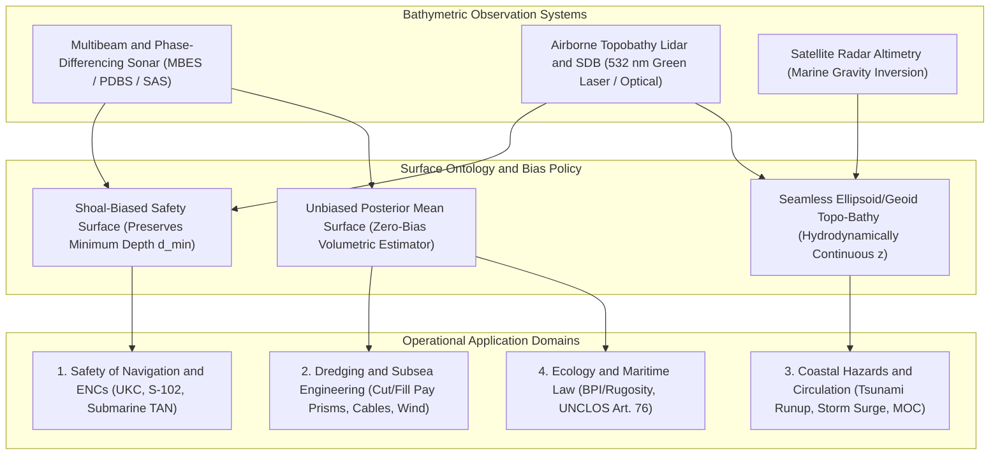

## 1.2 Marine, Estuarine, and Lacustrine (Bathymetry) Applications

Whereas terrestrial elevation models observe an atmosphere–lithosphere (or atmosphere–canopy) boundary using electromagnetic radiation that propagates with minimal attenuation through air, **bathymetric digital elevation models** must reconstruct the submerged sediment–water or rock–water interface across lakes, estuaries, continental shelves, and the deep ocean. Because seawater rapidly attenuates electromagnetic energy—limiting airborne bathymetric lidar and satellite-derived bathymetry to optically clear coastal waters typically shallower than $20\text{–}50\text{ m}$—the vast majority of the aquatic realm is measured acoustically via single-beam echosounders (SBES), multibeam echosounders (MBES), phase-differencing bathymetric sonars (PDBS), and synthetic aperture sonars (SAS), or inferred at coarse scales ($1\text{–}15\text{ km}$) from satellite radar altimetry of sea-surface gravity anomalies.

Across all marine, estuarine, and lacustrine applications, practitioners must navigate a fundamental dichotomy in vertical coordinate conventions and reference frames:
* **Elevation ($z$, positive-up, in $\text{m}$):** Used in seamless coastal topographic-bathymetric ("topo-bathy") DEMs, physical oceanography, and geodetic workflows, where $z$ is referenced to a three-dimensional geodetic ellipsoid (e.g., ITRF2020, WGS 84 [G2139]) or an orthometric/geoid vertical datum (e.g., NAVD 88, NAP, EGM2008), rendering subaqueous surfaces negative ($z < 0$).
* **Depth ($d$, positive-down, in $\text{m}$):** Used in hydrography, nautical charting, and marine navigation, where $d > 0$ measures vertical distance downward from a spatially varying **Chart Datum (CD)**—typically a tidal low-water surface such as **Lowest Astronomical Tide (LAT)** (adopted internationally by the International Hydrographic Organization, IHO) or **Mean Lower Low Water (MLLW)** (used in the United States by NOAA).

At any horizontal position $\mathbf{x} = (x, y)$ and instant $t$, the instantaneous total water column thickness $h(\mathbf{x}, t)$ is the sum of the charted depth below Chart Datum and the instantaneous water surface height $\eta(\mathbf{x}, t)$ above Chart Datum:

$$h(\mathbf{x}, t) = d_{\text{CD}}(\mathbf{x}) + \eta_{\text{tide}}(\mathbf{x}, t) + \eta_{\text{meteo}}(\mathbf{x}, t) = \zeta_{\text{surface}}(\mathbf{x}, t) - z_{\text{bed}}(\mathbf{x})$$

where $\eta_{\text{tide}}(\mathbf{x}, t)$ is the astronomical tidal height above Chart Datum ($\text{m}$), $\eta_{\text{meteo}}(\mathbf{x}, t)$ is the non-tidal meteorological residual (wind setup, barometric surge, or river discharge stage, in $\text{m}$), and $\zeta_{\text{surface}}(\mathbf{x}, t)$ and $z_{\text{bed}}(\mathbf{x}) = z_{\text{CD}}(\mathbf{x}) - d_{\text{CD}}(\mathbf{x})$ are the water-surface and seabed elevations expressed in a common geodetic vertical datum ($\text{m}$), with $z_{\text{CD}}(\mathbf{x})$ denoting the geodetic elevation of Chart Datum. How $d_{\text{CD}}(\mathbf{x})$ or $z_{\text{bed}}(\mathbf{x})$ is sampled, gridded, filtered, and uncertainty-bounded depends entirely on which of the seven core bathymetric application domains the model serves.

---

### 1.2.1 Safety of Navigation and Nautical Charting

The oldest and most stringently regulated application of bathymetric data is guaranteeing the safe passage of surface vessels across harbors, shipping channels, rivers, and coastal approaches. Historically catalyzed by maritime disasters—most notably the 1912 sinking of the *RMS Titanic*, which led to the 1914 International Convention for the Safety of Life at Sea (SOLAS), and the 1992 grounding of the cruise liner *QE2* on an uncharted shoal off Martha's Vineyard—modern hydrographic surveying is governed internationally by the **IHO S-44 Standards for Hydrographic Surveys** (6th Edition, 2020) and in U.S. waters by the **NOAA Hydrographic Surveys Specifications and Deliverables (HSSD)** and the U.S. Army Corps of Engineers (USACE) Engineer Manual **EM 1110-2-1003** (*Hydrographic Surveying*).

#### Under-Keel Clearance (UKC) Management and Error Budgets
As container ships, bulk carriers, and Very Large Crude Carriers (VLCCs) have grown to drafts exceeding $15\text{–}22\text{ m}$ ("Post-Panamax" and "Chinamax" classes), ports operate with narrow margins above the seabed. **Under-Keel Clearance ($\text{UKC}$)** is the instantaneous vertical clearance between the lowest point of a vessel's hull and the shoalest point of the seabed within the vessel's horizontal swept path $\Omega_{\text{ship}}(t)$. The operational $\text{UKC}$ equation balances available water depth against static and dynamic vessel sinkage and uncertainty allowances:

$$\text{UKC}(\mathbf{x}, t) = \underbrace{d_{\text{CD}}(\mathbf{x}) + \eta_{\text{tide}}(\mathbf{x}, t) + \eta_{\text{meteo}}(\mathbf{x}, t)}_{\text{Available Water Depth } h(\mathbf{x}, t)} - \underbrace{\left( T_{\text{static}} + \delta z_{\text{rho}} + \delta z_{\text{squat}}(v, h) + \delta z_{\text{wave}}(\theta, \phi, \zeta_w) + \delta z_{\text{heel}} \right)}_{\text{Dynamic Vessel Draft } T_{\text{dyn}}(\mathbf{x}, t)} - A_{\text{bathy}}(\mathbf{x})$$

Every term in this operational budget carries strict physical meaning and SI units ($\text{m}$):
1. $d_{\text{CD}}(\mathbf{x})$: Charted depth below Chart Datum ($\text{m}$), derived from the shoalest sounding or gridded node in the vessel's footprint.
2. $\eta_{\text{tide}}(\mathbf{x}, t) + \eta_{\text{meteo}}(\mathbf{x}, t)$: Combined astronomical tide and real-time meteorological water-level residual ($\text{m}$).
3. $T_{\text{static}}$: Static vessel draft at rest in seawater of standard density $\rho_0 = 1025\text{ kg}\cdot\text{m}^{-3}$ ($\text{m}$).
4. $\delta z_{\text{rho}} \approx T_{\text{static}} \left(\frac{\rho_0}{\rho_w(\mathbf{x}, t)} - 1\right)$: Fresh/brackish water draft increase ($\text{m}$) experienced when a vessel transits from open ocean into a riverine or estuarine salt-wedge environment of lower density $\rho_w < \rho_0$ (often $0.3\text{–}0.5\text{ m}$ for deep-draft vessels).
5. $\delta z_{\text{squat}}(v, h)$: **Hydrodynamic squat** ($\text{m}$), the Bernoulli-induced bodily sinkage and trim experienced when a hull of beam $B$ ($\text{m}$), length between perpendiculars $L_{\text{pp}}$ ($\text{m}$), and dimensionless block coefficient $C_B = \nabla_{\text{disp}} / (L_{\text{pp}} B T_{\text{static}})$ moves at speed-through-water $v$ ($\text{m}\cdot\text{s}^{-1}$) through shallow, laterally restricted water. Under the empirical Hooft/ICORELS and Barrass formulations, squat scales with $C_B$ and the square of the vessel speed via the dimensionless depth-Froude number $F_{nh} = v / \sqrt{gh}$:
   $$\delta z_{\text{squat}}(v, h) = C_{\text{squat}} \, C_B \frac{B \, T_{\text{static}}}{L_{\text{pp}}} \left( \frac{F_{nh}^2}{\sqrt{1 - F_{nh}^2}} \right) = C_{\text{squat}} \, C_B \frac{B \, T_{\text{static}}}{L_{\text{pp}}} \frac{v^2}{g h \sqrt{1 - v^2 / (gh)}}$$
   where $C_{\text{squat}} \approx 2.0\text{–}2.4$ is an empirical hull/channel blockage coefficient. Because $F_{nh}$ depends inversely on $\sqrt{h}$, an unmodeled shoal in the bathymetric DEM simultaneously reduces $d_{\text{CD}}$ *and* nonlinearly increases vessel squat $\delta z_{\text{squat}}$, accelerating grounding risk.
6. $\delta z_{\text{wave}}(\theta, \phi, \zeta_w)$: Vertical excursion of the bilge keel or bow/stern due to wave-induced heave ($\zeta_w$), pitch ($\theta$), and roll ($\phi$) ($\text{m}$).
7. $A_{\text{bathy}}(\mathbf{x})$: The **bathymetric safety allowance** ($\text{m}$), combining the $95\%$ **Total Vertical Uncertainty ($\text{TVU}_{95}$)** and slope-coupled **Total Horizontal Uncertainty ($\text{THU}_{95}$)** of the hydrographic survey with an allowance for temporal seabed change (siltation or sandwave migration since the last survey):
   $$\text{TVU}_{95}(d) = \sqrt{a^2 + (b \cdot d)^2}, \qquad \text{THU}_{95}(d) = c_{\text{THU}} + d_{\text{THU}} \cdot d$$
   Under IHO S-44 (6th Edition, 2020), the depth-independent vertical parameter $a$ ($\text{m}$), depth-dependent dimensionless vertical factor $b$, horizontal intercept $c_{\text{THU}}$ ($\text{m}$), and depth-dependent horizontal factor $d_{\text{THU}}$ define survey rigor:
   * **Exclusive Order:** $a = 0.15\text{ m}$, $b = 0.0075$, $\text{THU}_{95} = 1.0\text{ m}$ ($200\%$ bathymetric coverage; cubic features $\ge 0.5\text{ m}$);
   * **Special Order:** $a = 0.25\text{ m}$, $b = 0.0075$, $\text{THU}_{95} = 2.0\text{ m}$ ($100\%$ bathymetric coverage; cubic features $\ge 1.0\text{ m}$);
   * **Order 1a / 1b:** $a = 0.50\text{ m}$, $b = 0.013$, $\text{THU}_{95} = 5.0\text{ m} + 0.05 \, d$ ($100\%$ coverage with cubic features $\ge 2.0\text{ m}$ down to $40\text{ m}$ or $0.05\,d$ below $40\text{ m}$ for Order 1a; $5\%$ coverage for Order 1b);
   * **Order 2:** $a = 1.0\text{ m}$, $b = 0.023$, $\text{THU}_{95} = 20.0\text{ m} + 0.10 \, d$ (deep waters $>100\text{ m}$).

#### Shoalest-Point Hazard Preservation vs. Dredging Volumes
Safety-of-navigation bathymetry is fundamentally **asymmetric in its loss function**. Overestimating water depth by $0.5\text{ m}$ (failing to preserve a granite pinnacle, glacial erratic boulder, or shipwreck mast) can tear open a hull and cause an environmental catastrophe, whereas underestimating depth by $0.5\text{ m}$ merely imposes a conservative cargo-loading penalty. Consequently, nautical charting workflows use **shoal-biased gridding** and **Combined Uncertainty and Bathymetric Estimator (CUBE)** hypotheses paired with shoal-preservation rules: any sounding shallower than the local grid surface by more than the allowable IHO S-44 feature-detection threshold must override the smoothed grid value.

Conversely, **harbor and channel dredging design and post-dredge verification** (governed in the U.S. by USACE EM 1110-2-1003) require two distinct surface representations from the exact same multibeam survey:
* **Channel Clearance Certification (Shoal-Biased):** Before the U.S. Army Corps of Engineers (USACE) or a port authority certifies that a navigation channel meets its authorized **Project Depth** $d_{\text{proj}}$ (e.g., $15.2\text{ m}$ MLLW), every shoal peak above the design grade plane must be detected and removed.
* **Contract Payment Volume Computation (Unbiased Mean):** Dredging contractors are paid per cubic meter of sediment excavated between the pre-dredge surface $d_{\text{pre}}(\mathbf{x})$ and the post-dredge surface $d_{\text{post}}(\mathbf{x})$, clipped at the **Paid Allowable Overdepth** plane $d_{\text{pay}} = d_{\text{proj}} + \Delta d_{\text{over}}$ (typically $\Delta d_{\text{over}} = 0.3\text{–}0.6\text{ m}$ to account for cutterhead or trailing-suction hopper dredge tolerances; excavation below $d_{\text{pay}}$ is unpaid non-pay overdepth):
  $$V_{\text{pay}} = \iint_{\Omega_{\text{channel}}} \max\!\Big(0, \, \min\big(d_{\text{post}}(\mathbf{x}), d_{\text{pay}}\big) - \min\big(d_{\text{pre}}(\mathbf{x}), d_{\text{pay}}\big)\Big) \, dx \, dy$$
  If a shoal-biased surface were used for $d_{\text{pre}}$ and $d_{\text{post}}$, or if an uncalibrated sound-speed or heave bias $\mu_e = +0.10\text{ m}$ existed across a $10\text{ km} \times 500\text{ m}$ channel ($A = 5 \times 10^6\text{ m}^2$), the systematic volumetric error $\Delta V = A \cdot \mu_e = 500,000\text{ m}^3$ would translate at $\$15\text{–}\$30\text{ m}^{-3}$ into a $\$7.5\text{M–}\$15\text{M}$ contract dispute.

#### Evolution of Electronic Navigational Charts: IHO S-57 to S-101 and S-102
For three decades, mariners navigated using Electronic Chart Display and Information Systems (ECDIS) powered by **IHO S-57** vector Electronic Navigational Charts (ENCs). S-57 represents bathymetry as discrete spot soundings and coarse depth-area polygons (`DEPARE`) bounded by quantized safety contours (e.g., $5\text{ m}, 10\text{ m}, 15\text{ m}, 20\text{ m}$). If a vessel requires $12.8\text{ m}$ of water, an S-57 chart forces the mariner to treat the entire zone between the $10\text{ m}$ and $15\text{ m}$ contours as potentially hazardous.

To overcome this quantization loss, the IHO developed the **S-100 Universal Hydrographic Data Model**, transforming marine GIS into an interoperable ecosystem of dynamic digital layers:
* **IHO S-101:** The next-generation vector ENC replacing S-57, supporting dynamic update payloads and seamless integration with gridded layers.
* **IHO S-102 (Bathymetric Surface Product Specification):** Delivers high-resolution, regular-grid HDF5 bathymetric DEMs directly into the shipboard ECDIS, storing at every grid node $(i, j)$ both the **depth estimate $d_{i,j}$** and its associated **uncertainty $u_{i,j}$**. Paired with **IHO S-104** (Water Level Information for Surface Navigation) and **IHO S-111** (Surface Currents), S-102 enables real-time **dynamic draft routing**, where the ECDIS computes time-dependent safety corridors minute-by-minute as the tide rises and falls.

---

### 1.2.2 Subsurface and Autonomous Marine Navigation

Below the ocean surface, Global Navigation Satellite Systems (GNSS) are completely unavailable because radio-frequency signals skin-attenuate within centimeters of the air–sea interface. Submarines, Autonomous Underwater Vehicles (AUVs), and Remotely Operated Vehicles (ROVs) must therefore rely on dead reckoning, inertial navigation, acoustic positioning, and the geometry of the seafloor itself.

#### Submarine Grounding Avoidance: The *USS San Francisco* Lesson
Naval submarines operating covertly cannot continuously ping active forward-looking sonar without betraying their location; they depend heavily on onboard digital bathymetric charts to navigate around seamounts, ridges, and canyon walls. On 8 January 2005, the *Los Angeles*-class nuclear fast-attack submarine **USS *San Francisco* (SSN-711)** was transiting submerged at flank speed ($\sim 33\text{ knots} \approx 17\text{ m}\cdot\text{s}^{-1}$) at a depth of $160\text{ m}$ ($525\text{ ft}$) roughly $560\text{ km}$ southeast of Guam in the Caroline Islands. The submarine collided head-on with an uncharted volcanic seamount rising to within $50\text{ m}$ of the ocean surface, resulting in one fatality, 98 injuries, and catastrophic damage to the forward ballast tanks and sonar dome. Post-accident investigation revealed that the primary navigational chart aboard showed no obstruction for miles and indicated water depths exceeding $1,800\text{ m}$, even though declassified satellite radar altimetry gravity data (Sandwell and Smith, 1997) and secondary charts already showed a pronounced sea-surface gravity anomaly diagnostic of a hazardous seamount. The incident permanently transformed naval hydrographic data fusion, mandating that satellite-altimetry-derived seamount predictions and uncertainty envelopes be explicitly flagged as navigation hazards until verified by multibeam sonar.

#### AUV/ROV Terrain-Aided Navigation (TAN)
Uncrewed underwater vehicles (AUVs) use **Inertial Navigation Systems (INS)** aided by **Doppler Velocity Logs (DVL)** to track velocity over the seabed. However, even tactical-grade ring-laser or fiber-optic gyro INS/DVL systems accumulate horizontal position drift of $0.05\%\text{–}0.2\%$ of distance traveled ($50\text{–}200\text{ m}$ per $100\text{ km}$), and much faster when the vehicle loses DVL bottom-lock in mid-water. **Terrain-Aided Navigation (TAN)** (the underwater analogue of airborne TERCOM/TRN) bounds this drift by comparing real-time multibeam or altimeter depth measurements $\tilde{d}_k$ against a reference bathymetric DEM $d_{\text{DEM}}(\mathbf{x})$ using a Rao-Blackwellized particle filter or point-mass filter.

The local observability of horizontal vehicle position $\mathbf{x} = (x, y)^\top$ from $N$ sonar beams with measurement variance $\sigma_d^2$ and DEM vertical variance $\sigma_{\text{DEM}}^2$ is governed by the $2 \times 2$ **Terrain Fisher Information Matrix ($\mathbf{I}_{\text{TAN}}$, in $\text{m}^{-2}$)**, whose inverse bounds the Cramér–Rao Lower Bound (CRLB) on horizontal position covariance ($\mathbf{P}_{xy} \ge \mathbf{I}_{\text{TAN}}^{-1}$):

$$\mathbf{I}_{\text{TAN}}(\mathbf{x}) = \frac{1}{\sigma_d^2 + \sigma_{\text{DEM}}^2} \sum_{i=1}^{N} \nabla d_{\text{DEM}}(\mathbf{x} + \mathbf{r}_i) \left[\nabla d_{\text{DEM}}(\mathbf{x} + \mathbf{r}_i)\right]^\top$$

where $\mathbf{r}_i$ is the horizontal lever arm of beam $i$ and $\nabla d_{\text{DEM}} = (\partial d/\partial x, \partial d/\partial y)^\top$ is the dimensionless local bathymetric gradient vector. Two geometric degeneracies govern TAN mission planning:
1. **Flat Abyssal Plain ($\nabla d_{\text{DEM}} \approx \mathbf{0}$):** $\mathbf{I}_{\text{TAN}} \to \mathbf{0}$ (rank 0), and TAN provides zero horizontal position constraint.
2. **Planar Unidirectional Slope ($\nabla d_{\text{DEM}} = \mathbf{g}_0 = \text{const}$):** $\mathbf{I}_{\text{TAN}} \propto \mathbf{g}_0 \mathbf{g}_0^\top$ is **rank 1** ($\det \mathbf{I}_{\text{TAN}} = 0$), tightly constraining cross-isobath position (perpendicular to depth contours) while leaving along-isobath drift (parallel to depth contours) unobservable. Only over terrain with multi-directional curvature—such as submarine canyons, seamount flanks, or fault scarps—is $\mathbf{I}_{\text{TAN}}$ full-rank and well-conditioned, localizing the AUV to within the horizontal grid resolution of the DEM.

#### Acoustic Shadow Zones and Mine Countermeasures (MCM)
Bathymetric morphology also governs underwater acoustics for anti-submarine warfare (ASW) and **Mine Countermeasures (MCM)**:
* **Acoustic Propagation & Shadow Zones:** Low- and mid-frequency sonar rays refract according to Snell's Law, $\cos\theta(z)/c(z) = \text{const}$, where $c(z)$ is the vertical Sound Speed Profile ($c \approx 1450\text{–}1540\text{ m}\cdot\text{s}^{-1}$, varying with temperature, salinity, and pressure). Seamounts, shelf breaks, and ridges physically block deep **Convergence Zone (CZ)** acoustic paths, strip away bottom-bounce energy on downslope paths, and induce 3D horizontal out-of-plane refraction along continental slopes, creating **bathymetric shadow zones** where submarines or AUVs are acoustically masked.
* **Mine Countermeasures (MCM):** Naval route-survey AUVs equipped with high-frequency Synthetic Aperture Sonar (SAS) and MBES generate centimetre-scale micro-bathymetry ($\Delta x = 0.02\text{–}0.10\text{ m}$) to detect proud bottom mines ($0.5\text{–}2.0\text{ m}$ cylinders/cones), tethered moored mines, and scour pits around partially buried mines. Maintaining historical micro-bathymetric baseline DEMs ("Q-routes") allows automated change detection to distinguish newly laid mines from pre-existing glacial cobbles and sand ripples.

---

### 1.2.3 Coastal Hazard Modeling and Resilience

The coastal zone—where subaqueous bathymetry transitions across the intertidal surf zone into subaerial topography—hosts over $10\%$ of the world's population within the Low Elevation Coastal Zone ($z < 10\text{ m}$). Simulating marine inundation requires **seamless topographic-bathymetric (topo-bathy) DEMs** referenced to a continuous geodetic datum (never spliced directly from MLLW nautical charts to NAVD 88 land lidar without a spatially varying datum transformation).

#### Tsunami Propagation and Nonlinear Shallow-Water Runup
Submarine megathrust earthquakes, volcanic flank collapses, and submarine landslides displace the water column, generating long-period tsunami waves with wavelengths $\lambda \sim 10\text{–}500\text{ km}$ far exceeding the ocean depth $h \sim 4\text{ km}$ ($\lambda \gg 20h$). In the deep ocean, tsunami propagation follows linear shallow-water wave theory, where phase speed $c$ and group velocity $c_g$ depend solely on water column depth $h(\mathbf{x})$:

$$c(\mathbf{x}) = c_g(\mathbf{x}) = \sqrt{g \, h(\mathbf{x})}$$

Along a wave ray of length $L$, the arrival travel time is $t = \int_0^L [g \, h(s)]^{-1/2} \, ds$; a systematic bathymetric error $\delta h$ over path $L$ perturbs tsunami arrival time by:

$$\delta t \approx -\frac{L}{2\sqrt{g}} h^{-3/2} \delta h = -\frac{t}{2} \frac{\delta h}{h}$$

At an abyssal depth of $h = 4,000\text{ m}$ ($g = 9.80665\text{ m}\cdot\text{s}^{-2}$), $c \approx 198\text{ m}\cdot\text{s}^{-1}$ ($713\text{ km}\cdot\text{h}^{-1}$). As the tsunami shoals onto the continental shelf ($h = 200\text{ m} \Rightarrow c \approx 44.3\text{ m}\cdot\text{s}^{-1}$) and approaches the coast ($h = 10\text{ m} \Rightarrow c \approx 9.9\text{ m}\cdot\text{s}^{-1}$), wave energy flux conservation ($E c_g = \frac{1}{8}\rho_w g H^2 \sqrt{gh} = \text{const}$ along a ray tube of width $b$) forces the wave height $H$ to amplify according to **Green's Law**:

$$\frac{H_2}{H_1} = \left(\frac{b_1}{b_2}\right)^{1/2} \left(\frac{h_1}{h_2}\right)^{1/4}$$

where $b_1/b_2$ represents horizontal wave-ray convergence due to bathymetric refraction over submarine ridges and headlands. In the nearshore zone and across dry land, linear theory breaks down, and operational tsunami models—such as NOAA's **MOST** (Method of Splitting Tsunami), **GeoClaw**, and **FUNWAVE-TVD**—solve the **2D Nonlinear Shallow Water Equations (NSWE)** or Boussinesq equations:

$$\frac{\partial h}{\partial t} + \nabla \cdot (h \mathbf{u}) = 0$$

$$\frac{\partial (h \mathbf{u})}{\partial t} + \nabla \cdot \left(h \mathbf{u} \otimes \mathbf{u} + \frac{1}{2} g h^2 \mathbf{I}\right) = -g h \nabla z_{\text{bed}} - \frac{g n^2 \|\mathbf{u}\|_2 \mathbf{u}}{h^{1/3}}$$

where $\mathbf{u} = (u, v)^\top$ is the depth-averaged horizontal velocity ($\text{m}\cdot\text{s}^{-1}$), $z_{\text{bed}}(\mathbf{x})$ is the seamless topo-bathy bed elevation ($\text{m}$, positive-up; if written in terms of positive-down undisturbed depth $d = -z_{\text{bed}}$, the topographic source term becomes $+g h \nabla d$), and $n$ is Manning's bottom roughness coefficient ($\text{s}\cdot\text{m}^{-1/3}$). Numerical solvers must discretize the hydrostatic pressure gradient $\nabla(\frac{1}{2}gh^2) = gh\nabla h$ and bed slope $-gh\nabla z_{\text{bed}}$ using **well-balanced schemes** that exactly preserve the quiescent "lake-at-rest" equilibrium ($\mathbf{u} = \mathbf{0}$, free-surface elevation $\zeta = z_{\text{bed}} + h = \text{const} \implies \nabla h = -\nabla z_{\text{bed}}$). During the **2004 Indian Ocean tsunami** ($M_w\ 9.1\text{–}9.3$, $>227,000$ fatalities) and the **2011 Tōhoku-oki tsunami** ($M_w\ 9.0\text{–}9.1$, local runup reaching $39\text{–}40\text{ m}$ in Miyako and Ōfunato), post-event hindcasts demonstrated that offshore bathymetric ridges focused wave energy onto specific coastal segments, while nearshore bathymetric resolution ($\Delta x \le 10\text{ m}$) and the exact crest elevation of coastal seawalls, river mouths, and coastal dunes controlled overland inundation distance by kilometers.

#### Hurricane Storm Surge, Wave Shoaling, and Sea-Level Rise
For tropical and extratropical cyclones, operational models such as NOAA's **SLOSH** (Sea, Lake, and Overland Surges from Hurricanes) and **ADCIRC** (Advanced Circulation Model, coupled with the **SWAN** spectral wave model on unstructured triangular meshes refined from $50\text{ km}$ in the deep ocean to $10\text{–}30\text{ m}$ in coastal channels) solve the depth-integrated momentum equations forced by atmospheric pressure gradients $\nabla P_{\text{atm}}$, surface wind stress $\boldsymbol{\tau}_s$, bottom friction stress $\boldsymbol{\tau}_b$, and wave radiation stress gradients $\nabla \cdot \mathbf{S}_{\text{rad}}$. In a steady cross-shelf balance, the storm-surge surface slope is governed by:

$$\frac{\partial \eta}{\partial x} = -\frac{1}{\rho_w g}\frac{\partial P_{\text{atm}}}{\partial x} + \frac{\tau_{s,x} - \tau_{b,x}}{\rho_w g (d + \eta)}$$

Because the wind- and bottom-stress setup term scales **inversely with total water depth $h = d + \eta$**, wide, shallow continental shelves and estuaries (e.g., the northern Gulf of Mexico during Hurricane Katrina in 2005, or New York Bight during Hurricane Sandy in 2012) experience dramatic storm surge amplification compared to steep, narrow shelves. Furthermore, the **crest elevation of coastal barrier islands and dunes** acts as a nonlinear hydraulic weir: a $+0.5\text{ m}$ vertical DEM error on a barrier island crest can prevent a simulated storm surge from overtopping the island, severely underpredicting catastrophic flooding in the back-bay lagoon and mainland cities behind it. Similarly, mapping vulnerability to **king tides** (perigean spring tides) and multi-decadal **sea-level rise (SLR)** requires resolving micro-topographic drainage pathways, tidal creeks, and storm-drain outfalls at $\sigma_z \le 0.10\text{ m}$.

---

### 1.2.4 Offshore Engineering and Subsea Infrastructure

The global economy depends on a vast, unseen network of subsea engineering assets—from intercontinental fiber-optic cables to offshore wind farms and hydrocarbon pipelines—whose design, installation, and survival are dictated by high-resolution seabed morphology.

#### Submarine Telecommunications Cable Routing and the 1929 Grand Banks Paradigm
Over $99\%$ of intercontinental internet, financial, and diplomatic data traffic is transmitted not by satellites, but through roughly $1.4\text{ million km}$ of submarine fiber-optic cables resting directly on the ocean floor (typically only $17\text{–}50\text{ mm}$ in diameter). Before laying a transoceanic cable costing hundreds of millions of dollars, engineers perform a Desktop Study (DTS) followed by a dedicated vessel-based **Marine Route Survey (MRS)** acquiring continuous multibeam bathymetry, acoustic backscatter, and sub-bottom profiles along a corridor to optimize the cable route:
1. **Avoiding Turbidity Current Chutes and Submarine Canyons:** On 18 November 1929, a $M_w\ 7.2$ earthquake on the continental slope south of Newfoundland (the **Grand Banks earthquake**) triggered a massive submarine slump that evolved into a high-density **turbidity current**. As analyzed in the landmark paper by Bruce Heezen and Maurice Ewing (1952), this sediment-laden avalanche raced down the Laurentian Fan for over $700\text{ km}$ at speeds up to $25\text{–}28\text{ m}\cdot\text{s}^{-1}$ ($50\text{–}55\text{ knots}$), snapping 12 transatlantic telegraph cables in strict downslope sequence over 13 hours. Modern cable routes carefully skirt canyon axes, active fault scarps, and unstable continental slopes (documented recently again during the 2006 Pingtung earthquake off Taiwan and the 2022 Hunga Tonga–Hunga Haʻapai volcano-induced turbidity current).
2. **Preventing Cable Suspensions and Optimizing Burial:** On the abyssal plain, cables are laid directly on the seabed with carefully calculated **topographic cable slack** ($1\%\text{–}3\%$) derived from the ratio of the 3D seabed arc-length $L_{\text{3D}} = \int_0^{L_{\text{horiz}}} \sqrt{1 + (dd/ds)^2} \, ds$ to horizontal route distance $L_{\text{horiz}}$ so the cable conforms to the terrain without hanging in mid-water across rocky crevices (where bottom currents cause chafing and fatigue). In water depths shallower than $1,000\text{–}1,500\text{ m}$—where bottom-trawl fishing gear and ship anchors cause $>70\%$ of all cable faults—bathymetric slope angle $\beta = \arctan(\|\nabla d\|_2) < 15^\circ$ ($\|\nabla d\|_2 < 0.27$) and sub-bottom sediment thickness guide subsea plows and jet-trenchers to bury the cable $1\text{–}3\text{ m}$ beneath the seabed.

#### Offshore Wind Foundations, Pipeline Free-Spanning, and Rig Hazards
* **Offshore Wind Turbine Foundations:** Fixed-bottom monopiles (diameters $8\text{–}12\text{ m}$) and jacket structures in $20\text{–}60\text{ m}$ water depths, as well as floating wind moorings in $60\text{–}1,000\text{ m}$ depths, require ultra-high-resolution MBES ($\Delta x = 0.25\text{–}0.50\text{ m}$) integrated with sub-bottom seismic data. In tidally energetic seas (e.g., the North Sea or U.S. Mid-Atlantic Bight), mobile **sandwaves** ($5\text{–}15\text{ m}$ high, migrating $1\text{–}20\text{ m}\cdot\text{yr}^{-1}$) can expose buried export cables or lower the seabed around a monopile. Engineers compute a **Lowest Swept Surface (LSS)** across repetitive time-lapse ("4D") bathymetric surveys to establish the design mudline and model local horseshoe-vortex **scour pits** (which can excavate $1.3\text{–}2.0\times$ the pile diameter).
* **Subsea Pipeline Free-Spanning and Vortex-Induced Vibration (VIV):** Rigid steel pipelines transporting oil, natural gas, or captured $\text{CO}_2$ cannot bend sharply over rough bedrock, boulder fields, or iceberg ploughmarks. Where the seabed drops away beneath a pipe of flexural rigidity $EI$ ($\text{N}\cdot\text{m}^2$), an unsupported **free span** of length $L_{\text{span}}$ ($\text{m}$) and under-pipe gap height $e_{\text{gap}}$ ($\text{m}$) forms. When bottom currents of speed $U_c$ ($\text{m}\cdot\text{s}^{-1}$) flow perpendicular to the span, alternating Kármán vortices shed at frequency $f_v = \text{St} \cdot U_c / D$ (where $\text{St} \approx 0.2$ is the dimensionless Strouhal number and $D$ is outer pipe diameter in $\text{m}$). Under **DNV-RP-F105** (*Free Spanning Pipelines*), if $f_v$ approaches the span's fundamental natural frequency ($\text{Hz}$):
  $$f_{n,1} = \frac{C_1}{2\pi L_{\text{span}}^2} \sqrt{\frac{E I}{m_e}}$$
  (where $m_e$ is effective mass per unit length in $\text{kg}\cdot\text{m}^{-1}$, including pipe steel, internal fluid, and hydrodynamic added mass, and $C_1$ is the dimensionless boundary-condition end-fixity factor, ranging from $C_1 = \pi^2 \approx 9.87$ for pinned–pinned ends to $C_1 \approx 22.37$ for clamped–clamped ends), **Vortex-Induced Vibration (VIV)** lock-in occurs, causing rapid high-cycle fatigue weld failure. Autonomous underwater vehicles fly $3\text{–}5\text{ m}$ above the seabed prior to and after pipe-lay to map bathymetric roughness at $5\text{–}10\text{ cm}$ resolution, allowing engineers to pre-trench crests or dump engineered rock berms under critical spans exceeding allowable $L_{\text{span, max}}$ (typically $20\text{–}60\text{ m}$).
* **Jack-Up Rig Spudcans and Mooring Hazards:** Mobile Offshore Drilling Units (MODUs) and wind-installation jack-up vessels lower massive steel legs ("spudcans") onto the seabed. Bathymetric DEMs must identify pre-existing spudcan footprints (which can cause a new leg to slide sideways into the old crater, buckling the leg), gas-escape **pockmarks**, and steep slopes ($>2^\circ\text{–}5^\circ$).

---

### 1.2.5 Marine Geology, Oceanography, and Climate

For the first half of the twentieth century, the deep ocean floor was widely assumed to be a flat, featureless sediment sink. That paradigm was overturned between 1952 and 1977 when geologist **Marie Tharp** and geophysicist **Bruce Heezen** at Columbia University's Lamont Geological Observatory painstakingly compiled sparse single-beam precision depth recorder (PDR) profiles into physiographic panoramas of the ocean basins. In 1952, Tharp identified a continuous, V-shaped axial rift valley bisecting the Mid-Atlantic Ridge—providing the smoking-gun morphological evidence for seafloor spreading and continental drift.

#### Tectonic Geomorphology, Seamounts, and Submarine Landslides
Modern deep-water multibeam echosounders (operating at $12\text{–}30\text{ kHz}$ with $1^\circ \times 1^\circ$ beamwidths, achieving $25\text{–}100\text{ m}$ grid resolution at $4,000\text{ m}$ depth) and satellite altimetry gravity inversions (SRTM15+ / GEBCO) reveal a dynamic tectonic landscape:
* **Mid-Ocean Ridge Spreading Rates and Abyssal Hills:** Slow-spreading ridges (e.g., Mid-Atlantic Ridge, $20\text{–}40\text{ mm}\cdot\text{yr}^{-1}$) exhibit deep ($1.5\text{–}3\text{ km}$), fault-bounded axial rift valleys and oceanic core complexes, whereas fast-spreading ridges (e.g., East Pacific Rise, $>100\text{ mm}\cdot\text{yr}^{-1}$) display smooth axial volcanic highs buoyed by shallow magma chambers. Flanking the ridges are **abyssal hills**—faulted volcanic horsts and grabens $50\text{–}300\text{ m}$ high and $2\text{–}10\text{ km}$ wide—which constitute the most abundant geomorphic fabric on Earth, preserving a spectral record of orbital Milankovitch sea-level cycles and mantle magma supply.
* **Seamount Discovery and Seabed 2030:** While satellite altimetry has identified $>43,000\text{–}100,000$ seamounts taller than $1,000\text{ m}$, radar altimetry is filtered by upward continuation of the gravity field through the $4\text{ km}$ water column and cannot reliably resolve features smaller than $\sim 6\text{–}12\text{ km}$ in wavelength. As of the mid-2020s under the **Nippon Foundation–GEBCO Seabed 2030 Project**, fewer than $26\%\text{–}30\%$ of the global ocean floor has been directly measured by acoustic multibeam sonar, leaving tens of thousands of smaller seamounts, hydrothermal vent fields, and submarine landslide scarps (such as the $3,500\text{ km}^3$ Holocene **Storegga Slide** off Norway) awaiting direct mapping.

#### Abyssal Mixing, Internal Tides, and Deep-Ocean Circulation Sills
Global climate models (GCMs) and ocean general circulation models (OGCMs) are profoundly sensitive to deep-ocean bathymetry through two physical mechanisms:
1. **Topographic Steering at Choke-Point Sills:** Dense, cold bottom waters formed at high latitudes—North Atlantic Deep Water (NADW) and Antarctic Bottom Water (AABW)—flow equatorward along deep western boundary currents and must spill across narrow **bathymetric sills** and fracture zones: the **Denmark Strait** ($d_{\text{sill}} \approx 620\text{ m}$), the **Faroe Bank Channel** ($d_{\text{sill}} \approx 840\text{ m}$), the **Drake Passage**, and the **Romanche and Vema Fracture Zones** ($d_{\text{sill}} \approx 4,350\text{–}4,650\text{ m}$, which allow AABW to cross the Mid-Atlantic Ridge from the western to the eastern Atlantic basin). If a coarse $0.25^\circ$ climate model grid artificially shoals or blocks a $15\text{ km}$-wide fracture-zone sill by averaging it with adjacent $2,500\text{ m}$ ridge crests, the entire deep-ocean abyssal heat and carbon conveyor in the model is severed.
2. **Internal Tide Generation and Diapycnal Mixing:** To close the global **Meridional Overturning Circulation (MOC)**, cold dense abyssal water must be mixed upward across density surfaces (isopycnals) with an average diapycnal turbulent diffusivity of $\kappa_v \approx 10^{-4}\text{ m}^2\cdot\text{s}^{-1}$ (Walter Munk's classic 1966 *"Abyssal Recipes"* scaling). Pelagic background mixing is an order of magnitude weaker ($\kappa_v \sim 10^{-5}\text{ m}^2\cdot\text{s}^{-1}$). The missing mixing energy comes from barotropic tidal currents $\mathbf{U}_{\text{tide}}$ ($\text{m}\cdot\text{s}^{-1}$) flowing across rough sub-grid abyssal hill and seamount topography $h_{\text{rough}}(\mathbf{x})$, converting barotropic tidal energy into breaking **internal gravity waves** (internal tides) at an energy flux conversion rate $E_{\text{internal}}$ ($\text{W}\cdot\text{m}^{-2}$) proportional to the wavenumber-weighted variance of small-scale topographic roughness ($1\text{–}10\text{ km}$ wavelengths; Bell, 1975; Jayne & St. Laurent, 2001):
   $$E_{\text{internal}} \propto \rho_0 N_b \|\mathbf{U}_{\text{tide}}\|_2^2 \int_{k_{\min}}^{k_{\max}} k \, \Phi_h(k) \, dk$$
   where $N_b = \sqrt{-(g/\rho_0)(\partial \rho/\partial z)}$ is the bottom buoyancy (Brunt–Väisälä) frequency ($\text{s}^{-1}$) and $\Phi_h(k)$ is the 1D radial wavenumber power spectral density of bathymetric roughness ($\text{m}^3\cdot\text{rad}^{-1}$, normalized such that $\sigma_h^2 = \int_0^\infty \Phi_h(k)\,dk$ in $\text{m}^2$).

---

### 1.2.6 Marine Ecology, Fisheries, and Conservation

In benthic ecology, bathymetry is the primary physical template governing light availability (within the euphotic zone), hydrostatic pressure, bottom shear stress, sediment sorting, and refuge from predators.

#### Quantitative Seafloor Geomorphometry: Rugosity and Bathymetric Position Index (BPI)
Marine spatial planners and fisheries biologists derive multiscale terrain attributes from high-resolution bathymetric DEMs (often paired with calibrated MBES acoustic backscatter mosaics to distinguish hard rock/coral from soft mud/sand):
* **Benthic Rugosity ($R$) and Vector Ruggedness Measure ($\text{VRM}$):** The surface-area ratio rugosity $R$ is the ratio of true three-dimensional surface area $A_{\text{3D}}$ to planar projected area $A_{\text{2D}}$ over a local neighborhood window $\mathcal{W}$ (invariant to whether positive-up elevation $z$ or positive-down depth $d$ is differentiated):
  $$R(\mathbf{x}) = \frac{A_{\text{3D}}(\mathcal{W})}{A_{\text{2D}}(\mathcal{W})} = \frac{1}{|\mathcal{W}|} \iint_{\mathcal{W}} \sqrt{1 + \left(\frac{\partial z}{\partial x}\right)^2 + \left(\frac{\partial z}{\partial y}\right)^2} \, dx \, dy \ge 1$$
  Because $R = \sec\beta_0 > 1$ even on a completely smooth, featureless plane inclined at angle $\beta_0$, benthic habitat workflows (e.g., Sappington et al., 2007) also compute the **Vector Ruggedness Measure ($\text{VRM} \in [0, 1]$)**—quantifying the three-dimensional dispersion of unit surface normal vectors $\hat{\mathbf{n}}(\mathbf{x})$ within $\mathcal{W}$—to decouple local structural roughness from broad regional slope. On tropical **coral reefs** mapped by airborne topobathy lidar or diver/AUV Structure-from-Motion (SfM) photogrammetry ($\Delta x = 0.01\text{–}1.0\text{ m}$), high structural complexity ($R > 1.5\text{–}2.5$) directly correlates with reef fish species richness, trophic biomass, and wave-energy attenuation (healthy coral reefs dissipate up to $97\%$ of incident wave energy, predominantly across the shallow reef crest).
* **Bathymetric Position Index ($\text{BPI}$):** The marine adaptation of Topographic Position Index (TPI; Wright et al., 2005; Lundblad et al., 2006), comparing the seabed **elevation** $z(\mathbf{x}) = -d(\mathbf{x})$ (positive-up, in $\text{m}$) of a central pixel to the mean elevation within an annulus bounded by inner radius $r_{\text{in}}$ and outer radius $r_{\text{out}}$:
  $$\text{BPI}(\mathbf{x}; r_{\text{in}}, r_{\text{out}}) = z(\mathbf{x}) - \frac{1}{\pi (r_{\text{out}}^2 - r_{\text{in}}^2)} \iint_{r_{\text{in}} \le \|\boldsymbol{\xi}\|_2 \le r_{\text{out}}} z(\mathbf{x} + \boldsymbol{\xi}) \, d\boldsymbol{\xi} = \bar{d}_{\text{annulus}}(\mathbf{x}) - d(\mathbf{x})$$
  Positive $\text{BPI}$ values ($z(\mathbf{x}) > \bar{z}_{\text{annulus}}$, or $d(\mathbf{x}) < \bar{d}_{\text{annulus}}$) identify elevated **reefs, pinnacles, shelf breaks, and cold-water coral mounds** (e.g., deep-sea *Lophelia pertusa* bioherms), where accelerated benthic boundary currents deliver suspended food particles to filter feeders; negative $\text{BPI}$ values identify **troughs, canyons, and pockmarks** that accumulate fine organic detritus. *(Caution: if positive-down depth $d > 0$ is passed directly into a standard terrestrial TPI algorithm without negation, the sign of $\text{BPI}$ is inverted, misclassifying canyons as ridges and reefs as basins.)* Combining Fine-Scale and Broad-Scale $\text{BPI}$ with slope and backscatter forms the basis for delineating **Essential Fish Habitat (EFH)**, protecting **Vulnerable Marine Ecosystems (VMEs)** from bottom trawling, and designing representative **Marine Protected Area (MPA)** networks.

#### Environmental Emergency Response: The 2010 *Deepwater Horizon* Blowout
High-resolution bathymetry is also indispensable during marine environmental disasters. Following the 20 April 2010 blowout of the **Deepwater Horizon** drilling rig at the Macondo Prospect (Mississippi Canyon Block 252, $d \approx 1,522\text{ m}$) in the northern Gulf of Mexico, responder vessels equipped with calibrated multibeam and split-beam echosounders mapped both the seafloor wellhead infrastructure and deep-water subsea hydrocarbon plumes trapped along isopycnal layers at $1,100\text{–}1,300\text{ m}$ depth. All bathymetric grids, acoustic plume trajectories, ROV video observations, deep-water octocoral habitat maps, and coastal marsh topo-bathy DEMs were fused in real time inside **NOAA's Environmental Response Management Application (ERMA)** (originally developed in 2006 by the University of New Hampshire Center for Coastal and Ocean Mapping [UNH CCOM/JHC] and NOAA's Office of Response and Restoration), providing the Unified Command's common operational picture.

---

### 1.2.7 Maritime Law and Geopolitics

Under the **1982 United Nations Convention on the Law of the Sea (UNCLOS)**—often termed the "Constitution for the Oceans"—a coastal State's sovereign territory, resource rights, and geopolitical reach are legally defined by mathematical operations performed on bathymetric DEMs and tidal datums.

#### Maritime Baselines, Territorial Seas, and Exclusive Economic Zones
Under **UNCLOS Article 5**, the **normal baseline** for measuring the breadth of maritime zones is *"the low-water line along the coast as marked on large-scale charts officially recognized by the coastal State"* (supplemented by **Article 6** fringing reefs, **Article 7** straight baselines across deeply indented coasts, and **Article 13** low-tide elevations—naturally formed areas of land surrounded by and above water at low tide but submerged at high tide, located within the territorial sea). Seaward from the baseline, UNCLOS establishes:
* **Territorial Sea ($12\text{ nautical miles [nm]} = 22.224\text{ km}$):** Full sovereign territory (airspace, water column, seabed, and subsoil), subject to innocent passage.
* **Contiguous Zone ($24\text{ nm} = 44.448\text{ km}$):** Enforcement jurisdiction over customs, fiscal, immigration, and sanitary laws.
* **Exclusive Economic Zone (EEZ, $200\text{ nm} = 370.400\text{ km}$):** Sovereign rights for exploring, exploiting, conserving, and managing all natural resources of the water column, seabed, and subsoil.

Because the normal baseline is the intersection of the coastal topo-bathy surface $z(\mathbf{x})$ with the low-water Chart Datum plane $z_{\text{CD}}$, any vertical datum or measurement error $\delta z$ on a low-gradient intertidal mudflat or barrier beach of slope $\tan\beta$ propagates into a horizontal baseline shift $\delta x_{\text{baseline}}$:

$$\delta x_{\text{baseline}} = \frac{\delta z}{\tan\beta}$$

On a gentle macro-tidal flat with slope $\tan\beta = 5 \times 10^{-4}$ ($0.5\text{ m}$ per kilometer), a vertical error of just $\delta z = 0.25\text{ m}$ shifts the legal baseline—and potentially the outer envelope of the Territorial Sea and EEZ—horizontally by $\delta x_{\text{baseline}} = 500\text{ m}$, or can determine whether an isolated offshore shoal qualifies legally as a baseline-generating **low-tide elevation** under Article 13 versus a permanently submerged bank.

#### Extended Continental Shelf (ECS) Claims under UNCLOS Article 76
Where the physical continental margin (shelf, slope, and rise) extends beyond $200\text{ nm}$, **UNCLOS Article 76** entitles a coastal State to claim sovereign seabed and subsoil resource rights (hydrocarbons, gas hydrates, ferromanganese crusts, polymetallic nodules, and sedentary organisms) over an **Extended Continental Shelf (ECS)** by submitting scientific and technical proof to the **Commission on the Limits of the Continental Shelf (CLCS)**.

Delineating the outer limits of the ECS under Article 76 is a rigorous geomorphometric and geodetic inverse problem centered on two bathymetric features:
1. **The Foot of the Continental Slope (FOS, Article 76(4)(b)):** Defined legally, in the absence of evidence to the contrary, as *"the point of maximum change in the gradient at its base."* Along a seaward-directed bathymetric profile parameterized by horizontal distance $s$ across the base-of-slope search region $\Omega_{\text{base}}$—where positive-down depth $d(s) > 0$ increases seaward ($G(s) = dd/ds > 0$ on the slope) and positive-up elevation is $z(s) = -d(s)$—the downslope gradient $G(s)$ decreases most rapidly at the concave-upward base of the slope:
   $$s_{\text{FOS}} = \arg\max_{s \in \Omega_{\text{base}}} \left( -\frac{d^2 d(s)}{ds^2} \right) = \arg\max_{s \in \Omega_{\text{base}}} \left( \frac{d^2 z(s)}{ds^2} \right)$$
   *(Note on sign convention: for $s$ increasing seaward and $d > 0$ positive-down, $+\frac{d^2 d}{ds^2} > 0$ marks the convex-upward **shelf break** at the top of the slope where gradient increases seaward, whereas $-\frac{d^2 d}{ds^2} = +\frac{d^2 z}{ds^2} > 0$ marks the concave-upward **Foot of the Continental Slope** at its base where gradient decreases toward the abyssal plain.)* Because double differentiation amplifies high-frequency acoustic noise by $k^2$ in the wavenumber domain, hydrographers must apply carefully documented scale-space smoothing (e.g., Gaussian or spline filters) to multibeam profiles to isolate the true regional geomorphic base of the continental slope from local slump blocks or abyssal hills.
2. **Affirmative Formula Lines (Article 76(4)(a)):** Seaward of $s_{\text{FOS}}$, the State establishes entitlement using the more advantageous of either:
   * **The Gardiner (Sediment Thickness) Formula:** Points where the thickness of sedimentary rocks $h_{\text{sed}}(\mathbf{x})$ (derived from seismic reflection + bathymetry) is at least $1\%$ of the shortest distance back to the FOS: $h_{\text{sed}}(\mathbf{x}) \ge 0.01 \, \|\mathbf{x} - \mathbf{x}_{\text{FOS}}\|_2$; or
   * **The Hedberg (Distance) Formula:** A line delineated at a distance of **$60\text{ nm}$ ($111.12\text{ km}$) seaward of the FOS**.
3. **Maximum Constraint Lines (Article 76(5)):** The outer limit of the ECS may not exceed the more advantageous of two cutoff lines:
   * **$350\text{ nm}$ ($648.20\text{ km}$) from the territorial sea baselines**; or
   * **$100\text{ nm}$ ($185.20\text{ km}$) seaward of the $2,500\text{ m}$ isobath** (a line connecting the depth of $2,500\text{ m}$).

Consequently, mapping the **$2,500\text{ m}$ isobath** and the **Foot of the Continental Slope** with calibrated multibeam echosounders—accounting for sound-speed refraction, vertical datum shifts, and IHO S-44 uncertainty corridors—directly determines sovereign jurisdiction over millions of square kilometers of seabed in the Arctic Ocean, Gulf of Mexico, Atlantic margins, and Indo-Pacific.

---

### 1.2.8 Worked Numerical Example: UKC, Dredging Bias, and Article 76 Sensitivity

To illustrate how identical vertical uncertainties produce radically different operational consequences across bathymetric domains, consider three quantitative scenarios:

#### Scenario A: Deep-Draft Container Ship Under-Keel Clearance
A container vessel with static draft $T_{\text{static}} = 14.50\text{ m}$ transits a coastal approach channel at $v = 6.0\text{ m}\cdot\text{s}^{-1}$ ($\sim 11.7\text{ knots}$) where charted depth is $d_{\text{CD}} = 16.20\text{ m}$ MLLW, astronomical tide is $\eta_{\text{tide}} = +0.80\text{ m}$, and meteorological surge is $\eta_{\text{meteo}} = -0.15\text{ m}$ (offshore wind blowout). The river-plume density allowance is $\delta z_{\text{rho}} = 0.25\text{ m}$, hydrodynamic squat is $\delta z_{\text{squat}} = 0.85\text{ m}$ (at $F_{nh} = v/\sqrt{gh} = 0.467$), and swell-induced heave/pitch allowance is $\delta z_{\text{wave}} = 0.60\text{ m}$ ($\delta z_{\text{heel}} = 0$). The channel was surveyed to **IHO S-44 Special Order** ($a = 0.25\text{ m}, b = 0.0075$):
1. **Available Water Depth:**
   $$h = 16.20 + 0.80 - 0.15 = 16.85\text{ m}$$
2. **Dynamic Vessel Draft:**
   $$T_{\text{dyn}} = 14.50 + 0.25 + 0.85 + 0.60 = 16.20\text{ m}$$
3. **Bathymetric Uncertainty ($95\%$ confidence):**
   $$\text{TVU}_{95}(16.20\text{ m}) = \sqrt{(0.25)^2 + (0.0075 \times 16.20)^2} = \sqrt{0.0625 + 0.01476} \approx 0.28\text{ m}$$
4. **Net Under-Keel Clearance:**
   $$\text{UKC} = 16.85 - 16.20 - 0.28 = +0.37\text{ m}$$
   If port regulations mandate a minimum net $\text{UKC}_{\min} = 0.50\text{ m}$ (or $10\%$ of static draft gross UKC), the vessel cannot transit at $6.0\text{ m}\cdot\text{s}^{-1}$; slowing to $v = 4.0\text{ m}\cdot\text{s}^{-1}$ ($F_{nh} = 0.311$) reduces ICORELS squat $\delta z_{\text{squat}} \propto F_{nh}^2 / \sqrt{1 - F_{nh}^2}$ from $0.85\text{ m}$ to $0.35\text{ m}$, increasing net $\text{UKC}$ to $+0.87\text{ m}$ and restoring a safe transit window.

#### Scenario B: Horizontal Shift of the UNCLOS $2,500\text{ m}$ Isobath
Along a passive continental rise with a gentle seabed slope of $\tan\beta = 0.008$ ($0.46^\circ$, or $8\text{ m}$ per kilometer), an older single-beam survey used a nominal Matthews/Carter sound speed table rather than a full-ocean-depth Conductivity-Temperature-Depth (CTD) cast, introducing a $+0.5\%$ sound-speed bias at $d = 2,500\text{ m}$ ($\delta d = +12.5\text{ m}$). The resulting horizontal displacement of the $2,500\text{ m}$ isobath—and therefore of the $2,500\text{ m} + 100\text{ nm}$ Article 76(5) constraint line—is:

$$\delta x_{2500} = \frac{\delta d}{\tan\beta} = \frac{12.5\text{ m}}{0.008} = 1,562.5\text{ m} \approx 1.56\text{ km}$$

Across a $500\text{ km}$-long continental margin segment, a $1.56\text{ km}$ shift in the constraint line alters the sovereign seabed area by $\Delta A \approx 780\text{ km}^2$.

---

### 1.2.9 Summary Matrix of Bathymetric Application Requirements

| Application Domain | Primary Vertical Datum | Surface Bias Policy | Target Horizontal Resolution ($\Delta x$) | Required Vertical Accuracy ($\text{TVU}_{95}$) | Catastrophic Failure Mode if DEM is Flawed |
| :--- | :--- | :--- | :--- | :--- | :--- |
| **Harbor & Channel Navigation (IHO S-44 Special/Exclusive)** | Chart Datum (LAT / MLLW) | **Shoal-Biased** (preserve $d_{\min}$ & cubic features $\ge 0.5\text{–}1.0\text{ m}$) | $0.25\text{ m} \text{ – } 2.0\text{ m}$ (S-102 grid) | $0.15\text{ m} \text{ – } 0.28\text{ m}$ ($a=0.15\text{–}0.25\text{ m}$) | Vessel grounding, hull breach, oil spill, port closure |
| **Dredging Payment Volume Verification** | Chart Datum (MLLW / LAT) | **Unbiased Mean** ($\mathbb{E}[e] = 0$) | $0.5\text{ m} \text{ – } 2.0\text{ m}$ | $\sigma_z \le 0.15\text{ m}$; systematic bias $|\mu_e| < 0.02\text{ m}$ | Multi-million-dollar overpayment or contractor litigation |
| **Submarine & AUV Terrain-Aided Navigation (TAN)** | Ellipsoid / Mean Sea Level | **Shoal-Biased** (safety) + **Gradient-Preserving** (TAN) | $1\text{ m} \text{ – } 50\text{ m}$ (AUV); $100\text{ m}$ (Submarine) | $0.5\text{ m} \text{ – } 10\text{ m}$ ($<1\%$ of water depth) | Submarine seamount collision (*USS San Francisco*); AUV INS divergence |
| **Tsunami Runup & Storm Surge (MOST, ADCIRC)** | Seamless Geoid / Orthometric (NAVD 88) | **Connectivity & Crest-Preserving** (barrier islands, channels) | $1\text{ m} \text{ – } 10\text{ m}$ (coast); $100\text{ m} \text{ – } 2\text{ km}$ (shelf/deep) | $0.10\text{ m} \text{ – } 0.20\text{ m}$ (coastal crests); $1\%$ of $h$ offshore | Unpredicted barrier overtopping, false evacuation zones, loss of life |
| **Subsea Cables, Pipelines & Offshore Wind** | Local Chart Datum / Ellipsoid | **Micro-Roughness & Slope-Preserving** | $0.05\text{ m} \text{ – } 0.50\text{ m}$ (AUV/ROV corridor) | $0.05\text{ m} \text{ – } 0.15\text{ m}$ relative; $0.25\text{ m}$ absolute | Pipeline VIV fatigue rupture; cable break in turbidity chute; spudcan punch-through |
| **Deep-Ocean Circulation & Internal Tides** | Geoid / Mean Sea Level | **Sill-Depth & Spectral-Roughness Preserving** | $100\text{ m} \text{ – } 500\text{ m}$ (MBES); $1\text{ km}$ (GCM parameterization) | $5\text{ m} \text{ – } 25\text{ m}$ at abyssal choke points | Blocked bottom-water overflow (NADW/AABW); biased MOC heat transport |
| **Benthic Ecology & Habitat Mapping (BPI, Rugosity)** | Chart Datum / MSL | **Texture & Relative-Relief Preserving** | $0.01\text{ m} \text{ – } 2\text{ m}$ (reefs); $2\text{ m} \text{ – } 25\text{ m}$ (shelf) | $0.02\text{ m} \text{ – } 0.50\text{ m}$ (relative precision critical) | Misclassified VMEs/EFH; artificial strip artifacts mistaken for bedrock ledges |
| **UNCLOS Maritime Limits & Article 76 ECS** | Chart Datum (baselines); MSL / Geoid (deep slope) | **Unbiased Curvature ($-d^2 d/ds^2$) & Contour ($2500\text{ m}$)** | $1\text{ m} \text{ – } 5\text{ m}$ (coast); $50\text{ m} \text{ – } 100\text{ m}$ (continental slope) | IHO S-44 Order 1/2 ($\sim 1\%\text{–}2\%$ of depth) | Rejection of ECS submission by CLCS; loss of sovereign seabed jurisdiction |

---

> [!WARNING]
> **Common Pitfalls in Bathymetric DEM Applications**
> 1. **Using Nautical Chart Grids Directly in Hydrodynamic or Volume Models:** Nautical charts and IHO S-102 navigation surfaces are intentionally **shoal-biased** to protect ship hulls. Integrating a shoal-biased grid to compute dredge payment volumes, reservoir storage capacity, or tsunami wave phase speeds systematically underestimates water volume and wave propagation velocity.
> 2. **Splicing Land Lidar (Orthometric Datum) to Bathymetry (Chart Datum) Without VDatum:** Combining a terrestrial DEM referenced to NAVD 88 (or EGM2008) with a hydrographic survey referenced to MLLW (or LAT) without applying a spatially varying hydrodynamic datum transformation (such as NOAA's **VDatum**) introduces an artificial vertical step of $0.5\text{–}5.0\text{ m}$ right at the coastline, corrupting storm surge and tsunami runup simulations.
> 3. **Treating Satellite-Altimetry Bathymetry as Observed Truth:** Global compilations such as GEBCO and SRTM15+ combine direct multibeam tracks ($<30\%$ of the ocean) with gravity-derived depth predictions ($>70\%$ of the ocean). Gravity inversion cannot resolve steep, narrow volcanic pinnacles or small seamounts ($\lambda < 6\text{–}10\text{ km}$) and can be in error by $\pm 100\text{–}1,000\text{ m}$ over sedimented margins or young volcanic edifices. Always inspect the companion **Type Identifier (TID)** or **Source Identifier (SID)** grid before using global bathymetry for navigation or engineering.
> 4. **Mistaking Multibeam Refraction Artifacts for Benthic Habitat:** Uncorrected errors in the water-column Sound Speed Profile $c(z)$ cause the outer beams of a multibeam swath to curl upward or downward ("smiles" or "frowns"), producing along-track artificial ridges at swath edges. Computing $\text{BPI}$ or rugosity $R$ on an uncleaned MBES grid will misclassify these acoustic refraction artifacts as linear rocky reefs or sandwaves.

> [!IMPORTANT]
> **Key Takeaways**
> * **Dual Sign and Datum Conventions:** Always verify whether a dataset encodes **depth $d$ positive-down** below a tidal Chart Datum (LAT, MLLW) or **elevation $z$ positive-up** above a geodetic ellipsoid/geoid, and account for time-dependent water levels $\eta(x, y, t)$ when computing total water column depth $h$.
> * **Application Dictates Estimator Choice:** Safety of navigation (UKC, IHO S-57/S-101/S-102) demands **shoal-biased** surfaces and strict feature-detection guarantees ($\text{TVU}_{95}, \text{THU}_{95}$), whereas dredging pay-volume accounting and UNCLOS Article 76 foot-of-slope curvature require **unbiased central-tendency** estimators.
> * **Derivatives Amplify Noise:** Applications governed by first derivatives (AUV Terrain-Aided Navigation information matrix $\mathbf{I}_{\text{TAN}} \propto \nabla d \nabla d^\top$, wave refraction, cable plow slopes) and second derivatives (pipeline free-spanning, BPI, and UNCLOS Article 76 Foot of the Continental Slope $\max (-d^2 d / ds^2)$) are acutely sensitive to high-frequency sonar noise and swath-edge refraction artifacts.
> * **Coastal Continuity Controls Hazard Fidelity:** Accurate tsunami runup (MOST, GeoClaw) and storm surge (SLOSH, ADCIRC) predictions depend on seamless topo-bathy DEMs that preserve both offshore wave-focusing bathymetric ridges and sub-meter coastal barrier-island crest elevations.

---

### Curated Key References

* Bell, T. H. (1975). Topographically generated internal waves in the open ocean. *Journal of Geophysical Research*, 80(3), 320–327. https://doi.org/10.1029/JC080i003p00320
* Calder, B. R., & Mayer, L. A. (2003). Automatic processing of high-rate, high-density multibeam echosounder data. *Geochemistry, Geophysics, Geosystems*, 4(6), 1048. https://doi.org/10.1029/2002GC000486
* Det Norske Veritas [DNV]. (2021). *Free Spanning Pipelines* (Recommended Practice DNV-RP-F105). Oslo: DNV.
* Heezen, B. C., & Ewing, M. (1952). Turbidity currents and submarine slumps, and the 1929 Grand Banks [Newfoundland] earthquake. *American Journal of Science*, 250(12), 849–873. https://doi.org/10.2475/ajs.250.12.849
* Heezen, B. C., Tharp, M., & Ewing, M. (1959). *The Floors of the Oceans: I. The North Atlantic* (Geological Society of America Special Paper 65). Geological Society of America. https://doi.org/10.1130/SPE65-p1
* International Hydrographic Organization [IHO]. (2020). *IHO Standards for Hydrographic Surveys* (6th ed., Special Publication No. S-44). Monaco: International Hydrographic Organization.
* International Hydrographic Organization [IHO]. (2022). *Bathymetric Surface Product Specification* (Edition 2.2.0, Publication No. S-102). Monaco: International Hydrographic Organization.
* Jayne, S. R., & St. Laurent, L. C. (2001). Parameterizing tidal dissipation over rough topography. *Geophysical Research Letters*, 28(5), 811–814. https://doi.org/10.1029/2000GL012044
* Lundblad, E. R., Wright, D. J., Miller, J., Larkin, E. M., Rinehart, R., Naar, D. F., Donahue, B. T., Anderson, S. M., & Battista, T. (2006). A benthic terrain classification scheme for American Samoa. *Marine Geodesy*, 29(2), 89–111. https://doi.org/10.1080/01490410600738021
* Mayer, L., Jakobsson, M., Allen, G., Dorschel, B., Falconer, R., Ferrini, V., Lamarche, G., Snaith, H., & Weatherall, P. (2018). The Nippon Foundation—GEBCO Seabed 2030 Project: The quest to see the world's oceans completely mapped by 2030. *Geosciences*, 8(2), 63. https://doi.org/10.3390/geosciences8020063
* Munk, W. H. (1966). Abyssal recipes. *Deep Sea Research and Oceanographic Abstracts*, 13(4), 707–730. https://doi.org/10.1016/0011-7471(66)90602-4
* Sandwell, D. T., & Smith, W. H. F. (1997). Marine gravity anomaly from Geosat and ERS 1 satellite altimetry. *Journal of Geophysical Research: Solid Earth*, 102(B5), 10039–10054. https://doi.org/10.1029/96JB03223
* Sappington, J. M., Longshore, K. M., & Thompson, D. B. (2007). Quantifying landscape ruggedness for animal habitat analysis: A case study using bighorn sheep in the Mojave Desert. *The Journal of Wildlife Management*, 71(5), 1419–1426. https://doi.org/10.2193/2005-723
* Synolakis, C. E., Bernard, E. N., Titov, V. V., Kânoğlu, U., & González, F. I. (2008). Validation and verification of tsunami numerical models. *Pure and Applied Geophysics*, 165(11–12), 2197–2228. https://doi.org/10.1007/s00024-004-0427-y
* U.S. Army Corps of Engineers [USACE]. (2013). *Hydrographic Surveying* (Engineer Manual EM 1110-2-1003). Washington, DC: USACE.
* United Nations. (1982). *United Nations Convention on the Law of the Sea* (UNCLOS), Montego Bay, 10 December 1982, 1833 U.N.T.S. 397 (in particular Part II and Article 76).
* United Nations Commission on the Limits of the Continental Shelf [CLCS]. (1999). *Scientific and Technical Guidelines of the Commission on the Limits of the Continental Shelf* (CLCS/11). New York: United Nations.
* Westerink, J. J., Luettich, R. A., Feyen, J. C., Atkinson, J. H., Dawson, C., Roberts, H. J., Powell, M. D., Dunion, J. P., Kubatko, E. J., & Pourtaheri, H. (2008). A basin- to channel-scale unstructured grid hurricane storm surge model applied to southern Louisiana. *Monthly Weather Review*, 136(3), 833–864. https://doi.org/10.1175/2007MWR1946.1
* Wright, D. J., Lundblad, E. R., Larkin, E. M., Rinehart, R. W., Murphy, J., Cary-Kothera, L., & Draganov, K. (2005). *ArcGIS Benthic Terrain Modeler (BTM)*. Oregon State University & NOAA Coastal Services Center.
