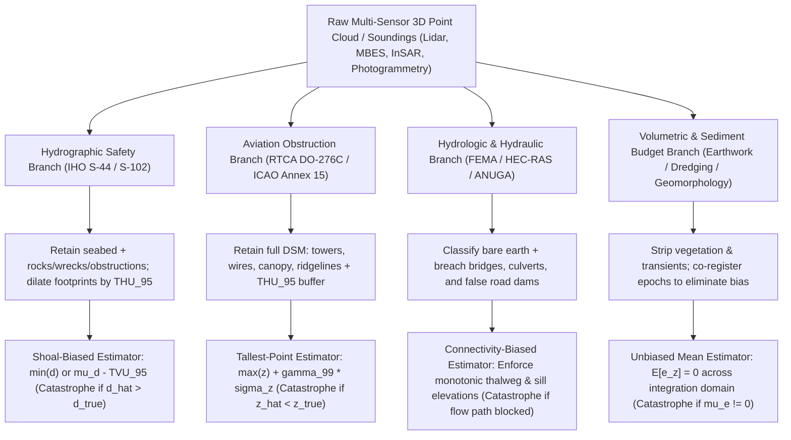

## 1.3 Cross-Domain Constraints: How End-Use Dictates Product Design

A pervasive misconception in geospatial data engineering is that a single "master" Digital Elevation Model (DEM)—if acquired at sufficiently high spatial resolution and vertical accuracy—can serve all downstream scientific, engineering, and operational applications indiscriminately. In practice, **no elevation or bathymetric surface is application-neutral**. Every gridding, filtering, classification, and interpolation algorithm embeds an implicit or explicit statistical loss function that privileges certain physical properties of the terrain or seabed while destroying others.

When thousands of raw laser returns, interferometric radar phase measurements, or multibeam acoustic soundings fall within a single target grid cell $\Omega_{i,j}$ of area $\Delta x \times \Delta y$, compressing that three-dimensional point cloud distribution into a single scalar value $\hat{z}_{i,j}$ (or depth $\hat{d}_{i,j}$) requires answering a fundamental decision-theoretic question: *What is the operational cost of being wrong, and does the sign of the error matter?*

---

### 1.3.1 Safety-Critical vs. Statistical Fidelity and Asymmetric Loss Functions

To formalize how end-use dictates product design, let $z(\mathbf{x})$ denote the true vertical coordinate at horizontal position $\mathbf{x} = (x, y)$, defined as **elevation positive-up** ($\text{m}$) relative to a terrestrial orthometric or ellipsoidal vertical datum (e.g., NAVD88, EVRF2019, or WGS84). Conversely, in hydrography and oceanography, let $d(\mathbf{x})$ denote **water depth positive-down** ($\text{m}$) relative to a marine chart datum (e.g., Mean Lower Low Water, MLLW, or Lowest Astronomical Tide, LAT), such that locally $d = z_{\text{datum}} - z$. Define the vertical estimation error in elevation and depth respectively as:

$$e_z = \hat{z} - z_{\text{true}}, \qquad e_d = \hat{d} - d_{\text{true}} = -e_z$$

In classical geostatistics, an estimator $\hat{z}$ is derived by minimizing the expected value of a loss function $\mathcal{L}(\hat{z}, z_{\text{true}})$ over the posterior probability density $p(z \mid \mathbf{y})$ conditioned on sensor observations $\mathbf{y}$:

$$\hat{z}^* = \underset{\hat{z}}{\arg\min} \, \mathbb{E}_{z \mid \mathbf{y}}\big[\mathcal{L}(\hat{z}, z)\big] = \underset{\hat{z}}{\arg\min} \int_{-\infty}^{+\infty} \mathcal{L}(\hat{z}, z) \, p(z \mid \mathbf{y}) \, dz$$

When the loss function is the symmetric quadratic loss, $\mathcal{L}_{\text{MSE}}(e_z) = e_z^2$, positive and negative errors of equal magnitude are penalized identically, and the optimal Bayes estimator is the **conditional mean**, $\hat{z}^* = \mathbb{E}[z \mid \mathbf{y}]$. However, across safety-critical navigation, aviation, and hydraulic systems, the real-world consequences of overestimation versus underestimation are profoundly asymmetric.

Two canonical families of asymmetric point-wise loss functions capture this divergence (Varian, 1975; Zellner, 1986; Koenker & Bassett, 1978):

1. **The Asymmetric Linear (Pinball / Quantile) Loss:**
   $$\mathcal{L}_\tau(e) = \begin{cases} \tau |e| & \text{if } e < 0 \\ (1 - \tau) |e| & \text{if } e \ge 0 \end{cases}, \qquad \tau \in (0, 1)$$
   Differentiating the expected loss $\mathbb{E}_{z \mid \mathbf{y}}[\mathcal{L}_\tau(\hat{z} - z)]$ with respect to $\hat{z}$ via Leibniz's rule gives the first-order optimality condition $(1 - \tau) F_{z \mid \mathbf{y}}(\hat{z}^*) - \tau \big[1 - F_{z \mid \mathbf{y}}(\hat{z}^*)\big] = 0$, yielding the $\tau$-th posterior quantile $\hat{z}^* = F_{z \mid \mathbf{y}}^{-1}(\tau)$. Applied to depth $d$ ($e_d = \hat{d} - d$), taking $\tau \to 0^+$ penalizes depth overestimation ($e_d > 0$) far more heavily than underestimation and converges to the minimum-depth (**shoalest**) order statistic $\min(d)$. Applied to elevation $z$ ($e_z = \hat{z} - z$), taking $\tau \to 0^+$ converges to the minimum-elevation (**deepest/lowest**) order statistic $\min(z)$, whereas taking $\tau \to 1^-$ heavily penalizes elevation underestimation ($e_z < 0$) and converges to the maximum-elevation (**tallest**) order statistic $\max(z)$.

2. **The Linear-Exponential (LINEX) Loss:**
   $$\mathcal{L}_{\text{LINEX}}(e) = b \left[ \exp(a e) - a e - 1 \right], \qquad a \neq 0, \; b > 0$$
   For $a > 0$, positive errors ($e > 0$) incur an exponentially growing catastrophe penalty, whereas negative errors ($e < 0$) incur only a mild linear cost; for $a < 0$, the asymmetry is reversed so that negative errors ($e < 0$) are penalized exponentially. Assuming a Gaussian posterior $z \mid \mathbf{y} \sim \mathcal{N}(\mu_z, \sigma_z^2)$ and using the moment generating function $\mathbb{E}[\exp(a(\hat{z} - z))] = \exp\!\big(a(\hat{z} - \mu_z) + \frac{1}{2}a^2\sigma_z^2\big)$, setting $\frac{\partial}{\partial \hat{z}}\mathbb{E}[\mathcal{L}_{\text{LINEX}}(\hat{z} - z)] = 0$ yields the exact Bayes estimator:
   $$\hat{z}_{\text{LINEX}}^* = \mu_z - \frac{a}{2} \sigma_z^2$$
   Thus, for hydrographic depth $d$ with $a > 0$ (where overestimating depth $e_d > 0$ risks grounding), the optimal estimate shifts systematically shallower by $-\frac{a}{2}\sigma_d^2$. Conversely, for aviation elevation $z$ with $a < 0$ (where underestimating obstacle height $e_z < 0$ risks collision), the optimal estimate shifts systematically higher by $+\frac{|a|}{2}\sigma_z^2$.



#### 1. Ship and Submarine Navigation (Shoal-Biased / One-Sided Safety Constraint)

In nautical charting and Under-Keel Clearance (UKC) management, the vertical coordinate is depth $d$ (positive-down). Consider a deep-draft container ship or a submerged submarine transiting a channel or seamount province with a planned net UKC margin of $1.00\text{ m}$.
* **Overestimating depth ($e_d = \hat{d} - d_{\text{true}} = +0.50\text{ m}$):** The chart or Bathymetric Surface (IHO S-102) claims the water is $15.00\text{ m}$ deep when an acoustic pinnacle, boulder, or glacial erratic actually rises to $14.50\text{ m}$ depth. The vessel's keel strikes the obstruction, resulting in hull breach, environmental disaster, or loss of life (as exemplified by the 1992 *QE2* grounding on an unmapped shoal off Cuttyhunk Island and the 2005 *USS San Francisco* submarine collision with an uncharted seamount).
* **Underestimating depth ($e_d = \hat{d} - d_{\text{true}} = -0.50\text{ m}$):** The chart reports $14.00\text{ m}$ when the true depth is $14.50\text{ m}$. The vessel transits safely with $0.50\text{ m}$ of extra water beneath its keel, incurring at worst a minor commercial penalty from lightering cargo or waiting for a higher tide window.

Consequently, hydrographic offices governed by the International Hydrographic Organization (IHO S-44 6th Edition) and national authorities (e.g., NOAA Hydrographic Surveys Specifications and Deliverables, HSSD, and Field Procedures Manual, FPM) enforce a **shoal-biased one-sided safety constraint**. Even when modern statistical disambiguation algorithms such as CUBE (*Combined Uncertainty and Bathymetric Estimator*; Calder & Mayer, 2003) estimate the most probable nodal depth $\hat{\mu}_{d,i,j}$ and its posterior standard deviation $\sigma_{d,i,j}$ by rejecting acoustic fliers, operational navigation products must either override the grid node with the shoalest verified "designated sounding" (or Danger to Navigation, DTON) within each cell or apply a conservative lower-bound confidence surface:

$$\hat{d}_{\text{nav}}(x_i, y_j) = \min_{k \in \Omega_{i,j}^{\text{THU}}} \left( d_k - \text{TVU}_{95}(d_k) \right), \qquad \text{TVU}_{95}(d) = \sqrt{a^2 + (b \cdot d)^2}$$

where $\text{TVU}_{95}(d) = 1.96\,\sigma_d(d)$ is the 95% Total Vertical Uncertainty parameterized by depth-independent error $a$ (datum, draft, heave) and depth-dependent factor $b$ (sound speed profile refraction, dynamic roll)—specifically $a = 0.15\text{ m}, b = 0.0075$ for IHO S-44 Exclusive Order; $a = 0.25\text{ m}, b = 0.0075$ for Special Order; and $a = 0.50\text{ m}, b = 0.013$ for Order 1a/1b—and $\Omega_{i,j}^{\text{THU}}$ expands the spatial search neighborhood by the 95% Total Horizontal Uncertainty ($\text{THU}_{95}$) so that a narrow rock pinnacle whose horizontal position is uncertain cannot slip between grid nodes.

#### 2. Aviation Obstruction and Terrain Awareness (Tallest-Point Biased)

In airborne Terrain Awareness and Warning Systems (TAWS / EGPWS), military Terrain-Following Radar (TFR), and airport obstacle limitation surfaces (ICAO Annex 14/15; RTCA DO-276C), the safety inequality is inverted in sign relative to depth because elevation $z$ is positive-up, yet identical in physical geometry: the vehicle operates in the fluid medium *above* the solid boundary.
* **Underestimating elevation ($e_z = \hat{z} - z_{\text{true}} < 0$):** Smoothing a knife-edge mountain ridge via bilinear resampling, or stripping transmission towers, guy wires, wind turbines, and emergent forest canopy into a bare-earth DTM, places the modeled surface below the physical hazard, risking Controlled Flight Into Terrain (CFIT).
* **Overestimating elevation ($e_z > 0$):** Triggers an earlier terrain pull-up advisory or raises the Minimum Enroute Altitude (MEA), which is operationally safe.

Aviation terrain databases therefore utilize a **tallest-point biased estimator** over a full Digital Surface Model (DSM) integrated with vertical obstacle databases. For every grid cell $\Omega_{i,j}$ dilated horizontally by $\text{THU}_{95}$, the published elevation is the upper confidence envelope of the highest reflective feature:

$$\hat{z}_{\text{TAWS}}(x_i, y_j) = \max_{k \in \Omega_{i,j}^{\text{THU}}} \left( z_k + \gamma_{99} \sigma_{z,k} \right)$$

where $\gamma_{99} = \Phi^{-1}(0.99) \approx 2.33$ provides a 99% one-sided Gaussian upper confidence bound (or $\gamma_{99.5} = \Phi^{-1}(0.995) \approx 2.58$ for a two-sided 99% confidence bound).

#### 3. Hydrologic and Hydraulic Modeling (Connectivity-Biased / Topological Fidelity)

When modeling overland stormwater runoff, watershed delineation, or riverine flood inundation, point-wise vertical accuracy at isolated pixels becomes secondary to **non-local topological connectivity**. Over land, water flows downhill along paths of steepest descent on the piezometric or free-surface potential $\eta(\mathbf{x}, t) = z(\mathbf{x}) + h(\mathbf{x}, t)$, where $h$ is water depth.

Nadir-viewing sensors (airborne lidar, stereo photogrammetry, InSAR) measure the top reflective surface. Where a road embankment crosses a stream over a buried concrete culvert, or a highway bridge spans a river gorge, the sensor records the bridge deck elevation $z_{\text{deck}}$, which may sit $\Delta z = +10\text{ m}$ above the underlying channel thalweg $z_{\text{bed}}$.
* If a modeler uses a sensor-faithful DSM or an unbreached DTM ($e_z = 0$ relative to the bridge deck), any 2D shallow-water solver or D8 routing algorithm sees a $10\text{ m}$-high solid dam blocking the valley. Simulated floodwaters pond artificially upstream until they overtop the highway deck, completely invalidating flood stage predictions both upstream and downstream.
* To restore hydraulic reality, **hydro-enforcement** (breaching or burning culverts and removing bridge decks) intentionally replaces $z_{\text{deck}}$ with an interpolated channel invert $z_{\text{bed}}$. Relative to a vertical laser beam aimed at the bridge coordinate $(x_b, y_b)$, this introduces a deliberate vertical "error" of $e_z = z_{\text{bed}} - z_{\text{deck}} = -10\text{ m}$ in order to minimize the global hydraulic loss function across the directed drainage graph $\mathcal{G} = (\mathcal{V}, \mathcal{E})$:

$$\mathcal{L}_{\text{hydro}}(\hat{\mathbf{z}}, \mathbf{z}_{\text{true}}) = \int_0^T \iint_\Omega w(\mathbf{x}) \big| \eta(\mathbf{x}, t; \hat{\mathbf{z}}) - \eta_{\text{obs}}(\mathbf{x}, t) \big|^2 \, dA \, dt + \lambda \sum_{\ell \in \mathcal{E}_{\text{thalweg}}} \int_{\ell} \max\left(0, \, \frac{\partial \hat{z}}{\partial s_\ell}\right) ds_\ell$$

where $s_\ell$ is the downstream arc-length coordinate along channel edge $\ell \in \mathcal{E}_{\text{thalweg}}$ and the penalty integral (with weight $\lambda > 0$) penalizes any adverse downstream bed gradient $\partial \hat{z} / \partial s_\ell > 0$ caused by unbreached dams or false pits (while dual constraints preserve exact hydraulic sill elevations along levees and floodwalls).

#### 4. Earthwork, Dredging, and Geomorphic Sediment Budgets (Unbiased Mean Estimator)

In civil earthwork grading, navigation channel dredging payment surveys, volcanic lava/debris-flow volume estimation, glacial mass balance, and geomorphic DEMs of Difference ($\text{DoD} = \hat{z}_{t_2} - \hat{z}_{t_1}$; Wheaton et al., 2010), the target quantity is the spatially integrated volume change over a domain $\Omega$ of total area $A = N \Delta x \Delta y$:

$$\hat{V} = \iint_\Omega \Delta \hat{z}(\mathbf{x}) \, dA \approx \Delta x \Delta y \sum_{i=1}^{N} \Delta \hat{z}_i$$

Let the elevation (or depth) difference error at cell $i$ be decomposed into a spatially constant systematic bias $\mu_{\Delta e} = \mathbb{E}[\Delta \hat{z}_i - \Delta z_{\text{true},i}]$ and a zero-mean spatially correlated random fluctuation $\varepsilon_i$ with variance $\sigma_{\Delta e}^2$ and isotropic Gaussian spatial correlation function $\rho(r) = \exp(-r^2 / \ell_c^2)$ characterized by correlation length $\ell_c$ (so that the effective 2D correlation area is $A_c = \iint_{\mathbb{R}^2} \rho(r)\,dA = \pi \ell_c^2$). The mean squared error of the total volume estimate $\hat{V}$ is:

$$\text{MSE}(\hat{V}) = \mathbb{E}\big[(\hat{V} - V_{\text{true}})^2\big] = \underbrace{A^2 \mu_{\Delta e}^2}_{\text{Systematic Bias Term}} + \underbrace{\iint_\Omega \iint_\Omega \sigma_{\Delta e}(\mathbf{x}) \sigma_{\Delta e}(\mathbf{x}') \rho\big(\|\mathbf{x} - \mathbf{x}'\|\big) \, d\mathbf{x} \, d\mathbf{x}'}_{\text{Spatially Correlated Variance Term}}$$

Bridging the uncorrelated discrete limit ($\ell_c \ll \Delta x$) and the spatially correlated continuum regime ($L = \sqrt{A} \gg \ell_c \ge \Delta x$), the root-mean-square volumetric uncertainty simplifies (Lane et al., 2003; Rolstad et al., 2009) to:

$$\sigma_V = \sqrt{\text{MSE}(\hat{V})} \approx A \sqrt{ \mu_{\Delta e}^2 + \frac{\sigma_{\Delta e}^2}{N} \left[ 1 + \pi \left(\frac{\ell_c}{\Delta x}\right)^2 \right] }$$

##### Worked Numerical Example: Bias vs. Random Noise in Dredging Volume Payment
Suppose a port authority contracts a dredging company to deepen a $1.0\text{ km} \times 1.0\text{ km}$ harbor basin ($A = 10^6\text{ m}^2$) by an average cut thickness $\Delta d = d_{t_2} - d_{t_1} = 1.00\text{ m}$ ($V_{\text{true}} = 10^6\text{ m}^3$), gridded at $\Delta x = \Delta y = 1.0\text{ m}$ ($N = 10^6$ cells), at a unit payment rate of $\$25/\text{m}^3$:
1. **Random Uncorrelated Noise ($\mu_{\Delta e} = 0$, $\sigma_{\Delta e} = 0.15\text{ m}$, $\ell_c \ll \Delta x$):** Positive and negative errors cancel across the $10^6$ cells. The volumetric uncertainty is $\sigma_{V,\text{rand}} = A \sigma_{\Delta e} / \sqrt{N} = 10^6 \times 0.15 / 10^3 = 150\text{ m}^3$ (worth $\$3{,}750$, or $0.015\%$ of the $10^6\text{ m}^3$ cut).
2. **Spatially Correlated Noise ($\mu_{\Delta e} = 0$, $\sigma_{\Delta e} = 0.15\text{ m}$, $\ell_c = 20\text{ m}$ due to long-wavelength heave/INS drift):** Each correlation patch of area $\pi \ell_c^2 \approx 1{,}257\text{ m}^2$ acts as a single independent sample, reducing the effective degrees of freedom by $1 + \pi (\ell_c / \Delta x)^2 \approx 1{,}258$. The volumetric standard error rises to $\sigma_{V,\text{corr}} \approx 150 \times \sqrt{1{,}258} \approx 5{,}320\text{ m}^3$ ($\$133{,}000$).
3. **Systematic Vertical Bias ($\mu_{\Delta e} = -0.05\text{ m}$ in excavated thickness $\Delta d$):** Suppose the post-dredge survey $d_{t_2}$ is processed using a *shoal-biased* navigation filter instead of an *unbiased mean* estimator, shifting the measured post-dredge seabed upward (shallower) by just $5\text{ cm}$ across the basin ($\hat{d}_{t_2} - d_{t_2,\text{true}} = -0.05\text{ m}$). The bias error does not cancel with $\sqrt{N}$: it scales linearly with area $A$, yielding a deterministic cut-volume error of $\Delta V_{\text{bias}} = A \mu_{\Delta e} = 10^6 \times (-0.05\text{ m}) = -50{,}000\text{ m}^3$—underpaying the dredging contractor by **$\$1{,}250{,}000$**!

---

### 1.3.2 Cross-Domain Product Design Decision Matrix

| Application Domain | Vertical Coordinate & Sign Convention | Optimal Statistical Estimator & Loss Function | Treatment of Non-Ground / Subsea Features | Dominant Error Metric | Catastrophic Failure Mode | Governing Standards & Specifications |
| :--- | :--- | :--- | :--- | :--- | :--- | :--- |
| **Nautical Charting & UKC Navigation** | Depth $d$ positive-down ($\text{m}$) rel. Chart Datum (MLLW/LAT) | **Shoal-Biased:** $\min(d_k)$ or $\hat{\mu}_d - \text{TVU}_{95}$ within $\text{THU}_{95}$ | Retain all rocks, wrecks, obstructions, coral heads; strip water-column biologics/kelp | One-sided 95% lower depth bound ($\text{TVU}_{95}$, $\text{THU}_{95}$) | Overestimating water depth ($e_d > 0$) $\rightarrow$ vessel grounding | IHO S-44 (6th Ed.), IHO S-102, NOAA HSSD & FPM |
| **Aviation TAWS / EGPWS & Obstacle Clearance** | Elevation $z$ positive-up ($\text{m}$) rel. MSL / EGM2008 | **Tallest-Point Biased:** $\max(z_k) + \gamma_{99}\sigma_z$ within $\text{THU}_{95}$ | Full DSM: preserve towers, catenary wires, buildings, forest canopy | One-sided 99% upper elevation bound | Underestimating obstacle height ($e_z < 0$) $\rightarrow$ CFIT / wire strike | RTCA DO-276C, EUROCAE ED-98C, ICAO Annex 14/15 |
| **Hydrologic Routing & Flood Inundation** | Elevation $z$ positive-up ($\text{m}$) rel. Orthometric Geoid | **Connectivity-Biased:** Topological thalweg & sill preservation | Bare-earth DTM with **hydro-enforced** breached bridges/culverts and preserved levee crests | Non-local water surface elevation ($\eta$) & discharge ($Q$) RMSE | Unbreached bridge deck acts as dam; smoothed levee crest breaches prematurely | USGS 3DEP LBS Hydro-Enforcement, FEMA Flood Risk Standards |
| **Earthwork, Dredging & Sediment Budgets** | Elevation $z$ or Depth $d$ ($\text{m}$) on epoch-consistent frame | **Unbiased Mean:** $\hat{z} = \mathbb{E}[z \mid \mathbf{y}]$ (Kriging / CUBE mean / TIN) | Bare-earth / bare-seabed; strip vegetation, structures, and mobile equipment | Systematic vertical bias $\mu_e \to 0$ and spatial covariance $\ell_c$ | Non-zero vertical bias ($\mu_e \neq 0$) integrates to massive volume error $A \mu_e$ | USACE EM 1110-2-1003, ASPRS Positional Accuracy Standards |
| **Precision Agriculture & ADA Grading** | Local elevation $z$ ($\text{m}$) & local gradient $\nabla z$ | **Derivative-Faithful Smooth Estimator:** Spline / Savitzky-Golay filter | Strict bare-earth pavement/soil surface | First & second derivative error ($\|\nabla e_z\|$, $\|\nabla^2 e_z\|$) | High-frequency random noise $\sigma_z$ corrupts slope $\propto \sigma_z / \Delta x$ | ADA Standards for Accessible Design ($<1:12$ ramp, $<2\%$ cross-slope) |

---

### 1.3.3 The Resolution vs. Application Matrix ($0.01\text{ m}$ to $1\text{ km}$)

Choosing a grid spacing $\Delta x$ is not merely a trade-off between disk storage and visual sharpness; **changing $\Delta x$ fundamentally alters the governing physical conservation equations and parameterizations of numerical models**. By the Nyquist-Shannon sampling theorem, a regular grid of spacing $\Delta x$ can only resolve topographic or bathymetric wavelengths $\lambda \ge \lambda_{\text{Nyq}} = 2\Delta x$ (and in practice, faithfully represents morphological features of scale $L_{\text{feat}} \ge 5\Delta x$).

Any continuous surface $z(\mathbf{x})$ can be decomposed via a spatial filter $G_\Delta$ of characteristic width $\Delta x$ into a **grid-resolved component** $\bar{z}_\Delta(\mathbf{x})$ and an **unresolved sub-grid residual** $z'(\mathbf{x})$:

$$z(\mathbf{x}) = \underbrace{\big(G_\Delta * z\big)(\mathbf{x})}_{\bar{z}_\Delta(\mathbf{x}) \text{ (Resolved Geometry)}} + \underbrace{z'(\mathbf{x})}_{\text{Sub-Grid Roughness}}$$

When the 2D depth-averaged Shallow Water Equations (for overland flood or coastal surge modeling) or the 3D Navier-Stokes equations (for ocean circulation) are spatially averaged over a grid cell $\Omega_{i,j}$ of size $\Delta x$, the momentum conservation equation for the depth-integrated volume flux per unit width $\mathbf{q} = h \mathbf{u}$ ($\text{m}^2\cdot\text{s}^{-1}$, where $h$ is water depth and $\mathbf{u}$ is depth-averaged horizontal velocity) takes the form:

$$\frac{\partial \mathbf{q}}{\partial t} + \nabla \cdot \left(\frac{\mathbf{q} \otimes \mathbf{q}}{h}\right) = -g h \nabla \big(\bar{z}_\Delta + h\big) - \underbrace{\frac{1}{\rho \Delta x^2} \iint_{\Omega_{i,j}} p_b \nabla z'(\mathbf{x}) \, dA}_{\text{Unresolved Sub-Grid Form Drag}} - \frac{\boldsymbol{\tau}_{\text{skin}}}{\rho}$$

where $\rho$ is fluid density ($\text{kg}\cdot\text{m}^{-3}$), $p_b(\mathbf{x})$ is the non-hydrostatic bottom pressure anomaly ($\text{Pa}$) acting on sub-grid topographic slopes $\nabla z'(\mathbf{x})$, and $\boldsymbol{\tau}_{\text{skin}}$ is grain-scale viscous/turbulent skin-friction stress ($\text{Pa}$). As $\Delta x$ coarsens from $0.01\text{ m}$ to $1\text{ km}$, physical features migrate out of the resolved pressure-gradient term $-g h \nabla \bar{z}_\Delta$ and into the unresolved sub-grid form-drag integral, which must then be parameterized empirically (e.g., by inflating Manning's roughness coefficient $n_{\text{eff}}$ in $\text{s}\cdot\text{m}^{-1/3}$ or introducing internal-tide wave drag tensors; Bates, 2022; Neal et al., 2012; Jayne & St. Laurent, 2001):

$$\boldsymbol{\tau}_b = \rho g \frac{n_{\text{eff}}^2(\Delta x) \, \|\mathbf{q}\| \mathbf{q}}{h^{7/3}}, \qquad n_{\text{eff}}(\Delta x) = \sqrt{n_{\text{skin}}^2 + n_{\text{form}}^2\big(\sigma_{z'}(\Delta x)\big)}$$

| Resolution Tier & Grid Spacing $\Delta x$ | Effective Feature Scale ($\approx 5\Delta x$) | Explicitly Resolved Physical Features (In $\nabla \bar{z}_\Delta$) | Sub-Grid Parameterized Processes (In $z'(\mathbf{x})$) | Primary Sensors & Platforms | Representative Applications |
| :--- | :--- | :--- | :--- | :--- | :--- |
| **Micro-Scale** ($0.01\text{ m} \le \Delta x < 0.25\text{ m}$) | $0.05\text{–}1.0\text{ m}$ | Individual cobbles, gravel ripples, pavement cracks, ADA curb ramps, coral branches, subsea pipeline welds | Sand grain skin friction ($k_s \sim d_{50}$); viscous boundary layer | Terrestrial Laser Scanning (TLS), Mobile Lidar, UAV-SfM, ROV Micro-Bathymetry / Laser Line Scan | Pavement distress, rockfall mechanics, coral reef rugosity, subsea asset inspection |
| **Engineering & Urban Scale** ($0.25\text{ m} \le \Delta x \le 2\text{ m}$) | $1.25\text{–}10\text{ m}$ | Street curbs ($15\text{ cm}$), roadside swales, building footprints, agricultural terraces, boulders, coral heads/bommies | Gravel/cobble bed roughness, turfgrass resistance, small ripples ($n_{\text{eff}} \approx 0.015\text{–}0.035$) | Airborne Topographic/Bathymetric Lidar (3DEP QL0–QL2), Shallow-Water MBES, AUV MBES | Urban street-level flood routing, highway cut/fill, harbor UKC charting, precision drainage |
| **Watershed, Reach & Coastal Scale** ($2\text{ m} < \Delta x \le 30\text{ m}$) | $10\text{–}150\text{ m}$ | Main river channels, floodplains, highway embankments, sandbars, dredged channels, continental shelf canyons | Street curbs, minor ditches, boulders, vegetation drag; requires **sub-grid channel schemes** & hydro-enforcement | 3DEP $10\text{ m}$, Copernicus DEM ($30\text{ m}$), TanDEM-X, Shipboard Shelf MBES | Catchment hydrology, FEMA regional flood mapping, landslide susceptibility, tsunami coastal runup |
| **Regional & Mesoscale** ($30\text{ m} < \Delta x \le 250\text{ m}$) | $150\text{ m–}1.25\text{ km}$ | Valley morphology, mountain ridges, barrier islands, major estuaries, seamounts, continental slope breaks | Entire river channels ($W < 50\text{ m}$), urban buildings (parameterized via building porosity $\phi$ or canopy drag) | SRTM ($30\text{–}90\text{ m}$), ALOS AW3D, Multibeam Compilations (EMODnet, IBCAO) | Regional climate downscaling, storm surge shelf propagation, tectonic geomorphology, UNCLOS Art. 76 |
| **Global & Planetary Scale** ($250\text{ m} < \Delta x \le 1\text{ km}+$) | $1.25\text{–}5\text{ km}+$ | Mid-ocean ridges, oceanic trenches, abyssal plains, major mountain belts, continental shelves | Abyssal hills ($\lambda \sim 1\text{–}10\text{ km}$), internal tide generation $\mathbf{T}_{\text{IT}} \propto N_b \langle |\nabla z'|^2 \rangle$, sill choke-point mixing | Satellite Altimetry Gravity Inversion + Ship Soundings (GEBCO_2024, SRTM15+ at $15\text{ arc-sec} \approx 450\text{ m}$) | Global ocean circulation (MOM6, HYCOM), deep-water tsunami propagation, planetary geodesy |

#### Concrete Scale-Transition Example: The $15\text{ cm}$ Street Curb vs. The Abyssal Hill
* **Urban Stormwater ($\Delta x = 0.5\text{ m}$ vs. $\Delta x = 10\text{ m}$):** During an intense urban cloudburst, a standard $0.15\text{ m}$-high concrete street curb acts as a hydraulic sidewall, confining high-velocity runoff within the asphalt roadway ($\text{Manning's } n \approx 0.013\text{ s}\cdot\text{m}^{-1/3}$) and protecting adjacent basement window wells. In a $\Delta x = 0.5\text{ m}$ lidar DTM, the vertical step of the curb is resolved directly in $\nabla \bar{z}_\Delta$. When the exact same point cloud is block-averaged to $\Delta x = 10\text{ m}$, the curb height is smeared into the road and sidewalk elevations. The model loses street conveyance and artificially floods adjacent parcels unless sub-grid street-network geometry is explicitly parameterized.
* **Deep-Ocean Circulation ($\Delta x = 100\text{ m}$ vs. $\Delta x = 1\text{ km}$):** At the seafloor, abyssal hills ($50\text{–}300\text{ m}$ high, $1\text{–}10\text{ km}$ wavelength) interact with barotropic tidal currents to radiate internal gravity waves that drive turbulent diapycnal diffusivity $K_\rho$, governing the global meridional overturning circulation. In a $1\text{ km}$ global ocean grid, abyssal hills are unresolved; their variance $\sigma_{z'}^2$ must be supplied as a separate sub-grid roughness field to compute internal-tide wave drag. Conversely, at key abyssal choke points (e.g., the Samoan Passage or Denmark Strait sill), a single grid cell must preserve the exact **hydraulic sill depth** rather than the cell-mean depth, or dense bottom water will be artificially blocked from flowing between ocean basins.

---

### 1.3.4 Computational Demonstration: Divergent Gridding of a Single Point Cloud

The following Python example demonstrates how applying four domain-specific estimators to the **exact same raw point cloud** over a $10\text{ m} \times 10\text{ m}$ cell containing a flat riverbed/seabed ($z = -10.00\text{ m}$), a $1.80\text{ m}$-tall boulder/shoal pinnacle, and an overhanging bridge wire ($z = +12.00\text{ m}$) produces four radically different cell values:

```python
import numpy as np

rng = np.random.default_rng(42)

# Simulate 1,000 raw 3D measurements in a single 10 m x 10 m grid cell:
# 1. True riverbed / seabed at z = -10.00 m (depth d = +10.00 m) with 0.12 m sensor noise
z_bed = rng.normal(loc=-10.00, scale=0.12, size=970)
# 2. Submerged boulder / rock pinnacle rising 1.80 m above bed to z = -8.20 m (d = 8.20 m)
z_boulder = rng.normal(loc=-8.20, scale=0.08, size=25)
# 3. Overhanging bridge deck / cable at z = +12.00 m captured by nadir sensor
z_bridge = rng.normal(loc=12.00, scale=0.05, size=5)

z_all = np.concatenate([z_bed, z_boulder, z_bridge])
z_submerged = np.concatenate([z_bed, z_boulder])  # Water-penetrating / acoustic returns
d_submerged = -z_submerged                        # Depth positive-down (m)

# Estimator 1: Shoal-Biased Navigation Depth (IHO S-44 Order 1a: a=0.5 m, b=0.013)
tvu_95 = np.sqrt(0.50**2 + (0.013 * d_submerged)**2)
d_nav_shoal = np.min(d_submerged - tvu_95)

# Estimator 2: Aviation / Obstacle DSM (Tallest-Point Biased, 99% upper bound)
z_aviation_dsm = np.max(z_all + 2.33 * 0.05)

# Estimator 3: Hydro-Enforced Hydraulic Thalweg DTM (Bridge breached, boulder smoothed)
z_hydro_dtm = np.percentile(z_bed, 50)

# Estimator 4: Unbiased Mean Seabed Estimator for Dredging / Sediment Volume (Bed + Boulder)
z_volume_mean = np.mean(z_submerged)

print(f"1. Navigation Shoal-Biased Depth : d = {d_nav_shoal:6.2f} m (z = {-d_nav_shoal:6.2f} m)")
print(f"2. Aviation Obstacle DSM Height  : z = {z_aviation_dsm:6.2f} m")
print(f"3. Hydro-Enforced Channel DTM    : z = {z_hydro_dtm:6.2f} m")
print(f"4. Unbiased Volumetric Mean      : z = {z_volume_mean:6.2f} m (d = {-z_volume_mean:6.2f} m)")
```

Executing this script yields:
* **Navigation Shoal-Biased Depth:** $d = 7.51\text{ m}$ ($z = -7.51\text{ m}$) — protects vessels from striking the $-8.20\text{ m}$ boulder within the $\text{TVU}_{95}$ margin.
* **Aviation Obstacle DSM Height:** $z = +12.20\text{ m}$ — protects low-flying helicopters from striking the bridge wire.
* **Hydro-Enforced Channel DTM:** $z = -10.00\text{ m}$ — breaches the $+12.00\text{ m}$ bridge so simulated river flow is not blocked.
* **Unbiased Volumetric Mean:** $z = -9.95\text{ m}$ ($d = 9.95\text{ m}$) — integrates the exact physical volume of the bed plus the boulder across the $100\text{ m}^2$ cell without systematic bias.

---

### 1.3.5 Common Pitfalls and Key Takeaways

In operational engineering and hydrographic workflows, the most expensive failures occur when a gridded surface optimized for one statistical loss function is repurposed for an incompatible application domain.

> [!WARNING]
> **Common Cross-Domain Pitfalls**
> * **Pitfall 1: Using a Mean-Gridded or Hydro-Flattened DEM for Marine Navigation.** Standard GIS interpolation algorithms (IDW, ordinary kriging, spline, or cell-mean binning) smooth out high-frequency extrema. If an isolated rock pinnacle or shipwreck mast occupies $2\text{ m}^2$ inside a $10\text{ m} \times 10\text{ m}$ grid cell, a cell-mean estimator dilutes its height by a factor of $50$, erasing the hazard from the surface. Navigation surfaces must never be generated with central-tendency estimators.
> * **Pitfall 2: Computing Dredging or Earthwork Volumes from a Shoal-Biased Surface.** Conversely, using a shoal-biased hydrographic survey grid (such as an IHO S-102 navigation surface or a minimum-depth binned grid) to compute pre- and post-dredge payment volumes introduces a severe systematic vertical bias $\mu_e \propto -\sigma_d$. Because noise amplitude often changes between pre-dredge and post-dredge surveys (due to sea state, vessel speed, or transducer frequency), the bias does not cancel in $\Delta \hat{d} = \hat{d}_{t_2} - \hat{d}_{t_1}$, generating millions of dollars in artificial volume discrepancies.
> * **Pitfall 3: Feeding an Unbreached Bare-Earth DTM into a Flood Model.** Automated lidar ground-classification filters (e.g., Progressive Morphological Filter or Cloth Simulation Filter) frequently classify elevated highway embankments and wide concrete bridge decks as "ground" or leave earthen causeways intact across streams where subterranean culverts carry the actual flow. Running a 2D flood model on an unbreached DTM creates dozens of phantom reservoirs across the watershed.

To prevent these cross-domain failures, data producers and numerical modelers should adhere to four foundational principles when designing and selecting elevation products:

> [!IMPORTANT]
> **Key Takeaways**
> 1. **Loss Functions Govern Surface Semantics:** Every DEM product is an optimal solution to a specific statistical loss function: shoal-biased ($\min d$) for marine navigation, tallest-point biased ($\max z$) for aviation obstacles, connectivity-biased (topological graph enforcement) for hydrology, and unbiased mean ($\mathbb{E}[e_z] = 0$) for volumetric budgets.
> 2. **Bias Dominates Volumetric Integrals:** In areal volume integration ($V = \iint \Delta z \, dA$), uncorrelated random noise cancels as $1/\sqrt{N}$, whereas systematic vertical bias $\mu_e$ scales linearly with total area $A$, making zero-bias co-registration the single most critical requirement for geomorphic and engineering change detection.
> 3. **Resolution Dictates Physics:** Coarsening grid resolution $\Delta x$ transfers real topographic and bathymetric features from resolved boundary geometry ($\nabla \bar{z}_\Delta$) into unresolved sub-grid residuals ($z'$), requiring compensatory changes in empirical drag, porosity, or sub-grid channel parameterizations.
> 4. **Archive the Point Cloud, Tailor the Grid:** Organizations should never archive a single gridded "master DEM" as their primary record; instead, maintain the classified, uncertainty-attributed 3D point cloud / sounding archive and generate purpose-built gridded derivatives tailored to each downstream loss function.

---

### 1.3.6 Curated Key References

* Bates, P. D. (2022). Flood inundation prediction. *Annual Review of Fluid Mechanics*, 54, 287–315. https://doi.org/10.1146/annurev-fluid-030121-113138
* Calder, B. R., & Mayer, L. A. (2003). Automatic processing of high-rate, high-density multibeam echosounder data. *Geochemistry, Geophysics, Geosystems*, 4(6), 1048. https://doi.org/10.1029/2002GC000486
* International Hydrographic Organization (IHO). (2020). *IHO Standards for Hydrographic Surveys* (6th ed., Special Publication No. S-44). Monaco: IHO.
* International Hydrographic Organization (IHO). (2022). *Bathymetric Surface Product Specification* (Edition 2.1.0, Publication S-102). Monaco: IHO.
* Jayne, S. R., & St. Laurent, L. C. (2001). Parameterizing tidal dissipation over rough topography. *Geophysical Research Letters*, 28(5), 811–814. https://doi.org/10.1029/2000GL012044
* Koenker, R., & Bassett, G. (1978). Regression quantiles. *Econometrica*, 46(1), 33–50. https://doi.org/10.2307/1913643
* Lane, S. N., Westaway, R. M., & Murray Hicks, D. (2003). Estimation of erosion and deposition volumes in a large, gravel-bed, braided river using synoptic remote sensing. *Earth Surface Processes and Landforms*, 28(3), 249–271. https://doi.org/10.1002/esp.483
* Neal, J., Schumann, G., & Bates, P. (2012). A subgrid channel model for simulating river hydraulics and floodplain inundation over large and data sparse areas. *Water Resources Research*, 48(11), W11506. https://doi.org/10.1029/2012WR012514
* Rolstad, C., Haug, T., & Denby, B. (2009). Spatially integrated geodetic glacier mass balance and its uncertainty based on geostatistical analysis: Application to the western Svartisen ice cap, Norway. *Journal of Glaciology*, 55(192), 666–680. https://doi.org/10.3189/002214309789470950
* RTCA. (2018). *User Requirements for Terrain and Obstacle Data* (DO-276C). Washington, DC: Radio Technical Commission for Aeronautics.
* Varian, H. R. (1975). A Bayesian approach to real estate assessment. In S. E. Fienberg & A. Zellner (Eds.), *Studies in Bayesian Econometrics and Statistics in Honor of Leonard J. Savage* (pp. 195–208). Amsterdam: North-Holland.
* Wheaton, J. M., Brasington, J., Darby, S. E., & Sear, D. A. (2010). Accounting for uncertainty in DEMs from repeat topographic surveys: Improved sediment budgets. *Earth Surface Processes and Landforms*, 35(2), 136–156. https://doi.org/10.1002/esp.1886
* Zellner, A. (1986). Bayesian estimation and prediction using asymmetric loss functions. *Journal of the American Statistical Association*, 81(394), 446–451. https://doi.org/10.1080/01621459.1986.10478289
