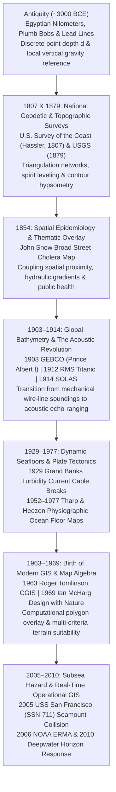

## 1.4 Historical Evolution (`gis-history` Context)

The modern Digital Elevation Model (DEM) did not emerge from abstract mathematical curiosity; it was forged through centuries of maritime disasters, public health crises, territorial exploration, submarine warfare, and large-scale civil engineering. Every foundational requirement of contemporary elevation and bathymetric modeling—shoal-biased hydrographic generalization, orthometric height datums, multi-layer terrain suitability analysis, and explicit spatial uncertainty propagation—traces directly to historical failure modes where an incomplete or inaccurate representation of the Earth's surface proved catastrophic.

---

### Antiquity: Plumb Bobs, Nilometers, and the Sounding Lead

The earliest elevation and bathymetric measurements were driven by twin existential imperatives: agricultural taxation along floodplains and vessel survival in shoaling coastal waters.

In ancient Egypt (c. 3000 BCE), surveyors (*harpedonaptai*, or "rope-stretchers") paired the **plumb bob**—a suspended weight defining the local direction of the gravity vector $\mathbf{g}(\mathbf{x})$—with the A-frame level and sighting rod to re-establish cadastral boundaries erased by the annual inundation of the Nile. Simultaneously, **nilometers**—graduated stone wells, stepped corridors, or calibrated columns (such as those at Elephantine Island at Aswan and later Roda Island in Cairo) hydrologically connected to the river—served as the world's first vertical datum gauges. Because too low a flood crest meant famine and too high a flood destroyed floodplain dikes and settlements, priests recorded daily water surface elevations $z_{\text{stage}}(t)$ (positive-up relative to an arbitrary temple sill) to forecast agricultural yields and set tax assessments.

At sea, Egyptian, Phoenician, and Greek mariners relied on the **lead line** (sounding lead), depicted in Egyptian tomb frescoes as early as 1800 BCE and documented by Herodotus (c. 450 BCE), who noted that sailors approaching the Nile Delta could cast a lead armed with tallow in its basal recess ("arming the lead") to simultaneously measure water depth $d$ (positive-down, in fathoms or cubits) and recover a physical sample of the benthic mud at eleven fathoms—a full day's sail before sighting land.

#### Physical and Geometric Error Budget of Mechanical Sounding

For nearly five millennia—from Bronze Age reed boats to the global deep-ocean expedition of *HMS Challenger* (1872–1876)—the weighted line or piano wire remained the sole instrument for measuring bathymetry. In shallow, quiescent waters, a hemp or wire line of deployed length $L$ (in $\text{m}$) approximates the true vertical depth $d_{\text{true}}$. In open ocean conditions, however, vessel drift and subsurface currents of horizontal velocity $u(z)$ exert hydrodynamic drag on the line, deflecting it from the local plumb line by an inclination angle $\theta(s)$ along the arc-length $s$ and inducing both a horizontal layback error $\Delta x_{\text{wire}}$ and a systematic **overestimation of vertical depth** ($e_d = \hat{d} - d_{\text{true}} > 0$):

$$d_{\text{true}} = \int_{0}^{L} \cos\theta(s) \, ds \le L, \qquad \Delta x_{\text{wire}} = \int_{0}^{L} \sin\theta(s) \, ds$$

where:
- $d_{\text{true}}$ is the true vertical depth from the sea surface to the seabed ($\text{m}$, positive-down),
- $\Delta x_{\text{wire}}$ is the horizontal layback displacement ($\text{m}$) between the surface vessel and the sinker's seabed impact point,
- $s \in [0, L]$ is the arc-length coordinate along the deployed sounding line ($\text{m}$),
- $L = \hat{d}$ is the total paid-out line length ($\text{m}$) after correcting for mechanical stretch $\Delta L_{\text{stretch}} = \frac{T \, L_0}{E A_c}$ under tension $T$ ($\text{N}$), Young's modulus $E$ ($\text{Pa}$), and cross-sectional area $A_c$ ($\text{m}^2$), and
- $\theta(s)$ is the local inclination angle ($\text{rad}$) of the wire relative to the local gravity vector $\mathbf{g}$.

> [!WARNING]
> **Directional Asymmetry of Wire-Line Sounding Bias:** Because $\cos\theta(s) \le 1$ for all $\theta$, uncompensated wire deflection $e_d = \Delta d_{\text{wire}} = L - d_{\text{true}} = \int_0^L \big(1 - \cos\theta(s)\big)\,ds \approx \frac{1}{2} L \overline{\theta^2} > 0$ always biases mechanical depth measurements **deeper than reality**. For example, in an abyssal cast with $L = 4000\text{ m}$ and a modest root-mean-square wire inclination of $\sqrt{\overline{\theta^2}} = 15^\circ$ ($0.2618\text{ rad}$), the catenary deflection alone overestimates depth by $\Delta d_{\text{wire}} \approx 136\text{ m}$ while displacing the horizontal sounding coordinate by $\Delta x_{\text{wire}} \approx 1035\text{ m}$. For safety of navigation, where a shoal-biased estimator ($\hat{d} \le d_{\text{true}}$, $e_d \le 0$) is required to prevent groundings, mechanical wire-line catenary error acts in the **unsafe direction**, making hazards appear deeper than they actually are. Furthermore, in abyssal depths ($d > 4000\text{ m}$), detecting the precise instant when the sinker struck the bottom was notoriously difficult; operators frequently paid out hundreds of meters of excess wire after bottom contact, spawning phantom "deeps" across 19th-century charts.

---

### 1807–1879: Geodetic Control, Thematic Spatial Analysis, and National Mapping

As maritime commerce and continental expansion accelerated in the 19th century, ad hoc local surveys could no longer prevent shipwrecks or support transcontinental infrastructure.

#### 1807: The U.S. Survey of the Coast (Thomas Jefferson and Ferdinand Hassler)

On February 10, 1807, President Thomas Jefferson signed the Act authorizing a "Survey of the Coast" of the United States—the nation's oldest scientific agency, renamed the *U.S. Coast Survey* in 1836, the *U.S. Coast and Geodetic Survey* (USC&GS) in 1878, and integrated into the National Oceanic and Atmospheric Administration (NOAA) in 1970. Jefferson selected Swiss-born geodesist **Ferdinand Rudolph Hassler** as its first superintendent. Rather than allowing disconnected harbor sketches that accumulated catastrophic positional drift at chart boundaries, Hassler insisted on a rigorous mathematical hierarchy:
1. Astronomical azimuth and latitude/longitude observations combined with precise **baseline measurements** (using temperature-compensated iron bars) and a continuous **primary triangulation network** along the coast to bound Total Horizontal Uncertainty ($\text{THU}$).
2. Topographic plane-table surveys of the shoreline tied directly to the geodetic control monuments.
3. Hydrographic lead-line surveys referenced to local tidal staff gauges, establishing the foundational separation between **geodetic datums** and **tidal chart datums** (such as Mean Lower Low Water, MLLW).

#### 1854: John Snow's Cholera Analysis and Early Hypsometric Context

During the September 1854 Soho cholera outbreak in London, physician **John Snow** (assisted by Reverend Henry Whitehead and cartographer Charles Cheffins) plotted cholera fatalities as stacked bars along street frontages together with the locations of public water pumps. Snow demonstrated that cases clustered tightly around the Broad Street pump—not according to Euclidean distance alone, but governed by the **network walking distance** and hydraulic distribution infrastructure. Crucially, during the 1840s and 1850s, the prevailing medical orthodoxy (championed by William Farr at the General Register Office) attributed cholera to "miasma" (noxious atmospheric vapors) and noted a strong inverse empirical correlation between ground surface elevation $z$ above the River Thames and cholera mortality. Snow proved that elevation was a **confounding variable**: low-lying neighborhoods along the Thames suffered higher mortality not because of heavy miasmatic air settling into topographic depressions, but because their water companies drew raw, sewage-contaminated water from the tidal reaches of the Thames, and shallow gravimetric groundwater flow carried cesspool effluent toward poorly sealed wells. Snow's 1854 investigation established the paradigm of coupling spatial point patterns with physical transport pathways—a cornerstone of modern hydro-epidemiological GIS.

#### 1879: Formation of the U.S. Geological Survey (USGS)

Prior to 1879, mapping of the American West was fragmented among four competing federal "Great Surveys" led by Clarence King, John Wesley Powell, Ferdinand Hayden, and George Wheeler. Recognizing that rational allocation of water resources, mineral extraction, and rail corridors in arid basins required unified national topographic mapping, Congress established the **U.S. Geological Survey (USGS)** on March 3, 1879, under Clarence King (succeeded in 1881 by John Wesley Powell). Powell prioritized systematic **topographic quadrangle mapping** using standardized hypsometric contour intervals ($5\text{ ft}$ to $200\text{ ft}$ depending on relief) derived from spirit leveling, theodolite triangulation, and plane-table alidade sketching. These copper-engraved (and later photolithographed) contour plates later served as the primary source data—via optical scanning and contour-to-grid interpolation—for the first generation of USGS $7.5\text{-minute}$ ($30\text{ m}$ and $10\text{ m}$) Digital Elevation Models in the 1970s and 1980s.

---

### 1903–1914: Global Bathymetry, the *RMS Titanic*, and the Acoustic Revolution

#### 1903: Prince Albert I of Monaco Initiates GEBCO

By the turn of the 20th century, deep-ocean exploration driven by submarine telegraph cable laying had yielded approximately $18,000$ deep-sea wire soundings across the globe—fewer than one measurement per $20,000\text{ km}^2$ of ocean area. In April 1903, **Prince Albert I of Monaco** convened an international commission of geographers and oceanographers led by Professor Julien Thoulet to standardize oceanic nomenclature and compile the first **General Bathymetric Chart of the Oceans (GEBCO)** at a scale of $1:10,000,000$ across 24 sheets (published in 1905). GEBCO 1st Edition introduced standardized isobaths (at $200\text{ m}$, $500\text{ m}$, $1000\text{ m}$, and $1000\text{ m}$ intervals thereafter) and standardized names for undersea features (basins, troughs, rises, and trenches), launching the continuous international compilation effort that today underpins the Nippon Foundation–GEBCO Seabed 2030 Project.

#### 1912 *RMS Titanic* Sinking and 1914 SOLAS Convention

On the night of April 14–15, 1912, the luxury liner *RMS Titanic* struck an iceberg south of the Grand Banks of Newfoundland ($41^\circ 43'\text{ N}, 49^\circ 56'\text{ W}$) and sank in $d \approx 3800\text{ m}$ of water, claiming over $1,500$ lives. The disaster exposed two fatal technological blind spots: ships lacked continuous regulation of safety and radio watchkeeping, and mariners had no means of detecting submerged hazards—whether icebergs ahead or shoaling seafloor beneath—at cruising speed.

In direct response, maritime nations adopted the first **International Convention for the Safety of Life at Sea (SOLAS)** in London on January 20, 1914 (establishing the International Ice Patrol and mandatory hydrographic hazard reporting), while physicists raced to weaponize underwater acoustics:
- Within weeks of the *Titanic* sinking, Canadian inventor **Reginald Fessenden** (working with the Submarine Signal Company in Boston) developed an electrodynamic oscillator operating at $540\text{ Hz}$ to $1\text{ kHz}$. In April 1914, aboard the U.S. Revenue Cutter *Miami* on the Grand Banks, Fessenden successfully detected both an iceberg at a horizontal range of $3.2\text{ km}$ and the acoustic reflection of the seabed at $d = 55\text{ m}$ (30 fathoms).
- Independently in 1912, German physicist **Alexander Behm** patented the *Echolot* (echo sounder), while French physicist **Paul Langevin** and Russian engineer **Constantin Chilowski** (1915–1918) developed piezoelectric quartz transducers driven by wartime anti-submarine imperatives.

Acoustic echo-sounding replaced a 4-hour stationary wire-line cast in $4000\text{ m}$ of water with a continuous, underway measurement of two-way acoustic travel time $\Delta t = 2 \int_{0}^{d} \frac{dz}{c(z)}$ (in $\text{s}$):

$$d_{\text{acoustic}} = \frac{1}{2} \int_{0}^{\Delta t} c(t) \, dt = \frac{1}{2} \bar{c}_{\text{h}} \, \Delta t, \qquad \bar{c}_{\text{h}} = \left( \frac{1}{d_{\text{acoustic}}} \int_{0}^{d_{\text{acoustic}}} \frac{dz}{c(z)} \right)^{-1}$$

where $\bar{c}_{\text{h}}$ is the depth-weighted **harmonic mean sound speed** ($\text{m}\cdot\text{s}^{-1}$, typically $1450\text{–}1540\text{ m}\cdot\text{s}^{-1}$) across the vertical water column profile $c(z)$. Note, however, that early unstabilized single-beam transducers had wide conical beamwidths ($\phi \approx 15^\circ\text{–}60^\circ$); over a seafloor of slope angle $\beta < \phi/2$, the first-arrival acoustic return reflects from the closest upslope flank rather than true nadir, recording an underestimated slant depth $d_{\text{echo}} = d_{\text{nadir}} \cos\beta$ displaced upslope by $\Delta x = d_{\text{nadir}} \sin\beta$. By the 1922 deployment of the Hayes sonic depth finder aboard *USS Stewart* and the 1925–1927 German *Meteor* Expedition in the South Atlantic ($67,000$ acoustic soundings across 13 trans-oceanic profiles), humanity discovered that the deep ocean floor was not a featureless, sediment-draped bowl, but a rugged mountain landscape.

---

### 1929–1977: Dynamic Abyssal Plains, Marie Tharp, and Plate Tectonics

#### 1929 Grand Banks Earthquake and Turbidity Current Cable Breaks

For generations, geologists assumed the deep ocean floor below wave base ($d > 200\text{ m}$) was a realm of eternal quiescence where only fine pelagic clay and biogenic ooze accumulated millimeter by millimeter. That paradigm shattered on November 18, 1929, at 16:32 UTC, when a moment magnitude $M_w = 7.2$ earthquake struck the continental slope south of Newfoundland ($44.69^\circ\text{ N}, 56.00^\circ\text{ W}$).

Six transatlantic telegraph cables lying directly within the epicentral zone on the upper continental slope ($d \approx 300\text{–}2000\text{ m}$) snapped instantaneously due to coseismic slumping. However, over the next **13 hours and 17 minutes**, six additional submarine telegraph cables lying progressively farther downslope across the Laurentian Fan and Sohm Abyssal Plain (out to $x = 600\text{ km}$ south of the epicenter and depths of $d = 5000\text{ m}$) snapped in strict chronological sequence from north to south!

In a landmark 1952 analysis, **Bruce Heezen** and **Maurice Ewing** synthesized the precise timestamps of the telegraph office voltage drops with submarine topography to prove that the earthquake had triggered a catastrophic submarine landslide that evolved into a high-density, sediment-laden **turbidity current**.

##### Worked Numerical Example: 1929 Grand Banks Turbidity Current Velocity and Slope Dynamics

Consider two sequential cable breaks downslope of the epicentral slump zone documented by Heezen and Ewing (1952):
- **Cable A (Western Union Cable, upper continental rise):** Depth $d_A = 3660\text{ m}$, distance from epicentral scarp $x_A = 185\text{ km}$, broken at elapsed time $t_A = 59\text{ min} = 3540\text{ s}$.
- **Cable B (French Atlantic Cable, lower continental rise):** Depth $d_B = 4750\text{ m}$, distance $x_B = 463\text{ km}$, broken at elapsed time $t_B = 6\text{ hr } 15\text{ min} = 22,500\text{ s}$.

1. **Mean Propagation Velocity Between Cables A and B:**

   $$\bar{v}_{AB} = \frac{x_B - x_A}{t_B - t_A} = \frac{(463 - 185) \times 10^3\text{ m}}{22,500\text{ s} - 3540\text{ s}} = \frac{2.78 \times 10^5\text{ m}}{18,960\text{ s}} \approx 14.66\text{ m}\cdot\text{s}^{-1} \approx 28.5\text{ knots } (52.8\text{ km}\cdot\text{h}^{-1})$$

   Near the steeper upper slope between the epicenter and Cable A, peak velocity exceeded $v_{\max} \approx 25\text{–}28\text{ m}\cdot\text{s}^{-1}$ ($>50\text{ knots}$).

2. **Regional Bathymetric Slope $S$ and Densimetric Froude/Chézy Coupling:**
   Under the small-angle approximation ($\beta \ll 1\text{ rad}$), the mean seafloor gradient between Cables A and B is:

   $$S = \sin\beta \approx \tan\beta = \frac{d_B - d_A}{x_B - x_A} = \frac{4750\text{ m} - 3660\text{ m}}{278,000\text{ m}} = \frac{1090}{278,000} \approx 0.00392 \quad (\beta \approx 0.225^\circ)$$

   By the modified Chézy equation for a steady, gravity-driven turbulent underflow of thickness $H$ ($\text{m}$), depth-averaged bulk density $\rho_c$ ($\text{kg}\cdot\text{m}^{-3}$), ambient seawater density $\rho_w \approx 1028\text{ kg}\cdot\text{m}^{-3}$, and combined bed plus upper-interfacial drag coefficient $C_D$ (dimensionless):

   $$v = \sqrt{\frac{g' H \sin\beta}{C_D}} \approx \sqrt{\frac{g' H S}{C_D}}, \quad \text{where } g' = g \left(\frac{\rho_c - \rho_w}{\rho_w}\right)$$

   Using $\bar{v}_{AB} = 14.66\text{ m}\cdot\text{s}^{-1}$, $S = 0.00392$, $C_D \approx 0.004$, $g = 9.81\text{ m}\cdot\text{s}^{-2}$, and a fractional excess density $(\rho_c - \rho_w)/\rho_w \approx 0.06$ ($g' \approx 0.589\text{ m}\cdot\text{s}^{-2}$), the required flow thickness is:

   $$H = \frac{v^2 C_D}{g' S} = \frac{(14.66\text{ m}\cdot\text{s}^{-1})^2 (0.004)}{(0.589\text{ m}\cdot\text{s}^{-2})(0.00392)} \approx \frac{0.8597\text{ m}^2\cdot\text{s}^{-2}}{0.002309\text{ m}\cdot\text{s}^{-2}} \approx 372\text{ m}$$

This calculation demonstrated that even across an almost imperceptible abyssal gradient of $0.225^\circ$, submarine topography funnels colossal, high-velocity turbidity currents capable of severing seabed infrastructure and depositing graded turbidite beds over $>100,000\text{ km}^2$—making high-resolution bathymetric DEMs and slope-stability mapping mandatory for modern subsea telecommunications and pipeline routing.

#### 1952, 1957, and 1977: Marie Tharp and Bruce Heezen's Ocean Floor Maps

At Columbia University's Lamont Geological Observatory in **1952**, geologist and oceanographic cartographer **Marie Tharp** began meticulously compiling and cross-referencing tens of thousands of continuous single-beam echo-sounder profiles recorded by *R/V Atlantis* and *R/V Vema* across the North Atlantic. Because women were barred from working aboard U.S. research vessels at the time, **Bruce Heezen** collected the profiles at sea while Tharp transformed raw travel-time echograms into scaled bathymetric cross-sections corrected for Matthews' sound-velocity tables.

Examining six trans-Atlantic profiles in 1952–1953, Tharp discovered a striking, v-shaped **axial rift valley** ($1.5\text{–}3\text{ km}$ deep and $15\text{–}50\text{ km}$ wide) slicing directly down the crest of the Mid-Atlantic Ridge. Heezen initially dismissed Tharp's interpretation as "girl talk," suspecting it looked too much like Alfred Wegener's discredited theory of continental drift. However, when Tharp overlaid an independent plot of oceanic earthquake epicenters (compiled for submarine cable hazard studies by Howard Foster) onto her bathymetric profiles, the epicenters aligned precisely with the floor of her rift valley and extended continuously for $65,000\text{ km}$ through the Indian, Southern, and Pacific Oceans.

Because the U.S. Navy classified quantitative bathymetric contour charts during the Cold War (to prevent Soviet submarines from using bathymetric navigation), Tharp and Heezen devised a quantitative **physiographic diagram technique**, partnering with Austrian alpine landscape painter Heinrich Berann. Their landmark **1957** North Atlantic Physiographic Diagram (published with full scientific documentation in GSA Special Paper 65 in 1959), followed by the Indian Ocean (1964) and the iconic **1977** *World Ocean Floor* Panorama, visually revealed the mid-ocean ridge system, transform fracture zones, abyssal plains, and subduction trenches to the global scientific community—providing the definitive geomorphological proof of **seafloor spreading and plate tectonics**.

---

### 1963–1969: The Birth of Modern GIS and Multi-Layer Terrain Overlay

#### 1963: Roger Tomlinson and the Canada Geographic Information System (CGIS)

While oceanographers mapped the global seabed, terrestrial resource managers faced a data-volume crisis. In **1962–1963**, geographer **Roger Tomlinson** partnered with the Canadian federal government and IBM to design the **Canada Geographic Information System (CGIS)** to process the Canada Land Inventory (CLI)—an assessment of agricultural, forestry, wildlife, and recreational capability across $2.6\text{ million km}^2$. Tomlinson coined the term *Geographic Information System*, pioneered drum-scanner digitization, established topological arc-node data structures, separated spatial geometry from relational attribute tables, and partitioned continental datasets into seamless coordinate tiles.

#### 1969: Ian McHarg's *Design with Nature*

In **1969**, landscape architect and regional planner **Ian McHarg** published his seminal treatise *Design with Nature*. Confronted with highway engineering agencies that routed expressways by optimizing pure Euclidean distance and earthwork cut-and-fill costs while ignoring ecological and hydrological consequences, McHarg formalized the **multi-layer suitability overlay** method. Using registered transparent Mylar sheets shaded by degree of constraint—topographic slope $\|\nabla z\|$, surface drainage and 50-year floodplain inundation zones, bedrock foundation stability, aquifer recharge zones, soil erosion susceptibility, wildlife habitat, and scenic value—McHarg stacked the layers over a light table to identify corridors of minimum composite social and environmental cost (such as the Richmond Parkway in Staten Island). McHarg's physical light-table overlays directly inspired C. Dana Tomlin's **Map Algebra** (focal, local, zonal, and global raster operations) that forms the computational engine of all modern raster DEM processing.

---

### 2005–2010: Subsea Groundings, Uncharted Seamounts, and Real-Time Operational GIS

Even in the 21st century, the disparity between satellite coverage of land and direct acoustic measurement of the seabed produces severe operational hazards.

#### 2005: *USS San Francisco* (SSN-711) Seamount Collision

On January 8, 2005, the *Los Angeles*-class nuclear-powered fast-attack submarine ***USS San Francisco* (SSN-711)** was transiting submerged at flank speed ($\sim 33\text{ knots} \approx 17\text{ m}\cdot\text{s}^{-1}$) at a depth of $d = 160\text{ m}$ ($525\text{ ft}$) roughly $580\text{ km}$ southeast of Guam in the Caroline Islands ($7^\circ 45'\text{ N}, 147^\circ 12'\text{ E}$). Without warning, the submarine slammed head-on into an **uncharted conical seamount**, crushing its forward sonar dome and main ballast tanks, tragically killing Machinist's Mate Second Class Joseph Allen Ashley, and injuring 97 crew members (nearly the entire crew). Only heroic emergency blow procedures enabled the crippled vessel to surface and limp back to Guam.

How could a modern nuclear submarine strike an undersea mountain in 2005?
1. **Chart Generalization and Trackline Sparsity:** The primary navigational chart aboard *USS San Francisco* indicated thousands of meters of open water with no hazards within miles of the track. Surrounding legacy soundings were sparse single-beam tracks spaced tens of kilometers apart ($\Delta Y_{\text{track}} \sim 20\text{–}50\text{ km}$). A conical volcanic seamount rising from an abyssal plain at $d_0 = 4000\text{ m}$ to a shoal summit depth $d_{\text{min}} = 50\text{ m}$ with flank slope $\alpha = 22^\circ$ has a basal radius:

   $$R_{\text{base}} = \frac{d_0 - d_{\text{min}}}{\tan\alpha} = \frac{4000\text{ m} - 50\text{ m}}{\tan 22^\circ} \approx \frac{3950\text{ m}}{0.4040} \approx 9777\text{ m} \approx 9.8\text{ km}$$

   Because its total basal diameter ($2 R_{\text{base}} \approx 19.6\text{ km}$) is smaller than the historical inter-track spacing $\Delta Y_{\text{track}}$, the entire mountain sat undetected inside the unsounded void between legacy ship tracks.
2. **Upward-Continuation Attenuation in Satellite Altimetry:** Satellite radar altimeters (e.g., Geosat, ERS-1, Jason-1; Smith & Sandwell, 1997) do not measure the seafloor directly; they measure the sea surface height (geoid undulation $\Delta N$, related in the wavenumber domain to the gravity anomaly $\Delta\hat{g}(k)$ via Bruns' formula $\Delta\hat{N}(k) = \frac{\Delta\hat{g}(k)}{g_0 k}$, where $g_0 \approx 9.80\text{ m}\cdot\text{s}^{-2}$ is normal gravity) caused by the gravitational attraction of subsea mass anomalies. By Parker's (1973) linear potential-field Fourier relation, the sea-surface gravity anomaly $\Delta\hat{g}(k)$ at horizontal radial wavenumber $k = 2\pi/\lambda$ ($\text{rad}\cdot\text{m}^{-1}$, for topographic wavelength $\lambda$) is exponentially attenuated by upward continuation through the mean water depth $d_0$:

   $$\Delta\hat{g}(k) = 2\pi G (\rho_{\text{crust}} - \rho_w) \, e^{-k d_0} \, \hat{h}(k)$$

   where $G = 6.674 \times 10^{-11}\text{ m}^3\cdot\text{kg}^{-1}\cdot\text{s}^{-2}$, $\rho_{\text{crust}} \approx 2700\text{ kg}\cdot\text{m}^{-3}$, $\rho_w \approx 1028\text{ kg}\cdot\text{m}^{-3}$, and $\hat{h}(k)$ is the Fourier transform of seafloor relief $h(\mathbf{x}) = d_0 - d(\mathbf{x})$. For a narrow seamount crest with characteristic wavelength $\lambda = 6\text{ km}$ in $d_0 = 4\text{ km}$ depth, the upward-continuation filter factor is $e^{-2\pi(4)/6} = e^{-4.189} \approx 0.015$, attenuating $98.5\%$ of the short-wavelength peak signal! Consequently, altimetry-derived bathymetry smooths out narrow conical summits and can underestimate the shoalest peak of a steep seamount by $>1000\text{ m}$. Ironically, Landsat multi-spectral optical imagery (examined *after* the collision) showed a faint surface water discoloration over the shoal peak, but that layer had not been fused into the submarine's operational navigation chart.

#### 2006 NOAA ERMA and the 2010 *Deepwater Horizon* Response

Recognizing that disconnected agency silos and static paper charts cripple disaster response, NOAA and the University of New Hampshire's Coastal Response Research Center developed the **Environmental Response Management Application (ERMA)** beginning in **2006**. ERMA was architected as a web-based, cloud-enabled common operational picture (COP) capable of fusing real-time sensor feeds, multibeam bathymetric DEMs, coastal LiDAR topobathymetry, hydrodynamic current trajectories, and ecological sensitivity layers.

When the *Deepwater Horizon* mobile offshore drilling unit exploded and sank in $d \approx 1522\text{ m}$ ($4993\text{ ft}$) of water in Mississippi Canyon Block 252 on April 20, **2010**, ERMA became the official federal geospatial platform for the entire Unified Command response. Integrating high-resolution multibeam and ROV bathymetry around the damaged wellhead, deep-ocean acoustic Doppler current profiles tracking subsurface hydrocarbon plumes along bathymetric contours, and coastal topobathymetric DEMs governing marsh inundation along the Gulf of Mexico, ERMA demonstrated how modern elevation and bathymetric data infrastructures function as real-time life-and-ecosystem support systems.

---

### Summary Comparison of Historical Elevation and Bathymetric Eras

| Historical Era & Milestone | Primary Measurement Physics | Typical Spatial Sampling / Resolution | Vertical Uncertainty ($\text{TVU}$, $95\%$) | Horizontal Uncertainty ($\text{THU}$, $95\%$) | Dominant Error Source / Failure Mode |
| :--- | :--- | :--- | :--- | :--- | :--- |
| **Antiquity – 1870s** Lead Line & Nilometer | Mechanical hemp/wire line ($L$) & visual staff gauge | Discrete point casts ($10^1\text{–}10^5\text{ m}$ spacing) | $\pm 0.2\text{ m}$ (harbor) to $+200\text{ m}$ bias (abyssal) | $\pm 50\text{ m}$ (visual sextant angles) to $\pm 15\text{ km}$ (celestial dead reckoning) | Catenary current drag ($\cos\theta < 1$), bottom-contact over-payout, unrecorded tidal stage |
| **1807 – 1920s** Hassler USC&GS & USGS Quads | Theodolite triangulation, spirit leveling, wire drag | $1:24,000$ to $1:250,000$ contours; coastal wire sweeps | $\pm 0.01\text{ m}\sqrt{K}$ (leveling) to $\pm \frac{1}{2}$ contour interval | $\pm 1\text{–}15\text{ m}$ (triangulation network) | Deflection of the vertical ($\xi, \eta$), manual contour interpolation smoothing between stations |
| **1914 – 1970s** Single-Beam Echo Sounding (SOLAS / Tharp & Heezen) | Wide-beam ($15^\circ\text{–}60^\circ$) acoustic travel time $\Delta t$ | Continuous along-track ($10\text{–}100\text{ m}$), sparse cross-track ($5\text{–}100\text{ km}$) | $\pm 1\text{–}2\%$ of depth $d$ ($\pm 40\text{–}80\text{ m}$ at $d=4\text{ km}$) | $\pm 100\text{ m}$ (LORAN-C) to $\pm 2\text{ km}$ (celestial/Transit) | Hyperbolic slope returns ($d_{\text{echo}} = d_{\text{nadir}}\cos\beta$), sound-speed profile $\bar{c}_{\text{h}}$ error, huge inter-track voids |
| **1970s – Present** Satellite Altimetry Predicted Bathymetry | Radar range to sea-surface geoid anomaly $\Delta N \leftrightarrow \Delta g \to \Delta d$ | Global $15\text{ arc-sec}$ to $1\text{ arc-min}$ ($\sim 0.5\text{–}1.85\text{ km}$) grid; resolves $\lambda > 12\text{ km}$ | $\pm 100\text{ m}$ to $>1000\text{ m}$ over steep seamounts | $\pm 1\text{–}3\text{ km}$ (effective gravitational footprint) | Upward-continuation filtering ($e^{-2\pi d_0/\lambda}$), variable sediment thickness, flexural isostasy (*USS San Francisco*) |
| **1990s – Present** Airborne LiDAR, InSAR & Multibeam Echo Sounder (MBES) | Narrow-beam ($0.5^\circ \times 0.5^\circ$) swath acoustics & laser TOF + GNSS/INS | $0.25\text{–}2\text{ m}$ (3DEP QL1/QL2 LiDAR & shallow MBES); $25\text{–}100\text{ m}$ (deep MBES) | $\pm 0.196\text{ m}$ (USGS 3DEP QL2 $\text{VVA}_{95}$); $\pm \sqrt{a^2 + (b\cdot d)^2}$ (IHO S-44 MBES) | $\pm 0.10\text{–}0.50\text{ m}$ (RTK/PPK GNSS); $2\text{ m}$ to $5\text{ m} + 0.05 d$ (IHO S-44 Special/Order 1a MBES) | Ray-bending refraction ($\nabla c(z)$), GNSS multipath, vegetation canopy penetration, datum conversion blunders |

---

### Common Pitfalls & Key Takeaways

> [!WARNING]
> **Common Historical & Operational Pitfalls**
> 1. **Confusing "Gridded Coverage" with "Measured Coverage" (The *USS San Francisco* Fallacy):** A global bathymetric grid (such as GEBCO or SRTM15+) contains a numerical depth value in $100\%$ of its ocean pixels, yet as of the mid-2020s, nearly $73\%$ of the global seafloor has never been directly measured by acoustic echo sounders. Always inspect the accompanying **GEBCO Type Identifier (TID)** grid or IHO S-102 uncertainty layer—where $\text{TID} \in [10, 17]$ indicates direct acoustic/lidar measurements and $\text{TID} \in [40, 44]$ flags satellite-altimetry-predicted or interpolated pixels—before using bathymetry for navigation or engineering design.
> 2. **Ignoring Legacy Sensor Physics When Fusing Archival Data:** Merging 19th-century lead-line soundings (biased deep by wire catenary $\cos\theta < 1$), 1950s wide-beam single-beam echograms (biased shoal on slopes by first-arrival off-nadir reflections $d_{\text{nadir}}\cos\beta$), and modern multibeam swaths without sensor-specific Total Propagated Uncertainty (TPU) weights introduces severe artifacts—such as artificial "pockmarks" or phantom ridges along historical ship tracks.

> [!IMPORTANT]
> **Key Takeaways**
> - **Disasters Drive Standards:** The 1807 founding of the U.S. Survey of the Coast, the 1912 *RMS Titanic* sinking (catalyzing the 1914 SOLAS Convention and acoustic echo sounding), the 1929 Grand Banks turbidity current cable breaks, and the 2005 *USS San Francisco* seamount collision each forced paradigm shifts in how humanity measures, generalizes, and validates elevation and depth.
> - **The Seafloor Is Geologically Active and Topographically Complex:** From Bruce Heezen and Maurice Ewing's 1952 proof of high-speed abyssal turbidity currents to Marie Tharp's 1952–1977 discovery of the Mid-Atlantic Ridge axial rift valley, bathymetric mapping transformed Earth science from static continental geology to dynamic plate tectonics.
> - **Terrain Analysis Is Multi-Layered and Uncertainty-Bound:** John Snow's 1854 cholera analysis, Roger Tomlinson's 1963 CGIS, Ian McHarg's 1969 *Design with Nature*, and NOAA's 2006/2010 ERMA platform established that elevation models realize their full societal value only when integrated with hydrological, infrastructure, and uncertainty layers inside a rigorous geospatial reference framework.

---

### Curated Key References

* **Heezen, B. C., & Ewing, M.** (1952). Turbidity currents and submarine slumps, and the 1929 Grand Banks [Newfoundland] earthquake. *American Journal of Science*, 250(12), 849–873. https://doi.org/10.2475/ajs.250.12.849
* **Heezen, B. C., Tharp, M., & Ewing, M.** (1959). *The Floors of the Oceans: I. The North Atlantic*. Geological Society of America Special Paper 65. https://doi.org/10.1130/SPE65-p1
* **McHarg, I. L.** (1969). *Design with Nature*. Natural History Press.
* **National Research Council (NRC).** (1994). *Charting a Course into the Digital Era: Guidance for NOAA's Nautical Charting Mission*. National Academies Press. https://doi.org/10.17226/4778
* **Parker, R. L.** (1973). The rapid calculation of potential anomalies. *Geophysical Journal of the Royal Astronomical Society*, 31(4), 447–455. https://doi.org/10.1111/j.1365-246X.1973.tb06513.x
* **Smith, W. H. F., & Sandwell, D. T.** (1997). Global sea floor topography from satellite altimetry and ship depth soundings. *Science*, 277(5334), 1956–1962. https://doi.org/10.1126/science.277.5334.1956
* **Snow, J.** (1855). *On the Mode of Communication of Cholera* (2nd ed.). John Churchill.
* **Tomlinson, R. F.** (1967). *An Introduction to the Geo-Information System of the Canada Land Inventory*. Department of Forestry and Rural Development, Ottawa, Canada.
* **Wright, D. J.** (Ed.). (2002). *Undersea with GIS*. Esri Press.
