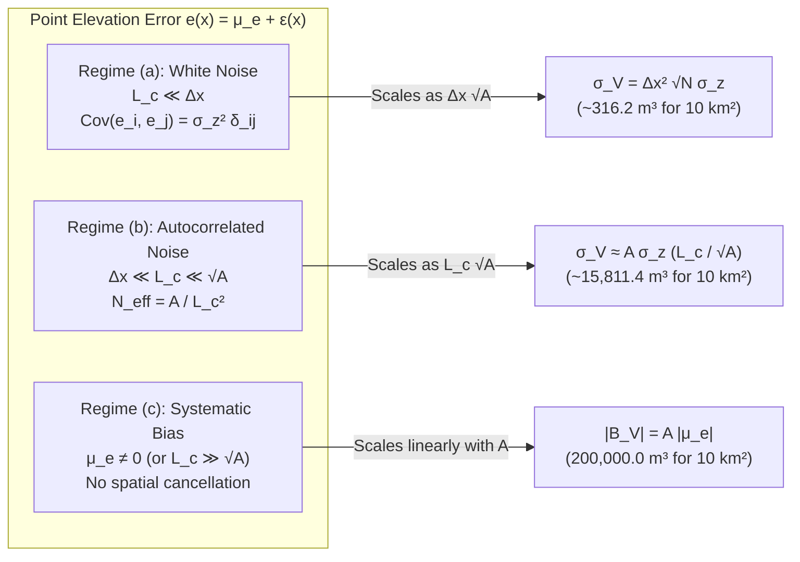

## 1.5 Mathematical Foundations

The operational trade-offs introduced in Sections 1.1 through 1.4—whether a surface must conserve volume, bound the shallowest hazard, or propagate a geophysical wave at the correct phase velocity—are governed by three mathematical pillars: **spatial covariance integration** for volumetric error budgets, **order statistics and Bayesian decision theory** for asymmetric risk-averse gridding, and **variational perturbation analysis** of shallow-water wave mechanics.

---

### 1.5.1 Volumetric Error Propagation Over a Domain $\Omega$

Many civil engineering, geomorphological, and hydrographic applications—including highway cut-and-fill earthwork, harbor capital dredging, reservoir storage capacity, and glacial or coastal sediment mass balances—require integrating a Digital Elevation Model (DEM) over a bounded two-dimensional spatial domain $\Omega \subset \mathbb{R}^2$ of total planimetric area $A = \iint_\Omega d\mathbf{x}$ (in $\text{m}^2$, evaluated in an equal-area or local tangent plane coordinate system $\mathbf{x} = (x, y)^\top$).

#### Continuous and Discrete Error Decomposition

Let $z(\mathbf{x})$ denote the true physical elevation (positive-up, in $\text{m}$) at horizontal coordinates $\mathbf{x} \in \Omega$, and let $\hat{z}(\mathbf{x})$ denote the DEM estimate. The point vertical error field $e(\mathbf{x})$ is decomposed into a deterministic systematic bias $\mu_e(\mathbf{x}) = \mathbb{E}[e(\mathbf{x})]$ and a zero-mean stochastic residual field $\varepsilon(\mathbf{x})$:

$$\hat{z}(\mathbf{x}) = z(\mathbf{x}) + e(\mathbf{x}), \qquad e(\mathbf{x}) = \mu_e(\mathbf{x}) + \varepsilon(\mathbf{x}), \qquad \mathbb{E}[\varepsilon(\mathbf{x})] = 0$$

The spatial second-moment structure of the random residual field is characterized by its autocovariance kernel $C_\varepsilon(\mathbf{x}, \mathbf{x}')$:

$$C_\varepsilon(\mathbf{x}, \mathbf{x}') = \operatorname{Cov}\!\left(e(\mathbf{x}), e(\mathbf{x}')\right) = \mathbb{E}\!\left[\varepsilon(\mathbf{x})\,\varepsilon(\mathbf{x}')\right] = \sigma_z(\mathbf{x})\,\sigma_z(\mathbf{x}')\,\rho(\mathbf{x}, \mathbf{x}')$$

where $\sigma_z(\mathbf{x}) = \sqrt{\operatorname{Var}(e(\mathbf{x}))}$ is the point vertical standard deviation ($\text{m}$) and $\rho(\mathbf{x}, \mathbf{x}') \in [-1, 1]$ is the dimensionless spatial autocorrelation function.

The true volume above a reference datum plane $z = 0$ is $V = \iint_\Omega z(\mathbf{x})\,d\mathbf{x}$, and the estimated volume is $\hat{V} = \iint_\Omega \hat{z}(\mathbf{x})\,d\mathbf{x}$. By linearity of the integral operator, the total volumetric error $\Delta V = \hat{V} - V$ ($\text{m}^3$) is:

$$\Delta V = \iint_\Omega e(\mathbf{x})\,d\mathbf{x} = \underbrace{\iint_\Omega \mu_e(\mathbf{x})\,d\mathbf{x}}_{\text{Systematic Volumetric Bias } B_V} + \underbrace{\iint_\Omega \varepsilon(\mathbf{x})\,d\mathbf{x}}_{\text{Random Volumetric Error } \delta V_{\text{rand}}}$$

Taking the expectation yields the systematic volumetric bias $B_V = \mathbb{E}[\Delta V] = \iint_\Omega \mu_e(\mathbf{x})\,d\mathbf{x}$. By Fubini's theorem, the variance of the volumetric error $\sigma_V^2 = \operatorname{Var}(\Delta V) = \mathbb{E}\!\left[(\Delta V - B_V)^2\right]$ is obtained by squaring the stochastic integral and commuting expectation with integration:

$$\sigma_V^2 = \mathbb{E}\!\left[\left(\iint_\Omega \varepsilon(\mathbf{x})\,d\mathbf{x}\right)\left(\iint_\Omega \varepsilon(\mathbf{x}')\,d\mathbf{x}'\right)\right] = \iint_\Omega \iint_\Omega \operatorname{Cov}\!\left(e(\mathbf{x}), e(\mathbf{x}')\right) d\mathbf{x}\,d\mathbf{x}'$$

Combining the systematic bias and random variance gives the total Root Mean Square Volumetric Error ($\text{RMSE}_V$):

$$\operatorname{RMSE}_V = \sqrt{\mathbb{E}\!\left[(\Delta V)^2\right]} = \sqrt{B_V^2 + \sigma_V^2} = \sqrt{\left(\iint_\Omega \mu_e(\mathbf{x})\,d\mathbf{x}\right)^2 + \iint_\Omega \iint_\Omega \operatorname{Cov}\!\left(e(\mathbf{x}), e(\mathbf{x}')\right) d\mathbf{x}\,d\mathbf{x}'}$$

In a discrete regular grid comprising $N$ square cells of resolution $\Delta x = \Delta y$ (cell area $a = \Delta x^2$ and total domain area $A = N \Delta x^2$), this double integral reduces to the quadratic form:

$$\sigma_V^2 = \Delta x^4 \sum_{i=1}^{N} \sum_{j=1}^{N} \operatorname{Cov}(e_i, e_j) = \Delta x^4 \sum_{i=1}^{N} \sigma_{z,i}^2 + \Delta x^4 \sum_{i=1}^{N} \sum_{\substack{j=1 \\ j \neq i}}^{N} \sigma_{z,i}\,\sigma_{z,j}\,\rho_{ij}$$

When computing a **DEM of Difference (DoD)** volume $\Delta V_{\text{DoD}} = \iint_\Omega \left(\hat{z}_2(\mathbf{x}) - \hat{z}_1(\mathbf{x})\right) d\mathbf{x}$ between two survey epochs $t_1$ and $t_2$ (e.g., pre- and post-dredge bathymetry or multi-temporal glacial mass balance), the point elevation-change error is $e_{\Delta z}(\mathbf{x}) = e_2(\mathbf{x}) - e_1(\mathbf{x})$ with differential bias $\mu_{\Delta z} = \mu_{e,2} - \mu_{e,1}$ and point variance $\sigma_{\Delta z}^2(\mathbf{x}) = \sigma_{z,1}^2(\mathbf{x}) + \sigma_{z,2}^2(\mathbf{x}) - 2\operatorname{Cov}\!\left(e_1(\mathbf{x}), e_2(\mathbf{x})\right)$. Co-registering the two epochs over stable control terrain removes the common-mode vertical datum offset ($\mu_{\Delta z} \to 0$), leaving the spatially autocorrelated differential residual field.

#### The Three Limiting Regimes of Volumetric Uncertainty

Assuming a second-order stationary (homogeneous and isotropic) error field with constant point standard deviation $\sigma_z$, constant vertical bias $\mu_e$, and isotropic correlation function $\rho(\tau)$ where $\tau = \|\mathbf{x} - \mathbf{x}'\|_2$, the double integral exhibits three distinct asymptotic regimes governed by the ratio of the spatial correlation length $L_c$ to the grid spacing $\Delta x$ and domain scale $\sqrt{A}$ (Rolstad et al., 2009; Hugonnet et al., 2022):

1. **Regime (a): Uncorrelated White Noise ($L_c \ll \Delta x$).**
   When errors are mutually independent between adjacent grid cells ($\rho_{ij} = \delta_{ij}$, the Kronecker delta), all off-diagonal covariance terms vanish ($\sum_{i \neq j} \operatorname{Cov}(e_i, e_j) = 0$). Only the $N$ diagonal variance terms survive:
   $$\sigma_{V,\text{uncorr}}^2 = \Delta x^4 \sum_{i=1}^{N} \sigma_z^2 = N\,\Delta x^4\,\sigma_z^2 \implies \sigma_{V,\text{uncorr}} = \Delta x^2 \sqrt{N}\,\sigma_z = \Delta x \sqrt{A}\,\sigma_z = \frac{A}{\sqrt{N}}\,\sigma_z$$
   In this regime, random positive and negative elevation errors cancel rapidly across cells, reducing the relative volumetric uncertainty by the Central Limit Theorem factor $1/\sqrt{N}$.

2. **Regime (b): Spatially Autocorrelated Random Error ($\Delta x \ll L_c \ll \sqrt{A}$).**
   Real-world DEM errors are rarely white noise; airborne lidar strip adjustments, GNSS trajectory drifts, photogrammetric bundle blocks, and multibeam echosounder (MBES) heave/refraction artifacts exhibit strong spatial autocorrelation over characteristic correlation lengths $L_c$ ranging from $10\text{ m}$ to several kilometers. Changing variables in the inner integral to lag $\boldsymbol{\tau} = \mathbf{x}' - \mathbf{x}$ for a domain much larger than the correlation patch ($A \gg L_c^2$, so boundary truncation is negligible) yields:
   $$\sigma_{V,\text{corr}}^2 = \sigma_z^2 \iint_\Omega \left[ \iint_\Omega \rho(\|\mathbf{x}' - \mathbf{x}\|_2)\,d\mathbf{x}' \right] d\mathbf{x} \approx \sigma_z^2 \iint_\Omega \left[ \int_0^{2\pi} \int_0^\infty \rho(\tau)\,\tau\,d\tau\,d\theta \right] d\mathbf{x}$$
   For a Gaussian autocorrelation kernel $\rho(\tau) = \exp(-\pi \tau^2 / L_c^2)$ normalized such that the effective correlation area is $A_c = 2\pi \int_0^\infty \rho(\tau)\,\tau\,d\tau = L_c^2$ (for standard Gaussian $\exp(-\tau^2/l^2)$, exponential $\exp(-\tau/l)$, or 2D spherical variogram kernels of range $a_s$, the correlation area is $L_c^2 = \pi l^2$, $2\pi l^2$, or $\frac{\pi}{5}a_s^2$, respectively), the inner integral evaluates to $L_c^2$, and the outer integral over $\Omega$ evaluates to $A$:
   $$\sigma_{V,\text{corr}}^2 \approx A\,\sigma_z^2\,L_c^2 \implies \sigma_{V,\text{corr}} \approx \sqrt{A}\,L_c\,\sigma_z = A\,\sigma_z\,\frac{L_c}{\sqrt{A}} = \frac{A}{\sqrt{N_{\text{eff}}}}\,\sigma_z$$
   Here, $N_{\text{eff}} = A / L_c^2 \ll N$ is the **effective number of independent spatial degrees of freedom** (independent correlation patches) inside $\Omega$. Crucially, $\sigma_{V,\text{corr}}$ is completely independent of the grid spacing $\Delta x$: resampling or gridding at a finer pixel size increases $N$ but does not increase $N_{\text{eff}}$.

3. **Regime (c): Systematic Vertical Datum or Calibration Bias ($\mu_e \neq 0$ or $L_c \gg \sqrt{A}$).**
   When a constant vertical offset $\mu_e$ is present—due to a vertical datum transformation error, tidal zoning bias, uncalibrated GNSS antenna phase-center offset, or vegetative canopy penetration bias—no spatial cancellation occurs:
   $$\lvert B_V \rvert = \left\lvert \iint_\Omega \mu_e\,d\mathbf{x} \right\rvert = A\,\lvert \mu_e \rvert$$
   Because $\lvert B_V \rvert$ scales linearly with area ($A^1$), whereas spatially correlated random error scales with the half-power of area ($A^{1/2}$), systematic bias inevitably dominates volumetric error budgets as project area $A$ grows.

#### Worked Numerical Example: $10\text{ km}^2$ Capital Dredging / Earthwork Project

Consider a coastal port channel capital dredging project (or an equivalent large highway earthwork corridor) covering a planimetric domain of $A = 10\text{ km}^2 = 1.0 \times 10^7\text{ m}^2$, gridded at $\Delta x = 1.0\text{ m}$ ($a = 1.0\text{ m}^2$, $N = 10^7$ grid cells). Survey verification indicates:
* Point random vertical standard deviation: $\sigma_z = 0.10\text{ m}$ ($10\text{ cm}$)
* Spatial correlation length (from variogram analysis of vessel heave/tide and acoustic velocity profiles): $L_c = 50\text{ m}$
* Residual systematic vertical datum / calibration bias: $\mu_e = +0.02\text{ m}$ ($2\text{ cm}$)

Evaluating the three volumetric uncertainty components demonstrates the catastrophic error of assuming uncorrelated grid noise:

1. **Naïve Uncorrelated White-Noise Estimate (Regime a):**
   $$\sigma_{V,\text{uncorr}} = (1.0\text{ m}^2)\sqrt{10^7}\,(0.10\text{ m}) = 3{,}162.28 \times 0.10\text{ m}^3 \approx 316.2\text{ m}^3$$
2. **Spatially Autocorrelated Random Error (Regime b):**
   The effective number of independent correlation patches is $N_{\text{eff}} = A / L_c^2 = 10^7\text{ m}^2 / (50\text{ m})^2 = 4{,}000$ (rather than $10^7$ cells):
   $$\sigma_{V,\text{corr}} \approx (1.0 \times 10^7\text{ m}^2)(0.10\text{ m})\frac{50\text{ m}}{\sqrt{1.0 \times 10^7\text{ m}^2}} = \frac{10^6\text{ m}^3}{\sqrt{4{,}000}} \approx 15{,}811.4\text{ m}^3$$
   Accounting for the $50\text{ m}$ correlation length increases the random volumetric uncertainty by a factor of $L_c / \Delta x = 50$.
3. **Systematic Bias Contribution (Regime c):**
   $$\lvert B_V \rvert = A\,\lvert \mu_e \rvert = (1.0 \times 10^7\text{ m}^2)(0.02\text{ m}) = 200{,}000.0\text{ m}^3$$
4. **Total Root Mean Square Volumetric Error:**
   $$\operatorname{RMSE}_V = \sqrt{(200{,}000.0)^2 + (15{,}811.4)^2} \approx 200{,}624.0\text{ m}^3$$

| Error Regime | Governing Equation | Scaling with Area $A$ | Effective DOF | Volumetric Uncertainty ($10\text{ km}^2$ Example) | Financial Exposure (at $\$25/\text{m}^3$) |
| :--- | :--- | :--- | :--- | :--- | :--- |
| **(a) Uncorrelated White Noise** | $\sigma_V = \Delta x \sqrt{A}\,\sigma_z$ | $\propto A^{1/2}$ (suppressed by $\Delta x$) | $N = A / \Delta x^2 = 10^7$ | $316.2\text{ m}^3$ ($\sigma_z = 10\text{ cm}$) | $\$7{,}905$ |
| **(b) Autocorrelated Noise** | $\sigma_V \approx L_c \sqrt{A}\,\sigma_z$ | $\propto A^{1/2}$ (controlled by $L_c$) | $N_{\text{eff}} = A / L_c^2 = 4{,}000$ | $15{,}811.4\text{ m}^3$ ($\sigma_z = 10\text{ cm}, L_c = 50\text{ m}$) | $\$395{,}285$ |
| **(c) Systematic Datum Bias** | $\lvert B_V \rvert = A\,\lvert \mu_e \rvert$ | $\propto A^1$ (no cancellation) | $1$ (global offset) | $200{,}000.0\text{ m}^3$ ($\lvert \mu_e \rvert = 2\text{ cm}$) | $\$5{,}000{,}000$ |

> [!WARNING]
> **The $2\text{ cm}$ Bias Trap in Earthwork and Dredging Contracts:** In the $10\text{ km}^2$ example above, a seemingly tiny $2\text{ cm}$ systematic vertical datum or sound-speed bias produces **$200{,}000\text{ m}^3$** of volumetric error—over **$12.6\times$ larger** than the spatially correlated $10\text{ cm}$ random noise ($15{,}811.4\text{ m}^3$) and **$632\times$ larger** than the naïve white-noise estimate ($316.2\text{ m}^3$). At a representative marine dredging unit cost of $\$25/\text{m}^3$, that $2\text{ cm}$ vertical bias represents a **$\$5.0\text{ million}$** billing overpayment or claim dispute.

---

### 1.5.2 Order Statistics, Extreme-Value Distributions, and Bayesian Asymmetric Loss

When $M$ raw point measurements $\{Z_1, Z_2, \dots, Z_M\}$ fall within a single DEM grid cell $C_{ij}$ of size $\Delta x \times \Delta y$, reducing those $M$ observations to a single cell value $\hat{z}_{ij}$ requires choosing a statistical estimator that matches the operational risk profile of the end user.

#### Order Statistics of Sample Extrema

Suppose the $M$ within-cell observations are independent and identically distributed (i.i.d.) random variables drawn from a parent distribution with cumulative distribution function (CDF) $F_Z(z) = \mathbb{P}(Z \le z)$ and probability density function (PDF) $f_Z(z) = dF_Z/dz$. Sorting the observations in ascending order yields the **order statistics** $Z_{(1)} \le Z_{(2)} \le \cdots \le Z_{(M)}$:
* **Tallest-Obstacle Estimator (Aviation / Telecommunications):** In a positive-up elevation convention $z$, the highest obstacle is the sample maximum $Z_{(M)} = \max_{1 \le k \le M} Z_k$. Because $Z_{(M)} \le z$ if and only if all $M$ observations satisfy $Z_k \le z$, its exact CDF and PDF are:
  $$F_{Z_{(M)}}(z) = \left[F_Z(z)\right]^M, \qquad f_{Z_{(M)}}(z) = M\left[F_Z(z)\right]^{M-1} f_Z(z)$$
* **Shoalest-Point Estimator (Hydrographic Safety of Navigation):** In a positive-down depth convention $d = -z$ (where smaller $d$ means shallower water and greater grounding hazard), the shoalest sounding in the cell is the sample minimum $D_{(1)} = \min_{1 \le k \le M} D_k$. Because $D_{(1)} > d$ if and only if all $M$ depth soundings exceed $d$, the exact CDF and PDF of the minimum depth are:
  $$F_{D_{(1)}}(d) = 1 - \left[1 - F_D(d)\right]^M, \qquad f_{D_{(1)}}(d) = M\left[1 - F_D(d)\right]^{M-1} f_D(d)$$

By the Fisher–Tippett–Gnedenko theorem, if the parent measurement noise is Gaussian, $Z_k \sim \mathcal{N}(\mu_z, \sigma_z^2)$, the normalized sample extremum converges asymptotically as $M \to \infty$ to the Type I Extreme Value (Gumbel) distribution, with expected value shifting monotonically away from the mean:

$$\mathbb{E}\!\left[Z_{(M)}\right] \approx \mu_z + \sigma_z\left(\sqrt{2\ln M} - \frac{\ln\ln M + \ln(4\pi) - 2\gamma_{\text{EM}}}{2\sqrt{2\ln M}}\right), \qquad \mathbb{E}\!\left[D_{(1)}\right] \approx \mu_d - \sigma_d\sqrt{2\ln M}$$

where $\gamma_{\text{EM}} \approx 0.5772$ is the Euler–Mascheroni constant. Consequently, pure sample extrema ($\min d_k$ or $\max z_k$) are statistically inconsistent estimators of the true seabed or terrain surface in the presence of random measurement noise: as modern high-density multibeam or lidar sensors increase the sounding density $M$ per cell from $10$ to $10^4$, the leading-order shoal bias $-\sigma_d\sqrt{2\ln M}$ grows from $-2.15\sigma_d$ to $-4.29\sigma_d$ (or from $-1.54\sigma_d$ to $-3.85\sigma_d$ when including the finite-sample sub-leading correction), guaranteeing that uncleaned "shoal-biased" binning latches onto false acoustic spikes or atmospheric multipath blunders.

#### Bayesian Asymmetric Loss Minimization and Quantile Surface Estimators

To decouple physical safety margins from raw point density $M$, modern statistical surface estimators—such as the Combined Uncertainty and Bathymetry Estimator (CUBE; Calder & Mayer, 2003) in hydrography and quantile kriging in terrain modeling—formulate cell estimation as a **Bayesian decision problem**. Given posterior belief $f_Z(z \mid \mathcal{D})$ for the true surface elevation $Z$ in a cell conditioned on the cleaned data $\mathcal{D}$, we seek the point estimate $\hat{z}$ that minimizes the expected posterior risk $\mathcal{R}(\hat{z}) = \mathbb{E}\!\left[\mathcal{L}(\hat{z}, Z) \mid \mathcal{D}\right] = \int_{-\infty}^{\infty} \mathcal{L}(\hat{z}, z)\,f_Z(z \mid \mathcal{D})\,dz$ under an application-specific loss function $\mathcal{L}(\hat{z}, z)$:

1. **Quadratic Loss (Earthwork & Mass Balance):** When over-prediction and under-prediction carry equal marginal cost proportional to squared error, $\mathcal{L}_2(\hat{z}, z) = (\hat{z} - z)^2$. Differentiating $\mathcal{R}(\hat{z})$ with respect to $\hat{z}$ yields the **posterior mean** (unbiased central-tendency estimator):
   $$\frac{d}{d\hat{z}} \int_{-\infty}^{\infty} (\hat{z} - z)^2 f_Z(z \mid \mathcal{D})\,dz = 2\int_{-\infty}^{\infty} (\hat{z} - z) f_Z(z \mid \mathcal{D})\,dz = 0 \implies \hat{z}^*_{\text{mean}} = \mathbb{E}[Z \mid \mathcal{D}]$$

2. **Asymmetric Linear ("Pinball" / Check) Loss (Navigation & Aviation Safety):** When under-predicting an obstacle height ($z > \hat{z}$) incurs a catastrophic safety penalty per unit height $c_{\text{under}} > 0$ (e.g., aircraft controlled flight into terrain or ship grounding), whereas over-predicting ($z < \hat{z}$) incurs a smaller operational efficiency penalty $c_{\text{over}} > 0$ (e.g., reduced cargo draft or steeper climb gradient), let $\alpha = c_{\text{under}} / (c_{\text{under}} + c_{\text{over}}) \in (0, 1)$ denote the normalized asymmetry weight. The check loss function of Koenker and Bassett (1978) is:
   $$\mathcal{L}_\alpha(\hat{z}, z) = (z - \hat{z})\left(\alpha - \mathbb{I}(z < \hat{z})\right) = \begin{cases} \alpha\,(z - \hat{z}) & \text{if } z \ge \hat{z} \\ (1 - \alpha)\,(\hat{z} - z) & \text{if } z < \hat{z} \end{cases}$$
   Splitting the expected risk integral at $\hat{z}$ gives:
   $$\mathcal{R}(\hat{z}) = \alpha \int_{\hat{z}}^{\infty} (z - \hat{z})\,f_Z(z \mid \mathcal{D})\,dz + (1 - \alpha) \int_{-\infty}^{\hat{z}} (\hat{z} - z)\,f_Z(z \mid \mathcal{D})\,dz$$
   Applying the Leibniz integral rule to differentiate $\mathcal{R}(\hat{z})$ with respect to $\hat{z}$ (noting that the boundary terms at $z = \hat{z}$ vanish identically) yields:
   $$\frac{d\mathcal{R}(\hat{z})}{d\hat{z}} = -\alpha \int_{\hat{z}}^{\infty} f_Z(z \mid \mathcal{D})\,dz + (1 - \alpha) \int_{-\infty}^{\hat{z}} f_Z(z \mid \mathcal{D})\,dz = -\alpha\left(1 - F_Z(\hat{z} \mid \mathcal{D})\right) + (1 - \alpha)F_Z(\hat{z} \mid \mathcal{D}) = F_Z(\hat{z} \mid \mathcal{D}) - \alpha$$
   Setting $d\mathcal{R}/d\hat{z} = 0$ (with second derivative $d^2\mathcal{R}/d\hat{z}^2 = f_Z(\hat{z}^* \mid \mathcal{D}) > 0$ confirming a global minimum) proves that the optimal Bayes estimator is the **$\alpha$-quantile** of the posterior distribution:
   $$F_Z(\hat{z}^*_\alpha \mid \mathcal{D}) = \alpha \implies \hat{z}^*_\alpha = F_Z^{-1}(\alpha \mid \mathcal{D})$$

For a Gaussian posterior $Z \mid \mathcal{D} \sim \mathcal{N}(\hat{\mu}_z, \hat{\sigma}_z^2)$, the optimal estimator takes the explicit form $\hat{z}^*_\alpha = \hat{\mu}_z + \Phi^{-1}(\alpha)\,\hat{\sigma}_z$, where $\Phi^{-1}$ is the standard normal probit function:
* **Symmetric Median ($\alpha = 0.50$):** $\Phi^{-1}(0.50) = 0 \implies \hat{z}^*_{0.50} = \hat{\mu}_z$ (robust against heavy-tailed outliers).
* **Shoal-Biased Charting Surface ($\alpha = 0.01$ or $0.025$ in depth $d$):** Setting $\alpha = 0.025$ yields $\hat{d}^*_{0.025} = \hat{\mu}_d - 1.96\,\hat{\sigma}_d$, corresponding to subtracting the IHO S-44 $95\%$ two-sided ($97.5\%$ one-sided) Total Vertical Uncertainty ($\text{TVU}_{95} = 1.96\,\hat{\sigma}_d$) from the posterior mean depth $\hat{\mu}_d$ in IHO S-102 uncertainty-attributed bathymetric grids.
* **Tallest-Obstacle Aviation Surface ($\alpha = 0.995$ in elevation $z$):** Setting $\alpha = 0.995$ yields $\hat{z}^*_{0.995} = \hat{\mu}_z + 2.576\,\hat{\sigma}_z$.

---

### 1.5.3 Shallow-Water Wave Phase Speed and Tsunami Arrival-Time Perturbation

In coastal hazard modeling (Section 1.2), bathymetric DEM errors propagate directly into the phase speed, arrival time, and shoaling amplitude of long gravity waves such as tsunamis, astronomical tides, and storm surges.

#### From Linear Airy Wave Dispersion to the Shallow-Water Limit

Under linear potential flow theory (Airy wave theory) for an inviscid, incompressible fluid over a horizontal bed of still-water depth $h > 0$ ($\text{m}$), a harmonic surface gravity wave of angular frequency $\omega$ ($\text{rad s}^{-1}$) and horizontal wavenumber $k = 2\pi / \lambda$ ($\text{rad m}^{-1}$, where $\lambda$ is wavelength in $\text{m}$) obeys the dispersion relation:

$$\omega^2 = g k \tanh(k h) \implies c = \frac{\omega}{k} = \sqrt{\frac{g}{k}\tanh(k h)}$$

where $g \approx 9.80665\text{ m s}^{-2}$ is standard gravitational acceleration and $c$ is the phase speed ($\text{m s}^{-1}$). For trans-oceanic and shelf tsunamis, the characteristic wavelength ($\lambda \sim 100\text{--}500\text{ km}$) vastly exceeds the ocean depth ($h \le 4\text{--}6\text{ km}$), so the dimensionless relative depth satisfies $kh = 2\pi h/\lambda \ll 1$ (typically $kh < 0.05$). Expanding $\tanh(kh) = kh - \frac{1}{3}(kh)^3 + \mathcal{O}\!\left((kh)^5\right)$ gives $c = \sqrt{gh}\left[1 - \frac{1}{6}(kh)^2 + \mathcal{O}\!\left((kh)^4\right)\right]$ and group speed $c_g = \partial\omega/\partial k = \sqrt{gh}\left[1 - \frac{1}{2}(kh)^2 + \mathcal{O}\!\left((kh)^4\right)\right]$. Retaining the leading-order term reduces both to the non-dispersive **shallow-water wave speed**:

$$c(x) \approx c_g(x) \approx \sqrt{g\,h(x)}$$

#### First-Order Perturbation Derivation of Tsunami Arrival-Time Error

Consider a tsunami wavefront propagating along a one-dimensional ray path $x \in [0, L]$ from an offshore tsunamigenic fault source ($x = 0$) to a coastal tide gauge or warning point ($x = L$). The baseline travel time $t$ (in $\text{s}$) over the true bathymetric profile $h(x)$ is given by the Fermat travel-time functional:

$$t[h] = \int_0^L \frac{dx}{c(x)} = \frac{1}{\sqrt{g}} \int_0^L h(x)^{-1/2}\,dx$$

Suppose the bathymetric DEM contains a depth error field $\delta h(x)$ such that the modeled depth is $\tilde{h}(x) = h(x) + \delta h(x)$ with $|\delta h(x)| \ll h(x)$. Substituting $\tilde{h}(x)$ into the travel-time integral yields the perturbed arrival time $\tilde{t} = t + \delta t$:

$$\tilde{t} = \frac{1}{\sqrt{g}} \int_0^L \left[h(x) + \delta h(x)\right]^{-1/2} dx = \frac{1}{\sqrt{g}} \int_0^L h(x)^{-1/2}\left[1 + \frac{\delta h(x)}{h(x)}\right]^{-1/2} dx$$

Expanding the integrand in a binomial Taylor series around $\delta h / h = 0$,

$$\left(1 + \frac{\delta h}{h}\right)^{-1/2} = 1 - \frac{1}{2}\left(\frac{\delta h}{h}\right) + \frac{3}{8}\left(\frac{\delta h}{h}\right)^2 - \mathcal{O}\!\left(\left(\frac{\delta h}{h}\right)^3\right)$$

and subtracting the true travel time $t$ yields the **first-order Fréchet perturbation for tsunami arrival-time error** (noting that at second order, because $h^{-1/2}$ is strictly convex, even zero-mean random depth fluctuations $\mathbb{E}[\delta h] = 0$ induce a positive Jensen's inequality delay $+\frac{3}{8\sqrt{g}}\int_0^L h^{-5/2}\sigma_h^2\,dx$ in 1D):

$$\delta t = \tilde{t} - t \approx -\frac{1}{2\sqrt{g}} \int_0^L h(x)^{-3/2}\,\delta h(x)\,dx$$

For a path segment of length $L$ with approximately uniform nominal depth $h$ and constant depth bias $\delta h$, this integral simplifies to:

$$\delta t \approx -\frac{L}{2\sqrt{g}}\,h^{-3/2}\,\delta h = -\frac{t}{2}\left(\frac{\delta h}{h}\right)$$

Notice the negative sign and the severe **$h^{-3/2}$ depth sensitivity kernel**:
1. **Sign Convention:** Overestimating water depth ($\delta h > 0$, i.e., modeling the seabed as deeper than reality) artificially increases the phase speed $c = \sqrt{gh}$, causing the simulated tsunami to arrive **too early** ($\delta t < 0$). Conversely, a shoal-biased chart ($\delta h < 0$) causes the simulated wave to arrive **too late** ($\delta t > 0$), which can delay evacuation warnings or misalign phase assimilation at DART buoys.
2. **Nonlinear Shelf Amplification ($h^{-3/2}$):** The Fréchet sensitivity kernel $K(x) = \frac{\partial(\delta t)}{\partial(\delta h)} = -\frac{1}{2\sqrt{g}} h(x)^{-3/2}$ blows up rapidly in shallow water. A $1\text{ m}$ depth error on a $25\text{ m}$ continental shelf produces $(4000/25)^{3/2} = 160^{1.5} \approx \mathbf{2{,}024}$ **times more arrival-time error per kilometer of propagation** than a $1\text{ m}$ error in a $4{,}000\text{ m}$ abyssal basin.

#### Wave Shoaling Amplification Error (Green's Law)

As the tsunami transitions from deep water ($h_0$) onto the continental shelf ($h(x)$), conservation of wave energy flux $F = E\,c_g = \frac{1}{2}\rho_w g A(x)^2 \sqrt{g h(x)} = \text{const}$ (where $\rho_w$ is seawater density and $A(x)$ is wave amplitude above still water) yields **Green's Law**:

$$A(x) = A_0 \left(\frac{h_0}{h(x)}\right)^{1/4} \propto h(x)^{-1/4}$$

Taking the logarithmic differential of Green's Law with respect to local coastal depth $h$ gives the first-order relative wave-amplitude error induced by nearshore bathymetric error $\delta h$:

$$\frac{\delta A}{A} \approx -\frac{1}{4}\left(\frac{\delta h}{h}\right)$$

#### Worked Numerical Example: Deep Ocean vs. Continental Shelf Tsunami Error Budget

Consider a tsunami propagating from a subduction trench across two distinct bathymetric provinces toward a coastal harbor (using $g = 9.80665\text{ m s}^{-2}$ so $2\sqrt{g} \approx 6.26311\text{ m}^{1/2}\text{s}^{-1}$):

* **Segment 1 (Abyssal Plain):** Path length $L_1 = 4{,}000\text{ km} = 4.0 \times 10^6\text{ m}$, mean depth $h_1 = 4{,}000\text{ m}$, with a systematic depth error $\delta h_1 = +100\text{ m}$ ($+2.5\%$, typical of uncalibrated satellite-altimetry-predicted bathymetry over uncharted abyssal hills).
  * Baseline phase speed: $c_1 = \sqrt{9.80665 \times 4000} \approx 198.057\text{ m s}^{-1}$ ($713.0\text{ km h}^{-1}$).
  * Baseline travel time: $t_1 = \frac{4.0 \times 10^6\text{ m}}{198.057\text{ m s}^{-1}} \approx 20{,}196.2\text{ s}$ ($5\text{ h } 36.6\text{ min}$).
  * First-order arrival-time error:
    $$\delta t_1 \approx -\frac{4.0 \times 10^6}{6.26311}\,(4000)^{-3/2}(+100) = -(6.3866 \times 10^5)(3.9528 \times 10^{-6})(100) \approx -252.5\text{ s} \quad (-4.21\text{ min})$$

* **Segment 2 (Continental Shelf):** Path length $L_2 = 100\text{ km} = 1.0 \times 10^5\text{ m}$, mean depth $h_2 = 25\text{ m}$, with a depth error $\delta h_2 = +2.5\text{ m}$ ($+10\%$, typical of legacy lead-line charts or uncorrected storm-surge/tidal depth over a shifting sandbank).
  * Baseline phase speed: $c_2 = \sqrt{9.80665 \times 25} \approx 15.658\text{ m s}^{-1}$ ($56.4\text{ km h}^{-1}$).
  * Baseline travel time: $t_2 = \frac{1.0 \times 10^5\text{ m}}{15.658\text{ m s}^{-1}} \approx 6{,}386.6\text{ s}$ ($1\text{ h } 46.4\text{ min}$).
  * First-order arrival-time error:
    $$\delta t_2 \approx -\frac{1.0 \times 10^5}{6.26311}\,(25)^{-3/2}(+2.5) = -(1.5967 \times 10^4)(8.0 \times 10^{-3})(2.5) \approx -319.3\text{ s} \quad (-5.32\text{ min})$$

* **Nearshore Shoaling Amplification ($h_1 = 4{,}000\text{ m} \to h_3 = 4.0\text{ m}$):**
  An open-ocean tsunami of initial amplitude $A_1 = 0.50\text{ m}$ at $h_1 = 4{,}000\text{ m}$ shoals at a $h_3 = 4.0\text{ m}$ harbor entrance to:
  $$A_3 = 0.50\text{ m} \times \left(\frac{4000}{4.0}\right)^{1/4} = 0.50\text{ m} \times (1000)^{0.25} \approx 2.81\text{ m}$$
  If the harbor entrance DEM contains a $\delta h_3 = -1.0\text{ m}$ shoal error (modeled depth $3.0\text{ m}$ instead of $4.0\text{ m}$), the linear perturbation predicts an amplitude bias of $\delta A_3 / A_3 \approx -\frac{1}{4}(-1.0 / 4.0) = +6.25\%$ (exact nonlinear ratio: $(4/3)^{1/4} - 1 = +7.46\%$, or $\tilde{A}_3 = 3.02\text{ m}$) prior to nonlinear wave breaking and overland runup, where bed-elevation errors of $0.5\text{ m}$ can alter horizontal inundation distances by hundreds of meters.

> [!IMPORTANT]
> **Key Mathematical Synthesis:** Across all three derivations, the physical operator acting on the DEM dictates which component of the elevation error spectrum is dangerous:
> 1. **Linear Integral Operators (Volumes, $\iint e\,d\mathbf{x}$):** Suppress short-wavelength noise via $L_c/\sqrt{A}$ but amplify systematic vertical datum biases linearly with area ($A\,\lvert \mu_e \rvert$).
> 2. **Extrema / Quantile Operators (Navigation & Aviation Clearance, $F_Z^{-1}(\alpha)$):** Are governed by the tails of the within-cell distribution; uncleaned outliers diverge as $\sigma_z\sqrt{2\ln M}$ unless regularized through Bayesian quantile estimation.
> 3. **Nonlinear Inverse-Power Operators (Shallow-Water Wave Propagation, $\int h^{-3/2}\delta h\,dx$):** Weight shallow coastal and shelf bathymetry thousands of times more heavily than deep-ocean bathymetry, demanding high-resolution, datum-consistent coastal topobathymetric DEMs.
