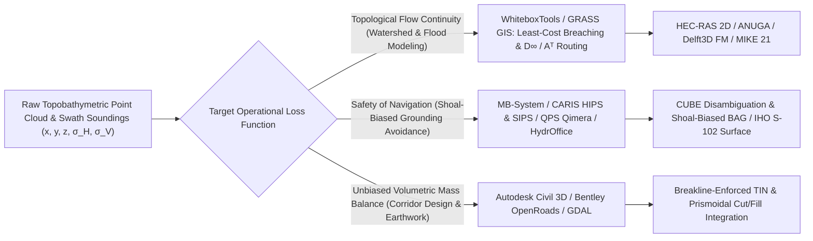

### 1.6 Software Ecosystem

In operational practice, the mathematical loss functions and domain-specific surface semantics established in Sections 1.1–1.5 are instantiated through specialized software architectures. Because a hydrologist routing overland floodwaters, a hydrographer compiling an official Electronic Navigational Chart (ENC), and a civil engineer designing a highway interchange optimize fundamentally incompatible objective functions, no single monolithic software package spans the entire digital elevation lifecycle. Instead, the DEM software ecosystem has evolved into distinct open-source and commercial tiers organized around four core paradigms: (1) foundational geospatial raster/mesh translation and terrain analysis libraries, (2) hydrological conditioning and 1D/2D/3D hydrodynamic solvers, (3) acoustic hydrographic processing and uncertainty-propagating bathymetric engines, and (4) breakline-enforced Triangulated Irregular Network (TIN) civil engineering CAD/BIM platforms.



---

#### 1.6.1 Open-Source Tools, Libraries, and Publicly Available Hydrodynamic Solvers

Open-source geospatial software forms the reproducible computational backbone of modern terrain and bathymetric science, providing scriptable command-line interfaces (CLIs), C/C++/Rust core libraries, and Python bindings suited for high-performance computing (HPC) and cloud-native pipelines.

* **GDAL (Geospatial Data Abstraction Library) and PROJ:** Initiated by Frank Warmerdam in 1998 and maintained by the Open Source Geospatial Foundation (OSGeo), GDAL/OGR is the universal I/O and raster/vector manipulation engine underlying nearly all open-source and proprietary GIS packages, paired with **PROJ** (originated by Gerald Evenden at the USGS in the early 1980s) for geodetic coordinate and vertical datum transformations. For DEM workflows, three GDAL utilities are foundational:
  * `gdalwarp`: Executes coordinate reference system (CRS) reprojection, 3D time-dependent vertical datum grid shifts (via PROJ deformation and geoid pipelines), and spatial resampling. Its choice of resampling kernel—such as `-r bilinear` or `-r cubic` for continuous terrain, `-r average` for unbiased mass-conserving downsampling, or `-r min`/`-r max` for extreme-value preservation—directly governs how sub-grid variance is filtered across scales.
  * `gdal_grid`: Converts scattered $(x, y, z)$ point clouds into regular grids using inverse distance weighting (IDW), moving averages, linear TIN interpolation, or spatial data metrics (`minimum`, `maximum`, `count`, `stdev`).
  * `gdaldem`: Computes first- and second-order local surface derivatives, including slope and aspect (supporting both Horn's 1981 $3\times 3$ weighted finite-difference stencil and Zevenbergen and Thorne's 1987 four-neighbor quadratic fit), analytical hillshading, Topographic Position Index (TPI), Terrain Ruggedness Index (TRI), and roughness.
* **PDAL, GMT, and the Scientific Python Ecosystem (`xdem`, `rasterio`, `rioxarray`):** For point-cloud and multi-temporal elevation workflows, **PDAL** (Point Data Abstraction Library, Howard Butler et al.) provides declarative JSON pipelines for filtering airborne lidar and sonar point clouds (including cloth simulation filtering `filters.csf` and Progressive Morphological Filtering `filters.pmf`). **GMT** (Generic Mapping Tools, initiated by Paul Wessel and Walter H. F. Smith in 1988) provides industry-standard block-averaging (`gmt blockmean`, `gmt blockmedian`) and continuous curvature splines in tension (`gmt surface`, Smith & Wessel, 1990) for global topobathymetric synthesis (e.g., GEBCO and SRTM15+). In Python, **`xdem`** (built on `rasterio`, `geoutils`, and `scipy`) implements rigorous 3D DEM coregistration (Nuth & Kääb, 2011), Normalized Median Absolute Deviation ($\text{NMAD}$) heteroscedastic error modeling, and spatially correlated volumetric uncertainty propagation via empirical variograms.
* **GRASS GIS (Geographic Resources Analysis Support System):** Originated in 1982 at the U.S. Army Construction Engineering Research Laboratories (USA-CERL) under William Goran, Jim Westervelt, and Michael Shapiro (and released under the GNU GPL in 1999), GRASS GIS pioneered many of the foundational algorithms in computational geomorphometry and hydrology:
  * `r.watershed`: Implements Chuck Ehlschlaeger's (1989) $A^T$ least-cost search algorithm, which routes flow through unconditioned digital elevation models by finding the minimum-cost path across depressions and flat areas without destructively filling sinks.
  * `r.terraflow`: Developed by Lars Arge, Helena Mitasova, and colleagues (2003), this module introduced I/O-efficient external-memory algorithms capable of computing flow direction (both $D_8$ and multi-flow $FD_8$) and Topographic Wetness Index (TWI) on massive multi-gigabyte DEM grids that exceed system RAM.
  * `r.sim.water`: Solves the bivariate shallow-water continuity and momentum equations using a Green's function Monte Carlo path-sampling method (Mitasova et al., 2004), enabling spatially explicit simulation of overland flow depth $h(x,y,t)$ and sediment transport across complex micro-topography.
* **WhiteboxTools:** Created by John Lindsay in 2017 as a standalone, parallelized Rust successor to the earlier Terrain Analysis System (TAS) and Whitebox GAT (2009), WhiteboxTools represents the current state of the art in high-resolution lidar DEM conditioning and geomorphometry. Rather than relying on classic Planchon-Darboux or Wang-Liu sink filling—which artificially floods upstream valleys behind road embankments and bridge decks in $1\text{ m}$ lidar DSMs/DTMs—its `BreachDepressionsLeastCost` module excavates narrow, minimum-cost trenches through topological barriers (Lindsay & Dhun, 2015). It pairs these conditioned surfaces with advanced flow accumulation operators (`DInfFlowAccumulation`, `MDInfFlowAccumulation`, `QinFlowAccumulation`) and multiscale terrain characterization (`MaxElevationDeviation`, `MultiscaleRoughness`).
* **SAGA GIS and QGIS:** Originated by Jürgen Böhner and Olaf Conrad at the Universities of Göttingen and Hamburg (first public release 2004), **SAGA GIS** (System for Automated Geoscientific Analyses) provides over 700 specialized modules for automated terrain analysis, pedometrics, and microclimate modeling, including the Multiresolution Index of Valley Bottom Flatness (MRVBF; Gallant & Dowling, 2003), the SAGA Wetness Index, and potential incoming solar radiation. **QGIS** (founded by Gary Sherman in 2002) serves as the unifying desktop and cartographic workbench; through the QGIS Processing Framework, practitioners chain GDAL, GRASS GIS, SAGA GIS, and WhiteboxTools into reproducible directed acyclic graphs (DAGs), while leveraging the Mesh Data Abstraction Library (`MDAL`) and native point-cloud (`PDAL`) engines to visualize time-varying 2D/3D hydrodynamic meshes and raw lidar/sonar data.
* **Open-Source and Public-Domain/Freeware Hydrodynamic Solvers (HEC-RAS, ANUGA, Delft3D):**
  * **USACE HEC-RAS (Hydrologic Engineering Center's River Analysis System):** Tracing its lineage to the 1964 HEC-2 step-backwater program and first released as HEC-RAS in 1995 (publicly funded freeware distributed by the U.S. Army Corps of Engineers, though closed-source), modern HEC-RAS (v5.0–v6.x) couples 1D channel hydraulics with a 2D implicit finite-volume shallow-water solver. Crucially, HEC-RAS popularized **sub-grid bathymetry and topography**: each coarse computational mesh face and cell ($10\text{--}100\text{ m}$) pre-computes nonlinear elevation–volume $V(z)$ and elevation–conveyance $K(z)$ curves directly from an underlying high-resolution DEM ($0.5\text{--}2\text{ m}$), capturing sub-grid channels and micro-rills without requiring prohibitively small Courant-Friedrichs-Lewy (CFL) time steps.
  * **ANUGA:** Jointly developed as open-source software by the Australian National University (ANU) and Geoscience Australia (Roberts et al., 2015), ANUGA solves the 2D nonlinear shallow-water equations (NSWE) on unstructured triangular finite-volume meshes. Its shock-capturing Godunov-type scheme is specifically designed to remain mass-conservative and numerically stable across rapidly moving wetting-and-drying fronts during tsunami coastal runup, storm-surge overtopping, and dam-break inundation.
  * **Delft3D and Delft3D Flexible Mesh (FM):** Developed by Deltares (open-sourced in 2011), Delft3D couples 2D/3D hydrostatic and non-hydrostatic hydrodynamics with third-generation spectral wave modeling (SWAN), cohesive/non-cohesive sediment transport, and dynamic bed-level updating ($\partial z_b / \partial t$) via the Exner equation across riverine, estuarine, and coastal shelf environments.
* **Open-Source Marine and Hydrographic Suites (MB-System and HydrOffice):**
  * **MB-System:** Initiated by David Caress and Dale Chayes in 1993 at the Lamont-Doherty Earth Observatory (LDEO) and Monterey Bay Aquarium Research Institute (MBARI), MB-System is the premier open-source software package for processing swath bathymetry and sidescan sonar data from over 100 multibeam, interferometric, and AUV/ROV sonar formats. Its modular CLI tools handle sound velocity profile (SVP) ray-tracing (`mbvelocitytool`), tide and attitude compensation, interactive and automated outlier rejection (`mbeditviz`, `mbclean`), and footprint-weighted or spline-in-tension bathymetric gridding (`mbgrid`).
  * **HydrOffice:** A collaborative research and operational framework established by the Center for Coastal and Ocean Mapping / Joint Hydrographic Center (CCOM/JHC) at the University of New Hampshire and NOAA. HydrOffice provides open-source Python packages such as **QC Tools** (which automatically scans Bathymetric Attributed Grids [BAGs] and Electronic Navigational Charts for spurious "flyers," holiday gaps, and compliance with International Hydrographic Organization [IHO] S-44 and NOAA Hydrographic Surveys Specifications and Deliverables [HSSD] Total Vertical Uncertainty [TVU] standards) and **Sound Speed Manager** for oceanographic profile assimilation.

---

#### 1.6.2 Commercial and Closed-Source Enterprise Suites

In regulated environments—such as statutory nautical charting, certified highway engineering, and insured coastal infrastructure design—commercial software suites provide certified workflows, audit trails, database governance, and specialized domain extensions.

* **Esri ArcGIS Pro (Spatial Analyst, 3D Analyst, Bathymetry, and Maritime):** Esri's flagship desktop and enterprise GIS platform integrates raster surface analysis (*Spatial Analyst*), vector TIN and massive multi-resolution Terrain datasets (*3D Analyst*), and geostatistical error modeling (*Geostatistical Analyst*). In the marine domain, **ArcGIS Bathymetry** manages scalable Bathymetric Information Systems (BIS) that index raw survey BAGs alongside metadata, while **ArcGIS Maritime** compiles and validates official IHO S-57, S-101 (next-generation ENC), and S-102 (high-resolution bathymetric surface) products under strict shoal-biased generalization rules.
* **Teledyne CARIS (HIPS & SIPS, Bathy DataBASE, Composer):** The de facto standard across national hydrographic offices (e.g., NOAA Office of Coast Survey, UKHO, CHS). **CARIS HIPS & SIPS** (Hydrographic Information Processing System and Sonar Image Processing System) ingests raw vessel sensor streams—GNSS/INS trajectory (POS MV), roll/pitch/heave, dynamic draft, tides, and water-column sound speed—to compute the Total Propagated Uncertainty (TPU) of every acoustic sounding in both horizontal ($\text{THU}$) and vertical ($\text{TVU}$) dimensions. HIPS & SIPS was the first commercial platform to implement the **CUBE** (Combined Uncertainty and Bathymetric Estimation) algorithm developed by Brian Calder and Larry Mayer (2003), which assimilates soundings into a dynamic grid of competing depth hypotheses and automatically selects the best-supported or shoal-biased surface for **CARIS Bathy DataBASE** and **S-57/S-100 Composer**.
* **QPS Qimera, Fledermaus, and Xylem Hypack:** Developed by Quality Positioning Services (QPS), **Qimera** streamlines multibeam bathymetric processing through dynamic workflow automation, automatic lever-arm and patch-test calibration diagnostics, CUBE surface generation, and interactive 3D point-cloud cleaning. Its companion platform, **Fledermaus** (originally created by Larry Mayer, Colin Ware, Mark Paton, and colleagues at the University of New Brunswick in the early 1990s and commercialized by Interactive Visualization Systems [IVS] before acquisition by QPS), pioneered real-time 3D/4D interactive visualization of multi-sensor marine datasets, sub-bottom seismic profiles, water-column backscatter, and subsea pipeline/cable routing. In coastal engineering and port maintenance, **Hypack** (founded by Pat Sanders in 1984, now Xylem) is widely deployed for real-time hydrographic survey acquisition, single-beam/multibeam sweep processing, and channel dredging volume certification.
* **Terrasolid Suite (TerraScan, TerraMatch, TerraModeler) and BayesMap StripAlign:** For commercial airborne topographic and topobathymetric lidar production (e.g., USGS 3DEP and NOAA NGS coastal mapping contracts), **TerraScan** and **TerraModeler** (developed by Arttu Soininen at Terrasolid, running atop Bentley MicroStation) serve as industry workhorses for macro-driven point-cloud classification, progressive TIN ground filtering (Axelsson, 2000), hydro-flattening breakline enforcement, and swath-to-swath boresight/trajectory strip adjustment (**TerraMatch** / **StripAlign**).
* **Autodesk Civil 3D and Bentley OpenRoads / InRoads:** Civil, geotechnical, and transportation engineering workflows rarely operate on regular raster grids during final design because raster pixels smear sharp geometric discontinuities such as road crowns, curb lines, retaining walls, and drainage ditches. Instead, **Autodesk Civil 3D** and **Bentley OpenRoads Designer** (successor to InRoads and GEOPAK) construct constrained Delaunay **Triangulated Irregular Networks (TINs)** enforced by hard and soft 3D breaklines. Engineers project parametric 3D corridor assemblies along horizontal and vertical alignments to compute exact prismoidal or composite cut-and-fill earthwork volumes, sight-distance envelopes, and grading stakes.
* **DHI MIKE 21 and MIKE Flood:** Developed by the Danish Hydraulic Institute (DHI), **MIKE 21** (and its unstructured flexible-mesh variant **MIKE 21 FM**) is an industry-standard commercial solver for coastal hydrodynamics, spectral waves, storm surge, mud/sand transport, and environmental water quality. When coupled with 1D river hydraulics (MIKE Hydro River) and 1D underground storm-sewer pipe networks (MIKE URBAN) inside **MIKE Flood**, it enables bidirectional simulation of urban pluvial/fluvial/coastal compound flooding where water exchanges dynamically between street-level DEMs and subsurface drainage infrastructure.

---

#### 1.6.3 Architectural Comparison Matrix Across Application Domains

The table below synthesizes how key open-source and commercial packages differ in their core surface representation, treatment of measurement uncertainty, and primary operational design targets.

| Software / Library | License | Primary Domain | Core Surface Data Model | Uncertainty & Error-Budget Handling | Representative Modules / Algorithms |
| :--- | :--- | :--- | :--- | :--- | :--- |
| **GDAL / PROJ / PDAL** | Open-Source (MIT / BSD) | Cross-domain raster, point-cloud & datum I/O | 2D rasters (GeoTIFF, COG, BAG), LAS/LAZ/COPC point clouds | Resampling kernel selection (`min`, `max`, `average`); 3D datum grid transformation accuracy | `gdalwarp`, `gdal_grid`, `gdaldem`, `proj`, `pdal translate` (`filters.smrf`, `filters.csf`) |
| **GMT & `xdem`** | Open-Source (LGPL / MIT) | Geodesy, global bathymetry & DEM error analysis | NetCDF/GeoTIFF grids, multi-temporal DEM stacks | Heteroscedastic $\text{NMAD}$, variogram spatial autocorrelation, 3D coregistration | `gmt blockmedian`, `gmt surface` (splines in tension), `xdem.coreg.NuthKaab` |
| **GRASS GIS** | Open-Source (GPL) | Terrestrial hydrology, geomorphometry | Regular 2D/3D rasters & topological vectors | Monte Carlo path-sampling (`r.sim.water`); external-memory exact routing | `r.watershed` ($A^T$ search), `r.terraflow`, `r.sim.water`, `r.sun` |
| **WhiteboxTools** | Open-Source (MIT) | Lidar DEM conditioning, geomorphometry | In-memory & tiled 2D floating-point grids | Preserves unbreached floodplain elevations outside minimal-cost breach channels | `BreachDepressionsLeastCost`, `DInfFlowAccumulation`, `MaxElevationDeviation` |
| **SAGA GIS** | Open-Source (GPL/LGPL) | Geomorphometry, pedometrics, ecology | Regular grids, TINs, point clouds | Kriging variance surfaces; multiscale variance stabilization | MRVBF, SAGA Wetness Index, Sky-View Factor, Universal Kriging |
| **HEC-RAS (1D/2D)** | Freeware (USACE, Closed-Source) | Fluvial hydraulics, dam/levee breach | Polygonal 2D finite-volume mesh with sub-grid DEM tables | Sub-grid hydraulic radius $R_h(z)$ & volume $V(z)$ preserve fine-scale storage | 2D Diffusion Wave & Full Momentum SWE solvers, sub-grid terrain preprocessing |
| **ANUGA / Delft3D FM** | Open-Source (GPL / LGPL) | Tsunami runup, estuarine morphodynamics | Unstructured triangular / flexible finite-volume mesh | Wetting/drying mass conservation; morphological sensitivity ensembles | Godunov NSWE shock-capturing (ANUGA); coupled SWAN wave-morphodynamics (Delft3D) |
| **MB-System** | Open-Source (GPL) | Marine swath sonar processing & gridding | Swath ping files, footprint-weighted & spline grids | Beam-angle & SVP ray-trace footprint weighting; automated flyer cleaning | `mbgrid`, `mbclean`, `mbeditviz`, `mbvelocitytool`, `mbbackangle` |
| **HydrOffice (QC Tools)** | Open-Source (LGPL) | Hydrographic quality control & validation | BAG (Elevation + Uncertainty dual-band grids), S-57/S-102 | Automated verification against IHO S-44 & NOAA HSSD $\text{TVU}/\text{THU}$ envelopes ($a, b$) | Flyer Finder, Holiday Finder, S-44 Uncertainty Compliance, Sound Speed Manager |
| **Esri ArcGIS Pro** | Commercial | Enterprise GIS, terrain & chart production | Rasters, TINs, Terrain datasets, S-102/BIS grids | Geostatistical kriging standard error; S-57/S-101/S-102 CATZOC / QoBD encoding | Spatial/3D Analyst, Bathymetry BIS, Maritime shoal-biased generalization |
| **Teledyne CARIS / QPS Qimera / Hypack** | Commercial | Safety-of-navigation hydrography & dredging | Sounding point clouds, CUBE surfaces, BAG, S-102 | Full 3D Total Propagated Uncertainty ($\text{THU}, \text{TVU}$) per beam; CUBE hypothesis disambiguation | HIPS & SIPS, CUBE engine, Bathy DataBASE, Qimera dynamic SVP/TPU, Hypack TIN volume |
| **Terrasolid (TerraScan / TerraMatch)** | Commercial | Airborne lidar classification & strip adjustment | Tiled LAS/LAZ point clouds, breakline TINs | Swath-to-swath boresight/IMU drift minimization; ASPRS & USGS 3DEP $\text{RMSE}_z$ QA/QC | Axelsson progressive TIN ground filter, TerraMatch strip adjustment, hydro-flattening |
| **Autodesk Civil 3D / Bentley OpenRoads** | Commercial | Highway/rail corridors, site grading CAD | Breakline-enforced Delaunay TINs & 3D corridor meshes | Exact prismoidal volume differentials between survey TIN and design TIN | Corridor modeling, alignment profiles, composite/prismoidal cut-and-fill |
| **DHI MIKE 21 / MIKE Flood** | Commercial | Coastal surge, waves, urban compound flood | 2D/3D unstructured flexible mesh + 1D sewer/river network | Ensemble storm-surge & roughness sensitivity; sub-grid weir/culvert discharge | MIKE 21 FM HD, Spectral Waves (SW), Mud/Sand Transport, MIKE URBAN coupling |

---

#### 1.6.4 Reproducible Multi-Application Workflows: Processing One DEM for Divergent End-Uses

To illustrate why software choice and algorithm parameterization cannot be separated from the physical end-use, consider a coastal-estuarine topobathymetric DEM where elevation $z(x,y)$ is referenced positive-upward in meters ($\text{m}$) relative to a vertical datum (and bathymetric depth is $d(x,y) = -z(x,y)$ positive-downward in $\text{m}$). Suppose a raw $1\text{ m}$ topobathymetric raster `estuary_raw_1m.tif` contains both a highway causeway crossing a tidal creek (where a bridge deck at $z = +4.5\text{ m}$ masks a culvert at $z = -0.8\text{ m}$) and a navigation channel containing a submerged boulder shoal rising to $z = -2.1\text{ m}$ ($d = 2.1\text{ m}$) surrounded by a $z = -5.5\text{ m}$ ($d = 5.5\text{ m}$) seabed.

Depending on the engineering workflow, three distinct mathematical operators are applied to the raw surface $z(x,y)$:

1. **Hydrological Conditioning (Least-Cost Depression Breaching):** To route watershed runoff through the causeway without artificially damming the upstream marsh, WhiteboxTools solves for a modified surface $\tilde{z}_{\text{hydro}}(x,y)$ that minimizes the longitudinal cross-sectional excavation cost $J_{\text{breach}}$ ($\text{m}^2$; multiplying by cell width $\Delta w$ yields trench excavation volume in $\text{m}^3$) along a breach path $\mathcal{P}$ of step length $\Delta s$ ($\text{m}$):
   $$J_{\text{breach}} = \sum_{i \in \mathcal{P}} \left( z_i - \tilde{z}_{\text{hydro}, i} \right) \Delta s \quad \text{subject to} \quad \tilde{z}_{\text{hydro}, i+1} \le \tilde{z}_{\text{hydro}, i} - \epsilon \Delta s, \quad \tilde{z}_{\text{hydro}, i} \le z_i$$
   where $\epsilon > 0$ ($\text{m}\,\text{m}^{-1}$) is a minimal downward gradient enforcing strict drainage connectivity.
2. **Safety-of-Navigation Generalization (Conservative Shoal-Biased Gridding):** When coarsening the $1\text{ m}$ bathymetry to a $10\text{ m}$ navigational product grid cell $\Omega_{I,J}$, averaging is forbidden because it smears the $d = 2.1\text{ m}$ boulder into the surrounding $5.5\text{ m}$ channel. Incorporating the $95\%$ Total Vertical Uncertainty $\text{TVU}_k = 1.96\,\sigma_{V,k}$ ($\text{m}$) of each sounding $k \in \Omega_{I,J}$—bounded under IHO S-44 (6th ed., 2020) and NOAA HSSD by $\text{TVU}_{\max}(d_k) = \sqrt{a^2 + (b \cdot d_k)^2}$ (with $a = 0.25\text{ m}, b = 0.0075$ for Special Order and $a = 0.15\text{ m}, b = 0.0075$ for Exclusive Order)—the conservative shoal-biased depth estimator $\hat{d}_{\text{nav}}(I,J)$ (depth positive-down, $\text{m}$) is:
   $$\hat{d}_{\text{nav}}(I,J) = \min_{k \in \Omega_{I,J}} \left( d_k - \gamma\,\text{TVU}_k \right) \Longleftrightarrow \hat{z}_{\text{nav}}(I,J) = \max_{k \in \Omega_{I,J}} \left( z_k + \gamma\,\text{TVU}_k \right)$$
   where $\gamma \in \{0, 1\}$ selects either the shoalest measured sounding ($\gamma = 0$) or the upper $95\%$ confidence bound of the shoalest hazard ($\gamma = 1$).
3. **Unbiased Volumetric Aggregation (Dredging & Earthwork Mass Balance):** For sediment budget or dredging payment computation over cell $\Omega_{I,J}$ containing $N$ sub-pixels, only the unweighted arithmetic mean preserves total volume $V = \iint_\Omega z(x,y)\,dx\,dy$:
   $$\hat{z}_{\text{vol}}(I,J) = \frac{1}{N} \sum_{k \in \Omega_{I,J}} z_k$$

##### CLI Workflow: Divergent Processing with WhiteboxTools, GDAL, and MB-System

The following reproducible shell pipeline demonstrates how a practitioner processes the exact same input dataset along these three divergent tracks using standard open-source CLI tools:

```bash
# -------------------------------------------------------------------------
# TRACK 1: Hydrological Conditioning & Flow Routing (WhiteboxTools CLI)
# Carve a least-cost trench through bridge/culvert embankments (--dist=50 cells
# = 50 m search radius at 1 m grid spacing) and compute continuous D-infinity
# specific contributing area (m^2/m).
# -------------------------------------------------------------------------
whitebox_tools -r=BreachDepressionsLeastCost \
    --dem="estuary_raw_1m.tif" \
    -o="estuary_hydro_breached_1m.tif" \
    --dist=50 --max_cost=200.0 --fill

whitebox_tools -r=DInfFlowAccumulation \
    --dem="estuary_hydro_breached_1m.tif" \
    -o="estuary_dinf_sca_1m.tif" \
    --out_type="Specific Contributing Area"

# -------------------------------------------------------------------------
# TRACK 2: Safety-of-Navigation Coarsening (GDAL & MB-System)
# Coarsen 1 m topobathymetry (z positive-up) to 10 m using "-r max" so that
# the shallowest (highest z / minimum depth d) hazard governs every 10 m cell.
# -------------------------------------------------------------------------
gdalwarp -tr 10.0 10.0 -r max -tap \
    "estuary_raw_1m.tif" "estuary_nav_shoal_10m.tif"

# In MB-System, when gridding raw multibeam swath files (datalist.mb-1),
# enforce a shoal-biased filter: -A2 (topography z positive-up) with -F4
# (maximum value filter), or -A1 (depth d positive-down) with -F3 (minimum filter),
# disabling spline interpolation into empty cells (-C0) and marking empty nodes NaN (-N):
mbgrid -I datalist.mb-1 -O estuary_mb_shoal_10m \
    -E 10.0/10.0/meters! -A2 -F4 -C0 -N

# -------------------------------------------------------------------------
# TRACK 3: Unbiased Volumetric Downsampling for Dredge / Cut-Fill Accounting
# Coarsen to 10 m using "-r average" to conserve integrated sediment volume.
# -------------------------------------------------------------------------
gdalwarp -tr 10.0 10.0 -r average -tap \
    "estuary_raw_1m.tif" "estuary_volume_unbiased_10m.tif"
```

##### Python Workflow: Quantifying End-Use Discrepancies on a Synthetic Topobathymetric Grid

The executable Python script below synthesizes a $100\text{ m} \times 100\text{ m}$ estuarine channel DEM ($1\text{ m}$ resolution, elevation $z$ in $\text{m}$ NAVD88), embeds both a highway bridge embankment and a submerged navigation hazard, and quantifies the operational errors that occur if the wrong software operator is applied to the wrong domain:

```python
import numpy as np

# 1. Construct a 100 m x 100 m topobathymetric DEM at dx = dy = 1.0 m (z positive-up, m)
ny, nx, dx = 100, 100, 1.0
y, x = np.mgrid[0:ny, 0:nx] * dx

# Sloping tidal channel (z around -5.0 m) flanked by marshes (z around +1.5 m)
z_true = 1.5 - 6.5 * np.exp(-((x - 50.0) / 18.0) ** 2) - 0.005 * y

# Artifact A: Unbreached highway bridge deck across y = 50..52 m (z = +4.0 m)
z_dsm = z_true.copy()
z_dsm[50:53, :] = np.maximum(z_dsm[50:53, :], 4.0)

# Feature B: Submerged boulder hazard at (y=75, x=50) rising to z = -1.8 m (depth d = 1.8 m)
z_dsm[75, 50] = -1.8

# 2. Apply three software aggregation/conditioning paradigms
# (a) Hydrologic least-cost breach across the bridge deck along the thalweg (x=50)
z_hydro = z_dsm.copy()
z_hydro[50:53, 48:53] = z_true[50:53, 48:53]  # Culvert opening restored

# (b) 10 m Coarsening: Unbiased Mean (Earthwork) vs. Shoal-Biased Max z (Navigation)
blocks = z_dsm.reshape(10, 10, 10, 10).swapaxes(1, 2)  # (10, 10) grid of 10x10 m cells
z_mean_10m = blocks.mean(axis=(2, 3))
z_shoal_10m = blocks.max(axis=(2, 3))  # Max elevation z == Min water depth d = -z

# 3. Evaluate Domain-Specific Operational Metrics
cell_boulder_mean_d = -z_mean_10m[7, 5]   # Reported water depth (m) in mean grid
cell_boulder_shoal_d = -z_shoal_10m[7, 5] # Reported water depth (m) in shoal grid
vol_bias_shoal_m3 = np.sum(z_shoal_10m - z_mean_10m) * (10.0 * 10.0)
artificial_backwater_m = z_dsm[50, 50] - z_hydro[50, 50]

print(f"Navigation Channel Boulder Cell (True min depth = 1.80 m):")
print(f"  Mean-gridded depth  (GDAL -r average): {cell_boulder_mean_d:.2f} m -> FATAL GROUNDING RISK (+{cell_boulder_mean_d - 1.80:.2f} m over-depth)")
print(f"  Shoal-biased depth  (GDAL -r max)    : {cell_boulder_shoal_d:.2f} m -> SAFE UKC PRESERVED")
print(f"Volumetric Dredge Bias if using Shoal Grid: +{vol_bias_shoal_m3:,.1f} m^3 artificial over-excavation")
print(f"Hydrologic Backwater Error if Bridge Unbreached: +{artificial_backwater_m:.2f} m artificial dam")
```

Running this analysis demonstrates three stark quantitative realities:
1. In the $10\text{ m}$ cell containing the boulder hazard (`[7, 5]`), the unbiased mean grid reports a navigable depth of $d = 4.81\text{ m}$, concealing a $d = 1.80\text{ m}$ pinnacle by $3.01\text{ m}$ and guaranteeing hull grounding for a vessel with a $3.5\text{ m}$ draft. The shoal-biased grid (`-r max` on elevation $z$, equivalent to `-r min` on depth $d$) preserves $d = 1.80\text{ m}$ exactly.
2. Conversely, if a dredging contractor uses the $10\text{ m}$ shoal-biased navigation surface to compute cut volumes across the $1\text{ ha}$ site, the systematic upward bias of the maximum operator inflates the apparent sediment volume by $+9,093.8\text{ m}^3$ relative to the unbiased mean grid.
3. Finally, feeding the unbreached DSM directly into a 2D hydrodynamic solver without WhiteboxTools or HEC-RAS culvert conditioning erects a $+9.25\text{ m}$ artificial dam across the tidal creek thalweg ($z = +4.00\text{ m}$ vs. $-5.25\text{ m}$).

> [!WARNING]
> **Sign-Convention Reversal Between Elevation and Depth Software:** General-purpose GIS tools (GDAL, QGIS, WhiteboxTools, ArcGIS) treat the vertical axis as elevation $z$ (positive-upward, $\text{m}$), whereas dedicated hydrographic suites (CARIS HIPS & SIPS, IHO S-57/S-101/S-102 encoders, or `mbgrid -A1`) often store bathymetric soundings as depth $d$ (positive-downward, $\text{m}$). When executing shoal-biased resampling in GDAL or Python, preserving the shallowest water requires `-r max` on a negative-down elevation grid ($z = -1.8\text{ m} > -5.5\text{ m}$), but `-r min` on a positive-down depth grid ($d = 1.8\text{ m} < 5.5\text{ m}$). Inverting this operator selects the *deepest* point in every cell—a catastrophic failure mode for navigation safety.

> [!IMPORTANT]
> **CUBE Hypothesis Selection vs. Deterministic Gridding:** Unlike standard GIS interpolators (IDW, spline, bilinear) that blend outliers into smooth artifacts, the CUBE algorithm in CARIS HIPS & SIPS and QPS Qimera uses sequential Bayesian Kalman filtering weighted by each sounding's propagated $\text{THU}$ and $\text{TVU}$ (while MB-System's `mbgrid` employs beam-footprint Gaussian weighting or minimum/maximum priority filters after `mbclean`/`mbeditviz` outlier rejection). When a submerged wreck or boulder produces bimodal depth clusters within a single grid node, CUBE maintains multiple discrete depth hypotheses and flags the node's *hypothesis strength* so a hydrographer (or HydrOffice QC Tools) can verify whether the shoalest hypothesis is a physical hazard or an acoustic water-column flyer.

> [!TIP]
> **Sub-Grid Parameterization Instead of Destructive Downsampling:** When preparing high-resolution lidar/multibeam DEMs ($0.5\text{--}1\text{ m}$) for 2D flood or estuarine modeling, avoid resampling the DEM down to the hydrodynamic mesh resolution ($10\text{--}50\text{ m}$). Instead, pass the native $1\text{ m}$ hydro-conditioned DEM directly into sub-grid-capable solvers (such as HEC-RAS 2D or Delft3D FM) so that fine-scale levee crests, street curbs, and low-flow thalwegs are retained in the cell face conveyance tables.
