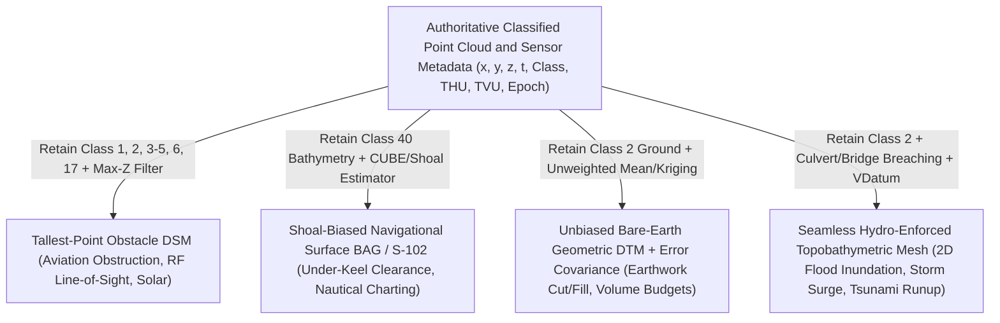

## 1.7 Common Pitfalls & Key Takeaways

Across civil engineering, hydrography, natural hazard modeling, and defense operations, the most costly Digital Elevation Model (DEM) failures rarely stem from raw sensor malfunction. Instead, they arise from **semantic and statistical mismatches** between how a surface was compiled and how a downstream physical model or operational decision rule consumes it. When an analyst treats a gridded elevation file as a neutral, multi-purpose representation of reality—ignoring its implicit vertical datum, point-cloud classification filter, gridding estimator, and spatial error covariance—routine numerical operations can produce catastrophic physical and financial consequences.

This section examines five canonical cross-domain failure modes that recur in engineering practice and synthesizes Chapter 1 into an actionable verification framework anchored to application loss functions.

---

### 1.7.1 Detailed Case Analyses of Cross-Domain Failure Modes

#### Pitfall 1: Using a Mean-Gridded, Spline-Smoothed, or Hydro-Flattened DEM for Ship Navigation (Shaving Off Rock Pinnacles)

* **Physical & Statistical Mechanism:** Multibeam echosounder (MBES) and airborne laser bathymetry (ALB) surveys over glaciated shelves, coral reefs, crystalline bedrock, or debris fields capture high-frequency vertical extrema (boulders, rock pinnacles, shipwreck masts). When these dense point clouds are gridded using central-tendency estimators—such as an unweighted sample mean, inverse-distance weighting (IDW), ordinary kriging, or minimum-curvature tension splines (e.g., `gmt surface`)—high-frequency hazards smaller than the grid cell footprint are mathematically averaged into the surrounding seafloor. Even worse, terrestrial or coastal DEMs that have been *hydro-flattened* replace waterbodies with a flat polygon at the water surface elevation (yielding zero sub-aqueous bathymetric geometry).
* **Governing Equations:** Adopting the hydrographic convention where depth $d$ is positive-downward ($d > 0$ below chart datum), consider a grid node $\mathbf{x}_0$ whose support footprint $\mathcal{N}(\mathbf{x}_0)$ contains $N = N_b + N_p$ soundings partitioned into $N_b$ background seabed soundings $\{d_{b,1}, \dots, d_{b,N_b}\}$ at sample mean depth $\mu_b$ and $N_p \ll N_b$ pinnacle soundings $\{d_{p,1}, \dots, d_{p,N_p}\}$ striking a narrow granite pinnacle at shoal depth $\mu_p < \mu_b$. The unweighted sample mean estimator yields:
  $$
  \hat{d}_{\text{mean}}(\mathbf{x}_0) = \frac{1}{N_b + N_p}\left(\sum_{i=1}^{N_b} d_{b,i} + \sum_{j=1}^{N_p} d_{p,j}\right) = \mu_b - \frac{N_p}{N_b + N_p}(\mu_b - \mu_p)
  $$
  Whenever the pinnacle occupies a small fraction of the cell area ($N_p / N \ll 1$), $\hat{d}_{\text{mean}}(\mathbf{x}_0) \to \mu_b$, erasing the vertical hazard by a systematic depth-overestimation (shoal-shaving) bias:
  $$
  \Delta d_{\text{shaved}} = \hat{d}_{\text{mean}}(\mathbf{x}_0) - \mu_p = \left(1 - \frac{N_p}{N}\right)(\mu_b - \mu_p)
  $$
* **Worked Numerical Case:** In a $12.0\text{ m}$ dredged commercial approach channel gridded at $\Delta x = \Delta y = 5.0\text{ m}$ ($25\text{ m}^2$ cell area), an MBES survey collects $N = 500$ soundings within a cell: $N_b = 480$ soundings on the channel floor averaging $\mu_b = 12.20\text{ m}$ and $N_p = 20$ soundings on a $1.0\text{ m}^2$ crystalline pinnacle at $\mu_p = 9.40\text{ m}$ (with vertical measurement uncertainty $\text{TVU} = \pm 0.15\text{ m}$ at 95% confidence).
  * The mean-gridded surface reports $\hat{d}_{\text{mean}} = \frac{480(12.20) + 20(9.40)}{500} = 12.088\text{ m}$, shaving **$2.688\text{ m}$** off the rock pinnacle.
  * A container vessel drawing $10.50\text{ m}$ with a mandated minimum Under-Keel Clearance (UKC) of $1.00\text{ m}$ requires at least $11.50\text{ m}$ of water. On the mean-gridded DEM, the route appears completely safe with $1.588\text{ m}$ of apparent UKC ($0.588\text{ m}$ above the required $11.50\text{ m}$ safety threshold); in reality, the hull strikes the pinnacle $1.10\text{ m}$ above the keel ($10.50\text{ m} - 9.40\text{ m}$).
* **Remediation & Operational Verification:** Historical groundings—including the 1992 grounding of the *Queen Elizabeth 2* off Cuttyhunk Island over unmapped boulder shoals and the 2005 collision of the submarine *USS San Francisco* (SSN-711) with an uncharted seamount—demonstrate the lethality of depth overestimation. Navigational charting under IHO S-44 (6th Edition, 2020), IHO S-102, and the NOAA Hydrographic Surveys Specifications and Deliverables (HSSD) mandates either shoal-biased binning ($\hat{d}_{\text{nav}} = \min_i d_i$) or multi-hypothesis estimation (CUBE / CHRT) coupled with designated-sounding overrides that force the gridded node to honor every verified feature meeting cubic detection thresholds (e.g., $1\text{ m}^3$ or $2\text{ m}^3$ targets).

> [!WARNING]
> **Never Use Bathymetric Regional Compilation Grids for Tactical Navigation:** Regional ocean-mapping products compiled via spline interpolation or block-averaging (such as standard GEBCO or EMODnet grids designed for ocean circulation and tectonic visualization) smooth over sub-grid shoals. Under-Keel Clearance (UKC) management and Electronic Navigational Charts (IHO S-57/S-101/S-102) strictly require hydrographically validated, shoal-biased surfaces backed by quantified Total Vertical Uncertainty (TVU) and feature-detection guarantees.

---

#### Pitfall 2: Feeding an Unbreached LiDAR DSM or Purely Geometric DTM into a 2D Flood Model (Artificial Bridge and Culvert Dams)

* **Physical & Statistical Mechanism:** Nadir-viewing airborne LiDAR and photogrammetric sensors measure the top of the first solid surface encountered along the optical line of sight. Even after point-cloud classification removes vegetation (ASPRS Classes 3–5) and buildings (Class 6) to create a bare-earth Digital Terrain Model (DTM, Class 2), elevated highway embankments, railway grades, and unstripped bridge decks (Class 17) spanning creeks or drainage channels remain continuous topographic ridges because sub-surface culverts and under-bridge channels are occluded from above.
* **Physical Impact on Shallow Water Equations:** Two-dimensional hydraulic solvers (e.g., HEC-RAS 2D, ANUGA, Delft3D, MIKE 21) route overland flow with depth-averaged velocity $\mathbf{u} = (u, v)^\top$ and flow depth $h$ across the cell-edge bed elevation gradient $\nabla z_b$ via the depth-integrated momentum equation:
  $$
  \frac{\partial \mathbf{u}}{\partial t} + (\mathbf{u} \cdot \nabla)\mathbf{u} + g\nabla(h + z_b) + \frac{g n^2 \|\mathbf{u}\|\mathbf{u}}{h^{4/3}} = \mathbf{0}
  $$
  where $g$ is gravitational acceleration ($\text{m/s}^2$), $n$ is Manning's roughness coefficient ($\text{s}\cdot\text{m}^{-1/3}$), and $\eta = h + z_b$ is the water surface elevation. If a culvert of invert elevation $z_{\text{invert}}$ passes beneath a highway embankment of crest elevation $z_{\text{road}} = z_{\text{invert}} + \Delta Z_{\text{emb}}$, a purely geometric DTM forces the bed elevation $z_b$ to rise by $\Delta Z_{\text{emb}}$, acting as an impermeable broad-crested weir until upstream water stage $h + z_b$ exceeds $z_{\text{road}}$.
* **Worked Numerical Case:** During a $100\text{-year}$ storm generating $Q = 18.0\text{ m}^3\text{/s}$ in a $30\text{ m}$-wide urban tributary crossed by a raised arterial road ($z_{\text{road}} = 42.50\text{ m}$, channel invert $z_{\text{invert}} = 38.00\text{ m}$, twin $1.8\text{ m} \times 1.8\text{ m}$ concrete box culverts), true inlet-controlled culvert flow requires a headwater depth of $HW \approx 1.80\text{ m}$ above the invert, yielding a true upstream water surface elevation of $\eta_{\text{true}} = 38.00 + 1.80 = 39.80\text{ m}$. Running a 2D solver on the unbreached geometric DTM blocks subsurface conveyance and forces water to pond behind the embankment until it overtops the $30\text{ m}$ road crown as a broad-crested weir ($Q = C_w L H_w^{3/2}$ with $C_w \approx 1.70\text{ m}^{1/2}\text{/s}$, requiring weir head $H_w = [18.0 / (1.70 \times 30)]^{2/3} \approx 0.50\text{ m}$), driving the simulated stage to $\eta_{\text{sim}} = 42.50 + 0.50 = 43.00\text{ m}$.
  * This produces a **+$3.20\text{ m}$ false upstream flood stage error** ($\eta_{\text{sim}} - \eta_{\text{true}} = 43.00 - 39.80\text{ m}$), inundating dozens of structures outside the true floodplain while starving the downstream reach of peak discharge and delaying hydrograph arrival.
* **Remediation & Operational Verification:** Practitioners must distinguish between **hydro-flattening** (a purely cartographic process in USGS 3DEP Lidar Base Specification DEMs that flattens open water surfaces between breaklines) and **hydro-enforcement** (topologically breaching embankments via least-cost path algorithms such as WhiteboxTools `breach_depressions_least_cost` or embedding 1D orifice/weir culvert rating curves directly across 2D mesh faces).

> [!CAUTION]
> **Hydro-Flattened Does Not Mean Hydro-Enforced:** Standard national elevation products (such as USGS 3DEP $1\text{ m}$ DEMs) are *hydro-flattened* to prevent triangular irregular network (TIN) "tinning" artifacts across wide rivers and lakes, and major highway bridge decks are classified into ASPRS Class 17 and omitted from the bare-earth grid. However, thousands of smaller road embankments over box culverts, railroad grades, and agricultural levees remain unbroken in the bare-earth raster. Feeding a hydro-flattened DEM directly into a 2D overland flow solver without a culvert inventory and breaching pass guarantees artificial upstream ponding.

---

#### Pitfall 3: Computing Cut-and-Fill or Dredging Volumes from a Shoal-Biased Chart Surface (Systematic Volumetric Billing Bias)

* **Physical & Statistical Mechanism:** Because hydrographic charting agencies publish shoal-biased Bathymetric Attributed Grids (BAGs) for navigation safety, engineering contractors and port engineers frequently download these authoritative surfaces and mistakenly use them as the baseline or post-dredge surface for sediment volume calculations and dredging progress payments.
* **Governing Equations:** Within each grid cell $k$ of area $\Delta A = \Delta x \Delta y$ containing $N$ soundings with true mean depth $\mu_{d,k}$ and local vertical variance $\sigma_d^2 = \sigma_{\text{TVU}}^2 + \sigma_{\text{rough}}^2$ (combining random sensor noise and sub-grid bedform roughness), selecting the shoalest sounding $d_{(1),k} = \min_{1 \le i \le N} d_{i,k}$ introduces a strict negative depth bias (positive bed-elevation bias). For $N$ independent Gaussian soundings, extreme-value order statistics give the expected minimum depth as:
  $$
  \mathbb{E}[d_{(1),k}] = \mu_{d,k} - c_N \sigma_d, \quad \text{where } c_N \approx \sqrt{2\ln N} - \frac{\ln(\ln N) + \ln(4\pi) - 2\gamma}{2\sqrt{2\ln N}}
  $$
  with Euler-Mascheroni constant $\gamma \approx 0.5772$ (for $N = 100$, the exact Gaussian order-statistic integral gives $c_{100} = 2.508 \approx 2.51$, while the two-term asymptotic Gumbel expansion above gives $2.556$). When computing the pre-dredge volume of sediment above design depth $D_{\text{design}}$ over $M$ cells covering total area $A = M \Delta A$, a shoal-biased baseline surface overestimates the sediment thickness in every single cell by $b_d = c_N \sigma_d$:
  $$
  \mathbb{E}[\hat{V}_{\text{shoal}}] - V_{\text{true}} = \sum_{k=1}^M \left(D_{\text{design}} - \mathbb{E}[d_{(1),k}]\right)\Delta A - \sum_{k=1}^M \left(D_{\text{design}} - \mu_{d,k}\right)\Delta A = c_N \sigma_d A
  $$
  (Conversely, if an unbiased pre-dredge surface is differenced against a shoal-biased post-dredge clearance surface, the excavated volume is systematically *under-reported* by $-c_N \sigma_d A$.)
* **Worked Numerical Case:** Consider a capital dredging project over a $10\text{ km}$ long by $200\text{ m}$ wide shipping channel ($A = 2.0 \times 10^6\text{ m}^2$) gridded at $2\text{ m} \times 2\text{ m}$ with $N = 100$ MBES soundings per cell ($c_{100} \approx 2.51$) and $\sigma_d = 0.12\text{ m}$.
  * Each cell in the shoal-biased navigational surface is systematically shallower than the true mean bed by $b_d = 2.51 \times 0.12\text{ m} = 0.301\text{ m}$.
  * Integrating over $A = 2.0 \times 10^6\text{ m}^2$ produces a **systematic volume bias of $\Delta V = \pm 602{,}000\text{ m}^3$**—at a unit dredging rate of $\$15/\text{m}^3$, a **$\$9.03\text{ million}$** billing error.
* **Remediation & Operational Verification:** Engineering standards such as USACE EM 1110-2-1003 (*Hydrographic Surveying*) mandate a dual-surface workflow: (1) an **unbiased mean or median cell surface** ($\mathbb{E}[\hat{d}] = \mu_d$) to compute equitable contractor pay volumes, and (2) a **shoal-biased clearance surface** to verify that zero navigation hazards remain above the required design grade.

---

#### Pitfall 4: Ignoring Vertical Datum Offsets at the Land-Sea Interface in Storm-Surge and Tsunami Runup Models

* **Physical & Statistical Mechanism:** Coastal inundation models require a seamless topobathymetric DEM spanning offshore shelf depths, intertidal mudflats, and upland floodplains. However, terrestrial LiDAR DEMs are referenced to an orthometric geopotential datum (e.g., NAVD88 or NAP, where $z=0$ approximates regional mean sea level, positive-upward), whereas hydrographic surveys are referenced to a local tidal chart datum (e.g., Mean Lower Low Water, MLLW, or Lowest Astronomical Tide, LAT, with depth $d$ positive-downward).
* **Governing Equations:** Converting a chart-datum depth $d_{\text{CD}}(x,y)$ into an orthometric elevation $z_{\text{ortho}}(x,y)$ requires both a sign inversion and the addition of the spatially varying datum separation field $\Delta Z_{\text{CD}\to\text{ortho}}(x,y) = z_{\text{ortho}}(\text{Chart Datum})$:
  $$
  z_{\text{ortho}}(x,y) = -d_{\text{CD}}(x,y) + \Delta Z_{\text{CD}\to\text{ortho}}(x,y)
  $$
  Because tidal range amplifies inside funnel-shaped bays and estuaries due to shelf resonance and shoaling, $\Delta Z_{\text{CD}\to\text{ortho}}(x,y)$ is a spatially varying 2D hydrodynamic surface (modeled by tools such as NOAA VDatum or UKHO VORF).
* **Worked Numerical Case:** In a macro-tidal estuary where MLLW lies $2.40\text{ m}$ below NAVD88 ($\Delta Z_{\text{MLLW}\to\text{NAVD88}} = -2.40\text{ m}$), a nearshore channel with charted depth $d_{\text{MLLW}} = 2.60\text{ m}$ has a true orthometric bed elevation of $z_{\text{NAVD88}} = -2.60 + (-2.40) = -5.00\text{ m}$ (giving a true water depth of $h_{\text{true}} = 5.00\text{ m}$ when the sea surface is at $0.00\text{ m}$ NAVD88). An analyst who naively negates the bathymetric grid ($\hat{z} = -d_{\text{MLLW}} = -2.60\text{ m}$) and merges it with an NAVD88 land DEM introduces an artificial **$+2.40\text{ m}$ vertical shoaling step** along the shoreline merger seam.
  * In shallow-water tsunami and storm-surge solvers where long-wave phase speed scales as $c = \sqrt{gh}$, bed shear stress scales as $\tau_b = \rho g n^2 \|\mathbf{u}\|\mathbf{u} h^{-1/3}$, and depth-averaged frictional deceleration scales as $g n^2 \|\mathbf{u}\|\mathbf{u} h^{-4/3}$, reducing coastal water depth from $h_{\text{true}} = 5.00\text{ m}$ to $\hat{h} = 2.60\text{ m}$ cuts wave phase speed by $28\%$ ($1 - \sqrt{2.60/5.00}$), inflates frictional deceleration by $139\%$ ($(5.00/2.60)^{4/3} - 1$), triggers premature nearshore wave breaking, and severely mispredicts inland runup extent.
* **Remediation & Operational Verification:** Prior to spatial mosaicking, all bathymetric soundings or grids must be transformed through a kinematic/hydrodynamic vertical datum transformation grid (e.g., PROJ + VDatum `.gtx`/`.tif` grids) into a continuous geopotential or ellipsoidal vertical reference frame, and cross-checked against continuous GPS-buoy and tide-gauge benchmarks across the intertidal zone. Note that because `EPSG:5866` (MLLW depth) defines a positive-*downward* axis while `EPSG:5703` (NAVD88 height) defines a positive-*upward* axis, analysts must ensure the sign flip is applied exactly once across their PROJ/GDAL pipeline and verified at a control pixel:

```bash
# Convert positive-downward MLLW depth (m) to positive-upward MLLW height and shift to NAVD88 via VDatum grid
gdal_calc.py -A bathy_mllw_depth.tif --outfile=bathy_mllw_height.tif --calc="-1.0 * A"
gdalwarp -ct "+proj=pipeline +step +proj=vgridshift +grids=us_noaa_mllw.tif +multiplier=1.0" \
    -t_srs "EPSG:26910+5703" -r bilinear bathy_mllw_height.tif bathy_navd88_elev.tif
```

---

#### Pitfall 5: The "Single Master DEM" Enterprise Fallacy

* **Physical & Statistical Mechanism:** Municipal, state, and national spatial data infrastructures frequently procure a single high-resolution airborne LiDAR or bathymetric survey and publish a single static raster—the enterprise "Master DEM"—mandating that all departments use it as the sole source of elevation truth.
* **Why It Fails:** As proven in Sections 1.3 and 1.5, the mathematical properties required by different departments are mutually exclusive at the raster level:
  1. **Aviation and Defense (TAWS / Viewshed / HLZ)** require a **tallest-point DSM** ($\hat{z} = \max_i z_i$ including wires, communication towers, and tree crowns).
  2. **Maritime Navigation** requires a **shoal-biased bathymetric surface** ($\hat{d} = \min_i d_i$ including boulders and wrecks).
  3. **Earthwork and Geomorphic Change Detection (DoD)** require an **unbiased minimum-variance bare-earth DTM** ($\mathbb{E}[\hat{z}] = \mu_z$) with preserved spatial covariance metadata.
  4. **Urban Stormwater and Flood Routing** require a **topologically hydro-enforced surface** where bridges and culverts are artificially breached to preserve 1D/2D flow connectivity.



> [!IMPORTANT]
> **The Point Cloud is the Master Asset, Not the Raster:** An organization can maintain a single authoritative *classified point cloud and uncertainty store*, but it must never force a single *gridded raster derivative* across incompatible engineering workflows. Each application domain requires a dedicated filtering, datum transformation, and gridding pipeline tailored to its physical loss function.

---

### 1.7.2 Synthesis of Key Takeaways & Loss-Function Matching Matrix

Every elevation or depth grid is the output of a statistical estimator applied to noisy, finite-footprint physical measurements. Choosing the right DEM product requires matching the surface's compilation rules to the asymmetric cost of errors—the **operational loss function** $L(\hat{z}, z)$—of the target application.

| Application Domain | Governing Loss Function $L(\hat{z}, z)$ | Target Surface Semantics & Estimator | Critical Features to Preserve / Modify | Dominant Error Mode to Control | Catastrophic Failure if Misapplied |
| :--- | :--- | :--- | :--- | :--- | :--- |
| **Ship & Submarine Navigation** | Asymmetric step loss on over-estimated depth ($\hat{d} > d_{\text{true}}$) | Bathymetric Surface (Shoal-Biased / Lower-Envelope CUBE) | Preserve rock pinnacles, boulders, wrecks, pipeline exposures | Unmodeled shoal shaving; acoustic refraction (SVP) errors | Vessel grounding, hull breach, oil spill, submarine collision |
| **Aviation Obstruction & RF / Viewshed** | Asymmetric step loss on under-estimated height ($\hat{z} < z_{\text{true}}$) | Digital Surface Model (DSM; Tallest-Point / Upper-Envelope) | Preserve guy wires, crane booms, transmission towers, canopy tops | Omission of thin vertical obstacles during outlier filtering | Controlled Flight Into Terrain (CFIT), false RF line-of-sight clearance |
| **2D Riverine & Urban Flood Modeling** | Nonlinear stage/velocity error ($\|\hat{h} - h_{\text{true}}\|_p$) | Hydro-Enforced Bare-Earth DTM / Hybrid 1D–2D Mesh | Breach bridge decks & culverts; preserve levee crowns & street curbs | Topological flow blockage; vertical datum mismatch at levees | False upstream backwater ponding; missed downstream flood inundation |
| **Coastal Tsunami & Storm Surge Runup** | Arrival-time phase error ($\delta t \propto h^{-3/2}\delta h$) & runup error | Seamless Topobathymetric Model (Orthometric / Geoid Datum) | Continuous nearshore slope, barrier island dunes, estuarine channels | Chart-datum to orthometric datum jump ($\Delta Z_{\text{CD}\to\text{ortho}}$) at shoreline | Premature wave breaking, distorted shelf resonance, wrong evacuation zones |
| **Earthwork, Dredging & Geomorphic Budgets** | Squared volumetric error $(\hat{V} - V_{\text{true}})^2$ over footprint $\Omega$ | Unbiased Bare-Earth DTM / Mean Bathymetric Surface ($\mathbb{E}[e]=0$) | Strip vegetation, temporary stockpiles, and vessels; avoid shoal bias | Systematic vertical bias ($b_z$) and long-range spatial error correlation | Multi-million-dollar contract over-/under-billing; false erosion/deposition trends |

---

### 1.7.3 Practitioner Verification Checklist & Pre-Flight Audit

Before ingesting any DEM into a numerical simulation, construction design, or safety-critical decision system, practitioners should execute the following eight engineering sign-off gates:

1. **Surface Ontology Check (DSM vs. Geometric DTM vs. Hydro-Enforced DTM):** Does the physical process interact with the first-return canopy/built envelope (solar, RF, aviation), the true geometric ground (geomorphology, slope stability), or the hydraulically connected drainage network (flood routing)?
2. **Estimator & Asymmetric Bias Check:** Was the grid compiled using a central-tendency estimator (mean, median, kriging) suitable for volumetric integration, or an extreme-value estimator (shoal-biased minimum depth or tallest-obstacle maximum height) designed for clearance safety?
3. **Horizontal, Vertical, and Tidal Datum Homogeneity:** Are all merged land and marine datasets transformed to a common horizontal realization (including tectonic epoch $t_0$) and a unified vertical datum via a hydrodynamic separation model (e.g., VDatum), with explicit verification of elevation ($z$ positive-up) versus depth ($d$ positive-down) sign conventions?
4. **Grid Spacing vs. Characteristic Physical Length Scale ($\Delta x \le L_{\text{feature}}/2$):** Does the Nyquist sampling limit of the grid resolve the smallest geometric feature that governs the physics (e.g., $0.5\text{ m}$ for urban street curbs, $1\text{–}2\text{ m}$ for agricultural drainage terraces, or sub-meter object detection for IHO Exclusive Order harbor surveys)?
5. **Spatial Error Covariance & Volumetric Propagation:** For cut-and-fill, dredging, or glacier mass balance studies, has the spatially correlated uncertainty $\sigma_V = \sqrt{\iint_\Omega \iint_\Omega \text{Cov}(e(\mathbf{x}), e(\mathbf{x}'))\,d\mathbf{x}\,d\mathbf{x}'}$ been evaluated rather than assuming independent white noise that falsely vanishes as $1/\sqrt{N}$?
6. **Temporal Currency & Dynamic Geomorphology:** Does the survey acquisition timestamp $t_{\text{survey}}$ predate major morphodynamic events (post-hurricane barrier island breaching, post-wildfire debris flows, active sandwave migration in tidal channels, or urban grading)?
7. **Seamline and Interpolation Artifact Inspection:** Have first- and second-order surface derivatives (shaded relief, slope $\|\nabla z\|$, and profile/planform curvature $\nabla^2 z$) been visually and statistically inspected for flight-line/swath edge steps, TIN facet triangulation ghosts, or contour-to-grid terracing?
8. **Traceable Provenance & Uncertainty Layers:** Is the elevation grid accompanied by co-registered per-cell Total Horizontal Uncertainty (THU), Total Vertical Uncertainty (TVU), and source classification metadata (such as an IHO S-102 uncertainty layer or USGS 3DEP spatial metadata polygons)?

```python
# Pre-flight Python/GDAL diagnostic audit for DEM datum, sign convention, NMAD, LE95, and bias
import numpy as np
from osgeo import gdal, osr

def audit_dem_for_application(
    dem_path: str, control_xyz: np.ndarray, mode: str = "volume", positive_up: bool = True
) -> dict:
    ds = gdal.Open(dem_path, gdal.GA_ReadOnly)
    srs = osr.SpatialReference(wkt=ds.GetProjection())
    has_vert_crs = bool(srs.GetAttrValue("VERT_CS") or srs.GetAttrValue("VERTCRS"))
    band = ds.GetRasterBand(1)
    nodata = band.GetNoDataValue()
    gt = ds.GetGeoTransform()
    arr = band.ReadAsArray().astype(np.float64)

    # Sample DEM at independent high-accuracy GNSS/acoustic control points (N x 3)
    cols = np.floor((control_xyz[:, 0] - gt[0]) / gt[1]).astype(int)
    rows = np.floor((control_xyz[:, 1] - gt[3]) / gt[5]).astype(int)
    sampled = arr[rows, cols]
    valid = np.isfinite(sampled) if nodata is None else (sampled != nodata) & np.isfinite(sampled)
    residuals = sampled[valid] - control_xyz[valid, 2]  # e_i = val_hat - val_true

    mean_bias = float(np.mean(residuals))
    rmse = float(np.sqrt(np.mean(residuals**2)))
    med = float(np.median(residuals))
    nmad = float(1.4826 * np.median(np.abs(residuals - med)))
    le95 = float(np.percentile(np.abs(residuals), 95))

    if mode == "volume" and abs(mean_bias) > 0.05:
        raise ValueError(f"Systematic bias {mean_bias:+.3f} m detected; unsafe for volume billing!")
    # In navigation mode, shaving a shoal means z_hat < z_true (positive_up=True) or d_hat > d_true (positive_up=False)
    shoal_shaved = (residuals < -0.10) if positive_up else (residuals > 0.10)
    if mode == "navigation" and np.any(shoal_shaved):
        raise ValueError("Non-conservative shoal shaving detected; unsafe for UKC navigation!")
    return {
        "has_vertical_crs": has_vert_crs,
        "dx_m": gt[1],
        "mean_bias_m": mean_bias,
        "rmse_m": rmse,
        "nmad_m": nmad,
        "le95_m": le95,
    }
```

> [!TIP]
> **Looking Ahead to Part II:** Understanding *why* an application fails when fed the wrong surface is the first step; preventing those failures requires rigorous mastery of coordinate reference systems, geoid and tidal datums, and continuous/discrete mathematical surface representations. Part II (Chapters 2–4) establishes these mathematical, geodetic, and spatiotemporal foundations from first principles.
