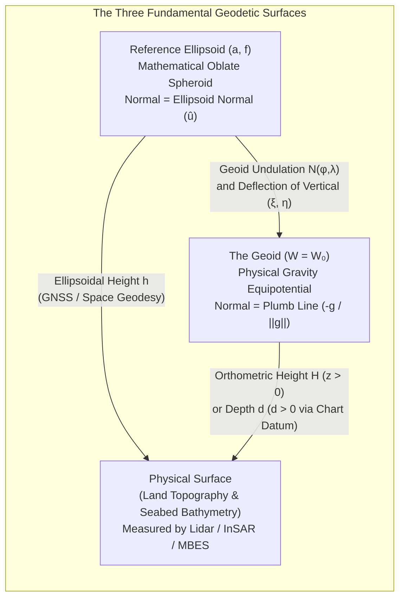
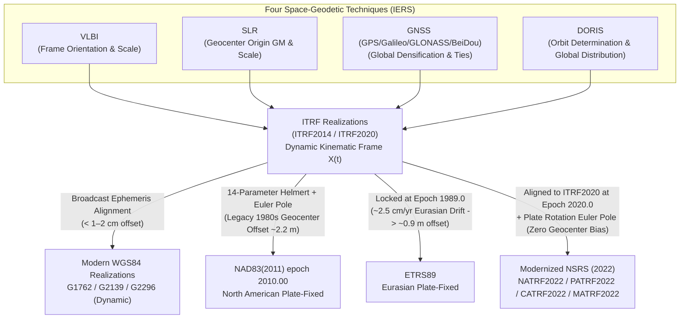

# Chapter 2: Geodesy, Horizontal Datums, Projections, and Coordinate Reference Systems

Every elevation value $z$ or bathymetric depth $d$ stored in a digital elevation model is meaningless unless it is anchored to a rigorous mathematical statement of **where** that measurement resides on a rotating, gravitating, and continuously deforming planet. In modern high-resolution topography and hydrography—where airborne lidar, interferometric synthetic aperture radar (InSAR), and multibeam echosounders (MBES) routinely achieve decimeter-to-centimeter vertical precision—errors in horizontal geodetic positioning frequently dominate the total vertical error budget. On a $30^\circ$ hillslope or submarine canyon wall, an uncompensated $1.5\,\text{m}$ horizontal datum discrepancy between the North American Datum of 1983 (NAD83) and the International Terrestrial Reference Frame (ITRF) injects nearly $0.9\,\text{m}$ of spurious vertical error, nine times larger than the intrinsic sensor noise. This chapter develops the geometric and physical foundations of geodesy, reference ellipsoids, terrestrial reference frames, map projections, and coordinate reference system (CRS) transformations required to preserve the metric integrity of elevation datasets from raw sensor acquisition through derivative terrain analysis.

---

## 2.1 The Shape of the Earth: Sphere, Ellipsoid, and Geoid

Geodesy—defined classically by Friedrich Robert Helmert (1880) as the science of measuring and mapping the Earth's surface, and expanded in the space age to include the determination of the external gravity field and the ocean floor—distinguishes three fundamental surfaces when describing planetary shape:

1. **The Physical Topographic and Bathymetric Surface:** The actual, irregular interface between the solid crust (or vegetation/built structures) and the atmosphere on land, and between the seabed/lakebed and the water column in marine, estuarine, and lacustrine environments. This surface spans nearly $20\,\text{km}$ of vertical relief, from the summit of Mount Everest ($+8{,}848.86\,\text{m}$) to the Challenger Deep in the Mariana Trench ($\approx -10{,}925\,\text{m}$), and is far too complex to serve directly as a mathematical coordinate surface for horizontal positioning.
2. **The Geoid:** The equipotential surface of the Earth's gravity field—incorporating both Newtonian gravitational attraction $V$ and the centrifugal potential $\Phi_c = \frac{1}{2}\omega_E^2 (X^2 + Y^2)$ of Earth's rotation—upon which the gravity potential $W(\mathbf{X}) = V(\mathbf{X}) + \Phi_c(\mathbf{X})$ equals a constant reference value $W_0 \approx 62{,}636{,}853.4\,\text{m}^2\,\text{s}^{-2}$ (IERS Conventions; Petit & Luzum, 2010; Sanchez et al., 2016) that best approximates global mean sea level in the absence of winds, currents, tides, and barometric variations. Because density heterogeneities in the mantle and crust perturb $V(\mathbf{X})$, the geoid is an undulating physical surface whose local normal is the **plumb line** (direction of the gravity vector $\mathbf{g} = \nabla W$). While essential as the zero-elevation reference for physical heights (Chapter 3), the geoid cannot be parameterized by simple closed-form analytic coordinates.
3. **The Reference Ellipsoid (Oblate Spheroid):** A smooth, mathematically tractable biaxial ellipsoid of revolution generated by rotating an ellipse with equatorial **semi-major axis** $a$ and polar **semi-minor axis** $b$ ($a > b$) about its minor axis. Because centrifugal acceleration is maximal at the equator and vanishes at the poles, hydrostatic equilibrium causes the Earth to bulge at the equator, making the polar radius $b \approx 6{,}356.75\,\text{km}$ approximately $21.385\,\text{km}$ shorter than the equatorial radius $a \approx 6{,}378.14\,\text{km}$. The spatial separation between the physical geoid and the geometric reference ellipsoid, measured along the ellipsoid normal, is the **geoid undulation** (or geoid height) $N(\varphi, \lambda)$, which ranges globally from $-106\,\text{m}$ in the Indian Ocean Geoid Low south of Sri Lanka to $+85\,\text{m}$ across New Guinea and the North Atlantic near Iceland.

---

### 2.1.1 Evolution of Reference Ellipsoids: From Regional Arcs to Geocentric Frames

An oblate ellipsoid of revolution is completely defined geometrically by two independent parameters: the semi-major axis $a$ $[\text{m}]$ and the **geometric flattening** $f$ (dimensionless):

$$f = \frac{a - b}{a} = 1 - \frac{b}{a}$$

From $a$ and $f$, geodesic and coordinate transformation equations utilize the **first eccentricity squared** $e^2$, the **second eccentricity squared** $e'^2$, and the **third flattening** $n$:

$$e^2 = \frac{a^2 - b^2}{a^2} = 2f - f^2, \qquad e'^2 = \frac{a^2 - b^2}{b^2} = \frac{e^2}{1 - e^2}, \qquad n = \frac{a - b}{a + b} = \frac{f}{2 - f}$$

#### Historical Regional Best-Fitting Ellipsoids
From the late eighteenth through the mid-twentieth centuries, geodesists could not observe the entire planet simultaneously or locate the Earth's center of mass. Instead, they estimated $a$ and $f$ by combining astro-geodetic latitude and longitude differences along continental **meridian arcs** and **parallel arcs** with terrestrial baseline and triangulation chains (e.g., the Anglo-French, Russo-Scandinavian, Peruvian, Indian, and North American arcs). Because each regional survey sampled a different portion of the undulating geoid, the resulting ellipsoids—such as **Airy 1830**, **Bessel 1841**, **Clarke 1861/1866**, **International 1924** (derived by John Fillmore Hayford in 1909 and adopted by the International Union of Geodesy and Geophysics, IUGG, in Madrid in 1924), and **Krassovsky 1940**—differed by hundreds of meters in $a$ and were intentionally positioned and oriented (non-geocentrically) to minimize the geoid undulation $N$ and deflection of the vertical over a specific nation or continent.

#### Modern Geocentric Global Reference Ellipsoids (GRS80 and WGS84)
The launch of artificial satellites beginning in 1957 revolutionized geodesy by permitting direct observation of orbital perturbations governed by the Earth's center of mass (**geocenter**) and global gravity field harmonics. In 1979, at its XVII General Assembly in Canberra, the IUGG adopted **Geodetic Reference System 1980 (GRS80)** (Moritz, 1980), followed in 1984 by the U.S. Defense Mapping Agency's **World Geodetic System 1984 (WGS84)** (NIMA, 2000; NGA, 2014). Unlike purely geometric historical ellipsoids, both GRS80 and WGS84 are **equipotential level ellipsoids** defined by four fundamental physical and geometric constants:
1. The equatorial semi-major axis $a$ $[\text{m}]$;
2. The geocentric gravitational constant $GM$ $[\text{m}^3\,\text{s}^{-2}]$ (mass of the Earth including atmosphere and oceans multiplied by Newton's constant);
3. A second-degree zonal gravity parameter—either the **dynamical form factor** $J_2 = (C - A)/(M a^2)$ (GRS80) or the fully normalized second-degree zonal spherical harmonic coefficient $\bar{C}_{2,0} = -J_2 / \sqrt{5}$ (WGS84)—measuring the dynamical oblateness between polar moment of inertia $C$ and equatorial moment of inertia $A$;
4. The mean angular velocity of the Earth's rotation $\omega_E$ $[\text{rad}\,\text{s}^{-1}]$.

Table 2.1 compiles the defining and derived constants for the primary historical and modern reference ellipsoids encountered in legacy and contemporary DEM production.

| Ellipsoid Name & Year | Semi-Major Axis $a$ $(\text{m})$ | Semi-Minor Axis $b$ $(\text{m})$ | Inverse Flattening $1/f$ | First Eccentricity Squared $e^2$ | $GM$ $(\text{m}^3\,\text{s}^{-2})$ & $\omega_E$ $(\text{rad}\,\text{s}^{-1})$ | Primary Associated Horizontal Datums & Geographic Coverage |
| :--- | :--- | :--- | :--- | :--- | :--- | :--- |
| **Airy 1830** | $6{,}377{,}563.396$ | $6{,}356{,}256.909$ | $299.3249646$ | $0.006670540000$ | *Geometric only* | OSGB36 (Great Britain Ordnance Survey National Grid) |
| **Bessel 1841** | $6{,}377{,}397.155$ | $6{,}356{,}078.963$ | $299.1528128$ | $0.006674372232$ | *Geometric only* | DHDN / Potsdam (Germany), MGI (Austria), CH1903 (Switzerland), Legacy Tokyo Datum (Japan) |
| **Clarke 1858 / 1861** | $6{,}378{,}293.645$ | $6{,}356{,}617.982$ | $294.260676369$ | $0.006785146196$ | *Geometric only* | British Principal Triangulation (1858/1861) & 19th-century colonial/arc reductions |
| **Clarke 1866** | $6{,}378{,}206.400$ | $6{,}356{,}583.800$ | $294.978698214$ | $0.006768657997$ | *Geometric only* | **NAD27** (North America, CONUS, Alaska, Canada), Luzon 1911 (Philippines) |
| **Clarke 1880 (IGN)** | $6{,}378{,}249.200$ | $6{,}356{,}515.000$ | $293.466021294$ | $0.006803487646$ | *Geometric only* | NTF (France), Adindan, Arc 1950, Cape Datum (Africa) |
| **International 1924 (Hayford 1909)** | $6{,}378{,}388.000$ | $6{,}356{,}911.946$ | $297.0$ *(exact)* | $0.006722670022$ | *Geometric only* | **ED50** (Western Europe), Campo Inchauspe (Argentina), NZGD49 (New Zealand) |
| **Krassovsky 1940** | $6{,}378{,}245.000$ | $6{,}356{,}863.019$ | $298.3$ *(exact)* | $0.006693421623$ | *Geometric only* | **Pulkovo 1942 / SK-42** (USSR / Russia), S-JTSK (Czechia/Slovakia), Beijing 1954 (China) |
| **GRS67 / AN66** | $6{,}378{,}160.000$ | $6{,}356{,}774.719$ | $298.25$ / $298.247167$ | $0.006694541855$ | $3.98603\times 10^{14}$ $7.2921151467\times 10^{-5}$ | AGD66 / AGD84 (Australia), SAD69 (South America) |
| **GRS80 (1980)** | $6{,}378{,}137.0$ *(exact)* | $6{,}356{,}752.314140$ | $298.257222101$ | $0.006694380023$ | $3.986005\times 10^{14}$ $7.292115\times 10^{-5}$ | **ITRF** (all realizations), **NAD83** (all realizations), **ETRS89**, **GDA94/GDA2020**, **JGD2011**, **SIRGAS**, **NATRF2022** |
| **WGS84 (1984 / G2296)** | $6{,}378{,}137.0$ *(exact)* | $6{,}356{,}752.314245$ | $298.257223563$ *(exact)* | $0.006694379990$ | $3.986004418\times 10^{14}$ $7.292115\times 10^{-5}$ | **WGS84** (Transit & GPS realizations G730 through G2296), global aviation, defense, and NGA charting |

#### Why Do GRS80 and WGS84 Differ by $0.105\,\text{mm}$ in Semi-Minor Axis $b$?
Although WGS84 was intentionally modeled on GRS80 with an identical semi-major axis $a = 6{,}378{,}137.0\,\text{m}$, a subtle mathematical discrepancy arose during the original 1984 derivation. In GRS80, the defining dynamical form factor was specified exactly to six significant digits as:

$$J_{2,\text{GRS80}} = 1.08263 \times 10^{-3}$$

Solving the closed-form Somigliana–Pizzetti level-ellipsoid iterative relation connecting $J_2$, $a$, $GM$, and $\omega_E$ to geometric flattening $f$:

$$J_2 = \frac{e^2}{3}\left(1 - \frac{2}{15}\frac{m e'}{q_0}\right), \quad \text{where } m = \frac{\omega_E^2 a^2 b}{GM}, \quad 2q_0 = \left(1 + \frac{3}{e'^2}\right)\arctan e' - \frac{3}{e'}$$

yields the GRS80 inverse flattening $1/f_{\text{GRS80}} = 298.2572221008827\dots$ and semi-minor axis $b_{\text{GRS80}} = a(1 - f_{\text{GRS80}}) = 6{,}356{,}752.314140356\,\text{m}$.

When the U.S. Defense Mapping Agency formulated WGS84, it adopted the normalized second-degree zonal harmonic coefficient $\bar{C}_{2,0} = -J_2/\sqrt{5}$ as the defining parameter instead of $J_2$, and **truncated** $\bar{C}_{2,0,\text{GRS80}} = -1.08263 \times 10^{-3} / \sqrt{5} = -4.84166854896\dots \times 10^{-4}$ to eight significant digits:

$$\bar{C}_{2,0,\text{WGS84}} = -4.8416685 \times 10^{-4} \implies J_{2,\text{WGS84}} = 1.08262998905 \times 10^{-3}$$

This tiny $1.095 \times 10^{-11}$ truncation in $J_2$ shifted the derived inverse flattening to $1/f_{\text{WGS84}} = 298.257223563$ (subsequently frozen as a defining constant in later WGS84 updates after $GM$ and $\bar{C}_{2,0}$ were refined). Multiplying $a = 6{,}378{,}137.0\,\text{m}$ by the flattening difference produces the famous sub-millimeter polar radius discrepancy:

$$\Delta b = b_{\text{WGS84}} - b_{\text{GRS80}} = a\left(f_{\text{GRS80}} - f_{\text{WGS84}}\right) = +0.000105\,\text{m} = +0.105\,\text{mm}$$

For all practical DEM and hydrographic applications, the *geometric shapes* of the GRS80 and WGS84 ellipsoids are indistinguishable (differing by at most $0.105\,\text{mm}$ at the poles). However, as shown in Section 2.1.3, the **coordinate realizations** (reference frames) associated with GRS80-based datums such as NAD83 versus WGS84/ITRF differ by **more than $1.5\text{–}2.2\,\text{m}$** due to geocenter origin and tectonic plate motion definitions.

---

### 2.1.2 Coordinate Frames: ECEF $(X,Y,Z)$, Geodetic $(\varphi,\lambda,h)$, and Topocentric $(E,N,U / N,E,D)$

Three classes of three-dimensional coordinate frames are used continuously across the DEM lifecycle: global Cartesian coordinates for satellite orbits and Helmert transformations, curvi-linear geodetic coordinates for global archiving, and local tangent-plane Cartesian coordinates for sensor point-cloud integration and surface derivative calculation.

#### 1. Earth-Centered, Earth-Fixed (ECEF) Cartesian Coordinates $(X, Y, Z)$
An ECEF frame is a right-handed orthogonal 3D Cartesian system $(X, Y, Z)$ with units of meters $[\text{m}]$ that co-rotates with the solid Earth:
* **Origin $(0,0,0)$:** Located at the Earth's center of mass (including oceans and atmosphere) for modern geocentric frames, or offset by $\Delta\mathbf{X}_0 = (\Delta X_0, \Delta Y_0, \Delta Z_0)^T$ for legacy regional datums.
* **$Z$-Axis:** Directed toward the **IERS Reference Pole (IRP)** (historically the Conventional International Origin, CIO).
* **$X$-Axis:** Lies in the equatorial plane (orthogonal to $Z$) at the intersection with the **IERS Reference Meridian (IRM)** passing near the Royal Observatory at Greenwich (offset by $\approx 5.31''$ or $102.5\,\text{m}$ east of the historical Airy Transit Circle due to local deflection of the vertical at Greenwich; Malys et al., 2015).
* **$Y$-Axis:** Lies in the equatorial plane at $\lambda = +90^\circ\text{ E}$, completing the right-handed triad ($\hat{\mathbf{X}} \times \hat{\mathbf{Y}} = \hat{\mathbf{Z}}$).

#### 2. Curvi-Linear Geodetic Coordinates $(\varphi, \lambda, h)$ and the Three Latitudes
Relative to a reference ellipsoid of semi-major axis $a$ and first eccentricity squared $e^2$ centered on the ECEF axes, any point $P$ in space is specified by its **geodetic latitude** $\varphi \in [-\pi/2, +\pi/2]$ (positive north), **geodetic longitude** $\lambda \in (-\pi, +\pi]$ (positive east), and **ellipsoidal height** $h$ $[\text{m}]$ (measured outward along the surface normal $\hat{\mathbf{u}}$ from the ellipsoid to $P$, positive up).

Because an oblate ellipsoid is not a sphere, the surface normal at $\varphi \notin \{0, \pm\pi/2\}$ **does not pass through the center of the ellipsoid**. Geodesy therefore strictly distinguishes three latitudes for a point $P_0$ on the ellipsoid surface ($h=0$) with cylindrical radius $p = \sqrt{X_0^2 + Y_0^2}$ and axial coordinate $Z_0$:

1. **Geodetic Latitude ($\varphi$):** The acute angle in the meridian plane between the equatorial plane and the **ellipsoid normal** passing through $P_0$. This is the standard latitude used on all maps, GNSS receivers, and geographic CRS definitions (e.g., EPSG:4326, EPSG:4269).
2. **Geocentric Latitude ($\varphi_c$ or $\psi$):** The angle between the equatorial plane and the radial position vector $\mathbf{X}_0$ connecting the ellipsoid center $(0,0,0)$ to $P_0$, used in spherical harmonic gravity expansions (Chapter 3).
3. **Parametric (or Reduced) Latitude ($\beta$):** The angle obtained by projecting $P_0$ parallel to the $Z$-axis onto an auxiliary circumscribed sphere of radius $a$, such that $p = a\cos\beta$ and $Z_0 = b\sin\beta$, used in exact geodesic integration (Vincenty, 1975; Karney, 2013).

On the surface of the ellipsoid ($h=0$), the three latitudes are linked by the exact relations:

$$\tan\varphi_c = (1 - e^2)\tan\varphi = (1 - f)^2 \tan\varphi, \qquad \tan\beta = \sqrt{1 - e^2}\tan\varphi = (1 - f)\tan\varphi$$

satisfying $|\varphi_c| \le |\beta| \le |\varphi|$ everywhere, with equality only at the equator ($\varphi = 0^\circ$) and poles ($\varphi = \pm 90^\circ$). The angular difference $\varphi - \varphi_c$ reaches its maximum near $\varphi = \arctan(1/(1-f)) \approx 45^\circ 05' 46''$, where:

$$(\varphi - \varphi_c)_{\max} = \arctan\!\left(\frac{e^2}{2\sqrt{1 - e^2}}\right) \approx 0.1924^\circ = 11'\,32.7''$$

Multiplying this angular discrepancy by Earth's mean radius ($R_E \approx 6{,}371\,\text{km}$) reveals that **conflating geocentric and geodetic latitude—or treating ellipsoidal latitudes as spherical latitudes—shifts terrain features horizontally by up to $21.39\,\text{km}$ in the mid-latitudes**.

#### Principal Radii of Curvature $N(\varphi)$ and $M(\varphi)$
At geodetic latitude $\varphi$, an oblate ellipsoid exhibits two principal radii of curvature corresponding to orthogonal normal sections:
* **Prime Vertical Radius of Curvature $N(\varphi)$** (in the east-west normal plane perpendicular to the meridian):
  $$N(\varphi) = \frac{a}{\sqrt{1 - e^2\sin^2\varphi}}$$
  which increases from $N(0^\circ) = a \approx 6{,}378{,}137.0\,\text{m}$ at the equator to $N(\pm 90^\circ) = a/\sqrt{1-e^2} = a^2/b \approx 6{,}399{,}593.6\,\text{m}$ at the poles.
* **Meridional Radius of Curvature $M(\varphi)$** (in the north-south meridian plane):
  $$M(\varphi) = \frac{a(1 - e^2)}{\left(1 - e^2\sin^2\varphi\right)^{3/2}} = \frac{N(\varphi)(1 - e^2)}{1 - e^2\sin^2\varphi}$$
  which increases from $M(0^\circ) = a(1-e^2) = b^2/a \approx 6{,}335{,}439.3\,\text{m}$ at the equator to $M(\pm 90^\circ) = a^2/b \approx 6{,}399{,}593.6\,\text{m}$ at the poles.

Consequently, differential arc lengths along a meridian ($ds_{\text{N}}$) and along a parallel of latitude ($ds_{\text{E}}$) at ellipsoidal height $h$ are given by:

$$ds_{\text{N}} = \left(M(\varphi) + h\right)d\varphi, \qquad ds_{\text{E}} = \left(N(\varphi) + h\right)\cos\varphi\,d\lambda$$

and the exact forward transformation from geodetic $(\varphi, \lambda, h)$ to ECEF $(X, Y, Z)$ is:

$$\begin{aligned}
X &= \left(N(\varphi) + h\right)\cos\varphi\cos\lambda \\
Y &= \left(N(\varphi) + h\right)\cos\varphi\sin\lambda \\
Z &= \left[N(\varphi)(1 - e^2) + h\right]\sin\varphi
\end{aligned}$$

(The inverse transformation from $(X,Y,Z)$ to $(\varphi,\lambda,h)$ via Bowring's and Vermeille's methods is derived in Section 2.5.)

#### 3. Local Tangent Plane (Topocentric) Frames: Terrestrial $(E, N, U)$ vs. Marine/Aerospace $(N, E, D)$
Given a local reference origin $P_0 = (\varphi_0, \lambda_0, h_0)$ with ECEF coordinates $\mathbf{X}_0 = (X_0, Y_0, Z_0)^T$, a **Local Geodetic Horizon (Local Tangent Plane)** frame resolves a relative displacement vector $\Delta\mathbf{X}_{\text{ECEF}} = \mathbf{X} - \mathbf{X}_0$ along three mutually orthogonal unit vectors tangent and normal to the ellipsoid at $P_0$:

$$\hat{\mathbf{e}} = \begin{bmatrix} -\sin\lambda_0 \\ \cos\lambda_0 \\ 0 \end{bmatrix}, \qquad \hat{\mathbf{n}} = \begin{bmatrix} -\sin\varphi_0\cos\lambda_0 \\ -\sin\varphi_0\sin\lambda_0 \\ \cos\varphi_0 \end{bmatrix}, \qquad \hat{\mathbf{u}} = \begin{bmatrix} \cos\varphi_0\cos\lambda_0 \\ \cos\varphi_0\sin\lambda_0 \\ \sin\varphi_0 \end{bmatrix}$$

Different disciplines order and orient these axes into two distinct right-handed conventions:
* **East–North–Up $(E, N, U)$ — Terrestrial Geomatics and Land Surveying Convention:** The first axis points East ($+\hat{\mathbf{e}}$), the second North ($+\hat{\mathbf{n}}$), and the third Up ($+\hat{\mathbf{u}}$, outward along the ellipsoid normal), matching standard map axes $(x, y)$ and **positive-up elevation $z$**:
  $$\begin{bmatrix} E \\ N \\ U \end{bmatrix} = \mathbf{R}_{\text{ECEF}\to\text{ENU}}(\varphi_0, \lambda_0)\,\left(\mathbf{X} - \mathbf{X}_0\right) = \begin{bmatrix} -\sin\lambda_0 & \cos\lambda_0 & 0 \\ -\sin\varphi_0\cos\lambda_0 & -\sin\varphi_0\sin\lambda_0 & \cos\varphi_0 \\ \cos\varphi_0\cos\lambda_0 & \cos\varphi_0\sin\lambda_0 & \sin\varphi_0 \end{bmatrix} \begin{bmatrix} X - X_0 \\ Y - Y_0 \\ Z - Z_0 \end{bmatrix}$$
* **North–East–Down $(N, E, D)$ — Marine Hydrography, Sonar, and Aerospace INS Convention:** In vessel-mounted multibeam echosounder (MBES) and airborne inertial navigation systems (INS), vehicle attitude (roll $\phi_r$ about forward $x_{\text{body}}$, pitch $\theta_p$ about starboard $y_{\text{body}}$, and heading/yaw $\psi_y$ clockwise from North about downward $z_{\text{body}}$) requires a right-handed navigation frame where the first axis points North ($+\hat{\mathbf{n}}$), the second East ($+\hat{\mathbf{e}}$), and the third **Down ($-\hat{\mathbf{u}}$)** ($\hat{\mathbf{n}} \times \hat{\mathbf{e}} = -\hat{\mathbf{u}} = \hat{\mathbf{d}}$), aligning naturally with **positive-down water depth $d$**:
  $$\begin{bmatrix} N \\ E \\ D \end{bmatrix} = \mathbf{P}_{\text{ENU}\leftrightarrow\text{NED}} \begin{bmatrix} E \\ N \\ U \end{bmatrix} = \begin{bmatrix} 0 & 1 & 0 \\ 1 & 0 & 0 \\ 0 & 0 & -1 \end{bmatrix} \begin{bmatrix} E \\ N \\ U \end{bmatrix}$$

> [!WARNING]
> **Coordinate Swap and Sign Inversion Between ENU and NED**
> Because $\det(\mathbf{P}_{\text{ENU}\leftrightarrow\text{NED}}) = +1$, both $(E,N,U)$ and $(N,E,D)$ are valid right-handed coordinate systems. However, importing a hydrographic point cloud or INS trajectory formatted in $(N, E, D)$ into terrestrial GIS software expecting $(E, N, U)$ without applying $\mathbf{P}_{\text{ENU}\leftrightarrow\text{NED}}$ simultaneously reflects the map across the $45^\circ$ diagonal ($E \leftrightarrow N$) and inverts topography into mirror-image depressions ($U = -D$).

---

### 2.1.3 Classical Triangulation Networks vs. Modern Space-Geodetic Realizations

A reference ellipsoid alone defines only a shape and size; to assign coordinates to physical points on Earth, that ellipsoid must be positioned and oriented relative to the crust through a **geodetic datum** and its physical realization (a **Terrestrial Reference Frame, TRF**).

#### Classical Astro-Geodetic Triangulation Networks
Before space geodesy, national horizontal datums were realized by measuring **baselines** (typically $5\text{–}15\,\text{km}$ long) with invar tapes or temperature-compensated bars, and propagating horizontal coordinates across continents via chains of optical **triangulation** (measuring interior horizontal angles with precision theodolites) and **trilateration**:
* **Principal Triangulation of Great Britain (1791–1853):** Initiated by Major-General William Roy on the Hounslow Heath baseline (1784) and formally established by the Board of Ordnance in 1791 (`gis-history`), British surveyors used Jesse Ramsden's $36\text{-inch}$ (0.91 m) great theodolite to link hundreds of hilltop stations across England, Scotland, Wales, and Ireland, verified against the Salisbury Plain and Lough Foyle baselines measured with Colby's compensation bars. Adjusted by Captain Alexander Ross Clarke in 1858 onto the **Airy 1830** ellipsoid—and later re-observed during the Retriangulation of Great Britain (1936–1962) using concrete triangulation pillars—this network formed the **Ordnance Survey Great Britain 1936 (OSGB36)** datum.
* **North American Datum of 1927 (NAD27):** Adjusted by the U.S. Coast and Geodetic Survey (USC&GS) from over $25{,}000$ triangulation monuments across the contiguous United States and Canada (`gis-history`), NAD27 adopted the **Clarke 1866** ellipsoid anchored at a single continental origin station: **Meades Ranch, Osborne County, Kansas** ($\varphi_0 = 39^\circ 13' 26.686''\text{ N}$, $\lambda_0 = 98^\circ 32' 30.506''\text{ W}$, azimuth to station Waldo $\alpha_0 = 75^\circ 28' 09.64''$).

#### Why Classical Datums Suffered Meter-Scale Continental Distortions
Classical astro-geodetic networks contained three structural sources of systematic error that accumulated over thousands of kilometers:
1. **Deflection of the Vertical $(\xi, \eta)$:** Theodolites and astronomical instruments are leveled using spirit bubbles or mercury pools aligned with the physical **plumb line** (perpendicular to the geoid), thereby measuring **astronomical latitude** $\Phi$, **astronomical longitude** $\Lambda$, and **astronomical azimuth** $\alpha_{\text{astro}}$. The geometric ellipsoid normal $(\varphi, \lambda)$ deviates from the plumb line by the meridional deflection $\xi$ (north-south geoid slope) and prime-vertical deflection $\eta$ (east-west geoid slope):
   $$\xi = \Phi - \varphi = -\frac{1}{M(\varphi)}\frac{\partial N}{\partial \varphi}, \qquad \eta = (\Lambda - \lambda)\cos\varphi = -\frac{1}{N(\varphi)\cos\varphi}\frac{\partial N}{\partial \lambda}$$
   Near steep topographic mass anomalies (e.g., the Rocky Mountains, Alps, or oceanic trenches) $\xi$ and $\eta$ reach $20''\text{–}60''$. Furthermore, the tilt of the plumb line twists horizontal angles and azimuths according to the **Laplace Azimuth Equation**:
   $$\alpha_{\text{astro}} - \alpha_{\text{geod}} = (\Lambda - \lambda)\sin\varphi + \left(\xi\sin\alpha - \eta\cos\alpha\right)\cot\zeta \xrightarrow{\zeta \to 90^\circ} \eta\tan\varphi$$
   where $\zeta$ is the zenith angle of the sighted target. When $\xi$ and $\eta$ were only sparsely observed at "Laplace stations," unmodeled plumb-line deflections bowed triangulation chains laterally across continents.
2. **Baseline Reduction to the Geoid Instead of the Ellipsoid:** Geodetic computations on an ellipsoid require reducing measured ground distances $s_{\text{ground}}$ at orthometric height $H$ and geoid undulation $N$ to the **ellipsoid surface** using $h = H + N$:
   $$s_{\text{ellip}} \approx s_{\text{ground}}\left(1 - \frac{H + N}{R_{\alpha}}\right)$$
   Because regional geoid undulations $N(\varphi,\lambda)$ were unknown in 1927 (and assumed $N_0 = 0$ at Meades Ranch), baselines in NAD27 and ED50 were reduced only to **Mean Sea Level (the geoid)** via $1 - H/R_{\alpha}$, introducing a systematic scale distortion $\delta s / s = -N / R_\alpha$ ($\approx 1.6\,\text{ppm}$ per $10\,\text{m}$ of unmodeled geoid height).
3. **Piecewise Sequential Adjustments and Non-Geocentric Origin:** Fixing Meades Ranch locally caused the Clarke 1866 ellipsoid center in NAD27 to sit roughly $\Delta\mathbf{X}_0 \approx (-8\,\text{m}, +160\,\text{m}, +176\,\text{m})$ away from the Earth's true center of mass, while piecewise network expansion accumulated $10\text{–}15\,\text{m}$ of internal strain across North America ($>100\,\text{m}$ absolute shift relative to modern GNSS).

#### Modern Space-Geodetic Realizations (ITRF, WGS84, NAD83, ETRS89, NATRF2022)
Today, global reference frames are realized not by optical line-of-sight chains, but by combining four complementary space-geodetic observation techniques coordinated by the IERS:
* **VLBI (Very Long Baseline Interferometry):** Measures time delays of extragalactic quasar radio emissions across intercontinental baselines, providing the definitive **orientation** of Earth in inertial space and contributes to **scale**.
* **SLR (Satellite Laser Ranging):** Measures round-trip laser pulse times to passive geodetic satellites (e.g., LAGEOS-1/2, LARES), uniquely determining the **geocenter origin** $(0,0,0)$ (Earth's center of mass) and sharing **scale** definition with VLBI.
* **GNSS (GPS, GLONASS, Galileo, BeiDou):** Provides a dense global network of Continuously Operating Reference Stations (CORS) that ties co-located space-geodetic monuments together and tracks crustal kinematics continuously.
* **DORIS (Doppler Orbitography and Radiopositioning Integrated by Satellite):** A globally distributed beacon network supporting precise orbit determination for radar altimetry and geodetic satellites.

Practitioners working with modern DEMs must distinguish four operational classes of space-geodetic frames:

1. **The International Terrestrial Reference Frame (ITRF2014 / ITRF2020):** Maintained by the IERS (Altamimi et al., 2016, 2023) using the **GRS80** ellipsoid, ITRF is a **dynamic (kinematic) geocentric frame**. Because tectonic plates move at $1\text{–}10\,\text{cm}\,\text{yr}^{-1}$ and glacial isostatic adjustment (GIA) and earthquakes deform the crust, a point's coordinates in ITRF2020 are valid **only if accompanied by an observation epoch $t$**:
   $$\mathbf{X}(t) = \mathbf{X}(t_0) + \dot{\mathbf{X}}\,(t - t_0) + \sum_{k} \delta\mathbf{X}_{\text{PSD},k}(t) + \delta\mathbf{X}_{\text{seasonal}}(t)$$
   where $\dot{\mathbf{X}}$ is the linear secular velocity $[\text{m}\,\text{yr}^{-1}]$, $\delta\mathbf{X}_{\text{PSD},k}(t)$ models logarithmic/exponential post-seismic deformation after major earthquakes, and $\delta\mathbf{X}_{\text{seasonal}}(t)$ captures annual and semi-annual hydrologic/atmospheric loading.
2. **WGS84 Realizations (Transit to G2296):** Operated by the U.S. National Geospatial-Intelligence Agency (NGA) for GPS broadcast orbits, WGS84 is **not a single static datum**, but a sequence of eight progressively refined realizations (the original 1987 Transit realization followed by seven GPS-week realizations):
   * *Original WGS84 (1987):* Derived from Doppler Transit observations; accuracy $\pm 1\text{–}2\,\text{m}$.
   * *WGS84 (G730) [1994], (G873) [1997], (G1150) [2002], (G1674) [2012], (G1762) [2013], (G2139) [2021], and (G2296) [2024]:* Where "G" denotes the GPS Week of implementation. Modern realizations (**G2139** aligned to ITRF2014, and **G2296** aligned to ITRF2020 in April 2024) agree with contemporary ITRF to within **$< 1\text{–}2\,\text{cm}$** globally and are fully **dynamic** (coordinates change continuously with epoch $t$). However, generic GIS metadata codes like `EPSG:4326` ("WGS 84") treat all realizations since 1987 as a single **Datum Ensemble** with an intrinsic positional ambiguity of **$1.5\text{–}2.0\,\text{m}$**!
3. **Legacy Plate-Fixed Regional Frames — NAD83(2011) and ETRS89:** To spare civil surveyors and GIS users from coordinates that change by centimeters every year, continental agencies created **plate-fixed** frames that co-rotate with a specific tectonic plate:
   * **NAD83(2011) (epoch 2010.00):** Used across the United States and Canada (as NAD83(CSRS)) on the GRS80 ellipsoid. Although NAD83 was intended in 1986 to be geocentric, early 1980s space-geodetic data mislocated the Earth's center of mass. Consequently, **NAD83(2011) has a systematic $\sim 2.2\,\text{m}$ 3D geocenter offset** relative to ITRF2020/WGS84 (Helmert origin translation $T_X \approx +0.996\,\text{m}, T_Y \approx -1.901\,\text{m}, T_Z \approx -0.522\,\text{m}$ from ITRF to NAD83 at epoch 1997.00, meaning the NAD83 origin sits at $\Delta\mathbf{O} \approx (-0.996, +1.901, +0.522)^T\,\text{m}$ relative to the ITRF geocenter). Combined with North American plate rotation, across the contiguous United States this manifests as a **$1.0\text{–}1.5\,\text{m}$ horizontal shift** and a **$0.4\text{–}1.3\,\text{m}$ vertical shift in ellipsoidal height $h$** between NAD83(2011) and ITRF2020/WGS84(G2296).
   * **ETRS89 (European Terrestrial Reference System 1989):** Coincided with ITRF89 at epoch 1989.0 and rotates with the stable Eurasian plate via an Euler pole transformation. Because the Eurasian plate drifts northeastward at $\sim 2.5\,\text{cm}\,\text{yr}^{-1}$, by epoch 2025.0 ETRS89 coordinates differ from contemporary ITRF2020 and WGS84(G2296) coordinates by **$\sim 0.85\text{–}0.95\,\text{m}$ horizontally**, even though both use the GRS80/WGS84 ellipsoid and share the same geocenter!
4. **Modernized NSRS Plate-Fixed Frames (NATRF2022, PATRF2022, CATRF2022, MATRF2022):** To eliminate the legacy $2.2\,\text{m}$ geocenter error of NAD83 while preserving plate-fixed convenience, the U.S. National Geodetic Survey (NGS) and Canadian Geodetic Survey established four new GRS80 reference frames aligned **exactly to ITRF2020 at reference epoch 2020.00**, each rotating with its respective tectonic plate via an Euler pole rate $(\omega_X, \omega_Y, \omega_Z)$: the **North American (NATRF2022)**, **Pacific (PATRF2022)**, **Caribbean (CATRF2022)**, and **Mariana (MATRF2022)** Terrestrial Reference Frames, supplemented by an Intra-Frame Deformation Model (IFDM2022) for active plate-boundary zones such as California and Alaska.

---

### 2.1.4 How Horizontal Datum and Ellipsoid Shifts Corrupt DEM Elevations

Datum and ellipsoid misconfigurations corrupt digital elevation models through two distinct physical and geometric mechanisms: **slope-coupled horizontal-to-vertical error propagation** and **direct radial shifts of the reference ellipsoid surface**.

#### 1. Horizontal Datum Shifts Coupled Through Terrain Slope ($\Delta z \approx -\nabla z \cdot \Delta\mathbf{x}$)
Suppose a true topographic or bathymetric surface $z_{\text{true}}(\mathbf{x})$ (where $\mathbf{x} = (E, N)^T$ denotes true horizontal coordinates in the target datum) is inadvertently ingested into a workflow with an uncompensated horizontal datum error $\Delta\mathbf{x} = \mathbf{x}_{\text{wrong}} - \mathbf{x}_{\text{true}} = (\Delta E, \Delta N)^T$ (for instance, treating a NAD83(2011) lidar DEM or NAD27 historical bathymetric sheet as if it were referenced to ITRF2020/WGS84 without applying a datum transformation). A feature located at true coordinate $\mathbf{x} - \Delta\mathbf{x}$ is erroneously placed at coordinate $\mathbf{x}$. Expanding $z_{\text{wrong}}(\mathbf{x}) = z_{\text{true}}(\mathbf{x} - \Delta\mathbf{x})$ in a first-order Taylor series yields the **induced vertical DEM error** $\Delta z_{\text{horiz}}(\mathbf{x})$:

$$\Delta z_{\text{horiz}}(\mathbf{x}) = z_{\text{wrong}}(\mathbf{x}) - z_{\text{true}}(\mathbf{x}) = z_{\text{true}}(\mathbf{x} - \Delta\mathbf{x}) - z_{\text{true}}(\mathbf{x}) \approx -\nabla z(\mathbf{x}) \cdot \Delta\mathbf{x} = -\left(\frac{\partial z}{\partial E}\Delta E + \frac{\partial z}{\partial N}\Delta N\right)$$

Expressing the surface gradient $\nabla z$ in terms of local slope angle $\beta = \arctan(\|\nabla z\|)$ and downslope aspect azimuth $\psi_{\text{aspect}}$ (clockwise from North, where $\nabla z = -\tan\beta\,[\sin\psi_{\text{aspect}}, \cos\psi_{\text{aspect}}]^T$), and writing the horizontal datum offset vector with magnitude $\|\Delta\mathbf{x}\| = \sqrt{\Delta E^2 + \Delta N^2}$ and azimuth $\psi_{\text{shift}} = \text{atan2}(\Delta E, \Delta N)$, we obtain the universal terrain co-registration cosine relationship (Nuth & Kääb, 2011):

$$\Delta z_{\text{horiz}} \approx +\|\Delta\mathbf{x}\|\,\tan\beta\,\cos\!\left(\psi_{\text{shift}} - \psi_{\text{aspect}}\right)$$

Even on moderate terrain ($\beta = 25^\circ, \tan\beta = 0.466$), an uncompensated $1.5\,\text{m}$ horizontal shift between NAD83(2011) and ITRF2020/WGS84 introduces a systematic vertical error of $\Delta z_{\text{horiz}} = \pm 0.70\,\text{m}$ on slopes facing along $\psi_{\text{shift}}$—seven times larger than the $10\,\text{cm}$ vertical accuracy specification of USGS 3DEP Quality Level 1/2 lidar! On a $40^\circ$ alpine rockwall or steep submarine canyon flank ($\tan 40^\circ = 0.839$), a legacy $50\,\text{m}$ NAD27-to-NAD83 horizontal datum error induces a catastrophic **$\pm 42.0\,\text{m}$ vertical error**.

#### 2. Why Ellipsoidal Height $h$ Changes by Meters at Fixed ECEF $(X,Y,Z)$
Second, even over a perfectly flat plain ($\nabla z = \mathbf{0}$) or at an isolated benchmark with **fixed, known geocentric coordinates $(X, Y, Z)$**, the ellipsoidal height $h$ changes by meters whenever the reference ellipsoid $(a, f)$ or datum geocenter origin is changed. By differentiating the forward coordinate transformation equations (the **Standard Molodensky Differential Formula**), a change in semi-major axis $\Delta a = a_2 - a_1$, flattening $\Delta f = f_2 - f_1$, and geocentric coordinate shift $\Delta\mathbf{X} = \mathbf{X}_2 - \mathbf{X}_1 = (\Delta X, \Delta Y, \Delta Z)^T$ (equal and opposite to the ellipsoid origin translation $\Delta\mathbf{O} = \mathbf{O}_2 - \mathbf{O}_1 = -\Delta\mathbf{X}$) changes the ellipsoidal height $h$ at point $(\varphi, \lambda)$ by:

$$\Delta h = h_2 - h_1 \approx \Delta X\cos\varphi\cos\lambda + \Delta Y\cos\varphi\sin\lambda + \Delta Z\sin\varphi - \Delta a\left(1 - f\sin^2\varphi\right) + a\,\Delta f\sin^2\varphi$$

Notice two critical consequences:
1. **Pure Ellipsoid Substitution at Identical ECEF $(X,Y,Z)$ ($\Delta\mathbf{X} = \mathbf{0}$):** Suppose a point has fixed geocentric coordinates $(X,Y,Z)$, and we compute its geodetic coordinates $(\varphi, \lambda, h)$ relative to **Clarke 1866** ($a_1 = 6{,}378{,}206.4\,\text{m}, f_1 = 1/294.9786982$) versus **GRS80** ($a_2 = 6{,}378{,}137.0\,\text{m}, f_2 = 1/298.2572221$). Here $\Delta a = -69.400\,\text{m}$ and $a\,\Delta f \approx -237.68\,\text{m}$. At latitude $\varphi = 45^\circ\text{ N}$ ($\sin^2\varphi = 0.5$), even though the point in 3D space has not moved by a single millimeter, its ellipsoidal height changes by:
   $$\Delta h_{\text{ellip}} \approx -(-69.400)(1 - 0.00168) + (-237.68)(0.5) = +69.28 - 118.84 = -49.56\,\text{m}$$
   while its geodetic latitude shifts by $\Delta\varphi \approx \frac{\sin\varphi\cos\varphi}{M(\varphi)}\left(2\Delta a\,f + a\,\Delta f\right) \approx -3.96''$ ($\approx 122\,\text{m}$ meridionally) solely because the normal vector $\hat{\mathbf{u}}$ and surface radius of the new ellipsoid differ!
2. **Geocenter Offset Between GRS80-Based Datums ($\Delta a = 0, \Delta f = 0$):** Comparing **NAD83(2011)** and **ITRF2020 / NATRF2022**, both frames use the exact same GRS80 ellipsoid ($\Delta a = 0, \Delta f = 0$). Yet because the NAD83 origin is displaced by $\approx 2.2\,\text{m}$ relative to the true geocenter, the GRS80 ellipsoid surface of NAD83 is tilted and shifted relative to the GRS80 ellipsoid surface of ITRF2020, causing ellipsoidal heights $h_{\text{NAD83}}$ and $h_{\text{ITRF2020}}$ at the exact same physical monument to differ by $0.4\text{–}1.3\,\text{m}$ across North America.

---

### Worked Numerical Example: NAD83(2011) vs. ITRF2020 / WGS84(G2296) on a Coastal Bluff

Consider an airborne topobathymetric lidar survey along the Oregon coast at $\varphi = 45.0000^\circ\text{ N}$, $\lambda = 124.0000^\circ\text{ W}$ ($\lambda = -124^\circ$), imaging a coastal headland with a west-facing sea cliff ($\psi_{\text{aspect}} = 270^\circ$) and an east-facing dune back-slope ($\psi_{\text{aspect}} = 90^\circ$), each inclined at slope $\beta = 32.0^\circ$ ($\tan\beta = 0.6249$). The new lidar DEM is referenced to **ITRF2020 (epoch 2020.00)** (equivalent to **WGS84 [G2296]**), and an analyst differences it against a baseline **NAD83(2011) (epoch 2010.00)** ellipsoidal DEM assuming "GRS80 = WGS84" with a null (zero-parameter) transformation.

1. **Compute the 3D Local Tangent Plane Shift $(\Delta E, \Delta N, \Delta U)$:** At $(\varphi = 45^\circ\text{ N}, \lambda = -124^\circ\text{ E})$ and epoch 2020.00, the official 14-parameter Helmert transformation (combining geocenter translation $\mathbf{T}(t)$ and North American frame rotation $\mathbf{R}(t)\mathbf{X}$) from ITRF2020 to NAD83(2011) yields an ECEF coordinate shift $\Delta\mathbf{X}_{\text{ECEF}} = \mathbf{X}_{\text{NAD83}} - \mathbf{X}_{\text{ITRF2020}} = (+0.983\,\text{m}, -1.190\,\text{m}, +0.118\,\text{m})^T$. Rotating $\Delta\mathbf{X}_{\text{ECEF}}$ into the local $(E, N, U)$ frame using $\sin(45^\circ) = \cos(45^\circ) = 0.7071$, $\sin(-124^\circ) = -0.8290$, and $\cos(-124^\circ) = -0.5592$:
   $$\begin{aligned}
   \Delta E &= -\sin\lambda\,\Delta X + \cos\lambda\,\Delta Y = -(-0.8290)(+0.983) + (-0.5592)(-1.190) = +0.815 + 0.665 = +1.480\,\text{m} \\
   \Delta N &= -\sin\varphi\cos\lambda\,\Delta X - \sin\varphi\sin\lambda\,\Delta Y + \cos\varphi\,\Delta Z \\
            &= -(0.7071)(-0.5592)(+0.983) - (0.7071)(-0.8290)(-1.190) + (0.7071)(+0.118) = +0.389 - 0.698 + 0.083 = -0.226\,\text{m} \\
   \Delta U &= \cos\varphi\cos\lambda\,\Delta X + \cos\varphi\sin\lambda\,\Delta Y + \sin\varphi\,\Delta Z \\
            &= (0.7071)(-0.5592)(+0.983) + (0.7071)(-0.8290)(-1.190) + (0.7071)(+0.118) = -0.389 + 0.698 + 0.083 = +0.392\,\text{m}
   \end{aligned}$$
   Thus, relative to ITRF2020, the untransformed NAD83(2011) DEM coordinates are shifted east-southeastward by $(\Delta E, \Delta N) = (+1.480\,\text{m}, -0.226\,\text{m})$ (horizontal magnitude $\|\Delta\mathbf{x}\| = \sqrt{(1.480)^2 + (-0.226)^2} = 1.497\,\text{m}$) and upward in ellipsoidal height by $\Delta U = h_{\text{NAD83}} - h_{\text{ITRF2020}} = +0.392\,\text{m}$.
2. **Compute the Slope-Coupled Vertical Error $\Delta z_{\text{horiz}}$:** For the untransformed NAD83(2011) grid evaluated in the ITRF2020 frame ($\Delta E = +1.480\,\text{m}, \Delta N = -0.226\,\text{m}$), horizontal misalignment induces an aspect-dependent vertical error $\Delta z_{\text{horiz}} = -(\frac{\partial z}{\partial E}\Delta E + \frac{\partial z}{\partial N}\Delta N)$:
   * *On the west-facing sea cliff* ($\psi_{\text{aspect}} = 270^\circ$, where $\partial z/\partial E = -\tan 32^\circ\,\sin 270^\circ = +0.6249$ and $\partial z/\partial N = 0$):
     $$\Delta z_{\text{horiz, west}} = -(0.6249)(+1.480\,\text{m}) = -0.925\,\text{m}$$
   * *On the east-facing back-slope* ($\psi_{\text{aspect}} = 90^\circ$, where $\partial z/\partial E = -\tan 32^\circ\,\sin 90^\circ = -0.6249$ and $\partial z/\partial N = 0$):
     $$\Delta z_{\text{horiz, east}} = -(-0.6249)(+1.480\,\text{m}) = +0.925\,\text{m}$$
3. **Total Combined Ellipsoidal Elevation Error:** Adding the direct ellipsoidal height bias ($\Delta U = +0.392\,\text{m}$) to the slope-coupled horizontal error ($\pm 0.925\,\text{m}$) produces a net vertical error of **$-0.533\,\text{m}$ on the west-facing cliff** and **$+1.317\,\text{m}$ on the east-facing slope**—creating a spurious $1.85\,\text{m}$ dipole artifact across the headland that completely masks real coastal erosion.

> [!IMPORTANT]
> **Key Takeaways for Reference Ellipsoids and Geodetic Frames**
> 1. **Ellipsoid $\neq$ Datum:** Knowing that a dataset uses the GRS80 or WGS84 ellipsoid tells you only the values of $a$ and $f$; without the specific **realization** (e.g., `NAD83(2011)`, `ETRS89`, `ITRF2020`, `WGS84 (G2296)`) and **coordinate epoch** (e.g., `epoch 2020.00`), 3D positions remain ambiguous by $1.0\text{–}2.2\,\text{m}$.
> 2. **Horizontal Errors Become Vertical Errors on Slopes:** By $\Delta z \approx -\nabla z \cdot \Delta\mathbf{x}$, horizontal datum shifts project directly into vertical DEM errors scaled by $\tan\beta$. Co-registering multi-temporal DEMs in a unified 3D frame is mandatory before computing elevation difference grids ($\Delta z = z_{t_2} - z_{t_1}$).
> 3. **Verify Topocentric Axis Ordering:** Always confirm whether sensor trajectories and point clouds use terrestrial $(E, N, U)$ (positive-up elevation) or marine/aerospace $(N, E, D)$ (positive-down depth) conventions before gridding.
