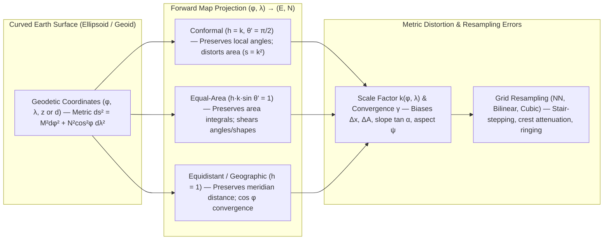

## 2.2 Map Projections and Distortion Impacts on DEMs

By Carl Friedrich Gauss's *Theorema Egregium* (1827), a curved two-dimensional surface of non-zero Gaussian curvature $K$—such as a sphere ($K = 1/R^2$) or an oblate reference ellipsoid ($K = 1/(M(\varphi)N(\varphi)) > 0$, where $M(\varphi)$ and $N(\varphi)$ are the meridional and prime-vertical radii of curvature at geodetic latitude $\varphi$)—cannot be mapped isometrically onto a flat Euclidean plane ($K = 0$) without stretching, compressing, or shearing local metric relationships. Because the overwhelming majority of raster Digital Elevation Models (DEMs) and bathymetric grids store elevations $z(i, j)$ (positive-up, in $\text{m}$) or depths $d(i, j)$ (positive-down, in $\text{m}$) on regular planar arrays indexed by projected coordinates $(E, N)$ or equirectangular geographic coordinates $(\lambda, \varphi)$, every raster DEM embeds the metric distortion of its underlying map projection.

When practitioners compute terrain or seabed derivatives—horizontal distance $\Delta s$, pixel area $\Delta A$, surface gradient $\nabla z$, slope angle $\alpha$, aspect azimuth $\psi$, curvature $\nabla^2 z$, three-dimensional surface area $A_{\text{3D}}$, or catchment/dredge volume $V$—using standard planar finite-difference operators that assume a uniform Euclidean grid spacing $\Delta E = \Delta N = \Delta x$, projection distortions propagate directly into systematic physical errors. Understanding how map projections deform differential length, angle, and area is therefore prerequisite to rigorous quantitative geomorphometry, hydrology, and hydrography.



---

### 2.2.1 Taxonomy of Map Projections for Terrestrial and Bathymetric DEMs

In differential cartography—formalized through **Tissot's indicatrix** (Tissot, 1881) and codified for digital computation by John P. Snyder (*Map Projections—A Working Manual*, USGS Professional Paper 1395, 1987) and Gerald Evenden (`PROJ`, 1983)—the local distortion of any differentiable map projection $(E(\varphi, \lambda), N(\varphi, \lambda))$ is governed by two principal scale factors and the angle between projected graticule lines:
* **Meridional scale factor ($h_{\text{scale}}$, dimensionless):** The ratio of differential projected distance along a meridian to true geodesic distance on the ellipsoid, $ds_{\text{meridian}} = M(\varphi)\,d\varphi$:

  $$h_{\text{scale}}(\varphi, \lambda) = \frac{1}{M(\varphi)}\sqrt{\left(\frac{\partial E}{\partial \varphi}\right)^2 + \left(\frac{\partial N}{\partial \varphi}\right)^2}$$

* **Parallel scale factor ($k_{\text{scale}}$, dimensionless):** The ratio of differential projected distance along a parallel to true geodesic distance on the ellipsoid, $ds_{\text{parallel}} = N(\varphi)\cos\varphi\,d\lambda$:

  $$k_{\text{scale}}(\varphi, \lambda) = \frac{1}{N(\varphi)\cos\varphi}\sqrt{\left(\frac{\partial E}{\partial \lambda}\right)^2 + \left(\frac{\partial N}{\partial \lambda}\right)^2}$$

* **Areal scale factor ($s$, dimensionless):** The ratio of a differential projected grid area $dE\,dN$ to the true ellipsoidal surface element $dA_{\text{ellip}} = M(\varphi)N(\varphi)\cos\varphi\,d\varphi\,d\lambda$, given by the Jacobian determinant $s = \frac{1}{M(\varphi)N(\varphi)\cos\varphi}\left|\frac{\partial E}{\partial \lambda}\frac{\partial N}{\partial \varphi} - \frac{\partial E}{\partial \varphi}\frac{\partial N}{\partial \lambda}\right| = h_{\text{scale}} k_{\text{scale}} \sin\theta'$, where $\theta'$ is the projected angle between the meridian and parallel ($\theta' = \pi/2$ for orthogonal projections).

Map projections used for terrestrial and marine elevation datasets fall into three primary geometric classes based on which metric property they preserve:

#### 1. Conformal (Orthomorphic) Projections ($h_{\text{scale}}(\varphi, \lambda) = k_{\text{scale}}(\varphi, \lambda) \equiv k(\varphi, \lambda)$ and $\theta' = \pi/2$)
Conformal projections preserve local angles at every point (except isolated singular points), causing Tissot's indicatrix to remain a circle whose radius varies with position as the isotropic **point scale factor** $k(\varphi, \lambda)$. Because $k$ is isotropic at any given pixel, conformal projections preserve the local shape of small topographic and bathymetric features (such as volcanic craters, sinkholes, and coral knolls) and ensure that horizontal gradient vectors $\nabla z$ suffer no directional shear—only an isotropic scaling by $1/k$ and a rigid rotation by the grid convergence angle $\gamma$.
* **Normal Mercator (Mercator, 1569):** A cylindrical conformal projection tangent at the Equator (or secant at standard parallels $\pm \varphi_{\text{ts}}$). On a sphere, $k(\varphi) = \sec\varphi$ (or $\cos\varphi_{\text{ts}}\sec\varphi$); on an ellipsoid of eccentricity $e$, $k(\varphi) = \cos\varphi_{\text{ts}}\sqrt{1 - e^2\sin^2\varphi} / (\cos\varphi\sqrt{1 - e^2\sin^2\varphi_{\text{ts}}})$. Because lines of constant azimuth (**loxodromes** or rhumb lines) project as straight lines, the ellipsoidal Mercator projection remains the international standard for nautical charts (IHO S-4 / S-57) and regional mid-latitude bathymetric compilations.
* **Transverse Mercator (Gauss-Krüger, 1822/1912) and Universal Transverse Mercator (UTM, 1942):** Invented in spherical form by Johann Heinrich Lambert (1772), generalized to the ellipsoid by Carl Friedrich Gauss (1822), and formulated for practical geodetic computation by Louis Krüger (1912), the Transverse Mercator rotates the cylinder by $90^\circ$ so that it is tangent (or secant) along a chosen central meridian $\lambda_0$. Adopted by the U.S. Army Corps of Engineers in 1942–1947, the **UTM** system partitions the globe between $80^\circ\text{ S}$ and $84^\circ\text{ N}$ into sixty $6^\circ$-wide longitudinal zones, applying a central meridian scale factor of $k_0 = 0.9996$. In a secant UTM zone, $k = 0.9996$ along $\lambda_0$ (a $-400\text{ ppm}$ compression), reaches $k = 1.0000$ along two secant lines approximately $180\text{ km}$ east and west of $\lambda_0$, and rises to $k \approx 1.00097$ ($+970\text{ ppm}$) at the zone boundary at the Equator:

$$k(\varphi, \lambda) \approx k_0 \left[ 1 + \frac{1 + \eta^2}{2}(\Delta\lambda\cos\varphi)^2 \right] \approx k_0 \left( 1 + \frac{(E - E_0)^2}{2 R_m^2 k_0^2} \right)$$

  where $\Delta\lambda = \lambda - \lambda_0$ ($\text{rad}$), $\eta^2 = e'^2\cos^2\varphi$ is the second eccentricity term, $E - E_0$ is the distance from the central meridian false easting ($E_0 = 500,000\text{ m}$), and $R_m = \sqrt{M(\varphi)N(\varphi)}$ is the Gaussian mean radius of curvature ($\text{m}$). UTM is the workhorse projection for airborne lidar tiles, photogrammetric DSMs, and coastal multibeam echosounder (MBES) hydrographic surveys (IHO S-102).
* **Lambert Conformal Conic (LCC; Lambert, 1772):** Projects the ellipsoid onto a cone secant at two standard parallels $(\varphi_1, \varphi_2)$, where $k = 1.0$. Scale is slightly less than $1.0$ between the standard parallels and exceeds $1.0$ outside them. LCC is optimal for regions elongated east–west (such as U.S. State Plane zones for Tennessee or Montana, or continental-scale European and North American aviation/topographic maps).
* **Polar Stereographic and Universal Polar Stereographic (UPS):** An azimuthal conformal projection tangent or secant at the North or South Pole (UPS uses $k_0 = 0.994$, yielding standard parallel $|\varphi_{\text{ts}}| \approx 81^\circ 06' 52.3''$). Because cylindrical projections degenerate at the poles, Polar Stereographic projections are mandatory for high-latitude cryospheric and bathymetric DEMs, including the **International Bathymetric Chart of the Arctic Ocean (IBCAO)** (EPSG:3996, $\varphi_{\text{ts}} = 75^\circ\text{ N}$), the **International Bathymetric Chart of the Southern Ocean (IBCSO)**, **ArcticDEM** (EPSG:3413, $\varphi_{\text{ts}} = 70^\circ\text{ N}$), **REMA**, and **BedMachine** subglacial topography.

#### 2. Equal-Area (Equivalent / Authalic) Projections ($s = h_{\text{scale}} k_{\text{scale}} \sin\theta' = 1$)
Equal-area projections guarantee that every pixel of identical projected dimensions $\Delta E \times \Delta N$ represents the exact same surface area on the reference ellipsoid ($\Delta A_{\text{ellip}} = \Delta E\,\Delta N$), making them indispensable for global hypsometric curves, watershed area accounting, ice-sheet mass-balance integration, and ocean-basin water-volume integration. Achieving $s = 1$ requires sacrificing conformality ($h_{\text{scale}} \ne k_{\text{scale}}$ and/or $\theta' \ne \pi/2$), which introduces anisotropic angular and slope distortion away from standard lines.
* **Albers Equal-Area Conic (Albers, 1805):** A conic projection with two standard parallels $(\varphi_1, \varphi_2)$ where $h_{\text{scale}} = k_{\text{scale}} = 1$. Widely adopted for national hydrologic datasets (e.g., USGS NHDPlus and national land-cover/watershed grids across the conterminous United States using $\varphi_1 = 29.5^\circ\text{ N}, \varphi_2 = 45.5^\circ\text{ N}$, EPSG:5070).
* **Lambert Azimuthal Equal-Area (LAEA; Lambert, 1772) and EASE-Grid 2.0 (Brodzik et al., 2012):** LAEA preserves area radially around a central point $(\varphi_0, \lambda_0)$ and forms the basis of European statistical/hydrologic grids (EPSG:3035) and the polar **EASE-Grid 2.0** (Equal-Area Scalable Earth Grid) used for satellite passive-microwave snow, soil-moisture, and cryospheric products. The cylindrical **EASE-Grid 2.0 Global** projection (EPSG:6933, standard parallels $\pm 30^\circ$) provides an orthogonal equal-area grid across low and mid-latitudes.
* **Pseudocylindrical Global Equal-Area Projections (Sinusoidal, Mollweide 1805, Equal Earth 2019):** The **Sinusoidal** projection ($E = R(\lambda - \lambda_0)\cos\varphi, N = R\varphi$ on a sphere) is used for MODIS land-surface tiles, while **Mollweide** (1805) and **Equal Earth** (Šavrič et al., 2019; EPSG:8857) provide global equal-area representations with reduced extreme high-latitude shearing for global geomorphometric and oceanographic synthesis.

#### 3. Equidistant and Unprojected Geographic Grids ($h_{\text{scale}} = 1$)
* **Plate Carrée / Equirectangular (Geographic Lat/Lon Grids, e.g., EPSG:4326):** Almost all global and semi-global foundational DEMs and bathymetric compilations—including **SRTM**, **COP-DEM**, **NASADEM**, **FABDEM**, **GEBCO**, and **SRTM15+**—are distributed on regular angular grids $(\Delta\lambda, \Delta\varphi)$ in arc-seconds (e.g., $1'' \approx 30.87\text{ m}$ along a meridian, $15'' \approx 463\text{ m}$). While computationally convenient for global indexing, an angular grid is strongly non-conformal and non-equal-area when treated as a Cartesian raster: the meridional metric spacing is $\Delta y = M(\varphi)\,\Delta\varphi$, whereas the parallel metric spacing shrinks toward the poles as $\Delta x(\varphi) = N(\varphi)\cos\varphi\,\Delta\lambda$. Thus, a $1'' \times 1''$ pixel at $\varphi = 60^\circ\text{ N}$ is roughly twice as long north–south ($30.9\text{ m}$) as it is east–west ($15.5\text{ m}$), and its physical area is $\approx 50\%$ of an equatorial pixel. To prevent severe high-latitude redundancy, **COP-DEM** and **DTED** widen longitudinal pixel spacing $\Delta\lambda$ in discrete latitude bands ($>50^\circ, >70^\circ, >80^\circ$).
* **Azimuthal Equidistant:** Preserves true geodesic distance and azimuth radially from a single central point $(\varphi_0, \lambda_0)$, used in seismic array processing, acoustic tsunami/T-phase propagation, and long-range radio-line-of-sight horizon modeling.

| Projection Family | Representative CRS / EPSG | Meridional & Parallel Scale ($h_{\text{scale}}, k_{\text{scale}}$) | Areal Scale ($s$) | Primary Terrestrial & Bathymetric DEM Use Cases |
| :--- | :--- | :--- | :--- | :--- |
| **Transverse Mercator (Conformal)** | UTM Zones 1–60 (e.g., EPSG:32601–32660, 26901–26923) | $h_{\text{scale}} = k_{\text{scale}} = k \in [0.9996, 1.0010]$ within zone | $s = k^2 \in [0.9992, 1.0020]$ | Airborne lidar tiles (USGS 3DEP), photogrammetric DSMs, coastal MBES hydrography (IHO S-102). |
| **Polar Stereographic (Conformal)** | ArcticDEM (EPSG:3413), IBCAO (EPSG:3996), Ant. (EPSG:3031) | $h_{\text{scale}} = k_{\text{scale}} = k(\varphi)$ ($k=1$ at $\varphi_{\text{ts}} = 70^\circ/75^\circ/71^\circ$) | $s = k(\varphi)^2$ | Polar ice-sheet DEMs (ArcticDEM, REMA, BedMachine), Arctic/Southern Ocean bathymetry (IBCAO, IBCSO). |
| **Normal Mercator (Conformal)** | Ellipsoidal Mercator (EPSG:3395); **Web Mercator (EPSG:3857)** | Ellipsoidal: $h=k\approx\sec\varphi$; **3857:** $h \ne k \approx \sec\varphi$ | $s \approx \sec^2\varphi$ (severe inflation) | Ellipsoidal: Nautical charts (rhumb-line navigation). **EPSG:3857:** Web slippy-map visualization *only*. |
| **Equal-Area Conic / Azimuthal** | Albers (EPSG:5070), LAEA (EPSG:3035), EASE-Grid 2.0 (EPSG:6933) | $h_{\text{scale}} k_{\text{scale}} = 1$, $h_{\text{scale}} \ne k_{\text{scale}}$ away from $\varphi_{1,2}$ | $s = 1.0000$ everywhere | Continental watershed hydrology (NHDPlus), global hypsometry, ocean basin & reservoir volume integrals. |
| **Geographic Equirectangular** | WGS 84 / ITRF Lat-Lon $(\lambda, \varphi)$ (EPSG:4326, EPSG:9989) | $\Delta y = M(\varphi)\Delta\varphi$, $\Delta x = N(\varphi)\cos\varphi\Delta\lambda$ | $\Delta A \propto M(\varphi)N(\varphi)\cos\varphi$ | Global archival & distribution grids (SRTM, COP-DEM, FABDEM, GEBCO, SRTM15+, ETOPO). |

---

### 2.2.2 Distortion of Distance, Area, Slope, Aspect, and 3D Surface Integrals

Consider a gridded DEM in a projected coordinate system $(E, N)$ with nominal planar grid spacing $(\Delta E, \Delta N)$ in meters. At any grid node $(\varphi, \lambda)$, how do the projection's point scale factor $k(\varphi, \lambda)$ and **grid convergence angle** $\gamma(\varphi, \lambda)$ corrupt geometric quantities computed on the projected grid?

#### 1. Horizontal Distance and Pixel Area
On a conformal projection with isotropic local scale factor $k(\varphi, \lambda)$, a small differential vector $(dE, dN)$ on the map grid corresponds to a true horizontal ellipsoidal displacement $(dx_{\text{true}}, dy_{\text{true}})$ whose length $ds_{\text{ellip}}$ is scaled by $1/k$:

$$ds_{\text{grid}} = \sqrt{dE^2 + dN^2} = k(\varphi, \lambda)\,ds_{\text{ellip}} \quad \Longrightarrow \quad ds_{\text{ellip}} = \frac{ds_{\text{grid}}}{k(\varphi, \lambda)}$$

Consequently, a raster cell of nominal grid dimensions $\Delta E \times \Delta N$ (with nominal grid area $\Delta A_{\text{grid}} = \Delta E\,\Delta N$) covers a true horizontal ellipsoidal footprint $\Delta A_{\text{true}}$ of:

$$\Delta A_{\text{true}} = \frac{\Delta E\,\Delta N}{s(\varphi, \lambda)} = \frac{\Delta A_{\text{grid}}}{k(\varphi, \lambda)^2} \quad (\text{for conformal projections where } s = k^2)$$

When integrating water volume $V = \iint d(E, N)\,dA$ across a lake, estuary, or ocean basin, or accumulating upslope contributing area $A_{\text{upslope}}$ in a hydrological flow-accumulation grid without dividing each pixel's area by $s(\varphi, \lambda) = k(\varphi, \lambda)^2$, the resulting area and volume integrals suffer a relative bias of $(k^2 - 1)$. Within a single UTM zone near the central meridian ($k_0 = 0.9996$), $k^2 = 0.99920$, introducing a modest $-0.08\%$ area bias; however, on continental conic or cylindrical projections away from standard parallels, $k^2 - 1$ routinely reaches $5\%\text{–}300\%$.

#### 2. Grid Convergence Angle ($\gamma$) and Aspect Distortion
Except along the central meridian $\lambda_0$ of a symmetric projection (or everywhere on a Normal Mercator / Equirectangular grid), **Grid North** (the direction of the $+N$ coordinate axis, $\lambda \ne \text{const}$) diverges from **True (Geodetic) North** (the tangent to the local meridian $\lambda = \text{const}$, along which $\varphi$ increases). The **grid convergence angle** $\gamma(\varphi, \lambda)$ is defined as the clockwise angle from True North to Grid North (so that in the Northern Hemisphere east of the central meridian, where meridians lean slightly west toward the pole with $\partial E / \partial \varphi < 0$, $\gamma > 0$). For a Transverse Mercator projection on an ellipsoid, expanding in powers of longitudinal offset $\Delta\lambda = \lambda - \lambda_0$ ($\text{rad}$) yields:

$$\gamma(\varphi, \lambda) = \arctan\left( -\frac{\partial E / \partial \varphi}{\partial N / \partial \varphi} \right) = \arctan\left( \frac{\partial N / \partial \lambda}{\partial E / \partial \lambda} \right) \approx \Delta\lambda\sin\varphi + \frac{(\Delta\lambda)^3}{3}\sin\varphi\cos^2\varphi\left(1 + 3\eta^2 + 2\eta^4\right)$$

At the boundary of a $6^\circ$ UTM zone ($|\Delta\lambda| = 3^\circ$) at latitude $\varphi = 60^\circ\text{ N}$, the grid convergence reaches $|\gamma| \approx 3^\circ \times \sin 60^\circ = 2.60^\circ$. If a DEM is projected into an adjacent UTM zone (e.g., $|\Delta\lambda| = 9^\circ$ for a seamless regional compilation), $|\gamma|$ reaches $7.8^\circ$. Because standard raster aspect algorithms compute the downslope azimuth $\psi_{\text{grid}} \in [0^\circ, 360^\circ)$ clockwise from the $+N$ grid column axis (using the geographic azimuth two-argument arctangent $\text{atan2}_{\text{az}}(\Delta E, \Delta N)$ where the first argument is the Easting component $\sin\psi_{\text{grid}}$ and the second is the Northing component $\cos\psi_{\text{grid}}$):

$$\psi_{\text{grid}} = \text{atan2}_{\text{az}}\!\left(-\frac{\partial z}{\partial E},\, -\frac{\partial z}{\partial N}\right) \pmod{2\pi}$$

the **true geodetic aspect** $\psi_{\text{true}}$ (clockwise from True North) must be corrected by adding the local grid convergence angle:

$$\psi_{\text{true}}(\varphi, \lambda) = \left(\psi_{\text{grid}}(\varphi, \lambda) + \gamma(\varphi, \lambda)\right) \pmod{360^\circ}$$

Neglecting $\gamma$ directly biases solar insolation models, snowmelt/avalanche aspect roses, and benthic current-exposure models at high latitudes and zone edges.

#### 3. Terrain and Seabed Slope ($\nabla z$ and $\tan\alpha$)
Because elevation $z$ (or depth $d$) is a vertical coordinate measured in true meters along the ellipsoid normal or plumb line—and is *not* scaled by the horizontal map projection—horizontal map stretching and grid convergence directly transform the horizontal gradient $\nabla z$. On a conformal projection with isotropic point scale factor $k(\varphi, \lambda)$ and grid convergence angle $\gamma(\varphi, \lambda)$, the true local tangent-plane partial derivatives $(\partial z / \partial x_{\text{true}}, \partial z / \partial y_{\text{true}})$ (where $x_{\text{true}}$ is True East and $y_{\text{true}}$ is True North) are related to the projected grid partial derivatives $(\partial z / \partial E, \partial z / \partial N)$ via a scaled orthogonal rotation:

$$\begin{bmatrix} \dfrac{\partial z}{\partial x_{\text{true}}} \\[8pt] \dfrac{\partial z}{\partial y_{\text{true}}} \end{bmatrix} = k(\varphi, \lambda) \begin{bmatrix} \cos\gamma & \sin\gamma \\ -\sin\gamma & \cos\gamma \end{bmatrix} \begin{bmatrix} \dfrac{\partial z}{\partial E} \\[8pt] \dfrac{\partial z}{\partial N} \end{bmatrix}$$

Because the rotation matrix is orthogonal, the Euclidean norm of the gradient is invariant under $\gamma$, so the true terrain or seabed slope angle $\alpha_{\text{true}}$ is related to the naive planar grid slope $\alpha_{\text{grid}}$ simply by $k(\varphi, \lambda)$:

$$\tan\alpha_{\text{true}} = \sqrt{\left(\frac{\partial z}{\partial x_{\text{true}}}\right)^2 + \left(\frac{\partial z}{\partial y_{\text{true}}}\right)^2} = k(\varphi, \lambda)\sqrt{\left(\frac{\partial z}{\partial E}\right)^2 + \left(\frac{\partial z}{\partial N}\right)^2} = k(\varphi, \lambda)\,\tan\alpha_{\text{grid}}$$

Similarly, second-order derivatives (Laplacian $\nabla^2 z$, profile curvature, and tangential curvature used for UNCLOS Article 76 Foot of the Continental Slope determination and Benthic Position Index) scale as $k(\varphi, \lambda)^2$:

$$\nabla^2_{\text{true}} z = \frac{\partial^2 z}{\partial x_{\text{true}}^2} + \frac{\partial^2 z}{\partial y_{\text{true}}^2} = k(\varphi, \lambda)^2 \left( \frac{\partial^2 z}{\partial E^2} + \frac{\partial^2 z}{\partial N^2} \right) = k(\varphi, \lambda)^2\,\nabla^2_{\text{grid}} z$$

On an orthogonal non-conformal projection whose axes align with the graticule (such as Cylindrical Equal-Area, Web Mercator, or an unprojected Geographic $(\lambda, \varphi)$ grid), $h_{\text{scale}} \ne k_{\text{scale}}$, so the east–west and north–south partial derivatives must be scaled independently by $k_{\text{scale}}$ and $h_{\text{scale}}$ before computing slope or aspect:

$$\tan\alpha_{\text{true}} = \sqrt{\left(k_{\text{scale}}\frac{\partial z}{\partial E}\right)^2 + \left(h_{\text{scale}}\frac{\partial z}{\partial N}\right)^2} = \sqrt{\left(\frac{1}{N(\varphi)\cos\varphi}\frac{\partial z}{\partial \lambda}\right)^2 + \left(\frac{1}{M(\varphi)}\frac{\partial z}{\partial \varphi}\right)^2}$$

#### 4. Three-Dimensional Surface Area Integrals and Rugosity ($A_{\text{3D}}$)
In benthic ecology (habitat rugosity $R = A_{\text{3D}} / A_{\text{2D}}$), wildfire fuel modeling, and real-estate/agricultural land valuation, the true three-dimensional surface area $A_{\text{3D}}$ of a Monge patch $z(x_{\text{true}}, y_{\text{true}})$ over a domain $\Omega$ is the surface integral of the first fundamental form $\sqrt{1 + \|\nabla_{\text{true}} z\|^2}$:

$$A_{\text{3D}} = \iint_{\Omega_{\text{true}}} \sqrt{1 + \left(\frac{\partial z}{\partial x_{\text{true}}}\right)^2 + \left(\frac{\partial z}{\partial y_{\text{true}}}\right)^2}\,dx_{\text{true}}\,dy_{\text{true}} = \iint_{\Omega_{\text{grid}}} \frac{\sqrt{1 + k(\varphi, \lambda)^2 \tan^2\alpha_{\text{grid}}}}{k(\varphi, \lambda)^2}\,dE\,dN$$

Notice that $k(\varphi, \lambda)$ enters *both* under the radical (multiplying $\tan^2\alpha_{\text{grid}}$) and in the Jacobian denominator ($dE\,dN / k^2$). Consequently, even computing dimensionless surface-to-planar area ratio (**rugosity** $R = dA_{\text{3D}} / dA_{\text{true}} = \sqrt{1 + k^2\tan^2\alpha_{\text{grid}}}$) directly on an unscaled projected grid without the $k^2$ factor under the square root systematically biases rugosity whenever $k \ne 1$.

---

### 2.2.3 The Web Mercator (EPSG:3857) Antipattern for Elevation Analysis

Introduced by web mapping platforms in 2005 and standardized as **EPSG:3857** (*WGS 84 / Pseudo-Mercator*, formerly EPSG:3785 and EPSG:900913), Web Mercator is the ubiquitous projection for slippy-map web tiles (`xyz` / WMTS). Despite its convenience for interactive browser visualization, **using EPSG:3857 as the working coordinate system for quantitative DEM or bathymetric analysis is one of the most destructive antipatterns in modern geospatial engineering** (prompting formal advisories from the U.S. National Geospatial-Intelligence Agency in 2014). EPSG:3857 suffers from two compounding mathematical flaws:

1. **Spherical Formula Applied to Ellipsoidal Coordinates (Loss of Conformality):**
   True ellipsoidal Mercator (EPSG:3395) accounts for the flattening $f = 1/298.257223563 \approx 0.335\%$ ($e^2 \approx 0.00669438$) of the WGS 84 ellipsoid in its isometric latitude integral. By contrast, EPSG:3857 takes geodetic latitude and longitude $(\varphi, \lambda)$ on the WGS 84 ellipsoid and plugs them directly into the *spherical* Mercator equations using a sphere of radius equal to the WGS 84 semi-major axis $a = 6,378,137.0\text{ m}$:

   $$E = a(\lambda - \lambda_0), \qquad N = a \ln\left[ \tan\left(\frac{\pi}{4} + \frac{\varphi}{2}\right) \right]$$

   Differentiating $(E, N)$ with respect to true ellipsoidal arc lengths $ds_{\text{parallel}} = N(\varphi)\cos\varphi\,d\lambda$ and $ds_{\text{meridian}} = M(\varphi)\,d\varphi$ reveals that the parallel and meridional scale factors in EPSG:3857 are **not equal**:

   $$k_{\text{scale}}(\varphi) = \frac{dE}{N(\varphi)\cos\varphi\,d\lambda} = \frac{\sqrt{1 - e^2\sin^2\varphi}}{\cos\varphi}, \qquad h_{\text{scale}}(\varphi) = \frac{dN}{M(\varphi)\,d\varphi} = \frac{\left(1 - e^2\sin^2\varphi\right)^{3/2}}{(1 - e^2)\cos\varphi}$$

   The anisotropy ratio between north–south and east–west scale in EPSG:3857 is therefore:

   $$\frac{h_{\text{scale}}(\varphi)}{k_{\text{scale}}(\varphi)} = \frac{1 - e^2\sin^2\varphi}{1 - e^2} \approx 1 + e^2\cos^2\varphi$$

   Because the polar radius $b$ is $f \approx 0.335\%$ shorter than $a$, $k_{\text{scale}}$ departs from $\sec\varphi$ by up to $0.335\%$ at the poles, while at the Equator ($\varphi = 0^\circ$) $h_{\text{scale}} / k_{\text{scale}} = 1/(1 - e^2) \approx 1 + 2f \approx 1.00674$, meaning Web Mercator stretches north–south distances by $+0.67\%$ relative to east–west distances, violates true conformality (with maximum angular distortion $\omega \approx 0.38^\circ$), and departs from true ellipsoidal Mercator northing by up to $42.8\text{ km}$ at mid-latitudes.

2. **Catastrophic $\sec\varphi$ Scale Inflation at Mid- and High Latitudes:**
   Even more severe than its non-conformality is its equatorial secant scale behavior: $k(\varphi) \approx \sec\varphi = 1/\cos\varphi$. A pixel in an EPSG:3857 DEM with nominal grid spacing $\Delta E = \Delta N = 10.0\text{ m}$ has an actual ground resolution of $\Delta x_{\text{true}} \approx (\Delta E)\cos\varphi$:
   * At **$\varphi = 30^\circ$** (New Orleans, Cairo): $k \approx 1.155$, $s = k^2 \approx 1.333$ ($+33.3\%$ area inflation; planar grid slope underestimated by $13.4\%$).
   * At **$\varphi = 45^\circ$** (Minneapolis, Bordeaux, Hokkaido): $k \approx 1.414$, $s = k^2 \approx 2.000$ ($2\times$ area inflation; planar grid slope $\tan\alpha_{\text{grid}}$ underestimated by $29.3\%$).
   * At **$\varphi = 60^\circ$** (Anchorage, Oslo, Shetland Shelf): $k \approx 2.000$, $s = k^2 \approx 4.000$ (**$4\times$ area inflation**; horizontal distances inflated by $2\times$; planar grid slope $\tan\alpha_{\text{grid}} = \frac{1}{2}\tan\alpha_{\text{true}}$ underestimated by **$50\%$**!).
   * At **$\varphi = 70^\circ$** (Tromsø, Prudhoe Bay, Baffin Bay): $k \approx 2.924$, $s = k^2 \approx 8.55$ (**$8.55\times$ area inflation**; planar grid slope underestimated by $65.8\%$).

   Running a planar slope command (such as `gdaldem slope` without scale correction, or standard GIS planar hydrology tools) on an EPSG:3857 DEM in Alaska or Scandinavia cuts every terrain tangent slope in half and quadruples every watershed area and dredge prism volume.

---

### 2.2.4 Reprojection Artifacts in Gridded DEMs

When transforming a gridded DEM from a source CRS $A$ with coordinate grid $(E_A, N_A)$ to a target CRS $B$ with coordinate grid $(E_B, N_B)$, the target grid nodes $(E_{B,i}, N_{B,j})$ almost never coincide with the inverse-projected positions of the source grid nodes. Even when the source and target projections share the same nominal pixel size (e.g., reprojecting a $1\text{ m}$ UTM Zone 10N DEM into UTM Zone 11N or Albers Equal-Area), the target grid is both **rotated** (by the difference in grid convergence $\Delta\gamma$) and **stretched/compressed** (by the ratio of scale factors $k_B / k_A$) relative to the source pixel lattice. Populating $z_B(E_{B,i}, N_{B,j})$ therefore requires two-dimensional spatial interpolation (resampling) across the source grid $z_A$, introducing four distinct classes of numerical artifacts:

1. **Nearest-Neighbor (`-r near`) Stair-Stepping and Derivative Spikes:**
   Nearest-neighbor resampling assigns each target pixel the exact elevation of the closest source pixel center: $\hat{z}_B(\mathbf{x}_B) = z_A(\text{round}(\mathbf{T}_{B\to A}(\mathbf{x}_B)))$. While this preserves the discrete histogram of source elevation values (making it appropriate *only* for categorical rasters such as land-cover classes or GEBCO Type Identifier `TID` masks), applying nearest-neighbor to a continuous DEM produces a **piecewise-constant terraced surface**. Where the beat frequency (Moiré pattern) between the rotated/scaled source and target grids causes adjacent target pixels to map to the *same* source pixel, the finite-difference gradient $\nabla z_B$ drops artificially to zero; at the adjacent pixel boundary, the elevation jumps by double the normal step. In shaded-relief (hillshade), slope, and curvature maps, this manifests as a criss-crossing lattice of artificial vertical/diagonal stripes ("corduroy" or "fishnet" artifacts) that corrupt D8 flow routing and benthic rugosity metrics.
2. **Bilinear (`-r bilinear`) Low-Pass Smoothing and Shoal/Crest Attenuation:**
   Bilinear interpolation evaluates a $2 \times 2$ separable tent filter across the four surrounding source nodes. In the spatial frequency domain, its transfer function is $\hat{W}_{\text{bilinear}}(\omega_x, \omega_y) = \text{sinc}^2(\omega_x \Delta x / 2\pi)\,\text{sinc}^2(\omega_y \Delta y / 2\pi)$ (where $\text{sinc}(u) \equiv \sin(\pi u)/(\pi u)$), which acts as a strong **low-pass filter** at high spatial frequencies (attenuating power by $\text{sinc}^2(1/2) = (2/\pi)^2 \approx 0.405$ at the 1D Nyquist wavenumber $\omega_{\text{Nyquist}} = \pi / \Delta x$). Consequently, bilinear resampling systematically rounds off local extrema:
   * **Terrestrial impact:** Sharp floodwall and levee crests, narrow road embankments, and mountain ridgelines are lowered by $\delta z \propto -\frac{1}{8}\Delta x^2 |\nabla^2 z|$, creating artificial overtopping breaches in 2D flood inundation models.
   * **Bathymetric impact:** Sharp rocky pinnacles, coral heads, and shipwreck masts are smoothed *downward* (deepened), violating the **IHO S-44 shoal-bias mandate** and creating a direct grounding hazard for vessels relying on the reprojected grid for Under-Keel Clearance (UKC).
3. **Cubic, Cubic-Spline, and Lanczos (`-r cubic`, `-r cubicspline`, `-r lanczos`) Ringing Overshoot:**
   Higher-order convolution kernels ($4 \times 4$ Keys bicubic or $6 \times 6$ Lanczos windowed-sinc filters) possess negative side lobes in their spatial impulse response in order to maintain a flatter passband near the Nyquist frequency. While superior to bilinear interpolation over smooth, band-limited terrain, applying negative-lobe kernels across **step discontinuities** ($C^0$ or $C^{-1}$ features such as vertical coastal cliffs, urban building edges in DSMs, quarry walls, or dredged shipping-channel side slopes) triggers **Gibbs-phenomenon ringing**: artificial trenches (undershoots) at the base of the cliff and artificial raised rims (overshoots) along the top edge.
4. **Non-Invertibility of Repeated Reprojections:**
   Because resampling kernels are band-limiting (information-destroying) operators and grid lattices are incommensurable under rotation and non-linear scaling, raster DEM reprojection is strictly **non-invertible**:

   $$\mathcal{R}_{B \to A}\!\left(\mathcal{R}_{A \to B}(z_A)\right) \ne z_A$$

   Every successive reprojection pass compounds spatial smoothing (reducing effective resolution by $\sim\sqrt{N_{\text{passes}}}$) and phase-shift error. **Best practice** is therefore to: (a) transform the primary 3D point cloud $(X, Y, Z)$ or $(\varphi, \lambda, z)$ into the target engineering or analytical CRS *before* gridding; or (b) keep the DEM in its native archival CRS and reproject vector query geometries or apply exact geodesic/scale-corrected derivative formulas directly on the native grid.

---

### 2.2.5 Worked Numerical Example and Command-Line Verification

Suppose a coastal topobathy DEM in Prince William Sound, Alaska ($\varphi = 60.000^\circ\text{ N}, \lambda = 144.200^\circ\text{ W}$, near the eastern edge of UTM Zone 6N where $\lambda_0 = 147.000^\circ\text{ W}$) records a submarine fjord wall whose naive grid partial derivatives are $\partial z / \partial E = +0.150$ and $\partial z / \partial N = -0.200$ ($|\nabla_{\text{grid}} z| = \tan\alpha_{\text{grid}} = \sqrt{0.150^2 + (-0.200)^2} = 0.2500$, or $\alpha_{\text{grid}} = 14.036^\circ$) over a $100\text{ m} \times 100\text{ m}$ grid block ($\Delta A_{\text{grid}} = 10,000\text{ m}^2$). Compare the true metric quantities when this grid is stored in **(Case A) NAD83 / UTM Zone 6N (EPSG:26906)** versus **(Case B) Web Mercator (EPSG:3857)**:

1. **Case A: UTM Zone 6N ($\lambda_0 = -147^\circ, \Delta\lambda = +2.800^\circ = +0.048869\text{ rad}$ at $\varphi = 60^\circ\text{ N}$):**
   * **Scale factors:** At $\varphi = 60^\circ\text{ N}, \Delta\lambda = +2.8^\circ$ ($\eta^2 = e'^2\cos^2 60^\circ = 0.001685$), the Transverse Mercator point scale factor is $k_{\text{UTM}} \approx 0.9996 \times [1 + \frac{1 + 0.001685}{2}(0.048869 \times \cos 60^\circ)^2] = 0.9996 \times 1.000299 = 0.99990$, and the areal scale factor is $s_{\text{UTM}} = k_{\text{UTM}}^2 = 0.99980$.
   * **True area & slope:** $\Delta A_{\text{true}} = 10,000 / 0.99980 = 10,002.0\text{ m}^2$ (only $0.02\%$ error), and $\tan\alpha_{\text{true}} = 0.99990 \times 0.2500 = 0.24998$ ($\alpha_{\text{true}} = 14.035^\circ$).
   * **Grid convergence & aspect:** Because $\Delta\lambda = +2.800^\circ$, the grid convergence is $\gamma \approx +2.800^\circ \times \sin 60^\circ = +2.425^\circ$. The grid downslope aspect is $\psi_{\text{grid}} = \text{atan2}_{\text{az}}(-0.150, +0.200) \pmod{360^\circ} = 323.130^\circ$, so the true geodetic aspect is $\psi_{\text{true}} = 323.130^\circ + 2.425^\circ = 325.555^\circ$.

2. **Case B: Web Mercator (EPSG:3857 at $\varphi = 60^\circ\text{ N}$):**
   * **Scale factors:** On the WGS 84 ellipsoid at $\varphi = 60^\circ\text{ N}$ ($e^2 = 0.00669438$), the parallel and meridional scale factors of EPSG:3857 are:
     $$k_{\text{scale}} = \frac{\sqrt{1 - 0.00669438(0.75)}}{\cos 60^\circ} = 1.99497, \qquad h_{\text{scale}} = \frac{(1 - 0.0050208)^{3/2}}{(1 - 0.00669438)(0.5)} = 1.99833$$
     giving an areal scale factor of $s_{3857} = h_{\text{scale}} k_{\text{scale}} = 3.9866$.
   * **Catastrophic area & slope errors:** A nominal $100\text{ m} \times 100\text{ m}$ ($10,000\text{ m}^2$) grid block in EPSG:3857 actually covers only $\Delta A_{\text{true}} = 10,000 / 3.9866 = 2,508.4\text{ m}^2$ on the seabed (an uncorrected area calculation overestimates area by **$\approx 4\times$**!). Conversely, if a true slope with components $(\partial z / \partial x_{\text{true}} = +0.150, \partial z / \partial y_{\text{true}} = -0.200)$ ($\tan\alpha_{\text{true}} = 0.2500$, $\alpha_{\text{true}} = 14.036^\circ$) is projected into EPSG:3857 and analyzed with a naive planar slope tool, its grid partial derivatives become $\partial z / \partial E = +0.150 / 1.99497 = +0.07519$ and $\partial z / \partial N = -0.200 / 1.99833 = -0.10008$, yielding a reported planar grid slope of $\tan\alpha_{\text{grid}} = \sqrt{0.07519^2 + (-0.10008)^2} = 0.12518$ ($\alpha_{\text{grid}} = 7.135^\circ$—nearly **half** the true slope!).

Practitioners can inspect exact projection distortion metrics at any coordinate using `proj -V` and perform single-pass terrain-appropriate warping using `gdalwarp`:

```bash
# 1. Inspect exact scale factors (h, k, s) and grid convergence (gamma) at 60N, 144.2W in UTM Zone 6N:
echo "-144.2 60.0" | proj -V +proj=utm +zone=6 +ellps=GRS80

# 2. Compute slope on a Geographic (EPSG:4326) DEM at 60N using a local horizontal scale factor,
#    OR warp once from native CRS to an appropriate local conformal/equal-area grid using bilinear/cubic:
gdalwarp -t_srs EPSG:26906 -tr 10.0 10.0 -tap -r bilinear input_dem.tif output_utm6n_dem.tif
```

---

> [!WARNING]
> **Common Pitfalls in Map Projections and DEM Resampling**
> 1. **Running Planar Slope or Aspect Directly on Geographic (`EPSG:4326`) Rasters:** Passing a Lat/Lon DEM to a planar slope operator computes $\partial z / \partial\lambda$ in meters per *degree* ($\sim 10^5$), yielding meaningless slopes near $89.999^\circ$. Even applying a single scalar `-s 111120` in `gdaldem slope` is only valid near the Equator; at latitude $\varphi$, the east–west spacing is $N(\varphi)\cos\varphi\,\Delta\lambda$ while north–south spacing is $M(\varphi)\,\Delta\varphi$, requiring either ellipsoidal geodesic gradient computation or projection to a local conformal CRS.
> 2. **Using Web Mercator (`EPSG:3857`) for Slope, Watershed Area, or Cut/Fill Volume:** Because $k \approx \sec\varphi$ and $s \approx \sec^2\varphi$, EPSG:3857 inflates areas and volumes by $\sec^2\varphi$ ($2\times$ at $45^\circ$, $4\times$ at $60^\circ$) and underestimates terrain slopes by $\cos\varphi$. Never run geomorphometric, hydrological, or hydrographic analyses on EPSG:3857 grids.
> 3. **Reprojecting Continuous DEMs with Default Nearest-Neighbor (`gdalwarp` default):** In `gdalwarp`, the default resampling algorithm is `-r near`. Forgetting to specify `-r bilinear`, `-r cubic`, or `-r average` (when downsampling) imprints severe stair-step terracing onto the output DEM, ruining hillshades, contours, and curvature grids.
> 4. **Forgetting the `-tap` (Target Aligned Pixels) Flag When Warping Grids:** Reprojecting multiple DEM tiles with `-tr dx dy` without `-tap` allows the output grid origin $(E_{\min}, N_{\max})$ to float to non-integer sub-pixel offsets, causing a $0.1\text{–}0.9\text{ pixel}$ phase shift when co-registering or differencing multi-temporal DEMs ($\text{DoD} = z_{t_2} - z_{t_1}$).

> [!IMPORTANT]
> **Key Takeaways**
> * **Match the Projection to the Analytical Objective:** Use **conformal** projections (UTM, LCC, Polar Stereographic) for local derivative analysis (slope, aspect, curvature, navigation), and **equal-area** projections (Albers, LAEA, EASE-Grid 2.0) or exact ellipsoidal cell-area weighting ($\Delta A = \Delta E\,\Delta N / s(\varphi, \lambda)$) for areal and volumetric integrations.
> * **Correct Derivatives for Scale Factor $k$ and Convergence $\gamma$:** On a conformal grid, true slope is $\tan\alpha_{\text{true}} = k(\varphi, \lambda)\tan\alpha_{\text{grid}}$, true Laplacian curvature is $\nabla^2_{\text{true}} z = k(\varphi, \lambda)^2\nabla^2_{\text{grid}} z$, and true geodetic aspect is $\psi_{\text{true}} = \psi_{\text{grid}} + \gamma(\varphi, \lambda)$.
> * **Project Point Clouds Before Gridding:** Because raster resampling is non-invertible and introduces either low-pass shoal/crest attenuation (bilinear) or cliff-edge ringing (cubic/Lanczos), always transform 3D point clouds (`PDAL`, `MB-System`, `PROJ`) into the target project CRS *prior* to surface interpolation whenever possible.

---

### Curated Key References

* Battersby, S. E., Finn, M. P., Usery, E. L., & Yamamoto, K. H. (2014). Implications of Web Mercator and its use in online mapping. *Cartographica: The International Journal for Geographic Information and Geovisualization*, 49(2), 85–101. https://doi.org/10.3138/carto.49.2.2313
* Brodzik, M. J., Billingsley, B., Haran, T., Raup, B., & Savoie, M. H. (2012). EASE-Grid 2.0: Incremental but significant improvements for Earth-gridded data sets. *ISPRS International Journal of Geo-Information*, 1(1), 32–45. https://doi.org/10.3390/ijgi1010032
* Evenden, G. I. (1990). *Cartographic Projection Procedures for the UNIX Environment—A User's Manual* (USGS Open-File Report 90-284). U.S. Geological Survey. https://doi.org/10.3133/ofr90284
* Florinsky, I. V. (2016). *Digital Terrain Analysis in Soil Science and Geology* (2nd ed.). Academic Press. https://doi.org/10.1016/C2015-0-00704-3
* Karney, C. F. F. (2011). Transverse Mercator with an accuracy of a few nanometers. *Journal of Geodesy*, 85(8), 475–485. https://doi.org/10.1007/s00190-011-0445-3
* Krüger, L. (1912). *Konforme Abbildung des Erdellipsoids in der Ebene* (Veröffentlichung des Königlich Preuszischen Geodätischen Instituts, Neue Folge, 52). Potsdam: B. G. Teubner. https://doi.org/10.2312/GFZ.b103-krueger28
* Šavrič, B., Patterson, T., & Jenny, B. (2019). The Equal Earth map projection. *International Journal of Geographical Information Science*, 33(3), 454–465. https://doi.org/10.1080/13658816.2018.1504949
* Snyder, J. P. (1987). *Map Projections—A Working Manual* (U.S. Geological Survey Professional Paper 1395). Washington, DC: U.S. Government Printing Office. https://doi.org/10.3133/pp1395
* Tissot, N. A. (1881). *Mémoire sur la représentation des surfaces et les projections des cartes géographiques*. Paris: Gauthier-Villars.
* Usery, E. L., Finn, M. P., & Mugnier, C. J. (2009). All equal-area projections are created equal, but some are more equal than others: Distortion effects on raster data. *Cartography and Geographic Information Science*, 36(3), 269–284. https://doi.org/10.1559/152304009788988332
