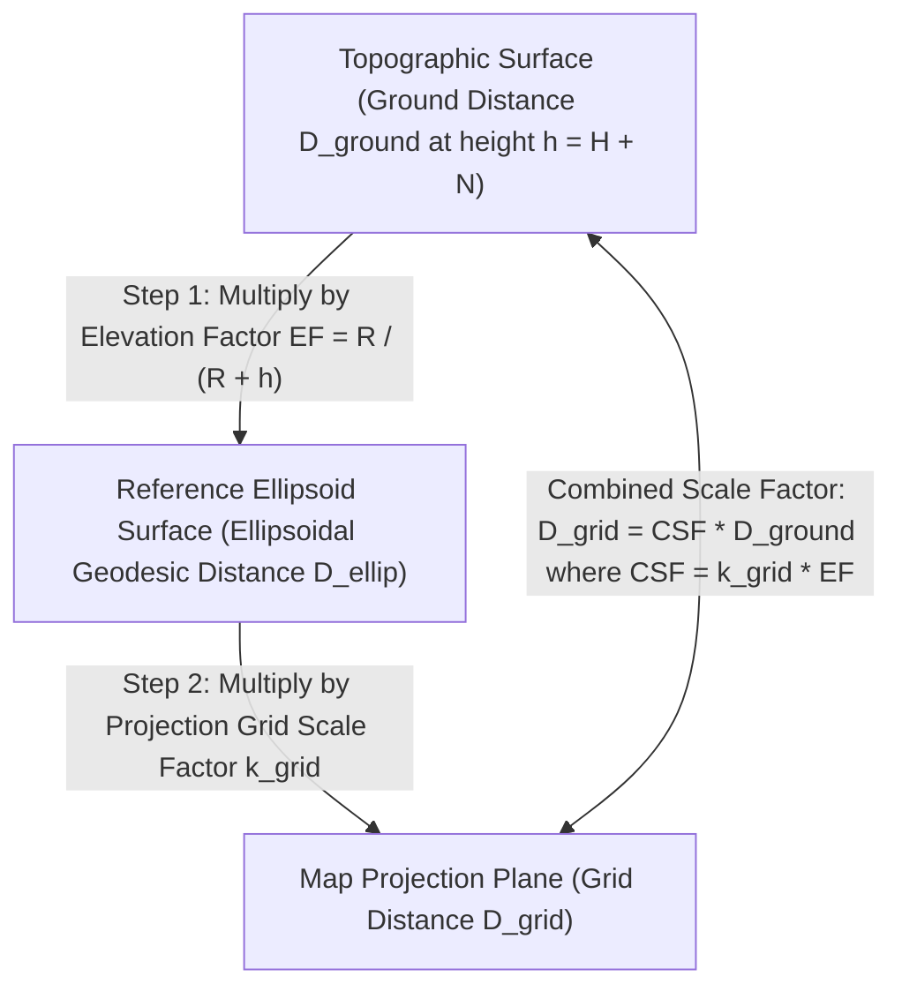

## 2.3 Custom, Local, and Assumed Datums: What Happens When People Create Their Own Datums?

In an idealized geospatial workflow, every topographic lidar point cloud, photogrammetric digital surface model (DSM), and multibeam echosounder (MBES) bathymetric grid would arrive tagged with a standardized, authority-backed Coordinate Reference System (CRS) identifier—such as an EPSG code tied to a modern International Terrestrial Reference Frame (ITRF) or national geodetic realization (e.g., NAD83(2011) or ETRS89). In practice, a vast fraction of high-resolution engineering, mining, industrial, archaeological, and coastal construction elevation datasets are collected, processed, and archived in **custom, local, or assumed coordinate systems**.

When these datasets are ingested into regional Digital Elevation Model (DEM) compilation pipelines, hydrodynamic flood models, or Earth-observation time series without rigorous mathematical reconciliation, the consequences range from subtle decimeter-level elevation biases and slope distortions to catastrophic multi-hundred-meter horizontal displacements. Understanding *why* surveyors and civil engineers reject standard map projections—and *how* to mathematically model and invert their custom coordinate transformations—is an essential skill for every DEM practitioner.

---

### 2.3.1 Why Engineers and Surveyors Create Local and Custom Grids

Map projections such as Universal Transverse Mercator (UTM) and national State Plane Coordinate Systems (SPCS) are designed to balance distortion over zones hundreds of kilometers wide. However, for precision engineering, construction layout, and localized earthwork volume computations, standard regional projections introduce three practical obstacles that motivate the creation of local or custom coordinate systems:

1. **Discrepancy Between Grid Distance and Ground Distance:** A surveyor using a total station, steel tape, or terrestrial laser scanner (TLS) measures horizontal distances at the physical elevation of the project site, not on the reference ellipsoid or the curved map projection surface. If a structural blueprint specifies that two bridge piers or wind turbine foundations must be placed exactly $500.000\text{ m}$ apart, a construction crew laying out coordinates in a standard UTM zone at high elevation will find that a $500.000\text{ m}$ change in UTM coordinates does *not* equal $500.000\text{ m}$ on the ground.
2. **Non-Intuitive Orientation and Large Coordinate Numbers:** Industrial facilities, port terminals, and rectilinear urban street networks rarely align with true north or grid north. Working with 7-digit northing coordinates (e.g., $N = 4,852,319.42\text{ m}$) rotated $37^\circ 14' 22''$ relative to a building's structural steel axis invites transcription errors and complicates computer-aided design (CAD) drafting.
3. **Absence of Geodetic Control at Project Inception:** In remote exploration sites, underground mines, emergency landslide responses, or historical surveys predating Global Navigation Satellite Systems (GNSS), surveyors frequently establish an **assumed (orphan) datum** before tying the network to global geodetic control.

Consequently, practitioners encounter five distinct classes of non-standard coordinate systems in elevation data:

#### 1. Local Assumed ("1000, 5000, 100") Construction Benchmarks
On small-to-medium civil engineering, archaeological, or environmental remediation sites, a survey crew may drive a rebar monument or chisel an "X" on a concrete headwall, designate its coordinates as an arbitrary positive triple—classically $(N_0, E_0, Z_0) = (5000.00\text{ m}, 1000.00\text{ m}, 100.00\text{ m})$ or $(10000\text{ ft}, 10000\text{ ft}, 100\text{ ft})$—and orient the local north axis using a magnetic compass, a solar/star shot, or an arbitrary baseline along a road centerline. The large positive false easting and northing (with $N_0 \neq E_0$) are chosen deliberately to prevent negative coordinates anywhere on the site and to make swapped Easting/Northing columns immediately obvious. The vertical coordinate $Z_0 = 100.00$ represents an **assumed vertical datum** unconnected to any geoid or tidal datum.

#### 2. Industrial Plant and Structural Grids
Refineries, chemical plants, nuclear power stations, and large manufacturing complexes almost universally define a **Plant Grid**. The origin $(0,0,0)$ or $(1000,1000,100)$ is monumented at a primary property corner or column intersection, and the axes ("Plant North" and "Plant East") are defined strictly parallel and perpendicular to the primary structural steel or pipe-rack corridors. Elevations are referenced to "Plant Datum," where $+100.000\text{ m}$ (or $+0.000\text{ m}$) typically corresponds to the finished floor elevation of the main turbine hall or control building.

#### 3. Open-Pit and Underground Mine Grids
Mining operations require continuous, high-precision volumetric reconciliation between surface pit DEMs, underground stope laser scans (CMS—Cavity Monitoring Systems), and 3D geological block models. Because open-pit mines in the Andes, Rocky Mountains, or Tibetan Plateau often sit at elevations of $2,000\text{ m}$ to $5,000\text{ m}$ above the ellipsoid, standard UTM coordinates would introduce scale errors exceeding $300\text{ to }800\text{ parts per million (ppm)}$ ($30\text{ to }80\text{ cm}$ per kilometer). Mine surveyors therefore establish custom local tangent plane or ground-scaled grids centered on the orebody, often with a custom vertical datum (e.g., adding $10,000\text{ m}$ to elevations so that deep underground shafts never have negative $Z$ values).

#### 4. Marine, Port, and Offshore Wind Local Construction Grids
In hydrographic and marine engineering surveys, local grids are pervasive:
* **Port and Berth Grids:** Dredging acceptance surveys and quay-wall multibeam inspections are frequently conducted in a **Berth-Aligned Grid** (or Pier Grid), where the $X$-axis (or *Stationing*) runs exactly parallel to the fender line of the wharf and the $Y$-axis (*Offset*) measures perpendicular distance into the navigation channel. While depths are usually reduced to a local chart datum (e.g., Mean Lower Low Water, MLLW, or Lowest Astronomical Tide, LAT), horizontal positions are purely local unless a rigid 2D Helmert transformation to the port's geodetic network is documented.
* **Subsea Oil/Gas Templates and Offshore Wind Arrays:** When autonomous underwater vehicles (AUVs) or remotely operated vehicles (ROVs) map seabed scour around offshore wind monopiles or subsea production manifolds using high-frequency multibeam sonars and Long Baseline (LBL) acoustic transponder arrays, the acoustic positioning network operates in a local, seafloor-referenced Cartesian frame centered on a master transponder or foundation center, oriented to the structure's heading.

#### 5. Low-Distortion Projections (LDPs)
To eliminate the need for ad-hoc, undocumented ground scaling while preserving true geodetic traceability, state departments of transportation and national geodetic agencies increasingly design official **Low-Distortion Projections (LDPs)** (Dennis, 2018). Examples include the Oregon Coordinate Reference System (OCRS), the Wisconsin County Coordinate System (WISCRS), the Indiana Geospatial Coordinate System (InGCS), and the local zones of the modernized U.S. State Plane Coordinate System of 2022 (SPCS2022). An LDP is a true, mathematically rigorous map projection (typically Transverse Mercator, Lambert Conformal Conic, or Oblique Mercator) whose central scale factor $k_0$ is intentionally elevated above $1.0$ (e.g., $k_0 = 1.00025000$) so that the projection surface slices through the topographic surface at the mean elevation $h_0$ of a specific county, valley, or transportation corridor. Within its design zone, horizontal grid distances match true ground distances to within $\pm 10\text{ to }\pm 20\text{ ppm}$ ($\pm 1\text{ to }2\text{ cm/km}$).

---

### 2.3.2 Ground-to-Grid Distortion and the Combined Scale Factor (CSF)

To understand why ground distances diverge from projected grid distances—and how custom "ground grids" are constructed—we must trace the two-step geometric reduction of a horizontal distance measured at the Earth's topographic surface down to the mapping plane.



#### Step 1: The Elevation Factor ($EF$)
Consider two points separated by an infinitesimal horizontal ground distance $dD_{\text{ground}}$ at a mean ellipsoidal height $h$ above the reference ellipsoid. Crucially, the relevant height in geometric geodesy is the **ellipsoidal height** $h$, related to the orthometric height $H$ (above the geoid) and the geoid undulation $N$ by:

$$h = H + N$$

Let $R_\alpha$ denote the radius of curvature of the reference ellipsoid along the azimuth $\alpha$ of the line connecting the two points (given by Euler's theorem as $R_\alpha = \frac{M \cdot N_{\text{prime}}}{M \sin^2\alpha + N_{\text{prime}} \cos^2\alpha}$, where $M$ is the meridional radius of curvature and $N_{\text{prime}}$ is the prime vertical radius of curvature; in practice, the Gaussian mean radius $R = \sqrt{M N_{\text{prime}}} \approx 6,371,000\text{ m}$ suffices for lines under $50\text{ km}$). By similar circular sectors subtending an angle $d\theta$ at the center of curvature:

$$dD_{\text{ground}} = (R + h)\,d\theta \quad \text{and} \quad dD_{\text{ellip}} = R\,d\theta$$

Taking the ratio yields the **Elevation Factor ($EF$)** (also termed the *ellipsoid factor* or *sea-level factor* in older literature):

$$EF = \frac{dD_{\text{ellip}}}{dD_{\text{ground}}} = \frac{R}{R + h} = \frac{R}{R + H + N} \approx 1 - \frac{h}{R} + \left(\frac{h}{R}\right)^2$$

Because $R \approx 6.371 \times 10^6\text{ m}$, every $63.7\text{ m}$ of elevation above the ellipsoid changes the Elevation Factor by $-10\text{ ppm}$ ($-1\text{ cm}$ per kilometer).

* **High-Elevation Terrestrial Example (Denver, Colorado / Open-Pit Mine):** In Denver ($H \approx 1,616\text{ m}$, $N \approx -16\text{ m}$, so $h = H + N = 1,600\text{ m}$) with a local mean Earth radius $R \approx 6,372,000\text{ m}$:
  $$EF = \frac{6,372,000}{6,372,000 + 1,600} = 0.99974896 \quad (-251.0\text{ ppm})$$
  A $1,000.000\text{ m}$ horizontal ground distance measured by a total station or terrestrial lidar scanner in Denver projects onto the reference ellipsoid as only $999.749\text{ m}$—a contraction of **$25.1\text{ cm}$ per kilometer**! At an Andean copper mine at $h = 4,200\text{ m}$, $EF = 0.9993412$ ($-658.8\text{ ppm}$), shrinking a $1\text{ km}$ ground baseline by **$65.9\text{ cm}$**.
* **Subsea Bathymetric Example (Deep-Ocean AUV Survey):** For an AUV mapping a seafloor hydrothermal vent field or abyssal pipeline corridor at a depth $d = 3,500\text{ m}$ below the sea surface ($h \approx -3,500\text{ m}$):
  $$EF = \frac{6,371,000}{6,371,000 - 3,500} = 1.00054967 \quad (+549.7\text{ ppm})$$
  Here $h < 0$, so $EF > 1$: a $1,000.000\text{ m}$ acoustic baseline measured on the abyssal seafloor *expands* to $1,000.550\text{ m}$ when projected upward onto the reference ellipsoid—a $+55.0\text{ cm/km}$ distortion that must be accounted for when fusing LBL acoustic ranges with surface vessel GNSS/USBL positions.

#### Step 2: The Projection Grid Scale Factor ($k_{\text{grid}}$) and Combined Scale Factor ($CSF$)
When the ellipsoidal geodesic $dD_{\text{ellip}}$ is mapped onto a conformal projection plane, it is scaled by the point projection scale factor $k_{\text{grid}}$ (which equals $k_0 = 0.9996$ along the central meridian of a UTM zone and increases approximately quadratically with distance $x'$ from the central meridian: $k_{\text{grid}} \approx k_0 \left[1 + \frac{(x')^2}{2 R^2}\right]$).

The total ratio of map projection distance $D_{\text{grid}}$ to horizontal ground distance $D_{\text{ground}}$ is the **Combined Scale Factor ($CSF$)**:

$$CSF = \frac{D_{\text{grid}}}{D_{\text{ground}}} = k_{\text{grid}} \cdot EF = k_{\text{grid}} \left(\frac{R}{R + H + N}\right)$$

Conversely, converting grid distances back to true ground distances requires multiplying by the **Ground Scale Factor ($GSF$)**:

$$GSF = \frac{1}{CSF} = \frac{R + H + N}{k_{\text{grid}} \cdot R}$$

If a project sits near the central meridian of a UTM zone ($k_{\text{grid}} = 0.99960000$, or $-400\text{ ppm}$) in Denver ($EF = 0.99974896$, or $-251\text{ ppm}$), the two contractions compound:

$$CSF = 0.99960000 \times 0.99974896 = 0.99934906 \quad (-650.9\text{ ppm})$$

A $1\text{ km}$ ground distance measures only $999.349\text{ m}$ on the UTM grid—an error of **$65.1\text{ cm/km}$**, which reduces DEM pixel dimensions by $0.065\%$ linearly ($0.13\%$ in pixel area) and systematically steepens all computed terrain slopes $\lVert\nabla z\rVert$ by $+0.065\%$ if $z$ remains unscaled.

#### The "Modified State Plane" Trap: Scaling About $(0,0)$ vs. a Local Pivot $(E_0, N_0)$
To make CAD coordinates match ground tape measurements, civil engineers routinely create custom **Modified State Plane** or **Modified UTM ("Surface")** coordinates by dividing standard grid coordinates by the site's mean $CSF$ (i.e., multiplying by $GSF = 1/CSF$). However, this scaling can be applied in two fundamentally different ways:

1. **Truncation / Scaling About a Local Pivot $(E_0, N_0)$:** A local reference monument $(E_0, N_0)$ near the center of the project is selected, and only the *relative offsets* from that monument are scaled:
   $$E_{\text{ground}} = E_0 + GSF\,(E_{\text{grid}} - E_0) + \Delta E_{\text{false}} = \underbrace{\left[E_0(1 - GSF) + \Delta E_{\text{false}}\right]}_{A_0} + \underbrace{GSF}_{A_1}\, E_{\text{grid}}$$
   $$N_{\text{ground}} = N_0 + GSF\,(N_{\text{grid}} - N_0) + \Delta N_{\text{false}} = \underbrace{\left[N_0(1 - GSF) + \Delta N_{\text{false}}\right]}_{B_0} + \underbrace{GSF}_{B_2}\, N_{\text{grid}}$$
   At the pivot $(E_0, N_0)$ (when $\Delta E_{\text{false}} = \Delta N_{\text{false}} = 0$), the affine intercept terms $A_0 = E_0(1 - GSF)$ and $B_0 = N_0(1 - GSF)$ exactly cancel the false-origin lever arm, so the ground coordinates equal the State Plane coordinates at the monument and diverge by at most a few meters within $5\text{ km}$ of the pivot.
2. **Scaling About the False Origin $(0,0)$:** Every coordinate in the survey or DEM is simply multiplied by $GSF = 1/CSF$ directly ($A_0 = B_0 = 0$):
   $$E_{\text{ground}} = \frac{E_{\text{grid}}}{CSF} = GSF \cdot E_{\text{grid}}, \qquad N_{\text{ground}} = \frac{N_{\text{grid}}}{CSF} = GSF \cdot N_{\text{grid}}$$

> [!WARNING]
> **The Multi-Hundred-Meter Modified Grid Shift**
> When a surveyor scales State Plane or UTM coordinates by $1/CSF$ about the grid origin $(0,0)$ without truncating the leading digits or applying the pivot offsets $A_0 = E_0(1 - GSF)$ and $B_0 = N_0(1 - GSF)$, the resulting coordinates look visually identical to standard State Plane or UTM coordinates—yet they are shifted horizontally by **hundreds of meters**!
>
> **Worked Numerical Example:** Suppose a highway corridor DEM near Denver is collected in NAD83 Colorado Central State Plane (where a project pivot lies at $E_0 = 960,000.000\text{ m}$ and $N_0 = 515,000.000\text{ m}$) and the project specifications define a "Project Surface Grid" by multiplying all coordinates by $GSF = 1/CSF = 1.00026000$ about $(0,0)$:
> $$E_{\text{ground}} = 960,000.000 \times 1.00026000 = 960,249.600\text{ m} \quad (\Delta E = +249.600\text{ m})$$
> $$N_{\text{ground}} = 515,000.000 \times 1.00026000 = 515,133.900\text{ m} \quad (\Delta N = +133.900\text{ m})$$
> If a GIS analyst imports this "Modified State Plane" DEM assuming it is standard NAD83 Colorado Central, the entire terrain surface will be displaced by **$\sqrt{249.60^2 + 133.90^2} = 283.24\text{ m}$** to the northeast! (Conversely, if the grid was scaled about the pivot $(E_0, N_0)$, the affine definition requires $A_0 = 960,000 \times (1 - 1.00026) = -249.600\text{ m}$ and $B_0 = 515,000 \times (1 - 1.00026) = -133.900\text{ m}$ to hold the pivot fixed.) Worse still, if a CAD operator scales all $(X, Y, Z)$ vertices of a 3D TIN or point cloud by $1/CSF$ using a uniform 3D scale command, every elevation $Z$ at $1,600\text{ m}$ is corrupted by $1,600 \times 0.00026 = +0.416\text{ m}$ ($41.6\text{ cm}$)!

---

### 2.3.3 Linear Unit Disasters: U.S. Survey Foot vs. International Foot

Even when the datum and projection parameters are identical, elevation datasets in the United States and several post-colonial jurisdictions are plagued by a notorious linear unit ambiguity: the distinction between the **U.S. Survey Foot** and the **International Foot**.

#### Historical Origin of the $2\text{ ppm}$ Split
In 1893, Coast and Geodetic Survey Superintendent Thomas Corwin Mendenhall issued the **Mendenhall Order**, defining the U.S. yard and foot in terms of the international prototype meter via the exact fraction:

$$1\text{ U.S. Survey Foot (ft}_{\text{US}}\text{)} = \frac{1200}{3937}\text{ m} \approx 0.3048006096012192\text{ m}$$

In 1959, the national standards laboratories of the United States, United Kingdom, Canada, Australia, New Zealand, and South Africa signed the **International Yard and Pound Agreement**, standardizing the **International Foot** as:

$$1\text{ International Foot (ft)} = 0.3048\text{ m (exact)}$$

However, because the U.S. Coast and Geodetic Survey had already published hundreds of thousands of NAD27 State Plane coordinates in U.S. Survey Feet, the 1959 Federal Register notice exempted geodetic surveying, allowing the U.S. Survey Foot to remain in use until the network was readjusted. When NAD83 was introduced in 1986, individual U.S. states legislated different linear units for their State Plane Coordinate Systems: 40 states adopted the U.S. Survey Foot, 6 states (Arizona, Michigan, Montana, North Dakota, Oregon, and South Carolina) adopted the International Foot, and 4 states remained strictly metric or ambiguous. To end six decades of costly engineering blunders, the National Institute of Standards and Technology (NIST) and the National Geodetic Survey (NGS) officially **deprecated the U.S. Survey Foot on December 31, 2022**, mandating the International Foot ($0.3048\text{ m}$) for all future geodetic products including SPCS2022 (85 FR 62698). Nevertheless, decades of legacy lidar, flood-insurance DEMs, and municipal surveys remain encoded in $\text{ft}_{\text{US}}$.

| Linear Unit Name | Exact Meter Definition | Decimal Equivalent ($\text{m}$) | Offset Relative to Int'l Foot ($\text{ppm}$) | Common Geographic / Historical Occurrence |
| :--- | :--- | :--- | :--- | :--- |
| **International Foot ($\text{ft}$)** | $\frac{381}{1250}\text{ m}$ | $0.3048000000\text{ m}$ | $0.00\text{ ppm}$ (Reference) | AZ, MI, MT, ND, OR, SC State Plane; ICAO aviation; post-2022 US NSRS |
| **U.S. Survey Foot ($\text{ft}_{\text{US}}$)** | $\frac{1200}{3937}\text{ m}$ | $0.3048006096\text{ m}$ | $+2.000004\text{ ppm}$ | 40 U.S. State Plane zones (NAD27 & NAD83); USACE coastal/riverine surveys |
| **British Imperial Foot (1898/Benoît)** | $0.304799735\text{ m}$ | $0.3047997350\text{ m}$ | $-0.87\text{ ppm}$ | Pre-1963 UK Ordnance Survey & colonial British African/Caribbean grids |
| **Clarke's Foot (1865)** | $0.3047972654\text{ m}$ | $0.3047972654\text{ m}$ | $-8.97\text{ ppm}$ | Southern Africa (Cape Datum), Trinidad, Australia/NZ legacy triangulation |
| **Indian Foot (1937)** | $0.30479841\text{ m}$ | $0.3047984100\text{ m}$ | $-5.22\text{ ppm}$ | Survey of India (Everest 1830 ellipsoid), Pakistan, Bangladesh, Myanmar |

#### Horizontal and Vertical Error Propagation of the $2\text{ ppm}$ Foot Confusion
The fractional difference between the U.S. Survey Foot and the International Foot is exactly:

$$\frac{1\text{ ft}_{\text{US}} - 1\text{ ft}}{1\text{ ft}} = \frac{1200/3937 - 0.3048}{0.3048} = \frac{1}{499,999} \approx +2.000004 \times 10^{-6} \quad (+2.0\text{ ppm})$$

While $2\text{ ppm}$ sounds negligible, State Plane Coordinate Systems use large false eastings—typically $E_0 = 600,000\text{ m}$ ($\approx 1,968,500\text{ ft}_{\text{US}}$) or $2,000,000\text{ ft}_{\text{US}}$—to keep all coordinates positive across a zone. When PROJ or GDAL converts a State Plane coordinate from meters to feet, or when a user loads a GeoTIFF or LAS file whose header omits or misidentifies the foot variant:
* **False Origin Definition Trap:** In NAD83 State Plane zones, the defining false easting $E_0$ is legally defined in **meters** (e.g., $E_0 = 600,000.000\text{ m}$). In U.S. Survey Feet, the false origin lies at $600,000 \times \frac{3937}{1200} = 1,968,500.000\text{ ft}_{\text{US}}$. In International Feet, the exact same metric origin lies at $600,000 / 0.3048 = 1,968,503.937\text{ ft}$—a discrepancy of **$3.937\text{ ft}$ ($1.200\text{ m}$)**!
* **Coordinate Scaling Shift:** At a coordinate value of $E = 2,000,000\text{ ft}$ ($609,600\text{ m}$) and $N = 1,500,000\text{ ft}$ ($457,200\text{ m}$), misinterpreting U.S. Survey Feet as International Feet introduces a horizontal shift of:
  $$\Delta E = 2,000,000 \times (0.3048006096 - 0.3048) = +1.219\text{ m} \quad (+4.00\text{ ft})$$
  $$\Delta N = 1,500,000 \times (0.3048006096 - 0.3048) = +0.914\text{ m} \quad (+3.00\text{ ft})$$
  $$\Delta_{\text{horiz}} = \sqrt{1.219^2 + 0.914^2} = 1.524\text{ m} \quad (5.00\text{ ft})$$
  In high-resolution urban or highway lidar ($1\text{ ft}$ or $0.5\text{ m}$ DEM cell size), a $1.52\text{ m}$ horizontal displacement shifts curb lines, retaining walls, and bridge abutments by three to five pixels, creating massive false "erosion/deposition" stripes along every steep slope in DEM differencing (DoD) analyses!
* **Vertical Elevation Shift:** Because terrain elevations $Z$ rarely exceed $4,500\text{ m}$ ($14,764\text{ ft}$) in the conterminous United States, the $2\text{ ppm}$ vertical error from swapping $\text{ft}_{\text{US}}$ and $\text{ft}$ at $Z = 3,000\text{ m}$ ($9,842.5\text{ ft}$) is:
  $$\Delta Z = 3,000\text{ m} \times 2.0 \times 10^{-6} = 0.006\text{ m} = 6.0\text{ mm}$$
  While $6\text{ mm}$ is below the vertical noise floor of airborne lidar ($\sigma_z \approx 3\text{–}10\text{ cm}$), it is statistically significant in First-Order spirit leveling, high-precision geodetic benchmark networks, and subsiding basin monitoring. Far more catastrophic is the **vertical unit mismatch** where $X,Y$ are reprojected from feet to meters by `gdalwarp`, which never scales pixel values $Z$: a DEM with $Z$ in feet placed into a metric horizontal CRS will have all elevations and slopes exaggerated by a factor of $1 / 0.3048 = 3.28084$ ($+228\%$).

---

### 2.3.4 Reconciling Orphan and Local Surveys with Global Reference Frames

When a historical DEM, mine survey, or local construction dataset must be integrated into a global or national reference frame, the practitioner must establish a rigorous transformation pipeline and propagate the registration uncertainty into the DEM's Total Horizontal Uncertainty ($THU$) and Total Vertical Uncertainty ($TVU$).

#### 1. Tie-Point Registration and 2D/3D Conformal Adjustment
If the mathematical definition of a local grid is lost or was never tied to geodetic control (an **orphan survey**), physical monument recovery is required. Surveyors occupy $m \ge 3$ (ideally $m \ge 6$ well-distributed) physical benchmarks or recognizable photo-identifiable/lidar-identifiable features (e.g., building corners, manhole centers, rock bolts) that have coordinates $(x_i, y_i, z_i)$ in the local system and measure their geodetic coordinates, which are projected into a target local tangent plane or low-distortion grid $(E_i, N_i, H_i)$.

For engineering and port grids where the local $Z$-axis was leveled using a spirit level or compensator (meaning the local vertical axis is already aligned with the local plumb line / gravity vector), a **3D transformation should be decoupled into a 2D horizontal conformal transformation (4 parameters) and a 1D vertical datum shift (or 3-parameter inclined plane if local leveling was uncompensated)**:

$$\begin{bmatrix} E_i \\ N_i \end{bmatrix} = \begin{bmatrix} E_0 \\ N_0 \end{bmatrix} + s \begin{bmatrix} \cos\theta & -\sin\theta \\ \sin\theta & \cos\theta \end{bmatrix} \begin{bmatrix} x_i \\ y_i \end{bmatrix} + \begin{bmatrix} v_{E,i} \\ v_{N,i} \end{bmatrix}, \qquad H_i = H_0 + z_i + v_{H,i}$$

where $\theta$ is the counter-clockwise mathematical rotation angle from the target $(E, N)$ axes to the local $(x, y)$ axes (note that if a local grid's $+y$ axis is oriented at a *clockwise* geodetic/grid azimuth $\alpha$ East of Grid North, then $\theta = -\alpha$, so $-\sin\theta = +\sin\alpha$). Letting $a = s\cos\theta$ and $b = s\sin\theta$, the horizontal observation equations are strictly linear in the four unknown parameters $\mathbf{p} = [E_0, N_0, a, b]^T$:

$$\begin{bmatrix} E_1 \\ N_1 \\ \vdots \\ E_m \\ N_m \end{bmatrix} = \begin{bmatrix} 1 & 0 & x_1 & -y_1 \\ 0 & 1 & y_1 & x_1 \\ \vdots & \vdots & \vdots & \vdots \\ 1 & 0 & x_m & -y_m \\ 0 & 1 & y_m & x_m \end{bmatrix} \begin{bmatrix} E_0 \\ N_0 \\ a \\ b \end{bmatrix} + \mathbf{v} \implies \mathbf{L} = \mathbf{A}\mathbf{p} + \mathbf{v}$$

Solving by weighted least squares with weight matrix $\mathbf{W} = \boldsymbol{\Sigma}_{LL}^{-1}$ yields the best linear unbiased estimator (BLUE):

$$\hat{\mathbf{p}} = (\mathbf{A}^T \mathbf{W} \mathbf{A})^{-1} \mathbf{A}^T \mathbf{W} \mathbf{L}, \qquad \hat{s} = \sqrt{\hat{a}^2 + \hat{b}^2}, \qquad \hat{\theta} = \operatorname{atan2}(\hat{b}, \hat{a})$$

with residual vector $\hat{\mathbf{v}} = \mathbf{L} - \mathbf{A}\hat{\mathbf{p}}$, *a posteriori* variance of unit weight $\hat{\sigma}_0^2 = \frac{\hat{\mathbf{v}}^T \mathbf{W} \hat{\mathbf{v}}}{2m - 4}$, and parameter covariance matrix $\boldsymbol{\Sigma}_{\hat{p}\hat{p}} = \hat{\sigma}_0^2 (\mathbf{A}^T \mathbf{W} \mathbf{A})^{-1}$.

#### 2. Uncertainty Propagation ($THU$ and $TVU$) of Local-to-Global Registration
At any arbitrary DEM cell $(x, y)$ in the local grid, the variance-covariance matrix of its transformed horizontal coordinates $\mathbf{u} = [E, N]^T$ is found by applying the law of propagation of variances using the Jacobian $\mathbf{J} = \frac{\partial \mathbf{u}}{\partial \mathbf{p}} = \begin{bmatrix} 1 & 0 & x & -y \\ 0 & 1 & y & x \end{bmatrix}$:

$$\boldsymbol{\Sigma}_{EN}(x, y) = \mathbf{J}(x, y)\, \boldsymbol{\Sigma}_{\hat{p}\hat{p}}\, \mathbf{J}(x, y)^T + \hat{s}^2 \mathbf{R}(\hat{\theta})\, \boldsymbol{\Sigma}_{xy}\, \mathbf{R}(\hat{\theta})^T$$

Notice the quadratic dependence on $x$ and $y$ inside $\mathbf{J}\,\boldsymbol{\Sigma}_{\hat{p}\hat{p}}\,\mathbf{J}^T$: **if an orphan survey is extrapolated outside the convex hull of the tie points, rotational and scale uncertainties $\sigma_\theta$ and $\sigma_s$ amplify linearly with distance $r$ from the centroid of the control network** ($\sigma_{\text{pos}}(r) \approx \sqrt{\sigma_{E_0,N_0}^2 + r^2(\sigma_s^2 + \sigma_\theta^2)}$). Under the IHO S-44 (Edition 6.1.0), NOAA Hydrographic Surveys Specifications and Deliverables (HSSD), USGS 3DEP Lidar Base Specification, and ASPRS Positional Accuracy Standards for Digital Geospatial Data (2014/2023), all datum transformation and control tie uncertainties must be rigorously propagated into the deliverable's 95% Total Horizontal Uncertainty ($THU_{95\%} \approx 2.4477 \sqrt{\frac{1}{2}(\sigma_E^2 + \sigma_N^2)}$ for circular/isotropic error) and 95% Total Vertical Uncertainty ($TVU_{95\%} = 1.96 \sqrt{\sigma_{H_0}^2 + \sigma_{z}^2 + \sigma_{\text{slope}}^2}$, where $\sigma_{\text{slope}}^2 = (\nabla z)^T \boldsymbol{\Sigma}_{EN} (\nabla z) \approx \frac{1}{2}(\sigma_E^2 + \sigma_N^2)\lVert\nabla z\rVert^2$ couples horizontal registration uncertainty into vertical elevation uncertainty on sloping terrain).

#### 3. Encoding Custom Grids in OGC WKT2 (`DERIVEDPROJCRS`) and PROJ Pipelines
Instead of destructively multiplying point cloud or raster coordinates in CAD software and stripping their CRS metadata, modern geospatial standards (ISO 19162:2019 / OGC WKT2 and PROJ $\ge 6$) provide two exact, lossless mechanisms to encode custom ground grids:

1. **OGC WKT2 `DERIVEDPROJCRS` with an Affine Parametric Transformation:** A modified State Plane or plant grid can be defined as a Derived Projected CRS whose base CRS is the underlying official State Plane or UTM zone, coupled with an EPSG `Affine parametric transformation` (Method code 9624). In the example below, the Denver project grid is scaled by $GSF = 1.00026000$ about the local pivot $(E_0, N_0) = (960,000\text{ m}, 515,000\text{ m})$, yielding the affine translation parameters $A_0 = E_0(1 - GSF) = -249.600\text{ m}$ and $B_0 = N_0(1 - GSF) = -133.900\text{ m}$ (whereas a grid scaled directly about $(0,0)$ simply sets $A_0 = 0.0$ and $B_0 = 0.0$):

```text
DERIVEDPROJCRS["Denver Project Surface Grid (Ground Meters)",
    BASEPROJCRS["NAD83(2011) / Colorado Central",
        BASEGEOGCRS["NAD83(2011)",
            DATUM["NAD83 (National Spatial Reference System 2011)",
                ELLIPSOID["GRS 1980",6378137,298.257222101,LENGTHUNIT["metre",1]]]],
        CONVERSION["SPCS83 Colorado Central zone (meters)",
            METHOD["Lambert Conic Conformal (2SP)",ID["EPSG",9802]],
            PARAMETER["Latitude of false origin",37.8333333333333,ANGLEUNIT["degree",0.0174532925199433]],
            PARAMETER["Longitude of false origin",-105.5,ANGLEUNIT["degree",0.0174532925199433]],
            PARAMETER["Latitude of 1st standard parallel",39.75,ANGLEUNIT["degree",0.0174532925199433]],
            PARAMETER["Latitude of 2nd standard parallel",38.45,ANGLEUNIT["degree",0.0174532925199433]],
            PARAMETER["Easting at false origin",914401.8289,LENGTHUNIT["metre",1]],
            PARAMETER["Northing at false origin",304800.6096,LENGTHUNIT["metre",1]]]],
    DERIVINGCONVERSION["Grid-to-Ground Pivot Scaling (GSF=1.00026)",
        METHOD["Affine parametric transformation",ID["EPSG",9624]],
        PARAMETER["A0",-249.600,LENGTHUNIT["metre",1]],
        PARAMETER["A1",1.00026000,SCALEUNIT["coefficient",1]],
        PARAMETER["A2",0.0,SCALEUNIT["coefficient",1]],
        PARAMETER["B0",-133.900,LENGTHUNIT["metre",1]],
        PARAMETER["B1",0.0,SCALEUNIT["coefficient",1]],
        PARAMETER["B2",1.00026000,SCALEUNIT["coefficient",1]]],
    CS[Cartesian,2],
        AXIS["(E)",east,ORDER[1],LENGTHUNIT["metre",1]],
        AXIS["(N)",north,ORDER[2],LENGTHUNIT["metre",1]]]
```

2. **Explicit PROJ Transformation Pipelines (`+proj=pipeline`):** For operational DEM warping (`gdalwarp -ct`) or point cloud reprojection (`pdal translate`), PROJ pipelines chain local affine scaling/rotation directly with geodetic projections:

```python
import numpy as np
from pyproj import Transformer

# Define a PROJ pipeline that converts a local Berth/Plant Grid (x, y, z)
# rotated counter-clockwise by 32.5 degrees and scaled by CSF = 0.99974 into NAD83(2011) UTM Zone 13N:
theta_rad = np.deg2rad(32.5)
csf = 0.99974000
s_off = csf * np.sin(theta_rad)
s_diag = csf * np.cos(theta_rad)

proj_pipeline = (
    "+proj=pipeline "
    # Step 1: 2D Helmert/Affine from Local Plant Grid to UTM Zone 13N (pivot E0=500000, N0=4400000)
    f"+step +proj=affine +xoff=500000.0 +yoff=4400000.0 +zoff=1600.0 "
    f"+s11={s_diag:.10f} +s12={-s_off:.10f} +s21={s_off:.10f} +s22={s_diag:.10f} +s33=1.0 "
    # Step 2: Inverse UTM Zone 13N to NAD83(2011) Geodetic (lon, lat, h)
    "+step +inv +proj=utm +zone=13 +ellps=GRS80"
)

transformer = Transformer.from_pipeline(proj_pipeline)
lon, lat, h = transformer.transform(1000.0, 500.0, 12.45)
print(f"Geodetic Coordinates: lon={lon:.7f} deg, lat={lat:.7f} deg, h={h:.3f} m")
# Output: Geodetic Coordinates: lon=-104.9932919 deg, lat=39.7575267 deg, h=1612.450 m
```

> [!IMPORTANT]
> **Key Takeaways for Custom, Local, and Assumed Datums**
> 1. **Never Assume a Modified Grid is Standard State Plane or UTM:** Always inspect the survey control report or metadata for a **Combined Scale Factor ($CSF$)** or **Ground Scale Factor ($GSF$)** and verify whether scaling was applied about $(0,0)$ or a local project monument $(E_0, N_0)$.
> 2. **Never Scale Elevation ($Z$) by the Horizontal Combined Scale Factor:** The $CSF$ is strictly a 2D horizontal reduction factor ($D_{\text{grid}} / D_{\text{ground}}$). Applying a 3D uniform scale factor in CAD corrupts all elevations by $(1 - GSF)\cdot Z$.
> 3. **Verify Foot Definitions Explicitly:** Whenever working with U.S. datasets in feet, verify whether the coordinates are in U.S. Survey Feet ($1200/3937\text{ m}$) or International Feet ($0.3048\text{ m}$). At standard State Plane false eastings ($2,000,000\text{ ft}$), swapping the two shifts the entire DEM horizontally by **$1.22\text{ m}$ ($4.0\text{ ft}$)**.
> 4. **Prefer Low-Distortion Projections (LDPs) or Explicit WKT2 `DERIVEDPROJCRS`:** Replace ad-hoc CAD scaling factors with official Low-Distortion Projections or self-describing WKT2/PROJ pipelines so that automated GIS and DEM processing tools can transform the data without human intervention.

---

### Curated References for Section 2.3

* Dennis, M. L. (2018). *The State Plane Coordinate System: History, Policy, and Future Directions*. NOAA Special Publication NOS NGS 13. National Geodetic Survey.
* Dennis, M. L. (2020). Standardizing low distortion projections for the modern National Spatial Reference System. *Journal of Surveying Engineering*, 146(4), 04020017. https://doi.org/10.1061/(ASCE)SU.1943-5428.0000328
* Ghilani, C. D. (2017). *Adjustment Computations: Spatial Data Analysis* (6th ed.). John Wiley & Sons.
* Lott, R. (Ed.). (2019). *Geographic Information—Well-Known Text Representation of Coordinate Reference Systems (WKT2)* (OGC 18-010r7 / ISO 19162:2019). Open Geospatial Consortium.
* National Institute of Standards and Technology (NIST) & National Oceanic and Atmospheric Administration (NOAA). (2020). Deprecation of the United States (U.S.) Survey Foot. *Federal Register*, 85(193), 62698–62701.
* Stem, J. E. (1989). *State Plane Coordinate System of 1983*. NOAA Manual NOS NGS 5. National Geodetic Survey.
