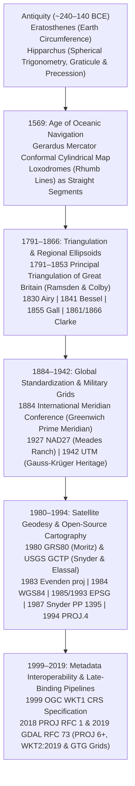

## 2.4 Historical Evolution (`gis-history` Context)

Every coordinate reference system (CRS) tag attached to a modern Digital Elevation Model (DEM) or bathymetric grid is a stratigraphic record of more than two millennia of astronomy, maritime navigation, national triangulation, and computational software engineering. When a practitioner opens a legacy USGS $7.5\text{-minute}$ DEM referenced to NAD27 / UTM Zone 10N or harmonizes a British Admiralty hydrographic survey on OSGB36 (Airy 1830) with satellite altimetry on ITRF2020 (GRS80), the meter- to hectometer-scale coordinate offsets encountered are direct physical artifacts of the historical instruments, regional gravity anomalies, and software abstractions developed between antiquity and the 21st century.



---

### Antiquity (~240–140 BCE): Eratosthenes, Hipparchus, and the Spherical Graticule

The mathematical prerequisite for representing terrain or bathymetry across regions larger than a local valley is recognizing Earth's curvature and establishing a global angular coordinate system.

#### ~240 BCE: Eratosthenes of Cyrene Measures the Earth

Around 240 BCE, **Eratosthenes of Cyrene**, chief librarian at Alexandria, executed the first rigorous astro-geodetic arc measurement of Earth's radius $R$. Knowing that at local solar noon on the summer solstice the Sun illuminated the bottom of a deep vertical well at Syene (modern Aswan, near the Tropic of Cancer)—indicating zero zenith angle ($\zeta_{\text{Syene}} = 0^\circ$)—Eratosthenes used a vertical gnomon (*skaphe*) in Alexandria to measure the solar zenith angle $\zeta_{\text{Alexandria}}$ at the same epoch. Assuming parallel solar rays and that Alexandria and Syene lay on approximately the same meridian, the difference in astronomical latitude $\Delta\phi$ equaled the measured zenith angle:

$$\Delta\phi = \zeta_{\text{Alexandria}} - \zeta_{\text{Syene}} = \frac{1}{50}\text{ of a circle} = 7^\circ 12' = 0.12566\text{ rad}$$

Combining this angular arc with the ground baseline distance $S \approx 5,000\text{ stadia}$ between Syene and Alexandria (paced by professional royal surveyors, or *bematists*, along the Nile), Eratosthenes computed a spherical circumference $C = 50 \times 5,000 = 250,000\text{ stadia}$ (later revised to $252,000\text{ stadia}$ so as to be divisible by $60$ into $4,200\text{ stadia}$ per segment, or $700\text{ stadia}$ per degree). Depending on the exact length of the Egyptian *stadion* ($157.5\text{–}185\text{ m}$), Eratosthenes' implied spherical radius $R = \frac{S}{\Delta\phi}$ lay within $1\%\text{–}15\%$ of the modern mean Earth radius ($R_1 = 6,371,008.8\text{ m}$), establishing the foundational equation of astro-geodesy: coupling celestial angles to terrestrial baseline lengths.

#### ~140 BCE: Hipparchus of Nicaea and Mathematical Cartography

While Eratosthenes relied on an irregular grid of regional parallels and meridians anchored to famous landmarks, **Hipparchus of Nicaea** (c. 190–120 BCE, working primarily at Rhodes around 140 BCE) transformed geography into an exact mathematical discipline:
1. **Spherical Trigonometry and Chord Tables:** Hipparchus compiled the first trigonometric table of chords (Toomer, 1973), dividing the circle's circumference into $360 \times 60 = 21,600$ arc-minutes (establishing an integer reference radius $R = \frac{21,600}{2\pi} \approx 3,438\text{ parts}$) and tabulating $\operatorname{crd}(\theta) = 2R\sin(\theta/2)$ at $7^\circ 30'$ ($7.5^\circ$) intervals via the half-angle recursion $\operatorname{crd}^2(\theta/2) = R\bigl(2R - \operatorname{crd}(180^\circ - \theta)\bigr)$. This provided the spherical trigonometry required to convert between local horizon coordinates (altitude, azimuth), equatorial coordinates (right ascension, declination), and ecliptic coordinates.
2. **The Uniform $(\phi, \lambda)$ Graticule and *Climata*:** In his three-book critique *Against the Geography of Eratosthenes*, Hipparchus insisted that cartography must abandon subjective traveler itineraries in favor of a uniform spherical coordinate grid of **latitude** ($\phi$, *klima*, determined rigorously from the solstice ratio of longest to shortest daylight hours or the altitude of the celestial pole) and **longitude** ($\lambda$, determined by simultaneous observations of lunar eclipses across distant cities to establish absolute time differences $\Delta\lambda = \omega_\oplus \Delta t$, where $\omega_\oplus = 15^\circ\cdot\text{hr}^{-1}$ is Earth's mean rotation rate).
3. **Precession of the Equinoxes:** By comparing his own star catalog (c. 129 BCE) against the 3rd-century BCE observations of Timocharis and Aristyllus, Hipparchus discovered that the celestial equinoxes drift westward along the ecliptic at no less than $1^\circ$ per century (modern IAU value $\approx 50.29''\cdot\text{yr}^{-1}$, corresponding to a period of $\approx 25,772\text{ years}$). Today, correcting for lunisolar precession and nutation remains essential when transforming space-geodetic satellite orbits (e.g., ICESat-2, SWOT, GNSS) from the International Celestial Reference System (ICRS) into the Earth-Centered, Earth-Fixed (ECEF) International Terrestrial Reference System (ITRS).
4. **Stereographic and Orthographic Projections:** Hipparchus developed the mathematical foundations of the **stereographic** (conformal azimuthal) and **orthographic** projections—originally to project the celestial sphere onto flat astrolabe plates—which centuries later became standard polar and oblique projections for topographic and hydrographic mapping.

---

### 1569: Gerardus Mercator and the Conformal Rhumb-Line Revolution

As European maritime exploration expanded into global oceanic trade during the 16th century, navigators faced a lethal geometric mismatch between the spherical ocean and flat parchment charts. Sailing along a constant magnetic or true compass bearing $\alpha$ traces a **loxodrome** (rhumb line) on the sphere, which spirals toward the poles and crosses every meridian at the identical oblique angle $\alpha$. On early equirectangular (plate carrée) charts, a straight ruler line did not represent a constant compass course, causing ships to drift tens of leagues off course into unmapped shoals.

In August 1569 at Duisburg, Flemish cartographer **Gerardus Mercator** (Geert de Kremer) published his monumental 18-sheet wall map *Nova et Aucta Orbis Terrae Descriptio ad Usum Navigantium Emendate Accommodata* ("New and More Complete Representation of the Terrestrial Globe Properly Adapted for Use in Navigation"). Mercator recognized that for a rhumb line of constant azimuth $\alpha$ to appear as a straight line on a cylindrical map where meridians are equally spaced vertical lines ($x = R(\lambda - \lambda_0)$), the east–west secant scale expansion $k_\lambda(\phi) = \sec\phi$ caused by preventing meridians from converging toward the poles must be matched at every latitude by an identical north–south scale expansion $k_\phi(\phi) = \sec\phi$.

In modern differential calculus—formalized over the following century by Edward Wright (1599, via numerical summation of secants), Henry Bond (1645), James Gregory (1668), and Edmond Halley (1696)—setting the meridional scale equal to the parallel scale on a sphere of radius $R$ yields the **spherical conformal isometric latitude** $\psi$:

$$\frac{dy}{R \, d\phi} = \frac{dx}{R \cos\phi \, d\lambda} = \sec\phi \implies y(\phi) = R \int_{0}^{\phi} \sec\phi' \, d\phi' = R \ln\tan\left(\frac{\pi}{4} + \frac{\phi}{2}\right) = R \, \psi(\phi)$$

When generalized to an oblate ellipsoid of semi-major axis $a$ and first eccentricity $e = \sqrt{2f - f^2}$ (Lambert, 1772; Gauss, 1822; Snyder, 1987), equating the meridional scale $\frac{dy}{M(\phi)\,d\phi}$ and parallel scale $\frac{dx}{N(\phi)\cos\phi\,d\lambda}$ with $x = a(\lambda - \lambda_0)$ gives the **ellipsoidal isometric latitude**:

$$\psi(\phi) = \int_{0}^{\phi} \frac{M(\phi')}{N(\phi')\cos\phi'} \, d\phi' = \ln\left[\tan\left(\frac{\pi}{4} + \frac{\phi}{2}\right)\left(\frac{1 - e\sin\phi}{1 + e\sin\phi}\right)^{e/2}\right], \qquad y(\phi) = a \, \psi(\phi)$$

where:
- $x, y$ are the planar Easting and Northing coordinates ($\text{m}$),
- $R$ is the radius of the reference sphere ($\text{m}$) and $a$ is the ellipsoidal semi-major axis ($\text{m}$),
- $M(\phi) = \frac{a(1-e^2)}{(1-e^2\sin^2\phi)^{3/2}}$ and $N(\phi) = \frac{a}{\sqrt{1-e^2\sin^2\phi}}$ are the meridional and prime-vertical radii of curvature ($\text{m}$),
- $\phi, \lambda$ are geodetic latitude and longitude ($\text{rad}$), and
- $\psi(\phi)$ is the isometric latitude (dimensionless).

Mercator's 1569 projection established **conformality** (preservation of local angles and isotropic point scale) as the non-negotiable standard for nautical charting, ensuring that horizontal angles measured by sextant between coastal landmarks or acoustic bearings plotted on a hydrographic sheet match true angles on the water. At the same time, its runaway areal inflation ($k_{\text{area}} = \sec^2\phi \to \infty$ as $|\phi| \to 90^\circ$) and the difference between the ellipsoidal formula ($e \neq 0$, EPSG:3395) and the spherical formula ($e = 0$, Web Mercator EPSG:3857) directly explain modern pitfalls when computing terrain slope or watershed area on Web Mercator grids (see Subsection 2.2).

---

### 1791–1866: The Principal Triangulation of Great Britain and the 19th-Century Ellipsoid Era

Following the Cassini-led Anglo-French geodetic connection across the English Channel (1784–1790) initiated by Major-General **William Roy** (who measured the initial $5.19\text{-mile}$ Hounslow Heath baseline in 1784 using glass rods and deal timber), the British Board of Ordnance founded the **Ordnance Survey** on June 21, 1791, launching the **Principal Triangulation of Great Britain** (1791–1853).

#### Precision Instrumentation: Ramsden's Theodolite and Colby's Compensation Bars

To achieve geodetic control capable of unifying coastal Admiralty charts with interior military topography across England, Scotland, Wales, and Ireland, the survey relied on two landmark engineering innovations:
1. **Jesse Ramsden's 3-Foot Geodetic Theodolites (1787 & 1791):** Weighing nearly $200\text{ lb}$ ($90\text{ kg}$), Ramsden's Great Theodolites featured a $36\text{-inch}$ ($0.914\text{ m}$) horizontal brass circle divided via Ramsden's precision dividing engine and read by micrometer microscopes to better than $1\text{ arc-second}$ ($4.85\text{ }\mu\text{rad}$). Hauled to the summits of Ben Nevis, Snowdon, and Scafell Pike—and even hoisted atop the cross of St. Paul's Cathedral—the instrument had sufficient angular precision to directly measure the **spherical excess** $\epsilon$ (in radians) of terrestrial triangles:
   $$\epsilon = (\alpha_1 + \alpha_2 + \alpha_3) - \pi = \frac{A_{\triangle}}{R_m^2} \quad [\text{rad}], \qquad \epsilon'' = \frac{A_{\triangle}}{R_m^2 \sin 1''} \approx 206,264.81 \, \frac{A_{\triangle}}{R_m^2} \quad [\text{arc-seconds}]$$
   where $\alpha_1, \alpha_2, \alpha_3$ are the three measured interior spherical angles ($\text{rad}$), $A_{\triangle}$ is the triangle surface area ($\text{m}^2$), and $R_m = \sqrt{M(\phi)\,N(\phi)}$ is the Gaussian mean radius of curvature ($\text{m}$) at the triangle's mean latitude. For a primary geodetic triangle with $70\text{ km}$ sides ($A_{\triangle} \approx 2,122\text{ km}^2$ at $\phi \approx 53^\circ\text{ N}$, where $R_m \approx 6,383\text{ km}$), $\epsilon'' \approx 10.75''$, providing a direct field check on angular closure before applying **Legendre's theorem** (1787)—which subtracts $\epsilon/3$ from each observed angle to solve the triangle via plane trigonometry—or rigorous least-squares adjustment.
2. **Thomas Colby's Bimetallic Compensation Bars (1827):** Thermal expansion of metal measuring chains or rods was the dominant systematic bias in baseline scaling. Major-General **Thomas Colby** invented a $10\text{-foot}$ ($3.048\text{ m}$) compound apparatus pairing two equal-length ($L_0 = 10\text{ ft}$) parallel bars of brass (higher coefficient of thermal expansion $\alpha_{\text{brass}} \approx 18.9 \times 10^{-6}\text{ K}^{-1}$) and iron (lower $\alpha_{\text{iron}} \approx 11.7 \times 10^{-6}\text{ K}^{-1}$) joined by pivoted transverse steel tongues at their ends. By placing the microscopic optical target dots on the projecting steel tongues at lever-arm distances $d_{\text{iron}}$ and $d_{\text{brass}}$ from the respective bar pivots satisfying $\frac{d_{\text{iron}}}{d_{\text{brass}}} = \frac{\alpha_{\text{brass}}}{\alpha_{\text{iron}}}$, the differential thermal elongations $\Delta L_{\text{brass}} = L_0 \alpha_{\text{brass}} \Delta T$ and $\Delta L_{\text{iron}} = L_0 \alpha_{\text{iron}} \Delta T$ rotated the tongues around the optical dots without translating them ($\Delta L_{\text{dot}} = 0$). Deployed on the Lough Foyle (1827) and Salisbury Plain (1849) baselines, Colby's bars achieved a relative scale precision better than $1:500,000$ ($2\text{ ppm}$).

```
   Brass Bar (L_0 = 10 ft, high α_b)        o==================o
                                            /                    \
   Pivoted Steel Tongues                  /                      \
                                         /                        \
   Iron Bar  (L_0 = 10 ft, low α_i)     o------------------------o
                                        /                          \
   Invariant Optical Focus Dots -----> [*]                          [*]
   (Tongue lever arms d_i / d_b = α_b / α_i cancel thermal expansion ΔL_dot = 0)
```

#### 1830–1866: Proliferation of Regional Reference Ellipsoids and the Gall Projection

As national triangulation networks expanded across Europe, North America, and India, geodesists combined triangulated meridional arc lengths $\Delta S$ with astronomical latitude differences $\Delta\phi_{\text{astro}}$ to solve for the Earth's semi-major axis $a$ and flattening $f = (a - b)/a$:
- **1830 Airy Ellipsoid:** Astronomer Royal **George Biddell Airy** analyzed 14 meridional and parallel arcs to derive the ellipsoid later adopted for Great Britain's Ordnance Survey (OSGB36).
- **1841 Bessel Ellipsoid:** German astronomer **Friedrich Wilhelm Bessel** applied rigorous least-squares adjustment to 10 European, Peruvian, and Indian meridional arcs ($50.6^\circ$ total amplitude), producing the reference figure adopted across Central Europe, Russia, Japan, and Indonesia for over a century.
- **1855 Gall Stereographic Projection:** Seeking to mitigate the extreme high-latitude area distortion of Mercator's 1569 map for world thematic atlases, Scottish clergyman and astronomer **James Gall** introduced the cylindrical stereographic projection with standard parallels at $\phi_s = \pm 45^\circ$, projecting the sphere geometrically from the antipodal point on the equator onto a secant cylinder:
  $$x = \frac{R}{\sqrt{2}}(\lambda - \lambda_0), \qquad y = R\left(1 + \frac{\sqrt{2}}{2}\right)\tan\left(\frac{\phi}{2}\right)$$
  Gall's 1855 presentation to the British Association for the Advancement of Science catalyzed the mathematical study of compromise and equal-area cylindrical projections (including his 1855 orthographic equal-area cylindrical projection, later popularized by Arno Peters in 1973).
- **1861 & 1866 Clarke Ellipsoids:** Following the completion of the Principal Triangulation of Great Britain in 1853, Captain **Alexander Ross Clarke** published the monumental *Account of the Observations and Calculations of the Principal Triangulation* (1858), solving a simultaneous least-squares network adjustment of up to 920 unknowns by hand. Incorporating new arc data from Britain, France, Russia, India, and Peru, Clarke derived both triaxial and biaxial figures of the Earth in **1861** and refined the biaxial model into the **Clarke 1866** ellipsoid, which the U.S. Coast and Geodetic Survey adopted in 1880 as the reference surface for North America.

| Ellipsoid Name | Year | Author / Authority | Semi-Major Axis $a$ ($\text{m}$) | Semi-Minor Axis $b$ ($\text{m}$) | Inverse Flattening $1/f$ | Primary Historical & Legacy DEM / Chart Usage |
| :--- | :--- | :--- | :--- | :--- | :--- | :--- |
| **Airy 1830** | 1830 | George Biddell Airy | $6,377,563.396$ | $6,356,256.909$ | $299.3249646$ | OSGB36 (Great Britain Ordnance Survey & UK Admiralty charts) |
| **Bessel 1841** | 1841 | Friedrich W. Bessel | $6,377,397.155$ | $6,356,078.963$ | $299.1528128$ | DHDN (Germany), Tokyo Datum (Japan), Hermannskogel |
| **Clarke 1861** | 1861 | Alexander Ross Clarke | $6,378,203.6$ | $6,356,528.2$ | $294.26$ | Interim British & European astro-geodetic arc synthesis |
| **Clarke 1866** | 1866 | Alexander Ross Clarke | $6,378,206.400$ | $6,356,583.800$ | $294.978698214$ | NAD27 (North America, USGS $7.5'$ legacy DEMs, NOAA charts) |
| **GRS80** | 1980 | Helmut Moritz / IUGG | $6,378,137.000$ | $6,356,752.314140$ | $298.257222101$ | NAD83, ETRS89, ITRF realizations, NATRF2022, 3DEP LiDAR |
| **WGS84** | 1984 | U.S. DoD / NGA | $6,378,137.000$ | $6,356,752.314245$ | $298.257223563$ | GPS broadcast ephemeris, global DEMs (SRTM, Copernicus DEM) |

> [!IMPORTANT]
> **Why 19th-Century Ellipsoids Are Non-Geocentric:** Because Airy, Bessel, and Clarke oriented their ellipsoids at regional origin stations by setting the astronomical latitude and longitude (measured relative to the local plumb line $\mathbf{g}$) equal to the geodetic latitude and longitude (measured relative to the ellipsoid normal $\mathbf{n}$), any unmodeled deflection of the vertical $(\xi, \eta)$ at the origin tilted and translated the regional ellipsoid relative to Earth's true center of mass. Consequently, Airy 1830 and Bessel 1841 have semi-major axes $\sim 570\text{–}740\text{ m}$ smaller than GRS80, and their coordinate origins $(0,0,0)$ are displaced from the geocenter by $100\text{–}600\text{ m}$.

---

### 1884–1942: Global Meridians, Continental Datums, and Military Grid Systems

#### 1884: The International Meridian Conference (Washington, D.C.)

Prior to 1884, hydrographic offices published nautical charts referenced to more than a dozen competing national prime meridians ($\lambda = 0^\circ$): Greenwich (Great Britain and the United States), Paris (France, offset by $+2^\circ 20' 14.025''\text{ E}$), Cadiz (Spain), Ferro/El Hierro (Canary Islands), Pulkovo (Russia), and Naples. A ship crossing from a French chart to a British chart had to apply manual longitude offsets while simultaneously reconciling incompatible local solar time tables—a frequent cause of nocturnal groundings.

In October 1884, at the invitation of U.S. President Chester A. Arthur, 41 delegates from 25 nations convened in Washington, D.C., for the **International Meridian Conference**. Because over $72\%$ of the world's maritime commerce tonnage already navigated using British Admiralty charts referenced to the Airy Transit Circle at the **Royal Observatory, Greenwich**, the conference voted (22 in favor, 1 against [San Domingo], 2 abstaining [France and Brazil]) to establish:
1. The meridian passing through the center of the transit instrument at the Observatory of Greenwich as the universal **Prime Meridian** for longitude ($\lambda \in [-180^\circ, +180^\circ]$).
2. A **Universal Day** beginning at mean midnight at Greenwich, laying the foundation for Coordinated Universal Time (UTC)—vital today for time-tagging kinematic GNSS trajectories, acoustic multibeam pings, and tidal stage models.

*(Note: When satellite navigation arrived a century later, space-geodetic realizations such as WGS84 and the IERS Reference Meridian [IRM] preserved the astronomical orientation of the 1884 Greenwich meridian in space; however, because of local crustal deflection of the vertical at Greenwich, the modern zero meridian of WGS84/ITRF passes $102.5\text{ m}$ [$5.31''$] east of the historic Airy Transit Circle.)*

#### 1927: The North American Datum of 1927 (NAD27)

To unify the transcontinental triangulation arcs of the United States, Canada, and Mexico, the U.S. Coast and Geodetic Survey established the **North American Datum of 1927 (NAD27)**. NAD27 adopted the **Clarke 1866** ellipsoid and anchored its horizontal network to a single bronze disk set in concrete at **Meades Ranch, Osborne County, Kansas** ($\phi_0 = 39^\circ 13' 26.686''\text{ N}, \lambda_0 = 98^\circ 32' 30.506''\text{ W}$, azimuth to station Waldo $\alpha_0 = 75^\circ 28' 09.64''$), chosen because it lay near the geographic centroid of the contiguous United States at the intersection of two primary transcontinental triangulation arcs (the 39th Parallel Arc and the 98th Meridian Arc). At Meades Ranch, the geoid-ellipsoid separation was assumed to be zero ($N_0 = 0\text{ m}$). For over sixty years, every USGS topographic map, early digital elevation model, and NOAA hydrographic sounding sheet in North America was referenced to NAD27.

#### 1942: The Universal Transverse Mercator (UTM) System

During World War II, artillery fire control and amphibious landings required a standardized, conformal, metric planar coordinate system across all theaters of operations without the extreme scale distortion of the equatorial Mercator projection. Building directly upon the mathematical treatise of **Carl Friedrich Gauss** (1822) and **Johann Heinrich Louis Krüger** (1912)—which the German *Reichsamt für Landesaufnahme* and *Wehrmacht* had operationalized as the $3^\circ$-zone **Gauss-Krüger** military grid—both the German military (c. 1942–1943 *UTM-Ref*) and the **U.S. Army Corps of Engineers** (formalized between 1942 and 1947 by the Army Map Service) developed the **Universal Transverse Mercator (UTM)** system:
- Dividing the ellipsoid between $80^\circ\text{ S}$ and $84^\circ\text{ N}$ into sixty $6^\circ$-wide longitudinal zones (Zone 1 centered at $\lambda_0 = 177^\circ\text{ W}$),
- Applying a secant central meridian scale factor of $k_0 = 0.9996$ (so that $k = 1.0000$ along two secant lines roughly $180\text{ km}$ east and west of the central meridian, keeping maximum scale distortion below $1:1,000$ across the zone), and
- Assigning a False Easting of $E_0 = 500,000\text{ m}$ (and False Northing $N_0 = 10,000,000\text{ m}$ in the Southern Hemisphere) to ensure strictly positive metric coordinates.

---

### 1980–2019: Satellite Geodesy, Open-Source PROJ, and the Late-Binding Revolution

The launch of artificial satellites (*Sputnik 1* in 1957, the U.S. Navy TRANSIT Doppler system in 1960, and NAVSTAR GPS in 1978) exposed the $100\text{–}600\text{ m}$ offsets between classical national datums and Earth's true center of mass, while the rise of digital computers forced cartographic projections out of printed look-up tables and into algorithmic code.

#### 1980–1987: GRS80, USGS GCTP, Evenden's `proj`, WGS84, EPSG, and Snyder's PP 1395

Within a single transformative decade (1980–1987), the entire modern software and geodetic architecture of DEM processing took shape:
- **1980 Geodetic Reference System 1980 (GRS80):** Formulated by **Helmut Moritz** and adopted by the International Union of Geodesy and Geophysics (IUGG) at its XVII General Assembly in Canberra (December 1979, published 1980), GRS80 defined a geocentric equipotential ellipsoid via four fundamental physical constants: equatorial radius $a = 6,378,137\text{ m}$, geocentric gravitational constant $GM = 3,986,005 \times 10^8\text{ m}^3\cdot\text{s}^{-2}$, dynamical form factor $J_2 = 1.08263 \times 10^{-3}$, and angular velocity $\omega = 7.292115 \times 10^{-5}\text{ rad}\cdot\text{s}^{-1}$. GRS80 became the ellipsoid for NAD83, ETRS89, and all ITRF realizations.
- **1980 USGS General Cartographic Transformation Package (GCTP):** As the USGS began distributing digital elevation and Landsat rasters, cartographer **John Parr Snyder** and photogrammetrist **Atef A. Elassal** developed **GCTP** in FORTRAN IV—the first standardized federal software library capable of forward and inverse transformations across 20 map projections.
- **1983 Gerald "Jerry" Evenden Releases `proj`:** Working at the USGS Woods Hole Science Center in Massachusetts, mathematician **Gerald I. Evenden** developed the Unix command-line utility and C library **`proj`** (documented in USGS Open-File Report 83-623 and later OFR 90-284) to process marine geophysical and bathymetric cruise tracks. Evenden's concise key-value syntax (`+proj=utm +zone=19 +ellps=clrk66`) became the universal lingua franca of open-source geospatial software.
- **1984 World Geodetic System 1984 (WGS84):** The U.S. Defense Mapping Agency (DMA, now NGA) introduced **WGS84** to unify global military mapping and GPS broadcast orbits. Because DMA truncated the normalized second-degree zonal harmonic $\bar{C}_{2,0}$ to 8 significant digits during its derivation from GRS80, the WGS84 semi-minor axis ($b = 6,356,752.314245\text{ m}$) differs from GRS80 ($b = 6,356,752.314140\text{ m}$) by an inconsequential **$0.105\text{ mm}$** at the poles.
- **1985 / 1993 European Petroleum Survey Group (EPSG) Dataset:** Off-shore hydrocarbon exploration in the North Sea frequently suffered multimillion-dollar dry-hole drilling errors when seismic vessels confused ED50, OSGB36, and local platform datums. In **1985**, **Jean-Patrick Girbig** (Petrosystems / Elf Aquitaine) and **Roger Lott** (BP) led the **European Petroleum Survey Group (EPSG)** geodesy working group in compiling a relational database of ellipsoids, datums, projections, and coordinate transformations, releasing it publicly in **1993** (now maintained by the IOGP as the EPSG Geodetic Parameter Dataset).
- **1987 Snyder's *Map Projections—A Working Manual* (USGS PP 1395):** **John P. Snyder** published USGS Professional Paper 1395, providing complete closed-form and series equations alongside worked forward/inverse numerical test cases for both spherical and ellipsoidal projections—the definitive mathematical reference used to validate `proj`, GDAL, and commercial GIS engines.

#### 1994–2019: From `PROJ.4` and WKT1 to the `PROJ 6+` / `WKT2:2019` Revolution

In **1994**, Evenden released **`PROJ.4`**, and in **1999** the Open Geospatial Consortium (OGC) standardized **Well-Known Text (WKT1)** in the *Simple Features Specification* (OGC 99-049). Soon after, Frank Warmerdam extended `PROJ.4` with the `cs2cs` utility and the **`+towgs84`** parameter, which introduced an **early-binding hub-and-spoke architecture**: every CRS definition carried a single baked-in 3- or 7-parameter Helmert transformation to WGS84, using WGS84 as a universal pivot:

$$\text{CRS}_A \xrightarrow{+\text{towgs84}_A} \text{WGS84 (Pivot Hub)} \xrightarrow{-\text{towgs84}_B} \text{CRS}_B$$

By the 2010s, centimeter-accuracy LiDAR and multibeam sonar exposed the fatal flaw of the `+towgs84` hub-and-spoke model: **"WGS84" is a dynamic datum ensemble** (EPSG:6326) whose successive realizations (from original 1987 Transit-based WGS84 to GPS realizations G730, G873, G1150, G1674, G1762, G2139, and G2296) have shifted by up to $1.5\text{–}2.0\text{ m}$. Worse, when transforming between two plate-fixed or legacy datums (e.g., NAD27 to NAD83(2011) in North America, ED50 to ETRS89 in European waters, or OSGB36 to ETRS89 in Britain), routing through a single continent-wide 7-parameter Helmert shift to WGS84 discarded high-resolution empirical distortion grids (such as NADCON5 or OSTN15), injecting $1\text{–}5\text{ m}$ of systematic horizontal error ($\text{THU}$) into topographic DEMs and hydrographic smooth sheets processed in **GDAL**, **PDAL**, **MB-System**, **CARIS HIPS and SIPS**, **Qimera**, or **Hypack**.

In **2018–2019**, **Even Rouault**, **Kristian Evers**, **Thomas Knudsen**, and **Howard Butler** spearheaded **PROJ RFC 1 / RFC 2 (2018)** and **GDAL RFC 73 (2019)** (culminating in **PROJ 6+** and adoption of **OGC WKT2:2019 / ISO 19162:2019**; see Evers & Knudsen, 2017):
1. **Elimination of `+towgs84` Early Binding:** CRS definitions are decoupled from fixed transformation parameters. Instead, PROJ queries its SQLite geodetic registry (`proj.db`, synchronized with EPSG) at runtime using **late-binding** graph search to construct a direct, area-of-use-optimal coordinate operation pipeline (`cct`) between source and target CRS—including time-dependent 14-parameter Helmert transformations, horizontal distortion grids (`hgridshift`), vertical geoid grids (`vgridshift`), and tectonic deformation models.
2. **GeoTIFF Geodetic Transformation Grids (GTG):** Legacy binary datum/geoid shift formats (NTv2 `.gsb`, NADCON `.los/.las`, `.gtx`) were replaced by cloud-optimized **GeoTIFF Geodetic Transformation Grids (GTG)** hosted on the PROJ CDN (`cdn.proj.org`), unifying horizontal distortion grids and gravimetric geoid models under a single self-describing raster standard.

#### Worked Numerical Example: Early-Binding (`+towgs84` Pivot) vs. Late-Binding (`PROJ 6+` Grid Pipeline) Impact on a Steep Coastal Bluff DEM and Submerged Canyon Wall

Suppose a coastal hazard analyst aligns a legacy 1950s USGS photogrammetric DEM (and nearshore NOAA hydrographic smooth sheet) referenced to **NAD27 (EPSG:4267)** with a modern airborne topobathymetric LiDAR and multibeam survey referenced to **NAD83(2011) (EPSG:6318)** along a steep coastal bluff and submarine canyon head at Cape Mendocino, California ($\phi = 40^\circ 26' 24.000''\text{ N}, \lambda = 124^\circ 24' 36.000''\text{ W}$), where the local terrain/seabed slope is $\tan\beta = 0.80$ ($38.7^\circ$) facing due west (upslope gradient $\frac{\partial z}{\partial E} = +0.80, \frac{\partial z}{\partial N} = 0$).

1. **Legacy Early-Binding (`+towgs84` CONUS Mean 3-Parameter Shift):**
   A legacy `PROJ.4` string using the CONUS-average Molodensky/Helmert translation (`+towgs84=-8,160,176` to WGS84) combined with treating NAD83 as identical to WGS84 (`+towgs84=0,0,0`) predicts a horizontal shift at Cape Mendocino of:
   $$\Delta E_{\text{early}} = -94.21\text{ m}, \qquad \Delta N_{\text{early}} = +196.45\text{ m}$$
2. **Modern Late-Binding (`PROJ 6+` NADCON5 Bi-quadratic Grid Pipeline):**
   Because the 19th- and early-20th-century triangulation network along the tectonically active Mendocino Triple Junction accumulated severe regional scale and azimuth distortion relative to Meades Ranch, Kansas, the authoritative late-binding pipeline (`NAD27 -> NAD83(1986) -> NAD83(HARN) -> NAD83(FBN) -> NAD83(2007) -> NAD83(2011)` via NOAA NADCON5 grids in `proj.db`) evaluates the exact local shift:
   $$\Delta E_{\text{late}} = -96.08\text{ m}, \qquad \Delta N_{\text{late}} = +197.12\text{ m}$$
3. **Induced Horizontal and Vertical DEM Error & Standards Compliance Impact:**
   The horizontal position error vector $(\delta E, \delta N)$ of the early-bound legacy grid relative to the authoritative late-bound coordinate is:
   $$\delta E = \Delta E_{\text{early}} - \Delta E_{\text{late}} = +1.87\text{ m}, \qquad \delta N = \Delta N_{\text{early}} - \Delta N_{\text{late}} = -0.67\text{ m}$$
   $$\delta_{\text{horizontal}} = \sqrt{(\delta E)^2 + (\delta N)^2} = \sqrt{1.87^2 + (-0.67)^2} = 1.99\text{ m}$$
   Because the early-bound legacy DEM is shifted $+1.87\text{ m}$ too far east, evaluating the reprojected legacy grid at any fixed target Easting $E$ samples the west-facing slope from a point $1.87\text{ m}$ further downslope ($z_{\text{legacy,early}}(E,N) \approx z_{\text{legacy,late}}(E - \delta E, N - \delta N)$). By the coupled horizontal-to-vertical elevation error law ($\sigma_{z,\text{topo}} = \delta_{\text{horizontal}} \tan\beta$, derived in Subsection 1.1), this induces a systematic vertical bias in the reprojected legacy surface:
   $$\delta z_{\text{legacy}} = z_{\text{legacy,early}} - z_{\text{legacy,late}} = -\frac{\partial z}{\partial E}\delta E - \frac{\partial z}{\partial N}\delta N = -(0.80)(+1.87\text{ m}) = -1.50\text{ m}$$
   Consequently, differencing the modern DEM against the early-bound legacy DEM ($\text{DoD} = z_{\text{modern}} - z_{\text{legacy,early}} = +1.50\text{ m}$, or $z_{\text{legacy,early}} - z_{\text{modern}} = -1.50\text{ m}$) creates a fictitious **$1.50\text{ m}$ vertical change artifact**. This single software metadata error exceeds the **USGS 3DEP** Quality Level 1/2 vertical accuracy specification ($\text{RMSE}_z \le 0.10\text{ m}$, $\text{NVA}_{95} \le 0.196\text{ m}$) and **ASPRS Positional Accuracy Standards (2014/2023)** $10\text{-cm}$ class by $15\times$, and violates **IHO S-44 (6th Edition, 2020)** Special Order ($\text{THU}_{95} \le 2\text{ m}$, $\text{TVU}_{95} = \sqrt{a^2 + (b\cdot d)^2}$ with $a = 0.25\text{ m}, b = 0.0075$) and **NOAA HSSD / FPM (2020)** uncertainty budgets before a single sensor measurement error is even included.

> [!WARNING]
> **Never Convert CRS Definitions to Legacy `PROJ.4` Strings in Modern Workflows:** Calling `.to_proj4()` in PyPROJ, GDAL, `xdem`, or GeoPandas strips the authoritative EPSG datum identity, drops coordinate epoch metadata, and forces fallback to deprecated early-binding approximations. Always pass **EPSG codes**, **OGC WKT2:2019 (`ISO 19162:2019`)**, or **PROJJSON** strings directly to transformation pipelines.

Practitioners can inspect and audit the exact late-binding pipeline and grid dependencies chosen by `PROJ 6+` using `projinfo` and execute 4D coordinate transformations using `cct`:

```bash
# Inspect candidate late-binding operations between NAD27 (EPSG:4267) and NAD83(2011) (EPSG:6318)
projinfo -s EPSG:4267 -t EPSG:6318 --spatial-test intersects -o PROJ

# Transform a 4D point (lon, lat, height_m, epoch_yr) using an explicit PROJ NADCON5 GTG pipeline
echo "-124.410000 40.440000 45.20 2010.0" | cct \
  +proj=pipeline \
  +step +proj=unitconvert +xy_in=deg +xy_out=rad \
  +step +proj=hgridshift +grids=us_noaa_nadcon5_nad27_nad83_1986_conus.tif \
  +step +proj=hgridshift +grids=us_noaa_nadcon5_nad83_1986_nad83_harn_conus.tif \
  +step +proj=hgridshift +grids=us_noaa_nadcon5_nad83_harn_nad83_fbn_conus.tif \
  +step +proj=hgridshift +grids=us_noaa_nadcon5_nad83_fbn_nad83_2007_conus.tif \
  +step +proj=hgridshift +grids=us_noaa_nadcon5_nad83_2007_nad83_2011_conus.tif \
  +step +proj=unitconvert +xy_in=rad +xy_out=deg
```

---

### Summary of Foundational Geodetic and Cartographic Milestones (`gis-history`)

| Era / Year | Milestone & Principal Investigators | Enduring Legacy for Modern DEM & Bathymetric Workflows |
| :--- | :--- | :--- |
| **~240 BCE** | **Eratosthenes of Cyrene:** Syene–Alexandria arc measurement | Coupled astronomical zenith angles ($\Delta\phi$) with ground baseline pacing ($S$) to estimate Earth's radius $R$. |
| **~140 BCE** | **Hipparchus of Nicaea:** Spherical trigonometry & precession (Toomer, 1973) | Established the uniform $(\phi, \lambda)$ graticule, chord tables ($R = 3,438'$), stereographic projection, and equinox precession. |
| **1569** | **Gerardus Mercator:** Conformal cylindrical world chart | Mapped loxodromes as straight lines via isometric latitude $\psi(\phi)$; established conformality for nautical charts. |
| **1791–1853** | **Principal Triangulation of Great Britain:** Roy, Ramsden, Colby, Clarke (1858) | Introduced $1''$ geodetic theodolites, bimetallic thermal-compensation baseline bars, and large-scale least-squares adjustment. |
| **1830–1866** | **Regional Ellipsoids & Gall Projection:** Airy (1830), Bessel (1841), Gall (1855), Clarke (1861/1866) | Defined classical national reference ellipsoids (OSGB36, DHDN, NAD27) and secant cylindrical projections. |
| **1884** | **International Meridian Conference (Washington, D.C.)** | Standardized the Greenwich Prime Meridian ($\lambda = 0^\circ$) and Universal Day across global nautical charts. |
| **1927 & 1942** | **NAD27 (Meades Ranch) & UTM Grid (Gauss-Krüger heritage)** | Standardized North American horizontal control on Clarke 1866 and $6^\circ$ conformal military/topographic zones ($k_0 = 0.9996$). |
| **1980–1987** | **GRS80 (Moritz, 1980), GCTP (Snyder & Elassal, 1980), `proj` (Evenden, 1983), WGS84 (1984), EPSG (Girbig & Lott, 1985/1993), USGS PP 1395 (Snyder, 1987)** | Transitioned geodesy to geocentric satellite ellipsoids, open-source C/FORTRAN projection libraries, and the EPSG registry. |
| **1994–1999** | **`PROJ.4` Release & OGC WKT1 CRS Specification (OGC 99-049)** | Standardized text-based CRS metadata and early-binding `+towgs84` transformations across GIS software. |
| **2018–2019** | **PROJ RFC 1 & GDAL RFC 73 (`PROJ 6+` & `WKT2:2019` / ISO 19162:2019)** (Evers & Knudsen, 2017) | Replaced the error-prone `+towgs84` hub-and-spoke model with late-binding transformation pipelines (`proj.db`) and GeoTIFF grids (GTG). |


