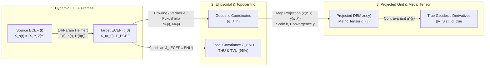

## 2.5 Mathematical Foundations

Transforming raw elevation and bathymetric observations—collected by satellite altimeters, airborne lidar, interferometric synthetic aperture radar (InSAR), and multibeam echosounders (MBES)—into a coherent Digital Elevation Model requires three foundational mathematical machineries:
1. Exact three-dimensional conversions between global Earth-Centered, Earth-Fixed (ECEF) Cartesian coordinates $(X, Y, Z)$, curvilinear geodetic coordinates $(\varphi, \lambda, h)$, and local topocentric tangent planes $(E, N, U)$, together with their analytical Jacobians for 3D uncertainty propagation.
2. Time-dependent 7-parameter and 14-parameter Helmert similarity transformations that account for tectonic plate motion and reference frame evolution across epochs.
3. Differential geometry of projected surfaces—specifically the metric tensor $g_{ij}$ and Tissot's indicatrix—to reconcile planar finite-difference terrain derivatives on a projected grid with true geodesic slope and aspect on the curved ellipsoid.



---

### 2.5.1 Exact Forward and Inverse Transformations Between Geodetic $(\varphi, \lambda, h)$ and ECEF $(X, Y, Z)$

#### Reference Ellipsoid Geometry and Principal Radii of Curvature
An oblate biaxial reference ellipsoid of revolution is fully specified by two defining geometric constants: the semi-major (equatorial) radius $a$ (in $\text{m}$) and the flattening $f = \frac{a - b}{a}$ (dimensionless), where $b = a(1 - f)$ is the semi-minor (polar) radius. From $(a, f)$, the first eccentricity squared $e^2$ and second eccentricity squared $e'^2$ follow identically as:

$$e^2 = \frac{a^2 - b^2}{a^2} = 2f - f^2, \qquad e'^2 = \frac{a^2 - b^2}{b^2} = \frac{e^2}{1 - e^2} \tag{2.1}$$

For the Geodetic Reference System 1980 (GRS80, `EPSG:7019`), $a = 6{,}378{,}137.0\text{ m}$ and $f^{-1} = 298.257222101$, yielding $e^2 \approx 0.00669438002290$ and $b \approx 6{,}356{,}752.314140\text{ m}$ (differing from WGS84 `EPSG:7030`, where $f^{-1} = 298.257223563$, by only $0.105\text{ mm}$ at the poles).

Because the meridian cross-section is an ellipse rather than a circle, the surface normal at geodetic latitude $\varphi \in [-\frac{\pi}{2}, +\frac{\pi}{2}]$ does not pass through the Earth's center of mass (except at the equator $\varphi = 0$ and poles $\varphi = \pm\frac{\pi}{2}$). Instead, surface curvature is governed by two principal radii of curvature:

1. **Prime Vertical Radius of Curvature $N(\varphi)$** (normal section perpendicular to the meridian, in the East–West plane):
   $$N(\varphi) = \frac{a}{\sqrt{1 - e^2 \sin^2\varphi}} \tag{2.2}$$

2. **Meridional Radius of Curvature $M(\varphi)$** (normal section along the North–South meridian ellipse):
   $$M(\varphi) = \frac{a(1 - e^2)}{\bigl(1 - e^2 \sin^2\varphi\bigr)^{3/2}} = N(\varphi)\frac{1 - e^2}{1 - e^2 \sin^2\varphi} \tag{2.3}$$

At the equator ($\varphi = 0^\circ$), $N(0) = a = 6{,}378{,}137.000\text{ m}$ and $M(0) = a(1 - e^2) \approx 6{,}335{,}439.327\text{ m}$; at the poles ($\varphi = \pm 90^\circ$), both converge to the polar radius of curvature $c = \frac{a}{\sqrt{1 - e^2}} = \frac{a^2}{b} \approx 6{,}399{,}593.626\text{ m}$. By Euler's theorem on normal curvature, the radius of curvature along any geodetic azimuth $\alpha$ is $R_\alpha(\varphi) = \left(\frac{\cos^2\alpha}{M(\varphi)} + \frac{\sin^2\alpha}{N(\varphi)}\right)^{-1}$, and the Gaussian mean radius of curvature is $R_G(\varphi) = \sqrt{M(\varphi)N(\varphi)}$.

#### Exact Forward Transformation: $(\varphi, \lambda, h) \to (X, Y, Z)$
Let $\varphi$ denote geodetic latitude (positive North, in radians), $\lambda$ denote geodetic longitude (positive East from the International Reference Meridian, in radians), and $h$ denote **ellipsoidal height** (in $\text{m}$, measured positive outward along the surface normal $\hat{\mathbf{u}}$ above the reference ellipsoid). The forward transformation to right-handed ECEF Cartesian coordinates $(X, Y, Z)$ (in $\text{m}$) is exact and closed-form:

$$\begin{aligned}
X &= \bigl(N(\varphi) + h\bigr) \cos\varphi \cos\lambda \\
Y &= \bigl(N(\varphi) + h\bigr) \cos\varphi \sin\lambda \\
Z &= \bigl(N(\varphi)(1 - e^2) + h\bigr) \sin\varphi
\end{aligned} \tag{2.4}$$

> [!IMPORTANT]
> **Sign Convention for Terrestrial Elevation vs. Bathymetric Depth:** In Eq. (2.4), $h$ is strictly positive *upward* along the ellipsoidal outward normal. In marine and estuarine hydrography, acoustic multibeam sonars and pressure sensors measure water depth $d$ positive *downward* from the instantaneous water surface or a chart datum. Before invoking Eq. (2.4), positive-down depth $d$ must be converted to ellipsoidal height via $h = h_{\text{surface}} - d$ (where $h_{\text{surface}}$ is the GNSS-derived ellipsoidal height of the water surface). In the Mariana Trench ($d \approx 10{,}925\text{ m}$, geoid undulation $N_{\text{geoid}} \approx +45\text{ m}$), $h \approx -10{,}880\text{ m}$.

#### Exact and Rapidly Convergent Inverse Transformations: $(X, Y, Z) \to (\varphi, \lambda, h)$
Given $(X, Y, Z)$, geodetic longitude is obtained immediately via the four-quadrant arctangent:

$$\lambda = \operatorname{atan2}(Y, X) \in (-\pi, +\pi] \tag{2.5}$$

Let $p = \sqrt{X^2 + Y^2} = (N(\varphi) + h)\cos\varphi$ be the perpendicular radial distance from the rotational $Z$-axis. Because $N(\varphi)$ and $h$ are coupled in $p$ and $Z$, eliminating $h$ yields a quartic polynomial in $\tan\varphi$:

$$p \tan\varphi - Z = e^2 N(\varphi) \sin\varphi = \frac{a e^2 \tan\varphi}{\sqrt{1 + (1 - e^2)\tan^2\varphi}} \tag{2.6}$$

Three canonical algorithms are used across modern geodetic software to solve Eq. (2.6):

1. **Bowring's (1976, 1985) Parametric Latitude Method:**
   Bowring introduced the reduced (parametric) latitude $\beta$ on the auxiliary sphere, related to $\varphi$ by $\tan\beta = (1 - f)\tan\varphi = \sqrt{1 - e^2}\tan\varphi$. Starting from the initial approximation (Bowring, 1985, which reduces at $h \approx 0$ to Bowring, 1976):
   $$\tan\beta_0 = \frac{b Z}{a p} \left(1 + \frac{e'^2 b}{\sqrt{X^2 + Y^2 + Z^2}}\right) \quad \text{or at the surface } (h \approx 0)\text{:} \quad \tan\beta_0 = \frac{a}{b}\frac{Z}{p} \tag{2.7}$$
   geodetic latitude is recovered via:
   $$\tan\varphi = \frac{Z + e'^2 b \sin^3\beta_0}{p - e^2 a \cos^3\beta_0} \tag{2.8}$$
   Across the entire terrestrial and ocean-floor domain ($-12\text{ km} \le h \le +100\text{ km}$), a single evaluation of Eq. (2.8) achieves a maximum latitude error under $1.8 \times 10^{-5}\text{ arcseconds}$ ($< 0.5\text{ mm}$). Performing one single refinement step—updating $\tan\beta_1 = (1 - f)\tan\varphi$ and re-evaluating Eq. (2.8)—converges to full IEEE-754 double-precision accuracy ($< 10^{-16}\text{ rad}$ or $< 1\text{ nm}$). Once $\varphi$ is known, Bowring's (1985) invariant expression computes $h$ without numerical loss of significance at either the equator ($\sin\varphi \to 0$) or the poles ($\cos\varphi \to 0$):
   $$h = p \cos\varphi + Z \sin\varphi - a\sqrt{1 - e^2 \sin^2\varphi} \tag{2.9}$$

2. **Vermeille's (2002) Closed-Form Algebraic Quartic Solution:**
   To guarantee exact non-iterative invertibility at all altitudes (from deep boreholes to high-orbiting GNSS satellites) outside the tiny focal-disc evolute ($p < a e^2 \approx 42.7\text{ km}$ near the geocenter), Vermeille (2002) solved Ferrari's resolvent cubic analytically for $k = 1 - e^2 + h/N(\varphi)$:
   $$\begin{aligned}
   u &= \frac{p^2}{a^2}, \qquad v = \frac{(1 - e^2)Z^2}{a^2}, \qquad q = \frac{u + v - e^4}{6} \\
   s &= \frac{e^4 u v}{4 q^3}, \qquad t = \sqrt[3]{1 + s + \sqrt{s(s + 2)}}, \qquad \tilde{u} = q\left(1 + t + \frac{1}{t}\right) \\
   w &= \sqrt{\tilde{u}^2 + e^4 v}, \qquad \zeta = e^2\frac{\tilde{u} + w - v}{2w}, \qquad k = \sqrt{\tilde{u} + w + \zeta^2} - \zeta
   \end{aligned} \tag{2.10}$$
   from which $D = \frac{k p}{k + e^2}$, $\varphi = 2\operatorname{atan2}\!\bigl(Z,\, D + \sqrt{D^2 + Z^2}\bigr)$, and $h = \frac{k + e^2 - 1}{k}\sqrt{D^2 + Z^2}$ follow in closed form.

3. **Fukushima's (1999, 2006) Halley Method:**
   When transforming billions of airborne lidar or multibeam points, transcendental evaluations (`sin`, `cos`, `cbrt`) dominate CPU time. Fukushima formulated Eq. (2.6) in terms of $T = \tan\beta$, applying a single third-order Halley rational update using only square roots and divisions before a single final `atan2` call—achieving sub-nanometer accuracy at roughly $2.5\times$ the throughput of Vermeille's cube-root method.

#### Analytical Jacobian $\mathbf{J}_{\text{ECEF}\to\text{ENU}}$ and 3D Uncertainty Propagation (THU and TVU)
Taking total differentials of Eq. (2.4) with respect to $(\varphi, \lambda, h)$ and recognizing that $\frac{d}{d\varphi}\bigl(N(\varphi)\cos\varphi\bigr) = -M(\varphi)\sin\varphi$ and $\frac{d}{d\varphi}\bigl(N(\varphi)(1 - e^2)\sin\varphi\bigr) = M(\varphi)\cos\varphi$ yields the exact differential relationship between ECEF increments $(dX, dY, dZ)^T$, local topocentric East–North–Up increments $(dE, dN, dU)^T$, and geodetic increments $(d\varphi, d\lambda, dh)^T$:

$$\begin{bmatrix} dE \\ dN \\ dU \end{bmatrix} = \begin{bmatrix} (N(\varphi) + h)\cos\varphi\,d\lambda \\ (M(\varphi) + h)\,d\varphi \\ dh \end{bmatrix} = \mathbf{J}_{\text{ECEF}\to\text{ENU}}(\varphi, \lambda) \begin{bmatrix} dX \\ dY \\ dZ \end{bmatrix} \tag{2.11}$$

where the orthogonal rotation Jacobian $\mathbf{J}_{\text{ECEF}\to\text{ENU}} \in \mathrm{SO}(3)$ is:

$$\mathbf{J}_{\text{ECEF}\to\text{ENU}}(\varphi, \lambda) = \begin{bmatrix}
-\sin\lambda & \cos\lambda & 0 \\
-\sin\varphi\cos\lambda & -\sin\varphi\sin\lambda & \cos\varphi \\
\cos\varphi\cos\lambda & \cos\varphi\sin\lambda & \sin\varphi
\end{bmatrix} \tag{2.12}$$

and the Jacobian from ECEF to curvilinear radian/meter coordinates $(\varphi, \lambda, h)$ (noting that $d\varphi$ corresponds to North $dN$ and $d\lambda$ to East $dE$) is:

$$\mathbf{J}_{\text{ECEF}\to(\varphi,\lambda,h)} = \frac{\partial(\varphi, \lambda, h)}{\partial(X, Y, Z)} = \begin{bmatrix} 0 & \dfrac{1}{M(\varphi) + h} & 0 \\[8pt] \dfrac{1}{(N(\varphi) + h)\cos\varphi} & 0 & 0 \\[8pt] 0 & 0 & 1 \end{bmatrix} \mathbf{J}_{\text{ECEF}\to\text{ENU}}(\varphi, \lambda) \tag{2.13}$$

Given a $3 \times 3$ symmetric positive-definite error covariance matrix $\boldsymbol{\Sigma}_{\text{ECEF}}$ (in $\text{m}^2$) from a GNSS/INS trajectory adjustment or geodetic network solution, the first-order law of covariance propagation yields the local topocentric covariance matrix:

$$\boldsymbol{\Sigma}_{\text{ENU}} = \mathbf{J}_{\text{ECEF}\to\text{ENU}}\,\boldsymbol{\Sigma}_{\text{ECEF}}\,\mathbf{J}_{\text{ECEF}\to\text{ENU}}^T = \begin{bmatrix}
\sigma_E^2 & \sigma_{EN} & \sigma_{EU} \\
\sigma_{EN} & \sigma_N^2 & \sigma_{NU} \\
\sigma_{EU} & \sigma_{NU} & \sigma_U^2
\end{bmatrix} \tag{2.14}$$

From $\boldsymbol{\Sigma}_{\text{ENU}}$, the **Total Vertical Uncertainty (TVU)** (1D Gaussian at $95\%$ confidence) and **Total Horizontal Uncertainty (THU)** (2D horizontal error ellipse at $95\%$ confidence, per IHO S-44 and ASPRS Positional Accuracy Standards) are:

$$\text{TVU}_{95\%} = 1.9600\,\sigma_U, \qquad \text{THU}_{95\%} \approx 2.4477\sqrt{\frac{\sigma_E^2 + \sigma_N^2}{2}} \quad \left(\text{or } \sqrt{\chi^2_{2,0.95}\,\lambda_{\max}(\boldsymbol{\Sigma}_{EN})}\right) \tag{2.15}$$

where $\lambda_{\max}(\boldsymbol{\Sigma}_{EN}) = \frac{\sigma_E^2 + \sigma_N^2}{2} + \sqrt{\left(\frac{\sigma_E^2 - \sigma_N^2}{2}\right)^2 + \sigma_{EN}^2}$ is the semi-major variance of the horizontal covariance block.

---

### 2.5.2 7-Parameter and 14-Parameter Time-Dependent Helmert Transformations

#### Linearized Matrix Formulation and Epoch Evolution
A **7-parameter Helmert similarity transformation** maps 3D Cartesian coordinates between two static geocentric reference frames via three translations $\mathbf{T} = [T_x, T_y, T_z]^T$, a differential scale factor $s$, and three infinitesimal Euler rotation angles $\boldsymbol{\theta} = [\theta_x, \theta_y, \theta_z]^T$. Because global reference frames (e.g., ITRF2020, WGS84(G2296)) are realized on a deforming crust whereas plate-fixed regional datums (e.g., NAD83(2011), ETRS89, GDA2020) co-rotate with a tectonic plate, modern geodesy requires the **14-parameter time-dependent Helmert transformation** (often called a 15-parameter transformation when the reference epoch $t_0$ is counted explicitly):

$$\mathbf{X}_{\text{target}}(t) = \mathbf{T}(t) + \bigl(1 + s(t)\bigr)\,\mathbf{R}\bigl(\theta_x(t), \theta_y(t), \theta_z(t)\bigr)\,\mathbf{X}_{\text{source}}(t) \tag{2.16}$$

where each parameter evolves linearly with observation epoch $t$ (in decimal Julian or Besselian years) relative to the published reference epoch $t_0$:

$$\begin{aligned}
\mathbf{T}(t) &= \begin{bmatrix} T_x(t_0) \\ T_y(t_0) \\ T_z(t_0) \end{bmatrix} + (t - t_0)\begin{bmatrix} \dot{T}_x \\ \dot{T}_y \\ \dot{T}_z \end{bmatrix}, \qquad s(t) = s(t_0) + (t - t_0)\dot{s} \\
\boldsymbol{\theta}(t) &= \begin{bmatrix} \theta_x(t_0) \\ \theta_y(t_0) \\ \theta_z(t_0) \end{bmatrix} + (t - t_0)\begin{bmatrix} \dot{\theta}_x \\ \dot{\theta}_y \\ \dot{\theta}_z \end{bmatrix}
\end{aligned} \tag{2.17}$$

Here, $T_i(t_0)$ has units of $\text{m}$ (or $\text{mm}$), $\dot{T}_i$ is in $\text{m}\,\text{yr}^{-1}$, $s(t_0)$ is dimensionless (typically tabulated in parts per million, $1\text{ ppm} = 10^{-6}$, or parts per billion, $1\text{ ppb} = 10^{-9}$), and $\theta_i(t_0)$ is tabulated in arcseconds ($''$) or milliarcseconds ($\text{mas}$) and must be converted to radians before matrix multiplication:

$$1\text{ mas} = 10^{-3}\text{ arcsec} = \frac{\pi}{180 \times 3600 \times 1000}\text{ rad} \approx 4.848136811095 \times 10^{-9}\text{ rad} \tag{2.18}$$

Since inter-datum rotations between modern space-geodetic realizations satisfy $|\theta_i| < 0.1'' \approx 5 \times 10^{-7}\text{ rad}$, second-order terms $\mathcal{O}(\theta^2) \sim 10^{-13}$ (corresponding to $< 1\,\mu\text{m}$ at the Earth's surface) and cross-terms $s\theta_i \sim 10^{-15}$ are negligible, allowing $\mathbf{R}$ to be linearized around the identity matrix $\mathbf{I}_3$.

> [!WARNING]
> **CRITICAL Sign-Convention Trap: Position Vector (`EPSG:1033` / `EPSG:1053`) vs. Coordinate Frame Rotation (`EPSG:1032` / `EPSG:1056`)**
> Two mutually opposite sign conventions exist in international standards for the off-diagonal rotation elements of $\mathbf{R}(\theta_x, \theta_y, \theta_z)$:
>
> 1. **Position Vector Transformation (`EPSG:1033` 7-param / `EPSG:1053` 15-param; used by IERS, ITRF, ISO 19111, EUREF, and PROJ `+convention=position_vector`):**
>    Rotates the position vector $\mathbf{X}$ counterclockwise (right-hand rule) inside a fixed coordinate system:
>    $$\mathbf{R}_{\text{PV}}\bigl(\theta_x, \theta_y, \theta_z\bigr) = \begin{bmatrix} 1 & -\theta_z & +\theta_y \\ +\theta_z & 1 & -\theta_x \\ -\theta_y & +\theta_x & 1 \end{bmatrix} \tag{2.19}$$
>
> 2. **Coordinate Frame Rotation (`EPSG:1032` 7-param / `EPSG:1056` 15-param; used by NOAA/NGS in the United States, Geoscience Australia, and PROJ `+convention=coordinate_frame`):**
>    Rotates the coordinate axes counterclockwise while the physical point remains fixed, which is the transpose $\mathbf{R}_{\text{CF}} = \mathbf{R}_{\text{PV}}^T = \mathbf{R}_{\text{PV}}(-\theta_x, -\theta_y, -\theta_z)$:
>    $$\mathbf{R}_{\text{CF}}\bigl(\theta_x, \theta_y, \theta_z\bigr) = \begin{bmatrix} 1 & +\theta_z & -\theta_y \\ -\theta_z & 1 & +\theta_x \\ +\theta_y & -\theta_x & 1 \end{bmatrix} \tag{2.20}$$
>
> **Never enter published rotation parameters $(\theta_x, \theta_y, \theta_z, \dot{\theta}_x, \dot{\theta}_y, \dot{\theta}_z)$ into a custom script or PROJ pipeline without verifying which convention the publishing agency used.** Mixing the two conventions reverses the sign of the entire rotational displacement vector $\Delta\mathbf{X}_{\text{rot}} = (\mathbf{R} - \mathbf{I}_3)\mathbf{X}$, introducing systematic errors exceeding $0.5\text{–}1.9\text{ m}$ across North America and Australia.

| Feature | Position Vector Convention | Coordinate Frame Rotation Convention |
| :--- | :--- | :--- |
| **EPSG Operation Method Codes** | `EPSG:1033` (3D), `EPSG:1053` (Time-dependent) | `EPSG:1032` (3D), `EPSG:1056` (Time-dependent) |
| **PROJ Parameter Flag** | `+convention=position_vector` | `+convention=coordinate_frame` |
| **First Row of $\mathbf{R}$** | $[1,\; -\theta_z,\; +\theta_y]$ | $[1,\; +\theta_z,\; -\theta_y]$ |
| **Rotational Increment $\Delta\mathbf{X}_{\text{rot}}$** | $+\boldsymbol{\theta} \times \mathbf{X}$ | $-\boldsymbol{\theta} \times \mathbf{X}$ |
| **Primary Adopting Agencies** | IERS (ITRF), EuroGeographics (ETRS89), ISO 19111 | NOAA/NGS (NAD83), Geoscience Australia (GDA94/2020) |

#### Worked Numerical Example: Helmert Transformation and Sign-Convention Error + Uncertainty Propagation
Consider an airborne topobathymetric lidar trajectory epoch over the Golden Gate in San Francisco, California, observed at $t = 2020.00$ in `ITRF2008` with ECEF coordinates and trajectory covariance:

$$\mathbf{X}_{\text{ITRF2008}}(2020.0) = \begin{bmatrix} -2{,}706{,}000.000 \\ -4{,}261{,}000.000 \\ +3{,}888{,}000.000 \end{bmatrix}\text{ m}, \qquad \boldsymbol{\Sigma}_{\text{ECEF}} = \begin{bmatrix} 0.0009 & -0.0002 & 0.0003 \\ -0.0002 & 0.0016 & -0.0004 \\ 0.0003 & -0.0004 & 0.0012 \end{bmatrix}\text{ m}^2$$

1. **Inverse $(X, Y, Z) \to (\varphi, \lambda, h)$ and $\boldsymbol{\Sigma}_{\text{ENU}}$ on GRS80:**
   We have $p = \sqrt{(-2{,}706{,}000)^2 + (-4{,}261{,}000)^2} = 5{,}047{,}628.84927\text{ m}$ and $\lambda = \operatorname{atan2}(-4{,}261{,}000, -2{,}706{,}000) = -2.137493341\text{ rad} = -122.46928546^\circ$. Applying Bowring's Eqs. (2.7)–(2.9) yields $\varphi = +0.659583892\text{ rad} = +37.79136827^\circ$, $N(\varphi) = 6{,}386{,}171.482\text{ m}$, and $h = +1{,}276.589\text{ m}$. Evaluating Eq. (2.12) at $(\varphi, \lambda)$ and propagating $\boldsymbol{\Sigma}_{\text{ECEF}}$ via Eq. (2.14) gives $\sigma_E = 0.0358\text{ m}$ ($\sigma_E^2 = 0.001282\text{ m}^2$), $\sigma_N = 0.0322\text{ m}$ ($\sigma_N^2 = 0.001035\text{ m}^2$), and $\sigma_U = 0.0372\text{ m}$ ($\sigma_U^2 = 0.001382\text{ m}^2$)—preserving the orthogonal trace invariant $\operatorname{tr}(\boldsymbol{\Sigma}_{\text{ENU}}) = \operatorname{tr}(\boldsymbol{\Sigma}_{\text{ECEF}}) = 0.00370\text{ m}^2$—and yielding $\text{TVU}_{95\%} = 1.9600(0.0372) = 0.073\text{ m}$ and $\text{THU}_{95\%} = 0.083\text{ m}$.

2. **14-Parameter Transformation to `NAD83(2011)` at $t = 2020.00$:**
   The official NOAA/NGS transformation from `ITRF2008` to `NAD83(2011)` at reference epoch $t_0 = 1997.00$ ($\Delta t = t - t_0 = 23.0\text{ yr}$) is published under the **Coordinate Frame (`EPSG:1056`)** convention:
   - Translations at $t = 2020.00$:
     $$\begin{aligned}
     T_x(2020.0) &= +0.99343 + 23(+0.00079) = +1.01160\text{ m} \\
     T_y(2020.0) &= -1.90331 + 23(-0.00060) = -1.91711\text{ m} \\
     T_z(2020.0) &= -0.52655 + 23(-0.00134) = -0.55737\text{ m}
     \end{aligned}$$
   - Scale at $t = 2020.00$:
     $$s(2020.0) = +1.71504\text{ ppb} + 23(-0.18201\text{ ppb/yr}) = -2.47119 \times 10^{-9}$$
     producing $\Delta\mathbf{X}_{\text{scale}} = s(2020.0)\mathbf{X} = [+0.00669,\; +0.01053,\; -0.00961]^T\text{ m}$.
   - Rotations at $t = 2020.00$:
     $$\begin{aligned}
     \theta_x(2020.0) &= +25.91467 + 23(+0.06667) = +27.44808\text{ mas} = +1.330720 \times 10^{-7}\text{ rad} \\
     \theta_y(2020.0) &= +9.42645 + 23(-0.75744) = -7.99467\text{ mas} = -3.875925 \times 10^{-8}\text{ rad} \\
     \theta_z(2020.0) &= +11.59935 + 23(-0.05133) = +10.41876\text{ mas} = +5.051157 \times 10^{-8}\text{ rad}
     \end{aligned}$$
   - Evaluating the rotational displacement $\Delta\mathbf{X}_{\text{rot, CF}} = \bigl(\mathbf{R}_{\text{CF}} - \mathbf{I}_3\bigr)\mathbf{X}$ via Eq. (2.20):
     $$\Delta\mathbf{X}_{\text{rot, CF}} = \begin{bmatrix} +\theta_z Y - \theta_y Z \\ -\theta_z X + \theta_x Z \\ +\theta_y X - \theta_x Y \end{bmatrix} = \begin{bmatrix} -0.21523 + 0.15070 \\ +0.13668 + 0.51738 \\ +0.10488 + 0.56702 \end{bmatrix} = \begin{bmatrix} -0.06453 \\ +0.65407 \\ +0.67190 \end{bmatrix}\text{ m}$$
   - Summing $\mathbf{X} + \mathbf{T}(2020.0) + \Delta\mathbf{X}_{\text{scale}} + \Delta\mathbf{X}_{\text{rot, CF}}$ yields the exact `NAD83(2011)` coordinates:
     $$\mathbf{X}_{\text{NAD83(2011)}}(2020.0) = \begin{bmatrix} -2{,}705{,}999.04624 \\ -4{,}261{,}001.25251 \\ +3{,}888{,}000.10492 \end{bmatrix}\text{ m}$$

3. **Impact of Mixing Rotation Sign Conventions:**
   If the published NGS parameters are mistakenly passed to a Position Vector formula (Eq. 2.19), $\Delta\mathbf{X}_{\text{rot}}$ is applied as $-\Delta\mathbf{X}_{\text{rot, CF}}$, creating a systematic 3D coordinate error of:
   $$\mathbf{e}_{3\text{D}} = -2\,\Delta\mathbf{X}_{\text{rot, CF}} = 2(\boldsymbol{\theta} \times \mathbf{X}) = \begin{bmatrix} +0.12906 \\ -1.30814 \\ -1.34380 \end{bmatrix}\text{ m}, \qquad \|\mathbf{e}_{3\text{D}}\| = 1.8798\text{ m}$$
   Because $\boldsymbol{\theta} \times \mathbf{X}$ is strictly orthogonal to the geocentric position vector $\mathbf{X}$, rotating $\mathbf{e}_{3\text{D}}$ into the local San Francisco horizon via $\mathbf{J}_{\text{ECEF}\to\text{ENU}}$ projects almost the entire error into the horizontal plane ($\Delta E = +0.810\text{ m}$, $\Delta N = -1.696\text{ m}$, horizontal shift $\Delta s_{\text{horiz}} = 1.880\text{ m}$, and direct vertical component $\Delta U = -0.0056\text{ m}$). On a $30^\circ$ coastal bluff or Golden Gate submarine bedform slope, this $1.880\text{ m}$ horizontal displacement induces a **vertical DEM surface elevation error of $|\Delta z| \approx \Delta s_{\text{horiz}}\tan 30^\circ = 1.085\text{ m}$**—more than ten times the entire vertical RMSE allowance ($0.10\text{ m}$) of a USGS 3DEP Quality Level 1 lidar survey.

---

### 2.5.3 Tissot's Indicatrix, the Metric Tensor $g_{ij}$ on a Projected Surface, and Exact Geodesic vs. Planar Slope

#### First Fundamental Form and Metric Tensor of a Map Projection
Let a smooth map projection map geodetic coordinates $(\varphi, \lambda)$ on the reference ellipsoid to planar grid coordinates $(x(\varphi, \lambda), y(\varphi, \lambda))$ (e.g., Easting and Northing in meters). On the curved reference ellipsoid at height $h = 0$, infinitesimal orthogonal displacements along the local East parallel and North meridian are:

$$ds_E = N(\varphi)\cos\varphi\,d\lambda, \qquad ds_N = M(\varphi)\,d\varphi \tag{2.21}$$

so the true ellipsoidal horizontal arc length squared is $ds_{\text{ell}}^2 = ds_E^2 + ds_N^2$. Relating $(dx, dy)^T$ to $(ds_E, ds_N)^T$ via the $2 \times 2$ local projection Jacobian $\mathbf{J}_{\text{proj}}$:

$$\begin{bmatrix} dx \\ dy \end{bmatrix} = \mathbf{J}_{\text{proj}} \begin{bmatrix} ds_E \\ ds_N \end{bmatrix} = \begin{bmatrix} \dfrac{1}{N(\varphi)\cos\varphi}\dfrac{\partial x}{\partial \lambda} & \dfrac{1}{M(\varphi)}\dfrac{\partial x}{\partial \varphi} \\[10pt] \dfrac{1}{N(\varphi)\cos\varphi}\dfrac{\partial y}{\partial \lambda} & \dfrac{1}{M(\varphi)}\dfrac{\partial y}{\partial \varphi} \end{bmatrix} \begin{bmatrix} ds_E \\ ds_N \end{bmatrix} \tag{2.22}$$

Inverting Eq. (2.22) expresses the true ellipsoidal metric distance $ds_{\text{ell}}^2$ in terms of projected grid differentials $(dx, dy)$ via the **first fundamental form**:

$$ds_{\text{ell}}^2 = \begin{bmatrix} dx & dy \end{bmatrix} \mathbf{G} \begin{bmatrix} dx \\ dy \end{bmatrix} = g_{11}\,dx^2 + 2 g_{12}\,dx\,dy + g_{22}\,dy^2 \tag{2.23}$$

where $\mathbf{G} = (g_{ij}) = \bigl(\mathbf{J}_{\text{proj}}^{-1}\bigr)^T \mathbf{J}_{\text{proj}}^{-1}$ is the covariant metric tensor on the projected plane, and its inverse $\mathbf{G}^{-1} = (g^{ij}) = \mathbf{J}_{\text{proj}}\mathbf{J}_{\text{proj}}^T$ is the contravariant metric tensor.

#### Tissot's Indicatrix of Distortion
Introduced by Nicolas Auguste Tissot (1859, 1881), **Tissot's indicatrix** is the ellipse formed by the image under $\mathbf{J}_{\text{proj}}$ of an infinitesimal unit circle $ds_E^2 + ds_N^2 = 1$ on the ellipsoid. The singular values of $\mathbf{J}_{\text{proj}}$ (the square roots of the eigenvalues of $\mathbf{G}^{-1}$) define the semi-major axis $a_{\text{T}}$ (maximum linear scale factor) and semi-minor axis $b_{\text{T}}$ (minimum linear scale factor) at $(\varphi, \lambda)$:

1. **Conformal Projections** (e.g., Mercator, Transverse Mercator / UTM, Lambert Conformal Conic, Polar Stereographic): Preserve local angles ($\omega_{\max} = 0$). Tissot's indicatrix is a circle ($a_{\text{T}} = b_{\text{T}} = k(\varphi, \lambda)$), so $\mathbf{J}_{\text{proj}}$ is strictly an isotropic scaling by the point scale factor $k(\varphi, \lambda)$ combined with a rotation by the **grid convergence angle** $\gamma(\varphi, \lambda)$ (the angle from True North to Grid North, positive clockwise):
   $$\mathbf{J}_{\text{proj}} = k(\varphi, \lambda) \begin{bmatrix} \cos\gamma & -\sin\gamma \\ \sin\gamma & \cos\gamma \end{bmatrix} \implies g_{11} = g_{22} = \frac{1}{k(\varphi, \lambda)^2}, \quad g_{12} = 0 \tag{2.24}$$
2. **Equal-Area (Authalic) Projections** (e.g., Albers Equal-Area Conic, Lambert Azimuthal Equal-Area, Equal Earth): Preserve differential surface area everywhere, requiring $\det(\mathbf{J}_{\text{proj}}) = a_{\text{T}} b_{\text{T}} = \frac{1}{\sqrt{\det\mathbf{G}}} = 1$, which induces anisotropic directional stretch ($a_{\text{T}} = 1/b_{\text{T}} \ne 1$) and shear ($g_{12} \ne 0$) away from standard parallels.

#### Exact Geodesic Slope and Aspect vs. Naive Projected Planar Finite Differences
Consider a gridded DEM $z(x, y)$ in projected coordinates $(x, y)$ with finite-difference grid derivatives $p_{\text{grid}} = \frac{\partial z}{\partial x}$ and $q_{\text{grid}} = \frac{\partial z}{\partial y}$ (computed, for example, via Horn's $3 \times 3$ kernel). Standard planar GIS tools assume Euclidean geometry ($\mathbf{G} = \mathbf{I}_2$), reporting planar slope $\tan\beta_{\text{grid}} = \sqrt{p_{\text{grid}}^2 + q_{\text{grid}}^2}$ and grid aspect $\alpha_{\text{grid}} = \operatorname{atan2}(-p_{\text{grid}}, -q_{\text{grid}})$.

On the curved ellipsoid (and accounting for elevation $h$ via the combined scale factor $\text{CSF} = k(\varphi, \lambda)\frac{R_G(\varphi)}{R_G(\varphi) + h}$), the true physical surface gradient $\nabla_{\mathcal{S}} z = \left[\frac{\partial z}{\partial s_E},\; \frac{\partial z}{\partial s_N}\right]^T$ in the local horizontal $(\hat{\mathbf{e}}, \hat{\mathbf{n}})$ frame is given by the chain rule $\nabla_{\mathcal{S}} z = \mathbf{J}_{\text{proj}}^T \nabla_{\text{grid}} z$, so its squared magnitude is contracted with the contravariant metric tensor $g^{ij}$:

$$\tan^2\beta_{\text{true}} = \|\nabla_{\mathcal{S}} z\|^2 = g^{ij}\frac{\partial z}{\partial x^i}\frac{\partial z}{\partial x^j} = g^{11}\left(\frac{\partial z}{\partial x}\right)^2 + 2 g^{12}\left(\frac{\partial z}{\partial x}\right)\left(\frac{\partial z}{\partial y}\right) + g^{22}\left(\frac{\partial z}{\partial y}\right)^2 \tag{2.25}$$

Substituting Eq. (2.24) for any **conformal projection** yields the exact relations connecting grid derivatives $(p_{\text{grid}}, q_{\text{grid}})$ to true local metric derivatives $(p_{\text{true}}, q_{\text{true}})$:

$$\begin{bmatrix} \dfrac{\partial z}{\partial s_E} \\[8pt] \dfrac{\partial z}{\partial s_N} \end{bmatrix} = \text{CSF}(\varphi, \lambda, h) \begin{bmatrix} \cos\gamma & \sin\gamma \\ -\sin\gamma & \cos\gamma \end{bmatrix} \begin{bmatrix} \dfrac{\partial z}{\partial x} \\[8pt] \dfrac{\partial z}{\partial y} \end{bmatrix} \tag{2.26}$$

From Eq. (2.26), two fundamental distortion laws govern all DEM terrain derivatives on conformal projections:

$$\tan\beta_{\text{true}} = \text{CSF}(\varphi, \lambda, h)\,\tan\beta_{\text{grid}} \approx k(\varphi, \lambda)\sqrt{\left(\frac{\partial z}{\partial x}\right)^2 + \left(\frac{\partial z}{\partial y}\right)^2} \tag{2.27}$$

$$\alpha_{\text{true}} = \alpha_{\text{grid}} + \gamma(\varphi, \lambda) \pmod{2\pi}, \qquad \text{where } \gamma \approx (\lambda - \lambda_0)\sin\varphi \tag{2.28}$$

```python
import numpy as np

def geodesic_slope_aspect_conformal(dz_dx: np.ndarray, dz_dy: np.ndarray,
                                    k_scale: np.ndarray, gamma_rad: np.ndarray,
                                    h_elev: np.ndarray = 0.0, R_earth: float = 6371008.8):
    """Correct planar DEM grid derivatives (dz/dx, dz/dy) for projection scale k,
    elevation factor R/(R+h), and meridian convergence gamma (radians, clockwise)."""
    csf = k_scale * (R_earth / (R_earth + h_elev))
    dz_dE = csf * (np.cos(gamma_rad) * dz_dx + np.sin(gamma_rad) * dz_dy)
    dz_dN = csf * (-np.sin(gamma_rad) * dz_dx + np.cos(gamma_rad) * dz_dy)
    slope_true_deg = np.degrees(np.arctan(np.hypot(dz_dE, dz_dN)))
    aspect_true_deg = np.degrees(np.arctan2(-dz_dE, -dz_dN)) % 360.0
    return slope_true_deg, aspect_true_deg
```

> [!TIP]
> **Quantifying Slope and Aspect Distortion Across Projections:**
> - **Web Mercator (`EPSG:3857`) at $\varphi = 60^\circ\text{ N}$ (e.g., Anchorage, Alaska or Bergen, Norway):** Because $k(\varphi) = \sec\varphi = 2.0$, horizontal grid distances $\Delta x, \Delta y$ are stretched by $2\times$ relative to true ground distances while elevation $z$ remains unscaled. Consequently, a true $30.00^\circ$ avalanche slope or continental-margin canyon wall ($\tan\beta_{\text{true}} = 0.57735$) has $\tan\beta_{\text{grid}} = \frac{1}{2}\tan\beta_{\text{true}} = 0.28868$, which a naive planar slope algorithm reports as $\beta_{\text{grid}} = 16.10^\circ$—a catastrophic **$-13.90^\circ$ slope underestimation**.
> - **UTM Zone Boundary ($|\lambda - \lambda_0| = 3^\circ$) at $\varphi = 60^\circ\text{ N}$:** The point scale factor is $k \approx 1.00008$, producing a negligible slope error ($< 0.003^\circ$), but the meridian convergence reaches $|\gamma| \approx 3^\circ \sin 60^\circ = 2.60^\circ$, rotating every computed aspect vector by $2.60^\circ$ unless corrected via Eq. (2.28).
> - **Equal-Area Projections ($g_{12} \ne 0$, $a_{\text{T}} \ne b_{\text{T}}$):** Slope error becomes *azimuth-dependent*: a slope facing along the principal stretch axis $a_{\text{T}}$ is underestimated by $1/a_{\text{T}}$, whereas an identical slope facing along the compression axis $b_{\text{T}} = 1/a_{\text{T}}$ is overestimated by $a_{\text{T}}$, artificially biasing regional geomorphometric orientation histograms.
