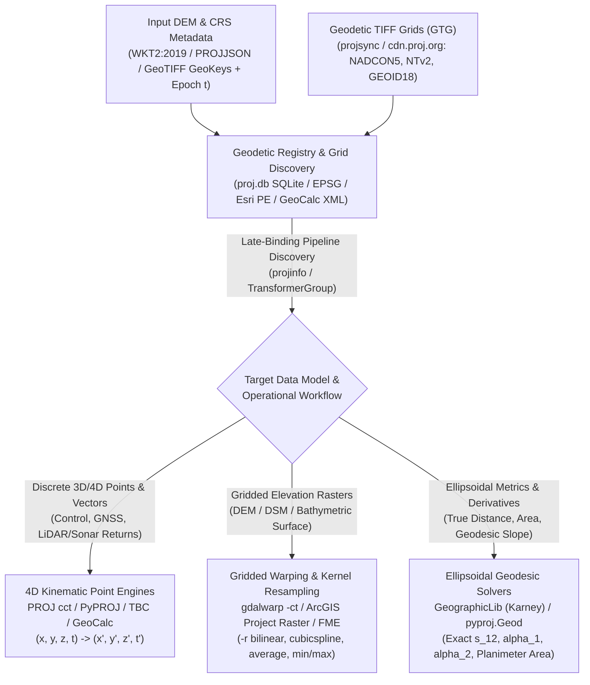
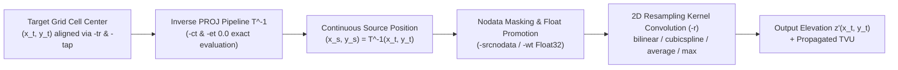

## 2.6 Software Ecosystem

Translating the mathematical geodesy of Sections 2.1–2.5—ellipsoidal geometry, 14-parameter time-dependent Helmert transformations, horizontal deformation models, Tissot projection distortion, and geodesic calculus—into operational Digital Elevation Model (DEM) workflows requires a rigorous software stack. A single misconfigured command-line flag, a missing geodetic grid file, or an ambiguous coordinate reference system (CRS) string can silently inject $1\text{--}3\text{ m}$ of horizontal and vertical bias (Systematic Total Horizontal and Vertical Uncertainty, $\text{THU}$ and $\text{TVU}$) or corrupt terrain derivatives through improper resampling kernels.

Modern geodetic and DEM reprojection software is organized into two complementary layers:
1. **Geodetic Registry and Coordinate Transformation Engines** (e.g., PROJ, GeographicLib, Esri Projection Engine, Blue Marble GeoCalc), which parse CRS metadata (`ISO 19162` WKT2:2019 or PROJJSON), query relational geodetic registries for valid transformation paths, and execute 3D/4D point coordinate operations $(x, y, z, t) \mapsto (x', y', z', t')$.
2. **Raster/Point-Cloud Reprojection and Resampling Engines** (e.g., GDAL `gdalwarp`, PDAL `filters.reprojection`, Safe FME, Trimble Business Center), which couple these coordinate pipelines to spatial interpolation kernels that map irregular or warped source samples onto a regular target grid while managing nodata masks, sub-pixel phase alignment, and scale distortion.



---

### 2.6.1 Open-Source Geodetic, Projection, and Resampling Stack

#### PROJ (v9+): From Legacy `PROJ.4` Strings to Late-Binding 4D Pipelines

Originally written by Gerald I. Evenden at the U.S. Geological Survey (USGS) in 1983 as a command-line filter (`proj`) to accompany John P. Snyder's cartographic formulas, and expanded by Frank Warmerdam in the 1990s into `PROJ.4` with datum shifts (`cs2cs`), **PROJ** is the foundational C++ geodetic library underlying GDAL, PDAL, QGIS, PostGIS, R (`sf`/`terra`), and Python (`pyproj`). Between 2018 and 2019, Kristian Evers, Even Rouault, and the OSGeo community executed a fundamental architectural overhaul (PROJ RFC 1 and GDAL RFC 73, released in PROJ 6 and matured through PROJ 9+) that eliminated two decades-old geodetic failure modes:

1. **Deprecation of `+towgs84` and Early-Binding Hub-and-Spoke Architecture:** In legacy `PROJ.4`, every CRS definition was coerced into a flat string containing a 3- or 7-parameter Helmert shift to WGS84 (`+towgs84=dx,dy,dz,...`). Transforming a DEM from NAD83(2011) to NAD83(NSRS2007) or from OSGB36 to ETRS89 forced coordinates to pivot through an unspecified "WGS84" hub (`Source -> WGS84 -> Target`). Because the WGS84 Datum Ensemble (`EPSG:6326`) spans six space-geodetic realizations with $>1.5\text{ m}$ internal spread, this early-binding pivot injected $1.0\text{--}2.0\text{ m}$ of unmodeled horizontal and vertical error into centimeter-grade lidar and multibeam surveys.
2. **Adoption of Late-Binding Coordinate Operations, WKT2:2019, and PROJJSON:** Modern PROJ stores the complete EPSG, IGNF, ESRI, and national geodetic registries inside a relational SQLite database (`proj.db`). Instead of baking a single transformation into the CRS definition, PROJ uses **late binding**: it preserves the authoritative CRS identity via **OGC WKT2:2019 (`ISO 19162:2019`)** or its lossless JSON equivalent (**PROJJSON**), and only resolves the optimal direct transformation pipeline $\mathcal{T}: \text{CRS}_{\text{source}} \to \text{CRS}_{\text{target}}$ at runtime based on the dataset's spatial bounding box, coordinate epoch $t$, and locally installed deformation grids.

Four command-line utilities form the core PROJ practitioner toolkit:

* **`projinfo` (Pipeline Discovery and Accuracy Auditing):** Queries `proj.db` to inspect CRS definitions and enumerate all candidate coordinate operations between two reference frames (`-s <source_crs> -t <target_crs>`). Crucially, `projinfo` reports the **formal geodetic accuracy** (in meters) of every candidate path, indicates whether required grid files are present locally (`--spatial-test intersects`), promotes 2D CRSs to 3D ellipsoidal height systems when `--3d` is specified, and outputs the exact multi-step pipeline string (`+proj=pipeline +step ...`) for verification before touching a single DEM pixel.
* **`cct` (4D Coordinate Conversion and Transformation):** Introduced in PROJ 5 as the modern replacement for `cs2cs`, `cct` is a strict 4D spatiotemporal stream processor operating on $(x, y, z, t)$ tuples. It executes explicit daisy-chained transformation steps (`+proj=pipeline`), including axis order swaps (`+proj=axisswap`), unit conversions (`+proj=unitconvert`), cartographic unprojection (`+inv`), geodetic-to-ECEF conversion (`+proj=cart`), 14-parameter time-dependent Helmert frame transformations (`+proj=helmert`), horizontal grid shifts (`+proj=hgridshift` and `+proj=deformation`), and vertical geoid/tidal shifts (`+proj=vgridshift`).
* **`cs2cs` and `proj`:** Maintained for backward compatibility. The classic `proj` utility performs purely cartographic 2D forward/inverse projections $(\lambda, \phi) \leftrightarrow (E, N)$ on a single ellipsoid *without* datum transformations (and prints local Tissot scale factors $h, k, s$ and meridian convergence $\gamma$ when invoked with `-V`). While `cs2cs` now queries `proj.db` under the hood, `cct` with an explicit pipeline is preferred for safety-critical 4D engineering workflows because `cs2cs` can silently select the highest-priority *available* operation if a local grid file is missing.
* **`projsync` and Geodetic TIFF Grids (GTG):** Prior to PROJ 7 (2020), datum and geoid grids were distributed across a fragmented array of binary formats (`NTv2 .gsb`, `NADCON .las/.los`, `NADCON5 .b`, `NOAA .gtx`, `Gravsoft .gri`) with conflicting endianness and axis conventions. PROJ standardized all horizontal deformation, datum shift, and geoid models into cloud-optimized **Geodetic TIFF Grids (GTG, RFC 4)** hosted on the OSGeo Content Delivery Network (`https://cdn.proj.org`). Practitioners use `projsync --bbox W,S,E,N` or `projsync --source-id us_noaa` to pre-cache exact transformation grids into `${PROJ_DATA}` for deterministic offline execution on HPC clusters.

---

#### GDAL (`gdalwarp`, `gdaltransform`, `gdalsrsinfo`): Gridded DEM Reprojection Mechanics

When transforming a gridded DEM from a source coordinate system $(x_s, y_s)$ to a target coordinate system $(x_t, y_t)$, software cannot simply push source pixel centers forward into the target frame, as forward mapping leaves irregular gaps and clustering caused by local scale factor variations $k(x,y)$ and grid convergence $\gamma(x,y)$. Instead, **GDAL** (`gdalwarp`, originated by Frank Warmerdam and maintained by Even Rouault and the GDAL team) executes an **inverse pull-mapping algorithm**: for each regular cell center $(x_t, y_t)$ in the output raster, `gdalwarp` evaluates the inverse coordinate transformation $\mathcal{T}^{-1}(x_t, y_t) \mapsto (x_s, y_s)$ into the source raster space and convolves a local 2D resampling kernel over the surrounding source pixels.



To execute mathematically sound DEM reprojections, practitioners rely on three GDAL utilities and specific operational flags:

* **`gdalsrsinfo`:** Extracts, validates, and converts CRS metadata from GeoTIFF headers, Esri `.prj` files, or LAS/LAZ VLRs. Running `gdalsrsinfo -o wkt2_2019 dem.tif` or `-o projjson` exposes hidden defects—such as a `PROJCRS` using `US survey foot` (`1200/3937 m`) labeled informally as "Feet", or a missing datum realization—before any coordinate math occurs.
* **`gdaltransform`:** Interactive and batch point transformer that incorporates both geodetic PROJ pipelines and raster image-to-ground affine geotransforms or Rational Polynomial Coefficients (RPCs).
* **`gdalwarp`:** The primary DEM reprojection engine. Five sets of parameters govern its numerical fidelity:
  1. **Explicit Coordinate Pipeline (`-ct`) and Coordinate Epochs (`-s_coord_epoch`, `-t_coord_epoch`):** Specifying only `-s_srs` and `-t_srs` leaves pipeline selection to automatic heuristics (and if the target CRS is a 2D EPSG code, `gdalwarp` warps horizontal $(x,y)$ positions without modifying vertical pixel values $z$). Passing the exact 3D PROJ pipeline string vetted via `projinfo --3d` into `-ct "+proj=pipeline ..."` guarantees that both horizontal deformation grids and vertical ellipsoidal/geoid shifts are applied to the DEM elevations, failing loudly if a required grid is absent rather than falling back to a ballpark shift.
  2. **Resampling Kernel Selection (`-r`):** The resampling kernel determines how sub-grid topographic variance is filtered and whether systematic vertical biases are introduced:
     * `-r near` (*Nearest Neighbor*): Assigns $z'(x_t, y_t) = z(\text{round}(x_s), \text{round}(y_s))$. While it preserves raw elevation values, it introduces a spatially periodic horizontal phase error up to $\pm \frac{\sqrt{2}}{2}\Delta x_s$. Because grid rotation ($\gamma \neq 0$) and scaling ($k \neq 1$) cause rows and columns to jump discontinuously across source pixels, `-r near` imprints severe diagonal stair-step artifacts ("herringbone" scarps) that corrupt slope $\nabla z$, aspect, and curvature ($\nabla^2 z$) with $5^\circ\text{--}20^\circ$ artificial spikes. **Never use nearest-neighbor resampling on continuous elevation grids.**
     * `-r bilinear` (*$2\times 2$ Piecewise Bilinear*): Computes a distance-weighted linear combination of the four surrounding source centers. It is strictly bounded ($\min(z_i) \le z' \le \max(z_i)$, preventing artificial overshoot), continuous, and computationally fast, though it acts as a low-pass filter that slightly damps high-frequency variance ($\sigma_{z'}^2 \le \sigma_z^2$) and rounds sharp single-pixel ridge crests.
     * `-r cubic` (*$4\times 4$ Bicubic Keys Convolution*) and `-r cubicspline` (*$4\times 4$ B-Spline*): Preserves steeper spectral gradients and smooth second derivatives ($\nabla^2 z$) for geomorphometry. However, because `-r cubic` uses negative outer lobe weights, it can produce Gibbs-phenomenon overshoot/undershoot ($\pm 0.05\text{--}0.3\text{ m}$) adjacent to vertical seawalls, quarries, or building breaklines in DSMs.
     * `-r average` (*Area-Weighted Mean*): Computes the exact area-weighted average of all contributing source pixels when downsampling ($\Delta x_t > \Delta x_s$). This is the mathematically required estimator for conserving first-order volumetric mass balance ($\iint z\,dx\,dy$) in earthwork and coarse hydrodynamic mesh parameterization.
     * `-r min` and `-r max` (*Extreme-Value Operators*): Preserves the minimum or maximum source value within the target cell footprint. As established in Chapter 1, safety-of-navigation hydrography requires shoal-biased resampling: `-r max` when bathymetry is stored as negative-down elevation $z$, or `-r min` when stored as positive-down water depth $d$.
  3. **Target Pixel Alignment (`-tr`, `-tap`):** Without explicit resolution and origin alignment, `gdalwarp` computes target bounds from the projected bounding box of the source corners, resulting in arbitrary fractional pixel sizes (e.g., $\Delta x = 0.998341\text{ m}$) and unaligned origins (e.g., $x_0 = 543210.37\text{ m}$). Always specify `-tr <dx> <dy> -tap` (*Target Aligned Pixels*), which forces the output bounding box coordinates to exact integer multiples of the resolution ($x_{\min} = n \cdot \Delta x_t$), ensuring that multi-temporal DEM tiles stack on an identical pixel lattice without further resampling.
  4. **Approximation Error Tolerance (`-et`):** By default, `gdalwarp` accelerates warping by evaluating the exact PROJ transformation only at coarse mesh nodes and linearly interpolating $(x_s, y_s)$ in between, up to an error threshold of `-et 0.125` pixels. When applying high-resolution geoid or crustal deformation grids, or when sub-centimeter horizontal fidelity is required, set `-et 0.0` to force exact per-pixel geodetic evaluation.
  5. **Nodata Masking and Working Precision (`-srcnodata`, `-dstnodata`, `-wt`):** If a source DEM stores void areas as `-9999.0` without a formal nodata tag, a $4\times 4$ cubic kernel near the coastline or swath edge will blend `-9999.0` with valid $+2.0\text{ m}$ elevations, creating a false $1\text{--}2$-pixel cliff of $-1500\text{ m}$ values ("nodata edge bleeding"). Explicitly declaring `-srcnodata -9999 -dstnodata -9999 -wt Float32` instructs GDAL to mask void pixels prior to kernel normalization and accumulate weights in 32-bit floating point even if the source raster is integer-encoded.

---

#### GeographicLib (Karney) and PyPROJ

* **GeographicLib:** Developed by Charles F. F. Karney (2011, 2013), **GeographicLib** provides C++, Python, and CLI tools (`GeodSolve`, `Planimeter`, `GeoConvert`, `GeoidEval`) that solve the direct and inverse ellipsoidal geodesic problems to full IEEE 754 double-precision accuracy ($<15\text{ nanometers}$ globally) and converge for arbitrary ellipsoid flattenings. Unlike Vincenty's (1975) iterative formulas—which fail to converge for nearly antipodal points and achieve only $\sim 0.1\text{ mm}$ precision—Karney's method expands the geodesic integrals into 6th-order series in the third flattening $n = (a - b)/(a + b)$ and solves the spherical auxiliary triangle via Newton's method. Furthermore, its `Planimeter` utility computes the exact surface area $A$ of any polygon bounded by ellipsoidal geodesics using the Gauss-Bonnet theorem ($c^2 \sum \alpha_i - (N-2)\pi$ plus high-order ellipsoidal corrections). In DEM workflows, GeographicLib is the gold standard for computing true inter-pixel metric spacing $(\Delta s_x(\phi), \Delta s_y(\phi))$ and exact ellipsoidal cell area on unprojected geographic grids (`EPSG:4326`/`4269`) without introducing map projection distortion.
* **PyPROJ (`pyproj`):** The official Python interface to PROJ (`v3.6+` wrapping PROJ 9+) and Karney's geodesic routines (`pyproj.Geod`). Through `pyproj.CRS`, `pyproj.Proj`, `pyproj.Transformer`, and `pyproj.TransformerGroup`, analysts embed 4D epoch-aware coordinate transformations and Tissot distortion audits (`pyproj.Proj.get_factors()`) directly into NumPy, Xarray, Rasterio, and `xdem` array pipelines. Crucially, `pyproj.Transformer.from_crs(..., always_xy=True)` enforces consistent $(x, y) = (\text{Lon}, \text{Lat})$ or $(\text{Easting}, \text{Northing})$ axis ordering across all CRS authorities, neutralizing the notorious axis-order reversal between EPSG geodetic definitions $(\phi, \lambda)$ and GIS array indexing $(j, i) \leftrightarrow (x, y)$.

---

### 2.6.2 Commercial and Enterprise Geodetic Suites

In regulated civil engineering, offshore energy, hydrographic charting, and cadastral surveying, open-source pipelines operate alongside four major commercial geodetic engines:

* **Esri Projection Engine (PE) and ArcGIS Pro:** Esri maintains an independent C/C++ geodetic library (**Projection Engine**) that powers ArcGIS Pro, ArcGIS Enterprise, and the `arcpy` Python environment. Historically, Esri maintained its own Well-Known ID (`WKID`) namespace and WKT1 dialect (`ESRI WKT`), which caused subtle friction when exchanging compound CRSs with GDAL/PROJ; modern releases (ArcGIS Pro 3.x) fully support ISO WKT2:2019 and synchronize transformation grids (NADCON5, GEOCON11, NOAA VDatum, and national NTv2 grids) via the *ArcGIS Coordinate Systems Data* extension. For DEM analysis, ArcGIS Pro's *Project Raster* tool mirrors `gdalwarp`'s inverse-mapping architecture (where the `Snap Raster` environment setting performs the exact role of `-tap`), while the **Surface Parameters** geoprocessing tool (`Method="GEODESIC"`) eliminates map projection distortion by transforming each $3\times 3$ pixel neighborhood into 3D Earth-Centered, Earth-Fixed (ECEF) $(X, Y, Z)$ coordinates and fitting a local biquadratic surface on the tangent plane to compute true ellipsoidal slope and aspect.
* **Blue Marble Geographics (`Geographic Calculator` and `GeoCalc` SDK):** Widely mandated in offshore oil and gas exploration, submarine pipeline/cable routing, and international hydrographic contracting (IHO/IOGP standards), Blue Marble's **Geographic Calculator** is built around an audited XML geodetic datasource (`GeoCalc`). It provides specialized capabilities rarely exposed in general-purpose GIS: seismic 3D bin-grid transformations (SEG-P1, UKOOA P1/90, P2/94), dynamic plate-motion velocity models, administrative locking of approved project transformation pipelines (preventing field personnel from accidentally altering datum parameters), and comprehensive cryptographic audit logs required for offshore rig positioning and international boundary compliance.
* **Safe Software FME (Feature Manipulation Engine):** As the dominant enterprise spatial ETL (Extract, Transform, Load) platform for automated CAD-to-GIS and BIM-to-DEM integration, FME uniquely embeds **four separate geodetic engines** within a single workflow: PROJ (`PROJReprojector`), CS-Map (`CsmapReprojector`), Esri Projection Engine (`EsriReprojector`), and Blue Marble GeoCalc (`GeographicCalculatorReprojector`). This allows infrastructure agencies to ingest contractor deliverables in arbitrary CAD formats (`.dwg`, `.dgn`, LandXML TINs) using legacy U.S. Survey Foot State Plane definitions, validate vertical datum headers, and reproject surfaces to standardized cloud-optimized GeoTIFFs with bit-for-bit parity against the client's mandated engine.
* **Trimble Business Center (TBC) and Leica Infinity:** Survey-grade geomatics suites designed to bridge physical survey observations (GNSS baselines, total station angles/distances, digital level runs, terrestrial laser scans, and UAV photogrammetry) with grid coordinates. Unlike GIS raster warpers, TBC and Leica Infinity natively model the separation between **ellipsoidal distances**, **ground-level horizontal distances** at mean project elevation $h_0$, and **projected grid distances** via the combined scale factor:
  $$CSF = k_0 \left(\frac{R_{\alpha}}{R_{\alpha} + h_0}\right)$$
  where $k_0$ is the projection point scale factor, $R_{\alpha}$ is the Euler radius of curvature in azimuth $\alpha$, and $h_0$ is the ellipsoidal height ($\text{m}$). When reconciling legacy local construction grids (e.g., plant coordinates initialized at $(N=5000\text{ m}, E=5000\text{ m}, z=100\text{ m})$) with modern GNSS control, these suites execute least-squares **Site Calibrations (Localizations)**—fitting a 2D four-parameter similarity transformation paired with a 3D inclined vertical adjustment plane over measured monument pairs, and exporting the resulting calibration parameters for machine-control earthwork grading.

---

### 2.6.3 Comparison Matrix of Coordinate and Reprojection Engines

| Software / Engine | Primary Data Model | 4D Kinematic ($t$) Support | Native Grid Formats | Accuracy Auditing & Fallback Control | Primary Operational Role in DEM Workflows |
| :--- | :--- | :--- | :--- | :--- | :--- |
| **PROJ (`cct`, `projinfo`)** | 3D/4D Coordinate Streams & Pipelines | Full (14-param Helmert + velocity/deformation grids) | Geodetic TIFF Grid (GTG) via `cdn.proj.org`, NTv2, GTX | `projinfo` reports formal accuracy ($\text{m}$) and missing grids; `cct` enforces exact pipeline | Inspecting candidate datum transformations; transforming control points, lidar/sonar trajectories, and GNSS epochs. |
| **GDAL (`gdalwarp`)** | 2D/3D Gridded Rasters | Full via `-s_coord_epoch`, `-t_coord_epoch`, and `-ct` | All PROJ GTG grids + VRTs and GeoTIFFs | `-ct` locks exact pipeline; default `-s_srs`/`-t_srs` may fall back to ballpark if grids missing | Reprojecting, resampling (`-r`), and pixel-aligning (`-tap`) single or tiled DEMs across CRSs and vertical datums. |
| **GeographicLib (Karney)** | Ellipsoidal Geodesics & Polygons | Static biaxial ellipsoid ($a, f$) | Gravsoft / PGM geoid grids (`GeoidEval`) | Exact double-precision ($<15\text{ nm}$); guaranteed convergence globally | Computing true metric inter-pixel distances ($\Delta s_x, \Delta s_y$), azimuths, and exact ellipsoidal cell areas $A(\phi)$. |
| **PyPROJ (`pyproj`)** | NumPy / Python Arrays & Points | Full via `Transformer.transform(x, y, z, tt)` | PROJ GTG ecosystem | `TransformerGroup(..., allow_ballpark=False)` raises explicit exception on missing grids | Custom Python (`xdem`, Rasterio, Xarray) 4D array transformations and geodesic derivative corrections. |
| **Esri Projection Engine** | Vectors, Rasters, TINs, Point Clouds | Epoch-aware transformations in ArcGIS Pro 3.x+ | Esri PE Data (HVCRS, GTG, `.gsb`, `.b`, `.gtx`) | GUI/ArcPy lists candidate paths; `Surface Parameters` computes ECEF geodesic slopes | Enterprise GIS DEM management, `Snap Raster` alignment, and distortion-free geodesic terrain derivatives. |
| **Blue Marble GeoCalc** | Points, Seismic Grids, Rasters, Point Clouds | Full plate-motion & time-dependent ITRF/WGS84 | GeoCalc XML Registry, GTG, NTv2, SEG-P1 | Cryptographic administrative policy locks & full regulatory QA/QC audit logs | Offshore oil/gas, submarine cable/pipeline corridor DEMs, and hydrographic contractor compliance. |
| **Trimble Business Center** | Survey Vectors, TINs, Point Clouds, CAD | Dynamic GNSS RTX / ITRF2020 to local epochs | Trimble `.dc` / `.cal` site calibrations, `.ggf` geoids | Least-squares network adjustment residuals ($\sigma_E, \sigma_N, \sigma_z$) at control monuments | Designing Low-Distortion Projections (LDPs), computing ground-to-grid $CSF$, and localizing mine/plant DEMs. |

---

### 2.6.4 Reproducible CLI and Python Workflows

#### Command-Line Workflow: Auditing and Executing a 4D Topobathymetric Transformation

Consider a coastal lidar and multibeam survey along the northern California margin (Eureka, $\phi \approx 40.80^\circ\text{ N}, \lambda \approx -124.16^\circ\text{ E}$, UTM Zone 10N) acquired in mid-2024 ($t = 2024.50$) referenced to **ITRF2020** (`EPSG:9989`, Geographic 3D). The project deliverables must be referenced to **NAD83(2011) / UTM Zone 10N** (`EPSG:6339`, promoted to 3D ellipsoidal height via `--3d`) at the standard national reference epoch $t_0 = 2010.00$. Because the North American plate rotates relative to ITRF2020 ($\sim 20\text{ mm/yr}$ rigid-plate motion at Eureka, compounded by $25\text{--}45\text{ mm/yr}$ of Pacific/Mendocino plate-boundary deformation) and NAD83 exhibits a $\sim 2.2\text{ m}$ geocenter offset, ignoring the 14-parameter time-dependent transformation introduces $1.57\text{ m}$ of horizontal positional error and $0.40\text{ m}$ of vertical ellipsoidal height bias.

```bash
# -------------------------------------------------------------------------
# STEP 1: Synchronize NOAA/NGS geodetic grids for the US West Coast bbox
# -------------------------------------------------------------------------
projsync --source-id us_noaa --bbox -125.0,40.0,-123.0,42.0

# -------------------------------------------------------------------------
# STEP 2: Audit candidate 3D coordinate operations with projinfo (--3d)
# Inspect formal accuracy (m) and extract the exact PROJ pipeline string.
# Note: --3d promotes 2D EPSG:6339 to 3D so ellipsoidal height h is transformed.
# -------------------------------------------------------------------------
projinfo -s EPSG:9989 -t EPSG:6339 --3d --area "USA - CONUS" --spatial-test intersects -o PROJ

# -------------------------------------------------------------------------
# STEP 3: Transform a discrete 4D survey control monument (Lon, Lat, h_ellips, t)
# Input: -124.160000 deg E, 40.800000 deg N, h = 12.500 m, epoch t = 2024.50
# Time-dependent 14-parameter ITRF -> NAD83(2011) (epoch 2010.0) + UTM 10N.
# CRITICAL: NOAA/NGS parameters use +convention=coordinate_frame (EPSG:1056)!
# Output: 402203.1180   4517033.3642       12.9001     2024.5000
# -------------------------------------------------------------------------
echo "-124.160000 40.800000 12.500 2024.50" | cct -d 4 \
    +proj=pipeline \
    +step +proj=unitconvert +xy_in=deg +xy_out=rad \
    +step +proj=cart +ellps=GRS80 \
    +step +proj=helmert +x=1.0053 +y=-1.90921 +z=-0.54157 \
          +rx=0.0267814 +ry=-0.0004203 +rz=0.0109321 +s=0.00036891 \
          +dx=0.00079 +dy=-0.0006 +dz=-0.00144 \
          +drx=6.67e-05 +dry=-0.0007574 +drz=-5.13e-05 +ds=-7.201e-05 \
          +t_epoch=2010.0 +convention=coordinate_frame \
    +step +inv +proj=cart +ellps=GRS80 \
    +step +proj=utm +zone=10 +ellps=GRS80

# -------------------------------------------------------------------------
# STEP 4: Reproject the 1 m DEM using gdalwarp with explicit coordinate epoch,
# exact per-pixel evaluation (-et 0.0), target-aligned pixels (-tap),
# Float32 working buffer, and cubic-spline vs. shoal-biased (-r max) kernels
# -------------------------------------------------------------------------
# (a) Continuous bare-earth / topobathymetric surface for geomorphometry:
gdalwarp -s_srs EPSG:9989 -s_coord_epoch 2024.50 \
    -t_srs EPSG:6339 -t_coord_epoch 2010.00 \
    -tr 1.0 1.0 -tap -et 0.0 -r cubicspline \
    -srcnodata -9999.0 -dstnodata -9999.0 -wt Float32 \
    -co COMPRESS=DEFLATE -co PREDICTOR=3 -co TILED=YES \
    "eureka_itrf2020_2024p5_1m.tif" "eureka_nad83_2011_utm10_spline_1m.tif"

# (b) Shoal-biased navigation safety surface (preserving max elevation z = min depth d):
gdalwarp -s_srs EPSG:9989 -s_coord_epoch 2024.50 \
    -t_srs EPSG:6339 -t_coord_epoch 2010.00 \
    -tr 2.0 2.0 -tap -et 0.0 -r max \
    -srcnodata -9999.0 -dstnodata -9999.0 -wt Float32 \
    "eureka_itrf2020_2024p5_1m.tif" "eureka_nad83_2011_utm10_shoal_2m.tif"
```

---

#### Python Workflow: Auditing 4D Datum Shifts and Correcting Map Projection Slope Distortion

The self-contained Python script below uses `pyproj` and `numpy` to demonstrate two critical software verification workflows:
1. **Part A:** Auditing the 3D positional error incurred when transforming a $t = 2024.50$ ITRF2020 coordinate into 3D NAD83(2011) / UTM Zone 10N (`pyproj.CRS.from_epsg(6339).to_3d()`) if an analyst either omits the observation epoch or relies on a legacy `PROJ.4` null shift (`+towgs84=0,0,0`).
2. **Part B:** Quantifying the catastrophic slope distortion incurred when running standard planar finite-difference slope algorithms (`gdaldem slope` without geodesic scaling) on a Web Mercator (`EPSG:3857`) DEM at $\phi = 60^\circ\text{ N}$ ($k = \sec 60^\circ = 2.0$), and restoring the exact slope using `pyproj.Proj.get_factors()` and ellipsoidal geodesics (`pyproj.Geod`).

```python
import numpy as np
import pyproj

# =========================================================================
# PART A: 4D Kinematic Transformation Audit (ITRF2020 -> 3D NAD83(2011) UTM 10N)
# Promote 2D EPSG:6339 to 3D so ellipsoidal height h is transformed in ECEF
# =========================================================================
crs_src = pyproj.CRS.from_epsg(9989)
crs_dst_3d = pyproj.CRS.from_epsg(6339).to_3d()

tg = pyproj.transformer.TransformerGroup(
    crs_src, crs_dst_3d, allow_ballpark=False
)
print(f"Candidate Pipelines Found: {len(tg.transformers)}")
print(f"Best Operation: {tg.transformers[0].description}")
print(f"Formal Geodetic Accuracy: {tg.transformers[0].accuracy:.3f} m\n")

# Use always_xy=True to enforce (Lon, Lat, h, t) -> (Easting, Northing, h, t)
tf_xy = pyproj.Transformer.from_crs(crs_src, crs_dst_3d, always_xy=True)

lon, lat, h_itrf = -124.160000, 40.800000, 12.500
e_2024, n_2024, h_nad83_2024, _ = tf_xy.transform(lon, lat, h_itrf, 2024.50)
e_2010, n_2010, h_nad83_2010, _ = tf_xy.transform(lon, lat, h_itrf, 2010.00)

# Compare against a naive static UTM projection assuming ITRF2020 == NAD83(2011)
utm_naive = pyproj.Proj(proj="utm", zone=10, ellps="GRS80")
e_naive, n_naive = utm_naive(lon, lat)

err_horiz_naive = np.hypot(e_2024 - e_naive, n_2024 - n_naive)
err_vert_naive = abs(h_nad83_2024 - h_itrf)
err_3d_naive = np.hypot(err_horiz_naive, err_vert_naive)
err_epoch_drift = np.hypot(e_2024 - e_2010, n_2024 - n_2010)

print(f"True NAD83(2011) Coordinate (from t=2024.50): E={e_2024:.3f} m, N={n_2024:.3f} m, h={h_nad83_2024:.3f} m")
print(f"3D Error from treating ITRF2020/WGS84 as NAD83: {err_3d_naive:.3f} m (THU={err_horiz_naive:.3f} m, TVU={err_vert_naive:.3f} m)")
print(f"14.5-Year Crustal Plate Drift (2010.0 -> 2024.5): {err_epoch_drift:.3f} m horiz ({np.hypot(err_epoch_drift, h_nad83_2024 - h_nad83_2010):.3f} m 3D)\n")

# =========================================================================
# PART B: Map Projection Scale Factor (k) & Convergence (γ) Slope Correction
# Site: High-latitude fjord at Lat = 60.0 deg N, Lon = -149.0 deg E (Alaska)
# True terrain: Planar hillslope dipping 20.0 deg due South (true aspect = 180 deg)
# =========================================================================
lat0, lon0 = 60.0, -149.0
true_slope_deg = 20.0
dz_dy_true = -np.tan(np.radians(true_slope_deg))  # -0.36397 m/m northward

# Inspect projection distortion factors in Web Mercator (EPSG:3857) vs UTM Zone 6N (EPSG:6335)
for label, epsg in [("Web Mercator (EPSG:3857)", 3857), ("NAD83(2011) / UTM 6N (EPSG:6335)", 6335)]:
    proj_inst = pyproj.Proj(epsg)
    factors = proj_inst.get_factors(lon0, lat0)
    k_meridional = factors.meridional_scale
    k_parallel = factors.parallel_scale
    gamma_deg = factors.meridian_convergence

    # In projected grid space, apparent spacing Δy_grid = k_meridional * Δs_true
    # Therefore uncorrected planar finite difference computes dz / Δy_grid = (dz / Δs_true) / k
    apparent_slope_deg = np.degrees(np.arctan(abs(dz_dy_true) / k_meridional))
    corrected_slope_deg = np.degrees(np.arctan(abs(dz_dy_true / k_meridional) * k_meridional))

    print(f"--- {label} at phi = {lat0:.1f} N ---")
    print(f"  Scale Factors: k_meridional = {k_meridional:.5f}, k_parallel = {k_parallel:.5f}, Area scale = {factors.areal_scale:.4f}")
    print(f"  Grid Convergence (gamma): {gamma_deg:+.4f} deg")
    print(f"  Uncorrected Planar DEM Slope: {apparent_slope_deg:.2f} deg (Error: {apparent_slope_deg - true_slope_deg:+.2f} deg!)")
    print(f"  Scale-Corrected Geodesic Slope: {corrected_slope_deg:.2f} deg")
```

Running this diagnostic script exposes two critical operational hazards:
1. At $\phi = 40.80^\circ\text{ N}, \lambda = -124.16^\circ\text{ E}$, treating an ITRF2020 (or modern WGS84 G2296) lidar point cloud at epoch $2024.50$ as identical to NAD83(2011) injects a **$1.57\text{ m}$ horizontal error** ($\Delta E = +1.56\text{ m}, \Delta N = -0.18\text{ m}$, including $0.25\text{ m}$ of horizontal plate drift since 2010.0) and a **$0.40\text{ m}$ vertical ellipsoidal height bias** ($1.62\text{ m}$ total 3D offset), violating ASPRS Positional Accuracy Standards and IHO Special Order TVU limits before a single sensor error is even considered.
2. At $\phi = 60^\circ\text{ N}$, Web Mercator (`EPSG:3857`) inflates linear map distances by $k = \sec(60^\circ) = 2.000$ and pixel areas by $k^2 = 4.000$. Consequently, running an uncorrected planar slope operator on an `EPSG:3857` grid reports a $20.00^\circ$ avalanche slope as a benign **$10.31^\circ$ slope**—an error of **$-9.69^\circ$** that completely invalidates landslide susceptibility, helicopter landing zone (HLZ), and solar irradiance models. Multiplying the projected grid gradient by $k$ (or computing true ellipsoidal spacing $\Delta s_x, \Delta s_y$ via `pyproj.Geod.inv`) restores the exact $20.00^\circ$ slope.

> [!WARNING]
> **Silent "Ballpark" Transformations When Grids Are Missing:** By default, if a user requests a coordinate transformation in GDAL or PyPROJ that requires an external horizontal datum grid (e.g., `us_noaa_nadcon5_...tif`) or vertical geoid grid (`us_noaa_g2018u0.tif`) that is not installed in `${PROJ_DATA}`—and network fetching (`PROJ_NETWORK=ON`) is disabled on an air-gapped server—PROJ may silently fall back to a low-accuracy "ballpark" transformation (often a null $0,0,0$ shift) while emitting only a debug-level log message. In production Python pipelines, always instantiate `pyproj.transformer.TransformerGroup(crs_from, crs_to, allow_ballpark=False)` and assert `tg.best_available` so the pipeline raises an immediate exception rather than writing vertically corrupted DEMs.

> [!IMPORTANT]
> **Axis-Order Reversals Between EPSG Definitions and Raster Grids:** Under ISO 19111 and the official EPSG registry, geographic CRSs (`EPSG:4326`, `EPSG:4269`, `EPSG:6318`) and many national projected CRSs define Axis 1 as **Latitude ($\phi$) or Northing ($N$)** and Axis 2 as **Longitude ($\lambda$) or Easting ($E$)**. Conversely, 2D raster arrays and legacy GIS tools index horizontal coordinates in $(x, y) = (\text{Column}, \text{Row}) = (\text{Lon}, \text{Lat})$ order. When calling `cct` from the command line, inspect the pipeline for `+proj=axisswap +order=2,1`, and when calling `pyproj.Transformer.from_crs()` in Python, explicitly pass `always_xy=True` to guarantee $(\text{Lon}, \text{Lat})$ / $(\text{Easting}, \text{Northing})$ ordering.

> [!TIP]
> **Compose Horizontal and Vertical Transformations in a Single `gdalwarp` Pass:** Each resampling pass over a gridded DEM applies a spatial low-pass filter (attenuating high-frequency terrain roughness) and compounds interpolation variance. Never run `gdalwarp` once to change the horizontal projection (e.g., UTM Zone 10N to Albers) and a second time to shift the vertical datum (e.g., Ellipsoidal height $h$ to NAVD88 $H$). Instead, construct a single 3D compound pipeline (`-ct "+proj=pipeline ..."`) so that horizontal warping and vertical geoid/tidal grid interpolation are evaluated simultaneously in a single inverse-mapping pass directly from the raw source DEM.
