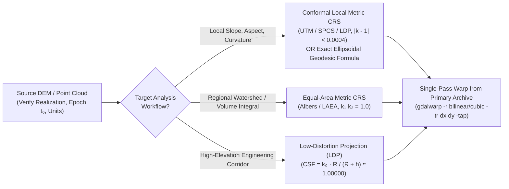

## 2.7 Common Pitfalls & Key Takeaways

In quantitative geomorphology, coastal engineering, and hydrographic charting, coordinate reference system (CRS) errors are uniquely insidious because they rarely cause software to crash. Unlike a corrupted file header or an out-of-memory exception, a missing datum epoch, a silent null-Helmert transformation, or an uncompensated map projection distortion allows a pipeline to execute smoothly and render a visually plausible raster—while embedding systematic meter-level horizontal shifts, decimeter-level vertical biases, or $100\%$ slope and area errors directly into the physics.

This section examines five canonical geodetic and cartographic failure modes that routinely corrupt terrestrial and bathymetric Digital Elevation Models (DEMs), and synthesizes Chapter 2 into an operational verification framework and automated pre-flight audit.

---

### 2.7.1 Detailed Case Studies of Geodetic and Projection Failure Modes

#### Pitfall 1: The "Generic WGS84 (`EPSG:4326`)" Ensemble Trap and Null-Transform Datum Shifts

* **Physical & Geodetic Mechanism:** Analysts routinely treat `EPSG:4326` ("WGS 84") as a single, centimeter-accurate, static reference frame, and assume that North American Datum of 1983 (`NAD83(2011)`, `EPSG:6318`) or European Terrestrial Reference System 1989 (`ETRS89`, `EPSG:4258`) are practically identical to it. In reality, `EPSG:4326` references an OGC/ISO **Datum Ensemble** (`EPSG:6326`) aggregating seven GPS realizations (`G730`, `G873`, `G1150`, `G1674`, `G1762`, `G2139`, and `G2296`) alongside the original 1987 Transit-Doppler realization, carrying an intrinsic ensemble uncertainty of $\sigma_{\text{ensemble}} \approx 1.5\text{–}2.0\text{ m}$. Worse, when legacy PROJ.4 strings or GeoTIFF headers lack explicit datum transformation grids or dynamic epochs, software defaults to a silent "null transformation" ($\Delta X = \Delta Y = \Delta Z = 0$), equating plate-fixed NAD83 with Earth-centered WGS84/ITRF.
* **Governing Equations:** Because the NAD83 geocenter is offset by $\sim 2.2\text{ m}$ from the ITRF2020/WGS84(G2296) geocenter and rotates with the North American tectonic plate at $\sim 1.5\text{–}2.5\text{ cm/yr}$, a physical benchmark in continental North America experiences a systematic 3D coordinate offset $\delta \mathbf{x} = \mathbf{x}_2 - \mathbf{x}_1 = (\delta E, \delta N, \delta h)^T$ of $\|\delta \mathbf{x}_{\text{horiz}}\| \approx 1.2\text{–}2.2\text{ m}$ horizontally and $\delta h \approx -0.4\text{ to }-1.3\text{ m}$ in ellipsoidal height. When a second survey $\hat{z}_2$ shifted by $(\delta E, \delta N, \delta h)$ is differenced against a baseline DEM $\hat{z}_1$ to compute a DEM of Difference ($\text{DoD} = \hat{z}_2 - \hat{z}_1$), the feature at true position $(E - \delta E, N - \delta N)$ is placed at $(E, N)$, so $\delta \mathbf{x}_{\text{horiz}} = (\delta E, \delta N)^T$ couples with the local terrain gradient $\nabla z = (\partial z/\partial E, \partial z/\partial N)^T = -\|\nabla z\|[\sin\alpha_{\text{aspect}}, \cos\alpha_{\text{aspect}}]^T$ via first-order Taylor expansion (Nuth & Kääb, 2011) to induce a **false vertical change artifact**:
  $$
  \delta z_{\text{apparent}}(E, N) = z(E - \delta E, N - \delta N) + \delta h - z(E, N) \approx -\left(\frac{\partial z}{\partial E}\delta E + \frac{\partial z}{\partial N}\delta N\right) + \delta h = +\|\nabla z\| \|\delta \mathbf{x}_{\text{horiz}}\| \cos(\alpha_{\text{aspect}} - \alpha_{\text{shift}}) + \delta h
  $$
  where $\alpha_{\text{aspect}}$ is the terrain downslope aspect azimuth (clockwise from North) and $\alpha_{\text{shift}} = \operatorname{atan2}(\delta E, \delta N)$ is the azimuth of the coordinate offset vector.
* **Worked Numerical Case:** A coastal engineering team differences a 2016 airborne LiDAR and multibeam baseline DEM compiled in `NAD83(2011) epoch 2010.00` against a 2024 drone-LiDAR and multibeam survey processed via global PPP-GNSS in `ITRF2020 / WGS84(G2296) epoch 2024.50`, but exports the 2024 grid tagged simply as `EPSG:4326`. In central California ($\varphi = 36^\circ\text{ N}, \lambda = 122^\circ\text{ W}$), the horizontal coordinate offset $\mathbf{x}_{\text{ITRF2020}} - \mathbf{x}_{\text{NAD83(2011)}}$ at epoch 2024.50 is $\|\delta \mathbf{x}_{\text{horiz}}\| = 1.68\text{ m}$ toward $\alpha_{\text{shift}} = 308^\circ\text{ NW}$, with an ellipsoidal height offset of $\delta h = -0.82\text{ m}$.
  * Along a coastal headland and submarine canyon with walls sloping at $\beta = 35^\circ$ ($\|\nabla z\| = \tan 35^\circ = 0.700$), the southeast-facing canyon wall ($\alpha_{\text{aspect}} = 128^\circ\text{ SE}$, opposite to $\alpha_{\text{shift}} = 308^\circ\text{ NW}$ so $\cos 180^\circ = -1$) experiences a slope-coupled vertical shift of $+\|\nabla z\|\|\delta \mathbf{x}_{\text{horiz}}\|\cos(180^\circ) = -0.700 \times 1.68\text{ m} = -1.176\text{ m}$. Combined with $\delta h = -0.82\text{ m}$, the DoD displays a **$-2.00\text{ m}$ false erosion signal** across the entire stable SE-facing flank, while the opposing NW-facing wall ($\alpha_{\text{aspect}} = 308^\circ\text{ NW}$, $\cos 0^\circ = +1$) displays $+1.176 - 0.82 = +0.36\text{ m}$ of false deposition—creating a classic aspect-dependent dipole artifact that masks true geomorphic change.
* **Remediation & Operational Verification:** Never tag high-resolution ($<5\text{ m}$) LiDAR or multibeam datasets with generic `EPSG:4326`. Always assign the specific dynamic realization code (e.g., `EPSG:9057` for WGS 84 (G2139), `EPSG:10606` for WGS 84 (G2296), `EPSG:9989` for ITRF2020, or `EPSG:6318` for NAD83(2011)) and store the coordinate epoch $t_0$ in WKT2 `COORDINATEMETADATA[... EPOCH[2024.5]]`, executing time-dependent 14-parameter Helmert or deformation-grid transformations via `proj` / `cct`.

> [!WARNING]
> **Beware Silent Null Transforms in Legacy GIS Pipelines:** When transforming between `EPSG:4269` (NAD83) and `EPSG:4326` (WGS 84) without specifying realizations or epochs, PROJ selects a ballpark transformation with $\pm 2\text{ m}$ accuracy and zero coordinate shift (`+towgs84=0,0,0`). Always run `projinfo -s <SRC_CRS> -t <TGT_CRS> --spatial-test intersects` prior to `gdalwarp` or `pdal translate` to verify that a non-zero Helmert or NADCON/HTDP grid operation is actually being applied.

---

#### Pitfall 2: Computing Slope and Area on Unprojected Geographic (`EPSG:4326`) or Web Mercator (`EPSG:3857`) Grids

* **Physical & Mathematical Mechanism:** Finite-difference terrain analysis tools (such as Horn's $3\times 3$ slope operator in `gdaldem slope`, `scipy.ndimage`, or standard GIS toolboxes) compute partial derivatives $\partial z/\partial x$ and $\partial z/\partial y$ by dividing vertical elevation differences (in meters) by the horizontal grid spacing $\Delta x, \Delta y$ read from the GeoTransform header. Two pervasive failure modes occur:
  1. **Unprojected Geographic Grids (`EPSG:4326`):** The grid spacing is stored in angular degrees ($\Delta\lambda_{\text{deg}}, \Delta\varphi_{\text{deg}}$), while $z$ is in meters. Feeding raw angular increments into a planar operator produces ridiculous $\sim 89.999^\circ$ slopes. Even when a user supplies a single scalar conversion factor (e.g., `gdaldem slope -s 111120`), one scalar cannot correct for meridional convergence, because east-west metric spacing shrinks with latitude as $\Delta x = \frac{\pi}{180}N(\varphi)\cos\varphi\,\Delta\lambda_{\text{deg}}$ while north-south metric spacing grows slightly as $\Delta y = \frac{\pi}{180}M(\varphi)\,\Delta\varphi_{\text{deg}}$.
  2. **Spherical Web Mercator (`EPSG:3857`):** Web Mercator projects ellipsoidal coordinates $(\varphi, \lambda)$ onto a cylinder using spherical formulas (creating a non-conformal anisotropy $h_{\text{scale}}/k_{\text{scale}} = (1 - e^2\sin^2\varphi)/(1 - e^2) \approx 1.0067$ at the Equator) and stretches both east-west and north-south grid coordinates by the local scale factor $k(\varphi) \approx \sec\varphi = 1/\cos\varphi$. Because horizontal coordinate increments $\Delta X_{\text{3857}}, \Delta Y_{\text{3857}}$ are inflated by $\sec\varphi$ while vertical elevations $z$ remain unscaled, planar slope is underestimated by $\cos\varphi$ and horizontal cell area is inflated by $\sec^2\varphi$.
* **Governing Equations:** On an ellipsoid with prime-vertical radius $N(\varphi)$ and meridional radius $M(\varphi)$, applying a scalar degree-to-meter factor $S_0 = 111{,}120\text{ m/deg}$ to an `EPSG:4326` grid distorts the east-west gradient component by $\cos\varphi$:
  $$
  \left(\frac{\partial z}{\partial x}\right)_{\text{scalar 4326}} = \frac{\Delta z}{S_0 \Delta\lambda_{\text{deg}}} \approx \cos\varphi \left(\frac{\partial z}{\partial x}\right)_{\text{true}}, \quad \tan\theta_{\text{aspect, scalar}} = \cos\varphi \tan\theta_{\text{aspect, true}}
  $$
  On a Web Mercator (`EPSG:3857`) grid, both horizontal axes are inflated by $k(\varphi) \approx \sec\varphi$, causing the computed slope magnitude $\|\nabla_{\text{3857}} z\|$ and integrated watershed/dredge area $A_{\text{3857}}$ to err by:
  $$
  \|\nabla_{\text{3857}} z\| = \frac{\|\nabla_{\text{true}} z\|}{k(\varphi)} \approx \cos\varphi \|\nabla_{\text{true}} z\|, \qquad A_{\text{3857}} = \iint_{\Omega} k^2(\varphi)\,dx\,dy \approx \sec^2\varphi \, A_{\text{true}}
  $$
* **Worked Numerical Case:** Consider a submarine fjord wall or alpine avalanche chute in southern Alaska or Norway at latitude $\varphi = 60^\circ\text{ N}$ ($\cos 60^\circ = 0.500$, $\sec 60^\circ = 2.000$) with a true physical slope of $\beta_{\text{true}} = 30.0^\circ$ ($\|\nabla_{\text{true}} z\| = \tan 30^\circ = 0.5774$) oriented due East ($\theta_{\text{aspect}} = 90^\circ$) over a true drainage basin area of $A_{\text{true}} = 10.0\text{ km}^2$:
  * **In `EPSG:3857` (Web Mercator):** The horizontal grid spacing is inflated by $2.00\times$. A planar slope tool computes $\|\nabla_{\text{3857}} z\| = 0.500 \times 0.5774 = 0.2887$, reporting a **false slope of $\beta_{\text{3857}} = \arctan(0.2887) = 16.1^\circ$** (underestimating the slope angle by nearly half and potentially misclassifying an unstable avalanche or submarine slump slope as stable). Simultaneously, the watershed area is reported as **$A_{\text{3857}} = \sec^2(60^\circ) \times 10.0\text{ km}^2 = 40.0\text{ km}^2$**—a **$300\%$ area inflation** ($4\times$ true area).
  * **In `EPSG:4326` with `-s 111120`:** A slope oriented at true azimuth $45^\circ\text{ NE}$ ($\partial z/\partial x = \partial z/\partial y$) has its east-west gradient halved relative to its north-south gradient, rotating the computed aspect by $\Delta\theta = 45^\circ - \arctan(0.5) = 18.4^\circ$ toward the meridian.
* **Remediation & Operational Verification:** Never compute terrain derivatives or surface integrals in `EPSG:3857` or unscaled `EPSG:4326`. Either reproject the DEM to a local conformal zone with minimal scale distortion (e.g., UTM, State Plane, or Polar Stereographic where $|k - 1| < 4\times 10^{-4}$) for slope/aspect, an equal-area projection (e.g., Albers Equal-Area Conic) for basin area integration, or evaluate exact ellipsoidal geodesic distances $(M(\varphi)\Delta\varphi, N(\varphi)\cos\varphi\Delta\lambda)$ at every grid row.

---

#### Pitfall 3: U.S. Survey Foot vs. International Foot Shifts and Ground-to-Grid Scale Neglect

* **Physical & Engineering Mechanism:** Civil engineering, mining, municipal utility, and port dredging surveys in the United States frequently operate in State Plane Coordinate Systems (SPCS) or local plant grids with large false eastings ($E_0 = 2{,}000{,}000\text{ ft}$ to $6{,}561{,}666.67\text{ ft}$) and elevations well above (or ocean depths well below) the reference ellipsoid. Two classic engineering errors occur:
  1. **Foot Unit Ambiguity:** Confusing the legacy **U.S. Survey Foot** ($1\text{ ft}_{\text{US}} = \frac{1200}{3937}\text{ m} \approx 0.3048006096\text{ m}$, officially deprecated by NIST/NGS at the end of 2022) with the **International Foot** ($1\text{ ft}_{\text{int}} = 0.3048\text{ m}$ exactly), or misconverting legacy hydrographic smooth-sheet soundings recorded in U.S. survey fathoms ($6\text{ ft}_{\text{US}}$). Although the fractional difference is only $2.000004\text{ ppm}$ ($2\text{ mm/km}$), multiplying a large State Plane false easting or northing by the wrong conversion factor shifts the entire DEM horizontally by meters.
  2. **Ground-vs.-Grid Scale Factor Neglect:** High-elevation construction corridors (e.g., Rocky Mountain highways at $h = 2{,}500\text{ m}$ or Andean mine sites at $h = 4{,}000\text{ m}$) often use ground-scaled total-station CAD designs without applying the **Combined Scale Factor (CSF)** to convert between curved ground distances at elevation $h$ and projected grid distances on the ellipsoid. Conversely, in deep-ocean multibeam and AUV surveys at abyssal depths ($d = 4{,}000\text{–}6{,}000\text{ m}$, so $h \approx -d < 0$), the elevation factor $k_{\text{elev}} = R_\alpha/(R_\alpha - d) \approx 1 + d/R_\alpha > 1$ stretches seabed acoustic/DVL baselines relative to ellipsoid distances by $+628\text{ to }+942\text{ ppm}$ ($0.63\text{–}0.94\text{ m/km}$).
* **Governing Equations:** The horizontal coordinate error $\Delta E_{\text{foot}}$ (in meters) introduced when a coordinate $E_{\text{ft}}$ (in feet) is converted using the wrong foot definition is:
  $$
  \Delta E_{\text{foot}} = E_{\text{ft}} \left(\frac{1200}{3937} - 0.3048\right) = E_{\text{ft}} \times 6.096012 \times 10^{-7}\text{ m/ft}
  $$
  Similarly, the ratio of a horizontal grid distance $D_{\text{grid}}$ on a map projection with point scale factor $k(\varphi,\lambda)$ to the horizontal ground/seabed distance $D_{\text{ground}}$ at ellipsoidal height $h$ above local Earth radius of curvature $R_\alpha$ is the Combined Scale Factor:
  $$
  \text{CSF} = k(\varphi, \lambda) \cdot k_{\text{elev}}(h) = k(\varphi, \lambda) \left(\frac{R_\alpha}{R_\alpha + h}\right) \approx k(\varphi, \lambda)\left(1 - \frac{h}{R_\alpha}\right)
  $$
* **Worked Numerical Case:**
  * **Case 3A (State Plane Foot Shift):** An airborne LiDAR DEM is delivered in California State Plane Zone 5 (`NAD83 / California zone 5 (ftUS)`, `EPSG:2229`), where the false easting is $E_0 = 6{,}561{,}666.67\text{ ft}$ ($2{,}000{,}000\text{ m}$) and the false northing is $N_0 = 1{,}640{,}416.67\text{ ft}$ ($500{,}000\text{ m}$). A GIS script overrides the unit as International Feet (`0.3048 m`). At the project site ($E = 6{,}600{,}000\text{ ft}, N = 1{,}800{,}000\text{ ft}$), the DEM is shifted horizontally by:
    $$
    \Delta E = 6{,}600{,}000 \times 6.096012\times 10^{-7} = 4.023\text{ m}, \quad \Delta N = 1{,}800{,}000 \times 6.096012\times 10^{-7} = 1.097\text{ m}
    $$
    producing a **$4.17\text{ m}$ total horizontal displacement** ($\|\Delta \mathbf{x}\| = \sqrt{4.023^2 + 1.097^2}$), misaligning floodwalls, bridge piers, and utility trenches by more than a traffic lane.
  * **Case 3B (Ground-vs.-Grid Scaling):** A $10.0\text{ km}$ highway corridor in Colorado lies at $h = 2{,}600\text{ m}$ near the central meridian of a UTM zone ($k \approx 0.99960$, $R_\alpha \approx 6{,}371{,}000\text{ m}$). The elevation factor is $k_{\text{elev}} = \frac{6371000}{6373600} = 0.999592$, yielding $\text{CSF} = 0.99960 \times 0.999592 = 0.999192$ ($-808\text{ ppm}$). Over the $10\text{ km}$ corridor, unscaled ground CAD coordinates diverge from the UTM LiDAR DEM by **$10{,}000\text{ m} \times 8.08\times 10^{-4} = 8.08\text{ m}$** unless a Low-Distortion Projection (LDP) or explicit CSF origin is defined.

---

#### Pitfall 4: Axis-Order Inversion (`Lat, Lon` vs. `Lon, Lat` and `NED` vs. `ENU`) After PROJ 6+ and WKT2

* **Physical & Software Mechanism:** Prior to 2019 (PROJ.4 era), most open-source geospatial software ignored official geodetic authority axis orders and forced every coordinate tuple into $(x, y) = (\text{Longitude}, \text{Latitude}) = (\text{Easting}, \text{Northing})$ order. With the adoption of ISO 19111 / OGC WKT2:2019 in PROJ 6+ (`PROJ RFC 1`, 2018) and GDAL 3+ (`GDAL RFC 73`, 2019), coordinate operations strictly honor the authority-defined axis order: `EPSG:4326` and `EPSG:4269` are explicitly $(\text{Latitude }\varphi, \text{Longitude }\lambda)$, and numerous national projected systems (e.g., Gauss-Krüger zones, South African Lo, and certain Nordic/Austrian/Japanese grids) are $(\text{Northing }N, \text{Easting }E)$. A parallel 3D topocentric trap occurs when hydrographic multibeam or aerospace INS point clouds ordered in North–East–Down $(N, E, D)$ (positive-down depth $D$) are ingested into terrestrial GIS tools expecting East–North–Up $(E, N, U)$ (positive-up elevation $U$).
* **Impact on DEM Pipelines:** When a Python script, PDAL filter, or custom C++ ingestion tool passes `(lon, lat)` tuples to an authority-compliant `pyproj.Transformer` without `always_xy=True` (or swaps columns when parsing ASCII XYZ soundings), the horizontal coordinates are reflected across the diagonal $\varphi = \lambda$ (or $E = N$).
  * For a bathymetrist surveying the northern Gulf of Mexico at $(\varphi = 28.5^\circ\text{ N}, \lambda = -90.5^\circ\text{ W})$, passing `(-90.5, 28.5)` into a strict `EPSG:4326` transformer causes an immediate domain error ($|\varphi| > 90^\circ$). Worse, in the Red Sea or Persian Gulf where both $|\varphi| < 90^\circ$ and $|\lambda| < 90^\circ$—such as $(\varphi = 27.0^\circ\text{ N}, \lambda = 34.5^\circ\text{ E})$—an axis swap silently teleports the bathymetric DEM to $(\varphi = 34.5^\circ\text{ N}, \lambda = 27.0^\circ\text{ E})$ in the Aegean Sea, or transposes the raster rows and columns during gridding. If an $(N, E, D)$ hydrographic dataset is read as $(E, N, U)$, the survey is simultaneously mirrored across the $45^\circ$ NE diagonal and inverted vertically so that submarine canyons become mountain ridges.
* **Remediation & Operational Verification:** Explicitly enforce axis mapping strategies in code (`always_xy=True` in PyPROJ; `srs.SetAxisMappingStrategy(osr.OAMS_TRADITIONAL_GIS_ORDER)` in GDAL/OSR; or use `OGC:CRS84`, which is authority-defined as Longitude-first `Lon, Lat`), and verify topocentric $(E,N,U)$ vs. $(N,E,D)$ conventions before gridding.

---

#### Pitfall 5: Chained Raster Reprojections, Nearest-Neighbor Striping, and Shoal-Bias Attenuation

* **Physical & Spectral Mechanism:** Three resampling errors routinely degrade gridded DEMs and bathymetric surfaces during coordinate transformations:
  1. **Nearest-Neighbor Resampling (`-r near`) of Continuous Elevation Surfaces:** Because `gdalwarp` defaults to nearest-neighbor interpolation when `-r` is omitted, reprojecting or rotating a continuous DEM by a small grid-convergence angle $\gamma$ (e.g., $\gamma \approx 1^\circ\text{–}3^\circ$ between UTM and State Plane or geographic grids) duplicates some source pixels and skips others at a regular beat period $L_{\text{beat}} = \Delta x / \sin|\gamma|$. While the elevation raster $z(x,y)$ looks deceptively normal to the naked eye, its first derivative (slope $\|\nabla z\|$) and second derivative (curvature $\nabla^2 z$) exhibit severe **crisscross "plaid" or "corduroy" striping**, and D8 hydrological flow direction algorithms trap water in hundreds of artificial single-pixel pits along the beat lines.
  2. **Chained Reprojections ($A \to B \to C$):** Each bilinear or cubic resampling step applies a spatial convolution kernel $w(\mathbf{x})$ with effective smoothing variance $\sigma_k^2 \propto \Delta x^2$. Chaining $m$ sequential reprojections convolves the kernels ($w_{\text{total}} = w_1 * w_2 * \dots * w_m$), compounding the effective smoothing variance as $\sigma_{\text{total}}^2 = \sum_{i=1}^m \sigma_i^2$. In the wavenumber domain $\mathbf{k} = (k_x, k_y)$, the spectral transfer function decays as $H_{\text{total}}(\mathbf{k}) = \prod_{i=1}^m H_i(\mathbf{k}) \approx \exp\left(-\frac{1}{2}|\mathbf{k}|^2 \sum_{i=1}^m \sigma_i^2\right)$, progressively attenuating sharp levee crowns, riverbank breaklines, and bathymetric sandwave crests.
  3. **Bathymetric Shoal-Bias Attenuation Under Continuous Warping:** In safety-of-navigation hydrography (IHO S-44 / S-102 and NOAA HSSD), gridded Bathymetric Attributed Grids (BAGs) must preserve the shallowest shoal depth within each cell. Reprojecting a finished bathymetric grid with `-r bilinear` or `-r cubic` averages sharp rocky pinnacles, boulders, or shipwreck masts with surrounding deeper seafloor, artificially deepening the hazard and violating Under-Keel Clearance (UKC) safety margins.
* **Worked Numerical Case:** A $1.0\text{ m}$ LiDAR DTM is reprojected from UTM (`EPSG:26910`) to State Plane (`EPSG:2227`, grid rotation $\gamma = 1.45^\circ$) using default `gdalwarp` (`-r near`).
  * The beat period of duplicate/skipped pixels is $L_{\text{beat}} = 1.0\text{ m} / \sin(1.45^\circ) = 39.5\text{ m}$. Every $39.5\text{ m}$ across the raster, adjacent pixels share identical elevations ($\Delta z = 0$, zero slope) followed by a double jump ($2\Delta z$, $100\%$ slope spike), completely ruining viewshed, curvature, and overland flow routing.
* **Remediation & Operational Verification:** Always specify `-r bilinear`, `-r cubic`, or `-r cubicspline` (and `-tr <dx> <dy> -tap` to lock target pixel alignment) when warping continuous terrestrial elevation grids; reserve `-r near` strictly for categorical rasters (land cover, classification flags). For navigation-critical bathymetry, transform the primary 3D soundings or CUBE hypotheses directly into the target chart CRS *prior* to shoal-biased gridding (or use minimum-depth/shoal-preserving binning). Never chain raster reprojections: compose the full coordinate transformation pipeline from the primary archive directly to the final target CRS in a single pass.



---

### 2.7.2 Summary Matrix of Geodetic & Projection Failure Modes

| Failure Mode | Root Geodetic / Software Cause | Typical Magnitude of Error | Primary Symptom in DEM & Derivatives | Definitive Remediation |
| :--- | :--- | :--- | :--- | :--- |
| **Generic `EPSG:4326` Ensemble & Null Transform** | Equating NAD83/ETRS89 with WGS84 (`+towgs84=0,0,0`); omitting realization & epoch $t_0$ | $1.2\text{–}2.2\text{ m}$ horizontal shift; up to $\pm 2.5\text{ m}$ false DoD error on steep slopes | Aspect-dependent erosion/deposition bands in multi-temporal DEM differencing ($\delta z \approx -\nabla z \cdot \delta\mathbf{x}$) | Use explicit realization codes (`EPSG:6318`, `EPSG:9989`, `EPSG:10606`), store epoch $t_0$, verify PROJ pipeline with `projinfo` |
| **Unscaled `EPSG:4326` or `EPSG:3857` Slope/Area** | Planar finite differences applied to angular degrees or $\sec\varphi$-inflated Web Mercator meters | Slope error factor $\cos\varphi$ ($50\%$ at $60^\circ$); area inflation $\sec^2\varphi$ ($400\%$ at $60^\circ$) | Severe slope underestimation and watershed/dredge area inflation at mid-to-high latitudes | Reproject to local conformal (UTM/SPCS) for slope, equal-area for area, or use geodesic metric scaling |
| **U.S. Survey Foot vs. International Foot** | Applying $0.3048\text{ m}$ instead of $1200/3937\text{ m}$ ($2\text{ ppm}$ error) to large State Plane false eastings | $1.22\text{ m}$ at $E=2\times 10^6\text{ ft}$; $4.02\text{ m}$ at $E=6.6\times 10^6\text{ ft}$ | Systematic meter-level horizontal offset between DEM and total-station/CAD breaklines | Inspect WKT `LENGTHUNIT` conversion factor to 10+ significant digits; use exact EPSG code |
| **Ground-to-Grid CSF Neglect at High Elevation / Deep Sea** | Ignoring elevation scale factor $k_{\text{elev}} = R_\alpha/(R_\alpha + h)$ in high-altitude or abyssal projects | $400\text{–}900\text{ ppm}$ ($0.4\text{–}0.9\text{ m/km}$) for $|h| = 2{,}500\text{–}6{,}000\text{ m}$ | Progressive horizontal drift across long highway, rail, pipeline, mining, or AUV corridors | Apply Combined Scale Factor ($\text{CSF}$) with explicit project origin or design a custom LDP |
| **PROJ 6+ Axis-Order & `NED`/`ENU` Inversion** | Passing `(lon, lat)` to authority-compliant $(\varphi, \lambda)$ or $(N, E)$ CRS, or mixing $(N,E,D)$ with $(E,N,U)$ | Complete coordinate transposition, vertical sign inversion, or global teleportation | Empty/out-of-bounds rasters, transposed grids, or surveys plotted in the wrong hemisphere | Set `always_xy=True` in PyPROJ, `OAMS_TRADITIONAL_GIS_ORDER` in GDAL, or use `OGC:CRS84` |
| **Nearest-Neighbor Warping & Chained Reprojection** | Omitting `-r bilinear/cubic` in `gdalwarp` or warping $A \to B \to C$ sequentially | Beat-frequency impulse spikes in $\nabla z$ and $\nabla^2 z$; progressive smoothing of breaklines/shoals | Crisscross "plaid" striping in hillshade/slope/curvature; artificial pits; attenuated shoals | Warp continuous DEMs once from primary source with `-r bilinear/cubic -tap`; reproject soundings before shoal gridding |

---

### 2.7.3 Automated Pre-Flight Geodetic Audit & Practitioner Checklist

Whenever horizontal coordinate uncertainty $\sigma_H$ ($1\sigma$ per horizontal axis, where $\sigma_x \approx \sigma_y = \sigma_H$, including unmodeled datum-ensemble spread, missing tectonic epoch drift, or projection scale error) is present in a DEM or bathymetric surface, first-order variance propagation dictates that horizontal positional error leaks directly into the effective vertical error variance $\sigma_{z,\text{eff}}^2$ as a function of the local terrain slope angle $\beta$ ($\|\nabla z\| = \tan\beta$):
$$
\sigma_{z,\text{eff}}^2(x,y) = \sigma_{z,\text{sensor}}^2 + \sigma_{\text{datum},h}^2 + \left(\left(\frac{\partial z}{\partial x}\right)^2 \sigma_x^2 + \left(\frac{\partial z}{\partial y}\right)^2 \sigma_y^2 + 2\frac{\partial z}{\partial x}\frac{\partial z}{\partial y}\operatorname{Cov}(x,y)\right) \approx \sigma_{z,0}^2 + \tan^2\beta \cdot \sigma_H^2
$$
Consequently, even a sub-decimeter LiDAR or multibeam sensor ($\sigma_{z,0} = 0.03\text{ m}$ at $1\sigma$) tagged with a generic `EPSG:4326` ensemble ($\sigma_H \approx 1.5\text{ m}$ at $1\sigma$) suffers an effective vertical standard deviation of $\sigma_{z,\text{eff}} \approx \sqrt{0.03^2 + (\tan 30^\circ \times 1.5)^2} = 0.87\text{ m}$—corresponding to a $95\%$ Total Vertical Uncertainty of $\text{TVU}_{95\%} = 1.96\,\sigma_{z,\text{eff}} = 1.70\text{ m}$ on a $30^\circ$ slope, failing IHO S-44 Exclusive and Special Order and USGS 3DEP QL1/QL2 accuracy specifications solely due to metadata negligence.

Before ingesting any DEM into a terrain analysis, hydrodynamic simulation, or multi-temporal change detection workflow, practitioners should verify the following eight geodetic sign-off gates:

1. **Dynamic Realization & Epoch Verification:** Is the horizontal reference frame defined by an explicit realization code (e.g., `ITRF2020`, `WGS 84 (G2296)`, `NAD83(2011)`) accompanied by a measurement epoch $t_0$, rather than a generic datum ensemble (`EPSG:4326` or `EPSG:4269`)?
2. **Active Transformation Pipeline Inspection:** Has `projinfo -s <SRC> -t <TGT>` confirmed that coordinate conversions apply a valid 14-parameter Helmert or deformation grid (`NADCON5`, `HTDP`, `OSTN15`) rather than a silent ballpark null transform (`+towgs84=0,0,0`)?
3. **Linear Unit & False-Origin Audit:** For engineering and State Plane datasets, has the exact conversion factor in the WKT `LENGTHUNIT` node been checked to distinguish U.S. Survey Feet ($1200/3937\text{ m}$) from International Feet ($0.3048\text{ m}$) before multiplying million-foot false eastings?
4. **Ground-to-Grid Scale Factor Reconciliation:** For high-elevation construction, mining, or transportation corridors ($h > 500\text{ m}$) and deep-ocean benthic surveys ($d > 1{,}000\text{ m}$), has the Combined Scale Factor $\text{CSF} = k(\varphi,\lambda) \cdot R_\alpha/(R_\alpha + h)$ been documented and reconciled between ground-scaled CAD/acoustic designs and grid-scaled DEMs?
5. **Operator-Specific Projection Selection:** Are finite-difference gradient tools ($\nabla z$, slope, aspect, curvature) executed on a local conformal metric grid (or via exact ellipsoidal geodesics), and are regional areal/volumetric integrals executed on an equal-area grid (or weighted by true ellipsoidal cell area $\Delta A(\varphi)$)?
6. **Grid Convergence ($\gamma$) vs. True North Alignment:** When azimuth-dependent quantities (aspect, solar irradiance, acoustic beam pointing, ADCP current vectors) are computed on a projected grid, has the meridian convergence angle $\gamma(\varphi,\lambda)$ been applied to convert between Grid North and Geodetic North?
7. **Authority Axis-Order Enforcement:** Do all custom scripts and ingestion pipelines explicitly enforce axis mapping (`always_xy=True` or `OAMS_TRADITIONAL_GIS_ORDER`) when bridging WKT2 authority definitions with $(x,y)$ raster arrays, and verify $(E,N,U)$ vs. $(N,E,D)$ point-cloud conventions?
8. **Single-Pass Continuous Resampling & Target Alignment:** Are raster reprojections executed in a single pass directly from the primary source using continuous interpolation kernels (`-r bilinear`, `-r cubic`, or `-r cubicspline`) and target-aligned pixel grids (`-tap -tr dx dy`), avoiding nearest-neighbor (`-r near`) derivative striping, chained multi-step warps, and bilinear smoothing of navigation-critical bathymetric shoals?

```python
# Automated Python (PyPROJ + GDAL) pre-flight geodetic audit for DEM rasters
import math
from osgeo import gdal
from pyproj import CRS, Transformer

def audit_dem_geodesy(tif_path: str, reference_crs_str: str | None = None) -> dict:
    ds = gdal.Open(tif_path, gdal.GA_ReadOnly)
    if ds is None:
        raise FileNotFoundError(f"Cannot open raster: {tif_path}")
    wkt = ds.GetProjection()
    if not wkt:
        return {"crs_name": None, "epsg": None, "axis_0": None, "issues": ["CRITICAL: Raster has no CRS/WKT definition."]}
    gt = ds.GetGeoTransform()
    crs = CRS.from_wkt(wkt)
    geod_crs = crs.geodetic_crs if crs.geodetic_crs else crs
    issues = []

    # 1. Check for generic Datum Ensemble (e.g., EPSG:4326 / WGS 84 ensemble in WKT1 or WKT2)
    has_ensemble = (
        getattr(geod_crs, "datum_ensemble", None) is not None
        or (geod_crs.datum is not None and "ensemble" in geod_crs.datum.type_name.lower())
    )
    if has_ensemble:
        issues.append(f"WARNING: CRS '{crs.name}' uses a Datum Ensemble (>1.5 m uncertainty). Specify realization & epoch.")

    # 2. Check for unprojected geographic degrees or Web Mercator (EPSG:3857)
    if crs.is_geographic:
        issues.append("CRITICAL: DEM is in angular geographic units (degrees). Do not run planar slope/curvature without geodesic scaling.")
    elif crs.to_epsg() == 3857:
        lat_mid_rad = math.atan(math.sinh((gt[3] + 0.5 * ds.RasterYSize * gt[5]) / 6378137.0))
        sec_lat = 1.0 / math.cos(lat_mid_rad)
        issues.append(f"CRITICAL: Web Mercator (EPSG:3857) inflates distances by {sec_lat:.2f}x and area by {sec_lat**2:.2f}x at this latitude.")

    # 3. Check for U.S. Survey Foot vs. International Foot at large False Easting
    unit_name = crs.axis_info[0].unit_name.lower() if crs.axis_info else ""
    if "foot" in unit_name or "feet" in unit_name:
        conv = crs.axis_info[0].unit_conversion_factor
        issues.append(f"NOTICE: Foot unit '{unit_name}' (factor={conv:.10f} m/ft). Verify ftUS (0.3048006096) vs ft (0.3048) against survey report.")

    # 4. Verify non-null transformation if comparing against a reference CRS
    if reference_crs_str:
        tg = Transformer.from_crs(crs, CRS.from_user_input(reference_crs_str), always_xy=True)
        desc = (tg.description or "").lower()
        if "ballpark" in desc or tg.accuracy is None or tg.accuracy < 0 or tg.accuracy > 1.0:
            issues.append(f"WARNING: Transformation to {reference_crs_str} has low/unknown accuracy ({tg.accuracy} m) or is a ballpark null transform!")

    return {"crs_name": crs.name, "epsg": crs.to_epsg(), "axis_0": crs.axis_info[0].direction if crs.axis_info else None, "issues": issues}
```

> [!IMPORTANT]
> **Five Golden Rules of DEM Geodesy:**
> 1. **Never Separate Coordinates from Their Realization and Epoch:** A coordinate tuple $(\varphi, \lambda, h)$ on a dynamic Earth is meaningless without its specific reference frame realization and measurement epoch $t_0$ (e.g., `ITRF2020 @ 2024.5` or `NAD83(2011) @ 2010.0`).
> 2. **Verify Transformation Pipelines Explicitly:** Never assume `gdalwarp` or a GIS on-the-fly projection is applying a high-accuracy datum shift; inspect the active PROJ pipeline and grid shift files (`projinfo`) before processing.
> 3. **Match the Projection to the Mathematical Operator:** Use local conformal projections (or exact ellipsoidal geodesics) for gradient operators ($\nabla z$, slope, aspect), equal-area projections for spatial integrals (watershed area, volume), and Low-Distortion Projections (LDPs) when matching ground-level engineering surveys at high elevation.
> 4. **Enforce Explicit Axis Order in All Software:** Always declare `always_xy=True` (or equivalent axis-mapping flags) when bridging WKT2/EPSG definitions with array-based numerical code.
> 5. **Warp Once, With Continuous Kernels, Onto Aligned Grids:** Treat the primary gridded DEM or classified point cloud as an immutable archive; transform directly to the analysis grid in a single pass using bilinear or cubic resampling (`-r bilinear -tap`), and reserve nearest-neighbor strictly for discrete classification masks.
