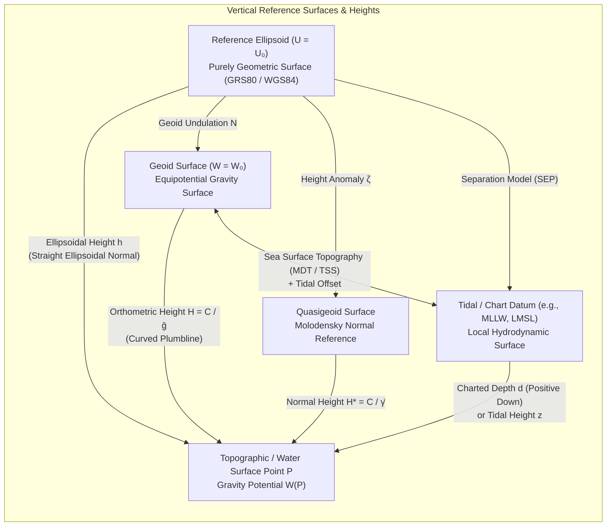

# Chapter 3: Vertical Datums, the Geoid, Tides, and the Shoreline

*Why "height above sea level" and "depth below water" are among the most subtle and error-prone concepts in earth science.*

---

## 3.1 What Are Vertical Datums?

In everyday usage—and in far too many geographic information systems—the third coordinate of a Digital Elevation Model (DEM) is treated as a simple scalar labeled "elevation above sea level" on land or "depth below water" at sea. In physical geodesy and hydrography, however, there is no single universal "sea level," nor does a purely geometric coordinate measured by satellite navigation describe which way water will flow. Because the Earth is a rotating, heterogeneous, deformable body with an irregular interior mass distribution and an ocean surface constantly perturbed by currents, winds, atmospheric pressure, and astronomical tides, defining a rigorous zero-elevation surface requires choosing a **vertical datum**.

A vertical datum is a reference surface of zero elevation (or zero depth) to which heights $z$ (conventionally positive-up on land) or bathymetric depths $d$ (conventionally positive-down in marine charts) are referenced. Vertical datums fall into three fundamentally distinct physical categories:

1. **Geometric (Ellipsoidal) Datums:** Defined by a mathematically smooth, biaxial rotational reference ellipsoid (such as GRS80 or WGS84) fixed to the Earth's center of mass.
2. **Geopotential (Gravity-Related) Datums:** Defined by the Earth's gravity field—either tied to historical spirit-leveling networks anchored at coastal tide gauges or defined directly by a constant value of gravity potential $W_0$ (the **geoid** or **quasigeoid**).
3. **Tidal (Chart) Datums:** Defined locally at the land–sea interface by statistical averages of water-level phases observed over a complete $18.61\text{-year}$ lunar nodal cycle (such as Mean Lower Low Water or Lowest Astronomical Tide).

Failing to distinguish between these three families—or assuming that "zero elevation" in a terrestrial LiDAR dataset coincides with "zero depth" in a multibeam echosounder survey—introduces systematic vertical discontinuities of $0.5\text{ m}$ to over $100\text{ m}$ across a DEM.

---

### 3.1.1 Ellipsoidal Heights ($h$): Why Water Can Flow "Uphill"

Global Navigation Satellite Systems (GNSS), radar altimeters, and spaceborne LiDAR instruments (such as ICESat-2) position sensors within an Earth-Centered, Earth-Fixed (ECEF) Cartesian frame $(X, Y, Z)$ realized by the International Terrestrial Reference Frame (ITRF). When these Cartesian coordinates are converted to curvi-linear geodetic coordinates $(\phi, \lambda, h)$ relative to a reference ellipsoid with semi-major axis $a$ and flattening $f$, the resulting vertical coordinate is the **ellipsoidal height** $h$ (in $\text{m}$): the purely geometric distance measured along the straight surface normal $\hat{\mathbf{n}}$ from the reference ellipsoid to the point of interest $P$.

Because the reference ellipsoid is an idealized geometric surface that ignores mountains, ocean trenches, mantle convection, and crustal density variations, **ellipsoidal height $h$ has no direct physical connection to the Earth's actual gravity field**. Fluid flow on the Earth's surface is governed not by geometric distance from an abstract mathematical ellipsoid, but by gradients of the Earth's gravity potential $W$.

Across areas with strong lateral mass anomalies—such as continental margins, mountain fronts, or subduction zones—the equipotential surface of gravity (the geoid) slopes steeply relative to the reference ellipsoid. The angle between the true plumbline (perpendicular to the equipotential surface) and the ellipsoidal normal is the **deflection of the vertical**, which can reach $20''\text{–}70''$ ($0.1\text{–}0.34\text{ mrad}$, or $10\text{–}34\text{ cm}$ of geoid slope per kilometer). Whenever the spatial gradient of the geoid undulation $\nabla N$ exceeds the hydraulic surface slope $\nabla H$ in the opposite direction, water flows strictly downhill in gravity potential ($W$ decreases, orthometric height $H$ decreases) while simultaneously flowing **uphill in ellipsoidal height** ($h = H + N$ increases).

#### Worked Numerical Example: Water Flowing "Uphill" in Ellipsoidal Height

Consider a low-gradient coastal river reach flowing $20\text{ km}$ southward from Gauge $A$ to Gauge $B$.
* At Gauge $A$ (upstream), the river surface has an orthometric height above the geoid of $H_A = 1.80\text{ m}$, while the local geoid undulation relative to the GRS80 ellipsoid is $N_A = -28.50\text{ m}$.
* At Gauge $B$ ($20\text{ km}$ downstream), the river surface has dropped by $0.40\text{ m}$ in orthometric height to $H_B = 1.40\text{ m}$ (a realistic coastal plain hydraulic gradient of $2\text{ cm}\cdot\text{km}^{-1}$), driving steady downstream flow toward the sea.
* Over the same $20\text{ km}$ southward transect, however, a dense subsurface crustal structure causes the geoid undulation to rise by $0.75\text{ m}$ relative to the ellipsoid (a geoid slope of $3.75\text{ cm}\cdot\text{km}^{-1}$), yielding $N_B = -27.75\text{ m}$.

Computing the GNSS-measured ellipsoidal heights $h = H + N$ at both gauges gives:

$$h_A = H_A + N_A = 1.80\text{ m} + (-28.50\text{ m}) = -26.70\text{ m}$$

$$h_B = H_B + N_B = 1.40\text{ m} + (-27.75\text{ m}) = -26.35\text{ m}$$

Thus, $\Delta h = h_B - h_A = +0.35\text{ m} > 0$: the river flows continuously from $h_A = -26.70\text{ m}$ **uphill** to $h_B = -26.35\text{ m}$ in ellipsoidal height! If a hydrodynamic modeler or GIS analyst routes surface runoff directly across an untransformed GNSS/ICESat-2/InSAR ellipsoidal DEM, water will be routed backward upstream.

---

### 3.1.2 Geopotential Numbers ($C$), Gravity Models, and the Geoid ($N$)

To establish a physically meaningful height system in which water always flows from higher to lower potential energy, geodesy begins with the Earth's scalar **gravity potential** $W(\mathbf{x})$ (in $\text{m}^2\cdot\text{s}^{-2}$, or equivalently $\text{J}\cdot\text{kg}^{-1}$). At any point $\mathbf{x} = (X, Y, Z)$ rotating with the Earth at angular velocity $\omega_e = 7.292115 \times 10^{-5}\text{ rad}\cdot\text{s}^{-1}$, the gravity potential is the sum of the Newtonian gravitational potential $V(\mathbf{x})$ of all terrestrial masses and the centrifugal potential $\Phi(\mathbf{x})$:

$$W(\mathbf{x}) = V(\mathbf{x}) + \Phi(\mathbf{x}) = G \iiint_{\text{Earth}} \frac{\rho(\mathbf{x}')}{\|\mathbf{x} - \mathbf{x}'\|}\,d^3\mathbf{x}' + \frac{1}{2}\omega_e^2 (X^2 + Y^2)$$

where $G = 6.67430 \times 10^{-11}\text{ m}^3\cdot\text{kg}^{-1}\cdot\text{s}^{-2}$ is the Newtonian gravitational constant and $\rho(\mathbf{x}')$ is the 3D density distribution of the Earth ($\text{kg}\cdot\text{m}^{-3}$). Because geodesy defines the gravitational potential $V(\mathbf{x}) > 0$ so that $W(\mathbf{x})$ decreases with increasing elevation, the local gravity vector $\mathbf{g}(\mathbf{x}) = \nabla W(\mathbf{x})$ points **downward** (in the direction of increasing $W$), with magnitude $g = \|\nabla W\|$ (in $\text{m}\cdot\text{s}^{-2}$) and direction defining the downward tangent to the **plumbline**. Surfaces of constant gravity potential, $W(\mathbf{x}) = \text{const}$, are **equipotential (level) surfaces**; at every point, the plumbline is strictly orthogonal to the equipotential surface passing through that point.

#### Geopotential Numbers ($C$)

Let $W_0$ be the gravity potential of a selected reference equipotential surface—the **geoid**—chosen to approximate global mean sea level. In North America, both **NAPGD2022** and **CGVD2013** adopt the IERS Conventions (2010) value $W_0 = 62,636,856.0\text{ m}^2\cdot\text{s}^{-2}$ (whereas the International Height Reference System defined by IAG Resolution No. 1 of 2015 adopts $W_{0,\text{IHRS}} = 62,636,853.4\text{ m}^2\cdot\text{s}^{-2}$, a $-2.6\text{ m}^2\cdot\text{s}^{-2}$ or $\sim 0.265\text{ m}$ offset that must be accounted for in intercontinental comparisons; Sánchez et al., 2016). The fundamental physical measure of "height" of any point $P$ is its **geopotential number** $C(P)$, defined as the work per unit mass required to raise a test mass against gravity from the geoid ($P_0$, where $W(P_0) = W_0$) to $P$:

$$C(P) = W_0 - W(P) = -\int_{P_0}^{P} \mathbf{g} \cdot d\mathbf{s} = \int_{P_0}^{P} g\,dh_{\text{level}}$$

Because $\mathbf{g} = \nabla W$ is a conservative vector field (once time-variable tidal potentials are removed), the line integral $\int_{P_0}^P g\,dh_{\text{level}}$ is path-independent, whereas the purely geometric sum of differential spirit-leveling rod increments $\int_{P_0}^P dh_{\text{level}}$ is **not** path-independent because equipotential surfaces converge toward the poles where gravity $g$ is stronger. While the SI unit of $C(P)$ is $\text{m}^2\cdot\text{s}^{-2}$, geodesists frequently express $C(P)$ in **geopotential units ($\text{gpu}$)**:

$$1\text{ gpu} = 10\text{ m}^2\cdot\text{s}^{-2} \quad \Longrightarrow \quad C_{\text{gpu}}(P) \approx 0.98 \times H_{\text{meters}}(P)$$

Because $g \approx 9.8\text{ m}\cdot\text{s}^{-2}$ near the Earth's surface, the numerical value of $C(P)$ in $\text{gpu}$ is within $\sim 2\%$ of the elevation in meters, but $C(P)$ is an exact measure of potential energy: **two points lie on the same equipotential surface if and only if $C(P_1) = C(P_2)$**.

#### Disturbing Potential ($T$), Geoid Undulation ($N$), and Deflection of the Vertical ($\xi, \eta$)

To compute the geoid mathematically, physical geodesy introduces a **normal gravity field** with potential $U(\mathbf{x})$ generated by a Somigliana–Pizzetti level ellipsoid of revolution having the same total mass $GM$, rotational rate $\omega_e$, and reference potential $U_0 = W_0$ as the real Earth, with normal gravity vector $\boldsymbol{\gamma}(\mathbf{x}) = \nabla U(\mathbf{x})$ and magnitude $\gamma = \|\nabla U\|$. The difference between the actual gravity potential $W(\mathbf{x})$ and the normal gravity potential $U(\mathbf{x})$ is the **disturbing (anomalous) potential** $T(\mathbf{x})$:

$$T(\mathbf{x}) = W(\mathbf{x}) - U(\mathbf{x}) \quad \Longleftrightarrow \quad W(\mathbf{x}) = U(\mathbf{x}) + T(\mathbf{x})$$

*(Note on notation: In potential theory, some texts write $W = U + V$ where $V$ denotes the disturbing potential, or $W = V + \Phi$ where $V$ is gravitational and $\Phi$ is centrifugal potential; throughout this book, we write $W = V + \Phi$ for the total gravity potential and $T = W - U$ for the disturbing potential.)*

Linearizing $W(P_0) = W_0 = U_0$ along the ellipsoidal normal between the ellipsoid surface $Q_0$ and the geoid point $P_0$ yields **Bruns' (1878) formula** for the **geoid undulation (geoid height)** $N$ (in $\text{m}$, positive where the geoid lies above the reference ellipsoid):

$$N(\phi, \lambda) = \frac{T(P_0)}{\gamma_0(\phi)} - \frac{W_0 - U_0}{\gamma_0(\phi)}$$

where $\gamma_0(\phi)$ is normal gravity on the ellipsoid at geodetic latitude $\phi$, and the zero-degree term $(W_0 - U_0)/\gamma_0$ vanishes when $U_0 = W_0$. Globally, $N$ ranges from $-106\text{ m}$ in the Indian Ocean Geoid Low south of Sri Lanka to $+85\text{ m}$ over New Guinea and the North Atlantic.

The horizontal spatial derivatives of $T$ (and thus of $N$) determine the **deflection of the vertical**—the angular tilt between the true plumbline (defined by astronomical latitude $\Phi_{\text{astro}}$ and longitude $\Lambda_{\text{astro}}$) and the ellipsoidal normal (defined by geodetic latitude $\phi$ and longitude $\lambda$). Decomposed into a north–south (meridional) component $\xi$ and an east–west (prime vertical) component $\eta$ (in radians or arcseconds):

$$\xi = \Phi_{\text{astro}} - \phi = -\frac{1}{\gamma_0 M(\phi)}\frac{\partial T}{\partial \phi} \approx -\frac{1}{M(\phi)}\frac{\partial N}{\partial \phi}$$

$$\eta = (\Lambda_{\text{astro}} - \lambda)\cos\phi = -\frac{1}{\gamma_0 N_{\text{curv}}(\phi)\cos\phi}\frac{\partial T}{\partial \lambda} \approx -\frac{1}{N_{\text{curv}}(\phi)\cos\phi}\frac{\partial N}{\partial \lambda}$$

where $M(\phi)$ and $N_{\text{curv}}(\phi)$ are the meridional and prime-vertical radii of curvature of the ellipsoid (Section 2.2). Along any horizontal azimuth $\alpha$ with arc distance $ds$, the rate of change of geoid undulation is given by Helmert's differential relation:

$$\frac{dN}{ds} = -(\xi \cos\alpha + \eta \sin\alpha) = -\Theta_\alpha$$

#### Global and Regional Geopotential Models

Outside the topographic masses, the disturbing potential $T(r, \theta, \lambda)$ satisfies Laplace's equation ($\nabla^2 T = 0$) and is represented globally as a truncated series of fully normalized spherical harmonic coefficients $(\Delta \bar{C}_{nm}, \Delta \bar{S}_{nm})$ up to maximum degree and order $n_{\max}$ (whose formal Stokes' integral and spherical harmonic expansion are derived in Section 3.5). Over the past four decades, global and regional geopotential and geoid models have evolved dramatically in spatial resolution ($\Delta x \approx 180^\circ / n_{\max}$) and accuracy:

* **EGM84 ($n_{\max} = 180$, $\sim 110\text{ km}$ half-wavelength):** Developed by the U.S. Defense Mapping Agency (DMA, 1987) from early satellite tracking, surface gravimetry, and GEOS-3/Seasat altimetry; long-wavelength geoid errors of $1\text{–}2\text{ m}$.
* **EGM96 ($n_{\max} = 360$, $\sim 55\text{ km}$ half-wavelength):** Joint NASA/NIMA/Ohio State model (Lemoine et al., 1998) incorporating TOPEX/Poseidon altimetry and declassified surface gravity; reduced global RMS geoid error to $\sim 0.3\text{–}0.5\text{ m}$ and served as the vertical reference for the original SRTM (2000) mission.
* **EGM2008 ($n_{\max} = 2190$, order $2159$, $\sim 9\text{ km}$ / $5'$ resolution):** Landmark NGA model (Pavlis et al., 2012) combining GRACE satellite gravimetry with a global $5' \times 5'$ terrestrial and altimetric gravity anomaly grid, achieving $\sim 5\text{–}10\text{ cm}$ geoid accuracy across well-surveyed continents.
* **XGM2019e ($n_{\max} = 5540$, $\sim 3.7\text{ km}$ / $2'$ resolution):** Combined satellite (GOCE + GRACE) and terrestrial/topographic/altimetric gravity model (Zingerle et al., 2020), resolving ultra-short-wavelength gravity and deflection signals across steep topography and trenches.
* **USGG2012 vs. Hybrid Geoids (GEOID12B, GEOID18) vs. GEOID2022:** In the United States, NOAA's National Geodetic Survey (NGS) distinguishes between purely **gravimetric geoids**—such as **USGG2012** and **GEOID2022** (which consists of a static $1'\times 1'$ grid **SGEOID2022** plus a time-dependent dynamic component **DGEOID2022** tracking mass changes from GIA and ice/hydrology)—and **hybrid (or "warped") geoid models** such as **GEOID12B** and **GEOID18** (Ahlgren et al., 2020). Hybrid geoids intentionally warp a gravimetric geoid surface using least-squares collocation fitted to thousands of **GPS-on-BenchMarks (GPSBM)** so that $h_{\text{NAD83}} - N_{\text{hybrid}}$ reproduces legacy spirit-leveled **NAVD88** heights rather than the true physical geoid.

---

### 3.1.3 Orthometric ($H$), Normal ($H^*$), and Dynamic ($H^{\text{dyn}}$) Heights

To convert a geopotential number $C(P)$ (in $\text{m}^2\cdot\text{s}^{-2}$) into a metric height with dimension of length ($\text{m}$), $C(P)$ must be divided by a representative value of gravity $G_{\text{ref}}$:

$$\text{Height}(P) = \frac{C(P)}{G_{\text{ref}}} = \frac{W_0 - W(P)}{G_{\text{ref}}}$$

Different choices of the divisor $G_{\text{ref}}$ yield the three classical physical height systems used in national datums and hydrological engineering.

#### 1. Orthometric Height ($H$)

The **orthometric height** $H$ is the geometric distance measured along the curved physical plumbline from the geoid ($P_0$, where $W = W_0$) to the surface point $P$. Because $C(P) = \int_0^H g(z)\,dz$, dividing $C(P)$ by the integral mean value of actual gravity along the plumbline inside the topographic crust, $\bar{g} = \frac{1}{H}\int_0^H g(z)\,dz$, yields:

$$H = \frac{C(P)}{\bar{g}} \quad \Longrightarrow \quad h \approx H + N$$

*(The minute curvature of the plumbline causes the arc length $H$ and the straight ellipsoidal normal $h - N$ to differ by less than $1\text{ mm}$ even underneath Mount Everest.)*

Because gravity $g(z)$ cannot be measured continuously inside solid rock from the geoid up to $P$, $\bar{g}$ must be modeled. The standard **Helmert (1890) orthometric height** (used by NAVD88) applies the Poincaré–Prey gravity reduction, assuming that the topography above the geoid is an infinite horizontal Bouguer slab of constant crustal density $\rho_0 = 2670\text{ kg}\cdot\text{m}^{-3}$ with normal free-air vertical gradient $\partial \gamma / \partial h \approx -0.3086\text{ mGal}\cdot\text{m}^{-1}$ ($-3.086 \times 10^{-6}\text{ s}^{-2}$, so $-\frac{1}{2}\partial \gamma / \partial h \approx +0.1543\text{ mGal}\cdot\text{m}^{-1}$) and Bouguer plate attraction $2\pi G \rho_0 \approx 0.1119\text{ mGal}\cdot\text{m}^{-1}$ ($1.119 \times 10^{-6}\text{ s}^{-2}$):

$$\bar{g}_{\text{Helmert}} = g_P + \left(-\frac{1}{2}\frac{\partial \gamma}{\partial h} - 2\pi G \rho_0\right) H \approx g_P + 0.0424 \times 10^{-5}\text{ s}^{-2}\,H$$

where $g_P$ is the observed surface gravity at $P$ (in $\text{m}\cdot\text{s}^{-2}$) and $H$ is in $\text{m}$. In rugged mountainous terrain (such as the Rockies, Alps, or Andes), neglecting terrain roughness around the plumbline and lateral density departures from $2670\text{ kg}\cdot\text{m}^{-3}$ introduces errors of $5\text{–}25\text{ cm}$ into $H_{\text{Helmert}}$. Modern **rigorous orthometric heights** (e.g., Niethammer, 1932; Tenzer et al., 2005; adopted in NAPGD2022) integrate 3D topographic terrain corrections from high-resolution DEMs and laterally varying crustal density models into $\bar{g}$.

#### 2. Normal Height ($H^*$) and the Quasigeoid ($\zeta$)

To avoid making unverifiable assumptions about crustal rock density inside mountains, Mikhail Molodensky (1945, 1960) reformulated the boundary-value problem of physical geodesy directly on the telluroid/topographic surface without downward continuation through rock. Molodensky's **normal height** $H^*$ divides $C(P)$ by the integral mean **normal gravity** $\bar{\gamma}$ along the ellipsoidal normal from the ellipsoid to the telluroid ($Q$, where $U(Q) = U_0 - C(P)$):

$$H^* = \frac{C(P)}{\bar{\gamma}}, \qquad \bar{\gamma} \approx \gamma_0(\phi)\left[1 - \frac{1 + f + m_{\text{geo}} - 2f\sin^2\phi}{a}H^* + \frac{(H^*)^2}{a^2}\right]$$

where $m_{\text{geo}} = \omega_e^2 a^2 b / (GM) \approx 0.003449786$. Because $\bar{\gamma}$ is computed purely from the analytical reference ellipsoid parameters, $H^*$ is completely free of crustal density hypotheses!

The reference surface located at distance $H^*$ below the topographic surface (or distance $\zeta = h - H^*$ above the ellipsoid) is the **quasigeoid**, and $\zeta$ is the **height anomaly**:

$$\zeta = h - H^* = \frac{T(P)}{\gamma_Q}$$

Over the open oceans ($H = H^* = 0$), the quasigeoid and the geoid coincide identically ($\zeta = N$). On land, because $C(P) = \bar{g}H = \bar{\gamma}H^*$ and $\bar{g} - \bar{\gamma}$ equals the simple Bouguer gravity anomaly $\Delta g_B \approx g_P - \gamma_0 + (0.3086 - 0.1119)\text{ mGal}\cdot\text{m}^{-1}\,H$, the separation between the geoid and quasigeoid is directly proportional to $\Delta g_B$ and elevation $H$:

$$N - \zeta = H^* - H = \frac{\bar{g} - \bar{\gamma}}{\bar{\gamma}}H \approx \frac{\Delta g_B}{\bar{\gamma}}H \quad \Longleftrightarrow \quad \zeta - N = H - H^* \approx -\frac{\Delta g_B}{\bar{\gamma}}H$$

In low-lying coastal plains ($H < 100\text{ m}$), $|H - H^*| < 1\text{ cm}$, but in high mountain ranges where $H > 3000\text{ m}$ and isostatic crustal roots produce strongly negative Bouguer anomalies ($\Delta g_B \approx -200\text{ to }-300\text{ mGal}$), $N - \zeta = H^* - H$ reaches $-0.5\text{ to }-1.5\text{ m}$ (equivalently, $\zeta - N = H - H^*$ reaches $+0.5\text{ to }+1.5\text{ m}$, so the quasigeoid lies above the geoid). Normal heights $H^*$ form the official vertical system of the European Vertical Reference System (EVRS/EVRF2019), Russia, China, and Australia's Australian Vertical Working Surface (AVWS).

#### 3. Dynamic Height ($H^{\text{dyn}}$)

Neither orthometric heights ($H$) nor normal heights ($H^*$) are constant along an equipotential surface! Because normal gravity on the Earth's surface increases by $\sim 0.53\%$ from the equator ($\gamma_e \approx 9.7803\text{ m}\cdot\text{s}^{-2}$) to the poles ($\gamma_p \approx 9.8322\text{ m}\cdot\text{s}^{-2}$), two points $P_1$ (south) and $P_2$ (north) resting on the **exact same level water surface** ($W(P_1) = W(P_2) \implies C(P_1) = C(P_2) = C$) have different mean gravities ($\bar{g}_2 > \bar{g}_1$ and $\bar{\gamma}_2 > \bar{\gamma}_1$). Consequently, the northern shoreline of a large, perfectly level lake at elevated elevation has a **smaller orthometric height** ($H_2 = C/\bar{g}_2 < H_1 = C/\bar{g}_1$) than its southern shoreline.

To ensure that every point on an equipotential surface shares the exact same numerical height, the **dynamic height** $H^{\text{dyn}}$ divides $C(P)$ by a single, spatially constant reference gravity $\gamma_{45^\circ}$ (normal gravity on the ellipsoid at $\phi = 45^\circ$; for GRS80, $\gamma_{45^\circ} = 9.806199203\text{ m}\cdot\text{s}^{-2}$):

$$H^{\text{dyn}} = \frac{C(P)}{\gamma_{45^\circ}}$$

Because $\gamma_{45^\circ}$ is a universal constant, $H^{\text{dyn}}$ is simply a scaled geopotential number: **water between any two points in a hydraulic network flows from higher $H^{\text{dyn}}$ to lower $H^{\text{dyn}}$, and a tranquil lake surface has a strictly constant dynamic height everywhere**. Conversely, dynamic height has no geometric meaning as a distance; a $1.000\text{ m}$ tape-measured vertical rod interval corresponds to slightly less than $1\text{ m}$ of $\Delta H^{\text{dyn}}$ near the equator and slightly more than $1\text{ m}$ near the poles.

#### Worked Numerical Example: Why Orthometric Heights Tilt Across a Level Great Lake

Suppose Lake Michigan–Huron is in hydrostatic equilibrium at an equipotential surface with geopotential number $C = 1725.891\text{ m}^2\cdot\text{s}^{-2}$ ($172.5891\text{ gpu}$).
* Its **dynamic height** everywhere on the lake is constant:
  $$H^{\text{dyn}} = \frac{1725.891\text{ m}^2\cdot\text{s}^{-2}}{9.806199\text{ m}\cdot\text{s}^{-2}} = 176.000\text{ m}$$
* At Chicago, Illinois ($\phi_1 \approx 41.88^\circ\text{ N}$), local mean gravity along the plumbline is $\bar{g}_1 \approx 9.80315\text{ m}\cdot\text{s}^{-2}$, giving an **orthometric height** of:
  $$H_1 = \frac{C}{\bar{g}_1} = \frac{1725.891}{9.80315} = 176.055\text{ m}$$
* At Mackinaw City, Michigan ($\phi_2 \approx 45.78^\circ\text{ N}$, $\sim 430\text{ km}$ north), local mean gravity is higher due to latitude: $\bar{g}_2 \approx 9.80690\text{ m}\cdot\text{s}^{-2}$, giving an **orthometric height** of:
  $$H_2 = \frac{C}{\bar{g}_2} = \frac{1725.891}{9.80690} = 175.987\text{ m}$$

Even though the water surface is at identical geopotential ($C_1 = C_2$), its orthometric height at Mackinaw City is **$6.8\text{ cm}$ lower** ($H_2 - H_1 = -0.068\text{ m}$) than at Chicago! If reservoir release gates or dredging depths across the Laurentian Great Lakes were managed using orthometric heights ($H$) rather than dynamic heights ($H^{\text{dyn}}$), engineers would perceive a fictitious $6.8\text{ cm}$ north-trending water slope where none exists.

---

### 3.1.4 Legacy Spirit-Leveled vs. Modern Gravimetric Vertical Datums

Historically, national vertical datums were constructed via continental networks of differential spirit leveling anchored to coastal tide gauges, whereas twenty-first-century datums define the zero surface directly via a gravimetric geoid model.

* **NGVD29 (National Geodetic Vertical Datum of 1929):** Originally established as the *Sea Level Datum of 1929* (and renamed NGVD29 in 1973), NGVD29 was formed by constraining a continental spirit-leveling adjustment to hold Local Mean Sea Level (LMSL) equal to $0.000\text{ m}$ at **26 coastal tide gauges** (21 in the United States and 5 in Canada). Because LMSL at different coastal gauges does not lie on the same equipotential surface—varying by up to $0.6\text{–}1.0\text{ m}$ due to ocean currents (such as the Gulf Stream), water density/salinity differences, and prevailing winds—forcing all 26 gauges to zero warped the interior leveling network and introduced regional distortions. Furthermore, NGVD29 applied normal orthometric corrections without observed surface gravity $g$.
* **NAVD88 (North American Vertical Datum of 1988):** To eliminate the distortion caused by multiple tide-gauge constraints, NAVD88 (Zilkoski et al., 1992) readjusted $\sim 625,000\text{ km}$ of leveling lines across North America using Helmert orthometric heights minimally constrained to a **single fixed benchmark**: **Father Point / Rimouski**, Quebec ($\phi \approx 48.5^\circ\text{ N}$), at the mouth of the St. Lawrence River. While internally consistent locally, subsequent satellite gravimetry from **GRACE** (2002) and **GOCE** (2009) combined with GPS-on-BenchMarks revealed two major continental flaws in NAVD88:
  1. The equipotential surface passing through Father Point/Rimouski lies approximately **$+0.5\text{ m}$ above** the global mean sea level geoid ($W_0 = 62,636,856.0\text{ m}^2\cdot\text{s}^{-2}$).
  2. Accumulated systematic errors across $4,500\text{ km}$ of transcontinental differential leveling (thermal refraction, rod calibration, and unmodeled crustal motion between survey epochs) imparted a **$\sim 1.5\text{ m}$ systematic tilt from southeast (Florida) to northwest (Pacific Northwest / Canadian Rockies)** relative to a true equipotential surface.
* **CGVD2013, EVRF2019, and NAPGD2022:** Recognizing that passive leveling marks deteriorate, subside, or uplift and cannot be maintained at continental scales without accumulating systematic tilt, geodesy has transitioned to **gravimetric geoid datums** accessed directly via GNSS ($H = h - N$):
  * **CGVD2013 (Canadian Geodetic Vertical Datum of 2013):** Adopted by Natural Resources Canada in November 2013 (Véronneau & Huang, 2016), replacing CGVD28 with the gravimetric geoid model **CGG2013** defined by the equipotential surface $W_0 = 62,636,856.0\text{ m}^2\cdot\text{s}^{-2}$.
  * **EVRS / EVRF2019 (European Vertical Reference Frame 2019):** Realizes normal heights ($H^*$) across Europe tied to the historical *Normaal Amsterdams Peil* (NAP) level, homogenized in the **zero-tide** permanent tide system and corrected for Fennoscandian Glacial Isostatic Adjustment.
  * **NAPGD2022 (North American-Pacific Geopotential Datum of 2022):** Developed by NOAA/NGS in partnership with Canada and Mexico to replace NAVD88, NGVD29, and island vertical datums. Anchored by the **GRAV-D** (Gravity for the Redefinition of the American Vertical Datum) airborne gravimetry campaign—which flew over $1,000,000\text{ km}$ of airborne gravity lines across the U.S., Alaska, and territories to bridge the spectral gap between satellite gravimetry ($>100\text{ km}$) and terrestrial gravity ($<10\text{ km}$)—NAPGD2022 adopts the exact same $W_0 = 62,636,856.0\text{ m}^2\cdot\text{s}^{-2}$ reference potential as CGVD2013 and defines rigorous orthometric heights via $H_{\text{NAPGD2022}} = h_{\text{ITRF2020}} - N_{\text{GEOID2022}}$ with $\sim 1\text{–}2\text{ cm}$ geoid accuracy.

> [!IMPORTANT]
> **Permanent Tide Conventions in Vertical Datums (Tide-Free, Zero-Tide, Mean-Tide)**
> Because the Sun and Moon lie predominantly near the ecliptic plane, their time-averaged gravitational attraction is not zero: it permanently pulls ocean water toward the equator and depresses the polar ocean by $\sim 29\text{ cm}$ relative to the equator. Geodetic datums handle this **permanent tide** in three ways (Ekman, 1989):
> 1. **Mean-Tide System:** Retains both the permanent astronomical attraction and the permanent elastic deformation of the solid Earth (used by oceanographic mean sea level and raw altimetry).
> 2. **Zero-Tide System:** Removes the direct astronomical permanent tide potential from the gravity field while retaining the permanent elastic deformation of the solid crust (recommended by IAG and adopted by EVRF2019, CGVD2013, and NAPGD2022/GEOID2022).
> 3. **Tide-Free (Non-Tidal) System:** Removes both the direct astronomical potential and the modeled elastic response of the solid Earth via Love numbers $k_2, h_2$ (used by ITRF, WGS84, and NAVD88/EGM2008). Neglecting the conversion between tide-free and zero-tide geoid undulations introduces a latitude-dependent vertical bias of up to $\sim 20\text{ cm}$ from equator to pole!

---

### 3.1.5 Dynamic Lake Datums and Tidal (Chart) Datums

#### Dynamic Lake Datums: IGLD85 and IGLD2020

In the binational Laurentian Great Lakes–St. Lawrence River system, water levels, navigation channels, hydropower diversions, and treaty outflows are regulated using dynamic heights ($H^{\text{dyn}} = C/\gamma_{45^\circ}$) referenced to the **International Great Lakes Datum (IGLD)**:

* **IGLD85:** Referenced to the same zero point at Father Point / Rimouski, Quebec, as NAVD88, with benchmark velocities adjusted to the **1985.0 epoch**. Because a large lake is not a perfectly flat geopotential surface when wind setup, barometric gradients, and river-outlet slopes are present, transferring water-level elevations from master lake gauges to individual harbor benchmarks uses **hydraulic correctors** derived from long-term simultaneous summer water-level comparisons.
* **Why IGLD Must Be Updated Every ~30–35 Years (IGLD2020):** The Great Lakes basin is tilting continuously due to **Glacial Isostatic Adjustment (GIA)** following the retreat of the Laurentide Ice Sheet (detailed in Chapter 4). The northeastern outlets of the lakes (e.g., Parry Sound on Lake Huron or Kingston on Lake Ontario) are uplifting at $+1.5\text{ to }+3.5\text{ mm}\cdot\text{yr}^{-1}$, whereas the southwestern shores (e.g., Chicago, Milwaukee, Duluth, Toledo) are subsiding at $-1.0\text{ to }-1.5\text{ mm}\cdot\text{yr}^{-1}$. Over 35 years (1985 to 2020), this differential crustal velocity of up to $4.5\text{ mm}\cdot\text{yr}^{-1}$ tilts individual lake basins by **$10\text{–}16\text{ cm}$**, causing benchmarks at opposite ends of a lake to drift apart in actual water depth. **IGLD2020** replaces spirit leveling with GNSS + **GEOID2022** dynamic heights ($H^{\text{dyn}}_{\text{IGLD2020}}$) tied directly to NAPGD2022 at the 2020.0 reference epoch.

#### Tidal (Chart) Datums and the National Tidal Datum Epoch (NTDE)

In marine navigation and coastal engineering, referencing depths to a static continental geoid ($W_0$) is insufficient and potentially hazardous: mariners need to know the minimum water depth beneath a vessel's keel at low tide, while coastal wetland managers and property surveyors need to know the elevation reached by high tide. **Tidal datums** are local vertical reference surfaces defined by averaging specific phases (extrema) of the astronomical and meteorological tide recorded at coastal tide gauges over a standardized **19-year observation period** known as the **National Tidal Datum Epoch (NTDE)**.

A 19-year window is required because:
1. It spans a full **$18.61\text{-year}$ regression of the Moon's orbital nodes** (which modulates diurnal and semidiurnal tidal amplitudes by $\pm 4\%\text{ to }\pm 11\%$).
2. Having an integral number of calendar years (19) averages out annual and semiannual solar meteorological cycles (seasonal steric heating, monsoon/trade winds, and river discharge).

Because relative sea level is rising globally ($+3\text{ to }+4\text{ mm}\cdot\text{yr}^{-1}$ eustatic plus up to $+5\text{ to }+10\text{ mm}\cdot\text{yr}^{-1}$ of local subsidence along the U.S. Gulf and Mid-Atlantic coasts), NOAA updates the NTDE every 20–25 years—transitioning from the **1983–2001 NTDE** to the **2002–2020 NTDE** (and utilizing 5-year modified epochs in rapidly subsiding regions like coastal Louisiana or uplifting regions like Southeast Alaska).

Ordered from highest water level to lowest water level, the standard tidal datums are:

1. **Highest Astronomical Tide (HAT):** The highest water level predicted to occur under any combination of astronomical gravitational forces over the 18.61-year nodal cycle (excluding meteorological storm surge); used for bridge vertical clearance specifications in many jurisdictions.
2. **Mean Higher High Water (MHHW):** The arithmetic mean of the *higher* high water height of each tidal day observed over the NTDE. Along mixed-tide and diurnal coasts (such as the U.S. Pacific Coast), where the two high tides each day differ significantly, MHHW defines the upper intertidal inundation zone and coastal flooding threshold.
3. **Mean High Water (MHW):** The arithmetic mean of *all* high water heights observed over the NTDE. Under U.S. federal law (*Borax Consolidated, Ltd. v. City of Los Angeles*, 1935) and NOAA charting standards, the intersection of MHW with the land defines the **legal shoreline** and the boundary between private upland and public tidelands in most states (Section 3.3).
4. **Diurnal Tide Level (DTL):** The arithmetic mean of MHHW and MLLW: $\text{DTL} = \frac{1}{2}(\text{MHHW} + \text{MLLW})$.
5. **Mean Tide Level (MTL) / Half-Tide Level:** The arithmetic mean of MHW and MLW: $\text{MTL} = \frac{1}{2}(\text{MHW} + \text{MLW})$.
6. **Local Mean Sea Level (LMSL):** The arithmetic mean of **hourly water-level heights** observed over the 19-year NTDE. Crucially, $\text{LMSL} \neq \text{MTL}$ (and $\text{LMSL} \neq \text{DTL}$) in shallow bays and estuaries because non-linear bottom friction and shallow-water continuity distort the sinusoidal tidal wave, generating asymmetric overtides ($M_4, M_6$) with shorter flood durations and longer ebb durations. Furthermore, $\text{LMSL} \neq \text{Geoid } (W_0)$: the permanent offset between LMSL and the geoid is the **Mean Dynamic Topography ($\text{MDT}$)** (denoted **Topography of the Sea Surface, $\text{TSS}$**, in NOAA VDatum), which varies globally from $-1.5\text{ m}$ to $+1.2\text{ m}$ due to geostrophic boundary currents, salinity/temperature density gradients, and persistent wind stress.
7. **Mean Low Water (MLW):** The arithmetic mean of *all* low water heights observed over the NTDE; formerly the chart datum on the U.S. Atlantic Coast prior to 1980 and still the legal tideland boundary in several Atlantic states (e.g., Massachusetts, Virginia, Delaware).
8. **Mean Lower Low Water (MLLW):** The arithmetic mean of the *lower* low water height of each tidal day observed over the NTDE. Since 1989, MLLW is the official **NOAA Chart Datum** for all nautical charts and hydrographic bathymetric surveys across the United States and its territories, as well as the normal baseline for maritime zones under UNCLOS.
9. **Lowest Astronomical Tide (LAT):** The lowest water level predicted to occur under any combination of astronomical conditions over the 18.61-year nodal cycle. Recommended by the International Hydrographic Organization (IHO Resolution 3/1919) and adopted as the official **Chart Datum** by the UK Hydrographic Office (UKHO), the Canadian Hydrographic Service (CHS, as LLWLT/LAT), Australia, and most international hydrographic offices.

| Vertical Datum / Height System | Category | Zero Reference Definition | Vertical Coordinate & Metric | Spatial Behavior of Zero Surface | Primary Domain & Example Realizations |
| :--- | :--- | :--- | :--- | :--- | :--- |
| **Ellipsoidal ($h$)** | Geometric | Surface of biaxial reference ellipsoid ($a, f$) | $h$ ($\text{m}$, straight normal); positive-up | Purely mathematical; cuts across gravity equipotentials by $\pm 100\text{ m}$ | GNSS positioning, ICESat-2, InSAR, ERS hydrography (ITRF2020, WGS84, NAD83) |
| **Orthometric ($H$)** | Geopotential | Geoid ($W(\mathbf{x}) = W_0$) or fixed tide-gauge benchmark | $H = C / \bar{g}$ ($\text{m}$, curved plumbline); positive-up | Equipotential surface ($C=0$), except where legacy leveling tilts or $g(\phi)$ varies for $H>0$ | Terrestrial topographic DEMs, engineering, flood mapping (NAVD88, CGVD2013, NAPGD2022) |
| **Normal ($H^*$)** | Geopotential | Quasigeoid ($\zeta = h - H^*$ above ellipsoid) | $H^* = C / \bar{\gamma}$ ($\text{m}$, density-hypothesis-free); positive-up | Coincides with geoid over oceans; $N - \zeta \approx \Delta g_B H / \bar{\gamma}$ in mountains | Continental topography in Europe, Eurasia, Australia (EVRF2019, AVWS, Baltic 1977) |
| **Dynamic ($H^{\text{dyn}}$)** | Geopotential | Reference equipotential scaled by constant $\gamma_{45^\circ}$ | $H^{\text{dyn}} = C / \gamma_{45^\circ}$ ($\text{m}$); exact scalar potential | Strictly constant on every equipotential level surface at any latitude | Large lakes, binational canal/hydropower networks (IGLD85, IGLD2020) |
| **Local Mean Sea Level (LMSL)** | Tidal | 19-year NTDE mean of hourly water levels | $z_{\text{LMSL}}$ ($\text{m}$); local hydrodynamic mean | Departures from geoid = Mean Dynamic Topography ($\text{MDT/TSS}$, $\pm 1\text{ m}$) | Climate sea-level trends, intermediate bridge between geoid and chart datums |
| **MHW / MHHW** | Tidal | 19-year NTDE mean of all / daily-higher high waters | $z_{\text{MHW}}, z_{\text{MHHW}}$ ($\text{m}$); spatially varying | Slopes with tidal range ($\text{MHW} - \text{LMSL} \approx \frac{1}{2}\text{Range}$); expands up funnel bays | Legal U.S. shoreline (MHW), marsh ecology, bridge clearance, nuisance flood datums |
| **MLLW / LAT** | Tidal (Chart) | 19-year NTDE mean of daily-lower low water (MLLW) or lowest astronomical tide (LAT) | Charted depth $d$ ($\text{m}$, positive-down) or $z$ (positive-up) | Slopes steeply relative to geoid; drops by $0.5\text{–}8\text{ m}$ below LMSL in macrotidal bays | Nautical charting, hydrographic surveys, dredging, UNCLOS baseline (NOAA MLLW, IHO/UKHO LAT) |

> [!WARNING]
> **Tidal Datums Are Spatially Warped, Non-Equipotential Surfaces**
> Unlike the geoid ($W = W_0$), a tidal datum such as **MLLW**, **LAT**, or **MHW** is **not** a level equipotential surface! Because the tidal range $\text{MHHW} - \text{MLLW}$ varies from $<0.3\text{ m}$ in microtidal basins (e.g., the Gulf of Mexico or Mediterranean Sea) to $>12\text{ m}$ in resonant macrotidal estuaries (e.g., the Bay of Fundy, Bristol Channel, or Cook Inlet), the MLLW surface slopes steeply downward relative to the geoid as tidal range increases, and converges toward the local river bed upstream in tidal rivers as tidal wave energy damps out. Subtracting or merging bathymetric grids referenced to MLLW with terrestrial DEMs referenced to NAVD88 or NAPGD2022 without a spatially varying datum transformation grid (Section 3.2) creates an artificial vertical cliff of $0.5\text{ m}$ to $>5\text{ m}$ right along the coastline.

> [!TIP]
> **Key Takeaways for DEM Practitioners**
> 1. **Never route water on ellipsoidal heights ($h$):** Always transform GNSS, InSAR, or ICESat-2 ellipsoidal elevations to an orthometric ($H$), normal ($H^*$), or dynamic ($H^{\text{dyn}}$) height system via an appropriate geoid/quasigeoid model before computing slope, aspect, or hydrological flow accumulation.
> 2. **Match the geoid model to the target vertical datum:** Use a **hybrid geoid** (such as GEOID18, `us_noaa_g2018u0.tif` in PROJ/GDAL) *only* when converting NAD83(2011) ellipsoidal heights to legacy spirit-leveled **NAVD88** heights (`EPSG:5703`); use a **gravimetric geoid** (such as CGG2013 or GEOID2022) when working in modern geopotential datums (`EPSG:6647` for CGVD2013, or NAPGD2022).
> 3. **Propagate vertical datum and geoid uncertainty into Total Vertical Uncertainty (TVU):** When deriving orthometric heights ($H = h - N$) or ellipsoidally referenced bathymetry, combine sensor/GNSS ellipsoidal variance $\sigma_h^2$ and geoid/datum separation variance $\sigma_N^2$ in quadrature ($\sigma_H = \sqrt{\sigma_h^2 + \sigma_N^2}$, yielding $95\%$ confidence linear error $\text{LE}_{95} = \text{TVU}_{95} = 1.96\,\sigma_H$) as required by USGS 3DEP Lidar Base Specifications, ASPRS Positional Accuracy Standards, IHO S-44, and NOAA HSSD (see Section 3.2).
> 4. **Account for sign and datum conventions across the coast:** Always verify whether vertical coordinates represent elevation $z$ (positive-up) or depth $d$ (positive-down, e.g., `EPSG:5866` for MLLW depth), and record the exact vertical CRS, permanent tide convention, and epoch (e.g., `NAVD88`, `NAPGD2022 (2020.0)`, `IGLD2020`, or `MLLW (2002–2020 NTDE)`) in dataset metadata.

---

### References

* Ahlgren, K., Scott, G., & Shaw, B. (2020). *NOAA Technical Report NOS NGS 72: GEOID18*. Silver Spring, MD: National Geodetic Survey.
* Bruns, H. (1878). *Die Figur der Erde: Ein Beitrag zur europäischen Gradmessung*. Berlin: Publikation des Königl. Preussischen Geodätischen Instituts.
* Defense Mapping Agency (DMA). (1987). *Department of Defense World Geodetic System 1984: Its Definition and Relationships with Local Geodetic Systems* (DMA Technical Report 8350.2). Washington, DC: DMA.
* Ekman, M. (1989). Impacts of geodynamic phenomena on systems for height and gravity. *Bulletin Géodésique*, 63(3), 281–296. https://doi.org/10.1007/BF02520477
* Helmert, F. R. (1890). Die Schwerkraft im Hochgebirge, insbesondere in den Tyroler Alpen in geodätischer und geologischer Beziehung. *Veröff. Königl. Preuss. Geod. Inst.*, No. 1.
* Hofmann-Wellenhof, B., & Moritz, H. (2006). *Physical Geodesy* (2nd ed.). Vienna: Springer. https://doi.org/10.1007/978-3-211-33545-1
* Lemoine, F. G., Kenyon, S. C., Factor, J. K., Trimmer, R. G., Pavlis, N. K., Chinn, D. S., et al. (1998). *The Development of the Joint NASA GSFC and the National Imagery and Mapping Agency (NIMA) Geopotential Model EGM96* (NASA/TP-1998-206861). Greenbelt, MD: NASA Goddard Space Flight Center.
* Molodensky, M. S. (1945). Main problems of geodetic gravimetry. *Trudy TsNIIGAiK*, 42, 3–107.
* Molodensky, M. S., Eremeev, V. F., & Yurkina, M. I. (1960). *Methods for Study of the External Gravitational Field and Figure of the Earth* (Trudy TsNIIGAiK, Vol. 131; English translation 1962, Israel Program for Scientific Translations).
* Niethammer, T. (1932). *Nivellement und Schwere als Mittel zur Berechnung wahrer Meereshöhen*. Schweizerische Geodätische Kommission, Astronomisch-Geodätische Arbeiten in der Schweiz, Vol. 19.
* Parker, B. B. (2007). *Tidal Analysis and Prediction* (NOAA Special Publication NOS CO-OPS 3). Silver Spring, MD: Center for Operational Oceanographic Products and Services.
* Pavlis, N. K., Holmes, S. A., Kenyon, S. C., & Factor, J. K. (2012). The development and evaluation of the Earth Gravitational Model 2008 (EGM2008). *Journal of Geophysical Research: Solid Earth*, 117(B4), B04406. https://doi.org/10.1029/2011JB008916
* Sánchez, L., Čunderlík, R., Dayoub, N., Mikula, K., Minarechová, Z., Šíma, Z., Vatrt, V., & Vojtíšková, M. (2016). A conventional value for the geoid reference potential $W_0$. *Journal of Geodesy*, 90(9), 815–835. https://doi.org/10.1007/s00190-016-0913-x
* Tenzer, R., Vaníček, P., Santos, M., Featherstone, W. E., & Kuhn, M. (2005). The rigorous determination of orthometric heights. *Journal of Geodesy*, 79(1–3), 82–92. https://doi.org/10.1007/s00190-005-0445-2
* Véronneau, M., & Huang, J. (2016). The Canadian Geodetic Vertical Datum of 2013 (CGVD2013). *Geomatica*, 70(1), 9–19. https://doi.org/10.5623/cig2016-101
* Zilkoski, D. B., Richards, J. H., & Young, G. M. (1992). Results of the General Adjustment of the North American Vertical Datum of 1988. *Surveying and Land Information Systems*, 52(3), 133–149.
* Zingerle, P., Pail, R., Gruber, T., & Oikonomidou, X. (2020). The combined global gravity field model XGM2019e. *Journal of Geodesy*, 94(7), 66. https://doi.org/10.1007/s00190-020-01398-0
