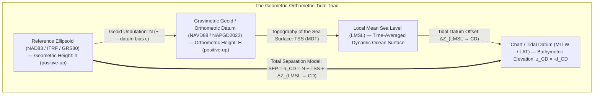

## 3.2 Bridging the Land-Sea Interface: Vertical Datum Transformations

Constructing a seamless **Topo-Bathymetric Digital Elevation Model (TBDEM)**—such as the NOAA Continuously Updated Digital Elevation Model (**CUDEM**) or national coastal inundation meshes—requires unifying measurements collected across two historically incompatible metrological regimes. On land, topographic LiDAR, InSAR, and photogrammetric surveys report elevations $H$ **positive-upward** relative to a geopotential or orthometric vertical datum (e.g., NAVD88, CGVD2013, NAPGD2022, or EVRS) designed so that water flows downhill along equipotential gradients. At sea, acoustic multibeam echosounders (MBES), single-beam sonars, and airborne laser bathymetry (ALB) traditionally report depths $d_{\text{CD}}$ **positive-downward** (or bathymetric elevations $z_{\text{CD}} = -d_{\text{CD}}$ positive-upward) relative to a spatially varying **Chart Datum ($\text{CD}$)** such as Mean Lower Low Water ($\text{MLLW}$) or Lowest Astronomical Tide ($\text{LAT}$), designed to guarantee safety of navigation at low tide.

Directly merging an orthometric land grid with a chart-datum bathymetric grid without a rigorous vertical datum transformation introduces an artificial step discontinuity—a "datum cliff" of $0.5\text{ to }>4.0\,\text{m}$ depending on local tidal range and geoid slope—right along the shoreline where storm-surge runup, tsunami inundation, and coastal sediment transport models are most sensitive to bed gradients. Bridging this interface requires coupling the **geometric** (ellipsoidal), **orthometric** (geopotential), and **tidal** (hydrodynamic) reference surfaces through a spatially continuous **Separation Model ($\text{SEP}$)**.

---

### 3.2.1 The Fundamental Geometric–Orthometric–Tidal Triad

Every point on the coastal land surface or seabed can be referenced vertically to three distinct classes of surfaces, each defined by a different physical principle:
1. **The Reference Ellipsoid** (e.g., GRS80 / WGS84 / ITRF2020), a purely mathematical oblate spheroid relative to which GNSS receivers measure **ellipsoidal height** $h$ $[\text{m}]$ along the surface normal $\hat{\mathbf{n}}$.
2. **The Orthometric / Geoid Surface**, an equipotential surface of the Earth's gravity field $W(\mathbf{x}) = W_0$ (or a legacy spirit-leveled datum approximation thereof) relative to which **orthometric height** $H$ $[\text{m}]$ is measured along the curved plumb line.
3. **Tidal Datum Surfaces** (e.g., $\text{LMSL}$, $\text{MLW}$, $\text{MLLW}$, $\text{LAT}$, $\text{MHW}$, $\text{MHHW}$), non-equipotential fluid envelopes defined by statistical extrema of the sea surface over an 18.6-year **National Tidal Datum Epoch (NTDE)**.



#### The Terrestrial Relation: Ellipsoid to Orthometric Datum
On land, the fundamental linkage between geometric height $h(\phi,\lambda)$ above the reference ellipsoid and orthometric height $H(\phi,\lambda)$ above the vertical datum at geodetic latitude $\phi$ and longitude $\lambda$ is:

$$h(\phi, \lambda) = H(\phi, \lambda) + N_{\text{grav}}(\phi, \lambda) + \epsilon_{\text{datum}}(\phi, \lambda)$$

where:
* $h(\phi, \lambda)$ is the ellipsoidal height $[\text{m}]$, positive upward along the ellipsoidal normal.
* $H(\phi, \lambda)$ is the orthometric height $[\text{m}]$, positive upward along the plumb line above the terrestrial vertical datum.
* $N_{\text{grav}}(\phi, \lambda)$ is the pure gravimetric geoid undulation $[\text{m}]$ (height of the geoid above the reference ellipsoid), computed via Stokes' integral and spherical harmonic geopotential models (e.g., EGM2008, XGM2019e, xGEOID20).
* $\epsilon_{\text{datum}}(\phi, \lambda)$ is the systematic departure $[\text{m}]$ between the realized national vertical datum and the true gravimetric geoid, combined with plumb-line curvature and deflection-of-the-vertical $(\xi, \eta)$ second-order terms ($\Delta N_{\text{curv}} \approx -\frac{1}{2}\Theta^2 H < 1\,\text{mm}$, where $\Theta = \sqrt{\xi^2 + \eta^2}$ is the total deflection of the vertical in radians).

For modern geoid-based vertical datums such as Canada's **CGVD2013** or the North American-Pacific Geopotential Datum of 2022 (**NAPGD2022**), $\epsilon_{\text{datum}} \to 0$ by definition, and $N_{\text{grav}}$ is applied directly. For legacy spirit-leveled datums such as **NAVD88** (constrained to a single tide gauge benchmark at Rimouski/Father Point, Quebec) or Great Britain's **Ordnance Datum Newlyn (ODN)**, $\epsilon_{\text{datum}}(\phi,\lambda)$ is substantial: NAVD88 exhibits a systematic $\sim 1.5\,\text{m}$ southeast-to-northwest tilt across North America relative to the gravimetric geoid. Consequently, operational terrestrial transformation grids use a **hybrid geoid model** $N_{\text{hybrid}}(\phi,\lambda) = N_{\text{grav}}(\phi,\lambda) + \epsilon_{\text{datum}}(\phi,\lambda)$ (such as NOAA NGS **GEOID18**, fitted via least-squares collocation to GPS-on-Benchmarks) so that $H = h - N_{\text{hybrid}}$ holds directly.

#### The Marine Relation: The Separation Model ($\text{SEP}$)
At sea, the time-averaged ocean surface—**Local Mean Sea Level ($\text{LMSL}$)** over a specific tidal epoch—does not coincide with the geoid or the terrestrial orthometric datum. Persistent geostrophic ocean currents (e.g., the Gulf Stream or Kuroshio), prevailing wind stress, barometric pressure gradients, and spatial variations in water density (temperature and salinity steric effects) sustain a quasi-stationary **Mean Dynamic Topography ($\text{MDT}$)**. In vertical datum transformation frameworks, the height of the $\text{LMSL}$ surface above the orthometric datum (or hybrid geoid) is termed the **Topography of the Sea Surface ($\text{TSS}$)**:

$$\text{TSS}(\phi, \lambda) = H_{\text{LMSL}}(\phi, \lambda) = h_{\text{LMSL}}(\phi, \lambda) - N_{\text{hybrid}}(\phi, \lambda)$$

Furthermore, any tidal datum or **Chart Datum ($\text{CD}$)**—such as $\text{MLLW}$, $\text{MLW}$, $\text{LAT}$, $\text{MHW}$, or $\text{MHHW}$—is displaced vertically from $\text{LMSL}$ by a spatially varying hydrodynamic offset $\Delta Z_{\text{LMSL}\to\text{CD}}(\phi, \lambda)$:

$$\Delta Z_{\text{LMSL}\to\text{CD}}(\phi, \lambda) = z_{\text{CD}\text{ rel. LMSL}}(\phi, \lambda) = h_{\text{CD}}(\phi, \lambda) - h_{\text{LMSL}}(\phi, \lambda)$$

where $\Delta Z_{\text{LMSL}\to\text{CD}} < 0$ for low-water chart datums ($\text{MLLW}$, $\text{LAT}$) and $\Delta Z_{\text{LMSL}\to\text{CD}} > 0$ for high-water shoreline datums ($\text{MHW}$, $\text{MHHW}$). Combining the geoid undulation, the sea-surface topography, and the tidal datum offset yields the total **Separation Model ($\text{SEP}$)**, which is simply the ellipsoidal height of the Chart Datum surface $h_{\text{CD}}(\phi, \lambda)$:

$$\text{SEP}(\phi, \lambda) \equiv h_{\text{CD}}(\phi, \lambda) = N_{\text{hybrid}}(\phi, \lambda) + \text{TSS}(\phi, \lambda) + \Delta Z_{\text{LMSL}\to\text{CD}}(\phi, \lambda)$$

Using $\text{SEP}(\phi, \lambda)$, any seabed point whose ellipsoidal height is $h_{\text{bed}}(\phi, \lambda)$ $[\text{m}]$ (positive-up relative to the ellipsoid) has a positive-up elevation $z_{\text{CD}}(\phi, \lambda)$ and a positive-down hydrographic depth $d_{\text{CD}}(\phi, \lambda)$ relative to Chart Datum given by:

$$z_{\text{CD}}(\phi, \lambda) = -d_{\text{CD}}(\phi, \lambda) = h_{\text{bed}}(\phi, \lambda) - \text{SEP}(\phi, \lambda)$$

Conversely, to transform a legacy hydrographic sounding $d_{\text{CD}}(\phi,\lambda)$ (positive-down relative to Chart Datum) into a positive-up terrestrial orthometric elevation $H_{\text{bed}}(\phi,\lambda)$ for a seamless TBDEM, the geoid term cancels out between the land and sea branches of the triad:

$$H_{\text{bed}}(\phi, \lambda) = -d_{\text{CD}}(\phi, \lambda) + \text{TSS}(\phi, \lambda) + \Delta Z_{\text{LMSL}\to\text{CD}}(\phi, \lambda)$$

> [!WARNING]
> **Sign Convention Pitfall: Surface Separation vs. Coordinate Shift ($\text{TSS}$ and Tidal Offsets)**
> A classic source of $0.5\text{--}2.0\,\text{m}$ systematic errors in coastal DEM assembly is confusing the height offset *between two datum surfaces* with the shift applied to *point coordinates*: for any two positive-up vertical datums $A$ and $B$, if datum surface $B$ lies at height $\Delta h_{A\to B} = h_B - h_A$ above datum surface $A$, then the coordinate of a fixed physical point shifts with the **opposite sign**, $Z_B - Z_A = -(h_B - h_A)$. Moreover, different agencies define $\text{TSS}$ with opposite conventions: in the equations above, $\text{TSS} = H_{\text{LMSL}}$ is the height of the $\text{LMSL}$ surface above the orthometric datum zero, whereas in NOAA VDatum's internal `tss.gtx` grid (Hess et al., 2012), the stored grid value is the height of the NAVD88 zero surface relative to $\text{LMSL}$ ($\text{TSS}_{\text{VDatum}} = -\text{TSS}$). Similarly, positive-down sounding grids ($d_{\text{CD}}$, such as `EPSG:5869` for MLLW depth) must be negated ($z_{\text{CD}} = -d_{\text{CD}}$, `EPSG:5866` for MLLW height) before applying positive-up vertical shifts. Always verify a transformation pipeline against a co-located tide gauge benchmark (e.g., a NOAA CO-OPS benchmark datasheet) where published offsets between $\text{MLLW}$, $\text{LMSL}$, $\text{NAVD88}$, and $\text{NAD83}$ ellipsoidal height are independently tabulated.

---

### 3.2.2 Ellipsoidally Referenced Surveying (ERS) vs. Traditional Tide-Gauge Reduction

Historically, hydrographic surveys reduced acoustic depth measurements to Chart Datum by measuring the instantaneous water surface above the sonar transducer and subtracting the observed water level at a coastal tide gauge. In **traditional water-level reduction**, the chart-datum depth $d_{\text{CD}}(t)$ at time $t$ is computed as:

$$d_{\text{CD}}(t) = d_{\text{acoustic}}(t) + z_{\text{draft,static}} + \Delta z_{\text{squat}}(v(t)) + \Delta z_{\text{heave}}(t) - \text{WL}_{\text{CD}}(\phi, \lambda, t)$$

where $d_{\text{acoustic}}(t)$ is the ray-traced acoustic vertical distance below the transducer (positive-downward), $z_{\text{draft,static}}$ is the static vessel draft from the undisturbed waterline down to the transducer (positive-downward; changes with fuel and ballast consumption), $\Delta z_{\text{squat}}(v)$ is velocity-dependent hydrodynamic settlement and squat (positive-downward sinkage), $\Delta z_{\text{heave}}(t)$ is high-pass-filtered inertial heave of the transducer (defined here positive-downward when depressed below the mean wave surface), and $\text{WL}_{\text{CD}}(\phi, \lambda, t)$ is the instantaneous height of the water surface above Chart Datum (positive-upward) extrapolated from one or more shore tide gauges using **discrete tidal zoning polygons** with empirical time-lag ($\Delta t_j$, positive when tidal phase at zone $j$ lags the reference gauge) and range-ratio ($R_j$) corrections:

$$\text{WL}_{\text{CD}}(\phi, \lambda, t) = R_j \cdot \text{WL}_{\text{gauge}}(t - \Delta t_j)$$

This classical paradigm suffers from four severe error sources that create meter-scale artifacts in bathymetric DEMs:
1. **Discrete Tide-Zone Boundary Cliffs:** Across the boundary between adjacent tidal zones $j$ and $j+1$, the discrete jump in range factor $(R_{j+1} - R_j)$ and phase lag $(\Delta t_{j+1} - \Delta t_j)$ imprints artificial vertical steps ($5\text{--}30\,\text{cm}$) directly into overlapping multibeam swaths (partially mitigated by continuous spatial interpolation methods such as NOAA's **TCARI**—Tidal Constituent And Residual Interpolation—but still limited by coastal gauge geometry).
2. **Dynamic Draft, Squat, and Loading Errors:** Unmodeled changes in water density (e.g., a vessel crossing a river plume front from saltwater $\rho \approx 1025\,\text{kg}\,\text{m}^{-3}$ to freshwater $\rho \approx 1000\,\text{kg}\,\text{m}^{-3}$ sinks by $\sim 2.5\%$ of its hull displacement depth), fuel burn, and shallow-water hydrodynamic squat directly bias $d_{\text{CD}}$.
3. **Inertial Heave Filter Drift ("Heave Washout"):** Traditional inertial heave filters use a high-pass cutoff period ($T_c \approx 20\text{--}30\,\text{s}$) to prevent accelerometer double-integration drift. When a vessel turns sharply (induced roll/centripetal acceleration) or rides over long-period estuarine bores or shelf waves, the heave filter settles over several minutes, creating long-wavelength undulations along survey lines.
4. **Meteorological and Offshore Extrapolation Failure:** Shore tide gauges sit inside shallow harbors subject to local wind setup and coastal funneling that do not represent water levels $20\text{--}100\,\text{km}$ offshore.

**Ellipsoidally Referenced Surveying (ERS)**—enabled by Real-Time Kinematic (RTK), Post-Processed Kinematic (PPK), or Precise Point Positioning (PPP) GNSS tightly coupled with an Inertial Measurement Unit (IMU)—completely bypasses the instantaneous water surface as a vertical reference during acquisition (Dodd & Mills, 2011; Rice & Riley, 2011; NOAA *Hydrographic Surveys Specifications and Deliverables [HSSD]*). In ERS, the ellipsoidal height of each ray-traced seafloor beam footprint $h_{\text{bed}}(t, \beta)$ at off-nadir beam angle $\beta$ is determined directly from the tightly coupled GNSS-inertial trajectory $h_{\text{GNSS}}(t)$:

$$h_{\text{bed}}(t, \beta) = h_{\text{GNSS}}(t) - \Delta z_{\text{GNSS}\to\text{RP}}(\phi_r(t), \theta_p(t)) - \Delta z_{\text{RP}\to\text{tx}}(\phi_r(t), \theta_p(t)) - d_{\text{acoustic}}(t, \beta)$$

where $\Delta z_{\text{GNSS}\to\text{RP}}$ and $\Delta z_{\text{RP}\to\text{tx}}$ are the positive-downward local-level vertical components of the rigid-body 3D lever-arm vectors from the GNSS antenna phase center to the IMU reference point (RP) and from the RP to the sonar transducer acoustic center (tx), rotated instantaneously by roll $\phi_r(t)$ and pitch $\theta_p(t)$, and $d_{\text{acoustic}}(t, \beta)$ is the ray-traced vertical depth from the transducer to the seafloor footprint. Once $h_{\text{bed}}(\phi,\lambda)$ is computed, reduction to Chart Datum or an orthometric land datum becomes a deterministic, purely spatial post-processing operation using the continuous $\text{SEP}(\phi,\lambda)$ grid:

$$z_{\text{CD}}(\phi, \lambda) = h_{\text{bed}}(\phi, \lambda) - \text{SEP}(\phi, \lambda)$$

Because the rigid vessel hull mechanically links the GNSS antenna above water to the sonar transducer below water, **static draft, fuel burn, freshwater buoyancy sinkage, dynamic squat, long-period swell, storm surge, and instantaneous tide height all cancel identically out of the vertical measurement**. Moreover, if an improved geoid or hydrodynamic $\text{SEP}$ model is released years later, an archived ellipsoidal bathymetric surface $h_{\text{bed}}(\phi,\lambda)$ (stored in a Bathymetric Attributed Grid, **BAG**, or **IHO S-102** Bathymetric Surface product) can be re-transformed to Chart Datum in seconds without reprocessing raw sonar or tide gauge logs.

---

### 3.2.3 Operational Separation Models Around the World

To support both ERS hydrography and seamless coastal TBDEM compilation, national hydrographic offices and geodetic agencies have developed continuous vertical datum transformation frameworks:

| Operational Framework | Lead Agencies & Coverage | Geometric & Geoid Core | Hydrodynamic & Sea-Surface Core | Nominal Uncertainty $\sigma_{\text{SEP}}$ ($1\sigma$) |
| :--- | :--- | :--- | :--- | :--- |
| **VDatum** | NOAA (NGS, OCS, CO-OPS); U.S. coastal waters, Great Lakes, Puerto Rico, USVI, Alaska, Pacific Islands | NAD83(2011) / ITRF2020 + GEOID18 / xGEOID20 (transitioning to NAPGD2022 / GEOID2022) | $\text{TSS}$ interpolated from leveled tide gauges + unstructured **ADCIRC** / SCHISM tidal constituent grids | $3\text{--}6\,\text{cm}$ (open coast)<br/>$10\text{--}35\,\text{cm}$ (complex estuaries/inlets) |
| **VORF** (Vertical Offshore Reference Frame) | UK Hydrographic Office (UKHO) & UCL; UK and Ireland continental shelf | ETRS89 / ITRF + OSGM15 gravimetric/hybrid geoid | Satellite altimetry MDT + POLCOMS/CS3X hydrodynamic models + coastal tide gauges to LAT & ODN | $5\text{--}8\,\text{cm}$ (nearshore)<br/>$10\text{--}15\,\text{cm}$ (offshore shelf) |
| **CVDCW / HyVSEP** | Canadian Hydrographic Service (CHS) & NRCan; Pacific, Atlantic, Arctic, St. Lawrence, Great Lakes | NAD83(CSRS) + CGVD2013 (CGG2013a gravimetric geoid) | Assimilated finite-element tidal models + satellite altimetry MDT + dynamic river/lake surfaces (IGLD85) | $4\text{--}8\,\text{cm}$ (gauged coasts)<br/>$15\text{--}40\,\text{cm}$ (Arctic & macro-tidal bays) |
| **AusHydroid / AUSGeoid** | Australian Hydrographic Office (AHO) & Geoscience Australia; Australian continental shelf & GBR | GDA2020 + AUSGeoid2020 (connecting to Australian Height Datum, AHD) | AusTides hydrodynamic models + altimetric MDT connecting GDA2020/AHD to LAT | $5\text{--}12\,\text{cm}$ (mainland shelf)<br/>$15\text{--}25\,\text{cm}$ (macro-tidal NW Shelf / Torres Strait) |
| **Bathyelli / RAF20** | SHOM & IGN (France); Metropolitan France & overseas territories | RGF93 (ETRS89) + RAF20 hybrid quasigeoid (IGN69) | HYCOM/MARS2D hydrodynamic tidal models + RAM satellite altimetry to Hydrographic Zero (LAT) | $3\text{--}7\,\text{cm}$ (Atlantic/Channel)<br/>$8\text{--}15\,\text{cm}$ (shelf edge) |

#### 1. NOAA VDatum (United States)
Developed jointly by NOAA's Office of Coast Survey (OCS), National Geodetic Survey (NGS), and Center for Operational Oceanographic Products and Services (CO-OPS) (Parker et al., 2003; Myers et al., 2005; Hess et al., 2012), **VDatum** chains four modular transformation layers across regional marine grids (`core` areas):
* **3D Geometric Reference Frames:** 14-parameter Helmert transformations and Horizontal Time-Dependent Positioning (**HTDP**) convert between global ITRF/WGS84 realizations and NAD83(2011) epoch 2010.0.
* **Geoid / Orthometric Layer:** Hybrid geoid models (**GEOID18** in CONUS) convert between NAD83(2011) ellipsoidal heights $h$ and NAVD88 orthometric heights $H$.
* **Topography of the Sea Surface ($\text{TSS}$):** At each CO-OPS water-level station connected by first-order differential leveling to NAVD88 benchmarks, the local difference $\text{TSS}_i = H_{\text{LMSL},i} - H_{\text{NAVD88},i}$ is observed directly. Between gauges and offshore, VDatum interpolates these residuals using minimum-curvature splines or spatially blends them with oceanographic Mean Dynamic Topography (MDT) fields.
* **Tidal Datum Fields:** Because tide gauges only sample discrete points along the shoreline, VDatum simulates the full spatial variation of tidal datums ($\text{MLLW}$, $\text{MLW}$, $\text{MTL}$, $\text{DTL}$, $\text{MHW}$, $\text{MHHW}$) using high-resolution unstructured finite-element hydrodynamic models—primarily **ADCIRC** (Advanced Circulation Model; Luettich et al., 1992) and **SCHISM**—with triangular elements shrinking to $20\text{--}50\,\text{m}$ inside tidal inlets and channels. From synthetic 365-day or multi-year model time series forced by astronomical constituents, raw tidal datum offsets $\Delta Z_{\text{LMSL}\to\text{CD}}^{\text{model}}(\mathbf{x})$ are extracted. Crucially, to remove hydrodynamic model bias at the coast, VDatum computes the discrepancy $e_i = \Delta Z_{\text{LMSL}\to\text{CD}}^{\text{obs}}(\mathbf{x}_i) - \Delta Z_{\text{LMSL}\to\text{CD}}^{\text{model}}(\mathbf{x}_i)$ at all tide gauges $\mathbf{x}_i$, interpolates a continuous correction field $\hat{e}(\mathbf{x})$ using Laplace/Poisson interpolation with zero-flux boundary conditions along coastlines (Hess et al., 2012), and forms the corrected tidal grid $\Delta Z_{\text{LMSL}\to\text{CD}}(\mathbf{x}) = \Delta Z_{\text{LMSL}\to\text{CD}}^{\text{model}}(\mathbf{x}) + \hat{e}(\mathbf{x})$.

#### 2. UKHO VORF (United Kingdom and Ireland)
The UK Hydrographic Office **Vertical Offshore Reference Frame (VORF)** (Iliffe et al., 2007, 2013) models the separation surfaces between ETRS89/ITRF ellipsoidal heights, British and Irish land datums (Ordnance Datum Newlyn, Ordnance Datum Belfast, Malin Head, plus local island datums on the Isles of Scilly, Orkney, Shetland, and Channel Islands), and Chart Datum (primarily **Lowest Astronomical Tide, LAT**) across the entire UK continental shelf. VORF combines satellite radar altimetry (TOPEX/Poseidon, Jason, Envisat, CryoSat-2) offshore with over 600 coastal tide gauges and finite-difference hydrodynamic shelf models using geostatistical **kriging with external drift**, guaranteeing smooth transitions from deep shelf waters into complex macro-tidal estuaries such as the Bristol Channel (where spring tidal range exceeds $12\,\text{m}$).

#### 3. CHS CVDCW / HyVSEP (Canada) and AusHydroid (Australia)
The Canadian Hydrographic Service **Continuous Vertical Datum for Canadian Waters (CVDCW)** and its operational **Hydrographic Vertical Separation (HyVSEP)** surfaces (Robin et al., 2016) address an extreme diversity of vertical regimes: macro-tidal resonant basins (Bay of Fundy and Ungava Bay, $>16\,\text{m}$ tidal range), seasonally ice-covered Arctic channels where ice friction damps tidal amplitude and delays phase by hours in winter, the non-stationary estuarine river slope of the St. Lawrence River, and the **International Great Lakes Datum of 1985 (IGLD85)** (which uses dynamic heights scaled from geopotential numbers at Rimouski). Similarly, Australia's **AusHydroid** couples the GDA2020 reference frame and **AUSGeoid2020** with assimilated **AusTides** models to provide continuous separation grids between the ellipsoid, the Australian Height Datum (AHD), and LAT across the Great Barrier Reef and North West Shelf.

#### Executing Vertical Datum Transformations with PROJ and GDAL
Modern open-source geospatial pipelines distribute VDatum, GEOID18, and national separation surfaces as **GeoTIFF Vertical Transformation Grids (GTG)** via the OSGeo **PROJ** Datumgrid CDN (`cdn.proj.org`). The following reproducible CLI and Python workflow transforms a positive-down NOAA hydrographic MBES grid (`mbes_mllw_pos_down.tif`, referenced to NAD83(2011) + MLLW) into a positive-up orthometric grid (`mbes_navd88_1m.tif`, referenced to NAD83(2011) + NAVD88) ready to merge with a terrestrial USGS 3DEP LiDAR DEM:

```python
import numpy as np
from pyproj import Transformer

# 1. Point-cloud / trajectory transformation using PROJ compound CRSs:
# EPSG:6318 (NAD83(2011) 2D) + EPSG:5866 (MLLW height, positive-up) -> EPSG:5703 (NAVD88 height)
# Note: EPSG:5866 is MLLW height (positive-up), whereas EPSG:5869 is MLLW depth (positive-down).
tx_mllw_to_navd88 = Transformer.from_crs(
    "EPSG:6318+5866", "EPSG:6318+5703", always_xy=True
)

# Example sounding array in Chesapeake Bay (lon = -76.3850 deg, lat = 37.0200 deg, d_MLLW = 8.42 m depth)
lon = np.array([-76.3850])
lat = np.array([37.0200])
depth_mllw = np.array([8.42])
z_mllw_pos_up = -depth_mllw  # Convert hydrographic positive-down depth to positive-up elevation
_, _, H_navd88 = tx_mllw_to_navd88.transform(lon, lat, z_mllw_pos_up)
print(
    f"z_MLLW = {z_mllw_pos_up[0]:.3f} m -> H_NAVD88 = {H_navd88[0]:.3f} m "
    f"(shift = {H_navd88[0] - z_mllw_pos_up[0]:+.3f} m)"
)
```

For full raster DEMs, `projinfo` verifies that the exact VDatum GTG grids are resolved (preventing silent null-grid fallbacks), and `gdalwarp` applies the PROJ grid-shift pipeline once the vertical sign convention is unified:

```bash
# Step 0: Verify the PROJ pipeline resolves the VDatum MLLW, TSS, and GEOID18 grids in Chesapeake Bay
projinfo -s "EPSG:6318+5866" -t "EPSG:6347+5703" --area "USA - Virginia" --spatial-test intersects

# Step 1: Negate positive-down MLLW bathymetry to positive-up MLLW elevation and assign compound CRS
gdal_calc.py -A mbes_mllw_pos_down.tif --outfile=mbes_mllw_pos_up.tif --calc="-1.0*A" --NoDataValue=-9999
gdal_edit.py -a_srs "EPSG:6318+5866" mbes_mllw_pos_up.tif

# Step 2: Warp vertically and horizontally to NAD83(2011) / UTM Zone 18N + NAVD88 (EPSG:6347+5703)
PROJ_NETWORK=ON gdalwarp -s_srs "EPSG:6318+5866" -t_srs "EPSG:6347+5703" \
    -r bilinear -tr 1.0 1.0 -dstnodata -9999 \
    mbes_mllw_pos_up.tif mbes_navd88_1m.tif
```

---

### 3.2.4 Propagating Vertical Datum Uncertainty ($\sigma_{\text{VDatum}}$) into Seamless TBDEMs

A vertical datum transformation grid is a geophysical estimator, not an error-free mathematical constant. When compiling a seamless Topo-Bathymetric DEM (TBDEM) or checking compliance with **International Hydrographic Organization (IHO) S-44 (6th Edition)**, **NOAA HSSD**, or **ASPRS Positional Accuracy Standards**, the uncertainty of the separation model ($\sigma_{\text{SEP}}$, often denoted $\sigma_{\text{VDatum}}$) must be rigorously propagated into the total vertical uncertainty ($\text{TVU}$) of every grid cell.

#### Component-by-Component Variance Budget
Applying first-order Taylor series variance propagation to $\text{SEP}(\phi, \lambda) = N_{\text{hybrid}}(\phi, \lambda) + \text{TSS}(\phi, \lambda) + \Delta Z_{\text{LMSL}\to\text{CD}}(\phi, \lambda)$, and accounting for reference-frame transformation and spatial interpolation residuals, the total $1\sigma$ transformation variance $\sigma_{\text{SEP}}^2(\phi, \lambda)$ between an ellipsoidal reference frame and a tidal datum is (Hess et al., 2012; NOAA VDatum Uncertainty Model):

$$\sigma_{\text{SEP}}^2(\phi, \lambda) = \sigma_{\text{datum}}^2 + \sigma_N^2(\phi, \lambda) + \sigma_{\text{TSS}}^2(\phi, \lambda) + \sigma_{\text{tide,obs}}^2(\phi, \lambda) + \sigma_{\text{tide,model}}^2(\phi, \lambda) + \sigma_{\text{interp}}^2(\phi, \lambda)$$

where:
* $\sigma_{\text{datum}}^2$ is the variance of the 3D geometric reference frame transformation (e.g., ITRF2020 $\to$ NAD83(2011), typically $\sigma_{\text{datum}} \approx 1.0\text{--}2.0\,\text{cm}$ vertically).
* $\sigma_N^2(\phi, \lambda)$ is the hybrid or gravimetric geoid model variance (typically $\sigma_N \approx 1.2\text{--}3.0\,\text{cm}$ for GEOID18 in well-surveyed coastal plains, rising to $5\text{--}10\,\text{cm}$ in rugged, sparsely gravimetrically surveyed coastal mountains such as Southeast Alaska).
* $\sigma_{\text{TSS}}^2(\phi, \lambda)$ is the variance of the Topography of the Sea Surface grid, comprising differential leveling error between tide gauges and NAVD88 benchmarks ($\sim 1.0\text{--}2.0\,\text{cm}$) plus spatial interpolation error of the dynamic sea surface between gauges ($\sim 2.0\text{--}6.0\,\text{cm}$).
* $\sigma_{\text{tide,obs}}^2(\phi, \lambda)$ is the uncertainty in establishing tidal datums at water-level stations (ranging from $\sim 0.5\text{--}1.0\,\text{cm}$ at primary 19-year NTDE harmonic stations to $2.5\text{--}5.0\,\text{cm}$ at short-term 1- to 3-month subordinate stations reduced via simultaneous comparisons).
* $\sigma_{\text{tide,model}}^2(\phi, \lambda)$ is the hydrodynamic model structural variance in simulating $\Delta Z_{\text{LMSL}\to\text{CD}}$, evaluated via leave-one-out cross-validation (jackknifing) against tide gauges.
* $\sigma_{\text{interp}}^2(\phi, \lambda)$ is the spatial interpolation error when resampling VDatum's marine grid onto the target DEM resolution.

When transforming a bathymetric grid $z_{\text{CD}}(x,y)$ into an orthometric seamless TBDEM $H(x,y)$, the total $1\sigma$ vertical uncertainty $\sigma_{z,\text{TBDEM}}(x,y)$ combines sensor measurement uncertainty $\sigma_{z,\text{sensor}}(x,y)$, spatial interpolation/gridding uncertainty $\sigma_{z,\text{grid}}(x,y)$, temporal morphological change uncertainty $\sigma_{\text{morph}}(x,y)$ (for legacy surveys), and the relevant subset of $\sigma_{\text{VDatum}}(x,y)$:

$$\sigma_{z,\text{TBDEM}}(x, y) = \sqrt{\sigma_{z,\text{sensor}}^2(x, y) + \sigma_{z,\text{grid}}^2(x, y) + \sigma_{\text{VDatum}}^2(x, y) + \sigma_{\text{morph}}^2(x, y)}$$

Under a Gaussian error model, the 95% confidence **Total Vertical Uncertainty ($\text{TVU}_{95\%}$)** is $\text{TVU}_{95\%}(x,y) = 1.96\,\sigma_{z,\text{TBDEM}}(x,y)$.

#### Why $\sigma_{\text{VDatum}}$ Degrades in Complex Estuaries, Barrier Islands, and Tidal Rivers
Along open, well-gauged micro- or meso-tidal coastlines, the linear astronomical constituents ($M_2, S_2, N_2, K_1, O_1$) vary smoothly over tens of kilometers, and $\sigma_{\text{SEP}}$ remains small ($\pm 3\text{--}5\,\text{cm}$ at $1\sigma$). However, as a survey moves through barrier-island inlets into shallow estuaries, salt marshes, and tidal rivers, $\sigma_{\text{SEP}}$ inflates dramatically to $\pm 15\text{--}40\,\text{cm}$ ($1\sigma$, or **$30\text{--}80\,\text{cm}$ at 95% confidence**) due to four fundamental physical breakdowns in hydrodynamic tidal modeling:

1. **Nonlinear Shallow-Water Distortion and Overtide Generation:**
   In shallow estuarine channels where tidal amplitude $\zeta_0$ is a significant fraction of mean water depth $h_0$ ($\epsilon_{\text{nl}} = \zeta_0 / h_0 \gtrsim 0.1$), the phase speed of a long gravity wave $c = \sqrt{g(h_0 + \zeta)}$ is faster under the wave crest ($\zeta > 0$) than under the wave trough ($\zeta < 0$). Simultaneously, the quadratic bottom friction stress in the shallow-water momentum equations:
   $$\frac{\boldsymbol{\tau}_b}{\rho h} = \frac{C_d \|\mathbf{u}\| \mathbf{u}}{h_0 + \zeta(t)}$$
   attenuates the low-water trough far more strongly than the high-water crest. This nonlinear advection and friction transfers energy from the principal lunar semidiurnal constituent $M_2$ ($\omega_{M_2} = 28.984^\circ\,\text{hr}^{-1}$) into shallow-water **overtides** ($M_4$ at $2\omega_{M_2}$, $M_6$ at $3\omega_{M_2}$) and **compound tides** ($MS_4$ at $\omega_{M_2} + \omega_{S_2}$), creating asymmetric flood/ebb profiles and rapid spatial gradients in $\Delta Z_{\text{LMSL}\to\text{MLLW}}$. Any error in the underlying bathymetry $h_0(x,y)$ or bottom drag coefficient $C_d(x,y)$ used to run the ADCIRC model directly corrupts the modeled $\text{MLLW}$ and $\text{MHW}$ surfaces.

2. **Hydraulic Choking Across Migrating Barrier-Island Inlets:**
   Narrow tidal inlets connecting the ocean to back-barrier lagoons act as nonlinear hydraulic orifices. The ratio of lagoon tidal range to ocean tidal range is governed by the dimensionless **Keulegan (1967) repletion coefficient** $K_{\text{inlet}}$:
   $$K_{\text{inlet}} = \frac{T_{\text{tide}}}{2\pi a_{\text{ocean}}} \frac{A_{\text{inlet}}}{A_{\text{bay}}} \sqrt{\frac{2 g a_{\text{ocean}}}{k_{\text{en}} + k_{\text{ex}} + \frac{2 g n^2 L_{\text{inlet}}}{R_h^{4/3}}}}$$
   where $T_{\text{tide}}$ is the tidal period $[\text{s}]$, $a_{\text{ocean}}$ is ocean tidal amplitude $[\text{m}]$, $A_{\text{inlet}}$ and $A_{\text{bay}}$ are inlet cross-sectional area and lagoon surface area $[\text{m}^2]$, $L_{\text{inlet}}$ and $R_h$ are inlet length and hydraulic radius $[\text{m}]$, $n$ is Manning's roughness coefficient $[\text{s}\,\text{m}^{-1/3}]$, and $k_{\text{en}}, k_{\text{ex}}$ are dimensionless entrance/exit head-loss coefficients. Across a single $500\,\text{m}$ long inlet throat (e.g., Oregon Inlet, NC, or Chatham Inlet, MA), $\Delta Z_{\text{LMSL}\to\text{MLLW}}$ can compress from $-0.65\,\text{m}$ on the ocean side to $-0.08\,\text{m}$ inside the back-barrier sound. Moreover, because barrier inlets migrate and shoal during winter storms and hurricanes, a static VDatum grid calibrated to pre-storm inlet bathymetry can easily be in error by $15\text{--}30\,\text{cm}$ after an inlet breach or dredging event.

3. **Intertidal Wetting/Drying and Undefined Tidal Datums Over Marshes:**
   Over intertidal mudflats, oyster reefs, and *Spartina* salt marshes whose bed elevation lies above $\text{MLLW}$ ($z_{\text{bed}} > z_{\text{MLLW}}$), the ground is subaerial at low tide. Physically, a local $\text{MLLW}$ water surface does not exist at that $(x,y)$ location! To construct a continuous TBDEM transformation grid across the land-sea interface, VDatum must mathematically extrapolate the marine $\text{MLLW}$ surface inland beneath the marsh platform using Laplace/Poisson PDE boundary-value solvers. In densely vegetated marshes, spatially variable stem drag ($n \approx 0.08\text{--}0.25\,\text{s}\,\text{m}^{-1/3}$) attenuates high-water propagation ($\text{MHW}/\text{MHHW}$) by $2\text{--}10\,\text{cm}\,\text{km}^{-1}$ from tidal creeks into the marsh interior, creating large unmodeled localized gradients.

4. **Non-Stationary River–Tide Interaction in Tidal Rivers:**
   In the upper reaches of tidal rivers (e.g., the Columbia River up to Bonneville Dam, the Hudson River to Troy, the Fraser River, or the St. Lawrence River), fluvial freshwater discharge $Q(t)$ interacts nonlinearly with the incoming barotropic tide (Jay & Flinchem, 1997; Hoitink & Jay, 2016). High river stage raises mean water surface slope via backwater setup while simultaneously damping tidal amplitude through enhanced quadratic friction $\tau_b \propto (u_{\text{river}} + u_{\text{tide}})|u_{\text{river}} + u_{\text{tide}}|$. Consequently, harmonic tidal constituents are no longer stationary constants, and a static separation grid $\text{SEP}(\phi,\lambda)$ cannot capture flow-dependent chart datums (such as the Columbia River Datum or Low Water Reference Plane, LWRP) without stage-dependent hydrodynamic zoning.

#### Worked Numerical Example: Open-Coast vs. Back-Barrier Estuarine Uncertainty Budget
Consider an Ellipsoidally Referenced Survey (ERS) utilizing PPK-GNSS ($\sigma_{h,\text{GNSS}} = 2.5\,\text{cm}$) and a calibrated multibeam echosounder ($\sigma_{z,\text{sonar+attitude}} = 3.5\,\text{cm}$ at $8.0\,\text{m}$ depth), yielding an ellipsoidal seafloor uncertainty of $\sigma_{h,\text{bed}} = \sqrt{2.5^2 + 3.5^2} = 4.30\,\text{cm}$. We compare the resulting 95% Total Vertical Uncertainty ($\text{TVU}_{95\%}$) relative to $\text{MLLW}$ in two environments against the **IHO S-44 (6th Edition) Special Order** maximum allowable $\text{TVU}_{95\%}(d) = \sqrt{a^2 + (b \cdot d)^2}$ with $a = 0.25\,\text{m}$, $b = 0.0075$, which at $d = 8.0\,\text{m}$ allows $\text{TVU}_{\max,95\%} = \sqrt{0.25^2 + 0.06^2} = 0.257\,\text{m}$ ($25.7\,\text{cm}$):

| Uncertainty Component ($1\sigma$, in $\text{cm}$) | Symbol | Site A: Open Coast (Gauged Shelf) | Site B: Back-Barrier Estuary / Tidal River |
| :--- | :---: | :---: | :---: |
| Ellipsoidal Seabed Measurement (PPK + MBES) | $\sigma_{h,\text{bed}}$ | $4.30\,\text{cm}$ | $4.30\,\text{cm}$ |
| 3D Reference Frame Transformation (ITRF $\to$ NAD83) | $\sigma_{\text{datum}}$ | $1.50\,\text{cm}$ | $1.50\,\text{cm}$ |
| Hybrid Geoid Model (GEOID18) | $\sigma_N$ | $1.80\,\text{cm}$ | $2.20\,\text{cm}$ |
| Topography of the Sea Surface (TSS) | $\sigma_{\text{TSS}}$ | $2.00\,\text{cm}$ | $5.50\,\text{cm}$ |
| Tidal Datum Observation at Gauges | $\sigma_{\text{tide,obs}}$ | $1.20\,\text{cm}$ | $4.00\,\text{cm}$ |
| Hydrodynamic Tidal Model (ADCIRC $\text{LMSL}\to\text{MLLW}$) | $\sigma_{\text{tide,model}}$ | $2.20\,\text{cm}$ | $14.50\,\text{cm}$ |
| Spatial Grid Interpolation | $\sigma_{\text{interp}}$ | $0.80\,\text{cm}$ | $2.50\,\text{cm}$ |
| **Total Separation Model Uncertainty ($1\sigma$)** | **$\sigma_{\text{SEP}}$** | **$\mathbf{4.05\,\text{cm}}$** | **$\mathbf{16.43\,\text{cm}}$** |
| **Combined Chart-Datum Depth Uncertainty ($1\sigma$)** | **$\sigma_{d,\text{MLLW}}$** | **$\mathbf{5.91\,\text{cm}}$** | **$\mathbf{16.98\,\text{cm}}$** |
| **Total Vertical Uncertainty at 95% Confidence ($1.96\,\sigma$)** | **$\text{TVU}_{95\%}$** | **$\mathbf{11.6\,\text{cm}}$** *(Passes Special Order)* | **$\mathbf{33.3\,\text{cm}}$** *(Fails Special Order!)* |

At Site A (open coast), $\sigma_{\text{SEP}} = \sqrt{1.50^2 + 1.80^2 + 2.00^2 + 1.20^2 + 2.20^2 + 0.80^2} = \sqrt{16.41} = 4.05\,\text{cm}$, and the combined $\text{TVU}_{95\%} = 1.96 \sqrt{4.30^2 + 4.05^2} = 11.6\,\text{cm}$ easily satisfies both IHO Special Order ($\le 25.7\,\text{cm}$) and Exclusive Order ($a = 0.15\,\text{m}, b = 0.0075 \implies \le 16.2\,\text{cm}$ at $d = 8.0\,\text{m}$). At Site B (back-barrier estuary), despite using the exact same high-precision PPK-GNSS and multibeam hardware, the hydrodynamic and $\text{TSS}$ uncertainties in VDatum ($\sigma_{\text{SEP}} = \sqrt{269.84} = 16.43\,\text{cm}$) inflate $\text{TVU}_{95\%}$ to $33.3\,\text{cm}$—**failing IHO Special Order** solely due to vertical datum transformation uncertainty. To pass Special Order in such estuaries, hydrographers must deploy temporary local GNSS-buoys or bottom-mounted pressure tide gauges during the survey to locally constrain $\text{SEP}(\phi,\lambda)$.

> [!IMPORTANT]
> **Key Takeaways for Seamless Coastal & Estuarine DEMs**
> 1. **Never Merge Land and Sea Grids Without a Separation Model:** Combining positive-up orthometric LiDAR ($H$) with positive-down chart-datum bathymetry ($d_{\text{CD}}$) without applying both a sign inversion ($z_{\text{CD}} = -d_{\text{CD}}$) and a continuous $\text{TSS} + \Delta Z_{\text{LMSL}\to\text{CD}}$ shift creates an artificial shoreline cliff equal to the local offset between the orthometric datum and low water.
> 2. **Archive Bathymetry on the Ellipsoid ($h_{\text{bed}}$):** Ellipsoidally Referenced Surveying (ERS) decouples acoustic depth measurement from water-level zoning, dynamic draft, and heave drift. Storing primary bathymetric point clouds and BAGs (Bathymetric Attributed Grids) relative to a well-defined geometric frame (e.g., ITRF2020 or NAD83(2011) at a specified epoch) ensures future-proof upgradability when next-generation geoid and hydrodynamic $\text{SEP}$ models (such as NAPGD2022 / GEOID2022) are released.
> 3. **Propagate Spatially Varying $\sigma_{\text{VDatum}}$ Layers:** In shallow estuaries, tidal inlets, and river mouths, vertical datum transformation uncertainty ($\sigma_{\text{VDatum}} \approx 15\text{--}40\,\text{cm}$) often exceeds the combined sensor uncertainty of modern airborne topobathymetric LiDAR and multibeam sonar ($\sim 4\text{--}8\,\text{cm}$). Seamless TBDEMs (such as NOAA CUDEM) must therefore distribute a spatially explicit per-pixel uncertainty raster $\sigma_{z,\text{TBDEM}}(x,y)$ alongside the elevation grid.

---

### References

* Amante, C. J., Love, M., Carignan, K., Sutherland, M. G., MacFerrin, M., & Lim, E. (2023). Continuously Updated Digital Elevation Models (CUDEMs) to support coastal inundation modeling. *Remote Sensing*, 15(6), 1702. https://doi.org/10.3390/rs15061702
* Dodd, D., & Mills, J. (2011). Ellipsoidally Referenced Surveys (ERS): Issues and solutions. *International Hydrographic Review*, (6), 19–29.
* Hess, K. W., White, S. A., Sellars, J., Spargo, E. A., Wong, A., Gill, S. K., & Zervas, C. E. (2012). *Application of VDatum to Coastal Elevation Models* (NOAA Technical Report NOS CS 30). Silver Spring, MD: National Oceanic and Atmospheric Administration.
* Hoitink, A. J. F., & Jay, D. A. (2016). Tidal river dynamics: Implications for deltas. *Reviews of Geophysics*, 54(1), 240–272. https://doi.org/10.1002/2015RG000507
* Iliffe, J. C., Ziebart, M. K., Turner, J. F., Talbot, A. J., & Lessnoff, A. P. (2007). VORF: The UK Hydrographic Office Vertical Offshore Reference Frame. In *Proceedings of the FIG Working Week 2007*, Hong Kong.
* Iliffe, J. C., Ziebart, M. K., Turner, J. F., Oliveira, J., & Adams, R. (2013). The VORF software: Joining vertically disconnected worlds. *Hydro International*, 17(5), 23–26.
* International Hydrographic Organization (IHO). (2020). *IHO Standards for Hydrographic Surveys* (Special Publication No. 44, 6th ed.). Monaco: IHO.
* Jay, D. A., & Flinchem, E. P. (1997). Interaction of fluctuating river flow with a barotropic tide: A demonstration of wavelet tidal analysis methods. *Journal of Geophysical Research: Oceans*, 102(C3), 5705–5720. https://doi.org/10.1029/96JC00496
* Keulegan, G. H. (1967). *Tidal Flow in Entrances: Water-Level Fluctuations of Basins in Communication with Seas* (Committee on Tidal Hydraulics Technical Bulletin No. 14). Vicksburg, MS: U.S. Army Corps of Engineers Waterways Experiment Station.
* Luettich, R. A., Westerink, J. J., & Scheffner, N. W. (1992). *ADCIRC: An Advanced Three-Dimensional Circulation Model for Shelves, Coasts, and Estuaries; Report 1: Theory and Methodology of ADCIRC-2DDI and ADCIRC-3DL* (Technical Report DRP-92-6). Vicksburg, MS: U.S. Army Engineer Waterways Experiment Station.
* Myers, E. P., Wong, A., Hess, K., White, S., Spargo, E., Feyen, J., ... & Sellars, J. (2005). Development of a national vertical datum transformation tool. *Earth System Monitor*, 15(1), 1–7.
* Parker, B., Milbert, D., Hess, K., & Gill, S. (2003). National VDatum—The implementation of a national vertical datum transformation database. In *Proceedings of the U.S. Hydrographic Conference 2003*, Biloxi, MS.
* Rice, G., & Riley, J. (2011). Measuring the water level datum relative to the ellipsoid during hydrographic survey. In *Proceedings of the U.S. Hydrographic Conference 2011*, Tampa, FL.
* Robin, C., Nudds, S., MacAulay, P., Godin, A., De Lange Boom, B., & Bartlett, J. (2016). Hydrographic Vertical Separation Surfaces (HyVSEPs) for the tidal waters of Canada. *Marine Geodesy*, 39(2), 195–222. https://doi.org/10.1080/01490419.2016.1160011
