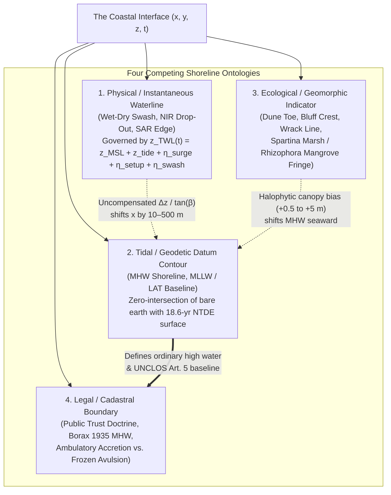
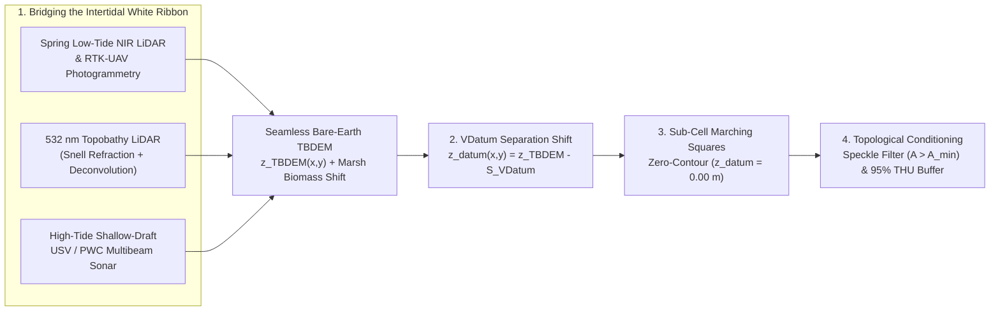

## 3.3 What Is a Shoreline?

To a casual observer viewing a satellite image or a paper map, the "shoreline" appears to be a self-evident, one-dimensional boundary separating land from water. In geodesy, hydrography, coastal engineering, and cadastral law, however, **there is no single shoreline**. Instead, the coastal interface is a dynamic four-dimensional zone $(x, y, z, t)$ where the solid lithosphere, fluid hydrosphere, atmosphere, biosphere, and legal jurisdiction intersect across timescales ranging from sub-second wind-wave swash to the 18.6-year lunar nodal cycle and millennial glacio-isostatic adjustment.

In a landmark review, Boak and Turner (2005) cataloged more than 45 distinct shoreline indicators used across coastal science and management. When extracting a shoreline from a Digital Elevation Model (DEM), satellite image, or point cloud, treating these indicators as interchangeable introduces horizontal errors of tens to hundreds of meters and vertical biases exceeding several meters. To prevent semantic and geodetic confusion, every shoreline representation must be classified into one of four fundamental ontologies: **physical/instantaneous**, **tidal/geodetic**, **ecological/geomorphic**, or **legal/cadastral**.



---

### 3.3.1 The Multi-Definition Shoreline Problem: Four Competing Ontologies

#### 1. Physical and Instantaneous Waterlines (The Sensor-Observed Interface)
Passive optical sensors (multispectral satellite pushbroom scanners, airborne mapping cameras, UAV photogrammetry), Synthetic Aperture Radar (SAR), and terrestrial Near-Infrared (NIR, $\lambda = 1064\text{ nm}$ or $1550\text{ nm}$) LiDAR do not see geodetic datums; they record the **instantaneous physical water-land intersection** at the exact millisecond of sensor acquisition $t_0$, or the **High-Water Line (HWL)** (the tonal wet-dry sand boundary left on the foreshore by the preceding high tide).

At any acquisition epoch $t_0$, the instantaneous **Total Water Level ($z_{\text{TWL}}$)** $[\text{m}]$ intersecting the beach face is the linear and nonlinear superposition of five distinct physical processes:

$$z_{\text{TWL}}(x, y, t_0) = z_{\text{LMSL}}(x,y) + z_{\text{tide}}(x, y, t_0) + \eta_{\text{surge}}(x, y, t_0) + \bar{\eta}_{\text{setup}}(x, y, t_0) + \eta_{\text{swash}}(x, y, t_0)$$

where:
- $z_{\text{LMSL}}(x,y)$ $[\text{m}]$ is the Local Mean Sea Level referenced to a fixed orthometric or ellipsoidal datum;
- $z_{\text{tide}}(x,y,t_0)$ $[\text{m}]$ is the deterministic astronomical tide height at time $t_0$;
- $\eta_{\text{surge}}(x,y,t_0)$ $[\text{m}]$ is the non-tidal meteorological residual (barotropic wind setup plus the static **inverted barometer effect**, $\Delta \eta_{\text{IB}} = -\Delta P_a / (\rho_w g) \approx -0.995\text{ cm}\,\text{hPa}^{-1}$, where $\Delta P_a$ is the atmospheric pressure anomaly relative to $1013.25\text{ hPa}$, $\rho_w \approx 1025\text{ kg}\,\text{m}^{-3}$ is seawater density, and $g \approx 9.80665\text{ m}\,\text{s}^{-2}$);
- $\bar{\eta}_{\text{setup}}(x,y,t_0)$ $[\text{m}]$ is the time-averaged superelevation of the mean water surface inside the surf zone driven by the cross-shore radiation stress gradient ($\partial S_{xx}/\partial x$) of breaking waves (Longuet-Higgins & Stewart, 1964), frequently approximated in engineering practice as $\bar{\eta}_{\text{setup}} \approx 0.17 H_s$ (where $H_s$ is offshore significant wave height); and
- $\eta_{\text{swash}}(x,y,t_0)$ $[\text{m}]$ is the instantaneous time-varying vertical oscillation of the water's edge across the foreshore driven by incident sea-swell ($f > 0.05\text{ Hz}$) and infragravity ($0.004 < f < 0.05\text{ Hz}$) waves.

In coastal hazard and shoreline extraction workflows, the combined upper envelope of wave setup and swash runup above the still-water level ($z_{\text{SWL}} = z_{\text{LMSL}} + z_{\text{tide}} + \eta_{\text{surge}}$) is quantified by the **$2\%$ exceedance wave runup height ($R_{2\%}$)** $[\text{m}]$. Through a synthesis of 10 field experiments spanning reflective to ultra-dissipative natural beaches, Stockdon et al. (2006) established the universal empirical parameterization:

$$R_{2\%} = 1.1 \left( 0.35 \tan\beta_f \sqrt{H_0 L_0} + \frac{\sqrt{H_0 L_0 \left(0.563 \tan^2\beta_f + 0.004\right)}}{2} \right)$$

where $\tan\beta_f$ $[\text{dimensionless}]$ is the foreshore beach slope, $H_0$ $[\text{m}]$ is the deep-water significant wave height, and $L_0 = \frac{g}{2\pi} T_p^2 \approx 1.5608\,T_p^2$ $[\text{m}]$ is the deep-water peak wavelength corresponding to peak wave period $T_p$ $[\text{s}]$. Inside the parentheses, the first term ($\bar{\eta}_{\text{setup}} = 0.35 \tan\beta_f \sqrt{H_0 L_0}$) represents time-averaged wave setup, while the radical combines incident swash ($S_{\text{inc}} = 0.75 \tan\beta_f \sqrt{H_0 L_0}$) and infragravity swash ($S_{\text{ig}} = 0.06 \sqrt{H_0 L_0}$) in quadrature. On ultra-dissipative beaches where the Iribarren surf similarity parameter $\xi_0 = \tan\beta_f / \sqrt{H_0 / L_0} < 0.3$, infragravity energy dominates and the expression reduces to $R_{2\%} = 0.043 \sqrt{H_0 L_0}$.

Because coastal topography has a finite foreshore slope $\tan\beta_f = |\nabla z|$, any vertical offset $\Delta z = z_{\text{TWL}}(t_0) - z_{\text{datum}}$ between the instantaneous waterline and a target tidal datum—or any vertical DEM error $\sigma_z$—projects into a **cross-shore horizontal shoreline displacement ($\Delta x$)** $[\text{m}]$ amplified by the cotangent of the slope:

$$\Delta x = \frac{\Delta z}{\tan\beta_f}, \qquad \sigma_{x,\text{shoreline}} = \sqrt{\sigma_{x,\text{DEM}}^2 + \left(\frac{\sigma_{z,\text{DEM}}^2 + \sigma_{\text{VDatum}}^2}{\tan^2\beta_f}\right)}, \qquad U_{x,95\%} = 1.96\,\sigma_{x,\text{shoreline}}$$

where $U_{x,95\%}$ $[\text{m}]$ is the one-dimensional $95\%$ confidence half-width normal to the shoreline contour (distinct from the two-dimensional circular radial $\text{THU}_{95\%} = 2.4477\,\sigma_H$ used for isolated hydrographic point features under IHO S-44 and NOAA HSSD).

##### Worked Numerical Example: Horizontal Shoreline Excursion on Dissipative vs. Reflective Coasts
Consider a moderate coastal swell with $H_0 = 2.5\text{ m}$ and $T_p = 12\text{ s}$ ($L_0 = \frac{9.80665}{2\pi}(12)^2 = 224.75\text{ m}$, so $\sqrt{H_0 L_0} = \sqrt{561.88} = 23.70\text{ m}$), accompanied by a $\eta_{\text{surge}} = +0.25\text{ m}$ barometric/wind anomaly:
1. **Steep Reflective Gravel Beach ($\tan\beta_f = 0.10$, $\xi_0 = 0.948$):**
   Wave setup is $\bar{\eta}_{\text{setup}} = 0.35(0.10)(23.70) = 0.830\text{ m}$, and the $2\%$ runup height is $R_{2\%} = 1.1\left(0.830 + 0.5\sqrt{561.88(0.00563 + 0.004)}\right) = 1.1(0.830 + 1.163) = 2.19\text{ m}$. Even at the exact moment the astronomical tide crosses Mean High Water ($z_{\text{tide}} = z_{\text{MHW}}$), the wet-dry swash line is elevated by $\Delta z = \eta_{\text{surge}} + R_{2\%} = 2.44\text{ m}$, shifting the apparent shoreline landward by $\Delta x = 2.44 / 0.10 = 24.4\text{ m}$.
2. **Low-Gradient Dissipative Sandy Beach ($\tan\beta_f = 0.01$, $\xi_0 = 0.095 < 0.3$):**
   Using the dissipative relation, $R_{2\%} = 0.043(23.70) = 1.02\text{ m}$, giving $\Delta z = 0.25 + 1.02 = 1.27\text{ m}$ above the astronomical tide. If a satellite image is captured $1.5\text{ m}$ below MHW during a falling tide ($\Delta z_{\text{net}} = -1.50 + 1.27 = -0.23\text{ m}$) vs. at MHW during a storm ($\Delta z_{\text{net}} = +1.27\text{ m}$), the horizontal waterline shifts across a range of $1.50\text{ m} / 0.01 = \mathbf{150\text{ m}}$! On macrotidal mudflats ($\tan\beta_f = 0.001$), a $2\text{ m}$ vertical tide difference shifts the instantaneous waterline horizontally by **$2.0\text{ km}$**.

#### 2. Tidal and Geodetic Datum Shorelines (MHW, MLLW, and LAT)
To eliminate the transient noise of waves, meteorology, and acquisition timing, hydrographic offices and geodetic agencies define authoritative shorelines as the **three-dimensional intersection of a mathematical tidal datum surface $z_{\text{datum}}(x,y)$ (averaged over the 18.6-year National Tidal Datum Epoch, NTDE) with the bare-earth coastal topography $z_{\text{bare}}(x,y)$**:

$$\mathcal{C}_{\text{datum}} = \left\{ (x, y) \in \mathbb{R}^2 \;\middle|\; z_{\text{bare}}(x, y) - z_{\text{datum}}(x, y) = 0 \right\}$$

Two datum contours govern virtually all nautical charting, topographic mapping, and international maritime law:
- **Mean High Water (MHW) — The Legal Charted Shoreline:** On all U.S. National Oceanic and Atmospheric Administration (NOAA) nautical charts and U.S. Geological Survey (USGS) topographic quadrangles, the official **shoreline** (depicted as a heavy solid black line) is the **MHW zero-contour** (Shalowitz, 1962; Graham et al., 2003; Parker, 2007). MHW is also the reference datum for vertical clearances under bridges and overhead cables. (In macrotidal regions outside the United States, hydrographic offices governed by IHO S-44 frequently use **Mean High Water Springs (MHWS)** or **Highest Astronomical Tide (HAT)** for coastline depiction and vertical bridge clearances).
- **Mean Lower Low Water (MLLW) and Lowest Astronomical Tide (LAT) — The Chart Datum and UNCLOS Normal Baseline:** On nautical charts, the zero-depth contour ($d = 0.0\text{ m}$ positive-down, separating permanently submerged seabed from the intertidal "foreshore" or drying zone shaded in green tint) is referenced to Chart Datum—**MLLW** in the United States and **LAT** across most International Hydrographic Organization (IHO) member states. Crucially, under **Article 5 of the 1982 United Nations Convention on the Law of the Sea (UNCLOS)** (entered into force in 1994), *"the normal baseline for measuring the breadth of the territorial sea is the low-water line along the coast as marked on large-scale charts officially recognized by the coastal State."* Because the outer limits of the $12\text{ NM}$ Territorial Sea, $24\text{ NM}$ Contiguous Zone, and $200\text{ NM}$ Exclusive Economic Zone (EEZ) are constructed geometrically via the envelope of arcs from salient basepoints along the MLLW/LAT contour (including drying rocks and shoals exposed at low water within $12\text{ NM}$ of the mainland—"low-tide elevations" under UNCLOS Article 13), a vertical datum error of just $15\text{ cm}$ in a coastal DEM over a gently sloping shoal can create or extinguish a legal basepoint, shifting international maritime boundaries and billions of dollars in offshore energy or fisheries jurisdiction by several kilometers.

#### 3. Ecological and Geomorphic Shoreline Indicators
Geomorphologists, coastal engineers, and wetland ecologists frequently require feature-based boundaries that reflect multi-year morphodynamic work or biological zonation rather than an invisible tidal datum elevation:
- **Dune Toe, Coastal Bluff Crest, and Bluff Toe:** Extracted from bare-earth DTMs by locating the local maximum of profile curvature ($\partial^2 z / \partial s^2$) or the inflection point between the wave-dominated foreshore/backshore and the eolian dune face or eroding cliff face (Wernette et al., 2016). In FEMA Pacific and Atlantic coastal flood studies, the **Primary Frontal Dune (PFD) heel and toe** control the landward limit of High Velocity Wave Action (Zone VE).
- **Permanent Vegetation Line and Storm Wrack Line:** Prior to airborne LiDAR, photogrammetrists compiling historic Coast Survey Topographic Sheets (T-sheets) traced the seaward limit of perennial halophytic dune plants (e.g., *Ammophila*, *Uniola*) or the linear swash debris/wrack line—proxies that systematically lie $0.5\text{–}2.5\text{ m}$ vertically above true geodetic MHW (Pajak & Leatherman, 2002).
- **Salt-Marsh (*Spartina*) and Mangrove (*Rhizophora*) Fringes — The Halophytic Canopy Bias:** Along low-energy estuarine, deltaic, and tropical coasts, the intertidal zone between MLW and MHHW is colonized by dense salt-marsh cordgrass (*Spartina alterniflora*, *Juncus roemerianus*; stem heights $0.5\text{–}2.0\text{ m}$) or mangrove forests (*Rhizophora mangle*, *Avicennia germinans*; canopy heights $3\text{–}25\text{ m}$). Standard airborne NIR/green LiDAR and optical Structure-from-Motion (SfM) photogrammetry rarely penetrate dense *Spartina* stems or overlapping mangrove prop roots to the true anaerobic mudflat substrate. When a standard progressive morphological or cloth-simulation ground filter classifies the top of dense marsh grass ($\Delta z_{\text{veg}} = +0.4\text{ to }+1.5\text{ m}$) or dwarf mangroves ($\Delta z_{\text{veg}} = +2.0\text{ to }+5.0\text{ m}$) as "bare earth," intersecting the resulting DEM with VDatum's MHW surface shifts the extracted MHW contour **hundreds of meters to several kilometers seaward** to the outer edge of the vegetation canopy (Hladik & Alber, 2012; Medeiros et al., 2015).

#### 4. Legal and Cadastral Boundaries: Ambulatory Rights and the Public Trust Doctrine
In Anglo-American property law, the coastal shoreline is a high-stakes legal boundary governed by the **Public Trust Doctrine**—the ancient legal principle (derived from the Roman *Institutes of Justinian* and English common law, and affirmed by the U.S. Supreme Court in *Martin v. Waddell*, 1842, and *Illinois Central Railroad v. Illinois*, 1892) that sovereign states hold title to all lands beneath navigable and tidal waters in trust for the public.

In the seminal decision ***Borax Consolidated, Ltd. v. City of Los Angeles*, 296 U.S. 10 (1935)**, the U.S. Supreme Court resolved decades of dispute over how to survey the "ordinary high-water mark" separating private upland (*littoral*) property from state-owned sovereign tidelands. The Court rejected physical vegetation lines and storm marks, holding as a matter of federal law that the legal boundary is the **Mean High Water (MHW) intersection contour** determined from the astronomical average of all high tides over a complete **18.6-year lunar nodal cycle** (the U.S. Coast and Geodetic Survey / NOAA NTDE standard). While the majority of U.S. coastal states follow the *Borax* MHW rule, survey practitioners must verify state-specific statutory variations: for example, **Texas** uses **Mean Higher High Water (MHHW)** for pre-1840 Spanish and Mexican civil-law land grants (*Luttes v. State*, 1958) and MHW for Anglo common-law grants; **Hawaii** uses the upper reaches of the wash of waves (*In re Ashford*, 1968); and five eastern states (**Massachusetts, Maine, Delaware, Pennsylvania, and Virginia**) are "low-water states" where Colonial Ordinances extended private upland title down to the **Mean Low Water (MLW)** mark (not exceeding $100\text{ rods} \approx 503\text{ m}$ from high water), subject to public fishing and navigation easements.

Crucially, legal tidal boundaries are **ambulatory** (moving over time), but the law distinguishes sharply between gradual and sudden geomorphological change:
1. **Accretion, Reliction, and Erosion:** When sediment is deposited gradually and imperceptibly (*accretion*) or water gradually recedes (*reliction*), the private upland parcel expands seaward with the migrating MHW contour. Conversely, under gradual *erosion* or submergence (including gradual sea-level rise), the private owner loses title as the MHW contour migrates landward into the public trust.
2. **Avulsion:** When a sudden, violent, perceptible event—such as a hurricane barrier-island breach, tsunami scour, coseismic subsidence, or artificial dredging/filling—abruptly alters the topography, the legal doctrine of **avulsion** applies: **the property boundary remains permanently fixed at its pre-avulsive MHW geographic location**, even if that line now lies under $4\text{ m}$ of open water or high on a newly deposited sandbar (Shalowitz, 1962; Flushman, 2002). Consequently, forensic coastal surveyors routinely use archived pre-storm LiDAR DEMs and VDatum grids to reconstruct pre-avulsive MHW contours in quiet-title litigation.

| Shoreline Ontology | Primary Indicator / Datum | Physical / Geodetic Definition | Typical Sensor & Extraction Method | Vertical Offset vs. MHW ($\Delta z$) | Horizontal Offset vs. MHW ($\Delta x$ on $\tan\beta = 0.01$) | Primary Legal / Scientific Use |
| :--- | :--- | :--- | :--- | :--- | :--- | :--- |
| **Physical / Instantaneous** | Instantaneous Waterline (IWL) | Transient land-water interface at epoch $t_0$ ($z_{\text{TWL}}(t_0)$) | Multispectral NDWI, SAR backscatter, NIR LiDAR drop-out | $-2.5\text{ m}$ to $+3.5\text{ m}$ | $-250\text{ m}$ to $+350\text{ m}$ | Satellite shoreline time series (requires tide + runup correction, e.g., CoastSat) |
| **Physical / Instantaneous** | High-Water Line (HWL / Wet-Dry) | Tonal boundary between wave-wetted foreshore and dry backshore sand | Aerial orthophotography, historic T-sheets | $+0.2\text{ m}$ to $+2.0\text{ m}$ ($R_{2\%}$ biased) | $+20\text{ m}$ to $+200\text{ m}$ (landward) | Legacy historical shoreline change analysis (DSAS) |
| **Tidal / Geodetic** | **Mean High Water (MHW)** | Zero-contour of 18.6-yr NTDE MHW surface on bare topography | Topo-bathy LiDAR + VDatum zero-contouring | **$0.00\text{ m}$ (Reference)** | **$0.0\text{ m}$ (Reference)** | **U.S. Legal Shoreline** (NOAA charts, USGS topos, *Borax* 1935 Public Trust) |
| **Tidal / Geodetic** | **MLLW / LAT** | Zero-contour of 18.6-yr NTDE MLLW or LAT chart datum on bare seabed | Topobathy LiDAR ($532\text{ nm}$) / MBES + VDatum | $-0.3\text{ m}$ (microtidal) to $-10.0\text{ m}$ (macrotidal) | $-30\text{ m}$ to $-1000\text{ m}$ (seaward) | **Chart Datum ($d=0$)** and **UNCLOS Art. 5 Normal Baseline** |
| **Ecological / Geomorphic** | Salt-Marsh / Mangrove Fringe | Seaward edge or canopy top of *Spartina* / *Rhizophora* | Uncorrected LiDAR DSM/DTM, optical classification | $+0.5\text{ m}$ to $+5.0\text{ m}$ (canopy bias) | $-50\text{ m}$ to $-2000\text{ m}$ (false seaward shift) | Wetland habitat mapping, blue-carbon inventory |
| **Ecological / Geomorphic** | Dune Toe / Bluff Crest | Maximum concave/convex profile curvature ($\partial^2 z / \partial s^2$) | Bare-earth LiDAR DTM profile inflection | $+1.5\text{ m}$ to $+30.0\text{ m}$ | $+30\text{ m}$ to $+150\text{ m}$ (landward) | FEMA Zone VE flood mapping, storm impact scaling (Sallenger, 2000) |
| **Legal / Cadastral** | Pre-Avulsive MHW Boundary | Location of MHW contour immediately prior to sudden storm breach or fill | Pre-event historical DEM + epoch-matched VDatum | Variable (decoupled from post-storm bed) | Fixed in $(x,y)$ coordinates | Sovereign tideland quiet-title litigation & beach nourishment rights |

---

### 3.3.2 Bridging the Intertidal "White Ribbon" and Extracting Datum Shorelines from TBDEMs

#### The "White Ribbon" (Surf-Zone No-Man's-Land, $0\text{–}3\text{ m}$ Depth)
Historically, the hardest region on Earth to map into a seamless DEM is neither the deep ocean abyss nor rugged alpine peaks, but the **shallow coastal surf zone and intertidal zone ($-3\text{ m} \le z \le +2\text{ m}$)**—notoriously termed the **"White Ribbon"** because it appeared as an unmapped blank strip between terrestrial topographic maps and offshore hydrographic sheets. Three compounding physical barriers create this gap:
1. **Acoustic Vessel Hazards and Swath Collapse:** Manned hydrographic launches carrying Multibeam Echo Sounders (MBES) cannot safely navigate into breaking surf, rocky shoals, or depths shallower than $2\text{–}4\text{ m}$. Even where shallow entry is attempted, the across-track swath width of a multibeam sonar with maximum fan angle $\theta_{\max}$ collapses linearly with water depth $d$:
   $$W_{\text{swath}} = 2\,d \tan\!\left(\frac{\theta_{\max}}{2}\right)$$
   At $d = 1.0\text{ m}$ with $\theta_{\max} = 130^\circ$, the swath width shrinks to just $4.3\text{ m}$, requiring prohibitively dense line spacing while breaking-wave air bubble plumes scatter and extinguish high-frequency ($200\text{–}400\text{ kHz}$) acoustic pulses.
2. **Terrestrial NIR LiDAR Absorption:** Standard terrestrial and airborne topographic LiDAR systems operate at near-infrared wavelengths ($\lambda = 1064\text{ nm}$ or $1550\text{ nm}$), where the optical absorption coefficient of pure water is $\alpha_{1064} \approx 12\text{–}36\text{ m}^{-1}$ (and $\alpha_{1550} \approx 960\text{ m}^{-1}$). NIR pulses are absorbed within millimeters of the air-water interface, producing either complete signal drop-outs (voids) due to off-nadir specular reflection or false water-surface elevations near nadir whenever the intertidal zone is submerged.
3. **Bathymetric Green LiDAR ($532\text{ nm}$) Turbidity, Foam, and the Very-Shallow Pulse Blind Spot:** Airborne bathymetric LiDAR transmits a frequency-doubled green laser ($\lambda = 532\text{ nm}$) that penetrates clear coastal water up to $2\text{–}3$ Secchi depths (diffuse attenuation coefficient $K_d \approx 0.08\text{–}0.30\text{ m}^{-1}$, or $d_{\max} \approx 1.5 / K_d$ to $3.0 / K_d$). Directly inside the breaking surf zone, however, **entrained white-water foam** reflects the green pulse at the surface, **wave-resuspended sediment** increases turbidity ($K_d > 1.5\text{ m}^{-1}$), and in depths shallower than $d_{\min} \approx 0.15\text{–}0.30\text{ m}$, the round-trip travel time in water ($\Delta t = 2 d n_w / c$, where $n_w \approx 1.34$ is the group refractive index of seawater and $c$ is the vacuum speed of light) becomes shorter than the laser pulse duration ($\tau_{\text{pulse}} \approx 1\text{–}2\text{ ns}$), convolving the water-surface return and benthic bottom return into a single inseparable waveform peak.

#### Multi-Sensor Strategies to Close the Intertidal Gap
Modern coastal mapping programs (such as the U.S. Interagency Working Group on Ocean and Coastal Mapping, IWG-OCM, and the NOAA National Geodetic Survey Coastal Mapping Program) bridge the White Ribbon by combining four coordinated techniques:
- **Tide-Coordinated Spring Low-Water Acquisition:** Airborne NIR/topobathymetric LiDAR and RTK/PPK UAV photogrammetry flights are strictly scheduled within a $\pm 1.5\text{-hour}$ window centered on predicted astronomical spring low water (when $z_{\text{tide}}(t) \le z_{\text{MLLW}}$), exposing both the MHW and MLLW contours subaerially to sub-decimeter bare-earth laser scanning.
- **High-Frequency Topobathymetric LiDAR with Full-Waveform Deconvolution:** Modern narrow-pulse ($< 1\text{ ns}$), small-footprint green topobathymetric scanners (e.g., Riegl VQ-880-G II, Leica Chiroptera-5) record digitized full waveforms at $500\text{ kHz}+$, applying Richardson-Lucy or Gaussian decomposition to separate surface and bottom returns down to $15\text{ cm}$ water depth while using co-aligned $1064\text{ nm}$ / $532\text{ nm}$ surface detections to enforce Snell's Law ray refraction ($\theta_w = \arcsin(\sin\theta_a / n_w)$) across the wavy water surface.
- **Uncrewed Surface Vessels (USVs) and Surf-Zone Platforms:** Ultra-shallow-draft ($< 0.25\text{ m}$) autonomous USVs and personal watercraft equipped with dual-frequency single-beam or compact multibeam sonars and tightly coupled RTK-GNSS/INS map the turbid $0.5\text{–}4.0\text{ m}$ surf zone at high tide, achieving $100\%$ vertical and horizontal overlap with low-tide terrestrial scans.
- **Halophytic Marsh Biomass Correction:** In *Spartina* and mangrove estuaries, raw LiDAR DEMs are corrected prior to shoreline contouring by subtracting species-specific canopy height models derived from hyperspectral/multispectral NDVI and LiDAR return intensity (Hladik & Alber, 2012; Medeiros et al., 2015), or by interpolating RTK-GNSS ground-truth transects across the marsh platform.

#### Rigorous Geodetic Shoreline Extraction and Topological Conditioning Pipeline
Once a seamless Topo-Bathymetric DEM (TBDEM) $z_{\text{TBDEM}}(x,y)$ (referenced to a continuous orthometric datum such as NAVD88 or NAPGD2022, or an ellipsoid such as NAD83(2011)) has been validated across the land-sea interface, extracting an authoritative chart or legal shoreline requires a four-stage computational pipeline:



1. **Spatially Varying Datum Transformation (The Separation Grid Shift):** Because tidal range varies continuously alongshore and up estuaries due to Coriolis deflection, bathymetric shoaling, and bottom friction, MHW and MLLW are **not** flat horizontal planes in an orthometric datum ($H_{\text{NAVD88}}$). Instead, the spatially varying VDatum separation grid $S_{\text{TBDEM}\to\text{datum}}(x,y)$ (Section 3.2) is subtracted cell-by-cell from the bare-earth TBDEM to yield a datum-relative elevation grid $z_{\text{datum}}(x,y)$:
   $$z_{\text{datum}}(x,y) = z_{\text{TBDEM}}(x,y) - S_{\text{TBDEM}\to\text{datum}}(x,y)$$
   In this transformed surface, the exact geodetic shoreline is everywhere the **zero-elevation contour** ($z_{\text{datum}}(x,y) = 0.00\text{ m}$).
2. **Sub-Cell Marching Squares Isocontouring:** A 2D Marching Squares algorithm (Lorensen & Cline, 1987; implemented in `gdal_contour` and `skimage.measure.find_contours`) evaluates each $2 \times 2$ cell neighborhood of $z_{\text{datum}}(x,y)$, placing contour vertices along cell edges via linear interpolation where $z$ changes sign:
   $$\mathbf{x}_{\text{zero}} = \mathbf{x}_1 + \left(\frac{0 - z_1}{z_2 - z_1}\right)(\mathbf{x}_2 - \mathbf{x}_1), \qquad (z_1 \cdot z_2 < 0)$$
3. **Topological Speckle Filtering and Hydrographic Generalization:** On low-gradient coastal plains ($\tan\beta_f < 0.005$), random vertical DEM noise ($\sigma_z \approx 0.05\text{–}0.15\text{ m}$) and micro-topographic hummocks cause the zero-contour to fragment into thousands of spurious closed rings ("contour speckle": tiny subaerial islets of area $< 10\text{ m}^2$ and isolated intertidal puddles). Following NOAA's Continually Updated Shoreline Product (CUSP) and IHO S-57 / S-101 Electronic Navigational Chart (ENC) specifications, automated post-processing enforces:
   - **Minimum Feature Area Filtering:** Closed positive rings (dry islets) with area $A < A_{\min,\text{islet}}$ (typically $25\text{–}100\text{ m}^2$ depending on chart compilation scale under NOAA Hydrographic Surveys Specifications and Deliverables [HSSD] and IHO S-44) are either suppressed if attributable to DEM noise ($z_{\max} < 1.96\,\sigma_z$) or converted to point rock/awash navigation hazards (`UWTROC`), while closed negative rings (interior tidal puddles) smaller than $A_{\min,\text{puddle}}$ are dissolved into the land polygon.
   - **Topology-Preserving Simplification and Uncertainty Buffering:** Vertices are simplified (e.g., via topology-preserving Douglas-Peucker) and paired with a spatially varying $95\%$ cross-shore horizontal uncertainty buffer $U_{x,95\%}(s) = 1.96\,\sigma_{x,\text{shoreline}}(s)$ computed from the local foreshore slope $\tan\beta_f(s)$ and combined TBDEM+VDatum vertical uncertainty (incorporating ASPRS Non-Vegetated Vertical Accuracy [NVA] on open beaches or Vegetated Vertical Accuracy [VVA] in salt marshes).

In operational command-line workflows, PROJ/GDAL and SpatiaLite can execute this transformation, zero-contour extraction, and minimum-ring-length filtering directly:

```bash
# 1. Shift bare-earth NAVD88 TBDEM to local MHW datum using a VDatum GTX/GTG separation grid
gdal_calc.py -A coastal_tbdem_navd88.tif -B vdatum_navd88_to_mhw.tif \
  --outfile=tbdem_mhw_zero.tif --calc="A - B" --NoDataValue=-9999

# 2. Extract the exact 0.00 m MHW zero-contour via Marching Squares
gdal_contour -b 1 -fl 0.0 -a elev_mhw tbdem_mhw_zero.tif mhw_raw.gpkg -nln mhw_contour

# 3. Filter out micro-speckle closed rings (< 30 m perimeter) using OGR/SpatiaLite SQL
ogr2ogr -f GPKG mhw_clean_cusp.gpkg mhw_raw.gpkg -dialect SQLITE \
  -sql "SELECT * FROM mhw_contour WHERE NOT (ST_IsClosed(geom) AND ST_Length(geom) < 30.0)"
```

For programmatic workflows that require per-vertex horizontal uncertainty propagation ($\sigma_{x,\text{shoreline}} = \sqrt{\sigma_{x,\text{DEM}}^2 + (\sigma_{z,\text{total}} / \tan\beta_f)^2}$) alongside area-based ring filtering, the following Python implementation provides a complete geodetic extraction pipeline:

```python
import numpy as np
import rasterio
from skimage.measure import find_contours
from shapely.geometry import LineString, Polygon

def extract_datum_shoreline(
    tbdem_path: str,
    vdatum_sep_path: str,
    sigma_z_total: float = 0.12,
    sigma_x_dem: float = 0.50,
    min_ring_area_m2: float = 50.0,
    min_slope_floor: float = 0.001,
) -> list[tuple[LineString, float]]:
    """
    Extract a topologically clean zero-contour shoreline (e.g., MHW or MLLW)
    from a bare-earth TBDEM and a co-registered VDatum separation grid,
    returning each contour segment with its mean 95% cross-shore uncertainty (m).
    """
    with rasterio.open(tbdem_path) as src_dem, rasterio.open(vdatum_sep_path) as src_sep:
        z_dem = src_dem.read(1, masked=True).astype(np.float64)
        s_sep = src_sep.read(1, masked=True).astype(np.float64)
        transform = src_dem.transform
        dx, dy = transform.a, -transform.e  # Grid cell dimensions in meters

    # 1. Transform TBDEM to target tidal datum (zero = shoreline contour)
    z_datum = z_dem - s_sep

    # 2. Compute local terrain slope tan(beta) for horizontal error propagation
    dz_dy, dz_dx = np.gradient(z_datum.filled(np.nan), dy, dx)
    tan_beta = np.maximum(np.hypot(dz_dx, dz_dy), min_slope_floor)

    # 3. Marching-squares zero-contour extraction in fractional (row, col) coordinates
    raw_contours = find_contours(z_datum.filled(np.nan), level=0.0)
    clean_shorelines: list[tuple[LineString, float]] = []

    for rc in raw_contours:
        if len(rc) < 4:
            continue
        # Map fractional (row, col) cell-center indices to projected (x, y) coordinates (m)
        xs, ys = transform * (rc[:, 1] + 0.5, rc[:, 0] + 0.5)
        coords = list(zip(xs, ys))
        line = LineString(coords)

        # 4. Filter closed micro-speckle rings smaller than min_ring_area_m2
        if line.is_closed and Polygon(coords).area < min_ring_area_m2:
            continue

        # Sample local slope along contour vertices to compute 95% cross-shore uncertainty (m)
        rows = np.clip(np.round(rc[:, 0]).astype(int), 0, tan_beta.shape[0] - 1)
        cols = np.clip(np.round(rc[:, 1]).astype(int), 0, tan_beta.shape[1] - 1)
        local_slopes = tan_beta[rows, cols]
        sigma_x_shore = np.hypot(sigma_x_dem, sigma_z_total / local_slopes)
        u_cross_shore_95 = float(np.nanmean(1.96 * sigma_x_shore))

        clean_shorelines.append((line, u_cross_shore_95))

    return clean_shorelines
```

---

> [!WARNING]
> **Common Pitfalls in Shoreline Extraction and Multi-Epoch Change Analysis**
> 1. **Contouring a Constant Orthometric Elevation as "The Shoreline":** Extracting the $z_{\text{NAVD88}} = 0.00\text{ m}$ contour from a coastal DEM instead of subtracting the spatially varying VDatum separation grid $S_{\text{NAVD88}\to\text{MHW}}(x,y)$ introduces vertical datum errors of $0.5\text{–}3.5\text{ m}$, shifting the mapped shoreline by tens to hundreds of meters and creating artificial step-discontinuities across tidal inlets.
> 2. **Comparing Uncorrected Satellite Waterlines Against Geodetic MHW Contours:** Differencing a wet-dry line or NDWI waterline from an optical satellite image (contaminated by unknown tide stage $z_{\text{tide}}(t_0)$ and wave runup $R_{2\%}$) against a LiDAR-derived MHW contour conflates transient hydrodynamic swash with long-term coastal erosion. Satellite-derived shorelines (e.g., via `CoastSat`; Vos et al., 2019) **must** be tidally and runup-corrected onto a common datum slope $\tan\beta_f$ before computing shoreline change rates.
> 3. **Intersecting Unfiltered Marsh or Mangrove DSMs with MHW:** Applying standard ground-classification filters to NIR LiDAR in *Spartina* marshes or *Rhizophora* mangroves leaves a $+0.5\text{ to }+5.0\text{ m}$ vegetation bias in the DEM, pushing the zero-contour to the seaward edge of the marsh platform and fabricating hundreds of hectares of non-existent subaerial land.

> [!IMPORTANT]
> **Key Takeaways**
> - **Always Specify the Shoreline Ontology:** Never label a vector layer simply "Shoreline." Explicitly document in metadata whether it represents an **instantaneous waterline** at timestamp $t_0$, a **tidal datum zero-contour** (e.g., MHW or MLLW over the 1983–2001 NTDE), a **geomorphic indicator** (dune toe, bluff crest), or a **cadastral boundary** (*Borax* 1935 MHW or frozen pre-avulsive boundary).
> - **Horizontal Shoreline Uncertainty Is Governed by $\sigma_z / \tan\beta_f$:** On low-gradient coastal plains, barrier flats, and drying shoals ($\tan\beta_f \le 0.01$), vertical DEM and VDatum uncertainty ($\sigma_z$) is magnified $100\times$ to $1000\times$ into horizontal shoreline position error ($\sigma_x = \sigma_z / \tan\beta_f$), dominating intrinsic horizontal sensor error.
> - **Bridging the White Ribbon Requires Coordinated Multi-Sensor Physics:** Seamless MHW and MLLW shoreline extraction requires scheduling topobathymetric green LiDAR ($532\text{ nm}$ full-waveform) and low-altitude photogrammetry during spring low tide, supplemented by shallow-draft USV acoustic surveys at high tide and VDatum zero-contouring with topological speckle removal.

---

### Curated References for Section 3.3
- Boak, E. H., & Turner, I. L. (2005). Shoreline definition and detection: A review. *Journal of Coastal Research*, 21(4), 688–703. https://doi.org/10.2112/03-0071.1
- *Borax Consolidated, Ltd. v. City of Los Angeles*, 296 U.S. 10 (1935). Supreme Court of the United States.
- Flushman, B. S. (2002). *Water Boundaries: Demystifying Land Boundaries Adjacent to Tidal or Navigable Waters*. John Wiley & Sons.
- Graham, D., Sault, M., & Bailey, J. (2003). National Ocean Service shoreline—Past, present, and future. *Journal of Coastal Research*, Special Issue 38, 14–32.
- Hladik, C., & Alber, M. (2012). Accuracy assessment and correction of a LIDAR-derived salt marsh digital elevation model. *Remote Sensing of Environment*, 121, 224–235. https://doi.org/10.1016/j.rse.2012.01.018
- Longuet-Higgins, M. S., & Stewart, R. W. (1964). Radiation stresses in water waves; a physical discussion, with applications. *Deep Sea Research and Oceanographic Abstracts*, 11(4), 529–562. https://doi.org/10.1016/0011-7471(64)90001-4
- Lorensen, W. E., & Cline, H. E. (1987). Marching cubes: A high resolution 3D surface construction algorithm. *ACM SIGGRAPH Computer Graphics*, 21(4), 163–169. https://doi.org/10.1145/37402.37422
- Medeiros, S., Hagen, S., Weishampel, J., & Angelo, J. (2015). Adjusting lidar-derived digital elevation models for dense marsh vegetation. *Remote Sensing*, 7(4), 3507–3525. https://doi.org/10.3390/rs70403507
- Pajak, M. J., & Leatherman, S. (2002). The high water line as shoreline indicator. *Journal of Coastal Research*, 18(2), 329–337.
- Parker, B. B. (2003). The difficulties in measuring a consistently defined shoreline—The problem of vertical referencing. *Journal of Coastal Research*, Special Issue 38, 44–56.
- Parker, B. B. (2007). *Tidal Analysis and Prediction* (NOAA Special Publication NOS CO-OPS 3). National Oceanic and Atmospheric Administration.
- Sallenger, A. H., Jr. (2000). Storm impact scale for barrier islands. *Journal of Coastal Research*, 16(3), 890–895.
- Shalowitz, A. L. (1962). *Shore and Sea Boundaries: With Special Reference to the Interpretation and Use of Coast and Geodetic Survey Data* (Vols. 1–2, Publication 10-1). U.S. Department of Commerce, Coast and Geodetic Survey.
- Stockdon, H. F., Holman, R. A., Howd, P. A., & Sallenger, A. H., Jr. (2006). Empirical parameterization of setup, swash, and runup. *Coastal Engineering*, 53(7), 573–588. https://doi.org/10.1016/j.coastaleng.2005.12.005
- United Nations. (1982). *United Nations Convention on the Law of the Sea (UNCLOS)*. 1833 U.N.T.S. 397 (Entered into force November 16, 1994).
- Vos, K., Splinter, K. D., Harley, M. D., Simmons, J. A., & Turner, I. L. (2019). CoastSat: A Google Earth Engine-enabled Python toolkit to extract shorelines from publicly available satellite imagery. *Environmental Modelling & Software*, 122, 104528. https://doi.org/10.1016/j.envsoft.2019.104528
- Wernette, P., Houser, C., & Bishop, M. P. (2016). An automated approach for extracting Barrier Island morphology from digital elevation models. *Geomorphology*, 262, 1–7. https://doi.org/10.1016/j.geomorph.2016.02.024
