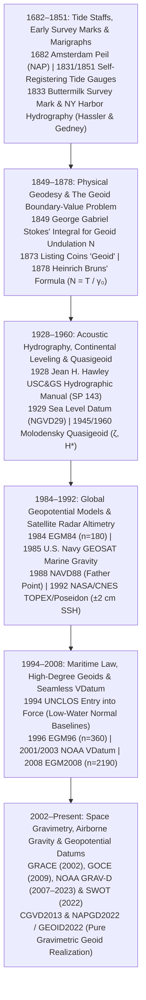

## 3.4 Historical Evolution (`gis-history` Context)

Whereas horizontal coordinate reference systems evolved from astronomical star catalogs, maritime compass bearings, and continental triangulation chains (Subsection 2.4), **vertical datums** evolved along two historically segregated physical tracks:
1. **Hydrographic and Tidal Chart Datums:** Driven by the immediate maritime survival imperative to prevent vessels from grounding at low tide, anchoring depths ($d$, positive-down) to local tide staffs, self-registering marigraphs, and low-water phases of the $18.61\text{-year}$ lunar nodal cycle.
2. **Terrestrial Geodetic and Gravimetric Datums:** Driven by civil engineering, canal construction, and continental spirit leveling, anchoring elevations ($H$, positive-up) to mean sea level and ultimately to equipotential surfaces of Earth's gravity field ($W(\mathbf{x}) = W_0$).

For more than three centuries, these two vertical worlds met only at isolated coastal benchmarks—leaving an unmapped, discontinuous vertical step across the intertidal zone. When a modern practitioner integrates a legacy 1930s U.S. Coast and Geodetic Survey (USC&GS) hydrographic smooth sheet, a 1970s USGS topographic quadrangle referenced to NGVD29, and a contemporary airborne bathymetric LiDAR cloud referenced to ITRF2020 / NAPGD2022, the decimeter- to meter-scale vertical offsets encountered are direct physical artifacts of the instruments, boundary-value theories, satellite altimeters, and legal conventions developed between the 17th and 21st centuries.



---

### 1682–1851: Coastal Flood Marks, the 1833 Buttermilk Survey Mark, and Self-Registering Marigraphs

#### 1682: Amsterdam *Normaal Amsterdams Peil* (NAP)

The earliest rigorous vertical datum in Western geodesy arose from the existential threat of storm-surge inundation in the Netherlands. Following catastrophic Zuiderzee dike breaches in 1675, Amsterdam burgomaster and mathematician **Johannes Hudde** directed the installation in **1682** of eight marble reference stones (*peilstenen*) embedded into the masonry locks separating the IJ tidal estuary from the city's internal canals (including the surviving *Eenhoornsluis* stone). Each stone carried a horizontal brass-inlaid groove marking the average summer high-water level of the IJ (*Stadspeil*, or Amsterdam City Level), providing an invariant physical horizon to verify that surrounding sea dikes were maintained at least $9\text{ Amsterdam feet}$ ($2.55\text{ m}$) above high water.

Extended across the Netherlands by precision spirit leveling under Cornelis Rudolphus Theodorus Krayenhoff (1798–1812) as *Amsterdams Peil* (AP) and re-leveled in 1875–1894 as ***Normaal Amsterdams Peil* (NAP)**, Hudde's 1682 tidal horizon was adopted by Prussia in 1879 (*Normalnull*, NN) and eventually chosen in 1955 as the fundamental zero point for the **United European Levelling Network (UELN)** and the modern **European Vertical Reference System (EVRS)**.

#### 1833: The Buttermilk Survey Mark and the Birth of U.S. Geodetic & Hydrographic Control

In the United States, President Thomas Jefferson established the *Survey of the Coast* in 1807 under Swiss geodesist **Ferdinand Rudolph Hassler**, but political interruptions delayed sustained field operations until 1832. In **June 1833**, Hassler established and occupied station **Buttermilk** on Buttermilk Hill (Mount Pleasant, Westchester County, New York, elevation $\sim 235\text{ m}$ overlooking the Hudson River)—monumented by a drill hole in bedrock that survives today as the oldest extant U.S. Coast and Geodetic Survey (USC&GS) survey mark—to anchor the primary triangulation and trigonometric height network extending into New York Harbor and Long Island Sound. Immediately thereafter (1833–1835), as Hassler's triangulation party and Lieutenant **Thomas R. Gedney's** hydrographic party surveyed New York Harbor, they confronted **Buttermilk Channel**, the narrow tidal strait separating Governors Island from Brooklyn (Red Hook). Long dismissed by merchant pilots as a shoal-choked hazard fit only for farmers' rowboats carrying buttermilk to Manhattan markets, Gedney's systematic lead-line soundings—reduced to local low-water tidal benchmarks established along the Governors Island and Brooklyn shores—revealed a deep, navigable natural channel through which major vessels could bypass the congested East River.

The **1833 Buttermilk survey mark** and the accompanying New York Harbor / Buttermilk Channel hydrographic surveys established the operational template that governed U.S. Coast Survey vertical and hydrographic control for the next century:
1. **Permanent Bedrock Monumentation and Tidal Benchmarks:** Chiseled drill holes, ceramic cones, or copper bolts set into bedrock or masonry seawalls immediately adjacent to coastal tide staffs and triangulation stations, preserving the vertical relationship between terrestrial control elevations and the low-water sounding datum even if a wooden tide staff was destroyed by winter ice or ship collisions.
2. **Chart Datum Conservatism:** Rather than referencing nautical charts to Mean Sea Level (where depths would be shallower than charted half the time), Hassler and his successor Alexander Dallas Bache mandated that soundings be reduced to **Mean Low Water (MLW)** on the Atlantic coast (and later **Mean Lower Low Water [MLLW]** on the mixed-semidiurnal Pacific coast), ensuring a conservative safety margin for navigation.

#### 1831–1851: Self-Registering Marigraphs (Tide Gauges)

Early tidal reductions relied on human observers reading a graduated wooden tide staff every $15\text{ to }30\text{ minutes}$ during daylight—missing nocturnal extrema and introducing observer bias in choppy seas. In **1831**, British civil engineer **Henry Robinson Palmer** designed the first **self-registering tide gauge (marigraph)** at the London Docks, coupling a copper float inside a wave-damping **stilling well** (a vertical pipe with a restricted orifice that mechanically low-pass-filtered high-frequency wind waves of period $T < 30\text{ s}$) via a pulley chain to a pencil tracing continuous water levels across a clockwork-driven paper drum.

In **1851**, instrument maker **Joseph Saxton** perfected a continuous self-registering tide gauge for the U.S. Coast Survey. Installed at permanent flagship stations—including **San Francisco (Fort Point / Crissy Field, continuous since June 30, 1854)**, New York, and Key West—Saxton's marigraphs produced the multi-decadal time series required to separate astronomical harmonic constituents (formulated by **William Thomson [Lord Kelvin]** and **George Howard Darwin** between 1867 and 1883, alongside **Lord Kelvin's 1872 mechanical harmonic tide-predicting machine**) from meteorological storm surge and secular eustatic/isostatic sea-level change.

---

### 1849–1878: Physical Geodesy, Stokes' Boundary-Value Integral, and Bruns' Formula

While hydrographers measured local water levels, 19th-century geodesists discovered that spirit-leveled heights and astro-geodetic latitudes disagreed across mountain ranges because Earth's gravity field is perturbed by heterogeneous crustal and mantle mass anomalies. In **1828**, **Carl Friedrich Gauss** proposed that the true mathematical figure of the Earth is the *geometrical surface which everywhere intersects the direction of gravity at right angles, and of which the surface of the ocean at rest forms a part*—a surface that his student **Johann Benedict Listing** officially named the **geoid** (*Geoid*) in **1873**.

#### 1849: George Gabriel Stokes' Boundary-Value Integral

How can a surveyor determine the elevation $N$ of the geoid above a reference ellipsoid across the globe without knowing the internal density distribution $\rho(\mathbf{x})$ deep inside the Earth? In **1849**, Lucasian Professor **George Gabriel Stokes** solved this Third Geodetic Boundary-Value Problem in his landmark memoir *On the Variation of Gravity at the Surface of the Earth*.

Splitting Earth's total gravity potential $W(\mathbf{x})$ into the normal potential $U(\mathbf{x})$ of a rotating equipotential reference ellipsoid and the small **disturbing (anomalous) potential** $T(\mathbf{x}) = W(\mathbf{x}) - U(\mathbf{x})$, Stokes proved that if no masses exist outside the geoid ($\nabla^2 T = 0$ in exterior space), $T$ at geocentric colatitude $\theta$ and longitude $\lambda$ is uniquely determined globally by integrating surface **gravity anomalies** $\Delta g(\theta', \lambda') = g_P - \gamma_Q$ over the unit sphere $\sigma$:

$$T(\theta, \lambda) = \frac{R}{4\pi} \iint_{\sigma} \Delta g(\theta', \lambda') \, S(\psi) \, d\sigma$$

where:
- $R \approx 6,371,008.8\text{ m}$ is the mean radius of the Earth,
- $\Delta g(\theta', \lambda') = g_P - \gamma_Q$ is the free-air gravity anomaly ($\text{m}\cdot\text{s}^{-2}$), comparing actual gravity $g_P$ reduced to the geoid with normal gravity $\gamma_Q$ on the reference ellipsoid,
- $\psi = \arccos\bigl(\cos\theta\cos\theta' + \sin\theta\sin\theta'\cos(\lambda - \lambda')\bigr)$ is the spherical angular distance ($\text{rad}$) between the computation point $(\theta, \lambda)$ and the running integration element $d\sigma = \sin\theta' \, d\theta' \, d\lambda'$, and
- $S(\psi)$ is **Stokes' kernel function** (dimensionless), defined in closed form as:

$$S(\psi) = \frac{1}{\sin(\psi/2)} - 6\sin\frac{\psi}{2} + 1 - 5\cos\psi - 3\cos\psi \ln\left(\sin\frac{\psi}{2} + \sin^2\frac{\psi}{2}\right)$$

#### 1878: Heinrich Bruns' Theorem

In **1878**, German astronomer and geodesist **Heinrich Bruns** derived the fundamental linear conversion between the disturbing potential $T$ ($\text{m}^2\cdot\text{s}^{-2}$, energy per unit mass) and the geometric **geoid undulation** $N$ ($\text{m}$) in his treatise *Die Figur der Erde*:

$$N(\theta, \lambda) = \frac{T(\theta, \lambda)}{\gamma_0(\theta)} \quad \xrightarrow{\text{Stokes (1849)}} \quad N(\theta, \lambda) = \frac{R}{4\pi \gamma_0(\theta)} \iint_{\sigma} \Delta g(\theta', \lambda') \, S(\psi) \, d\sigma$$

where $\gamma_0(\theta)$ is normal gravity ($\text{m}\cdot\text{s}^{-2}$, approximately $9.780\text{ m}\cdot\text{s}^{-2}$ at the equator to $9.832\text{ m}\cdot\text{s}^{-2}$ at the poles) evaluated on the reference ellipsoid at colatitude $\theta$. Together, **Stokes' integral (1849)** and **Bruns' formula (1878)** established that geometric height differences on Earth are inextricably governed by global integrals of gravitational potential—though practical application remained bottlenecked for another century by the total absence of gravity measurements over the $71\%$ of Earth covered by oceans (partially bridged in the 1920s–1930s by Dutch geodesist **Felix Andries Vening Meinesz**, who invented a three-pendulum apparatus mounted inside submerged naval submarines to measure marine gravity anomalies free of surface wave accelerations).

---

### 1928–1960: Hawley's *Hydrographic Manual*, NGVD29, and Molodensky's Quasigeoid

#### 1928: Jean H. Hawley's *Hydrographic Manual* (USC&GS Special Publication No. 143)

The 1920s witnessed the most disruptive sensor transition in the history of bathymetry: the shift from mechanical **sounding poles** and hemp/wire **lead lines** to **acoustic echo sounding** (such as Harvey C. Hayes's 1922 U.S. Navy sonic depth finder and Herbert Grove Dorsey's 1925 precision **Fathometer**). To standardize field procedures across this hybrid mechanical-acoustic transition, Commander **Jean H. Hawley** published the landmark **1928 *Hydrographic Manual*** (*U.S. Coast and Geodetic Survey Special Publication No. 143*).

Hawley's 1928 *Hydrographic Manual* codified the rigorous vertical reduction pipeline that connects raw shipboard depth observations to a charted tidal datum:
1. **Mechanical Lead-Line and Sounding-Pole Calibration:** Graduated wooden sounding poles (used in depths $d < 15\text{ ft}$) and cotton-hemp lead lines weighted with $8\text{–}14\text{ lb}$ lead plummets (armed with tallow in a basal recess to recover bottom sediment samples) stretched and shrank when wet. Hawley mandated soaking lead lines in sea water prior to calibration against steel standards on deck and applying lead-line length corrections alongside verticality corrections when currents deflected the wire from the plumb line.
2. **Acoustic Velocity Reduction:** Early Fathometers converted two-way acoustic travel time $\Delta t$ into uncorrected depth assuming a fixed calibration sound speed (typically $v_0 = 800\text{ fathoms}\cdot\text{s}^{-1} = 1,463.04\text{ m}\cdot\text{s}^{-1}$ or $1,500\text{ m}\cdot\text{s}^{-1}$). Hawley's manual established systematic acoustic depth corrections based on empirical seawater temperature, salinity, and pressure profiles (derived from serial water-bottle casts and **Nicholas Heck** and **Jerry H. Service's** 1924 USC&GS Special Publication No. 108 *Velocity of Sound in Sea Water*), laying the groundwork for modern Harmonic Mean Sound Speed (HMSS) and ray-tracing algorithms (Chapter 7).
3. **Tidal Zoning and Time/Range Ratio Reduction:** Recognizing that the tide at an offshore hydrographic sounding vessel differs in both phase (time lag $\Delta t_{\text{tide}}$, positive when high/low water at the offshore survey zone lags behind the coastal gauge) and amplitude (dimensionless range ratio $R_{\text{tide}}$) from a coastal marigraph, Hawley formalized **cotidal / corange zoning reductions** to reduce instantaneous water-surface depths $d_{\text{obs}}(x,y,t)$ (positive-down, $\text{m}$) to the chart datum $d_{\text{chart}}(x,y)$ (MLW or MLLW):

$$d_{\text{chart}}(x,y) = d_{\text{obs}}(x,y,t) + \Delta d_{\text{draft}} + \Delta d_{\text{velocity}} - R_{\text{tide}}(x,y) \, \bigl[\text{WL}_{\text{gauge}}(t - \Delta t_{\text{tide}}(x,y)) - \text{WL}_{\text{MLLW}}\bigr]$$

where $\Delta d_{\text{draft}}$ is the static/settlement transducer draft correction ($\text{m}$), $\Delta d_{\text{velocity}}$ is the acoustic sound-speed profile correction ($\text{m}$), and $\text{WL}_{\text{gauge}} - \text{WL}_{\text{MLLW}}$ is the observed tide-staff water level above the chart datum zero ($\text{m}$).

#### 1929: The Sea Level Datum of 1929 (NGVD29)

On land, just one year after Hawley's manual, the USC&GS and the Geodetic Survey of Canada executed a general least-squares adjustment of $106,724\text{ km}$ of first-order spirit leveling ($75,159\text{ km}$ in the U.S. and $31,565\text{ km}$ in Canada) to define the **Sea Level Datum of 1929**—renamed in 1973 as the **National Geodetic Vertical Datum of 1929 (NGVD29)** specifically to stop engineers from falsely assuming that $0.00\text{ ft/m}$ NGVD29 equaled local Mean Sea Level everywhere.

To anchor the 1929 adjustment, geodesists made a seemingly reasonable assumption that later proved physically flawed: they constrained **Local Mean Sea Level (LMSL)** to equal exactly $H = 0.000\text{ m}$ at **26 coastal tide gauges** simultaneously (21 in the U.S. from Portland, Maine, to Seattle, Washington, and 5 in Canada from Halifax to Vancouver). Because steady ocean currents, prevailing winds, and water-density gradients between the warm, lower-salinity Pacific and the cooler, higher-salinity Atlantic create permanent **Mean Dynamic Topography ($\text{MDT} = \text{LMSL} - \text{Geoid}$)**, actual mean sea level along the Pacific Northwest stands roughly $0.6\text{ to }1.0\text{ m}$ higher on a true geopotential surface than along the Atlantic and Gulf coasts. Forcing all 26 tide gauges to $0.000\text{ m}$ warped the continental spirit-leveling network, baking up to $0.9\text{ m}$ of artificial regional distortion into every USGS $7.5\text{-minute}$ contour map and legacy DEM produced over the next sixty years.

#### 1945 & 1960: Mikhail Molodensky's Surface Boundary-Value Theory and the Quasigeoid ($\zeta, H^*$)

Meanwhile, in classical Stokesian geodesy, reducing surface gravity measurements $g_S$ from the physical topographic terrain (at height $H$ above the geoid) down to the buried geoid inside continents required knowing the exact density $\rho(x,y,z)$ of the intervening mountain crust (typically approximated by **Friedrich Robert Helmert's** 1890 Poincaré–Prey reduction assuming a uniform standard granite density $\rho_0 = 2,670\text{ kg}\cdot\text{m}^{-3}$). In high mountain belts such as the Himalayas, Andes, or Rockies ($H \approx 4,000\text{ m}$), a $10\%$ error in assumed crustal density injects decimeter- to meter-scale systematic biases into both the geoid undulation $N$ and the Helmert orthometric height $H = C / \bar{g}$.

In **1945** (and expanded in his monumental **1960** treatise *Methods for Study of the External Gravitational Field and Figure of the Earth* with V. F. Eremeev and M. I. Yurkina), Soviet geodesist **Mikhail Sergeevich Molodensky** revolutionized physical geodesy by reformulating the boundary-value problem entirely on the **physical topographic surface of the Earth** (the *telluroid*), completely eliminating all assumptions about subsurface crustal density:
1. **Normal Height ($H^*$):** Instead of dividing the geopotential number $C_P = W_0 - W_P = \int_0^P g \, dn$ by the unmeasurable mean actual gravity $\bar{g}$ inside the crust, Molodensky divided $C_P$ by the analytically exact **mean normal gravity** $\bar{\gamma}$ along the ellipsoidal normal between the reference ellipsoid and the telluroid point $Q$ (defined by the condition that the normal potential at $Q$ equals the actual potential at $P$, $U(Q) = W(P)$ with $U_0 = W_0$):
   $$H^* = \frac{C_P}{\bar{\gamma}} = \frac{1}{\bar{\gamma}} \int_0^P g \, dn$$
2. **Height Anomaly ($\zeta$) and the Quasigeoid:** Subtracting the normal height $H^*$ (the ellipsoidal height of the telluroid $Q$) from the geometric ellipsoidal height $h$ of the physical surface $P$ defines the **height anomaly** $\zeta$ via Bruns' generalized surface formula:
   $$\zeta = h - H^* = \frac{T_P}{\gamma_Q}$$
   where $T_P = W(P) - U(P) = U(Q) - U(P)$ is the disturbing potential evaluated on the *physical terrain surface* $P$ and $\gamma_Q$ is normal gravity on the telluroid $Q$. Plotting $\zeta$ above the reference ellipsoid defines the **quasigeoid**—a mathematical surface that coincides identically with the classical geoid over the oceans ($H = H^* = 0 \implies \zeta = N$), avoids non-harmonic mass reductions inside continents, and today serves as the foundational vertical reference surface for Russia (Baltic 1977), China (CNVD), Germany (DHHN2016), and the **European Vertical Reference Frame (EVRF2019)**.

---

### 1984–1992: Global Geopotential Models, GEOSAT, NAVD88, and TOPEX/Poseidon

#### 1984: Earth Gravitational Model 1984 (EGM84)

With the deployment of the NAVSTAR Global Positioning System (GPS) and the introduction of **WGS84** in **1984**, the U.S. Defense Mapping Agency (DMA) released **Earth Gravitational Model 1984 (EGM84)**, expanding Earth's gravitational potential in spherical harmonics up to degree and order $n_{\max} = m_{\max} = 180$ ($(n_{\max}+1)^2 = 32,761$ total harmonic terms, or $32,757$ coefficients for $n \ge 2$, resolving spatial half-wavelengths $\lambda_{1/2} = \frac{\pi R}{n_{\max}} \approx \frac{20,000\text{ km}}{180} \approx 111\text{ km}$). For the first time, early GPS receivers could convert raw ellipsoidal heights $h$ into approximate orthometric heights $H \approx h - N_{\text{EGM84}}$ anywhere on Earth, though commission and omission errors in $N_{\text{EGM84}}$ exceeded $\pm 1\text{ to }3\text{ m}$ over poorly surveyed mountains and ocean basins.

#### 1985: U.S. Navy GEOSAT Radar Altimeter Mission

Because a calm ocean surface conforms closely to an equipotential surface of Earth's gravity field ($W = \text{const}$), underwater seamounts, fracture zones, and deep-ocean trenches attract excess water via gravitational pull, creating meter-scale bumps and troughs in the marine geoid directly above the seafloor topography. Following pioneering proof-of-concept radar altimeters aboard Skylab (1973), GEOS-3 (1975), and **Seasat** (1978, which failed after 105 days due to a short circuit), the U.S. Navy launched **GEOSAT** (*Geodetic Satellite*) on **March 12, 1985**.

During its initially classified 18-month Geodetic Mission (declassified globally in 1995), GEOSAT mapped the global marine geoid on a dense $\sim 4\text{ km}$ ground-track grid with $\sim 3\text{–}5\text{ cm}$ range precision. As demonstrated by **Walter H. F. Smith** and **David T. Sandwell** (1994, 1997), taking the vertical derivative of the marine geoid height $N$ measured by GEOSAT radar altimetry yields the marine gravity anomaly $\Delta g$ via the inverse Stokes/Fourier transform, which within the $15\text{–}160\text{ km}$ flexural wavelength band correlates directly with seafloor bathymetry—enabling the first complete global predicted bathymetric grids of Earth's oceans (Chapter 6).

#### 1988: The North American Vertical Datum of 1988 (NAVD88)

To correct the multi-tide-gauge warping of NGVD29 and repair thousands of benchmarks destroyed by highway construction or displaced by crustal motion, the U.S. National Geodetic Survey (NGS), Canada, and Mexico executed a massive Helmert-orthometric least-squares adjustment ($> 625,000\text{ km}$ of leveling lines across $450,000$ benchmarks) to establish the **North American Vertical Datum of 1988 (NAVD88)** (published by **David B. Zilkoski**, **John H. Richards**, and **Gary M. Young** in 1992).

Unlike NGVD29, NAVD88 held only a **single primary tidal benchmark fixed**: **Rimouski / Pointe-au-Père (Father Point), Quebec** ($\phi = 48^\circ 31'\text{ N}, \lambda = 68^\circ 28'\text{ W}$), located at the mouth of the St. Lawrence River, so as not to distort the continental leveling network with coastal Mean Dynamic Topography. Furthermore, NAVD88 replaced NGVD29's theoretical normal-orthometric correction with true surface gravity observations interpolated along every leveling line to compute geopotential numbers $C$ and Helmert orthometric heights $H$. However, as subsequent space gravimetry revealed, accumulating systematic errors across $5,000\text{ km}$ of spirit leveling from Quebec to the Pacific coast caused the realized NAVD88 zero surface to develop a **$\sim 1.5\text{ m}$ systematic tilt relative to a true global geoid equipotential surface** from the Canadian Rockies/Pacific Northwest down to southern Florida.

#### 1992: The NASA/CNES TOPEX/Poseidon Altimetry Revolution

While GEOSAT revolutionized short-wavelength marine gravity, radial orbit uncertainties ($\sim 50\text{–}100\text{ cm}$) prevented early altimeters from measuring basin-scale ocean circulation and absolute open-ocean tides. Launched on **August 10, 1992**, the joint U.S./French **TOPEX/Poseidon** mission (NASA and CNES) combined a dual-frequency radar altimeter (Ku-band $13.6\text{ GHz}$ and C-band $5.3\text{ GHz}$ to remove ionospheric delay), a three-frequency microwave radiometer (to correct wet tropospheric path delay), and three independent precision orbit determination systems (SLR, DORIS, and an experimental GPS receiver).

TOPEX/Poseidon reduced radial orbit error to below $2\text{ cm}$, achieving an unprecedented **$\pm 2\text{ to }3\text{ cm}$ absolute Sea Surface Height ($\text{SSH}$)** accuracy along a 10-day repeat orbit:

$$\text{SSH}(\phi, \lambda, t) = h_{\text{sat}}(\phi, \lambda, t) - R_{\text{alt}}(\phi, \lambda, t) = N(\phi, \lambda) + \text{MDT}(\phi, \lambda) + \eta_{\text{tide}}(\phi, \lambda, t) + \eta_{\text{meteo}}(\phi, \lambda, t)$$

This $2\text{ cm}$ accuracy revolutionized vertical datum science in three ways:
1. **Global Ocean Tide Models:** TOPEX/Poseidon data enabled the **FES** (*Finite Element Solution*, e.g., FES94 to FES2022), **GOT** (*Goddard Ocean Tide*), and **TPXO** (*TOPEX/Poseidon Crossover*, Egbert & Erofeeva) global barotropic tide models, allowing satellite laser/radar altimeters (ICESat-2, CryoSat-2) and offshore hydrographic vessels to remove open-ocean tides to within $\pm 1\text{–}2\text{ cm}$.
2. **Global Mean Sea Surface (MSS) and Mean Dynamic Topography (MDT):** By averaging multi-year altimetric profiles, oceanographers separated the static marine geoid $N$ from permanent geostrophic ocean circulation ($\text{MDT}$).
3. **Secular Global Mean Sea Level Rise:** TOPEX/Poseidon and its successor **Jason-1 (2001), Jason-2 (2008), Jason-3 (2016), and Sentinel-6 Michael Freilich (2020)** established the continuous space-geodetic record of global mean sea-level acceleration ($\sim 3.4\text{ mm}\cdot\text{yr}^{-1}$), proving that tidal datums must be periodically updated to new National Tidal Datum Epochs (NTDE).

---

### 1994–2008: UNCLOS, EGM96, NOAA VDatum, and EGM2008

#### 1994: Entry into Force of the UN Convention on the Law of the Sea (UNCLOS)

Signed at Montego Bay, Jamaica, on December 10, 1982, the **United Nations Convention on the Law of the Sea (UNCLOS)** formally entered into force on **November 16, 1994** (one year after Guyana deposited the 60th instrument of ratification). **Article 5 of UNCLOS** elevated hydrographic vertical datums into binding international law:

> *"Except where otherwise provided in this Convention, the normal baseline for measuring the breadth of the territorial sea is the **low-water line** along the coast as marked on large-scale charts officially recognized by the coastal State."*

Under UNCLOS, a sub-meter vertical shift in the realization of the **low-water line** (realized as **Lowest Astronomical Tide [LAT]** across most International Hydrographic Organization [IHO] member states via IHO Technical Resolution A2.5, or **Mean Lower Low Water [MLLW]** in the United States) over a gently sloping $1:2,000$ tidal flat or continental margin shifts the horizontal **normal baseline** seaward or landward by hundreds of meters—directly altering the outer limits of the $12\text{ nautical mile}$ Territorial Sea, the $24\text{ NM}$ Contiguous Zone, and the $200\text{ NM}$ Exclusive Economic Zone (EEZ) involving billions of dollars in seabed mineral, wind-energy, and fisheries rights.

#### 1996: Earth Gravitational Model 1996 (EGM96)

In **1996**, a collaborative team from NASA Goddard Space Flight Center, the U.S. National Imagery and Mapping Agency (NIMA, formerly DMA and now NGA), and The Ohio State University (led by **Frank G. Lemoine**, **Richard H. Rapp**, **Nikolaos K. Pavlis**, and colleagues) released **EGM96**. Combining surface gravity archives from newly opened post-Cold War regions with GEOSAT, ERS-1, and TOPEX/Poseidon altimetry and satellite tracking from over 30 spacecraft, EGM96 doubled the spherical harmonic expansion to degree and order **$n_{\max} = 360$** ($(360+1)^2 = 130,321$ total harmonic terms, or $130,317$ coefficients for $n \ge 2$, spatial half-wavelength $\lambda_{1/2} \approx 55\text{ km}$, evaluated on a $15' \times 15'$ global grid).

**EGM96 (EPSG:5773)** became the vertical datum backbone of first-generation global DEMs, serving as the native orthometric reference surface for the **2000 Shuttle Radar Topography Mission (SRTM)**, ASTER GDEM, and GTOPO30/GMTED2010.

#### 2001–2003: Operational Release of NOAA VDatum

Following devastating coastal hurricanes in the late 1990s, NOAA's Office of Coast Survey (OCS), Center for Operational Oceanographic Products and Services (CO-OPS), and National Geodetic Survey (NGS)—led by **Bruce B. Parker**, **Kurt W. Hess**, **Dennis G. Milbert**, and **Stephen Gill**—developed **VDatum** (first piloted in Tampa Bay in **2001** and released operationally in **2003**). VDatum solved the century-old coastal step discontinuity by chaining together three distinct transformation layers:
1. **Ellipsoid $\leftrightarrow$ Orthometric (`NAD83` $\leftrightarrow$ `NAVD88`):** Using NGS hybrid geoid models (`GEOID99` through `GEOID18`), which warp a gravimetric geoid via Least-Squares Collocation (LSC) to fit GPS-on-Bench-Marks (GPSBM).
2. **Orthometric $\leftrightarrow$ Local Mean Sea Level (`NAVD88` $\leftrightarrow$ `LMSL`):** Using a **Topography of the Sea Surface (TSS)** grid interpolated from tide gauges and hydrodynamic models to account for Mean Dynamic Topography and NAVD88's regional tilt.
3. **Local Mean Sea Level $\leftrightarrow$ Tidal Datums (`LMSL` $\leftrightarrow$ `MLLW`, `MLW`, `MHW`, `MHHW`):** Using unstructured finite-element hydrodynamic circulation models (such as **ADCIRC**) assimilated with CO-OPS tide gauge harmonics to map spatially varying tidal ranges across complex bays, barrier islands, and estuaries.

At the same time, VDatum enabled **Ellipsoidally Referenced Surveying (ERS)**: hydrographic vessels equipped with RTK/PPK GNSS and inertial navigation systems could now measure seabed depths directly relative to the reference ellipsoid ($z_{\text{ellip}}$) during acquisition—eliminating real-time tide gauge zoning errors, dynamic draft squat, and long-period heave drift—and reduce the resulting bathymetric surface directly to MLLW or NAVD88 via a single **Separation Model ($\text{SEP} = h_{\text{ellip}} - d_{\text{MLLW}}$)**.

#### 2008: Earth Gravitational Model 2008 (EGM2008)

In **2008**, the U.S. National Geospatial-Intelligence Agency (NGA) team led by **Nikolaos K. Pavlis**, **Simon A. Holmes**, **Steve C. Kenyon**, and **John K. Factor** published **EGM2008** (formally published in *Journal of Geophysical Research* in 2012). Integrating long-wavelength space gravimetry from the **GRACE** twin-satellite mission with a global $5' \times 5'$ terrestrial and altimetric gravity anomaly compilation, EGM2008 achieved a six-fold leap in spectral resolution to spherical harmonic degree and order **$n_{\max} = 2159$** ($2160^2 = 4,665,600$ terms, plus $67,089$ additional ellipsoidal-to-spherical conversion coefficients extending to degree **$2190$** and order $2159$, totaling **$4,732,685$ coefficients** for $n \ge 2$).

Resolving spatial half-wavelengths of **$\lambda_{1/2} \approx 9\text{ km}$** ($5\text{ arc-minutes}$) with a global RMS geoid commission error of $\pm 10\text{–}15\text{ cm}$ (and $\pm 3\text{–}5\text{ cm}$ over well-surveyed continents and oceans), **EGM2008 (EPSG:3855)** became the definitive global vertical datum of the 2010s–2020s, adopted natively by the **Copernicus DEM (GLO-30 / GLO-90)**, TanDEM-X EDEM, FABDEM, and modern global bathymetric/topographic synthesis pipelines.

| Global Geopotential Model | Year | Lead Agency / Investigators | Max Degree $n_{\max}$ | Harmonic Terms $(n_{\max}+1)^2$ ($n \ge 2$ Coeffs) | Spatial Half-Wavelength $\lambda_{1/2} \approx \frac{20,000\text{ km}}{n_{\max}}$ | Global Geoid RMS Accuracy $\sigma_N$ | Primary DEM / Altimetry Adoption |
| :--- | :--- | :--- | :--- | :--- | :--- | :--- | :--- |
| **EGM84** | 1984 | DMA (DoD) | $180$ | $32,761$ ($32,757$) | $\sim 111\text{ km}$ ($60'$) | $\pm 100\text{–}200\text{ cm}$ | Early GPS receivers, legacy DoD DTED |
| **EGM96** | 1996 | NASA / NIMA / OSU (Lemoine et al.) | $360$ | $130,321$ ($130,317$) | $\sim 55\text{ km}$ ($30'$) | $\pm 30\text{–}50\text{ cm}$ | **SRTM**, ASTER GDEM, GMTED2010 (`EPSG:5773`) |
| **EGM2008** | 2008 | NGA (Pavlis et al.) | $2159$ ($2190$) | $4,665,600$ ($4,732,685$) | $\sim 9.1\text{ km}$ ($5'$) | $\pm 10\text{–}15\text{ cm}$ | **Copernicus DEM**, FABDEM, AW3D30 (`EPSG:3855`) |
| **XGM2019e_2159** | 2019 | TUM / GFZ (Zingerle et al.) | $2190$ ($5400$) | $4,732,685+$ ($29.2\text{M}$) | $\sim 9.1\text{ km}$ ($\sim 3.7\text{ km}$) | $\pm 5\text{–}10\text{ cm}$ | GOCE+GRACE-FO synthesis, high-res regional geoids |
| **GEOID2022 (NAPGD2022)** | 2022–2026 | NOAA NGS / CGS / INEGI | Gravimetric Grid | $1' \times 1'$ Grid | $\sim 1.85\text{ km}$ ($1'$) | $\pm 1\text{–}2\text{ cm}$ (North America) | **USGS 3DEP**, NOAA TBDEMs, CGVD2013/NAPGD2022 |

---

### 2002–Present: Space Gravimetry (GRACE, GOCE), GRAV-D, SWOT, and NAPGD2022

In the first quarter of the 21st century, three space- and airborne-geodetic breakthroughs enabled geodesists to retire passive continental spirit-leveling networks altogether in favor of **pure gravimetric geopotential datums** realized directly through GNSS:
1. **Satellite-to-Satellite Tracking and Gravity Gradiometry (`GRACE` 2002, `GOCE` 2009, `GRACE-FO` 2018):**
   - **GRACE** (*Gravity Recovery and Climate Experiment*, NASA/DLR, launched March 2002) used K-band microwave ranging ($\sim 1\text{ }\mu\text{m}\cdot\text{s}^{-1}$ range-rate precision) between two co-orbital satellites separated by $220\text{ km}$ to map both the static long-wavelength gravity field ($n \le 150$) to millimeter geoid accuracy and monthly **time-variable gravity** ($\Delta N(t)$ driven by ice-sheet mass loss, terrestrial groundwater depletion, and Glacial Isostatic Adjustment [GIA]).
   - **GOCE** (*Gravity Field and Steady-State Ocean Circulation Explorer*, ESA, launched March 2009) flew at an ultra-low drag-free altitude of $255\text{ km}$ carrying a three-axis electrostatic **gravity gradiometer** that measured the spatial second derivatives of the geopotential tensor $T_{ij} = \frac{\partial^2 T}{\partial x_i \partial x_j}$ to $1\text{–}2\text{ cm}$ geoid accuracy at $100\text{ km}$ half-wavelength ($n = 200$), allowing oceanographers to compute absolute Mean Dynamic Topography directly from $\text{MDT} = \text{MSS}_{\text{altimetry}} - N_{\text{GOCE}}$ without relying on oceanographic hydrographic casts.
2. **Airborne Gravimetry (`GRAV-D` 2007–2023):** To bridge the spectral gap between GOCE satellite gravimetry ($\lambda_{1/2} \approx 100\text{ km}$) and noisy, sparse terrestrial surface gravity points ($\lambda_{1/2} < 10\text{ km}$), NOAA's National Geodetic Survey launched **GRAV-D** (*Gravity for the Redefinition of the American Vertical Datum*) in 2007, flying kinematic airborne gravimeters across the entire United States, Alaska, Hawaii, and territories at $10\text{ km}$ line spacing and $6\text{–}11\text{ km}$ altitude.
3. **Pure Gravimetric Geoid Datums (`CGVD2013` and `NAPGD2022`) and `SWOT` (2022):**
   - Canada led the transition in November 2013 by replacing its spirit-leveled CGVD28 datum with the **Canadian Geodetic Vertical Datum of 2013 (CGVD2013)**, defined purely as the equipotential surface $W_0 = 62,636,856.0\text{ m}^2\cdot\text{s}^{-2}$.
   - Following completion of GRAV-D, the United States, Canada, and Mexico jointly established the **North American-Pacific Geopotential Datum of 2022 (NAPGD2022)** (operationalized via the **$1' \times 1'$ `GEOID2022`** static and dynamic geoid grids on the $W_0 = 62,636,856.0\text{ m}^2\cdot\text{s}^{-2}$ geopotential surface). In NAPGD2022, orthometric height is defined strictly by $H_{\text{NAPGD2022}}(t) = h_{\text{ITRF/NATRF}}(t) - N_{\text{GEOID2022}}(t)$, permanently eliminating the $1.5\text{ m}$ continental leveling tilt of NAVD88.
   - Simultaneously at sea, the December 2022 launch of the **NASA/CNES Surface Water and Ocean Topography (SWOT)** Ka-band Radar Interferometer (**KaRIn**) replaced 1D nadir altimeter ground tracks with $120\text{ km}$-wide 2D swath interferometry, resolving sub-mesoscale coastal dynamic topography, estuarine water-surface slopes, and short-wavelength marine gravity down to $15\text{ km}$ resolution right up to the land–sea interface.

---

### Worked Numerical Example: Multi-Generation Vertical Datum Shifts at a Pacific Northwest Estuary

To appreciate why historical metadata provenance is critical when merging multi-vintage DEMs, consider a coastal benchmark and adjacent estuarine channel near **Astoria / Columbia River Mouth, Oregon** ($\phi = 46^\circ 11' 24.0''\text{ N}, \lambda = 123^\circ 50' 24.0''\text{ W}$), where a coastal engineer stacks four historical generations of elevation and bathymetric datasets at a tide-gauge benchmark whose ITRF2020 / NAD83(2011) (epoch 2010.0) ellipsoidal height is $h_{\text{NAD83(2011)}} = -18.420\text{ m}$:

1. **Legacy 1950s USGS Topographic DEM (`NGVD29`):**
   - Published benchmark elevation on NGVD29: $H_{\text{NGVD29}} = +2.680\text{ m}$.
   - Why? In 1929, LMSL at the nearby Seattle and Portland/Astoria gauges was forced to $0.000\text{ m}$, hiding the $\sim +0.85\text{ m}$ Pacific Northwest Mean Dynamic Topography ($\text{MDT}$).
2. **Modern LiDAR DEM (`NAVD88` via `GEOID18`, EPSG:5703):**
   - At Astoria, the hybrid geoid separation between `NAD83(2011)` and `NAVD88` is $N_{\text{GEOID18}} = -22.180\text{ m}$, giving:
     $$H_{\text{NAVD88}} = h_{\text{NAD83(2011)}} - N_{\text{GEOID18}} = -18.420 - (-22.180) = +3.760\text{ m}$$
   - Notice the **$+1.080\text{ m}$ vertical jump** ($H_{\text{NAVD88}} - H_{\text{NGVD29}} = 3.760 - 2.680 = +1.080\text{ m}$, verified via NGS `VERTCON` 3.0) caused by releasing the 26 coastal tide-gauge constraints of 1929 and accumulating transcontinental leveling tilt from Rimouski, Quebec!
3. **Global Satellite DEMs (`EGM96` vs. `EGM2008`) and Modern Gravimetric Datum (`NAPGD2022`):**
   - Because NAVD88's zero surface is tilted upward by $\sim +0.95\text{ m}$ in the Pacific Northwest relative to the true $W_0 = 62,636,856.0\text{ m}^2\cdot\text{s}^{-2}$ geoid equipotential surface, transitioning from `NAVD88` to the pure gravimetric **`NAPGD2022` (`GEOID2022`)** lowers the orthometric height at Astoria by $\Delta H_{\text{NAPGD2022}-\text{NAVD88}} \approx -0.940\text{ m}$, yielding $H_{\text{NAPGD2022}} \approx +2.820\text{ m}$.
   - Meanwhile, comparing global geopotential models over the steep Oregon Coast Range / Cascadia Trench gravity gradient reveals a $-0.310\text{ m}$ short-wavelength omission error between coarse **EGM96** ($n=360$) and high-degree **EGM2008** ($n=2190$).
4. **Hydrographic Chart Datum (`MLLW`, NTDE 1983–2001 via `VDatum`):**
   - At Astoria (Tongue Point), the `NAVD88` zero surface lies $+0.070\text{ m}$ above the `MLLW` zero surface (so positive-up heights satisfy $H_{\text{NAVD88}} = H_{\text{MLLW}} - 0.070\text{ m}$, placing the benchmark at $H_{\text{MLLW}} = +3.830\text{ m}$, whereas converting a positive-down bathymetric sounding $d_{\text{MLLW}}$ to positive-up `NAVD88` elevation requires both sign inversion and datum shift: $H_{\text{NAVD88}} = -d_{\text{MLLW}} - 0.070\text{ m}$). Meanwhile, Local Mean Sea Level (`LMSL`) lies $+1.330\text{ m}$ above `MLLW` ($H_{\text{LMSL,NAVD88}} = +1.260\text{ m}$).
   - If an analyst naively merges a legacy 1950s `NGVD29` floodplain DEM with a 2020s `NAVD88` LiDAR DEM without applying the `VERTCON` grid shift, or merges a `MLLW` sounding grid assuming `MLLW` equals `LMSL` ($0\text{ m}$ NGVD29), they inject **$1.08\text{ to }1.33\text{ m}$ of false vertical step error**—exceeding an entire century of projected relative sea-level rise!

> [!WARNING]
> **Never Assume `NGVD29`, `NAVD88`, `EGM96`, `EGM2008`, and `LMSL` Are Interchangeable "Sea Level":** Across North America, `NAVD88 - NGVD29` shifts from $-0.4\text{ m}$ in Florida to $+1.5\text{ m}$ in the Rocky Mountains and Pacific Northwest; `NAPGD2022 - NAVD88` shifts from $-0.2\text{ m}$ on the Atlantic coast to $-1.3\text{ m}$ in the Pacific Northwest; and `EGM2008 - EGM96` exhibits $\pm 0.5\text{ to }2.5\text{ m}$ oscillatory differences across coastal mountain ranges and oceanic trenches due to spherical harmonic truncation between $n=360$ and $n=2190$.

Practitioners can execute reproducible multi-vintage vertical datum transformations directly using `PROJ` and `GDAL` with cloud-hosted GeoTIFF Geodetic Transformation Grids (GTG):

```bash
# 1. Transform a point at Astoria, OR from NAD27 + NGVD29 (EPSG:4267+5702)
#    to NAD83(2011) + NAVD88 (EPSG:6318+5703) using NADCON5 and VERTCON 3.0 grids
#    (Note: PROJ cs2cs with EPSG geographic authority codes expects "lat lon height" axis order)
echo "46.190000 -123.840000 2.680" | cs2cs -d 6 EPSG:4267+5702 EPSG:6318+5703

# 2. Reproject a legacy SRTM tile from WGS84 + EGM96 height (EPSG:4326+5773)
#    to WGS84 + EGM2008 height (EPSG:4326+3855) to harmonize with Copernicus DEM
gdalwarp -s_srs "EPSG:4326+5773" -t_srs "EPSG:4326+3855" \
  -r bilinear -co COMPRESS=DEFLATE -co PREDICTOR=3 \
  srtm_egm96.tif srtm_egm2008.tif
```

---

### Summary of Foundational Vertical Datum & Hydrographic Milestones (`gis-history`)

| Era / Year | Milestone & Principal Investigators | Enduring Legacy for Modern DEM & Bathymetric Workflows |
| :--- | :--- | :--- |
| **1682** | **Amsterdam *Peil* (`NAP`, Johannes Hudde)** | Eight marble tide-lock stones marking IJ mean summer high water; zero point for modern European vertical datums (`EVRF2019`). |
| **1831 & 1851** | **Self-Registering Marigraphs (Palmer 1831, Saxton 1851)** | Float-and-stilling-well continuous tide gauges enabling harmonic tidal analysis (Kelvin & Darwin) and NTDE epochs. |
| **1833** | **Buttermilk Survey Mark & NY Harbor Hydrography (Hassler & Gedney)** | Oldest surviving USC&GS bedrock station mark (Buttermilk Hill) and tidal benchmarks linking New York Harbor soundings to low water. |
| **1849 & 1878** | **Stokes' Boundary-Value Integral (1849) & Bruns' Formula (1878)** | Proved that geoid undulation $N = T/\gamma_0$ can be computed globally from surface gravity anomalies $\Delta g$ via Stokes' kernel $S(\psi)$. |
| **1928** | **Jean H. Hawley's *Hydrographic Manual* (USC&GS SP 143)** | Codified lead-line/pole calibration, acoustic echo-sounder velocity corrections, and cotidal/corange tidal datum reduction. |
| **1929** | **Sea Level Datum of 1929 (`NGVD29`)** | Continental leveling network constrained to $0.00\text{ m}$ at 26 tide gauges, baking Mean Dynamic Topography into legacy DEMs. |
| **1945 & 1960** | **Mikhail Molodensky's Surface Boundary-Value Theory** | Defined normal heights ($H^* = C/\bar{\gamma}$) and the quasigeoid ($\zeta = h - H^*$) without crustal density assumptions (`EVRF2019`). |
| **1984 & 1985** | **`EGM84` ($n=180$) & U.S. Navy `GEOSAT` Altimeter** | First global WGS84 spherical harmonic geoid model and dense ($\sim 4\text{ km}$) satellite radar altimetry of the global marine geoid. |
| **1988 & 1992** | **`NAVD88` (Zilkoski et al.) & `TOPEX/Poseidon` (NASA/CNES)** | Single-benchmark Helmert orthometric datum at Rimouski; $\pm 2\text{ cm}$ radar altimetry revolutionizing global tide models (`FES`, `GOT`, `TPXO`). |
| **1994 & 1996** | **`UNCLOS` Entry into Force & `EGM96` ($n=360$, Lemoine et al.)** | Codified low-water normal baselines (`LAT`/`MLLW`) in international law; `EGM96` (`EPSG:5773`) became the vertical datum of SRTM. |
| **2001–2008** | **NOAA `VDatum` (2001/2003) & NGA `EGM2008` ($n=2190$, Pavlis et al.)** | Seamless `NAD83` $\leftrightarrow$ `NAVD88` $\leftrightarrow$ `LMSL` $\leftrightarrow$ `MLLW` coastal grids (`ERS`/`SEP`); $5'$ global geoid (`EPSG:3855`, Copernicus DEM). |
| **2002–Present** | **`GRACE`, `GOCE`, `GRAV-D`, `SWOT` (2022) & `NAPGD2022` (`GEOID2022`)** | Space/airborne gravimetry and swath interferometry enabling pure $1\text{–}2\text{ cm}$ gravimetric geopotential datums ($W_0 = 62,636,856.0\text{ m}^2\cdot\text{s}^{-2}$). |
