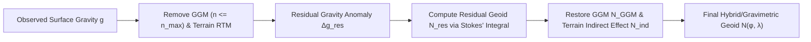
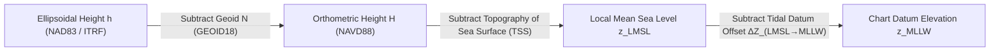

## 3.5 Mathematical Foundations

Constructing a seamless Topo-Bathymetric Digital Elevation Model (TBDEM) across the coastal land–sea interface requires rigorous mathematical transformations between geometric (ellipsoidal), gravimetric (geoidal/orthometric), and hydrodynamic (tidal) vertical reference frames. Every vertical datum transformation rests upon three foundational mathematical pillars:
1. **Physical geodesy and potential theory**, which govern the computation of the geoid undulation $N(\varphi, \lambda)$ from global spherical harmonic gravity models and regional terrestrial/marine gravity anomalies via Bruns' formula and Stokes' integral.
2. **Harmonic tidal constituent analysis and prediction**, which decompose the non-stationary, astronomically forced and frictionally distorted sea surface $z_{\text{tide}}(t)$ into discrete spectral frequencies to establish local tidal datums (e.g., MLLW, LMSL, MHW, LAT) over an 18.61-year National Tidal Datum Epoch.
3. **First-order variance–covariance uncertainty propagation**, which combines sensor positioning variance, geoid model uncertainty, hydrodynamic sea surface topography error, and tidal datum interpolation variance into a unified Total Vertical Uncertainty (TVU) budget for every DEM grid node.

---

### 3.5.1 Potential Theory, Bruns' Formula, Stokes' Integral, and Spherical Harmonic Geoid Expansion

#### Gravity Potential, Normal Potential, and the Disturbing Potential
A particle rotating with the solid Earth at geocentric position vector $\mathbf{r} = (x, y, z)^{\mathsf{T}}$ in an Earth-Centered, Earth-Fixed (ECEF) coordinate frame experiences the total **gravity potential** $W(\mathbf{r})$ (SI units: $\text{m}^2\,\text{s}^{-2}$ or $\text{J}\,\text{kg}^{-1}$), which is the sum of the Newtonian gravitational potential $V(\mathbf{r})$ of the Earth's heterogeneous mass distribution $\rho(\mathbf{r}')$ and the centrifugal potential $\Phi_{\text{cent}}(\mathbf{r})$ due to Earth's mean angular velocity $\omega_E \approx 7.292115 \times 10^{-5}\text{ rad s}^{-1}$:
$$W(\mathbf{r}) = V(\mathbf{r}) + \Phi_{\text{cent}}(\mathbf{r}) = G \iiint_{\Omega_E} \frac{\rho(\mathbf{r}')}{\|\mathbf{r} - \mathbf{r}'\|}\,d^3\mathbf{r}' + \frac{1}{2}\omega_E^2 (x^2 + y^2)$$
where $G = 6.67430 \times 10^{-11}\text{ m}^3\,\text{kg}^{-1}\,\text{s}^{-2}$ is the Newtonian constant of gravitation and $\Omega_E$ is the volume of the solid Earth, oceans, and atmosphere. Whereas $V(\mathbf{r})$ is harmonic outside the attracting masses ($\nabla^2 V = 0$), the centrifugal potential satisfies $\nabla^2 \Phi_{\text{cent}} = 2\omega_E^2$, so the total gravity potential satisfies Poisson's equation $\nabla^2 W(\mathbf{r}) = -4\pi G \rho(\mathbf{r}) + 2\omega_E^2$. Because $W(\mathbf{r})$ is positive and decreases outward with altitude, the local **gravity vector** $\mathbf{g}(\mathbf{r}) = \nabla W(\mathbf{r})$ points downward (nadir) along the local astronomic plumb line with scalar gravity acceleration $g = \|\nabla W\|$ ($\text{m s}^{-2}$), whereas the outward/upward unit surface normal (astronomic zenith) perpendicular to the equipotential surface is $\mathbf{n}_g = -\mathbf{g}/g$.

The **geoid** is defined as the specific equipotential surface of the Earth's gravity field where the gravity potential equals a conventional constant reference value $W_0$:
$$\mathcal{S}_{\text{geoid}} = \left\{ \mathbf{r} \in \mathbb{R}^3 \;\middle|\; W(\mathbf{r}) = W_0 \right\}$$
with the International Association of Geodesy (IAG) 2015 Resolution No. 1 adopting $W_0 = 62\,636\,853.4\text{ m}^2\,\text{s}^{-2}$ for the International Height Reference System (compared to the IERS 2010 convention $W_0 = 62\,636\,856.0\text{ m}^2\,\text{s}^{-2}$). Because solving the free boundary-value problem directly for the irregular surface $\mathcal{S}_{\text{geoid}}$ is nonlinear, physical geodesy introduces a Somigliana–Pizzetti level reference ellipsoid of revolution (e.g., GRS80 or WGS84, defined by semi-major axis $a$, geocentric gravitational constant $GM$, dynamic form factor $J_2$, and rotation rate $\omega_E$). This reference ellipsoid generates a mathematically closed-form **normal gravity potential** $U(\mathbf{r})$ such that the surface of the reference ellipsoid $\mathcal{S}_{\text{ell}}$ is itself an equipotential surface of $U$:
$$\mathcal{S}_{\text{ell}} = \left\{ \mathbf{r} \in \mathbb{R}^3 \;\middle|\; U(\mathbf{r}) = U_0 \right\}$$
The **normal gravity vector** is $\boldsymbol{\gamma}(\mathbf{r}) = \nabla U(\mathbf{r})$, with scalar magnitude $\gamma_0(\varphi)$ on the ellipsoid surface given by Somigliana's (1929) closed-form formula as a function of geodetic latitude $\varphi$:
$$\gamma_0(\varphi) = \frac{a \gamma_e \cos^2\varphi + b \gamma_p \sin^2\varphi}{\sqrt{a^2 \cos^2\varphi + b^2 \sin^2\varphi}}$$
where $a$ and $b$ are the semi-major and semi-minor axes, and $\gamma_e, \gamma_p$ are normal gravity at the equator and poles, respectively (for GRS80: $a = 6\,378\,137.0\text{ m}$, $b = 6\,356\,752.3141\text{ m}$, $\gamma_e = 9.7803267715\text{ m s}^{-2}$, and $\gamma_p = 9.8321863685\text{ m s}^{-2}$; for WGS84: $a = 6\,378\,137.0\text{ m}$, $b = 6\,356\,752.3142\text{ m}$, $\gamma_e = 9.7803253359\text{ m s}^{-2}$, and $\gamma_p = 9.8321849378\text{ m s}^{-2}$).

The small departure of the actual gravity potential $W(\mathbf{r})$ from the normal potential $U(\mathbf{r})$ is defined as the **disturbing potential** (or anomalous potential) $T(\mathbf{r})$:
$$T(\mathbf{r}) = W(\mathbf{r}) - U(\mathbf{r})$$
Because both $W(\mathbf{r})$ and $U(\mathbf{r})$ share the exact same centrifugal potential $\Phi_{\text{cent}}(\mathbf{r})$, the centrifugal terms cancel identically in $T(\mathbf{r}) = V(\mathbf{r}) - V_{\text{norm}}(\mathbf{r})$. Consequently, outside the attracting masses of the Earth, the disturbing potential $T(\mathbf{r})$ is strictly harmonic and satisfies Laplace's equation:
$$\nabla^2 T(\mathbf{r}) = 0$$

#### Exact Derivation of Bruns' Formula (1878)
Consider a point $Q_0$ on the reference ellipsoid $\mathcal{S}_{\text{ell}}$ at geodetic coordinates $(\varphi, \lambda, h=0)$, where the normal potential is $U(Q_0) = U_0$. Project $Q_0$ upward along the ellipsoidal surface normal $\mathbf{n}_e$ by the **geoid undulation** (geoid height) $N$ to the corresponding point $P_0$ on the geoid $\mathcal{S}_{\text{geoid}}$, where the actual gravity potential is $W(P_0) = W_0$. Expanding the normal potential $U(P_0)$ at the geoid in a first-order Taylor series about $Q_0$ along the outward ellipsoidal normal $\mathbf{n}_e$ (along which $\partial U / \partial h = -\gamma_0$ because potential decreases outward):
$$U(P_0) = U(Q_0) + \left.\frac{\partial U}{\partial h}\right|_{Q_0} N + \mathcal{O}(N^2) = U_0 - \gamma_0(\varphi) N + \mathcal{O}(N^2)$$
Since $|N| \le 106\text{ m}$ globally and the vertical gradient of normal gravity is $\partial \gamma / \partial h \approx -3.086 \times 10^{-6}\text{ s}^{-2}$, the neglected second-order term $\frac{1}{2}(\partial^2 U / \partial h^2) N^2 = -\frac{1}{2}(\partial \gamma / \partial h) N^2$ is at most $\sim 0.0173\text{ m}^2\,\text{s}^{-2}$ ($\sim 1.8\text{ mm}$ in equivalent height). Substituting $U(P_0) = W(P_0) - T(P_0) = W_0 - T(P_0)$ into the Taylor expansion yields $W_0 - T(P_0) = U_0 - \gamma_0(\varphi) N$. Solving for the geoid undulation $N$ yields the general form of **Bruns' formula** (derived by Heinrich Bruns in 1878):
$$N(\varphi, \lambda) = \frac{T(P_0) - (W_0 - U_0)}{\gamma_0(\varphi)} = \frac{T(P_0) - \Delta W_0}{\gamma_0(\varphi)}$$
where $\Delta W_0 = W_0 - U_0$ is the zero-degree potential offset between the chosen geoid equipotential $W_0$ and the normal potential $U_0$ of the reference ellipsoid. When the reference ellipsoid is chosen such that $U_0 = W_0$ ($\Delta W_0 = 0$), Bruns' formula simplifies to its classic canonical form:
$$N(\varphi, \lambda) = \frac{T(\varphi, \lambda)}{\gamma_0(\varphi)}$$
Bruns' formula is the fundamental bridge of physical geodesy: it converts a dynamic physical quantity—the disturbing potential $T$ ($\text{m}^2\,\text{s}^{-2}$)—directly into a geometric vertical separation—the geoid height $N$ ($\text{m}$) above the reference ellipsoid.

#### The Fundamental Boundary Condition, Stokes' Integral (1849), and Remove–Compute–Restore
Because $T(\mathbf{r})$ cannot be measured directly by any physical sensor, it must be recovered from gravimetric measurements of the **gravity anomaly** $\Delta g$, defined as the difference between scalar gravity $g(P_0)$ reduced to the geoid and normal gravity $\gamma(Q_0)$ on the ellipsoid:
$$\Delta g = g(P_0) - \gamma(Q_0)$$
Because $\partial W / \partial h = -g$ and $\partial U / \partial h = -\gamma$ along the outward normal (neglecting the second-order square of the deflection of the vertical), $\left.\frac{\partial T}{\partial h}\right|_{P_0} = -\left(g(P_0) - \gamma(P_0)\right)$. Expanding $\gamma(P_0)$ about $Q_0$ via $\gamma(P_0) \approx \gamma(Q_0) + \frac{\partial \gamma}{\partial h} N$ and substituting Bruns' formula $N = T/\gamma_0$ produces the **fundamental boundary condition of physical geodesy**:
$$\frac{\partial T}{\partial h} - \frac{1}{\gamma_0}\frac{\partial \gamma}{\partial h}\,T = -\Delta g$$
In the spherical approximation (replacing the reference ellipsoid by a mean Earth sphere of radius $R \approx 6\,371\,008.8\text{ m}$, where $\gamma_0 \approx GM/R^2$ and the normal vertical gravity gradient is $\partial \gamma / \partial r = -2\gamma_0/R$), the boundary condition becomes a Robin (third-kind) boundary-value problem on the sphere $r = R$:
$$\left.\frac{\partial T}{\partial r}\right|_{r=R} + \frac{2}{R}\,T(R, \varphi, \lambda) = -\Delta g(\varphi, \lambda)$$
In 1849, George Gabriel Stokes solved Laplace's equation $\nabla^2 T = 0$ exterior to the sphere $r = R$ subject to this boundary condition, obtaining the celebrated **Stokes' integral** over the unit sphere $\sigma$:
$$N(\varphi, \lambda) = \frac{R}{4\pi \gamma_0(\varphi)} \iint_{\sigma} \Delta g(\varphi', \lambda')\, S(\psi)\, d\sigma$$
where $d\sigma = \cos\varphi'\,d\varphi'\,d\lambda'$ is the differential solid angle element at source point $(\varphi', \lambda')$, $\psi$ is the spherical angular distance between the computation point $(\varphi, \lambda)$ and the running integration point $(\varphi', \lambda')$:
$$\cos\psi = \sin\varphi\sin\varphi' + \cos\varphi\cos\varphi'\cos(\lambda - \lambda')$$
and $S(\psi)$ is the **Stokes kernel** (or Stokes function), expressed in closed form and spectral Legendre series as:
$$S(\psi) = \sum_{n=2}^{\infty} \frac{2n + 1}{n - 1}\,P_n(\cos\psi) = \frac{1}{\sin(\psi/2)} - 6\sin\frac{\psi}{2} + 1 - 5\cos\psi - 3\cos\psi\ln\left(\sin\frac{\psi}{2} + \sin^2\frac{\psi}{2}\right)$$
Notice that as $\psi \to 0$, the leading term $1/\sin(\psi/2) \approx 2/\psi$ exhibits a weak integrable singularity, while the differential surface element $d\sigma = \sin\psi\,d\psi\,d\alpha$ contains $\sin\psi \approx \psi$, rendering the product $S(\psi)\,d\sigma$ finite at the computation point (though requiring careful numerical inner-zone evaluation using planar Taylor approximations of $\Delta g$).

Because evaluating Stokes' integral directly over the entire globe requires continuous terrestrial and marine gravity coverage everywhere, modern operational geoid computation (e.g., NOAA's GEOID18 and the NGS Geoid Monitoring Service) employs the **Remove–Compute–Restore (RCR)** spectral decomposition:

Specifically, the total geoid undulation is partitioned into long-wavelength global satellite gravity ($N_{\text{GGM}}$), medium-wavelength regional Stokesian residual gravity ($N_{\text{res}}$), and short-wavelength topographic/bathymetric terrain effects ($\Delta N_{\text{topo}}$):
$$N(\varphi, \lambda) = N_{\text{GGM}}(\varphi, \lambda) + \frac{R}{4\pi\gamma_0}\iint_{\sigma_{\text{cap}}} \Delta g_{\text{res}}(\varphi', \lambda')\,S_{\text{mod}}(\psi)\,d\sigma + \Delta N_{\text{topo}}(\varphi, \lambda)$$
where $\Delta g_{\text{res}} = \Delta g_{\text{FA}} - \Delta g_{\text{GGM}} - \Delta g_{\text{RTM}}$ is the residual free-air gravity anomaly after stripping the Global Geopotential Model (GGM) and Residual Terrain Model (RTM) high-frequency topography/bathymetry, and $S_{\text{mod}}(\psi)$ is a Wong–Gore or Featherstone–Evans–Olliver modified Stokes kernel (which filters out degrees $2 \le n \le n_{\text{GGM}}$ from the spectral series of $S(\psi)$) integrated over a spherical cap $\sigma_{\text{cap}}$.

#### Fully Normalized Spherical Harmonic Expansion (EGM2008)
Because $T(r, \theta, \lambda)$ satisfies Laplace's equation $\nabla^2 T = 0$ outside the Earth's masses, separation of variables in spherical coordinates—geocentric radius $r$, geocentric colatitude $\theta = 90^\circ - \varphi_{\text{geoc}}$, and longitude $\lambda$—yields the **spherical harmonic expansion** of the geoid undulation via Bruns' formula. For high-degree Global Geopotential Models such as **EGM2008** (Pavlis et al., 2012), which is complete in ellipsoidal harmonics to degree and order $2159$ and extends in spherical harmonic coefficients to degree $n_{\max} = 2190$ and order $m_{\max} = 2159$ (corresponding to a half-wavelength spatial resolution of $\Delta x \approx \pi R / n_{\max} \approx 9.1\text{ km}$, or $5'\times 5'$ grid spacing):
$$N(\theta, \lambda) = N_0 + \frac{GM}{r\,\gamma_0(\theta)} \sum_{n=2}^{n_{\max}} \left(\frac{a}{r}\right)^n \sum_{m=0}^{n} \left( \Delta\bar{C}_{nm} \cos m\lambda + \Delta\bar{S}_{nm} \sin m\lambda \right) \bar{P}_{nm}(\cos\theta) + \Delta N_{\text{topo}}(\theta, \lambda)$$
Every term and symbol in this expansion carries a precise physical and numerical meaning:
* $GM = 3.986004415 \times 10^{14}\text{ m}^3\,\text{s}^{-2}$ is the geocentric gravitational constant (including the mass of the atmosphere), and $a = 6\,378\,136.3\text{ m}$ is the scaling semi-major axis of the geopotential model.
* $(r, \theta, \lambda)$ are the **geocentric** spherical coordinates of the computation point on the reference ellipsoid ($r(\varphi)$ is the geocentric radius, $\theta = \frac{\pi}{2} - \psi_{\text{geoc}}$ is geocentric colatitude where $\tan\psi_{\text{geoc}} = (1 - e^2)\tan\varphi$, and $\lambda$ is geodetic longitude).
* $N_0 = -\frac{\Delta W_0}{\gamma_0} + \frac{GM - GM_{\text{ell}}}{r\gamma_0}$ is the **zero-degree term** (typically $N_0 = -0.442\text{ m}$ for EGM2008 relative to WGS84), accounting for the difference in mass and reference potential between the geopotential model and the chosen geometric ellipsoid. Degree $n=1$ terms vanish ($n$ starts at $2$) when the coordinate origin coincides with the Earth's center of mass.
* $\bar{P}_{nm}(\cos\theta)$ are the **fully normalized associated Legendre functions** of degree $n$ and order $m$:
$$\bar{P}_{nm}(t) = \sqrt{(2 - \delta_{0m})(2n + 1)\frac{(n - m)!}{(n + m)!}}\, P_{nm}(t), \qquad t = \cos\theta$$
where $\delta_{0m}$ is the Kronecker delta ($\delta_{00} = 1$, $\delta_{0m} = 0$ for $m > 0$). Full $4\pi$-normalization ensures that the root-mean-square value of $\bar{P}_{nm}(\cos\theta)\cos m\lambda$ (or $\sin m\lambda$) over the unit sphere is unity, preventing floating-point underflow/overflow at high degrees ($n \to 2190$) when evaluated via Clenshaw summation or Holmes–Featherstone recursion.
* $\Delta\bar{C}_{nm} = \bar{C}_{nm} - \bar{C}_{nm}^{\text{ell}}$ and $\Delta\bar{S}_{nm} = \bar{S}_{nm}$ are the **fully normalized spherical harmonic disturbing potential coefficients** (dimensionless), with $\Delta\bar{C}_{nm} = \Delta\bar{S}_{nm} = 0$ for $m > 2159$ when $2160 \le n \le 2190$. Because the reference ellipsoid is rotationally symmetric ($\bar{S}_{nm}^{\text{ell}} = 0$ and $\bar{C}_{nm}^{\text{ell}} = 0$ for $m \neq 0$) and equatorially symmetric ($\bar{C}_{n,0}^{\text{ell}} = 0$ for odd $n$), only the even zonal normal coefficients $\bar{C}_{2k,0}^{\text{ell}}$ ($2k = 2, 4, 6, 8, 10$) are subtracted from the observed Stokes coefficients $\bar{C}_{nm}$.
* $\Delta N_{\text{topo}}(\theta, \lambda) = N - \zeta \approx \frac{\Delta g_B}{\gamma_0} H \approx -\frac{2\pi G \rho_{\text{crust}}}{\gamma_0} H^2(\theta, \lambda) + \dots$ is the **height-to-geoid correction** (or indirect topographic effect, related to the simple Bouguer anomaly $\Delta g_B$) that converts the harmonic Molodensky quasi-geoid height anomaly $\zeta$ calculated on the telluroid into the true orthometric geoid undulation $N$ inside topographic masses of density $\rho_{\text{crust}} \approx 2670\text{ kg m}^{-3}$.

#### Permanent-Tide Systems: Mean Tide, Zero Tide, and Tide-Free
Because the Sun and Moon do not orbit purely in the Earth's equatorial plane (the ecliptic is inclined at $\varepsilon \approx 23.44^\circ$), the time-average of the lunisolar tidal gravitational potential over many years does not vanish. Instead, it produces a permanent, latitude-dependent zonal ($n=2, m=0$) gravitational attraction (Cartwright–Tayler–Edden permanent tide height $H_0 = -0.1973\text{ m}$) that pulls mass toward the equator and depresses the poles:
$$\bar{W}_{\text{perm}}(\varphi) = g_e\, H_{\text{perm}}(\varphi) = g_e \left(-0.1973\,\text{m}\right)\left(\frac{3}{2}\sin^2\varphi - \frac{1}{2}\right) = g_e \left(0.099 - 0.296\sin^2\varphi\right)\text{ m}$$
In turn, the viscoelastic solid Earth deforms in response to this permanent attraction by a Love number fraction $k_2 \approx 0.30$ (producing an additional secondary gravitational potential $k_2 \bar{W}_{\text{perm}}$) and radial uplift $h_2 \approx 0.60$. Depending on how a geodetic agency treats the direct astronomical permanent tide $\bar{W}_{\text{perm}}$ and the induced solid-Earth deformation $k_2 \bar{W}_{\text{perm}}$, three distinct **permanent-tide systems** arise through the second-degree zonal coefficient $\bar{C}_{2,0}$ and resulting geoid height $N$:

1. **Mean Tide System ($N_{\text{mean}}$):** Retains *both* the direct permanent astronomical attraction of the Sun and Moon and the resulting permanent elastic deformation of the Earth ($1 + k_2$). This represents the true physical time-averaged equipotential surface of the oceans and is used by physical oceanographers and **altimetric Mean Sea Surface (MSS)** models.
2. **Zero-Tide System ($N_{\text{zero}}$):** Removes the direct astronomical attraction of the external Sun and Moon (so that $\nabla^2 W = 0$ holds strictly outside the solid Earth), but *retains* the permanent deformation of the solid Earth's mass ($k_2$). Recommended by IAG Resolution No. 16 (1983) for gravity and geoid models (e.g., official EGM2008 Zero-Tide release).
3. **Tide-Free (Non-Tidal) System ($N_{\text{tf}}$):** Removes *both* the direct astronomical attraction and the modeled permanent solid-Earth deformation ($1 + k_2$), attempting to model an idealized Earth if the Sun and Moon were removed to infinity. Historically adopted for GNSS positioning frames (e.g., ITRF, WGS84, NAD83) and the NGA default Tide-Free EGM2008 grid.

The exact conversion formulas between the geoid undulations in these three systems (Ekman, 1989; Losch & Seufer, 2003) are governed by the second-degree Legendre polynomial $P_2(\sin\varphi) = \frac{3}{2}\sin^2\varphi - \frac{1}{2}$:
$$N_{\text{mean}}(\varphi) - N_{\text{zero}}(\varphi) = \left(0.099 - 0.296\sin^2\varphi\right)\text{ m}$$
$$N_{\text{zero}}(\varphi) - N_{\text{tf}}(\varphi) = k_2 \left(0.099 - 0.296\sin^2\varphi\right)\text{ m} \approx \left(0.030 - 0.089\sin^2\varphi\right)\text{ m}$$
$$N_{\text{mean}}(\varphi) - N_{\text{tf}}(\varphi) = (1 + k_2)\left(0.099 - 0.296\sin^2\varphi\right)\text{ m} \approx \left(0.129 - 0.385\sin^2\varphi\right)\text{ m}$$

> [!WARNING]
> **The 10–25 cm Permanent-Tide Mixing Bias:**
> If an analyst subtracts a **Tide-Free** EGM2008 geoid grid ($N_{\text{tf}}$) from a **Mean-Tide** satellite altimetry Mean Sea Surface ($h_{\text{MSS,mean}}$) to estimate Mean Dynamic Topography ($\text{MDT} = h_{\text{MSS}} - N$), they inject a purely artificial, latitude-dependent systematic error of $+12.9\text{ cm}$ at the equator ($\varphi = 0^\circ$) and $-25.6\text{ cm}$ at the poles ($\varphi = \pm 90^\circ$)—a $38.5\text{ cm}$ pole-to-equator bias that exceeds the true physical ocean dynamic topography across most coastal shelves! Always verify that $h$ and $N$ share the identical permanent-tide convention before differencing.

---

### 3.5.2 Harmonic Tidal Constituent Analysis and Prediction

#### The Harmonic Tidal Equation and Lunar Nodal Modulation
While the geoid $N(\varphi, \lambda)$ provides a static gravimetric reference surface, the instantaneous coastal sea surface height $z_{\text{tide}}(t)$ oscillates continuously in response to the periodic gravitational tractive forces of the Moon and Sun, modified by bathymetric shoaling, Coriolis deflection, coastal resonance, and quadratic bottom friction. Following Lord Kelvin (1867), George Darwin (1883), and Arthur Doodson (1921), the astronomical tide at any fixed location $(\varphi, \lambda)$ and time $t$ (measured in hours or seconds relative to a central epoch $t_0$) is represented as a finite Fourier-like series of $K$ discrete **harmonic tidal constituents**:
$$z_{\text{tide}}(t) = Z_0 + \sum_{k=1}^{K} f_k(t)\, A_k \cos\Big(\omega_k t + \big(V_0(t_0) + u_k(t)\big) - \kappa_k\Big)$$
Every variable in this standard hydrographic prediction equation (Parker, 2007) has an exact physical definition and SI/conventional unit:
* $z_{\text{tide}}(t)$: Predicted water surface elevation at time $t$ above the gauge zero or chart datum ($\text{m}$).
* $Z_0$: Mean water level offset (station mean sea level above the tide staff zero or chart datum over the analysis epoch, in $\text{m}$).
* $K$: Total number of harmonic constituents included in the model (typically $K = 37$ standard constituents for NOAA CO-OPS 1-year analyses, or up to $K = 68\text{–}146$ in shallow estuarine gauges).
* $A_k$: Mean **amplitude** of the $k$-th tidal constituent over the 18.61-year lunar nodal cycle ($\text{m}$, equal to half the constituent's mean tidal range).
* $\omega_k$: Known **angular speed** (frequency) of the $k$-th constituent ($\text{deg hr}^{-1}$ or $\text{rad s}^{-1}$), determined strictly from celestial mechanics as an integer linear combination (Doodson number) of six fundamental astronomical rates: mean lunar time $\tau$, mean lunar longitude $s$, mean solar longitude $h$, lunar perigee $p$, lunar ascending node $N' = -N_{\text{node}}$, and perihelion $p_s$.
* $V_0(t_0)$: The **equilibrium astronomical argument** (phase of the theoretical equilibrium tide at the Greenwich meridian at reference time $t = 0$, in degrees or radians).
* $\kappa_k$ (or $g_k$): The **epoch** or **Greenwich phase lag** (degrees or radians) of the observed constituent behind the astronomical equilibrium tide, governed by local hydrodynamic wave propagation and friction.
* $f_k(t)$ and $u_k(t)$: The dimensionless **lunar nodal amplitude modulation factor** ($f_k \approx 1.0 \pm 0.19$) and **nodal phase correction** ($u_k$, in degrees or radians), which vary slowly over the **18.61-year regression of the Moon's ascending node** ($N_{\text{node}}$). Because the Moon's orbital plane is inclined by $5.145^\circ$ to the ecliptic, the maximum declination of the Moon swings between $23.44^\circ - 5.15^\circ = 18.29^\circ$ and $23.44^\circ + 5.15^\circ = 28.59^\circ$ every $18.61\text{ years}$. Rather than requiring an 18.61-year record to resolve closely spaced satellite constituents separated by $\Delta\omega = 360^\circ / 18.61\text{ yr} = 0.002206^\circ\text{ hr}^{-1}$, $f_k(t)$ and $u_k(t)$ modulate the main lunar constituents ($M_2, K_1, O_1, N_2$) directly from a 1-year or 29-day observation record.

| Constituent | Symbol | Species / Physical Origin | Period $T_k$ ($\text{hr}$) | Angular Speed $\omega_k$ ($^\circ\text{ hr}^{-1}$) | Nodal Factor $f_k$ Range |
| :--- | :---: | :--- | :---: | :---: | :---: |
| Principal Lunar Semidiurnal | $M_2$ | Semidiurnal gravitational | $12.4206$ | $28.984104$ | $0.963 \text{ – } 1.037$ |
| Principal Solar Semidiurnal | $S_2$ | Semidiurnal gravitational/radiational | $12.0000$ | $30.000000$ | $1.000$ (solar) |
| Larger Lunar Elliptic | $N_2$ | Semidiurnal (perigee eccentricity) | $12.6583$ | $28.439730$ | $0.963 \text{ – } 1.037$ |
| Lunisolar Semidiurnal | $K_2$ | Semidiurnal (declinational) | $11.9672$ | $30.082137$ | $0.748 \text{ – } 1.324$ |
| Lunisolar Diurnal | $K_1$ | Diurnal (declinational) | $23.9345$ | $15.041069$ | $0.885 \text{ – } 1.115$ |
| Principal Lunar Diurnal | $O_1$ | Diurnal (lunar declination) | $25.8193$ | $13.943036$ | $0.812 \text{ – } 1.188$ |
| Principal Solar Diurnal | $P_1$ | Diurnal (solar declination) | $24.0659$ | $14.958931$ | $1.000$ (solar) |
| Larger Lunar Elliptic Diurnal | $Q_1$ | Diurnal (elliptic lunar) | $26.8684$ | $13.398661$ | $0.812 \text{ – } 1.188$ |
| Principal Lunar Overtide | $M_4$ | Quarter-diurnal shallow-water ($2\omega_{M_2}$) | $6.2103$ | $57.968208$ | $f_{M_2}^2 \in [0.927, 1.075]$ |
| Sixth-Diurnal Lunar Overtide | $M_6$ | Sixth-diurnal friction overtide ($3\omega_{M_2}$) | $4.1402$ | $86.952313$ | $f_{M_2}^3 \in [0.893, 1.115]$ |

#### Shallow-Water Overtides ($M_4, M_6$) and the Tidal Form Factor ($F$)
In deep water ($d \gg A$), tidal propagation is linear. As the tidal wave enters shallow coastal shelves, estuaries, and rivers where the amplitude-to-depth ratio $\epsilon = A/d$ becomes appreciable, two nonlinear hydrodynamic mechanisms in the shallow-water momentum and continuity equations distort the sinusoidal wave profile:
1. **Nonlinear continuity and advection ($\nabla \cdot ((d + \zeta)\mathbf{u})$ and $\mathbf{u}\cdot\nabla\mathbf{u}$):** Because wave celerity $c = \sqrt{g(d + \zeta)}$ is faster under the wave crest ($\zeta > 0$) than under the trough ($\zeta < 0$), the crest overtakes the trough, producing an asymmetric tide (short, rapid flood; long, slow ebb) and generating even-harmonic **overtides** such as **$M_4$** ($\omega_{M_4} = 2\omega_{M_2} = 57.968^\circ\text{ hr}^{-1}$, period $6.21\text{ hr}$) and compound tides such as $MS_4$ ($\omega_{MS_4} = \omega_{M_2} + \omega_{S_2}$).
2. **Quadratic bottom friction ($\boldsymbol{\tau}_b \propto C_d \rho \|\mathbf{u}\|\mathbf{u}$):** Because $\|\mathbf{u}\|\mathbf{u} \approx |u_0 \cos\omega t|\,u_0 \cos\omega t$ expands into odd Fourier harmonics ($\cos\omega t$ and $\cos 3\omega t$), bottom friction generates odd-harmonic overtides such as **$M_6$** ($\omega_{M_6} = 3\omega_{M_2} = 86.952^\circ\text{ hr}^{-1}$, period $4.14\text{ hr}$).

To classify the tidal regime at any coastal DEM site, hydrographers compute Courtier's (1938) dimensionless **Tidal Form Factor** (or Form Number) $F$, defined as the ratio of the sum of the two principal diurnal amplitudes to the sum of the two principal semidiurnal amplitudes:
$$F = \frac{A_{K_1} + A_{O_1}}{A_{M_2} + A_{S_2}}$$
* **$0 \le F < 0.25$ (Semidiurnal):** Two nearly equal high and low waters each lunar day (e.g., Atlantic coast of the U.S. and Europe; MSL and MLLW closely follow $M_2 + S_2$).
* **$0.25 \le F < 1.50$ (Mixed, Mainly Semidiurnal):** Two high and two low waters daily, but with pronounced diurnal inequality between Higher High Water (HHW) and Lower High Water (LHW), and between Lower Low Water (LLW) and Higher Low Water (HLW) (e.g., U.S. Pacific Coast—making MLLW significantly lower than MLW).
* **$1.50 \le F < 3.00$ (Mixed, Mainly Diurnal):** Primarily one high and one low water per day, reverting to two per day when the Moon crosses the equator.
* **$F \ge 3.00$ (Diurnal):** One high and one low water per day (e.g., portions of the Gulf of Mexico and Southeast Asia).

#### Least-Squares Harmonic Analysis and the Rayleigh Resolution Criterion
To extract the amplitudes $A_k$ and phases $\kappa_k$ from a discrete time series of $M$ water-level observations $\mathbf{z} = [z(t_1), \dots, z(t_M)]^{\mathsf{T}}$ (acquired by a tide gauge, GNSS buoy, or satellite altimeter), the nonlinear cosine expression is linearized using the trigonometric identity $f_k A_k \cos(\Phi_k(t) - \kappa_k) = C_k f_k\cos\Phi_k(t) + S_k f_k\sin\Phi_k(t)$, where $\Phi_k(t) = \omega_k t + (V_0 + u)_k$, $C_k = A_k \cos\kappa_k$, and $S_k = A_k \sin\kappa_k$. This yields the linear model $\mathbf{z} = \mathbf{H}\boldsymbol{\beta} + \boldsymbol{\varepsilon}$ with parameter vector $\boldsymbol{\beta} = [Z_0, C_1, S_1, \dots, C_K, S_K]^{\mathsf{T}} \in \mathbb{R}^{2K+1}$, solved via ordinary or weighted least squares (e.g., in `UTide` or `T_TIDE`):
$$\hat{\boldsymbol{\beta}} = \left(\mathbf{H}^{\mathsf{T}}\mathbf{W}\mathbf{H}\right)^{-1}\mathbf{H}^{\mathsf{T}}\mathbf{W}\mathbf{z}, \qquad \hat{A}_k = \sqrt{\hat{C}_k^2 + \hat{S}_k^2}, \qquad \hat{\kappa}_k = \operatorname{atan2}(\hat{S}_k, \hat{C}_k)$$
For the normal matrix $\mathbf{H}^{\mathsf{T}}\mathbf{W}\mathbf{H}$ to be well-conditioned (avoiding near-singular collinearity between adjacent frequencies $\omega_i$ and $\omega_j$), the observation record duration $T_{\text{rec}}$ must satisfy the **Rayleigh resolution criterion**: two constituents with angular frequency separation $\Delta\omega_{ij} = |\omega_i - \omega_j|$ ($\text{deg hr}^{-1}$) can only be independently resolved if they accumulate at least one full cycle ($360^\circ$) of phase difference over the record length $T_{\text{rec}}$:
$$T_{\text{rec}} \ge T_{\text{Rayleigh}} = \frac{360^\circ}{|\omega_i - \omega_j|}$$
For example:
* Resolving **$M_2$ vs. $S_2$** ($\Delta\omega = |28.9841^\circ - 30.0000^\circ| = 1.0159^\circ\text{ hr}^{-1}$) requires at least $T_{\text{rec}} \ge 360^\circ / 1.0159^\circ\text{ hr}^{-1} = 354.37\text{ hr} \approx \mathbf{14.77\text{ days}}$ (the spring–neap synodic fortnightly cycle).
* Resolving **$M_2$ vs. $N_2$** ($\Delta\omega = 0.5444^\circ\text{ hr}^{-1}$) requires $T_{\text{rec}} \ge 661.3\text{ hr} \approx \mathbf{27.55\text{ days}}$ (the lunar anomalistic month).
* Resolving **$S_2$ vs. $K_2$** or **$K_1$ vs. $P_1$** ($\Delta\omega = 0.082137^\circ\text{ hr}^{-1}$) requires $T_{\text{rec}} \ge 4382.9\text{ hr} \approx \mathbf{182.62\text{ days}}$ (half a tropical year; for shorter 30-day hydrographic gauges, $K_2$ and $P_1$ must be inferred from $S_2$ and $K_1$ via equilibrium amplitude/phase ratios).

---

### 3.5.3 Total Vertical Uncertainty (TVU) Propagation Across Datum Transformations

#### Cascaded Datum Transformation Chain
When constructing a coastal TBDEM via **Ellipsoidally Referenced Surveying (ERS)**—or when fusing an airborne topographic LiDAR DEM referenced to an orthometric datum ($H_{\text{NAVD88}}$) with a multibeam echosounder (MBES) bathymetric grid referenced to a tidal chart datum ($z_{\text{MLLW}}$)—every elevation transforms through a three-step vertical datum chain (implemented in NOAA's **VDatum**):

Let us write out the exact signed algebraic chain using the **elevation convention** ($z$ positive upward) and the **hydrographic sounding depth convention** ($d = -z_{\text{MLLW}}$ positive downward):
1. **Ellipsoid ($h$) to Orthometric Datum ($H$):** $H = h - N$, where $N$ is the hybrid/gravimetric geoid height above the reference ellipsoid (e.g., GEOID18 connecting `NAD83(2011)` to `NAVD88`).
2. **Orthometric Datum ($H$) to Local Mean Sea Level ($z_{\text{LMSL}}$):** Because `NAVD88` is fixed to a single benchmark (Father Point/Rimouski, Quebec) and suffers from continental tilt plus spatial variations in coastal Mean Dynamic Topography (ocean currents, steric density gradients, wind setup, and river discharge), Local Mean Sea Level (LMSL) does not coincide with $H = 0$. VDatum models the **Topography of the Sea Surface ($\text{TSS}$)** as the height of the LMSL surface measured relative to `NAVD88` ($H_{\text{LMSL}}$):
   $$z_{\text{LMSL}} = H - \text{TSS}$$
3. **Local Mean Sea Level ($z_{\text{LMSL}}$) to Chart Datum ($z_{\text{MLLW}}$):** Using a hydrodynamic tidal model (e.g., ADCIRC) assimilated with CO-OPS tide gauges, VDatum provides the spatially varying tidal datum separation $\Delta Z_{\text{LMSL}\to\text{MLLW}} = H_{\text{MLLW,LMSL}} < 0$ (the signed elevation of the MLLW surface relative to LMSL; subtracting this negative quantity raises the numerical elevation relative to the lower MLLW surface by the positive distance $|\Delta Z_{\text{LMSL}\to\text{MLLW}}|$):
   $$z_{\text{MLLW}} = z_{\text{LMSL}} - \Delta Z_{\text{LMSL}\to\text{MLLW}} = h - N - \text{TSS} - \Delta Z_{\text{LMSL}\to\text{MLLW}}$$

Combining the datum shifts into the total **Ellipsoid-to-Chart-Datum Separation Model ($\text{SEP}$)**, defined as the ellipsoidal height of the MLLW chart datum surface, $\text{SEP}_{\text{MLLW}} = N + \text{TSS} + \Delta Z_{\text{LMSL}\to\text{MLLW}}$, yields the direct ERS transformation equation:
$$z_{\text{MLLW}} = h - \text{SEP}_{\text{MLLW}}, \qquad d_{\text{MLLW}} = -z_{\text{MLLW}} = \text{SEP}_{\text{MLLW}} - h$$

#### First-Order Jacobian Variance–Covariance Derivation
Let $\mathbf{x} = [h,\; N,\; \text{TSS},\; \Delta Z_{\text{LMSL}\to\text{MLLW}}]^{\mathsf{T}}$ denote the vector of measured and modeled random variables with mean vector $\boldsymbol{\mu}_{\mathbf{x}}$ and $4\times 4$ covariance matrix $\boldsymbol{\Sigma}_{\mathbf{x}}$. For the linear functional $z_{\text{MLLW}} = f(\mathbf{x}) = h - N - \text{TSS} - \Delta Z_{\text{LMSL}\to\text{MLLW}}$, the Jacobian sensitivity row vector is:
$$\mathbf{J} = \frac{\partial z_{\text{MLLW}}}{\partial \mathbf{x}^{\mathsf{T}}} = \begin{bmatrix} \frac{\partial z_{\text{MLLW}}}{\partial h} & \frac{\partial z_{\text{MLLW}}}{\partial N} & \frac{\partial z_{\text{MLLW}}}{\partial \text{TSS}} & \frac{\partial z_{\text{MLLW}}}{\partial \Delta Z_{\text{LMSL}\to\text{MLLW}}} \end{bmatrix} = \begin{bmatrix} +1 & -1 & -1 & -1 \end{bmatrix}$$
Applying the general law of propagation of variance $\sigma_{z,\text{MLLW}}^2 = \mathbf{J}\,\boldsymbol{\Sigma}_{\mathbf{x}}\,\mathbf{J}^{\mathsf{T}}$ gives the exact variance including all six off-diagonal cross-covariance pairs:
$$\sigma_{z,\text{MLLW}}^2 = \sigma_h^2 + \sigma_N^2 + \sigma_{\text{TSS}}^2 + \sigma_{\text{LMSL}\to\text{MLLW}}^2 - 2\operatorname{Cov}(h, N) - 2\operatorname{Cov}(h, \text{TSS}) - 2\operatorname{Cov}(h, \Delta Z) + 2\operatorname{Cov}(N, \text{TSS}) + 2\operatorname{Cov}(N, \Delta Z) + 2\operatorname{Cov}(\text{TSS}, \Delta Z)$$
Because the sensor measurement $h$ (from RTK-GNSS or airborne LiDAR), the gravimetric/hybrid geoid model $N$ (from terrestrial gravity and GPS-on-benchmarks), the sea surface topography grid $\text{TSS}$ (from tide-gauge leveling and ocean circulation models), and the hydrodynamic tidal range model $\Delta Z_{\text{LMSL}\to\text{MLLW}}$ (from barotropic harmonic tide modeling) are constructed from distinct datasets, their cross-covariances are treated as zero in standard NOAA VDatum operational error budgets ($\operatorname{Cov}(x_i, x_j) \approx 0$ for $i \neq j$), reducing the variance equation to the canonical **quadrature sum**:
$$\sigma_{z,\text{MLLW}}^2 = \sigma_h^2 + \sigma_{N}^2 + \sigma_{\text{TSS}}^2 + \sigma_{\text{LMSL}\to\text{MLLW}}^2$$
where:
* $\sigma_h^2 = \sigma_{h,\text{GNSS}}^2 + \sigma_{\text{sensor}}^2$: Variance of the ellipsoidal height observation (combining GNSS trajectory uncertainty and LiDAR/MBES range, attitude, and draft/sound-speed variance).
* $\sigma_N^2$: Variance of the geoid model transformation (e.g., $1.5\text{–}3.0\text{ cm}$ for GEOID18 in the conterminous U.S., or up to $5\text{–}10\text{ cm}$ in remote coastal regions).
* $\sigma_{\text{TSS}}^2$: Variance of the `NAVD88`-to-`LMSL` sea surface topography grid (accounting for benchmark leveling error and interpolation between tide gauges).
* $\sigma_{\text{LMSL}\to\text{MLLW}}^2$: Variance of the hydrodynamic tidal model transformation between `LMSL` and `MLLW` (plus spatial interpolation error).

To express Total Vertical Uncertainty (TVU) at the **95% confidence level** (as mandated by IHO S-44 and ASPRS positional accuracy standards for a 1D Gaussian vertical distribution):
$$\text{TVU}_{95\%}(\text{MLLW}) = 1.960\,\sigma_{z,\text{MLLW}} = 1.960\,\sqrt{\sigma_h^2 + \sigma_N^2 + \sigma_{\text{TSS}}^2 + \sigma_{\text{LMSL}\to\text{MLLW}}^2}$$

#### Worked Coastal Engineering Numerical Example
Suppose an estuarine topo-bathymetric survey is conducted along the mid-Atlantic coast (Chesapeake Bay entrance, $\varphi = 36^\circ 58'\text{ N}$, $\lambda = 76^\circ 07'\text{ W}$) using an RTK-GNSS-equipped survey vessel and topo-bathy LiDAR referenced to `NAD83(2011)` (epoch 2010.0). At a submerged sandbar grid node, the post-processed ellipsoidal height of the seabed is measured as:
$$h_{\text{NAD83(2011)}} = -36.420\text{ m}, \qquad \sigma_h = 0.045\text{ m}\;\;(1\sigma)$$
Querying NOAA's VDatum regional grids and uncertainty metadata at $(\varphi, \lambda)$ returns the following datum separation values and $1\sigma$ standard uncertainties:
1. **Geoid Undulation (GEOID18, `NAD83(2011)` to `NAVD88`):** $N = -35.180\text{ m}$, $\sigma_N = 0.020\text{ m}$.
2. **Topography of the Sea Surface (`NAVD88` to `LMSL`):** $\text{TSS} = -0.085\text{ m}$ (i.e., LMSL lies $0.085\text{ m}$ below `NAVD88` zero), $\sigma_{\text{TSS}} = 0.032\text{ m}$.
3. **Tidal Datum Separation (`LMSL` to `MLLW`):** $\Delta Z_{\text{LMSL}\to\text{MLLW}} = -0.435\text{ m}$ (i.e., MLLW lies $0.435\text{ m}$ below LMSL), $\sigma_{\text{LMSL}\to\text{MLLW}} = 0.041\text{ m}$.

**Step 1: Compute the Orthometric Height $H_{\text{NAVD88}}$ and its Uncertainty.**
Using $H = h - N$:
$$H_{\text{NAVD88}} = -36.420\text{ m} - (-35.180\text{ m}) = -1.240\text{ m}$$
The $1\sigma$ uncertainty and 95% confidence TVU referenced to `NAVD88` are:
$$\sigma_{H,\text{NAVD88}} = \sqrt{\sigma_h^2 + \sigma_N^2} = \sqrt{(0.045)^2 + (0.020)^2} = \sqrt{0.002425} = 0.0492\text{ m}, \qquad \text{TVU}_{95\%}(\text{NAVD88}) = 1.960 \times 0.0492\text{ m} = 0.0965\text{ m} \approx 9.7\text{ cm}$$

**Step 2: Compute the Chart Datum Elevation $z_{\text{MLLW}}$ and Hydrographic Depth $d_{\text{MLLW}}$.**
Transforming sequentially from `NAVD88` to `LMSL` and from `LMSL` to `MLLW`:
$$z_{\text{LMSL}} = H_{\text{NAVD88}} - \text{TSS} = -1.240\text{ m} - (-0.085\text{ m}) = -1.155\text{ m}$$
$$z_{\text{MLLW}} = z_{\text{LMSL}} - \Delta Z_{\text{LMSL}\to\text{MLLW}} = -1.155\text{ m} - (-0.435\text{ m}) = -0.720\text{ m}$$
Equivalently, the single-step Ellipsoid-to-MLLW separation model is $\text{SEP}_{\text{MLLW}} = N + \text{TSS} + \Delta Z_{\text{LMSL}\to\text{MLLW}} = -35.180 - 0.085 - 0.435 = -35.700\text{ m}$, giving $z_{\text{MLLW}} = h - \text{SEP}_{\text{MLLW}} = -36.420 - (-35.700) = -0.720\text{ m}$. Expressed as a positive-downward hydrographic chart depth:
$$d_{\text{MLLW}} = -z_{\text{MLLW}} = +0.720\text{ m}$$
*(Note that had the analyst mistakenly assumed `NAVD88` zero equals `MLLW` zero, the reported shoal depth would have been $1.240\text{ m}$ instead of $0.720\text{ m}$—an uncompensated $0.520\text{ m}$ vertical datum blunder that could ground a shallow-draft vessel!)*

**Step 3: Compute the Total Vertical Uncertainty $\sigma_{z,\text{MLLW}}$ and $\text{TVU}_{95\%}(\text{MLLW})$.**
Propagating all four variance components in quadrature:
$$\sigma_{z,\text{MLLW}}^2 = (0.045)^2 + (0.020)^2 + (0.032)^2 + (0.041)^2 = 0.002025 + 0.000400 + 0.001024 + 0.001681 = 0.005130\text{ m}^2$$
$$\sigma_{z,\text{MLLW}} = \sqrt{0.005130\text{ m}^2} = 0.0716\text{ m}\;\;(7.2\text{ cm}), \qquad \text{TVU}_{95\%}(\text{MLLW}) = 1.960 \times 0.0716\text{ m} = 0.1404\text{ m}\;\;(14.0\text{ cm})$$

| Error Source Component | Symbol | $1\sigma$ Standard Uncertainty ($\text{m}$) | Variance $\sigma_i^2$ ($\text{m}^2$) | Share of Total Variance (%) |
| :--- | :---: | :---: | :---: | :---: |
| RTK-GNSS + Sensor Measurement | $\sigma_h$ | $0.045$ | $0.002025$ | $39.47\%$ |
| Hybrid Geoid Model (GEOID18) | $\sigma_N$ | $0.020$ | $0.000400$ | $7.80\%$ |
| Topography of Sea Surface (`NAVD88` $\to$ `LMSL`) | $\sigma_{\text{TSS}}$ | $0.032$ | $0.001024$ | $19.96\%$ |
| Tidal Datum Model (`LMSL` $\to$ `MLLW`) | $\sigma_{\text{LMSL}\to\text{MLLW}}$ | $0.041$ | $0.001681$ | $32.77\%$ |
| **Combined Total (`MLLW` Chart Datum)** | $\sigma_{z,\text{MLLW}}$ | **$0.0716$** ($\text{TVU}_{95\%} = 0.140\text{ m}$) | **$0.005130$** | **$100.00\%$** |

> [!IMPORTANT]
> **Datum Transformation Dominates Coastal Uncertainty Budgets:**
> In the worked example above, the physical sensor and GNSS measurement error ($\sigma_h^2 = 0.002025\text{ m}^2$) accounts for only **39.47%** of the total vertical variance on chart datum, whereas the vertical datum transformation grids ($\sigma_N^2 + \sigma_{\text{TSS}}^2 + \sigma_{\text{LMSL}\to\text{MLLW}}^2 = 0.003105\text{ m}^2$) account for **60.53%** of the total error budget. Comparing that $\text{TVU}_{95\%} = 0.140\text{ m}$ against the IHO S-44 Special Order limit at $d = 0.72\text{ m}$ ($\text{TVU}_{\max} = \sqrt{0.25^2 + (0.0075 \times 0.72)^2} = 0.250\text{ m}$) confirms that the survey satisfies Special Order accuracy, whereas inside complex barrier-island inlets where $\sigma_{\text{LMSL}\to\text{MLLW}}$ exceeds $0.12\text{ m}$, datum uncertainty alone can cause a high-precision survey to fail IHO Special Order specifications.
