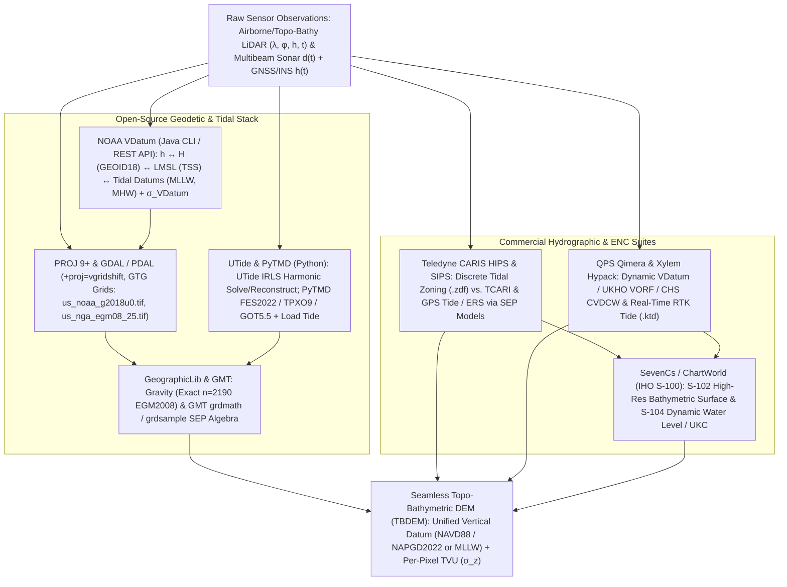
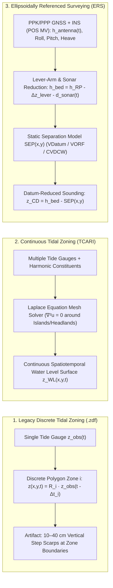

### 3.6 Software Ecosystem

Operationalizing the physics of vertical datums (Section 3.1), land-sea separation models (Section 3.2), shoreline definitions (Section 3.3), and spherical harmonic/tidal mathematics (Section 3.5) requires a specialized software stack that bridges **terrestrial geodesy** and **marine hydrography**. Whereas horizontal reprojection (Section 2.6) is largely unified under standard cartographic libraries, vertical datum transformations and tidal reductions span four distinct computational domains:

1. **Cascaded Vertical Datum Transformation and Geoid Engines** (e.g., NOAA VDatum, PROJ `vgridshift`, GeographicLib `Gravity`/`GeoidEval`), which map heights between geometric ellipsoids ($h$), gravimetric/orthometric datums ($H$), and spatially varying chart datums ($z_{\text{CD}}$) while tracking cumulative Total Vertical Uncertainty ($\text{TVU}$).
2. **Harmonic Tidal Analysis and Barotropic Ocean Tide Drivers** (e.g., `UTide`, `PyTMD`), which decompose irregular water-level gauge records into astronomical constituents $(A_k, \kappa_k)$ or evaluate global assimilated hydrodynamic models (FES2022, TPXO9, GOT5.5) at exact sensor observation epochs $t$.
3. **Hydrographic Survey Processing and Ellipsoidally Referenced Surveying (ERS) Suites** (e.g., Teledyne CARIS HIPS & SIPS, QPS Qimera, Xylem Hypack), which fuse high-rate GNSS-inertial trajectories $(h_{\text{GNSS}}(t), \text{heave}(t), \text{pitch}(t), \text{roll}(t))$, vessel dynamic draft/squat models, and continuous Separation Models ($\text{SEP}$) to reduce raw acoustic/bathymetric lidar soundings directly to chart datum.
4. **Electronic Navigational Chart (ENC) and S-100 Production Suites** (e.g., SevenCs / ChartWorld), which package datum-reduced bathymetries into certified IHO S-57, S-102 (Bathymetric Surface), and S-104 (Water Level Information) deliverables for real-time Under-Keel Clearance (UKC) navigation.



---

#### 3.6.1 Open-Source Vertical Datum, Geoid, and Tidal Stack

##### NOAA VDatum (Vertical Datum Transformation Tool)

Jointly developed since 2001 by NOAA's National Geodetic Survey (NGS), Office of Coast Survey (OCS), and Center for Operational Oceanographic Products and Services (CO-OPS) (Parker et al., 2003; Myers et al., 2005; Hess et al., 2012), **VDatum** (`vdatum.noaa.gov`) is the authoritative U.S. engine for transforming elevation data across 40+ 3D/ellipsoidal, orthometric, and tidal vertical datums across the coastal United States, Puerto Rico, and the U.S. Virgin Islands. Available as a cross-platform Java CLI/GUI application (`vdatum.jar`) and a cloud REST API (`https://vdatum.noaa.gov/vdatumweb/api/convert`), VDatum implements a **hub-and-spoke cascaded transformation graph**:

$$\text{ITRFxx / WGS84 } (h) \xleftrightarrow{\text{14-Param Helmert}} \text{NAD83(2011) } (h) \xleftrightarrow{N_{\text{GEOID18}}} \text{NAVD88 } (H) \xleftrightarrow{\text{TSS}} \text{LMSL} \xleftrightarrow{\Delta Z_{\text{LMSL}\to\text{CD}}} \{\text{MLLW, MLW, MTL, MHW, MHHW}\}$$

Understanding VDatum's internal mechanics is essential to avoid coastal DEM artifacts:
* **Topography of the Sea Surface ($\text{TSS}$):** VDatum bridges the terrestrial orthometric hub (`NAVD88`, or `PRVD02`/`VIVD09`) to the marine tidal hub (`Local Mean Sea Level`, $\text{LMSL}$) via spatially interpolated $\text{TSS}$ grids derived from spirit-leveled and GNSS-occupied tide benchmarks. Following the surface-height convention of Sections 3.2 and 3.5 where $\text{TSS} = H_{\text{LMSL}}$ is the height of the $\text{LMSL}$ surface above `NAVD88` zero, a point's coordinate transforms as $z_{\text{LMSL}} = H_{\text{NAVD88}} - \text{TSS}$ (note that VDatum's raw internal `tss.gtx` files store the negated quantity $\text{TSS}_{\text{VDatum}} = -\text{TSS}$, the height of `NAVD88` zero relative to $\text{LMSL}$).
* **Hydrodynamic Tidal Datum Grids ($\Delta Z_{\text{LMSL}\to\text{CD}}$):** Away from physical tide gauges, the offsets between $\text{LMSL}$ and extreme tidal datums ($\text{MLLW}, \text{MLW}, \text{MHW}, \text{MHHW}$) are computed by driving high-resolution unstructured-mesh hydrodynamic models—such as **ADCIRC** (Advanced Circulation Model), **SCHISM/SELFE**, and **FVCOM**—over synthetic lunar/solar tidal cycles, and correcting the raw hydrodynamic fields via spatial kriging or Laplace interpolation (**TCARI**) against observed CO-OPS harmonic constants.
* **Marine Polygon Bounding Masks and Land-Sea Blending:** Because hydrodynamic tidal datums are physically defined only where water flows, VDatum's tidal grids (`core/*.gtx` or GeoTIFFs) are clipped to a **buffered marine/estuarine polygon**. When transforming a coastal topo-bathymetric DEM (TBDEM) from `NAVD88` to `MLLW`, dry upland pixels outside the VDatum marine polygon return `NoData` (`-999999.0`), necessitating membrane/Laplace extrapolation (`gdal_fillnodata.py` or GMT `surface`) when constructing full-tile continuous Separation Models ($\text{SEP}$).
* **Region-Specific Uncertainty Quantification ($\sigma_{\text{VDatum}}$):** VDatum explicitly reports the root-sum-square (RSS) cumulative transformation uncertainty $\sigma_{\text{VDatum}}$ for every regional model domain (ranging from $\sim 5\text{--}8\text{ cm}$ $1\sigma$ in open-coast regions with dense tide gauges to $>18\text{--}25\text{ cm}$ $1\sigma$ in micro-tidal marshes, shallow barrier-island lagoons, and steep-gradient tidal rivers).

##### PROJ Geodetic Transformation Grids (GTG) paired with GDAL and PDAL

While standalone Java VDatum excels at point clouds and ASCII/LAS batches, high-throughput raster and point-cloud pipelines execute vertical datum shifts directly inside **PROJ 9+** (which introduced cloud-native Geodetic TIFF Grids in PROJ 7.0 / RFC 4, 2020), **GDAL (`gdalwarp`)**, and **PDAL (`filters.reprojection`)** using cloud-optimized **Geodetic TIFF Grids (GTG)** hosted on `https://cdn.proj.org` and synchronized via `projsync`:

* **Gravimetric and Hybrid Geoid Grids:**
  * `us_noaa_g2018u0.tif` (`GEOID18`) and `us_noaa_g2012bu0.tif` (`GEOID12B`): Conterminous U.S. hybrid geoid models mapping `NAD83(2011)` ellipsoidal height $h$ (`EPSG:6319`) to `NAVD88` orthometric height $H$ (`EPSG:5703`), satisfying USGS 3DEP Lidar Base Specification (LBS) vertical datum requirements.
  * `us_nga_egm08_25.tif` (`EGM2008` at $2.5'\times 2.5'$ resolution, Pavlis et al., 2012) and `us_nga_egm96_15.tif` (`EGM96` at $15'\times 15'$, Lemoine et al., 1998): Global geopotential undulation grids mapping `WGS84` ($h$) to global orthometric height ($H$, `EPSG:3855` for EGM2008 height / `EPSG:5773` for EGM96 height).
  * `ca_nrc_CGG2013n83.tif`: Natural Resources Canada gravimetric geoid realizing `CGVD2013` (`EPSG:6647`).
* **NOAA NOS VDatum Tidal Grids in PROJ:** Since PROJ 9.1+, NOAA's regional VDatum grids—mapping `NAD83(2011)` or `NAVD88` to positive-up `LMSL height` (`EPSG:5714`), `MLLW height` (`EPSG:5866`, or positive-down `MLLW depth` `EPSG:5869`), `MLW height` (`EPSG:5867`, datum `EPSG:1091`), `MHW height` (`EPSG:5870`), and `MHHW height` (`EPSG:5868`)—have been converted into multi-band GTG files (including embedded vertical uncertainty bands) under the `us_noaa_nos_*` namespace.
* **The `+proj=vgridshift` Operator and Sign Conventions:** In a PROJ pipeline, `+proj=vgridshift` interpolates a vertical shift grid $\Delta z(\lambda, \phi)$ and modifies the $z$-coordinate according to:
  $$z_{\text{out}} = z_{\text{in}} + m \cdot \Delta z(\lambda, \phi)$$
  where $m$ is controlled by `+multiplier`. By standard geodetic convention, geoid undulation $N(\lambda, \phi)$ is positive when the geoid lies *above* the ellipsoid; since $H = h - N$, transforming from ellipsoidal height $h$ to orthometric height $H$ requires **subtracting** the grid value (`+proj=vgridshift +grids=us_noaa_g2018u0.tif +multiplier=-1`, or `+inv +proj=vgridshift`). Furthermore, both `gdalwarp` and `pdal translate` natively parse **3D Compound CRSs** written as `Horizontal_EPSG+Vertical_EPSG` (e.g., `-s_srs EPSG:6319 -t_srs EPSG:6318+5703`), automatically querying `proj.db` to assemble the horizontal and vertical grid-shift steps.

##### PyTMD and UTide: Harmonic Tidal Analysis and Ocean Tide Modeling

When processing satellite altimetry (ICESat-2, SWOT, Sentinel-6), airborne bathymetric lidar away from VDatum coverage, or offshore multibeam surveys without a pre-computed SEP model, practitioners must either extract harmonic constituents from water-level time series or evaluate global barotropic ocean tide models directly in Python:

* **`UTide` (Unified Tidal Analysis and Prediction):** Developed by Daniel L. Codiga (2011) in MATLAB and ported to Python (`utide` by Wesley Bowman et al.), `UTide` unifies the classic Pawlowicz et al. (2002) `T_Tide` and Foreman (1977) architectures into a single mathematical engine capable of handling **irregularly sampled timestamps $t_i$** (such as episodic satellite passes or gappy acoustic pressure records). Given observed water levels $z(t_i)$, `utide.solve()` fits the harmonic model:
  $$\hat{z}(t_i) = Z_0 + a_{\text{trend}}(t_i - t_{\text{ref}}) + \sum_{k=1}^{K} f_k(t_i) A_k \cos\!\Big(\omega_k t_i + V_{0k}(t_i) + u_k(t_i) - \kappa_k\Big)$$
  Key numerical features of `UTide` include:
  1. **Exact Nodal and Astronomical Arguments:** Rather than assuming constant 18.6-year lunar nodal factors $(f_k, u_k)$ across the entire record (which breaks down for multi-year gauges), `UTide` evaluates exact time-varying astronomical arguments at every individual sample $t_i$.
  2. **Automated Rayleigh Constituent Selection and IRLS:** `UTide` automatically selects the subset of up to 146 candidate tidal constituents resolvable given the record duration $T$ via the Rayleigh criterion ($|\omega_j - \omega_k| \cdot T \ge R_{\min}$), and optionally uses **Iteratively Reweighted Least Squares (IRLS)** with a Cauchy weight function to suppress storm-surge outliers without biasing astronomical amplitudes $A_k$.
  3. **Colored-Noise Uncertainty Quantification:** Because estuarine and coastal sea-level residuals $r(t_i) = z(t_i) - \hat{z}(t_i)$ exhibit strong red-noise spectral power (weather-band autocorrelation), ordinary least-squares covariance matrices severely underestimate constituent errors. `UTide` computes realistic $95\%$ confidence intervals $(\sigma_{A_k}, \sigma_{\kappa_k})$ by fitting a parametric spectral model to the residual power spectral density and executing Monte Carlo realizations.
* **`PyTMD` (Python Tidal Model Driver):** Created and maintained by Tyler C. Sutterley (Sutterley et al., 2019–2026), `pyTMD` is the standard open-source Python library for evaluating global, regional, and polar barotropic ocean tide, load tide, and solid-earth tide models at arbitrary $(\lambda, \phi, t)$ coordinates. `PyTMD` natively reads NetCDF, binary OTIS, and ATLAS formats for **FES2014 / FES2022** (Finite Element Solution, $1/30^\circ$ resolution), **TPXO9-atlas**, **GOT4.10 / GOT5.5** (Goddard Ocean Tide), **EOT20** (Empirical Ocean Tide), and circum-Antarctic/Arctic models (**CATS2008**, **AOTIM-5**). For satellite laser/radar altimetry and offshore DEM harmonization, `PyTMD` evaluates both the **ocean tide** $\zeta_{\text{ocean}}(\lambda, \phi, t)$ and the elastic **crustal load tide** $\zeta_{\text{load}}(\lambda, \phi, t)$ (the millimeter-to-centimeter vertical depression of the seafloor/landmass under the weight of the tidal water column), plus the **Inverse Barometer (IB)** correction:
  $$\Delta z_{\text{IB}}(t) = -\frac{P_{\text{atm}}(t) - P_{\text{ref}}}{\rho_{\text{sw}} g} \approx -0.9948\text{ cm/hPa} \cdot \left(P_{\text{atm}}(t) - 1013.25\text{ hPa}\right)$$

##### GeographicLib (`Gravity`, `GeoidEval`) and GMT (`grdmath`, `grdsample`)

* **GeographicLib (`Gravity` and `GeoidEval`):** As derived in Section 3.5, gridded geoid models (`us_nga_egm08_25.tif`) are pre-evaluated discretizations of a spherical harmonic expansion that introduce $1\text{--}3\text{ cm}$ of interpolation error in rugged terrain. Charles Karney's **GeographicLib** provides two distinct utilities:
  1. `Gravity`: Evaluates the exact spherical harmonic synthesis (Equation in Section 3.5) of **EGM84**, **EGM96** ($n_{\max}=360$), or **EGM2008** ($n_{\max}=2190$) at arbitrary 3D points $(\phi, \lambda, h)$ using Clenshaw summation—yielding the exact geoid undulation $N$, disturbing potential $T$, gravity anomaly $\Delta g$, and Prime Vertical / Meridional **deflections of the vertical** $(\eta, \xi)$ in arcseconds without grid-discretization error.
  2. `GeoidEval`: Evaluates pre-computed $1'\times 1'$ or $2.5'\times 2.5'$ geoid grids using a $3\times 3$ or $4\times 4$ cubic polynomial stencil with sub-millimeter interpolation consistency.
* **GMT (Generic Mapping Tools — `grdmath`, `grdsample`, `grdtrack`):** Created by Paul Wessel and Walter H. F. Smith (1991–2024), **GMT 6+** provides the reverse-Polish-notation (RPN) raster algebra engine `grdmath` and B-spline grid resampler `grdsample`. In topobathymetric DEM workflows, `gmt grdmath` is prized for its explicit handling of co-registered grid math: flipping positive-down hydrographic depth grids to negative-down elevation (`gmt grdmath depth_mllw.nc NEG = z_mllw.nc`), combining multi-stage separation grids ($\text{SEP}_{\text{MLLW}\to h} = N_{\text{GEOID18}} + \text{TSS} + \Delta z_{\text{MLLW}}$), and computing spatially varying RSS uncertainty grids ($\sigma_{\text{total}} = \sqrt{\sigma_A^2 + \sigma_B^2}$ via `HYPOT`).

---

#### 3.6.2 Commercial and Closed-Source Hydrographic & ERS Suites

In production hydrographic offices (NOAA OCS, UKHO, CHS, SHOM) and commercial offshore survey fleets, multibeam echosounder (MBES), phase-measuring bathymetric sonar, and airborne topobathymetric lidar data are processed through specialized hydrographic suites that enforce **IHO S-44 (6th Edition, 2020)** uncertainty standards, **NOAA Hydrographic Surveys Specifications and Deliverables (HSSD)**, and the **NOAA Field Procedures Manual (FPM, 1997/2020)** while managing the transition from legacy water-level zoning to **Ellipsoidally Referenced Surveying (ERS)**.



##### Teledyne CARIS HIPS & SIPS

For over three decades, **Teledyne CARIS HIPS & SIPS** (Hydrographic Information Processing System and Side Scan Information Processing System) has served as a primary production platform for national charting agencies. Its architecture directly reflects the three historical generations of vertical sounding reduction (`Merge` and `Compute GPS Tide` workflows):

1. **Discrete Tidal Zoning (`.zdf` Zone Definition Files):** In traditional gauge-referenced surveying, the survey area is partitioned into discrete polygons. Within each polygon $i$, water level is approximated by applying a constant time lag $\Delta t_i$ and amplitude range ratio $R_i$ to a primary tide gauge: $z_{\text{tide}}(t) = R_i \cdot z_{\text{gauge}}(t - \Delta t_i)$. Whenever a survey vessel crosses a polygon boundary during a rapidly rising or falling tide, mismatch in $(R_i, \Delta t_i)$ injects an artificial **$10\text{--}40\text{ cm}$ vertical step scarp** straight across the seafloor DEM, compounded by unmodeled vessel dynamic draft (settlement and squat) and long-period swell heave errors.
2. **TCARI (Tidal Constituent And Residual Interpolation):** Adopted by NOAA OCS (Hess, 2002) and embedded into CARIS/Pydro, TCARI replaces discrete polygons with a continuous triangular mesh that solves **Laplace's equation ($\nabla^2 u = 0$)** subject to zero-normal-derivative boundary conditions ($\partial u / \partial n = 0$) along coastlines and islands. By interpolating both harmonic constituents and real-time meteorological water-level residuals (storm surge, wind setup) along true over-water hydrodynamic paths rather than Euclidean straight lines across peninsulas, TCARI eliminates discrete zone boundary scarps.
3. **GPS Tide / Ellipsoidally Referenced Surveying (ERS) with Separation Models (`SEP`):** In modern ERS operations (Rice & Riley, 2011; Dodd & Mills, 2012), CARIS bypasses real-time water-level gauges entirely during data acquisition. Using a post-processed kinematic (PPK) or Precise Point Positioning (PPP) GNSS-aided inertial navigation solution (e.g., Applanix POS MV SBET), CARIS `Compute GPS Tide` establishes the instantaneous trajectory of the vessel reference point (RP) directly relative to the reference ellipsoid (`NAD83(2011)` or `ITRF2020`). Because the GNSS height $h_{\text{RP}}(t)$ already encapsulates astronomical tide, meteorological surge, barometric setup, static draft, dynamic squat, and long-period heave, the seafloor elevation on the ellipsoid is simply $h_{\text{seafloor}} = h_{\text{RP}}(t) - \Delta z_{\text{lever}}(t) - d_{\text{acoustic}}(t)$ (after filtering high-frequency wave heave so the static SEP is not applied to instantaneous wave crests). A continuous 2D **Separation Model ($\text{SEP}(\lambda, \phi) = h_{\text{CD}}(\lambda, \phi)$)** exported from VDatum is then subtracted during the `Merge` step to yield chart-datum depth $d_{\text{CD}} = -z_{\text{CD}} = \text{SEP}(\lambda, \phi) - h_{\text{seafloor}}$, accompanied by automated IHO S-44 **CUBE** (Combined Uncertainty and Bathymetry Estimator, Calder & Mayer, 2003) TVU propagation.

##### QPS Qimera, Xylem Hypack, and SevenCs / ChartWorld

* **QPS Qimera:** Designed around a **Dynamic Workflow** architecture, **QPS Qimera** natively integrates national hydrographic separation models—including **NOAA VDatum**, the UK Hydrographic Office's **VORF** (Vertical Offshore Reference Frame, Iliffe et al., 2007), and the Canadian Hydrographic Service's **CVDCW** (Continuous Vertical Datum for Canadian Waters / HyVSEPs, Robin et al., 2016). If a hydrographer updates a POS MV SBET trajectory, swaps the vertical datum from `LAT` to `MLLW`, or modifies a sound-velocity profile, Qimera dynamically re-evaluates the 3D ray-traced soundings and updates the CUBE/dynamic surface without requiring manual multi-step batch re-merging.
* **Xylem Hypack (`HYPACK MAX` / `HYSWEEP`):** The workhorse software for coastal engineering, port and harbor maintenance dredging (U.S. Army Corps of Engineers `EM 1110-2-1003` compliance), and inland waterway single-beam/multibeam surveying. Hypack pioneered practical **RTK Tide** processing: combining real-time kinematic GNSS antenna heights with an inertial motion unit (IMU) via a complementary high-pass/low-pass filter (separating zero-mean wave heave from low-frequency tidal + dynamic draft variation) and applying 2D **KTD (Kinematic Tidal Datum `.ktd`)** separation grids in real time on the helm display so dredge operators cut directly to authorized project depth relative to `MLLW` or `IGLD85`.
* **SevenCs / ChartWorld (`ENC Designer`, `Nautilus`, S-100 Suite):** Once bathymetric DEMs and contours are reduced to Chart Datum (`MLLW` or `LAT`), **SevenCs** software converts the continuous grids into certified hydrographic vector and gridded products. Crucially, SevenCs leads the industry transition from legacy **IHO S-57** Electronic Navigational Charts (where bathymetry is frozen into static depth areas `DEPARE` and spot soundings `SOUNDG` referenced permanently to Chart Datum) to the **IHO S-100 Universal Hydrographic Data Model**: pairing **S-102** (high-resolution gridded Bathymetric Surface with co-registered uncertainty layer) with **S-104** (time-varying Water Level Information for Surface Navigation). In an S-100 Electronic Chart Display and Information System (ECDIS), the vessel's navigation computer dynamically adds the S-104 predicted/telemetered water-level grid $z_{\text{WL}}(x, y, t)$ to the S-102 chart-datum depth grid $d_{\text{CD}}(x, y)$ to compute real-time navigable water column depth and dynamic **Under-Keel Clearance (UKC)**.

---

#### 3.6.3 Comparison Matrix of Vertical Datum, Geoid, and Tidal Software

| Software / Package | License | Primary Domain | Vertical Datum / Geoid / Tidal Models Supported | Uncertainty ($\text{TVU}$) Handling | Primary Operational Role in DEM Workflows |
| :--- | :--- | :--- | :--- | :--- | :--- |
| **NOAA VDatum** | Open Source / Public Domain (Java & REST) | U.S. Coastal Land-Sea Interface | 40+ datums: `ITRFxx`, `NAD83(2011)`, `GEOID18`, `NAVD88`, `LMSL`, `MLLW`, `MHW`, `IGLD85` | Reports regional RSS $\sigma_{\text{VDatum}}$ ($\text{cm}$) across each cascaded step | Transforming coastal lidar/sonar points and building custom `SEP` grids across the land-sea boundary. |
| **PROJ (`vgridshift`) + GDAL / PDAL** | Open Source (MIT / X/MIT / BSD) | Global Gridded Rasters & Point Clouds | All GTG grids on `cdn.proj.org` (`GEOID18`, `EGM2008`, `CGG2013`, `us_noaa_nos_*` VDatum) | `projinfo` reports formal accuracy; GTG stores per-pixel $\sigma_z$ bands | High-throughput 3D compound CRS (`EPSG:6319` $\to$ `6318+5703`/`5866`) warping of DEMs and COPC/LAZ clouds. |
| **`UTide` (Python / MATLAB)** | Open Source (MIT) | Time-Series Harmonic Analysis & Prediction | Up to 146 astronomical constituents + nodal $(f_k, u_k)$ and secular trend | Colored-noise Monte Carlo / bootstrap $95\%$ CIs on $(A_k, \kappa_k)$ | Extracting harmonic constants and de-tiding irregular gauge, pressure sensor, or satellite altimetry series. |
| **`PyTMD` (Python)** | Open Source (MIT) | Global/Polar Ocean & Load Tide Synthesis | `FES2014`/`FES2022`, `TPXO9-atlas`, `GOT5.5`, `EOT20`, `CATS2008`, solid-earth & load tides | Multi-model ensemble spread analysis across constituent grids | Removing ocean, load, and inverse-barometer tides from ICESat-2, SWOT, and offshore bathymetry. |
| **GeographicLib (`Gravity`)** | Open Source (MIT) | Exact Spherical Harmonic Geopotential | Exact $n_{\max}=2190$ `EGM2008`, `EGM96`, `WGS84` gravity & deflections $(\xi, \eta)$ | Sub-millimeter numerical synthesis precision ($<1\text{ mm}$) | Evaluating exact geoid undulation $N(\phi,\lambda)$ and vertical deflections without grid interpolation artifacts. |
| **Teledyne CARIS HIPS & SIPS** | Commercial | Hydrographic Production & ERS | Discrete `.zdf` zones, continuous `TCARI` meshes, and `ERS` via `SEP` models | Full IHO S-44 6th Ed. Total Propagated Uncertainty (TPU) & CUBE | Processing multibeam/lidar swaths from raw GNSS/INS + sonar to certified Chart Datum surfaces. |
| **QPS Qimera / Xylem Hypack** | Commercial | Dynamic Hydrography & Dredging Control | Native `VDatum`, UKHO `VORF`, CHS `CVDCW`, and Hypack `.ktd` RTK Tide grids | Real-time & post-processed S-44 TVU / USACE dredging tolerances | Dynamic vertical datum shifting, vessel squat/heave filtering, and real-time RTK dredge guidance. |

---

#### 3.6.4 Reproducible CLI and Python Workflows

##### Command-Line Workflow: Seamless Topo-Bathymetric Datum Transformation (`PROJ`, `GDAL`, `PDAL`, `GMT`)

Consider a coastal mapping campaign in Chesapeake Bay, Virginia ($\lambda \approx -76.30^\circ\text{ E}, \phi \approx 36.95^\circ\text{ N}$). An airborne topobathymetric lidar sensor (e.g., Riegl VQ-880-G II) delivers a 3D point cloud (`chesapeake_ellips.laz`) and a $1\text{ m}$ gridded DEM (`chesapeake_ellips_1m.tif`) referenced to **NAD83(2011) 3D ellipsoidal height $h$ (`EPSG:6319`, positive-up in meters)**. We require two co-registered deliverables:
1. A terrestrial/flood-modeling DEM referenced to **NAD83(2011) / UTM Zone 18N + NAVD88 orthometric height $H$ (`EPSG:6347+5703`)** via `GEOID18` (`us_noaa_g2018u0.tif`).
2. A hydrographic charting surface referenced to **NAD83(2011) / UTM Zone 18N + Mean Lower Low Water (`EPSG:6347+5866`, MLLW)** via the cascaded NOAA VDatum separation pipeline (`GEOID18` + `TSS` + `LMSL-to-MLLW`).

```bash
# STEP 1: Synchronize NOAA NGS (GEOID18) and NOS (VDatum) GTG grids for bbox
projsync --source-id us_noaa --bbox -76.60,36.80,-75.90,37.20

# STEP 2: Audit the 3D compound pipeline from NAD83(2011) 3D (EPSG:6319)
# to NAD83(2011) / UTM Zone 18N + NAVD88 height (EPSG:6347+5703) using projinfo
projinfo -s EPSG:6319 -t "EPSG:6347+5703" --spatial-test intersects -o PROJ

# STEP 3: Transform the 1 m Ellipsoidal DEM (h, EPSG:6319) to NAVD88 Orthometric (H)
# using an explicit PROJ pipeline (-ct), exact per-pixel evaluation (-et 0.0),
# target-aligned UTM 18N 1 m pixels (-tap), and Float32 precision
gdalwarp -s_srs "EPSG:6319" -t_srs "EPSG:6347+5703" \
    -ct "+proj=pipeline +step +proj=axisswap +order=2,1 \
         +step +proj=unitconvert +xy_in=deg +xy_out=rad \
         +step +proj=vgridshift +grids=us_noaa_g2018u0.tif +multiplier=-1 \
         +step +proj=utm +zone=18 +ellps=GRS80" \
    -tr 1.0 1.0 -tap -et 0.0 -r cubicspline \
    -srcnodata -9999.0 -dstnodata -9999.0 -wt Float32 \
    -co COMPRESS=DEFLATE -co PREDICTOR=3 -co TILED=YES \
    "chesapeake_ellips_1m.tif" "chesapeake_utm18n_navd88_1m.tif"

# STEP 4: Transform the 3D LAZ Point Cloud from Ellipsoidal (EPSG:6319)
# to NAD83(2011) / UTM Zone 18N + MLLW height (EPSG:6347+5866) via PDAL
pdal translate "chesapeake_ellips.laz" "chesapeake_utm18n_mllw.laz" \
    reprojection \
    --filters.reprojection.in_srs="EPSG:6319" \
    --filters.reprojection.out_srs="EPSG:6347+5866" \
    --writers.las.scale_x=0.001 --writers.las.scale_y=0.001 --writers.las.scale_z=0.001

# STEP 5: Use GMT grdmath to convert positive-up MLLW elevation z_MLLW (m)
# to positive-down hydrographic depth d_MLLW = -z_MLLW and propagate TVU
gmt grdmath "chesapeake_utm18n_mllw_z.tif" NEG = "chesapeake_utm18n_mllw_depth.tif"
gmt grdmath "sigma_sensor.tif" "sigma_vdatum_sep.tif" HYPOT = "total_tvu_1sigma.tif"
```

##### Python Workflow: 3D Compound Vertical Datum Shifts (`pyproj`) and Tidal Modeling (`utide` / `pyTMD`)

The reproducible Python script below demonstrates two core engineering workflows:
1. **Part A:** Executing a cascaded vertical datum transformation (`NAD83(2011)` ellipsoidal $h \to \text{NAVD88 } H \to \text{LMSL } z_{\text{LMSL}} \to \text{MLLW } z_{\text{MLLW}}$) using `pyproj` 3D compound CRSs while propagating the 4-component Total Vertical Uncertainty budget ($\sigma_{z,\text{MLLW}} = \sqrt{\sigma_h^2 + \sigma_N^2 + \sigma_{\text{TSS}}^2 + \sigma_{\text{LMSL}\to\text{MLLW}}^2}$ from Section 3.5) at $95\%$ confidence ($1.96\sigma$) against IHO S-44 Special Order limits.
2. **Part B:** Recovering astronomical tide constituents from an irregular water-level record using `utide` (`solve` and `reconstruct`) and evaluating barotropic ocean tides (`FES2014`/`GOT5.5`) and crustal load tides at arbitrary survey coordinates via `pyTMD`.

```python
import numpy as np
import pyproj

# --- PART A: 3D Compound CRS Vertical Datum Transformation & TVU Budget ---
# Site: Sewells Point / Norfolk, VA (Lon = -76.3300 E, Lat = 36.9467 N)
lon, lat, h_nad83 = -76.330000, 36.946700, -39.420

# Transform NAD83(2011) 3D (EPSG:6319) -> NAD83(2011) + NAVD88 height (EPSG:6318+5703)
tf_to_navd88 = pyproj.Transformer.from_crs("EPSG:6319", "EPSG:6318+5703", always_xy=True)
_, _, H_navd88 = tf_to_navd88.transform(lon, lat, h_nad83)
N_geoid18 = h_nad83 - H_navd88  # Geoid undulation N = h - H (~ -35.800 m in VA)

# Apply VDatum Surface Separation Components (Sections 3.2 & 3.5 sign convention):
# TSS = H_LMSL = -0.092 m (LMSL surface lies 0.092 m below NAVD88 zero)
# dZ_lmsl_to_mllw = -0.418 m (MLLW surface lies 0.418 m below LMSL)
tss_surface, dz_lmsl_to_mllw = -0.092, -0.418
SEP_mllw = N_geoid18 + tss_surface + dz_lmsl_to_mllw  # h_MLLW on NAD83 ellipsoid (~ -36.310 m)
z_lmsl_pos_up = H_navd88 - tss_surface                # LMSL elevation (+ up, ~ -3.528 m)
z_mllw_pos_up = h_nad83 - SEP_mllw                    # MLLW elevation (+ up, ~ -3.110 m)
d_mllw_pos_down = -z_mllw_pos_up                      # Charted depth (+ down, ~ +3.110 m)

# Propagate 1-sigma vertical uncertainties (m): LiDAR (4.5 cm), GEOID18 (1.5 cm), TSS (2.2 cm), Tide (3.8 cm)
sigma_h, sigma_N, sigma_tss, sigma_tidal = 0.045, 0.015, 0.022, 0.038
tvu_95 = 1.96 * np.sqrt(sigma_h**2 + sigma_N**2 + sigma_tss**2 + sigma_tidal**2)
s44_special_limit = np.sqrt(0.25**2 + (0.0075 * d_mllw_pos_down)**2)

print(f"Input h_NAD83 = {h_nad83:+.3f} m | N_GEOID18 = {N_geoid18:+.3f} m | H_NAVD88 = {H_navd88:+.3f} m")
print(f"SEP (h_MLLW) = {SEP_mllw:+.3f} m -> z_MLLW = {z_mllw_pos_up:+.3f} m (Depth d = {d_mllw_pos_down:.3f} m)")
print(f"Propagated TVU (95% CI): +/-{tvu_95:.3f} m (IHO S-44 Special Order Limit: +/-{s44_special_limit:.3f} m)")

# --- PART B: Harmonic Analysis (UTide) & Barotropic Ocean Tide Driver (PyTMD) ---
try:
    import utide
    rng = np.random.default_rng(42)
    # 30-day irregular hourly record starting 2024-01-01 UTC (ordinal day 738886.0)
    t_days = np.sort(738886.0 + np.arange(0, 30.0, 1.0 / 24.0) + rng.uniform(-0.01, 0.01, 720))
    dt_hours = (t_days - 738886.0) * 24.0
    z_obs = (0.50 + 0.38 * np.cos(2 * np.pi * dt_hours / 12.4206012 - np.radians(115.0))
             + 0.09 * np.cos(2 * np.pi * dt_hours / 23.9344696 - np.radians(42.0))
             + rng.normal(0.0, 0.03, size=t_days.size))
    coef = utide.solve(t_days, z_obs, lat=lat, method="ols", conf_int="MC", verbose=False)
    tide_pred = utide.reconstruct(t_days, coef, verbose=False)
    print(f"UTide Constituents: {list(coef.name[:4])}, Residual RMS: {np.std(z_obs - tide_pred.h):.3f} m")
except ImportError:
    pass

try:
    import pyTMD.compute
    # Evaluate barotropic ocean tide elevation (m) at (lon, lat) and UTC timestamps via FES2014
    tide_fes = pyTMD.compute.tide_elevations(
        np.array([lon]), np.array([lat]), np.array([0.0]),
        DIRECTORY="/data/tides", MODEL="FES2014", EPSG=4326,
        EPOCH=(2024, 1, 1, 0, 0, 0), TYPE="drift", TIME="UTC",
        METHOD="spline", EXTRAPOLATE=True
    )
    print(f"PyTMD FES2014 Ocean Tide Elevation: {float(tide_fes[0]):+.3f} m")
except Exception:
    pass
```

> [!WARNING]
> **Sign-Convention Inversion When Applying Geoid and Separation Grids in `PROJ`:** In `PROJ` (`cct` and `gdalwarp`), `+proj=vgridshift` *adds* the grid value by default ($z_{\text{out}} = z_{\text{in}} + \text{grid}$). Because standard geoid grids (`us_noaa_g2018u0.tif`, `us_nga_egm08_25.tif`) store the geoid undulation $N = h - H$, transforming from ellipsoidal height $h$ to orthometric height $H = h - N$ requires **subtracting** $N$ (`+multiplier=-1` or `+inv`). Failing to verify the sign with a known NGS benchmark (`projinfo` + `cct`) before warping a DEM will apply $+2N$ of vertical error—shifting a Chesapeake Bay DEM by $2 \times (-35.8\text{ m}) = -71.6\text{ m}$!

> [!IMPORTANT]
> **Extrapolating VDatum Marine Grids Across the Coastal Land-Sea Interface:** NOAA VDatum's hydrodynamic grids (`MLLW`, `MHW`, `TSS`) terminate slightly landward of the shoreline, returning `NoData` over upland topography. If a hydrographic survey uses a raw VDatum grid as an ERS Separation Model ($\text{SEP}$) without coastal extrapolation, airborne bathymetric lidar returns on the dry beach face and intertidal marsh will be dropped as `NoData`. Practitioners must extrapolate the marine $\text{SEP}$ grid $1\text{--}2\text{ km}$ inland over the coastal barrier using a Laplace/spline infill (`gdal_fillnodata.py` or `gmt surface`) before executing ERS reduction.

> [!TIP]
> **Filter High-Frequency Wave Heave Before Applying Static Separation Models in ERS:** A static Separation Model $\text{SEP}(\lambda, \phi)$ represents the time-invariant vertical distance between the reference ellipsoid and the tidal datum surface (e.g., $\text{MLLW}$). Meanwhile, an instantaneous GNSS antenna height $h_{\text{GNSS}}(t)$ measures both the low-frequency tide/surge *and* high-frequency surface gravity waves ($T \approx 2\text{--}20\text{ s}$). In CARIS, Qimera, or custom Python ERS pipelines, always combine the GNSS trajectory with IMU vertical acceleration via a delayed-state Kalman or complementary filter (`Compute GPS Tide` high-pass heave filter) so that instantaneous wave crests are removed prior to subtracting $\text{SEP}(\lambda, \phi)$.
