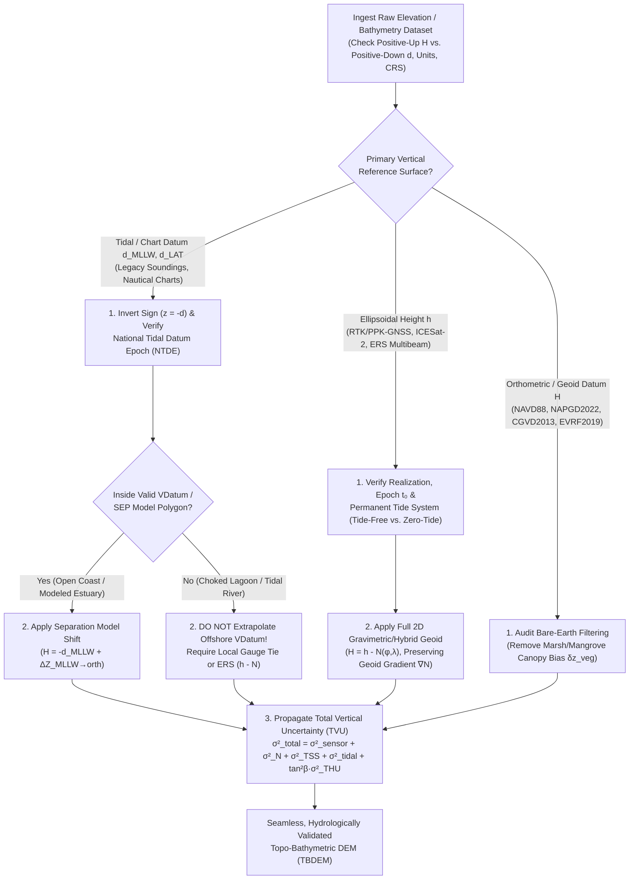

## 3.7 Common Pitfalls & Key Takeaways

In coastal, estuarine, and fluvial terrain modeling, vertical datum and shoreline errors are far more hazardous than horizontal projection errors because gravity-driven free-surface flows respond nonlinearly to decimeter-scale vertical biases and centimeter-per-kilometer gradient tilts. Whereas a $1.5\text{ m}$ horizontal datum shift might displace a road centerline by half a lane, a $1.5\text{ m}$ vertical datum blunder at the land–sea interface can invent an impenetrable coastal cliff that reflects tsunami waves, submerge an entire coastal city in a storm-surge forecast, or reverse the hydraulic gradient of a low-slope river basin.

This section analyzes five canonical vertical datum, geoid, tidal, and shoreline failure modes in DEM engineering—complete with governing physics, uncertainty propagation, and worked numerical examples—before synthesizing Chapter 3 into an operational verification workflow and pre-flight audit checklist.

---

### 3.7.1 Detailed Case Studies of Vertical Datum, Geoid, and Shoreline Failure Modes

#### Pitfall 1: The "False Coastal Cliff"—Direct Merging of Chart-Datum Bathymetry and Orthometric LiDAR

* **Physical & Geodetic Mechanism:** Hydrographic soundings and nautical chart grids are historically compiled as positive-down depths ($d > 0$ below water) referenced to a local low-water tidal datum such as Mean Lower Low Water (`MLLW`) or Lowest Astronomical Tide (`LAT`). Conversely, terrestrial topographic LiDAR DEMs are compiled as positive-up elevations ($H > 0$ above datum) referenced to a continental orthometric or geoid datum such as `NAVD88`, `NAPGD2022`, `CGVD2013`, or Ordnance Datum Newlyn (`ODN`). Two compounding errors routinely occur when building a coastal Topo-Bathymetric DEM (TBDEM) or computing a cross-shore DEM of Difference (DoD):
  1. **Sign-Convention Collision:** Merging positive-down depths ($d > 0$) with positive-up elevations ($H > 0$) without sign inversion turns submerged channels into tall subaerial ridges ("inverted bathymetry").
  2. **Omission of the Vertical Datum Separation Shift ($\Delta Z_{\text{MLLW}\to\text{orth}}$):** Even after inverting depth to negative elevation ($z_{\text{bathy}} = -d_{\text{MLLW}}$), equating $0\text{ m MLLW}$ with $0\text{ m NAVD88}$ ignores both the local Topography of the Sea Surface ($\text{TSS} = H_{\text{LMSL}} - H_{\text{NAVD88}}$) and the spatially varying semidiurnal/diurnal tidal amplitude ($\Delta Z_{\text{LMSL}\to\text{MLLW}}$). This embeds an artificial vertical step scarp of $0.5\text{–}3.5\text{ m}$ right along the land–sea transition zone.
* **Governing Equations:** To transform a positive-down bathymetric depth $d_{\text{MLLW}}(\varphi,\lambda)$ to a positive-up orthometric elevation $H_{\text{orth}}(\varphi,\lambda)$, both sign inversion and the full separation cascade must be applied:
  $$
  H_{\text{orth}}(\varphi,\lambda) = -d_{\text{MLLW}}(\varphi,\lambda) + \Delta Z_{\text{MLLW}\to\text{orth}}(\varphi,\lambda)
  $$
  where the spatially varying datum offset $\Delta Z_{\text{MLLW}\to\text{orth}}$ represents the height of the MLLW surface above the orthometric datum zero surface:
  $$
  \Delta Z_{\text{MLLW}\to\text{orth}}(\varphi,\lambda) = \text{SEP}_{\text{MLLW}\to h}(\varphi,\lambda) - N_{\text{orth}}(\varphi,\lambda) = \text{TSS}(\varphi,\lambda) + \Delta Z_{\text{LMSL}\to\text{MLLW}}(\varphi,\lambda)
  $$
  Here, $\text{SEP}_{\text{MLLW}\to h} = h_{\text{MLLW}}$ is the ellipsoid-to-chart-datum separation model, $N_{\text{orth}}$ is the geoid (or hybrid geoid) height, $\text{TSS}$ is the height of Local Mean Sea Level (`LMSL`) above the orthometric datum, and $\Delta Z_{\text{LMSL}\to\text{MLLW}} < 0$ is the negative offset from `LMSL` down to `MLLW`. If a user simply sets $\hat{H}_{\text{naive}} = -d_{\text{MLLW}}$, the resulting TBDEM contains a step discontinuity $\delta z_{\text{scarp}}$ along the stitching seam:
  $$
  \delta z_{\text{scarp}}(\varphi,\lambda) = \hat{H}_{\text{naive}} - H_{\text{orth}} = -\Delta Z_{\text{MLLW}\to\text{orth}}(\varphi,\lambda)
  $$
  In a shallow-water hydrodynamic model, a spurious step $\delta z_{\text{scarp}}$ across grid spacing $\Delta x$ creates a fictional bed slope $S_{\text{false}} = |\delta z_{\text{scarp}}|/\Delta x$ and alters the local Froude number $\text{Fr} = u / \sqrt{g h_{\text{flow}}}$, triggering artificial wave reflection or numerical instability.
* **Worked Numerical Case:** A coastal modeling team stitches a NOAA multibeam survey ($d_{\text{MLLW}}$, positive down) with a USGS 3DEP terrestrial LiDAR bare-earth DEM ($H_{\text{NAVD88}}$, positive up) at $1.0\text{ m}$ grid resolution along a macro-tidal inlet in the Gulf of Maine ($\varphi = 44.39^\circ\text{ N}, \lambda = 68.20^\circ\text{ W}$, near Bar Harbor, ME).
  * At this location, `LMSL` lies at $-0.09\text{ m}$ relative to `NAVD88` ($\text{TSS} = -0.09\text{ m}$), and the mean lower low water amplitude below `LMSL` is $\Delta Z_{\text{LMSL}\to\text{MLLW}} = -1.74\text{ m}$. Thus, the `MLLW` datum surface sits at:
    $$
    \Delta Z_{\text{MLLW}\to\text{NAVD88}} = -0.09\text{ m} + (-1.74\text{ m}) = -1.83\text{ m} \quad (\text{i.e., } 0\text{ m MLLW} = -1.83\text{ m NAVD88})
    $$
  * Consider an intertidal rock platform and beach face at the exact `MLLW` contour, where the multibeam/single-beam sounding records $d_{\text{MLLW}} = 0.00\text{ m}$ and the low-tide terrestrial LiDAR records the true orthometric elevation $H_{\text{NAVD88}} = -1.83\text{ m}$.
  * By inverting the bathymetric sign ($\hat{H}_{\text{naive}} = -d_{\text{MLLW}} = 0.00\text{ m}$) but omitting the VDatum shift, the nearshore seabed is artificially elevated by **$\delta z_{\text{scarp}} = +1.83\text{ m}$** relative to the adjacent terrestrial beach! Across a $1.0\text{ m}$ transition cell, this generates a **$+1.83\text{ m}$ vertical wall** ($\beta = \arctan(1.83) = 61.3^\circ$) rising *seaward* of the low-tide line, damming ebb-tide drainage and blocking storm-surge wave propagation onto the coast. (In macro-tidal Puget Sound or Cook Inlet, where $|\Delta Z_{\text{MLLW}\to\text{NAVD88}}| > 3.2\text{ m}$, the false cliff exceeds a single-story building.)
* **Remediation & Operational Verification:** Always execute an explicit vertical datum transformation using an authoritative separation grid (`NOAA VDatum`, `UKHO VORF`, `CHS CVDCW`, or PROJ GTG vertical pipelines) before mosaicking or differencing terrestrial and marine datasets, and verify that cross-shore elevation profiles $z(s)$ are $C^0$ continuous across the intertidal seam.

> [!WARNING]
> **Never Stitch Topo-Bathy Grids Without Inspecting Cross-Shore Profiles and Uncertainty:** Even when VDatum is applied, the transformation itself introduces a spatially varying vertical uncertainty $\sigma_{\text{VDatum}} = \sqrt{\sigma_{\text{datum}}^2 + \sigma_{\text{model}}^2 + \sigma_{\text{interp}}^2}$ (typically $0.05\text{–}0.20\text{ m}$ at $1\sigma$ in open coastal waters, exceeding $0.30\text{ m}$ in complex estuaries). Any elevation difference $|\Delta z| < 1.96\sqrt{\sigma_{\text{bathy}}^2 + \sigma_{\text{topo}}^2 + \sigma_{\text{VDatum}}^2}$ across the land–sea seam is statistically indistinguishable from datum transformation noise.

---

#### Pitfall 2: Confusing Ellipsoidal Height ($h$) with Orthometric Height ($H$) and Geoid-Slope Flow Reversals

* **Physical & Geodetic Mechanism:** Spaceborne altimeters (ICESat-2 `ATL03`/`ATL08`, SWOT, CryoSat-2), GNSS-equipped autonomous surface vessels (ASVs), and Real-Time Kinematic (RTK) or Post-Processed Kinematic (PPK) GNSS rovers natively measure **geometric height $h$ above the mathematical reference ellipsoid** (`GRS80` or `WGS84`). Water, however, does not respond to geometric distance above an arbitrary biaxial ellipsoid; fluid flow is driven by gradients of the **geopotential field $W(\mathbf{x})$**, which defines orthometric height $H = C / \bar{g}$ above the equipotential geoid surface. Feeding raw ellipsoidal heights $h$ into a DEM without subtracting a high-resolution gravimetric or hybrid geoid model $N(\varphi,\lambda)$ causes two distinct classes of failure:
  1. **Gross Absolute Elevation Bias ($15\text{–}105\text{ m}$):** Because the global geoid undulation $N$ ranges from $-106\text{ m}$ (Indian Ocean geoid low south of Sri Lanka) to $+85\text{ m}$ (New Guinea / North Atlantic geoid highs) and sits between $-15\text{ m}$ and $-53\text{ m}$ across the conterminous United States, treating $h$ as $H$ introduces a massive tens-of-meters vertical blunder.
  2. **Subtle Geoid-Gradient Flow Reversal in Low-Slope Basins ($1\text{–}3\text{ m/100 km}$):** Even when a local relative offset is removed at a single base station, the geoid surface $N(\varphi,\lambda)$ tilts relative to the ellipsoid due to crustal density anomalies and topographic mass attraction. In low-gradient coastal plains, deltas, and large floodplain rivers where the physical bed slope $S_0 = \|\nabla H\|$ is only $1\text{–}5\text{ cm/km}$ ($10^{-5}\text{ to }5\times 10^{-5}\text{ m/m}$), an uncompensated geoid slope $\|\nabla N\|$ of $2\text{–}4\text{ cm/km}$ can literally **reverse the sign of the apparent river slope**, causing water in a hydrodynamic model to flow uphill!
* **Governing Equations:** From the fundamental triad $H(\varphi,\lambda) = h(\varphi,\lambda) - N(\varphi,\lambda)$, taking the horizontal spatial gradient $\nabla_H = (\partial/\partial x, \partial/\partial y)^T$ along a river profile coordinate $s$ (positive downstream) yields the relationship between the true hydraulic bed slope $S_{\text{ortho}}$ and the apparent ellipsoidal slope $S_{\text{ellip}}$:
  $$
  S_{\text{ortho}} = -\frac{\partial H}{\partial s} = -\frac{\partial h}{\partial s} + \frac{\partial N}{\partial s} = S_{\text{ellip}} + \frac{\partial N}{\partial s}
  $$
  By Bruns' formula and potential theory, the horizontal gradient of the geoid undulation $\nabla_H N$ is directly proportional to the **deflection of the vertical** $\vartheta$ (with meridian component $\xi = -\frac{1}{M}\frac{\partial N}{\partial\varphi}$ and prime-vertical component $\eta = -\frac{1}{N_{\text{pv}}\cos\varphi}\frac{\partial N}{\partial\lambda}$):
  $$
  \frac{\partial N}{\partial s} = -\vartheta_s = -(\xi \cos\alpha + \eta \sin\alpha)
  $$
  where $\alpha$ is the river flow azimuth and $\vartheta_s$ is expressed in radians ($1'' = 4.848\times 10^{-6}\text{ rad} = 0.4848\text{ cm/km}$). Whenever $\partial N/\partial s > S_{\text{ortho}}$ (i.e., the geoid rises downstream relative to the ellipsoid faster than the river bed drops relative to the geoid), the apparent ellipsoidal slope becomes **negative** ($S_{\text{ellip}} = S_{\text{ortho}} - \partial N/\partial s < 0$), creating an uphill ellipsoidal channel profile.
* **Worked Numerical Case:**
  * **Case 2A (Gross Satellite Altimetry Blunder):** An analyst downloads ICESat-2 `ATL08` photon terrain heights (`h_te_best_fit`, referenced to the `ITRF2014`/`WGS84` ellipsoid) over the Everglades in South Florida ($\varphi = 25.5^\circ\text{ N}, \lambda = 80.8^\circ\text{ W}$) to validate a `NAVD88` wetland DEM. After transforming $h$ to `NAD83(2011)`, the true marsh orthometric elevation is $H_{\text{NAVD88}} = +0.65\text{ m}$ and the `GEOID18` hybrid geoid undulation is $N = -26.35\text{ m}$ (or $N_{\text{EGM2008}} \approx -27.6\text{ m}$ directly on `WGS84`), so the ellipsoidal height is $h = H + N = 0.65 - 26.35 = -25.70\text{ m}$. By comparing $h = -25.70\text{ m}$ directly against the `NAVD88` DEM without subtracting $N$, the analyst reports a **$-26.35\text{ m}$ vertical bias**, falsely concluding that the Everglades sit $26\text{ m}$ below sea level.
  * **Case 2B (Geoid-Gradient River Flow Reversal):** A $100\text{ km}$ reach of a major alluvial floodplain river flows toward a mountain foreland or coastal gravity anomaly with a true orthometric downstream bed slope of $S_{\text{ortho}} = -\partial H/\partial s = +2.0\text{ cm/km}$ ($2.0 \times 10^{-5}\text{ m/m}$, typical of the lower Mississippi, Amazon, or Parana rivers; total orthometric drop $\Delta H = -2.00\text{ m}$ over $100\text{ km}$). Across this same $100\text{ km}$ corridor, crustal mass excess causes the geoid to rise relative to the ellipsoid by $+3.20\text{ m}$ downstream ($\partial N/\partial s = +3.2\text{ cm/km}$, corresponding to a modest vertical deflection of $\vartheta_s = -6.6''$).
    * Along the river profile, the ellipsoidal height actually **increases downstream** by $\Delta h = \Delta H + \Delta N = -2.00\text{ m} + 3.20\text{ m} = +1.20\text{ m}$, yielding an apparent downstream slope of:
      $$
      S_{\text{ellip}} = S_{\text{ortho}} - \frac{\partial N}{\partial s} = +2.0\text{ cm/km} - 3.2\text{ cm/km} = -1.2\text{ cm/km}
      $$
    * If a long-corridor UAV-LiDAR or GNSS bathymetric survey is gridded in ellipsoidal heights (or calibrated at a single upstream base station without applying a spatially varying geoid grid `GEOID18` / `SGEOID2022`), 1D/2D Saint-Venant solvers (HEC-RAS, Delft3D) and D8 hydrological routing algorithms compute negative bed slopes and route the river backward!
* **Remediation & Operational Verification:** Never feed ellipsoidal heights ($h$) into gravity-driven hydraulic, hydrological, or coastal inundation models. Always apply a full 2D gravimetric or hybrid geoid grid (`GEOID18`, `SGEOID2022`, `CGG2013a`, `EGM2008`, `OSGM15`) across the entire spatial domain so that both the absolute geoid height $N(\varphi,\lambda)$ and its spatial gradient $\nabla_H N(\varphi,\lambda)$ are removed.

---

#### Pitfall 3: Mistaking an Instantaneous Waterline or Marsh Canopy for a Geodetic Shoreline

* **Physical & Ecological Mechanism:** A legal or geodetic shoreline—such as the `MHW` shoreline depicted on NOAA nautical charts or the `MLLW` normal baseline under UNCLOS—is the rigorous geometric contour formed by intersecting a long-term (18.6-year NTDE) tidal datum surface with the **bare-earth coastal topography**. Two pervasive remote sensing pitfalls corrupt shoreline extraction from imagery and DEMs:
  1. **The Instantaneous Waterline Fallacy:** Digitizing the wet/dry boundary from a single optical satellite scene (Landsat, Sentinel-2, WorldView) or single-pass airborne camera/LiDAR swath and treating it as the `MHW` or `LMSL` shoreline. At the millisecond of image capture $t_0$, the physical waterline sits at the **Total Water Level ($\text{TWL}$)**, which is displaced vertically from the target tidal datum by the astronomical tide stage $z_{\text{tide}}(t_0)$, meteorological storm surge/barometric setup $\eta_{\text{surge}}(t_0)$, wave-breaking radiation-stress setup $\bar{\eta}_{\text{setup}}$, and dynamic wave swash runup $\eta_{\text{swash}}(t_0)$.
  2. **The Salt Marsh / Mangrove Canopy Bias:** Along low-energy estuarine shores dominated by emergent halophytic vegetation (e.g., smooth cordgrass *Spartina alterniflora*, *Juncus roemerianus*, or red mangrove *Rhizophora mangle*), near-infrared (NIR, $1064\text{ nm}$) topographic LiDAR pulses and optical photogrammetry reflect off the dense vegetative canopy ($0.3\text{–}1.5\text{ m}$ above the mudflat) rather than penetrating to the underlying sediment. Extracting the `MHW` contour from an uncalibrated marsh DEM maps the seaward edge of tall vegetation rather than the true tidal datum intersection on the mudflat.
* **Governing Equations:** On an open sandy coast with foreshore slope $\tan\beta$, the extreme $2\%$ exceedance wave runup height $R_{2\%}$ (combining steady wave setup $\bar{\eta}_{\text{setup}}$ and incident plus infragravity swash) is given by the empirical Stockdon et al. (2006) parameterization as a function of deep-water significant wave height $H_0$ and wavelength $L_0 = \frac{g}{2\pi}T_p^2$:
  $$
  R_{2\%} = 1.1\left(0.35\tan\beta\sqrt{H_0 L_0} + \frac{1}{2}\sqrt{H_0 L_0\left(0.563\tan^2\beta + 0.004\right)}\right)
  $$
  At capture epoch $t_0$, the instantaneous shoreline elevation $z_{\text{WL}}(t_0)$ and the resulting horizontal cross-shore boundary error $\Delta x_{\text{shore}}$ relative to a target tidal datum $z_{\text{datum}}$ (e.g., $z_{\text{MHW}}$) are:
  $$
  z_{\text{WL}}(t_0) = z_{\text{tide}}(t_0) + \eta_{\text{surge}}(t_0) + R_{2\%}(t_0), \qquad \Delta x_{\text{shore}} = \frac{z_{\text{WL}}(t_0) - z_{\text{datum}}}{\tan\beta}
  $$
  Similarly, across an intertidal marsh platform with gentle bed slope $S_{\text{marsh}} = \tan\beta_{\text{marsh}} \ll 1$ and positive LiDAR vegetation elevation bias $\delta z_{\text{veg}} > 0$, extracting the `MHW` contour from the biased DEM shifts the delineated shoreline **seaward** by:
  $$
  \Delta x_{\text{marsh}} = \frac{\delta z_{\text{veg}}}{S_{\text{marsh}}}
  $$
* **Worked Numerical Case:**
  * **Case 3A (Wave Runup & Tide Stage on a Dissipative Beach):** A coastal analyst digitizes the wet/dry swash line from a satellite image over a dissipative outer-coast beach in Washington State or North Carolina with foreshore slope $\tan\beta = 0.015$ ($1:67$), claiming it represents the `MHW` shoreline ($z_{\text{MHW}} = +1.10\text{ m NAVD88}$). The image was acquired near low tide ($z_{\text{tide}}(t_0) = -0.80\text{ m NAVD88}$, $\eta_{\text{surge}} = 0\text{ m}$) under moderate swell ($H_0 = 2.0\text{ m}$, $T_p = 12\text{ s}$, so $L_0 = \frac{9.81}{2\pi}(12)^2 = 224.8\text{ m}$ and $\sqrt{H_0 L_0} = 21.20\text{ m}$).
    * Stockdon's formula gives $R_{2\%} = 1.1\left(0.35(0.015)(21.20) + 0.5(21.20)\sqrt{0.563(0.015)^2 + 0.004}\right) = 1.1(0.1113 + 0.6811) = +0.87\text{ m}$.
    * Even with wave runup, the instantaneous waterline sits at $z_{\text{WL}}(t_0) = -0.80 + 0.87 = +0.07\text{ m NAVD88}$, which is $1.03\text{ m}$ below `MHW`. Across $\tan\beta = 0.015$, the digitized shoreline is displaced **$\Delta x_{\text{shore}} = \frac{0.07 - 1.10}{0.015} = -68.7\text{ m}$ seaward** of the true `MHW` contour—generating a fictional $68.7\text{ m}$ "beach accretion" artifact!
  * **Case 3B (*Spartina* Salt Marsh Bias):** Inside a back-barrier Georgia salt marsh with platform slope $S_{\text{marsh}} = 0.0012$ ($1.2\text{ m/km}$), dense *Spartina alterniflora* introduces an uncorrected LiDAR vertical bias of $\delta z_{\text{veg}} = +0.42\text{ m}$. Extracting the `MHW` contour directly from the standard LiDAR DEM shifts the legal public-trust shoreline **$\Delta x_{\text{marsh}} = \frac{0.42\text{ m}}{0.0012} = 350.0\text{ m}$ seaward**, misclassifying $35\text{ hectares}$ of intertidal state tidelands per kilometer of coast as upland above `MHW`.
* **Remediation & Operational Verification:** Never equate a single-epoch optical waterline with a tidal datum shoreline. Derive geodetic shorelines by intersecting a VDatum-transformed bare-earth DEM (acquired at low water or via topobathymetric green LiDAR) with the spatially varying tidal datum grid (`MHW` or `MLLW`), or apply astronomical tide + Stockdon runup corrections (e.g., `CoastSat` / Vos et al., 2019) to multi-year ensembles of satellite waterlines. In vegetated marshes, apply species-specific biomass/NDVI elevation corrections (e.g., Medeiros et al., 2015; Buffington et al., 2016) or waveform-resolved ground finding before contour extraction.

---

#### Pitfall 4: Extrapolating Offshore VDatum Grids into Choked Lagoons and Tidal Rivers

* **Physical & Hydrodynamic Mechanism:** Operational separation models (`NOAA VDatum`, `VORF`) compute tidal datum fields (`MHW`, `MLLW`, `MTL`) by assimilating tide gauge harmonics into 2D barotropic hydrodynamic models (`ADCIRC`). However, model meshes often terminate near narrow barrier-island inlets, shallow back-bay lagoons, perched coastal lakes, or upriver of the head of tide. When an analyst uses nearest-neighbor or IDW extrapolation to push an open-coast VDatum grid across a barrier island into a constricted back-bay lagoon or up a river channel, three nonlinear shallow-water physics phenomena invalidate the offshore datum values:
  1. **Inlet Choking & Frictional Amplitude Attenuation:** Quadratic bottom friction $\tau_b = \rho C_d u|u|$ across a narrow, shallow inlet (characterised by Keulegan's repletion coefficient $K_{\text{inlet}}$) severely damps the astronomical tidal range inside the bay ($A_{\text{bay}} \ll A_{\text{ocean}}$) and introduces a phase lag $\Delta\phi$.
  2. **Tidal Pumping & Mean Water Level Super-Elevation:** Asymmetric flood-vs.-ebb friction in shallow channels ($h_{\text{flood}} > h_{\text{ebb}}$) and wave radiation-stress setup across the inlet throat pump water into the lagoon, super-elevating the bay's Local Mean Sea Level ($\text{LMSL}_{\text{bay}}$) by $0.10\text{–}0.40\text{ m}$ above open-ocean $\text{LMSL}_{\text{ocean}}$.
  3. **Fluvial Backwater Gradient:** In tidal rivers, river discharge $Q_r$ forces a seaward-sloping hydraulic grade line ($\partial H_{\text{LMSL}}/\partial x > 0$ upriver) while progressively damping the $M_2$ tidal amplitude to zero at the head of tide.
* **Governing Equations:** Let $H_{\text{LMSL,ocean}}$ and $A_{\text{MLLW,ocean}} = |\Delta Z_{\text{LMSL}\to\text{MLLW}}|_{\text{ocean}}$ denote the open-coast mean sea level height and `MLLW` half-range amplitude relative to `NAVD88`. Inside a choked lagoon with amplitude transmission factor $\alpha_{\text{choke}} = A_{\text{bay}}/A_{\text{ocean}} \in (0, 1)$ and frictional/wave setup super-elevation $\Delta\overline{\eta}_{\text{setup}} = H_{\text{LMSL,bay}} - H_{\text{LMSL,ocean}} > 0$, the true orthometric height of the bay's local `MLLW` datum is:
  $$
  H_{\text{MLLW,bay}} = \left(H_{\text{LMSL,ocean}} + \Delta\overline{\eta}_{\text{setup}}\right) - \alpha_{\text{choke}} A_{\text{MLLW,ocean}}
  $$
  Extrapolating the open-coast value $H_{\text{MLLW,ocean}} = H_{\text{LMSL,ocean}} - A_{\text{MLLW,ocean}}$ across the barrier island introduces a systematic vertical datum bias $\delta z_{\text{lagoon}}$:
  $$
  \delta z_{\text{lagoon}} = H_{\text{MLLW,ocean}} - H_{\text{MLLW,bay}} = -\Delta\overline{\eta}_{\text{setup}} - \left(1 - \alpha_{\text{choke}}\right) A_{\text{MLLW,ocean}}
  $$
* **Worked Numerical Case:** A hydrographic team conducts a shallow-water multibeam and single-beam survey inside a choked barrier-island lagoon (analogous to Barnegat Bay, NJ or Pamlico Sound, NC) reduced via local tide gauge to local `MLLW`. To merge the lagoon bathymetry into a regional `NAVD88` coastal DEM, a GIS technician fills a `NoData` gap in the offshore VDatum grid by nearest-neighbor extrapolation across the $400\text{ m}$-wide barrier island.
  * Just offshore of the barrier island, open-ocean $\text{LMSL}$ is $H_{\text{LMSL,ocean}} = -0.08\text{ m NAVD88}$ and the `MLLW` amplitude below $\text{LMSL}$ is $A_{\text{MLLW,ocean}} = 0.82\text{ m}$, so $H_{\text{MLLW,ocean}} = -0.90\text{ m NAVD88}$.
  * Inside the constricted lagoon, inlet choking attenuates the tidal amplitude by $75\%$ ($\alpha_{\text{choke}} = 0.25$, so $A_{\text{MLLW,bay}} = 0.25 \times 0.82 = 0.205\text{ m}$), while flood-dominant friction and wind/wave setup super-elevate the bay's mean water level by $\Delta\overline{\eta}_{\text{setup}} = +0.16\text{ m}$ ($H_{\text{LMSL,bay}} = -0.08 + 0.16 = +0.08\text{ m NAVD88}$).
  * Consequently, the true orthometric height of local `MLLW` inside the lagoon is $H_{\text{MLLW,bay}} = +0.08 - 0.205 = -0.125\text{ m NAVD88}$.
  * By applying the extrapolated offshore offset ($-0.90\text{ m}$) instead of the true lagoon offset ($-0.125\text{ m}$), every sounding across the entire lagoon is shifted downward by **$\delta z_{\text{lagoon}} = -0.90 - (-0.125) = -0.775\text{ m}$**—placing a $1.20\text{ m}$-deep seagrass flat ($H_{\text{NAVD88}} = -1.325\text{ m}$) at $-2.100\text{ m NAVD88}$ (nearly $2.0\text{ m}$ below local mean sea level) and invalidating navigation clearance and estuarine flushing volume calculations.
* **Remediation & Operational Verification:** Never extrapolate tidal datum grids across barrier islands, inlet throats, tide gates, or upriver of the VDatum polygon domain. Inside unmodeled lagoons or tidal rivers, conduct **Ellipsoidally Referenced Surveying (ERS)** via RTK/PPK-GNSS and transform directly from ellipsoidal height $h$ to orthometric height $H = h - N$ via the gravimetric/hybrid geoid, bypassing tidal datum zoning altogether (or establish subordinated local GNSS-referenced tide gauges if charting to local `MLLW`).

---

#### Pitfall 5: Mixing Permanent Tide Systems or National Tidal Datum Epochs Under Sea-Level Rise

* **Physical & Geodetic Mechanism:** Two subtle temporal and gravimetric conventions cause decimeter-level systematic biases when combining global, regional, and multi-decadal elevation datasets:
  1. **Permanent Tide System Mismatch (*Tide-Free* vs. *Zero-Tide* vs. *Mean-Tide*):** Because the Sun and Moon orbit predominantly near the ecliptic plane, their time-averaged gravitational attraction exerts a permanent, latitude-dependent zonal degree-2 potential $\bar{W}_{\text{perm}}(\varphi)$ that pulls mass and water away from the poles and toward the equator, while elastically deforming the solid Earth (governed by Love numbers $h_2 \approx 0.6078$ and $k_2 \approx 0.30190$). International geodetic authorities define three distinct permanent tide conventions for the geoid and crust:
     * **Mean-Tide System** (used by physical oceanography, satellite altimetry mean sea surface models, and legacy Nordic datums): retains both the direct permanent astronomical potential and the Earth's elastic deformation response.
     * **Zero-Tide System** (recommended by IAG Resolution No. 16 of 1983; used by `EVRF2007`/`EVRF2019` and `EGM2008` zero-tide releases): removes the direct astronomical attraction of the Sun and Moon so that the external gravity field obeys Laplace's equation ($\nabla^2 W = 0$), but retains the permanent elastic deformation of the Earth.
     * **Tide-Free (Non-Tidal) System** (used by `ITRF`, `NAD83`, `NAVD88`, and `CGVD2013`): removes both the direct solar/lunar attraction and the modelled elastic deformation response of the solid Earth.
  2. **National Tidal Datum Epoch (NTDE) Shifts Under Relative Sea-Level Rise (RSLR):** Because tidal datums (`MLLW`, `LMSL`, `MHW`) are defined by averaging water levels over a specific 19-year National Tidal Datum Epoch—such as the legacy **1983–2001 NTDE** (midpoint $t_1 = 1992.0$) versus the updated **2002–2020 NTDE** (midpoint $t_2 = 2011.0$, $\Delta T = 19.0\text{ yr}$)—a rising sea surface combined with coastal land subsidence ($\dot{S}_{\text{RSLR}} > 0$) shifts the physical tidal datum surfaces **upward** relative to the seabed and geoid between epochs.
* **Governing Equations:** Per IAG conventions (Ekman, 1989; Losch & Seufer, 2003; Mäkinen & Ihde, 2009; Section 3.5.1), the latitude-dependent geoid undulation differences (in meters) between the three permanent tide systems as a function of geodetic latitude $\varphi$ are governed by $P_2(\sin\varphi) = \frac{3}{2}\sin^2\varphi - \frac{1}{2}$:
  $$
  N_{\text{mean}}(\varphi) - N_{\text{zero}}(\varphi) = -0.1976\left(\frac{3}{2}\sin^2\varphi - \frac{1}{2}\right)\text{ m} \approx \left(0.099 - 0.296\sin^2\varphi\right)\text{ m}
  $$
  $$
  N_{\text{zero}}(\varphi) - N_{\text{tf}}(\varphi) = -k_2 \cdot 0.1976\left(\frac{3}{2}\sin^2\varphi - \frac{1}{2}\right)\text{ m} \approx \left(0.030 - 0.089\sin^2\varphi\right)\text{ m}
  $$
  $$
  N_{\text{mean}}(\varphi) - N_{\text{tf}}(\varphi) = -(1 + k_2) \cdot 0.1976\left(\frac{3}{2}\sin^2\varphi - \frac{1}{2}\right)\text{ m} \approx \left(0.129 - 0.385\sin^2\varphi\right)\text{ m}
  $$
  (while the solid-Earth ellipsoidal height shifts between zero-tide/mean-tide and tide-free by $h_{\text{zero}}(\varphi) - h_{\text{tf}}(\varphi) = -h_2 \cdot 0.1976(\frac{3}{2}\sin^2\varphi - \frac{1}{2}) \approx (0.060 - 0.180\sin^2\varphi)\text{ m}$).
  Similarly, for a coastal region experiencing a local Relative Sea-Level Rise rate $\dot{S}_{\text{RSLR}} = \dot{S}_{\text{eustatic}} - \dot{v}_{\text{VLM}}$ (where $\dot{v}_{\text{VLM}} < 0$ is vertical land subsidence) and a secular change in Mean Tidal Range $\Delta\text{MTR}$, updating the tidal datum from epoch $t_1$ to $t_2$ ($\Delta T = t_2 - t_1$) shifts the `MLLW` datum surface upward by $\Delta Z_{\text{NTDE}} = \dot{S}_{\text{RSLR}}\,\Delta T - \frac{1}{2}\Delta\text{MTR}$. If two bathymetric surveys $d_1(t_1)$ and $d_2(t_2)$ referenced to different NTDEs are differenced over a completely stable seabed without epoch harmonization, they exhibit a false depth increase (apparent seabed erosion):
  $$
  \Delta d_{\text{apparent}} = d_2(\text{NTDE}_2) - d_1(\text{NTDE}_1) = +\Delta Z_{\text{NTDE}} \approx \dot{S}_{\text{RSLR}} \cdot (t_2 - t_1)
  $$
* **Worked Numerical Case:**
  * **Case 5A (Permanent Tide System Bias at High Latitude):** A North Atlantic coastal oceanographer merges a *mean-tide* satellite altimetry Mean Sea Surface ($h_{\text{MSS,mean}}$) with a *tide-free* geoid grid ($N_{\text{tf}}$) in northern Norway or Iceland at $\varphi = 66.0^\circ\text{ N}$ ($\sin^2 66^\circ = 0.8346$, so $\frac{3}{2}\sin^2\varphi - \frac{1}{2} = +0.7518$). The systematic offset between the mean-tide and tide-free geoid undulations is:
    $$
    N_{\text{mean}}(66^\circ) - N_{\text{tf}}(66^\circ) = -(1 + 0.30190)(0.1976)(0.7518) = -0.1934\text{ m} \approx -19.3\text{ cm}
    $$
    (Across a global DEM spanning from the equator $\varphi = 0^\circ$ [$+12.9\text{ cm}$] to the poles $\varphi = \pm 90^\circ$ [$-25.6\text{ cm}$], mixing mean-tide and tide-free geoid grids embeds a **$38.5\text{ cm}$ pole-to-equator tilt**, exceeding the entire oceanic Gulf Stream dynamic height drop across many coastal shelves!)
  * **Case 5B (NTDE Shift in a Subsiding Delta):** A coastal geologist differences a 2004 USACE hydrographic channel survey reduced to `MLLW (1983–2001 NTDE)` against a 2025 multibeam survey reduced to `MLLW (2002–2020 NTDE)` near Grand Isle, Louisiana, where eustatic rise plus deltaic compaction yields $\dot{S}_{\text{RSLR}} = +9.2\text{ mm/yr}$ ($\Delta\text{MTR} \approx 0$). Over the $\Delta T = 2011.0 - 1992.0 = 19.0\text{ yr}$ epoch shift, the `MLLW` datum surface rose relative to the seabed by:
    $$
    \Delta Z_{\text{NTDE}} = 9.2\text{ mm/yr} \times 19.0\text{ yr} = +174.8\text{ mm} \approx +0.175\text{ m}
    $$
    Even over a completely stable continental shelf of area $A = 50\text{ km}^2$, subtracting the unharmonized grids produces a **false $+0.175\text{ m}$ seafloor deepening signal**, leading the analyst to report $0.175\text{ m} \times 50\times 10^6\text{ m}^2 = 8.75\times 10^6\text{ m}^3$ of non-existent sediment erosion!

---

### 3.7.2 Summary Matrix of Vertical Datum, Geoid, and Shoreline Failure Modes

| Failure Mode | Root Physical / Geodetic Cause | Typical Error Magnitude | Primary Symptom in DEM & Models | Definitive Remediation |
| :--- | :--- | :--- | :--- | :--- |
| **1. "False Coastal Cliff" (Direct MLLW + NAVD88 Merge)** | Merging positive-down $d_{\text{MLLW}}$ with positive-up $H_{\text{NAVD88}}$ without sign flip and VDatum shift | $0.5\text{–}3.5\text{ m}$ step scarp at shoreline | Vertical wall along coast; false wave reflection and supercritical jumps in storm-surge solvers | Invert depth sign ($z = -d$) and apply full separation model (`VDatum`, `VORF`, `CVDCW`, PROJ GTG grids) |
| **2. Ellipsoidal ($h$) vs. Orthometric ($H$) Confusion** | Omitting geoid undulation $N(\varphi,\lambda)$ and geoid slope $\nabla_H N = -\boldsymbol{\vartheta}$ | $15\text{–}105\text{ m}$ absolute bias; $1\text{–}4\text{ cm/km}$ slope tilt | Gross elevation error; **uphill flow reversals** in flat alluvial rivers where $\partial N/\partial s > S_{\text{ortho}}$ | Apply 2D gravimetric/hybrid geoid (`GEOID18`, `SGEOID2022`, `EGM2008`) across the entire project domain |
| **3. Instantaneous Waterline & Marsh Canopy Shoreline** | Ignoring tide stage $z_{\text{tide}}(t)$, wave runup $R_{2\%}$, or *Spartina*/mangrove canopy height $\delta z_{\text{veg}}$ | $20\text{–}100\text{ m}$ on sandy beaches; $100\text{–}500\text{ m}$ in flat marshes | Massive false shoreline erosion/accretion; seaward shift of legal `MHW` boundary in wetlands | Intersect bare-earth topobathy DEM with tidal datum grid; apply Stockdon $R_{2\%}$ and marsh biomass corrections |
| **4. Extrapolating Offshore VDatum into Choked Lagoons** | Pushing open-ocean tidal datums across barrier islands or upriver of the head of tide | $0.2\text{–}1.2\text{ m}$ systematic depth bias in bays/rivers | Severe depth distortion where inlet choking ($\alpha_{\text{choke}} \ll 1$) and setup super-elevate bay `LMSL` | Never extrapolate VDatum across barriers; use **Ellipsoidally Referenced Surveying (ERS)** and geoid $N$ directly |
| **5. Mixing Permanent Tide Systems or Tidal Epochs** | Mixing *Mean/Zero/Tide-Free* geoids or `1983–2001` vs. `2002–2020` NTDE under RSLR | Up to $0.26\text{ m}$ ($0.39\text{ m}$ tilt, tide system); $0.08\text{–}0.20\text{ m}$ (NTDE) | Poleward tilt in regional ocean/geoid merges; false uniform seabed erosion/accretion in multi-decade DoDs | Harmonize permanent tide system via IAG formulas; transform all soundings to a single NTDE or kinematic epoch |

---

### 3.7.3 Synthesis of Key Takeaways & Operational Verification Workflow

> [!IMPORTANT]
> **Key Takeaway—Why Ellipsoidally Referenced Surveying (ERS) Is the Gold Standard:**
> Traditional hydrographic surveying reduces raw acoustic depths to chart datum in real time or post-processing using discrete coastal tide gauges and empirical tidal zoning polygons. In complex estuaries, offshore banks, and choked lagoons, water-level phase lags, meteorological setup, and vessel dynamic draft/heave-settlement errors corrupt the water-column reduction. **Ellipsoidally Referenced Surveying (ERS)** fundamentally solves this problem: by tightly coupling the multibeam echosounder and inertial navigation system (INS) to high-precision RTK/PPK or PPP-GNSS, the seafloor is measured directly relative to the stable mathematical reference ellipsoid ($z_{\text{seabed},h} = h_{\text{GNSS}} - \Delta z_{\text{lever}} - d_{\text{acoustic}}$), automatically absorbing tide, storm surge, vessel squat, dynamic draft, and long-period heave into a single geometric trajectory. Transforming from the ellipsoid to `NAVD88`/`NAPGD2022` (via geoid $N$) or `MLLW`/`LAT` (via a Separation Model $\text{SEP}$) then becomes a clean, reproducible, reversible post-processing step that can be effortlessly updated whenever a new geoid or National Tidal Datum Epoch is released.



---

### 3.7.4 Practitioner Vertical Datum Audit Checklist & Automated Verification

Before approving any terrestrial, bathymetric, or merged coastal DEM for hydrodynamic modeling, flood mapping, shoreline extraction, or multi-temporal change detection, verify the following seven vertical datum sign-off gates:

1. **Compound 3D CRS & Explicit Vertical Datum Declaration:** Does the file header (WKT2 `COMPOUNDCRS` or `VERTCRS`) explicitly identify the vertical datum (`EPSG:5703` for `NAVD88`, `EPSG:5866` for `MLLW`, `EPSG:6647` for `CGVD2013`) and vertical axis direction (`up` vs. `down`), rather than storing an orphaned 2D horizontal CRS?
2. **Sign Convention & Cross-Shore Seam Continuity:** Have all positive-down bathymetric grids been negated ($z = -d$) *and* shifted via an authoritative separation model (`VDatum`, `VORF`, `CVDCW`), with cross-shore profiles inspected across the intertidal zone to confirm the absence of artificial step scarps?
3. **2D Geoid Subtraction & Low-Slope Gradient Check:** For GNSS, UAV, or satellite altimetry (`ICESat-2`, `SWOT`) datasets, has a 2D geoid grid $N(\varphi,\lambda)$ been subtracted across the entire extent so that regional geoid tilts ($\nabla_H N$) cannot reverse flow in low-gradient channels ($S_0 < 10^{-4}$)?
4. **Zero Extrapolation Across Hydrodynamic Barriers:** Where coastal DEMs cover barrier-island lagoons, perched coastal lakes, or tidal rivers outside official VDatum polygons, has nearest-neighbor extrapolation of offshore tidal grids been strictly prohibited in favor of ERS or local gauge ties?
5. **Tidal Epoch (NTDE) & Permanent Tide Harmonization:** When differencing multi-decadal bathymetric surveys or blending ocean dynamic topography with continental geoids, have all grids been reduced to the *same* National Tidal Datum Epoch (`1983–2001` vs. `2002–2020`) and permanent tide system (*Tide-Free* vs. *Zero-Tide* vs. *Mean-Tide*)?
6. **Physical vs. Geodetic Shoreline & Wetland Bias Audit:** Are extracted `MHW`/`MLLW` shorelines derived from datum-intersected bare-earth topography (or runup- and tide-corrected multi-temporal composites) rather than single-epoch optical waterlines or uncalibrated *Spartina*/mangrove canopy surfaces?
7. **Spatially Varying Total Vertical Uncertainty ($\text{TVU}$) Layer:** Is the final DEM accompanied by a co-registered per-pixel uncertainty raster $\sigma_{z,\text{total}}(x,y) = \sqrt{\sigma_{\text{sensor}}^2 + \sigma_{\text{VDatum}}^2 + \tan^2\beta\,\sigma_{\text{THU}}^2}$ so that downstream DoD and flood-inundation analyses can enforce rigorous $95\%$ confidence thresholding?

```python
# Automated Python (PyPROJ + GDAL) vertical datum & geoid gradient pre-flight audit
from osgeo import gdal
from pyproj import CRS, Transformer

def audit_vertical_datum(tif_path: str, target_compound_crs: str = "EPSG:6318+5703") -> dict:
    ds = gdal.Open(tif_path, gdal.GA_ReadOnly)
    if ds is None:
        raise FileNotFoundError(f"Unable to open raster dataset: {tif_path}")
    crs = CRS.from_wkt(ds.GetProjection())
    issues = []

    # 1. Verify presence of an explicit Vertical CRS (Compound or 3D)
    vert_crs = crs.sub_crs_list[1] if crs.is_compound else (crs if crs.is_vertical else None)
    if vert_crs is None and len(crs.axis_info) < 3:
        issues.append("CRITICAL: 2D CRS only! Vertical datum (e.g., NAVD88, MLLW, Ellipsoid) is missing from WKT metadata.")
    elif vert_crs is None and len(crs.axis_info) == 3:
        issues.append("WARNING: 3D Geographic/Projected CRS detected (Ellipsoidal height h). Subtract geoid N before hydraulic modeling!")
    else:
        v_dir = vert_crs.axis_info[0].direction.lower()
        v_unit = vert_crs.axis_info[0].unit_name.lower()
        if v_dir == "down":
            issues.append(f"CRITICAL: Vertical axis direction is POSITIVE-DOWN ('{vert_crs.name}'). Invert sign (-d) before merging with land DEMs.")
        if "foot" in v_unit or "feet" in v_unit:
            issues.append(f"NOTICE: Vertical unit is '{v_unit}'. Convert vertical values to meters before combining with metric grids.")

    # 2. Inspect active vertical transformation grid pipeline to target compound CRS
    if crs.is_compound or len(crs.axis_info) == 3:
        tg = Transformer.from_crs(crs, CRS.from_user_input(target_compound_crs), always_xy=True)
        pipeline_def = tg.definition or ""
        if ".tif" not in pipeline_def and ".gtx" not in pipeline_def:
            issues.append(f"WARNING: Vertical transform to {target_compound_crs} lacks a geoid/VDatum grid file (.tif/.gtx) in PROJ pipeline!")

    return {"crs_name": crs.name, "is_compound": crs.is_compound, "issues": issues}
```
