## 3.8 Curated Key References

Constructing, transforming, and validating seamless topobathymetric digital elevation models across the coastal zone requires synthesizing literature from three historically distinct disciplines: **physical geodesy** (gravity field modeling, geopotential surfaces, and continental leveling adjustments), **physical oceanography and hydrography** (harmonic tidal analysis, dynamic sea-surface topography, and ellipsoidally referenced acoustic surveying), and **coastal geomorphology and maritime jurisprudence** (morphodynamic swash physics, vegetation bias correction, and legal boundary demarcation). The following annotated bibliography curates the foundational monographs, peer-reviewed papers, and agency technical manuals that underpin the equations, transformation pipelines, and error budgets presented throughout Chapter 3.

```mermaid
flowchart LR
    subgraph Geodesy["3.8.1 Physical Geodesy & Orthometric Datums"]
        G1["Hofmann-Wellenhof & Moritz (2006)\nW, U, T, Bruns Formula, C_P"]
        G2["Pavlis et al. (2012)\nEGM2008 Global Geoid"]
        G3["Zilkoski et al. (1992) NAVD88\nAhlgren et al. (2020) GEOID18\nNOAA NGS (2021) NAPGD2022"]
    end

    subgraph Tides["3.8.2 Tides, ERS & Separation Models"]
        T1["Parker (2007) NOS CO-OPS 3\nPugh & Woodworth (2014)\nHarmonics, MDT & NTDE"]
        T2["Hess et al. (2012) VDatum\nDodd & Mills / Rice & Riley (2011)\nERS & SEP Grids"]
        T3["Egbert & Erofeeva (2002) TPXO\nCodiga (2011) UTide"]
    end

    subgraph Coast["3.8.3 Shorelines, Morphodynamics & Law"]
        C1["Boak & Turner (2005)\nProxy vs. Datum Shorelines"]
        C2["Stockdon et al. (2006)\nWave Runup R_2% & TWL"]
        C3["Shalowitz (1962/1964) Law\nHladik & Alber (2012) Marsh Bias"]
    end

    Geodesy -->|"h ↔ H (Geoid N)"| Tides
    Tides -->|"H ↔ LMSL ↔ MHW/MLLW"| Coast
```

---

### 3.8.1 Physical Geodesy, Geopotential Models, and Orthometric Vertical Datums

1. **Hofmann-Wellenhof, B., & Moritz, H. (2006).** *Physical Geodesy* (2nd ed.). Vienna: Springer-Verlag. 403 pp. ISBN: 978-3-211-33544-4. https://doi.org/10.1007/978-3-211-33545-1

   * **Scope and Theoretical Contribution:** The definitive graduate-level treatise on gravitational potential theory and physical height systems, updating Heiskanen and Moritz's classic 1967 monograph. Derives Laplace's and Poisson's equations, the normal earth gravity field $U$ and normal gravity $\gamma$, the disturbing potential $T = W - U$, Bruns's formula for the geoid undulation ($N = T_0/\gamma_0$, with $T_0$ on the geoid and normal gravity $\gamma_0$ on the reference ellipsoid) and Molodensky's height anomaly ($\zeta = T_P/\gamma_Q$, with $T_P$ at the physical surface and $\gamma_Q$ on the telluroid), Stokes's boundary-value integral, and Molodensky's surface free-air boundary problem from first principles.
   * **Key Formulation and Chapter Pointers:** Chapter 4 (Sections 4.1–4.6) rigorously contrasts path-independent geopotential numbers ($C_P = W_0 - W_P = \int_0^P g\,dn$) against physical height realizations:
     $$H = \frac{C_P}{\bar{g}} \quad \text{(Helmert orthometric)}, \qquad H^* = \frac{C_P}{\bar{\gamma}} \quad \text{(Molodensky normal)}$$
   * **Relevance to DEM Practitioners:** Essential for understanding why raw spirit-leveled height differences ($\Delta n$) are non-integrable around closed loops unless converted to geopotential differences via surface gravity $g$, and why national vertical datums split between geoid-referenced orthometric systems (USA, Canada) and quasigeoid-referenced normal height systems (Europe's EVRF, Russia, China).

2. **Pavlis, N. K., Holmes, S. A., Kenyon, S. C., & Factor, J. K. (2012).** The development and evaluation of the Earth Gravitational Model 2008 (EGM2008). *Journal of Geophysical Research: Solid Earth*, 117(B4), B04406. https://doi.org/10.1029/2011JB008916

   * **Scope and Theoretical Contribution:** Documents the mathematical formulation, data fusion, and global validation of the $2159 \times 2159$ spherical harmonic geopotential model (with additional coefficients extending to degree 2190), achieving a $5' \times 5'$ ($\sim 9\text{ km}$ at the equator) spatial resolution. EGM2008 combined long-wavelength satellite gravimetry from the GRACE mission (`ITG-GRACE03S`) with a global $5'$ terrestrial, airborne, and altimetry-derived gravity anomaly database using ellipsoidal harmonic analysis and least-squares synthesis.
   * **Validation and Error Budget:** Evaluates both commission errors (propagated harmonic coefficient covariance) and omission errors (unmodeled short-wavelength topographic gravity above degree 2160). Against 12,336 independent GPS/leveling benchmarks worldwide, EGM2008 achieved an overall root-mean-square (RMS) geoid undulation accuracy of $\pm 10.3\text{ cm}$ (improving to $\pm 5\text{–}8\text{ cm}$ in well-surveyed lowlands of North America, Europe, and Australia, while degrading to $>25\text{ cm}$ in rugged, un-surveyed mountain belts).
   * **Relevance to DEM Practitioners:** Serves as the standard global geoid reference surface (`EPSG:3855`) for converting ellipsoidal heights ($h$) to orthometric heights ($H = h - N$) in global spaceborne DEM products, including Copernicus DEM, TanDEM-X, and ICESat-2 (`ATL08`).

3. **Zilkoski, D. B., Richards, J. H., & Young, G. M. (1992).** Results of the general adjustment of the North American Vertical Datum of 1988. *Surveying and Land Information Systems*, 52(3), 133–149.

   * **Scope and Theoretical Contribution:** Details the network architecture, Helmert orthometric height computation, and minimum-constraint least-squares adjustment of over $600{,}000\text{ km}$ of first-order differential spirit-leveling lines across the United States, Canada, and Mexico to establish NAVD88 (`EPSG:5703`).
   * **Historical Context and Systematic Biases:** Explains why NAVD88 abandoned the 26-tide-gauge local mean sea level (LMSL) constraints of NGVD29—which had forced artificial coastal warps of up to $0.8\text{ m}$ by ignoring Mean Dynamic Topography—in favor of holding a single primary tidal benchmark fixed at Pointe-au-Père (Father Point) in Rimouski, Quebec ($W_0$ constraint).
   * **Relevance to DEM Practitioners:** Clarifies why NAVD88 exhibits a systematic $\sim 1.5\text{ m}$ southeast-to-northwest continental tilt across North America (due to accumulated transcontinental leveling refraction and rod calibration biases) that must be absorbed by empirical hybrid geoid models (`GEOID12B`, `GEOID18`) whenever GNSS-derived LiDAR DEMs are referenced to NAVD88.

4. **Ahlgren, K., Scott, G., & Simon, Z. (2020).** *GEOID18 Technical Report*. NOAA Technical Report NOS NGS 72. Silver Spring, MD: National Oceanic and Atmospheric Administration, National Geodetic Survey. 97 pp.

   * **Scope and Theoretical Contribution:** Presents the mathematical construction of `GEOID18`, the final operational hybrid geoid model for the conterminous United States (CONUS), Puerto Rico, and the U.S. Virgin Islands prior to the 2022 datum modernization. The model warps the purely gravimetric geoid (`xGEOID19B`) onto 32,357 GPS-on-Bench-Marks (GPSonBM) residuals using multi-matrix Least-Squares Collocation (LSC):
     $$r_i = h_{i,\text{NAD83(2011)}} - H_{i,\text{NAVD88}} - N_{i,\text{xGEOID19B}}$$
   * **Validation and Error Budget:** Documents a cross-validated network accuracy of $\pm 1.27\text{ cm}$ ($1\sigma$) across CONUS and $\pm 1.6\text{ cm}$ in Puerto Rico/USVI, while providing a companion spatially varying uncertainty grid ($\sigma_{N,\text{GEOID18}}$) derived from the kriging/collocation error covariance matrix.
   * **Relevance to DEM Practitioners:** Illustrates the operational distinction between a *gravimetric geoid* (true equipotential surface) and a *hybrid geoid* (empirical conversion surface designed to reproduce biased legacy leveling datums from GNSS ellipsoidal heights), and supplies the exact $\sigma_N$ term required for terrestrial LiDAR Total Propagated Vertical Uncertainty (TPVU) budgets under the USGS 3DEP Lidar Base Specification and ASPRS Positional Accuracy Standards.

5. **National Geodetic Survey (NGS). (2021).** *Blueprint for 2022, Part 2: Geopotential Coordinates*. NOAA Technical Report NOS NGS 64 (Updated ed.). Silver Spring, MD: National Oceanic and Atmospheric Administration. 72 pp.

   * **Scope and Theoretical Contribution:** Defines the architectural replacement of NAVD88 and U.S. island vertical datums (PRVD02, VIVD09, ASVD02, GUVD04, NMVD03) with the **North American-Pacific Geopotential Datum of 2022 (NAPGD2022)**. Anchored to the adopted reference equipotential constant $W_0 = 62{,}636{,}856.0\text{ m}^2\text{ s}^{-2}$, NAPGD2022 realizes orthometric heights entirely through GNSS positioning (`ITRF2020` / `NATRF2022`) and the high-resolution gravimetric geoid `GEOID2022` (`SGEOID2022`), augmented by a dynamic time-dependent velocity grid (`DGEOID2022`) tracking Glacial Isostatic Adjustment (GIA) and secular mass redistribution:
     $$H(t) = h_{\text{ITRF2020/NATRF2022}}(t) - \left[N_{\text{GEOID2022}}(t_0) + \dot{N}_{\text{DGEOID2022}} \cdot (t - t_0)\right]$$
   * **Relevance to DEM Practitioners:** Essential reading for planning the multi-decadal migration of national elevation archives (such as USGS 3DEP and NOAA CUDEM), where adopting NAPGD2022 introduces a spatially smoothly varying orthometric height shift ranging from $-0.3\text{ m}$ in southern Florida to $-1.3\text{ m}$ in the Pacific Northwest relative to NAVD88.

---

### 3.8.2 Tidal Analysis, Ellipsoidally Referenced Surveying, and Land–Sea Separation Models

1. **Parker, B. B. (2007).** *Tidal Analysis and Prediction*. NOAA Special Publication NOS CO-OPS 3. Silver Spring, MD: National Oceanic and Atmospheric Administration, Center for Operational Oceanographic Products and Services. 378 pp.

   * **Scope and Theoretical Contribution:** The comprehensive operational treatise on harmonic tidal analysis, astronomical tide-producing forces, shallow-water nonlinear overtides and compound tides ($M_4, M_6, MS_4, MN_4$), the Rayleigh criterion for constituent frequency separation ($\Delta f \cdot T_{\text{record}} \ge 1$), the 18.61-year regression of the lunar nodes, and the 19-year National Tidal Datum Epoch (NTDE).
   * **Key Formulation and Chapter Pointers:** Chapters 3 and 7 detail the nonlinear momentum advection ($\mathbf{u}\cdot\nabla\mathbf{u}$), quadratic bottom friction ($C_d \mathbf{u}|\mathbf{u}|/D$), and continuity effects that distort symmetric offshore tidal waves into asymmetric flood-/ebb-dominant estuarine waves, altering the vertical spacing between MHHW, MHW, LMSL, MLW, and MLLW.
   * **Relevance to DEM Practitioners:** Explains the Method of Simultaneous Comparisons used to transfer tidal datums from 19-year primary control stations to short-term ($1\text{–}12\text{ month}$) subordinate gauges, and clarifies why linear spatial interpolation of tidal datums fails across barrier inlets and tidal rivers.

2. **Pugh, D., & Woodworth, P. L. (2014).** *Sea-Level Science: Understanding Tides, Surges, Tsunamis and Mean Sea-Level Changes*. Cambridge: Cambridge University Press. 395 pp. ISBN: 978-1-107-02819-7. https://doi.org/10.1017/CBO9781139235778

   * **Scope and Theoretical Contribution:** A rigorous physical oceanography textbook unifying equilibrium and dynamic tide theory, amphidromic Kelvin wave propagation on continental shelves, meteorological storm surges (inverted barometer effect $\Delta\eta_{\text{IB}} \approx -0.995\text{ cm hPa}^{-1}\Delta P_a$ and wind-stress setup $\tau_w / (\rho_w g D)$), Mean Dynamic Topography ($\text{MDT} = \text{MSS} - N$), and secular relative sea-level rise.
   * **Key Formulation and Chapter Pointers:** Chapters 1, 7, and 10 derive the surface geostrophic balance relating sea-surface slope to permanent ocean boundary currents:
     $$f\mathbf{k} \times \mathbf{u}_g = -g\nabla_H\text{MDT} = -g\nabla_H(\text{MSS} - N)$$
   * **Relevance to DEM Practitioners:** Bridges the conceptual divide between geodesists and oceanographers by explaining why steric density gradients and western boundary currents (e.g., the Gulf Stream and Kuroshio) sustain $1.0\text{–}1.5\text{ m}$ of permanent sea-surface topography, proving why LMSL is never an equipotential surface.

3. **Hess, K. W., White, S. A., Sellars, J., Spargo, E. A., Wong, A., Gill, S. K., & Zervas, C. E. (2012).** *Application of VDatum to Coastal Elevation Models*. NOAA Technical Report (together with NOAA Technical Memorandum NOS CS 30, *Standard Procedures to Develop and Support NOAA's Vertical Datum Transformation Tool, VDatum*). Silver Spring, MD: National Oceanic and Atmospheric Administration.

   * **Scope and Theoretical Contribution:** Documents the mathematical and grid architecture of NOAA's `VDatum` software. Details how two-dimensional finite-element hydrodynamic models (`ADCIRC`) are assimilated with coastal tide-gauge observations via spatially interpolated correction fields (`TCARI`) to generate continuous marine grids of tidal datums relative to LMSL, and how the Topography of the Sea Surface ($\text{TSS} = H_{\text{LMSL}}$, the orthometric height of the LMSL surface relative to NAVD88; stored with opposite sign in VDatum's internal `tss.gtx` grid as the height of NAVD88 zero relative to LMSL) links tidal datums to orthometric and ellipsoidal frames.
   * **Validation and Error Budget:** Establishes the root-sum-square (RSS) cumulative uncertainty propagation formula across the three-tier transformation chain ($\text{Ellipsoid} \leftrightarrow \text{Orthometric} \leftrightarrow \text{LMSL} \leftrightarrow \text{Tidal Datum}$):
     $$\sigma_{\text{total}} = \sqrt{\sigma_{\text{source}}^2 + \sigma_{\text{ellip}\leftrightarrow\text{ortho}}^2 + \sigma_{\text{TSS}}^2 + \sigma_{\text{LMSL}\leftrightarrow\text{tidal}}^2}$$
   * **Relevance to DEM Practitioners:** Provides the blueprint for seamless topobathymetric DEM assembly, demonstrating how omission of the VDatum transformation creates artificial $0.5\text{–}3.0\text{ m}$ vertical cliffs along the land–sea interface.

4. **Dodd, D., & Mills, J. (2011).** Ellipsoidally Referenced Surveys (ERS): Issues and solutions. *International Hydrographic Review*, 6(2), 19–29.

   * **Scope and Theoretical Contribution:** Foundational hydrographic engineering paper establishing the observation equations and error budget for **Ellipsoidally Referenced Surveying (ERS)**. Demonstrates how high-rate RTK/PPK/PPP GNSS coupled with an Inertial Measurement Unit (IMU) measures the acoustic transducer elevation directly relative to the reference ellipsoid, absorbing vessel heave, dynamic draft (squat and settlement), and water-level fluctuations into a single geometric chain.
   * **Key Formulation:** Formulates direct seabed ellipsoidal height reduction and post-processing chart-datum translation via a continuous **Separation Model** ($\text{SEP}(\phi,\lambda) \equiv h_{\text{MLLW}}(\phi,\lambda)$, the ellipsoidal height of the Chart Datum surface):
     $$z_{\text{MLLW}} = -d_{\text{MLLW}} = h_{\text{bed,ellip}} - \text{SEP}(\phi,\lambda) = \left(h_{\text{GNSS}}(t) - \Delta z_{\text{lever}}(t) - d_{\text{acoustic}}(t)\right) - \text{SEP}(\phi,\lambda)$$
   * **Relevance to DEM Practitioners:** Explains why modern multibeam echosounder (MBES) and airborne bathymetric LiDAR surveys acquire native bathymetry on the ellipsoid and apply the SEP grid in post-processing, eliminating the $0.2\text{–}0.8\text{ m}$ discrete step artifacts caused by traditional co-tidal discrete zone polygons.

5. **Rice, G., & Riley, J. (2011).** Measuring the water level datum relative to the ellipsoid during hydrographic survey. *Proceedings of the U.S. Hydrographic Conference 2011*, Tampa, FL.

   * **Scope and Theoretical Contribution:** Operationalizes ERS for national hydrographic charting (codified in the NOAA *Hydrographic Surveys Specifications and Deliverables [HSSD]* and *Field Procedures Manual [FPM]*) by quantifying how GNSS-buoy campaigns, vessel-based dynamic draft calibrations, and hydrodynamic SEP surfaces (`VDatum`) satisfy International Hydrographic Organization (IHO) S-44 Special Order and Order 1a Total Vertical Uncertainty ($\text{TVU}_{95\%} = \sqrt{a^2 + (b \cdot d)^2}$) tolerances for IHO S-100 / S-102 bathymetric surface deliverables.
   * **Relevance to DEM Practitioners:** Details practical quality-assurance diagnostics (such as crossline comparison on the ellipsoid vs. chart datum) to isolate GNSS trajectory dropouts from hydrodynamic separation model biases in coastal bathymetric grids.

6. **Egbert, G. D., & Erofeeva, S. Y. (2002).** Efficient inverse modeling of barotropic ocean tides. *Journal of Atmospheric and Oceanic Technology*, 19(2), 183–204. https://doi.org/10.1175/1520-0426(2002)019<0183:EIMOBO>2.0.CO;2

   * **Scope and Theoretical Contribution:** Introduces the Oregon State University **TPXO** inverse tidal modeling framework, which assimilates multi-mission satellite radar altimetry (TOPEX/Poseidon, Jason-1/2/3, Sentinel-6) into the linearized barotropic shallow-water equations via generalized inverse representer methods to solve for global and regional harmonic constituent amplitudes and phases ($H_k, G_k$).
   * **Relevance to DEM Practitioners:** TPXO (alongside `FES2014`/`FES2022`, accessed programmatically via `PyTMD`) is the standard global tidal prediction engine outside national VDatum footprints for reducing spaceborne photon-counting LiDAR (`ICESat-2 ATL03`/`ATL24`), Satellite-Derived Bathymetry (SDB), and offshore hydrographic soundings to Chart Datum (LAT or MLLW).

7. **Codiga, D. L. (2011).** *Unified Tidal Analysis and Prediction Using the UTide MATLAB Functions*. Technical Report 2011-01. Narragansett, RI: Graduate School of Oceanography, University of Rhode Island. 59 pp.

   * **Scope and Theoretical Contribution:** Consolidates the harmonic analysis methodologies of Foreman, Godin, and Pawlowicz et al. (`T_TIDE`) into a unified mathematical framework supporting irregularly sampled time series, iteratively reweighted least squares (IRLS) with Cauchy weight functions for storm-surge outlier resistance, exact nodal/astronomical argument corrections ($u_k, f_k$), and Monte Carlo colored-noise confidence intervals:
     $$\eta_{\text{astro}}(t) = z_0 + \sum_{k=1}^{K} f_k(t) H_k \cos\left(\omega_k t + V_k(t_0) + u_k(t) - G_k\right)$$
   * **Relevance to DEM Practitioners:** The algorithmic basis of the open-source Python `utide` library, widely deployed by hydrographers and coastal engineers to process temporary campaign pressure-sensor deployments and establish local datum separation offsets in un-gauged inlets, lagoons, and estuaries.

---

### 3.8.3 Shoreline Mapping, Coastal Morphodynamics, and Legal Boundaries

1. **Boak, E. H., & Turner, I. L. (2005).** Shoreline definition and detection: A review. *Journal of Coastal Research*, 21(4), 688–703. https://doi.org/10.2112/03-0071.1

   * **Scope and Theoretical Contribution:** A comprehensive critical review classifying 45 shoreline indicators into visual/morphological proxies (high-water wrack lines, wet–dry tonal boundaries, berm crests, dune toes, cliff bases) and hydrographic/datum-based shorelines (the mathematical zero-contour intersection of a topobathymetric surface $z(x,y)$ with a vertical datum such as MHW or MLLW).
   * **Key Formulation:** Quantifies the horizontal proxy-to-datum excursion error $\Delta x$ across a foreshore of slope $\tan\beta_f$:
     $$\Delta x = \frac{\eta_{\text{astro}}(t) + \eta_{\text{surge}}(t) + \bar{\eta}_{\text{setup}}(t) + S_{\text{swash}}(t) - z_{\text{MHW}}}{\tan\beta_f}$$
   * **Relevance to DEM Practitioners:** Demonstrates why treating an instantaneous water line (IWL) from optical satellite imagery or un-tide-coordinated orthophotography as a datum shoreline on low-gradient dissipative beaches ($\tan\beta_f \approx 0.01$) introduces $100\text{–}200\text{ m}$ of horizontal boundary displacement.

2. **Stockdon, H. F., Holman, R. A., Howd, P. A., & Sallenger, A. H., Jr. (2006).** Empirical parameterization of setup, swash, and runup. *Coastal Engineering*, 53(7), 573–588. https://doi.org/10.1016/j.coastaleng.2006.01.004

   * **Scope and Theoretical Contribution:** Synthesizes ten multi-year field video-runup experiments across reflective, intermediate, and dissipative beaches to derive the canonical empirical parameterization for the 2% exceedance vertical wave runup height $R_{2\%}$ (combining steady wave-breaking setup $\bar{\eta}$ and incident/infragravity swash $S$) as a function of foreshore beach slope $\beta_f = \tan\beta$, deep-water significant wave height $H_0$, and deep-water wavelength $L_0 = gT_p^2 / (2\pi)$:
     $$R_{2\%} = 1.1\left(0.35\beta_f\sqrt{H_0 L_0} + \frac{1}{2}\sqrt{H_0 L_0\left(0.563\beta_f^2 + 0.004\right)}\right)$$
     with a dedicated infragravity-dominated simplification $R_{2\%} = 0.043\sqrt{H_0 L_0}$ for ultra-dissipative beaches where the Iribarren number $\xi_0 = \beta_f / \sqrt{H_0/L_0} < 0.3$.
   * **Relevance to DEM Practitioners:** Directly couples coastal DEM foreshore slope derivatives ($\beta_f = \|\nabla z\|$) with offshore wave-buoy spectra to compute Total Water Level ($\text{TWL} = \eta_{\text{astro}} + \eta_{\text{surge}} + R_{2\%}$) for coastal dune-overwash hazard modeling (Sallenger storm-impact scale) and for removing wave-runup biases from satellite-derived shorelines (`CoastSat`).

3. **Shalowitz, A. L. (1962, 1964).** *Shore and Sea Boundaries: With Special Reference to the Interpretation and Use of Coast and Geodetic Survey Data* (Vols. 1 & 2). Publication 10-1. Washington, DC: U.S. Department of Commerce, Coast and Geodetic Survey. 420 pp. & 749 pp.

   * **Scope and Theoretical Contribution:** The monumental legal-technical treatise codifying the intersection of hydrographic surveying, tidal physics, and Anglo-American and international maritime boundary law. Provides definitive engineering analysis of *Borax Consolidated, Ltd. v. City of Los Angeles* (296 U.S. 10, 1935), the Submerged Lands Act of 1953, and the 1958 Geneva Conventions on the Law of the Sea.
   * **Relevance to DEM Practitioners:** Explains why cadastral and jurisdictional boundaries are defined by the **18.6-year tidal datum intersection with the land surface** rather than instantaneous water marks, why MHW (or MHHW in Texas and Louisiana's civil-law heritage) governs the public-trust tidelands boundary, and how MLLW (or LAT under UNCLOS Article 5) establishes the normal baseline from which territorial seas ($12\text{ NM}$) and Exclusive Economic Zones ($200\text{ NM}$) are projected.

4. **Hladik, C., & Alber, M. (2012).** Accuracy assessment and correction of a LIDAR-derived salt marsh digital elevation model. *Remote Sensing of Environment*, 121, 224–235. https://doi.org/10.1016/j.rse.2012.01.018

   * **Scope and Theoretical Contribution:** Quantifies the systematic positive elevation bias ($\Delta z_{\text{veg}} = +0.05\text{ m}$ in short *Spartina alterniflora* and *Salicornia virginica* to $+0.25\text{–}0.65\text{ m}$ in dense *Juncus roemerianus* and tall creekbank *Spartina*) present in standard "bare-earth" airborne topographic LiDAR DEMs of intertidal salt marshes due to laser pulse backscatter within dense halophytic canopies.
   * **Relevance to DEM Practitioners:** Demonstrates that even after rigorous geoid and VDatum transformations, an uncorrected coastal LiDAR DEM will severely underestimate tidal prism volume and misplace the MHW/MHHW contours across low-gradient marshes ($\tan\beta \le 0.002$) unless species-specific RTK-GNSS bias corrections or multispectral NDVI/biomass elevation-adjustment models (such as `LEAN`) are applied prior to topobathymetric fusion.

---

### 3.8.4 Practitioner's Reading Guide Matrix

To help geospatial engineers, hydrographers, and coastal modelers navigate this literature for specific project requirements, Table 3.4 maps common operational tasks to their primary theoretical references, applied manuals, key mathematical concepts, and open-source and commercial software implementations.

| Practitioner Role / Engineering Task | Primary Theoretical Reference | Applied / Operational Manual & Standards | Key Mathematical / Physical Concept | Software Implementation (Open-Source & Commercial) |
| :--- | :--- | :--- | :--- | :--- |
| **GNSS-to-Orthometric DEM Conversion** | Hofmann-Wellenhof & Moritz (2006); Pavlis et al. (2012) | Ahlgren et al. (2020) `GEOID18`; USGS 3DEP LBS; ASPRS Accuracy Standards | Bruns's formula ($N = T_0/\gamma_0$); gravimetric vs. hybrid geoid ($H = h - N$) | `PROJ` (`projinfo`, `cct`), `GDAL` (`gdalwarp` with GTG grids), `GeographicLib` |
| **Legacy Leveling to Modern Geopotential Datums** | Zilkoski et al. (1992) `NAVD88` | NOAA NGS (2021) *Blueprint Part 2* (`NAPGD2022`) | Geopotential number $C_P = W_0 - W_P$; time-dependent geoid $\dot{N}_{\text{DGEOID2022}}$ | `PROJ` (`VERTCON3`, `NAPGD2022` pipelines), `NGS NCAT` |
| **Topobathymetric DEM Fusion & Datum Shifts** | Pugh & Woodworth (2014) | Hess et al. (2012) *Application of VDatum to Coastal DEMs* (NOS CS 30) | Three-tier datum cascade; $\text{MDT}$ & $\text{TSS}$; RSS uncertainty $\sigma_{\text{total}}$ | NOAA `VDatum`, `PROJ` (`us_noaa_nos_*` grids), `CUDEM` (`waffles`), `GMT` |
| **Ellipsoidally Referenced Surveying (ERS)** | Dodd & Mills (2011) | Rice & Riley (2011); NOAA HSSD & FPM; IHO S-44 (6th ed.) & S-102 | Direct GNSS-to-seabed vector; Separation Model ($\text{SEP} \equiv h_{\text{CD}}$; $z_{\text{CD}} = h_{\text{bed}} - \text{SEP}$) | `MB-System`, `PDAL`, `PROJ` (open-source); `CARIS HIPS & SIPS`, `QPS Qimera`, `Hypack`, `SevenCs` (commercial) |
| **Tidal Harmonic Analysis & Satellite Altimetry / SDB** | Egbert & Erofeeva (2002) | Parker (2007) *NOS CO-OPS 3*; Codiga (2011) *UTide* | Harmonic constituents ($M_2, K_1, M_4$); Rayleigh criterion; nodal modulation | `PyTMD` (TPXO9/FES2022), `utide` (Python/MATLAB) |
| **Datum Shoreline Extraction & Wave Runup Modeling** | Boak & Turner (2005); Stockdon et al. (2006) | Shalowitz (1962/1964) *Shore and Sea Boundaries* | Wave runup $R_{2\%}$; horizontal excursion $\Delta x = \Delta\eta/\tan\beta_f$; 18.6-yr epoch | `GDAL` (`gdal_contour`), `CoastSat`, `xdem` |
| **Intertidal Salt-Marsh LiDAR DEM Bias Correction** | Hladik & Alber (2012) | NOAA Digital Coast *Coastal LiDAR Guidelines*; USGS 3DEP LBS | Canopy backscatter positive bias $\Delta z_{\text{veg}}$; RTK-GNSS & NDVI regression | `PDAL`, `xdem`, `LEAN` (open-source); `TerraScan` (commercial) |

When documenting vertical datum transformations in production topobathymetric DEM workflows, every published dataset should record in its ISO 19115 / FGDC metadata (and GeoTIFF `GeoKeyDirectoryTag` / WKT2 `COMPOUNDCRS`) not only the target vertical datum code (e.g., `EPSG:5703` for NAVD88 height, `EPSG:5866` for MLLW depth, or `EPSG:5869` for MHW height), but also the exact geoid or separation grid filename (e.g., `us_noaa_g2018u0.tif`), the National Tidal Datum Epoch window, and a companion spatially varying 95% Total Propagated Vertical Uncertainty ($\text{TPVU}_{95\%} = 1.96\,\sigma_{\text{total}}$) raster.

> [!TIP]
> **Cross-Referencing Literature with Versioned Transformation Grids:** When citing or applying vertical datum transformations in production DEM pipelines, always pair the methodological citation (e.g., Hess et al., 2012, for `VDatum` or Ahlgren et al., 2020, for `GEOID18`) with the exact **grid region version** and **tidal epoch** (e.g., `GEOID18`, `VDatum Region v4.1`, `NTDE 1983–2001` or `NTDE 2002–2020`). Regional separation grids are periodically recalibrated as new hydrodynamic models and GPS-on-Bench-Marks observations are assimilated, shifting local transformation surfaces by $2\text{–}12\text{ cm}$ between releases.

