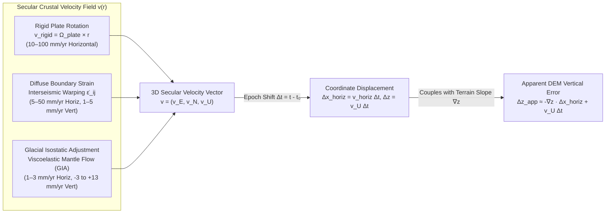

# Chapter 4: Plate Motion Models, Crustal Deformation, and Dynamic Datums

*The Earth's crust is neither rigid nor static: how secular tectonics, glacial rebound, and earthquakes invalidate static coordinates and elevations.*

---

## 4.1 Plate Motion Models and Secular Crustal Velocity

Throughout Chapters 2 and 3, horizontal reference frames and vertical datums were treated primarily as geometric and gravimetric constructs at a fixed instant in time. In reality, the solid Earth is a dynamic, convecting planet whose lithosphere and mantle deform continuously across timescales ranging from seconds (coseismic rupture) to millennia (glacial isostatic adjustment) and millions of years (plate tectonics). A benchmark, LiDAR ground return, or multibeam echosounder footprint does not possess a permanent, time-invariant coordinate; it possesses a **trajectory** $\mathbf{X}(t)$ through space and time.

For high-resolution Digital Elevation Models (DEMs), neglecting secular crustal velocity is no longer a benign simplification. Modern airborne topo-bathymetric LiDAR and multibeam sonar surveys routinely achieve horizontal accuracies of $5\text{–}15\text{ cm}$ and vertical accuracies of $2\text{–}10\text{ cm}$ ($1\sigma$). Meanwhile, horizontal plate motions reach $5\text{–}10\text{ cm/yr}$ in fast-moving plates (such as the Pacific and Australian plates), and vertical crustal velocities from post-glacial rebound or subduction locking reach $1\text{–}1.5\text{ cm/yr}$. When two elevation datasets acquired a decade apart $\Delta t = t_2 - t_1$ are differenced to quantify coastal cliff retreat, river channel migration, landslide creep, or seafloor scour without first transforming both DEMs to a common **coordinate epoch** $t_0$, the horizontal displacement vector $\Delta \mathbf{x}_{\text{horiz}} = \mathbf{v}_{\text{horiz}}\,\Delta t$ couples directly into the terrain gradient $\nabla z$ to produce a systematic **apparent vertical elevation error** $\Delta z_{\text{app}}$:

$$\Delta z_{\text{app}}(x, y) = z(x, y, t_2) - z(x, y, t_1) = \bigl[z(x - \Delta x, y - \Delta y, t_1) + v_U\,\Delta t\bigr] - z(x, y, t_1) \approx -\nabla z(x, y) \cdot \Delta \mathbf{x}_{\text{horiz}} + v_U\,\Delta t$$

On a $30^\circ$ coastal bluff or submarine canyon wall ($\|\nabla z\| = \tan 30^\circ \approx 0.577$), a $50\text{ cm}$ unmodeled horizontal tectonic shift directed upslope or downslope over $10\text{ years}$ creates an artificial vertical elevation bias of $\Delta z_{\text{app}} \approx \mp 28.9\text{ cm}$—completely swamping the vertical error budget (Total Vertical Uncertainty, TVU) of the sensor itself.



---

### 4.1.1 Rigid Plate Kinematics on a Sphere and Ellipsoid vs. Diffuse Plate Boundary Zones

#### Euler's Rotation Theorem and Angular Velocity Vectors

The mathematical foundation of plate kinematics rests on **Euler's rotation theorem** (1776): any displacement of a rigid body on the surface of a sphere (or sharing a fixed center of mass) is equivalent to a rotation about a single axis passing through the center of the sphere. Where this rotation axis intersects the Earth's surface defines a pair of antipodal points known as **Euler poles**. By convention, the pole of rotation $E$ is specified by the geocentric latitude and longitude $(\Phi_E, \Lambda_E)$ around which the plate rotates **counterclockwise** when viewed from above the exterior of the sphere, paired with a scalar angular rotation speed $\omega_E > 0$.

In plate tectonics literature, $\omega_E$ is traditionally reported in degrees per million years ($\text{deg/Myr}$ or $^\circ/\text{Ma}$), whereas in space geodesy it is reported in milliarcseconds per year ($\text{mas/yr}$, where $1^\circ/\text{Myr} = 3.6\text{ mas/yr}$) or radians per year ($\text{rad/yr}$):

$$1\,\text{deg/Myr} = \frac{\pi}{180 \times 10^6}\,\text{rad/yr} \approx 1.745329 \times 10^{-8}\,\text{rad/yr}$$

In an Earth-Centered, Earth-Fixed (ECEF) Cartesian coordinate frame $(X, Y, Z)$ with origin at the Earth's center of mass, the Euler pole parameters $(\Phi_E, \Lambda_E, \omega_E)$ define the three-dimensional **angular velocity vector** $\boldsymbol{\Omega}_{\text{plate}}$ (in $\text{rad/yr}$):

$$\boldsymbol{\Omega}_{\text{plate}} = \begin{bmatrix} \Omega_X \\ \Omega_Y \\ \Omega_Z \end{bmatrix} = \omega_E \begin{bmatrix} \cos\Phi_E \cos\Lambda_E \\ \cos\Phi_E \sin\Lambda_E \\ \sin\Phi_E \end{bmatrix}$$

Conversely, given Cartesian components $(\Omega_X, \Omega_Y, \Omega_Z)$ from a space-geodetic solution such as ITRF2020, the angular speed and Euler pole coordinates are recovered via:

$$\omega_E = \sqrt{\Omega_X^2 + \Omega_Y^2 + \Omega_Z^2}, \qquad \Phi_E = \arcsin\left(\frac{\Omega_Z}{\omega_E}\right), \qquad \Lambda_E = \operatorname{atan2}(\Omega_Y, \Omega_X)$$

For any point $P$ on the rigid plate interior with ECEF position vector $\mathbf{r} = (X, Y, Z)^T$ (in $\text{m}$), the instantaneous linear velocity vector $\mathbf{v}_{\text{ECEF}}(\mathbf{r}) = (v_X, v_Y, v_Z)^T$ (in $\text{m/yr}$) is given by the cross product of $\boldsymbol{\Omega}_{\text{plate}}$ and $\mathbf{r}$:

$$\mathbf{v}_{\text{ECEF}}(\mathbf{r}) = \boldsymbol{\Omega}_{\text{plate}} \times \mathbf{r} = \begin{bmatrix} 0 & -\Omega_Z & \Omega_Y \\ \Omega_Z & 0 & -\Omega_X \\ -\Omega_Y & \Omega_X & 0 \end{bmatrix} \begin{bmatrix} X \\ Y \\ Z \end{bmatrix} = \begin{bmatrix} \Omega_Y Z - \Omega_Z Y \\ \Omega_Z X - \Omega_X Z \\ \Omega_X Y - \Omega_Y X \end{bmatrix}$$

On a spherical Earth of mean radius $R_\oplus \approx 6{,}371{,}000\text{ m}$, the magnitude of the horizontal velocity at an angular great-circle distance $\Delta$ from the Euler pole is:

$$\|\mathbf{v}(\mathbf{r})\| = \omega_E R_\oplus \sin\Delta$$

Consequently, linear plate velocity is zero directly at the Euler pole ($\Delta = 0^\circ$) and reaches its maximum $\omega_E R_\oplus$ along the **Euler equator** ($\Delta = 90^\circ$, where $1\,\text{deg/Myr} \approx 111.195\text{ mm/yr}$). To evaluate the impact of plate motion on a local DEM at geodetic latitude $\phi$ and longitude $\lambda$, $\mathbf{v}_{\text{ECEF}}$ is rotated into the local topocentric **East–North–Up (ENU)** frame via the orthogonal rotation matrix $\mathbf{R}_{\text{ECEF}\to\text{ENU}}(\phi, \lambda)$:

$$\begin{bmatrix} v_E \\ v_N \\ v_U \end{bmatrix} = \begin{bmatrix} -\sin\lambda & \cos\lambda & 0 \\ -\sin\phi\cos\lambda & -\sin\phi\sin\lambda & \cos\phi \\ \cos\phi\cos\lambda & \cos\phi\sin\lambda & \sin\phi \end{bmatrix} \begin{bmatrix} v_X \\ v_Y \\ v_Z \end{bmatrix}$$

Because $\mathbf{v}_{\text{ECEF}} = \boldsymbol{\Omega}_{\text{plate}} \times \mathbf{r}$ is strictly orthogonal to the geocentric position vector $\mathbf{r}$ ($\mathbf{r} \cdot \mathbf{v}_{\text{ECEF}} = 0$), rigid plate motion on a sphere produces **purely horizontal velocity** ($v_U = 0$). Even on a flattened reference ellipsoid ($f \approx 1/298.257$), where the ellipsoidal normal $\hat{\mathbf{n}}$ differs from the geocentric radial vector $\hat{\mathbf{r}}$ by at most $0.192^\circ$ (at $\phi \approx 45^\circ$), the apparent vertical projection of horizontal plate motion is at most $0.1\text{–}0.3\text{ mm/yr}$ and is conventionally absorbed into horizontal ellipsoidal kinematics.

#### Diffuse Plate Boundary Deformation Zones

While Euler's rotation theorem describes the stable interiors (cratons and abyssal plains) of tectonic plates to within $0.5\text{–}1.5\text{ mm/yr}$, rigid-plate kinematics breaks down completely across **diffuse plate boundary zones**—regions that cover approximately $15\%$ of the Earth's surface and host a disproportionate share of the world's population, coastal infrastructure, and high-resolution LiDAR/bathymetric mapping campaigns (Gordon, 1998; Kreemer et al., 2014). Prominent examples include:

* **The Western United States and North American Cordillera:** A $500\text{–}1{,}200\text{ km}$ wide zone accommodating $\sim 50\text{ mm/yr}$ of dextral Pacific–North America shear across the San Andreas fault system, the Eastern California Shear Zone / Walker Lane, and the extending Basin and Range province, alongside oblique Juan de Fuca subduction in Cascadia.
* **The Mediterranean–Alpine–Himalayan–Tibetan Belt:** Distributed continental collision between the African, Arabian, Indian, and Eurasian plates spanning thousands of kilometers from the Aegean and Anatolia to the Tibetan Plateau.
* **The Central Andes:** Crustal shortening, underthrusting, and viscoelastic deformation across the Nazca–South America convergent margin.
* **The Japanese Islands and Taiwan:** Complex multi-plate convergence (Pacific, Philippine Sea, Okhotsk/North America, and Amurian plates) with intense interseismic strain accumulation.
* **New Zealand's Alpine–Hikurangi–Kermadec Margin:** Oblique transpression and subduction bridging the Pacific and Australian plates across both the North and South Islands.

Within these diffuse zones, the crust does not move as a single rigid block; instead, the velocity field $\mathbf{v}(\mathbf{x})$ varies continuously in space. The spatial derivatives of the horizontal velocity field define the two-dimensional **velocity gradient tensor** $\mathbf{L}_{ij} = \frac{\partial v_i}{\partial x_j}$ ($i, j \in \{E, N\}$), which decomposes into a symmetric **strain rate tensor** $\dot{\boldsymbol{\varepsilon}}$ and an antisymmetric **vorticity (vertical-axis rotation rate) tensor** $\dot{\boldsymbol{\omega}}$:

$$\dot{\varepsilon}_{ij} = \frac{1}{2}\left(\frac{\partial v_i}{\partial x_j} + \frac{\partial v_j}{\partial x_i}\right), \qquad \dot{\omega}_{ij} = \frac{1}{2}\left(\frac{\partial v_i}{\partial x_j} - \frac{\partial v_j}{\partial x_i}\right)$$

Typical tectonic strain rates in diffuse boundaries range from $50\text{ to }500\text{ nanostrain/yr}$ ($1\text{ nanostrain/yr} = 10^{-9}\text{ yr}^{-1} = 1\text{ mm/yr}$ of differential motion per $1{,}000\text{ km}$), reaching $>1{,}000\text{ nanostrain/yr}$ ($1\text{ mm/yr}$ per $\text{km}$) across locked strike-slip faults and subduction megathrusts. Crucially, unlike rigid plate rotation, diffuse boundary deformation includes substantial **vertical tectonic velocities** $v_U(\phi, \lambda)$ of $\pm 1\text{ to }\pm 8\text{ mm/yr}$ driven by crustal thickening, isostatic compensation, and elastic interseismic flexing above locked subduction interfaces (such as the coastal uplift of the Olympic Peninsula and Vancouver Island above the locked Cascadia megathrust). Consequently, DEMs in diffuse zones experience not merely a rigid horizontal translation and rotation, but non-uniform **internal shearing, dilation, and vertical warping**. When a single airborne LiDAR or coastal multibeam survey block straddles an active plate boundary (such as a flight line crossing the San Andreas Fault in California or the Alpine Fault in New Zealand), applying a single rigid-plate Euler pole rotation leaves an unmodeled differential shear of $35\text{–}50\text{ mm/yr}$ across the fault zone, tearing multi-epoch DEM mosaics unless a continuous deformation grid is applied.

---

### 4.1.2 Global No-Net-Rotation (NNR) Models and Regional Velocity Grids

#### From Geological NUVEL-1A to Space-Geodetic ITRF2020 Plate Motion Models

Because relative plate motion vectors $\boldsymbol{\Omega}_{A/B} = \boldsymbol{\Omega}_A - \boldsymbol{\Omega}_B$ constrain only differences between adjacent plates, defining an absolute angular velocity $\boldsymbol{\Omega}_P$ for every plate $P$ requires a global reference frame condition. Both geological models and the International Terrestrial Reference Frame (ITRF) adopt the **No-Net-Rotation (NNR)** condition (also known as the Tisserand condition for the lithosphere), which requires that the surface integral of angular momentum over the entire spherical lithosphere of surface area $A_\oplus$ vanishes:

$$\oint_{A_\oplus} \mathbf{r} \times \mathbf{v}(\mathbf{r})\,dA = \sum_{p=1}^{N_{\text{plates}}} \left( \int_{A_p} \mathbf{r} \times (\boldsymbol{\Omega}_p \times \mathbf{r})\,dA \right) = \mathbf{0}$$

Over the past three decades, global NNR plate motion models have evolved through two distinct observational paradigms:

1. **Geological and Marine Geophysical Models (`NUVEL-1A`, `NNR-MORVEL56`):** First formulated in **NUVEL-1** (DeMets et al., 1990) and recalibrated to the Cande & Kent (1992) geomagnetic polarity timescale in **NUVEL-1A** (DeMets et al., 1994; `gis-history` milestone), geological models invert three types of marine and seismological observables: seafloor spreading rates from marine magnetic anomalies (averaged over the $3.16\text{ Myr}$ since the Gilbert-Gauss reversal Chron 2An), transform fault azimuths from multibeam bathymetry and side-scan sonar, and earthquake slip vectors from centroid moment tensors. **MORVEL** and **NNR-MORVEL56** (DeMets et al., 2010; Argus et al., 2011) refined this approach across $56$ plates using higher-resolution multibeam fracture zone mapping and $0.78\text{ Myr}$ (Brunhes-Matuyama) spreading rates.
2. **Space-Geodetic Models (`ITRF2014-PMM`, `ITRF2020-PMM`, `GSRM v2.1`):** Instead of averaging over millions of years, modern plate motion models invert decadal time series from continuous Global Navigation Satellite System (cGNSS) stations, Very Long Baseline Interferometry (VLBI), Satellite Laser Ranging (SLR), and DORIS sited on stable plate interiors. The **ITRF2014 Plate Motion Model** (Altamimi et al., 2017) and the **ITRF2020 Plate Motion Model** (Altamimi et al., 2023; agreeing with ITRF2014-PMM within $\sim 0.005\text{–}0.015\text{ mas/yr}$ or $\lesssim 0.3\text{ mm/yr}$) define the contemporary secular kinematics of $11\text{–}13$ major tectonic plates directly aligned with the ITRF orientation time evolution. While geological ($3\text{ Myr}$) and space-geodetic ($30\text{ yr}$) Euler vectors agree within $5\text{–}10\%$ for most oceanic plates, significant discrepancies exist where plates are decelerating due to continental collision (e.g., the Nazca and Indian plates), making **space-geodetic models mandatory for DEM epoch transformations**.

| Tectonic Plate (Abbrev.) | ITRF $\Omega_X$ ($\text{mas/yr}$) | ITRF $\Omega_Y$ ($\text{mas/yr}$) | ITRF $\Omega_Z$ ($\text{mas/yr}$) | Angular Speed $\omega_E$ ($\text{deg/Myr}$) | Typical Surface Speed $\|\mathbf{v}\|$ ($\text{mm/yr}$) | Primary Operational Datum / Deformation Model |
| :--- | :---: | :---: | :---: | :---: | :---: | :--- |
| **North America (`NOAM`)** | $+0.024$ | $-0.694$ | $-0.063$ | $0.194$ | $15\text{–}25$ (WSW) | `NAD83(2011)` / `NATRF2022` + `HTDP` / `IFDM2022` |
| **Pacific (`PCFC`)** | $-0.409$ | $+1.047$ | $-2.169$ | $0.679$ | $50\text{–}105$ (NW) | `PATRF2022` / `ITRF2020` + `HTDP` / `NZGD2000` |
| **Eurasia (`EURA`)** | $-0.085$ | $-0.531$ | $+0.770$ | $0.261$ | $20\text{–}30$ (ENE) | `ETRF2000` / `ETRF2014` + `NKG_RF17vel` |
| **Australia (`AUST`)** | $+1.510$ | $+1.182$ | $+1.215$ | $0.631$ | $65\text{–}75$ (NNE) | `GDA2020` (static @ 2020.0) / `ATRF2014` (kinematic) |
| **South America (`SOAM`)** | $-0.270$ | $-0.301$ | $-0.114$ | $0.117$ | $10\text{–}15$ (NNW) | `SIRGAS-CON` + `VEMOS` velocity model |
| **Nazca (`NAZC`)** | $-0.333$ | $-1.544$ | $+1.623$ | $0.629$ | $45\text{–}75$ (E) | `ITRF2020-PMM` (subducting oceanic plate) |

#### Operational Regional Deformation Grids and Plate-Fixed vs. Dynamic Datums

To prevent coordinates of static survey marks from changing every year across stable continental interiors, national geodetic agencies historically defined **plate-fixed reference frames** by subtracting the rigid Euler pole rotation $\boldsymbol{\Omega}_{\text{plate}} \times \mathbf{r}$ of the host continent from ITRF. However, because single-plate rotation fails across diffuse boundaries and fast-moving plates diverge rapidly from global GNSS orbits (which are broadcast in WGS84 / ITRF), three operational paradigms have emerged:

* **NOAA HTDP and the 2022 North American Reference Frame Modernization (`IFDM2022`):** In the United States, `NAD83(2011)` (epoch 2010.0) is rotated with the stable North American craton. While velocities in the central US relative to NAD83 are $<2\text{ mm/yr}$, western California moves at $35\text{–}50\text{ mm/yr}$ relative to NAD83 because it sits on the Pacific Plate and the San Andreas diffuse boundary. Since 1992 (`gis-history` milestone), the U.S. National Geodetic Survey (NGS) has maintained **HTDP (Horizontal Time-Dependent Positioning)** (Snay, 1999; Pearson & Snay, 2013), which pairs rigid Euler poles with finite-element/dislocation grids of western U.S. and Alaskan crustal velocity and major earthquakes. In the NSRS modernization replacing NAD83, NGS introduces four plate-fixed frames—**NATRF2022** (North America), **PATRF2022** (Pacific), **CATRF2022** (Caribbean), and **MATRF2022** (Mariana)—each defined by its respective Euler pole rotation relative to ITRF2020, accompanied by the **IFDM2022 (Intra-Frame Deformation Model 2022)** grid to remove residual non-rigid deformation between observation epoch $t$ and reference epoch $t_0$.
* **Australia's `GDA2020` and `ATRF2014`:** The Australian continental plate is the fastest-moving continental mass on Earth, translating NNE at $\sim 70\text{ mm/yr}$ relative to ITRF. Between the realization of `GDA94` (epoch 1994.0) and `GDA2020` (epoch 2020.0), the entire Australian continent shifted by $26\text{ yr} \times 0.07\text{ m/yr} \approx 1.82\text{ m}$ to the northeast! Mixing consumer GNSS or satellite LiDAR referenced to contemporary ITRF/WGS84 with legacy Australian DEMs in GDA94 introduces an immediate $\sim 1.8\text{ m}$ horizontal offset. Consequently, Australia now operates a dual-frame system: static `GDA2020` for legacy GIS compatibility and the kinematic **Australian Terrestrial Reference Frame (`ATRF2014`)** that propagates coordinates forward in time using the national plate motion rate.
* **New Zealand's Semi-Dynamic `NZGD2000`:** Straddling the active Pacific–Australian plate boundary, New Zealand experiences continuous shear of $35\text{–}50\text{ mm/yr}$ across the country. Rather than allowing published coordinates to drift continuously, Land Information New Zealand (LINZ) implemented **NZGD2000** as a **semi-dynamic (or deformation-patched) datum** locked at reference epoch $t_0 = 2000.0$ (Crook et al., 2016). Every new LiDAR or hydrographic survey acquired at epoch $t$ in ITRF is propagated backward to $2000.0$ using a national bilinear velocity grid $\mathbf{v}_{\text{NZ}}(\phi, \lambda)$ plus reverse coseismic/postseismic earthquake patches (Section 4.2), ensuring all national DEMs remain seamlessly aligned at epoch $2000.0$.

---

### 4.1.3 Glacial Isostatic Adjustment (GIA / Post-Glacial Rebound)

Whereas rigid plate tectonics is overwhelmingly horizontal, **Glacial Isostatic Adjustment (GIA)**—historically termed post-glacial rebound—is the primary source of continent-scale **secular vertical crustal motion** ($v_U = \dot{h}$) and secular geoid change ($\dot{N}$) across mid- and high-latitude terrestrial and bathymetric DEMs.

During the Last Glacial Maximum (LGM, $\sim 26\text{–}19\text{ ka BP}$), kilometer-thick continental ice sheets—most notably the **Laurentide** and **Cordilleran** ice sheets over North America and the **Fennoscandian** and **Barents–Kara** ice sheets over northern Europe—depressed the underlying elastic lithosphere by several hundred meters into the viscoelastic mantle, squeezing mantle material outward into a surrounding **peripheral forebulge**. Following deglaciation (largely complete by $\sim 6\text{ ka BP}$ in the Northern Hemisphere), the viscous mantle has been slowly flowing back beneath the formerly glaciated centers while draining out from beneath the peripheral forebulges. Because the Earth's mantle behaves as a Maxwell viscoelastic solid over millennial timescales (with upper-mantle viscosity $\eta_{\text{UM}} \approx 0.5 \times 10^{21}\text{ Pa}\cdot\text{s}$ and lower-mantle viscosity $\eta_{\text{LM}} \approx 1.5\text{–}3.0 \times 10^{21}\text{ Pa}\cdot\text{s}$), this isostatic relaxation has a characteristic exponential decay time of $\tau_{\text{GIA}} \approx 2{,}000\text{–}5{,}000\text{ years}$ and remains vigorously active today.

Modern global GIA models—such as **ICE-6G_C (VM5a)** (Argus et al., 2014; Peltier et al., 2015) and its North American refinement **ICE-7G_NA (VM7)** (Roy & Peltier, 2018)—solve the gravitationally self-consistent **sea-level equation** (Farrell & Clark, 1976) on a viscoelastic spherical Earth, predicting three distinct spatial regimes that directly impact DEM accuracy and vertical datum maintenance:

1. **Domal Uplift Centers ($+10\text{ to }+13.5\text{ mm/yr}$):** Beneath the former ice-load centers around **Hudson Bay, Canada** and the **Gulf of Bothnia, Fennoscandia** (modeled operationally at sub-millimeter precision by the Nordic Geodetic Commission's **NKG2016LU** land uplift model; Vestøl et al., 2019), the crust is uplifting at $v_U = +10\text{ to }+13.5\text{ mm/yr}$, accompanied by radially outward horizontal velocities of $1\text{–}3\text{ mm/yr}$. Over a $30\text{-year}$ span between legacy topographic maps or early airborne laser scans and modern LiDAR, physical elevations in central Canada and northern Sweden/Finland rise by **$30\text{ to }40\text{ cm}$**, transforming shallow coastal bays into dry land and shoaling navigable channels.
2. **Peripheral Forebulge Collapse ($-1.5\text{ to }-3.0\text{ mm/yr}$):** Along a $500\text{–}1{,}000\text{ km}$ band surrounding the former ice margins—extending across the **U.S. Mid-Atlantic coast** (Chesapeake Bay, Delaware Bay, New Jersey) and the **southern North Sea** (Netherlands, southern UK, northern Germany)—deep mantle material is flowing away toward the former ice centers. The resulting forebulge collapse causes persistent crustal subsidence of $v_U = -1.5\text{ to }-3.0\text{ mm/yr}$. Combined with eustatic ocean warming and sterodynamic sea-level rise ($\sim 2\text{–}3\text{ mm/yr}$), GIA forebulge collapse nearly doubles the rate of **Relative Sea Level (RSL) rise** to $4.5\text{–}6.0\text{ mm/yr}$, rapidly invalidating static coastal flood DEMs and tidal datum separation models (VDatum).
3. **Differential Basin Tilting and Dynamic Geoid Change ($\dot{N}$):** Across large inland water bodies that straddle the GIA hinge line (the zero-uplift contour separating uplift from forebulge subsidence), differential vertical velocity tilts the entire hydrological basin. Across the **Laurentian Great Lakes**, northeastern outlets (e.g., Michipicoten on Lake Superior and Parry Sound on Georgian Bay) uplift at $+3\text{ to }+5\text{ mm/yr}$, while southwestern shorelines (e.g., Chicago on Lake Michigan and Toledo on Lake Erie) subside at $-1\text{ to }-2\text{ mm/yr}$. This $5\text{–}6\text{ mm/yr}$ differential tilt across $800\text{ km}$ acts like tipping a massive shallow pan of water toward the southwest—steadily encroaching on southwestern shorelines while exposing northeastern harbors. Consequently, the binational **International Great Lakes Datum (IGLD)** must be completely recomputed every $25\text{–}35\text{ years}$ (**IGLD 1955 $\to$ IGLD 1985 $\to$ IGLD 2020**; dynamic heights referenced to Rimouski, Quebec). Furthermore, because viscous mantle inflow increases gravitational mass beneath uplifting regions, the geoid surface itself rises at $\dot{N} \approx +0.06\text{ to }+0.10\,v_U$ (reaching $+1.0\text{ to }+1.4\text{ mm/yr}$ in Hudson Bay), necessitating a **dynamic Geoid Monitoring Service (GeMS)** within **NAPGD2022 / GEOID2022** so that orthometric heights $H(t) = h(t) - N(t)$ track both crustal uplift $\dot{h}$ and geoid uplift $\dot{N}$.

---

### 4.1.4 Worked Numerical Example & Executable Transformation Pipeline

Consider a coastal cliff LiDAR benchmark at **Point Reyes, California** ($\phi = 38.0000^\circ\text{ N}$, $\lambda = -123.0000^\circ\text{ E}$, $h = 50.00\text{ m}$), located immediately west of the San Andreas Fault on the **Pacific Plate**. We wish to:
1. Compute its secular horizontal velocity in ITRF using the rigid Pacific Plate Euler vector from Table 4.1: $\Omega_X = -0.409\text{ mas/yr}$, $\Omega_Y = +1.047\text{ mas/yr}$, $\Omega_Z = -2.169\text{ mas/yr}$.
2. Determine the apparent vertical error $\Delta z_{\text{app}}$ introduced if a 2010 airborne LiDAR DEM ($t_1 = 2010.0$) and a 2025 UAS LiDAR DEM ($t_2 = 2025.0$, $\Delta t = 15.0\text{ yr}$) are differenced directly in ITRF without epoch propagation across a southwest-facing coastal bluff with slope $35^\circ$ ($\alpha_{\text{aspect}} = 225^\circ$, i.e., facing SW, so the upslope gradient points NE at $45^\circ$).

#### Step-by-Step Mathematical Derivation

First, convert the angular velocity components from $\text{mas/yr}$ to $\text{rad/yr}$ using $1\text{ mas/yr} = \frac{\pi}{180 \times 3600 \times 1000}\text{ rad/yr} \approx 4.8481368 \times 10^{-9}\text{ rad/yr}$:

$$\boldsymbol{\Omega}_{\text{PCFC}} = \begin{bmatrix} -1.98289 \times 10^{-9} \\ +5.07600 \times 10^{-9} \\ -1.05156 \times 10^{-8} \end{bmatrix}\,\text{rad/yr}$$

Using GRS80 ellipsoidal parameters ($a = 6{,}378{,}137.0\text{ m}$, $e^2 = 0.00669438002290$), the prime vertical radius of curvature at $\phi = 38.0^\circ$ is $N(\phi) = a / \sqrt{1 - e^2\sin^2\phi} = 6{,}386{,}244.5\text{ m}$, yielding ECEF coordinates:

$$\mathbf{r} = \begin{bmatrix} X \\ Y \\ Z \end{bmatrix} = \begin{bmatrix} (N + h)\cos\phi\cos\lambda \\ (N + h)\cos\phi\sin\lambda \\ (N(1 - e^2) + h)\sin\phi \end{bmatrix} = \begin{bmatrix} -2{,}740{,}879.0 \\ -4{,}220{,}583.4 \\ +3{,}905{,}474.7 \end{bmatrix}\,\text{m}$$

Evaluating the cross product $\mathbf{v}_{\text{ECEF}} = \boldsymbol{\Omega}_{\text{PCFC}} \times \mathbf{r}$ gives:

$$\begin{aligned}
v_X &= \Omega_Y Z - \Omega_Z Y = (5.07600 \times 10^{-9})(3{,}905{,}474.7) - (-1.05156 \times 10^{-8})(-4{,}220{,}583.4) = -0.02456\text{ m/yr} = -24.56\text{ mm/yr} \\
v_Y &= \Omega_Z X - \Omega_X Z = (-1.05156 \times 10^{-8})(-2{,}740{,}879.0) - (-1.98289 \times 10^{-9})(3{,}905{,}474.7) = +0.03657\text{ m/yr} = +36.57\text{ mm/yr} \\
v_Z &= \Omega_X Y - \Omega_Y X = (-1.98289 \times 10^{-9})(-4{,}220{,}583.4) - (5.07600 \times 10^{-9})(-2{,}740{,}879.0) = +0.02228\text{ m/yr} = +22.28\text{ mm/yr}
\end{aligned}$$

Rotating $(v_X, v_Y, v_Z)^T$ into the local topocentric ENU frame at $(\phi = 38^\circ, \lambda = -123^\circ)$ via $\mathbf{R}_{\text{ECEF}\to\text{ENU}}$ preserves the 3D vector norm ($\|\mathbf{v}_{\text{ECEF}}\| = \|\mathbf{v}_{\text{ENU}}\| = 49.36\text{ mm/yr}$) and yields:

$$v_E = -40.51\text{ mm/yr}, \qquad v_N = +28.20\text{ mm/yr}, \qquad v_U = +0.09\text{ mm/yr} \approx 0.0\text{ mm/yr}$$

(Note that the tiny $+0.09\text{ mm/yr}$ value of $v_U$ arises solely from the $0.19^\circ$ deflection between the geodetic ellipsoidal normal $\hat{\mathbf{n}}$ and the geocentric radial vector $\hat{\mathbf{r}}$ at $\phi = 38^\circ$, as derived in Section 4.1.1.) Thus, Point Reyes moves horizontally at $\|\mathbf{v}_{\text{horiz}}\| = \sqrt{(-40.51)^2 + 28.20^2} = 49.36\text{ mm/yr}$ toward azimuth $\operatorname{atan2}(v_E, v_N) = 304.9^\circ$ (NW). Over $\Delta t = 15\text{ years}$, the horizontal displacement is:

$$\Delta \mathbf{x}_{\text{horiz}} = \begin{bmatrix} \Delta E \\ \Delta N \end{bmatrix} = 15\text{ yr} \times \begin{bmatrix} -0.04051\text{ m/yr} \\ +0.02820\text{ m/yr} \end{bmatrix} = \begin{bmatrix} -0.608\text{ m} \\ +0.423\text{ m} \end{bmatrix} \quad (\|\Delta \mathbf{x}_{\text{horiz}}\| = 0.740\text{ m})$$

For a southwest-facing bluff of slope $s = 35^\circ$ whose steepest descent is at azimuth $225^\circ$, the terrain elevation gradient vector $\nabla z = (\partial z/\partial E, \partial z/\partial N)^T$ points upslope (azimuth $45^\circ$):

$$\nabla z = \tan(35^\circ) \begin{bmatrix} \sin 45^\circ \\ \cos 45^\circ \end{bmatrix} = 0.7002 \begin{bmatrix} 0.7071 \\ 0.7071 \end{bmatrix} = \begin{bmatrix} +0.4951 \\ +0.4951 \end{bmatrix}$$

Even when the two surveys are partially misaligned along the strike of the bluff, the component of horizontal motion along the gradient produces an apparent vertical elevation offset:

$$\Delta z_{\text{app}} \approx -\nabla z \cdot \Delta \mathbf{x}_{\text{horiz}} = -\big((0.4951)(-0.608) + (0.4951)(+0.423)\big) = +0.091\text{ m} \quad (+9.1\text{ cm})$$

And on a northwest-facing headland or submarine canyon wall at the same site (steepest descent at azimuth $304.9^\circ$, upslope gradient at $124.9^\circ$ directly opposing plate motion), the apparent vertical bias reaches its maximum magnitude:

$$\Delta z_{\text{app, max}} = +\|\nabla z\| \, \|\Delta \mathbf{x}_{\text{horiz}}\| = 0.7002 \times 0.740\text{ m} = +0.518\text{ m} \quad (+51.8\text{ cm}!)$$

```python
import numpy as np
from pyproj import Transformer

# 1. Exact Euler pole velocity calculation in ECEF and topocentric ENU
mas_yr_to_rad_yr = np.pi / (180.0 * 3600.0 * 1000.0)
omega_pcfc = np.array([-0.409, 1.047, -2.169]) * mas_yr_to_rad_yr  # ITRF PCFC Euler vector

lat_deg, lon_deg, h_m = 38.0, -123.0, 50.0
to_ecef = Transformer.from_crs("EPSG:4979", "EPSG:4978", always_xy=True)
X, Y, Z = to_ecef.transform(lon_deg, lat_deg, h_m)
r_ecef = np.array([X, Y, Z])

v_ecef = np.cross(omega_pcfc, r_ecef)  # m/yr

lat, lon = np.radians(lat_deg), np.radians(lon_deg)
R_ecef_to_enu = np.array([
    [-np.sin(lon),              np.cos(lon),             0.0],
    [-np.sin(lat)*np.cos(lon), -np.sin(lat)*np.sin(lon), np.cos(lat)],
    [ np.cos(lat)*np.cos(lon),  np.cos(lat)*np.sin(lon), np.sin(lat)]
])
v_enu = R_ecef_to_enu @ v_ecef
print(f"ENU velocity (mm/yr): vE={v_enu[0]*1e3:.2f}, vN={v_enu[1]*1e3:.2f}, vU={v_enu[2]*1e3:.2f}")
# Outputs: ENU velocity (mm/yr): vE=-40.51, vN=28.20, vU=0.09

# 2. Epoch propagation of a 4D point (lon, lat, h, t) via PROJ time-dependent Helmert
# Forward trajectory of a Pacific Plate benchmark from t_epoch=2010.0 to t=2025.0 in ITRF
# Note: PROJ +drx, +dry, +drz are in arcseconds/yr (1 mas/yr = 0.001 arcsec/yr)
pipeline_euler = (
    "+proj=pipeline "
    "+step +proj=cart +ellps=GRS80 "
    "+step +proj=helmert +drx=-0.000409 +dry=0.001047 +drz=-0.002169 "
    "      +t_epoch=2010.0 +convention=position_vector "
    "+step +inv +proj=cart +ellps=GRS80"
)
trans_euler = Transformer.from_pipeline(pipeline_euler)
lon_2025, lat_2025, h_2025, _ = trans_euler.transform(lon_deg, lat_deg, h_m, 2025.0)

# 3. In diffuse boundary or GIA zones, replace rigid +proj=helmert with +proj=deformation
# using a 3D velocity grid (e.g., NKG, NZGD2000, or HTDP/IFDM2022 GeoTIFF velocity grids):
# +step +proj=deformation +grids=velocity_grid_enu.tif +t_epoch=2020.0
```

> [!WARNING]
> **Common Pitfall: Differencing Multi-Temporal DEMs Across Epochs Without Kinematic Alignment**
> Never subtract two high-resolution DEMs acquired in different years (e.g., $2010$ vs. $2025$ LiDAR or multibeam surveys) solely because both carry the same nominal CRS EPSG code (such as `EPSG:6318` for NAD83(2011) or `EPSG:9989` for ITRF2020). In active tectonic margins or GIA uplift zones, horizontal motion of $3\text{–}8\text{ cm/yr}$ across steep slopes produces decimeter-to-meter scale false elevation change bands on opposite hillslopes (a classic dipole residual pattern in $\text{DoD} = \text{DEM}_2 - \text{DEM}_1$). Always verify the **coordinate epoch** of both datasets and propagate both point clouds (`pdal translate` with `filters.projpipeline`) or rasters (`gdalwarp -s_coord_epoch 2025.0 -t_coord_epoch 2010.0`) to a common reference epoch $t_0$ using PROJ (`+proj=deformation` or time-dependent Helmert pipelines), NOAA HTDP, or hydrographic ERS workflows (CARIS HIPS & SIPS / QPS Qimera) before raster differencing.

#### Propagating Velocity Uncertainty into Total Horizontal and Vertical Uncertainty (THU / TVU)

When coordinates are transformed from survey observation epoch $t$ to a target reference epoch $t_0$ across a time span $\Delta t = t_0 - t$, uncertainty in the velocity model itself ($\sigma_{v_E}, \sigma_{v_N}, \sigma_{v_U}$, typically $0.3\text{–}1.5\text{ mm/yr}$ in cratonic interiors and $1.5\text{–}4.0\text{ mm/yr}$ in diffuse deformation grids) grows linearly with $|\Delta t|$ and must be added in quadrature to the survey's acquisition Total Horizontal Uncertainty ($\text{THU}(t)$) and Total Vertical Uncertainty ($\text{TVU}(t)$):

$$\sigma_{\text{horiz}}^2(t_0) = \sigma_{\text{horiz}}^2(t) + \left(\sigma_{v_E}^2 + \sigma_{v_N}^2\right)(t_0 - t)^2, \qquad \sigma_z^2(t_0) = \sigma_z^2(t) + \sigma_{v_U}^2(t_0 - t)^2 + \|\nabla z\|^2 \sigma_{v,\text{horiz}}^2 (t_0 - t)^2$$

where $\sigma_{v,\text{horiz}}$ is the $1\sigma$ horizontal velocity uncertainty along the upslope terrain gradient direction $\nabla z / \|\nabla z\|$. Over a $20\text{-year}$ epoch transformation with $\sigma_{v_U} = 1.5\text{ mm/yr}$ and $\sigma_{v,\text{horiz}} = 2.0\text{ mm/yr}$ on a $25^\circ$ slope ($\|\nabla z\| = 0.466$), the velocity model uncertainty alone contributes $\sigma_{z,\text{vel}} = \sqrt{(3.0\text{ cm})^2 + (0.466 \times 4.0\text{ cm})^2} = 3.53\text{ cm}$ ($1\sigma$)—or $\text{LE95} = 1.96\,\sigma_{z,\text{vel}} = 6.92\text{ cm}$ at the $95\%$ confidence level required by ASPRS Positional Accuracy Standards, USGS 3DEP, NOAA HSSD, and IHO S-44—to the propagated DEM vertical error budget.

> [!IMPORTANT]
> **Key Takeaway: Dynamic Metadata Requires Both CRS and Coordinate Epoch**
> In a deformable Earth, a Coordinate Reference System (CRS) identifier is incomplete without an explicit **coordinate epoch** $t_0$ (ISO 19111:2019 / OGC WKT2 `COORDINATEEPOCH[2020.0]`). Furthermore, inside diffuse plate boundary zones (such as the western US, Japan, or New Zealand), rigid 3-parameter Euler pole rotations are insufficient: accurate DEM alignment requires **gridded intra-frame deformation models** (HTDP, IFDM2022, NZGD2000) and **GIA vertical velocity grids** (ICE-6G_C/ICE-7G_NA, NKG2016LU, GEOID2022 GeMS) that capture spatially varying strain and viscoelastic vertical motion.

---

### 4.1.5 Curated References for Section 4.1

* Altamimi, Z., Metivier, L., Rebischung, P., Rouby, H., & Collilieux, X. (2017). ITRF2014 plate motion model. *Geophysical Journal International*, 209(3), 1906–1912. https://doi.org/10.1093/gji/ggx136
* Altamimi, Z., Rebischung, P., Collilieux, X., Métivier, L., & Chanard, K. (2023). ITRF2020: An augmented reference frame refining the modeling of nonlinear station motions. *Journal of Geodesy*, 97(47), 1–29. https://doi.org/10.1007/s00190-023-01738-w
* DeMets, C., Gordon, R. G., Argus, D. F., & Stein, S. (1994). Effect of recent revisions to the geomagnetic reversal time scale on estimates of current plate motions. *Geophysical Research Letters*, 21(20), 2191–2194. https://doi.org/10.1029/94GL02118
* DeMets, C., Gordon, R. G., & Argus, D. F. (2010). Geologically current plate motions. *Geophysical Journal International*, 181(1), 1–80. https://doi.org/10.1111/j.1365-246X.2009.04491.x
* Gordon, R. G. (1998). The plate tectonic approximation: Plate nonrigidity, diffuse plate boundaries, and global plate reconstructions. *Annual Review of Earth and Planetary Sciences*, 26, 615–642. https://doi.org/10.1146/annurev.earth.26.1.615
* Kreemer, C., Blewitt, G., & Klein, E. C. (2014). A geodetic plate motion and Global Strain Rate Model. *Geochemistry, Geophysics, Geosystems*, 15(10), 3849–3889. https://doi.org/10.1002/2014GC005407
* Pearson, C., & Snay, R. (2013). Introducing HTDP 3.1 to transform coordinates across time and spatial reference frames. *GPS Solutions*, 17(1), 1–15. https://doi.org/10.1007/s10291-012-0255-y
* Peltier, W. R., Argus, D. F., & Drummond, R. (2015). Space geodesy constrains ice age terminal deglaciation: The global ICE-6G_C (VM5a) model. *Journal of Geophysical Research: Solid Earth*, 120(1), 450–487. https://doi.org/10.1002/2014JB011176
* Roy, K., & Peltier, W. R. (2018). Relative sea level in the Western Hemisphere and the ICE-7G_NA (VM7) model of Glacial Isostatic Adjustment. *Quaternary Science Reviews*, 183, 76–105. https://doi.org/10.1016/j.quascirev.2017.12.021
* Vestøl, O., Ågren, J., Steffen, H., Kierulf, H., & Tarasov, L. (2019). NKG2016LU: A new land uplift model for Fennoscandia and the Baltic Region. *Journal of Geodesy*, 93(9), 1759–1779. https://doi.org/10.1007/s00190-019-01280-8
