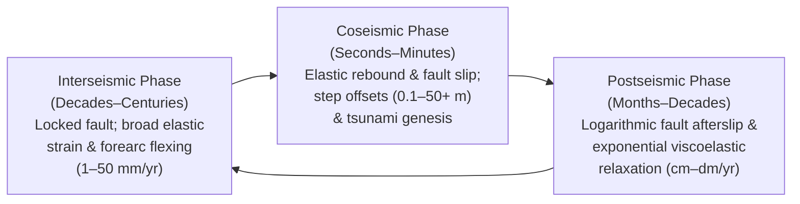

## 4.2 Dealing with Earthquake Deformation and Transient Crustal Motion

Secular plate motion and glacial isostatic adjustment (Section 4.1) describe only the long-term, steady-state kinematics of the lithosphere. Across active plate boundaries, volcanic provinces, and heavily exploited sedimentary basins, the Earth's surface also undergoes pronounced **transient, episodic, and nonlinear deformation**. A single great megathrust earthquake can displace continental shelves and coastal floodplains by meters vertically and tens of meters horizontally within seconds, instantly invalidating nautical charts, flood-control levees, and national Digital Elevation Models (DEMs). Over subsequent years to decades, fault afterslip, viscoelastic mantle relaxation, aquifer compaction, and seasonal surface mass loading continue to warp the topographic and bathymetric surface at rates ranging from millimeters to tens of centimeters per year.

In high-precision geomorphology, hydrography, and datum maintenance, treating a DEM as a static geometric surface across a seismic event or rapid subsidence episode introduces catastrophic systematic biases. This section examines the mechanics of the seismic cycle on land and at the seafloor, the implementation of coseismic and postseismic deformation patching in modern geodetic pipelines, and the modeling of non-tectonic vertical motion.

---

### 4.2.1 The Seismic Cycle in Terrestrial and Bathymetric DEMs

Along active fault zones, crustal deformation evolves through three distinct mechanical phases—**interseismic**, **coseismic**, and **postseismic**—each imposing a characteristic spatial wavelength and temporal signature on terrestrial elevation $z(x,y,t)$ (positive-up, $[\text{m}]$) and bathymetric depth $d(x,y,t)$ (positive-down, $[\text{m}]$).



#### Interseismic Strain Accumulation
During the interseismic period between major earthquakes, the shallow seismogenic portion of a fault (typically from the surface down to a locking depth $D \approx 10\text{–}20\text{ km}$ in continental crust, or $10\text{–}50\text{ km}$ along subduction megathrusts) is frictionally locked, while the deeper ductile lithosphere creeps steadily at the long-term relative plate velocity $v_0$. Rather than exhibiting a sharp velocity discontinuity directly at the fault trace, the upper crust bends elastically across a broad shear or flexural zone tens to hundreds of kilometers wide.

For a long, vertical strike-slip fault striking along the $y$-axis and locked from the surface ($z=0$) to depth $D$ in a homogeneous isotropic elastic half-space, **Savage and Burford (1973)** derived the classic screw-dislocation analytical profile for the fault-parallel surface velocity $v_y(x)$ as a function of fault-normal distance $x$ $[\text{m}]$ from the fault trace:

$$v_y(x) = \frac{v_0}{\pi} \arctan\left(\frac{x}{D}\right)$$

where:
* $v_y(x)$ is the fault-parallel horizontal surface velocity $[\text{m}\cdot\text{s}^{-1}\text{ or }\text{mm}\cdot\text{yr}^{-1}]$,
* $v_0$ is the far-field relative plate motion rate across the fault $[\text{m}\cdot\text{s}^{-1}\text{ or }\text{mm}\cdot\text{yr}^{-1}]$ such that $v_y(+\infty) - v_y(-\infty) = v_0$,
* $x$ is the fault-normal horizontal coordinate $[\text{m}]$ ($x=0$ at the surface fault trace), and
* $D$ is the vertical locking depth $[\text{m}]$.

Near the fault ($|x| \ll D$), the engineering horizontal shear strain rate $\dot{\gamma}_{xy} = 2\dot{\epsilon}_{xy} = \frac{dv_y}{dx} = \frac{v_0}{\pi D} \left(1 + (x/D)^2\right)^{-1}$ peaks directly at the fault trace, gradually decaying into rigid-block motion as $|x| \gg D$. Five-to-ten-year repeat airborne LiDAR surveys spanning locked strike-slip faults (such as the San Andreas or Alpine Fault) therefore accumulate differential horizontal warping of tens of centimeters over a $20\text{–}50\text{ km}$ aperture.

In **subduction zones** (e.g., Cascadia, Nankai, Hikurangi, South-Central Chile), interseismic locking on the dipping megathrust interface drives not only horizontal trench-normal contraction ($10\text{–}40\text{ mm}\cdot\text{yr}^{-1}$) but also pronounced **vertical interseismic flexing**:
1. **Offshore outer forearc (above the locked zone):** The overriding wedge is dragged downward with the subducting slab, causing seafloor subsidence of $2\text{–}8\text{ mm}\cdot\text{yr}^{-1}$ (increasing bathymetric depth $d$).
2. **Coastal hinge line (near the downdip transition from locked to creeping):** Elastic shortening bulges the overriding plate upward, producing coastal uplift of $2\text{–}6\text{ mm}\cdot\text{yr}^{-1}$ (increasing terrestrial elevation $z$ and causing apparent relative sea-level fall at tide gauges such as Neah Bay, Washington, or Crescent City, California).

#### Coseismic Step Offsets: Terrestrial and Submarine Case Studies
When accumulated shear stress exceeds the frictional strength of the fault, **coseismic rupture** releases centuries of stored elastic strain in seconds to minutes. Coseismic deformation manifests in DEMs as a discontinuous spatial step across the surface rupture trace (if the rupture breaches the surface or seafloor) surrounded by a long-wavelength elastic rebound field. Because the vertical displacement of the seafloor directly couples into the overlying water column, submarine coseismic vertical displacement $\Delta u_z(x,y)$ provides the initial boundary condition for tsunami generation and permanently alters hydrographic depth soundings.

| Earthquake Event | Date (UTC) | Magnitude ($M_w$) | Tectonic Setting & Rupture Length | Peak Horizontal Displacement ($\|\Delta \mathbf{u}_h\|$) | Peak Vertical Displacement ($\Delta u_z$) | Primary Impact on Terrestrial & Bathymetric DEMs |
| :--- | :--- | :---: | :--- | :---: | :---: | :--- |
| **Valdivia (Chile)** | 1960-05-22 | $9.5$ | Nazca–South America megathrust ($\sim 1{,}000\text{ km}$) | $>20\text{ m}$ (offshore trenchward) | $+5.7\text{ m}$ (Isla Guafo)<br/>$-2.7\text{ m}$ (Valdivia coast) | Permanent coastal inundation, drowned forests, and shoaling/deepening of southern Chilean fjords and estuaries. |
| **Sumatra–Andaman** | 2004-12-26 | $9.2$ | Sunda megathrust ($\sim 1{,}300\text{ km}$) | $\sim 15\text{ m}$ (SW trenchward on seafloor) | $+5.0\text{ m}$ (outer ridge)<br/>$-2.0\text{ m}$ (forearc basin) | Displaced $>30\text{ km}^3$ of seawater; uplifted coral microatolls (Simeulue/Nicobar); invalidated Andaman/Malacca hydrographic charts. |
| **Tōhoku-Oki (Japan)** | 2011-03-11 | $9.1$ | Japan Trench megathrust ($\sim 500\text{ km}$) | $50\text{–}60\text{ m}$ (seafloor GPS-A)<br/>$5.3\text{ m}$ (onshore GNSS) | $+7\text{ to }+10\text{ m}$ (trench toe)<br/>$-1.2\text{ m}$ (Sanriku coast) | Differential multibeam revealed $50\text{ m}$ horizontal & $10\text{ m}$ vertical seafloor scarp; forced retirement of JGD2000 for JGD2011. |
| **Kaikōura (NZ)** | 2016-11-13 | $7.8$ | Complex transpressional ($>20$ onshore/offshore faults) | $10\text{–}12\text{ m}$ (Kekerengu Fault dextral slip) | $+2.0\text{ to }+6.5\text{ m}$ (coastal & inner-shelf uplift) | Exposed intertidal reefs above Low Water; triggered submarine canyon mass wasting; required LINZ nautical chart re-surveys. |
| **Ridgecrest (USA)** | 2019-07-06 | $7.1$ ($6.4$ foreshock) | Orthogonal conjugate strike-slip ($\sim 50\text{ km}$) | $4.2\text{ m}$ (right-lateral surface offset) | $+1.5\text{ m}$ (localized fault-scarp vertical step) | Sub-decimeter differential airborne LiDAR and optical correlation mapped distributed off-fault cracking across USGS 3DEP tiles. |
| **Kahramanmaraş (Türkiye)** | 2023-02-06 | $7.8$ & $7.5$ | East Anatolian left-lateral strike-slip ($\sim 350\text{ km}$ & $150\text{ km}$) | $7.5\text{–}8.0\text{ m}$ (onshore horizontal offset) | $\pm 2.0\text{ m}$ (pull-apart grabens & push-ups) | Sheared cadastral networks, highways, and national DEM grids across southeastern Anatolia; extensive liquefaction subsidence. |

Six landmark earthquakes illustrate the physical scale and operational consequences of coseismic deformation across land and sea:

1. **1960 Valdivia $M_w$ 9.5 (Chile):** The largest instrumentally recorded earthquake ruptured nearly $1{,}000\text{ km}$ of the Nazca–South America megathrust with $20\text{–}40\text{ m}$ of fault slip (Plafker & Savage, 1970). Elastic rebound uplifted the outer continental shelf and islands (e.g., $+5.7\text{ m}$ at Isla Guafo) while dropping the coastal forearc trough by up to $-2.7\text{ m}$ around Valdivia and Maullín. Entire agricultural floodplains sank below high tide, converting terrestrial topographic features into permanent estuarine wetlands and rendering pre-1960 topographic maps and river navigation charts obsolete.
2. **2004 Sumatra–Andaman $M_w$ 9.2 (Indian Ocean):** Rupturing $\sim 1{,}300\text{ km}$ from northwestern Sumatra to the Andaman Islands, the megathrust slipped up to $15\text{–}20\text{ m}$ offshore, producing up to $15\text{ m}$ of horizontal southwestward seafloor motion, $+5\text{ m}$ of outer-arc ridge uplift, and $-2\text{ m}$ of coastal/forearc basin subsidence (Subarya et al., 2006). Royal Navy HMS *Scott* multibeam echosounder surveys conducted weeks after the earthquake (Henstock et al., 2006) imaged fresh $5\text{–}10\text{ m}$ thrust fold scarps and massive submarine slump blocks at the trench toe. Across Simeulue, Nias, and the Nicobar Islands, uplifted fringing reefs reduced navigable harbor depths by $1\text{–}3\text{ m}$ while subsided coastal strips drowned, necessitating emergency hydrographic re-charting across the northern approaches to the Strait of Malacca.
3. **2011 Tōhoku-Oki $M_w$ 9.1 (Japan):** Prior to 2011, terrestrial GNSS networks could only infer offshore slip indirectly. During Tōhoku-Oki, a network of seafloor **GPS-Acoustic (GPS-A)** transponders operated by the Japan Coast Guard and Tohoku University directly measured horizontal ESE trenchward seafloor displacement of **$24\text{ m}$ to $>50\text{ m}$** and vertical seafloor uplift of **$+3\text{ m}$ to $+5\text{ m}$** above the main slip patch (Sato et al., 2011). Differential multibeam bathymetry collected by JAMSTEC across the Japan Trench axis before (1999/2004) and after (March 2011) the earthquake demonstrated that rupture propagated all the way to the trench axis, displacing the seafloor horizontally by $\sim 50\text{ m}$ and uplifting the sloped outer trench wall by $+7\text{ to }+10\text{ m}$ (Fujiwara et al., 2011). Simultaneously, onshore continuous GNSS stations (GEONET) recorded up to **$5.3\text{ m}$ of horizontal eastward displacement** on the Oshika Peninsula and **$1.2\text{ m}$ of coastal subsidence**, submerging port infrastructure and forcing the Geospatial Information Authority of Japan (GSI) to replace the static JGD2000 datum with **JGD2011**.
4. **2016 Kaikōura $M_w$ 7.8 (New Zealand):** Occurring on 14 November 2016 local time (13 November 11:02 UTC), Kaikōura ruptured more than $20$ onshore and submarine faults across the Marlborough Fault System and southern Hikurangi margin (Hamling et al., 2017). Dextral-reverse slip on the Papatea and Hundalee faults and offshore thrusting uplifted the Kaikōura coastline and inner continental shelf by **$+2\text{ m}$ to $+6.5\text{ m}$**, permanently exposing subtidal rocky reefs above the Lowest Astronomical Tide (LAT) datum and invalidating Land Information New Zealand (LINZ) nautical charts. Differential airborne LiDAR and multibeam bathymetry in the adjacent Kaikōura Canyon further revealed that coseismic shaking triggered submarine slope failures that flushed $\sim 850\text{ Mt}$ of sediment down the canyon, deepening the canyon floor by up to $30\text{–}50\text{ m}$ (Mountjoy et al., 2018).
5. **2019 Ridgecrest $M_w$ 6.4 and $M_w$ 7.1 (California):** Rupturing an orthogonal conjugate fault system in the Eastern California Shear Zone on 4–6 July 2019 UTC, Ridgecrest demonstrated the power of high-resolution pre- and post-event airborne LiDAR, Sentinel-1/ALOS-2 InSAR, and optical sub-pixel image correlation (Barnhart et al., 2020). While the primary $M_w$ 7.1 rupture produced up to $4.2\text{ m}$ of right-lateral slip and $1.5\text{ m}$ of vertical scarp offset, differential LiDAR revealed that $20\text{–}40\%$ of the total surface strain was accommodated as distributed off-fault shearing and secondary fracturing across hundreds of meters, warping legacy USGS 3DEP DEMs far beyond the primary fault trace.
6. **2023 Kahramanmaraş $M_w$ 7.8 and $M_w$ 7.5 (Türkiye and Syria):** This devastating continental strike-slip doublet on 6 February 2023 ruptured $\sim 350\text{ km}$ of the East Anatolian Fault and $\sim 150\text{ km}$ of the Çardak–Sürgü fault system within nine hours (Barbot et al., 2023). Sentinel-1/ALOS-2 SAR pixel offset tracking and optical correlation measured horizontal left-lateral surface displacements of **$3\text{–}8\text{ m}$** right up to the fault traces, accompanied by $\pm 1\text{–}2\text{ m}$ of vertical deformation at fault step-overs and widespread coastal/estuarine liquefaction subsidence around İskenderun.

#### Postseismic Transients: Afterslip and Viscoelastic Relaxation
Crustal motion does not cease after the seismic waves dissipate. Following a major earthquake, the sudden coseismic stress perturbation triggers two transient **postseismic deformation** mechanisms that continue to warp terrestrial and bathymetric surfaces for months to decades:

1. **Aseismic Fault Afterslip:** Stress concentrated around the perimeter of the coseismic rupture drives accelerated aseismic creep on adjacent fault patches governed by rate-and-state velocity-strengthening friction. The resulting surface displacement $\Delta \mathbf{u}_{\text{afterslip}}(\mathbf{x}, t)$ $[\text{m}]$ decays inversely with time ($dv/dt \propto 1/t$), yielding a characteristic **logarithmic temporal evolution** for $t > t_{\text{eq}}$:

   $$\Delta \mathbf{u}_{\text{afterslip}}(\mathbf{x}, t) = \mathbf{A}_{\text{log}}(\mathbf{x}) \ln\left(1 + \frac{t - t_{\text{eq}}}{\tau_{\text{log}}}\right)$$

   where $\mathbf{A}_{\text{log}}(\mathbf{x}) = [A_E, A_N, A_U]^\top$ $[\text{m}]$ is the spatial amplitude vector and $\tau_{\text{log}}$ $[\text{s}\text{ or }\text{yr}, \text{ matching the units of } t - t_{\text{eq}}]$ is the frictional relaxation timescale (typically days to a few months).
2. **Viscoelastic Mantle Relaxation:** For large earthquakes ($M_w \gtrsim 7.5$) that stress the entire thickness of the elastic lithosphere, the underlying ductile lower crust and upper mantle asthenosphere flow viscously to relax the coseismic shear stress. In a linear **Maxwell viscoelastic** medium (or transient **Burgers** biviscous medium with both Kelvin-Voigt transient viscosity $\eta_K$ and steady-state Maxwell viscosity $\eta_M$), surface displacement $\Delta \mathbf{u}_{\text{visco}}(\mathbf{x}, t)$ $[\text{m}]$ follows a sum of **exponential decay modes**:

   $$\Delta \mathbf{u}_{\text{visco}}(\mathbf{x}, t) = \sum_{k=1}^{K} \mathbf{B}_k(\mathbf{x}) \left[ 1 - \exp\left(-\frac{t - t_{\text{eq}}}{\tau_{M,k}}\right) \right]$$

   where $\tau_{M,k} = \eta_k / \mu_k$ $[\text{s}]$ is the Maxwell relaxation time defined by the ratio of dynamic viscosity $\eta_k$ $[\text{Pa}\cdot\text{s}]$ to shear modulus $\mu_k$ $[\text{Pa}]$ (convertible to Julian years via $1\text{ yr} = 3.15576 \times 10^7\text{ s}$; typically $\tau_M \approx 1\text{–}30\text{ yr}$ for $\eta \approx 10^{18}\text{–}10^{19}\text{ Pa}\cdot\text{s}$ and $\mu \approx 30\text{–}60\text{ GPa}$). After the 2011 Tōhoku-Oki earthquake, seafloor GPS-A and onshore GEONET stations recorded $>0.5\text{–}1.5\text{ m}$ of postseismic horizontal deformation and $>0.3\text{ m}$ of coastal vertical recovery over the decade 2011–2021, reversing a substantial fraction of the coseismic coastal subsidence (Watanabe et al., 2014).

---

### 4.2.2 Deformation Patching in DEM Pipelines

When a major earthquake strikes, national mapping and hydrographic agencies cannot immediately re-fly hundreds of thousands of square kilometers of airborne LiDAR or re-sound entire continental shelves with multibeam sonar. Instead, modern geodetic infrastructure relies on **deformation patching** (also called **rubber-sheeting** or **epoch warping**): applying a mathematically rigorous 3D displacement grid $(\Delta E, \Delta N, \Delta U)$ to transform pre-earthquake legacy DEMs and point clouds from a pre-seismic epoch $t_1 < t_{\text{eq}}$ into a post-seismic epoch $t_2 > t_{\text{eq}}$ (or inversely, restoring post-seismic surveys back to a fixed national reference epoch $t_0$).

#### Constructing Coseismic and Postseismic Dislocation Grids
Deformation patch grids are constructed through a two-stage geophysical inversion and interpolation workflow:
1. **Multi-Sensor Geodetic Observations:** Displacements are measured using continuous and campaign **GNSS** $(\Delta E, \Delta N, \Delta U)$, **InSAR** phase interferograms (measuring 1D line-of-sight displacement toward a right-looking radar satellite, $\Delta u_{\text{LOS}} = -\Delta u_E \sin\theta \cos\alpha + \Delta u_N \sin\theta \sin\alpha + \Delta u_U \cos\theta$, where $\theta$ is the incidence angle from vertical and $\alpha$ is the satellite flight track azimuth clockwise from North), **SAR/optical sub-pixel image correlation** in the near-field where InSAR phase decorrelates, and **differential LiDAR / multibeam sonar** (via 3D Iterative Closest Point, ICP).
2. **Physical Green's Function Inversion (Okada 1985):** Because geodetic stations are sparse (especially offshore), raw point measurements cannot simply be interpolated with splines across active faults without smoothing out the physical discontinuity at the fault trace. Instead, observations are inverted to solve for distributed slip vectors $\mathbf{s}_j = [\text{strike-slip}, \text{dip-slip}, \text{tensile}]^\top$ on a discretized 3D mesh of $N_p$ rectangular or triangular fault patches embedded in an **Okada (1985)** homogeneous elastic half-space (or a layered spherical Earth model):

   $$\mathbf{u}_{\text{coseis}}(\mathbf{x}) = \sum_{j=1}^{N_p} \mathbf{G}_{\text{Okada}}(\mathbf{x};\, \boldsymbol{\xi}_j) \, \mathbf{s}_j$$

   where $\mathbf{G}_{\text{Okada}}(\mathbf{x};\, \boldsymbol{\xi}_j)$ is the $3 \times 3$ analytical elastostatic Green's function matrix relating unit slip on fault patch $\boldsymbol{\xi}_j$ to 3D surface displacement at target coordinate $\mathbf{x}$. The forward-modeled Okada displacement field (often augmented with kriged empirical residuals) is then evaluated on a regular geographic grid $(\varphi, \lambda)$ and packaged as a standardized geodetic deformation model.

#### Coupling 3D Crustal Displacement into Gridded Elevations and Depths
When a crustal block undergoes a 3D displacement vector $\Delta \mathbf{u}(E, N) = [\Delta E(E,N),\, \Delta N(E,N),\, \Delta U(E,N)]^\top$ between epochs $t_1$ and $t_2$, a material point originally located at horizontal coordinates $(E_1, N_1)$ with elevation $z_1$ moves to new coordinates $(E_2, N_2) = (E_1 + \Delta E, N_1 + \Delta N)$ with new elevation $z_2 = z_1 + \Delta U$. Consequently, the post-earthquake elevation $z(E, N, t_2)$ evaluated at a **fixed grid node** $(E, N)$ is given by Lagrangian advection of the topography:

$$z(E, N, t_2) = z\bigl(E - \Delta E(E,N),\, N - \Delta N(E,N),\, t_1\bigr) + \Delta U(E, N)$$

Applying a first-order Taylor expansion for small displacements relative to the topographic wavelength yields the fundamental **Eulerian elevation change equation**:

$$\Delta z_{\text{grid}}(E, N) = z(E, N, t_2) - z(E, N, t_1) \approx -\frac{\partial z}{\partial E}\Delta E(E, N) - \frac{\partial z}{\partial N}\Delta N(E, N) + \Delta U(E, N) = -\nabla_h z \cdot \Delta \mathbf{u}_h + \Delta U$$

For bathymetric depth $d(E, N, t)$ measured positive-downward relative to an ellipsoid or chart datum ($\Delta d = -\Delta U$ in the absence of sea-level change), the corresponding Eulerian depth change is:

$$\Delta d_{\text{grid}}(E, N) \approx -\nabla_h d \cdot \Delta \mathbf{u}_h - \Delta U(E, N)$$

#### Uncertainty Propagation and Survey Standards Compliance in Patched DEMs
Applying a deformation patch grid introduces additional uncertainty from the slip inversion and grid interpolation into the patched DEM's **Total Horizontal Uncertainty ($\text{THU}$)** and **Total Vertical Uncertainty ($\text{TVU}$)**. Assuming the initial DEM errors $(\sigma_{E,1}, \sigma_{N,1}, \sigma_{z,1})$ and the deformation model errors $(\sigma_{\Delta E}, \sigma_{\Delta N}, \sigma_{\Delta U})$ are mutually independent between the survey and the geodetic model, first-order Jacobian variance-covariance propagation on $z_2 \approx z_1 + \Delta U - \frac{\partial z}{\partial E}\Delta E - \frac{\partial z}{\partial N}\Delta N$ yields the patched $1\sigma$ vertical variance $\sigma_{z,2}^2$ at epoch $t_2$:

$$\sigma_{z,2}^2(E, N) = \sigma_{z,1}^2 + \sigma_{\Delta U}^2 + \left(\frac{\partial z}{\partial E}\right)^2 \sigma_{\Delta E}^2 + \left(\frac{\partial z}{\partial N}\right)^2 \sigma_{\Delta N}^2 - 2\left(\frac{\partial z}{\partial E}\right)\text{Cov}(\Delta U, \Delta E) - 2\left(\frac{\partial z}{\partial N}\right)\text{Cov}(\Delta U, \Delta N) + 2\left(\frac{\partial z}{\partial E}\right)\left(\frac{\partial z}{\partial N}\right)\text{Cov}(\Delta E, \Delta N)$$

At the $95\%$ confidence level required by hydrographic and topographic standards, the patched 1D **Total Vertical Uncertainty** ($\text{TVU}_2 = 1.96\,\sigma_{z,2}$, or Non-Vegetated Vertical Accuracy $\text{NVA}$ under **ASPRS Positional Accuracy Standards** and **USGS 3DEP Lidar Base Specification**) and 2D circular **Total Horizontal Uncertainty** ($\text{THU}_2$) propagate as:

$$\text{TVU}_2(E, N) = 1.96\,\sigma_{z,2}(E, N), \qquad \text{THU}_2(E, N) = \sqrt{\text{THU}_1^2(E, N) + \text{THU}_{\Delta u}^2(E, N)}$$

where $\text{THU}_{\Delta u} \approx 2.4477 \sqrt{\frac{1}{2}(\sigma_{\Delta E}^2 + \sigma_{\Delta N}^2)}$ for approximately isotropic horizontal deformation uncertainty. Near the surface rupture trace (typically within $500\text{ m}$ of the fault), unmodeled off-fault plastic damage, liquefaction, and InSAR phase decorrelation cause $\sigma_{\Delta E}, \sigma_{\Delta N}, \sigma_{\Delta U}$ to spike from $\sim 1\text{–}3\text{ cm}$ in the far field to $\ge 20\text{–}50\text{ cm}$. Under **USGS 3DEP** Quality Level 1/2 ($\text{RMSE}_z \le 10\text{ cm}$, $\text{NVA} \le 19.6\text{ cm}$ at $95\%$) and **IHO S-44** (6th Edition, 2020) / **NOAA Hydrographic Surveys Specifications and Deliverables (HSSD)** (where Special Order requires $a = 0.25\text{ m}, b = 0.0075$ and Order 1a/1b requires $a = 0.50\text{ m}, b = 0.013$ in $\text{TVU}_{\max} = \sqrt{a^2 + (b\,d)^2}$), near-fault tiles whose propagated $\text{TVU}_2$ exceeds specification thresholds must be flagged in **IHO S-102** uncertainty layers or 3DEP quality masks for priority physical resurvey.

#### Implementation in NOAA HTDP and PROJ (`+proj=defmodel` / `+proj=deformation`)
Operational geodetic software implements deformation patching through two primary architectures:
* **NOAA HTDP (Horizontal Time-Dependent Positioning):** Embeds analytical Okada (1985) dislocation models directly inside the software for dozens of major North American earthquakes (e.g., 1906 San Francisco $M_w$ 7.9, 1964 Prince William Sound $M_w$ 9.2, 1989 Loma Prieta $M_w$ 6.9, 1992 Landers $M_w$ 7.3, 1999 Hector Mine $M_w$ 7.1, 2002 Denali $M_w$ 7.9, 2010 El Mayor–Cucapah $M_w$ 7.2) along with postseismic relaxation terms (Pearson & Snay, 2013).
* **PROJ `+proj=defmodel` and `+proj=deformation`:** Introduced to support modern dynamic national datums (such as New Zealand's NZGD2000 deformation model, which includes explicit coseismic and postseismic patch grids for the 2009 Dusky Sound, 2010 Darfield, 2011 Christchurch, and 2016 Kaikōura earthquakes, as well as the Nordic NKG transformations). In PROJ 7.0+, `+proj=defmodel` operates directly on 4D geodetic coordinates $(\lambda, \varphi, h, t)$ using a JSON master file (`+model=...`) that indexes a hierarchy of OGC GeoTIFF deformation grids—combining secular velocity grids with step-function (`step`) and piecewise-linear/logarithmic (`piecewise`) earthquake patch grids—whereas `+proj=deformation` operates on 4D geocentric Cartesian coordinates $(X, Y, Z, t)$ surrounded by `+proj=cart` steps.

```python
import numpy as np
from pyproj import Transformer

# Example 1: Transform 4D coordinates (Lon, Lat, Ellipsoidal Height h, Epoch t) across
# the 2016-11-13 UTC Kaikoura Mw 7.8 earthquake using PROJ's +proj=defmodel operator
# (converting a pre-seismic survey at t=2016.8 into the NZGD2000 reference epoch).
defmodel_pipeline = (
    "+proj=pipeline "
    "+step +proj=unitconvert +xy_in=deg +xy_out=rad "
    "+step +proj=defmodel +model=nz_linz_nzgd2000-20180701.json "
    "+step +proj=unitconvert +xy_in=rad +xy_out=deg"
)
# Transformer.from_pipeline(defmodel_pipeline).transform(173.68, -42.40, 15.20, 2016.8)

# Example 2: Gridded DEM warping — evaluate the 3D shift field (dE, dN, dU) on a coarse grid,
# bilinearly upsample to the DEM resolution, and apply the Eulerian elevation update:
def apply_coseismic_patch_to_dem(dem_z, dx, dy, dE_grid, dN_grid, dU_grid):
    """
    Apply a 3D coseismic deformation patch (dE, dN, dU in meters) to a regular DEM grid.
    dem_z: 2D array of elevations [m] (positive-up), row 0 = North, col 0 = West.
    dx, dy: grid spacing in Easting and Northing [m].
    """
    # Compute topographic gradients dz/dE and dz/dN (note row index increases southward)
    dz_dN_neg, dz_dE = np.gradient(dem_z, dy, dx)
    dz_dN = -dz_dN_neg
    # First-order Eulerian update: z(t2) = z(t1) - dz/dE * dE - dz/dN * dN + dU
    dem_z_patched = dem_z - (dz_dE * dE_grid + dz_dN * dN_grid) + dU_grid
    return dem_z_patched
```

---

#### Worked Numerical Example: Coseismic Seafloor Displacement on a Steep Submarine Slope

Consider a deep-water multibeam bathymetric DEM tile across the lower trench slope off northeastern Japan acquired at epoch $t_1 = 2008.5$ with grid spacing $\Delta x = \Delta y = 50\text{ m}$. At a specific grid node $(E, N)$, the pre-earthquake seafloor depth is $d(E, N, t_1) = 5{,}200.00\text{ m}$ (positive-down), and the local seafloor slopes downward toward the ESE (azimuth $110^\circ$, total gradient $\|\nabla_h d\| = 0.1914\text{ m/m}$ or $10.8^\circ$) with slope components:

$$\frac{\partial d}{\partial E} = +0.180\text{ m/m} \quad (\approx 10.2^\circ\text{ downward to the East}), \qquad \frac{\partial d}{\partial N} = -0.065\text{ m/m}$$

During the 2011.2 Tōhoku-Oki $M_w$ 9.1 earthquake, GPS-Acoustic and Okada slip inversions determine the local coseismic seafloor displacement vector (with $1\sigma$ uncertainties) to be:

$$\Delta E = +48.0\text{ m}\; (\pm 0.8\text{ m}), \qquad \Delta N = -16.0\text{ m}\; (\pm 0.8\text{ m}), \qquad \Delta U = +6.5\text{ m}\; (\pm 0.4\text{ m})$$

1. **Advective (Horizontal-to-Vertical) Depth Change:** Because the east-facing submarine wedge shifts $48.0\text{ m}$ eastward and $16.0\text{ m}$ southward ($\|\Delta \mathbf{u}_h\| = 50.6\text{ m}$) into deeper water, the apparent vertical change at the fixed grid node $(E, N)$ due purely to horizontal advection of the sloped seafloor is:

   $$\Delta d_{\text{adv}} = -\left(\frac{\partial d}{\partial E}\Delta E + \frac{\partial d}{\partial N}\Delta N\right) = -\bigl((+0.180)(+48.0) + (-0.065)(-16.0)\bigr) = -(8.64 + 1.04) = -9.68\text{ m}$$

   That is, horizontal trenchward motion of the sloped wedge makes the fixed coordinate $(E, N)$ shallower by $9.68\text{ m}$!
2. **Total Post-Earthquake Depth at Node $(E, N)$:** Adding the true vertical uplift $\Delta U = +6.5\text{ m}$ (which further reduces water depth by $6.5\text{ m}$):

   $$\Delta d_{\text{grid}} = \Delta d_{\text{adv}} - \Delta U = -9.68\text{ m} - 6.50\text{ m} = -16.18\text{ m}$$

   $$d(E, N, t_2) = 5{,}200.00\text{ m} - 16.18\text{ m} = 5{,}183.82\text{ m}$$

   Notice that **60% of the $-16.18\text{ m}$ Eulerian depth change** observed by differencing pre- and post-earthquake multibeam grids at fixed $(E,N)$ is actually caused by the $50.6\text{ m}$ horizontal shift of the $10.8^\circ$ slope rather than pure vertical uplift (exactly as observed by Fujiwara et al., 2011).
3. **Propagated Vertical Uncertainty ($\sigma_{d,2}$ and $95\%$ $\text{TVU}_2$):** If the initial multibeam depth uncertainty is $\sigma_{d,1} = 0.50\text{ m}$ ($1\sigma$, corresponding to $\text{TVU}_1 = 0.98\text{ m}$ at $95\%$) and the displacement error components are uncorrelated, the patched $1\sigma$ post-earthquake depth uncertainty is:

   $$\sigma_{d,2} = \sqrt{0.50^2 + 0.40^2 + (0.180)^2(0.80)^2 + (-0.065)^2(0.80)^2} = \sqrt{0.2500 + 0.1600 + 0.0207 + 0.0027} = \sqrt{0.4334} \approx 0.66\text{ m}$$

   yielding a patched $95\%$ confidence Total Vertical Uncertainty of $\text{TVU}_2 = 1.96\,\sigma_{d,2} \approx 1.29\text{ m}$ (well within the IHO S-44 Order 2 deep-water limit of $\sqrt{1.0^2 + (0.023 \times 5184)^2} \approx 119.2\text{ m}$).

---

### 4.2.3 Non-Tectonic Subsidence, Uplift, and Seasonal Loading

Even in regions far removed from active fault traces, DEM elevations degrade rapidly when non-tectonic vertical motions—driven by subsurface fluid extraction, magmatic intrusion, or surface mass redistribution—are neglected.

#### Anthropogenic Aquifer-System Compaction and Hydrocarbon Extraction
In unconsolidated alluvial, lacustrine, and deltaic basins, pumping groundwater or extracting oil and gas reduces the pore-fluid pressure $p$ $[\text{Pa}]$. By **Terzaghi's (1925) effective stress principle**, the vertical effective stress $\sigma_e'$ supported by the granular skeleton increases by an equal and opposite amount ($\Delta \sigma_e' = -\Delta p$ for constant total overburden stress $\sigma_T$). The resulting vertical surface elevation change $\Delta z_{\text{sub}}$ $[\text{m}]$ (negative for subsidence, corresponding to aquifer-system compaction $\Delta b > 0$) of a compacting unit of initial thickness $b_0$ $[\text{m}]$ is governed by the skeletal specific storage $S_{sk}$ $[\text{m}^{-1}]$:

$$\Delta z_{\text{sub}} = -\Delta b = -S_{sk} \, b_0 \, \Delta h_{\text{decline}} = -\rho_w g \, b_0 \, \alpha_{\text{skel}} \, \Delta h_{\text{decline}}$$

where $\Delta h_{\text{decline}} = h_{w,1} - h_{w,2} > 0$ $[\text{m}]$ is the hydraulic head drawdown (decline), $\rho_w g \approx 9{,}800\text{ N}\cdot\text{m}^{-3}$ is the unit weight of water, and $\alpha_{\text{skel}}$ $[\text{Pa}^{-1}]$ is the vertical skeletal compressibility. Crucially, while coarse-grained sand and gravel aquifers compress *elastically* ($S_{ske}$, recoverable upon recharge so long as effective stress remains below the preconsolidation stress $\sigma'_{p,\max}$), fine-grained clay and silt **aquitards** pushed beyond $\sigma'_{p,\max}$ undergo **inelastic, irreversible compaction** ($S_{skv} \approx 30\text{–}100 \times S_{ske}$) as clay platelets permanently rearrange and expel pore water over years to decades.

Three extreme global examples highlight how rapid anthropogenic subsidence invalidates static LiDAR and levelling datasets within a single year:
* **San Joaquin Valley, California:** Decades of agricultural groundwater pumping caused up to **$8.5\text{ m}$ of cumulative subsidence** between 1925 and 1977 (Poland et al., 1975). During recent severe droughts (2012–2016 and 2020–2022), Sentinel-1 InSAR and airborne LiDAR documented renewed subsidence rates of **$15\text{–}30\text{ cm}\cdot\text{yr}^{-1}$** along the Friant-Kern Canal and California Aqueduct, reducing gravity-driven canal flow capacities by up to $60\%$ and requiring continuous DEM epoch updates for flood-plain mapping.
* **Jakarta, Indonesia:** Unregulated deep groundwater extraction across a rapidly urbanizing coastal delta, compounded by building load and natural deltaic consolidation, drives subsidence of **$10\text{–}25\text{ cm}\cdot\text{yr}^{-1}$** (exceeding $4\text{ m}$ cumulatively in North Jakarta since the 1970s; Chaussard et al., 2013). Because the coastal land surface sinks two orders of magnitude faster than eustatic sea-level rise ($\sim 3.5\text{ mm}\cdot\text{yr}^{-1}$), coastal inundation models built on 5-year-old DEMs drastically underestimate tidal flooding.
* **Mexico City, Mexico:** Built atop the compressible, high-porosity lacustrine clay beds of ancient Lake Texcoco, groundwater extraction drives steady inelastic compaction of **$20\text{–}40\text{ cm}\cdot\text{yr}^{-1}$** (and $>10\text{–}15\text{ m}$ over the past century), reversing the hydraulic gradients of municipal drainage tunnels and fracturing civil infrastructure.

#### Volcanic Caldera Inflation and Deflation (Mogi 1958 Model)
In active volcanic fields and submarine calderas, magma or hydrothermal fluid injection and withdrawal produce rapid, radially symmetric uplift or subsidence reaching tens of centimeters to several meters over months. **Mogi (1958)** modeled a pressurizing magma reservoir as a small spherical point source undergoing an isotropic volume change $\Delta V$ $[\text{m}^3]$ at centroid depth $d_m$ $[\text{m}]$ inside a homogeneous elastic half-space with Poisson's ratio $\nu$ (typically $\nu \approx 0.25$). The resulting radial horizontal displacement $\Delta u_r(r)$ and vertical uplift $\Delta u_z(r)$ (or seafloor shoaling $\Delta d(r) = -\Delta u_z(r)$) at radial surface distance $r = \sqrt{x^2 + y^2}$ $[\text{m}]$ are:

$$\Delta u_r(r) = (1 - \nu) \frac{\Delta V}{\pi} \frac{r}{\left(r^2 + d_m^2\right)^{3/2}}, \qquad \Delta u_z(r) = (1 - \nu) \frac{\Delta V}{\pi} \frac{d_m}{\left(r^2 + d_m^2\right)^{3/2}}$$

Vertical displacement peaks directly above the source at $\Delta u_z(0) = (1-\nu)\Delta V / (\pi d_m^2)$, while horizontal radial displacement vanishes at $r=0$ and reaches its maximum at $r = d_m / \sqrt{2} \approx 0.707\,d_m$ with peak amplitude $\Delta u_{r,\max} = \frac{2}{3\sqrt{3}}\,\Delta u_z(0) \approx 0.385\,\Delta u_z(0)$. On land, repeat LiDAR and InSAR track Mogi-like and sill-like inflation/deflation at **Campi Flegrei** (Italy, which uplifted $>1.2\text{ m}$ between 2005 and 2024), **Yellowstone Caldera** ($\pm 2\text{–}7\text{ cm}\cdot\text{yr}^{-1}$), and **Kīlauea** (Hawaii, where the 2018 summit caldera collapse dropped the caldera floor by $>500\text{ m}$). In the marine domain, autonomous underwater vehicle (AUV) multibeam bathymetry and bottom pressure recorders (BPRs) at **Axial Seamount** on the Juan de Fuca Ridge measure steady interseismic magma inflation of $+20\text{–}60\text{ cm}\cdot\text{yr}^{-1}$ punctuated by instantaneous $-2.4\text{ m}$ caldera-floor deflation during submarine eruptions (Nooner & Chadwick, 2016).

#### Elastic Surface Loading: Hydrological, Atmospheric, and Tidal
Finally, the solid Earth responds elastically on sub-daily to seasonal timescales to surface mass redistribution, governed by **Farrell's (1972) load Love numbers** ($h'_n, l'_n, k'_n$):
* **Seasonal Hydrological Loading:** Annual water storage variations in major river basins and mountain snowpacks depress the lithosphere during the wet season and allow elastic rebound during the dry season. In the central **Amazon Basin**, seasonal floodwater loading drives **$\pm 30\text{ to }\pm 50\text{ mm}$** of peak-to-peak annual vertical oscillation in GNSS station heights. In the **Sierra Nevada and Cascade Range**, winter snowpack loading depresses mountain elevations by $10\text{–}20\text{ mm}$, while multi-year groundwater depletion in California's Central Valley caused up to $+15\text{–}30\text{ mm}$ of broad elastic uplift in the surrounding Coast Ranges and Sierra Nevada (Borsa et al., 2014).
* **Atmospheric Pressure Loading (ATML):** High-pressure weather systems depress continental crust by approximately **$-0.35\text{ to }-0.50\text{ mm}\cdot\text{hPa}^{-1}$** ($\pm 1\text{–}2\text{ cm}$ during extreme synoptic storms), whereas over the open ocean the **inverted barometer (IB)** response of the water column ($\sim -10\text{ mm}\cdot\text{hPa}^{-1}$) largely compensates the surface pressure, leaving minimal net seafloor loading.
* **Solid Earth Body Tides and Ocean Tidal Loading (OTL):** Gravitational attraction of the Moon and Sun deforms the solid Earth by **$\pm 20\text{ to }\pm 30\text{ cm}$** vertically at semidiurnal and diurnal periods (modeled to millimeter accuracy via IERS Conventions and tools such as `PySolid`). Along macrotidal coastlines (e.g., Bay of Fundy, Bristol Channel, Patagonia, Northwest Australia), the shifting weight of the ocean tide itself induces **Ocean Tidal Loading (OTL)** vertical displacements of **$\pm 5\text{ to }\pm 10\text{ cm}$** across coastal LiDAR and hydrographic survey zones.

---

> [!WARNING]
> **Common Pitfall: Confusing Horizontal Tectonic Shift on Sloped Terrain with Vertical Erosion or Uplift**
> When differencing two unaligned DEMs or bathymetric grids acquired before and after an earthquake ($z(E,N,t_2) - z(E,N,t_1)$), horizontal crustal displacement $\Delta \mathbf{u}_h = [\Delta E, \Delta N]^\top$ projects directly into an apparent vertical elevation difference proportional to the terrain slope: $\Delta z_{\text{apparent}} \approx -\nabla_h z \cdot \Delta \mathbf{u}_h$. On a $30^\circ$ hillside or submarine canyon wall ($\|\nabla_h z\| = \tan 30^\circ \approx 0.577$), a $1.5\text{ m}$ horizontal coseismic slip creates an artificial **$0.87\text{ m}$ vertical anomaly** that switches sign on opposite sides of every ridge and valley. Always apply 3D deformation patching (or 3D point-cloud co-registration via ICP) *before* computing raster DEMs of Difference (DoDs).

> [!IMPORTANT]
> **Key Takeaways**
> 1. **Every DEM Requires Both a Survey Timestamp and a Reference Epoch:** In active tectonic or subsiding basins, elevation is a four-dimensional quantity $z(E, N, t)$. Metadata that records only the CRS code (e.g., `EPSG:6319` or `EPSG:6668`) without the survey acquisition date $t_{\text{obs}}$ and realization epoch $t_0$ renders decimeter-level vertical accuracy meaningless.
> 2. **3D Deformation Patching Preserves Legacy DEM Investments:** Incorporating Okada-derived coseismic and postseismic displacement grids into PROJ (`+proj=defmodel` / `+proj=deformation`) and NOAA HTDP allows pre-earthquake LiDAR and multibeam holdings to be warped into post-earthquake epochs everywhere outside the immediate fault-rupture damage zone.
> 3. **Submarine Earthquakes Alter Both Bathymetry and Coastal Datums Simultaneously:** Great megathrust ruptures (1960 Valdivia, 2004 Sumatra, 2011 Tōhoku-Oki, 2016 Kaikōura) shift the seafloor by meters to tens of meters while simultaneously uplifting or subsiding coastal tide gauges—requiring coordinated updates to both hydrographic soundings and vertical chart datum separation models.

---

### References

* Barbot, S., Luo, H., Wang, T., Hamiel, Y., Piatibratova, O., Javed, M. T., Braitenberg, C., & Gurbuz, G. (2023). Slip distribution of the February 6, 2023 $M_w$ 7.8 and $M_w$ 7.6, Kahramanmaraş, Turkey earthquake sequence in the East Anatolian Fault Zone. *Seismica*, 2(3). https://doi.org/10.26443/seismica.v2i3.502
* Barnhart, W. D., Hayes, G. P., & Gold, R. D. (2020). The July 2019 Ridgecrest, California, earthquake sequence: Kinematics of slip and stressing in cross-fault ruptures. *Geophysical Research Letters*, 47(3), e2019GL086159. https://doi.org/10.1029/2019GL086159
* Borsa, A. A., Agnew, D. C., & Cayan, D. R. (2014). Ongoing drought-induced uplift in the western United States. *Science*, 345(6204), 1587–1590. https://doi.org/10.1126/science.1254781
* Chaussard, E., Amelung, F., Abidin, H., & Hong, S.-H. (2013). Sinking cities in Indonesia: ALOS PALSAR detects rapid subsidence due to widespread groundwater pumping. *Remote Sensing of Environment*, 128, 150–161. https://doi.org/10.1016/j.rse.2012.10.015
* Farrell, W. E. (1972). Deformation of the Earth by surface loads. *Reviews of Geophysics*, 10(3), 761–797. https://doi.org/10.1029/RG010i003p00761
* Fujiwara, T., Kodaira, S., No, T., Kaiho, Y., Takahashi, N., & Kaneda, Y. (2011). The 2011 Tohoku-Oki earthquake: Displacement reaching the trench axis. *Science*, 334(6060), 1240. https://doi.org/10.1126/science.1211554
* Hamling, I. J., Hreinsdóttir, S., Clark, K., Elliott, J., Liang, C., Fielding, E., et al. (2017). Complex multifault rupture during the 2016 $M_w$ 7.8 Kaikōura earthquake, New Zealand. *Science*, 356(6334), eaam7194. https://doi.org/10.1126/science.aam7194
* Henstock, T. J., McNeill, L. C., & Tappin, D. R. (2006). Seafloor morphology of the Sumatran subduction zone: Surface rupture during megathrust earthquakes? *Geology*, 34(6), 485–488. https://doi.org/10.1130/22426.1
* Mogi, K. (1958). Relations between the eruptions of various volcanoes and the deformations of the ground surfaces around them. *Bulletin of the Earthquake Research Institute, University of Tokyo*, 36, 99–134.
* Mountjoy, J. J., Howarth, J. D., Orpin, A. R., Barnes, P. M., Bowden, D. A., Rowden, A. A., et al. (2018). Earthquakes drive large-scale submarine canyon development and sediment supply to deep-ocean basins. *Science Advances*, 4(3), eaar3748. https://doi.org/10.1126/sciadv.aar3748
* Nooner, S. L., & Chadwick, W. W. (2016). Inflation-predictable behavior and co-eruption deformation at Axial Seamount. *Science*, 354(6318), 1399–1403. https://doi.org/10.1126/science.aah4666
* Okada, Y. (1985). Surface deformation due to shear and tensile faults in a half-space. *Bulletin of the Seismological Society of America*, 75(4), 1135–1154. https://doi.org/10.1785/BSSA0750041135
* Pearson, C., & Snay, R. (2013). Introducing HTDP 3.1 to transform coordinates across time and spatial reference frames. *GPS Solutions*, 17(1), 1–15. https://doi.org/10.1007/s10291-012-0255-y
* Plafker, G., & Savage, J. C. (1970). Mechanism of the Chilean earthquakes of May 21 and 22, 1960. *Geological Society of America Bulletin*, 81(4), 1001–1030. https://doi.org/10.1130/0016-7606(1970)81[1001:MOTCEO]2.0.CO;2
* Poland, J. F., Lofgren, B. E., Ireland, R. L., & Pugh, R. G. (1975). *Land Subsidence in the San Joaquin Valley, California, as of 1972*. U.S. Geological Survey Professional Paper 437-H. https://doi.org/10.3133/pp437H
* Sato, M., Ishikawa, T., Ujihara, N., Yoshida, S., Fujita, M., Mochizuki, M., & Asada, A. (2011). Displacement above the hypocenter of the 2011 Tohoku-Oki earthquake. *Science*, 332(6036), 1395. https://doi.org/10.1126/science.1207401
* Savage, J. C., & Burford, R. O. (1973). Geodetic determination of relative plate motion in central California. *Journal of Geophysical Research*, 78(5), 832–845. https://doi.org/10.1029/JB078i005p00832
* Subarya, C., Chlieh, M., Prawirodirdjo, L., Avouac, J.-P., Bock, Y., Sieh, K., Meltzner, A. J., Natawidjaja, D. H., & McCaffrey, R. (2006). Plate-boundary deformation associated with the great Sumatra–Andaman earthquake. *Nature*, 440(7080), 46–51. https://doi.org/10.1038/nature04522
* Terzaghi, K. (1925). *Erdbaumechanik auf bodenphysikalischer Grundlage*. Franz Deuticke, Vienna.
* Watanabe, S., Sato, M., Fujita, M., Ishikawa, T., Yokota, Y., Ujihara, N., & Asada, A. (2014). Evidence of viscoelastic deformation following the 2011 Tohoku-Oki earthquake revealed from seafloor geodetic observation. *Geophysical Research Letters*, 41(16), 5789–5796. https://doi.org/10.1002/2014GL061134
