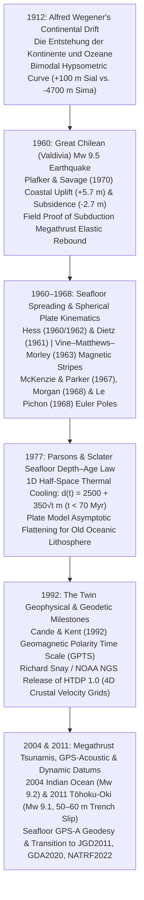
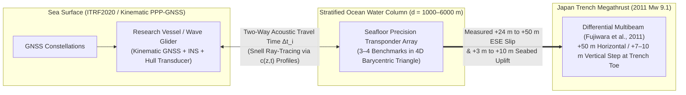

## 4.3 Historical Evolution (`gis-history` Context)

For the first century of modern topographic and hydrographic surveying, geodesists treated the solid Earth as *terra firma*—an immutable, rigid substrate upon which horizontal triangulation coordinates $(\phi, \lambda)$ and spirit-leveled elevations $(H)$ could be engraved into bronze benchmarks and held fixed indefinitely. Even when local earthquakes visibly offset fence lines—as along the San Andreas Fault in 1906, inspiring **Harry Fielding Reid's (1910)** elastic rebound theory—such disturbances were dismissed in national geodetic adjustments as localized engineering nuisances rather than planetary-scale kinematics.

Between **1912** and **2011**, a century-long convergence of continental hypsometry, marine geophysics, paleomagnetism, space geodesy, and seafloor acoustic ranging overturned this static paradigm. Discovering that the Earth's outer shell is a mosaic of cooling, translating, and flexing lithospheric plates did not merely explain the origin of mountain belts and abyssal plains; it established the **physical laws governing global first-order bathymetry** and forced geodesy to abandon timeless coordinates in favor of four-dimensional $(x, y, z, t)$ dynamic reference frames.

---

### 1912: Alfred Wegener's *Die Entstehung der Kontinente und Ozeane* and the Bimodal Hypsometric Curve

On **January 6, 1912**, German meteorologist, polar explorer, and geophysicist **Alfred Lothar Wegener** presented his hypothesis of **continental displacement (*Kontinentalverschiebung*)** to the Geological Association in Frankfurt am Main, publishing the landmark papers *"Die Entstehung der Kontinente"* in *Petermanns Geographische Mitteilungen* (1912) and expanding them into his foundational book ***Die Entstehung der Kontinente und Ozeane*** (*The Origin of Continents and Oceans*, 1915; 4th ed. 1929).

While popular accounts focus on Wegener's geometric fit of the South American and African continental shelves and Permo-Carboniferous *Glossopteris* fossil correlations, his most enduring quantitative contribution to elevation science was his geophysical interpretation of **Earth's bimodal hypsometric curve**. Compiling global land leveling and deep-sea soundings (building on John Murray and Hermann Wagner's hypsometric tables and Otto Krümmel's oceanography), Wegener pointed out a profound statistical paradox: if the Earth's relief were formed by the random thermal contraction and wrinkling of a uniform cooling sphere—the dominant 19th-century *contractionist* theory championed by Eduard Suess—global elevations should follow a **single Gaussian probability distribution** centered near mean crustal level ($\sim -2450\text{ m}$).

Instead, Earth's solid surface histogram exhibits **two sharply separated modal elevation peaks**:
1. **The Continental Platform Mode ($z_{\text{mode,1}} \approx +100\text{ m}$, mean subaerial freeboard $e_c = \bar{z}_{\text{land}} \approx +840\text{ m}$):** Representing buoyant, silica- and aluminum-rich continental crust (*Sial* upper crust over lower granulitic crust; bulk density $\rho_c \approx 2800\text{–}2840\text{ kg}\cdot\text{m}^{-3}$, thickness $h_c \approx 35\text{ km}$; Christensen & Mooney, 1995).
2. **The Abyssal Seafloor Mode ($z_{\text{mode,2}} \approx -4700\text{ m}$, mean ocean depth $\bar{d}_{\text{ocean}} \approx 3700\text{ m}$):** Representing dense, iron- and magnesium-rich basaltic/gabbroic oceanic crust (*Sima*, density $\rho_{\text{oc}} \approx 2900\text{ kg}\cdot\text{m}^{-3}$, thickness $h_{\text{oc}} \approx 6\text{–}7\text{ km}$).

Equating lithostatic pressure at the base of the continental crust ($D = h_c - e_c$ below sea level) against an oceanic column consisting of seawater ($d_w$, density $\rho_w \approx 1030\text{ kg}\cdot\text{m}^{-3}$), oceanic crust ($h_{\text{oc}}$), and underlying mantle ($h_c - e_c - d_w - h_{\text{oc}}$, density $\rho_m \approx 3330\text{ kg}\cdot\text{m}^{-3}$) gives $\rho_c h_c = \rho_w d_w + \rho_{\text{oc}} h_{\text{oc}} + \rho_m(h_c - e_c - d_w - h_{\text{oc}})$. Solving for the equilibrium abyssal water depth $d_w$ and the total bimodal vertical relief $\Delta z_{\text{bimodal}} = e_c + d_w$ yields:

$$d_w = \left(\frac{\rho_m - \rho_c}{\rho_m - \rho_w}\right) h_c - \left(\frac{\rho_m - \rho_{\text{oc}}}{\rho_m - \rho_w}\right) h_{\text{oc}} - \left(\frac{\rho_m}{\rho_m - \rho_w}\right) e_c, \qquad \Delta z_{\text{bimodal}} = e_c + d_w = \left(\frac{\rho_m - \rho_c}{\rho_m - \rho_w}\right) h_c - \left(\frac{\rho_m - \rho_{\text{oc}}}{\rho_m - \rho_w}\right) h_{\text{oc}} - \left(\frac{\rho_w}{\rho_m - \rho_w}\right) e_c$$

Substituting representative global values ($\rho_m = 3330$, $\rho_c = 2840$, $\rho_{\text{oc}} = 2900$, $\rho_w = 1030\text{ kg}\cdot\text{m}^{-3}$, $h_c = 35\text{ km}$, $h_{\text{oc}} = 7\text{ km}$, and mean freeboard $e_c = 0.84\text{ km}$) yields an abyssal water depth of $d_w = 7.46\text{ km} - 1.31\text{ km} - 1.22\text{ km} = 4.93\text{ km}$ and a total vertical step of $\Delta z_{\text{bimodal}} = 7.46\text{ km} - 1.31\text{ km} - 0.38\text{ km} = 5.77\text{ km}$ (or $\Delta z_{\text{bimodal}} \approx 4.8\text{–}5.1\text{ km}$ for low-lying continental platforms with $h_c \approx 30\text{ km}$ and $e_c \approx +0.10\text{ km}$, matching the observed $+100\text{ m}$ to $-4700\text{ m}$ modal separation). Wegener correctly deduced that continental crust cannot simply "sink" into the ocean floor to form sunken transoceanic land bridges without violating Archimedes' principle; instead, continents are buoyant rafts drifting horizontally across the globe. Although Wegener lacked a viable driving mechanism—proposing *Polflucht* (centrifugal flight from the poles) and tidal drag, which **Harold Jeffreys** easily showed were orders of magnitude too weak to shear a rigid mantle—his bimodal hypsometric framework remains the starting point of global topographic-bathymetric analysis.

---

### 1960: The Great Chilean (Valdivia) $M_w$ 9.5 Earthquake and Megathrust Elastic Rebound

On **May 22, 1960** ($19\text{:}11\text{ UTC}$), the southern Chilean margin ruptured in the **Great Chilean (Valdivia) Earthquake**—at moment magnitude **$M_w$ 9.5** (seismic moment $M_0 \approx 2.0\text{–}3.2 \times 10^{23}\text{ N}\cdot\text{m}$, Kanamori & Cipar, 1974), the largest earthquake ever recorded by modern seismometry. Over nearly ten minutes, the rupture propagated $\sim 1000\text{ km}$ southward from the Arauco Peninsula ($37^\circ\text{S}$) to the Taitao Peninsula ($46^\circ\text{S}$) along a $\sim 150\text{–}200\text{ km}$ down-dip width, with coseismic fault slip averaging $20\text{–}25\text{ m}$ and locally exceeding $40\text{ m}$.

For DEM science, coastal geodesy, and tsunami physics, the 1960 Valdivia earthquake was a watershed event for two reasons:
1. **Quantitative Proof of Subduction Megathrust Dislocation (Plafker & Savage, 1970):** Prior to the 1960 Chilean and **1964 Great Alaska ($M_w$ 9.2)** earthquakes, seismologists fiercely debated whether great circum-Pacific earthquakes occurred on steep, near-vertical strike-slip/reverse faults or gentle, low-angle underthrust faults. U.S. Geological Survey geologist **George Plafker** and geophysicist **James C. Savage** (1970) conducted an exhaustive field campaign across the Chonos Archipelago, Chiloé Island, and the Valdivian mainland, measuring vertical elevation change $\Delta z$ at 155 coastal sites by combining pre- and post-earthquake first-order spirit leveling along the longitudinal highway, tide-gauge records at Corral and Puerto Montt, and **biological intertidal indicators**—specifically the vertical shift of the upper growth limit of marine mussels (*Mytilus chilensis*) and barnacles relative to extreme high tides, alongside the drowning of terrestrial alerce (*Fitzroya cupressoides*) and roble forests below post-seismic tide levels.
2. **The Dipolar Coastal Uplift/Subsidence Signature:** Plafker and Savage mapped an asymmetric, regional vertical deformation wave spanning $> 1000\text{ km}$ along-strike:
   - **Seaward Trench-Slope Uplift ($\Delta z_{\max} = +5.7\text{ m}$):** Offshore islands near the Peru–Chile Trench axis (such as Isla Guafo, $+3.6\text{ to }+5.7\text{ m}$, and Isla Mocha, $+1.8\text{ m}$) together with the continental shelf were thrust violently upward as the locked upper plate rebounded elastically over the subducting Nazca plate.
   - **Landward Coastal Trough Subsidence ($\Delta z_{\min} = -2.3\text{ to }-2.7\text{ m}$):** Across a $75\text{–}100\text{ km}$-wide belt along the Chilean Coastal Range and Central Valley (including Valdivia, Corral, Maullín, and eastern Chiloé), the release of compressional strain caused the upper plate above the down-dip edge of the rupture to drop instantaneously by up to $2.7\text{ m}$. In Valdivia, permanent coseismic subsidence submerged vast tracts of agricultural floodplain beneath the Río Cruces and Río Calle-Calle, instantly invalidating every topographic contour map, nautical chart, and tidal benchmark in southern Chile.

By fitting dislocation models in an elastic half-space to these vertical observations, Plafker and Savage (1970) proved conclusively that great subduction earthquakes represent elastic rebound on **shallowly dipping ($10^\circ\text{–}20^\circ$) megathrust faults**—and that the resulting dipolar seafloor vertical displacement ($\Delta z_{\text{seafloor}}$) is the direct piston source of transoceanic tsunamis (which in May 1960 devastated Chile before radiating across the Pacific to Hilo, Hawaii [$10.7\text{ m}$ runup] and Japan [$6\text{ m}$ runup] 22 hours later).

---

### 1960–1968: Seafloor Spreading, the Vine–Matthews–Morley Hypothesis, and Spherical Plate Kinematics

During the exact same years that the 1960 Chilean earthquake illuminated subduction zones, marine geologists and geophysicists solved the missing engine of Wegener's continental drift:
- **1953–1962 — The Mid-Ocean Rift and Seafloor Spreading (Heezen, Tharp, Hess, and Dietz):** Throughout the 1950s, **Bruce C. Heezen** and cartographer **Marie Tharp** at Lamont Geological Observatory compiled continuous precision echo-sounder profiles across the Atlantic and global oceans, discovering in 1953 that the crest of the $65,000\text{-km}$-long global mid-ocean ridge system is split by a continuous, seismically active **axial rift valley**. In late **1960**, Princeton geologist **Harry Hammond Hess** circulated a famous Office of Naval Research preprint—formally published in **1962** as *"History of Ocean Basins"* (alongside **Robert S. Dietz's 1961** *Nature* paper that coined the term **"sea-floor spreading"**)—proposing that new oceanic crust is continuously created by partial melting of upwelling mantle peridotite along mid-ocean ridge crests, spreads laterally away from the axis at centimeters per year, and descends back into the mantle at deep-ocean trenches.
- **1963 — The Vine–Matthews–Morley Magnetic Striping Hypothesis:** If the seafloor spreads symmetrically away from ridge axes while Earth's dipole magnetic field periodically reverses polarity (as established by **Allan Cox**, **Richard Doell**, and **Brent Dalrymple** via $\text{K–Ar}$ dating of terrestrial lavas in 1963), then cooling basaltic pillow lavas and sheeted dikes cooling below the Curie temperature ($T_C \approx 580^\circ\text{C}$ for magnetite) at the ridge axis must record alternating normal and reversed thermoremanent magnetization bands parallel to the ridge crest. Canadian geophysicist **Lawrence W. Morley** first formulated this "geomagnetic tape recorder" hypothesis in **February 1963** (infamously rejected by both *Nature* and the *Journal of Geophysical Research* as overly speculative), while Cambridge graduate student **Fred J. Vine** and his advisor **Drummond H. Matthews** independently published *"Magnetic Anomalies Over Oceanic Ridges"* in *Nature* on **September 7, 1963**. Within three years, symmetric magnetic profiles across the Juan de Fuca Ridge (`Raff & Mason, 1961`) and the **Eltanin-19 profile** across the Pacific–Antarctic Ridge (`Pitman & Heirtzler, 1966`) confirmed that distance $x$ from a ridge crest scales linearly with crustal age $t$ via the half-spreading rate $v_{\text{half}} = x / t$.
- **1965–1968 — Transform Faults and Euler Pole Plate Kinematics:** In **1965**, **J. Tuzo Wilson** unified spreading ridges and trenches into a continuous network of rigid plates bounded by **transform faults**, whose fracture-zone bathymetric scars trace small circles of relative plate motion across the ocean floor. Between **1967 and 1968**, **Dan P. McKenzie and Robert L. Parker** (1967, *Nature*), **W. Jason Morgan** (1968, *JGR*), and **Xavier Le Pichon** (1968, *JGR*) translated Wilson's qualitative geometry into rigorous spherical geodesy. Applying **Leonhard Euler's (1776) rotation theorem**, they demonstrated that the horizontal velocity vector $\mathbf{v}(\mathbf{r})$ $[\text{m}\cdot\text{yr}^{-1}]$ at any surface position vector $\mathbf{r}$ ($|\mathbf{r}| = R_E$) on a rigid lithospheric plate $P$ relative to plate $Q$ is uniquely determined by a single angular velocity vector $\boldsymbol{\Omega}_{PQ} = \omega_{PQ}\,\hat{\mathbf{e}}_E$ passing through an **Euler pole** $(\Phi_E, \Lambda_E)$:

$$\mathbf{v}_{PQ}(\mathbf{r}) = \boldsymbol{\Omega}_{PQ} \times \mathbf{r}, \qquad |\mathbf{v}_{PQ}(\psi)| = \omega_{PQ} R_E \sin\psi$$

where $\omega_{PQ}$ $[\text{rad}\cdot\text{yr}^{-1}]$ is the angular rotation rate and $\psi$ is the spherical angular distance from the Euler pole. This exact equation (derived in full in Subsection 4.1 and Subsection 4.4) became the mathematical foundation for all modern global plate motion models (`NUVEL-1A`, `MORVEL56`, `ITRF2020-PMM`) and time-dependent coordinate transformations.

---

### 1977: Barry Parsons and John G. Sclater's Seafloor Depth–Age Relation

Why do mid-ocean ridges stand at a uniform water depth of $d_0 \approx 2500\text{ m}$ across the globe while abyssal plains subside systematically to $5500\text{–}6000\text{ m}$ as they approach continental margins and trenches? Following early thermal lithosphere models by McKenzie (1967) and Sclater and Francheteau (1970), **Barry Parsons** and **John G. Sclater** published their seminal paper *"An analysis of the variation of ocean floor bathymetry and heat flow with age"* in the **February 10, 1977** issue of the *Journal of Geophysical Research*.

Parsons and Sclater demonstrated that **first-order global bathymetry across $70\%$ of Earth's surface is governed by a single physical process**: one-dimensional vertical conductive cooling, thermal contraction, and local Pratt/Airy isostatic subsidence of the oceanic lithosphere as it spreads away from the hot ridge axis ($T_m \approx 1350^\circ\text{C}$) beneath cold bottom seawater ($T_0 \approx 0^\circ\text{C}$).

#### 1. Young Oceanic Lithosphere ($t < 70\text{ Myr}$): The Half-Space $\sqrt{t}$ Cooling Law
For oceanic lithosphere younger than approximately $70\text{ Myr}$, the downward-migrating thermal boundary layer ($\delta_T \sim 2\sqrt{\kappa t}$) has not yet felt the base of the mechanical plate. Solving the 1D heat conduction equation $\frac{\partial T}{\partial t} = \kappa \frac{\partial^2 T}{\partial z^2}$ with temperature distribution $T(z,t) = T_0 + (T_m - T_0)\,\text{erf}\!\left(\frac{z}{2\sqrt{\kappa t}}\right)$ and balancing the resulting thermal density increase $\Delta \rho(z,t) = \rho_m \alpha_v [T_m - T(z,t)]$ against displaced seawater of density $\rho_w$ yields the famous **Parsons–Sclater square-root-of-age depth law**:

$$d(t) = d_0 + c_1 \sqrt{t}, \qquad c_1 = \frac{2 \rho_m \alpha_v (T_m - T_0)}{\rho_m - \rho_w} \sqrt{\frac{\kappa}{\pi}}$$

where:
- $d(t)$ $[\text{m}]$ is the predicted sediment-unloaded seafloor depth (positive-down below sea level) at crustal age $t$ $[\text{Myr}, 10^6\text{ yr}]$;
- $d_0 = 2500\text{ m}$ is the mean zero-age mid-ocean ridge crest depth;
- $\rho_m \approx 3330\text{ kg}\cdot\text{m}^{-3}$ is mantle density at $0^\circ\text{C}$ and $\rho_w \approx 1030\text{ kg}\cdot\text{m}^{-3}$ is seawater density;
- $\alpha_v \approx 3.15 \times 10^{-5}\text{ K}^{-1}$ is the volumetric coefficient of thermal expansion;
- $T_m - T_0 \approx 1350\text{ K}$ is the mantle-to-seafloor temperature drop; and
- $\kappa \approx 8.04 \times 10^{-7}\text{ m}^2\cdot\text{s}^{-1}$ is the thermal diffusivity of mantle peridotite (with $1\text{ Myr} = 3.15576 \times 10^{13}\text{ s}$).

Evaluating these physical constants gives $c_1 = 6.23 \times 10^{-5}\text{ m}\cdot\text{s}^{-1/2} = 350\text{ m}\cdot\text{Myr}^{-1/2}$, yielding the canonical Parsons and Sclater (1977) equation for young seafloor:

$$d(t) = 2500 + 350\sqrt{t}\;\text{m} \qquad (0 \le t \le 70\text{ Myr})$$

#### 2. Old Oceanic Lithosphere ($t > 20\text{–}70\text{ Myr}$): Plate Model Asymptotic Flattening
In the western North Pacific and western North Atlantic, Parsons and Sclater observed that seafloor older than $\sim 70\text{–}80\text{ Myr}$ subsides significantly more slowly than $\sqrt{t}$ predicts, flattening asymptotically toward $d_{\infty} \approx 6400\text{ m}$ (or $5651\text{ m}$ in the subsequent **GDH1** [*Global Depth and Heat Flow 1*] refinement of **Carol A. Stein & Seth Stein, 1992**). Because small-scale sub-lithospheric convection supplies heat to the base of a finite thermal plate of asymptotic thickness $L_p \approx 125\text{ km}$ (thermal relaxation timescale $\tau_p = \frac{L_p^2}{\pi^2 \kappa} \approx 62.8\text{ Myr}$), the depth of older lithosphere follows an exponential **plate cooling law**:

$$d(t) = d_{\infty} - c_2 \exp\!\left(-\frac{t}{\tau_p}\right) = 6400 - 3200 \exp\!\left(-\frac{t}{62.8}\right)\;\text{m} \qquad (t > 20\text{ Myr})$$

*(Note: In Stein & Stein's 1992 GDH1 model—anchored to higher basal temperature $T_m = 1450^\circ\text{C}$ and thinner plate thickness $L_p = 95\text{ km}$—the expressions become $d(t) = 2600 + 365\sqrt{t}\text{ m}$ for $t < 20\text{ Myr}$ and $d(t) = 5651 - 2473\exp(-0.0278\,t)\text{ m} = 5651 - 2473\exp(-t/36.0)\text{ m}$ for $t \ge 20\text{ Myr}$.)*

#### Worked Numerical Example: Why the East Pacific Rise Is a Broad Swell and the Mid-Atlantic Ridge Is a Steep Mountain Range
Because crustal age at cross-axis distance $x$ from a spreading center is $t = x / v_{\text{half}}$, substituting $t = x / v_{\text{half}}$ into the Parsons–Sclater law $d(x) = d_0 + c_1 \sqrt{x / v_{\text{half}}}$ reveals that **regional cross-axis seafloor slope $\tan\beta = \frac{\partial d}{\partial x}$ is inversely proportional to the half-spreading rate $v_{\text{half}}$**:

$$\frac{\partial d}{\partial x} = \frac{c_1}{2\,v_{\text{half}}\sqrt{t}} = \frac{c_1}{2\sqrt{v_{\text{half}}\,x}}$$

Compare two classic oceanic spreading centers at crustal age $t = 36\text{ Myr}$ ($\sqrt{t} = 6.0\text{ Myr}^{1/2}$):
1. **Both ridges have the exact same water depth at $t = 36\text{ Myr}$:**
   $$d(36\text{ Myr}) = 2500 + 350\sqrt{36} = 2500 + 2100 = \mathbf{4600\text{ m}}$$
2. **Slow-Spreading Mid-Atlantic Ridge ($v_{\text{half}} = 12\text{ mm}\cdot\text{yr}^{-1} = 12\text{ km}\cdot\text{Myr}^{-1}$):**
   The $36\text{ Myr}$ isochron lies just $x_{\text{MAR}} = 12 \times 36 = \mathbf{432\text{ km}}$ from the ridge axis. The $2100\text{ m}$ drop occurs over $432\text{ km}$ (mean secant slope $4.86\text{ m/km}$; local slope at $t = 36\text{ Myr}$ of $\frac{\partial d}{\partial x} = \frac{350}{2(12)(6)} = 2.43\text{ m/km}$), producing a **steep, rugged submarine mountain range** with a small cross-sectional volume.
3. **Fast-Spreading East Pacific Rise ($v_{\text{half}} = 75\text{ mm}\cdot\text{yr}^{-1} = 75\text{ km}\cdot\text{Myr}^{-1}$):**
   The $36\text{ Myr}$ isochron lies $x_{\text{EPR}} = 75 \times 36 = \mathbf{2700\text{ km}}$ from the ridge axis! The same $2100\text{ m}$ vertical drop is stretched across $2700\text{ km}$ (mean secant slope $0.78\text{ m/km}$; local slope at $t = 36\text{ Myr}$ of $\frac{\partial d}{\partial x} = \frac{350}{2(75)(6)} = 0.39\text{ m/km}$, more than $6\times$ gentler), forming a **broad, smooth, high-volume bathyal swell** that displaces massive volumes of ocean water onto the continents during periods of rapid global seafloor spreading (such as the Late Cretaceous eustatic sea-level highstand, `Hays & Pitman, 1973`).

---

### 1992: The Twin Milestones — Cande & Kent's GPTS and NOAA's HTDP 1.0

The year **1992** marked two simultaneous breakthroughs—one unlocking the 4D reconstruction of global ocean bathymetry over geological time, and the other launching operational 4D time-dependent geodesy over human engineering timescales:

#### 1. 1992: Steven C. Cande and Dennis V. Kent's Geomagnetic Polarity Time Scale (GPTS)
In the **September 10, 1992** issue of *Journal of Geophysical Research*, Lamont-Doherty geophysicists **Steven C. Cande** and **Dennis V. Kent** published *"A new geomagnetic polarity time scale for the Late Cretaceous and Cenozoic"* (revised in 1995 as `CK92/CK95`). By analyzing high-resolution marine magnetic anomaly profiles from the South Atlantic, Indian, and Pacific oceans and fitting smooth cubic splines between nine astrochronologically and radiometrically ($^{40}\text{Ar}/^{39}\text{Ar}$) calibrated tie points from Chron C1 (present) to Chron C34 ($83\text{ Ma}$, the Cretaceous Normal Superchron), Cande and Kent produced the first globally self-consistent chronology of geomagnetic reversals.

When **R. Dietmar Müller**, **Walter R. Roest**, **Jean-Yves Royer**, **Lisa M. Gahagan**, and **John G. Sclater** (1997) combined Cande and Kent's 1992/1995 GPTS with digital marine magnetic picks and GEOSAT/ERS-1 fracture-zone trajectories, they generated the **first digital global grid of oceanic crustal age** (`EarthByte` age grids, now at $1\text{-arc-minute}$ resolution in `Seton et al., 2020`). Feeding these digital age grids $t(\phi, \lambda)$ directly into the Parsons–Sclater / GDH1 depth–age equation (plus global sediment thickness grids) allowed geophysicists to compute **synthetic paleobathymetry DEMs** for any geological epoch over the past $200\text{ Myr}$ and isolate **residual depth anomalies** ($\Delta d_{\text{res}} = d_{\text{obs}} - d_{\text{cooling}}(t)$) caused by mantle plumes, hot-spot swells, and dynamic topography.

#### 2. 1992: Richard A. Snay and the NOAA NGS Release of HTDP 1.0
In the late 1980s, geodesists establishing the North American Datum of 1983 (`NAD83`) hoped that tying the datum to the stable North American interior would yield time-invariant coordinates. Nature promptly shattered that hope: the **October 17, 1989 Loma Prieta ($M_w$ 6.9)** earthquake and the **June 28, 1992 Landers ($M_w$ 7.3)** earthquake ruptured across California, shifting survey marks by up to $2\text{–}6\text{ m}$ coseismically on top of the $35\text{–}50\text{ mm}\cdot\text{yr}^{-1}$ secular Pacific–North America plate boundary shear.

In **1992**, NOAA National Geodetic Survey mathematician **Richard A. Snay** (building on his `TDP_H91` prototype with Alice E. Drew and subsequent collaborations with **Chris Pearson** and **Tomás Soler**) released **HTDP 1.0 (*Horizontal Time-Dependent Positioning*)**. `HTDP` was the world's first operational geodetic software package capable of transforming 3D coordinates and DEM control points between any two arbitrary dates $(t_0 \to t)$ across a deforming plate boundary zone by summing:
1. Rigid-plate Euler pole rotations ($\boldsymbol{\Omega} \times \mathbf{r}$),
2. Continuous interseismic velocity grids and 3D **Okada (1985)** elastic dislocation models across locked strike-slip and subduction faults, and
3. Coseismic and postseismic step-displacement grids for major historical earthquakes.

---

### 2004 & 2011: The Sumatra–Andaman and Tōhoku-Oki Megathrust Tsunamis, Seafloor GPS-A, and Dynamic Datums

In the early 21st century, two catastrophic subduction megathrust earthquakes and tsunamis exposed the fatal limitations of static datums and land-only geodetic networks:

#### 2004: The Indian Ocean (Sumatra–Andaman) $M_w$ 9.2 Earthquake and Tsunami
On **December 26, 2004**, a $1300\text{ km}$ segment of the Sunda megathrust ruptured from northwestern Sumatra to the Andaman Islands in a **$M_w$ 9.1–9.3 earthquake** ($M_0 \approx 6.5\text{–}10 \times 10^{22}\text{ N}\cdot\text{m}$; Lay et al., 2005). Seafloor uplift of $+4\text{ to }+6\text{ m}$ along the outer forearc ridge and $-1.5\text{ to }-2\text{ m}$ coastal subsidence in Banda Aceh generated a trans-oceanic tsunami that claimed over $227,000$ lives across 14 countries. Geodetically, continuous GPS stations in Thailand, Malaysia, and India—over $500\text{ to }2000\text{ km}$ from the trench—jumped horizontally by $2\text{ to }30\text{ cm}$ (Vigny et al., 2005), proving that giant megathrust earthquakes deform entire continents and invalidating static national reference frames across Southeast Asia. At the same time, the disaster revealed that global $30\text{–}90\text{ m}$ spaceborne DSMs (`SRTM`, contaminated by $+10\text{ to }+25\text{ m}$ coastal mangrove/palm canopy bias) and sparse shelf soundings were dangerously inadequate for predicting nearshore tsunami inundation.

#### 2011: The Tōhoku-Oki ($M_w$ 9.1) Earthquake and the Breakthrough of Seafloor GPS-Acoustic (GPS-A) Geodesy
On **March 11, 2011**, the **Great East Japan (Tōhoku-Oki) $M_w$ 9.0–9.1 earthquake** ruptured the Japan Trench megathrust off northeastern Honshu. Onshore, the Geospatial Information Authority of Japan's (GSI) dense **GEONET** array ($\sim 1200$ continuous GNSS stations) recorded up to **$+5.3\text{ m}$ of horizontal coseismic displacement** toward the east-southeast and **$-1.2\text{ m}$ of vertical coastal subsidence** along the Oshika Peninsula and Sanriku coast (Ozawa et al., 2011)—permanently submerging ports, harbors, and seawalls below high tide even after the tsunami receded.

Crucially, however, land-based GNSS stations located $130\text{–}200\text{ km}$ west of the Japan Trench axis lacked the geometric resolution to resolve slip near the shallow trench toe. The decisive breakthrough came from **Seafloor GPS-Acoustic (GPS-A) geodesy**—a hybrid technique first proposed by **Fred N. Spiess (1985)** at Scripps Institution of Oceanography and deployed operationally across the Japan Trench in the 2000s by the **Japan Coast Guard** (**Mariko Sato** et al., 2011) and **Tohoku University** (**Motoyuki Kido** et al., 2011). In a GPS-A system, a surface vessel or autonomous wave glider equipped with kinematic PPP-GNSS, an inertial navigation system (INS), and a hull-mounted acoustic transducer ranges continuously from surface position $\mathbf{x}_s(t)$ to a symmetric triangular or square array of **3–4 precision acoustic mirror transponders anchored on the deep seafloor ($\mathbf{X}_i$, at water depth $d \approx 1000\text{–}3200\text{ m}$)**. Each two-way acoustic travel time $\tau_i(t)$ is governed by Snell's law ray-tracing through the stratified, time-varying ocean sound-speed field $c(z, t) = c_0(z) + \delta c(\mathbf{x}, t)$:

$$\tau_i(t) = \int_{\mathcal{P}_{\text{down}}(\mathbf{x}_s(t) \to \mathbf{X}_i)} \frac{ds}{c(z, t)} + \Delta\tau_{\text{turn}, i} + \int_{\mathcal{P}_{\text{up}}(\mathbf{X}_i \to \mathbf{x}_s(t + \tau_i))} \frac{ds}{c(z, t)}$$

Because an unmodeled sound-speed perturbation $\delta \bar{c}$ of just $0.1\text{ m}\cdot\text{s}^{-1}$ across a $d = 3000\text{ m}$ water column ($\bar{c} \approx 1500\text{ m}\cdot\text{s}^{-1}$) induces a one-way range bias of $\sigma_R \approx \frac{d}{\bar{c}}\,\delta \bar{c} = 20\text{ cm}$, ranging to a single seafloor transponder cannot separate horizontal tectonic displacement from horizontal internal-wave sound-speed gradients ($\nabla_h c$). By steaming or holding station near the surface projection of the **barycentric centroid** of a $3\text{–}4$ transponder array with baseline aperture $L \approx 2d$ ($\sim 45^\circ$ nadir ray angles), common-mode zenith acoustic delays $\delta\tau_z(t)$ cancel in differential transponder ranges, achieving **$\sigma_h \approx 1\text{–}3\text{ cm}$ horizontal and $\sigma_v \approx 3\text{–}5\text{ cm}$ vertical repeatability** on the abyssal seafloor.

Resurveying the seafloor GPS-A arrays weeks after March 11, 2011—and differencing pre-1999 and post-2011 JAMSTEC deep-water multibeam bathymetric DEMs directly across the trench axis (**Toshiya Fujiwara** et al., 2011)—stunned the solid-Earth community:
- While onshore GEONET stations moved $5.3\text{ m}$, the Japan Coast Guard's seafloor GPS-A site `MYGI` ($70\text{ km}$ west of the trench) displaced **$24\text{ m}$ ESE and $+3\text{ m}$ upward** (Sato et al., 2011), and Tohoku University's GPS-A site `GJT3` ($40\text{ km}$ from the trench) together with Fujiwara et al.'s differential multibeam bathymetry revealed an unprecedented **$50\text{ to }60\text{ m}$ of horizontal ESE slip and $+7\text{ to }+10\text{ m}$ of vertical seafloor uplift right up to the Japan Trench axis** ($d \approx 7500\text{ m}$).
- This unexpected shallow trench-breaching vertical step ($\Delta z_{\text{seafloor}} \approx +10\text{ m}$) generated the impulsive, short-wavelength tsunami crest that amplified to $40\text{ m}$ runup along the Sanriku ria coast.

#### The Global Transition from Static to Semi-Kinematic and Dynamic National Datums
The 2004 Sumatra, **2010 Maule, Chile ($M_w$ 8.8)**, **2010–2011 Canterbury/Christchurch & 2016 Kaikōura, New Zealand ($M_w$ 7.8)**, and **2011 Tōhoku-Oki ($M_w$ 9.1)** earthquakes—followed by multi-decadal postseismic viscoelastic mantle relaxation exceeding $5\text{–}15\text{ cm}\cdot\text{yr}^{-1}$—made static national datums untenable. Within a decade, geodetic agencies worldwide transitioned to three modern reference-frame architectures:
1. **Earthquake-Updated & Deformation-Patched Static Datums (`JGD2011`, `NZGD2000`, `SIRGAS`):** In October 2011, Japan retired `JGD2000` across eastern Honshu and released **`JGD2011` (`EPSG:6668`)**, incorporating a high-resolution coseismic + postseismic patch grid; New Zealand updated **`NZGD2000` (`EPSG:4167`)** by embedding a backwards-in-time secular velocity model plus explicit 3D coseismic deformation grids for each major earthquake since 2009 into its PROJ transformation pipeline.
2. **Epoch-Stepped Plate-Constrained Datums (`GDA2020` & `ATRF2014`):** Because the Indo-Australian plate drifts north-northeast at $\sim 7.0\text{ cm}\cdot\text{yr}^{-1}$ in `ITRF`, Australia's static `GDA94` (epoch 1994.0) coordinates had drifted **$1.8\text{ m}$ out of alignment** with real-time GNSS by 2020—an offset intolerable for autonomous vehicles and high-resolution LiDAR DEMs. Geoscience Australia introduced **`GDA2020` (`EPSG:7844`, epoch 2020.0)** alongside the fully dynamic **Australian Terrestrial Reference Frame (`ATRF2014`, `EPSG:1069` datum / aligned with `ITRF2014` `EPSG:7912`)**.
3. **Fully Dynamic Plate-Fixed Reference Frames (`NATRF2022`, `NAPGD2022`):** Under the NOAA NGS Modernized National Spatial Reference System (NSRS), the United States, Canada, and Mexico replaced `NAD83` and `NAVD88` with four Euler-pole-rotated terrestrial frames (**`NATRF2022`**, **`PATRF2022`**, **`CATRF2022`**, **`MATRF2022`**) coupled to the time-dependent **Intra-Frame Deformation Model (`IFDM2022`)** and the dynamic geopotential datum **`NAPGD2022` (`GEOID2022`)**, where every published coordinate and DEM carries a mandatory observation epoch $t_{\text{obs}}$.

---

### Summary of Foundational Plate Kinematic & Dynamic Datum Milestones (`gis-history`)

| Era / Year | Milestone & Principal Investigators | Enduring Legacy for Modern 4D DEM & Bathymetric Workflows |
| :--- | :--- | :--- |
| **1912 / 1915** | **Alfred Wegener's *Die Entstehung der Kontinente und Ozeane*** | Formulated Continental Drift and explained Earth's bimodal hypsometric curve ($+100\text{ m}$ *Sial* vs. $-4700\text{ m}$ *Sima*) via isostatic buoyancy. |
| **1960 (1970)** | **Great Chilean (Valdivia) $M_w$ 9.5 Earthquake (Plafker & Savage)** | Mapped $+5.7\text{ m}$ outer-arc uplift and $-2.7\text{ m}$ coastal subsidence, proving subduction megathrust elastic rebound and tsunami seabed piston physics. |
| **1960–1963** | **Seafloor Spreading (Hess 1962, Dietz 1961) & Vine–Matthews–Morley (1963)** | Linked Heezen & Tharp's mid-ocean axial rift to mantle upwelling and symmetrical marine magnetic anomaly stripes ($x = v_{\text{half}}\,t$). |
| **1965–1968** | **Transform Faults (Wilson 1965) & Spherical Plate Kinematics (McKenzie, Morgan, Le Pichon)** | Established rigid-plate rotation on a sphere via Euler poles ($\mathbf{v}(\mathbf{r}) = \boldsymbol{\Omega} \times \mathbf{r}$), anchoring all modern plate velocity models (`ITRF2020-PMM`). |
| **1977 (1992)** | **Parsons & Sclater Seafloor Depth–Age Law & Stein & Stein (`GDH1`)** | Proved abyssal depth follows 1D thermal boundary-layer cooling ($d(t) = 2500 + 350\sqrt{t}\text{ m}$ for $t < 70\text{ Myr}$) and plate flattening for older crust. |
| **1992** | **Cande & Kent `GPTS` (`CK92/95`) & NOAA NGS `HTDP 1.0` (Richard Snay)** | Enabled digital global crustal age & synthetic paleobathymetry grids (Müller et al.); launched operational 4D time-dependent coordinate software (`HTDP`). |
| **2004** | **Sumatra–Andaman $M_w$ 9.2 Earthquake & Indian Ocean Tsunami** | Demonstrated continental-scale far-field GNSS coseismic offsets ($> 2000\text{ km}$) and the critical need for bare-earth coastal topobathymetric DEMs. |
| **2011–Present** | **Tōhoku-Oki $M_w$ 9.1, Seafloor `GPS-A` Geodesy & Dynamic Datums** | Measured $50\text{–}60\text{ m}$ horizontal / $+10\text{ m}$ vertical trench slip via seafloor GPS-A & differential MBES; drove shift to `JGD2011`, `GDA2020`, `NATRF2022`. |

---

> [!WARNING]
> **Common Pitfalls in Historical and Multi-Epoch Tectonic DEM Integration**
> 1. **Differencing Pre- and Post-Earthquake DEMs Without Separating Rigid Translation from Vertical Uplift:** During the 2011 Tōhoku-Oki ($M_w$ 9.1) and 2016 Kaikōura ($M_w$ 7.8) earthquakes, horizontal terrain displacements of $\Delta \mathbf{x}_h = 5\text{ to }10\text{ m}$ on steep slopes ($\tan\beta = 0.30\text{–}0.60$) induced apparent vertical elevation changes of $\Delta z_{\text{apparent}} = -\nabla z \cdot \Delta \mathbf{x}_h = \pm 1.5\text{ to }6.0\text{ m}$ in Eulerian DEM differencing (`DoD`), completely masking true vertical tectonic subsidence or uplift unless 3D point-cloud registration (`ICP`) or `HTDP`/PROJ horizontal deformation grids are applied first.
> 2. **Applying the $\sqrt{t}$ Half-Space Cooling Law to Mesozoic Crust ($t > 80\text{ Myr}$):** Extrapolating $d(t) = 2500 + 350\sqrt{t}\text{ m}$ into Jurassic crust ($t = 160\text{ Myr}$) overpredicts abyssal depth by $> 600\text{ m}$ ($6927\text{ m}$ vs. $\sim 6150\text{ m}$ plate model / $5650\text{ m}$ GDH1), introducing massive long-wavelength biases into synthetic bathymetry and residual depth anomaly maps.
> 3. **Treating Plate-Fixed Static Datums (`NAD83`, `GDA94`, `JGD2000`) as Synonyms for `WGS84` / `ITRF`:** Because `GDA94` (epoch 1994.0) was locked to the Australian plate while `WGS84`/`ITRF` remains Earth-centered, ignoring the 26-year plate motion vector shifts 2020 LiDAR DEMs horizontally by **$1.8\text{ m}$** across Australia (`GDA2020 - GDA94`) and **$1.2\text{ to }2.2\text{ m}$** across the Pacific Coast of North America (`ITRF2020 - NAD83(2011)`).

> [!IMPORTANT]
> **Key Takeaways**
> - **Earth's Hypsometry and First-Order Bathymetry Are Thermal-Isostatic Boundary Layers:** Wegener's (1912) bimodal elevation distribution ($+100\text{ m}$ vs. $-4700\text{ m}$) reflects the compositional density contrast between continental and oceanic crust, while the global bathymetric relief of the ocean basins is governed to first order by the **Parsons & Sclater (1977)** thermal cooling law ($d(t) = 2500 + 350\sqrt{t}\text{ m}$ for $t < 70\text{ Myr}$) and local spreading rate $v_{\text{half}}$.
> - **Subduction Megathrusts Deform Both Land and Seafloor in a Dipolar Pattern:** As proven by Plafker and Savage (1970) in Chile ($M_w$ 9.5) and Sato et al. / Fujiwara et al. (2011) in Tōhoku-Oki ($M_w$ 9.1), megathrust ruptures uplift the outer trench slope by $+3\text{ to }+10\text{ m}$ while dropping the coastal forearc by $-1\text{ to }-2.7\text{ m}$—requiring immediate post-seismic resurveying of coastal flood DEMs, chart datums, and tide gauges.
> - **Every Modern DEM Is a 4D Snapshot:** Following the 1992 release of `HTDP 1.0` and the 2004/2011 megathrust earthquakes, high-accuracy elevation models can no longer be archived with a CRS name alone; they must carry an explicit **realization and coordinate epoch** (e.g., `ITRF2020 @ 2024.35`, `NATRF2022 @ 2020.0`) paired with a kinematic deformation model in `PROJ`.

---

### Curated References for Section 4.3
- Cande, S. C., & Kent, D. V. (1992). A new geomagnetic polarity time scale for the Late Cretaceous and Cenozoic. *Journal of Geophysical Research: Solid Earth*, 97(B10), 13917–13951. https://doi.org/10.1029/92JB01202
- Christensen, N. I., & Mooney, W. D. (1995). Seismic velocity structure and composition of the continental crust: A global view. *Journal of Geophysical Research: Solid Earth*, 100(B6), 9761–9788. https://doi.org/10.1029/95JB00259
- Dietz, R. S. (1961). Continent and ocean basin evolution by spreading of the sea floor. *Nature*, 190(4779), 854–857. https://doi.org/10.1038/190854a0
- Fujiwara, T., Kodaira, S., No, T., Kaiho, Y., Takahashi, N., & Kaneda, Y. (2011). The 2011 Tohoku-Oki earthquake: Displacement reaching the trench axis. *Science*, 334(6060), 1240. https://doi.org/10.1126/science.1211554
- Hays, J. D., & Pitman, W. C., III. (1973). Lithospheric plate motion, sea level changes and climatic and ecological consequences. *Nature*, 246(5427), 18–22. https://doi.org/10.1038/246018a0
- Hess, H. H. (1962). History of ocean basins. In A. E. J. Engel, H. L. James, & B. F. Leonard (Eds.), *Petrologic Studies: A Volume in Honor of A. F. Buddington* (pp. 599–620). Geological Society of America.
- Kido, M., Osada, Y., Fujimoto, H., Hino, R., & Ito, Y. (2011). Trench-normal variation in observed coseismic displacement of the 2011 Tohoku-Oki earthquake. *Geophysical Research Letters*, 38(24), L24303. https://doi.org/10.1029/2011GL050057
- Lay, T., Kanamori, H., Ammon, C. J., Nettles, M., Ward, S. N., Aster, R. C., Beck, S. L., Bilek, S. L., Brudzinski, M. R., Butler, R., DeShon, H. R., Ekström, G., Satake, K., & Sipkin, S. (2005). The Great Sumatra-Andaman Earthquake of 26 December 2004. *Science*, 308(5725), 1127–1133. https://doi.org/10.1126/science.1112250
- Le Pichon, X. (1968). Sea-floor spreading and continental drift. *Journal of Geophysical Research*, 73(12), 3661–3697. https://doi.org/10.1029/JB073i012p03661
- McKenzie, D. P., & Parker, R. L. (1967). The North Pacific: An example of tectonics on a sphere. *Nature*, 216(5122), 1276–1280. https://doi.org/10.1038/2161276a0
- Morgan, W. J. (1968). Rises, trenches, great faults, and crustal blocks. *Journal of Geophysical Research*, 73(6), 1959–1982. https://doi.org/10.1029/JB073i006p01959
- Müller, R. D., Roest, W. R., Royer, J.-Y., Gahagan, L. M., & Sclater, J. G. (1997). Digital isochrons of the world's ocean floor. *Journal of Geophysical Research: Solid Earth*, 102(B2), 3211–3214. https://doi.org/10.1029/96JB01781
- Ozawa, S., Nishimura, T., Suito, H., Kobayashi, T., Tobita, M., & Imakiire, T. (2011). Coseismic and postseismic slip of the 2011 magnitude-9 Tohoku-Oki earthquake. *Nature*, 475(7356), 373–376. https://doi.org/10.1038/nature10227
- Parsons, B., & Sclater, J. G. (1977). An analysis of the variation of ocean floor bathymetry and heat flow with age. *Journal of Geophysical Research*, 82(5), 803–827. https://doi.org/10.1029/JB082i005p00803
- Pitman, W. C., III, & Heirtzler, J. R. (1966). Magnetic anomalies over the Pacific-Antarctic Ridge. *Science*, 154(3753), 1164–1171. https://doi.org/10.1126/science.154.3753.1164
- Plafker, G., & Savage, J. C. (1970). Mechanism of the Chilean earthquakes of May 21 and 22, 1960. *Geological Society of America Bulletin*, 81(4), 1001–1030. https://doi.org/10.1130/0016-7606(1970)81[1001:MOTCEO]2.0.CO;2
- Sato, M., Ishikawa, T., Ujihara, N., Yoshida, S., Fujita, M., Mochizuki, M., & Asada, A. (2011). Displacement above the hypocenter of the 2011 Tohoku-Oki earthquake. *Science*, 332(6036), 1395. https://doi.org/10.1126/science.1207401
- Snay, R. A. (1999). Using the HTDP software to transform spatial data from one time to another. *Surveying and Land Information Systems*, 59(1), 15–25.
- Spiess, F. N. (1985). Suboceanic geodetic measurements. *IEEE Transactions on Geoscience and Remote Sensing*, GE-23(4), 502–510. https://doi.org/10.1109/TGRS.1985.289441
- Stein, C. A., & Stein, S. (1992). A model for the global variation in oceanic depth and heat flow with lithospheric age. *Nature*, 359(6391), 123–129. https://doi.org/10.1038/359123a0
- Vine, F. J., & Matthews, D. H. (1963). Magnetic anomalies over oceanic ridges. *Nature*, 199(4897), 947–949. https://doi.org/10.1038/199947a0
- Wegener, A. (1912). Die Entstehung der Kontinente. *Petermanns Geographische Mitteilungen*, 58(1), 185–195, 253–256, 305–309.
- Wegener, A. (1915). *Die Entstehung der Kontinente und Ozeane*. Friedrich Vieweg & Sohn.
- Wilson, J. T. (1965). A new class of faults and their bearing on continental drift. *Nature*, 207(4995), 343–347. https://doi.org/10.1038/207343a0
