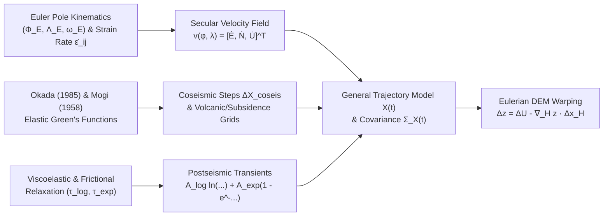

## 4.4 Mathematical Foundations

Transforming Digital Elevation Models (DEMs) and bathymetric surfaces across survey epochs requires a rigorous mathematical framework that couples global rigid-plate kinematics, continuum strain-rate fields across diffuse plate boundaries, multi-component trajectory models for transient seismic and hydrological deformation, and elastic dislocation Green's functions. Without these formulations, time-dependent coordinate shifts corrupt multi-temporal elevation differencing by aliasing horizontal crustal motion into apparent vertical topographic or seafloor change.

---

### 4.4.1 Spherical and Ellipsoidal Euler Pole Kinematics and Strain-Rate Tensors

#### Euler's Rotation Theorem and Angular Velocity Vectors

By Euler's rotation theorem, the instantaneous horizontal motion of a rigid lithospheric cap over the Earth's surface is completely described by an angular velocity vector $\boldsymbol{\Omega}$ passing through the geocenter. In global plate motion models (such as NUVEL-1A, MORVEL56, and the ITRF2020 plate motion model), the Euler pole of plate $p$ is specified by its geocentric latitude $\Phi_E \in [-\pi/2, \pi/2]$, geocentric longitude $\Lambda_E \in [-\pi, \pi]$, and scalar angular rotation rate $\omega_E$ (traditionally reported in degrees per million years, $\text{deg/Myr}$, where $1^\circ/\text{Myr} = \frac{\pi}{180 \times 10^6}\text{ rad/yr} \approx 1.745329 \times 10^{-8}\text{ rad/yr}$).

Converting the spherical Euler pole $(\Phi_E, \Lambda_E, \omega_E)$ into an Earth-Centered, Earth-Fixed (ECEF) Cartesian angular velocity vector $\boldsymbol{\Omega} = [\Omega_X, \Omega_Y, \Omega_Z]^T$ (in $\text{rad/yr}$) yields:

$$\boldsymbol{\Omega} = \begin{bmatrix} \Omega_X \\ \Omega_Y \\ \Omega_Z \end{bmatrix} = \omega_E \begin{bmatrix} \cos\Phi_E \cos\Lambda_E \\ \cos\Phi_E \sin\Lambda_E \\ \sin\Phi_E \end{bmatrix}$$

Let a terrestrial topographic node or marine seafloor sounding be located at geodetic latitude $\phi$, geodetic longitude $\lambda$, and ellipsoidal height $h$ (where $h = z_{\text{ellip}}$ is positive-upward from the reference ellipsoid, or $h = N_{\text{geoid}} - d$ for a bathymetric depth $d$ measured positive-downward below the geoid). On an oblate reference ellipsoid with semi-major axis $a$, flattening $f$, first eccentricity squared $e^2 = 2f - f^2$, and prime vertical radius of curvature $N(\phi) = a / \sqrt{1 - e^2\sin^2\phi}$, the ECEF position vector $\mathbf{X} \in \mathbb{R}^3$ (in meters) is:

$$\mathbf{X}(\phi, \lambda, h) = \begin{bmatrix} X \\ Y \\ Z \end{bmatrix} = \begin{bmatrix} \left(N(\phi) + h\right)\cos\phi\cos\lambda \\ \left(N(\phi) + h\right)\cos\phi\sin\lambda \\ \left(N(\phi)(1 - e^2) + h\right)\sin\phi \end{bmatrix}$$

The instantaneous linear velocity $\mathbf{v}_{\text{ECEF}}(\mathbf{X}) = [\dot{X}, \dot{Y}, \dot{Z}]^T$ (in $\text{m/yr}$) of the point due to rigid-plate rotation is given by the vector cross product:

$$\mathbf{v}_{\text{ECEF}}(\mathbf{X}) = \boldsymbol{\Omega} \times \mathbf{X} = [\boldsymbol{\Omega}]_\times \mathbf{X} = \begin{bmatrix} 0 & -\Omega_Z & \Omega_Y \\ \Omega_Z & 0 & -\Omega_X \\ -\Omega_Y & \Omega_X & 0 \end{bmatrix} \begin{bmatrix} X \\ Y \\ Z \end{bmatrix} = \begin{bmatrix} \Omega_Y Z - \Omega_Z Y \\ \Omega_Z X - \Omega_X Z \\ \Omega_X Y - \Omega_Y X \end{bmatrix}$$

By anticommutativity of the cross product ($\boldsymbol{\Omega} \times \mathbf{X} = -\mathbf{X} \times \boldsymbol{\Omega}$), this relation can be rewritten in linear design-matrix form for inverting $N$ observed GNSS station velocities to solve for $\boldsymbol{\Omega}$:

$$\mathbf{v}_{\text{ECEF}}(\mathbf{X}) = -[\mathbf{X}]_\times \boldsymbol{\Omega} = \begin{bmatrix} 0 & Z & -Y \\ -Z & 0 & X \\ Y & -X & 0 \end{bmatrix} \begin{bmatrix} \Omega_X \\ \Omega_Y \\ \Omega_Z \end{bmatrix}$$

#### Projection into the Local Topocentric Horizon Frame (ENU)

Because DEMs and bathymetric grids separate horizontal coordinates from vertical elevation or depth, $\mathbf{v}_{\text{ECEF}}$ must be rotated into the local topocentric East-North-Up (ENU) tangent frame via the orthogonal rotation matrix $\mathbf{R}_{\text{ECEF}\to\text{ENU}}(\phi, \lambda) \in \text{SO}(3)$:

$$\begin{bmatrix} \dot{E} \\ \dot{N} \\ \dot{U} \end{bmatrix} = \mathbf{R}_{\text{ECEF}\to\text{ENU}}(\phi, \lambda)\, \mathbf{v}_{\text{ECEF}}(\mathbf{X}) = \begin{bmatrix} -\sin\lambda & \cos\lambda & 0 \\ -\sin\phi\cos\lambda & -\sin\phi\sin\lambda & \cos\phi \\ \cos\phi\cos\lambda & \cos\phi\sin\lambda & \sin\phi \end{bmatrix} \begin{bmatrix} \dot{X} \\ \dot{Y} \\ \dot{Z} \end{bmatrix}$$

where $\dot{E} \equiv v_E$ is the eastward velocity, $\dot{N} \equiv v_N$ is the northward velocity, and $\dot{U} \equiv v_U$ is the upward vertical velocity (all in $\text{m/yr}$).

> [!NOTE]
> **Ellipsoidal Normal vs. Geocentric Radius Vector in Rigid-Plate Rotations:** On a spherical Earth of radius $R_\oplus$, the position vector $\mathbf{X} = R_\oplus \hat{\mathbf{u}}$ is collinear with the unit upward normal $\hat{\mathbf{u}} = [\cos\phi\cos\lambda, \cos\phi\sin\lambda, \sin\phi]^T$, so $\dot{U} = \hat{\mathbf{u}} \cdot (\boldsymbol{\Omega} \times \mathbf{X}) \equiv 0$. On an oblate ellipsoid ($e^2 > 0$), $\mathbf{X} = (N(\phi) + h)\hat{\mathbf{u}} - N(\phi)e^2\sin\phi\,\hat{\mathbf{k}}$ deviates from the geodetic normal $\hat{\mathbf{u}}$ by the angle of deflection between geocentric and geodetic latitude, producing a purely geometric apparent vertical velocity $\dot{U}_{\text{ellip}} = \hat{\mathbf{u}} \cdot (\boldsymbol{\Omega} \times \mathbf{X}) = +N(\phi)e^2\sin\phi\cos\phi(\Omega_X\sin\lambda - \Omega_Y\cos\lambda)$ of up to $\pm 0.15\text{ mm/yr}$ at mid-latitudes. Geodetic velocity software such as NOAA's HTDP and PROJ therefore evaluate rigid-plate rotations on a spherical Earth of radius $R_\oplus \approx 6371.0\text{ km}$:
> $$\begin{bmatrix} \dot{E} \\ \dot{N} \\ \dot{U} \end{bmatrix}_{\text{rigid}} = R_\oplus \begin{bmatrix} -\sin\phi\cos\lambda & -\sin\phi\sin\lambda & \cos\phi \\ \sin\lambda & -\cos\lambda & 0 \\ 0 & 0 & 0 \end{bmatrix} \begin{bmatrix} \Omega_X \\ \Omega_Y \\ \Omega_Z \end{bmatrix} = \begin{bmatrix} R_\oplus \left( -\Omega_X\sin\phi\cos\lambda - \Omega_Y\sin\phi\sin\lambda + \Omega_Z\cos\phi \right) \\ R_\oplus \left( \Omega_X\sin\lambda - \Omega_Y\cos\lambda \right) \\ 0 \end{bmatrix}$$

#### Continuum Kinematics: The 2D Horizontal Velocity Gradient and Strain-Rate Tensors

Within diffuse plate boundary zones—such as the Western United States, the Japanese islands, New Zealand, or the Mediterranean-Alpine belt—crustal motion violates the rigid-plate assumption. Consider a continuous 2D horizontal velocity field $\mathbf{v}_H(x_1, x_2) = [v_E(E, N), v_N(E, N)]^T$ parameterized in local tangent-plane coordinates $(x_1, x_2) = (E, N)$. Expanding $\mathbf{v}_H$ in a first-order Taylor series about a reference point $\mathbf{x}_0 = (E_0, N_0)^T$ for an infinitesimal baseline $\delta\mathbf{x} = [\delta E, \delta N]^T$ gives:

$$v_i(\mathbf{x}_0 + \delta\mathbf{x}) = v_i(\mathbf{x}_0) + L_{ij}\,\delta x_j + \mathcal{O}(\|\delta\mathbf{x}\|^2), \qquad L_{ij} = \frac{\partial v_i}{\partial x_j}, \quad i, j \in \{E, N\}$$

where $\mathbf{L}$ is the **2D horizontal velocity gradient tensor** (SI unit: $\text{s}^{-1}$, geodetically expressed in $\text{yr}^{-1}$ or nanostrain per year, $\text{nstrain/yr} = 10^{-9}\text{ yr}^{-1}$). Decomposing $\mathbf{L}$ into its symmetric and antisymmetric parts yields the Cauchy **infinitesimal strain-rate tensor** $\dot{\boldsymbol{\varepsilon}}$ and the **vorticity (rotation-rate) tensor** $\dot{\boldsymbol{\omega}}$:

$$L_{ij} = \dot{\varepsilon}_{ij} + \dot{\omega}_{ij}, \qquad \dot{\varepsilon}_{ij} = \frac{1}{2}\left(\frac{\partial v_i}{\partial x_j} + \frac{\partial v_j}{\partial x_i}\right), \qquad \dot{\omega}_{ij} = \frac{1}{2}\left(\frac{\partial v_i}{\partial x_j} - \frac{\partial v_j}{\partial x_i}\right)$$

In explicit matrix form in the $(E, N)$ tangent plane:

$$\dot{\boldsymbol{\varepsilon}} = \begin{bmatrix} \dot{\varepsilon}_{EE} & \dot{\varepsilon}_{EN} \\ \dot{\varepsilon}_{NE} & \dot{\varepsilon}_{NN} \end{bmatrix} = \begin{bmatrix} \dfrac{\partial v_E}{\partial E} & \dfrac{1}{2}\left(\dfrac{\partial v_E}{\partial N} + \dfrac{\partial v_N}{\partial E}\right) \\[1.2ex] \dfrac{1}{2}\left(\dfrac{\partial v_N}{\partial E} + \dfrac{\partial v_E}{\partial N}\right) & \dfrac{\partial v_N}{\partial N} \end{bmatrix}, \qquad \dot{\boldsymbol{\omega}} = \begin{bmatrix} 0 & \dot{\omega}_{EN} \\ -\dot{\omega}_{EN} & 0 \end{bmatrix}$$

where $\dot{\omega}_{EN} = \frac{1}{2}\left(\frac{\partial v_E}{\partial N} - \frac{\partial v_N}{\partial E}\right)$ is the local clockwise vertical-axis rotation rate of crustal blocks. Over regional scales where Earth curvature cannot be neglected, the spherical strain-rate components on a sphere of radius $R_\oplus$ (Savage et al., 2001) include metric curvature terms:

$$\dot{\varepsilon}_{\lambda\lambda} = \frac{1}{R_\oplus\cos\phi}\frac{\partial v_E}{\partial\lambda} - \frac{v_N\tan\phi}{R_\oplus}, \qquad \dot{\varepsilon}_{\phi\phi} = \frac{1}{R_\oplus}\frac{\partial v_N}{\partial\phi}, \qquad \dot{\varepsilon}_{\lambda\phi} = \frac{1}{2R_\oplus}\left(\frac{1}{\cos\phi}\frac{\partial v_N}{\partial\lambda} + \frac{\partial v_E}{\partial\phi} + v_E\tan\phi\right)$$

Three scalar invariants of $\dot{\boldsymbol{\varepsilon}}$ (with principal strain rates $\dot{\varepsilon}_1 \ge \dot{\varepsilon}_2$) govern tectonic geomorphology and vertical DEM stability:
1. **Areal Dilatation Rate ($\dot{\Delta}_A$):** $\dot{\Delta}_A = \text{tr}(\dot{\boldsymbol{\varepsilon}}) = \dot{\varepsilon}_{EE} + \dot{\varepsilon}_{NN} = \dot{\varepsilon}_1 + \dot{\varepsilon}_2$. Positive dilatation ($\dot{\Delta}_A > 0$) indicates crustal extension (e.g., Basin and Range, East African Rift, mid-ocean ridges), whereas negative dilatation ($\dot{\Delta}_A < 0$) indicates crustal shortening and thickening (e.g., Cascadia, Himalaya). In a homogeneous elastic layer of thickness $H_c$ with zero vertical surface traction ($\sigma_{zz} = 0$) and Poisson's ratio $\nu$, horizontal dilatation induces vertical strain rate $\dot{\varepsilon}_{zz} = -\frac{\nu}{1 - \nu}\dot{\Delta}_A$ (and tectonic thickening rate $\dot{U}_{\text{strain}} = H_c\dot{\varepsilon}_{zz}$).
2. **Maximum Shear Strain Rate ($\dot{\gamma}_{\max}$):** $\dot{\gamma}_{\max} = \sqrt{(\dot{\varepsilon}_{EE} - \dot{\varepsilon}_{NN})^2 + 4\dot{\varepsilon}_{EN}^2} = \dot{\varepsilon}_1 - \dot{\varepsilon}_2$ (engineering shear strain rate; the tensorial maximum shear strain rate is $\dot{\varepsilon}_{\max}^{\text{shear}} = \frac{1}{2}\dot{\gamma}_{\max}$), which quantifies strike-slip shear accumulation across locked faults (reaching $>500\text{ nstrain/yr}$ along the San Andreas and Alpine faults).
3. **Second Invariant of Strain Rate ($\dot{I}_2$):** $\dot{I}_2 = \sqrt{\dot{\varepsilon}_{EE}^2 + \dot{\varepsilon}_{NN}^2 + 2\dot{\varepsilon}_{EN}^2} = \sqrt{\dot{\varepsilon}_1^2 + \dot{\varepsilon}_2^2}$ (Kreemer et al., 2014), used to map diffuse seismic hazard and dynamically weight spatial interpolation covariance in velocity grids.

---

### 4.4.2 General ITRF2020 / HTDP Time-Dependent Coordinate Trajectory Model

To transform 3D coordinates $\mathbf{X}(t)$ (either in ECEF $[X, Y, Z]^T$ or local topocentric $[E, N, U]^T$) between a reference epoch $t_0$ and an arbitrary target epoch $t$, modern dynamic reference frames (ITRF2020; Altamimi et al., 2023) and deformation models (HTDP; Pearson & Snay, 2013; Bevis & Brown, 2014) represent the trajectory of any point on the Earth's crust as the superposition of secular velocity, periodic seasonal loading, and $M$ earthquake deformation sequences:

$$\mathbf{X}(t) = \mathbf{X}_0(t_0) + \mathbf{v}\cdot(t - t_0) + \sum_{k=1}^{K} \left[ \mathbf{c}_k \cos(\omega_k t) + \mathbf{s}_k \sin(\omega_k t) \right] + \sum_{m=1}^{M} H(t - t_{\text{eq},m}) \left[ \Delta\mathbf{X}_{\text{coseis},m} + \mathbf{A}_m^{\text{log}} \ln\!\left(1 + \frac{t - t_{\text{eq},m}}{\tau_m^{\text{log}}}\right) + \mathbf{A}_m^{\text{exp}} \left(1 - \exp\!\left(-\frac{t - t_{\text{eq},m}}{\tau_m^{\text{exp}}}\right)\right) \right]$$

Every term in this trajectory equation has a distinct physical origin and unit specification:
* $\mathbf{X}(t), \mathbf{X}_0(t_0) \in \mathbb{R}^3$: Instantaneous 3D coordinate vector at target epoch $t$ and regularized secular reference coordinate vector at reference epoch $t_0$ (in $\text{m}$, with epochs expressed in decimal Julian years, e.g., $t_0 = 2010.00$). When transforming an instantaneous observed survey coordinate $\mathbf{X}(t_1)$ acquired at $t_1$ to target epoch $t_2$, the applied coordinate shift is the trajectory difference $\Delta\mathbf{X}(t_1 \to t_2) = \mathbf{X}(t_2) - \mathbf{X}(t_1)$.
* $\mathbf{v} \in \mathbb{R}^3$: Secular (interseismic + glacial isostatic adjustment) 3D velocity vector (in $\text{m/yr}$).
* $\mathbf{c}_k, \mathbf{s}_k \in \mathbb{R}^3$: Cosine and sine harmonic amplitude vectors (in $\text{m}$) for angular frequency $\omega_k = 2\pi k\text{ rad/yr}$, where $k = 1$ ($\omega_1 = 2\pi\text{ rad/yr}$) captures the **annual cycle** and $k = 2$ ($\omega_2 = 4\pi\text{ rad/yr}$) captures the **semi-annual cycle** driven by elastic surface loading from continental hydrology, snowpack, atmospheric pressure, and non-tidal ocean loading (producing $\pm 5\text{ to }30\text{ mm}$ vertical oscillations in large river basins such as the Amazon and Ganges).
* $H(t - t_{\text{eq},m})$: The **Heaviside unit step function** for the $m$-th earthquake occurring at epoch $t_{\text{eq},m}$:
  $$H(t - t_{\text{eq},m}) = \begin{cases} 0, & t < t_{\text{eq},m} \\ 1, & t \ge t_{\text{eq},m} \end{cases}$$
* $\Delta\mathbf{X}_{\text{coseis},m} \in \mathbb{R}^3$: Instantaneous **coseismic step offset** vector (in $\text{m}$) generated by elastodynamic fault rupture at $t = t_{\text{eq},m}$.
* $\mathbf{A}_m^{\text{log}} \in \mathbb{R}^3$ and $\tau_m^{\text{log}} > 0$: Amplitude vector (in $\text{m}$) and characteristic decay timescale (in $\text{yr}$, typically $0.05\text{ to }2.0\text{ yr}$) of **logarithmic postseismic fault afterslip**, governed by rate-and-state velocity-strengthening friction on the downdip and shallow extensions of the rupture plane (Marone et al., 1991).
* $\mathbf{A}_m^{\text{exp}} \in \mathbb{R}^3$ and $\tau_m^{\text{exp}} > 0$: Amplitude vector (in $\text{m}$) and Maxwell/Burgers relaxation time constant $\tau_m^{\text{exp}} = \eta_v / \mu$ (in $\text{yr}$, typically $2.0\text{ to }30.0\text{ yr}$, where $\eta_v$ is effective viscosity and $\mu$ is shear modulus) of **exponential postseismic viscoelastic relaxation** in the lower crust and asthenospheric mantle, plus poroelastic rebound in the upper crust.

#### Epoch Covariance Propagation and Slope-Coupled DEM Error Budgets

When transforming a DEM from acquisition epoch $t_0$ to target epoch $t > t_0$, uncertainties in the velocity model and earthquake parameters accumulate over time. Let $\Delta t = t - t_0$ and $\Delta t_m = t - t_{\text{eq},m}$ (for earthquakes occurring in $(t_0, t]$). Applying first-order variance-covariance propagation $\boldsymbol{\Sigma}_{\mathbf{X}}(t) = \mathbf{J}_t \boldsymbol{\Sigma}_{\boldsymbol{\theta}} \mathbf{J}_t^T$ across the model parameters (assuming seasonal differences are removed or absorbed into $\boldsymbol{\Sigma}_{\text{seas}}$ and earthquake parameters are statistically independent of the initial survey error) yields the propagated $3 \times 3$ coordinate covariance matrix:

$$\boldsymbol{\Sigma}_{\mathbf{X}}(t) = \boldsymbol{\Sigma}_{\mathbf{X}}(t_0) + \Delta t^2\, \boldsymbol{\Sigma}_{\mathbf{v}} + \Delta t\left(\boldsymbol{\Sigma}_{\mathbf{X}(t_0),\mathbf{v}} + \boldsymbol{\Sigma}_{\mathbf{v},\mathbf{X}(t_0)}\right) + \sum_{m=1}^{M} H(\Delta t_m) \left[ \boldsymbol{\Sigma}_{\text{coseis},m} + \left(\ln\!\left(1 + \frac{\Delta t_m}{\tau_m^{\text{log}}}\right)\right)^2 \boldsymbol{\Sigma}_{\mathbf{A}_m^{\text{log}}} + \left(1 - e^{-\Delta t_m / \tau_m^{\text{exp}}}\right)^2 \boldsymbol{\Sigma}_{\mathbf{A}_m^{\text{exp}}} \right]$$

In gridded DEMs and bathymetric surfaces, coordinates are evaluated on a fixed **Eulerian grid** $(E, N)$. When a material parcel on the land surface or seafloor undergoes a 3D Lagrangian displacement $\Delta\mathbf{X}_{\text{Lag}} = [\Delta E, \Delta N, \Delta U]^T$ between $t_0$ and $t$, the elevation $z(E, N, t)$ (positive-up) or bathymetric depth $d(E, N, t) = -z(E, N, t)$ (positive-down) at a fixed grid node $(E, N)$ changes according to the first-order advection equation:

$$\Delta z_{\text{Eulerian}}(E, N) = z(E, N, t) - z(E, N, t_0) \approx \Delta U(E, N) - \nabla_H z(E, N) \cdot \Delta\mathbf{x}_H(E, N) = \Delta U - \frac{\partial z}{\partial E}\Delta E - \frac{\partial z}{\partial N}\Delta N$$

$$\Delta d_{\text{Eulerian}}(E, N) = d(E, N, t) - d(E, N, t_0) \approx -\Delta U(E, N) - \nabla_H d(E, N) \cdot \Delta\mathbf{x}_H(E, N) = -\Delta U - \frac{\partial d}{\partial E}\Delta E - \frac{\partial d}{\partial N}\Delta N$$

Consequently, the **Total Vertical Uncertainty (TVU)** variance of the epoch-transformed DEM node, $\sigma_{z,\text{DEM}}^2(t)$, couples the vertical displacement variance $\sigma_U^2(t)$ with the **Total Horizontal Uncertainty (THU)** components $(\sigma_E^2(t), \sigma_N^2(t), \sigma_{EN}(t))$ amplified by the local terrain or seafloor slope $\nabla_H z$:

$$\sigma_{z,\text{DEM}}^2(t) = \sigma_U^2(t) + \left(\frac{\partial z}{\partial E}\right)^2 \sigma_E^2(t) + \left(\frac{\partial z}{\partial N}\right)^2 \sigma_N^2(t) + 2\left(\frac{\partial z}{\partial E}\right)\left(\frac{\partial z}{\partial N}\right)\sigma_{EN}(t)$$

---

### 4.4.3 Okada (1985) Elastic Dislocation Green's Functions and the Mogi (1958) Point Source

#### Volterra's Formula and Okada's Rectangular Fault Geometry

To predict the spatially continuous coseismic displacement field $\Delta\mathbf{X}_{\text{coseis}}(E, N)$ between sparse GNSS stations, geodetic deformation pipelines (including HTDP and InSAR slip inversions) rely on the analytical elastic half-space Green's functions derived by Yoshimitsu Okada (1985). By Volterra's theorem (Steketee, 1958), the static displacement $\Delta u_i(\mathbf{x})$ (in $\text{m}$) at an observation point $\mathbf{x} = (x, y, z)^T$ in a homogeneous, isotropic, linear elastic half-space ($z \le 0$) caused by a slip discontinuity $\Delta u_j(\boldsymbol{\xi})$ across an internal fault surface $\Sigma$ with unit normal $n_k(\boldsymbol{\xi})$ is:

$$\Delta u_i(\mathbf{x}) = \frac{1}{F} \iint_{\Sigma} \Delta u_j(\boldsymbol{\xi}) \left[ \lambda\,\delta_{jk} \frac{\partial u_i^n(\mathbf{x}; \boldsymbol{\xi})}{\partial\xi_n} + \mu\left(\frac{\partial u_i^j(\mathbf{x}; \boldsymbol{\xi})}{\partial\xi_k} + \frac{\partial u_i^k(\mathbf{x}; \boldsymbol{\xi})}{\partial\xi_j}\right) \right] n_k(\boldsymbol{\xi})\, d\Sigma(\boldsymbol{\xi})$$

where $\lambda$ and $\mu$ are the Lamé parameters (in $\text{Pa}$), $\nu = \frac{\lambda}{2(\lambda + \mu)}$ is Poisson's ratio, and $u_i^j(\mathbf{x}; \boldsymbol{\xi})$ is the $i$-th component of displacement at $\mathbf{x}$ due to a point force of magnitude $F$ in the $j$-th direction acting at $\boldsymbol{\xi}$ (Mindlin's problem, so $G_{ij} = u_i^j / F$ in $\text{m}\cdot\text{N}^{-1}$ is the elastostatic Green's tensor).

Okada (1985) integrated this kernel analytically over a rectangular fault patch of length $L$ along strike and downdip width $W$, dipping at angle $\delta$ ($0^\circ \le \delta \le 90^\circ$), with its bottom-left reference corner $(E_0, N_0)$ buried at depth $d \ge 0$ below the free surface $z = 0$. In the right-handed local fault coordinate system $(x, y, z)$, the $x$-axis points horizontally along fault strike ($\phi_s$ clockwise from North), the $y$-axis points horizontally $90^\circ$ counterclockwise from strike (azimuth $\phi_s - 90^\circ$, opposite to the horizontal dip direction), and the $z$-axis points vertically upward ($z = 0$ at the Earth's surface). An observation point at $(E, N)$ maps into local fault coordinates $(x, y)$ via:

$$\begin{bmatrix} x \\ y \end{bmatrix} = \begin{bmatrix} \sin\phi_s & \cos\phi_s \\ -\cos\phi_s & \sin\phi_s \end{bmatrix} \begin{bmatrix} E - E_0 \\ N - N_0 \end{bmatrix}$$

A uniform dislocation vector $\mathbf{U} = [U_1, U_2, U_3]^T$ on the fault comprises:
* $U_1$: **Strike-slip** component ($U_1 > 0$ for left-lateral / sinistral slip; $U_1 < 0$ for right-lateral / dextral slip).
* $U_2$: **Dip-slip** component ($U_2 > 0$ for thrust / reverse slip; $U_2 < 0$ for normal slip).
* $U_3$: **Tensile opening** component ($U_3 > 0$ for dike/sill opening perpendicular to the fault plane).

To express the definite surface integrals concisely, Okada adopted **Chinnery's (1961) double-bar notation** $f(\xi, \eta)\parallel$, which evaluates any primitive function $f(\xi, \eta)$ across the four corners of the rectangular fault patch:

$$f(\xi, \eta)\parallel \, \equiv f(x, p) - f(x, p - W) - f(x - L, p) + f(x - L, p - W)$$

where the fault-plane auxiliary coordinates and distances are defined as:

$$p = y\cos\delta + d\sin\delta, \qquad q = y\sin\delta - d\cos\delta$$

$$\tilde{y} = \eta\cos\delta + q\sin\delta, \qquad \tilde{d} = \eta\sin\delta - q\cos\delta, \qquad R = \sqrt{\xi^2 + \eta^2 + q^2}$$

#### Closed-Form Surface Displacements $(\Delta u_x, \Delta u_y, \Delta u_z)$

Defining the elastic medium constant $\frac{\mu}{\lambda + \mu} = 1 - 2\nu$ (equal to $\frac{1}{2}$ for a standard Poisson solid where $\lambda = \mu$ and $\nu = 0.25$), the free-surface displacements $(\Delta u_x, \Delta u_y, \Delta u_z)$ at $z = 0$ for each slip mode are given by Okada (1985, Eqs. 25–30):

**1. Strike-Slip Dislocation ($U_1$):**

$$\begin{dcases}
\Delta u_x^{(1)} = -\frac{U_1}{2\pi} \left[ \frac{\xi q}{R(R + \eta)} + \arctan\!\left(\frac{\xi\eta}{qR}\right) + I_1\sin\delta \right]\!\parallel \\[1.2ex]
\Delta u_y^{(1)} = -\frac{U_1}{2\pi} \left[ \frac{\tilde{y} q}{R(R + \eta)} + \frac{q\cos\delta}{R + \eta} + I_2\sin\delta \right]\!\parallel \\[1.2ex]
\Delta u_z^{(1)} = -\frac{U_1}{2\pi} \left[ \frac{\tilde{d} q}{R(R + \eta)} + \frac{q\sin\delta}{R + \eta} + I_4\sin\delta \right]\!\parallel
\end{dcases}$$

**2. Dip-Slip Dislocation ($U_2$):**

$$\begin{dcases}
\Delta u_x^{(2)} = -\frac{U_2}{2\pi} \left[ \frac{q}{R} - I_3\sin\delta\cos\delta \right]\!\parallel \\[1.2ex]
\Delta u_y^{(2)} = -\frac{U_2}{2\pi} \left[ \frac{\tilde{y} q}{R(R + \xi)} + \cos\delta\arctan\!\left(\frac{\xi\eta}{qR}\right) - I_1\sin\delta\cos\delta \right]\!\parallel \\[1.2ex]
\Delta u_z^{(2)} = -\frac{U_2}{2\pi} \left[ \frac{\tilde{d} q}{R(R + \xi)} + \sin\delta\arctan\!\left(\frac{\xi\eta}{qR}\right) - I_5\sin\delta\cos\delta \right]\!\parallel
\end{dcases}$$

**3. Tensile Fault Dislocation ($U_3$):**

$$\begin{dcases}
\Delta u_x^{(3)} = \frac{U_3}{2\pi} \left[ \frac{q^2}{R(R + \eta)} - I_3\sin^2\delta \right]\!\parallel \\[1.2ex]
\Delta u_y^{(3)} = \frac{U_3}{2\pi} \left[ -\frac{\tilde{d} q}{R(R + \xi)} - \sin\delta\left(\frac{\xi q}{R(R + \eta)} - \arctan\!\left(\frac{\xi\eta}{qR}\right)\right) - I_1\sin^2\delta \right]\!\parallel \\[1.2ex]
\Delta u_z^{(3)} = \frac{U_3}{2\pi} \left[ \frac{\tilde{y} q}{R(R + \xi)} + \cos\delta\left(\frac{\xi q}{R(R + \eta)} - \arctan\!\left(\frac{\xi\eta}{qR}\right)\right) - I_5\sin^2\delta \right]\!\parallel
\end{dcases}$$

where the harmonic free-surface terms $I_1, \dots, I_5$ for non-vertical faults ($\cos\delta \ne 0$, Okada Eq. 28) are:

$$I_5 = \frac{2(1 - 2\nu)}{\cos\delta} \arctan\!\left(\frac{\eta(X^* + q\cos\delta) + X^*(R + X^*)\sin\delta}{\xi(R + X^*)\cos\delta}\right), \qquad X^* = \sqrt{\xi^2 + q^2}$$

$$I_4 = (1 - 2\nu)\frac{1}{\cos\delta}\left[\ln(R + \tilde{d}) - \sin\delta\ln(R + \eta)\right]$$

$$I_3 = (1 - 2\nu)\left[\frac{\tilde{y}}{\cos\delta(R + \tilde{d})} - \ln(R + \eta)\right] + \frac{\sin\delta}{\cos\delta}I_4$$

$$I_2 = (1 - 2\nu)\left[-\ln(R + \eta)\right] - I_3, \qquad I_1 = (1 - 2\nu)\left[\frac{-\xi}{\cos\delta(R + \tilde{d})}\right] - \frac{\sin\delta}{\cos\delta}I_5$$

**Degenerate Cases and Numerical Singularities (Okada, 1985, Eq. 29 & p. 1144):**
* **Vertical Faults ($\delta = 90^\circ, \cos\delta = 0$):** Direct evaluation of Eqs. (28) divides by $\cos\delta = 0$. Applying L'Hôpital's rule as $\cos\delta \to 0$ yields the exact vertical-fault limits:
  $$I_1 = -\frac{1 - 2\nu}{2}\frac{\xi q}{(R + \tilde{d})^2}, \quad I_3 = \frac{1 - 2\nu}{2}\left[\frac{\eta}{R + \tilde{d}} + \frac{\tilde{y} q}{(R + \tilde{d})^2} - \ln(R + \eta)\right], \quad I_4 = -\frac{1 - 2\nu}{2}\frac{q}{R + \tilde{d}}, \quad I_5 = -(1 - 2\nu)\frac{\xi\sin\delta}{R + \tilde{d}}$$
  with $I_2 = -(1 - 2\nu)\ln(R + \eta) - I_3$.
* **Fault-Plane and Axis Singularities:** When $q = 0$ (observation point lies directly on the surface projection of the fault plane), $\arctan(\frac{\xi\eta}{qR})$ is set to $0$. Along the negative $\xi$-axis ($R + \xi = 0$) or negative $\eta$-axis ($R + \eta = 0$), singular terms of the form $\ln(R + \eta)$ are replaced by $-\ln(R - \eta)$ and fractions with $(R + \eta)$ or $(R + \xi)$ in the denominator are set to $0$.

The total coseismic displacement vector in the local ENU frame is obtained by summing the three modes $\Delta\mathbf{u}_{\text{fault}} = \sum_{m=1}^3 \Delta\mathbf{u}^{(m)}$ and rotating from fault coordinates $(x, y, z)$ back to $(E, N, U)$:

$$\begin{bmatrix} \Delta E_{\text{coseis}} \\ \Delta N_{\text{coseis}} \\ \Delta U_{\text{coseis}} \end{bmatrix} = \begin{bmatrix} \sin\phi_s & -\cos\phi_s & 0 \\ \cos\phi_s & \sin\phi_s & 0 \\ 0 & 0 & 1 \end{bmatrix} \begin{bmatrix} \Delta u_x \\ \Delta u_y \\ \Delta u_z \end{bmatrix}$$

> [!IMPORTANT]
> **Tsunamigenic Seafloor Coupling:** In marine subduction zones (e.g., 2004 Sumatra-Andaman, 2011 Tōhoku), the vertical Okada displacement $\Delta U_{\text{coseis}}$ is augmented by the horizontal advection of steep continental-slope bathymetry $d(E, N)$ (Tanioka & Satake, 1996): $\Delta\eta_{\text{water}} = \Delta U_{\text{coseis}} - \frac{\partial d}{\partial E}\Delta E_{\text{coseis}} - \frac{\partial d}{\partial N}\Delta N_{\text{coseis}}$ (where $d$ is positive-downward depth, so $-\nabla_H d = +\nabla_H z_{\text{seafloor}}$). On a $5^\circ$ outer trench slope, a $50\text{ m}$ horizontal trenchward jump contributes $+4.4\text{ m}$ of additional vertical seafloor uplift to the tsunami initial condition.

#### Mogi (1958) Point Dilatation Source for Volcanic and Subsidence Deformation

For non-tectonic axisymmetric deformation—such as magmatic inflation/deflation beneath volcanic calderas, hydrothermal reservoirs, or localized fluid extraction—Kiyoo Mogi (1958) modeled a small spherical source of radius $a_0$ buried at depth $d$ ($a_0 \ll d$) in an elastic half-space (shear modulus $\mu$, Poisson's ratio $\nu$) subjected to hydrostatic pressure change $\Delta P$, or equivalently a cavity volume change $\Delta V = \frac{\pi a_0^3 \Delta P}{\mu}$ (McTigue, 1987). At radial horizontal distance $r = \sqrt{(E - E_s)^2 + (N - N_s)^2}$ from the surface projection $(E_s, N_s)$ of the source, the radial horizontal displacement $\Delta u_r(r)$ and vertical uplift $\Delta u_z(r)$ are:

$$\Delta u_r(r) = \frac{(1 - \nu)\Delta V}{\pi} \frac{r}{\left(r^2 + d^2\right)^{3/2}}, \qquad \Delta u_z(r) = \frac{(1 - \nu)\Delta V}{\pi} \frac{d}{\left(r^2 + d^2\right)^{3/2}}$$

Projecting $\Delta u_r(r)$ into East and North components gives $\Delta u_E = \Delta u_r(r)\frac{E - E_s}{r}$ and $\Delta u_N = \Delta u_r(r)\frac{N - N_s}{r}$. Three diagnostic properties of the Mogi solution govern DEM and InSAR analysis:
1. **Peak Vertical Uplift/Subsidence ($r = 0$):** Directly above the source, $\Delta u_{z,\max} = \frac{(1 - \nu)\Delta V}{\pi d^2}$ and $\Delta u_r(0) = 0$. The vertical uplift falls to half its peak value ($\Delta u_z = \frac{1}{2}\Delta u_{z,\max}$) at the half-width radius $r_{1/2} = d\sqrt{2^{2/3} - 1} \approx 0.766\,d$, providing a direct geometric estimator of source depth $d$ from DEM difference profiles.
2. **Peak Radial Displacement ($r = d/\sqrt{2}$):** Differentiating $\Delta u_r(r)$ with respect to $r$ shows that horizontal displacement reaches its maximum $\Delta u_{r,\max} = \frac{2}{3^{3/2}}\Delta u_{z,\max} \approx 0.385\,\Delta u_{z,\max}$ at $r = d/\sqrt{2} \approx 0.707\,d$, with the universal ratio $\Delta u_r(r) / \Delta u_z(r) = r / d$.
3. **Integrated Surface Uplift Volume:** Integrating $\Delta u_z(r)$ over the entire free surface yields $\Delta V_{\text{surface}} = \int_0^\infty 2\pi r\,\Delta u_z(r)\,dr = 2(1 - \nu)\Delta V$ (equal to $1.5\,\Delta V$ for $\nu = 0.25$; Delaney & McTigue, 1994), linking volumetric DEM differencing directly to subsurface reservoir volume change.

| Deformation Source Model | Governing Parameters | Primary Kinematic Signature | Key DEM / Bathymetric Application |
| :--- | :--- | :--- | :--- |
| **Euler Pole Rotation** | $\Phi_E, \Lambda_E, \omega_E$ ($3$ params/plate) | $\mathbf{v}_{\text{ECEF}} = \boldsymbol{\Omega} \times \mathbf{X}$; $\dot{U}_{\text{rigid}} = 0$ | Global cratonic datum alignment (ITRF2020, GDA2020) |
| **2D Continuum Strain Rate** | $\dot{\varepsilon}_{EE}, \dot{\varepsilon}_{NN}, \dot{\varepsilon}_{EN}, \dot{\omega}_{EN}$ | Non-uniform horizontal shear & dilatation | Interseismic velocity grids (NOAA HTDP, NZGD2000) |
| **Okada (1985) Dislocation** | $L, W, d, \delta, \phi_s, U_1, U_2, U_3, \nu$ | Discontinuous near-fault lobate step $(\Delta E, \Delta N, \Delta U)$ | Coseismic DEM patching & tsunami seafloor uplift |
| **Mogi (1958) Point Source** | $E_s, N_s, d, \Delta V, \nu$ | Axisymmetric bell uplift $\Delta u_z$ & radial $\Delta u_r = (r/d)\Delta u_z$ | Volcanic caldera inflation & aquifer/oilfield subsidence |

---

### 4.4.4 Worked Numerical Example: 15-Year Epoch Transformation of a California Coastal DEM

#### Problem Statement

A high-resolution airborne topobathymetric LiDAR DEM of a coastal bluff near Point Reyes, California ($\phi = 38.0000^\circ\text{ N}$, $\lambda = -123.0000^\circ\text{ E}$) was acquired at epoch $t_0 = 2010.00$ and referenced to NAD83(2011) / ITRF2020. We wish to transform a DEM grid node at $(E_0, N_0)$ with initial elevation $z(t_0) = 25.000\text{ m}$ and local terrain slope $\frac{\partial z}{\partial E} = +0.400\text{ m/m}$ (sloping up to the east) and $\frac{\partial z}{\partial N} = -0.350\text{ m/m}$ (sloping down to the north; total slope magnitude $\|\nabla_H z\| = \sqrt{0.400^2 + (-0.350)^2} = 0.5315\text{ m/m}$, or $27.99^\circ$) to target epoch $t = 2025.00$ ($\Delta t = 15.00\text{ yr}$) to compare against a 2025.00 survey.

The site experiences:
1. **Secular interseismic motion** within the San Andreas plate boundary zone (relative to stable North America / NAD83): $v_E = -28.4\text{ mm/yr}$, $v_N = +36.2\text{ mm/yr}$, $v_U = -1.2\text{ mm/yr}$, with $1\sigma$ velocity uncertainties $\sigma_{v_E} = \sigma_{v_N} = 0.6\text{ mm/yr}$ and $\sigma_{v_U} = 1.1\text{ mm/yr}$.
2. **An $M_w\ 6.8$ dextral-oblique earthquake** at $t_{\text{eq}} = 2019.50$ ($\Delta t_{\text{eq}} = 2025.00 - 2019.50 = 5.50\text{ yr}$), producing an Okada coseismic step at the site of $\Delta\mathbf{X}_{\text{coseis}} = [-145.0, +210.0, +42.0]^T\text{ mm}$ ($\boldsymbol{\sigma}_{\text{coseis}} = [8.0, 8.0, 12.0]^T\text{ mm}$) and logarithmic postseismic afterslip with $\mathbf{A}^{\text{log}} = [-12.0, +18.0, +3.0]^T\text{ mm}$ ($\boldsymbol{\sigma}_{\mathbf{A}^{\text{log}}} = [1.5, 1.5, 2.0]^T\text{ mm}$) and relaxation timescale $\tau^{\text{log}} = 0.50\text{ yr}$.
3. **Initial 2010.00 LiDAR survey uncertainties:** $\sigma_E(t_0) = \sigma_N(t_0) = 50.0\text{ mm}$ and $\sigma_U(t_0) = 35.0\text{ mm}$ (uncorrelated).

#### Step 1: Rigid-Plate Benchmark vs. Observed Diffuse Boundary Velocity

First, we compute what a purely rigid Pacific Plate Euler pole in ITRF2020 ($\Phi_E = -62.65^\circ$, $\Lambda_E = 110.86^\circ$, $\omega_E = 0.677^\circ/\text{Myr} = 1.18159 \times 10^{-8}\text{ rad/yr}$, $R_\oplus = 6.3710 \times 10^6\text{ m}$) predicts at $(\phi = 38.0^\circ, \lambda = -123.0^\circ)$:

$$\begin{aligned}
\Omega_X &= (1.18159 \times 10^{-8})\cos(-62.65^\circ)\cos(110.86^\circ) = -1.933 \times 10^{-9}\text{ rad/yr} \\
\Omega_Y &= (1.18159 \times 10^{-8})\cos(-62.65^\circ)\sin(110.86^\circ) = +5.073 \times 10^{-9}\text{ rad/yr} \\
\Omega_Z &= (1.18159 \times 10^{-8})\sin(-62.65^\circ) = -1.050 \times 10^{-8}\text{ rad/yr}
\end{aligned}$$

Projecting onto the spherical local horizon at $(\phi = 38.0^\circ, \lambda = -123.0^\circ)$ yields an ITRF2020 rigid Pacific velocity of $\dot{E}_{\text{rigid,PA}} = -40.1\text{ mm/yr}$ and $\dot{N}_{\text{rigid,PA}} = +27.9\text{ mm/yr}$ (whereas rigid North America at this location moves at $\dot{E}_{\text{rigid,NA}} = -13.5\text{ mm/yr}$, $\dot{N}_{\text{rigid,NA}} = -12.6\text{ mm/yr}$ in ITRF2020, giving a full Pacific–North America relative plate motion vector of $[-26.6, +40.5]\text{ mm/yr}$, or $48.5\text{ mm/yr}$ toward $\text{N}33.3^\circ\text{W}$). The difference between the rigid-plate prediction and the actual HTDP velocity ($[-28.4, +36.2]\text{ mm/yr}$) reflects elastic strain accumulation across the locked San Andreas fault system. Using the actual HTDP velocity over $\Delta t = 15.00\text{ yr}$ gives the secular displacement:

$$\Delta\mathbf{X}_{\text{sec}} = \mathbf{v}\cdot(t - t_0) = \begin{bmatrix} -28.4\text{ mm/yr} \\ +36.2\text{ mm/yr} \\ -1.2\text{ mm/yr} \end{bmatrix} \times 15.00\text{ yr} = \begin{bmatrix} -426.0\text{ mm} \\ +543.0\text{ mm} \\ -18.0\text{ mm} \end{bmatrix} = \begin{bmatrix} -0.4260\text{ m} \\ +0.5430\text{ m} \\ -0.0180\text{ m} \end{bmatrix}$$

#### Step 2: Coseismic and Postseismic Displacements

Evaluating the logarithmic postseismic transient factor at $\Delta t_{\text{eq}} = 5.50\text{ yr}$ for $\tau^{\text{log}} = 0.50\text{ yr}$:

$$\ln\!\left(1 + \frac{t - t_{\text{eq}}}{\tau^{\text{log}}}\right) = \ln\!\left(1 + \frac{5.50}{0.50}\right) = \ln(12.0) = 2.48491$$

$$\Delta\mathbf{X}_{\text{post}} = \mathbf{A}^{\text{log}} \ln(12.0) = \begin{bmatrix} -12.0\text{ mm} \\ +18.0\text{ mm} \\ +3.0\text{ mm} \end{bmatrix} \times 2.48491 = \begin{bmatrix} -29.8\text{ mm} \\ +44.7\text{ mm} \\ +7.5\text{ mm} \end{bmatrix} = \begin{bmatrix} -0.0298\text{ m} \\ +0.0447\text{ m} \\ +0.0075\text{ m} \end{bmatrix}$$

#### Step 3: Total 3D Lagrangian Trajectory Shift

Summing the secular, coseismic, and postseismic components yields the total 3D Lagrangian displacement of the physical ground parcel between $2010.00$ and $2025.00$:

$$\Delta\mathbf{X}_{\text{total}} = \Delta\mathbf{X}_{\text{sec}} + \Delta\mathbf{X}_{\text{coseis}} + \Delta\mathbf{X}_{\text{post}} = \begin{bmatrix} -0.4260 - 0.1450 - 0.0298 \\ +0.5430 + 0.2100 + 0.0447 \\ -0.0180 + 0.0420 + 0.0075 \end{bmatrix} = \begin{bmatrix} -0.6008\text{ m} \\ +0.7977\text{ m} \\ +0.0315\text{ m} \end{bmatrix}$$

The total horizontal tectonic shift is $\|\Delta\mathbf{x}_H\| = \sqrt{(-0.6008)^2 + (0.7977)^2} = 0.9986\text{ m}$ ($\approx 1.00\text{ m}$ toward azimuth $323.0^\circ$), while the net vertical crustal uplift is $+0.0315\text{ m}$ ($+3.15\text{ cm}$).

#### Step 4: Eulerian DEM Elevation Update and Propagated Uncertainty (TVU)

At the fixed DEM grid node $(E_0, N_0)$, the horizontal advection of the sloped bluff ($\frac{\partial z}{\partial E} = +0.400$, $\frac{\partial z}{\partial N} = -0.350$) produces an apparent vertical elevation change of:

$$-\nabla_H z \cdot \Delta\mathbf{x}_H = -\left[(+0.400)(-0.6008\text{ m}) + (-0.350)(+0.7977\text{ m})\right] = -\left[-0.2403\text{ m} - 0.2792\text{ m}\right] = +0.5195\text{ m}$$

Combining true vertical uplift with horizontal slope advection gives the updated 2025.00 Eulerian DEM elevation:

$$\Delta z_{\text{Eulerian}} = \Delta U_{\text{total}} - \nabla_H z \cdot \Delta\mathbf{x}_H = +0.0315\text{ m} + 0.5195\text{ m} = +0.5510\text{ m}$$

$$z(E_0, N_0, 2025.00) = 25.000\text{ m} + 0.5510\text{ m} = 25.551\text{ m}$$

Finally, propagating the coordinate variances to $t = 2025.00$ ($\Delta t = 15.0\text{ yr}$, $\ln(12.0) = 2.4849$):

$$\begin{aligned}
\sigma_E^2(2025) &= 50.0^2 + (15.0 \times 0.6)^2 + 8.0^2 + (2.4849 \times 1.5)^2 = 2500.0 + 81.0 + 64.0 + 13.9 = 2658.9\text{ mm}^2 \implies \sigma_E = 51.6\text{ mm} \\
\sigma_N^2(2025) &= 50.0^2 + (15.0 \times 0.6)^2 + 8.0^2 + (2.4849 \times 1.5)^2 = 2658.9\text{ mm}^2 \implies \sigma_N = 51.6\text{ mm} \\
\sigma_U^2(2025) &= 35.0^2 + (15.0 \times 1.1)^2 + 12.0^2 + (2.4849 \times 2.0)^2 = 1225.0 + 272.25 + 144.0 + 24.7 = 1666.0\text{ mm}^2 \implies \sigma_U = 40.8\text{ mm}
\end{aligned}$$

Including the terrain slope coupling yields the total propagated DEM vertical standard uncertainty ($1\sigma$) and 95% linear error ($\text{LE95} = \text{TVU}_{95\%} = 1.9600\,\sigma_{z,\text{DEM}}$, per ASPRS Positional Accuracy Standards, USGS 3DEP, and IHO S-44) at $t = 2025.00$:

$$\sigma_{z,\text{DEM}}(2025) = \sqrt{\sigma_U^2(2025) + \left(\frac{\partial z}{\partial E}\right)^2\sigma_E^2(2025) + \left(\frac{\partial z}{\partial N}\right)^2\sigma_N^2(2025)} = \sqrt{1666.0 + (0.1600 + 0.1225)(2658.9)} = \sqrt{2417.1}\text{ mm} = 49.2\text{ mm}, \qquad \text{TVU}_{95\%}(2025) = 96.4\text{ mm}$$

> [!WARNING]
> **Dominating Effect of Horizontal Advection on Steep Terrain:** In this realistic California coastal example, **94.3%** ($+51.95\text{ cm}$) of the total $+55.10\text{ cm}$ Eulerian elevation change at the DEM node is caused by the $1.00\text{ m}$ horizontal crustal shift moving the $28^\circ$ bluff face across the grid cell, while only **5.7%** ($+3.15\text{ cm}$) is actual vertical crustal uplift. Differencing the 2010 and 2025 LiDAR DEMs without applying the 3D trajectory transformation would falsely diagnose $+55.1\text{ cm}$ of bluff aggradation—exceeding the $1\sigma$ uncertainty ($4.92\text{ cm}$) by a factor of $11.2$ and the 95% vertical accuracy limit ($\text{LE95} = 9.64\text{ cm}$) by a factor of $5.7$.
