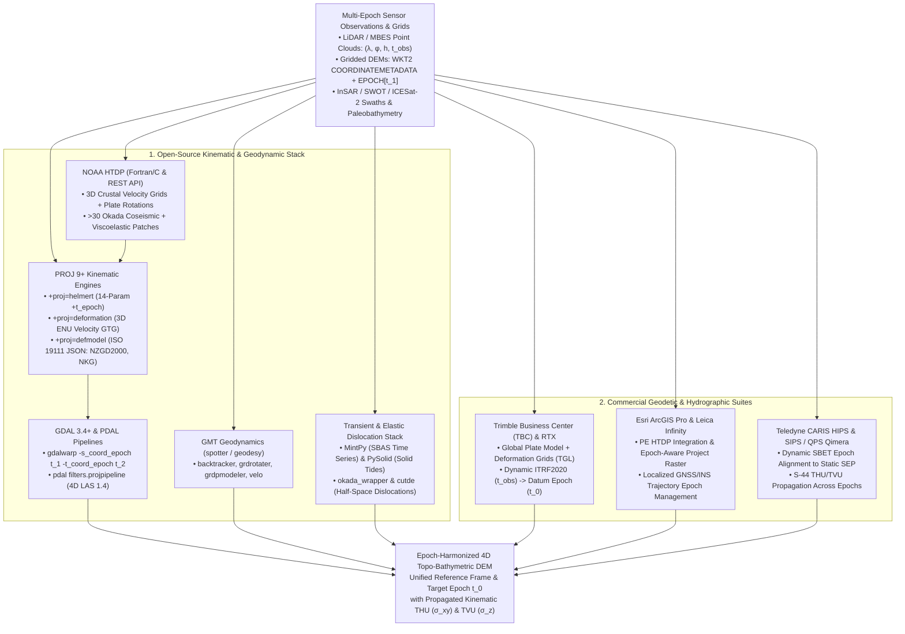

## 4.5 Software Ecosystem

Operationalizing the geodynamic principles of Sections 4.1–4.4—plate-tectonic Euler pole rotations, Glacial Isostatic Adjustment (GIA), the interseismic–coseismic–postseismic earthquake deformation cycle, non-tectonic subsidence, and solid Earth tides—requires a four-dimensional (4D) software stack that treats **coordinate epoch $t$ as a first-class mathematical dimension alongside $(X, Y, Z)$ or $(\lambda, \varphi, h)$**. In legacy two- and three-dimensional GIS workflows, elevation rasters and bathymetric grids were treated as static snapshots frozen onto an unchanging crust. When multi-temporal airborne LiDAR, multibeam echosounder (MBES), or satellite interferometric (InSAR/SWOT) Digital Elevation Models (DEMs) are differenced across active plate margins or post-glacial rebound zones without software-enforced epoch harmonization, unmodeled horizontal tectonic drift $\Delta \mathbf{x}_{\text{horiz}} = \mathbf{v}_{\text{horiz}}\,\Delta t$ across sloped terrain ($\nabla z$) injects an apparent vertical elevation bias $\Delta z_{\text{app}} \approx -\nabla z \cdot \Delta \mathbf{x}_{\text{horiz}}$ that corrupts change detection and inflates Total Horizontal and Vertical Uncertainty ($\text{THU}$ and $\text{TVU}$).

Modern kinematic geodetic and geodynamic software is organized into four functional tiers:
1. **Kinematic Coordinate and Deformation Grid Engines** (e.g., NOAA HTDP, PROJ `+proj=deformation` / `+proj=defmodel` / `+proj=helmert`), which evaluate 14-parameter time-dependent Helmert transformations, continuous 3D crustal velocity grids, and piecewise coseismic/postseismic dislocation patches between arbitrary observation epochs $t_{\text{obs}}$ and target reference epochs $t_0$.
2. **Epoch-Aware Raster and Point-Cloud Warping Pipelines** (e.g., GDAL 3.4+ `gdalwarp -s_coord_epoch -t_coord_epoch`, PDAL `filters.projpipeline`), which propagate WKT2:2019 `COORDINATEMETADATA` epoch tags and resample gridded DEMs or LAS 1.4 point clouds across time and reference frames.
3. **Plate-Tectonic Reconstruction and Geodynamic Modeling Suites** (e.g., GMT `backtracker`, `grdrotater`, `grdpmodeler`, `velo`), which rotate paleobathymetric grids across geological timescales ($10^0\text{--}10^2\text{ Myr}$) and separate thermal lithospheric subsidence from dynamic mantle topography.
4. **Transient Deformation, Solid Earth Tide, and Dislocation Solvers** (e.g., MintPy, PySolid, `okada_wrapper`, `cutde`), which remove sub-daily lunisolar solid Earth tidal warping from wide-swath DEMs, invert InSAR time series for non-steady subsidence, and synthesize elastic fault-slip grids to patch earthquake-ruptured terrain models.



---

### 4.5.1 Open-Source Kinematic Geodesy, Deformation, and Geodynamic Stack

#### NOAA HTDP (Horizontal Time-Dependent Positioning)
Developed at NOAA's National Geodetic Survey (NGS) by Richard Snay and Chris Pearson since 1992 (Snay, 1999; Pearson & Snay, 2013), **HTDP** (v3.4+/v3.5) is the foundational public-domain Fortran/C utility and NGS Web Service (`https://geodesy.noaa.gov/HTDP/`) for transforming 3D coordinates and velocity vectors across time ($t_1 \to t_2$) and spatial reference frames (`NAD83(2011)`, `NAD83(PA11)`, `NAD83(MA11)`, `ITRF94` through `ITRF2020`, and `WGS84` realizations `G730` through `G2139`). Despite its historical name, modern HTDP is a fully **three-dimensional** kinematic engine evaluating the general time-dependent trajectory model of Section 4.4.2 across North America, the Caribbean, the Pacific Islands, and global tectonic plates:
$$\mathbf{X}(t_2) = \mathbf{X}_{\text{Helmert}}(t_1 \to t_2) + \mathbf{v}_{\text{inter}}(\varphi, \lambda)(t_2 - t_1) + \sum_{m=1}^{M} H_{\text{step}}(t_1, t_2; t_{\text{eq},m})\,\Delta\mathbf{X}_{\text{coseis},m}(\varphi, \lambda) + \Delta\mathbf{X}_{\text{post}}(t_1, t_2)$$
where $H_{\text{step}}(t_1, t_2; t_{\text{eq},m}) = H(t_2 - t_{\text{eq},m}) - H(t_1 - t_{\text{eq},m}) \in \{-1, 0, +1\}$ is the signed Heaviside step operator ($+1$ when transforming forward across an earthquake $t_1 < t_{\text{eq},m} \le t_2$, $-1$ when transforming backward $t_2 < t_{\text{eq},m} \le t_1$, and $0$ otherwise). HTDP integrates three geophysical components:
* **Secular Interseismic Velocity Grids and Euler Poles:** Within the western conterminous United States (CONUS) and Alaska—where plate-boundary shear across the San Andreas Fault System, Cascadia Subduction Zone, Walker Lane, and Aleutian Megathrust invalidates rigid-plate rotation—HTDP interpolates bilinearly across multi-resolution 2D horizontal velocity grids $(v_E, v_N)$ derived from continuous GNSS (CORS) inversions and elastic block models (McCaffrey et al., 2013; Zeng & Shen, 2017), paired with vertical velocity grids $v_U$ capturing GIA and tectonic uplift. Outside gridded deformation zones, HTDP evaluates rigid Euler pole angular velocities $\boldsymbol{\Omega}_p \times \mathbf{r}$ across 15+ major tectonic plates.
* **Embedded Okada Coseismic Dislocation Models:** Rather than storing static raster grids for every historical rupture, HTDP embeds analytical **Okada (1985) rectangular elastic half-space dislocation parameters** (fault trace endpoints, dip, rake, strike-slip and dip-slip magnitudes, and locking depths) for more than 30 major earthquakes—including the 1964 Prince William Sound ($M_w$ 9.2), 1989 Loma Prieta ($M_w$ 6.9), 1992 Landers ($M_w$ 7.3), 1999 Hector Mine ($M_w$ 7.1), 2002 Denali ($M_w$ 7.9), 2010 El Mayor–Cucapah ($M_w$ 7.2), and 2019 Ridgecrest ($M_w$ 7.1) ruptures. Whenever the transformation interval $[t_1, t_2]$ straddles an earthquake epoch $t_{\text{eq},m}$, HTDP dynamically evaluates the 3D coseismic step $(\Delta E, \Delta N, \Delta U)$ at each target point.
* **Postseismic Viscoelastic Relaxation:** For giant subduction ruptures (specifically the 1964 $M_w$ 9.2 Alaska earthquake), HTDP evaluates a time-dependent exponential/logarithmic postseismic relaxation term $\Delta\mathbf{X}_{\text{post}}(t_1, t_2)$ accounting for decades-long upper-mantle viscoelastic flow across southern Alaska.

#### PROJ Kinematic Operations (`+proj=deformation`, `+proj=defmodel`, and `+proj=helmert`)
In high-throughput DEM pipelines, standalone interactive utilities are superseded by **PROJ (v7.1–v9.5+)**, which embeds time-dependent geodetic operations directly into C/C++ and Python coordinate transformation pipelines (`+proj=pipeline`):
1. **14-Parameter Time-Dependent Helmert (`+proj=helmert` with `+t_epoch`):** Transforms 3D geocentric Cartesian coordinates $(X, Y, Z, t)$ between global dynamic reference frames (`ITRF2014`, `ITRF2020`) and regional plate-fixed frames (`NAD83(2011)`, `ETRF2000`, `GDA2020`, `NATRF2022`). At observation epoch $t$, each of the seven Helmert parameters—three translations $\mathbf{T}(t)$, three infinitesimal rotations $\mathbf{R}(t)$, and differential scale $D(t)$—evolves linearly from reference epoch $t_0$ (`+t_epoch=2010.0`):
   $$P(t) = P(t_0) + \dot{P}\cdot(t - t_0), \qquad P \in \{T_X, T_Y, T_Z, R_X, R_Y, R_Z, D\}$$
   In PROJ, rotation convention must always be explicitly declared (`+convention=position_vector` vs. `+convention=coordinate_frame`) to prevent sign inversions on $(\dot{R}_X, \dot{R}_Y, \dot{R}_Z)$.
2. **3D Kinematic Velocity Grid Shift (`+proj=deformation`):** Applies a continuous 3D secular crustal velocity grid (`+grids=...`, stored in Cloud-Optimized Geodetic TIFF Grid `GTG` format with bands `(v_E, v_N, v_U)` in $\text{mm/yr}$ or $\text{m/yr}$) to geocentric Cartesian coordinates $(X, Y, Z, t)$. The operator converts the input Cartesian point to local topocentric East–North–Up (ENU), multiplies the bilinearly interpolated velocity vector by elapsed time $\Delta t = t - t_c$ (controlled by central epoch `+t_epoch=t_c` when a 4D coordinate $t$ is provided, or by a fixed time span `+dt=<years>` when operating on 3D coordinates), rotates the topocentric displacement $(\Delta E, \Delta N, \Delta U) = \Delta t \cdot (v_E, v_N, v_U)$ back into geocentric $(\Delta X, \Delta Y, \Delta Z)$, and updates the 3D position. The **Nordic Geodetic Commission (NKG)** transformations (e.g., `NKG_ETRF00` and `NKG_RF17vel` using `eur_nkg_nkgrf17vel.tif`, Häkli et al., 2016, 2023) rely on `+proj=deformation` to remove Fennoscandian GIA uplift (exceeding $+10\text{ mm/yr}$ vertically and $2\text{--}3\text{ mm/yr}$ radially outward from the Gulf of Bothnia) when reducing LiDAR and bathymetric surveys to target national epochs.
3. **Master Deformation Model Engine (`+proj=defmodel`):** Introduced in PROJ 7.1 (Rouault & Crook, 2020) to implement the OGC / ISO 19111 Geodetic Data Grid and Deformation Model specification, `+proj=defmodel +model=model.json` evaluates multi-component national deformation models governed by a JSON control file. Each component $c$ inside the JSON file pairs a spatial displacement grid $\mathbf{d}_c(\lambda, \varphi) = (\Delta E_c, \Delta N_c, \Delta U_c)$ (in GTG format) with an explicit temporal function $\psi_c(t)$ (velocity, step, piecewise-linear, or exponential decay):
   $$\Delta \mathbf{u}(\lambda, \varphi, t) = \sum_{c=1}^{C} \psi_c(t)\, \mathbf{d}_c(\lambda, \varphi)$$
   The canonical production deployment of `+proj=defmodel` is Land Information New Zealand's **NZGD2000 Deformation Model** (`nz_linz_nzgd2000-20180701.json`, Crook et al., 2016), combining a national interseismic velocity grid (capturing oblique Pacific–Australian plate convergence at $35\text{--}50\text{ mm/yr}$) with nested multi-grid reverse-patch models (`reverse_patch`) for the 2009 Dusky Sound ($M_w$ 7.8), 2010 Darfield ($M_w$ 7.1), 2011 Christchurch ($M_w$ 6.2), 2013 Cook Strait/Lake Grassmere ($M_w$ 6.6), and 2016 Kaikōura ($M_w$ 7.8) earthquakes. Because NZGD2000 is a *semi-dynamic datum* anchored at reference epoch $t_0 = 2000.0$, subtracting the coseismic reverse patches removes meter-scale earthquake offsets so that pre- and post-earthquake coordinates remain consistent with pre-earthquake cadastral and topographic maps.

#### GDAL (`gdalwarp` Epoch Flags) and PDAL (4D Point-Cloud Pipelines)
* **GDAL 3.4+ (`gdalwarp -s_coord_epoch` and `-t_coord_epoch`):** Beginning with GDAL 3.4, the raster data model natively supports coordinate epochs embedded in `ISO 19162` WKT2:2019 `COORDINATEMETADATA[CRS[...], EPOCH[2010.0]]` definitions (inspectable via `gdalinfo` and assignable in-place via `gdal_edit.py -coord_epoch 2024.5 dem.tif`). When executing `gdalwarp`, passing `-s_coord_epoch <t_src>` and `-t_coord_epoch <t_dst>` instructs GDAL to query PROJ (`proj_create_crs_to_crs`) for a time-dependent coordinate operation evaluated at the specified epochs, or to inject the coordinate epoch into an explicit `-ct "+proj=pipeline ..."` string. Note that while `gdalwarp` always shifts horizontal pixel locations $(\Delta E, \Delta N)$, modifying the vertical elevation values of a single-band DEM raster requires either a 3D/compound CRS transformation incorporating vertical grid shifts (`+proj=vgridshift` / `+proj=deformation` / `+proj=defmodel` with 3D DEM warping enabled) or explicit raster band arithmetic adding the vertical displacement grid $\Delta U(\lambda, \varphi)$.
* **PDAL (`filters.projpipeline` and `filters.reprojection`):** For discrete 3D/4D point clouds (airborne LiDAR, mobile laser scanning, or multibeam sonar stored in LAS 1.4 / COPC), PDAL's `filters.projpipeline` feeds 3D `(X, Y, Z)` point coordinates through any PROJ kinematic pipeline (`+proj=helmert`, `+proj=deformation`, or `+proj=defmodel`). Because PDAL passes 3D `(X, Y, Z)` tuples to PROJ (whereas LAS 1.4 `GpsTime` is stored in Adjusted Standard GPS seconds $t_{\text{GPS}} - 10^9\text{ s}$ since `1980-01-06 00:00:00 UTC` rather than decimal Julian years), a campaign-wide epoch transformation either specifies the elapsed time directly via `+dt=<years>` in `+proj=deformation` or injects the decimal-year observation epoch into the 4th coordinate dimension using PROJ's `+step +proj=set +v_4=<epoch>` operator prior to evaluating `+proj=helmert` or `+proj=defmodel`. When a compilation spans multiple years or crosses a coseismic rupture, a PDAL `filters.python` stage converts per-pulse `GpsTime` to decimal Julian years $t_i$ and invokes `pyproj.Transformer.from_pipeline` so that every return is reduced from its exact acquisition instant $t_i$ to $t_0$.

#### GMT Geodynamics and Paleobathymetry (`backtracker`, `grdrotater`, `grdpmodeler`, `velo`)
While HTDP and PROJ operate on geodetic timescales ($10^{-3}\text{--}10^2\text{ yr}$) using infinitesimal rotation rates, the **Generic Mapping Tools (GMT 6+)** `spotter` (plate tectonics) and `geodesy` supplements (Wessel et al., 2019) operate across both geodetic and geological timescales ($10^0\text{--}200\text{ Myr}$) using finite spherical Euler rotations:
* **`gmt backtracker`:** Projects volcanic seamount chains, guyots, and marine magnetic lineations forward or backward in geological time along small circles about finite stage or total reconstruction poles $(\Lambda_E, \Phi_E, \omega)$ stored in rotation tables (e.g., Matthews et al., 2016; Müller et al., 2019), verifying hotspot fixity and reconstructing paleolatitudes and eruption ages.
* **`gmt grdrotater`:** Reconstructs entire gridded bathymetric or paleobathymetric DEMs (`*.nc` / `*.tif`) to past geological epochs ($t$ in $\text{Ma}$) by applying finite Euler rotations across closed tectonic plate polygons, automatically clipping and re-interpolating rotated plate fragments across evolving plate boundaries.
* **`gmt grdpmodeler`:** Evaluates plate tectonic model predictions—crustal age $t_{\text{age}}(x,y)$, plate velocity magnitude/azimuth, and theoretical thermal subsidence depth $d_{\text{model}}(t_{\text{age}})$ via the Parsons & Sclater (1977) or Stein & Stein (1992) plate cooling models—directly onto a bathymetric grid. Subtracting `grdpmodeler` predicted basement depth from observed sediment-corrected bathymetry isolates **residual depth anomalies** driven by mantle plumes and dynamic topography.
* **`gmt velo`:** Plots geodetic GNSS velocity vectors $(v_E, v_N)$ with correlated bivariate error ellipses $(\sigma_E, \sigma_N, \rho_{EN})$, fault slip-rate arrows, principal strain-rate crosses $(\dot{\varepsilon}_1, \dot{\varepsilon}_2)$, and rotational wedges directly over shaded-relief DEM basemaps.

#### MintPy, PySolid, and Elastic Dislocation Wrappers (`okada_wrapper`, `cutde`)
* **MintPy (Miami InSAR Time-Series Software in Python):** Developed by Zhang Yunjun, Heresh Fattahi, and Falk Amelung (Yunjun et al., 2019), **MintPy** is the standard open-source Python package for Small Baseline Subset (SBAS) InSAR time-series analysis from Sentinel-1, ALOS-2, and NISAR unwrapped interferograms (ISCE2, GAMMA, SNAP, or ASF HyP3). Following tropospheric delay removal (`PyAPS` / ERA5) and topographic residual (DEM error $\Delta z_{\text{DEM}}$) estimation, MintPy's `timeseries2velocity.py` fits a parametric temporal deformation model to every pixel's Line-of-Sight (LOS) displacement history:
  $$d_{\text{LOS}}(t) = d_0 + v_{\text{LOS}}(t - t_0) + \sum_{k=1}^{2}\left[a_k \cos(2\pi f_k t) + b_k \sin(2\pi f_k t)\right] + \sum_{m=1}^{M} H(t - t_{\text{eq},m})\left[c_m + p_m \ln\!\left(1 + \frac{t - t_{\text{eq},m}}{\tau_m}\right)\right]$$
  MintPy also ties relative InSAR velocity maps directly to absolute `ITRF2014`/`ITRF2020` GNSS station velocities from the Nevada Geodetic Laboratory (NGL) or EarthScope (`--gnss-comp ENU2LOS`), producing absolute vertical subsidence/uplift rate grids ready for DEM epoch propagation.
* **PySolid (Solid Earth Tides in Python):** Authored by Yunjun et al. (2022), **PySolid** wraps Dennis Milbert's Fortran implementation (`solid.for`) of the **IERS Conventions (2010)** analytical solid Earth tide model (Dehant et al., 1999; Mathews et al., 1997). Using Degree 2 and 3 Love and Shida numbers $(h_n, l_n)$ coupled with exact lunisolar ephemerides, `pysolid.calc_solid_earth_tides_grid()` computes 3D surface displacement grids $(\Delta E_{\text{SET}}, \Delta N_{\text{SET}}, \Delta U_{\text{SET}})$ at any timestamp $t$. Because the vertical solid Earth tide reaches $30\text{--}50\text{ cm}$ peak-to-peak and exhibits spatial gradients of $1\text{--}3\text{ cm}$ across $250\text{ km}$ Sentinel-1 or SWOT swaths, removing `PySolid` grids is mandatory before stitching wide-swath radar DEMs or laser altimetry profiles.
* **Okada and Triangular Dislocation Wrappers (`okada_wrapper` and `cutde`):** When a major earthquake strikes before national geodetic agencies publish an updated PROJ/HTDP grid, practitioners generate custom coseismic deformation patches directly from USGS NEIC or GCMT finite-fault slip inversions:
  * **`okada_wrapper`** (Ben Thompson): A fast Python/Fortran wrapper around Okada's (1985, 1992) analytical Green's functions (`dc3d0` point source and `dc3d` finite rectangular fault in a homogeneous isotropic elastic half-space with medium constant $\alpha = (\lambda + \mu)/(\lambda + 2\mu)$), returning the exact 3D displacement vector $\mathbf{u} = (u_x, u_y, u_z)$ and 9-component displacement gradient tensor $\nabla \mathbf{u}$.
  * **`cutde` (CUDA/C++ Triangular Dislocation Elements):** For non-planar, curving subduction megathrusts or listric faults where rectangular Okada patches create artificial stress singularities at segment corners, `cutde` (Thompson, implementing Nikkhoo & Walter, 2015) evaluates exact analytical displacements and strains from **3D triangular dislocation meshes** at $>10^8$ source–receiver pairs per second on GPU/CPU, enabling rapid generation of Geodetic TIFF Grids (GTG) for PROJ `+proj=defmodel` or `gdalwarp` DEM patching.

---

### 4.5.2 Commercial and Closed-Source Kinematic & Hydrographic Suites

* **Trimble Business Center (TBC) and Trimble RTX Global Plate/Deformation Engine:** In commercial land surveying, mobile mapping, and airborne LiDAR production, **TBC** and the **Trimble CenterPoint RTX** (Real-Time eXtended) global PPP service rely on the **Trimble Geodetic Library (TGL)** to manage time-dependent reference frames (Leandro et al., 2011; Doucet et al., 2012). Trimble RTX computes rover and aircraft trajectories in the instantaneous **Observation Epoch ($t_{\text{obs}}$)** of `ITRF2020`. To output deliverables in a national plate-fixed datum at its reference epoch $t_0$—such as `NAD83(2011)` epoch `2010.0`, `ETRF2000`, `GDA2020` epoch `2020.0`, or `NZGD2000` epoch `2000.0`—TGL evaluates a global tectonic plate boundary polygon dataset paired with **ITRF2020 / MORVEL56 Euler pole velocities** or national deformation grids (`HTDP` in the U.S., `NKG` in Norden, `NZGD2000` in New Zealand, and `JGD2011` patch grids in Japan) to propagate coordinates from $t_{\text{obs}} \to t_0$, followed by the 14-parameter Helmert transformation at $t_0$.
* **Esri ArcGIS Pro (Projection Engine with HTDP and Epoch-Aware Transformations):** **Esri ArcGIS Pro (v2.9–v3.3+)** embeds time-dependent transformations directly inside the **Esri Projection Engine (PE)**. Datasets assigned a dynamic CRS (`ITRF2014`, `ITRF2020`, `WGS84 (G2139)`) or semi-dynamic datum store a **Coordinate Epoch** property (in decimal years, e.g., `2024.5`). Inside `Project` and `Project Raster`, users specify both **Input Coordinate Epoch** and **Output Coordinate Epoch**; for North American transformations between `ITRFxx`/`WGS84` and `NAD83(2011)`, ArcGIS Pro invokes an embedded C port of **NOAA HTDP**, accounting for 3D interseismic velocities and coseismic steps alongside the 14-parameter Helmert transformation.
* **Hexagon / Leica Infinity and Trimble Applanix POSPac MMS:** Used alongside Leica airborne topobathymetric LiDAR sensors (Chiroptera-5, HawkEye-5), **Leica Infinity** supports full 14-parameter time-dependent Helmert transformations and localized RTCM v3.x State Space Representation (SSR) / Geodetic TIFF deformation grids to reduce SmartNet RTK/PPK trajectories from survey epoch $t_{\text{survey}}$ to project epoch $t_0$. Similarly, **Applanix POSPac MMS** (`PP-RTX` and `SmartBase`) solves airborne and marine (`POS MV`) Smoothed Best Estimate of Trajectory (`SBET`) files in `ITRF2020 (epoch t_survey)` and executes an internal 4D kinematic transformation (via HTDP/TGL velocity grids) to export the `SBET` directly in the target mapping frame and epoch (`NAD83(2011) epoch 2010.0`) prior to point-cloud georeferencing.
* **Teledyne CARIS HIPS & SIPS and QPS Qimera Dynamic Epoch Handling in ERS:** In **Ellipsoidally Referenced Surveying (ERS)** (Section 3.6.2), a hydrographic vessel reduces multibeam soundings $d_{\text{sonar}}(t)$ to Chart Datum (`MLLW` or `LAT`) by subtracting a static Separation Model $\text{SEP}(\lambda, \varphi)$ from the vessel's ellipsoidal GNSS/INS height $h_{\text{vessel}}(t)$. Whenever the vessel `SBET` is computed via PPP in a dynamic frame (`ITRF2020` at survey epoch $t_{\text{survey}} = 2025.5$) while the coastal $\text{SEP}$ grid (e.g., NOAA VDatum) is anchored to a plate-fixed datum at a historical reference epoch (`NAD83(2011)` at $t_0 = 2010.0$), both **CARIS HIPS & SIPS** and **QPS Qimera** execute dynamic PROJ/HTDP epoch transformations during `SBET` ingestion. Failing to transform an `ITRF2020 (2025.5)` trajectory into `NAD83(2011) (2010.0)` along the Pacific coast aliases the $1.3\text{--}1.5\text{ m}$ 3D frame offset plus 15.5 years of vertical tectonic/GIA motion ($15.5\text{ yr} \times v_U$) directly into charted depth $d_{\text{MLLW}}$, violating IHO S-44 Special Order $\text{TVU}$ tolerances ($\pm 0.25\text{ m}$).

---

### 4.5.3 Comparison Matrix of Kinematic Geodesy and Deformation Software

| Software / Package | License | Primary Domain | Kinematic, Tectonic & Deformation Models | Epoch & Uncertainty ($\text{THU}/\text{TVU}$) Handling | Primary Operational Role in DEM Workflows |
| :--- | :--- | :--- | :--- | :--- | :--- |
| **NOAA HTDP (v3.4/3.5)** | Public Domain (Fortran/C & REST) | North America, Pacific & Global Plates | 3D CORS velocity grids, 15+ Euler poles, $>30$ Okada coseismic & viscoelastic models | Explicit $t_1 \to t_2$ decimal-year shifts; outputs 3D velocity $(\dot{\phi}, \dot{\lambda}, \dot{h})$ | Transforming survey control, GNSS trajectories, and LiDAR clouds across epochs and NAD83/ITRF frames. |
| **PROJ (`helmert`, `deformation`, `defmodel`)** | Open Source (MIT) | Global 4D Coordinate & Grid Pipelines | 14-param Helmert, 3D ENU velocity GTGs (`NKG`), ISO 19111 JSON models (`NZGD2000`) | Native 4D $(X,Y,Z,t)$ pipelines (`cct`); `projinfo` tracks formal model accuracy | Engine underlying GDAL, PDAL, and `pyproj` for automated epoch-to-epoch point and grid transformations. |
| **GDAL 3.4+ (`gdalwarp`) & PDAL** | Open Source (MIT / BSD) | Gridded DEM Rasters & LAS 1.4 Clouds | All PROJ 4D kinematic pipelines & GTG velocity/patch grids on `cdn.proj.org` | Reads/writes WKT2 `EPOCH[t]`; `-s_coord_epoch` / `-t_coord_epoch` flags | Warping multi-epoch DEM rasters and 4D point clouds to a common reference frame and target epoch $t_0$. |
| **GMT (`spotter` & `geodesy`)** | Open Source (LGPLv3) | Plate Reconstructions & Geodynamics | Finite Euler stage poles (`backtracker`, `grdrotater`), plate cooling (`grdpmodeler`), `velo` | Geological epochs ($0\text{--}200\text{ Ma}$) & geodetic velocity error ellipses | Rotating paleobathymetric DEMs, isolating mantle dynamic topography, and plotting GNSS/strain fields. |
| **MintPy & PySolid** | Open Source (GPLv3 / BSD) | InSAR Time Series & Solid Earth Tides | SBAS velocity + seasonal + step/log transients; IERS 2010 degree 2–3 solid Earth tides | Bootstrap velocity $\sigma_v$; sub-millimeter theoretical tidal precision | Extracting subsidence/uplift rate grids from InSAR and removing $30\text{--}50\text{ cm}$ solid Earth tides from swaths. |
| **`okada_wrapper` & `cutde`** | Open Source (MIT) | Coseismic Elastic Dislocation Modeling | Okada (1985, 1992) rectangular & Nikkhoo–Walter (2015) 3D triangular dislocations | Forward sensitivity propagation from finite-fault slip covariance | Generating custom 3D $(\Delta E, \Delta N, \Delta U)$ coseismic GTG patch grids to align pre-/post-earthquake DEMs. |
| **Trimble TBC / RTX & Applanix POSPac** | Commercial | GNSS/INS Trajectories & Survey Control | Global tectonic plate polygons + regional deformation grids (`HTDP`, `NKG`, `NZGD2000`) | Propagates 4D trajectory covariance from $t_{\text{obs}}$ to datum epoch $t_0$ | Reducing raw airborne LiDAR and marine `SBET` trajectories from dynamic `ITRF2020(t)` to mapping epoch. |
| **CARIS HIPS & SIPS / QPS Qimera** | Commercial | Hydrographic Production & Marine ERS | Dynamic `SBET` epoch transformations coupled to static VDatum/VORF `SEP` grids | Full IHO S-44 6th Ed. 3D TPU ($\text{THU}$ & $\text{TVU}$) across epochs | Preventing decimeter-to-meter tectonic/frame drift from aliasing into Ellipsoidally Referenced bathymetries. |

---

### 4.5.4 Reproducible CLI and Python Workflows

#### Command-Line Workflow: 4D Coordinate Inspection, Point Shifting, and Epoch-Aware DEM Warping (`projinfo`, `cct`, `gdalwarp`, `pdal`)
Consider a multi-temporal topographic change-detection study along the San Andreas Fault Zone near Parkfield, California ($\lambda = -120.4300^\circ\text{ E}, \varphi = 35.9000^\circ\text{ N}$), or across the Fennoscandian GIA uplift dome. Below, we inspect the 14-parameter time-dependent Helmert transformation between `ITRF2020` (`EPSG:9989`) and `NAD83(2011)` (`EPSG:6319`), shift a 4D benchmark at observation epoch `2024.5` via `cct`, warp a DEM from dynamic `ITRF2020` (epoch `2024.5`) into `NAD83(2011)` (epoch `2010.0`) using `gdalwarp`, and apply a 3D kinematic velocity grid (`+proj=deformation`) over $\Delta t = 14.5\text{ yr}$ to a LAS 1.4 point cloud via `pdal`:

```bash
# STEP 1: Inspect the 14-parameter time-dependent Helmert pipeline between ITRF2020 and NAD83(2011)
projinfo -s EPSG:9989 -t EPSG:6319 -o PROJ

# STEP 2: Transform a 4D point (Lon, Lat, h_m, t_obs) at epoch 2024.5 from ITRF2020 to NAD83(2011) using PROJ cct
echo "-120.430000 35.900000 450.000 2024.5" | cct -d 6 +proj=pipeline \
    +step +proj=unitconvert +xy_in=deg +xy_out=rad +step +proj=cart +ellps=GRS80 \
    +step +proj=helmert +x=1.0053 +y=-1.90921 +z=-0.54157 +rx=0.0267814 +ry=-0.0004203 +rz=0.0109321 \
          +s=0.00036891 +dx=0.00079 +dy=-0.0006 +dz=-0.00144 +drx=6.67e-05 +dry=-0.0007574 \
          +drz=-5.13e-05 +ds=-7.20e-05 +t_epoch=2010.0 +convention=position_vector \
    +step +inv +proj=cart +ellps=GRS80 +step +proj=unitconvert +xy_in=rad +xy_out=deg

# STEP 3: Tag WKT2 coordinate epoch (2024.5) and warp DEM from ITRF2020 (2024.5) to NAD83(2011) (2010.0) in GDAL 3.4+
gdal_edit.py -a_srs EPSG:7912 -coord_epoch 2024.5 "survey_itrf2014_ep2024p5.tif"
gdalwarp -s_srs EPSG:7912 -s_coord_epoch 2024.5 -t_srs EPSG:6318 -t_coord_epoch 2010.0 \
         -et 0.0 -r cubicspline -co COMPRESS=DEFLATE -co PREDICTOR=3 \
         "survey_itrf2014_ep2024p5.tif" "survey_nad83_ep2010_aligned.tif"

# STEP 4: Apply a 3D deformation velocity grid (+proj=deformation) across dt=+14.5 yr to a 3D LAS 1.4 cloud in PDAL
# (Using +dt=14.5 or +step +proj=set +v_4=2024.5 because PDAL passes 3D XYZ tuples without decimal-year t)
pdal translate "lidar_epoch2010.laz" "lidar_epoch2024p5.laz" projpipeline \
    --filters.projpipeline.coord_op="+proj=pipeline +step +proj=unitconvert +xy_in=deg +xy_out=rad \
        +step +proj=cart +ellps=GRS80 +step +proj=deformation +dt=14.5 +grids=eur_nkg_nkgrf17vel.tif \
        +step +inv +proj=cart +ellps=GRS80 +step +proj=unitconvert +xy_in=rad +xy_out=deg"
```

#### Python Workflow: 4D Kinematic Transformation (`pyproj`) and Coseismic DEM Patching (`okada_wrapper`)
The Python script below executes (1) a 4D `(lon, lat, h, t)` Helmert and plate-boundary transformation in `pyproj` across $\Delta t = 14.5\text{ yr}$ (`2010.0` $\to$ `2024.5`), quantifying the rigid-frame drift, the local horizontal tectonic shift $\Delta \mathbf{x}_{\text{horiz}}$, the **apparent vertical bias** $\Delta z_{\text{app}} \approx -\nabla_H z \cdot \Delta \mathbf{x}_{\text{horiz}}$ on a $30^\circ$ slope, and both flat-terrain and slope-coupled $\text{THU}_{95}/\text{TVU}_{95}$ (Section 4.4.2), and (2) 3D coseismic surface displacement patching $(\Delta E_{\text{coseis}}, \Delta N_{\text{coseis}}, \Delta U_{\text{coseis}})$ along a $\phi_s = 319^\circ$ striking San Andreas fault segment using Okada (1985) Green's functions (`okada_wrapper`):

```python
import numpy as np
import pyproj

# --- PART A: 4D (lon, lat, h, t) Kinematic Transformation & Slope-Coupled TVU ---
lon0, lat0, h0, t_src, t_dst = -120.430000, 35.900000, 450.000, 2010.0, 2024.5
dt = t_dst - t_src  # 14.5 years elapsed between Survey 1 (2010.0) and Survey 2 (2024.5)

helmert_4d = (
    "+proj=pipeline +step +proj=unitconvert +xy_in=deg +xy_out=rad +step +proj=cart +ellps=GRS80 "
    "+step +proj=helmert +x=1.0053 +y=-1.90921 +z=-0.54157 +rx=0.0267814 +ry=-0.0004203 +rz=0.0109321 "
    "+s=0.00036891 +dx=0.00079 +dy=-0.0006 +dz=-0.00144 +drx=6.67e-05 +dry=-0.0007574 "
    "+drz=-5.13e-05 +ds=-7.20e-05 +t_epoch=2010.0 +convention=position_vector "
    "+step +inv +proj=cart +ellps=GRS80 +step +proj=unitconvert +xy_in=rad +xy_out=deg"
)
tf_4d = pyproj.Transformer.from_pipeline(helmert_4d)
lon_2010, lat_2010, h_2010, _ = tf_4d.transform(lon0, lat0, h0, t_src)
lon_2024, lat_2024, h_2024, _ = tf_4d.transform(lon0, lat0, h0, t_dst)

# Convert 14.5-yr rigid North American plate frame drift (ITRF2020 -> NAD83) into meters
R_earth = 6371000.0
dE_helmert = np.radians(lon_2024 - lon_2010) * R_earth * np.cos(np.radians(lat0))
dN_helmert = np.radians(lat_2024 - lat_2010) * R_earth
dU_helmert = h_2024 - h_2010

# Local Pacific-plate interseismic velocity relative to stable NA: v_E=-28.5, v_N=+31.2, v_U=-1.8 mm/yr
v_e, v_n, v_u = -0.0285, 0.0312, -0.0018  # m/yr
dE_tect, dN_tect, dU_tect = v_e * dt, v_n * dt, v_u * dt
horiz_shift_m = np.hypot(dE_tect, dN_tect)
slope_rad = np.radians(30.0)
dz_apparent_slope = horiz_shift_m * np.tan(slope_rad)  # Apparent vertical bias on 30-deg slope

# Propagate 95% THU and TVU (flat vs. 30-deg slope-coupled) over dt = 14.5 yr
sigma_x0, sigma_z0, sigma_vh, sigma_vu = 0.050, 0.040, 0.0015, 0.0020
sigma_H_t = np.hypot(sigma_x0, sigma_vh * dt)
sigma_U_t = np.hypot(sigma_z0, sigma_vu * dt)
thu_95 = 2.4477 * sigma_H_t
tvu_95_flat = 1.9600 * sigma_U_t
tvu_95_slope = 1.9600 * np.hypot(sigma_U_t, np.tan(slope_rad) * sigma_H_t)

print(f"Helmert 14.5-yr Frame Drift: ΔE = {dE_helmert:+.3f} m, ΔN = {dN_helmert:+.3f} m, Δh = {dU_helmert:+.3f} m")
print(f"Plate-Boundary Shift (14.5 yr): ΔE = {dE_tect:+.3f} m, ΔN = {dN_tect:+.3f} m (|Δx_H| = {horiz_shift_m:.3f} m)")
print(f"Uncompensated 30° Slope Bias: Δz_app = {dz_apparent_slope:+.3f} m | THU_95 = {thu_95:.3f} m, TVU_95 (flat/30°) = {tvu_95_flat:.3f}/{tvu_95_slope:.3f} m")

# --- PART B: Coseismic DEM Patching via Okada (1985) Elastic Half-Space Dislocation ---
# Local fault coordinates (x along strike = 319 deg NW, y = 90 deg CCW from strike, z = Up)
X, Y = np.meshgrid(np.linspace(-5000.0, 5000.0, 101), np.linspace(-5000.0, 5000.0, 101))
alpha, depth, dip_deg, strike_deg = 2.0 / 3.0, 6500.0, 85.0, 319.0
strike_slip, dip_slip, L_half, W = -2.40, 0.35, 10000.0, 12000.0  # Dextral strike-slip (-2.40 m), reverse (+0.35 m)

try:
    from okada_wrapper import dc3dwrapper
    ux_f, uy_f, uz_f = np.zeros_like(X), np.zeros_like(X), np.zeros_like(X)
    for i in range(X.shape[0]):
        for j in range(X.shape[1]):
            _, u, _ = dc3dwrapper(alpha, [X[i, j], Y[i, j], 0.0], depth, dip_deg,
                                  [-L_half, L_half], [-W / 2.0, W / 2.0], [strike_slip, dip_slip, 0.0])
            ux_f[i, j], uy_f[i, j], uz_f[i, j] = u[0], u[1], u[2]
except ImportError:
    d_top = depth - (W / 2.0) * np.sin(np.radians(dip_deg))
    d_bot = depth + (W / 2.0) * np.sin(np.radians(dip_deg))
    ux_f = -(strike_slip / np.pi) * (np.arctan2(Y, d_top) - np.arctan2(Y, d_bot))
    uy_f = np.zeros_like(X)
    uz_f = (dip_slip / np.pi) * ((np.arctan2(Y, d_top) + (d_top * Y) / (Y**2 + d_top**2))
                                 - (np.arctan2(Y, d_bot) + (d_bot * Y) / (Y**2 + d_bot**2)))

# Rotate local fault displacements (ux, uy, uz) into East-North-Up (uE, uN, uU) via strike azimuth
phi_s = np.radians(strike_deg)
uE_patch = ux_f * np.sin(phi_s) - uy_f * np.cos(phi_s)
uN_patch = ux_f * np.cos(phi_s) + uy_f * np.sin(phi_s)
uU_patch = uz_f

print(f"Okada Coseismic Patch Peak Offsets: max|Δx_H| = {np.max(np.hypot(uE_patch, uN_patch)):.3f} m, max|ΔU| = {np.max(np.abs(uU_patch)):.3f} m")
```

> [!WARNING]
> **Silent Epoch Dropping by Legacy GIS Tools and Format Converters:** Exporting a GeoTIFF or LAS 1.4 file through legacy GIS tools, GeoTIFF writers lacking `GeoKey` v1.1 support, or simplified `PROJ.4` strings (`+proj=utm ...`) silently strips the WKT2:2019 `COORDINATEMETADATA[..., EPOCH[t]]` tag. Once the coordinate epoch metadata is lost, downstream invocations of `gdalwarp` or `pyproj` assume the source and target epochs are identical ($\Delta t = 0$), bypassing all velocity grids and time-dependent Helmert rates! Always inspect transformations with `projinfo` and explicitly pass `-s_coord_epoch` and `-t_coord_epoch` in automated shell scripts.

> [!IMPORTANT]
> **Forward vs. Reverse Coseismic Patch Sign Conventions (`HTDP` vs. `NZGD2000`):** Physical deformation models like **NOAA HTDP** model forward physical displacement: transforming from a pre-earthquake epoch $t_1 < t_{\text{eq}}$ to a post-earthquake epoch $t_2 > t_{\text{eq}}$ **adds** the coseismic offset $\Delta \mathbf{X}_{\text{coseis}}$. Conversely, semi-dynamic datums like **NZGD2000** (`+proj=defmodel`) apply **reverse patches** (`reverse_patch`) that *subtract* the coseismic offset from post-earthquake observations so that newly surveyed points match the pre-earthquake $t_0 = 2000.0$ cadastral fabric. Always verify the direction of the epoch transformation using a single benchmark coordinate via `cct` before warping multi-gigabyte DEM rasters.

> [!TIP]
> **De-Tide Wide-Swath Radar and Laser Elevations with `PySolid` Before Block Adjustment:** Solid Earth tides warp the crust vertically by up to $30\text{--}50\text{ cm}$ at diurnal and semidiurnal periods over wavelengths of thousands of kilometers. When co-registering long-strip airborne LiDAR, ICESat-2 laser altimetry, or SWOT/Sentinel-1 wide-swath DEMs acquired at different hours of the day, evaluate `pysolid.calc_solid_earth_tides_grid()` at each pass's exact UTC timestamp and subtract $\Delta U_{\text{SET}}(x, y, t)$ prior to executing ICP or Nuth & Kääb (2011) co-registration so that tidal ramps are not misattributed to sensor roll bias or tectonic tilt.
