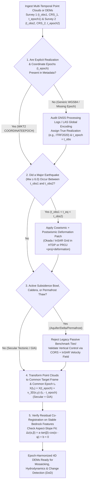

## 4.6 Common Pitfalls & Key Takeaways

In classical cartography, topographic and bathymetric surfaces were treated as static geometric boundary conditions fixed once and for all to a national datum. In modern centimeter-scale DEM engineering—where airborne LiDAR, satellite laser/radar altimetry (`ICESat-2`, `SWOT`), UAV photogrammetry, and Ellipsoidally Referenced Surveying (ERS) multibeam sonar routinely achieve $2\text{–}10\text{ cm}$ vertical precision—ignoring the **fourth dimension (time $t$)** is one of the most destructive sources of systematic error in earth science. Across plate-boundary shear zones, glacial isostatic adjustment (GIA) domes, and compacting sedimentary basins, the solid Earth moves continuously beneath our sensors at rates of $10\text{ to }>250\text{ mm/yr}$.

Crucially, crustal motion does not merely shift elevations vertically: **horizontal tectonic advection across sloped terrain masquerades as vertical elevation change** ($\Delta z_{\text{apparent}} \approx -\nabla_H z \cdot \Delta\mathbf{x}_H$), generating widespread phantom erosion and deposition across hillslopes and submarine canyons. This section examines five canonical dynamic-earth failure modes—complete with governing kinematics, uncertainty propagation, and worked numerical examples—before synthesizing Chapter 4 into an operational epoch-alignment workflow and practitioner audit checklist.

---

### 4.6.1 Detailed Case Studies of Tectonic, Seismic, GIA, and Subsidence Failure Modes

#### Pitfall 1: Differencing Multi-Temporal LiDAR or Multibeam DEMs in Tectonically Active Regions Without Epoch Alignment

* **Physical & Geodetic Mechanism:** When computing a DEM of Difference ($\text{DoD} = z_2 - z_1$) between two airborne LiDAR or multibeam bathymetric surveys acquired at epochs $t_1$ and $t_2$ ($\Delta t = t_2 - t_1$) in an active tectonic margin (e.g., California, Japan, New Zealand, Cascadia, Chile, or Türkiye), practitioners frequently co-register both grids in their native acquisition epochs (or in a dynamic frame such as `ITRF2020` or `WGS84` at observation time $t_{\text{obs}}$) and subtract pixel-by-pixel at fixed horizontal coordinates $(x, y)$. Even in the complete absence of geomorphic erosion, landsliding, or sediment transport, rigid-block secular horizontal plate velocity $\mathbf{v}_H = (v_E, v_N)^T$ translates the physical topography horizontally by $\Delta\mathbf{x}_H = \mathbf{v}_H \Delta t$. At any fixed grid node $(x, y)$, a hillside or submarine canyon wall whose downslope aspect points *in the direction of* the tectonic motion vector ($\alpha_{\text{aspect}} = \alpha_{\text{plate}}$) appears to rise (false deposition), while the opposite slope facing *against* the motion vector ($\alpha_{\text{aspect}} = \alpha_{\text{plate}} + 180^\circ$) appears to drop (false erosion).
* **Governing Equations:** Let $z_1(\mathbf{x}_H)$ be the true topographic or seafloor surface at epoch $t_1$, where $\mathbf{x}_H = (x, y)^T$ denotes horizontal map coordinates and $z$ is positive-up elevation (or $d = -z$ for positive-downward bathymetric depth). If the crust undergoes a 3D tectonic displacement $\Delta\mathbf{X}(\Delta t) = (\Delta x, \Delta y, \Delta z_{\text{crust}})^T = (\Delta\mathbf{x}_H^T, \Delta z_{\text{crust}})^T$ over $\Delta t = t_2 - t_1$ with zero geomorphic surface change, a material point initially at $\mathbf{x}_H - \Delta\mathbf{x}_H$ moves to $\mathbf{x}_H$ with elevation $z_2(\mathbf{x}_H) = z_1(\mathbf{x}_H - \Delta\mathbf{x}_H) + \Delta z_{\text{crust}}$. Expanding $z_1(\mathbf{x}_H - \Delta\mathbf{x}_H)$ in a first-order Taylor series yields the apparent Eulerian elevation change $\Delta z_{\text{DoD}}(\mathbf{x}_H) = z_2(\mathbf{x}_H) - z_1(\mathbf{x}_H)$ (and positive-downward depth change $\Delta d_{\text{DoD}} = d_2 - d_1 = -\Delta z_{\text{DoD}}$):
  $$
  \Delta z_{\text{DoD}}(\mathbf{x}_H) \approx \Delta z_{\text{crust}} - \nabla_H z(\mathbf{x}_H) \cdot \Delta\mathbf{x}_H = v_U \Delta t - \left(\frac{\partial z}{\partial x} v_E + \frac{\partial z}{\partial y} v_N\right)\Delta t
  $$
  In terms of local terrain slope angle $\beta = \arctan(\|\nabla_H z\|)$, downslope aspect azimuth $\alpha_{\text{aspect}}$ (clockwise from North, pointing downslope so $\nabla_H z = -\tan\beta\,(\sin\alpha_{\text{aspect}}, \cos\alpha_{\text{aspect}})^T$), and horizontal plate motion azimuth $\alpha_{\text{plate}}$ with speed $v_H = \|\mathbf{v}_H\|$:
  $$
  \Delta z_{\text{advect}}(\mathbf{x}_H) = -\nabla_H z \cdot \Delta\mathbf{x}_H = +\left(v_H \Delta t\right) \tan\beta \cos\!\left(\alpha_{\text{plate}} - \alpha_{\text{aspect}}\right)
  $$
  Notice the aspect-dependent dipole signature: slopes facing in the direction of plate motion ($\alpha_{\text{aspect}} = \alpha_{\text{plate}}$) exhibit maximum apparent aggradation ($+\|\Delta\mathbf{x}_H\|\tan\beta$), whereas slopes facing the opposite direction ($\alpha_{\text{aspect}} = \alpha_{\text{plate}} + 180^\circ$) exhibit maximum apparent incision ($-\|\Delta\mathbf{x}_H\|\tan\beta$).
* **Worked Numerical Case:**
  * **Case 1A (Subaerial Canyon along the Pacific–North America Plate Boundary):** A geomorphologist differences a 2014 airborne LiDAR bare-earth DEM ($t_1 = 2014.0$) and a 2024 PPK-GNSS LiDAR DEM ($t_2 = 2024.0$, $\Delta t = 10.0\text{ yr}$) across an incised V-shaped coastal canyon in the California Coast Ranges west of the San Andreas Fault (or along the Nankai margin in Japan), where each survey was processed in `ITRF` at its respective acquisition epoch without `HTDP` or `PROJ` deformation alignment.
  * The Pacific plate block translates northwestward at $v_H = 4.5\text{ cm/yr}$ ($45\text{ mm/yr}$, azimuth $\alpha_{\text{plate}} = 320^\circ$) with negligible vertical velocity ($v_U \approx 0$). Over $\Delta t = 10.0\text{ yr}$, the cumulative horizontal shift is $\|\Delta\mathbf{x}_H\| = 4.5\text{ cm/yr} \times 10\text{ yr} = 45.0\text{ cm} = 0.45\text{ m}$ (for a slightly slower $4.0\text{ cm/yr}$ block, $\|\Delta\mathbf{x}_H\| = 40.0\text{ cm}$).
  * Across symmetric opposing canyon walls with slope angle $\beta = 30^\circ$ ($\tan 30^\circ = 1/\sqrt{3} \approx 0.57735$) oriented perpendicular to the plate motion vector ($\cos(\alpha_{\text{plate}} - \alpha_{\text{aspect}}) = \pm 1$), the unaligned DoD produces pure tectonic advection error of:
    $$
    \Delta z_{\text{advect}} = \pm 0.45\text{ m} \times \tan 30^\circ = \pm 0.45\text{ m} \times 0.57735 = \pm 0.2598\text{ m} \approx \pm 26.0\text{ cm}
    $$
    (Or $\pm 0.40\text{ m} \times \tan 30^\circ = \pm 23.1\text{ cm}$ for a $40\text{ cm}$ shift.) The northwest-facing canyon wall ($\alpha_{\text{aspect}} = 320^\circ$) shows **$+26.0\text{ cm}$ of phantom colluvial deposition**, while the opposing southeast-facing wall ($\alpha_{\text{aspect}} = 140^\circ$) shows **$-26.0\text{ cm}$ of phantom sheetwash erosion**—a $52.0\text{ cm}$ peak-to-trough dipole artifact that completely swamps real decadal hillslope soil creep!
  * **Case 1B (Submarine Canyon Multibeam Repeat Survey):** In Monterey Canyon or Suruga Trough, where submarine canyon walls reach $\beta = 45^\circ$ ($\tan 45^\circ = 1.0$), the same $45\text{ cm}$ decadal tectonic shift creates **$\Delta z_{\text{advect}} = \pm 45.0\text{ cm}$** ($\Delta d_{\text{DoD}} = \mp 45.0\text{ cm}$) of false seabed turbidity-current scour and fill.
* **Remediation & Operational Verification:** Before gridding or differencing multi-temporal point clouds or rasters, transform all datasets to a single common reference frame **and a single common target epoch $t_0$** using a 3D kinematic deformation model (`NOAA HTDP`, `PROJ +proj=deformation`, or local 3D ICP/tie-point co-registration on stable bedrock control features).

> [!WARNING]
> **Diagnostic Fingerprint of Unaligned Epoch Differencing:** Whenever a DEM of Difference ($\text{DoD}$) exhibits a strong sinusoidal correlation between apparent elevation change $\Delta z$ and terrain aspect $\alpha_{\text{aspect}}$ scaled by $\tan\beta$ ($\Delta z(\alpha_{\text{aspect}}, \beta) = a\tan\beta\cos(\alpha_{\text{aspect}} - \psi) + b$, the classic Nuth & Kääb (2011) co-registration residual), suspect an uncompensated horizontal tectonic epoch shift or sensor boresight/datum misalignment before interpreting geomorphic processes.

---

#### Pitfall 2: Merging Pre-Earthquake and Post-Earthquake Surveys Across a Coseismic Rupture Zone

* **Physical & Geodetic Mechanism:** National and regional elevation programs (such as USGS 3DEP, Japan GSI, Land Information New Zealand, and NOAA OCS hydrographic compilations) assemble seamless regional mosaics by stitching adjacent project blocks acquired over a span of $5\text{–}15\text{ years}$. If a moderate-to-great earthquake ($M_w \ge 6.5$, such as the 2011 $M_w\ 9.1$ Tōhoku-oki, 2016 $M_w\ 7.8$ Kaikōura, 2019 $M_w\ 7.1$ Ridgecrest, 2023 $M_w\ 7.8$ Kahramanmaraş, or 2024 $M_w\ 7.5$ Noto Peninsula event) occurs between the acquisition of Survey Block A ($t_1 < t_{\text{eq}}$) and adjacent Survey Block B ($t_2 > t_{\text{eq}}$), the physical ground and seafloor undergo an instantaneous 3D **coseismic step offset** $\Delta\mathbf{X}_{\text{coseis}}(\mathbf{x}_H)$ followed by logarithmic and exponential **postseismic relaxation** $\Delta\mathbf{X}_{\text{post}}(\mathbf{x}_H, t - t_{\text{eq}})$. Stitching Block A and Block B without patching the pre-event block forward (or post-event block backward) across $t_{\text{eq}}$ embeds the coseismic displacement discontinuity **along the arbitrary polygon boundary of the survey flightlines or multibeam swaths**, rather than along the actual geologic fault trace!
* **Governing Equations:** From the general time-dependent trajectory model (Section 4.4.2) and Okada (1985) elastic dislocation theory (Section 4.4.3), the 3D position $\mathbf{X}(t)$ of a surface target across $M$ earthquakes occurring at epochs $t_{\text{eq},m}$ (retaining the dominant logarithmic afterslip transient) is:
  $$
  \mathbf{X}(t) = \mathbf{X}(t_0) + \mathbf{v}(\mathbf{x}_H)(t - t_0) + \sum_{m=1}^{M} H(t - t_{\text{eq},m})\left[\Delta\mathbf{X}_{\text{coseis},m}(\mathbf{x}_H) + \mathbf{A}_m(\mathbf{x}_H)\ln\!\left(1 + \frac{t - t_{\text{eq},m}}{\tau_m}\right)\right]
  $$
  where $H(\cdot)$ is the Heaviside step function, $\Delta\mathbf{X}_{\text{coseis},m} = (\Delta u_{E,m}, \Delta u_{N,m}, \Delta u_{U,m})^T$ is the coseismic elastic displacement field, and $\mathbf{A}_m, \tau_m$ govern postseismic afterslip/viscoelastic relaxation. When a pre-earthquake survey $z_1(\mathbf{x}_H, t_1)$ ($t_1 < t_{\text{eq}}$) and a post-earthquake survey $z_2(\mathbf{x}_H, t_2)$ ($t_2 > t_{\text{eq}}$) are mosaicked along an arbitrary survey seam $\Gamma_{\text{seam}}$ (after removing or neglecting secular velocity $\mathbf{v}$), the uncompensated seismic elevation jump $\delta z_{\text{seam}}$ across $\Gamma_{\text{seam}}$ is:
  $$
  \delta z_{\text{seam}}(\mathbf{x}_{\text{seam}}) = \Delta u_U(\mathbf{x}_{\text{seam}}) + A_U\ln\!\left(1 + \frac{t_2 - t_{\text{eq}}}{\tau}\right) - \nabla_H z \cdot \left[\Delta\mathbf{u}_H(\mathbf{x}_{\text{seam}}) + \mathbf{A}_H\ln\!\left(1 + \frac{t_2 - t_{\text{eq}}}{\tau}\right)\right]
  $$
* **Worked Numerical Case:** A regional GIS authority builds a seamless $1\text{ m}$ topobathymetric mosaic by merging a 2015 coastal LiDAR/multibeam survey ($t_1 = 2015.4$) in the northern half of a county with a 2021 survey ($t_2 = 2021.4$) in the southern half. In mid-2019 ($t_{\text{eq}} = 2019.5$, so $t_2 - t_{\text{eq}} = 1.9\text{ yr}$), an $M_w\ 7.1$ dextral-oblique strike-slip earthquake ruptured through the region.
  * Along the east–west flightline boundary $\Gamma_{\text{seam}}$ located $2\text{ km}$ from the fault trace on a $\beta = 20^\circ$ south-facing slope ($\partial z/\partial y = -\tan 20^\circ = -0.3640$, $\partial z/\partial x = 0$), the earthquake produced a coseismic vertical uplift of $\Delta u_U = +0.65\text{ m}$, a horizontal northward displacement of $\Delta u_N = +1.40\text{ m}$, and postseismic relaxation with $A_U = +0.05\text{ m}$, $A_N = +0.12\text{ m}$, and $\tau = 0.5\text{ yr}$ ($\ln(1 + 1.9/0.5) = \ln(4.8) = 1.5686$).
  * The total vertical crustal step at $t_2$ is $0.65 + 0.05(1.5686) = +0.728\text{ m}$, and the total northward shift is $1.40 + 0.12(1.5686) = +1.588\text{ m}$.
  * Along the survey seam $\Gamma_{\text{seam}}$, the unpatched mosaic exhibits an artificial, ruler-straight east–west cliff of:
    $$
    \delta z_{\text{seam}} = +0.728\text{ m} - (-0.3640)(+1.588\text{ m}) = +0.728\text{ m} + 0.578\text{ m} = +1.306\text{ m}
    $$
    Downstream automated tectonic geomorphology scripts falsely map the straight flightline seam as a **$1.31\text{ m}$ active normal fault scarp**, while D8 hydrological routing dams every north–south stream crossing the survey boundary!
* **Remediation & Operational Verification:** Never mosaic pre-earthquake and post-earthquake surveys directly. Apply coseismic and postseismic deformation grids (e.g., `HTDP` dislocation models, LINZ/GSI coseismic deformation patches, or InSAR/GNSS-constrained Okada slip inversions via `PROJ +proj=deformation`) to bring pre-event data to a post-event epoch—or explicitly mask and resurvey the near-field rupture zone where inelastic ground cracking invalidates continuum grids.

---

#### Pitfall 3: Assuming "Plate-Fixed" Datums (`NAD83(2011)`, `ETRF2000`, `GDA2020`) Are Immune to Crustal Deformation

* **Physical & Geodetic Mechanism:** To spare everyday GIS users from dealing with $2\text{–}7\text{ cm/yr}$ global `ITRF` velocities, national geodetic agencies define **plate-fixed reference frames**—such as `NAD83(2011)` (`EPSG:6318` 2D / `EPSG:6319` 3D) or `NATRF2022` for North America, `ETRF2000` for Eurasia, and `GDA2020` for Australia—by subtracting the rigid Euler-pole rotation $\boldsymbol{\Omega}_{\text{plate}} \times \mathbf{r}$ of the continental craton. A widespread and dangerous misconception is that coordinates in a "plate-fixed" datum are static over time. In reality, Euler-pole subtraction removes **only rigid-body horizontal rotation of the stable plate interior**; it leaves two major deformation fields completely uncorrected inside the "plate-fixed" frame:
  1. **Plate-Boundary Shear Zones ($10\text{–}50\text{ mm/yr}$ Horizontal & Vertical):** Across diffuse plate boundaries—such as western North America (where the Pacific Plate shears past North America across the San Andreas, Walker Lane, and Cascadia zones), the Mediterranean/Alpine belt in Europe, or New Zealand (`NZGD2000`)—crustal blocks move at $15\text{–}50\text{ mm/yr}$ *relative to the nominal plate-fixed datum*.
  2. **Glacial Isostatic Adjustment (GIA) Vertical Motion ($-3\text{ to }+14\text{ mm/yr}$):** Because an Euler pole rotation $\mathbf{v}_{\text{Euler}} = \boldsymbol{\Omega} \times \mathbf{r}$ on a spherical Earth is strictly tangential ($\mathbf{r} \cdot (\boldsymbol{\Omega} \times \mathbf{r}) = 0$, with ellipsoidal normal deviation $<0.15\text{ mm/yr}$ as shown in Section 4.4.1), **a plate-fixed Euler rotation removes zero vertical velocity ($v_U \equiv 0$)**. Across Hudson Bay, the Great Lakes, and Fennoscandia, viscoelastic mantle inflow following Laurentide and Fennoscandian deglaciation uplifts the crust at $+10\text{ to }+14\text{ mm/yr}$, while peripheral forebulge collapse along the U.S. Mid-Atlantic coast and southern North Sea causes $-1.5\text{ to }-3.0\text{ mm/yr}$ of steady subsidence inside `NAD83` and `ETRF2000`.
* **Governing Equations:** The residual 3D velocity $\mathbf{v}_{\text{res}}(\mathbf{r})$ of a benchmark or DEM pixel inside a plate-fixed reference frame is the difference between the true `ITRF` velocity $\mathbf{v}_{\text{ITRF}}(\mathbf{r})$ and the rigid Euler-pole velocity:
  $$
  \mathbf{v}_{\text{res}}(\mathbf{r}) = \mathbf{v}_{\text{ITRF}}(\mathbf{r}) - \left(\boldsymbol{\Omega}_{\text{plate}} \times \mathbf{r}\right) = \mathbf{v}_{\text{strain,H}}(\mathbf{r}) + v_{U,\text{GIA}}(\mathbf{r})\,\hat{\mathbf{u}}
  $$
  Over time interval $\Delta t = t_2 - t_1$, the unmodeled intra-plate coordinate drift in `NAD83` or `ETRF2000` is $\Delta\mathbf{X}_{\text{intra}} = \mathbf{v}_{\text{res}}(\mathbf{r})\Delta t$.
* **Worked Numerical Case:**
  * **Case 3A (GIA Uplift across Hudson Bay & the Great Lakes):** A hydrologist compares a 1995 water-level/bathymetric baseline survey ($t_1 = 1995.0$) with a 2025 airborne topobathymetric LiDAR survey ($t_2 = 2025.0$, $\Delta t = 30.0\text{ yr}$) along the eastern shore of Hudson Bay / northern Lake Superior, assuming that because both datasets are referenced to `NAD83(CSRS)` / `CGVD2013`, no epoch transformation is required. At this latitude, ICE-6G_C (VM5a) and Canadian GNSS CORS stations record a GIA vertical uplift rate of $v_{U,\text{GIA}} = +12.5\text{ mm/yr}$ and a north-to-south differential GIA rate across the Great Lakes basin of $\Delta v_{U,\text{GIA}} = 4.5\text{ mm/yr}$. Over $\Delta t = 30.0\text{ yr}$, the northern shore has physically risen by:
    $$
    \Delta z_{\text{GIA}} = +12.5\text{ mm/yr} \times 30.0\text{ yr} = +375.0\text{ mm} = +0.375\text{ m}
    $$
    Ignoring the $30.0\text{ yr}$ coordinate epoch difference between `epoch 1995.0` and `epoch 2025.0` (or $+35.0\text{ cm}$ relative to the standard `NAD83(CSRS) v2 epoch 1997.0` realization) introduces a **$+37.5\text{ cm}$ vertical datum bias** and a **$13.5\text{ cm}$ north-to-south basin tilt** ($4.5\text{ mm/yr} \times 30.0\text{ yr}$) across the lake!
  * **Case 3B (Coastal California Shear Inside `NAD83(2011)`):** A surveyor in Monterey or Los Angeles (situated on the Pacific Plate west of the San Andreas Fault) processes a 2026 RTK-GNSS UAV-LiDAR survey against a `NAD83(2011) epoch 2010.00` control network ($\Delta t = 16.0\text{ yr}$), assuming `NAD83` is "fixed" for all U.S. territory. Relative to stable North America (`NAD83`), coastal California moves northwestward at $\|\mathbf{v}_{\text{strain,H}}\| = 46.0\text{ mm/yr}$. Over $16.0\text{ yr}$, the ground has shifted horizontally by **$46.0\text{ mm/yr} \times 16.0\text{ yr} = 736\text{ mm} \approx 0.74\text{ m}$** inside `NAD83(2011)`!

---

#### Pitfall 4: Using Static Passive Benchmarks in Subsiding Sedimentary Basins or Permafrost Thaw Zones

* **Physical & Geotechnical Mechanism:** Despite the proliferation of Continuously Operating Reference Stations (CORS), many engineering, flood-control, and hydrographic contracts still mandate calibrating airborne LiDAR or sonar surveys to **passive brass benchmarks** (e.g., legacy NGS `NAVD88` monuments, levee cap bolts, or bridge abutments) whose published orthometric heights $H_{\text{pub}}$ were determined by differential spirit leveling 20 to 60 years ago ($t_{\text{level}}$). In unconsolidated alluvial basins, deltaic plains, and Arctic permafrost terrains, aggressive groundwater pumping, oil/gas extraction, peat oxidation, and thermokarst ice-wedge melt cause non-tectonic vertical land subsidence at rates of $v_{\text{sub}} = -20\text{ to }-280\text{ mm/yr}$ ($-2\text{ to }-28\text{ cm/yr}$)—up to **two orders of magnitude faster than tectonic vertical motion**! Because passive brass monuments sink right along with the compacting aquifer or thawing permafrost, forcing a modern LiDAR/GNSS survey at epoch $t_{\text{obs}}$ to match the obsolete published height $H_{\text{pub}}(t_{\text{level}})$ of a sunken benchmark injects a massive positive elevation bias into the entire "calibrated" DEM.
* **Governing Equations:** By Terzaghi's effective stress principle ($\sigma' = \sigma_{\text{total}} - p_w$), a hydraulic head drawdown $\Delta h_{\text{head}} < 0$ in an aquitard/aquifer system of thickness $b_0$ and skeletal specific storage $S_{sk}$ (split into elastic $S_{ske}$ and inelastic virgin compaction $S_{skv} \gg S_{ske}$ when hydraulic head drops below the preconsolidation stress head $h_{\text{pre}}$) produces cumulative vertical land subsidence $\Delta z_{\text{sub}}(t_{\text{obs}} - t_{\text{level}}) < 0$:
  $$
  \Delta z_{\text{sub}}(\Delta t) = \int_{t_{\text{level}}}^{t_{\text{obs}}} v_{\text{sub}}(t)\,dt \approx S_{skv}\,b_0\,\Delta h_{\text{head}} < 0
  $$
  At survey epoch $t_{\text{obs}}$, the true orthometric height of the passive monument is $H_{\text{true}}(t_{\text{obs}}) = H_{\text{pub}}(t_{\text{level}}) + \Delta z_{\text{sub}}(\Delta t)$. If a contractor adjusts a LiDAR DEM upward by $\Delta Z_{\text{cal}} = H_{\text{pub}}(t_{\text{level}}) - H_{\text{true}}(t_{\text{obs}}) = -\Delta z_{\text{sub}}(\Delta t) > 0$ so that the DEM equals $H_{\text{pub}}$ at the monument, the calibrated DEM suffers a systematic elevation overestimate of $+\left|\Delta z_{\text{sub}}(\Delta t)\right|$.
* **Worked Numerical Case:** A water-resources agency commissions a 2025 airborne LiDAR survey ($t_{\text{obs}} = 2025.0$) to evaluate freeboard along flood-control canals in the San Joaquin Valley, California (or coastal flood walls in Jakarta / Houston–Galveston). Rather than processing via CORS/OPUS-Projects in `NAD83(2011)` + `GEOID18`, the contractor vertically shifts the LiDAR point cloud to match a network of passive `NAVD88` brass monuments last leveled in $t_{\text{level}} = 1988.0$ ($\Delta t = 37.0\text{ yr}$).
  * Across this agricultural pumping bowl, InSAR (Sentinel-1 `MintPy`) and extensometer records show an average inelastic aquifer compaction rate of $\bar{v}_{\text{sub}} = -6.5\text{ cm/yr}$ ($-65\text{ mm/yr}$, with localized bowls exceeding $-25\text{ cm/yr}$).
  * Over $\Delta t = 37.0\text{ yr}$, the passive brass monuments have physically sunk by:
    $$
    \Delta z_{\text{sub}} = -6.5\text{ cm/yr} \times 37.0\text{ yr} = -240.5\text{ cm} \approx -2.41\text{ m}
    $$
  * By forcing the 2025 LiDAR survey to match the 1988 published benchmark heights $H_{\text{pub}}$, the contractor artificially raises the DEM by **$\Delta Z_{\text{cal}} = +2.41\text{ m}$**—reporting that a subsided canal levee still has $2.0\text{ m}$ of flood freeboard when in physical reality its crest now sits **$0.41\text{ m}$ below the design water surface**!
* **Remediation & Operational Verification:** Never calibrate or validate modern DEMs against historic published heights of passive marks in sedimentary basins, deltas, or permafrost zones without first occupying those marks with static GNSS tied to active CORS (plus current InSAR velocity auditing). In the modernized NSRS (`NAPGD2022`), static passive benchmark publishing is superseded by time-tagged GNSS/CORS realizations.

---

#### Pitfall 5: Stripping Coordinate Epochs (`t_epoch`) When Exporting GeoTIFFs or LAS Point Clouds

* **Physical & Geodetic Mechanism:** Dynamic global reference frames—including `ITRF2014` (`EPSG:7789` geocentric / `EPSG:7912` geographic 3D), `ITRF2020` (`EPSG:9988` geocentric / `EPSG:9989` geographic 3D), `WGS 84 (G2139)` (`EPSG:9754` 3D) / `(G2296)`, and the modernized North American terrestrial frames (`NATRF2022`, `PATRF2022`, `CATRF2022`, `MATRF2022`)—are inherently **four-dimensional**: a 3D coordinate $(\varphi, \lambda, h)$ in a dynamic frame has no deterministic physical meaning on the Earth's crust unless paired with its **coordinate epoch $t_{\text{epoch}}$** (e.g., `2020.00` vs. `2026.45`). Unfortunately, legacy GeoTIFF tags, Shapefiles, and WKT1 strings lack a dedicated metadata field for coordinate epoch, and many GIS export tools silently strip the ISO 19111 / OGC WKT2 `COORDINATEMETADATA` / `FRAMEEPOCH` / `COORDINATEEPOCH` node—or worse, label precision PPK/PPP-GNSS coordinates with the generic ensemble code `WGS 84 (EPSG:4326)`.
* **Governing Equations:** If Dataset A is exported in a dynamic CRS at epoch $t_A$ and Dataset B is exported at epoch $t_B$, but both have their epoch metadata stripped and are ingested by a downstream GIS as generic `EPSG:4326` or `EPSG:9989`, PROJ/GDAL treats their coordinate epochs as identical ($\Delta t_{\text{assumed}} = 0$) and performs a null transformation. The uncompensated 3D coordinate error vector $\boldsymbol{\epsilon}_{\text{epoch}}$ is:
  $$
  \boldsymbol{\epsilon}_{\text{epoch}} = \mathbf{X}(t_B) - \mathbf{X}(t_A) = \mathbf{v}_{\text{ITRF}}(\mathbf{r})\left(t_B - t_A\right) + \Delta\mathbf{X}_{\text{seismic}}(t_A, t_B)
  $$
  Propagating this unmodeled horizontal shift $\|\boldsymbol{\epsilon}_{H,\text{epoch}}\| = v_{H,\text{ITRF}}|t_B - t_A|$ into the DEM's Total Vertical Uncertainty ($\text{TVU}$) along a slope of angle $\beta$ aligned with the plate motion vector inflates the worst-case vertical RMSE to:
  $$
  \sigma_{z,\text{effective}} = \sqrt{\sigma_{z,\text{sensor}}^2 + \left(v_{U,\text{ITRF}}\,\Delta t\right)^2 + \tan^2\beta\,\left(v_{H,\text{ITRF}}\,\Delta t\right)^2}
  $$
* **Worked Numerical Case:** An offshore wind developer in the Australian Bight or Southern California Bight combines a 2005 multibeam bathymetric survey ($t_A = 2005.0$) with a 2025 autonomous surface vessel (ASV) multibeam survey ($t_B = 2025.0$, $\Delta t = 20.0\text{ yr}$). Both surveys were positioned via global PPP-GNSS in `ITRF` / `WGS84(Gxxxx)` at their respective survey epochs, but exported to GeoTIFF with generic `WGS 84 (EPSG:4326)` headers and no coordinate epoch tag.
  * For Australia (`ITRF` plate speed $v_{H,\text{ITRF}} \approx 7.0\text{ cm/yr}$ NNE), the $20\text{ yr}$ silent epoch ambiguity equals:
    $$
    \|\boldsymbol{\epsilon}_{H,\text{epoch}}\|_{\text{Aus}} = 7.0\text{ cm/yr} \times 20.0\text{ yr} = 140.0\text{ cm} = 1.40\text{ m}
    $$
    (For coastal California at $v_{H,\text{ITRF}} \approx 4.8\text{ cm/yr}$, $\|\boldsymbol{\epsilon}_{H,\text{epoch}}\| = 0.96\text{ m}$; for stable North America or Europe at $\sim 2.5\text{ cm/yr}$, $\|\boldsymbol{\epsilon}_{H,\text{epoch}}\| = 0.50\text{ m}$.)
  * Across a rocky seabed reef or pipeline trench slope of $\beta = 25^\circ$ ($\tan 25^\circ = 0.4663$), this $1.40\text{ m}$ horizontal epoch ambiguity injects **$\Delta z = 1.40\text{ m} \times 0.4663 = \pm 0.65\text{ m}$** of vertical bathymetric error—exceeding IHO S-44 (6th Ed., 2020) Special Order shallow-water vertical uncertainty limits ($a = 0.25\text{ m}$ at $95\%$ confidence) by a factor of $2.6\times$ and Exclusive Order limits ($a = 0.15\text{ m}$) by $4.3\times$!
* **Remediation & Operational Verification:** Never use the generic `WGS84` ensemble (`EPSG:4326`, which carries an intrinsic $2.0\text{ m}$ datum ensemble uncertainty in `proj.db`) for precision LiDAR or bathymetry. Always encode explicit realization codes (`EPSG:9989` for 3D / `EPSG:9990` for 2D `ITRF2020`; `EPSG:6319` for 3D / `EPSG:6318` for 2D `NAD83(2011)`) paired with an ISO 19111 / OGC WKT2.1 `COORDINATEMETADATA[..., EPOCH[2025.42]]` wrapper, GeoTIFF `CoordinateEpoch` key, and LAS 1.4 header `Global Encoding` + WKT2 VLR.

---

### 4.6.2 Summary Matrix of Crustal Dynamics and Epoch Failure Modes

| Failure Mode | Root Physical / Geodetic Cause | Typical Error Magnitude | Primary Symptom in DEM & Change Detection | Definitive Remediation |
| :--- | :--- | :--- | :--- | :--- |
| **1. Unaligned Multi-Temporal DoD in Active Margins** | Differencing surveys at $t_1 \neq t_2$ without transforming horizontal/vertical tectonic shifts | $\Delta x_H = 0.2\text{–}1.0\text{ m}$; $\Delta z = \pm 0.1\text{–}0.6\text{ m}$ on slopes | Aspect-dependent $\cos(\alpha_{\text{plate}}-\alpha_{\text{aspect}})\tan\beta$ dipole of false hillslope/canyon erosion & deposition | Transform all point clouds/DEMs to a single reference frame **and common epoch $t_0$** via `HTDP` or `PROJ +proj=deformation` |
| **2. Pre- vs. Post-Earthquake Mosaic Across Rupture** | Stitching surveys spanning $t_{\text{eq}}$ without coseismic/postseismic dislocation patching | $0.3\text{–}5.0+\text{ m}$ horizontal & vertical step offsets | Artificial fault scarps running along straight flightline or multibeam swath seams $\Gamma_{\text{seam}}$ | Apply Okada/InSAR coseismic + postseismic deformation grids across $t_{\text{eq}}$, or mask/resurvey ruptured blocks |
| **3. Treating "Plate-Fixed" Datums as Static** | Ignoring plate-boundary shear ($35\text{–}50\text{ mm/yr}$) and GIA uplift ($>10\text{ mm/yr}$) inside `NAD83`/`ETRF` | $0.3\text{–}1.0\text{ m}$ horizontal (CA/AK); $0.1\text{–}0.4\text{ m}$ vertical (GIA) | Decimeter vertical biases and regional tilts across Great Lakes, Hudson Bay, Fennoscandia, and western U.S. | Apply full 3D velocity + GIA models (`HTDP`, `NKG_RF17vel`, `CGG2013` velocity grids) even within `NAD83`/`ETRF` |
| **4. Calibrating to Passive Marks in Subsidence Bowls** | Tying new surveys to obsolete spirit-leveled heights of sunken monuments ($v_{\text{sub}} \gg 1\text{ cm/yr}$) | $0.2\text{–}3.0+\text{ m}$ systematic positive elevation bias | Dangerous overestimation of levee/floodwall crest heights in aquifers, deltas, and thawing permafrost | Prohibit unverified passive benchmark ties; process via CORS/GNSS + current geoid and audit with InSAR (`MintPy`) |
| **5. Stripping Coordinate Epochs (`t_epoch`) & Using `EPSG:4326`** | Exporting dynamic CRS grids without `EPOCH[t]` metadata or labelling as generic `WGS84` | $0.5\text{–}1.5\text{ m}$ 3D positional ambiguity over 20 years | Silent null transformations in GIS; metre-scale horizontal offsets between multi-decade surveys | Store WKT2.1 `COORDINATEMETADATA` with explicit `EPOCH[t]` and specific realization codes (`ITRF2020`, `NAD83(2011)`) |

---

### 4.6.3 Synthesis of Key Takeaways & Epoch-Alignment Decision Workflow

> [!IMPORTANT]
> **Key Takeaways—The Two Iron Laws of Four-Dimensional Terrain Modeling:**
> 1. **Every High-Precision DEM Requires Two Timestamps:** A dynamic elevation dataset is geodetically incomplete unless its metadata records **both** the physical **survey acquisition timestamp ($t_{\text{obs}}$)** (when the laser pulse or acoustic ping struck the surface, governing geomorphic state and earthquake history) and the **coordinate reference frame epoch ($t_{\text{epoch}}$)** (the kinematic time to which the 3D coordinates $(\varphi, \lambda, h)$ have been transformed, e.g., `2010.00` or `2020.00`).
> 2. **Horizontal Crustal Motion Is a Vertical DEM Error Amplified by $\tan\beta$:** Never dismiss horizontal plate tectonics or secular strain as "purely horizontal." On a $30^\circ$ hillside or submarine canyon wall ($\tan 30^\circ = 0.577$), a $40\text{–}45\text{ cm}$ uncompensated horizontal tectonic shift directly manufactures $23\text{–}26\text{ cm}$ of vertical elevation error ($\Delta z_{\text{advect}} = -\nabla_H z \cdot \Delta\mathbf{x}_H$), completely corrupting sediment budgets and landslide volume estimates.



---

### 4.6.4 Practitioner Dynamic-Earth Audit Checklist & Automated Verification

Before signing off on any airborne LiDAR, satellite altimetry, or multibeam bathymetric deliverable—or before computing a multi-temporal DEM of Difference (DoD)—verify the following six dynamic-earth quality gates:

1. **Dual-Epoch Metadata Completeness (`t_obs` and `t_epoch`):** Do the dataset metadata (ISO 19115 XML, STAC JSON, LAS 1.4 VLR, and GeoTIFF WKT2 `COORDINATEEPOCH`) explicitly document *both* the physical acquisition date range $[t_{\text{obs,start}}, t_{\text{obs,end}}]$ and the geodetic coordinate epoch $t_{\text{epoch}}$?
2. **Ban on Generic `WGS84 (EPSG:4326)` Ensemble Codes:** Have all ambiguous `EPSG:4326` tags been replaced with realization-specific dynamic codes (`EPSG:9989` 3D / `EPSG:9990` 2D for `ITRF2020`, `EPSG:9754` 3D / `EPSG:9755` 2D for `WGS 84 (G2139)`) or plate-fixed realizations (`EPSG:6319` 3D / `EPSG:6318` 2D for `NAD83(2011)`)?
3. **3D Point-Cloud Epoch Transformation Prior to Gridding:** When harmonizing surveys across different epochs ($t_1 \neq t_2$), was the 3D kinematic transformation (`HTDP` or `PROJ +proj=deformation`) applied **to the 3D point cloud $(X, Y, Z)$ prior to rasterization** (or via full 3D warp), so that horizontal tectonic advection $-\nabla_H z \cdot \Delta\mathbf{x}_H$ is physically removed rather than merely shifting raster $z$ values vertically?
4. **Coseismic & Postseismic Step Audit Across Survey Boundaries:** Has the USGS ANSS ComCat / ISC earthquake catalog been queried across the project bounding box and time span $[t_{\text{min}}, t_{\text{max}}]$ to ensure no unpatched $M_w \ge 6.0$ coseismic or postseismic step offsets cross flightline or swath mosaic seams?
5. **GIA & Passive Benchmark Subsidence Screening:** In glacial rebound regions (Canada, Great Lakes, Alaska, Fennoscandia) or subsiding basins (California Central Valley, Gulf Coast, Mississippi Delta, Jakarta, Mexico City), have legacy passive benchmark adjustments been prohibited in favor of CORS-referenced GNSS and GIA/InSAR velocity models?
6. **Nuth–Kääb Aspect-Slope Residual Verification:** On stable, non-eroding bedrock or hard-ground reference patches, has the elevation difference $\Delta z$ been plotted against terrain aspect $\alpha_{\text{aspect}}$ and $\tan\beta$ to confirm that uncompensated horizontal epoch drift $\|\Delta\mathbf{x}_H\|$ is statistically indistinguishable from zero?

```python
# Automated Python (PyPROJ + GDAL) dynamic CRS & coordinate-epoch pre-flight audit
from osgeo import gdal
from pyproj import CRS
import numpy as np

def audit_dynamic_epoch_and_advection(
    tif_path: str, expected_epoch: float = 2020.0, plate_vel_m_yr: float = 0.045, max_slope_deg: float = 30.0
) -> dict:
    ds = gdal.Open(tif_path, gdal.GA_ReadOnly)
    if ds is None:
        raise FileNotFoundError(f"Unable to open GeoTIFF dataset: {tif_path}")
    wkt = ds.GetProjection()
    srs = ds.GetSpatialRef()
    crs = CRS.from_wkt(wkt)
    horiz_crs = crs.sub_crs_list[0] if crs.is_compound else crs
    datum = horiz_crs.datum or (horiz_crs.geodetic_crs.datum if horiz_crs.geodetic_crs else None)
    issues = []

    # 1. Flag generic WGS84 datum ensemble (EPSG:4326 / 4979 or projected UTM on generic WGS84)
    if datum and "WGS 84" in datum.name and datum.is_ensemble:
        issues.append(
            f"CRITICAL: Generic datum ensemble '{datum.name}' detected (~2.0 m ambiguity). "
            "Specify explicit realization (e.g., ITRF2020 EPSG:9989/9990 or NAD83(2011) EPSG:6319/6318)."
        )

    # 2. Extract Coordinate Epoch from OGRSpatialReference, GeoTIFF metadata, or WKT2 COORDINATEEPOCH
    srs_epoch = srs.GetCoordinateEpoch() if srs is not None else 0.0
    epoch_str = ds.GetMetadataItem("COORDINATE_EPOCH")
    wkt_epoch = srs_epoch if srs_epoch > 0.0 else (float(epoch_str) if epoch_str else None)
    if wkt_epoch is None and "EPOCH[" in wkt:
        wkt_epoch = float(wkt.split("EPOCH[")[1].split("]")[0])

    if wkt_epoch is None:
        issues.append(
            f"CRITICAL: Coordinate epoch (t_epoch) is missing from '{horiz_crs.name}' metadata! "
            "Dynamic and plate-boundary DEMs require an explicit WKT2 COORDINATEEPOCH tag."
        )
    elif abs(wkt_epoch - expected_epoch) > 0.05:
        dt = abs(wkt_epoch - expected_epoch)
        dx_m = plate_vel_m_yr * dt
        dz_advect_m = dx_m * np.tan(np.radians(max_slope_deg))
        issues.append(
            f"WARNING: Epoch mismatch (DEM={wkt_epoch:.2f} vs Target={expected_epoch:.2f}, Δt={dt:.2f} yr). "
            f"At {plate_vel_m_yr*100:.1f} cm/yr, unaligned shift is Δx={dx_m*100:.1f} cm, "
            f"causing Δz=±{dz_advect_m*100:.1f} cm of apparent vertical error on {max_slope_deg:.0f}° slopes!"
        )

    return {"crs_name": crs.name, "is_dynamic": horiz_crs.is_dynamic, "epoch": wkt_epoch, "issues": issues}
```
