## 4.7 Curated Key References

Modeling, transforming, and differencing digital elevation and bathymetric surfaces across an actively deforming Earth requires synthesizing literature from three distinct geophysical and geodetic traditions: **space geodesy and plate kinematics** (global Terrestrial Reference Frame realizations, Euler pole angular velocities, and time-dependent national deformation models), **crustal mechanics and solid-Earth geophysics** (elastic dislocation theory, interseismic strain accumulation, postseismic viscoelastic relaxation, seafloor acoustic geodesy, and Glacial Isostatic Adjustment), and **marine tectonics, hydrogeodesy, and 3D topographic differencing** (oceanic lithospheric thermal subsidence, aquifer-system poroelastic compaction, and rigid-body versus deforming-terrain DEM co-registration). The following annotated bibliography curates the foundational papers, technical reports, and algorithmic specifications that underpin the equations, software pipelines, and error budgets presented throughout Chapter 4.

```mermaid
flowchart LR
    subgraph Kinematics["4.7.1 Plate Kinematics & Dynamic Datums"]
        K1["Altamimi et al. (2023) — ITRF2020 & Plate Motion Model"]
        K2["DeMets et al. (2010) / Argus et al. (2011) — MORVEL & NNR-MORVEL56"]
        K3["Pearson & Snay (2013) HTDP 3.1 / Crook et al. (2016) NZGD2000 / Evers & Knudsen (2017) PROJ 4D"]
    end

    subgraph Mechanics["4.7.2 Dislocation Mechanics, Seafloor & GIA"]
        M1["Okada (1985) Elastic Half-Space / Savage & Burford (1973) Interseismic"]
        M2["Sato et al. (2011) & Fujiwara et al. (2011) — Tōhoku-Oki GNSS-A & MBES"]
        M3["Peltier et al. (2015) — ICE-6G_C (VM5a) Global GIA"]
    end

    subgraph Subsidence["4.7.3 Thermal Subsidence, Compaction & 3D DoD"]
        S1["Parsons & Sclater (1977) Depth-Age / Cande & Kent (1992, 1995) GPTS"]
        S2["Galloway & Burbey (2011) — Aquifer Compaction & Subsidence"]
        S3["Nuth & Kääb (2011) Co-Registration / Scott et al. (2018) 3D ICP LiDAR"]
    end

    Kinematics -->|"v(r) = Ω × r & X(t)"| Mechanics
    Mechanics -->|"Δu_x, Δu_y, Δu_z"| Subsidence
```

---

### 4.7.1 Plate Kinematics, Space-Geodetic Reference Frames, and Dynamic Datums

1. **Altamimi, Z., Rebischung, P., Collilieux, X., Métivier, L., & Chanard, K. (2023).** ITRF2020: An augmented reference frame refining the modeling of nonlinear station motions. *Journal of Geodesy*, 97(5), 47. https://doi.org/10.1007/s00190-023-01738-w *(Paired with Altamimi, Z., Métivier, L., Rebischung, P., Collilieux, X., Chanard, K., & Barnéoud, J. (2023). ITRF2020 plate motion model. Geophysical Research Letters, 50(24), e2023GL106373. https://doi.org/10.1029/2023GL106373)*

   * **Scope and Theoretical Contribution:** Defines the International Terrestrial Reference Frame 2020 (`ITRF2020`, reference epoch $t_0 = 2015.0$) by combining long-term time series from four space-geodetic techniques: GNSS, Very Long Baseline Interferometry (VLBI), Satellite Laser Ranging (SLR), and Doppler Orbitography and Radiopositioning Integrated by Satellite (DORIS). Introduces a parametric trajectory model that simultaneously solves for regularized station positions $\mathbf{X}(t_0) \in \mathbb{R}^3$ (in $\text{m}$), piecewise-linear secular station velocities $\dot{\mathbf{X}} \in \mathbb{R}^3$ (in $\text{m yr}^{-1}$), annual ($\omega_1 = 2\pi\text{ rad yr}^{-1}$) and semi-annual ($\omega_2 = 4\pi\text{ rad yr}^{-1}$) seasonal loading harmonics with cosine/sine amplitude vectors $\mathbf{a}_k, \mathbf{b}_k \in \mathbb{R}^3$ (in $\text{m}$, driven by continental hydrology and atmospheric pressure), and parametric coseismic steps $\Delta\mathbf{X}_m$ plus logarithmic/exponential postseismic relaxation following $M$ major earthquakes at epochs $t_m$ (where $H(t - t_m)$ is the Heaviside unit step function, $\mathbf{A}_m, \mathbf{B}_m \in \mathbb{R}^3$ are relaxation amplitudes in $\text{m}$, and $\tau_m, \tau'_m > 0$ are decay timescales in $\text{yr}$):
     $$\mathbf{X}(t) = \mathbf{X}(t_0) + \dot{\mathbf{X}}(t - t_0) + \sum_{k=1}^{2}\left[\mathbf{a}_k\cos(\omega_k t) + \mathbf{b}_k\sin(\omega_k t)\right] + \sum_{m=1}^{M} H(t - t_m)\left[\Delta\mathbf{X}_m + \mathbf{A}_m\ln\left(1 + \frac{t - t_m}{\tau_m}\right) + \mathbf{B}_m\left(1 - e^{-(t - t_m)/\tau'_m}\right)\right]$$
   * **Validation and Error Budget:** Establishes a geocentric frame origin accuracy within $\le 5\text{ mm}$ and origin drift stability within $\le 0.5\text{ mm yr}^{-1}$ relative to the Earth's center of mass (via SLR), scale stability better than $0.05\text{ ppb yr}^{-1}$ ($\sim 0.3\text{ mm yr}^{-1}$ vertically), and Euler pole angular velocity uncertainties of $\pm 0.002\text{–}0.015^\circ\text{ Myr}^{-1}$ across 13 major tectonic plates in the companion `ITRF2020-PMM`.
   * **Relevance to DEM Practitioners:** Provides the foundational 14-parameter Helmert transformation parameters, plate-fixed Euler poles (anchoring modern plate-fixed datums such as `NATRF2022`, `PATRF2022`, `CATRF2022`, `ETRF2020`, and `GDA2020`), and postseismic relaxation time constants ($\tau_m, \tau'_m$) required to align spaceborne (`ICESat-2`, `TanDEM-X`), airborne LiDAR, and Ellipsoidally Referenced Surveying (ERS) bathymetric datasets across epochs.

2. **DeMets, C., Gordon, R. G., & Argus, D. F. (2010).** Geologically current plate motions. *Geophysical Journal International*, 181(1), 1–80. https://doi.org/10.1111/j.1365-246X.2009.04491.x *(Paired with Argus, D. F., Gordon, R. G., & DeMets, C. (2011). Geologically current motion of 56 plates relative to the no-net-rotation reference frame. Geochemistry, Geophysics, Geosystems, 12(11), Q11001. https://doi.org/10.1029/2011GC003751)*

   * **Scope and Theoretical Contribution:** Supersedes the classic `NUVEL-1A` geological kinematic model by deriving `MORVEL` (Mid-Ocean Ridge VELocity), a self-consistent set of relative angular velocity vectors $\boldsymbol{\Omega}_{AB}$ (in $\text{rad yr}^{-1}$) for 25 tectonic plates spanning $97\%$ of the Earth's surface. Combines $1{,}822$ high-resolution marine magnetic anomaly spreading rates averaged over the past $0.78\text{ Myr}$ (since the Brunhes–Matuyama geomagnetic reversal) with multibeam-bathymetry-derived transform-fault azimuths and continuous GNSS velocities on smaller plates, and links them to 31 additional microplates in the companion 56-plate `NNR-MORVEL56` (No-Net-Rotation) frame satisfying Tisserand's zero-net-torque surface integral over the Earth's spherical surface $S$ (with geocentric position vector $\mathbf{r}$ in $\text{m}$ and linear plate velocity $\mathbf{v}_P(\mathbf{r})$ in $\text{m yr}^{-1}$):
     $$\mathbf{v}_P(\mathbf{r}) = \boldsymbol{\Omega}_P \times \mathbf{r}, \qquad \oint_S \bigl(\mathbf{r} \times \mathbf{v}_{\text{NNR}}(\mathbf{r})\bigr)\,dS = \mathbf{0}$$
   * **Validation and Error Budget:** Evaluates circuit-closure consistency around global three-plate triple junctions and demonstrates $1\sigma$ spreading-rate residuals of $\pm 1.0\text{–}2.5\text{ mm yr}^{-1}$, resolving systematic biases in `NUVEL-1A` caused by earlier geomagnetic timescale miscalibrations.
   * **Relevance to DEM Practitioners:** Supplies the standard geological plate-motion poles used in Generic Mapping Tools (`GMT backtracker` and `grdpmodeler`) and `GPlates` to reconstruct paleo-bathymetry, track seamount chains along hotspot flowlines, and compare million-year geological spreading rates against decadal GNSS interseismic velocities across diffuse plate boundary zones.

3. **Pearson, C., & Snay, R. (2013).** Introducing HTDP 3.1 to transform coordinates across time and spatial reference frames. *GPS Solutions*, 17(1), 1–15. https://doi.org/10.1007/s10291-012-0255-y

   * **Scope and Theoretical Contribution:** Documents the architecture of NOAA's **Horizontal Time-Dependent Positioning (HTDP)** software (originally introduced as `HTDP 1.0` by Richard Snay in 1992 and evolved through `HTDP 3.1` to modern `HTDP 3.4+` / `IFDM2022`), which bridges global ITRF/IGS realizations and North American/Pacific NAD83 realizations (`NAD83(2011)`, `NAD83(PA11)`, `NAD83(MA11)`). Combines rigid Euler-pole rotations outside deformation zones with bilinearly interpolated 3D secular velocity grids inside the Western United States and Alaska, analytical Okada (1985) elastic dislocation patches for over 30 historical earthquakes (from 1906 San Francisco $M_w\ 7.9$ and 1964 Prince William Sound $M_w\ 9.2$ to 2010 El Mayor–Cucapah $M_w\ 7.2$), and empirical postseismic decay models.
   * **Validation and Error Budget:** Demonstrates horizontal velocity interpolation accuracies ($1\sigma$) of $\pm 1\text{–}2\text{ mm yr}^{-1}$ across California, Oregon, Washington, and Alaska, reducing decade-scale unmodeled coordinate drift (THU) from $30\text{–}50\text{ cm}$ down to $<2\text{ cm}$.
   * **Relevance to DEM Practitioners:** The operational engine (embedded directly in `NOAA VDatum`, `OPUS`, `Esri ArcGIS Pro`, `Trimble Business Center`, and `PROJ`) required to propagate historical USGS 3DEP LiDAR point clouds and NOAA hydrographic surveys across the San Andreas and Cascadia plate boundaries to a unified target epoch prior to DEM mosaicking or differencing.

4. **Crook, C., Donnelly, N., Beavan, J., & Pearson, C. (2016).** The New Zealand Geodetic Datum 2000 Deformation Model. *Journal of Applied Geodesy*, 10(1), 65–74. https://doi.org/10.1515/jag-2015-0025

   * **Scope and Theoretical Contribution:** Establishes the mathematical paradigm for a **semi-dynamic national datum (`NZGD2000`)** straddling an obliquely converging plate boundary (the Pacific–Australian boundary across the Alpine Fault and Hikurangi subduction margin, where secular shear exceeds $40\text{–}50\text{ mm yr}^{-1}$). Introduces the **reverse-patch methodology**: rather than altering published static `NZGD2000` (reference epoch $t_0 = 2000.0$) coordinates across the nation after destructive earthquakes (such as the 2009 Dusky Sound $M_w\ 7.8$ and 2010–2011 Canterbury earthquakes), a reverse coseismic/postseismic deformation patch $-\Delta\mathbf{X}_{\text{eq},n}(\phi,\lambda,t)$ active for epochs $t < t_n$ is appended alongside forward patches $+\Delta\mathbf{X}_{\text{eq},m}(\phi,\lambda,t)$ active for $t \ge t_m$, so that post-earthquake ITRF surveys map cleanly into the reference coordinate space:
     $$\mathbf{X}_{\text{ITRF}}(t) = \mathbf{X}_{\text{NZGD2000}}(t_0) + \mathbf{v}_{\text{ndm}}(\phi,\lambda)(t - t_0) + \sum_{m \in \text{fwd}} H(t - t_m)\Delta\mathbf{X}_{\text{eq},m}(\phi,\lambda,t) - \sum_{n \in \text{rev}} H(t_n - t)\Delta\mathbf{X}_{\text{eq},n}(\phi,\lambda,t)$$
   * **Relevance to DEM Practitioners:** Serves as the international archetype for maintaining cadastral and GIS database stability in seismically active nations while preserving centimeter-level physical equivalence with time-dependent GNSS trajectories via bi-directional deformation grids (`nz_linz_nzgd2000-*.tif` in `PROJ`).

5. **Evers, K., & Knudsen, T. (2017).** Transformation pipelines for PROJ.4. *Proceedings of the FIG Working Week 2017: Surveying the World of Tomorrow—From Digitalisation to Augmented Reality*, Helsinki, Finland, 1–15.

   * **Scope and Theoretical Contribution:** Introduces the modern daisy-chained 4D spatiotemporal transformation pipeline architecture in `PROJ` (formalized in 2018 via `PROJ RFC 1` and `GDAL RFC 73` for `PROJ 5` through `9+`), replacing legacy static 3-/7-parameter `towgs84` hub transformations with sequential operators operating on four-dimensional coordinate tuples $(\phi, \lambda, h, t)$ or $(X, Y, Z, t)$. Formalizes the kinematic `+proj=helmert` (14- and 15-parameter time-dependent frame shifts), `+proj=deformation` (3D gridded secular velocity and coseismic step interpolation), and `+proj=tinshift` operators, aligned with the `ISO 19111:2019` (`OGC Topic 2`) dynamic CRS model and the Cloud-Optimized GeoTIFF **Geodetic Transformation Grid (GTG)** specification.
   * **Relevance to DEM Practitioners:** Enables automated, reproducible epoch propagation of massive point clouds (`PDAL filters.projpipeline`) and rasters (`GDAL gdalwarp -ct`) without external proprietary utilities.

---

### 4.7.2 Earthquake Dislocation Mechanics, Seafloor Geodesy, and Glacial Isostatic Adjustment

1. **Okada, Y. (1985).** Surface deformation due to shear and tensile faults in a half-space. *Bulletin of the Seismological Society of America*, 75(4), 1135–1154. https://doi.org/10.1785/BSSA0750041135

   * **Scope and Theoretical Contribution:** Derives complete, closed-form analytical algebraic expressions (free of numerical singularities at vertical fault dips $\delta = 90^\circ$ or along fault edges) for the 3D surface displacements $(u_x, u_y, u_z)$ (in $\text{m}$), tilts $(\partial u_z/\partial x, \partial u_z/\partial y)$, and strains $(\partial u_i/\partial x_j)$ produced by a finite rectangular fault plane of along-strike length $L$, down-dip width $W$, burial depth $d$, and dip $\delta$ undergoing uniform strike-slip ($U_1$), dip-slip ($U_2$), or tensile opening ($U_3$) within a homogeneous, isotropic elastic half-space (parameterized by Lamé constants $\lambda, \mu$ and Poisson's ratio $\nu = \frac{\lambda}{2(\lambda+\mu)}$). Built via Chinnery's (1961) substitution notation $\bigl[f(\xi,\eta)\bigr]\parallel$ over Volterra's elastostatic Somigliana dislocation integral across fault surface $\Sigma$ with unit fault normal $n_k(\boldsymbol{\xi})$ and Mindlin point-force Green's function $u_i^j(\mathbf{x}_0;\boldsymbol{\xi})$ for a point body force of magnitude $F$:
     $$u_i(\mathbf{x}_0) = \frac{1}{F}\iint_{\Sigma} \Delta u_j(\boldsymbol{\xi})\left[\lambda\delta_{jk}\frac{\partial u_i^n(\mathbf{x}_0;\boldsymbol{\xi})}{\partial \xi_n} + \mu\left(\frac{\partial u_i^j(\mathbf{x}_0;\boldsymbol{\xi})}{\partial \xi_k} + \frac{\partial u_i^k(\mathbf{x}_0;\boldsymbol{\xi})}{\partial \xi_j}\right)\right]n_k(\boldsymbol{\xi})\,d\Sigma(\boldsymbol{\xi})$$
   * **Validation and Error Budget:** Eliminates the algebraic sign errors and singular branch-cut discontinuities present in earlier Mansinha & Smylie (1971) and Sato & Matsu'ura (1974) formulations, providing an exact analytical benchmark against which finite-element crustal models and InSAR/GNSS slip inversions are verified.
   * **Relevance to DEM Practitioners:** The universal physical forward model used to invert GNSS and InSAR coseismic offsets for finite-fault slip distributions, to synthesize tsunami seafloor vertical uplift/subsidence initial conditions ($\Delta u_z$), and to generate continuous coseismic deformation grids when empirical survey coverage contains spatial gaps.

2. **Savage, J. C., & Burford, R. O. (1973).** Geodetic determination of relative plate motion in central California. *Journal of Geophysical Research*, 78(5), 832–845. https://doi.org/10.1029/JB078i005p00832

   * **Scope and Theoretical Contribution:** Formulates the classic **interseismic screw-dislocation model** for a vertical strike-slip fault that is frictionally locked from the Earth's surface ($z = 0$) down to a seismogenic locking depth $D$ ($10\text{–}20\text{ km}$) and slips steadily at the full long-term plate rate $V_0$ (in $\text{m yr}^{-1}$) below depth $D$ in an elastic half-space. Proves that the fault-parallel surface velocity $v_y(x)$ (in $\text{m yr}^{-1}$) and engineering shear strain rate $2\dot{\varepsilon}_{xy}(x)$ (in $\text{yr}^{-1}$) as functions of fault-perpendicular distance $x$ (in $\text{m}$) follow smooth analytical profiles:
     $$v_y(x) = \frac{V_0}{\pi}\arctan\left(\frac{x}{D}\right), \qquad \dot{\varepsilon}_{xy}(x) = \frac{1}{2}\frac{\partial v_y}{\partial x} = \frac{V_0}{2\pi D}\frac{1}{1 + (x/D)^2}$$
   * **Relevance to DEM Practitioners:** Explains why rigid Euler-pole plate rotations fail within $50\text{–}150\text{ km}$ of active plate-boundary faults—where continuous interseismic shear strain warps DEM tiles internally—and why during an earthquake after an interseismic interval $\Delta t$, elastic rebound releases the locked slip deficit $\Delta u_y^{\text{coseis}}(x) = V_0\Delta t\bigl[\frac{1}{2}\operatorname{sgn}(x) - \frac{1}{\pi}\arctan(x/D)\bigr]$.

3. **Sato, M., Ishikawa, T., Ujihara, N., Yoshida, S., Fujita, M., Mochizuki, M., & Asada, A. (2011).** Displacement above the hypocenter of the 2011 Tohoku-Oki earthquake. *Science*, 332(6036), 1395. https://doi.org/10.1126/science.1207401

   * **Scope and Theoretical Contribution:** Landmark seafloor geodesy study of the March 11, 2011 $M_w\ 9.0\text{–}9.1$ Tōhoku-Oki megathrust earthquake using coupled **GNSS-Acoustic (GNSS-A)** seafloor transponder arrays operated by the Japan Coast Guard (`MYGI`, `MYGW`, `KAMS`, `KMNW`, `FUKU`). Measures coseismic seafloor displacements directly above the megathrust hypocenter of up to $24\text{ m}$ horizontally (east-southeast) and $+3.0\text{ m}$ vertically (upward)—more than four to five times larger than the largest on-land GEONET GNSS displacements ($5.3\text{ m}$ horizontally and $-1.2\text{ m}$ of Pacific coastal subsidence).
   * **Validation and Error Budget:** Achieves centimeter-to-decimeter ($1\sigma \approx \pm 5\text{–}12\text{ cm}$ horizontal THU, $\pm 10\text{–}20\text{ cm}$ vertical TVU) seafloor positioning precision across $1{,}000\text{–}1{,}700\text{ m}$ water depths by coupling kinematic vessel GNSS trajectories with four-transponder acoustic round-trip travel-time inversions that solve simultaneously for sound-speed profile gradients.
   * **Relevance to DEM Practitioners:** Proves that terrestrial GNSS networks alone severely underestimate near-trench subduction slip and underscores the necessity of offshore GNSS-A control for constraining marine-to-coastal coseismic deformation patches.

4. **Fujiwara, T., Kodaira, S., No, T., Kaiho, Y., Takahashi, N., & Kaneda, Y. (2011).** The 2011 Tohoku-Oki earthquake: Displacement reaching the trench axis. *Science*, 334(6060), 1240. https://doi.org/10.1126/science.1211554 *(Building on the sloping-seafloor tsunami coupling theory of Tanioka, Y., & Satake, K. (1996). Tsunami generation by horizontal displacement of ocean bottom. Geophysical Research Letters, 23(8), 861–864. https://doi.org/10.1029/96GL00736)*

   * **Scope and Theoretical Contribution:** Differences pre-earthquake (1999 and 2004) and post-earthquake (March 2011) **multibeam echosounder (MBES) bathymetric DEMs** across the Japan Trench axis ($\sim 7{,}500\text{ m}$ water depth). By cross-correlating abyssal bathymetric relief features across the lower landward trench slope (which dips seaward toward the east-southeast, $+x$, with positive-up elevation gradient $\partial z_0/\partial x = -\partial d_0/\partial x \approx -0.08\text{ m/m}$), the authors resolve $\Delta u_x \approx +50\text{ m}$ of horizontal east-southeast translation of the outer-rise accretionary wedge right to the trench axis, accompanied by $+7\text{ to }+10\text{ m}$ of net Eulerian vertical seabed uplift ($\Delta z_{\text{Eulerian}} > 0$, or net bathymetric shoaling $\Delta d_{\text{Eulerian}} = -\Delta z_{\text{Eulerian}} \approx -7\text{ to }-10\text{ m}$):
     $$\Delta z_{\text{Eulerian}}(x,y) = -\Delta d_{\text{Eulerian}}(x,y) = \Delta u_z(x,y) - \nabla_H z_0(x,y)\cdot\Delta\mathbf{u}_H(x,y) = (+3\text{ to }+5\text{ m}) - (-0.08\text{ m/m})(+50\text{ m}) \approx +7\text{ to }+9\text{ m}$$
   * **Relevance to DEM Practitioners:** Demonstrates the physical mechanism by which horizontal tectonic advection ($\Delta\mathbf{u}_H$) of a sloping continental margin ($|\nabla_H z_0| \approx 0.08\text{–}0.10\text{ m/m}$) nearly doubles the net Eulerian vertical seabed elevation change and drives impulsive tsunami wave generation.

5. **Peltier, W. R., Argus, D. F., & Drummond, R. (2015).** Space geodesy constrains ice age terminal deglaciation: The global ICE-6G_C (VM5a) model. *Journal of Geophysical Research: Solid Earth*, 120(1), 450–487. https://doi.org/10.1002/2014JB011176 *(Paired with the North American regional refinement Roy, K., & Peltier, W. R. (2017). Space-geodetic and water level gauge constraints on continental uplift and tilting over North America: Regional convergence of the ICE-6G_C (VM5a/VM6) models. Geophysical Journal International, 210(2), 1115–1142 / ICE-7G_NA (VM7). https://doi.org/10.1093/gji/ggx156)*

   * **Scope and Theoretical Contribution:** Formulates the global **Glacial Isostatic Adjustment (GIA)** model `ICE-6G_C` paired with the radial multi-layer Maxwell viscoelastic mantle viscosity profile `VM5a`. Solves the gravitationally self-consistent sea-level equation and viscoelastic Love-number load response to the disintegration of the Laurentide, Fennoscandian, Barents–Kara, and Antarctic ice sheets since the Last Glacial Maximum ($\sim 26\text{–}21\text{ ka}$), tightly constrained by a global network of three-dimensional GNSS station velocities and Holocene relative sea-level curves.
   * **Validation and Error Budget:** Accurately predicts present-day vertical crustal uplift domes ($\dot{h}_{\text{GIA}}$) peaking at $+13\text{ to }+15\text{ mm yr}^{-1}$ around Hudson Bay and $+10\text{ to }+11\text{ mm yr}^{-1}$ in the Gulf of Bothnia, peripheral forebulge collapse of $-1.5\text{ to }-2.5\text{ mm yr}^{-1}$ along the U.S. Mid-Atlantic coast, radial outward horizontal velocities of $1\text{–}3\text{ mm yr}^{-1}$, and the secular geoid undulation rate $\dot{N}_{\text{GIA}} \approx 0.06\,\dot{h}_{\text{GIA}}$ ($\sim +1.0\text{ to }+1.5\text{ mm yr}^{-1}$), yielding net orthometric height rates $\dot{H}_{\text{GIA}} = \dot{h}_{\text{GIA}} - \dot{N}_{\text{GIA}}$.
   * **Relevance to DEM Practitioners:** Supplies the continental-scale vertical crustal velocity ($\dot{h}_{\text{GIA}}$) and dynamic geoid rate ($\dot{N}_{\text{GIA}}$) grids essential for propagating legacy leveling datums (`NGVD29`, `NAVD88`, `CGVD28`) into modern time-dependent geopotential datums (`NAPGD2022` / `SGEOID2022` / `DGEOID2022`, `CGVD2013`, `EVRF2019`) and for separating land subsidence from eustatic sea-level rise in coastal inundation DEMs.

---

### 4.7.3 Lithospheric Thermal Subsidence, Non-Tectonic Compaction, and Multi-Temporal DEM Differencing

1. **Parsons, B., & Sclater, J. G. (1977).** An analysis of the variation of ocean floor bathymetry and heat flow with age. *Journal of Geophysical Research*, 82(5), 803–827. https://doi.org/10.1029/JB082i005p00803

   * **Scope and Theoretical Contribution:** Derives the exact one-dimensional conductive cooling and Pratt isostatic subsidence solutions for oceanic lithosphere created at a mid-ocean ridge crest ($d_0 \approx 2{,}500\text{ m}$). Proves that for young lithosphere ($t_{\text{age}} < 70\text{ Myr}$), the thermal boundary layer follows a half-space error-function cooling law where positive-downward basement depth $d(t_{\text{age}})$ below mean sea level (corresponding to seafloor elevation $z(t_{\text{age}}) = -d(t_{\text{age}})$) increases strictly with the square root of crustal age, whereas for older seafloor ($t_{\text{age}} > 20\text{–}70\text{ Myr}$), basal mantle heat supply causes depth to approach an asymptotic thermal plate equilibrium exponentially:
     $$d(t_{\text{age}}) = -z(t_{\text{age}}) = \begin{cases} 2500 + 350\sqrt{t_{\text{age}}}, & 0 \le t_{\text{age}} \le 70\text{ Myr} \\[4pt] 6400 - 3200\exp\left(-\dfrac{t_{\text{age}}}{62.8}\right), & t_{\text{age}} > 20\text{ Myr} \end{cases} \quad (\text{depth } d \text{ in m, } t_{\text{age}} \text{ in Myr})$$
   * **Validation and Error Budget:** Fits sediment-stripped North Pacific and North Atlantic bathymetric profiles within $\pm 80\text{–}100\text{ m}$ RMS across $0\text{–}160\text{ Myr}$, constraining an asymptotic thermal plate thickness of $a \approx 125 \pm 10\text{ km}$ and basal mantle temperature $T_m \approx 1350^\circ\text{C}$ (later recalibrated for hotter, thinner $95\text{ km}$ plates in the `GDH1` model of Stein & Stein, 1992).
   * **Relevance to DEM Practitioners:** The fundamental geophysical law governing first-order global ocean depth (explaining nearly $4{,}000\text{ m}$ of abyssal relief), used directly in `GMT grdpmodeler` to subtract normal thermal subsidence from global bathymetric DEMs (`GEBCO`, `SRTM15+`) to isolate residual dynamic topography, mantle plumes, and hotspot swells.

2. **Cande, S. C., & Kent, D. V. (1992).** A new geomagnetic polarity time scale for the Late Cretaceous and Cenozoic. *Journal of Geophysical Research: Solid Earth*, 97(B10), 13917–13951. https://doi.org/10.1029/92JB01202 *(Updated in Cande, S. C., & Kent, D. V. (1995). Revised calibration of the geomagnetic polarity timescale for the Late Cretaceous and Cenozoic. Journal of Geophysical Research: Solid Earth, 100(B4), 6093–6095. https://doi.org/10.1029/94JB03098; operationalized in global crustal age grids by Müller, R. D., Sdrolias, M., Gaina, C., & Roest, W. R. (2008). Age, spreading rates, and spreading asymmetry of the world's ocean crust. Geochemistry, Geophysics, Geosystems, 9(4), Q04006. https://doi.org/10.1029/2007GC001743)*

   * **Scope and Theoretical Contribution:** Establishes the standard **Geomagnetic Polarity Time Scale (GPTS)** from Chron C34n ($83\text{ Ma}$) to the present (Chron C1n, $0\text{ Ma}$) by assembling a composite marine magnetic anomaly spacing profile along the South Atlantic ridge flank and fitting a natural cubic spline through nine radiometrically ($^{40}\text{Ar}/^{39}\text{Ar}$) and astronomically dated calibration tie-points (including the $0.78\text{ Ma}$ Brunhes–Matuyama boundary).
   * **Relevance to DEM Practitioners:** Provides the absolute temporal calibration that converts spatial marine magnetic anomaly picks into gridded oceanic crustal age rasters (`EarthByte` / Müller et al. age grids), which in turn drive both Euler-pole spreading rate inversions (`MORVEL`) and Parsons–Sclater bathymetric depth-age reconstructions.

3. **Galloway, D. L., & Burbey, T. J. (2011).** Review: Regional land subsidence accompanying groundwater extraction. *Hydrogeology Journal*, 19(8), 1459–1486. https://doi.org/10.1007/s10040-011-0775-5

   * **Scope and Theoretical Contribution:** Comprehensive hydrogeodetic synthesis of aquifer-system compaction driven by groundwater and hydrocarbon extraction across major alluvial and lacustrine basins worldwide (including California's San Joaquin and Santa Clara valleys, Mexico City, Jakarta, Houston–Galveston, Venice, and the North China Plain). Formulates Terzaghi's effective-stress principle ($\sigma'_e = \sigma_T - p$, where $\sigma_T$ is total overburden stress and $p$ is pore-fluid pressure) and skeletal specific storage ($S_{sk} = S_{ske} + S_{skv}$, in $\text{m}^{-1}$), distinguishing recoverable seasonal elastic deformation ($S_{ske}$, mm-to-cm scale) from permanent, irreversible inelastic clay-aquitard compaction ($S_{skv} \approx 30\text{–}100\,S_{ske}$) when hydraulic head drops by $\Delta h_{\text{head}} = h_{\text{head}}(t) - h_{\text{head}}(t_0) < 0$ (in $\text{m}$) below the historical preconsolidation head threshold across a compressible aquitard of initial thickness $b_0$ (in $\text{m}$), producing positive-upward surface elevation change $\Delta z_{\text{surf}} < 0$ (equal to negative downward compaction $-\Delta b$):
     $$\Delta z_{\text{surf}} = -\Delta b = b_0 S_{skv}\,\Delta h_{\text{head}} \qquad (\text{e.g., } b_0 = 100\text{ m},\ S_{skv} = 1.5\times 10^{-3}\text{ m}^{-1},\ \Delta h_{\text{head}} = -30\text{ m} \implies \Delta z_{\text{surf}} = -4.5\text{ m})$$
   * **Relevance to DEM Practitioners:** Explains why anthropogenic subsidence rates ($50\text{–}300\text{ mm yr}^{-1}$) frequently exceed tectonic and GIA rates by two orders of magnitude, why static national velocity grids (`HTDP`) cannot capture localized pumping bowls, and why multi-temporal InSAR (`MintPy`) time series must be fused with LiDAR DEMs to maintain valid flood-control and canal-grade elevations.

4. **Nuth, C., & Kääb, A. (2011).** Co-registration and bias corrections of satellite elevation data sets for quantifying glacier thickness change. *The Cryosphere*, 5(1), 271–290. https://doi.org/10.5194/tc-5-271-2011

   * **Scope and Theoretical Contribution:** Derives the analytical three-dimensional DEM co-registration equation relating apparent vertical elevation differences $\Delta z = z_2(x,y) - z_1(x,y)$ (in $\text{m}$, positive-upward) on stable control terrain of slope angle $\alpha$ and downslope aspect $\psi$ (clockwise from North) to an unknown 3D translation vector $(\Delta E, \Delta N, \Delta z_0) = (a\sin b,\, a\cos b,\, c\,\overline{\tan\alpha})$ of horizontal magnitude $a = \sqrt{\Delta E^2 + \Delta N^2}$ (in $\text{m}$) and shift azimuth $b = \operatorname{atan2}(\Delta E, \Delta N)$:
     $$\frac{\Delta z}{\tan\alpha} = a\cos(b - \psi) + c, \qquad c = \frac{\Delta z_0}{\overline{\tan\alpha}}$$
   * **Relevance to DEM Practitioners:** The algorithmic core of `xdem.coreg.NuthKaab`, allowing practitioners to diagnose and remove unmodeled secular tectonic translations or sensor geolocation shifts from multi-temporal terrestrial and bathymetric DEM pairs before computing vertical elevation changes, Normalized Median Absolute Deviation ($\text{NMAD} = 1.4826 \times \operatorname{median}(|\Delta z - \tilde{\Delta z}|)$), and $95\%$ Linear Error ($\text{LE95} = 1.96\,\text{RMSE}_z$).

5. **Scott, C. P., Arrowsmith, J. R., Nissen, E., Lajoie, L., Maruyama, T., & Chiba, T. (2018).** The M7 2016 Kumamoto, Japan, earthquake: 3-D deformation along the fault and within the damage zone constrained from differential lidar topography. *Journal of Geophysical Research: Solid Earth*, 123(7), 6138–6155. https://doi.org/10.1029/2018JB015581

   * **Scope and Theoretical Contribution:** Generalizes topographic differencing from uniform block translation to spatially heterogeneous earthquake deformation fields by applying **windowed point-to-plane 3D Iterative Closest Point (ICP)** point-cloud co-registration across $25\text{–}50\text{ m}$ moving windows $\mathcal{W}_k$ on pre-earthquake ($\mathbf{p}_i^{\text{pre}} \in \mathbb{R}^3$) and post-earthquake ($\mathbf{q}_i^{\text{post}} \in \mathbb{R}^3$, with local unit surface normal $\mathbf{n}_i^{\text{post}}$) airborne LiDAR point clouds to solve for local rotation $\mathbf{R}_k^* \in \text{SO}(3)$ and translation $\mathbf{t}_k^* \in \mathbb{R}^3$ (in $\text{m}$):
     $$(\mathbf{R}_k^*, \mathbf{t}_k^*) = \operatorname*{arg\,min}_{\mathbf{R}_k \in \text{SO}(3),\, \mathbf{t}_k \in \mathbb{R}^3} \sum_{i \in \mathcal{W}_k} \Bigl[\bigl(\mathbf{R}_k \mathbf{p}_i^{\text{pre}} + \mathbf{t}_k - \mathbf{q}_i^{\text{post}}\bigr) \cdot \mathbf{n}_i^{\text{post}}\Bigr]^2$$
   * **Validation and Error Budget:** Achieves horizontal displacement vector precisions ($1\sigma$ THU) of $\pm 8\text{–}15\text{ cm}$ and vertical precisions ($1\sigma$ TVU) of $\pm 3\text{–}5\text{ cm}$ per cell, successfully separating $2\text{ m}$ of distributed off-fault warping within the fault damage zone from discrete surface rupture and coseismic landslides.
   * **Relevance to DEM Practitioners:** Essential reading for avoiding the cardinal pitfall of tectonic DEM of Difference (DoD) analysis—mistaking horizontal tectonic advection $\Delta\mathbf{u}_H$ across sloped terrain for vertical erosion or deposition ($\Delta z_{\text{apparent}} = -\nabla_H z \cdot \Delta\mathbf{u}_H$).

---

### 4.7.4 Practitioner's Reading Guide Matrix

To assist geospatial engineers, hydrographers, and tectonic geomorphologists in selecting the appropriate theoretical reference, agency accuracy standard, mathematical model, and software tool for dynamic datum workflows, Table 4.7 maps core operational tasks to the curated literature.

| Practitioner Role / Engineering Task | Primary Theoretical Reference | Applied Standard / Agency Specification | Key Mathematical / Physical Concept | Open-Source & Commercial Software Implementation |
| :--- | :--- | :--- | :--- | :--- |
| **Global ITRF-to-Plate-Fixed Epoch Transformation** | Altamimi et al. (2023) `ITRF2020`; DeMets et al. (2010) / Argus et al. (2011) `NNR-MORVEL56` | `ISO 19111:2019` / `OGC WKT2` (`DYNAMIC[FRAMEEPOCH]`); `ASPRS` Positional Accuracy Standards (2023) | Euler vector $\mathbf{v} = \boldsymbol{\Omega}\times\mathbf{r}$; 14-parameter Helmert + seasonal/postseismic terms | *Open:* `PROJ` (`+proj=helmert`, `cct`), `PDAL` (`filters.projpipeline`) / *Commercial:* `Trimble RTX` & `TBC`, `Blue Marble Geographic Calculator` |
| **Plate-Boundary Secular & Coseismic DEM Alignment** | Savage & Burford (1973); Okada (1985) | Pearson & Snay (2013) `HTDP 3.1+`; Crook et al. (2016) `NZGD2000`; `USGS 3DEP LBS` v2024 | Interseismic $\arctan(x/D)$ strain; Okada elastic Green's functions; forward/reverse-patch grids | *Open:* `PROJ` (`+proj=deformation` with GTG grids), NOAA `HTDP`, `GDAL` (`gdalwarp -ct`) / *Commercial:* `Esri ArcGIS Pro` (HTDP), `FME` |
| **Subduction Megathrust & Seafloor Bathymetric Geodesy** | Okada (1985); Sato et al. (2011); Tanioka & Satake (1996) | Fujiwara et al. (2011) differential MBES; `IHO S-44` (Ed. 6.1.0) & `S-102`; `NOAA HSSD` / `FPM` (2020) | Sloping seabed advection $\Delta z = \Delta u_z - \nabla_H z_0\cdot\Delta\mathbf{u}_H$; GNSS-Acoustic array positioning | *Open:* `MB-System`, `GMT` (`grdmath`, `velo`), `Okada` wrappers / *Commercial:* `CARIS HIPS and SIPS`, `QPS Qimera`, `Hypack` |
| **Glacial Isostatic Adjustment (GIA) & Dynamic Geoids** | Peltier et al. (2015) `ICE-6G_C (VM5a)`; Roy & Peltier (2017) `ICE-7G_NA` | NOAA NGS `NAPGD2022` / `DGEOID2022`; NRCan `CGVD2013`; `EVRF2019` | Viscoelastic Maxwell mantle relaxation; $\dot{H}_{\text{GIA}} = \dot{h}_{\text{GIA}} - \dot{N}_{\text{GIA}}$ | *Open:* `PROJ` (`+proj=deformation`), `GMT`, NOAA `VDatum` / *Commercial:* `QPS Qimera` (ERS), `CARIS`, `Trimble TBC` |
| **Oceanic Thermal Subsidence & Paleo-Bathymetry** | Parsons & Sclater (1977); Cande & Kent (1992, 1995) | Müller et al. (2008) `EarthByte` crustal age grids; `GEBCO` / `SRTM15+` | Half-space cooling $d \propto \sqrt{t_{\text{age}}}$ vs. plate asymptote; hotspot flowline backtracking | *Open:* `GMT` (`backtracker`, `grdpmodeler`, `spotter`), `GPlates` (`pyGPlates`) / *Commercial:* `Fledermaus`, `ArcGIS Pro` |
| **Aquifer Subsidence & 3D Tectonic DEM Differencing (DoD)** | Galloway & Burbey (2011); Nuth & Kääb (2011) | Scott et al. (2018) windowed 3D ICP LiDAR; `USGS 3DEP` / `ASPRS` check-point validation | Terzaghi compaction $\Delta z_{\text{surf}} = b_0 S_{skv}\Delta h_{\text{head}}$; $\Delta z/\tan\alpha = a\cos(b-\psi)+c$; 3D ICP | *Open:* `xdem` (`NuthKaab`, `ICP`), `PDAL` (`filters.icp`), `MintPy`, `PySolid` / *Commercial:* `Terrasolid TerraMatch`, `CloudCompare` (open/hybrid) |

> [!TIP]
> **Verifying Grid Coverage of Recent Earthquakes Before Running Automated Pipelines:** When executing `PROJ` (`+proj=deformation`) or `HTDP` to align multi-temporal DEMs across active fault zones, always inspect the release notes and catalog of modeled earthquakes inside the specific deformation grid version (e.g., `us_noaa_nadcon5` / `HTDP v3.4+` or `nz_linz_nzgd2000-20180701.json`). If a moderate-to-large earthquake ($M_w \ge 6.0$) occurred within your study area *after* the deformation grid's publication cutoff—or was below the agency's national patching threshold—you must supplement the secular pipeline with an explicit Okada (1985) dislocation grid or a windowed 3D ICP/Nuth–Kääb co-registration step (`xdem` / `PDAL` / `TerraMatch`).

> [!IMPORTANT]
> **Mandatory Four-Dimensional Metadata for Archival DEMs:** Under `ISO 19111:2019`, `USGS 3DEP Lidar Base Specification`, `ASPRS Positional Accuracy Standards`, `NOAA HSSD`, and `IHO S-44` / `S-102`, a static CRS identifier (such as `EPSG:6318` for NAD83(2011) or `EPSG:7912` for ITRF2014) is physically incomplete without a coordinate epoch. Every published terrestrial, coastal, or bathymetric DEM must explicitly record both the **acquisition survey timestamp range** ($t_{\text{obs}}$) and the **realized reference frame coordinate epoch** ($t_0$, e.g., `EPOCH 2010.0` or `EPOCH 2020.0`) within its WKT2 `DYNAMIC[FRAMEEPOCH[...]]` string and ISO 19115 metadata, accompanied by a spatially varying $95\%$ Total Propagated Uncertainty raster ($\text{TVU}_{95} = 1.96\,\sigma_{z,\text{DEM}}(t)$, $\text{THU}_{95} \approx 2.4477\,\sigma_H(t)$ for circular normal horizontal error) that explicitly includes the epoch-propagation variance $(t - t_0)^2\sigma_v^2$ and slope-coupled horizontal advection variance $\|\nabla_H z\|^2 \sigma_H^2(t)$.
