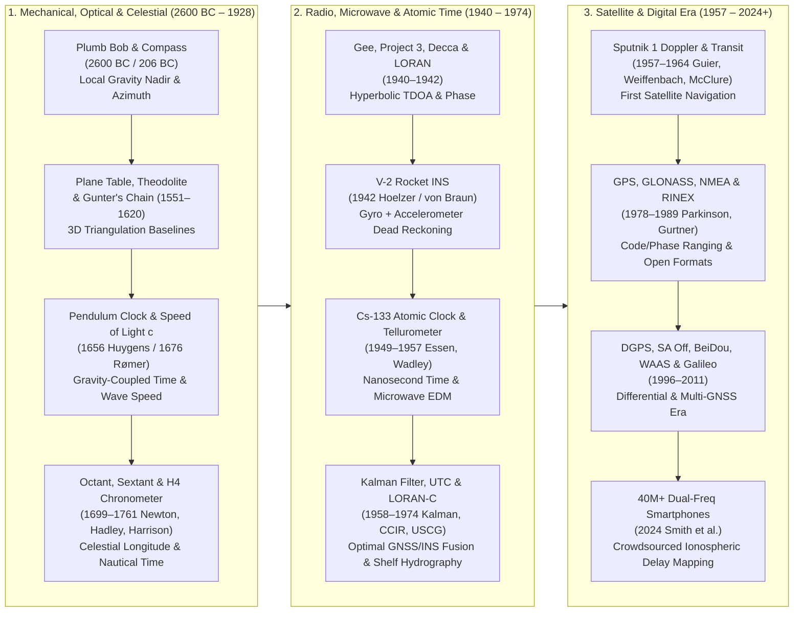

# Chapter 5: Positioning, GNSS, IMU/INS, and the History of Positioning

*A sensor only measures range and angle relative to itself; knowing where the sensor was—and where it was pointing—at the microsecond of measurement is half the battle.*

---

## 5.1 The History of Positioning and Navigation (`gis-history` Deep Dive)

Every Digital Elevation Model (DEM), whether a sub-centimeter terrestrial laser scan of an alpine fault scarp or a full-ocean-depth multibeam bathymetric grid across an abyssal fracture zone, is fundamentally a collection of relative range-and-angle vectors transformed into an Earth-fixed coordinate frame. A laser altimeter or acoustic echo sounder does not measure elevation $H$ or depth $d$ directly; it measures the two-way travel time $\Delta\tau$ of an electromagnetic or acoustic wave along a beam direction defined in the sensor's instantaneous body frame. Converting that raw observation into a georeferenced 3D point requires solving six degrees of freedom—three translational coordinates $(X, Y, Z)$ or $(\varphi, \lambda, h)$ and three rotational attitude angles (roll $\phi$, pitch $\theta$, heading $\psi$)—tagged to a uniform physical time scale $t$.

In the modern error budget of airborne LiDAR and shipborne multibeam echosounder (MBES) surveys, trajectory and attitude uncertainties frequently dominate the Total Propagated Uncertainty (TPU) of the final terrain surface, governed under **IHO S-44**, **NOAA HSSD**, **USGS 3DEP Lidar Base Specification (LBS)**, and **ASPRS Positional Accuracy Standards** by two orthogonal 95% confidence metrics:

$$\text{THU}_{95\%} = 2.4477\,\sigma_{H,\text{horiz}}, \qquad \text{TVU}_{95\%} = 1.9600\,\sigma_z \tag{5.1}$$

where $\text{THU}_{95\%}$ is the 95% circular **Total Horizontal Uncertainty** (assuming isotropic horizontal variance $\sigma_x = \sigma_y = \sigma_{H,\text{horiz}}$, corresponding to $\text{RMSE}_r = \sqrt{2}\,\sigma_{H,\text{horiz}}$ and $1.7308\,\text{RMSE}_r$ under ASPRS standards) and $\text{TVU}_{95\%}$ is the 95% Gaussian **Total Vertical Uncertainty** (termed Non-Vegetated Vertical Accuracy $\text{NVA} = 1.9600\,\text{RMSE}_z$ on land). Understanding how modern geodetic positioning achieves millimeter-to-decimeter uncertainty—and why residual systematic biases still corrupt elevation surfaces—requires tracing the five-millennium co-evolution of metrological length standards, gravity-referenced leveling, celestial and atomic timekeeping, electromagnetic wave propagation, and state-space recursive filtering documented in the `schwehr/gis-history` chronology.



---

### 5.1.1 The Mechanical, Optical, and Celestial Era (c. 2600 BC – 1928)

For the first four millennia of surveying and hydrography, positioning was split into two physically distinct regimes: short-range terrestrial measurement of angles and mechanical chains relative to the local gravity vector, and long-range oceanic navigation referenced to the celestial sphere and mechanical clocks.

#### Gravity Verticals, Magnetic Azimuths, and Optical Triangulation

The oldest surviving positioning instrument is the **Ancient Egyptian plumb bob** (c. 2600 BC; paired at sea with the tallow-armed **sounding lead line** to measure water depth $d$), a stone or bronze weight suspended from a cord that aligns strictly with the local **astronomical vertical**—orthogonal to the equipotential surface of Earth's gravity potential $W(\mathbf{x})$ (where geopotential $W$ decreases upward with orthometric height $H$ so that the downward gravity vector is $\mathbf{g}(\mathbf{x}) = +\nabla W(\mathbf{x})$):

$$\hat{\mathbf{d}}_{\text{plumb}} = +\frac{\nabla W(\mathbf{x})}{\|\nabla W(\mathbf{x})\|} = +\frac{\mathbf{g}(\mathbf{x})}{g(\mathbf{x})} = -\hat{\mathbf{u}}_{\text{astro}} \tag{5.2}$$

where $\hat{\mathbf{d}}_{\text{plumb}}$ is the downward plumb-line nadir unit vector and $\hat{\mathbf{u}}_{\text{astro}} = -\mathbf{g}(\mathbf{x})/g(\mathbf{x})$ is the outward astronomical zenith unit normal (which differs from the geometric ellipsoidal normal $\hat{\mathbf{u}}_{\text{ellip}}$ by the deflection of the vertical $(\xi, \eta)$; Chapter 3). When paired with a right-angled A-frame (*libella*), the plumb line defined the local horizontal plane for leveling temple foundations and resetting Nile floodplain cadastral boundaries after annual inundations. In **206 BC**, during China's **Han dynasty**, diviners carved a spoon-shaped lodestone (**magnetic compass**, or *sinan*) rotating atop a polished bronze plate (*shipan*), providing the first weather-independent azimuthal reference relative to the horizontal component of Earth's geomagnetic field (with magnetic declination later documented by Shen Kuo in 1088).

During the European Renaissance, graphical and trigonometric angle measurement transformed topographic mapping from artistic sketching into rigorous Euclidean geometry:

* **1551 — Abel Foullon's Plane Table (*Holometer* / *Mensula*):** Published in Paris (*Usage et description de l'holomètre*, and further popularized by Gemma Frisius), Foullon's plane table mounted a flat drawing board on a leveled tripod with a sighted straightedge (*alidade*). By occupying two ends of a measured baseline and drawing intersecting rays directly onto parchment in the field, topographers executed graphical forward intersection and three-point resection without calculating trigonometric tables, establishing the primary topographic mapping workflow used by national survey agencies through the early twentieth century.
* **1576 — Digges' and Habermel's Integrated Theodolite:** Building upon the work of his father Leonard Digges (who coined the term *theodelitus* in the 1571 *Pantometria*, expanded by **Thomas Digges** in **1576**), instrument maker **Joshua (Erasmus) Habermel** in **1576** constructed precision brass integrated theodolites combining a $360^\circ$ horizontal azimuth plate with a vertical altitude semicircle. For the first time, surveyors could simultaneously measure horizontal azimuth $\alpha$ and vertical zenith angle $z_v$ (or elevation angle $\beta = 90^\circ - z_v$), enabling 3D triangulation and trigonometric leveling over rugged terrain:
  $$\Delta H_{AB} = s_{AB}\cos z_v + \frac{1 - k_{\text{refr}}}{2 R_\oplus} (s_{AB}\sin z_v)^2 + (h_{\text{inst}} - h_{\text{target}}) \tag{5.3}$$
  where $s_{AB}$ is slope distance ($s_{AB}\sin z_v \approx s_{AB}$ for near-horizontal rays), $R_\oplus \approx 6371\text{ km}$ is Earth's mean radius, $k_{\text{refr}} \approx 0.13$ is the coefficient of atmospheric terrestrial refraction, and $h_{\text{inst}}, h_{\text{target}}$ are instrument and target heights above the ground monuments.
* **1620 — Edmund Gunter's Surveyor's Chain:** Because triangulation networks require at least one physical scale baseline, English mathematician Edmund Gunter introduced a **66-foot wrought-iron chain** ($20.1168\text{ m}$) divided into **100 links** ($1\text{ link} = 7.92\text{ in} = 0.201168\text{ m}$). Gunter's genius was reconciling traditional English land measures with decimal arithmetic: $1\text{ chain} = 4\text{ rods}$ ($22\text{ yd}$), $80\text{ chains} = 1\text{ statute mile}$, and $10\text{ square chains} = 100,000\text{ square links} = 1\text{ acre}$.
* **1894 — David W. Brunton's Pocket Transit:** Patented on September 18, 1894 (U.S. Patent 526,021), Colorado mining engineer David W. Brunton integrated a magnetic induction-damped compass needle, folding peep sights, a hinged sighting mirror with an axial hairline, and a vernier clinometer into a compact aluminum pocket housing. The **Brunton compass** allowed field geologists and reconnaissance topographers to measure both strike azimuth and structural or slope dip angle in a single handheld sighting.

#### Pendulum Clocks, the Speed of Light, and the Marine Longitude Problem

While terrestrial triangulation could propagate coordinates across continents from shore-based baselines, hydrographic survey ships out of sight of land had no stationary reference points. Determining astronomic latitude $\Phi_{\text{astro}}$ required measuring the meridian altitude of the Sun or Polaris above the sea horizon, whereas determining astronomic longitude $\Lambda_{\text{astro}}$ required knowing the exact time difference $\Delta t$ between local apparent solar time and the time at a reference prime meridian.

In **1656**, Dutch physicist **Christiaan Huygens** invented the **pendulum clock** (patented in 1657 and analyzed mathematically in his 1673 *Horologium Oscillatorium*), reducing daily clock drift from $15\text{ minutes}$ to less than $15\text{ seconds}$. For small oscillation amplitudes, the period $T$ of a simple pendulum of length $L$ is governed by local gravity $g$:

$$T = 2\pi\sqrt{\frac{L}{g(\varphi, H)}}, \qquad \frac{\delta T}{T} = \frac{1}{2}\frac{\delta L}{L} - \frac{1}{2}\frac{\delta g}{g} \tag{5.4}$$

Equation (5.4) revealed a profound geodetic coupling: when French astronomer Jean Richer transported a seconds pendulum calibrated in Paris ($\varphi = 48^\circ 50'\text{ N}$) to Cayenne, French Guiana ($\varphi = 4^\circ 56'\text{ N}$) in 1672, the clock lost $2\text{ minutes } 28\text{ seconds}$ per day because equatorial centrifugal acceleration and Earth's oblate equatorial bulge reduce $g$ toward the equator. Thus, the pendulum clock failed at sea (due to vessel roll/pitch accelerations and variable latitude gravity) but became the primary gravimetric instrument for measuring Earth's flattening $f$ and geoid undulation $N$.

Twenty years later, in **1676**, Danish astronomer **Ole Rømer** working at the Paris Observatory with Jean Picard and Giovanni Domenico Cassini analyzed an 8-year time series of eclipses of Jupiter's innermost Galilean moon, **Io** ($T_{\text{Io}} \approx 42.46\text{ hr}$). Rømer demonstrated that eclipses occurred systematically earlier when Earth was near opposition (closest to Jupiter) and later near conjunction (across the diameter $2\,\text{AU}$ of Earth's orbit; Rømer estimated $\Delta t_{\oplus} \approx 22\text{ minutes}$ across $2\,\text{AU}$, compared to the modern value of $16\text{ min } 38\text{ s}$ or $\pm 8.3\text{ min}$ per $\text{AU}$), proving that light travels at a finite velocity:

$$c = \frac{2\,\text{AU}}{\Delta t_{\oplus}} \qquad \left(\text{modern SI definition, 1983: } c \equiv 299,792,458\text{ m s}^{-1}\right) \tag{5.5}$$

Rømer's discovery not only enabled Cassini and Picard to determine the longitudes of terrestrial observatories using simultaneous timing of Io's eclipses, but also established the fundamental physical constant converting electromagnetic time-of-flight into spatial distance across all modern EDM, LiDAR, synthetic aperture radar, and GNSS systems.

To solve celestial navigation at sea, **Isaac Newton** invented the **reflecting quadrant** in **1699** (communicated to Edmond Halley, who left it unpublished until 1742), and in **1731** Englishman **John Hadley** and American glazier **Thomas Godfrey** independently constructed the double-reflecting **octant** (expanded in **1757** by Captain John Campbell to a $120^\circ$ arc **marine sextant**). By reflecting the star or Sun off a movable index mirror onto a half-silvered horizon glass, the angle between the celestial body and the sea horizon is twice the mirror rotation angle ($\alpha = 2\theta_{\text{mirror}}$). Crucially, because both the horizon ray and the doubly reflected celestial ray pitch together within the instrument's vertical plane, a hydrographic observer on a heaving deck could hold the star image tangent to the sea horizon and measure vertical altitudes to $\pm 0.2'$ ($\sim 370\text{ m}$ in latitude). In nearshore hydrographic surveying (as codified in Jean-Henri Hawley's **1928 USC&GS *Hydrographic Manual***, Special Publication 143), two observers held sextants *horizontally* to simultaneously measure the two horizontal angles $(\alpha_{12}, \alpha_{23})$ between three surveyed shore signals, plotting the boat's position via a mechanical **three-arm protractor**—subject to the classic **danger circle** geometric degeneracy whenever the survey launch crossed the circumcircle passing through all three shore stations.

The missing link for open-ocean marine longitude was solved in **1761** when Yorkshire carpenter and self-taught horologist **John Harrison** completed his fourth sea watch, **H4**—a $13\text{ cm}$-diameter pocket-watch-style **marine chronometer** employing a temperature-compensated bimetallic curb, low-friction diamond pallets, and a high-frequency ($5\text{ Hz}$) balance wheel driven by a constant-force *remontoire*. On its 1761–1762 sea trial aboard HMS *Deptford* from Portsmouth to Kingston, Jamaica, H4 lost only $\Delta t = 5.1\text{ s}$ over $81\text{ days}$, corresponding to an equatorial longitude error of less than $2\text{ nautical miles}$:

$$\Delta\lambda = \omega_\oplus \Delta t, \qquad \delta x_{\text{lon}} = R_\oplus \cos\varphi \, \omega_\oplus \delta t \tag{5.6}$$

where Earth's sidereal/solar rotation rate is $\omega_\oplus \approx 7.292115 \times 10^{-5}\text{ rad s}^{-1}$ ($15''\text{ of arc per second of time}$, or $463.8\text{ m s}^{-1}\cos\varphi$). For the next 180 years, offshore lead-line soundings published on Admiralty and U.S. Coast Survey charts were georeferenced exclusively via sextant sights and banks of marine chronometers.

As global shipping and wireless telegraphy expanded, the **1917 Anglo-French Conference on Time-Keeping at Sea** established **nautical time zones**, dividing the globe into 24 $15^\circ$-wide longitudinal belts (`Z` centered on Greenwich, `-1` to `-12` East, `+1` to `+12` West) so ships could maintain hourly integer offsets from Greenwich Mean Time (GMT). Finally, to eliminate a hazardous $12\text{ hr}$ ambiguity—astronomers had historically begun the GMT day at *noon* so night observations fell on a single date, whereas civil and hydrographic navigators began the day at *midnight*—the **International Astronomical Union (IAU)** at its **1928** General Assembly in Leiden formally adopted **Universal Time (UT)** referenced to $00\text{:00}$ midnight at the Greenwich meridian.

---

### 5.1.2 The Radio, Microwave, and Atomic Time Era (1940 – 1974)

World War II and the Cold War forced a paradigm shift: celestial sights failed in cloud cover and fog, and intercontinental missiles and offshore hydrographic surveys required continuous, all-weather positioning. Engineers replaced optical star sights with radio waves, inertial mechanics, and quantum atomic transitions.

#### Hyperbolic Radio Navigation: Gee, Project 3, Decca, LORAN, and CHAYKA

In **1940**, British engineer Robert J. Dippy at the Telecommunications Research Establishment (TRE) developed **Gee** (VHF pulses at $20\text{–}85\text{ MHz}$), while the U.S. National Defense Research Committee (NDRC) Microwave Committee launched **Project 3** (soon transferred to the MIT Radiation Laboratory under Alfred L. Loomis and J. A. Pierce), introducing **hyperbolic pulsed radio navigation**. Instead of measuring the absolute round-trip travel time from a transceiver to a target (radar), a passive receiver on an aircraft or survey ship measured the **Time Difference of Arrival (TDOA)** $\Delta\tau_{MS} = \tau_S - \tau_M$ between synchronized radio pulses transmitted by a Master station at known coordinates $\mathbf{p}_M$ and a Secondary (slave) station at $\mathbf{p}_S$ (transmitting after a known total emission delay $\tau_{\text{code}}$, equal to the baseline propagation time plus a fixed coding delay).

Multiplying the corrected time difference by the effective phase/group velocity $v_p = c / n_{\text{eff}}$ yields a constant difference of geometric ranges $\Delta R_{MS}$, whose locus in 3D space is a hyperboloid of revolution (and on the reference ellipsoid, a **hyperbolic line of position** with foci at $\mathbf{p}_M$ and $\mathbf{p}_S$):

$$\Delta R_{MS} = \|\mathbf{p} - \mathbf{p}_S\| - \|\mathbf{p} - \mathbf{p}_M\| = \frac{c}{n_{\text{eff}}}\left(\Delta\tau_{MS} - \tau_{\text{code}}\right) \tag{5.7}$$

Intersecting two hyperbolic lines of position from two master–secondary pairs fixes the horizontal coordinates $(\varphi, \lambda)$. Taking the spatial gradient of Equation (5.7) with respect to the horizontal vessel position $\mathbf{p}$ yields $\nabla_{\mathbf{p}}(\Delta R_{MS}) = \hat{\mathbf{u}}_S - \hat{\mathbf{u}}_M$, where $\hat{\mathbf{u}}_S, \hat{\mathbf{u}}_M$ are unit vectors pointing from the Secondary and Master stations to the vessel, separated by the baseline crossing angle $\beta_{MS}$ ($\hat{\mathbf{u}}_S \cdot \hat{\mathbf{u}}_M = \cos\beta_{MS}$). Because $\|\nabla_{\mathbf{p}}(\Delta R_{MS})\| = \sqrt{2 - 2\cos\beta_{MS}} = 2\sin(\beta_{MS}/2)$, the spacing between adjacent hyperbolas widens away from the baseline, amplifying timing noise $\sigma_{\Delta\tau}$ into a $1\sigma$ line-of-position error $\sigma_{\text{LOP}}$:

$$\sigma_{\text{LOP}} = \frac{\sigma_{\Delta R_{MS}}}{\|\nabla_{\mathbf{p}}(\Delta R_{MS})\|} = \frac{c\,\sigma_{\Delta\tau}}{2 n_{\text{eff}} \sin(\beta_{MS}/2)} \tag{5.8}$$

Along the baseline extension behind either transmitter ($\beta_{MS} \to 0$), $\sin(\beta_{MS}/2) \to 0$ and horizontal geometric dilution of precision diverges to infinity—a fundamental geometric singularity shared by all terrestrial radio and underwater acoustic baseline networks.

In **1942**, two landmark maritime hyperbolic systems emerged simultaneously:

1. **The Decca Navigator System (1942):** Conceived in the United States by William J. O'Brien and Harvey F. Schwarz and developed in Britain by the Decca Record Company (first used operationally on June 5–6, 1944, to guide minesweepers across the English Channel on D-Day), Decca transmitted unmodulated **continuous-wave (CW)** signals from a Master ($f_0 \approx 85\text{ kHz}$) and three harmonically locked Secondary stations (**Red**, **Green**, **Purple** at $6f_0/5$, $9f_0/8$, $5f_0/6$). By multiplying the received signals to a common comparison frequency ($24f_0$, $18f_0$, $30f_0$) and measuring fractional phase difference $\Delta\phi \in [0, 2\pi)$ on mechanical *Decometer* dials, Decca achieved sub-lane precisions of $5\text{–}25\text{ m}$ at ranges up to $300\text{ km}$—becoming the standard positioning system for European continental-shelf hydrographic charting for four decades.
2. **LORAN (LOng RAnge Navigation, 1942):** Evolved directly from MIT Rad Lab's Project 3, **LORAN-A** transmitted $1.75\text{–}1.95\text{ MHz}$ pulses read on a dual-trace cathode-ray oscilloscope, providing $500\text{–}1500\text{ km}$ coverage across the North Atlantic and Pacific theatres.

To achieve both the long range of low-frequency groundwaves and the fine precision of phase comparison, the U.S. developed **LORAN-C** in the late 1950s at a carrier frequency of $f_c = 100\text{ kHz}$ ($\lambda_c = 3000\text{ m}$), paralleled in **1969** by the Soviet Union's compatible $100\text{ kHz}$ **CHAYKA** system. LORAN-C and CHAYKA receivers tracked the zero-crossing of the **third cycle** ($30\,\mu\text{s}$ into the pulse envelope)—early enough to measure the stable surface groundwave before the arrival of ionospheric skywaves (which arrive $\ge 35\,\mu\text{s}$ later), while resolving $100\text{ kHz}$ carrier phase to $\sim 0.02\text{–}0.1\,\mu\text{s}$ ($6\text{–}30\text{ m}$). In **1974**, the U.S. Coast Guard designated **LORAN-C** as the primary federally provided civilian maritime radionavigation system for the U.S. Coastal Confluence Zone (codified for automated hydrographic logging in Melvin J. Umbach's **1976 NOAA *Hydrographic Manual***, 4th Edition).

> [!WARNING]
> **Legacy Bathymetric Datum Shifts from LORAN-C Additional Secondary Factor (ASF)**
> Nearly all pre-1990 offshore bathymetric soundings (including early SeaBeam multibeam swaths and single-beam hydrographic smooth sheets archived in NOAA NCEI and GEBCO) were positioned using LORAN-C or Decca. While LORAN-C had $15\text{–}30\text{ m}$ *repeatable* precision, its *absolute* geodetic accuracy was biased by $50\text{–}400\text{ m}$ due to the **Additional Secondary Factor (ASF)**—the extra phase delay incurred when the $100\text{ kHz}$ groundwave propagates across land paths of finite electrical conductivity ($\sigma_{\text{land}} \sim 10^{-3}\text{ S m}^{-1}$) before reaching seawater ($\sigma_{\text{sea}} \approx 4\text{ S m}^{-1}$). When merging legacy 1970s–1980s LORAN-C bathymetry with modern GNSS-referenced multibeam surveys, practitioners must never treat the legacy horizontal coordinates as bias-free; unmodeled ASF land-path delays manifest as systematic horizontal offsets of submarine canyon walls and seamount flanks that masquerade as vertical depth errors $\delta z \approx -\nabla z_{\text{topo}} \cdot \delta\mathbf{x}_{\text{ASF}}$ on steep slopes.

#### Inertial Navigation, Atomic Clocks, Microwave EDM, and the Kalman Filter

While radio navigation relied on external transmitters vulnerable to jamming or skywave interference, **1942** also witnessed the birth of autonomous **Inertial Navigation Systems (INS)**. At the German Army Research Center Peenemünde, **Helmut Hoelzer** (working under **Wernher von Braun**, with guidance engineers Fritz Mueller and Ernst Steinhoff) designed the guidance and control system for the **A-4 (V-2) ballistic rocket**, which made its first successful flight on October 3, 1942. The V-2 inertial package combined two 2-degree-of-freedom mechanical gyroscopes (*Horizont* for pitch/yaw and *Vertikant* for roll/azimuth stabilization) with a **Pendulous Integrating Gyro Accelerometer (PIGA)** and Hoelzer's *Mischgerät*—the world's first onboard fully electronic analog computer, which used resistor-capacitor (RC) operational networks to differentiate and integrate attitude errors and cut off thrust when integrated velocity reached target burnout.

Inertial navigation exploits Newton's second law inside a non-rotating inertial frame $i$: by Einstein's equivalence principle, a proof-mass accelerometer cannot distinguish kinematic acceleration $\ddot{\mathbf{r}}^i$ from gravitational attraction $\mathbf{g}^i$, and therefore measures **specific force** $\mathbf{f}^i = \ddot{\mathbf{r}}^i - \mathbf{g}^i$. Rotating the body-frame specific force $\mathbf{f}^b$ via the gyroscope-tracked rotation matrix $\mathbf{R}_b^i(t)$ and adding a gravity model $\mathbf{g}^i(\mathbf{r}^i)$ yields velocity and position by double integration:

$$\mathbf{v}^i(t) = \mathbf{v}^i(0) + \int_0^t \left[\mathbf{R}_b^i(\tau)\mathbf{f}^b(\tau) + \mathbf{g}^i(\mathbf{r}^i(\tau))\right] d\tau, \qquad \mathbf{r}^i(t) = \mathbf{r}^i(0) + \int_0^t \mathbf{v}^i(\tau)\,d\tau \tag{5.9}$$

Because an uncompensated accelerometer bias $b_a$ integrates quadratically with time ($\delta r \propto \frac{1}{2}b_a t^2$) and a gyroscope angular rate bias $b_g$ tilts the gravity vector into the horizontal channel ($\delta r \propto \frac{1}{6} g\, b_g t^3$), pure inertial navigation exhibits unbounded long-term drift, even though its millisecond-scale relative attitude and position fidelity are unmatched.

Meanwhile, physicists shattered the mechanical limits of timekeeping and baseline measurement:

* **1949 & 1955–1956 — Ammonia and Cesium Atomic Clocks (*Atomichron*):** In **1949**, **Harold Lyons** at the U.S. National Bureau of Standards (NBS) built the first atomic clock, stabilizing a quartz crystal oscillator to the $23.87\text{ GHz}$ microwave inversion transition of the ammonia ($\text{NH}_3$) molecule. In June **1955**, **Louis Essen** and **Jack V. L. Parry** at the UK National Physical Laboratory (NPL) operated the first practical **cesium-133 ($\text{}^{133}\text{Cs}$) atomic beam standard**, followed in **1956** by the **Atomichron** (NC-1001), engineered by MIT physicist **Jerrold R. Zacharias** and the National Company as the first commercial, transportable cesium atomic clock. By locking an oscillator to the ground-state hyperfine transition of $^{133}\text{Cs}$ ($\Delta\nu_{\text{Cs}} = 9,192,631,770\text{ Hz}$, adopted in 1967 to define the SI second), atomic clocks lowered fractional frequency instability $\sigma_y(\tau)$ from $10^{-8}$ (quartz) to $10^{-11}\text{–}10^{-14}$. Because range error scales as $\delta\rho = c\,\delta t$, a $1\text{ ns}$ ($10^{-9}\text{ s}$) atomic clock stability equates to a $0.2998\text{ m}$ one-way ranging precision. In **1960**, the International Radio Consultative Committee (CCIR) and Bureau International de l'Heure (BIH) inaugurated **Coordinated Universal Time (UTC)**, synchronizing national atomic time scales with Earth rotation (formalized with integer leap seconds in 1972).
* **1957 — Trevor Wadley's Tellurometer (Microwave EDM):** Up to the mid-1950s, national geodetic control networks still relied on painstakingly stretching $24\text{ m}$ invar wires under tension across cleared valleys to establish scale baselines. In **1957**, South African physicist **Trevor L. Wadley** at the Council for Scientific and Industrial Research (CSIR) introduced the **Tellurometer (`MRA 1`)**, the first microwave **Electronic Distance Measurement (EDM)** instrument. Operating on a $3\text{ GHz}$ ($10\text{ cm}$) carrier modulated by four fine-to-coarse pattern frequencies around $f_m = 10\text{ MHz}$ ($\lambda_m / 2 \approx 15\text{ m}$), a Master unit and active Remote transponder measured two-way phase shift $\Delta\phi$ across lines of sight up to $50\text{ km}$ through fog and haze:
  $$D = \frac{c}{2 n_{\text{air}}(P_d, T, e) f_m} \left( N_{\text{cycles}} + \frac{\Delta\phi}{2\pi} \right), \qquad N_{\text{refr}} = (n_{\text{air}} - 1)\times 10^6 = \frac{77.6 P_d}{T} + \frac{72 e}{T} + \frac{3.75\times 10^5 e}{T^2} \tag{5.10}$$
  where $n_{\text{air}}$ is the **Essen–Froome (1951) / Smith–Weintraub (1953)** microwave refractive index of air as a function of dry air pressure $P_d = P - e$ ($\text{hPa}$), water vapor partial pressure $e$ ($\text{hPa}$), and absolute temperature $T$ ($\text{K}$). The Tellurometer allowed geodetic survey crews to measure $40\text{ km}$ trilateration legs to $1.5\text{ cm} \pm 3\text{ ppm}$ in 30 minutes rather than 30 days—and highlighted that unmodeled water vapor $e$ (the $3.75\times 10^5 e / T^2$ wet dipole term) is the primary refractive error source for microwave ranging, a physical truth that governs GNSS vertical height determination to this day (Section 5.2).
* **1958–1960 — Swerling, Kalman, and Schmidt's Recursive State-Space Filter:** Following **Peter Swerling's (1958)** stage-wise recursive least-squares formulation for satellite orbit determination at RAND, mathematician **Rudolf E. Kálmán** conceived a general recursive time-domain state-space algorithm for minimum-variance linear estimation in late **1958**, presenting it at NASA Ames Research Center in 1959 and publishing his seminal paper in March **1960** (*"A New Approach to Linear Filtering and Prediction Problems"*). At NASA Ames, **Stanley F. Schmidt** immediately recognized that linearizing Kálmán's equations around the current state estimate—creating the **Extended Kalman Filter (EKF)**—solved the Apollo lunar navigation problem by optimally fusing continuous, drifting inertial measurements with discrete, noisy optical/radio position fixes. Every modern loosely or tightly coupled GNSS/INS trajectory processor (`POSPac MMS`, `Inertial Explorer`) and underwater AUV navigation filter is a direct implementation of the Kalman–Schmidt state estimator (Section 5.3).

---

### 5.1.3 The Satellite and Digital Era (1957 – Present)

#### From Sputnik 1 Doppler Shift to Transit, GPS, and Multi-GNSS

The space age of positioning began unexpectedly on **October 4, 1957**, when the Soviet Union launched **Sputnik 1**. Within three days, two young physicists at the Johns Hopkins University Applied Physics Laboratory (APL), **William H. Guier** and **George C. Weiffenbach**, tuned a phase-locked receiver to Sputnik's $20.005\text{ MHz}$ continuous-wave signal and recorded the S-shaped **Doppler frequency shift** $\Delta f(t)$ as the satellite passed overhead:

$$\Delta f(t) = f_{\text{rx}}(t) - f_0 = -\frac{f_0}{c}\dot{\rho}(t) = -\frac{f_0}{c} \frac{\left(\mathbf{r}^s(t) - \mathbf{r}_r(t)\right) \cdot \left(\mathbf{v}^s(t) - \mathbf{v}_r(t)\right)}{\|\mathbf{r}^s(t) - \mathbf{r}_r(t)\|} \tag{5.11}$$

Notice the physical geometry embedded in Equation (5.11): the inflection point where $\Delta f(t_{ca}) = 0$ marks the exact time of closest approach ($\dot{\rho} = 0$), and the maximum slope $|\ddot{\rho}(t_{ca})| = c |\frac{d(\Delta f)}{dt}| / f_0 = v_{\text{rel}}^2 / \rho_{\text{min}}$ is inversely proportional to the slant range at closest approach $\rho_{\text{min}}$. By combining this range and time with orbital dynamics, Guier and Weiffenbach computed Sputnik's complete orbital trajectory from a single pass. In March 1958, APL's **Frank T. McClure** posed the inverse question: *if the satellite's orbit $\mathbf{r}^s(t)$ is precisely known, can a receiver on a submarine or survey ship determine its unknown position $\mathbf{r}_r$ from the Doppler curve of a single pass?*

The answer became the U.S. Navy **Transit** system (also known as **NAVSAT**, first experimental launch 1959, first successful orbital test `Transit 1B` in April 1960, operational for Polaris submarines in 1964, and declassified for civilian oceanographic research vessels and geodetic land surveyors in 1967). Operating in polar Low Earth Orbit ($h \approx 1100\text{ km}$) and transmitting coherent dual frequencies ($150\text{ MHz}$ and $400\text{ MHz}$ to cancel first-order dispersive ionospheric refraction), Transit provided a $25\text{–}200\text{ m}$ position fix every $60\text{–}110\text{ minutes}$ at sea (and sub-meter 3D coordinates when averaged over dozens of passes on land, establishing the World Geodetic System **WGS 72** and **WGS 84**).

However, Transit had two severe limitations for kinematic elevation mapping: fixes were intermittent (requiring dead-reckoning interpolation by ship's log and gyrocompass between satellite passes), and an uncompensated $1\text{ knot}$ ($0.514\text{ m s}^{-1}$) vessel velocity error in the North–South (along-track) direction shifted the solved East–West position by $\sim 400\text{ m}$. To provide instantaneous, continuous 3D position, velocity, and time, the U.S. Department of Defense synthesized three competing concepts—the Naval Research Laboratory's **Timation** atomic-clock satellites (Roger L. Easton), the Air Force's **Program 621B** pseudorandom noise (PRN) code-division multiple access signals (Ivan A. Getting and Phil Diamond at Aerospace Corp.), and APL's **Transit** ephemeris infrastructure—into the **Navstar Global Positioning System (GPS)** under Joint Program Office director **Bradford W. Parkinson** in 1973.

A rapid succession of satellite constellations, open digital data standards, and augmentation networks followed:

* **1978 — GPS Block I Launch:** On **February 22, 1978**, the first prototype satellite `Navstar 1` (SVN 1) launched into Medium Earth Orbit ($a \approx 26,560\text{ km}$, $T \approx 11\text{ hr } 58\text{ min}$), broadcasting on dual L-band frequencies (`L1` at $1575.42\text{ MHz}$ and `L2` at $1227.60\text{ MHz}$). By simultaneously tracking pseudoranges to at least four satellites, a receiver solves for 3D Earth-Centered, Earth-Fixed coordinates $(X_r, Y_r, Z_r)$ and receiver clock offset $dt_r$.
* **1982 — Soviet GLONASS Launch:** On **October 12, 1982**, the Soviet Union launched the first **GLONASS** prototype (`Kosmos 1413`), establishing a complementary 24-satellite MEO constellation ($h \approx 19,100\text{ km}$, $i = 64.8^\circ$ inclination providing superior high-latitude geometry over polar ice sheets and Arctic bathymetric surveys).
* **1983/1984 — NMEA 0183 Protocol:** Released by the **National Marine Electronics Association** (v1.0 in 1983, standardized across marine electronics in 1984), **NMEA 0183** defined a human-readable, comma-delimited ASCII serial protocol (`$GPGGA`, `$GPRMC`, `$SDDBT`, `$HEHDT`) transmitted at $4800\text{ baud}$ over EIA-232/422 interfaces. NMEA 0183 became the universal digital glue linking GPS/LORAN receivers, gyrocompasses, and digital echo sounders on hydrographic launches.
* **1986 — Etak Navigator:** Created by **Stan Honey** and **Ken Milnes**, the **Etak Navigator** was the first commercial in-car digital navigation system, predating widespread GPS availability. It combined differential wheel-tick odometers and a solid-state fluxgate magnetometer (dead reckoning) with continuous topological **map-matching** against vector street graphs stored on $3.5\text{ MB}$ digital cassette tapes, displayed on a CRT vector monitor—pioneering the terrain- and network-constrained trajectory matching algorithms later adapted for autonomous vehicles and bathymetric terrain-aided navigation (Chapter 6).
* **1989 — Founding of Garmin and the RINEX Standard:** Two milestones in 1989 democratized both consumer and geodetic satellite positioning:
  1. Electrical engineers **Gary Burrell** and **Min H. Kao** founded **ProNav** in October **1989** in Lenexa, Kansas (renamed **Garmin** in 1991), releasing the `GPS 100` marine aviation panel receiver and pioneering affordable, ruggedized receivers for field GIS and hydrography.
  2. At the Astronomical Institute of the University of Bern, **Werner Gurtner** (with Gerald Mader) developed **RINEX (Receiver Independent Exchange format)** in **1989**. Prior to RINEX, survey-grade GPS receivers (Texas Instruments `TI-4100`, Macrometer, Trimble `4000`, Ashtech, Wild Magnavox) recorded incompatible binary streams, making it impossible to process carrier-phase baselines between mixed hardware. RINEX decoupled hardware acquisition from scientific post-processing, enabling global International GNSS Service (IGS) networks and open-source kinematic engines (`RTKLIB`, `PRIDE PPP-AR`).
* **1996 — U.S. Coast Guard Maritime Differential GPS (DGPS):** To overcome early GPS error sources—especially **Selective Availability (SA)**, an intentional dithering of the broadcast GPS satellite clock ($\delta\text{-process}$) and ephemeris ($\epsilon\text{-process}$) introduced in March 1990 that degraded civilian horizontal accuracy to $\sim 50\text{–}100\text{ m}$ ($95\%$) and vertical accuracy to $\sim 100\text{–}150\text{ m}$—the U.S. Coast Guard declared Initial Operational Capability (IOC) for its nationwide **Maritime DGPS** network in **1996** (Full Operational Capability in March 1999). Reference stations at surveyed coastal lighthouses computed real-time pseudorange and range-rate corrections and broadcast them in **RTCM SC-104** format over existing $285\text{–}325\text{ kHz}$ marine radiobeacons, restoring $1\text{–}3\text{ m}$ horizontal accuracy for harbor and coastal multibeam surveys (as codified in the **1997 NOAA *Field Procedures Manual* [FPM], 1st Edition**).
* **2000 — Termination of GPS Selective Availability & BeiDou-1 Launch:** Following the White House directive announced on **May 1, 2000** by U.S. President Bill Clinton, GPS **Selective Availability (SA) was permanently turned off** at **04:00 UTC on May 2, 2000** (midnight EDT; `SA = 0`). Overnight, autonomous civilian pseudorange error dropped by nearly an order of magnitude (from $\sim 50\text{–}100\text{ m}$ to $\sim 5\text{–}10\text{ m}$ horizontally), igniting the consumer GPS, geotagged photography, and UAV mapping revolutions. Later that year, on **October 31, 2000**, China launched `BeiDou-1A`, the first geostationary satellite of the experimental **BeiDou** regional navigation system (which evolved into the global 35-satellite **BDS-3** constellation completed in 2020).
* **2002 — GPSBabel:** Created by **Robert Lipe** in **2002**, the open-source command-line utility **`GPSBabel`** solved the proliferation of proprietary consumer and survey tracklog formats (`.gdb`, `.mps`, `.wpt`, NMEA logs), translating them seamlessly into standardized **GPX (GPS Exchange Format)** and **KML** for GIS ingestion.
* **2003 — FAA Wide Area Augmentation System (WAAS):** Commissioned on **July 10, 2003**, **WAAS** inaugurated operational Space-Based Augmentation Systems (SBAS; alongside Europe's EGNOS, Japan's MSAS, and India's GAGAN). Ground reference stations compute separate satellite orbit, clock, and $5^\circ \times 5^\circ$ **Ionospheric Grid Point (IGP)** vertical delay corrections and broadcast them via geostationary satellites on the GPS `L1` frequency, enabling $\sim 1.0\text{ m}$ horizontal and $\sim 1.5\text{ m}$ vertical positioning without local base stations.
* **2011 — European Galileo IOV Launch:** On **October 21, 2011**, the European Space Agency launched the first two **Galileo In-Orbit Validation (IOV)** satellites (`GSAT0101` and `GSAT0102`), introducing onboard **Passive Hydrogen Masers (PHMs)** with fractional clock stabilities below $10^{-14}$ and low-noise `E1/E5a/E5b/E6` AltBOC modulations that cut code multipath to the decimeter level.
* **2024 — Mapping the Global Ionosphere with 40+ Million Smartphones:** Following Google's release of the raw `GnssMeasurement` API in Android 7 (2016) and the introduction of dual-frequency (`L1/L5`, `E1/E5a`) Broadcom/Qualcomm GNSS chipsets in mass-market phones (2018), **Smith et al. (2024)** at Google Research published a landmark study in *Nature* demonstrating the aggregation of de-identified dual-frequency carrier-to-code and differential pseudorange observables from **over 40 million Android smartphones** worldwide. Because the first-order ionospheric group delay $I_f$ (in $\text{m}$) is dispersive (inversely proportional to carrier frequency squared, $I_f = +\frac{40.308}{f^2}\text{STEC}$, where $40.308\text{ m}^3\text{ s}^{-2}\text{ el}^{-1}$ is the plasma frequency constant), forming the geometry-free linear combination between `L1` ($f_{L1} = 1575.42\text{ MHz}$) and `L5` ($f_{L5} = 1176.45\text{ MHz}$) directly isolates Slant Total Electron Content ($\text{STEC}$, in $\text{el m}^{-2}$, where $1\text{ TECU} = 10^{16}\text{ el m}^{-2}$):
  $$\text{STEC} = \frac{1}{40.308}\left(\frac{f_{L1}^2 f_{L5}^2}{f_{L1}^2 - f_{L5}^2}\right)\left(P_{L5} - P_{L1} - b_{\text{DCB}}\right) \approx 7.762 \times 10^{16}\,\text{el m}^{-3}\left(P_{L5} - P_{L1} - b_{\text{DCB}}\right) \tag{5.12}$$
  where $P_{L1}, P_{L5}$ are pseudoranges (in $\text{m}$, with $P_{L5} - P_{L1} > 0$ because the lower frequency $f_{L5} < f_{L1}$ experiences a larger group delay: $0.1288\text{ m}$ of differential `L5 - L1` delay and $0.1624\text{ m}$ of `L1` range delay per $\text{TECU}$) and $b_{\text{DCB}}$ is the combined satellite-plus-smartphone Differential Code Bias. By calibrating $b_{\text{DCB}}$ across millions of handsets simultaneously, smartphone crowdsourcing doubled the spatial coverage of traditional scientific GNSS receiver arrays across Africa, South America, and South Asia, resolving equatorial plasma bubbles and geomagnetic storm gradients that otherwise corrupt single-frequency GNSS elevation measurements by several meters.

---

### 5.1.4 Historical Evolution of Positioning Uncertainty and Survey Impact

Table 5.1 summarizes how five millennia of positioning breakthroughs progressively compressed horizontal ($\text{THU}_{95\%}$) and vertical ($\text{TVU}_{95\%}$) uncertainties for both terrestrial and marine elevation mapping, and how these eras map to modern survey standards (**IHO S-44**, **NOAA HSSD / FPM**, **USGS 3DEP LBS**, and **ASPRS Positional Accuracy Standards**).

| Era & Milestone | Primary Observable & Physical Constant | Typical $\text{THU}_{95\%}$ (Horizontal) | Typical $\text{TVU}_{95\%}$ (Vertical) | Impact on Topographic & Bathymetric DEMs & Standards |
| :--- | :--- | :--- | :--- | :--- |
| **Plumb Bob, Plane Table & Theodolite** (2600 BC – 1620) | Gravity vertical $\mathbf{g} = \nabla W$; optical angles $\alpha, z_v$; Gunter's chain ($20.12\text{ m}$) | $0.05\text{–}5\text{ m}$ (local baseline network) | $0.01\text{–}0.5\text{ m}$ (spirit / trig leveling) | First contour maps and national triangulation nets; nearshore three-point horizontal sextant fixes (1928 USC&GS *Hydrographic Manual*). |
| **Sextant & H4 Marine Chronometer** (1699 – 1761) | Celestial altitude $2\theta_{\text{mirror}}$; UT time $\Delta\lambda = \omega_\oplus \Delta t$ | $1,000\text{–}5,000\text{ m}$ (open ocean) | N/A (coastal tide-table reduction only) | Georeferenced 18th–19th century lead-line hydrographic charts (assigned **IHO CATZOC D/U** in modern Electronic Navigational Charts). |
| **Gee, Decca, LORAN-A/C & CHAYKA** (1940 – 1974) | Pulsed TDOA $\Delta\tau$ & CW phase $\Delta\phi$ ($v_p = c/n_{\text{eff}}$) | $20\text{–}400\text{ m}$ (continental shelf) | N/A (2D hyperbolic surface wave) | Enabled all-weather postwar continental shelf single-beam & early multibeam surveys (1976 NOAA *Hydrographic Manual* 4th Ed.); subject to overland ASF bias. |
| **Tellurometer Microwave EDM** (1957) | Two-way $3\text{ GHz}$ modulated phase $\Delta\phi$ ($n_{\text{air}}(P_d,T,e)$) | $0.015\text{ m} + 3\text{ ppm}$ ($30\text{–}50\text{ km}$ lines) | $0.05\text{–}0.20\text{ m}$ (with trig leveling) | Replaced invar tapes; scaled continental geodetic control (NAD27 $\to$ NAD83) for photogrammetric DEM blocks. |
| **Sputnik Doppler & Transit NAVSAT** (1957 – 1967) | Integrated radial Doppler shift $\Delta f = -f_0 \dot{\rho}/c$ | $25\text{–}200\text{ m}$ (single pass at sea) | $0.5\text{–}2.0\text{ m}$ (multi-day static average) | First global all-weather deep-ocean positioning for early SeaBeam multibeam ships; defined **WGS 72** and **WGS 84**. |
| **GPS / GLONASS with SA Active** (1978 – May 2000) | L-band PRN code pseudorange $P = c\,\Delta\tau$ (dithered clock) | $50\text{–}100\text{ m}$ (autonomous) | $100\text{–}150\text{ m}$ (autonomous) | Prompted **USCG Maritime DGPS** ($1996$, $1\text{–}3\text{ m}$ $\text{THU}$, 1997 NOAA FPM) and **RINEX** ($1989$) differential post-processing. |
| **Post-SA GPS, WAAS, Multi-GNSS & RTK/PPK + INS** (2000 – 2024+) | Undifferenced / double-differenced carrier phase $\Phi$ + IMU specific force $\mathbf{f}^b$ & angular rate $\boldsymbol{\omega}_{ib}^b$ | $0.01\text{–}0.05\text{ m}$ (RTK/PPK/PPP-AR) | $0.02\text{–}0.08\text{ m}$ (ellipsoidal height $h$) | Direct georeferencing meeting **USGS 3DEP QL1/QL2** ($\text{RMSE}_z \le 10\text{ cm}$), **ASPRS Class I–III**, **IHO S-44 Exclusive/Special Order**, and **2020 NOAA FPM / HSSD** Ellipsoidally Referenced Surveys (**ERS**). |

#### Worked Numerical Example: How Historical Timekeeping Errors Propagate into Position and Elevation Errors

To appreciate why positioning accuracy hinges on clock stability, consider three historical milestones at latitude $\varphi = 45^\circ\text{ N}$ ($\cos 45^\circ = 0.7071$, $R_\oplus = 6,371,000\text{ m}$):

1. **1761 Marine Chronometer (Celestial Longitude):** Suppose a hydrographic survey vessel after 60 days at sea has an accumulated chronometer time error of $\delta t_{\text{chron}} = 4.0\text{ s}$ relative to UT. By Equation (5.6), the induced East–West position bias is:
   $$\delta x_{\text{lon}} = R_\oplus \cos(45^\circ) \, \omega_\oplus \, \delta t_{\text{chron}} = (6.371\times 10^6\text{ m})(0.7071)(7.292115\times 10^{-5}\text{ rad s}^{-1})(4.0\text{ s}) = 1,313.9\text{ m}$$
   If this vessel sounds a continental slope with a $10^\circ$ ($\tan 10^\circ = 0.1763$) eastward dip, a $1,313.9\text{ m}$ horizontal shift produces a chart depth error of $\delta d = 1313.9 \times \tan 10^\circ = 231.7\text{ m}$—even if the sounding line itself was measured with zero vertical error!
2. **1974 LORAN-C Hyperbolic TDOA:** Suppose a coastal survey ship tracks two independent $100\text{ kHz}$ LORAN-C master–secondary pairs intersecting at right angles ($\theta_{\text{cut}} = 90^\circ$) with baseline crossing angles $\beta_{MS} = 60^\circ$ ($\sin(\beta_{MS}/2) = \sin 30^\circ = 0.5$), a timing jitter of $\sigma_{\Delta\tau} = 0.05\,\mu\text{s}$ ($50\text{ ns}$), and an uncalibrated overland ASF delay bias of $\Delta\tau_{\text{ASF}} = 0.60\,\mu\text{s}$ ($600\text{ ns}$). From Equation (5.8), the random $1\sigma$ line-of-position precision (which equals $\sigma_{H,\text{horiz}}$ for orthogonal independent LOPs) is:
   $$\sigma_{\text{LOP}} = \frac{(2.9979\times 10^8\text{ m s}^{-1})(50\times 10^{-9}\text{ s})}{2(1.0003)(0.5)} \approx 15.0\text{ m} \implies \text{THU}_{95\%,\text{random}} \approx 2.4477 \times 15.0\text{ m} = 36.7\text{ m}$$
   However, the systematic ASF bias shifts the line of position by $\Delta x_{\text{ASF}} = \frac{c\,\Delta\tau_{\text{ASF}}}{2 n_{\text{eff}}\sin 30^\circ} = 179.8\text{ m}$, which on the same $10^\circ$ slope introduces a $31.7\text{ m}$ systematic depth artifact.
3. **Modern GNSS Carrier-Phase + Atomic Clock Ranging:** In contrast, a modern dual-frequency GNSS receiver paired with an atomic-clock satellite constellation resolves the `L1` carrier phase ($\lambda_{L1} = c / f_{L1} = 0.1903\text{ m}$) to $\sim 1\%$ of a cycle ($\sigma_\Phi \approx 1.9\text{ mm}$, equivalent to a time-of-flight precision of $\sigma_\tau = \sigma_\Phi / c \approx 6.3\text{ picoseconds}$!). Even after multiplying by a typical Vertical Dilution of Precision ($\text{VDOP} \approx 1.8$) and accounting for residual tropospheric zenith delay, post-processed kinematic (PPK) GNSS achieves $\sigma_z \approx 1.5\text{–}3.0\text{ cm}$ ($\text{TVU}_{95\%} \approx 3\text{–}6\text{ cm}$).

> [!IMPORTANT]
> **Horizontal Uncertainty Directly Couples into Vertical DEM Uncertainty on Slopes**
> When evaluating historical or modern elevation datasets, never assess vertical uncertainty ($\text{TVU}$) in isolation from horizontal positioning uncertainty ($\text{THU}$). For any terrain or seafloor surface $z(x, y)$ with local slope angle $\alpha_{\text{slope}} = \arctan\|\nabla z\|$, a horizontal positioning error $\sigma_{H,\text{horiz}}$ induces an apparent vertical elevation error $\sigma_{z,\text{induced}} = \sigma_{H,\text{horiz}} \tan\alpha_{\text{slope}}$. Consequently, the total effective vertical variance of a DEM cell is:
> $$\sigma_{z,\text{total}}^2 = \sigma_{z,\text{sensor}}^2 + \sigma_{H,\text{horiz}}^2 \tan^2\alpha_{\text{slope}} \tag{5.13}$$
> In historical pre-2000 surveys (chronometer, LORAN-C, Transit, or pre-SA-termination GPS), the second term in Equation (5.13) almost always dominates over steep topography, canyon walls, and continental margins.

> [!TIP]
> **Inspecting Legacy Positioning Metadata in Archival Surveys**
> When ingesting historical hydrographic or topographic point clouds (e.g., via open-source `MB-System` `mbinfo` / `mbnavadjust`, `GDAL`/`PROJ`, or commercial suites such as `CARIS HIPS and SIPS`, `QPS Qimera`, and `Hypack`), always inspect the positioning system code before gridding or differencing against modern data:
> * **Pre-1964:** Astro-navigation / sextant or visual three-point sextant fixes on shore beacons ($\text{THU}_{95\%} \sim 50\text{–}5000\text{ m}$).
> * **1964–1990:** `TRANSIT` Doppler satellite fixes interpolated by gyro/log dead reckoning, or `LORAN-C` / `DECCA` hyperbolic lanes ($\text{THU}_{95\%} \sim 50\text{–}400\text{ m}$; apply cross-over adjustment such as `mbnavadjust` before surface differencing).
> * **1990–May 1, 2000:** Early GPS; verify whether `DGPS` corrections were active ($1\text{–}5\text{ m}$) or whether raw `SA`-degraded C/A code was logged ($50\text{–}100\text{ m}$).
> * **Post-May 2, 2000 (04:00 UTC):** Unencrypted GPS (`SA = 0`), `WAAS`/`SBAS` ($1\text{–}2\text{ m}$), or `RTK`/`PPK`/`PPP` carrier-phase + INS processed in `RTKLIB`, `PRIDE PPP-AR`, `Applanix POSPac MMS`, or `NovAtel Inertial Explorer` ($\le 0.05\text{ m}$).

#### Practical CLI & Python Example: Auditing Legacy NMEA 0183 Logs and Slope-Coupled TVU

When converting archival shipboard or airborne serial navigation logs with `GPSBabel` (2002) and auditing their vertical uncertainty contribution on sloped terrain via Equation (5.13), field 6 of the **NMEA 0183** `$GPGGA` sentence (`0` = invalid, `1` = autonomous SPS, `2` = DGPS/WAAS, `4` = RTK Fixed, `5` = RTK Float) directly records the positioning mode:

```bash
# Convert a legacy NMEA 0183 serial log to standard GPX while filtering for valid fixes
gpsbabel -t -i nmea -f survey_1998_raw.nmea \
  -x discard,hdop=4.0,sat=4 \
  -o gpx,gpxver=1.1 -F survey_1998_cleaned.gpx
```

```python
import numpy as np

def effective_dem_tvu95(thu95_m: float, tvu95_sensor_m: float, slope_deg: float) -> float:
    """
    Compute combined 95% Total Vertical Uncertainty (TVU_95%) on a slope
    using Eq. (5.1) and Eq. (5.13), converting 95% circular THU to 1-sigma horizontal.
    """
    sigma_horiz = thu95_m / 2.447746830680816  # Rayleigh 95% to 1D 1-sigma
    sigma_z_sensor = tvu95_sensor_m / 1.959963984540054  # Gaussian 95% to 1-sigma
    tan_slope = np.tan(np.deg2rad(slope_deg))
    sigma_z_total = np.hypot(sigma_z_sensor, sigma_horiz * tan_slope)
    return 1.959963984540054 * sigma_z_total

# Compare effective TVU_95% on a 15-degree submarine canyon wall across eras:
eras = {
    "1974 LORAN-C (with ASF bias)": (180.0, 1.50),
    "1994 GPS C/A (SA Active)":     (75.0,  1.00),
    "1996 USCG Maritime DGPS":      (2.0,   0.50),
    "2024 Dual-Freq PPK + INS":     (0.03,  0.05),
}
for name, (thu95, tvu95_sens) in eras.items():
    tvu_eff = effective_dem_tvu95(thu95, tvu95_sens, slope_deg=15.0)
    print(f"{name:30s} -> Effective TVU_95% (15 deg slope): {tvu_eff:6.2f} m")
```

---

### 5.1.5 Common Pitfalls, Key Takeaways, and References

#### Common Pitfalls in Historical and Multi-Era Positioning

* **Pitfall 1: Treating Pre-May 2, 2000 Autonomous GPS Logs as Modern Unencrypted GNSS.** Survey logs acquired between March 1990 and May 2, 2000 (`04:00 UTC`) without real-time Maritime DGPS (`$GPGGA` quality indicator `1` instead of `2`) suffer from intentional **Selective Availability (SA)** clock dithering ($\text{THU}_{95\%} \sim 50\text{–}100\text{ m}$, $\text{TVU}_{95\%} \sim 150\text{ m}$). Differencing a 1990s SA-degraded DEM against a modern LiDAR or multibeam grid produces massive false erosion/deposition dipoles on all slopes.
* **Pitfall 2: Ignoring LORAN-C Additional Secondary Factor (ASF) and Legacy Datum Shifts (`WGS 72` / `NAD27`).** Archival 1970s–1980s continental-shelf bathymetric swaths positioned by LORAN-C or `TRANSIT` Doppler satellites exhibit systematic $50\text{–}400\text{ m}$ horizontal offsets from overland radio phase delays (ASF) and uncompensated vessel velocity errors. Always perform feature-based 3D co-registration (e.g., Nuth & Kääb in `xdem` or swatch crossover adjustment in `MB-System` `mbnavadjust`) before computing bathymetric change.
* **Pitfall 3: Confusing Astronomical Plumb-Line Coordinates with Geodetic Ellipsoidal Coordinates.** Classical optical instruments leveled with a plumb bob or spirit bubble align with the physical gravity vector $\mathbf{g} = \nabla W$ (Equation 5.2), whereas GNSS positions reference the geometric ellipsoid normal. Near steep mountain fronts, trenches, or volcanic islands, the deflection of the vertical $(\xi, \eta)$ can reach $20''\text{–}60''$, tilting spirit-leveled local frames relative to GNSS frames.
* **Pitfall 4: Mixing Continuous GPS Time with Leap-Second-Adjusted UTC in Trajectory Fusion.** Because UTC incorporates integer leap seconds (18 leap seconds behind continuous GPS Time since January 1, 2017) while NMEA 0183 logs report UTC and raw RINEX/IMU streams often log GPS Time, an uncompensated $18\text{ s}$ timestamp mismatch shifts an aircraft flying at $70\text{ m s}^{-1}$ by $1.26\text{ km}$ horizontally!

#### Key Takeaways

* **Time Is Distance and Longitude:** From Huygens' 1656 pendulum clock ($T = 2\pi\sqrt{L/g}$) and Rømer's 1676 speed of light ($c$) to Harrison's 1761 H4 chronometer ($\Delta\lambda = \omega_\oplus \Delta t$) and Essen & Parry's 1955 $^{133}\text{Cs}$ atomic clock, virtually every leap in spatial positioning accuracy was unlocked by an orders-of-magnitude improvement in frequency and time stability.
* **Three Complementary Physical Paradigms:** Modern 3D trajectory estimation fuses three paradigms invented independently between 1940 and 1960: (1) external electromagnetic ranging and phase comparison (Gee, Decca, LORAN, Tellurometer, Transit, GNSS), (2) autonomous internal inertial integration of specific force and angular velocity (1942 V-2 INS), and (3) recursive state-space optimal filtering (1958–1960 Swerling, Kálmán, and Schmidt EKF).
* **Open Standards Enabled Modern Geodesy:** Just as the 1917 nautical time zones, 1928 Universal Time (UT), and 1960 UTC unified global time tags, the 1984 **NMEA 0183**, 1989 **RINEX**, and 2002 **GPSBabel** specifications rescued positioning data from proprietary hardware silos, enabling multi-vendor baseline processing and reproducible elevation science.

#### Selected Historical & Technical References
* ASPRS. (2023). *ASPRS Positional Accuracy Standards for Digital Geospatial Data* (Edition 2, Version 1.0). American Society for Photogrammetry and Remote Sensing.
* Essen, L., & Froome, K. D. (1951). The refractive indices and dielectric constants of air and its principal constituents at 24,000 Mc/s. *Proceedings of the Physical Society, Section B*, 64(10), 862–875. https://doi.org/10.1088/0370-1301/64/10/303
* Essen, L., & Parry, J. V. L. (1955). An atomic standard of frequency and time interval: A caesium resonator. *Nature*, 176(4476), 280–282. https://doi.org/10.1038/176280a0
* Guier, W. H., & Weiffenbach, G. C. (1960). A satellite Doppler navigation system. *Proceedings of the IRE*, 48(4), 507–516. https://doi.org/10.1109/JRPROC.1960.287400
* Gurtner, W., & Mader, G. (1990). Receiver independent exchange format version 2. *CSTG GPS Bulletin*, 3(3), 1–8.
* Hawley, J. H. (1928). *Hydrographic Manual* (U.S. Coast and Geodetic Survey Special Publication No. 143). U.S. Government Printing Office.
* IHO. (2020). *IHO Standards for Hydrographic Surveys* (6th ed., Special Publication No. S-44). International Hydrographic Organization.
* Kalman, R. E. (1960). A new approach to linear filtering and prediction problems. *Journal of Basic Engineering*, 82(1), 35–45. https://doi.org/10.1115/1.3662552
* NOAA. (2020). *Field Procedures Manual (FPM)* & *Hydrographic Surveys Specifications and Deliverables (HSSD)*. NOAA Office of Coast Survey.
* Parkinson, B. W., & Spilker, J. J. (Eds.). (1996). *Global Positioning System: Theory and Applications* (Vols. 1–2). AIAA.
* Smith, E. K., & Weintraub, S. (1953). The constants in the equation for atmospheric refractive index at radio frequencies. *Proceedings of the IRE*, 41(8), 1035–1037. https://doi.org/10.1109/JRPROC.1953.274297
* Smith, J., et al. (2024). Mapping the ionosphere with millions of phones. *Nature*, 635, 365–369. https://doi.org/10.1038/s41586-024-08072-x
* Swerling, P. (1958). *A proposed stagewise differential correction procedure for satellite tracking and prediction* (RAND Report P-1292). The RAND Corporation.
* Umbach, M. J. (1976). *Hydrographic Manual* (4th ed.). NOAA National Ocean Survey.
* Wadley, T. L. (1958). Electronic principles of the Tellurometer. *Transactions of the South African Institute of Electrical Engineers*, 49(5), 143–161.

