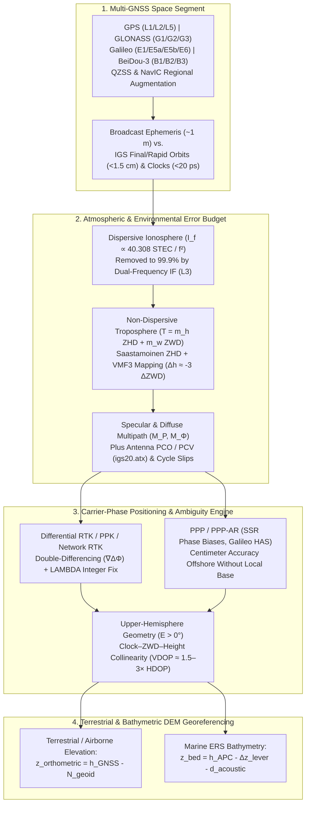

## 5.2 Global Navigation Satellite Systems (GNSS) for Elevation Mapping

Every active or passive elevation sensor—whether an airborne topographic lidar, a UAV photogrammetric camera, a terrestrial mobile mapping van, or a hydrographic multibeam echosounder (MBES)—measures ranges and angles strictly relative to its own body-fixed coordinate frame. Converting those sensor-frame measurements into a georeferenced Digital Elevation Model (DEM) requires knowing the three-dimensional trajectory of the sensor's reference point, $\mathbf{p}(t) = [\varphi(t), \lambda(t), h(t)]^T$, in a realization of the International Terrestrial Reference Frame (e.g., `ITRF2020` or `WGS 84 [G2139]`) at the exact microsecond of pulse emission or reception. Across both terrestrial and marine elevation mapping, **Global Navigation Satellite Systems (GNSS)** provide this absolute geometric anchor.

In terrestrial and airborne campaigns, kinematic GNSS trajectories directly establish the ellipsoidal height $h(t)$ (positive-up, in $\text{m}$) of the platform above the reference ellipsoid. In modern marine and estuarine hydrography, high-precision GNSS has revolutionized vertical reduction through **Ellipsoidally Referenced Surveying (ERS)**: rather than relying on distant coastal tide gauges, hydrodynamic zoning models, and vessel dynamic draft tables to estimate the instantaneous water level above Chart Datum (CD), an ERS vessel measures the ellipsoidal height of its GNSS Antenna Phase Center, $h_{\text{APC}}(t)$, translates that height downward by the attitude-corrected vertical lever arm $\Delta z_{\text{lever}}(\phi, \theta, \psi, t) > 0$ (in $\text{m}$) from the APC to the acoustic transducer, and subtracts the acoustically measured depth $d_{\text{acoustic}}(t)$ (positive-down, in $\text{m}$) to place the seabed directly on the ellipsoid:

$$z_{\text{bed,ellip}}(t) = h_{\text{APC}}(t) - \Delta z_{\text{lever}}(\phi, \theta, \psi, t) - d_{\text{acoustic}}(t)$$

Subtle errors in $h_{\text{APC}}(t)$—whether from unresolved carrier-phase integer ambiguities, tropospheric water-vapor gradients, multipath reflections off a vessel mast, or an improperly applied antenna phase center offset—propagate $1:1$ into the final elevation $z$ or charted depth $d$ of every DEM grid cell.



---

### 5.2.1 Multi-GNSS Constellations and Signal Observables

During the 1990s and early 2000s (following the 1978 launch of GPS Block I, the 1982 launch of GLONASS, and the deactivation of GPS Selective Availability [SA] on May 2, 2000), precision kinematic positioning relied almost exclusively on dual-frequency GPS (`L1/L2`) supplemented by GLONASS (`G1/G2`). Over the past fifteen years, the maturation of Europe's **Galileo**, China's **BeiDou-3 (BDS-3)**, Japan's **Quasi-Zenith Satellite System (QZSS)**, and India's **NavIC** has transformed kinematic geodesy into a four-global-constellation, triple-to-quad-frequency discipline. Operating a full multi-GNSS receiver increases the number of simultaneously tracked satellites from $6\text{–}10$ (GPS-only) to $25\text{–}45$ at any epoch, dramatically reducing Geometric Dilution of Precision (GDOP) in obstructed environments (forested valleys, urban canyons, steep fjords, and alongside offshore wind turbines) and accelerating integer ambiguity resolution.

| Constellation | Operator & Orbital Architecture | Primary Carrier Bands & Center Frequencies ($f$, in $\text{MHz}$) | Wavelengths ($\lambda = c/f$, in $\text{cm}$) | Key Signal & Geodetic Features for DEM Acquisition |
| :--- | :--- | :--- | :--- | :--- |
| **GPS** (Navstar) | USA (USSF)<br/>24–31 MEO ($20{,}200\text{ km}$, $55^\circ$ incl.) | `L1`: $1575.42$<br/>`L2`: $1227.60$<br/>`L5`: $1176.45$ | $\lambda_{\text{L1}} = 19.029$<br/>$\lambda_{\text{L2}} = 24.421$<br/>$\lambda_{\text{L5}} = 25.483$ | Legacy `L1 C/A` & semi-codeless `L2 P(Y)`; modernized `L2C`, `L5` (high $10.23\text{ MChip/s}$ chipping rate for low multipath), and `L1C` (BOC modulation). |
| **GLONASS** | Russia<br/>24 MEO ($19{,}130\text{ km}$, $64.8^\circ$ incl.) | `G1`: $1602.0 + 0.5625k$<br/>`G2`: $1246.0 + 0.4375k$<br/>`G3`: $1202.025$ | $\lambda_{\text{G1}} \approx 18.67\text{–}18.76$<br/>$\lambda_{\text{G2}} \approx 24.01\text{–}24.12$<br/>$\lambda_{\text{G3}} = 24.941$ | High orbital inclination ($64.8^\circ$) improves polar/high-latitude vertical geometry; legacy FDMA channels ($k \in [-7, +6]$) induce inter-frequency phase biases; modern `G3` uses CDMA. |
| **Galileo** | European Union (EUSPA/ESA)<br/>24–30 MEO ($23{,}222\text{ km}$, $56^\circ$ incl.) | `E1`: $1575.42$<br/>`E5a`: $1176.45$<br/>`E5b`: $1207.14$<br/>`E5` (AltBOC): $1191.795$<br/>`E6`: $1278.75$ | $\lambda_{\text{E1}} = 19.029$<br/>$\lambda_{\text{E5a}} = 25.483$<br/>$\lambda_{\text{E5b}} = 24.835$<br/>$\lambda_{\text{E5}} = 25.155$<br/>$\lambda_{\text{E6}} = 23.444$ | Ultra-wideband `E5` AltBOC signal achieves $<5\text{ cm}$ code noise; `E6-B` broadcasts the free global **High Accuracy Service (HAS)** PPP corrections ($\sim 20\text{ cm}$ H / $40\text{ cm}$ V real-time). |
| **BeiDou-3** (BDS-3) | China (CNSA)<br/>24 MEO ($21{,}528\text{ km}$, $55^\circ$ incl.) + 3 IGSO + 3 GEO | `B1I`: $1561.098$<br/>`B1C`: $1575.42$<br/>`B2a`: $1176.45$<br/>`B2b`: $1207.14$<br/>`B3I`: $1268.52$ | $\lambda_{\text{B1I}} = 19.204$<br/>$\lambda_{\text{B1C}} = 19.029$<br/>$\lambda_{\text{B2a}} = 25.483$<br/>$\lambda_{\text{B2b}} = 24.835$<br/>$\lambda_{\text{B3I}} = 23.633$ | Interoperable `B1C/B2a` overlap GPS `L1/L5` and Galileo `E1/E5a`; inclined geosynchronous (IGSO) and GEO satellites provide high-elevation coverage across Asia-Pacific plus `PPP-B2b`. |
| **QZSS** (Michibiki) | Japan (Cabinet Office)<br/>3 IGSO (tundra orbit) + 1 GEO | `L1`: $1575.42$<br/>`L2`: $1227.60$<br/>`L5`: $1176.45$<br/>`L6`: $1278.75$ | $\lambda_{\text{L1}} = 19.029$<br/>$\lambda_{\text{L2}} = 24.421$<br/>$\lambda_{\text{L5}} = 25.483$<br/>$\lambda_{\text{L6}} = 23.444$ | Asymmetric figure-8 orbit keeps $\ge 1$ satellite near zenith ($E > 70^\circ$) over Japan/East Asia/Oceania; `L6` broadcasts **CLAS** (Centimeter-Level Augmentation Service) SSR corrections. |
| **NavIC** (IRNSS) | India (ISRO)<br/>3 GEO + 4 IGSO ($29^\circ$ incl.) | `L1`: $1575.42$ (NVS)<br/>`L5`: $1176.45$<br/>`S-band`: $2492.028$ | $\lambda_{\text{L1}} = 19.029$<br/>$\lambda_{\text{L5}} = 25.483$<br/>$\lambda_{\text{S}} = 12.030$ | Regional coverage across the Indian Ocean and South Asia; wide frequency separation between `L5` and `S-band` enables highly sensitive ionospheric STEC estimation. |

#### Code Pseudorange vs. Carrier-Phase Observables

A geodetic GNSS receiver tracks each satellite $s$ on carrier frequency $f$ (with wavelength $\lambda_f = c / f$, where $c = 299{,}792{,}458\text{ m s}^{-1}$ is the vacuum speed of light) by simultaneously running a Delay Lock Loop (DLL) on the modulated pseudorandom noise (PRN) ranging code and a Phase Lock Loop (PLL) on the underlying sinusoidal radio carrier wave. This dual tracking yields two fundamental observables, both expressed in units of meters ($\text{m}$):

1. **Code Pseudorange ($P_{r,f}^s$):** Measured by multiplying $c$ by the apparent travel time between the satellite's PRN code transmission epoch and the receiver's replica correlation peak:
   $$P_{r,f}^s = \rho_r^s + c(\delta t_r - \delta t^s) + T_r^s + I_{r,f}^s + c(b_{r,f} - b_f^s) + M_{P,f} + \epsilon_{P,f}$$
2. **Carrier-Phase Range ($\Phi_{r,f}^s = \lambda_f \phi_{r,f}^s$):** Measured by tracking the fractional beat phase and accumulated cycle count $\phi_{r,f}^s$ (in cycles) of the carrier wave:
   $$\Phi_{r,f}^s = \rho_r^s + c(\delta t_r - \delta t^s) + T_r^s - I_{r,f}^s + \lambda_f (N_{r,f}^s + \varphi_{r,f} - \varphi_f^s) + M_{\Phi,f} + \epsilon_{\Phi,f}$$

In both equations, $\rho_r^s = \|\mathbf{r}^s(t - \tau_r^s) - \mathbf{r}_r(t)\|_2$ is the true geometric Euclidean range ($\text{m}$) between the satellite Antenna Phase Center at signal transmission time and the receiver Antenna Phase Center at reception time (including the Sagnac Earth-rotation correction); $\delta t_r$ and $\delta t^s$ are the receiver and satellite clock offsets ($\text{s}$); $T_r^s$ is the non-dispersive tropospheric path delay ($\text{m}$); $I_{r,f}^s$ is the first-order dispersive ionospheric path change ($\text{m}$); $b_{r,f}, b_f^s$ are receiver and satellite hardware code biases ($\text{s}$); $\varphi_{r,f}, \varphi_f^s$ are fractional initial hardware phase biases (cycles); $M_{P,f}, M_{\Phi,f}$ are code and phase multipath errors ($\text{m}$); and $\epsilon_{P,f}, \epsilon_{\Phi,f}$ are thermal tracking loop noises ($\text{m}$).

The contrast between $P_{r,f}^s$ and $\Phi_{r,f}^s$ defines the fundamental engineering challenge of centimeter-level elevation mapping:
* **Precision vs. Ambiguity:** A receiver DLL tracks a PRN code chip of length $\lambda_{\text{chip}} \approx 293\text{ m}$ (`L1 C/A`, $1.023\text{ MChip/s}$) or $29.3\text{ m}$ (`L5/E5a`, $10.23\text{ MChip/s}$) to roughly $0.1\%\text{–}1\%$ of a chip, yielding an unambiguous range with meter-to-decimeter thermal noise ($\sigma_P \approx 0.1\text{–}3.0\text{ m}$). Conversely, a PLL tracks the $\sim 19\text{–}25\text{ cm}$ carrier wave to better than $1\%$ of a cycle, yielding millimeter-level thermal noise ($\sigma_\Phi \approx 1\text{–}2\text{ mm}$), but the measurement contains an unknown **integer cycle ambiguity** $N_{r,f}^s \in \mathbb{Z}$ representing the integer number of full wavelengths between satellite and receiver when phase lock was first acquired.
* **Cycle Slips:** If the carrier PLL momentarily loses lock—due to signal attenuation beneath forest canopy, obstruction by bridges or vessel masts, high platform jerk, or severe ionospheric scintillation—the integer counter resets, introducing an instantaneous jump $\Delta N_{r,f}^s \in \mathbb{Z}$ known as a **cycle slip**. Unrepaired cycle slips force the positioning filter to re-initialize ambiguities, degrading vertical precision from $\sim 2\text{ cm}$ (fixed integer) to $\sim 20\text{–}50\text{ cm}$ (float).
* **Opposite Ionospheric Sign:** Because the ionosphere is a dispersive plasma, free electrons slow down the modulation envelope (group velocity $v_g < c$, causing a **code delay** $+I_{r,f}^s$) by the exact same magnitude to first order as they speed up the carrier wave crests (phase velocity $v_p > c$, causing a **phase advance** $-I_{r,f}^s$).

#### Dual-Frequency Linear Combinations ($L_3/\text{IF}$, Wide-Lane $\text{WL}$, Narrow-Lane $\text{NL}$)

When a receiver tracks two carrier frequencies $f_1$ and $f_2$ from the same satellite, forming linear combinations of $\Phi_1$ and $\Phi_2$ allows geodesists to eliminate first-order ionospheric refraction or manipulate the effective wavelength to accelerate integer ambiguity resolution:

1. **Ionosphere-Free ($\text{IF}$ or $L_3$) Combination:** Because first-order ionospheric delay scales as $I_f \propto 1/f^2$ (so $f_1^2 I_1 = f_2^2 I_2$), the linear combination
   $$\Phi_{\text{IF}} = \frac{f_1^2}{f_1^2 - f_2^2}\Phi_1 - \frac{f_2^2}{f_1^2 - f_2^2}\Phi_2 = \alpha_{\text{IF}}\Phi_1 - \beta_{\text{IF}}\Phi_2$$
   eliminates $99.9\%$ of the ionospheric delay. For GPS `L1/L2` ($f_1/f_2 = 154/120$), $\alpha_{\text{IF}} \approx 2.5457$ and $\beta_{\text{IF}} \approx 1.5457$. However, this elimination comes at a steep cost: (a) the combined ambiguity $\lambda_{\text{IF}}N_{\text{IF}} = \alpha_{\text{IF}}\lambda_1 N_1 - \beta_{\text{IF}}\lambda_2 N_2$ is **no longer an integer**, and (b) assuming independent, equal carrier-phase noise $\sigma_{\Phi_1} \approx \sigma_{\Phi_2} = \sigma_\Phi$, variance propagation amplifies the thermal noise and multipath by nearly a factor of three:
   $$\sigma_{\Phi_{\text{IF}}} = \sigma_\Phi \sqrt{\alpha_{\text{IF}}^2 + \beta_{\text{IF}}^2} \approx 2.978\,\sigma_\Phi \quad (\text{for GPS L1/L2})$$
2. **Wide-Lane ($\text{WL}$) Combination:** Forming the difference in cycles ($N_{\text{WL}} = N_1 - N_2 \in \mathbb{Z}$) corresponds to the metric combination:
   $$\Phi_{\text{WL}} = \frac{f_1 \Phi_1 - f_2 \Phi_2}{f_1 - f_2}, \qquad \lambda_{\text{WL}} = \frac{c}{f_1 - f_2}$$
   For GPS `L1/L2`, the effective wide-lane wavelength expands to $\lambda_{\text{WL}} \approx 86.19\text{ cm}$ (and for Galileo `E5a/E5b`, an extraordinary extra-wide-lane $\lambda_{\text{EWL}} \approx 9.768\text{ m}$!). Because $\lambda_{\text{WL}}$ is more than four times larger than $\lambda_1$, resolving the integer wide-lane ambiguity $N_{\text{WL}}$—especially when combined with the narrow-lane code pseudorange in the geometry-free, ionosphere-free **Melbourne-Wübbena ($L_{\text{MW}}$)** observable—is fast and reliable even over long baselines.
3. **Narrow-Lane ($\text{NL}$) Combination:** Forming the sum in cycles ($N_{\text{NL}} = N_1 + N_2 \in \mathbb{Z}$) yields:
   $$\Phi_{\text{NL}} = \frac{f_1 \Phi_1 + f_2 \Phi_2}{f_1 + f_2}, \qquad \lambda_{\text{NL}} = \frac{c}{f_1 + f_2} \approx 10.70\text{ cm} \quad (\text{for GPS L1/L2})$$
   While $\Phi_{\text{NL}}$ has a short wavelength, lower phase noise ($\sigma_{\Phi_{\text{NL}}} \approx 0.713\,\sigma_\Phi$), and retains ionospheric delay, its mathematical power lies in decomposing the Ionosphere-Free ambiguity term once $N_{\text{WL}} = N_1 - N_2$ has been fixed to an integer (after double-differencing or applying SSR phase-bias corrections $\delta\varphi_{\text{IF}}$):
   $$\Phi_{\text{IF}} = \rho_r^s + c(\delta t_r - \delta t^s) + T_r^s + \lambda_{\text{NL}}\left(N_1 + \frac{f_2}{f_1 - f_2}N_{\text{WL}}\right) + \delta\varphi_{\text{IF}} + \epsilon_{\Phi_{\text{IF}}}$$
   Thus, standard long-baseline PPK and PPP-AR algorithms resolve integer ambiguities in two cascading steps: first fixing the $86.2\text{ cm}$ wide-lane integer $N_{\text{WL}}$, and then substituting $N_{\text{WL}}$ into $\Phi_{\text{IF}}$ to solve for the remaining integer $N_1$ at the $10.7\text{ cm}$ narrow-lane wavelength $\lambda_{\text{NL}}$.

---

### 5.2.2 The GNSS Error Budget and Physical Coupling into Vertical Height $h$

In airborne lidar, terrestrial mobile mapping, and marine ERS surveys, unmodeled physical biases in the observation equations do not distribute evenly across coordinates; as proven in Section 5.2.3, elevation-dependent range biases project preferentially into the vertical coordinate $h$. Mastering the GNSS vertical error budget requires understanding five physical error sources.

#### 1. Satellite Orbit and Clock Ephemeris Errors
Real-time broadcast navigation messages (`LNAV`/`CNAV`/`FNAV`/`INAV`) uploaded by constellation control segments exhibit 3D orbital RMS errors of $\sim 0.3\text{–}1.2\text{ m}$ and satellite clock RMS errors of $\sim 1\text{–}4\text{ ns}$ ($0.3\text{–}1.2\text{ m}$ in range). In differential positioning (RTK/PPK) over baseline length $B$, a satellite orbital error $\delta r_{\text{orb}}$ propagates into the baseline vector $\mathbf{b}$ bounded by the geometric attenuation rule:

$$\delta b \le \frac{B}{R_{\text{sat}}}\,\delta r_{\text{orb}}$$

where $R_{\text{sat}} \approx 20{,}200\text{ km}$ is the satellite altitude. Even a $1\text{ m}$ broadcast orbit error induces less than $0.5\text{ mm}$ of baseline error over a $10\text{ km}$ RTK baseline. However, in long-baseline PPK ($B > 100\text{ km}$) or single-receiver PPP, satellite radial orbit and clock errors couple nearly $1:1$ into the receiver's vertical height $h$ and clock offset. Post-processed DEM trajectories therefore ingest **International GNSS Service (IGS)** Rapid (available after $\sim 17\text{ h}$) or Final (available after $\sim 12\text{–}18\text{ days}$) `.sp3` orbit and `.clk` clock products referenced to `IGS20`/`ITRF2020`, which achieve $< 1.5\text{ cm}$ 3D orbit RMS and $< 20\text{ ps}$ ($6\text{ mm}$) clock RMS.

#### 2. Ionospheric Dispersive Delay ($I_f$)
Extending from roughly $60\text{ km}$ to $1{,}000\text{ km}$ altitude, the ionosphere contains solar-ionized free electrons with density $n_e(s)$ ($\text{electrons m}^{-3}$). Integrating $n_e(s)$ along the slant ray path from satellite to receiver defines the **Slant Total Electron Content ($\text{STEC}$)**:

$$\text{STEC} = \int_{\text{sat}}^{\text{rec}} n_e(s)\,ds \qquad \left(1\text{ TECU} \equiv 10^{16}\text{ electrons m}^{-2}\right)$$

Expanding the Appleton-Hartree magneto-ionic refractive index yields the code group delay ($I_{P,f}$) and carrier phase advance ($-I_{\Phi,f}$) as power series in inverse frequency:

$$I_{P,f} = \frac{40.308}{f^2}\,\text{STEC} + \frac{7527\,c\,B_0 \cos\theta_B}{f^3}\,\text{STEC} + \mathcal{O}(f^{-4}), \qquad I_{\Phi,f} = \frac{40.308}{f^2}\,\text{STEC} + \frac{7527\,c\,B_0 \cos\theta_B}{2 f^3}\,\text{STEC} + \mathcal{O}(f^{-4})$$

where $f$ is in $\text{Hz}$, $B_0$ is the geomagnetic field magnitude ($\text{T}$) at the ionospheric pierce point, and $\theta_B$ is the angle between the signal propagation vector and $\mathbf{B}_0$. On GPS `L1` ($1575.42\text{ MHz}$), $1\text{ TECU}$ produces $0.1624\text{ m}$ of first-order range error ($0.2674\text{ m}$ on `L2`). Typical daytime zenith delays range from $2\text{ m}$ to $15\text{ m}$, surging past $50\text{ m}$ at low elevation angles during solar maximum or geomagnetic storms. While the dual-frequency $\Phi_{\text{IF}}$ combination eliminates the first-order ($f^{-2}$) term, the residual second-order paramagnetic ($f^{-3}$) term can reach $1\text{–}3\text{ cm}$ at low latitudes and must be modeled using geomagnetic field models (e.g., IGRF) in sub-centimeter geodetic processing. Furthermore, post-sunset equatorial plasma bubbles and high-latitude auroral storms trigger rapid phase and amplitude **ionospheric scintillation**, inducing simultaneous cycle slips across `L1`, `L2`, and `L5`.

#### 3. Tropospheric Non-Dispersive Delay ($T_r^s$) and the $1:3$ Vertical Error Amplification
Below $\sim 50\text{ km}$ altitude, the electrically neutral troposphere and stratosphere are **non-dispersive** for radio frequencies below $15\text{ GHz}$: code and carrier waves experience identical delays across `L1`, `L2`, and `L5`. Consequently, **multi-frequency linear combinations cannot eliminate tropospheric delay**. Instead, the slant tropospheric delay $T_r^s(E, \alpha)$ at elevation angle $E$ and azimuth $\alpha$ is separated into hydrostatic (dry gases in hydrostatic equilibrium, $\sim 90\%$ of total delay) and wet (water vapor, $\sim 10\%$ of total delay) components mapped from the zenith:

$$T_r^s(E, \alpha) = m_h(E)\,\text{ZHD} + m_w(E)\,\text{ZWD} + m_g(E)\left[G_N \cos\alpha + G_E \sin\alpha\right]$$

where $G_N, G_E$ are horizontal azimuthal delay gradients ($\text{m}$).
* **Zenith Hydrostatic Delay ($\text{ZHD}$):** Approximately $2.30\text{ m}$ at sea level (decreasing exponentially with altitude), $\text{ZHD}$ is smooth and deterministic. Given surface barometric pressure $P_0$ (in $\text{hPa}$), geodetic latitude $\varphi$, and ellipsoidal/orthometric height $h_{\text{km}}$ (in $\text{km}$), the **Saastamoinen (1972)** model predicts $\text{ZHD}$ (in $\text{m}$) to $\sim 1\text{–}2\text{ mm}$ accuracy:
  $$\text{ZHD} = \frac{0.0022768\,P_0}{1 - 0.00266\cos(2\varphi) - 0.00028\,h_{\text{km}}}$$
* **Zenith Wet Delay ($\text{ZWD}$):** Ranging from $< 0.02\text{ m}$ in polar deserts to $> 0.40\text{ m}$ in tropical maritime air masses, $\text{ZWD}$ varies rapidly in space and time due to turbulent boundary-layer water vapor and cannot be accurately predicted from surface humidity sensors alone. In modern PPP and long-baseline PPK, $\text{ZHD}$ is removed *a priori* using numerical weather model grids and the **Vienna Mapping Functions (VMF3)** (which represent $m_h(E)$ and $m_w(E)$ via Marini continued fractions), while the residual $\text{ZWD}$ is estimated as a stochastic random-walk state parameter ($\sim 1\text{–}5\text{ mm}/\sqrt{\text{h}}$) alongside receiver coordinates.
* **Why a $1\text{ cm}$ $\text{ZWD}$ Error Induces a $\sim 3\text{ cm}$ Vertical Height Error:** In the linearized observation equation, a positive vertical height shift $\Delta h$ shortens the satellite-to-receiver range by $\frac{\partial \rho}{\partial h}\Delta h = -\sin E\,\Delta h$, whereas an unmodeled zenith wet delay residual $\Delta\text{ZWD}$ lengthens the range by $\frac{\partial T}{\partial \text{ZWD}}\Delta\text{ZWD} = m_w(E)\,\Delta\text{ZWD} \approx \frac{1}{\sin E}\Delta\text{ZWD}$. Because a receiver must also simultaneously absorb the mean range offset across all satellites into the receiver clock estimate $c\,\delta t_r$, any unmodeled $\Delta\text{ZWD}$ is partitioned between $c\,\delta t_r$ and $\Delta h$ according to the variation of $m_w(E)$ vs. $-\sin E$ across the visible elevation mask ($E \in [10^\circ, 85^\circ]$, where $m_w(E)$ varies from $5.6$ down to $1.0$). Least-squares regression of $m_w(E)$ against $[1, -\sin E]$ over a standard constellation geometry yields the canonical geodetic sensitivity rule:
  $$\Delta h \approx -2.8 \text{ to } -3.5\,\Delta\text{ZWD} \qquad \left(\text{Rule of Thumb: } 1\text{ cm ZWD error} \implies \sim 3\text{ cm vertical height error}\right)$$

> [!WARNING]
> **Differential Tropospheric Bias over Steep Relief and Airborne Climb Profiles:**
> In short-baseline RTK/PPK ($B < 10\text{ km}$) over flat terrain, atmospheric delays at the base and rover are nearly identical and cancel in double-differencing. However, when a base station sits on a valley floor ($h_{\text{base}} = 200\text{ m}$) and a terrestrial rover or airborne lidar aircraft operates at $h_{\text{rover}} = 2{,}200\text{ m}$, the $2{,}000\text{ m}$ vertical column of air between base and rover is observed *only* by the base station! If the PPK software relies on standard sea-level meteorological defaults rather than estimating a relative $\Delta\text{ZWD}$ state with VMF3/GMF mapping functions, the unmodeled differential troposphere will inject a systematic $5\text{–}25\text{ cm}$ vertical scale bias into the resulting DEM.

#### 4. Specular and Diffuse Multipath ($M_P, M_\Phi$)
Multipath occurs when radio signals arriving directly from a satellite interfere at the antenna with signals reflected off nearby surfaces—such as a survey vessel's aluminum pilothouse, the ocean surface, an aircraft wing, or adjacent building facades. For a single specular reflection off a horizontal reflector located a vertical distance $H_{\text{ant}}$ below the antenna, the reflected ray travels an extra geometric path length $\Delta L = 2 H_{\text{ant}} \sin E$, inducing a relative phase lag $\psi = \frac{2\pi}{\lambda}\Delta L = \frac{4\pi H_{\text{ant}} \sin E}{\lambda}$ and a damped amplitude ratio $\alpha \in (0, 1)$. Superposing the direct and reflected phasors yields the carrier-phase multipath error:

$$M_\Phi = \frac{\lambda}{2\pi}\arctan\left(\frac{\alpha \sin\psi}{1 + \alpha \cos\psi}\right), \qquad |M_{\Phi,\max}| = \frac{\lambda}{2\pi}\arcsin\alpha \le \frac{\lambda}{4}$$

Notice that $M_\Phi$ reaches its theoretical worst-case extremum as $\alpha \to 1$, bounded by a **quarter-wavelength**: $|M_{\Phi,\max}| = \frac{\lambda}{4}$ ($\approx 4.76\text{ cm}$ on GPS `L1` and $6.11\text{ cm}$ on `L2`, though amplified by $\sim 3\times$ in the $\Phi_{\text{IF}}$ combination!). As satellite elevation $E(t)$ changes slowly along its orbit, $M_\Phi(t)$ oscillates sinusoidally with period $T_{\text{MP}} = \frac{\lambda}{2 H_{\text{ant}} \dot{E} \cos E}$ (typically $2\text{–}15\text{ minutes}$ for $H_{\text{ant}} = 1.5\text{–}2.0\text{ m}$), mimicking short-period vertical heave or trajectory undulations. Mitigation requires right-hand circularly polarized (RHCP) **choke-ring** or steep ground-plane antennas (which reject left-hand circularly polarized [LHCP] reflected waves from below the horizon) and **elevation-dependent observation weighting** in the Kalman filter:

$$\sigma_\Phi^2(E) = a^2 + \frac{b^2}{\sin^2 E} \qquad (\text{typically } a \approx 1.5\text{ mm}, \; b \approx 1.5\text{–}2.0\text{ mm})$$

#### 5. Antenna Phase Center Offset (PCO) and Phase Center Variation (PCV)
A GNSS measurement does not reference the physical monument or the bottom of the antenna housing; it references the electrical **Antenna Phase Center (APC)**, which depends on both carrier frequency $f$ and the incoming signal direction $(E, \alpha)$. Geodetic processing decomposes the vector from the physical survey mark to the instantaneous electrical phase center into three segments:
1. **Monument-to-ARP Vector ($\mathbf{d}_{\text{ARP}}$):** The vertical (or calibrated 3D) distance from the survey benchmark or IMU reference point to the mechanical **Antenna Reference Point (ARP)** (standardized by the IGS as the intersection of the antenna's vertical axis of symmetry with the bottom of its mounting thread).
2. **Phase Center Offset ($\mathbf{d}_{\text{PCO},f} = [\Delta e_f, \Delta n_f, \Delta u_f]^T$):** The vector from the mechanical ARP to the mean electrical phase center for frequency $f$. Crucially, $\Delta u_{\text{L1}}$ and $\Delta u_{\text{L2}}$ typically differ by $1\text{–}4\text{ cm}$ (and reach $5\text{–}12\text{ cm}$ above the ARP!).
3. **Phase Center Variation ($\text{PCV}_f(E, \alpha)$):** The azimuth- and elevation-dependent departure ($1\text{–}15\text{ mm}$) of the instantaneous phase wavefront from a perfect sphere centered at the mean APC.

In the Ionosphere-Free combination, a $2\text{ cm}$ vertical PCO discrepancy between `L1` and `L2` is multiplied by $\alpha_{\text{IF}} \approx 2.55$ and $\beta_{\text{IF}} \approx 1.55$, producing up to $5\text{–}10\text{ cm}$ of systematic vertical height error if uncalibrated! All modern DEM workflows must apply absolute robotic or anechoic chamber antenna calibrations from the official IGS ANTEX file (`igs20.atx`) for **both** the base/CORS antenna (matching its exact radome code, e.g., `TRM59800.00 SCIS` vs. `NONE`) and the rover/aircraft/vessel antenna.

> [!IMPORTANT]
> **The Classic ARP-vs-APC and Slant-vs-Vertical Antenna Height Blunder:**
> One of the most pervasive vertical datum blunders in lidar and hydrographic surveying occurs when a field crew measures the **slant height** $s$ from a benchmark to a notch on the outer bumper of a receiver (rather than the vertical height to the bottom ARP thread) or enters the APC height into post-processing software that subsequently adds the `igs20.atx` $\Delta u_{\text{PCO}}$ offset a second time. Double-applying or omitting $\Delta u_{\text{PCO}}$ introduces a constant $6\text{–}14\text{ cm}$ vertical bias across the entire survey campaign that no internal cross-line check will ever reveal.

---

### 5.2.3 Why GNSS Vertical Precision Is $1.5\times$ to $3\times$ Worse Than Horizontal Precision ($\text{VDOP} > \text{HDOP}$)

Across every GNSS positioning mode, the standard deviation of the vertical height estimate ($\sigma_U$) is systematically $1.5$ to $3.0$ times larger than the horizontal standard deviations ($\sigma_E, \sigma_N$). This asymmetry is not an artifact of receiver hardware; it is an unavoidable mathematical consequence of one-sided satellite visibility and parameter collinearity.

#### Derivation from the Topocentric Design Matrix $\mathbf{G}$ and Cofactor Matrix $\mathbf{Q}_{\text{ENU}}$

Consider $m$ visible satellites ($s = 1, \dots, m$) observed at elevation angles $E_s \in (0, \pi/2]$ and azimuths $\alpha_s \in [0, 2\pi)$. Linearizing the geometric range plus receiver clock offset around an approximate receiver position in the local topocentric **East–North–Up ($\text{ENU}$)** frame yields the linear Gauss-Markov system:

$$\delta \mathbf{y} = \mathbf{G}\,\delta \mathbf{x} + \boldsymbol{\epsilon}, \qquad \delta \mathbf{x} = \begin{bmatrix} \Delta E \\ \Delta N \\ \Delta U \\ c\,\delta t_r \end{bmatrix}, \qquad \mathbf{G} = \begin{bmatrix} -\cos E_1 \sin\alpha_1 & -\cos E_1 \cos\alpha_1 & -\sin E_1 & 1 \\ -\cos E_2 \sin\alpha_2 & -\cos E_2 \cos\alpha_2 & -\sin E_2 & 1 \\ \vdots & \vdots & \vdots & \vdots \\ -\cos E_m \sin\alpha_m & -\cos E_m \cos\alpha_m & -\sin E_m & 1 \end{bmatrix}$$

Assuming identically distributed, uncorrelated pseudorange or ambiguity-fixed phase observations with covariance $\boldsymbol{\Sigma}_y = \sigma_{\text{UERE}}^2 \mathbf{I}_m$ (where $\sigma_{\text{UERE}}$ is the User Equivalent Range Error), the ordinary least-squares estimator $\delta\hat{\mathbf{x}} = (\mathbf{G}^T\mathbf{G})^{-1}\mathbf{G}^T\delta\mathbf{y}$ has covariance matrix:

$$\boldsymbol{\Sigma}_{\hat{x}} = \sigma_{\text{UERE}}^2 \mathbf{Q}_{\text{ENU},t} = \sigma_{\text{UERE}}^2 (\mathbf{G}^T\mathbf{G})^{-1} = \sigma_{\text{UERE}}^2 \begin{bmatrix} q_{EE} & q_{EN} & q_{EU} & q_{Et} \\ q_{NE} & q_{NN} & q_{NU} & q_{Nt} \\ q_{UE} & q_{UN} & q_{UU} & q_{Ut} \\ q_{tE} & q_{tN} & q_{tU} & q_{tt} \end{bmatrix}$$

The dimensionless **Dilution of Precision (DOP)** factors are defined directly from the diagonal elements of $\mathbf{Q}_{\text{ENU},t}$:

$$\text{HDOP} = \sqrt{q_{EE} + q_{NN}}, \qquad \text{VDOP} = \sqrt{q_{UU}}, \qquad \text{PDOP} = \sqrt{q_{EE} + q_{NN} + q_{UU}}, \qquad \text{TDOP} = \sqrt{q_{tt}}$$

Why is $\text{VDOP} = \sqrt{q_{UU}}$ always substantially larger than $\text{HDOP} = \sqrt{q_{EE} + q_{NN}}$? Inspect the normal matrix $\mathbf{N} = \mathbf{G}^T\mathbf{G}$ for an azimuthally symmetric sky distribution of $m$ satellites ($\sum \cos E_s \sin\alpha_s = \sum \cos E_s \cos\alpha_s = \sum \cos^2 E_s \sin\alpha_s\cos\alpha_s = 0$):

$$\mathbf{G}^T\mathbf{G} = \begin{bmatrix} \frac{1}{2}\sum_{s=1}^m \cos^2 E_s & 0 & 0 & 0 \\ 0 & \frac{1}{2}\sum_{s=1}^m \cos^2 E_s & 0 & 0 \\ 0 & 0 & \sum_{s=1}^m \sin^2 E_s & -\sum_{s=1}^m \sin E_s \\ 0 & 0 & -\sum_{s=1}^m \sin E_s & m \end{bmatrix}$$

This block-diagonal structure reveals two fundamental physical mechanisms:
1. **Horizontal Orthogonality via Full $360^\circ$ Azimuth Coverage:** Satellites surround the receiver in all horizontal directions ($\alpha_s \in [0, 2\pi)$), so the first two columns of $\mathbf{G}$ contain both positive and negative values that sum to zero. Consequently, $\Delta E$ and $\Delta N$ are completely orthogonal to the receiver clock column $[1, 1, \dots, 1]^T$. Inverting the top two diagonal elements directly yields:
   $$q_{EE} = q_{NN} = \frac{2}{\sum_{s=1}^m \cos^2 E_s} \implies \text{HDOP} = \frac{2}{\sqrt{\sum_{s=1}^m \cos^2 E_s}}$$
2. **One-Sided Hemisphere ($E_s > 0^\circ$) and Clock–Height–Troposphere Collinearity:** Because the solid Earth is opaque to radio waves, no satellites can be observed at negative elevation angles below the horizon ($E_s < 0^\circ$). Every entry in the third column of $\mathbf{G}$ ($-\sin E_s$) is **strictly negative**, making the upward coordinate column $\mathbf{g}_U = [-\sin E_1, \dots, -\sin E_m]^T$ strongly collinear with the receiver clock column $\mathbf{g}_t = [1, \dots, 1]^T$. Inverting the lower $2 \times 2$ $(\Delta U, c\,\delta t_r)$ block via the Schur complement gives the exact vertical cofactor $q_{UU}$:
   $$q_{UU} = \frac{1}{\sum_{s=1}^m \sin^2 E_s - \frac{1}{m}\left(\sum_{s=1}^m \sin E_s\right)^2} = \frac{1}{m\,\text{Var}(\sin E_s)} \implies \text{VDOP} = \frac{1}{\sqrt{\sum_{s=1}^m \left(\sin E_s - \overline{\sin E}\right)^2}}$$

This equation is one of the most illuminating results in satellite geodesy: **because the receiver clock offset $c\,\delta t_r$ is unknown and absorbs the mean vertical range shift $\overline{\sin E}$, vertical precision is governed not by $\sum \sin^2 E_s$, but solely by the variance (spread) of $\sin E_s$ between low-elevation and high-elevation satellites!** Even if a receiver tracks $m = 12$ satellites, if terrain or forest canopy blocks all satellites below $E_{\min} = 45^\circ$ so that $\sin E_s \in [0.71, 0.98]$, the variance $\text{Var}(\sin E_s)$ collapses toward zero and $\text{VDOP}$ explodes. Furthermore, when the zenith wet delay $\text{ZWD}$ is co-estimated as a 5th state with partial derivative $m_w(E_s) \approx 1/\sin E_s$, a third strictly positive column enters the vertical subspace, further inflating $q_{UU}$.

#### Worked Numerical Example: Horizontal vs. Vertical Uncertainty Propagation
Suppose a hydrographic survey vessel tracks $m = 6$ satellites uniformly spaced in azimuth ($\alpha_s = 0^\circ, 60^\circ, 120^\circ, 180^\circ, 240^\circ, 300^\circ$), with three satellites at $E = 20^\circ$ ($\alpha = 0^\circ, 120^\circ, 240^\circ$; $\sin 20^\circ = 0.3420$, $\cos 20^\circ = 0.9397$) and three satellites at $E = 70^\circ$ ($\alpha = 60^\circ, 180^\circ, 300^\circ$; $\sin 70^\circ = 0.9397$, $\cos 70^\circ = 0.3420$).
* **Horizontal DOP:** $\sum_{s=1}^6 \cos^2 E_s = 3(0.8830) + 3(0.1170) = 3.000$. Thus $q_{EE} = q_{NN} = \frac{2}{3.000} = 0.6667$, and:
  $$\text{HDOP} = \sqrt{0.6667 + 0.6667} = \mathbf{1.155}$$
* **Vertical DOP (without vs. with receiver clock estimation):** If the receiver had a perfect atomic clock ($\delta t_r = 0$ known), $q_{UU}$ would be $1/\sum \sin^2 E_s = 1/3.000 = 0.3333$ ($\sqrt{q_{UU}} = 0.577$). In reality, estimating $c\,\delta t_r$ subtracts the mean $\overline{\sin E} = \frac{0.3420 + 0.9397}{2} = 0.6409$, leaving:
  $$\sum_{s=1}^6 (\sin E_s - \overline{\sin E})^2 = 6 \times (0.2988)^2 = 0.5358 \implies q_{UU} = \frac{1}{0.5358} = 1.866 \implies \text{VDOP} = \sqrt{1.866} = \mathbf{1.366}$$
  If local terrain or vessel superstructure masks the $20^\circ$ satellites so that the lower trio is tracked at $E = 40^\circ$ ($\sin 40^\circ = 0.6428$, $\cos^2 40^\circ = 0.5868$), then $\sum \cos^2 E_s = 2.1114$ so $\text{HDOP}$ increases modestly to $\sqrt{4/2.1114} = \mathbf{1.376}$, but $\sum (\sin E_s - \overline{\sin E})^2$ collapses to $6 \times (0.1485)^2 = 0.1322$, causing $\text{VDOP}$ to jump to $\sqrt{1/0.1322} = \mathbf{2.750}$ ($\text{VDOP}/\text{HDOP} = 2.00$)! For a carrier-phase UERE of $\sigma_{\text{UERE}} = 1.2\text{ cm}$, the $95\%$ Total Horizontal Uncertainty ($\text{THU}_{95\%} = \frac{2.4477}{\sqrt{2}}\,\sigma_{\text{UERE}}\,\text{HDOP} \approx 1.7308\,\sigma_{\text{UERE}}\,\text{HDOP}$ for an isotropic 2D Rayleigh radial error) is $2.9\text{ cm}$, whereas the $95\%$ Total Vertical Uncertainty ($\text{TVU}_{95\%} = 1.9600\,\sigma_{\text{UERE}}\,\text{VDOP}$) reaches $6.5\text{ cm}$.

---

### 5.2.4 Differential and Precise Positioning Modes for DEM Acquisition

Because standalone single-point GNSS positioning yields meter-level vertical uncertainty ($\sigma_V \approx 2\text{–}5\text{ m}$), topographical and hydrographical DEM campaigns rely on differential or state-space correction architectures.

#### 1. Satellite-Based Augmentation Systems (SBAS)
Regional geostationary augmentation systems—including **WAAS** (North America), **EGNOS** (Europe), **MSAS** (Japan), **GAGAN** (India), **SDCM** (Russia), **KASS** (Korea), and **SouthPAN** (Australia/New Zealand)—collect observations from continental reference networks and broadcast wide-area vector corrections (satellite orbit/clock errors and a $5^\circ \times 5^\circ$ vertical ionospheric delay grid) on the GPS `L1` (and modernized dual-frequency multi-constellation `L1/L5`) frequency. SBAS achieves $\sigma_H \approx 0.5\text{–}1.0\text{ m}$ and $\sigma_V \approx 0.8\text{–}1.5\text{ m}$ in real time. While ubiquitous for aviation approach and reconnaissance navigation, code-based SBAS is roughly two orders of magnitude too coarse for airborne lidar or IHO Special Order bathymetric charting.

#### 2. Single-Base RTK (Real-Time Kinematic) and PPK (Post-Processed Kinematic)
To achieve $1\text{–}3\text{ cm}$ vertical accuracy, **RTK** and **PPK** form **double-differenced ($\nabla\Delta$)** carrier-phase and pseudorange observations between a stationary Base Station $A$ (with known geodetic coordinates $\mathbf{r}_A$) and a moving Rover $B$, and between a high-elevation Pivot Satellite $j$ and each remaining satellite $k$:

$$\nabla\Delta\Phi_{AB}^{jk} = \left(\Phi_B^k - \Phi_A^k\right) - \left(\Phi_B^j - \Phi_A^j\right) = \nabla\Delta\rho_{AB}^{jk} + \nabla\Delta T_{AB}^{jk} - \nabla\Delta I_{AB}^{jk} + \lambda \nabla\Delta N_{AB}^{jk} + \epsilon_{\nabla\Delta\Phi}$$

Double-differencing is mathematically transformative for three reasons:
* **Exact Clock and Hardware Bias Cancellation:** Between-satellite differencing ($\nabla$) cancels the receiver clocks ($\delta t_A, \delta t_B$) and receiver initial phase biases ($\varphi_A, \varphi_B$); between-receiver differencing ($\Delta$) cancels the satellite clocks ($\delta t^j, \delta t^k$) and satellite phase biases ($\varphi^j, \varphi^k$).
* **Restoration of Integer Ambiguities:** With all fractional hardware phase biases eliminated, the double-differenced ambiguity $\nabla\Delta N_{AB}^{jk} \in \mathbb{Z}$ is once again an **exact integer**! (For legacy GLONASS FDMA channels where $\lambda^j \ne \lambda^k$, single-difference receiver clock biases must be calibrated before integer fixing.)
* **Spatial Error Decorrelation ($B\text{ ppm}$):** Over short baselines ($B < 10\text{–}15\text{ km}$), the atmospheric paths to Base $A$ and Rover $B$ are nearly identical, so $\nabla\Delta I_{AB}^{jk} \approx 0$ and $\nabla\Delta T_{AB}^{jk} \approx 0$. As baseline length $B$ increases, residual differential ionospheric and tropospheric errors grow at roughly $0.5\text{–}1.5\text{ mm}$ per kilometer ($0.5\text{–}1.5\text{ ppm}$), yielding a characteristic vertical uncertainty of:
  $$\sigma_{V,\text{RTK/PPK}} \approx \sqrt{(15\text{ mm})^2 + (1.2\text{ ppm} \times B)^2}$$

##### Integer Ambiguity Resolution via Teunissen's LAMBDA Method
Solving for the rover baseline vector $\mathbf{b} \in \mathbb{R}^3$ and the integer ambiguity vector $\mathbf{a} = \nabla\Delta\mathbf{N} \in \mathbb{Z}^n$ is a mixed-integer least-squares problem. Introduced by Teunissen (1995), the **Least-squares AMBiguity Decorrelation Adjustment (LAMBDA)** method solves this in four steps:
1. **Float Solution:** Solve the unconstrained real-valued least-squares or EKF system to obtain the "float" ambiguity vector $\hat{\mathbf{a}} \in \mathbb{R}^n$ and its covariance matrix $\mathbf{Q}_{\hat{a}\hat{a}}$ (which is heavily correlated because all double differences share the pivot satellite $j$ and common short observation arcs).
2. **Unimodular Integer Decorrelation ($\mathbf{Z}$-Transformation):** Construct a volume-preserving, integer-invertible transformation matrix $\mathbf{Z} \in \mathbb{Z}^{n \times n}$ ($\det \mathbf{Z} = \pm 1$) via sequential integer Gauss transformations such that the transformed ambiguities $\hat{\mathbf{z}} = \mathbf{Z}^T\hat{\mathbf{a}}$ have a nearly diagonal covariance matrix $\mathbf{Q}_{\hat{z}\hat{z}} = \mathbf{Z}^T \mathbf{Q}_{\hat{a}\hat{a}} \mathbf{Z}$.
3. **Sequential Integer Search:** Search the decorrelated hyper-ellipsoid $(\mathbf{z} - \hat{\mathbf{z}})^T \mathbf{Q}_{\hat{z}\hat{z}}^{-1} (\mathbf{z} - \hat{\mathbf{z}}) \le \chi^2$ to find the best integer candidate $\check{\mathbf{z}}_1 \in \mathbb{Z}^n$ and second-best candidate $\check{\mathbf{z}}_2 \in \mathbb{Z}^n$.
4. **Validation and Fixed Baseline Update:** Validate $\check{\mathbf{z}}_1$ using the **Ratio Test** ($R = \|\hat{\mathbf{z}} - \check{\mathbf{z}}_2\|_{\mathbf{Q}_{\hat{z}\hat{z}}}^2 / \|\hat{\mathbf{z}} - \check{\mathbf{z}}_1\|_{\mathbf{Q}_{\hat{z}\hat{z}}}^2 \ge \mu_{\text{crit}}$, typically $2.0\text{–}3.0$) or a fixed failure-rate test, map back via $\check{\mathbf{a}} = \mathbf{Z}^{-T}\check{\mathbf{z}}_1$, and condition the rover baseline on the fixed integers:
   $$\check{\mathbf{b}} = \hat{\mathbf{b}} - \mathbf{Q}_{\hat{b}\hat{a}}\mathbf{Q}_{\hat{a}\hat{a}}^{-1}(\hat{\mathbf{a}} - \check{\mathbf{a}})$$

In airborne lidar and marine multibeam surveys, **Post-Processed Kinematic (PPK)** is strongly preferred over real-time RTK: PPK is immune to UHF/cellular radio link dropouts, utilizes precise IGS orbits/clocks, and runs a **Rauch-Tung-Striebel (RTS) forward–backward smoother** that bridges cycle slips using future epochs after an obstruction is cleared.

#### 3. Network RTK (NRTK: VRS, MAC, FKP)
When operating $20\text{–}70\text{ km}$ from the nearest reference station, a single-base RTK rover suffers from decorrelated ionospheric and tropospheric errors that prevent integer ambiguity fixing. **Network RTK** resolves a regional network of Continuously Operating Reference Stations (CORS) to model the spatial gradients of dispersive and non-dispersive delays across the network cell:
* **Virtual Reference Station (VRS):** The rover transmits its approximate NMEA `GGA` position via cellular **NTRIP** (Networked Transport of RTCM via Internet Protocol) to the central server, which interpolates the network atmospheric model to synthesize virtual raw carrier-phase observations at a non-existent base station located just meters from the rover.
* **Master-Auxiliary Concept (MAC) and Flächenkorrekturparameter (FKP):** Rather than hiding the network geometry behind a synthetic VRS, MAC transmits full raw observations from a physical Master station plus compact dispersive/non-dispersive coordinate differences to surrounding Auxiliary stations (or bilinear horizontal delay gradients in FKP), allowing the rover's own Kalman filter to weight the interpolation rigor.

#### 4. Precise Point Positioning (PPP and PPP-AR)
In offshore hydrography beyond $50\text{ km}$ from shore, trans-oceanic airborne lidar, or remote mountain/polar basins where deploying local base stations is logistically prohibitive, **Precise Point Positioning (PPP)** operates with a **single GNSS receiver**. Rather than differencing observations against a local base station, PPP models every physical error explicitly using global **State Space Representation (SSR)** products: precise satellite orbits, high-rate ($1\text{–}5\text{ s}$) satellite clocks, `igs20.atx` satellite and receiver PCO/PCV tables, solid Earth tides, ocean pole tides, ocean tidal loading (e.g., `FES2014b`, which can displace coastal benchmarks vertically by $5\text{–}10\text{ cm}$!), phase wind-up (carrier-phase shift due to relative rotation of dipole antennas), and co-estimated tropospheric $\text{ZWD}$.

Historically, standard float PPP required $20\text{–}45\text{ minutes}$ of continuous tracking for the float Ionosphere-Free ambiguities to converge to centimeter accuracy. Modern **PPP with Ambiguity Resolution (PPP-AR)** eliminates this bottleneck: global processing centers estimate the satellite fractional hardware phase biases—packaged as **Uncalibrated Phase Delays (UPDs)**, integer clocks, or SINEX **Observable-Specific Signal Biases (OSBs)**—and broadcast them alongside orbits and clocks via commercial geostationary L-band services (e.g., Trimble CenterPoint RTX, Fugro Marinestar, Hexagon TerraStar), free satellite channels (Galileo `E6` HAS, QZSS `L6` CLAS, BeiDou `B2b`), or post-processed IGS products. Applying these satellite phase-bias corrections restores the integer nature of single-receiver carrier ambiguities, enabling $1\text{–}2\text{ cm}$ horizontal and $2\text{–}4\text{ cm}$ vertical accuracy worldwide without a single local base station.

| Positioning Mode | Correction Architecture | Typical Horizontal Accuracy ($1\sigma$) | Typical Vertical Accuracy ($1\sigma$) | Baseline Limit ($B$) | Convergence / Initialization Time | Primary DEM Acquisition Applications |
| :--- | :--- | :--- | :--- | :--- | :--- | :--- |
| **Standalone SPP** | Broadcast Ephemeris + Klobuchar/NeQuick Iono | $1.0\text{–}2.5\text{ m}$ | $2.0\text{–}5.0\text{ m}$ | Global | Instantaneous ($<1\text{ s}$) | Coarse navigation; unsuitable for DEM vertical control. |
| **SBAS** (WAAS / EGNOS) | GEO Broadcast (Clock, Orbit, Iono Grid) | $0.4\text{–}0.8\text{ m}$ | $0.8\text{–}1.5\text{ m}$ | Regional continent | $< 1\text{ min}$ | Reconnaissance bathy (IHO Order 2), GIS asset mapping. |
| **Single-Base RTK** | Double-Differenced ($\nabla\Delta\Phi$) Real-Time Radio/NTRIP | $8\text{ mm} + 1\text{ ppm}$ | $15\text{ mm} + 1.2\text{ ppm}$ | $< 15\text{–}20\text{ km}$ | $< 10\text{ s}$ (Fixed) | Topographic rover surveys, GCPs, real-time dredging grades. |
| **Network RTK** (VRS / MAC) | CORS Network Atmospheric Interpolation | $10\text{–}15\text{ mm}$ | $20\text{–}30\text{ mm}$ | Inside CORS footprint ($\le 70\text{ km}$) | $10\text{–}30\text{ s}$ | Corridor UAV photogrammetry/lidar, coastal mobile mapping. |
| **Post-Processed Kinematic (PPK)** | Forward–Backward Smoothed $\nabla\Delta\Phi$ + IGS Orbits | $5\text{ mm} + 0.5\text{ ppm}$ | $10\text{ mm} + 1.0\text{ ppm}$ | $< 50\text{–}100\text{ km}$ | $0\text{ s}$ (Forward/Backward smoothed) | Gold standard for airborne lidar, UAV mapping, and nearshore ERS multibeam. |
| **PPP / PPP-AR** | Single-Receiver SSR Orbits, Clocks & Phase Biases (OSB) | $10\text{–}20\text{ mm}$ | $20\text{–}40\text{ mm}$ | **Global** (No base station) | $5\text{–}25\text{ min}$ (Real-time)<br/>$0\text{ s}$ (Post-processed) | Offshore ERS hydrography ($>50\text{ km}$), remote airborne lidar, tectonic geodesy. |

#### Standards Compliance: GNSS Trajectory Allocations in 3DEP, ASPRS, IHO S-44, and NOAA HSSD
National and international elevation standards impose strict upper bounds on the GNSS trajectory component ($\sigma_{z,\text{GNSS}}$) of the total vertical uncertainty budget:
* **USGS 3DEP Lidar Base Specification & ASPRS (2023) Positional Accuracy Standards:** Achieving Quality Level 1 (QL1) and Quality Level 2 (QL2) Non-Vegetated Vertical Accuracy ($\text{NVA}_{95\%} \le 19.6\text{ cm}$, corresponding to $\text{RMSE}_z \le 10.0\text{ cm}$) requires that the post-processed kinematic GNSS/INS trajectory maintain a vertical RMSE of $\sigma_{z,\text{GNSS}} \le 2.0\text{–}5.0\text{ cm}$ ($1\sigma$) so that sufficient error budget remains for laser ranging, scan-angle boresight, and geoid model uncertainty.
* **IHO S-44 (6th Ed., 2020) & NOAA Hydrographic Surveys Specifications and Deliverables (HSSD):** Under Ellipsoidally Referenced Surveying (ERS), the $95\%$ Total Vertical Uncertainty ($\text{TVU}_{95\%} = 1.96\sqrt{\sigma_{h,\text{GNSS}}^2 + \sigma_{\text{lever/heave}}^2 + \sigma_{d,\text{sonar}}^2 + \sigma_{\text{SEP}}^2}$) must not exceed $\sqrt{a^2 + (b \times d)^2}$, where $a = 0.15\text{ m}, b = 0.0075$ for **IHO Exclusive Order** and $a = 0.25\text{ m}, b = 0.0075$ for **IHO Special Order**. Because the vertical datum separation model (`SEP`, e.g., NOAA VDatum) and acoustic sounding already consume a large fraction of the $15\text{–}25\text{ cm}$ allowance, NOAA HSSD mandates PPK or PPP-AR trajectories with $\sigma_{h,\text{GNSS}} \le 2\text{–}4\text{ cm}$ ($1\sigma$) and flags any float-ambiguity epochs for re-processing or rejection.

---

### 5.2.5 Computational Implementation: DOP Geometry and PPK Processing

The following Python script computes the exact topocentric design matrix $\mathbf{G}$ (including co-estimated tropospheric zenith wet delay $\text{ZWD}$), evaluates both the unweighted geometric cofactor matrix $\mathbf{Q}_{\text{ENU}} = (\mathbf{G}^T\mathbf{G})^{-1}$ and the elevation-weighted cofactor matrix $(\mathbf{G}^T\mathbf{W}\mathbf{G})^{-1}$, and quantifies how receiver clock and wet-troposphere collinearity inflate vertical uncertainty ($\text{VDOP}$) relative to horizontal uncertainty ($\text{HDOP}$).

```python
import numpy as np

def compute_gnss_dop_and_tvu(elevations_deg: np.ndarray, azimuths_deg: np.ndarray,
                             sigma_uere_m: float = 0.012, estimate_zwd: bool = False,
                             elevation_weighted: bool = False):
    """
    Compute topocentric ENU design matrix G, cofactor matrix Q, DOPs, and 95% THU/TVU.
    Demonstrates vertical variance inflation from clock and troposphere collinearity.
    """
    el = np.deg2rad(elevations_deg)
    az = np.deg2rad(azimuths_deg)
    m = len(el)

    # Line-of-sight unit vectors in local East-North-Up (ENU) frame + Receiver Clock column
    G_cols = [
        -np.cos(el) * np.sin(az),  # d(range)/dE
        -np.cos(el) * np.cos(az),  # d(range)/dN
        -np.sin(el),               # d(range)/dU (strictly negative for E > 0!)
        np.ones(m)                 # d(range)/d(c * dt_r)
    ]
    if estimate_zwd:
        # Wet mapping function m_w(E) ~ 1 / sin(E)
        G_cols.append(1.0 / np.sin(el))

    G = np.column_stack(G_cols)
    if elevation_weighted:
        # Elevation-dependent weight matrix W_ii = sin^2(E_i)
        W = np.diag(np.sin(el) ** 2)
        Q = np.linalg.inv(G.T @ W @ G)
    else:
        # Standard unweighted geometric DOP cofactor matrix Q = (G^T G)^(-1)
        Q = np.linalg.inv(G.T @ G)

    hdop = np.sqrt(Q[0, 0] + Q[1, 1])
    vdop = np.sqrt(Q[2, 2])
    pdop = np.sqrt(Q[0, 0] + Q[1, 1] + Q[2, 2])
    thu_95 = (2.4477 / np.sqrt(2.0)) * sigma_uere_m * hdop  # 95% Rayleigh circular horizontal error
    tvu_95 = 1.9600 * sigma_uere_m * vdop                   # 95% Gaussian 1D vertical error
    return {"HDOP": hdop, "VDOP": vdop, "PDOP": pdop, "Ratio_V_H": vdop / hdop, "THU_95_m": thu_95, "TVU_95_m": tvu_95}

# 8-satellite constellation geometry
el_deg = np.array([15.0, 22.0, 31.0, 42.0, 54.0, 63.0, 72.0, 81.0])
az_deg = np.array([20.0, 75.0, 130.0, 185.0, 230.0, 280.0, 325.0, 355.0])

res_4state = compute_gnss_dop_and_tvu(el_deg, az_deg, estimate_zwd=False)
res_5state = compute_gnss_dop_and_tvu(el_deg, az_deg, estimate_zwd=True)
print(f"4-State (E,N,U,dt):     HDOP={res_4state['HDOP']:.2f}, VDOP={res_4state['VDOP']:.2f}, TVU_95={res_4state['TVU_95_m']*100:.1f} cm")
print(f"5-State (E,N,U,dt,ZWD): HDOP={res_5state['HDOP']:.2f}, VDOP={res_5state['VDOP']:.2f}, TVU_95={res_5state['TVU_95_m']*100:.1f} cm")
```

In production workflows, open-source packages—such as **RTKLIB** (`rnx2rtkp`), **PRIDE PPP-AR**, Geoscience Australia's **Ginan**, and ESA's **gLAB**—as well as commercial GNSS/INS suites (**Applanix POSPac MMS**, **NovAtel Inertial Explorer**, and **Trimble Business Center**) process multi-GNSS RINEX 3.05/4.01 observations into kinematic trajectories:

```bash
# Post-Processed Kinematic (PPK) forward-backward smoothed solution using RTKLIB (rnx2rtkp)
# Ingests rover & base RINEX observations, broadcast multi-GNSS nav (.rnx), and IGS Final orbits/clocks (.SP3/.CLK)
rnx2rtkp -k ppk_multi_gnss.conf \
         -p 2 -f 3 -c \
         -o trajectory_ppk_sbet.pos \
         rover_lidar_20251400.25o \
         base_cors_20251400.25o \
         BRDC00IGS_R_20251400000_01D_MN.rnx \
         IGS0OPSFIN_20251400000_01D_15M_ORB.SP3 \
         IGS0OPSFIN_20251400000_01D_30S_CLK.CLK
```

> [!TIP]
> **Key Takeaways for DEM Practitioners**
> * **Always Log Raw Multi-GNSS Carrier Phase for PPK/PPP-AR:** Never rely solely on real-time RTK NMEA strings for airborne lidar or marine multibeam surveys. Recording raw dual/triple-frequency RINEX/binary observations allows forward–backward post-processing (`PPK` or `PPP-AR`) to eliminate radio-dropout gaps and false ambiguity fixes.
> * **Audit `igs20.atx` Antenna Models and Measure to the ARP:** Verify that both base and rover antenna + radome strings exactly match the IGS ANTEX calibration table and that field logs clearly distinguish vertical ARP height from slant bumper measurements.
> * **Account for the $1:3$ Troposphere-to-Height Coupling:** Over high-relief terrain or long baselines ($B > 15\text{ km}$), always enable stochastic Zenith Wet Delay ($\text{ZWD}$) estimation with VMF3/GMF mapping functions so differential water-vapor columns do not bias DEM elevations.
> * **Prevent Reference Frame Mismatch (`NAD83` vs. `ITRF2020`) Before Applying a Geoid:** PPP solutions inherit the reference frame and epoch of the satellite orbit/clock products (e.g., `IGS20`/`ITRF2020` at the survey epoch $t$), whereas PPK solutions inherit the frame and epoch of the fixed base station coordinates. Never hold a base station fixed at plate-fixed `NAD83(2011)` coordinates while ingesting `IGS20` precise orbits without a Helmert frame transformation (which introduces a $\sim 1.0\text{–}1.5\text{ m}$ origin lever-arm error), and always transform kinematic ellipsoidal heights $h(t)$ into the target national datum and epoch via `PROJ` before subtracting the geoid undulation $N$ or Chart Datum separation model (`SEP`).

---

### References

* American Society for Photogrammetry and Remote Sensing (ASPRS). (2023). *ASPRS Positional Accuracy Standards for Digital Geospatial Data* (2nd ed., Version 2.0). *Photogrammetric Engineering & Remote Sensing*, 90(4), 197–218.
* Böhm, J., Niell, A., Tregoning, P., & Schuh, H. (2006). Global Mapping Function (GMF): A new empirical mapping function based on numerical weather model data. *Geophysical Research Letters*, 33(7), L07304. https://doi.org/10.1029/2005GL025546
* Geng, J., Chen, X., Pan, Y., Mao, S., Li, C., Zhou, J., & Zhang, K. (2019). PRIDE PPP-AR: An open-source software for GPS PPP ambiguity resolution. *GPS Solutions*, 23(4), 91. https://doi.org/10.1007/s10291-019-0888-1
* Hofmann-Wellenhof, B., Lichtenegger, H., & Wasle, E. (2008). *GNSS—Global Navigation Satellite Systems: GPS, GLONASS, Galileo, and more*. Springer. https://doi.org/10.1007/978-3-211-73017-1
* International Hydrographic Organization (IHO). (2020). *IHO Standards for Hydrographic Surveys* (6th ed., Special Publication No. 44). IHO.
* Kouba, J., & Héroux, P. (2001). Precise Point Positioning using IGS orbit and clock products. *GPS Solutions*, 5(2), 12–28. https://doi.org/10.1007/PL00012883
* Landskron, D., & Böhm, J. (2018). VMF3/GPT3: Refined discrete and empirical troposphere mapping functions. *Journal of Geodesy*, 92(4), 349–360. https://doi.org/10.1007/s00190-017-1066-2
* Misra, P., & Enge, P. (2011). *Global Positioning System: Signals, Measurements, and Performance* (2nd ed.). Ganga-Jamuna Press.
* National Oceanic and Atmospheric Administration (NOAA). (2024). *NOS Hydrographic Surveys Specifications and Deliverables (HSSD)*. National Ocean Service, Office of Coast Survey.
* Rebischung, P., Altamimi, Z., Ray, J., & Garayt, B. (2016). The IGS contribution to ITRF2014. *Journal of Geodesy*, 90(7), 611–630. https://doi.org/10.1007/s00190-016-0897-6
* Saastamoinen, J. (1972). Atmospheric correction for the troposphere and stratosphere in radio ranging of satellites. In *The Use of Artificial Satellites for Geodesy* (Geophysical Monograph Series, Vol. 15, pp. 247–251). American Geophysical Union. https://doi.org/10.1029/GM015p0247
* Schmid, R., Steigenberger, P., Gendt, G., Ge, M., & Rothacher, M. (2007). Generation of a consistent absolute phase-center variation model for GPS receiver and satellite antennas. *Journal of Geodesy*, 81(12), 781–798. https://doi.org/10.1007/s00190-007-0148-y
* Takasu, T., & Yasuda, A. (2009). Development of the low-cost RTK-GPS receiver with an open source program package RTKLIB. In *Proceedings of the International Symposium on GPS/GNSS*, Jeju, Korea.
* Teunissen, P. J. G. (1995). The least-squares ambiguity decorrelation adjustment: A method for fast GPS integer ambiguity estimation. *Journal of Geodesy*, 70(1–2), 65–82. https://doi.org/10.1007/BF00863419
* Teunissen, P. J. G., & Montenbruck, O. (Eds.). (2017). *Handbook of Global Navigation Satellite Systems*. Springer. https://doi.org/10.1007/978-3-319-42928-1
* U.S. Geological Survey (USGS). (2024). *Lidar Base Specification* (ver. 2024 rev. A; Techniques and Methods 11-B4). U.S. Geological Survey. https://doi.org/10.3133/tm11B4
* Zumberge, J. F., Heflin, M. B., Jefferson, D. C., Watkins, M. M., & Webb, F. H. (1997). Precise point positioning for the efficient and robust analysis of GPS data from large networks. *Journal of Geophysical Research: Solid Earth*, 102(B3), 5005–5017. https://doi.org/10.1029/96JB03860
