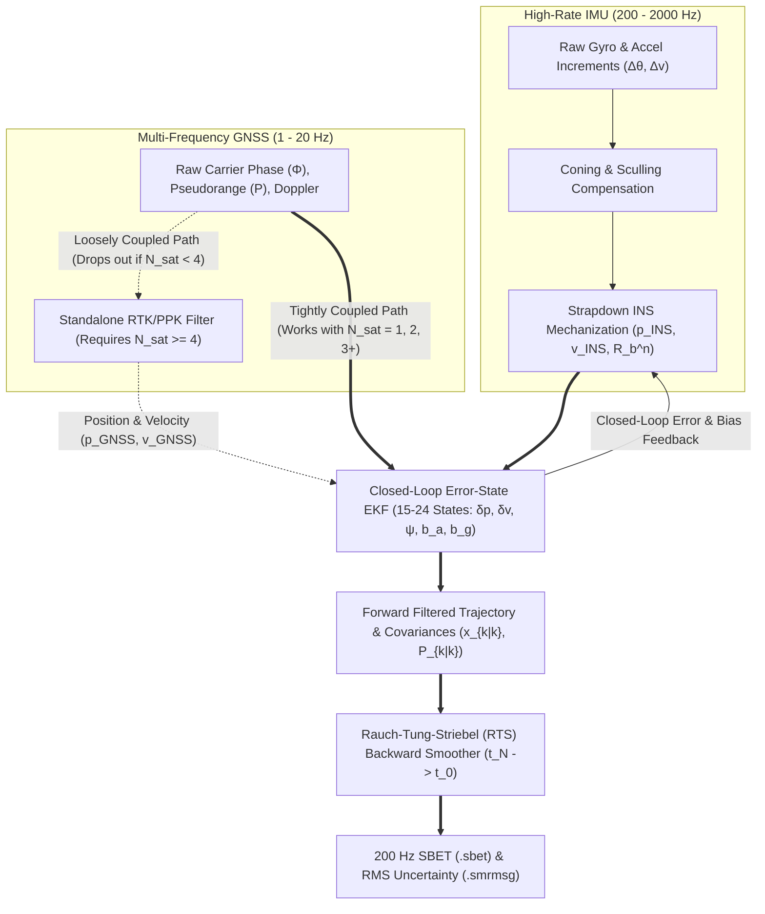

## 5.3 Inertial Measurement Units (IMU), INS, and Sensor Fusion

While carrier-phase Global Navigation Satellite Systems (GNSS; Section 5.2) establish centimeter-level absolute 3D position and velocity of an antenna phase center, GNSS alone cannot directly georeference active or passive elevation mapping sensors on moving platforms. Airborne LiDAR scanners ($100\text{ kHz}\text{–}2\text{ MHz}$ pulse rates), vessel-mounted multibeam echosounders (MBES, $10\text{–}50\text{ Hz}$ ping rates), uncrewed aerial vehicles (UAVs), and mobile terrestrial laser scanners require continuous, high-bandwidth ($200\text{–}2000\text{ Hz}$) measurements of **3D platform attitude**—roll ($\phi$), pitch ($\theta$), and heading/yaw ($\psi$)—to project each measured range vector $\mathbf{r}^s$ from the moving sensor frame into an Earth-fixed geodetic coordinate system. Furthermore, GNSS signals suffer from cycle slips, multipath, and complete dropouts under forest canopy, inside urban canyons, beneath bridges, and throughout the entire subsea domain where electromagnetic waves cannot penetrate.

To bridge these gaps and observe high-frequency angular and linear dynamics, modern elevation mapping systems fuse GNSS (or subsea acoustic positioning) with an **Inertial Navigation System (INS)**. At the core of every INS is an **Inertial Measurement Unit (IMU)** containing two orthogonal sensor triads fixed to the vehicle body frame ($b$-frame): three **gyroscopes** measuring the angular rate vector $\boldsymbol{\omega}_{ib}^b = [\omega_x, \omega_y, \omega_z]^T$ and three **accelerometers** measuring the specific force vector $\mathbf{f}^b = [f_x, f_y, f_z]^T$ relative to inertial space ($i$-frame). GNSS and INS exhibit strictly complementary error spectra: GNSS provides long-term, drift-free absolute accuracy with elevated high-frequency noise and susceptibility to environmental shadowing, whereas an IMU is completely self-contained, immune to external jamming or shadowing, and ultra-precise over millisecond-to-second intervals, but suffers from unbounded low-frequency drift when integrated over time.

---

### 5.3.1 Gyroscope and Accelerometer Physics

#### From Gimbaled Mechanical Gyros to Optical and Solid-State Strapdown Systems

Early inertial systems—tracing their lineage from Johann Bohnenberger's 1817 three-axis gimbaled rotor, Léon Foucault's 1852 gyroscope, and Elmer Sperry's 1908 marine gyrocompass to the 1942 LEV-3 guidance platform on the German V-2 rocket and Charles Stark Draper's gimbaled Apollo Primary Guidance, Navigation, and Control System (PGNCS)—relied on the conservation of angular momentum $\mathbf{H} = I_{\text{rotor}}\boldsymbol{\omega}_{\text{spin}}$ of a high-speed mechanical flywheel isolated from vehicle rotations by motorized mechanical gimbals. While gimbaled platforms kept the accelerometers physically leveled in the local navigation frame, their precision bearings suffered from mechanical wear, friction-induced drift, high power consumption, and catastrophic **gimbal lock** whenever two gimbal axes aligned during steep pitching maneuvers.

Between the late 1970s and 1990s, geodetic and hydrographic navigation transitioned entirely to **strapdown INS**, in which the IMU sensor triads are bolted rigidly ("strapped down") to the vehicle chassis and the local navigation frame is maintained mathematically in high-speed digital processors. Three physical gyroscope technologies dominate modern strapdown IMUs:

1. **Ring Laser Gyroscopes (RLG):** Based on the relativistic **Sagnac effect** discovered by Georges Sagnac in 1913, two counter-propagating (clockwise and counter-clockwise) monochromatic laser beams generated inside a closed triangular or square cavity of area $A$ and optical perimeter $L_{\text{cav}}$ machined into an ultra-low-expansion glass-ceramic block (e.g., Zerodur) experience an optical path difference $\Delta L = \frac{4A}{c}\Omega$ when the cavity rotates about its normal axis at angular rate $\Omega$. Because the resonant lasing wavelength must remain an integer sub-multiple of the effective cavity length, this path difference shifts the frequencies of the two counter-propagating modes, producing an interferometric beat frequency $\Delta\nu_{\text{RLG}}$ directly proportional to angular rate:
   $$\Delta\nu_{\text{RLG}} = \frac{4A}{\lambda L_{\text{cav}}}\Omega$$
   where $\lambda$ is the nominal He-Ne laser wavelength ($632.8\text{ nm}$) and $c$ is the speed of light. RLGs achieve exceptional scale-factor linearity ($< 1\text{ ppm}$) and bias stability ($< 0.003^\circ/\text{h}$). However, at very low rotation rates ($|\Omega| < \Omega_{\text{lock}} \approx 0.01^\circ/\text{s}$), imperfect mirror backscattering couples the two beams, locking them to a single frequency and creating a deadband (**laser lock-in**). To defeat lock-in, a piezoelectric **mechanical dither** motor continuously vibrates the RLG block rotationally at $300\text{–}800\text{ Hz}$ with random noise injection so the instantaneous angular rate spends virtually zero time inside the lock-in zone.
2. **Interferometric Fiber-Optic Gyroscopes (IFOG):** Rather than an active resonant laser cavity, an IFOG (such as those in the Exail/iXblue Phins or Northrop Grumman LN-200 series) injects broadband light from a superluminescent diode (SLD) into a passive coil of polarization-maintaining optical fiber of length $L_{\text{fiber}}$ ($200\text{ m}$ to $5\text{ km}$) wound around a spool of radius $R_{\text{coil}}$ (diameter $D = 2R_{\text{coil}}$). With $N_{\text{turns}} = L_{\text{fiber}} / (\pi D)$ turns enclosing a total effective area $A_{\text{tot}} = N_{\text{turns}}(\pi D^2 / 4) = L_{\text{fiber}} D / 4$, the Sagnac phase shift $\Delta\phi_{\text{FOG}}$ between the counter-propagating beams is:
   $$\Delta\phi_{\text{FOG}} = \frac{8\pi A_{\text{tot}}}{\lambda c}\Omega = \frac{4\pi L_{\text{fiber}} R_{\text{coil}}}{\lambda c}\Omega = \frac{2\pi L_{\text{fiber}} D}{\lambda c}\Omega$$
   Because an IFOG is a passive interferometer with no lasing threshold, it suffers **zero laser lock-in**, requires **no mechanical dither** (eliminating high-frequency structural vibrations that can alias into LiDAR mirror encoders or acoustic arrays), and can be scaled to strategic-grade sensitivity ($< 0.0005^\circ/\text{h}$) simply by increasing coil diameter $D$ and fiber length $L_{\text{fiber}}$. To suppress thermally induced non-reciprocal phase errors (**Shupe effect**), the fiber is wound in a symmetric quadrupole pattern so that counter-propagating wavepackets traverse identical thermal gradients at symmetric times.
3. **Coriolis Vibratory MEMS Gyroscopes:** Micro-Electro-Mechanical Systems (MEMS) gyroscopes photolithographically etch a microscopic silicon proof mass $m$ suspended on elastic flexures. Electrostatic comb drives oscillate the proof mass continuously at resonance along a drive axis with velocity $\mathbf{v}_{\text{drive}}$. When the sensor rotates at angular rate $\boldsymbol{\Omega}$, the non-inertial **Coriolis force**:
   $$\mathbf{F}_{\text{Coriolis}} = -2m\left(\boldsymbol{\Omega} \times \mathbf{v}_{\text{drive}}\right)$$
   deflects the oscillating mass along the orthogonal sense axis, where differential capacitive plates measure picometer-scale displacements. Modern closed-loop quartz and silicon MEMS gyros (e.g., Honeywell HG4930, Silicon Sensing PinPoint, Analog Devices ADIS series) have revolutionized UAV LiDAR and compact USV multibeam mapping due to their low cost, featherweight mass ($< 100\text{ g}$), and extreme shock survival, though their bias instability remains one to three orders of magnitude higher than optical gyros.

#### Specific Force and Accelerometer Sensing

By Einstein's Equivalence Principle, no local inertial sensor can distinguish between kinematic linear acceleration $\mathbf{a}_{\text{kin}} = \ddot{\mathbf{r}}_i$ and gravitational attraction $\mathbf{g}_m$. Instead, an accelerometer measures **specific force** $\mathbf{f}$—the non-gravitational mechanical force per unit mass acting on its internal proof mass:

$$\mathbf{f} = \mathbf{a}_{\text{kin}} - \mathbf{g}_m$$

Consequently, an accelerometer resting stationary on a level table on Earth's surface ($\mathbf{a}_{\text{kin}} \approx \mathbf{0}$, ignoring small centrifugal terms) reads an *upward* specific force of $f_z = -g \approx -9.81\text{ m/s}^2$ (in a Down-positive frame), whereas an accelerometer in orbital free-fall ($\mathbf{a}_{\text{kin}} = \mathbf{g}_m$) reads $\mathbf{f} = \mathbf{0}$. Navigation- and tactical-grade IMUs employ either **pendulous electromagnetic force-balance accelerometers** (such as the Honeywell Q-Flex, where an etched quartz flexure pendulum is held at its null position by a current feedback loop through a permanent magnetic field) or **vibrating quartz beam (VB) accelerometers** (where specific force alters the resonant frequency of double-ended quartz tuning forks under tension/compression). Industrial and consumer units use differential capacitive MEMS proof masses.

---

### 5.3.2 Allan Variance Noise Taxonomy and Swath Attitude Error Budget

If an IMU has a constant accelerometer bias $b_a$ and a constant horizontal gyroscope bias $b_g$ while operating unaided over a short time interval $t$, double integration of specific force causes horizontal position error to grow quadratically with accelerometer bias and **cubically** with gyroscope bias (because a linear tilt drift $\delta\phi(t) = b_g t$ projects Earth's gravity vector $g \approx 9.81\text{ m/s}^2$ onto the horizontal axis as a false acceleration $g b_g t$):

$$\delta p_{\text{horiz}}(t) \approx \frac{1}{2} b_a t^2 + \frac{1}{6} g b_g t^3$$

In reality, IMU errors are not purely constant biases; they are a superposition of stochastic noise processes operating across different timescales. To quantify these processes without divergence from low-frequency flicker noise, inertial engineers use the **Allan variance** $\sigma_A^2(\tau)$ (Allan, 1966; IEEE Std 952-1997). Given a long stationary time series of temperature-stabilized gyroscope angular rate (or accelerometer specific force) sampled at interval $\Delta t_0$ and partitioned into $M$ non-overlapping clusters of averaging time $\tau = m\Delta t_0$ with cluster means $\bar{\Omega}_k(\tau) = \frac{1}{m}\sum_{j=1}^m \Omega_{(k-1)m+j}$, the Allan variance and **Allan deviation (ADEV)** $\sigma_A(\tau)$ are defined as:

$$\sigma_A^2(\tau) = \frac{1}{2(M-1)} \sum_{k=1}^{M-1} \left( \bar{\Omega}_{k+1}(\tau) - \bar{\Omega}_k(\tau) \right)^2, \qquad \sigma_A(\tau) = \sqrt{\sigma_A^2(\tau)}$$

Because statistically independent noise sources add in variance, plotting $\log_{10}\sigma_A(\tau)$ against $\log_{10}\tau$ (for consistent time units of $\sigma_A$ and $\tau$) decomposes the sensor's error signature into five canonical power-law slopes:

$$\sigma_A^2(\tau) = \frac{3 Q^2}{\tau^2} + \frac{N^2}{\tau} + \left(\frac{2\ln 2}{\pi}\right) B^2 + \frac{K^2 \tau}{3} + \frac{R^2 \tau^2}{2}$$

1. **Quantization Noise (Slope $-1$, Coefficient $Q$ in $\text{arcsec}$ or $\text{m/s}$):** High-frequency digital bit-discretization noise of the integrated angle ($\Delta\theta$) or velocity ($\Delta v$) output. When $\sigma_A(\tau)$ is plotted in $\text{deg/h}$ against $\tau$ in seconds, the $-1$ slope asymptote read at $\tau = \sqrt{3}\text{ s}$ yields $Q$ directly in $\text{arcsec}$ (since $1\text{ (deg/h)}\cdot\text{s} = 1''$).
2. **Angle Random Walk (ARW) / Velocity Random Walk (VRW) (Slope $-1/2$, Coefficient $N$ in $\text{deg}/\sqrt{\text{h}}$ or $\text{m/s}/\sqrt{\text{h}}$):** Broadband white noise in angular rate (caused by photon shot noise in optical gyros or thermo-mechanical Brownian noise in MEMS) or specific force. Integrating white rate noise yields a random walk in attitude angle whose standard deviation grows with the square root of elapsed time: $\sigma_\phi(t) = N\sqrt{t}$. On an ADEV plot with $\sigma_A$ in $\text{deg/h}$ and $\tau$ in seconds, the $-1/2$ slope asymptote is read at $\tau = 1\text{ s}$ and divided by $60$ to convert from $\text{deg/h}\cdot\sqrt{\text{s}}$ to $\text{deg}/\sqrt{\text{h}}$.
3. **Bias Instability ($1/f$ Flicker Floor, Slope $0$, Coefficient $B$ in $\text{deg/h}$ or $\mu\text{g}$):** The flat minimum valley of the ADEV curve where $\sigma_{A,\min} = \sqrt{\frac{2\ln 2}{\pi}}\,B \approx 0.664\,B$. Driven by $1/f$ flicker noise in electronics and optical components, $B$ represents the fundamental lower bound on how well the sensor bias can ever be estimated by a Kalman filter over the optimal averaging time $\tau_{\text{opt}}$ ($100\text{–}1000\text{ s}$).
4. **Rate Random Walk (RRW) (Slope $+1/2$, Coefficient $K$ in $\text{deg/h}^{3/2}$):** White noise driving the time derivative of the sensor bias ($\dot{b} = w_b$), causing the bias itself to wander over long intervals; read along the $+1/2$ slope asymptote at $\tau = 3\text{ h}$ (or at $\tau = 3\text{ s}$ and multiplied by $60$ to convert from $\text{deg/h}/\sqrt{\text{s}}$ to $\text{deg/h}^{3/2}$).
5. **Rate Ramp (Slope $+1$, Coefficient $R$ in $\text{deg/h}^2$):** Deterministic monotonic drift caused by thermal warm-up transients or component aging; read along the $+1$ slope asymptote at $\tau = \sqrt{2}\text{ h}$ (or at $\tau = \sqrt{2}\text{ s}$ and multiplied by $3600$ to convert from $\text{deg/h/s}$ to $\text{deg/h}^2$).

#### Swath Mapping Attitude Error Amplification

In wide-swath elevation mapping (both airborne LiDAR and marine multibeam sonar), IMU attitude quality directly governs outer-beam vertical accuracy. For a sensor measuring slant range $r$ at beam nadir angle $\theta_{\text{beam}}$ (cross-track distance $y = r\sin\theta_{\text{beam}}$ and vertical height/depth $H = r\cos\theta_{\text{beam}}$), a small roll error $\delta\phi$ (in radians) induces a vertical elevation/depth error $\delta z_{\text{roll}}$ and horizontal cross-track error $\delta y_{\text{roll}}$ of:

$$\delta z_{\text{roll}} = r \sin\theta_{\text{beam}}\,\delta\phi = y\,\delta\phi = H \tan\theta_{\text{beam}}\,\delta\phi, \qquad \delta y_{\text{roll}} = -r\cos\theta_{\text{beam}}\,\delta\phi = -H\,\delta\phi$$

Because $\delta z_{\text{roll}}$ scales linearly with cross-track distance $y$, an outer MBES beam at $\theta_{\text{beam}} = 65^\circ$ in $H = 100\text{ m}$ water depth ($y = 214.5\text{ m}$) or an airborne LiDAR beam at $\theta_{\text{beam}} = 30^\circ$ from $H = 1000\text{ m}$ above ground level ($y = 577.4\text{ m}$) acts as a massive optical/acoustic lever arm that magnifies microradian attitude errors into decimeter-to-meter elevation errors (Table 5.1).

| IMU Grade | Primary Sensor Technologies | Gyro Bias Instability $B$ ($\text{deg/h}$) | Gyro ARW $N$ ($\text{deg}/\sqrt{\text{h}}$) | Accel Bias Instability ($\mu\text{g}$) | Post-Processed Roll/Pitch RMSE $\sigma_{\phi,\theta}$ | Post-Processed Heading RMSE $\sigma_\psi$ | Outer-Beam $\sigma_{z,\text{roll}}$ ($H=100\text{ m}$, $\theta=60^\circ$, $y=173.2\text{ m}$) |
| :--- | :--- | :--- | :--- | :--- | :--- | :--- | :--- |
| **Navigation / Marine Survey** | RLG, High-End IFOG + Q-Flex / VB Accel | $0.001 \text{ – } 0.01$ | $0.001 \text{ – } 0.005$ | $5 \text{ – } 25$ | $0.002^\circ \text{ – } 0.005^\circ$ ($35\text{–}87\,\mu\text{rad}$) | $0.008^\circ \text{ – } 0.015^\circ$ | **$0.6 \text{ – } 1.5\text{ cm}$** |
| **Tactical (High-End)** | Compact IFOG, Quartz/Closed-Loop MEMS | $0.05 \text{ – } 0.5$ | $0.01 \text{ – } 0.05$ | $25 \text{ – } 100$ | $0.005^\circ \text{ – } 0.015^\circ$ ($87\text{–}262\,\mu\text{rad}$) | $0.015^\circ \text{ – } 0.040^\circ$ | **$1.5 \text{ – } 4.5\text{ cm}$** |
| **Industrial / UAV Mapping** | Calibrated Silicon Capacitive MEMS | $1.0 \text{ – } 10.0$ | $0.08 \text{ – } 0.30$ | $100 \text{ – } 500$ | $0.015^\circ \text{ – } 0.040^\circ$ ($262\text{–}698\,\mu\text{rad}$) | $0.050^\circ \text{ – } 0.150^\circ$ | **$4.5 \text{ – } 12.1\text{ cm}$** |
| **Consumer / Automotive** | Uncompensated Chip-Scale MEMS | $10.0 \text{ – } 100+$ | $0.30 \text{ – } 2.00$ | $500 \text{ – } 5000$ | $0.100^\circ \text{ – } 0.500^\circ$ ($1.75\text{–}8.73\text{ mrad}$) | $0.300^\circ \text{ – } 2.000^\circ$ | **$30.2 \text{ – } 151.1\text{ cm}$** |

*Table 5.1: Taxonomy of IMU performance grades, Allan variance parameters, post-processed tightly coupled GNSS/INS attitude accuracy, and resulting outer-beam vertical swath error at $y = 173.2\text{ m}$ cross-track distance.*

In agency specifications, Table 5.1 directly dictates hardware selection across elevation mapping domains. For **USGS 3DEP Quality Level 1 and 2 (QL1/QL2)** airborne LiDAR surveys (`USGS Lidar Base Specification`, requiring Non-Vegetated Vertical Accuracy $\text{NVA}_{95\%} \le 19.6\text{ cm}$, or $\text{RMSE}_z \le 10.0\text{ cm}$, and swath-to-swath overlap $\text{RMSDZ} \le 8.0\text{ cm}$ per **ASPRS Positional Accuracy Standards**) flown at $H = 1000\text{–}2000\text{ m}$ AGL, a navigation- or high-end tactical-grade IMU ($\sigma_{\phi,\theta} \le 0.005^\circ$) is mandatory so that outer-beam roll uncertainty stays below $5\text{ cm}$ ($1\sigma$). Conversely, low-altitude UAV LiDAR missions flying at $H = 50\text{–}80\text{ m}$ AGL ($y < 50\text{ m}$) can meet ASPRS $10\text{ cm}$ accuracy class thresholds using calibrated industrial MEMS IMUs ($\sigma_{\phi,\theta} \approx 0.025^\circ \implies \sigma_{z,\text{roll}} \approx 2.2\text{ cm}$). In marine hydrography governed by **IHO S-44 (6th Edition, 2020)** and the **NOAA Hydrographic Surveys Specifications and Deliverables (HSSD)**, where maximum allowable $95\%$ Total Vertical Uncertainty is $\text{TVU}_{\max}(d) = \sqrt{a^2 + (b \cdot d)^2}$ (with $a = 0.25\text{ m}, b = 0.0075$ for Special Order and $a = 0.15\text{ m}, b = 0.0075$ for Exclusive Order), consuming less than half of the depth-dependent error budget $b \cdot d$ at a $60^\circ\text{–}65^\circ$ outer multibeam sector requires a navigation-grade IFOG/RLG marine motion reference unit ($\sigma_{\phi,\theta} \le 0.005^\circ\text{–}0.010^\circ$).

---

### 5.3.3 Strapdown INS Mechanization in the Rotating, Gravitating Earth Frame

To propagate the vehicle's trajectory from raw IMU outputs, a strapdown INS integrates differential equations across four primary coordinate frames:
1. **Earth-Centered Inertial ($i$-frame):** Origin at Earth's center of mass; axes non-rotating with respect to distant extragalactic quasars.
2. **Earth-Centered, Earth-Fixed ($e$-frame, ECEF):** Origin at Earth's center of mass; rotating with the Earth about its polar $Z$-axis at constant sidereal angular rate $\boldsymbol{\omega}_{ie}^e = [0, 0, \omega_{ie}]^T$, where $\omega_{ie} = 7.2921150 \times 10^{-5}\text{ rad/s}$ ($15.04107^\circ/\text{h}$).
3. **Local Navigation Frame ($n$-frame, NED):** Origin at the IMU sensing reference point; axes aligned with local geodetic **North ($N$), East ($E$), and ellipsoidal Down ($D$)**. (In aerospace and marine navigation, the right-handed NED convention is standard so that positive roll $\phi$ is right-wing/starboard down, positive pitch $\theta$ is nose/bow up, and positive heading $\psi$ is clockwise from North.)
4. **Sensor Body Frame ($b$-frame):** Origin at the IMU reference point; axes fixed to the IMU housing ($x$-forward, $y$-starboard/right, $z$-down).

#### Continuous-Time Mechanization Equations

In the local NED navigation frame ($n$-frame), the coupled **Strapdown INS Mechanization Differential Equations** govern the time evolution of the body-to-navigation Direction Cosine Matrix (DCM) $\mathbf{R}_b^n \in \text{SO}(3)$, the Earth-referenced velocity vector $\mathbf{v}^n = [v_N, v_E, v_D]^T$, and the curvilinear geodetic position $\mathbf{p} = [\varphi, \lambda, h]^T$ (geodetic latitude $\varphi$, longitude $\lambda$, and ellipsoidal height $h$):

$$\dot{\mathbf{R}}_b^n = \mathbf{R}_b^n \left[\boldsymbol{\omega}_{ib}^b\right]_\times - \left[\boldsymbol{\omega}_{in}^n\right]_\times \mathbf{R}_b^n, \qquad \text{where } \boldsymbol{\omega}_{in}^n = \boldsymbol{\omega}_{ie}^n + \boldsymbol{\omega}_{en}^n$$

$$\dot{\mathbf{v}}^n = \mathbf{R}_b^n \mathbf{f}^b - \left( 2\boldsymbol{\omega}_{ie}^n + \boldsymbol{\omega}_{en}^n \right) \times \mathbf{v}^n + \mathbf{g}_l^n(\varphi, h)$$

$$\dot{\varphi} = \frac{v_N}{R_M(\varphi) + h}, \qquad \dot{\lambda} = \frac{v_E}{\left(R_N(\varphi) + h\right)\cos\varphi}, \qquad \dot{h} = -v_D$$

Here $[\mathbf{u}]_\times$ denotes the $3\times 3$ skew-symmetric cross-product matrix of vector $\mathbf{u}$, and $R_M(\varphi) = \frac{a(1-e^2)}{(1-e^2\sin^2\varphi)^{3/2}}$ and $R_N(\varphi) = \frac{a}{(1-e^2\sin^2\varphi)^{1/2}}$ are the meridian and prime-vertical radii of curvature of the reference ellipsoid (Chapter 2). Each term in the attitude and velocity equations carries a distinct physical meaning:

* **Earth Rotation Rate in the $n$-frame ($\boldsymbol{\omega}_{ie}^n$):** Because the gyroscopes sense angular rate relative to inertial space ($i$-frame), Earth's sidereal rotation vector resolved into the local North-East-Down axes must be subtracted:
  $$\boldsymbol{\omega}_{ie}^n = \begin{bmatrix} \omega_{ie}\cos\varphi \\ 0 \\ -\omega_{ie}\sin\varphi \end{bmatrix}$$
  Notice that for a stationary, level navigation-grade IMU ($\mathbf{v}^n = \mathbf{0}$), the horizontal gyroscopes directly measure the northward horizontal component $\omega_{ie}\cos\varphi$, allowing an optical INS to self-align to **true geodetic North without magnetic compasses or GNSS** (**gyrocompassing**)—provided the gyroscope bias $b_g \ll \omega_{ie}\cos\varphi$ (to achieve $0.05^\circ$ heading accuracy at $\varphi = 45^\circ$, the east-axis gyro bias must be $< \omega_{ie}\cos(45^\circ)\sin(0.05^\circ) \approx 0.009^\circ/\text{h}$, explaining why only navigation-grade RLGs/FOGs can gyrocompass while MEMS IMUs cannot).
* **Transport Rate ($\boldsymbol{\omega}_{en}^n$):** As the survey platform moves horizontally at velocity $(v_N, v_E)$ over the curved ellipsoid, the local tangent NED plane continuously tilts relative to the Earth-fixed $e$-frame at the transport rate:
  $$\boldsymbol{\omega}_{en}^n = \begin{bmatrix} \dfrac{v_E}{R_N(\varphi) + h} \\[8pt] -\dfrac{v_N}{R_M(\varphi) + h} \\[8pt] -\dfrac{v_E \tan\varphi}{R_N(\varphi) + h} \end{bmatrix}$$
  Note the bottom term $\omega_{en,D} = -v_E\tan\varphi / (R_N + h)$: near the geographic poles ($\varphi \to \pm 90^\circ$), $\tan\varphi \to \infty$ as meridians converge, requiring polar airborne/submarine surveys to switch from an NED frame to a **wander-azimuth** or direct **ECEF ($e$-frame)** mechanization.
* **Coriolis and Centripetal Accelerations ($-\left(2\boldsymbol{\omega}_{ie}^n + \boldsymbol{\omega}_{en}^n\right) \times \mathbf{v}^n$):** Moving at velocity $\mathbf{v}^n$ inside a rotating reference frame generates a fictive **Coriolis acceleration** $-2\boldsymbol{\omega}_{ie}^n \times \mathbf{v}^n$ and a **centripetal/transport acceleration** $-\boldsymbol{\omega}_{en}^n \times \mathbf{v}^n$. For an airborne LiDAR aircraft flying north at $v_N = 100\text{ m/s}$ at $\varphi = 45^\circ\text{ N}$, the eastward Coriolis acceleration has magnitude $2\omega_{ie}v_N\sin\varphi \approx 0.0103\text{ m/s}^2 \approx 1051\,\mu\text{g}$—more than $40\times$ larger than the bias stability of a tactical accelerometer! In the vertical channel, the upward Coriolis component $2\omega_{ie}v_E\cos\varphi + \frac{v_N^2}{R_M+h} + \frac{v_E^2}{R_N+h}$ is the **Eötvös effect**, which reduces apparent downward gravity when traveling eastward.
* **Local Plumb-Line Gravity Vector ($\mathbf{g}_l^n(\varphi, h)$):** Combines pure Newtonian gravitational attraction $\mathbf{g}_m^n$ and the centrifugal acceleration of Earth's rotation $-\boldsymbol{\omega}_{ie}^n \times (\boldsymbol{\omega}_{ie}^n \times \mathbf{r})$. In standard INS software, $\mathbf{g}_l^n \approx [0, 0, \gamma(\varphi, h)]^T$ is evaluated using the Somigliana-Pizzetti normal gravity formula (Chapter 2); for ultra-high-precision inertial surveys over trenches or mountain ranges, local **deflections of the vertical** ($\xi, \eta$, typically $5''\text{–}30''$) from a high-degree global gravity model (EGM2008 / XGM2019e) must be supplied so that unmodeled horizontal gravity anomalies $\delta\mathbf{g}_h = [-g\xi, -g\eta]^T$ do not masquerade as accelerometer biases and corrupt roll/pitch attitude by $\delta\phi = \eta$, $\delta\theta = -\xi$.

#### High-Speed Coning and Sculling Integration

Because finite 3D rotations in $\text{SO}(3)$ do not commute ($\mathbf{R}_1 \mathbf{R}_2 \neq \mathbf{R}_2 \mathbf{R}_1$), integrating discrete angular increments $\Delta\boldsymbol{\theta}_k = \int_{t_{k-1}}^{t_k} \boldsymbol{\omega}_{ib}^b\,dt$ at low rates fails under dynamic vibration. If a survey aircraft or vessel undergoes simultaneous out-of-phase angular oscillations along two orthogonal axes (e.g., roll and pitch engine vibrations at frequency $f_{\text{vib}}$), the third axis traces a cone in space (**coning motion**), producing a non-zero net rotation rate around the third axis even though the mean angular rates along all three axes are zero. Similarly, simultaneous angular oscillation along one axis and linear vibration along a perpendicular axis at the same frequency rectifies into a false net linear velocity drift along the third axis (**sculling motion**). To prevent coning and sculling rectification, modern IMU hardware samples internal sensors at $1000\text{–}4000\text{ Hz}$ and applies two-speed Bortz rotation-vector **coning** ($\Delta\boldsymbol{\phi}_{\text{con}} \approx \frac{1}{2}\Delta\boldsymbol{\theta}_{k-1} \times \Delta\boldsymbol{\theta}_k$) and **sculling** ($\Delta\mathbf{v}_{\text{scul}} \approx \frac{1}{2}(\Delta\boldsymbol{\theta}_k \times \Delta\mathbf{v}_k + \Delta\boldsymbol{\theta}_{k-1} \times \Delta\mathbf{v}_k + \Delta\mathbf{v}_{k-1} \times \Delta\boldsymbol{\theta}_k)$) corrections inside the IMU firmware before outputting $100\text{–}400\text{ Hz}$ compensated increments.

#### The $84.4\text{-Minute}$ Schuler Pendulum vs. Exponential Vertical Instability

A profound mathematical dichotomy separates the horizontal and vertical error dynamics of an unaided strapdown INS:

* **Horizontal Channels (Bounded Schuler Oscillation):** Suppose an unaided INS develops a small northward tilt (pitch) error $\delta\theta$. The northward accelerometer immediately senses a component of downward gravity, inducing a velocity error rate $\delta\dot{v}_N = -g\,\delta\theta$. However, as the northward velocity error $\delta v_N$ grows, the INS transport-rate calculation $\omega_{en,E} = -v_N / (R_M + h)$ rotates the computed navigation frame in the opposite sense at rate $\delta\dot{\theta} = \delta v_N / R_E$ (where $R_E \approx 6371\text{ km}$ is Earth's mean radius). Differentiating and substituting yields an undamped harmonic oscillator:
  $$\delta\ddot{\theta} + \frac{g}{R_E}\delta\theta = -\frac{\delta f_N}{R_E} \implies \omega_S = \sqrt{\frac{g}{R_E}} \approx 1.238 \times 10^{-3}\text{ rad/s}, \qquad T_S = 2\pi\sqrt{\frac{R_E}{g}} \approx 5063\text{ s} \approx 84.4\text{ min}$$
  This negative-feedback loop is the **Schuler pendulum** (Schuler, 1923)—equivalent to a physical pendulum whose length equals Earth's radius $R_E$. Because of Schuler tuning, a constant horizontal accelerometer bias $b_a$ does *not* grow quadratically forever; instead, it is bounded to a sinusoidal oscillation of period $84.4\text{ minutes}$ with maximum attitude error $\delta\theta_{\max} = b_a / g$ and maximum position error $\delta p_{\max} = R_E(b_a / g)$.
* **Vertical Channel (Unbounded Exponential Divergence):** In the vertical channel, no stabilizing transport-rate feedback exists. Worse, normal gravity *decreases* with ellipsoidal height $h$ according to the free-air gravity gradient:
  $$\gamma(h) \approx \gamma_0 \left(1 - \frac{2h}{R_E}\right) \implies \frac{\partial\gamma}{\partial h} \approx -\frac{2g}{R_E}$$
  If the INS vertical height estimate $\hat{h}$ has a small positive upward error $\delta h = \hat{h} - h > 0$, the INS gravity model evaluates $\gamma(\hat{h})$ at too high an altitude, **underestimating** downward gravity by $\delta\gamma = -\frac{2g}{R_E}\delta h$. Because $\ddot{h} = -(\dot{v}_D) = f_U - \gamma(\hat{h})$, underestimating downward gravity causes the INS to compute a false *upward* acceleration $+\frac{2g}{R_E}\delta h$ that drives $\delta h$ even higher! This positive-feedback differential equation has an unstable exponential solution:
  $$\delta\ddot{h} - \frac{2g}{R_E}\delta h = \delta f_U \implies \delta h(t) = C_1 \exp\!\left(+\frac{t}{\tau_{\text{vert}}}\right) + C_2 \exp\!\left(-\frac{t}{\tau_{\text{vert}}}\right), \qquad \tau_{\text{vert}} = \sqrt{\frac{R_E}{2g}} = \frac{T_S}{2\pi\sqrt{2}} \approx 570\text{ s} \approx 9.5\text{ min}$$
  Thus, **the free-inertial vertical channel is mathematically unstable**, doubling any initial altitude or vertical accelerometer error every $\tau_{\text{vert}}\ln 2 \approx 6.6\text{ minutes}$. Every operational INS must continuously damp its vertical channel using an external height reference: carrier-phase GNSS ellipsoidal height $h_{\text{GNSS}}$ (or barometric altimetry) in airborne/terrestrial mapping, and a precision quartz hydrostatic pressure depth sensor (Section 5.4) in underwater AUV/ROV surveys.

---

### 5.3.4 Loosely vs. Tightly Coupled GNSS/INS Integration and RTS Smoothing (SBET)

#### The Error-State Extended Kalman Filter (ES-EKF)

Because the total navigation states ($\mathbf{p}, \mathbf{v}, \mathbf{R}_b^n$) evolve nonlinearly at high bandwidth ($200\text{–}1000\text{ Hz}$), geodetic INS/GNSS processors do not filter the total states directly. Instead, they integrate the full strapdown mechanization at the native IMU rate as a deterministic reference trajectory and run a closed-loop **Error-State Extended Kalman Filter (ES-EKF)** (Kalman, 1960; Groves, 2013) that estimates a low-dynamic **error-state vector** $\delta\mathbf{x} \in \mathbb{R}^{15}$ (often augmented to $21\text{–}24+$ states with scale-factor errors $\mathbf{s}_a, \mathbf{s}_g$, GNSS lever-arm errors $\delta\mathbf{l}_{\text{GNSS}}^b$, and receiver clock offset/drift):

$$\delta\mathbf{x} = \begin{bmatrix} (\delta\mathbf{p}^n)^T & (\delta\mathbf{v}^n)^T & (\boldsymbol{\psi}^n)^T & (\mathbf{b}_a^b)^T & (\mathbf{b}_g^b)^T \end{bmatrix}^T$$

where $\delta\mathbf{p}^n = [\delta\varphi, \delta\lambda, \delta h]^T$ are 3D geodetic position errors, $\delta\mathbf{v}^n = [\delta v_N, \delta v_E, \delta v_D]^T$ are 3D velocity errors, $\boldsymbol{\psi}^n = [\delta\phi, \delta\theta, \delta\psi]^T$ are the small-angle attitude misalignment errors of the computed navigation frame ($\hat{\mathbf{R}}_b^n = (\mathbf{I}_3 - [\boldsymbol{\psi}^n]_\times)\mathbf{R}_b^n$), and $\mathbf{b}_a^b, \mathbf{b}_g^b$ are the residual accelerometer and gyroscope biases modeled as first-order Gauss-Markov processes ($\dot{\mathbf{b}} = -\frac{1}{\tau_{\text{GM}}}\mathbf{b} + \mathbf{w}_b$). Whenever an external aiding measurement arrives at epoch $t_k$, the ES-EKF computes the innovation $\delta\mathbf{z}_k$, updates the error state $\delta\hat{\mathbf{x}}_{k|k}$ and error covariance $\mathbf{P}_{k|k}$, **feeds the estimated corrections directly back into the strapdown mechanization** ($\hat{\mathbf{p}} \leftarrow \hat{\mathbf{p}} - \delta\hat{\mathbf{p}}$, $\hat{\mathbf{v}} \leftarrow \hat{\mathbf{v}} - \delta\hat{\mathbf{v}}$, $\hat{\mathbf{R}}_b^n \leftarrow \exp\!\left([\hat{\boldsymbol{\psi}}^n]_\times\right)\hat{\mathbf{R}}_b^n$, $\hat{\mathbf{b}} \leftarrow \hat{\mathbf{b}} + \delta\hat{\mathbf{b}}$), and resets the kinematic error states to zero so that the small-angle linearization remains strictly valid.



#### Loosely Coupled vs. Tightly Coupled Architectures

As illustrated in the architecture diagram above, GNSS and INS can be fused at two distinct levels:

1. **Loosely Coupled (LC, Cascaded Position-Domain Integration):** A standalone RTK/PPK GNSS engine first solves for the 3D position and velocity of the antenna ($\mathbf{p}_{\text{GNSS}}, \mathbf{v}_{\text{GNSS}}$) using its own internal Kalman filter. The INS EKF then ingests the difference between the INS-predicted antenna position and the GNSS position as its measurement innovation:
   $$\delta\mathbf{z}_{\text{LC},p} = \left(\hat{\mathbf{p}}_{\text{IMU}}^n + \mathbf{D}_R^{-1}\hat{\mathbf{R}}_b^n \mathbf{l}_{\text{GNSS}}^b\right) - \mathbf{p}_{\text{GNSS}}^n$$
   where $\mathbf{D}_R = \text{diag}(R_M+h, (R_N+h)\cos\varphi, -1)$ converts metric NED lever-arm offsets to geodetic coordinates. **Why LC fails in challenging terrain:** First, cascading two Kalman filters in series violates the white-noise measurement assumption of the INS EKF because the output of the GNSS filter is time-correlated, requiring ad-hoc covariance inflation. Second, and fatally for mobile terrestrial, UAV-canopy, and steep-valley mapping, **if the number of tracked satellites drops below $N_{\text{sat}} < 4$**, the standalone GNSS solver cannot compute a 3D position + receiver clock solution and outputs *nothing*. The INS is forced into pure free-inertial dead reckoning, even if 2 or 3 clean satellites remain in view!
2. **Tightly Coupled (TC, Centralized Measurement-Domain Integration):** The standalone GNSS position filter is eliminated. Instead, raw double-differenced (or undifferenced PPP) carrier-phase ($\nabla\Delta\Phi_{AB}^{jk}$), pseudorange ($\nabla\Delta P_{AB}^{jk}$), and Doppler range-rate ($\nabla\Delta\dot{\rho}_{AB}^{jk}$) observables from every individual satellite are fed directly into a single unified GNSS/INS EKF and differenced against the geometric satellite-to-antenna ranges predicted by the strapdown INS:
   $$\delta z_{\text{TC},\Phi}^{jk} = \nabla\Delta\Phi_{AB}^{jk} - \left( \nabla\Delta\hat{\rho}_{\text{INS},AB}^{jk} + \lambda \nabla\Delta\hat{N}_{AB}^{jk} \right)$$
   **Why TC is mandatory for high-accuracy elevation mapping:**
   * *Continued aiding with $N_{\text{sat}} < 4$:* Even when trees, buildings, or canyon walls block all but $1, 2,$ or $3$ satellites, each surviving satellite's carrier phase and Doppler continues to constrain the INS error growth along its line-of-sight vector and calibrate the IMU biases.
   * *INS-aided cycle-slip repair and instant ambiguity resolution:* During a complete brief blockage (e.g., passing under a highway overpass or during a $30^\circ$ vessel roll that submerges or shadows the antenna), the strapdown INS predicts the antenna position to within a few centimeters over several seconds—well inside half an L1 carrier wavelength ($\frac{1}{2}\lambda_{L1} \approx 9.5\text{ cm}$). When satellite lock returns, the tightly coupled filter detects cycle slips immediately and re-fixes integer ambiguities in a single epoch.

#### Rauch-Tung-Striebel (RTS) Forward-Backward Smoothing and the SBET

A real-time causal EKF at epoch $t_k$ can only use measurements from the past and present ($t_0 \dots t_k$). During a complete GNSS outage of duration $\Delta t$ (e.g., an aircraft banking steeply or a mobile mapping van driving through a tunnel), the forward EKF position error grows with time; the instant GNSS lock is regained at $t_{\text{reacquire}}$, the causal EKF applies a large innovation update that snaps the trajectory back to the true path. If a DEM is generated from a forward-only trajectory, this re-acquisition jump creates a severe **sawtooth step discontinuity** in the terrain surface!

Because topographic and hydrographic DEMs are almost always finalized in post-processing after the survey concludes, we have access to measurements across the *entire* mission interval $[t_0, t_N]$. Post-processing packages (e.g., Applanix POSPac MMS, NovAtel Inertial Explorer) apply the **Rauch-Tung-Striebel (RTS) fixed-interval backward smoother** (Rauch, Tung, & Striebel, 1965). After the forward EKF pass saves the filtered state $\delta\hat{\mathbf{x}}_{k|k}$, filtered covariance $\mathbf{P}_{k|k}$, predicted state $\delta\hat{\mathbf{x}}_{k+1|k} = \boldsymbol{\Phi}_{k,k+1}\delta\hat{\mathbf{x}}_{k|k}$, and predicted covariance $\mathbf{P}_{k+1|k} = \boldsymbol{\Phi}_{k,k+1}\mathbf{P}_{k|k}\boldsymbol{\Phi}_{k,k+1}^T + \mathbf{Q}_k$ at every epoch, a deterministic backward sweep runs from $k = N-1$ down to $0$:

$$\mathbf{K}_k^{\text{RTS}} = \mathbf{P}_{k|k} \boldsymbol{\Phi}_{k,k+1}^T \left(\mathbf{P}_{k+1|k}\right)^{-1}$$

$$\delta\hat{\mathbf{x}}_{k|N} = \delta\hat{\mathbf{x}}_{k|k} + \mathbf{K}_k^{\text{RTS}} \left( \delta\hat{\mathbf{x}}_{k+1|N} - \delta\hat{\mathbf{x}}_{k+1|k} \right)$$

$$\mathbf{P}_{k|N} = \mathbf{P}_{k|k} + \mathbf{K}_k^{\text{RTS}} \left( \mathbf{P}_{k+1|N} - \mathbf{P}_{k+1|k} \right) \left(\mathbf{K}_k^{\text{RTS}}\right)^T$$

where $\mathbf{K}_k^{\text{RTS}}$ is the RTS smoothing gain and $\boldsymbol{\Phi}_{k,k+1}$ is the error-state transition matrix. Physically, RTS smoothing blends forward dead-reckoning from the start of a GNSS outage with backward dead-reckoning from the end of the outage:
1. It **completely eliminates the sawtooth discontinuity** at GNSS re-acquisition, converting a step jump into a smooth, differentiable bridge.
2. It shifts the peak uncertainty from the end of the outage ($\Delta t$) to the midpoint ($\Delta t / 2$), reducing the maximum position RMSE during a GNSS dropout by a factor of **$4\times$ to $8\times$** compared to forward-only filtering.

The resulting $200\text{ Hz}$ post-processed trajectory is exported in the industry-standard binary **SBET** (*Smoothed Best Estimate of Trajectory*, `.sbet`, storing $17 \times \text{float64}$ fields per record: GPS time of week, latitude $\varphi$, longitude $\lambda$, ellipsoidal height $h$, $v_x, v_y, v_z$, roll $\phi$, pitch $\theta$, heading $\psi$, wander angle, $f_x, f_y, f_z$, and $\omega_x, \omega_y, \omega_z$) accompanied by its companion **SMRMSG** (*Smoothed RMS Error*, `.smrmsg`, storing $10 \times \text{float64}$ standard deviations of position, velocity, and attitude for full TPU propagation).

---

### 5.3.5 Lever Arms, Boresight Angles, and Microsecond Hardware Time Synchronization

Even with a millimeter-accurate SBET at the IMU's internal sensing center, the active mapping sensor (LiDAR optical mirror origin, camera perspective center, or MBES acoustic transducer phase center) and the GNSS antenna phase center (APC) are physically displaced from the IMU by rigid translational offsets (**lever arms**), rotational misalignments (**boresight angles**), and clock offsets (**time latency**).

#### 1. Lever Arms ($\mathbf{l}_{\text{lever}}^b = [\Delta x, \Delta y, \Delta z]^T$) and Kinematic Observability

A **lever arm** $\mathbf{l}_{\text{IMU}\to\text{target}}^b = [\Delta x, \Delta y, \Delta z]^T$ is the 3D vector measured *from* the IMU navigation center of mass *to* the target point (GNSS antenna APC or mapping sensor reference point), resolved in the right-handed IMU body frame ($+x$ forward/bow, $+y$ right/starboard, $+z$ down). In the position and velocity domains, the navigation-frame state of a sensor located at lever arm $\mathbf{l}_s^b$ is:

$$\mathbf{p}_{\text{sensor}}^n(t) = \mathbf{p}_{\text{IMU}}^n(t) + \mathbf{D}_R^{-1}\mathbf{R}_b^n(t)\,\mathbf{l}_s^b, \qquad \mathbf{v}_{\text{sensor}}^n(t) = \mathbf{v}_{\text{IMU}}^n(t) + \mathbf{R}_b^n(t)\left(\boldsymbol{\omega}_{eb}^b(t) \times \mathbf{l}_s^b\right)$$

where $\boldsymbol{\omega}_{eb}^b(t) = \boldsymbol{\omega}_{ib}^b(t) - \left(\mathbf{R}_b^n(t)\right)^T\boldsymbol{\omega}_{ie}^n \approx \boldsymbol{\omega}_{ib}^b(t)$ is the angular rate of the body frame relative to the Earth-fixed frame. While rough lever arms can be measured with a steel tape and CAD drawings (to $\pm 2\text{–}5\text{ cm}$), high-accuracy surveys either survey all reference marks with a total station in the dry dock/hangar (to $\pm 1\text{–}2\text{ mm}$) or include the GNSS-to-IMU lever-arm error $\delta\mathbf{l}_{\text{GNSS}}^b$ as three active states in the ES-EKF. However, examining the equations above reveals a critical **observability condition**: when a platform travels in a straight, unaccelerated line ($\boldsymbol{\omega}_{eb}^b \approx \mathbf{0}$ and $\mathbf{R}_b^n = \text{const}$), a lever-arm error $\delta\mathbf{l}_{\text{GNSS}}^b$ produces a constant position offset that cannot be separated from position or bias states, and the heading error $\delta\psi$ is completely unobservable because gravity $\mathbf{g}^n$ is purely vertical ($\mathbf{g}^n \times \hat{\mathbf{z}} = \mathbf{0}$). To excite the cross-products $\boldsymbol{\omega}_{eb}^b \times \delta\mathbf{l}_{\text{GNSS}}^b$ and horizontal accelerations $\mathbf{a}_h \times \boldsymbol{\psi}^n$, **every airborne, marine, and mobile terrestrial survey must begin and end with dynamic kinematic alignment maneuvers**—specifically **figure-8 turns or S-turns** with sustained horizontal accelerations and roll/pitch/yaw rates.

#### 2. Boresight Misalignment Angles ($\delta\phi, \delta\theta, \delta\psi$) and the Patch Test

Because the internal orthogonal axes of the IMU triad and the optical/acoustic axes of a LiDAR scanner or multibeam sonar cannot be mechanically shimmed to within $0.005^\circ$ ($18''$), the small static 3D rotation matrix $\mathbf{R}_s^b(\delta\phi, \delta\theta, \delta\psi) \approx \mathbf{I}_3 + [\boldsymbol{\Theta}_{\text{boresight}}]_\times$ between the sensor frame ($s$-frame) and the IMU body frame ($b$-frame) must be calibrated in situ over overlapping terrain features (**strip adjustment** in airborne LiDAR via tools like `TerraMatch`, or the hydrographic **patch test** in MBES via `MB-System` or `CARIS HIPS`):

| Boresight Parameter | Geometric Surface Artifact | Optimal Calibration Maneuver & Target Geometry |
| :--- | :--- | :--- |
| **Roll Boresight ($\delta\phi$)** | Tilts the swath cross-track by $\Delta z = y\tan\delta\phi \approx y\,\delta\phi$. Reciprocal (opposite-heading) lines over a flat surface tilt in opposite directions, producing a cross-track elevation discrepancy $\Delta z_{\text{recip}} = 2\,y\,\delta\phi$ that grows linearly with distance $y$ from nadir (zero error at nadir). | Two **reciprocal overlapping lines** (heading $\psi_0$ and $\psi_0 + 180^\circ$) along the exact same track over a **flat, smooth seafloor or runway**. |
| **Pitch Boresight ($\delta\theta$)** | Shifts the entire swath along-track by $\Delta x = H\tan\delta\theta \approx H\,\delta\theta$ and slightly alters vertical height by $\Delta z \approx x_{\text{along}}\,\delta\theta$. Invisible over flat terrain; over a slope of gradient $\tan\alpha$, it induces a vertical offset $\Delta z = H\tan\alpha\,\delta\theta$. | Two **reciprocal overlapping lines** at the **exact same speed** (to separate pitch from time latency!) directly across a **steep pitched slope, building gable roof, or subsea ridge/wreck** ($\Delta x_{\text{recip}} = 2 H\,\delta\theta$). |
| **Yaw / Heading Boresight ($\delta\psi$)** | Rotates the swath about the vertical axis, displacing outer beams along-track in opposite directions on port vs. starboard ($\Delta x = -y\,\delta\psi$). Over a feature of along-track slope $\tan\alpha$, outer beams show vertical error $\Delta z = -y\tan\alpha\,\delta\psi$. | Two **parallel overlapping lines** flown/steamed in the **same direction** on either side of a steep slope/target (so the starboard outer beams of Line 1 overlap the port outer beams of Line 2: $\Delta x_{\text{parallel}} = 2\,y\,\delta\psi$). |
| **Time Latency ($\delta t_{\text{latency}}$)** | Shifts features along-track by $\Delta x = v\,\delta t_{\text{latency}}$ (proportional to speed $v$) and induces periodic outer-beam roll ripples $\Delta z(t) = y\,\dot{\phi}(t)\,\delta t_{\text{latency}}$. | Two overlapping lines in the **same direction** over a steep pitched slope at **two different speeds** ($v_{\text{fast}} = 2 v_{\text{slow}} \implies \Delta x = (v_{\text{fast}} - v_{\text{slow}})\delta t_{\text{latency}}$), or cross-correlating outer-beam depth ripples against roll rate $\dot{\phi}(t)$. |

*Table 5.2: Physical signatures and field calibration maneuvers (hydrographic patch test / LiDAR strip adjustment) for separating roll, pitch, yaw boresight angles and time latency.*

#### 3. Microsecond Hardware Time Synchronization (1-PPS and IEEE 1588 PTP)

If a LiDAR or MBES measurement acquired at true epoch $t$ is stamped with a delayed clock $t_{\text{sensor}} = t + \delta t_{\text{latency}}$, the point-positioning equation pairs the range vector $\mathbf{r}^s(t)$ with the INS position and attitude interpolated at the wrong epoch, introducing a first-order spatial error:

$$\delta\mathbf{p}_{\text{latency}}^n(t) \approx \mathbf{v}^n(t)\,\delta t_{\text{latency}} + \mathbf{R}_b^n(t)\left(\boldsymbol{\omega}_{eb}^b(t) \times \left(\mathbf{l}_s^b + \mathbf{R}_s^b \mathbf{r}^s(t)\right)\right)\delta t_{\text{latency}}$$

> [!WARNING]
> **The $5\text{ ms}$ Serial Latency "Washboard" Seafloor Artifact:** Never timestamp LiDAR or multibeam sonar data using the arrival time of packets at an operating system's USB or RS-232 serial port buffer! Operating system interrupt scheduling introduces $2\text{–}15\text{ ms}$ of variable latency. Consider a hydrographic launch rolling with amplitude $\phi_{\max} = 10^\circ$ ($0.1745\text{ rad}$) at a period $T_{\text{roll}} = 6.0\text{ s}$. The peak roll angular rate as the vessel passes through level trim is:
> $$\dot{\phi}_{\max} = \frac{2\pi}{T_{\text{roll}}}\phi_{\max} \approx 10.47^\circ/\text{s} \approx 0.1828\text{ rad/s}$$
> A mere **$\delta t_{\text{latency}} = 5\text{ ms}$ ($0.005\text{ s}$)** timing error causes a peak dynamic roll error of $\delta\phi = \dot{\phi}_{\max}\,\delta t_{\text{latency}} \approx 0.0524^\circ$ ($0.914\text{ mrad}$). At an outer swath beam $y = 150\text{ m}$ off nadir, this $5\text{ ms}$ clock lag imprints a periodic **$\pm 13.7\text{ cm}$ sinusoidal "washboard" ripple** across a flat seafloor at the $6\text{-second}$ vessel roll period!

To guarantee sub-millisecond ($< 10\,\mu\text{s}$) synchronization across all sensors, survey platforms rely on two hardware timing architectures:
1. **GNSS 1-PPS (One Pulse Per Second) + NMEA/Binary Time-Tag & Event Markers:** The GNSS/INS receiver outputs a dedicated hardware TTL/LVDS rising voltage edge on a coaxial **1-PPS** line at the exact integer UTC/GPS second boundary with $< 20\text{ ns}$ jitter, followed over serial/Ethernet by an NMEA `$GPZDA` (or binary time-tag) message identifying *which* integer second that pulse represented. Conversely, cameras and sonar transceivers emit a hardware TTL trigger pulse into the INS **Event Input** register at the exact instant of shutter opening or acoustic ping transmission, latching the INS hardware clock to $< 1\,\mu\text{s}$.
2. **IEEE 1588 Precision Time Protocol (PTP v2):** Modern multi-sensor Ethernet networks replace dedicated 1-PPS coax wiring with **IEEE 1588v2 PTP** hardware timestamping built directly into the Ethernet physical-layer (PHY) silicon. A GNSS-disciplined Grandmaster clock exchanges hardware-timestamped `Sync`, `Follow_Up`, `Delay_Req`, and `Delay_Resp` packets with all LiDAR, MBES, camera, and INS slave clocks across a PTP-aware boundary/transparent switch, continuously canceling asymmetric network propagation delays to maintain **$50\text{–}500\text{ ns}$** synchronization over standard twisted-pair Ethernet.

---

### 5.3.6 Computational Example: Allan Deviation and RTS Smoother Error Bounding in Python

The following self-contained script synthesizes a realistic gyroscope noise record exhibiting Angle Random Walk ($N$), Bias Instability ($B$), and Rate Random Walk ($K$), computes the overlapping Allan Deviation $\sigma_A(\tau)$, and compares forward causal EKF error growth against Rauch-Tung-Striebel (RTS) backward smoothing during a $30\text{-second}$ GNSS outage alongside outer-beam swath error propagation:

```python
import numpy as np

def overlapping_allan_deviation(omega: np.ndarray, fs: float, m_list: np.ndarray) -> tuple[np.ndarray, np.ndarray]:
    """
    Compute Overlapping Allan Deviation (ADEV) from stationary rate data omega (deg/h).
    Integrates rate to angle theta(t) first for O(N) vectorized computation per cluster m.
    """
    dt = 1.0 / fs
    # Integrate angular rate (deg/h) to cumulative angle (deg)
    theta = np.cumsum(omega) * (dt / 3600.0)
    theta = np.insert(theta, 0, 0.0)
    N_pts = len(theta)
    taus, adevs = [], []
    for m in m_list:
        m = int(m)
        if 2 * m >= N_pts:
            break
        tau = m * dt
        # Second difference of cumulative angle: theta[k+2m] - 2*theta[k+m] + theta[k]
        diff2 = theta[2 * m:] - 2.0 * theta[m:-m] + theta[:-2 * m]
        sigma2 = np.mean(diff2 ** 2) / (2.0 * (tau / 3600.0) ** 2)
        taus.append(tau)
        adevs.append(np.sqrt(sigma2))
    return np.array(taus), np.array(adevs)

# 1. Simulate 2 hours of 10 Hz tactical MEMS gyro stationary data (ARW + Gauss-Markov Bias + RRW)
rng = np.random.default_rng(42)
fs = 10.0
dt = 1.0 / fs
N_samples = int(2 * 3600 * fs)
N_arw = 0.03       # Angle Random Walk: 0.03 deg/sqrt(h)
B_inst = 0.15      # Bias Instability floor: 0.15 deg/h (tau_GM = 100 s)
K_rrw = 0.50       # Rate Random Walk: 0.50 deg/h^(3/2)

white_rate = rng.normal(0.0, N_arw * 60.0 * np.sqrt(fs), N_samples)
gm_bias = np.zeros(N_samples)
alpha_gm = np.exp(-dt / 100.0)
sigma_gm = B_inst * np.sqrt(1.0 - alpha_gm ** 2)
for k in range(1, N_samples):
    gm_bias[k] = alpha_gm * gm_bias[k - 1] + rng.normal(0.0, sigma_gm)
random_walk_bias = np.cumsum(rng.normal(0.0, K_rrw / np.sqrt(3600.0 * fs), N_samples))
omega_sim = white_rate + gm_bias + random_walk_bias

m_clusters = np.unique(np.logspace(0, 3.8, 25).astype(int))
taus, adevs = overlapping_allan_deviation(omega_sim, fs, m_clusters)
print(f"ADEV at tau=1.0s: {adevs[0]:.2f} deg/h (Implied ARW = {adevs[0]/60.0:.4f} deg/sqrt(h))")
print(f"Minimum ADEV (Bias Instability Floor): {np.min(adevs):.3f} deg/h at tau={taus[np.argmin(adevs)]:.1f} s\n")

# 2. Forward Causal EKF vs. RTS Backward Smoother during a 30-second GNSS Outage
T_outage = 30.0
t_out = np.linspace(0.0, T_outage, 301)
sigma_p0 = 0.02    # 2 cm RTK/PPK horizontal position uncertainty at outage boundaries
b_a = 100e-6 * 9.80665  # 100 micro-g residual accel bias (m/s^2)
b_g = np.deg2rad(0.05) / 3600.0  # 0.05 deg/h residual gyro bias (rad/s)
sigma_fwd = np.sqrt(sigma_p0**2 + (0.5 * b_a * t_out**2)**2 + ((1.0 / 6.0) * 9.80665 * b_g * t_out**3)**2)
sigma_bwd = np.sqrt(sigma_p0**2 + (0.5 * b_a * (T_outage - t_out)**2)**2 + ((1.0 / 6.0) * 9.80665 * b_g * (T_outage - t_out)**3)**2)
sigma_rts = 1.0 / np.sqrt(1.0 / sigma_fwd**2 + 1.0 / sigma_bwd**2)
print(f"30-s GNSS Outage Peak Position RMSE: Forward EKF = {np.max(sigma_fwd)*100:.1f} cm at t={T_outage:.0f}s "
      f"vs. RTS Smoother = {np.max(sigma_rts)*100:.1f} cm at t={T_outage/2:.0f}s\n")

# 3. Outer-beam vertical swath error across IMU grades (H = 100 m, beam angle = 60 deg)
H_depth, theta_deg = 100.0, 60.0
y_crosstrack = H_depth * np.tan(np.deg2rad(theta_deg))
for grade, roll_rmse_deg in [("Navigation RLG/FOG", 0.003), ("Tactical IFOG/MEMS", 0.010),
                             ("Industrial MEMS", 0.030), ("Consumer MEMS", 0.250)]:
    dz_cm = y_crosstrack * np.deg2rad(roll_rmse_deg) * 100.0
    print(f"{grade:<20} (sigma_roll = {roll_rmse_deg:.3f} deg) -> Outer-beam sigma_z = {dz_cm:6.2f} cm")
```

> [!IMPORTANT]
> **Kinematic Alignment Rules for Survey Operations:**
> 1. **Never fly or steam long, straight survey lines without periodic turns:** During straight-and-level constant-velocity motion, horizontal acceleration is zero ($\mathbf{a}_h \approx \mathbf{0}$), decoupling the heading error $\delta\psi$ from the GNSS velocity updates. On tactical and industrial MEMS IMUs, heading error will slowly drift at the rate of the uncompensated $z$-axis gyro bias unless bounded by a dual-antenna GNSS heading vector (GAMS) or periodic banked turns every $15\text{–}30\text{ minutes}$.
> 2. **Bracket every survey with Figure-8 calibration maneuvers:** Execute a $3\text{–}5\text{ minute}$ dynamic figure-8 pattern immediately after GNSS lock (before entering the first survey line) and again after the final survey line so that the RTS backward smoother has converged IMU bias and lever-arm states at both boundary endpoints $t_0$ and $t_N$.

---

### 5.3.7 Curated References

* Allan, D. W. (1966). Statistics of atomic frequency standards. *Proceedings of the IEEE*, 54(2), 221–230. https://doi.org/10.1109/PROC.1966.4634
* Bortz, J. E. (1971). A new mathematical formulation for strapdown inertial navigation. *IEEE Transactions on Aerospace and Electronic Systems*, AES-7(1), 61–66. https://doi.org/10.1109/TAES.1971.310252
* Groves, P. D. (2013). *Principles of GNSS, Inertial, and Multisensor Integrated Navigation Systems* (2nd ed.). Artech House.
* IEEE (1997). *IEEE Standard Specification Format Guide and Test Procedure for Single-Axis Interferometric Fiber Optic Gyros* (IEEE Std 952-1997). Institute of Electrical and Electronics Engineers. https://doi.org/10.1109/IEEESTD.1998.86153
* Jekeli, C. (2001). *Inertial Navigation Systems with Geodetic Applications*. Walter de Gruyter. https://doi.org/10.1515/9783110800234
* Kalman, R. E. (1960). A new approach to linear filtering and prediction problems. *Journal of Basic Engineering*, 82(1), 35–45. https://doi.org/10.1115/1.3662552
* Rauch, H. E., Tung, F., & Striebel, C. T. (1965). Maximum likelihood estimates of linear dynamic systems. *AIAA Journal*, 3(8), 1445–1450. https://doi.org/10.2514/3.3166
* Savage, P. G. (1998). Strapdown inertial navigation integration algorithm design Part 1: Attitude algorithms; Part 2: Velocity and position algorithms. *Journal of Guidance, Control, and Dynamics*, 21(1), 19–28 & 21(2), 208–221. https://doi.org/10.2514/2.4228
* Schuler, M. (1923). Die Störung von Pendel- und Kreiselapparaten durch die Beschleunigung des Fahrzeuges. *Physikalische Zeitschrift*, 24, 344–350.
* Titterton, D., & Weston, J. L. (2004). *Strapdown Inertial Navigation Technology* (2nd ed.). Institution of Engineering and Technology (IET). https://doi.org/10.1049/PBRA017E
