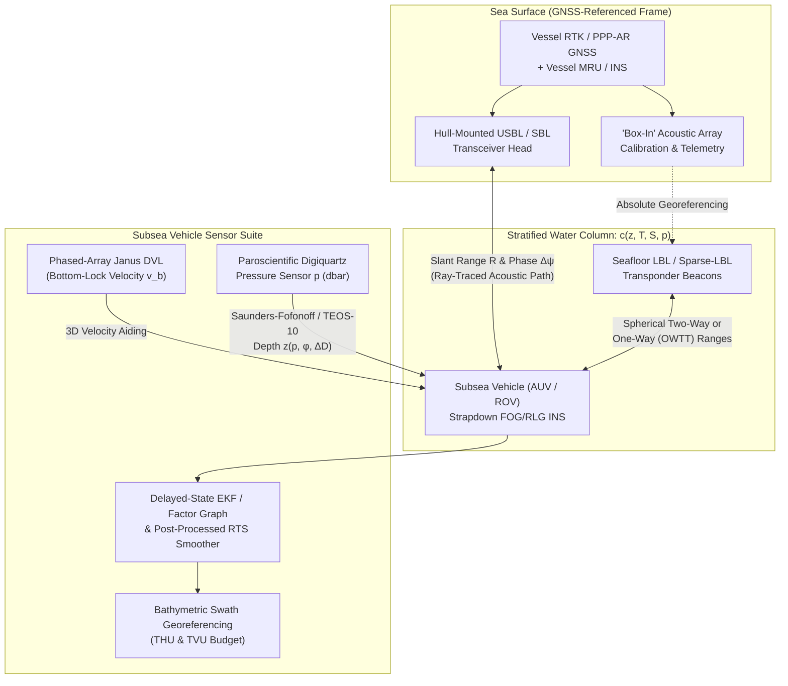

## 5.4 Underwater Positioning (Where GNSS Cannot Penetrate)

### 5.4.1 Why Electromagnetic Waves Fail Underwater

High-resolution deep-water bathymetry cannot be acquired from the sea surface alone. Because a surface-vessel multibeam echosounder's footprint expands linearly with depth ($w \approx 2 d \tan(\Delta\theta / 2)$), achieving sub-meter horizontal resolution on the abyssal plains ($d = 3000\text{--}6000\text{ m}$) requires deploying the sonar on a submerged platform—an Autonomous Underwater Vehicle (AUV), a Remotely Operated Vehicle (ROV), a deep-towed sled, or a crewed submarine—flying $10\text{--}100\text{ m}$ above the seabed. Yet the moment a survey platform submerges, it loses direct access to Global Navigation Satellite Systems (GNSS).

In a lossy, electrically conducting medium such as seawater, Maxwell's equations govern the propagation of a plane electromagnetic wave of angular frequency $\omega = 2\pi f$, magnetic permeability $\mu \approx \mu_0 = 4\pi \times 10^{-7}\text{ H m}^{-1}$, dielectric permittivity $\epsilon$, and electrical conductivity $\sigma_{\text{sea}}$ (typically $3.2\text{--}5.5\text{ S m}^{-1}$ in the ocean, with a global mean near $4.0\text{ S m}^{-1}$, compared to $10^{-3}\text{--}10^{-2}\text{ S m}^{-1}$ in freshwater lakes). At GNSS L-band frequencies ($f \approx 1.176\text{--}1.575\text{ GHz}$), conduction currents and displacement currents both contribute to severe attenuation, and the electromagnetic **skin depth** $\delta_{\text{EM}}$—the distance over which the electric field amplitude decays by a factor of $e^{-1}$ ($8.686\text{ dB}$)—is approximated in the good-conductor regime ($\sigma_{\text{sea}} \gg \omega \epsilon$ at low-to-moderate frequencies, or via the full complex propagation constant $\gamma_{\text{EM}} = \alpha_{\text{EM}} + i\beta_{\text{EM}}$ at microwave frequencies) by:

$$\delta_{\text{EM}} \approx \frac{1}{\sqrt{\pi f \mu_0 \sigma_{\text{sea}}}}$$

Substituting $f = 1.57542 \times 10^9\text{ Hz}$ (GPS L1), $\mu_0 = 4\pi \times 10^{-7}\text{ H m}^{-1}$, and $\sigma_{\text{sea}} = 4.0\text{ S m}^{-1}$ into the good-conductor approximation yields:

$$\delta_{\text{EM}} \approx \frac{1}{\sqrt{\pi (1.57542 \times 10^9\text{ s}^{-1})(4\pi \times 10^{-7}\text{ H m}^{-1})(4.0\text{ S m}^{-1})}} \approx 0.00634\text{ m} \approx 6.3\text{ mm}$$

(When displacement currents $\omega\epsilon'$ and Debye dipolar relaxation $\epsilon''$ of water at $1.575\text{ GHz}$ are included via the exact attenuation constant $\alpha_{\text{EM}} = \omega\sqrt{\frac{\mu_0\epsilon'}{2}\left[\sqrt{1 + (\sigma_{\text{eff}}/\omega\epsilon')^2} - 1\right]}$, the $e^{-1}$ field penetration depth is $\delta_{\text{EM}} = 1/\alpha_{\text{EM}} \approx 1.3\text{ cm}$.) Within just $5\text{--}10\text{ cm}$ of submergence (roughly eight skin depths), a $1.5\text{ GHz}$ GNSS signal is attenuated by nearly $70\text{ dB}$, extinguishing satellite tracking completely. Even in low-conductivity freshwater lakes, dipolar relaxation of water molecules at microwave frequencies restricts L-band penetration to decimeters. Consequently, underwater georeferencing must substitute **mechanical acoustic waves** ($f_{\text{ac}} = 10\text{--}300\text{ kHz}$, where absorption in seawater ranges from $\sim 1\text{ dB km}^{-1}$ at $12\text{ kHz}$ to $\sim 60\text{ dB km}^{-1}$ at $300\text{ kHz}$) for electromagnetic waves, fused with dead-reckoning inertial and Doppler sensors and hydrostatic pressure gauges (Milne, 1983; Kinsey et al., 2006; Paull et al., 2014).

Replacing light in a vacuum ($c_{\text{EM}} \approx 2.9979 \times 10^8\text{ m s}^{-1}$) with sound in water ($c_{\text{sound}} \approx 1450\text{--}1550\text{ m s}^{-1}$) slows signal propagation by **five orders of magnitude** ($\sim 2 \times 10^5$). This physical reality transforms the positioning problem in three ways:
1. **Low update rates and motion-during-transit:** A two-way acoustic travel time across a $4500\text{ m}$ slant range takes $\Delta t \approx 6.0\text{ s}$. An AUV cruising at $2.0\text{ m s}^{-1}$ travels $12.0\text{ m}$ between interrogation and reply receipt; trajectory estimation must therefore model asynchronous, time-tagged one-way travel path integrals rather than instantaneous fixes.
2. **Strong refractive index gradients:** Whereas tropospheric and ionospheric refractivity perturbs GNSS ranges by parts per million to parts per thousand, oceanic sound speed $c(z, T, S, p)$ varies by $3\text{--}5\%$ across the thermocline and deep sound channel, causing severe acoustic ray bending.
3. **Decoupled horizontal and vertical observability:** Unlike GNSS, where vertical accuracy is $1.5\text{--}3\times$ worse than horizontal accuracy due to one-sided sky geometry, subsea vertical depth $d$ is directly constrained to centimeter-to-decimeter accuracy by hydrostatic pressure sensors, leaving **horizontal drift** ($x, y$) as the dominant error source in underwater DEM production.



---

### 5.4.2 Acoustic Positioning Architectures: LBL, SBL, USBL, and iUSBL

Acoustic positioning systems are classified by the characteristic baseline length $B$ separating their acoustic transducer or transponder elements relative to the operating slant range $R$ (Milne, 1983; Vickery, 1998).

| Architecture | Typical Baseline $B$ | Operating Frequency | Primary Observables | Horizontal Uncertainty ($\text{THU}_{1\sigma}$) | Operational Trade-Offs |
| :--- | :--- | :--- | :--- | :--- | :--- |
| **Long Baseline (LBL)** | $100\text{ m}\text{--}10\text{ km}$ | $8\text{--}40\text{ kHz}$ (LF/MF) or $50\text{--}300\text{ kHz}$ (HF) | 3 to $\ge 4$ spherical/hyperbolic ranges $R_i$ | $0.02\text{--}1.0\text{ m}$ (depth-independent!) | Highest deep-water accuracy; costly deployment, recovery, and "box-in" survey of seafloor beacons. |
| **Sparse-LBL (1–2 Beacons + INS/DVL)** | Single beacon or $0.5\text{--}5\text{ km}$ pair | $12\text{--}35\text{ kHz}$ | Asynchronous range $R_i(t)$ tightly coupled into INS/DVL EKF | $0.1\text{--}1.5\text{ m}$ | Eliminates full array deployment; requires synthetic-aperture vehicle motion around the beacon. |
| **Short Baseline (SBL)** | $5\text{--}50\text{ m}$ (hull-mounted) | $12\text{--}60\text{ kHz}$ | Differential time-of-arrival $\Delta t_{ij}$ across hull hydrophones | $0.1\text{--}0.5\%$ of slant range $R$ | Requires dry-dock survey of multiple hull penetrations and vessel flexing compensation. |
| **Ultra-Short Baseline (USBL / SSBL)** | $0.05\text{--}0.30\text{ m}$ (single head) | $10\text{--}300\text{ kHz}$ | Two-way range $R$ + interferometric phase differences $\Delta\psi_x, \Delta\psi_y$ | $0.15\text{--}1.0\%$ of slant range $R$ | Single hull pole/gate valve; error scales linearly with depth ($R \sigma_\theta$); sensitive to hull bubble sweepdown. |
| **Inverted USBL (iUSBL)** | $0.05\text{--}0.30\text{ m}$ (on AUV) | $15\text{--}50\text{ kHz}$ | One-way/two-way range + phase angles measured *at vehicle* | $0.1\text{--}0.5\%$ of slant range $R$ | Avoids surface-to-vehicle telemetry latency; vehicle directly fuses angle/range with onboard INS. |

#### Long Baseline (LBL) and Sparse-LBL Positioning
In a **Long Baseline (LBL)** architecture, an array of $M \ge 3$ (typically $4\text{--}8$ for geometric redundancy and blunder detection) autonomous acoustic transponders is moored to the seafloor at known ECEF or local tangent-plane coordinates $\mathbf{p}_i = [X_i, Y_i, Z_i]^\top$. In **spherical LBL**, the submerged vehicle transmits an interrogation pulse at frequency $f_0$ (or a wideband spread-spectrum chirp) at time $t_{\text{tx}}$; each seafloor transponder $i$ detects the arrival, waits a calibrated hardware turnaround delay $\tau_{\text{turn}, i}$, and replies on an individual channel or orthogonal code. From the measured two-way travel time $\Delta t_i$, the corrected one-way spherical slant range is:

$$R_i = \bar{c}_{\text{eff}, i} \left( \frac{\Delta t_i - \tau_{\text{turn}, i}}{2} \right) = \sqrt{(X - X_i)^2 + (Y - Y_i)^2 + (Z - Z_i)^2} + \epsilon_{R, i}$$

where $\bar{c}_{\text{eff}, i}$ is the ray-traced effective sound speed along the path between the vehicle $\mathbf{p} = [X, Y, Z]^\top$ and beacon $i$. Conversely, in **hyperbolic LBL** (where synchronized seafloor beacons transmit simultaneously at an uncalibrated epoch, or where a master beacon triggers slave beacons without vehicle interrogation), the vehicle measures the **time difference of arrival (TDOA)** $\Delta t_{ij} = t_{\text{rx}, i} - t_{\text{rx}, j}$ between beacon pairs $(i, j)$, eliminating any common-mode clock bias $\delta t_{\text{clock}}$ and confining the vehicle to a hyperboloid of revolution:

$$\Delta R_{ij} = \bar{c}_{\text{eff}, i} t_{\text{rx}, i} - \bar{c}_{\text{eff}, j} t_{\text{rx}, j} = \|\mathbf{p} - \mathbf{p}_i\| - \|\mathbf{p} - \mathbf{p}_j\| + \epsilon_{\Delta R, ij}$$

Because the vehicle's vertical coordinate $Z$ is known to within a few centimeters from its hydrostatic pressure sensor, only two horizontal unknowns $(X, Y)$ remain, allowing a well-conditioned least-squares intersection from as few as two non-collinear spherical ranges (or three beacons in hyperbolic mode) and robust outlier rejection (RAIM) with additional beacons. Crucially, because the transponders sit on the seafloor near the vehicle's operating altitude, **LBL horizontal accuracy is independent of ocean depth**, achieving $0.05\text{--}0.5\text{ m}$ even at $6000\text{ m}$ depth.

To tie the seafloor transponder network to the global terrestrial reference frame (e.g., ITRF2020), the surface vessel must perform a **"box-in" calibration** prior to or during the survey. The vessel sails a symmetric pattern (such as a cloverleaf or a circle of radius $\sim 1.0\text{--}1.5\times$ water depth centered above each beacon, plus an overhead crossing for vertical control) while logging continuous PPP-AR or RTK GNSS vessel positions, vessel attitude, full-ocean-depth CTD/sound-velocity casts, and acoustic slant ranges to each beacon. Simultaneously, modern intelligent transponders measure inter-beacon acoustic baseline ranges $B_{ij} = \|\mathbf{p}_i - \mathbf{p}_j\|$ directly along the seafloor, allowing a bundle adjustment that locks the relative geometry of the seabed network to sub-decimeter precision while pinning its absolute translation and orientation via the surface vessel fixes.

In **Sparse-LBL** and **One-Way Travel Time (OWTT)** operations, the cost of deploying a full $4$-transponder array is avoided by placing just a **single seafloor transponder** (or a single surface autonomous wave glider / USV gateway buoy). In classical two-way travel time (TWTT) interrogation, the vehicle must transmit a high-power acoustic ping for every range update, which depletes battery reserves and limits the update rate to the round-trip travel time $\Delta t_{\text{twtt}} = 2R/\bar{c}$. By equipping both the surface gateway/seafloor beacon and the AUV with synchronized **Chip-Scale Atomic Clocks (CSACs)** (exhibiting frequency stability $\delta f / f_0 \sim 10^{-11}$ to $10^{-10}$, or $< 1\text{ ms}$ drift over a 24-hour mission, equivalent to $< 1.5\text{ m}$ range drift), the source broadcasts periodic one-way acoustic packets encoding the exact time of transmission $t_{\text{tx}}$ (Eustice et al., 2007). Any number of submerged AUVs can passively receive these broadcasts at time $t_{\text{rx}}$ and compute the one-way range $R_1(t_{\text{rx}}) = \bar{c}_{\text{eff}} (t_{\text{rx}} - t_{\text{tx}} - \delta t_{\text{clock}})$. While a single range $R_1(t)$ cannot yield an instantaneous 3D fix, tightly coupling consecutive asynchronous range measurements $R_1(t_k)$ into an INS/DVL Extended Kalman Filter creates a **synthetic aperture**: as the AUV flies past or orbits the beacon, the changing range geometry makes both horizontal coordinates $(X, Y)$ and the slowly drifting clock bias $\delta t_{\text{clock}}$ fully observable, resetting the accumulated dead-reckoning drift.

#### Short Baseline (SBL), Ultra-Short Baseline (USBL / SSBL), and Inverted USBL (iUSBL)
When deploying seafloor transponders is impractical (e.g., long cable/pipeline route surveys or reconnaissance mapping), positioning is performed from a single surface support vessel via **Short Baseline (SBL)** or **Ultra-Short Baseline (USBL)**—also termed **Super-Short Baseline (SSBL)**—systems. An SBL system mounts $3\text{--}4$ discrete hydrophones at widely separated points on the ship's hull ($B = 5\text{--}50\text{ m}$) and computes the target's bearing from differential time-of-arrival ($\Delta t_{ij}$).

A **USBL** system condenses the entire receiver array into a single compact transceiver head ($D \approx 10\text{--}30\text{ cm}$) deployed through a hull gate valve or over-the-side pole. The transceiver measures the slant range $R$ via two-way travel time and determines the 3D arrival direction cosine unit vector $\mathbf{u}_{\text{head}} = [u_x, u_y, u_z]^\top = [\sin\theta_x, \sin\theta_y, \sqrt{1 - \sin^2\theta_x - \sin^2\theta_y}]^\top$ via **acoustic phase interferometry**. For a pair of transducer elements separated by distance $d$ along the transceiver $x$-axis receiving a planar wavefront at incidence angle $\theta_x$ (measured from the array boresight normal) at acoustic wavelength $\lambda = c_{\text{head}} / f_0$, the geometric path difference is $\Delta r = d \sin\theta_x$, producing a carrier phase difference $\Delta\psi_x$:

$$\Delta\psi_x = \frac{2\pi \Delta r}{\lambda} = \frac{2\pi d f_0}{c_{\text{head}}} \sin\theta_x \quad \Longrightarrow \quad \sin\theta_x = \frac{c_{\text{head}} \, \Delta\psi_x}{2\pi f_0 d}$$

where $c_{\text{head}}$ is measured continuously by a temperature/sound-velocity probe embedded in the USBL transducer face so that $\theta_x$ and $\theta_y$ can be accurately formed in the tilted head frame before rotating into the horizontal navigation frame for ray tracing. To prevent $2\pi$ integer phase-wrapping ambiguity across the hemisphere ($\theta_x \in [-\pi/2, \pi/2]$), the innermost element spacing must satisfy the spatial Nyquist criterion $d \le \lambda / 2$ (for example, at $f_0 = 25\text{ kHz}$ and $c_{\text{head}} = 1500\text{ m s}^{-1}$, $\lambda = 6.0\text{ cm}$ and $d \le 3.0\text{ cm}$). Because angular precision improves inversely with aperture $d$ ($\sigma_{\theta} \propto \sigma_{\Delta\psi} \frac{\lambda}{2\pi d \cos\theta}$), commercial USBL heads arrange $8\text{--}64$ hydrophone elements in a multi-baseline planar or cylindrical array: closely spaced pairs ($d < \lambda/2$) resolve the integer cycle ambiguity, while outer pairs ($d \approx 2\lambda\text{--}5\lambda$) provide fine angular resolution ($\sigma_{\theta,\text{ac}} \approx 0.05^\circ\text{--}0.2^\circ$).

In the vessel navigation frame, the 3D position of the subsea vehicle $\mathbf{p}_{\text{AUV}}^{\text{nav}}$ is obtained by rotating the measured acoustic vector $\mathbf{r}_{\text{USBL}}^{\text{head}} = R \, \mathbf{u}_{\text{head}}$ through the calibrated USBL-to-IMU boresight matrix $\mathbf{R}_{\text{head}}^{\text{body}}(\delta\phi, \delta\theta, \delta\psi)$ and the vessel's instantaneous attitude matrix $\mathbf{R}_{\text{body}}^{\text{nav}}(\phi, \theta, \psi)$:

$$\mathbf{p}_{\text{AUV}}^{\text{nav}}(t) = \mathbf{p}_{\text{vessel}}^{\text{nav}}(t) + \mathbf{R}_{\text{body}}^{\text{nav}}(\phi, \theta, \psi) \left[ \mathbf{l}_{\text{USBL}} + \mathbf{R}_{\text{head}}^{\text{body}}(\delta\phi, \delta\theta, \delta\psi) \, \mathbf{r}_{\text{USBL}}^{\text{head}}(t) \right]$$

Taking the first-order perturbation of this equation reveals why **USBL position error grows linearly with slant range $R$**. Any residual angular error $\sigma_{\alpha,\text{total}}$—combining the interferometric phase noise $\sigma_{\theta,\text{ac}}$, the vessel's IMU roll/pitch/heading uncertainty $\sigma_{\phi,\theta,\psi}$, dynamic pole flexing, and uncalibrated USBL-to-IMU mechanical alignment boresight errors—projects across the slant range $R$ as a cross-range position error:

$$\sigma_{\text{pos, cross-range}} \approx R \, \sigma_{\alpha,\text{total}} = R \sqrt{\sigma_{\theta,\text{ac}}^2 + \sigma_{\text{IMU}}^2 + \sigma_{\text{boresight}}^2 + \sigma_{\text{ray}}^2}$$

At a slant range of $R = 3000\text{ m}$, even a high-end USBL system with a total combined angular uncertainty of $\sigma_{\alpha,\text{total}} = 0.15^\circ$ ($2.62\text{ mrad}$) produces a $1\sigma$ cross-range position uncertainty of $3000\text{ m} \times 0.00262\text{ rad} = 7.85\text{ m}$ per ping! Consequently, in deep water, raw USBL fixes are far too noisy to georeference multibeam pings directly; instead, they serve as zero-mean, bounded-error aiding measurements to constrain the long-term drift of an onboard INS/DVL navigator. In an **Inverted USBL (iUSBL)** configuration, the multi-element array is mounted directly on the nose or dorsal fin of the AUV, receiving acoustic broadcasts from a single beacon on the surface vessel or a seafloor mooring; this eliminates the need to telemeter surface USBL fixes down through a low-bandwidth acoustic modem link to the vehicle's onboard Kalman filter.

> [!IMPORTANT]
> **USBL Spin / Dynamic Alignment Calibration:** Because a $0.2^\circ$ mechanical misalignment between the USBL transceiver head and the vessel's IMU translates into a $10.5\text{ m}$ systematic horizontal offset at $3000\text{ m}$ depth, every USBL installation must undergo a dynamic **spin and box-in calibration** over a temporary seafloor beacon to solve for the 3D boresight angles $(\delta\phi, \delta\theta, \delta\psi)$, scale factor, and lever arm before commencing survey operations.

---

### 5.4.3 Subsea Dead Reckoning and Aiding Sensors

Because acoustic updates arrive only every $2\text{--}10\text{ s}$ and exhibit meter-level single-ping noise at depth, high-resolution subsea DEM generation relies on a triad of high-rate onboard sensors: a navigation-grade strapdown **Inertial Navigation System (INS)** (Section 5.3), a **Doppler Velocity Log (DVL)**, and a **high-precision quartz pressure depth sensor**.

#### Doppler Velocity Log (DVL) and Phased-Array Sound-Speed Cancellation
Left unaided, a navigation-grade Fiber-Optic Gyroscope (FOG) or Ring Laser Gyroscope (RLG) INS drifts horizontally by $\sim 1.5\text{ km}$ in the first hour due to double integration of accelerometer biases and Schuler oscillation ($T_{\text{Schuler}} \approx 84.4\text{ min}$). Bounding this drift to $0.02\text{--}0.2\%$ of distance traveled requires continuous 3D seabed-relative velocity aiding $\mathbf{v}_b = [v_x, v_y, v_z]^\top$ from a **bottom-lock Doppler Velocity Log (DVL)** (or an Acoustic Doppler Current Profiler, ADCP, with bottom-tracking capability) operating at $150\text{--}1200\text{ kHz}$ within $5\text{--}200\text{ m}$ of the seafloor. During the vehicle's descent from the sea surface through the mid-water column—before the seafloor comes within acoustic range of the DVL—the DVL operates in **water-track mode**, measuring velocity relative to an acoustic scattering layer $10\text{--}30\text{ m}$ ahead of the vehicle while the ADCP profiles vertical current shear; once bottom lock is acquired, the EKF seamlessly transitions to seabed-referenced dead reckoning.

To minimize sensitivity to vehicle pitch and roll and to provide one degree of freedom for error detection, DVLs employ a **4-beam Janus configuration**: four narrow acoustic beams (typically depressed at a depression angle $\beta = 60^\circ$ from the horizontal instrument plane, i.e., $30^\circ$ off nadir) pointed fore ($1$), aft ($2$), port ($3$), and starboard ($4$). For a piston transducer transmitting at frequency $f_0$ in water of local sound speed $c_{\text{head}}$, the two-way Doppler frequency shift $\Delta f_{D, i}$ along beam $i$ is proportional to the line-of-sight velocity component. Differencing the fore/aft ($1, 2$) and port/starboard ($3, 4$) opposing beam pairs yields the horizontal velocities $(v_x, v_y)$, while summing all four beams yields the vertical velocity $v_z$ and the redundant 4-beam **error velocity** $e_v$:

$$v_x = \frac{c_{\text{head}} (\Delta f_{D, 1} - \Delta f_{D, 2})}{4 f_0 \cos\beta}, \qquad v_y = \frac{c_{\text{head}} (\Delta f_{D, 4} - \Delta f_{D, 3})}{4 f_0 \cos\beta}$$

$$v_z = \frac{c_{\text{head}} (\Delta f_{D, 1} + \Delta f_{D, 2} + \Delta f_{D, 3} + \Delta f_{D, 4})}{8 f_0 \sin\beta}, \qquad e_v = \frac{c_{\text{head}} \left[ (\Delta f_{D, 1} + \Delta f_{D, 2}) - (\Delta f_{D, 3} + \Delta f_{D, 4}) \right]}{8 f_0 \sin\beta}$$

Taking the difference of opposing beams cancels vertical heave velocity $v_z$ to first order and makes horizontal velocity errors insensitive to small pitch/roll tilts $\delta\theta$ ($\cos(\beta + \delta\theta) + \cos(\beta - \delta\theta) = 2\cos\beta \cos\delta\theta \approx 2\cos\beta (1 - \frac{1}{2}\delta\theta^2)$), while the error velocity $e_v$ monitors the consistency of the two orthogonal vertical velocity estimates to reject beams compromised by steep terrain or fish schools.

Modern survey AUVs increasingly use **flat-face phased-array DVLs**, which exhibit a remarkable physical property: **their horizontal velocity measurement $(v_x, v_y)$ is mathematically independent of the local water sound speed $c_{\text{head}}$**. In a phased-array transducer, the acoustic beam is steered electronically by applying fixed phase delays across transducer elements separated by a physical array phasing wavelength $\Lambda_{\text{array}}$ (a fixed mechanical constant of the ceramic face). By Snell's law (constructive interference at the flat transducer-water interface), the beam depression angle $\beta$ in water automatically refracts according to the local sound speed $c_{\text{head}}$:

$$\cos\beta = \frac{\lambda_{\text{water}}}{\Lambda_{\text{array}}} = \frac{c_{\text{head}}}{f_0 \Lambda_{\text{array}}}$$

Substituting this exact refraction relation into the Janus Doppler equations above causes $c_{\text{head}}$ and $f_0$ to cancel identically in the horizontal plane (note that $v_z$, which depends on $\sin\beta = \sqrt{1 - \cos^2\beta}$, still requires $c_{\text{head}}$):

$$v_x = \frac{c_{\text{head}} (\Delta f_{D, 1} - \Delta f_{D, 2})}{4 f_0 \left( \frac{c_{\text{head}}}{f_0 \Lambda_{\text{array}}} \right)} = \frac{\Lambda_{\text{array}}}{4} (\Delta f_{D, 1} - \Delta f_{D, 2})$$

Thus, even if the AUV passes through hydrothermal vents or estuarine salt wedges where $c_{\text{head}}$ fluctuates rapidly, a phased-array DVL incurs **zero horizontal scale-factor error** from sound-speed miscalibration! With sound-speed scale errors eliminated, the primary systematic error in INS/DVL dead reckoning is the **DVL-to-IMU yaw misalignment boresight angle $\delta\psi_{\text{DVL}}$** and residual scale factor $1 + s_{\text{DVL}}$: an uncalibrated $0.05^\circ$ ($0.87\text{ mrad}$) yaw misalignment between the DVL acoustic axis and the INS body frame causes a cross-track position drift of $0.087\%$ of distance traveled ($0.87\text{ m}$ per kilometer of straight-line flight).

#### Quartz Pressure Depth Sensors and the Saunders-Fofonoff / TEOS-10 Equations
While INS + DVL dead reckoning controls horizontal motion, the vertical channel of an INS is inherently unstable and must be stabilized by an external depth reference. Deep-submergence vehicles rely on **quartz crystal resonator pressure transducers** (most notably the **Paroscientific Digiquartz** sensor), in which hydrostatic pressure stresses a piezoelectric quartz crystal beam, shifting its resonant oscillation frequency with a precision and repeatability of $0.01\%$ of full scale (e.g., $\pm 0.3\text{ dbar} \approx \pm 0.3\text{ m}$ on a $3000\text{ m}$ sensor, or $\pm 0.6\text{ m}$ on a $6000\text{ m}$ sensor) and sub-centimeter short-term resolution.

To obtain true geometric depth $z$ (positive downward from the instantaneous sea surface, in meters) from raw absolute pressure $P_{\text{abs}}$, three physical corrections are required:
1. **Atmospheric pressure tare ($P_{\text{atm}}$):** Because Digiquartz deep-ocean gauges measure absolute pressure, the contemporaneous surface barometric pressure $P_{\text{atm}}(t)$ (typically $\sim 10.1325\text{ dbar}$, where $1\text{ dbar} = 10^4\text{ Pa} = 0.1\text{ MPa}$) must be subtracted to isolate gauge hydrostatic sea pressure $p = P_{\text{abs}} - P_{\text{atm}}$ (in decibars). A $20\text{ hPa}$ ($0.20\text{ dbar}$) passage of a low-pressure storm system shifts uncorrected depth by $0.20\text{ m}$.
2. **Dynamic Bernoulli flow pressure:** Water flowing around the moving AUV hull at speed $U$ creates a dynamic pressure perturbation $\Delta p_{\text{dyn}} = \frac{1}{2} C_p \rho U^2$, where $C_p$ is the hull pressure coefficient at the port orifice; the pressure port must be located at a stagnation-neutral point or calibrated against DVL speed $U$.
3. **Hydrostatic integration (Saunders & Fofonoff, 1976; EOS-80; TEOS-10):** Pressure $p$ and geometric depth $z$ are linked by the hydrostatic equation $dp = \rho(S, T, p) \, g(\varphi, z) \, dz$, where both seawater density $\rho$ (via compressibility and thermohaline stratification) and gravitational acceleration $g$ vary with depth and latitude $\varphi$.

Following **Saunders and Fofonoff (1976)** and the **UNESCO 1983 (EOS-80)** polynomial standardized by **Fofonoff and Millard (1983)** (and updated in **TEOS-10**, IOC et al., 2010), the ocean's specific volume $v(S, T, p) = 1/\rho(S, T, p)$ is decomposed into the specific volume of a standard ocean at salinity $S = 35\text{ PSU}$ and temperature $T = 0^\circ\text{C}$, $v(35, 0, p)$, plus the steric specific volume anomaly $\delta(S, T, p) = v(S, T, p) - v(35, 0, p)$. Integrating $g(\varphi, z) \, dz = v(S, T, p) \, dp$ from the surface ($p=0$) to pressure $p$ (in decibars) yields the exact geometric depth $z$ (in meters):

$$z(p, \varphi, \Delta D) = \frac{C_1 p + C_2 p^2 + C_3 p^3 + C_4 p^4}{\gamma(\varphi) + \frac{1}{2} \gamma_z p} + \frac{\Delta D}{9.8}$$

where:
* $p$ is hydrostatic gauge pressure in **decibars** ($\text{dbar}$),
* $C_1 = 9.72659$, $C_2 = -2.2512 \times 10^{-5}$, $C_3 = 2.279 \times 10^{-10}$, and $C_4 = -1.82 \times 10^{-15}$ are the EOS-80 compressibility integration coefficients for standard seawater ($S = 35$, $T = 0^\circ\text{C}$),
* $\gamma(\varphi) = 9.780318 \left( 1.0 + 5.2788 \times 10^{-3} \sin^2\varphi + 2.36 \times 10^{-5} \sin^4\varphi \right)\text{ m s}^{-2}$ is normal gravity on the sea surface at latitude $\varphi$ (Somigliana formula),
* $\gamma_z = 2.184 \times 10^{-6}\text{ m s}^{-2}\text{ dbar}^{-1}$ accounts for the vertical free-air and Bouguer (slab of water) gravity gradient $dg/dz \approx 2.2 \times 10^{-6}\text{ s}^{-2}$, and
* $\Delta D = \int_0^p \delta(S, T, p') \, dp'$ is the **dynamic height anomaly** (in $\text{m}^2\text{ s}^{-2}$, or $\text{J kg}^{-1}$) integrated from the local CTD profile over the water column above the vehicle.

Neglecting this conversion and crudely assuming $z(\text{m}) \approx p(\text{dbar})$ at $\varphi = 45^\circ$ introduces a systematic vertical bias of **$-45.4\text{ m}$ at $3000\text{ dbar}$** ($z_{\text{std}} = 2954.61\text{ m}$, comprising $-24.4\text{ m}$ from surface seawater density and gravity and $-21.0\text{ m}$ from non-linear bulk compressibility) and **$-130.5\text{ m}$ at $6000\text{ dbar}$** ($z_{\text{std}} = 5869.51\text{ m}$, comprising $-48.7\text{ m}$ from surface density/gravity and $-81.8\text{ m}$ from compressibility; at the UNESCO check point $p = 10000\text{ dbar}, \varphi = 30^\circ$, $z_{\text{std}} = 9712.653\text{ m}$)! Even between the equator ($\varphi = 0^\circ$) and high latitudes ($\varphi = 70^\circ$), the latitude-dependent gravity term $\gamma(\varphi)$ alters the true depth of a $3000\text{ dbar}$ isobaric surface by **$13.8\text{ m}$** ($2962.43\text{ m}$ vs. $2948.63\text{ m}$).

---

### 5.4.4 Acoustic Ray Bending and Subsea Uncertainty Propagation

#### Snell's Law and Ray Tracing in a Stratified Ocean
Because sound speed in seawater $c(z)$ varies continuously with temperature $T$ ($\sim +4.0\text{ m s}^{-1}\text{ }^\circ\text{C}^{-1}$), salinity $S$ ($\sim +1.3\text{ m s}^{-1}\text{ PSU}^{-1}$), and pressure $p$ ($\sim +0.017\text{ m s}^{-1}\text{ dbar}^{-1}$), an acoustic pulse traveling obliquely between a surface USBL head (or seafloor LBL beacon) and a submerged vehicle follows a curved trajectory governed by **Snell's law in a horizontally stratified medium**:

$$\frac{\cos\theta(z)}{c(z)} = \frac{\cos\theta_0}{c_0} = p_{\text{ray}} = \text{constant}$$

where $\theta(z)$ is the local grazing angle of the ray measured from the horizontal plane at depth $z$, and $p_{\text{ray}}$ is the constant **ray parameter**. Over a depth layer from $z_1$ to $z_2$, the exact horizontal ground range $X$ and one-way acoustic travel time $T_{\text{owtt}}$ are given by the ray integrals:

$$X = \int_{z_1}^{z_2} \frac{dz}{\tan\theta(z)} = \int_{z_1}^{z_2} \frac{p_{\text{ray}} \, c(z)}{\sqrt{1 - p_{\text{ray}}^2 c^2(z)}} \, dz, \qquad T_{\text{owtt}} = \int_{z_1}^{z_2} \frac{dz}{c(z) \sin\theta(z)} = \int_{z_1}^{z_2} \frac{dz}{c(z) \sqrt{1 - p_{\text{ray}}^2 c^2(z)}}$$

In a discrete sound velocity profile (SVP) consisting of layers $k = 1, \dots, K$ with non-zero constant vertical sound-speed gradient $g_k = (c_k - c_{k-1}) / (z_k - z_{k-1})$, substituting $dz = -(\sin\theta / (p_{\text{ray}} g_k))\,d\theta$ shows that the ray path within layer $k$ is an exact circular arc of radius of curvature $R_{c, k} = 1 / (p_{\text{ray}} |g_k|)$, yielding closed-form layer increments:

$$\Delta X_k = \frac{\sin\theta_{k-1} - \sin\theta_k}{p_{\text{ray}} g_k}, \qquad \Delta T_k = \frac{1}{g_k} \ln \left( \frac{c_k (1 + \sin\theta_{k-1})}{c_{k-1} (1 + \sin\theta_k)} \right)$$

(Note that the algebraic sign of $g_k$ is preserved in the prefactor $1/g_k$ because for $g_k < 0$, $c_k < c_{k-1}$ and $\sin\theta_k > \sin\theta_{k-1}$, making the logarithm negative so that $\Delta T_k > 0$ in both thermocline and deep isothermal layers.) For near-vertical paths ($\theta \to 90^\circ$, $p_{\text{ray}} \to 0$), the effective sound speed equals the **harmonic mean sound speed** $\bar{c}_H = (z_2 - z_1) / \int_{z_1}^{z_2} c^{-1}(z)\,dz$. However, at low grazing angles ($\theta < 30^\circ$, typical of long-range USBL or LBL rays near the seabed), the positive deep isothermal pressure gradient ($dc/dz \approx +0.017\text{ s}^{-1}$) bends acoustic rays **upward** into concave arcs, causing bottom shadows and making the true arc length longer than the straight Euclidean chord. High-precision positioning systems must therefore execute full layer-by-layer constant-gradient ray tracing using an in-situ CTD/SVP profile rather than applying a scalar harmonic mean sound speed.

#### Worked Numerical Example: AUV Mapping at $3000\text{ m}$ Depth (THU and TVU Budget)
Consider a survey AUV mapping at depth $d \approx 3000\text{ m}$ ($p = 3046.26\text{ dbar}$, flying at altitude $h_{\text{alt}} = 50\text{ m}$ above a $3050\text{ m}$ seafloor) at latitude $\varphi = 45^\circ\text{ N}$, equipped with a navigation-grade FOG INS, a $300\text{ kHz}$ phased-array DVL, and a $4000\text{ m}$-rated Paroscientific Digiquartz pressure sensor, tracked by a surface vessel USBL and a single sparse-LBL seabed transponder.

```python
import numpy as np

def saunders_fofonoff_depth(p_dbar: float, lat_deg: float, dyn_height_anom: float = 0.0) -> float:
    """Convert hydrostatic pressure p (dbar) to geometric depth z (m) via EOS-80 (Fofonoff & Millard, 1983)."""
    phi = np.radians(lat_deg)
    sin2 = np.sin(phi) ** 2
    gamma_phi = 9.780318 * (1.0 + (5.2788e-3 + 2.36e-5 * sin2) * sin2)
    c1, c2, c3, c4 = 9.72659, -2.2512e-5, 2.279e-10, -1.82e-15
    num = ((c4 * p_dbar + c3) * p_dbar + c2) * p_dbar + c1
    z_std = (num * p_dbar) / (gamma_phi + 1.092e-6 * p_dbar)
    return z_std + (dyn_height_anom / 9.8)

def auv_thu_tvu_budget(p_dbar: float = 3046.26, lat_deg: float = 45.0, slant_range_m: float = 3100.0):
    """Compute AUV depth and 95% IHO S-44 TVU and THU budgets at 3000 m depth."""
    z_auv = saunders_fofonoff_depth(p_dbar, lat_deg, dyn_height_anom=1.47)
    # 1-sigma vertical error components (m): Digiquartz (0.01% of 4000 dbar), atm tare, steric, datum, MBES
    sigma_z = np.hypot.reduce([0.40, 0.05, 0.12, 0.10, 0.05])
    tvu_95 = 1.96 * sigma_z
    # Single-ping USBL 1-sigma cross-range error vs. total smoothed 1-sigma horizontal error
    sigma_usbl_ping = slant_range_m * np.radians(0.15)
    sigma_xy_total = np.hypot.reduce([1.15, 0.05, 0.08])  # RTS trajectory + surface GNSS + MBES
    thu_95 = 2.4477 * sigma_xy_total
    return z_auv, tvu_95, sigma_usbl_ping, thu_95

z_m, tvu95, usbl_1s, thu95 = auv_thu_tvu_budget()
print(f"AUV Depth: {z_m:.2f} m | TVU(95%): {tvu95:.2f} m | Raw USBL 1s: {usbl_1s:.2f} m | Smoothed THU(95%): {thu95:.2f} m")
```

Executing this calculation yields:
1. **Pressure-to-Depth Conversion:** At $\varphi = 45^\circ\text{ N}$, $\gamma(45^\circ) = 9.80619\text{ m s}^{-2}$. For $p = 3046.26\text{ dbar}$ and dynamic height anomaly $\Delta D = 1.47\text{ m}^2\text{ s}^{-2}$, the standard ocean term gives $2999.85\text{ m}$ and the steric anomaly adds $+0.15\text{ m}$, yielding a true vehicle depth of **$z_{\text{AUV}} = 3000.00\text{ m}$** (correcting a $46.26\text{ m}$ raw decibar offset).
2. **Total Vertical Uncertainty ($\text{TVU}_{95\%}$):** Combining the Digiquartz sensor uncertainty ($0.01\% \times 4000\text{ dbar} = 0.40\text{ m}$ at $1\sigma$), surface barometric pressure tare uncertainty ($\sigma_{\text{atm}} = 0.05\text{ m}$), steric density profile integration uncertainty ($\sigma_{\Delta D} = 0.12\text{ m}$), GNSS/tide surface datum transfer ($\sigma_{\text{datum}} = 0.10\text{ m}$), and the AUV multibeam range/roll vertical sounding error at $50\text{ m}$ altitude ($60^\circ$ outer beam, $\sigma_\phi = 0.02^\circ \Rightarrow \sigma_{z,\text{MBES}} = 0.05\text{ m}$) in quadrature gives:
   $$\sigma_z = \sqrt{0.40^2 + 0.05^2 + 0.12^2 + 0.10^2 + 0.05^2} = 0.435\text{ m} \quad \Longrightarrow \quad \text{TVU}_{95\%} = 1.96 \, \sigma_z = 0.85\text{ m}$$
   Notice that at $d = 3050\text{ m}$, the IHO S-44 (Edition 6.1.0) Order 1a maximum allowable $\text{TVU}_{\max}(95\%) = \sqrt{0.5^2 + (0.013 \times 3050)^2} = 39.65\text{ m}$; the AUV achieves **$0.85\text{ m}$**, outperforming surface-ship vertical uncertainty by nearly two orders of magnitude!
3. **Total Horizontal Uncertainty ($\text{THU}_{95\%}$):** A single surface USBL ping at slant range $R = 3100\text{ m}$ with total angular error $\sigma_\alpha = 0.15^\circ$ ($2.62\text{ mrad}$) has a 2D $1\sigma$ horizontal error of $\sigma_{\text{USBL}} \approx 8.12\text{ m}$. However, when $N = 120$ independent USBL fixes over a $10\text{ min}$ survey line are fused with the INS/DVL dead-reckoning trajectory (whose relative drift over $10\text{ min}$ at $1.8\text{ m s}^{-1}$ is $0.1\% \times 1080\text{ m} = 1.08\text{ m}$) and RTS backward-smoothed alongside sparse-LBL range updates, the steady-state filtered horizontal error reduces to $\sigma_{\text{pos}, 1\sigma} \approx 1.15\text{ m}$ (and $\sigma_{xy,\text{total}} = \sqrt{1.15^2 + 0.05^2 + 0.08^2} = 1.154\text{ m}$ when combined with surface GNSS datum and AUV multibeam horizontal sounding error), yielding $\text{THU}_{95\%} = 2.4477 \, \sigma_{xy,\text{total}} \approx 2.82\text{ m}$—well inside the IHO S-44 Order 1a allowance of $5\text{ m} + 0.05 \times 3050\text{ m} = 157.5\text{ m}$.

| Error Component ($d = 3050\text{ m}$, $h_{\text{alt}} = 50\text{ m}$) | Vertical $1\sigma$ ($\text{m}$) | Horizontal $1\sigma$ ($\text{m}$) | Physical Mechanism & Mitigation |
| :--- | :--- | :--- | :--- |
| **Paroscientific Digiquartz Pressure ($4000\text{ dbar}$ FS)** | $0.40$ | — | $0.01\%$ full-scale repeatability; mitigated via pre/post-dive zero tare. |
| **Atmospheric Barometric Tare ($P_{\text{atm}}(t)$)** | $0.05$ | — | Surface ship barometer logging subtracted in post-processing. |
| **Saunders-Fofonoff / TEOS-10 Steric Profile ($\Delta D$)** | $0.12$ | — | Integrated from full-depth CTD cast ($\sigma_T, \sigma_S$). |
| **Surface GNSS / Geoid / Tidal Datum Transfer** | $0.10$ | $0.05$ | Vessel PPP-AR GNSS height + hydrodynamic tide model. |
| **Raw Single-Ping USBL ($R = 3100\text{ m}, \sigma_\alpha = 0.15^\circ$)** | — | $8.12$ (unfiltered) | Dominated by vessel IMU attitude, head boresight, and ray bending. |
| **INS/DVL + USBL + Sparse-LBL (RTS Smoothed)** | — | $1.15$ (filtered) | Delayed-state EKF + Rauch-Tung-Striebel backward smoothing. |
| **AUV Multibeam Sonar ($h_{\text{alt}} = 50\text{ m}, \theta = 60^\circ$)** | $0.05$ | $0.08$ | Short $100\text{ m}$ slant range eliminates deep-water attitude amplification. |
| **Combined Total Uncertainty ($1\sigma$ / $95\%$ Confidence)** | **$0.44\text{ m}$ / $0.85\text{ m}$** | **$1.15\text{ m}$ / $2.82\text{ m}$** | **IHO S-44 Order 1a Limits at $3050\text{ m}$: $\text{TVU} = 39.65\text{ m}$, $\text{THU} = 157.5\text{ m}$** |

#### Delayed-State Filtering and Bathymetric Terrain-Relative Navigation (TRN)
Because an acoustic range measurement $R_i$ involves the vehicle's position at up to three distinct epochs—interrogation transmission $t_{\text{tx}}$, beacon turnaround $t_{\text{bounce}}$, and reply reception $t_{\text{rx}}$—modern subsea navigation frameworks augment the EKF state vector with **cloned historical vehicle poses** $[\mathbf{p}(t_{\text{tx}}), \mathbf{p}(t_{\text{rx}})]$ (a **Delayed-State Extended Kalman Filter** or full **Factor-Graph SLAM** optimizer; Eustice et al., 2007; Paull et al., 2014). Furthermore, where overlapping multibeam swaths cross rough seafloor topography, **Bathymetric Terrain-Relative Navigation (TRN)** (also called bathymetric ICP / submap SLAM, detailed in Chapter 8) correlates the AUV's real-time multibeam swath against an existing reference DEM or intersecting survey lines, bounding horizontal position uncertainty to the sub-meter footprint of the multibeam sonar itself even in the complete absence of external acoustic beacons.

---

### 5.4.5 Common Pitfalls and Key Takeaways

> [!WARNING]
> **Common Pitfalls in Subsea Positioning**
> * **Equating Decibars directly to Meters ($1\text{ dbar} = 1\text{ m}$) or Using a Constant Surface-Density Conversion:** Neglecting seawater density, non-linear compressibility, and latitude-dependent gravity in the Saunders-Fofonoff / TEOS-10 equation introduces a systematic deep bias of $45.4\text{ m}$ ($21.0\text{ m}$ from compressibility alone) at $3000\text{ dbar}$ and $130.5\text{ m}$ ($81.8\text{ m}$ from compressibility alone) at $6000\text{ dbar}$.
> * **Omitting Barometric Tare or Dynamic Hull Flow Corrections on AUV Pressure Sensors:** Failing to subtract time-varying surface atmospheric pressure $P_{\text{atm}}(t)$ from absolute Digiquartz readings imprints synoptic weather fronts ($10\text{--}30\text{ cm}$) directly onto deep-seafloor DEMs, while uncorrected Bernoulli suction during AUV speed changes creates step offsets between survey lines.
> * **Ignoring Acoustic Time-of-Flight Latency (Timestamping USBL Fixes at Receipt Time):** At $4000\text{ m}$ slant range, the two-way acoustic travel time is $\sim 5.3\text{ s}$. Applying a USBL position fix to the vehicle's current state $t_{\text{rx}}$ rather than the delayed state at interrogation bounce time $t_{\text{bounce}} = t_{\text{tx}} + \Delta t_{\text{owtt}}$ introduces a systematic along-track lag of $5\text{--}10\text{ m}$ that alternates direction on reciprocal survey lines.

> [!TIP]
> **Key Takeaways**
> * **Subsea Error Anisotropy is the Exact Inverse of Terrestrial GNSS:** On land, GNSS horizontal accuracy ($1\text{--}2\text{ cm}$) is superior to vertical accuracy ($2\text{--}5\text{ cm}$). Deep underwater, vertical accuracy is tightly bounded by hydrostatic pressure ($\sigma_z \sim 0.1\text{--}0.5\text{ m}$), whereas horizontal positioning ($\sigma_{xy} \sim 0.5\text{--}10\text{ m}$) requires complex acoustic-inertial-Doppler fusion.
> * **Phased-Array DVLs Eliminate Horizontal Sound-Speed Scale Errors:** Because acoustic refraction at a flat phased-array face exactly cancels the sound-speed term in the Doppler shift equation, phased-array DVLs maintain sub-0.1% horizontal velocity scale accuracy across variable thermohaline environments.
> * **RTS Backward Smoothing is Mandatory for AUV Bathymetry:** Real-time EKF trajectories exhibit sawtooth jumps whenever a delayed LBL or USBL fix arrives; running a post-mission Rauch-Tung-Striebel (RTS) smoother (or full factor-graph optimization) redistributes those corrections smoothly across the entire INS/DVL trajectory before gridding the DEM.

### References
* Eustice, R. M., Whitcomb, L. L., Singh, H., & Grund, M. (2007). Experimental results in synchronous-clock one-way-travel-time acoustic navigation for autonomous underwater vehicles. In *Proceedings of the 2007 IEEE International Conference on Robotics and Automation (ICRA)* (pp. 4257–4264). IEEE. https://doi.org/10.1109/ROBOT.2007.364134
* Fofonoff, N. P., & Millard, R. C. (1983). *Algorithms for computation of fundamental properties of seawater*. UNESCO Technical Papers in Marine Science, No. 44, 53 pp.
* IOC, SCOR, & IAPSO (2010). *The international thermodynamic equation of seawater – 2010: Calculation and use of thermodynamic properties*. Intergovernmental Oceanographic Commission, Manuals and Guides No. 56, UNESCO, 196 pp.
* Kinsey, J. C., Eustice, R. M., & Whitcomb, L. L. (2006). A survey of underwater vehicle navigation: Recent advances and new challenges. In *IFAC Conference of Manoeuvring and Control of Marine Craft* (Vol. 88, pp. 1–12).
* Milne, P. H. (1983). *Underwater Acoustic Positioning Systems*. E. & F. N. Spon / Gulf Publishing Company, 284 pp.
* Paull, L., Saeedi, S., Seto, M., & Li, H. (2014). AUV navigation and localization: A review. *IEEE Journal of Oceanic Engineering*, 39(1), 131–149. https://doi.org/10.1109/JOE.2013.2278891
* Saunders, P. M., & Fofonoff, N. P. (1976). Conversion of pressure to depth in the ocean. *Deep Sea Research and Oceanographic Abstracts*, 23(1), 109–111. https://doi.org/10.1016/0011-7471(76)90813-5
* Vickery, K. (1998). Acoustic positioning systems: A practical overview of current systems. In *Proceedings of the 1998 Workshop on Autonomous Underwater Vehicles (AUV'98)* (pp. 5–17). IEEE. https://doi.org/10.1109/AUV.1998.744434
