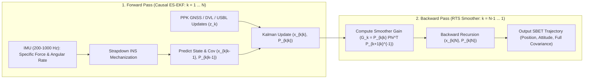

## 5.5 Mathematical Foundations

Transforming raw range and angle measurements from an airborne laser scanner (ALS), synthetic aperture radar (SAR), or multibeam echosounder (MBES) into a coherent three-dimensional elevation surface requires three coupled mathematical frameworks:
1. **Centimeter-level GNSS carrier-phase ambiguity resolution**, which anchors the trajectory in an Earth-Centered, Earth-Fixed (`ECEF`) geodetic reference frame;
2. **The 3D direct georeferencing rigid-body transformation and its first-order sensitivity Jacobian**, which map sensor-frame observables through lever arms, boresight angles, and time synchronization latencies into target coordinates and propagated covariance; and
3. **The Error-State Extended Kalman Filter (ES-EKF) and Rauch–Tung–Striebel (RTS) backward smoother**, which fuse high-rate inertial measurements with discrete GNSS or acoustic updates to produce a Smoothed Best Estimate of Trajectory (`SBET`).

---

### 5.5.1 Undifferenced and Double-Differenced GNSS Observation Equations

#### Undifferenced Code and Carrier-Phase Observables

For a GNSS receiver $r$ tracking satellite $s$ on carrier frequency $f$ (with wavelength $\lambda_f = c / f$, where $c = 299\,792\,458\text{ m s}^{-1}$ is the vacuum speed of light), the fundamental undifferenced pseudorange (code) observation $P_{r,f}^s$ and carrier-phase observation $\Phi_{r,f}^s$ (expressed in units of metric range, $\text{m}$, by multiplying raw cycles $\phi_{r,f}^s$ by $\lambda_f$) are given by (Misra & Enge, 2011; Teunissen & Montenbruck, 2017):

$$P_{r,f}^s = \rho_r^s + c\left(dt_r - dt^s\right) + T_r^s + I_{r,f}^s + c\left(d_{r,f} - d_f^s\right) + M_{P,f} + \epsilon_{P,f}$$

$$\Phi_{r,f}^s = \rho_r^s + c\left(dt_r - dt^s\right) + T_r^s - I_{r,f}^s + \lambda_f N_{r,f}^s + c\left(b_{r,f} - b_f^s\right) + \lambda_f \omega_r^s + M_{\Phi,f} + \epsilon_{\Phi,f}$$

In simplified single-frequency notation (absorbing hardware phase biases and phase wind-up into the effective clock and ambiguity terms), the carrier-phase equation takes the canonical form:

$$\Phi_r^s = \rho_r^s + c(dt_r - dt^s) + T_r^s - I_r^s + \lambda N_r^s + M_\Phi + \epsilon_\Phi$$

Every symbol and sign convention in these equations carries strict physical meaning:
* $\rho_r^s = \left\|\mathbf{p}^s(t - \tau_r^s) - \mathbf{p}_r(t)\right\|_2$ is the geometric range ($\text{m}$) between the satellite antenna phase center at signal transmission epoch $t - \tau_r^s$ and the receiver antenna phase center at reception epoch $t$, evaluated after applying the Sagnac Earth-rotation correction and antenna phase center offset/variation ($\text{PCO/PCV}$) vectors.
* $dt_r$ and $dt^s$ are the receiver and satellite clock offsets ($\text{s}$) relative to GPST/GNSS system time.
* $T_r^s = m_h(E)\cdot \text{ZHD} + m_w(E)\cdot \text{ZWD}$ is the non-dispersive tropospheric path delay ($\text{m}$) at satellite elevation angle $E$, decomposed into hydrostatic ($\text{ZHD}$) and wet ($\text{ZWD}$) zenith delays via mapping functions $m_h(E)$ and $m_w(E)$.
* $I_{r,f}^s \approx \frac{40.308}{f^2}\,\text{STEC}$ is the first-order dispersive ionospheric delay ($\text{m}$), where $\text{STEC}$ is the slant total electron content ($\text{electrons m}^{-2}$). Because the ionosphere is a dispersive plasma, group velocity is retarded ($+I_{r,f}^s$ in $P_{r,f}^s$) by the exact magnitude that phase velocity is advanced ($-I_{r,f}^s$ in $\Phi_{r,f}^s$).
* $N_{r,f}^s \in \mathbb{Z}$ is the integer carrier-phase cycle ambiguity ($\text{cycles}$).
* $d_{r,f}, d_f^s$ and $b_{r,f}, b_f^s$ are frequency-dependent code and carrier-phase hardware delays ($\text{s}$) in the receiver and satellite RF chains; $\omega_r^s$ is the carrier phase wind-up correction ($\text{cycles}$) due to relative dipole orientation.
* $M_{P,f}, M_{\Phi,f}$ are code and carrier multipath errors ($\text{m}$), where $M_{P,f}$ can reach $0.5\text{–}5\text{ m}$ while $M_{\Phi,f}$ is bounded by $\lambda_f / 4 \approx 4.8\text{ cm}$ on GPS L1 ($\lambda_1 \approx 19.03\text{ cm}$).
* $\epsilon_{P,f} \sim \mathcal{N}(0, \sigma_P^2)$ and $\epsilon_{\Phi,f} \sim \mathcal{N}(0, \sigma_\Phi^2)$ are zero-mean thermal tracking noise terms ($\sigma_P \approx 0.1\text{–}1.0\text{ m}$; $\sigma_\Phi \approx 1\text{–}2\text{ mm}$).

#### Single- and Double-Differencing Operator Calculus

To eliminate nuisance parameters and isolate the integer nature of $N_{r,f}^s$ in Real-Time Kinematic (`RTK`) and Post-Processed Kinematic (`PPK`) positioning, observations from a reference base station $A$ and a roving survey platform $B$ are differenced.

1. **Between-Receiver Single Difference ($\Delta$):** Subtracting base station $A$ from rover $B$ for the same satellite $j$ at identical reception epochs eliminates the satellite clock offset $dt^j$ and satellite hardware biases $d_f^j, b_f^j$, and strongly suppresses spatially correlated atmospheric delays over short baselines ($\|\mathbf{b}_{AB}\| \lesssim 10\text{–}20\text{ km}$):
   $$\Delta \Phi_{AB,f}^j \triangleq \Phi_{B,f}^j - \Phi_{A,f}^j = \Delta \rho_{AB}^j + c\,\Delta dt_{AB} + \Delta T_{AB}^j - \Delta I_{AB,f}^j + \lambda_f \Delta N_{AB,f}^j + c\,\Delta b_{AB,f} + \epsilon_{\Delta\Phi}$$

2. **Between-Receiver, Between-Satellite Double Difference ($\nabla\Delta$):** Selecting a high-elevation reference (pivot) satellite $j$ and differencing against another visible satellite $k$ eliminates the relative receiver clock offset $\Delta dt_{AB}$ and receiver hardware phase biases $\Delta b_{AB,f}$ (assuming satellites $j$ and $k$ share the same carrier frequency $f$, as in CDMA systems GPS, Galileo, and BeiDou):
   $$\nabla\Delta\Phi_{AB,f}^{jk} \triangleq \Delta\Phi_{AB,f}^k - \Delta\Phi_{AB,f}^j = \nabla\Delta\rho_{AB}^{jk} + \nabla\Delta T_{AB}^{jk} - \nabla\Delta I_{AB,f}^{jk} + \lambda_f \nabla\Delta N_{AB,f}^{jk} + \epsilon_{\nabla\Delta\Phi}$$
   where the double-differenced ambiguity $\nabla\Delta N_{AB,f}^{jk} = (N_{B,f}^k - N_{A,f}^k) - (N_{B,f}^j - N_{A,f}^j) \in \mathbb{Z}$ is strictly an integer. Notice the noise trade-off: assuming uncorrelated undifferenced phase variance $\sigma_\Phi^2$, error propagation yields $\sigma_{\Delta\Phi}^2 = 2\sigma_\Phi^2$ and $\sigma_{\nabla\Delta\Phi}^2 = 4\sigma_\Phi^2$ (so $\sigma_{\nabla\Delta\Phi} = 2\sigma_\Phi \approx 2\text{–}4\text{ mm}$), while introducing off-diagonal covariance $\text{Cov}(\nabla\Delta\Phi_{AB}^{jk}, \nabla\Delta\Phi_{AB}^{jl}) = 2\sigma_\Phi^2$ ($k \ne l$) because all $m_{\text{sat}} - 1$ double differences share the pivot satellite $j$, yielding the $(m_{\text{sat}}-1)\times(m_{\text{sat}}-1)$ covariance block $\mathbf{Q}_{\nabla\Delta\Phi} = 2\sigma_\Phi^2\left(\mathbf{I}_{m_{\text{sat}}-1} + \mathbf{1}\mathbf{1}^T\right)$.

#### Mixed Real-Integer Least Squares and the LAMBDA Method

Linearizing the double-differenced code and carrier-phase equations around an initial rover position estimate $\mathbf{p}_{B,0}$ yields the Gauss–Markov mixed integer-real linear model (Teunissen, 1995):

$$\mathbf{y} = \mathbf{A}\mathbf{a} + \mathbf{B}\mathbf{b} + \mathbf{e}, \quad \mathbf{e} \sim \mathcal{N}(\mathbf{0}, \mathbf{Q}_{\mathbf{y}\mathbf{y}}), \quad \mathbf{a} \in \mathbb{Z}^n, \quad \mathbf{b} \in \mathbb{R}^p$$

where:
* $\mathbf{y} \in \mathbb{R}^m$ is the vector of observed-minus-computed ($\text{O}-\text{C}$) double-differenced phase and code residuals;
* $\mathbf{a} \in \mathbb{Z}^n$ is the vector of double-differenced integer carrier-phase ambiguities ($\nabla\Delta N_{AB,f}^{jk}$);
* $\mathbf{b} \in \mathbb{R}^p$ contains the real-valued parameters: baseline coordinate increments $\delta\mathbf{p}_B = [\delta X, \delta Y, \delta Z]^T$ (or $[\delta E, \delta N, \delta U]^T$) and, for long baselines, residual zenith wet tropospheric delay $\delta\text{ZWD}$ and slant ionospheric parameters;
* $\mathbf{A} \in \mathbb{R}^{m\times n}$ contains the wavelength scaling matrices, and $\mathbf{B} \in \mathbb{R}^{m\times p}$ contains the negated double-differenced receiver-to-satellite unit direction cosines $-\left(\mathbf{1}_B^k - \mathbf{1}_B^j\right)^T$, where $\mathbf{1}_B^s = (\mathbf{p}^s - \mathbf{p}_{B,0}) / \|\mathbf{p}^s - \mathbf{p}_{B,0}\|_2$.

Solving the standard weighted normal equations without enforcing the integer constraint $\mathbf{a} \in \mathbb{Z}^n$ yields the **float solution** and its partitioned variance-covariance matrix:

$$\begin{bmatrix} \mathbf{A}^T \mathbf{Q}_{\mathbf{y}\mathbf{y}}^{-1} \mathbf{A} & \mathbf{A}^T \mathbf{Q}_{\mathbf{y}\mathbf{y}}^{-1} \mathbf{B} \\ \mathbf{B}^T \mathbf{Q}_{\mathbf{y}\mathbf{y}}^{-1} \mathbf{A} & \mathbf{B}^T \mathbf{Q}_{\mathbf{y}\mathbf{y}}^{-1} \mathbf{B} \end{bmatrix} \begin{bmatrix} \hat{\mathbf{a}} \\ \hat{\mathbf{b}} \end{bmatrix} = \begin{bmatrix} \mathbf{A}^T \mathbf{Q}_{\mathbf{y}\mathbf{y}}^{-1} \mathbf{y} \\ \mathbf{B}^T \mathbf{Q}_{\mathbf{y}\mathbf{y}}^{-1} \mathbf{y} \end{bmatrix}, \qquad \text{Cov}\left(\begin{bmatrix} \hat{\mathbf{a}} \\ \hat{\mathbf{b}} \end{bmatrix}\right) = \begin{bmatrix} \mathbf{Q}_{\hat{\mathbf{a}}\hat{\mathbf{a}}} & \mathbf{Q}_{\hat{\mathbf{a}}\hat{\mathbf{b}}} \\ \mathbf{Q}_{\hat{\mathbf{b}}\hat{\mathbf{a}}} & \mathbf{Q}_{\hat{\mathbf{b}}\hat{\mathbf{b}}} \end{bmatrix}$$

In the **LAMBDA** (Least-squares AMBiguity Decorrelation Adjustment) method (Teunissen, 1995), the orthogonal decomposition of the objective function $\|\mathbf{y} - \mathbf{A}\mathbf{a} - \mathbf{B}\mathbf{b}\|_{\mathbf{Q}_{\mathbf{y}\mathbf{y}}}^2$ reduces the integer least-squares problem to minimizing the squared Mahalanobis distance in the ambiguity space:

$$\check{\mathbf{a}} = \arg\min_{\mathbf{a} \in \mathbb{Z}^n} \|\hat{\mathbf{a}} - \mathbf{a}\|_{\mathbf{Q}_{\hat{\mathbf{a}}\hat{\mathbf{a}}}}^2 = \arg\min_{\mathbf{a} \in \mathbb{Z}^n} (\hat{\mathbf{a}} - \mathbf{a})^T \mathbf{Q}_{\hat{\mathbf{a}}\hat{\mathbf{a}}}^{-1} (\hat{\mathbf{a}} - \mathbf{a})$$

Because single-epoch or short-span float ambiguities $\hat{\mathbf{a}}$ are heavily correlated ($\mathbf{Q}_{\hat{\mathbf{a}}\hat{\mathbf{a}}}$ is highly elongated), a direct grid search is computationally intractable. LAMBDA constructs an integer-preserving unimodular transformation matrix $\mathbf{Z} \in \mathbb{Z}^{n\times n}$ (with $\det(\mathbf{Z}) = \pm 1$, built via sequential integer Gauss transformations and permutations) to transform the ambiguities into a decorrelated space:

$$\mathbf{z} = \mathbf{Z}^T \mathbf{a}, \quad \hat{\mathbf{z}} = \mathbf{Z}^T \hat{\mathbf{a}}, \quad \mathbf{Q}_{\hat{\mathbf{z}}\hat{\mathbf{z}}} = \mathbf{Z}^T \mathbf{Q}_{\hat{\mathbf{a}}\hat{\mathbf{a}}} \mathbf{Z}$$

where $\mathbf{Q}_{\hat{\mathbf{z}}\hat{\mathbf{z}}}$ is nearly diagonal, permitting a rapid sequential conditional least-squares tree search inside a hyper-ellipsoid to find the best integer candidate $\check{\mathbf{z}}_1$ and second-best candidate $\check{\mathbf{z}}_2$, which map back via $\check{\mathbf{a}}_i = \mathbf{Z}^{-T}\check{\mathbf{z}}_i$. Candidate acceptance is validated using the **ratio test** (typically with threshold $\mu \in [2.0, 3.0]$ or fixed failure-rate critical values):

$$\frac{\|\hat{\mathbf{a}} - \check{\mathbf{a}}_2\|_{\mathbf{Q}_{\hat{\mathbf{a}}\hat{\mathbf{a}}}}^2}{\|\hat{\mathbf{a}} - \check{\mathbf{a}}_1\|_{\mathbf{Q}_{\hat{\mathbf{a}}\hat{\mathbf{a}}}}^2} = \frac{\|\hat{\mathbf{z}} - \check{\mathbf{z}}_2\|_{\mathbf{Q}_{\hat{\mathbf{z}}\hat{\mathbf{z}}}}^2}{\|\hat{\mathbf{z}} - \check{\mathbf{z}}_1\|_{\mathbf{Q}_{\hat{\mathbf{z}}\hat{\mathbf{z}}}}^2} \ge \mu$$

Once $\check{\mathbf{a}} = \check{\mathbf{a}}_1$ is accepted, the real-valued rover position and atmospheric state $\hat{\mathbf{b}}$ is conditioned on the fixed integer ambiguities to yield the **fixed solution** $\check{\mathbf{b}}$ and its dramatically reduced covariance $\mathbf{Q}_{\check{\mathbf{b}}\check{\mathbf{b}}}$:

$$\check{\mathbf{b}} = \hat{\mathbf{b}} - \mathbf{Q}_{\hat{\mathbf{b}}\hat{\mathbf{a}}}\mathbf{Q}_{\hat{\mathbf{a}}\hat{\mathbf{a}}}^{-1}\left(\hat{\mathbf{a}} - \check{\mathbf{a}}\right), \qquad \mathbf{Q}_{\check{\mathbf{b}}\check{\mathbf{b}}} = \mathbf{Q}_{\hat{\mathbf{b}}\hat{\mathbf{b}}} - \mathbf{Q}_{\hat{\mathbf{b}}\hat{\mathbf{a}}}\mathbf{Q}_{\hat{\mathbf{a}}\hat{\mathbf{a}}}^{-1}\mathbf{Q}_{\hat{\mathbf{a}}\hat{\mathbf{b}}}$$

Fixing ambiguities collapses the vertical baseline standard deviation $\sigma_U$ from decimeters (float) to $1.5\text{–}3\text{ cm}$ (fixed).

---

### 5.5.2 The Master 3D Direct Georeferencing Equation and First-Order Error Jacobian

#### Coordinate Frames and the Master Rigid-Body Equation

Consider a mobile mapping platform (aircraft, UAV, surface vessel, or AUV) carrying an IMU and a range/angle swath sensor (LiDAR or MBES). Four right-handed orthogonal coordinate frames are involved:
1. **Sensor Frame ($s$):** Origin at the optical/acoustic reference center of the scanner/transducer. For a cross-track swath sensor scanning in the $y_s\text{–}z_s$ plane at scan/beam angle $\beta$ (measured from nadir $+z_s$ toward starboard $+y_s$) with measured two-way slant range $r$, the target vector in the sensor frame is:
   $$\mathbf{r}_{\text{target}}^s(t) = \begin{bmatrix} 0 \\ r(t)\sin\beta(t) \\ r(t)\cos\beta(t) \end{bmatrix}$$
2. **Body / IMU Frame ($b$):** Origin at the IMU sensing center, with axes aligned forward ($+x_b$, roll axis), starboard/right ($+y_b$, pitch axis), and down ($+z_b$, yaw axis).
3. **Local Navigation Frame ($n$):** Local geodetic horizon frame (`NED`: North $+x_n$, East $+y_n$, Down $+z_n$; or `ENU`: East, North, Up) tangent to the ellipsoid at geodetic latitude $\varphi$ and longitude $\lambda$.
4. **Geocentric Frame (`ECEF`):** Earth-Centered, Earth-Fixed Cartesian frame $(X, Y, Z)$.

The **Master 3D Direct Georeferencing Equation** transforms a range/angle observation recorded at sensor timestamp $t$ into `ECEF` coordinates (written in both explicit subscript-frame and compact notation):

$$\mathbf{p}_{\text{target}}^{\text{ECEF}}(t) = \mathbf{p}_{\text{IMU}}^{\text{ECEF}}(t) + \mathbf{R}_n^{\text{ECEF}}(\varphi, \lambda)\mathbf{R}_b^n(\phi(t), \theta(t), \psi(t))\left[\mathbf{l}_{\text{lever}}^b + \mathbf{R}_s^b(\delta\phi, \delta\theta, \delta\psi)\,\mathbf{r}_{\text{target}}^s(t + \delta t_{\text{lat}})\right]$$

or equivalently in the notation of the chapter overview:

$$\mathbf{p}_{\text{ECEF}}(t) = \mathbf{p}_{\text{IMU}}(t) + \mathbf{R}_{\text{nav}}^{\text{ECEF}}(\varphi, \lambda)\mathbf{R}_{\text{body}}^{\text{nav}}(\phi(t), \theta(t), \psi(t)) \left[ \mathbf{l}_{\text{lever}} + \mathbf{R}_{\text{boresight}}(\delta\phi, \delta\theta, \delta\psi) \mathbf{r}_{\text{sensor}}(t + \delta t_{\text{latency}}) \right]$$

where:
* $\mathbf{p}_{\text{IMU}}^{\text{ECEF}}(t) \in \mathbb{R}^3$ is the `ECEF` position ($\text{m}$) of the IMU center at epoch $t$ (derived from the GNSS antenna phase center via the GNSS-to-IMU lever arm);
* $\mathbf{l}_{\text{lever}}^b = [\Delta x, \Delta y, \Delta z]^T \in \mathbb{R}^3$ is the surveyed lever-arm vector ($\text{m}$) from the IMU center to the sensor acoustic/optical origin, resolved in the body frame $b$;
* $\mathbf{R}_s^b(\delta\phi, \delta\theta, \delta\psi) \in \text{SO}(3)$ is the rigid boresight rotation matrix from the sensor frame $s$ to the IMU body frame $b$, parameterized by small mounting misalignment angles $(\delta\phi, \delta\theta, \delta\psi)$;
* $\delta t_{\text{lat}}$ (or $\delta t_{\text{latency}}$, in $\text{s}$) is the uncalibrated time synchronization latency between the sensor range/angle clock and the IMU/GNSS time base.

#### Explicit Rotation Matrices

Using the standard aerospace $Z\text{–}Y\text{–}X$ intrinsic Euler angle sequence—rotating from body frame $b$ to navigation frame $n$ (`NED`) by roll $\phi$ about $x_b$, pitch $\theta$ about the intermediate $y$-axis, and heading/yaw $\psi$ about $z_n$—the attitude matrix $\mathbf{R}_b^n(\phi, \theta, \psi) = \mathbf{R}_z(\psi)\mathbf{R}_y(\theta)\mathbf{R}_x(\phi)$ is:

$$\mathbf{R}_b^n(\phi, \theta, \psi) = \begin{bmatrix} \cos\psi\cos\theta & \cos\psi\sin\theta\sin\phi - \sin\psi\cos\phi & \cos\psi\sin\theta\cos\phi + \sin\psi\sin\phi \\ \sin\psi\cos\theta & \sin\psi\sin\theta\sin\phi + \cos\psi\cos\phi & \sin\psi\sin\theta\cos\phi - \cos\psi\sin\phi \\ -\sin\theta & \cos\theta\sin\phi & \cos\theta\cos\phi \end{bmatrix}$$

The rotation from the local `NED` frame $n$ at geodetic latitude $\varphi$ and longitude $\lambda$ to `ECEF` is:

$$\mathbf{R}_n^{\text{ECEF}}(\varphi, \lambda) = \begin{bmatrix} -\sin\varphi\cos\lambda & -\sin\lambda & -\cos\varphi\cos\lambda \\ -\sin\varphi\sin\lambda & \cos\lambda & -\cos\varphi\sin\lambda \\ \cos\varphi & 0 & -\sin\varphi \end{bmatrix}$$

#### Small-Angle Perturbation and the First-Order Sensitivity Jacobian

To propagate sensor and trajectory uncertainties into local navigation coordinates $\mathbf{p}_{\text{target}}^n = [N, E, D]^T$ (where $D = -z$ is positive-down depth and $U = z = -D$ is positive-up elevation), we express the georeferencing equation in the local navigation frame $n$:

$$\mathbf{p}_{\text{target}}^n(t) = \mathbf{p}_{\text{IMU}}^n(t) + \mathbf{R}_b^n(\phi, \theta, \psi)\left[\mathbf{l}_{\text{lever}}^b + \mathbf{R}_s^b(\delta\phi_b, \delta\theta_b, \delta\psi_b)\,\mathbf{r}_{\text{target}}^s(t + \delta t_{\text{lat}})\right]$$

For small attitude perturbations $\boldsymbol{\delta\theta}^b = [\delta\phi, \delta\theta, \delta\psi]^T$ (in $\text{rad}$) and small boresight misalignments $\boldsymbol{\delta\theta}_{\text{bs}} = [\delta\phi_b, \delta\theta_b, \delta\psi_b]^T$, the perturbed rotation matrices expand to first order using the skew-symmetric cross-product matrix $[\mathbf{u}]_\times$:

$$\mathbf{R}_b^n(\phi + \delta\phi, \theta + \delta\theta, \psi + \delta\psi) \approx \mathbf{R}_b^n(\phi, \theta, \psi)\left(\mathbf{I}_3 + [\boldsymbol{\delta\theta}^b]_\times\right), \quad \text{where } [\mathbf{u}]_\times \triangleq \begin{bmatrix} 0 & -u_z & u_y \\ u_z & 0 & -u_x \\ -u_y & u_x & 0 \end{bmatrix}$$

Similarly, a time synchronization error $\delta t_{\text{lat}}$ between the IMU trajectory and the sensor measurement introduces both a translational shift $\mathbf{v}_{\text{IMU}}^n\,\delta t_{\text{lat}}$ and an attitude rotation error $\boldsymbol{\omega}_{nb}^b\,\delta t_{\text{lat}}$ proportional to the platform angular velocity $\boldsymbol{\omega}_{nb}^b \approx [\dot{\phi}, \dot{\theta}, \dot{\psi}]^T$. Defining the 15-element parameter vector $\boldsymbol{\Theta} = \left[(\mathbf{p}_{\text{IMU}}^n)^T,\, (\boldsymbol{\theta}^b)^T,\, (\boldsymbol{\theta}_{\text{bs}})^T,\, (\mathbf{l}_{\text{lever}}^b)^T,\, r,\, \beta,\, \delta t_{\text{lat}}\right]^T \in \mathbb{R}^{15}$ and letting $\mathbf{r}^b = \mathbf{R}_s^b \mathbf{r}_{\text{target}}^s$, the first-order perturbation of the target position in the navigation frame is:

$$\delta\mathbf{p}_{\text{target}}^n = \mathbf{J}_{\text{georef}}\,\delta\boldsymbol{\Theta} = \delta\mathbf{p}_{\text{IMU}}^n - \mathbf{R}_b^n\left[\mathbf{l}_{\text{lever}}^b + \mathbf{r}^b\right]_\times \boldsymbol{\delta\theta}^b - \mathbf{R}_b^n\left[\mathbf{r}^b\right]_\times \boldsymbol{\delta\theta}_{\text{bs}} + \mathbf{R}_b^n\,\delta\mathbf{l}_{\text{lever}}^b + \mathbf{R}_b^n\mathbf{R}_s^b \frac{\partial \mathbf{r}_{\text{target}}^s}{\partial (r, \beta)} \begin{bmatrix}\delta r \\ \delta\beta\end{bmatrix} + \left(\mathbf{v}_{\text{IMU}}^n + \mathbf{R}_b^n\left[\boldsymbol{\omega}_{nb}^b\right]_\times\left(\mathbf{l}_{\text{lever}}^b + \mathbf{r}^b\right)\right)\delta t_{\text{lat}}$$

Thus, the $3 \times 15$ first-order sensitivity Jacobian $\mathbf{J}_{\text{georef}} = \frac{\partial \mathbf{p}_{\text{target}}^n}{\partial \boldsymbol{\Theta}}$ is partitioned into six physical block columns:

$$\mathbf{J}_{\text{georef}} = \left[\; \underbrace{\mathbf{I}_3}_{\mathbf{J}_{\text{pos}}} \;\middle|\; \underbrace{-\mathbf{R}_b^n\left[\mathbf{l}_{\text{lever}}^b + \mathbf{r}^b\right]_\times}_{\mathbf{J}_{\text{att}}} \;\middle|\; \underbrace{-\mathbf{R}_b^n\left[\mathbf{r}^b\right]_\times}_{\mathbf{J}_{\text{boresight}}} \;\middle|\; \underbrace{\mathbf{R}_b^n}_{\mathbf{J}_{\text{lever}}} \;\middle|\; \underbrace{\mathbf{R}_b^n\mathbf{R}_s^b \begin{bmatrix} 0 & 0 \\ \sin\beta & r\cos\beta \\ \cos\beta & -r\sin\beta \end{bmatrix}}_{\mathbf{J}_{\text{sensor}}} \;\middle|\; \underbrace{\mathbf{v}_{\text{IMU}}^n - \mathbf{R}_b^n\left[\mathbf{l}_{\text{lever}}^b + \mathbf{r}^b\right]_\times \boldsymbol{\omega}_{nb}^b}_{\mathbf{J}_{\text{latency}}} \;\right]$$

By the law of propagation of variances, for a parameter covariance matrix $\boldsymbol{\Sigma}_{\text{params}} = \text{Cov}(\boldsymbol{\Theta}) \in \mathbb{R}^{15\times 15}$, the $3\times 3$ target coordinate covariance in the local navigation frame is:

$$\boldsymbol{\Sigma}_{\text{target}} = \begin{bmatrix} \sigma_N^2 & \sigma_{NE} & \sigma_{ND} \\ \sigma_{NE} & \sigma_E^2 & \sigma_{ED} \\ \sigma_{ND} & \sigma_{ED} & \sigma_D^2 \end{bmatrix} = \mathbf{J}_{\text{georef}}\,\boldsymbol{\Sigma}_{\text{params}}\,\mathbf{J}_{\text{georef}}^T$$

Evaluating the third row of $\mathbf{J}_{\text{georef}}$ (where row 3 of $\mathbf{R}_b^n$ is $[-\sin\theta,\; \cos\theta\sin\phi,\; \cos\theta\cos\phi]$) for a nearly level platform ($\phi, \theta \approx 0$, nominal identity boresight $\mathbf{R}_s^b \approx \mathbf{I}_3$, and $\|\mathbf{l}_{\text{lever}}^b\| \ll r$) yields the fundamental **vertical error equation for a swath sensor** (written for both positive-down depth $D$ and positive-up elevation $U = z = -D$):

$$\delta D = -\delta U \approx \delta D_{\text{IMU}} + \cos\beta\,\delta r - r\sin\beta\,\delta\beta + r\sin\beta\left(\delta\phi + \delta\phi_b + \dot{\phi}\,\delta t_{\text{lat}}\right) + \left(\Delta y\,\delta\phi - \Delta x\,\delta\theta\right) + v_D\,\delta t_{\text{lat}}$$

Assuming statistically independent error sources, the total vertical variance $\sigma_z^2 = \sigma_D^2 = \sigma_U^2$ (including residual pitch coupling when platform pitch $\theta$ or along-track lever arm $\Delta x$ is non-zero) is:

$$\sigma_z^2 \approx \sigma_{z,\text{IMU}}^2 + \left(\cos\beta\,\sigma_r\right)^2 + \left(r\sin\beta\,\sigma_\beta\right)^2 + \left(r\sin\beta\right)^2\left(\sigma_\phi^2 + \sigma_{\phi_b}^2 + \dot{\phi}^2\sigma_{\delta t}^2\right) + \left(\Delta x\cos\theta + r\cos\beta\sin\theta\right)^2\sigma_\theta^2 + \sigma_{z,\text{lever}}^2$$

Notice how every angular roll error ($\sigma_\phi$, boresight $\sigma_{\phi_b}$, scan-angle $\sigma_\beta$, and roll-rate latency $\dot{\phi}\,\delta t_{\text{lat}}$) is multiplied by the cross-track lever arm $y = r\sin\beta = H\tan\beta$. Under IHO S-44 and ASPRS standards, the 95% **Total Vertical Uncertainty ($\text{TVU}$)** and 95% **Total Horizontal Uncertainty ($\text{THU}$)** are obtained from $\boldsymbol{\Sigma}_{\text{target}}$ via:

$$\text{TVU}_{95\%} = 1.96\,\sigma_z, \qquad \text{THU}_{95\%}^{\text{circular}} \approx 2.4477\sqrt{\frac{\sigma_N^2 + \sigma_E^2}{2}}$$

---

### 5.5.3 Extended Kalman Filter (ES-EKF) and Rauch–Tung–Striebel (RTS) Smoother

#### Forward Error-State Extended Kalman Filter (ES-EKF)

Because full strapdown INS states evolve nonlinearly and attitude resides on the manifold $\text{SO}(3)$, modern GNSS/INS navigation processors integrate the nominal kinematics at the full IMU rate ($100\text{–}1000\text{ Hz}$) and estimate a 15-state perturbation vector $\delta\mathbf{x}_k \in \mathbb{R}^{15}$ in an **Error-State Extended Kalman Filter (ES-EKF)** (Groves, 2013):

$$\delta\mathbf{x}_k = \begin{bmatrix} \delta\mathbf{p}^n \\ \delta\mathbf{v}^n \\ \boldsymbol{\delta\theta}^n \\ \mathbf{b}_a^b \\ \mathbf{b}_g^b \end{bmatrix}_k \in \mathbb{R}^{15}$$

where $\delta\mathbf{p}^n, \delta\mathbf{v}^n, \boldsymbol{\delta\theta}^n \in \mathbb{R}^3$ are the position, velocity, and small-angle attitude errors in the navigation frame, and $\mathbf{b}_a^b, \mathbf{b}_g^b \in \mathbb{R}^3$ are the accelerometer and gyroscope biases in the body frame (modeled as first-order Gauss–Markov processes). With discrete transition matrix $\boldsymbol{\Phi}_{k-1,k} \approx \exp(\mathbf{F}(t_{k-1})\Delta t)$ and process noise covariance $\mathbf{Q}_{k-1}$, the **forward EKF recursion** from epoch $k = 1$ to $N$ consists of:

1. **Time Update (Prediction):**
   $$\delta\hat{\mathbf{x}}_{k|k-1} = \boldsymbol{\Phi}_{k-1,k}\,\delta\hat{\mathbf{x}}_{k-1|k-1}, \qquad \mathbf{P}_{k|k-1} = \boldsymbol{\Phi}_{k-1,k}\,\mathbf{P}_{k-1|k-1}\,\boldsymbol{\Phi}_{k-1,k}^T + \mathbf{Q}_{k-1}$$

2. **Measurement Update (at GNSS or DVL/USBL epoch $k$ with innovation $\mathbf{z}_k$ and measurement Jacobian $\mathbf{H}_k$):**
   $$\mathbf{K}_k = \mathbf{P}_{k|k-1}\mathbf{H}_k^T\left(\mathbf{H}_k\mathbf{P}_{k|k-1}\mathbf{H}_k^T + \mathbf{R}_k\right)^{-1}$$
   $$\delta\hat{\mathbf{x}}_{k|k} = \delta\hat{\mathbf{x}}_{k|k-1} + \mathbf{K}_k\left(\mathbf{z}_k - \mathbf{H}_k\delta\hat{\mathbf{x}}_{k|k-1}\right)$$
   $$\mathbf{P}_{k|k} = \left(\mathbf{I}_{15} - \mathbf{K}_k\mathbf{H}_k\right)\mathbf{P}_{k|k-1}\left(\mathbf{I}_{15} - \mathbf{K}_k\mathbf{H}_k\right)^T + \mathbf{K}_k\mathbf{R}_k\mathbf{K}_k^T \quad \text{(Joseph stabilized form)}$$

After each measurement update, $\delta\hat{\mathbf{x}}_{k|k}$ is injected into the nominal trajectory $\hat{\mathbf{x}}_{k|k}$ (closed-loop feedback) and reset to zero, while the injected correction and transition matrices are logged to disk for backward smoothing.

#### Rauch–Tung–Striebel (RTS) Backward Smoother

A causal forward filter uses only measurements up to time $t_k$; during a GNSS outage (under bridges, beneath dense forest canopy, or during high-bank aircraft turns), uncertainty grows cubically in position ($\delta p \propto \frac{1}{6} b_g g t^3$) and jumps discontinuously when GNSS lock is regained, creating artificial steps in the DEM. In post-processing, the **Rauch–Tung–Striebel (RTS) fixed-interval smoother** (Rauch, Tung, & Striebel, 1965) sweeps backward from $k = N-1$ down to $k = 1$, conditioning every state estimate on the entire survey dataset $\{1, \dots, N\}$ without reprocessing raw measurements:

$$\mathbf{G}_k = \mathbf{P}_{k|k}\,\boldsymbol{\Phi}_{k,k+1}^T\,\mathbf{P}_{k+1|k}^{-1}$$

$$\hat{\mathbf{x}}_{k|N} = \hat{\mathbf{x}}_{k|k} + \mathbf{G}_k\left(\hat{\mathbf{x}}_{k+1|N} - \hat{\mathbf{x}}_{k+1|k}\right)$$

$$\mathbf{P}_{k|N} = \mathbf{P}_{k|k} + \mathbf{G}_k\left(\mathbf{P}_{k+1|N} - \mathbf{P}_{k+1|k}\right)\mathbf{G}_k^T$$

where $\mathbf{G}_k \in \mathbb{R}^{15\times 15}$ is the backward smoother gain matrix. Because $\mathbf{P}_{k+1|N} \preceq \mathbf{P}_{k+1|k}$ in the positive-semidefinite Loewner ordering, the smoothed covariance $\mathbf{P}_{k|N}$ is strictly smaller than or equal to the forward covariance $\mathbf{P}_{k|k}$, eliminating filter reset discontinuities and reducing peak outage position error by a factor of $3\text{–}4\times$.

---

### 5.5.4 Worked Numerical Examples: Swath Outer-Beam Vertical Uncertainty

To see how the direct georeferencing Jacobian governs DEM accuracy, we evaluate the outer-beam vertical uncertainty for both an airborne topographic LiDAR and a marine multibeam echosounder.

#### Case A: Airborne Topographic LiDAR at $30^\circ$ Scan Half-Angle
* **Operating Geometry:** Flying height $H = 1000\text{ m}$ AGL over flat terrain; outer scan angle $\beta = 30^\circ$; slant range $r = H / \cos 30^\circ = 1154.70\text{ m}$; cross-track distance $y = r\sin 30^\circ = 577.35\text{ m}$.
* **Error Budget ($1\sigma$):**
  * Smoothed PPK/RTS vertical trajectory uncertainty: $\sigma_{z,\text{IMU}} = 0.030\text{ m}$ ($3.0\text{ cm}$).
  * Laser rangefinder precision: $\sigma_r = 0.015\text{ m}$ ($1.5\text{ cm}$).
  * Combined roll + boresight + mirror encoder uncertainty: $\sigma_{\phi,\text{tot}} = \sqrt{\sigma_\phi^2 + \sigma_{\phi_b}^2 + \sigma_\beta^2} = 0.005^\circ = 8.7266 \times 10^{-5}\text{ rad}$ (tactical-grade FOG IMU with RTS smoothing).
  * Platform roll rate during gentle turbulence: $\dot{\phi} = 2^\circ\text{ s}^{-1} = 0.03491\text{ rad s}^{-1}$ with hardware PPS/PTP time synchronization jitter $\sigma_{\delta t} = 0.1\text{ ms} = 10^{-4}\text{ s}$.

Evaluating each term in the vertical variance equation:
1. **Trajectory vertical variance:** $\sigma_{z,\text{IMU}}^2 = (0.030)^2 = 9.00 \times 10^{-4}\text{ m}^2$.
2. **Range variance:** $(\cos 30^\circ\,\sigma_r)^2 = (0.8660 \times 0.015)^2 = (0.0130\text{ m})^2 = 1.69 \times 10^{-4}\text{ m}^2$.
3. **Angular roll/boresight variance:** $(r\sin 30^\circ\,\sigma_{\phi,\text{tot}})^2 = (577.35\text{ m} \times 8.7266 \times 10^{-5}\text{ rad})^2 = (0.0504\text{ m})^2 = 2.54 \times 10^{-3}\text{ m}^2$.
4. **Latency variance:** $(r\sin 30^\circ\,\dot{\phi}\,\sigma_{\delta t})^2 = (577.35 \times 0.03491 \times 10^{-4})^2 = (0.0020\text{ m})^2 = 4.06 \times 10^{-6}\text{ m}^2$.

Summing the variances yields:

$$\sigma_z = \sqrt{(0.030)^2 + (0.0130)^2 + (0.0504)^2 + (0.0020)^2} = \sqrt{0.003613}\text{ m} = 0.0601\text{ m} \approx 6.0\text{ cm} \quad (\text{TVU}_{95\%} = 1.96\sigma_z = 11.8\text{ cm})$$

Even with a $0.005^\circ$ ($18\text{ arcsec}$) IMU, the outer-beam roll term ($5.04\text{ cm}$) exceeds both the GNSS vertical error ($3.0\text{ cm}$) and the laser range error ($1.3\text{ cm}$), accounting for **70.3% of the total vertical variance**.

#### Case B: Multibeam Echosounder (MBES) at $65^\circ$ Outer Beam with Time Latency
* **Operating Geometry:** Continental shelf water depth $d = 100\text{ m}$; outer beam angle $\beta = 65^\circ$; slant range $r = d / \cos 65^\circ = 236.62\text{ m}$; cross-track swath half-width $y = r\sin 65^\circ = 214.45\text{ m}$.
* **Error Budget ($1\sigma$):**
  * Smoothed RTK/heave vertical uncertainty: $\sigma_{z,\text{IMU}} = 0.050\text{ m}$ ($5.0\text{ cm}$).
  * Effective acoustic range + sound velocity refraction vertical component: $\sigma_{z,\text{acoust}} = 0.120\text{ m}$ ($12.0\text{ cm}$).
  * Marine MRU/INS roll + boresight uncertainty: $\sigma_{\phi,\text{tot}} = 0.020^\circ = 3.4907 \times 10^{-4}\text{ rad}$.
  * Vessel roll rate in moderate swell: $\dot{\phi} = 10^\circ\text{ s}^{-1} = 0.17453\text{ rad s}^{-1}$. We compare a properly synchronized survey ($\delta t_{\text{lat}} = 0.1\text{ ms}$) against an uncalibrated serial/network timestamp latency of $\delta t_{\text{lat}} = 5.0\text{ ms} = 0.005\text{ s}$.

Evaluating the error components at the $65^\circ$ outer beam:
1. **Roll attitude error ($1\sigma$):** $\sigma_{z,\text{roll}} = r\sin 65^\circ\,\sigma_{\phi,\text{tot}} = 214.45\text{ m} \times 3.4907 \times 10^{-4}\text{ rad} = 0.0749\text{ m}$ ($7.5\text{ cm}$).
2. **Baseline vertical uncertainty ($\delta t_{\text{lat}} = 0.1\text{ ms}$, where $\delta z_{\text{lat}} = 0.37\text{ cm}$):**
   $$\sigma_z = \sqrt{(0.050)^2 + (0.120)^2 + (0.0749)^2 + (0.0037)^2} = 0.1501\text{ m} \implies \text{TVU}_{95\%} = 1.96 \times 0.1501\text{ m} = 0.294\text{ m}$$
3. **Uncalibrated $5.0\text{ ms}$ time latency ($\delta t_{\text{lat}} = 0.005\text{ s}$):** During a $10^\circ\text{ s}^{-1}$ roll, the $5\text{ ms}$ delay induces an instantaneous roll angle error of $\delta\phi_{\text{lat}} = \dot{\phi}\,\delta t_{\text{lat}} = 0.050^\circ = 8.7266 \times 10^{-4}\text{ rad}$, producing a systematic outer-beam depth bias of:
   $$\delta z_{\text{lat}} = r\sin 65^\circ\,\dot{\phi}\,\delta t_{\text{lat}} = 214.45\text{ m} \times 0.17453\text{ rad s}^{-1} \times 0.005\text{ s} = 0.1871\text{ m} \quad (18.7\text{ cm})$$
   Including this latency error inflates the 95% outer-beam vertical uncertainty to $\text{TVU}_{95\%} = 1.96\sqrt{(0.1501)^2 + (0.1871)^2} = 0.470\text{ m}$, oscillating at the vessel's roll period ($6\text{–}10\text{ s}$) with a $37.4\text{ cm}$ peak-to-trough amplitude to carve classic cross-track "washboard" artifacts into the bathymetric DEM.

| Parameter / Error Component | Airborne LiDAR ($H = 1000\text{ m}, \beta = 30^\circ$) | MBES Synchronized ($d = 100\text{ m}, \beta = 65^\circ$) | MBES with $5\text{ ms}$ Latency ($d = 100\text{ m}, \beta = 65^\circ$) |
| :--- | :--- | :--- | :--- |
| **Slant Range $r$ / Cross-Track $y$** | $1154.70\text{ m} \;/\; 577.35\text{ m}$ | $236.62\text{ m} \;/\; 214.45\text{ m}$ | $236.62\text{ m} \;/\; 214.45\text{ m}$ |
| **IMU/GNSS Vertical $\sigma_{z,\text{IMU}}$ ($1\sigma$)** | $0.030\text{ m}$ | $0.050\text{ m}$ | $0.050\text{ m}$ |
| **Range / Sound Speed Vertical $\sigma_{z,r}$ ($1\sigma$)** | $0.013\text{ m}$ | $0.120\text{ m}$ | $0.120\text{ m}$ |
| **Roll & Boresight $\sigma_{z,\text{roll}}$ ($1\sigma$)** | $0.050\text{ m}$ ($\sigma_\phi = 0.005^\circ$) | $0.075\text{ m}$ ($\sigma_\phi = 0.020^\circ$) | $0.075\text{ m}$ ($\sigma_\phi = 0.020^\circ$) |
| **Time Latency Vertical Error $\delta z_{\text{lat}}$** | $0.002\text{ m}$ ($\delta t = 0.1\text{ ms}$) | $0.004\text{ m}$ ($\delta t = 0.1\text{ ms}$) | **$0.187\text{ m}$** ($\delta t = 5.0\text{ ms}$) |
| **Combined $\sigma_z$ ($1\sigma$) / $\text{TVU}_{95\%}$** | **$0.060\text{ m} \;/\; 0.118\text{ m}$** | **$0.150\text{ m} \;/\; 0.294\text{ m}$** | **$0.240\text{ m} \;/\; 0.470\text{ m}$** |
| **Standards Compliance (USGS 3DEP / IHO S-44)** | Passes 3DEP QL1 ($\sigma_z \le 0.10\text{ m}$) | Passes Order 1a ($0.294\text{ m} < 1.39\text{ m}$) | Passes raw 1a TVU, fails NOAA HSSD systematic artifact check |

> [!IMPORTANT]
> **The Outer-Beam Attitude Amplification Law:** In any swath mapping geometry, vertical error from roll and boresight misalignments grows as $\delta z = r\sin\beta\,\delta\phi = H\tan\beta\,\delta\phi$. Doubling the flying height $H$ or water depth $d$, or pushing multibeam swath angles past $\beta = 60^\circ$ ($\tan 60^\circ = 1.732$, $\tan 70^\circ = 2.747$), causes IMU roll uncertainty and millisecond-level timestamp latency to dominate the entire DEM error budget.
