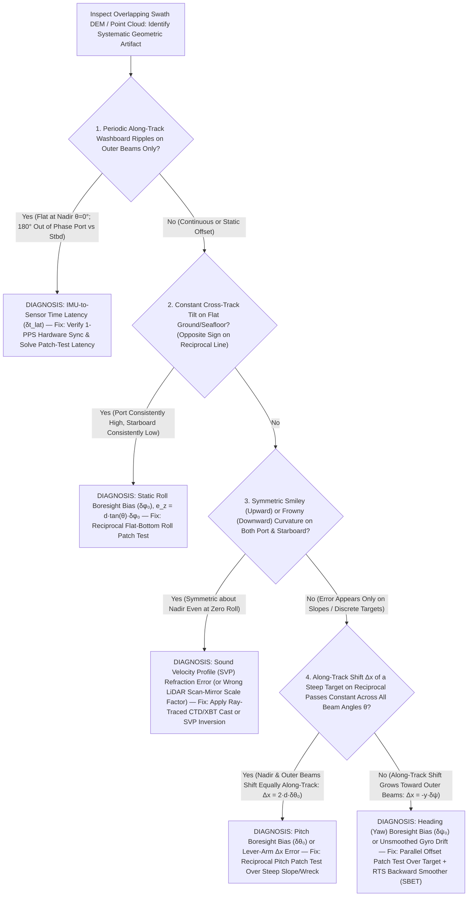

## 5.7 Common Pitfalls & Key Takeaways

A modern airborne LiDAR scanner or multibeam echosounder (MBES) is capable of measuring slant ranges to millimeter-to-centimeter precision, yet the resulting Digital Elevation Model (DEM) is only as accurate as the six-degree-of-freedom (6-DoF) trajectory $\bigl(\mathbf{p}_{\text{IMU}}(t), \phi(t), \theta(t), \psi(t)\bigr)$ and the spatiotemporal calibration parameters $(\mathbf{l}_{\text{lever}}, \delta\phi, \delta\theta, \delta\psi, \delta t_{\text{lat}})$ that project each raw range-angle observation into an Earth-fixed reference frame (Section 5.5). In operational DEM production, hardware sensor noise is rarely the dominant source of failure. Instead, elevation datasets are routinely degraded by **deterministic geodetic, kinematic, and acoustic integration blunders**: mismeasured GNSS antenna heights, millisecond-level clock latencies between inertial and swath sensors, unobservable heading gyro drift along straight survey lines, mismatched coordinate-frame conventions, and uncompensated subsea pressure or acoustic refraction approximations.

Because angular attitude errors $(\delta\phi, \delta\theta, \delta\psi)$ and timing latencies $(\delta t_{\text{lat}})$ are multiplied by the sensor's slant range $r$ and off-nadir beam angle $\theta$, seemingly innocuous calibration oversights at the vessel or aircraft level amplify linearly across the swath—manifesting on the ground or seafloor as systematic vertical biases, periodic "washboard" ripples, "smiley/frowny" cross-track curvature, or meter-scale swath discontinuities. This section analyzes five canonical positioning and attitude failure modes—complete with governing physics, error-propagation equations, and worked numerical examples—before synthesizing Chapter 5 into a diagnostic swath-artifact flowchart and a practitioner audit checklist.

---

### 5.7.1 Detailed Case Studies of GNSS, IMU/INS, Latency, and Subsea Positioning Failure Modes

#### Pitfall 1: Antenna Reference Point (ARP) vs. Phase Center (APC) Slant-Height Blunders & Missing `igs20.atx` Models

* **Physical & Geodetic Mechanism:** GNSS carrier-phase measurements $\Phi_r^s$ do not terminate at the physical bottom mount of the antenna—the **Antenna Reference Point (ARP)**—nor at the mechanical bumper of a survey tripod. Instead, incoming electromagnetic wavefronts are tracked at the electrical **Antenna Phase Center (APC)**, whose location varies with carrier frequency ($L_1, L_2, L_5$), satellite elevation angle $\varepsilon$, and azimuth $\alpha$, and is further shifted whenever a protective weather radome is attached. In field campaigns supporting PPK/RTK airborne LiDAR, UAV mapping, or Ellipsoidally Referenced Surveying (ERS) hydrography, three distinct vertical height blunders frequently occur at local GNSS base stations or rover masts:
  1. **Slant-vs.-Vertical Pole/Tripod Confusion:** Measuring the *slant* distance $s$ from a benchmark monument up to a tripod's side notch or antenna bumper (radius $R_b$) and entering $s$ into the RINEX header or post-processing software (`POSPac MMS`, `Inertial Explorer`, `RTKLIB`) as a *vertical* ARP height $h_{\text{ARP}}$.
  2. **Omitting the Mean Phase Center Offset ($\text{PCO}$):** Treating the physical ARP as the electrical measurement point by failing to load the International GNSS Service (IGS) absolute antenna calibration file (`igs20.atx`), thereby neglecting the vertical distance $d_{U,f}$ ($5\text{–}12\text{ cm}$) between the ARP and the mean APC—or neglecting its amplification in the ionosphere-free ($L_3/\text{IF}$) linear combination.
  3. **Radome Code Mismatch (`NONE` vs. `SCIS`/`LEIT`):** Leaving the last four characters of the 20-character IGS RINEX `ANT # / TYPE` field as `NONE` when a hemispherical or conical radome is physically installed (or vice versa), corrupting the elevation-dependent **Phase Center Variation ($\text{PCV}(\varepsilon, \alpha)$)** mapping and coupling directly into the receiver clock–troposphere–height parameters.
* **Governing Equations:** Let a GNSS antenna with bumper radius $R_b$ and vertical offset $\Delta z_{\text{notch}}$ (from the ARP to the slant-measurement notch) be mounted above a benchmark of known ellipsoidal height $h_{\text{BM}}$. Given a tape-measured slant distance $s$ from the monument center to the side notch, the true vertical ARP height above the benchmark is:
  $$
  h_{\text{ARP,true}} = \sqrt{s^2 - R_b^2} - \Delta z_{\text{notch}}
  $$
  In `igs20.atx`, the electrical phase center for frequency $f_i$ ($i \in \{1, 2\}$) is defined by a 3D Phase Center Offset vector $\mathbf{d}_{\text{PCO},i} = (d_{N,i}, d_{E,i}, d_{U,i})^T$ (in $\text{m}$ relative to the ARP) plus a direction-dependent scalar correction $\text{PCV}_i(\varepsilon, \alpha)$. When dual-frequency PPK/PPP processing forms the ionosphere-free (IF) linear combination with coefficients $\alpha_1 = f_1^2/(f_1^2 - f_2^2) \approx +2.5457$ and $\alpha_2 = -f_2^2/(f_1^2 - f_2^2) \approx -1.5457$ (for GPS $L_1 = 1575.42\text{ MHz}$, $L_2 = 1227.60\text{ MHz}$), the effective vertical phase center height above the benchmark is:
  $$
  h_{\text{APC,IF}}(\varepsilon, \alpha) = h_{\text{ARP,true}} + \left(\alpha_1 d_{U,1} + \alpha_2 d_{U,2}\right) - \frac{\alpha_1 \text{PCV}_1(\varepsilon, \alpha) + \alpha_2 \text{PCV}_2(\varepsilon, \alpha)}{\sin\varepsilon}
  $$
  Notice that any difference between the $L_1$ and $L_2$ vertical phase centers ($\Delta d_{U,12} = d_{U,1} - d_{U,2}$) is amplified by $\alpha_2 \approx -1.55$, while elevation-dependent $\text{PCV}$ errors (including unmodeled radome delay) scale by $1/\sin\varepsilon$ and trade off with zenith tropospheric delay to produce an amplified station height bias $\delta h_{\text{radome}} \approx (2.5\text{ to }4.0)\,\overline{\delta\text{PCV}}_{\text{IF}}$. In differential PPK/RTK processing referenced to a benchmark of known height $h_{\text{BM}}$, the total systematic vertical datum bias $\delta z_{\text{DEM}}$ injected into every point of the rover trajectory and DEM is:
  $$
  \delta z_{\text{DEM}} = \underbrace{\left(h_{\text{ARP,base,entered}} - h_{\text{ARP,base,true}}\right)}_{\delta h_{\text{slant,base}}} + \underbrace{\left(d_{U,\text{IF,base,entered}} - d_{U,\text{IF,base,true}}\right)}_{\delta h_{\text{PCO,base}}} - \underbrace{\left(d_{U,\text{IF,rover,entered}} - d_{U,\text{IF,rover,true}}\right)}_{\delta h_{\text{PCO,rover}}} + \delta h_{\text{radome}}
  $$
* **Worked Numerical Case:** A field crew sets up a geodetic choke-ring base station (`TRM59800.00` with a `SCIS` dome, bumper radius $R_b = 0.190\text{ m}$, notch offset above ARP $\Delta z_{\text{notch}} = 0.035\text{ m}$) over an NGS control monument to provide PPK corrections for a coastal topobathymetric LiDAR flight.
  * The technician measures a slant height $s = 1.650\text{ m}$ to the side measurement notch and mistakenly enters $h_{\text{ARP,base,entered}} = 1.650\text{ m}$ as a *vertical* ARP height. The true vertical ARP height is:
    $$
    h_{\text{ARP,base,true}} = \sqrt{(1.650)^2 - (0.190)^2} - 0.035 = \sqrt{2.7225 - 0.0361} - 0.035 = 1.6390 - 0.0350 = 1.6040\text{ m}
    $$
    This slant-vs.-vertical blunder alone overestimates the base-station height by $\delta h_{\text{slant,base}} = +1.6500 - 1.6040 = +0.0460\text{ m}$ ($+4.60\text{ cm}$).
  * Furthermore, in `igs20.atx`, the `TRM59800.00` vertical phase center offsets are $d_{U,1} = +0.0895\text{ m}$ and $d_{U,2} = +0.1173\text{ m}$, yielding an ionosphere-free offset of $d_{U,\text{IF}} = 2.5457(0.0895) - 1.5457(0.1173) = 0.2278 - 0.1813 = +0.0465\text{ m}$ ($+4.65\text{ cm}$, or $+8.95\text{ cm}$ on $L_1$-only solutions). Omitting `igs20.atx` at the rover (or omitting PCO during PPP base-monument establishment while entering a slant ARP height during PPK) adds $+4.65\text{ to }+8.95\text{ cm}$ of vertical bias, and mislabeling the radome as `NONE` instead of `SCIS` induces an elevation-cutoff-dependent tropospheric-height coupling bias of $\delta h_{\text{radome}} \approx +1.8\text{ to }+2.8\text{ cm}$. Depending on whether the blunders occur on the base or rover, these errors inject **$4.6\text{ to }16.4\text{ cm}$ of pure systematic vertical bias** across the entire LiDAR DEM—immediately violating USGS 3DEP QL1 ($\text{NVA} \le 10\text{ cm}$ at $95\%$) and IHO S-44 Exclusive Order vertical limits!
* **Remediation & Operational Verification:** Standardize on fixed-height $2.000\text{ m}$ snap-lock carbon-fiber range poles (verified with a bullseye level bubble and bipod) whenever possible; require dual-independent field log photographs showing the antenna serial/part number, radome state, and both metric and tenths-of-foot tape readings; and enforce automated RINEX-header validation against the active `igs20.atx` table prior to running PPK/PPP trajectories.

---

#### Pitfall 2: Uncalibrated Time Synchronization Latency ($\delta t_{\text{lat}}$) Between IMU and Swath Sensor

* **Physical & Kinematic Mechanism:** In the 3D georeferencing equation (Section 5.5), each laser pulse or acoustic beam vector $\mathbf{r}_{\text{sensor}}(t)$ measured at physical epoch $t$ must be rotated from the sensor body frame into the local navigation frame using the IMU attitude matrix $\mathbf{R}_{\text{body}}^{\text{nav}}\bigl(\phi(t), \theta(t), \psi(t)\bigr)$ evaluated at the **exact same microsecond**. If hardware Pulse-Per-Second (PPS) + NMEA/PTP synchronization (`IEEE 1588`) is disconnected, misconfigured to trigger on the falling rather than rising TTL edge, or buffered through an asynchronous RS-232/UDP serial converter without hardware timestamping, the swath sensor timestamps lag (or lead) the IMU trajectory by a latency offset $\delta t_{\text{lat}} = t_{\text{IMU}} - t_{\text{sensor}}$. On a hydrographic launch or aircraft undergoing continuous wave- or turbulence-induced roll $\phi(t)$ and pitch $\theta_p(t)$, applying an attitude measured at $t + \delta t_{\text{lat}}$ injects a dynamic angular error proportional to the instantaneous angular rate ($\dot{\phi}(t), \dot{\theta}_p(t)$).
* **Governing Equations:** Let a vessel roll sinusoidally in a beam sea with amplitude $\Phi_0$ and wave encounter period $T_w$ ($\omega_w = 2\pi / T_w$), so that $\phi(t) = \Phi_0 \sin(\omega_w t)$ and the instantaneous roll rate is $\dot{\phi}(t) = \Phi_0 \omega_w \cos(\omega_w t)$ (in $\text{rad s}^{-1}$). For a small timestamp latency $\delta t_{\text{lat}}$ (in $\text{s}$), a first-order Taylor expansion gives the instantaneous roll attitude error $\delta\phi_{\text{lat}}(t)$:
  $$
  \delta\phi_{\text{lat}}(t) = \phi(t + \delta t_{\text{lat}}) - \phi(t) \approx \dot{\phi}(t)\,\delta t_{\text{lat}} = \Phi_0 \omega_w \cos(\omega_w t)\,\delta t_{\text{lat}}
  $$
  For a swath beam at slant range $r$ and off-nadir angle $\theta$ (where cross-track horizontal distance is $y = r\sin\theta = d\tan\theta$ and nadir water depth or flying height is $d = r\cos\theta$), differentiating the vertical coordinate $z = -r\cos(\theta + \phi)$ with respect to roll yields the cross-track vertical elevation/depth error $\delta z_{\text{lat}}(t, \theta)$ (and along-track pitch latency error for pitch rate $\dot{\theta}_p(t)$):
  $$
  \delta z_{\text{lat}}(t, \theta) \approx r \sin\theta \,\dot{\phi}(t)\,\delta t_{\text{lat}} = d \tan\theta \,\dot{\phi}(t)\,\delta t_{\text{lat}}, \qquad \delta x_{\text{pitch-lat}}(t) \approx d\,\dot{\theta}_p(t)\,\delta t_{\text{lat}}
  $$
  Because $\dot{\phi}(t)$ oscillates harmonically at period $T_w$ and $\sin\theta$ is antisymmetric across nadir ($\theta < 0$ to port, $\theta > 0$ to starboard), the outer swath beams exhibit an alternating port-up/starboard-down, then port-down/starboard-up **"washboard" or "ribbed" corrugation** along the vessel track with spatial wavelength $\lambda_{\text{ripple}} = v_{\text{vessel}} T_w$, while the nadir beam ($\theta = 0^\circ$, $\sin 0^\circ = 0$) remains completely flat!
* **Worked Numerical Case:** A coastal survey launch running at $v_{\text{vessel}} = 4.0\text{ m/s}$ ($7.8\text{ knots}$) maps a flat continental shelf in a moderate swell ($T_w = 6.0\text{ s}$) where peak vessel roll rate reaches $\dot{\phi}_{\max} = \pm 8.0^\circ/\text{s} = \pm 0.13963\text{ rad/s}$. Due to a loose PPS coaxial cable, the multibeam sonar falls back to network NTP/serial timing with a modest uncalibrated latency of $\delta t_{\text{lat}} = 5.0\text{ ms} = 0.005\text{ s}$.
  * The peak dynamic roll error at each zero-crossing of the roll angle (where roll rate $\dot{\phi}$ is maximum) is:
    $$
    \delta\phi_{\text{lat},\max} = \pm 8.0^\circ/\text{s} \times 0.005\text{ s} = \pm 0.040^\circ = \pm 0.6981\text{ mrad}
    $$
  * **Shallow Harbor Case ($r = 50.0\text{ m}$ slant range at $\theta = 60^\circ$, i.e., $d = 25.0\text{ m}$ depth, $y = r\sin 60^\circ = 43.30\text{ m}$):**
    $$
    \delta z_{\text{lat}} = \pm 43.301\text{ m} \times 0.00069813\text{ rad} = \pm 0.0302\text{ m} \approx \pm 3.0\text{ cm} \quad (\text{or } \pm 3.6\text{ cm at } d = 30.0\text{ m}, r = 60.0\text{ m})
    $$
    This creates a $6.0\text{ to }7.3\text{ cm}$ peak-to-trough periodic washboard every $\lambda_{\text{ripple}} = 4.0\text{ m/s} \times 6.0\text{ s} = 24.0\text{ m}$ along the outer swath that mimics natural sand megaripples!
  * **Outer Shelf Case ($d = 125.0\text{ m}$ depth, $r = 250.0\text{ m}$ slant range at $\theta = 60^\circ$, $y = 216.51\text{ m}$):** The identical $5.0\text{ ms}$ latency (or a $25\text{ ms}$ serial-port buffer delay at $d = 30\text{ m}$) amplifies to:
    $$
    \delta z_{\text{lat}} = \pm 216.506\text{ m} \times 0.00069813\text{ rad} = \pm 0.1512\text{ m} \approx \pm 15.1\text{ cm} \quad (30.2\text{ cm peak-to-trough!})
    $$
* **Remediation & Operational Verification:** Always enforce hardware TTL 1-PPS + ZDA/PTP synchronization across GNSS, IMU, and sonar/LiDAR units, verify zero PPS drift in real-time acquisition monitors, and perform a dedicated **patch test latency line** (steaming across a steep feature or flat bottom in rough seas, or pitching rapidly over a known target) to solve for and zero out $\delta t_{\text{lat}}$ to $<0.5\text{ ms}$.

> [!WARNING]
> **Distinguishing Roll Latency Ripples from Real Seafloor Sand Waves:** Both real bedforms and IMU-sonar latency produce periodic ridges perpendicular to the survey track. However, a true bedform extends continuously across the **nadir beam ($\theta = 0^\circ$)** and maintains a fixed geographic wavelength regardless of vessel speed, whereas a latency washboard artifact **vanishes at nadir** ($\sin 0^\circ = 0$), reverses phase ($180^\circ$) between the port and starboard outer beams, and changes spatial wavelength ($\lambda = v_{\text{vessel}} T_w$) whenever the vessel changes speed or wave heading!

---

#### Pitfall 3: Unobservable Heading (Yaw $\psi$) Gyro Drift During Long Straight Survey Lines & Missing Figure-8 Alignment Maneuvers

* **Physical & Estimation Mechanism:** In a single-antenna GNSS/INS system (common on airborne LiDAR aircraft, mapping UAVs, and AUV/USBL platforms that lack a dual-antenna GNSS vector baseline), the GNSS receiver provides only 3D position $\mathbf{p}(t)$ and translational velocity $\mathbf{v}(t)$—it provides **zero direct measurement of platform attitude** $(\phi, \theta, \psi)$. Instead, the Error-State Extended Kalman Filter (ES-EKF, Section 5.3.4) infers small attitude misalignment errors $\boldsymbol{\psi}^n = (\delta\phi, \delta\theta, \delta\psi)^T$ (where $\hat{\mathbf{C}}_b^n = (\mathbf{I}_3 - [\boldsymbol{\psi}^n]_\times)\mathbf{C}_b^n$) by observing how a tilted navigation frame misprojects the specific force vector $\mathbf{f}^n = \mathbf{a}^n - \mathbf{g}^n = (a_N, a_E, a_D - g)^T$ into horizontal velocity error rates $\delta\dot{\mathbf{v}}_H$. Because Earth's vertical gravity reaction $f_D \approx -g \approx -9.81\text{ m/s}^2$ is always present, roll and pitch errors $(\delta\phi, \delta\theta)$ continuously project gravity into the horizontal channels ($\delta\dot{v}_N \approx +g\,\delta\theta$ and $\delta\dot{v}_E \approx -g\,\delta\phi$, or with opposite sign when parameterized as body attitude perturbations) and remain tightly observable at all times. By contrast, a heading (yaw) error $\delta\psi$ is a rotation strictly *around* the vertical gravity vector ($\mathbf{R}_z(\delta\psi)\mathbf{g}^n = \mathbf{g}^n$); thus, **gravity provides zero observability of heading**! Heading error $\delta\psi$ is observable *only* when the platform undergoes a horizontal kinematic acceleration $\mathbf{a}_H = (a_N, a_E)^T \neq \mathbf{0}$.
* **Governing Equations:** From the linear perturbation of the strapdown INS velocity mechanization equation $\dot{\mathbf{v}}^n = \mathbf{C}_b^n \mathbf{f}^b + \mathbf{g}^n - (2\boldsymbol{\omega}_{ie}^n + \boldsymbol{\omega}_{en}^n)\times\mathbf{v}^n$ with $\hat{\mathbf{C}}_b^n = (\mathbf{I}_3 - [\boldsymbol{\psi}^n]_\times)\mathbf{C}_b^n$ and $f_D = a_D - g \approx -g$, the horizontal velocity error rate $\delta\dot{\mathbf{v}}_H = ([\mathbf{f}^n]_\times \boldsymbol{\psi}^n)_{N,E} + \mathbf{C}_{b,H}^n \delta\mathbf{f}^b$ is:
  $$
  \begin{bmatrix} \delta\dot{v}_N \\ \delta\dot{v}_E \end{bmatrix} = \begin{bmatrix} 0 & -f_D & f_E \\ f_D & 0 & -f_N \end{bmatrix} \begin{bmatrix} \delta\phi \\ \delta\theta \\ \delta\psi \end{bmatrix} + \mathbf{C}_{b,H}^n \delta\mathbf{f}^b \approx \begin{bmatrix} g\,\delta\theta \\ -g\,\delta\phi \end{bmatrix} + \begin{bmatrix} a_E \\ -a_N \end{bmatrix} \delta\psi
  $$
  Along a straight, constant-speed flightline or ship track, horizontal kinematic acceleration vanishes ($a_N \approx 0, a_E \approx 0$). Consequently, the third column of the EKF measurement sensitivity matrix vanishes, the heading state $\delta\psi$ and vertical gyroscope bias $b_{gz}$ become **completely unobservable**, and the heading error standard deviation $\sigma_\psi(\Delta t_{\text{line}})$ grows unchecked with elapsed straight-line duration $\Delta t_{\text{line}}$ according to the $z$-gyro Angle Random Walk ($\text{ARW}_\psi$, in $\text{deg}/\sqrt{\text{hr}}$) and uncorrected turn-on/in-run bias $b_{gz}$ (in $\text{deg/hr}$):
  $$
  \sigma_\psi(\Delta t_{\text{line}}) \approx \sqrt{\sigma_{\psi,0}^2 + \left(\text{ARW}_\psi \sqrt{\Delta t_{\text{line}}}\right)^2 + \left(b_{gz}\,\Delta t_{\text{line}}\right)^2}
  $$
  At the outer edge of a swath at cross-track distance $y = d\tan\theta$, a heading drift $\delta\psi$ (in $\text{rad}$) shifts the mapped footprint along-track by $\delta x_{\text{along}} \approx -y\,\delta\psi = -(d\tan\theta)\,\delta\psi$ (Section 5.3.5). Over terrain with an along-track slope $\partial z/\partial x = \tan\beta_x$, this horizontal rotation induces a vertical elevation error of:
  $$
  \delta z_{\text{yaw}}(\theta) \approx -\frac{\partial z}{\partial x}\,\delta x_{\text{along}} = +\tan\beta_x \,(d\tan\theta)\,\delta\psi
  $$
* **Worked Numerical Case:** A single-antenna UAV or light aircraft equipped with a tactical-grade MEMS IMU ($\text{ARW}_\psi = 0.15^\circ/\sqrt{\text{hr}}$, residual uncalibrated $z$-gyro bias $b_{gz} = 0.80^\circ/\text{hr}$, initial poorly aligned heading uncertainty $\sigma_{\psi,0} = 0.15^\circ$ because the pilot skipped the pre-survey Figure-8 maneuver) flies a long $25\text{ km}$ corridor line at $50\text{ m/s}$ ($\Delta t_{\text{line}} = 500\text{ s} = 0.1389\text{ hr}$) at altitude $d = 800\text{ m}$ above ground with max scan half-angle $\theta = 30^\circ$ ($y = 800\tan 30^\circ = 461.88\text{ m}$).
  * Over the $500\text{ s}$ straight flightline, the accumulated heading error grows to:
    $$
    \sigma_\psi = \sqrt{(0.15^\circ)^2 + \left(0.15 \times \sqrt{0.1389}\right)^2 + (0.80 \times 0.1389)^2} = \sqrt{0.0225 + 0.0031 + 0.0123} = 0.195^\circ \quad (\text{or } 2\sigma \approx 0.39^\circ = 6.81\text{ mrad})
    $$
  * At the end of the line, when the aircraft banks into a turn ($a_H \approx 4\text{ m/s}^2$), a real-time or forward-only EKF suddenly regains observability and snaps the heading by $|\delta\psi| \approx 0.39^\circ$, jumping the outer swath footprint along-track by:
    $$
    |\delta x_{\text{along}}| = 461.88\text{ m} \times 0.00681\text{ rad} = 3.14\text{ m}
    $$
  * Across a $20^\circ$ hillside ($\tan 20^\circ = 0.3640$), this $3.14\text{ m}$ horizontal rotation creates a **$\delta z_{\text{yaw}} = \pm 3.14\text{ m} \times 0.3640 = \pm 1.14\text{ m}$** vertical error ($2.29\text{ m}$ relative step between opposite outer beams of adjacent overlapping strips)!
* **Remediation & Operational Verification:** (1) On marine vessels and large aircraft, always install a **dual-antenna GNSS heading baseline** ($L = 2\text{–}4\text{ m}$, bounding heading error to $\sigma_\psi \approx \sigma_{\text{carrier}}/L \le 0.02^\circ\text{–}0.05^\circ$ regardless of trajectory kinematics) or a navigation-grade FOG/RLG gyro capable of gyrocompassing; (2) for single-antenna airborne/UAV systems, execute dynamic **Figure-8 or S-turn alignment maneuvers** ($a_H > 2\text{ m/s}^2$) immediately before and after the survey block and limit straight-line duration; and (3) **never** georeference production LiDAR/MBES with a forward-only real-time EKF—always apply a **Rauch–Tung–Striebel (RTS) forward-backward smoother** (SBET, Section 5.3.4) so future turn accelerations propagate backward to constrain prior straight-line gyro drift.

---

#### Pitfall 4: Sign-Convention and Euler-Order Mismatches Between IMU (`NED` ZYX) and LiDAR/Sonar Frames (`ENU` / Sensor Axes)

* **Physical & Geometric Mechanism:** Three-dimensional finite rotations do not commute ($\mathbf{R}_A \mathbf{R}_B \neq \mathbf{R}_B \mathbf{R}_A$), and there is no single universal coordinate convention across hardware manufacturers. Most marine and aviation IMUs (Applanix POS MV, Kongsberg Seapath, iXblue Phins) output attitude in a right-handed **North–East–Down (`NED`)** navigation frame using intrinsic Tait–Bryan **ZYX** Euler angles: yaw/heading $\psi$ positive clockwise from North ($+Z_{\text{Down}}$), pitch $\theta$ positive bow-up ($+Y_{\text{Starboard}}$), and roll $\phi$ positive starboard-down ($+X_{\text{Forward}}$). Conversely, many terrestrial GIS/ROS pipelines, terrestrial laser scanners, and academic LiDAR tools operate in a right-handed **East–North–Up (`ENU`)** frame, or define positive pitch as bow-down, or apply rotations in extrinsic `XYZ` order. Misinterpreting a single axis sign or rotation sequence when assembling $\mathbf{R}_{\text{body}}^{\text{nav}}$ or $\mathbf{R}_{\text{boresight}}$ corrupts the entire swath geometry.
* **Governing Equations:** In the standard `NED` convention, the body-to-navigation rotation matrix $\mathbf{R}_{\text{body}}^{\text{NED}}(\phi, \theta, \psi)$ (intrinsic $\text{Yaw}(Z) \to \text{Pitch}(Y') \to \text{Roll}(X'')$, equivalent to extrinsic $X \to Y \to Z$) is the ordered matrix product:
  $$
  \mathbf{R}_{\text{body}}^{\text{NED}}(\phi, \theta, \psi) = \mathbf{R}_z(\psi)\,\mathbf{R}_y(\theta)\,\mathbf{R}_x(\phi) = \begin{bmatrix} c_\psi c_\theta & c_\psi s_\theta s_\phi - s_\psi c_\phi & c_\psi s_\theta c_\phi + s_\psi s_\phi \\ s_\psi c_\theta & s_\psi s_\theta s_\phi + c_\psi c_\phi & s_\psi s_\theta c_\phi - c_\psi s_\phi \\ -s_\theta & c_\theta s_\phi & c_\theta c_\phi \end{bmatrix}
  $$
  where $c_{(\cdot)} = \cos(\cdot)$ and $s_{(\cdot)} = \sin(\cdot)$. Converting between `NED` and `ENU` requires pre- or post-multiplying by the symmetric involutory permutation matrix $\mathbf{P}_{\text{NED}\leftrightarrow\text{ENU}}$ ($\det \mathbf{P} = -1$, so if the body frame is not simultaneously flipped from Forward–Right–Down to Right–Forward–Up, the handedness is inverted!):
  $$
  \mathbf{P}_{\text{NED}\leftrightarrow\text{ENU}} = \begin{bmatrix} 0 & 1 & 0 \\ 1 & 0 & 0 \\ 0 & 0 & -1 \end{bmatrix}, \qquad \Delta\mathbf{R}_{\text{order}} = \mathbf{R}_z(\psi)\mathbf{R}_y(\theta)\mathbf{R}_x(\phi) - \mathbf{R}_x(\phi)\mathbf{R}_y(\theta)\mathbf{R}_z(\psi)
  $$
  Two catastrophic failure modes arise from frame/order mismatches:
  1. **Sign Inversion on Roll ($\phi \to -\phi$) or Boresight ($\delta\phi \to -\delta\phi$):** Instead of canceling vessel roll $\phi(t)$, applying $\mathbf{R}_x(-\phi)$ **doubles** the uncompensated roll angle to $\delta\phi_{\text{eff}}(t) = 2\phi(t)$, turning a $\pm 4^\circ$ vessel roll into an $\pm 8^\circ$ seafloor oscillation ($\delta z = \pm 2d\tan\theta\sin\phi$). Similarly, entering a solved patch-test roll bias $\delta\phi_0$ with the wrong algebraic sign doubles the static roll tilt to $2\delta\phi_0$.
  2. **Reversed Euler Multiplication Order ($\mathbf{R}_x\mathbf{R}_y\mathbf{R}_z$ vs. $\mathbf{R}_z\mathbf{R}_y\mathbf{R}_x$):** For small roll and pitch ($\phi, \theta \ll 1\text{ rad}$) but arbitrary heading $\psi$, reversing the matrix multiplication applies roll and pitch in the **world North/East frame rather than the rotated vessel body frame**! When the vessel or aircraft travels East ($\psi = 90^\circ$), the software applies the platform's roll $\phi$ to the North–South axis and pitch $\theta$ to the cross-track scan plane.
* **Worked Numerical Case:** A custom Python georeferencing script processes multirotor UAV LiDAR data acquired at $d = 120\text{ m}$ AGL ($\theta_{\text{scan}} = 35^\circ$, cross-track distance $y = 120\tan 35^\circ = 84.02\text{ m}$) while the UAV flies East ($\psi = 90^\circ$) with a steady crosswind bank angle of $\phi = +5.0^\circ$ ($0.08727\text{ rad}$) and forward-flight nose-down pitch $\theta = -2.0^\circ$ ($-0.03491\text{ rad}$).
  * Because the developer calls intrinsic `'xyz'` ($\mathbf{R}_x(\phi)\mathbf{R}_y(\theta)\mathbf{R}_z(\psi)$) instead of extrinsic `'xyz'` / intrinsic `'ZYX'` ($\mathbf{R}_z(\psi)\mathbf{R}_y(\theta)\mathbf{R}_x(\phi)$), at $\psi = 90^\circ$ the reversed multiplication swaps the roll and pitch axes on the cross-track beam vector $\mathbf{r}^b = (0, y, d)^T$: the true vertical displacement $y\cos\theta\sin\phi = +7.32\text{ m}$ is replaced by $y\sin\theta\cos\phi = -2.92\text{ m}$, corresponding to an effective cross-track attitude error of $\delta\phi_{\text{swap}} = \phi - \theta = 5.0^\circ - (-2.0^\circ) = 7.0^\circ$ ($0.1222\text{ rad}$).
  * Across the $y = 84.02\text{ m}$ half-swath, this Euler-order bug tilts the DEM vertically by **$\delta z = +7.32\text{ m} - (-2.92\text{ m}) = \pm 10.24\text{ m}$** ($20.48\text{ m}$ cross-track tilt across the full swath)!
* **Remediation & Operational Verification:** Always write unit tests for $\mathbf{R}_{\text{body}}^{\text{nav}}$ using cardinal heading test vectors ($\psi \in \{0^\circ, 90^\circ, 180^\circ, 270^\circ\}$ with $\phi = +10^\circ, \theta = 0^\circ$) to verify that positive roll tilts the starboard wing/beam downward regardless of heading, and verify that $\det(\mathbf{R}) = +1.000000$.

---

#### Pitfall 5: Using Uncorrected USBL Acoustic Positions or Constant Barometric-to-Depth Ratios (`1 dbar = 1 m`) for Deep-Towed / AUV Bathymetry

* **Physical & Oceanographic Mechanism:** Autonomous Underwater Vehicles (AUVs), Remotely Operated Vehicles (ROVs), and deep-towed bathymetric sleds operate $50\text{–}100\text{ m}$ above the abyssal seafloor in water depths of $1{,}000\text{ to }6{,}000\text{ m}$, shielded from satellite GNSS signals. The vertical depth $d_{\text{veh}}(t)$ of the subsea vehicle is measured by a Digiquartz pressure transducer (recording gauge hydrostatic pressure $p$ in decibars, $\text{dbar}$, where $1\text{ dbar} = 10^4\text{ Pa}$), while its horizontal position $(X, Y)$ is constrained by a shipboard **Ultra-Short Baseline (USBL)** acoustic transceiver aiding an onboard DVL/INS. Two severe deep-ocean errors frequently corrupt AUV/ROV bathymetric DEMs:
  1. **Naive Linear Pressure-to-Depth Conversion ($1\text{ dbar} = 1.000\text{ m}$ or Constant Surface Density):** Because seawater is compressible under high pressure, in-situ density $\rho(S, T, p)$ increases from $\sim 1025\text{ kg/m}^3$ at the sea surface to $\sim 1046\text{ kg/m}^3$ at $4{,}000\text{ dbar}$ (and $\sim 1055\text{ kg/m}^3$ at $6{,}000\text{ dbar}$), while gravitational acceleration $g(\varphi, z)$ increases downward inside the ocean column at the free-water vertical gradient $\gamma' \approx +2.226\times 10^{-6}\text{ s}^{-2}$ (or $\gamma'_p \approx +2.184\times 10^{-6}\text{ m s}^{-2}\text{ dbar}^{-1}$ in pressure coordinates). Applying the textbook rule of thumb "$1\text{ dbar} = 1\text{ m}$" (or dividing $p$ by constant surface $\rho_0 g_0$) severely overestimates deep-ocean depth!
  2. **Raw Unfiltered USBL Positioning & Uncompensated Ray Bending:** A USBL transceiver measures acoustic travel time $t_{\text{owtt}}$ and phase-difference bearing angles $(\alpha_x, \alpha_y)$ across a compact $10\text{–}30\text{ cm}$ hydrophone array. Because linear position error scales with slant range $R$, even a $0.15^\circ\text{–}0.25^\circ$ combined USBL phase/IMU-transducer alignment error generates $8\text{–}15\text{ m}$ of random horizontal scatter at $R = 3{,}000\text{–}4{,}000\text{ m}$, while using a single surface sound velocity instead of ray-tracing the full CTD profile bends oblique USBL ranges by meters.
* **Governing Equations:** From hydrostatic balance $dp = \rho(S, T, p)\,g(\varphi, z)\,dz$, exact integration over a standard ocean column ($S = 35\text{ PSU}$, $T = 0^\circ\text{C}$) yields the **Saunders & Fofonoff (1976) / UNESCO (1983) EOS-80** geometric depth equation (in $\text{m}$, with pressure $p$ in $\text{dbar}$, latitude $\varphi$, and dynamic height anomaly $\Delta D$ in $\text{J/kg} = \text{m}^2/\text{s}^2$):
  $$
  d(p, \varphi) = \frac{c_1 p + c_2 p^2 + c_3 p^3 + c_4 p^4}{g(\varphi) + \frac{1}{2}\gamma'_p p} + \frac{\Delta D(S, T, p)}{9.8}
  $$
  where the empirical compressibility polynomial coefficients are $c_1 = +9.72659$, $c_2 = -2.2512\times 10^{-5}$, $c_3 = +2.279\times 10^{-10}$, $c_4 = -1.82\times 10^{-15}$, $\frac{1}{2}\gamma'_p = 1.092\times 10^{-6}\text{ m s}^{-2}\text{ dbar}^{-1}$, and Somigliana normal gravity at the sea surface is $g(\varphi) = 9.780318\bigl(1 + 5.2788\times 10^{-3}\sin^2\varphi + 2.36\times 10^{-5}\sin^4\varphi\bigr)\text{ m s}^{-2}$. Meanwhile, the horizontal 1D standard deviation $\sigma_{XY,\text{USBL}}$ of a USBL fix at slant range $R$ with angular phase/boresight uncertainty $\sigma_{\theta,\text{USBL}}$ is:
  $$
  \sigma_{XY,\text{USBL}}(R) \approx R \sqrt{\sigma_{\theta,\text{USBL}}^2 + \sigma_{\phi,\text{vessel}}^2}
  $$
* **Worked Numerical Case:** A deep-ocean AUV maps a hydrothermal vent field at gauge pressure $p = 4{,}000.0\text{ dbar}$ at latitude $\varphi = 30^\circ\text{N}$ ($\sin^2 30^\circ = 0.25$, so $g(30^\circ) = 9.79324\text{ m s}^{-2}$, $\Delta D \approx 0$).
  * Evaluating the Saunders–Fofonoff numerator and denominator at $p = 4{,}000\text{ dbar}$:
    $$
    \text{Num} = 9.72659(4000) - 2.2512\times 10^{-5}(4000)^2 + 2.279\times 10^{-10}(4000)^3 - 1.82\times 10^{-15}(4000)^4 = 38{,}906.36 - 360.19 + 14.59 - 0.47 = 38{,}560.29
    $$
    $$
    \text{Den} = 9.79324 + 1.092\times 10^{-6}(4000) = 9.79324 + 0.00437 = 9.79761\text{ m s}^{-2} \implies d_{\text{true}} = \frac{38{,}560.29}{9.79761} = 3{,}935.68\text{ m}
    $$
  * **Error 5A (Naive `1 dbar = 1 m` Rule):** Reporting $d_{\text{naive}} = 4{,}000.0\text{ m}$ overestimates the seafloor depth by **$+64.32\text{ m}$**!
  * **Error 5B (Constant Surface Density $\rho_0 = 1025.0\text{ kg/m}^3$, Incompressible Assumption):** Computing $d_{\text{incomp}} = p\times 10^4 / (\rho_0 g(30^\circ)) = 4\times 10^7 / (1025 \times 9.79324) = 3{,}984.83\text{ m}$ still overestimates true abyssal depth by **$+49.15\text{ m}$** (and omitting the nonlinear compressibility and gravity-gradient terms alone—using only the linear term $c_1 p / g(30^\circ) = 38{,}906.36 / 9.79324 = 3{,}972.78\text{ m}$—causes a **$+37.10\text{ m}$** depth error at $4{,}000\text{ dbar}$)!
  * **Error 5C (USBL Angular Scatter):** At slant range $R = 4{,}000\text{ m}$ with $\sigma_{\theta,\text{USBL}} = 0.20^\circ = 3.49\text{ mrad}$, raw USBL fixes jump horizontally by $\sigma_{XY} = 4000 \times 0.00349 = \pm 13.96\text{ m}$ ($1\sigma$) from ping to ping, shredding AUV multibeam swaths unless tightly filtered with DVL bottom-track velocity ($\sigma_v \le 0.2\%$) and bathymetric SLAM (`MB-System mbnavadjust`).
* **Remediation & Operational Verification:** Always convert subsea pressure to geometric depth using the full **TEOS-10 (`gsw.z_from_p`)** or **Saunders–Fofonoff (`EOS-80`)** integral with local CTD dynamic height $\Delta D$ and barometric atmospheric tare removal; perform a deep-water **USBL spin/box-in calibration** around a seafloor transponder to remove transceiver boresight angles; and fuse USBL with DVL-aided INS and self-consistent swath contour matching (`mbnavadjust`).

---

### 5.7.2 Summary Matrix of Positioning, Attitude, and Subsea Georeferencing Failure Modes

| Failure Mode | Root Physical / Mathematical Cause | Typical Error Magnitude | Primary Symptom in DEM / Point Cloud | Definitive Remediation |
| :--- | :--- | :--- | :--- | :--- |
| **1. ARP vs. APC Height & Slant-Pole Blunders** | Entering slant tripod tape reading as vertical ARP; omitting `igs20.atx` $L_1/L_2$ PCO or radome code | $5\text{–}18\text{ cm}$ systematic vertical datum bias | Constant vertical offset against independent check points; step between PPK base sessions | Use fixed $2.000\text{ m}$ vertical poles; audit RINEX headers against `igs20.atx` (`PCO` + exact radome code) |
| **2. Uncalibrated IMU–Sensor Latency ($\delta t_{\text{lat}}$)** | Missing 1-PPS hardware sync or serial buffer delay ($\delta t_{\text{lat}} = 5\text{–}50\text{ ms}$) during pitch/roll | $\delta z = \pm 3\text{–}25\text{ cm}$ at outer beams ($r\sin\theta\,\dot{\phi}\,\delta t_{\text{lat}}$) | Periodic outer-swath "washboard" corrugations at wave period $T_w$ that vanish at nadir ($\theta=0^\circ$) | Enforce TTL 1-PPS + PTP sync; run patch-test latency calibration line over sloped feature or in swell |
| **3. Unobservable Heading Drift ($\delta\psi$) on Straight Lines** | Zero horizontal acceleration ($\mathbf{a}_H = \mathbf{0}$) on straight lines starves single-antenna EKF of yaw observability | $\delta\psi = 0.1^\circ\text{–}0.5^\circ$; $\delta x = 0.5\text{–}3.5\text{ m}$ outer-beam shift | Sudden swath jump after turns; horizontal/vertical mismatch between adjacent flight/ship lines | Use dual-antenna GNSS vector heading; fly pre/post Figure-8 maneuvers; post-process with RTS backward smoother (SBET) |
| **4. Euler-Order & Frame Sign Mismatches (`NED` vs. `ENU`)** | Non-commutative rotation order ($\mathbf{R}_x\mathbf{R}_y\mathbf{R}_z \neq \mathbf{R}_z\mathbf{R}_y\mathbf{R}_x$) or negated roll/heave sign | Decimeters to $>10\text{ m}$ cross-track tilt & double motion | Classic "smiley/frowny" cross-track profiles, doubled wave motion, or swapped roll/pitch on E–W lines | Verify intrinsic `ZYX` (`NED`) vs. `ENU` conventions on cardinal headings; enforce unit tests with $\det(\mathbf{R})=+1$ |
| **5. Naive `1 dbar = 1 m` Depth & Raw USBL Fixes** | Neglecting seawater compressibility ($c_2 p^2$) and gravity gradient ($\gamma'$); uncalibrated USBL ray/angle errors | $19\text{–}64\text{ m}$ vertical depth bias at $3\text{–}4\text{ km}$; $\pm 5\text{–}15\text{ m}$ horizontal jitter | Gross deep-ocean depth offset vs. shipboard MBES; jagged, torn AUV swaths along track | Apply TEOS-10 / Saunders–Fofonoff pressure-to-depth integral + CTD $\Delta D$; fuse USBL with DVL-INS & `mbnavadjust` |

---

### 5.7.3 Synthesis of Key Takeaways & Swath Artifact Diagnostic Workflow

> [!IMPORTANT]
> **Key Takeaways—The Four Pillars of Trajectory and Swath Georeferencing:**
> 1. **Vertical GNSS Precision Is Geometrically and Atmospherically Penalized ($1.5\times\text{ to }3\times$ Worse Than Horizontal):** Because GNSS satellites are visible only above the horizon ($0^\circ < \varepsilon \le 90^\circ$), vertical dilution of precision ($\text{VDOP}$) is inherently worse than $\text{HDOP}$, and residual wet tropospheric zenith delay, antenna phase center variations ($\text{PCV}$), and ground multipath trade off directly with receiver clock and ellipsoidal height $h$.
> 2. **Swath Angular Attitude Errors Amplify Linearly With Cross-Track Distance ($e_z \approx d\tan\theta\cdot\delta\phi$):** At nadir ($\theta = 0^\circ$), vertical accuracy is governed by GNSS/heave and range precision. At outer swath angles ($\theta = 60^\circ\text{–}70^\circ$, where $\tan\theta = 1.73\text{–}2.75$), even a $0.05^\circ$ ($0.87\text{ mrad}$) IMU roll or boresight error produces $15\text{–}24\text{ cm}$ of vertical error at $d = 100\text{ m}$, making IMU/INS quality and boresight calibration the primary limiting factor at outer beams.
> 3. **Time Synchronization Is an Angular Accuracy Requirement:** On a moving platform, time latency $\delta t_{\text{lat}}$ is indistinguishable from a dynamic attitude error $\delta\phi(t) = \dot{\phi}(t)\,\delta t_{\text{lat}}$. Sub-millisecond hardware PPS synchronization is mandatory to prevent wave and turbulence rates from printing periodic washboard ripples onto the DEM.
> 4. **Optimal Trajectory Estimation Requires Forward-Backward Smoothing (RTS / SBET):** Real-time causal Kalman filters can only use past measurements, leaving gyro biases poorly constrained until a kinematic maneuver occurs. Post-processed Rauch–Tung–Striebel (RTS) backward smoothing propagates information from future turns and recovered GNSS locks backward in time, cutting attitude and position RMSE by $40\text{–}70\%$.



---

### 5.7.4 Practitioner Pre-Survey & Post-Processing Audit Checklist

Before mobilizing a terrestrial, airborne, or marine elevation survey—and before accepting any georeferenced point cloud or DEM deliverable—verify the following six engineering quality gates:

1. **GNSS Antenna ARP/APC & Radome Verification:** Are all base station and rover antenna heights documented with field photographs showing vertical vs. slant measurement geometry, and has the exact 20-character IGS antenna + radome string been verified against `igs20.atx`?
2. **Total Lever-Arm & Boresight Survey Closure:** Have the 3D lever-arm offsets $\mathbf{l}_{\text{lever}} = (\Delta x, \Delta y, \Delta z)^T$ from the IMU center of navigation to the GNSS ARP and sensor acoustic/optical center been surveyed in the common `NED` or `ENU` body frame to $\le 5\text{ mm}$ precision, with documented sign conventions?
3. **Hardware 1-PPS & Sub-Millisecond Timestamp Audit:** Are all sensors locked to a common GNSS 1-PPS pulse and PTP/ZDA time tag, and has the residual timing latency $\delta t_{\text{lat}}$ been solved via a patch test or boresight strip adjustment (`TerraMatch`, `MB-System`, `CARIS HIPS & SIPS`) to $\le 0.5\text{ ms}$?
4. **Kinematic Alignment & Dual-Antenna Heading Control:** Did the acquisition protocol include pre- and post-survey dynamic alignment maneuvers (Figure-8s) for single-antenna platforms, or continuous dual-antenna GNSS vector heading on marine/airborne platforms?
5. **RTS Backward-Smoothed Trajectory (SBET) Inspection:** Was the final trajectory post-processed using a tightly coupled forward-backward Rauch–Tung–Striebel smoother, and do the forward-minus-backward attitude and position separation plots remain within the target TPU budget across all GNSS outages and turns?
6. **Subsea Pressure-to-Depth & Ray-Tracing Compliance:** For AUV/ROV/deep-tow surveys, was hydrostatic gauge pressure converted to geometric depth via TEOS-10 (`gsw.z_from_p`) or Saunders–Fofonoff (`EOS-80`) with local CTD dynamic height $\Delta D$, rather than a constant linear `dbar-to-m` ratio?

```python
# Automated Python audit: (1) GNSS Slant-ARP & IGS PCO, (2) Latency ripple, (3) Saunders-Fofonoff depth
import numpy as np

def audit_positioning_and_subsea_vertical_budget(
    slant_m: float, bumper_r_m: float, notch_dz_m: float, dU1_m: float, dU2_m: float,
    depth_m: float, max_beam_deg: float, roll_rate_deg_s: float, latency_ms: float,
    pressure_dbar: float, lat_deg: float = 30.0
) -> dict:
    # 1. GNSS Slant-to-Vertical ARP & Ionosphere-Free (L1/L2) Phase Center Offset (PCO)
    h_arp_true = np.sqrt(slant_m**2 - bumper_r_m**2) - notch_dz_m
    slant_arp_blunder_cm = (slant_m - h_arp_true) * 100.0
    f1, f2 = 1575.42e6, 1227.60e6
    a1, a2 = f1**2 / (f1**2 - f2**2), -f2**2 / (f1**2 - f2**2)
    pco_if_m = a1 * dU1_m + a2 * dU2_m
    pco_if_cm = pco_if_m * 100.0
    combined_gnss_bias_if_cm = abs(slant_arp_blunder_cm) + abs(pco_if_cm)

    # 2. Outer-beam vertical washboard ripple from IMU-to-sensor timing latency
    roll_rate_rad = np.radians(roll_rate_deg_s)
    dz_latency_cm = depth_m * np.tan(np.radians(max_beam_deg)) * roll_rate_rad * (latency_ms * 1e-3) * 100.0

    # 3. Saunders & Fofonoff (1976) / UNESCO (1983) hydrostatic depth vs. naive 1 dbar = 1 m
    s2 = np.sin(np.radians(lat_deg)) ** 2
    g_lat = 9.780318 * (1.0 + 5.2788e-3 * s2 + 2.36e-5 * (s2**2))
    p = pressure_dbar
    num = 9.72659 * p - 2.2512e-5 * (p**2) + 2.279e-10 * (p**3) - 1.82e-15 * (p**4)
    d_saunders_m = num / (g_lat + 1.092e-6 * p)
    naive_depth_error_m = p - d_saunders_m

    return {
        "h_arp_true_m": round(float(h_arp_true), 4),
        "slant_arp_blunder_cm": round(float(slant_arp_blunder_cm), 2),
        "pco_if_cm": round(float(pco_if_cm), 2),
        "combined_gnss_bias_if_cm": round(float(combined_gnss_bias_if_cm), 2),
        "outer_beam_latency_ripple_cm": round(float(dz_latency_cm), 2),
        "saunders_fofonoff_depth_m": round(float(d_saunders_m), 2),
        "naive_1dbar_1m_error_m": round(float(naive_depth_error_m), 2),
    }
```
