## 5.8 Curated Key References

Transforming raw range-and-angle sensor observations into a rigorously georeferenced terrestrial or bathymetric elevation surface requires synthesizing literature across three specialized navigation and geodetic domains: **satellite radio-navigation and atmospheric propagation physics** (multi-frequency GNSS carrier-phase observables, integer ambiguity decorrelation, Precise Point Positioning, and dispersive/non-dispersive atmospheric delay modeling), **strapdown inertial navigation, optimal state estimation, and direct swath georeferencing** (gyroscope and accelerometer mechanization in rotating gravitating frames, Kalman filtering and forward–backward Rauch–Tung–Striebel smoothing, boresight/lever-arm self-calibration, and dynamic latency error propagation), and **subsea acoustic positioning, Doppler-inertial dead reckoning, and thermodynamic pressure-to-depth physics** (Long/Ultra-Short Baseline acoustic transponders, Doppler Velocity Log bottom-tracking, and exact hydrostatic integration of the seawater equation of state). The following annotated bibliography curates the foundational textbooks, peer-reviewed papers, and international standards that underpin the mathematical formulations, software workflows, and total propagated uncertainty (TPU) budgets developed throughout Chapter 5.

```mermaid
flowchart LR
    subgraph GNSS["5.8.1 GNSS, Ambiguity Resolution & Atmosphere"]
        G1["Misra & Enge (2011) / Teunissen & Montenbruck (2017) — GNSS Observables & VDOP"]
        G2["Teunissen (1995) LAMBDA / Zumberge et al. (1997) PPP"]
        G3["Boehm et al. (2006) & Landskron & Böhm (2018) VMF1/VMF3 / Smith et al. (2024) Ionosphere"]
    end

    subgraph INS["5.8.2 Strapdown INS, RTS Smoothing & Swath Calibration"]
        I1["Groves (2013) & Titterton & Weston (2004) — Strapdown INS & GNSS/INS Fusion"]
        I2["Kalman (1960) EKF & Rauch, Tung, & Striebel (1965) RTS Smoother (SBET)"]
        I3["Skaloud & Lichti (2006) / Habib et al. (2010) LiDAR & Hare (1995) / Hughes Clarke (2003) MBES"]
    end

    subgraph Subsea["5.8.3 Underwater Acoustics, DVL & Pressure-Depth"]
        U1["Milne (1983) — LBL, SBL, and USBL Acoustic Positioning"]
        U2["Kinsey, Eustice, & Whitcomb (2006) — AUV INS/DVL/LBL Navigation"]
        U3["Saunders & Fofonoff (1976) & IOC et al. (2010) TEOS-10 — Hydrostatic Depth d(p,φ)"]
    end

    GNSS -->|"p_GNSS(t), v_GNSS(t), Σ_GNSS"| INS
    INS -->|"SBET Trajectory & Attitude (φ,θ,ψ)"| Subsea
```

---

### 5.8.1 GNSS Theory, Ambiguity Resolution, and Atmospheric Error Modeling

1. **Misra, P., & Enge, P. (2011).** *Global Positioning System: Signals, Measurements, and Performance* (Rev. 2nd ed.; orig. 2nd ed. 2006). Ganga-Jamuna Press. ISBN: 978-0-9709544-1-1.

   * **Scope and Theoretical Contribution:** The definitive graduate textbook on satellite radio-navigation physics, signal structure, pseudorange and carrier-phase observation equations, and position-domain dilution of precision (DOP). Formally derives the $m \times 4$ linearized geometry matrix $\mathbf{G}$ whose $s$-th row $\mathbf{G}_{s,:} = \bigl[-(\mathbf{e}_r^s)^T,\; 1\bigr] = \bigl[-\cos E^s \sin A^s,\; -\cos E^s \cos A^s,\; -\sin E^s,\; 1\bigr]$ relates the receiver-to-satellite line-of-sight unit vector $\mathbf{e}_r^s = [\cos E^s \sin A^s,\; \cos E^s \cos A^s,\; \sin E^s]^T$ (at satellite elevation angle $E^s \ge 0$ and azimuth $A^s$ clockwise from North) and receiver clock offset $c\,\delta t_r$ (in $\text{m}$) to the $4 \times 4$ local East–North–Up and clock cofactor matrix $\mathbf{Q} = (\mathbf{G}^T\mathbf{G})^{-1}$:
     $$\text{HDOP} = \sqrt{Q_{EE} + Q_{NN}}, \qquad \text{VDOP} = \sqrt{Q_{UU}}, \qquad \sigma_h = \sigma_{\text{UERE}}\,\text{VDOP}$$
     where $\sigma_{\text{UERE}}$ is the user equivalent range error (in $\text{m}$) and $\sigma_h$ is the vertical ellipsoidal height standard deviation (in $\text{m}$).
   * **Validation and Error Budget:** Proves analytically why one-sided sky visibility ($E^s \in [5^\circ, 90^\circ]$, so $-\sin E^s < 0$ for every satellite while the clock column is $+1$) forces strong collinearity between the upward vertical coordinate $\delta U$, the receiver clock bias $c\,\delta t_r$, and the zenith tropospheric delay $T_z$, causing $\text{VDOP}$ to exceed $\text{HDOP}$ by a factor of $1.5\times$ to $3.0\times$ across all terrestrial and marine kinematic platforms.
   * **Relevance to DEM Practitioners:** Essential reading for understanding why vertical ellipsoidal height $h$ is the weakest component of any GNSS trajectory and why elevation masks, constellation geometry, and multi-frequency observables directly govern vertical DEM accuracy ($\text{TVU}$).

2. **Teunissen, P. J. G., & Montenbruck, O. (Eds.). (2017).** *Springer Handbook of Global Navigation Satellite Systems*. Springer International Publishing. https://doi.org/10.1007/978-3-319-42928-1

   * **Scope and Theoretical Contribution:** Monumental 42-chapter reference treatise covering multi-GNSS constellations (`GPS`, `GLONASS`, `Galileo`, `BeiDou`, `QZSS`, `NavIC`), signal modulation (`BOC`, `AltBOC`), antenna Phase Center Offset ($\mathbf{d}_{\text{PCO},j}$) and elevation/azimuth-dependent Phase Center Variation ($\text{PCV}_j(E^s, A^s)$) calibration in `ANTEX` format, multipath mitigation, differential RTK/Network-RTK architectures, and functional/stochastic carrier-phase models:
     $$\Phi_{r,j}^s = \rho_r^s + c(dt_r - dt^s) + T_r^s - \frac{f_1^2}{f_j^2}I_{r,1}^s + \lambda_j N_{r,j}^s + \Delta\rho_{\text{ant},r,j}^s + b_{r,j,\Phi} - b_{j,\Phi}^s + M_{r,j,\Phi}^s + \varepsilon_{r,j,\Phi}^s$$
     where $\Phi_{r,j}^s$ is the carrier-phase observable on frequency $f_j$ (in $\text{m}$, wavelength $\lambda_j = c/f_j$), $\rho_r^s$ is geometric Antenna Reference Point ($\text{ARP}$) range (in $\text{m}$), $T_r^s$ and $I_{r,1}^s$ are tropospheric and first-order L1 ionospheric slant delays (in $\text{m}$), $N_{r,j}^s \in \mathbb{Z}$ is the integer cycle ambiguity, $\Delta\rho_{\text{ant},r,j}^s = -(\mathbf{e}_r^s)^T \mathbf{R}_b^n \mathbf{d}_{\text{PCO},j} + \text{PCV}_j(E^s, A^s)$ is the frequency-dependent antenna phase center correction (in $\text{m}$), and $b_{r,j,\Phi}, b_{j,\Phi}^s$ are receiver and satellite hardware phase biases (in $\text{m}$).
   * **Validation and Error Budget:** Quantifies millimeter-to-centimeter error budgets for `IGS` precise orbits ($\le 1\text{–}2\text{ cm}$), satellite clocks ($\le 20\text{–}30\text{ ps}$), and antenna `ANTEX` $\text{PCO}/\text{PCV}$ models (showing that referencing an antenna's mechanical $\text{ARP}$ without `ANTEX` $\text{PCO}/\text{PCV}$ corrections introduces $5\text{–}10\text{ cm}$ of systematic vertical height bias).
   * **Relevance to DEM Practitioners:** The primary reference manual for configuring multi-constellation post-processing engines (`RTKLIB`, `PRIDE PPP-AR`, `Ginan`, `POSPac MMS`, `Inertial Explorer`) used in airborne LiDAR and hydrographic surveys.

3. **Teunissen, P. J. G. (1995).** The least-squares ambiguity decorrelation adjustment: A method for fast GPS integer ambiguity estimation. *Journal of Geodesy*, 70(1–2), 65–82. https://doi.org/10.1007/BF00863419

   * **Scope and Theoretical Contribution:** Introduces the **LAMBDA (Least-squares AMBiguity Decorrelation Adjustment)** method, solving the integer least-squares problem $\check{\mathbf{a}} = \operatorname*{arg\,min}_{\mathbf{a} \in \mathbb{Z}^n} (\hat{\mathbf{a}} - \mathbf{a})^T \mathbf{Q}_{\hat{\mathbf{a}}\hat{\mathbf{a}}}^{-1} (\hat{\mathbf{a}} - \mathbf{a})$ for the float carrier-phase ambiguity vector $\hat{\mathbf{a}} \in \mathbb{R}^n$ with covariance matrix $\mathbf{Q}_{\hat{\mathbf{a}}\hat{\mathbf{a}}}$. Applies a volume-preserving, unimodular integer transformation matrix $\mathbf{Z} \in \mathbb{Z}^{n \times n}$ ($\det \mathbf{Z} = \pm 1$) to transform the highly elongated ambiguity search ellipsoid into an almost spherical, decorrelated search space:
     $$\mathbf{z} = \mathbf{Z}^T \mathbf{a}, \qquad \hat{\mathbf{z}} = \mathbf{Z}^T \hat{\mathbf{a}}, \qquad \mathbf{Q}_{\hat{\mathbf{z}}\hat{\mathbf{z}}} = \mathbf{Z}^T \mathbf{Q}_{\hat{\mathbf{a}}\hat{\mathbf{a}}} \mathbf{Z}$$
   * **Validation and Error Budget:** Reduces the conditional variance ratios of sequential integer rounding by orders of magnitude, maximizing the formal integer aperture success rate $P(\check{\mathbf{a}} = \mathbf{a}) \ge 99.9\%$ and collapsing centimeter-level float convergence times to single-epoch or near-instantaneous fixes over short baselines.
   * **Relevance to DEM Practitioners:** Forms the mathematical core of integer ambiguity resolution (`AR`) in virtually every commercial and open-source RTK, PPK, and PPP-AR trajectory solver, converting decimeter-level float trajectories into $\pm 1\text{–}2\text{ cm}$ fixed carrier-phase trajectories.

4. **Zumberge, J. F., Heflin, M. B., Jefferson, D. C., Watkins, M. M., & Webb, F. H. (1997).** Precise point positioning for the efficient and robust analysis of GPS data from large networks. *Journal of Geophysical Research: Solid Earth*, 102(B3), 5005–5017. https://doi.org/10.1029/96JB03860

   * **Scope and Theoretical Contribution:** Establishes **Precise Point Positioning (PPP)**, demonstrating that a single dual-frequency GNSS receiver anywhere on Earth—without any local differential base station—can achieve centimeter-level positioning by combining ionosphere-free carrier-phase ($\Phi_{\text{IF}}$) and pseudorange ($P_{\text{IF}}$) linear combinations with fixed, high-rate precise satellite orbits and clocks from a global tracking network:
     $$\Phi_{\text{IF}} = \frac{f_1^2 \Phi_1 - f_2^2 \Phi_2}{f_1^2 - f_2^2} = \rho_r^s + c(dt_r - dt^s) + T_r^s + \lambda_{\text{IF}} B_{\text{IF}} + \varepsilon_{\Phi_{\text{IF}}}$$
     while explicitly estimating the receiver coordinates, receiver clock offset $dt_r$, zenith wet tropospheric delay $T_{\text{zwd}}$, and real-valued ambiguity $B_{\text{IF}}$ (later extended to integer PPP-AR via observable-specific signal biases, `OSB`).
   * **Validation and Error Budget:** Achieves sub-centimeter static horizontal/vertical repeatability and $\pm 2\text{–}5\text{ cm}$ kinematic vertical precision globally once the phase ambiguities converge ($20\text{–}40\text{ min}$ in classic float PPP, reduced to minutes in modern multi-GNSS PPP-AR).
   * **Relevance to DEM Practitioners:** Enables Ellipsoidally Referenced Surveying (`ERS`) on offshore hydrographic vessels operating hundreds of kilometers from shore and airborne LiDAR surveys over remote mountain ranges or polar ice sheets lacking local CORS stations.

5. **Boehm, J., Werl, B., & Schuh, H. (2006).** Troposphere mapping functions for GPS and very long baseline interferometry from European Centre for Medium-Range Weather Forecasts operational analysis data. *Journal of Geophysical Research: Solid Earth*, 111(B2), B02406. https://doi.org/10.1029/2005JB003629 *(Paired with Landskron, D., & Böhm, J. (2018). VMF3/GPT3: Refined discrete and empirical troposphere mapping functions. Journal of Geodesy, 92(4), 349–360. https://doi.org/10.1007/s00190-017-1066-2)*

   * **Scope and Theoretical Contribution:** Formulates the **Vienna Mapping Functions (`VMF1` and `VMF3`)** and companion empirical **Global Pressure and Temperature (`GPT3`)** models, projecting zenith hydrostatic delay ($T_{\text{zhd}} \approx 2.3\text{ m}$ at sea level) and zenith wet delay ($T_{\text{zwd}} \approx 0.05\text{–}0.40\text{ m}$) to satellite elevation angle $E$ and azimuth $A$ via Marini continued-fraction mapping functions $m_h(E), m_w(E)$ (normalized to unity at zenith, $m_i(90^\circ) = 1$) plus horizontal azimuthal tropospheric gradients $(G_N, G_E)$ ray-traced through numerical weather model (`ECMWF`) pressure levels:
     $$T(E, A) = T_{\text{zhd}}\,m_h(E) + T_{\text{zwd}}\,m_w(E) + m_g(E)\bigl[G_N\cos A + G_E\sin A\bigr], \qquad m_i(E) = \frac{1 + \dfrac{a_i}{1 + \dfrac{b_i}{1 + c_i}}}{\sin E + \dfrac{a_i}{\sin E + \dfrac{b_i}{\sin E + c_i}}}$$
   * **Validation and Error Budget:** Eliminates systematic latitude- and season-dependent mapping errors down to $3^\circ\text{–}5^\circ$ elevation masks, improving vertical GNSS station height repeatability by $15\text{–}30\%$ ($\sim 2\text{–}8\text{ mm}$ RMS) compared to legacy analytic mapping functions (`Niell NMF`) by capturing synoptic weather fronts and coastal water-vapor asymmetries.
   * **Relevance to DEM Practitioners:** Directly mitigates the single largest non-dispersive error source in vertical GNSS trajectory estimation ($\delta h \approx 3\,\delta T_{\text{zwd}}$), preventing false long-wavelength vertical undulations across airborne LiDAR strips and offshore ERS bathymetric surveys.

6. **Smith, J., et al. (2024).** Mapping the ionosphere with millions of phones. *Nature*, 635, 365–369. https://doi.org/10.1038/s41586-024-08072-x

   * **Scope and Theoretical Contribution:** Demonstrates how crowdsourced dual-frequency (`L1/L5`, `E1/E5a`) raw GNSS measurements collected from over $40\text{ million}$ Android smartphones worldwide—despite having noisy, linearly polarized, millimeter-scale internal antennas—can be aggregated to reconstruct high-resolution global and regional maps of vertical **Total Electron Content (`TEC`)** via the dispersive geometry-free observable difference:
     $$I_{r,1}^s = \frac{40.308}{f_1^2}\,\text{STEC}_r^s, \qquad \text{STEC}_r^s = \frac{f_1^2 f_5^2}{40.308\,(f_1^2 - f_5^2)}\bigl(P_5 - P_1 - c\,\text{DCB}_{r}^{s}\bigr)$$
     where $\text{STEC}_r^s$ is the slant integrated electron column density in $\text{electrons m}^{-2}$ ($1\text{ TECU} \equiv 10^{16}\text{ electrons m}^{-2}$, corresponding to $0.1624\text{ m}$ of range delay per $\text{TECU}$ on GPS `L1` at $1575.42\text{ MHz}$ and $0.2913\text{ m}$ per $\text{TECU}$ on `L5` at $1176.45\text{ MHz}$) and $c\,\text{DCB}_r^s$ is the jointly calibrated satellite-plus-receiver Differential Code Bias (in $\text{m}$).
   * **Validation and Error Budget:** Doubles the spatial coverage of traditional scientific GNSS monitoring networks (`IGS` / regional CORS) across Africa, South America, South Asia, and oceanic islands, resolving equatorial plasma bubbles, traveling ionospheric disturbances (`TIDs`), and geomagnetic storm gradients that corrupt single-frequency altimetry and long-baseline RTK/PPP-AR convergence.
   * **Relevance to DEM Practitioners:** Represents the modern paradigm shift in `gis-history` positioning infrastructure, showing how massive consumer sensor networks provide dense atmospheric correction grids that accelerate integer ambiguity resolution for single- and dual-frequency topographic mapping drones and autonomous survey platforms.

---

### 5.8.2 Inertial Navigation, Optimal Filtering, and Direct Georeferencing of Swath Sensors

1. **Groves, P. D. (2013).** *Principles of GNSS, Inertial, and Multisensor Integrated Navigation Systems* (2nd ed.). Artech House. ISBN: 978-1-60807-005-3. *(Paired with Titterton, D., & Weston, J. L. (2004). Strapdown Inertial Navigation Technology (2nd ed.). Institution of Engineering and Technology (IET) / AIAA. ISBN: 978-0-86341-358-2)*

   * **Scope and Theoretical Contribution:** The twin foundational reference texts on **strapdown inertial navigation mechanization** and multisensor Kalman integration. Titterton & Weston (2004) rigorously trace optical (Ring Laser Gyro `RLG` Sagnac effect, Fiber-Optic Gyro `FOG`) and solid-state (`MEMS` Coriolis vibratory) sensor physics, Allan variance noise characterization (angle/velocity random walk, bias instability, rate random walk), and high-speed coning/sculling integration algorithms. Groves (2013) formulates the complete strapdown navigation differential equations in the local navigation frame ($n$) and Earth-Centered Earth-Fixed frame ($e$), accounting for Earth rotation rate $\boldsymbol{\omega}_{ie}^n$, transport rate $\boldsymbol{\omega}_{en}^n$ over the reference ellipsoid ($R_N, R_E$), and local plumb-bob gravity $\mathbf{g}_b^n$:
     $$\dot{\mathbf{C}}_b^n = \mathbf{C}_b^n \boldsymbol{\Omega}_{ib}^b - \bigl(\boldsymbol{\Omega}_{ie}^n + \boldsymbol{\Omega}_{en}^n\bigr)\mathbf{C}_b^n, \qquad \dot{\mathbf{v}}^n = \mathbf{C}_b^n \mathbf{f}_{ib}^b + \mathbf{g}_b^n - \bigl(2\boldsymbol{\Omega}_{ie}^n + \boldsymbol{\Omega}_{en}^n\bigr)\mathbf{v}^n$$
     where $\mathbf{C}_b^n$ is the body-to-navigation direction cosine matrix, $\mathbf{f}_{ib}^b$ is the accelerometer specific-force vector (in $\text{m s}^{-2}$), and $\boldsymbol{\Omega}_{ib}^b = [\boldsymbol{\omega}_{ib}^b]_\times$, $\boldsymbol{\Omega}_{ie}^n = [\boldsymbol{\omega}_{ie}^n]_\times$, and $\boldsymbol{\Omega}_{en}^n = [\boldsymbol{\omega}_{en}^n]_\times$ are the $3 \times 3$ skew-symmetric cross-product matrices of the gyroscope body angular rate, Earth rotation rate, and local-level transport rate, respectively, alongside loosely coupled, tightly coupled (raw pseudorange/carrier-phase + IMU), and ultra-tightly/deeply coupled error-state Extended Kalman Filter (`EKF`) architectures.
   * **Validation and Error Budget:** Characterizes the $84.4\text{ min}$ Schuler oscillation period ($\omega_S = \sqrt{g/R_\oplus}$) of horizontal velocity/tilt errors, the exponential instability of unaided vertical inertial channel integration, and the observability of heading (yaw $\psi$) gyroscope bias during horizontal kinematic accelerations (figure-8 and S-turn alignment maneuvers).
   * **Relevance to DEM Practitioners:** Indispensable for designing GNSS/INS flight and vessel trajectories, selecting IMU grades (`tactical` vs. `navigation`), and diagnosing why long, straight survey lines cause yaw drift that warps outer swath beams.

2. **Kalman, R. E. (1960).** A new approach to linear filtering and prediction problems. *Journal of Basic Engineering*, 82(1), 35–45. https://doi.org/10.1115/1.3662552 *(Paired with Rauch, H. E., Tung, F., & Striebel, C. T. (1965). Maximum likelihood estimates of linear dynamic systems. AIAA Journal, 3(8), 1445–1450. https://doi.org/10.2514/3.3166)*

   * **Scope and Theoretical Contribution:** Kalman (1960) replaces Wiener frequency-domain filtering with the recursive minimum-variance state-space estimator for discrete linear dynamical systems $\mathbf{x}_{k+1} = \boldsymbol{\Phi}_k\mathbf{x}_k + \mathbf{w}_k$ with measurements $\mathbf{z}_k = \mathbf{H}_k\mathbf{x}_k + \mathbf{v}_k$. Rauch, Tung, & Striebel (1965) derive the optimal **fixed-interval backward smoother (RTS smoother)**, which sweeps backward from final epoch $N$ to $k = 1$ using only the forward-filtered state estimates $\hat{\mathbf{x}}_{k|k}, \hat{\mathbf{x}}_{k+1|k}$, state transition matrices $\boldsymbol{\Phi}_k$, and covariance matrices $\mathbf{P}_{k|k}, \mathbf{P}_{k+1|k}$ without reprocessing raw measurements:
     $$\mathbf{K}_k^s = \mathbf{P}_{k|k} \boldsymbol{\Phi}_k^T \mathbf{P}_{k+1|k}^{-1}, \qquad \hat{\mathbf{x}}_{k|N} = \hat{\mathbf{x}}_{k|k} + \mathbf{K}_k^s \bigl(\hat{\mathbf{x}}_{k+1|N} - \hat{\mathbf{x}}_{k+1|k}\bigr), \qquad \mathbf{P}_{k|N} = \mathbf{P}_{k|k} + \mathbf{K}_k^s \bigl(\mathbf{P}_{k+1|N} - \mathbf{P}_{k+1|k}\bigr) (\mathbf{K}_k^s)^T$$
   * **Validation and Error Budget:** Converts the sawtooth error growth of forward-only Kalman filtering during GNSS outages (where position error grows cubically with outage duration, $\delta p \propto \frac{1}{6} b_g g\,\Delta t^3$) into a smooth, bounded quadratic bridge clamped at both ends of the outage, cutting peak trajectory and attitude RMS errors by $50\text{–}80\%$.
   * **Relevance to DEM Practitioners:** The exact mathematical engine that generates the **Smoothed Best Estimate of Trajectory (`SBET`)** and its time-varying covariance (`SMRMSG`) in `POSPac MMS` and `Inertial Explorer`.

3. **Skaloud, J., & Lichti, D. (2006).** Rigorous approach to bore-sight self-calibration in airborne laser scanning. *ISPRS Journal of Photogrammetry and Remote Sensing*, 61(1), 47–59. https://doi.org/10.1016/j.isprsjprs.2006.07.003 *(Paired with Habib, A., Bang, K. I., Kersting, A. P., & Chow, J. (2010). Alternative methodologies for LiDAR system calibration. Remote Sensing, 2(3), 874–907. https://doi.org/10.3390/rs2030874)*

   * **Scope and Theoretical Contribution:** Formulates rigorous geometric self-calibration of airborne LiDAR lever-arm offsets $\mathbf{l}_{\text{lever}} = [\Delta x, \Delta y, \Delta z]^T$ and IMU-to-scanner boresight misalignment angles $(\delta\phi, \delta\theta, \delta\psi)$ inside the full 3D direct georeferencing equation by constraining conjugate points across overlapping opposing/orthogonal flight strips to lie on common local planar facets ($\mathbf{n}_k^T \mathbf{p}_i + d_k = 0$, with unit surface normal $\mathbf{n}_k$) via Gauss–Helmert mixed-model least-squares adjustment:
     $$\mathbf{p}_{\text{ECEF}}(t) = \mathbf{p}_{\text{IMU}}(t) + \mathbf{R}_{\text{nav}}^{\text{ECEF}}(\varphi,\lambda)\mathbf{R}_{\text{body}}^{\text{nav}}(\phi,\theta,\psi)\Bigl[\mathbf{l}_{\text{lever}} + \mathbf{R}_{\text{boresight}}(\delta\phi,\delta\theta,\delta\psi)\,\mathbf{r}_{\text{sensor}}(t + \delta t_{\text{latency}})\Bigr]$$
   * **Validation and Error Budget:** Achieves boresight angular calibration precisions of $\pm 0.001^\circ\text{–}0.003^\circ$ ($3.6''\text{–}10.8''$ arcseconds), demonstrating how roll boresight error $\delta\phi$ produces opposite-sign vertical steps across anti-parallel flight lines ($\Delta z = 2 H \tan\theta_{\text{scan}}\,\delta\phi$ at flying height $H$ above ground and scan angle $\theta_{\text{scan}}$) while pitch boresight $\delta\theta$ shifts features along-track ($\Delta x_{\text{along}} = H\,\delta\theta$).
   * **Relevance to DEM Practitioners:** Forms the theoretical basis of strip-adjustment software (`Terrasolid TerraMatch`, `BayesMap StripAlign`, `LASTools`) required to eliminate inter-swath vertical steps and satisfy `USGS 3DEP Lidar Base Specification` (`QL1`/`QL2` relative swath overlap difference $\text{RMSDZ} \le 8\text{ cm}$ and smooth-surface repeatability $\le 6\text{ cm}$) and `ASPRS Positional Accuracy Standards` (`NVA`/`VVA`).

4. **Hare, R. (1995).** Depth and position error budgets for multibeam echosounding. *International Hydrographic Review*, 72(2), 37–69. *(Paired with Hughes Clarke, J. E. (2003). Dynamic motion residuals in swath sonar data: Ironing out the creases. International Hydrographic Review, 4(1), 6–23)*

   * **Scope and Theoretical Contribution:** Hare (1995) derives the complete first-order Jacobian variance-propagation equations for **Multibeam Echosounder (`MBES`)** Total Vertical Uncertainty (`TVU`) and Total Horizontal Uncertainty (`THU`), coupling roll ($\phi$), pitch ($\theta$), yaw ($\psi$), heave ($h_{\text{heave}}$), sound-speed refraction ($\bar{c}$), and slant-range/beam-angle errors ($r, \beta$) across swath steering angle $\beta$:
     $$\sigma_z^2 \approx \sigma_{\text{heave}}^2 + \sigma_r^2\cos^2\beta + d^2\tan^2\beta\,\bigl(\sigma_\phi^2 + \sigma_\beta^2 + \dot{\phi}^2\sigma_{\delta t}^2\bigr) + d^2\tan^2\theta\,\sigma_\theta^2 + \frac{d^2\tan^4\beta}{4 c_0^2}\sigma_{\bar{c}}^2$$
     Hughes Clarke (2003) isolates dynamic motion and time-synchronization latency residuals ($\delta t_{\text{latency}}$) between the IMU and sonar ping epoch on a rolling vessel ($\phi(t) = \Phi_0 \sin(\omega_r t)$ with roll rate $\dot{\phi} = \frac{d\phi}{dt}$):
     $$\delta z_{\text{roll}}(y, t) \approx y \bigl[\delta\phi(t) + \dot{\phi}(t)\,\delta t_{\text{latency}}\bigr] = d \tan\beta \bigl[\delta\phi(t) + \dot{\phi}(t)\,\delta t_{\text{latency}}\bigr]$$
     where $y = d \tan\beta$ is across-track distance from nadir (in $\text{m}$) at water depth $d$ (in $\text{m}$, positive downward).
   * **Validation and Error Budget:** Proves that even a $5\text{ ms}$ uncalibrated time latency on a vessel rolling at $\dot{\phi} = 10^\circ\text{ s}^{-1}$ ($0.1745\text{ rad s}^{-1}$) induces an effective roll error of $0.05^\circ$, creating periodic $\pm 15\text{ cm}$ "washboard" outer-beam artifacts at $d = 100\text{ m}$ ($\beta = 60^\circ$), and codifies the mathematical basis of the hydrographic **patch test** (latency, roll, pitch, and yaw calibration lines) mandated by the `NOAA Hydrographic Surveys Specifications and Deliverables (HSSD)` and `NOAA Field Procedures Manual (FPM)`.
   * **Relevance to DEM Practitioners:** Directly governs the `CUBE` (`Combined Uncertainty and Bathymetric Estimator`) soundings-weighting algorithm, `IHO S-100`/`S-102` bathymetric surface uncertainty grids, and `IHO S-44` (6th ed., 2020) 95% confidence compliance ($\text{TVU}_{\max}(d) = \sqrt{a^2 + (b\cdot d)^2}$, with Exclusive Order $a = 0.15\text{ m}, b = 0.0075$, Special Order $a = 0.25\text{ m}, b = 0.0075$, and Order 1a/1b $a = 0.50\text{ m}, b = 0.013$) in `CARIS HIPS and SIPS`, `Qimera`, and `MB-System`.

---

### 5.8.3 Underwater Acoustic Positioning, DVL Aiding, and Pressure-Depth Physics

1. **Milne, P. H. (1983).** *Underwater Acoustic Positioning Systems*. Gulf Publishing / E. & F. N. Spon. ISBN: 978-0-87201-012-3.

   * **Scope and Theoretical Contribution:** The classic engineering monograph establishing the geometric and acoustic principles of **Long Baseline (`LBL`)**, **Short Baseline (`SBL`)**, and **Ultra-Short Baseline (`USBL` / `SSBL`)** subsea positioning. Formulates spherical/hyperbolic range trilateration for seafloor transponder arrays (`LBL`) and phase-comparison direction-of-arrival (`DOA`) bearing estimation for hull-mounted multi-element transducer arrays (`USBL`), where electrical phase difference $\Delta\psi_{\text{elec}}$ across baseline element spacing $d_{\text{elem}}$ yields mechanical incidence angle $\theta_{\text{inc}}$:
     $$\Delta\psi_{\text{elec}} = \frac{2\pi f_{\text{ac}} d_{\text{elem}}}{c_0}\sin\theta_{\text{inc}}, \qquad \mathbf{r}_{\text{USBL}}^b = R_{\text{slant}} \begin{bmatrix} \sin\theta_x \\ \sin\theta_y \\ \sqrt{1 - \sin^2\theta_x - \sin^2\theta_y} \end{bmatrix}$$
     where $f_{\text{ac}}$ is the acoustic carrier frequency (in $\text{Hz}$), $c_0$ is the face sound velocity at the transducer head (in $\text{m s}^{-1}$), and $R_{\text{slant}} = \frac{1}{2}\bar{c}_{\text{eff}}\,\Delta t_{\text{twtt}}$ is the ray-traced slant range (in $\text{m}$).
   * **Validation and Error Budget:** Propagates acoustic phase-angle variance $\sigma_{\theta,\text{DOA}}^2$, vessel `INS` attitude variance $\sigma_{\phi,\text{IMU}}^2$, and transducer alignment bias variance $\sigma_{\text{align}}^2$ into horizontal subsea target uncertainty:
     $$\sigma_{XY,\text{USBL}}^2 \approx R_{\text{slant}}^2\bigl(\sigma_{\theta,\text{DOA}}^2 + \sigma_{\phi,\text{IMU}}^2 + \sigma_{\text{align}}^2\bigr) + \sigma_{R,\text{slant}}^2\sin^2\theta_{\text{inc}}$$
     demonstrating that a calibrated `USBL` ($0.15^\circ\text{–}0.30^\circ$ $1\sigma$ angular accuracy, or $0.25\%\text{–}0.5\%$ of slant range) incurs $\pm 7.5\text{–}15.0\text{ m}$ horizontal uncertainty at $R_{\text{slant}} = 3{,}000\text{ m}$, whereas a seafloor-moored `LBL` array achieves depth-independent $\sigma_{XY,\text{LBL}} = \text{HDOP}_{\text{LBL}}\,\sigma_R \approx 0.02\text{–}0.15\text{ m}$.
   * **Relevance to DEM Practitioners:** Explains why `USBL` horizontal position uncertainty scales linearly with depth, necessitating seafloor `LBL` arrays, inverted `USBL`, or `DVL`-aided `INS` for centimeter-scale deep-water AUV/ROV bathymetric mapping.

2. **Kinsey, J. C., Eustice, R. M., & Whitcomb, L. L. (2006).** A survey of underwater vehicle navigation: Recent advances and new challenges. *IFAC Conference of Manoeuvring and Control of Marine Craft (MCMC)*, Lisbon, Portugal, 1–12.

   * **Scope and Theoretical Contribution:** Comprehensive synthesis of state-of-the-art navigation architectures for deep-submergence **Autonomous Underwater Vehicles (`AUVs`)** and **Remotely Operated Vehicles (`ROVs`)** operating in the GNSS-denied ocean interior. Formulates the error budgets and multisensor fusion of four-beam Janus-configuration **Doppler Velocity Logs (`DVL`)**, north-seeking Fiber-Optic Gyro (`FOG`) / Ring Laser Gyro (`RLG`) strapdown `INS`, ambient Paroscientific quartz pressure-depth gauges, and `LBL`/`USBL` acoustic updates:
     $$\Delta f_{D,i} = \frac{2 f_0}{c_0} v_{\text{beam},i}, \qquad \mathbf{v}_{\text{body}} = \mathbf{J}_{\text{Janus}}^{+} \begin{bmatrix} v_{\text{beam},1} & v_{\text{beam},2} & v_{\text{beam},3} & v_{\text{beam},4} \end{bmatrix}^T, \qquad v_x = \frac{c_0\bigl(\Delta f_{D,1} - \Delta f_{D,2}\bigr)}{4 f_0 \sin\theta_{\text{Janus}}}$$
     showing how differencing opposing Janus beams (depressed at angle $\theta_{\text{Janus}} \approx 30^\circ$ from vertical) cancels vertical heave velocity error in horizontal speed and—by Snell's law of acoustic refraction ($\frac{\sin\theta(z)}{c(z)} = \frac{\sin\theta_{\text{Janus}}}{c_0}$)—makes horizontal bottom-track velocity completely independent of bulk water-column sound-speed stratification once scaled by transducer face sound speed $c_0$.
   * **Validation and Error Budget:** Demonstrates that coupling a $300\text{–}1200\text{ kHz}$ bottom-locked `DVL` with a navigation-grade `FOG/RLG INS` bounds submerged dead-reckoning horizontal drift to $0.02\%\text{–}0.1\%$ of distance traveled ($\sim 0.7\text{–}3.6\text{ m hr}^{-1}$ at $1\text{ m s}^{-1}$), compared to kilometers per hour for unaided inertial navigation.
   * **Relevance to DEM Practitioners:** Essential for understanding horizontal positioning drift between adjacent AUV multibeam survey lines and how bathymetric SLAM (Chapter 6) or `USBL`/`LBL` fixes constrain deep-ocean DEM mosaicking.

3. **Saunders, P. M., & Fofonoff, N. P. (1976).** Conversion of pressure to depth in the ocean. *Deep Sea Research and Oceanographic Abstracts*, 23(1), 109–111. https://doi.org/10.1016/0011-7471(76)90813-5 *(Standardized in Fofonoff, N. P., & Millard, R. C., Jr. (1983). Algorithms for Computation of Fundamental Properties of Seawater. UNESCO Technical Papers in Marine Science No. 44, pp. 25–28; and updated in IOC, SCOR, & IAPSO. (2010). The International Thermodynamic Equation of Seawater – 2010: Calculation and Use of Thermodynamic Properties. IOC Manuals and Guides No. 56, UNESCO. `TEOS-10`)*

   * **Scope and Theoretical Contribution:** Derives the exact physical relationship converting in-situ hydrostatic gauge pressure $p$ (in $\text{dbar}$, where $1\text{ dbar} = 10^4\text{ Pa}$) measured by a submerged vehicle's quartz pressure sensor into geometric orthometric depth $d$ below the sea surface (in $\text{m}$, positive downward) by integrating the hydrostatic equation $dp = \rho(S_A, \Theta, p)\,g(\varphi, d)\,dd$ via specific volume $\nu = 1/\rho = \nu(35, 0, p) + \delta(S_A, \Theta, p)$ (where $\delta$ is specific volume anomaly and $\Delta D = \int_0^p \delta\,dp'$ is geopotential steric dynamic height anomaly in $\text{J kg}^{-1} = \text{m}^2\text{ s}^{-2}$) over latitude- and depth-dependent normal gravity $g(\varphi, p) = g_0(\varphi) + \frac{1}{2}\gamma_{\text{free}} p$:
     $$d(p, \varphi) = \frac{C_1 p + C_2 p^2 + C_3 p^3 + C_4 p^4}{g_0(\varphi) + \frac{1}{2}\gamma_{\text{free}} p} + \frac{\Delta D(S_A, \Theta, p)}{9.8}$$
     with standard ocean polynomial coefficients $C_1 = 9.72659$, $C_2 = -2.2512 \times 10^{-5}$, $C_3 = 2.279 \times 10^{-10}$, $C_4 = -1.82 \times 10^{-15}$, vertical free-air gravity gradient parameter $\gamma_{\text{free}} = 2.184 \times 10^{-6}\text{ m s}^{-2}\text{ dbar}^{-1}$, and Somigliana normal gravity $g_0(\varphi) = 9.780318\bigl(1 + 5.2788 \times 10^{-3}\sin^2\varphi + 2.36 \times 10^{-5}\sin^4\varphi\bigr)\text{ m s}^{-2}$, refined to 75-term Gibbs function accuracy in `TEOS-10` (`gsw_z_from_p`, which returns height $z = -d < 0$ positive upward).
   * **Validation and Error Budget:** Proves that because seawater density exceeds $1{,}025\text{ kg m}^{-3}$ and increases under adiabatic compression, the naive $1\text{ dbar} = 1.0\text{ m}$ approximation **overestimates** true geometric depth by $\sim 1.0\%\text{–}2.2\%$ (for example, at $p = 5{,}000\text{ dbar}$ and $\varphi = 45^\circ$, true standard-ocean depth is $d = 4{,}902.1\text{ m}$, so $1\text{ dbar} = 1\text{ m}$ biases the seafloor $+97.9\text{ m}$ too deep; at $p = 10{,}000\text{ dbar}$, $d = 9{,}785.5\text{ m}$, a $+214.5\text{ m}$ depth overestimate). In contrast, the Saunders–Fofonoff / `TEOS-10` conversion paired with a Paroscientific Digiquartz pressure sensor ($0.01\%$ full-scale accuracy) and local CTD profile ($\Delta D$) achieves $\le 0.05\text{–}0.20\text{ m}$ absolute vertical depth accuracy across full ocean depth.
   * **Relevance to DEM Practitioners:** Explains why vertical depth $d$ is the *most tightly bounded* coordinate in deep-water AUV/ROV bathymetric mapping (inverse to surface GNSS, where vertical is weakest), serving as the rigid vertical datum reference for every deep-ocean multibeam DEM.

---

### 5.8.4 Practitioner's Reading Guide Matrix

To assist geospatial engineers, airborne LiDAR operators, and marine hydrographers in linking specific trajectory and sensor-integration challenges to the authoritative literature and open-source software tools, Table 5.8 maps core Chapter 5 tasks to their foundational references.

| Practitioner Role / Engineering Task | Primary Theoretical Reference | Applied / Operational Specification | Key Mathematical / Physical Concept | Open-Source Software Implementation |
| :--- | :--- | :--- | :--- | :--- |
| **Multi-GNSS Carrier-Phase PPK & Integer Ambiguity Fixing** | Misra & Enge (2011); Teunissen (1995) `LAMBDA` | Teunissen & Montenbruck (2017); `RINEX 4` / `ANTEX` (`igs20.atx`) | Integer decorrelation $\mathbf{z} = \mathbf{Z}^T\mathbf{a}$; $\text{VDOP} > 1.5\,\text{HDOP}$; `PCO`/`PCV` phase center corrections | `RTKLIB` (`rnx2rtkp`), `Ginan`, `PRIDE PPP-AR` |
| **Long-Baseline Offshore ERS & Remote Airborne PPP-AR** | Zumberge et al. (1997) `PPP`; Boehm et al. (2006) `VMF1` | Landskron & Böhm (2018) `VMF3`/`GPT3`; Smith et al. (2024) | Ionosphere-free combination $\Phi_{\text{IF}}$; zenith wet delay $T_{\text{zwd}}\,m_w(E)$ & azimuthal gradients | `PRIDE PPP-AR`, `Ginan`, `RTKLIB` |
| **Strapdown GNSS/INS Integration & SBET Trajectory Smoothing** | Groves (2013); Titterton & Weston (2004) | Kalman (1960); Rauch, Tung, & Striebel (1965) `RTS` | Mechanization $\dot{\mathbf{C}}_b^n, \dot{\mathbf{v}}^n$; Allan variance; backward RTS smoother $\hat{\mathbf{x}}_{k|N}$ | `Kalibr`, ROS `robot_localization`, `KF-GINS` |
| **Airborne / UAV LiDAR Boresight & Lever-Arm Self-Calibration** | Skaloud & Lichti (2006) | Habib et al. (2010); `USGS 3DEP LBS` (`QL1`/`QL2`); `ASPRS` (2014/2023) | Direct georeferencing equation; planar tie-surface constraints $\mathbf{n}_k^T\mathbf{p}_i + d_k = 0$ | `PDAL` (`filters.icp`), `LASTools` (`lasoverlap`) |
| **Multibeam Sonar Patch Test, Latency & Motion Error Budgets** | Hare (1995) `MBES TPU` | Hughes Clarke (2003); `IHO S-44` (6th ed.) / `S-102`; `NOAA HSSD` & `FPM` | Roll/latency amplification $\delta z \approx d\tan\beta(\delta\phi + \dot{\phi}\delta t)$; `CUBE` TVU/THU | `MB-System` (`mbpatch`, `mbprocess`), `HydrOffice` |
| **Subsea AUV/ROV Acoustic Positioning, DVL & Pressure Depth** | Milne (1983); Kinsey, Eustice, & Whitcomb (2006) | Saunders & Fofonoff (1976); Fofonoff & Millard (1983); `TEOS-10` | `USBL` phase interferometry; 4-beam Janus `DVL`; hydrostatic depth $d(p,\varphi) + \Delta D/9.8$ | `GSW` (`gsw.z_from_p`), `MB-System` (`mbnavadjust`) |

> [!TIP]
> **Matching `ANTEX` Calibration Files and Tropospheric Models in PPK/PPP Workflows:** When processing raw `RINEX` observations for airborne LiDAR or Ellipsoidally Referenced Surveying (`ERS`) bathymetry in `RTKLIB`, `PRIDE PPP-AR`, or `Ginan`, always verify that the exact receiver and base-station antenna models (`igs20.atx`) are loaded alongside gridded `VMF3`/`GPT3` tropospheric mapping functions. Substituting a generic antenna model or a simple $\csc(E)$ tropospheric mapping function at low satellite elevations ($E < 15^\circ$) introduces $3\text{–}8\text{ cm}$ of systematic vertical height bias that propagates directly into the final DEM.

> [!IMPORTANT]
> **Archiving Trajectory Uncertainty (`SMRMSG` / Covariance) Alongside Point Clouds:** A georeferenced LiDAR point cloud (`LAS`/`LAZ`) or multibeam sounding file (`GSF`/`ALL`/`KMALL`) cannot be rigorously validated or adjusted without its time-tagged trajectory uncertainty. Always archive the post-processed `SBET` trajectory (`sbet.out`) together with its forward–backward smoothed RMS error file (`smrmsg.out`, containing $\sigma_N(t), \sigma_E(t), \sigma_D(t), \sigma_\phi(t), \sigma_\theta(t), \sigma_\psi(t)$) so that downstream strip-adjustment (`TerraMatch`), `CUBE` gridding, and spatially varying DEM Total Propagated Uncertainty (`TPU`) models can weight every laser shot or acoustic beam by its true instantaneous positioning and attitude variance.
