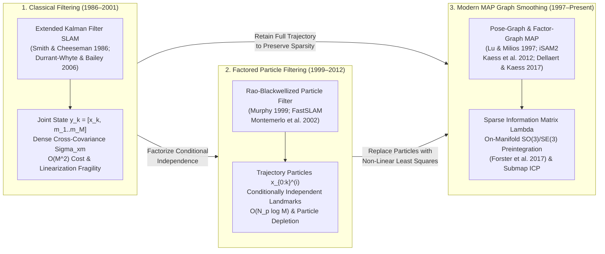

# Chapter 6: Simultaneous Localization and Mapping (SLAM)

*Mapping without GNSS—or when the environment itself is the reference frame.*

---

## 6.1 Foundations and Evolution of SLAM

In Chapter 5, we established that direct georeferencing of terrestrial elevation ($z$, positive-up) and marine bathymetric depth ($d$, positive-down) relies on tightly coupled Global Navigation Satellite Systems and Inertial Navigation Systems (GNSS/INS). Whenever unobstructed carrier-phase GNSS observables bound the quadratic accelerometer-bias drift and cubic gyroscope-bias tilt-gravity drift ($\delta\mathbf{p}(t) \approx \frac{1}{2}\mathbf{b}_a t^2 - \frac{1}{6}(\mathbf{g} \times \mathbf{b}_g) t^3$) of the inertial measurement unit (IMU), each laser pulse or acoustic sounding can be projected directly from the sensor body frame $B$ into an Earth-fixed geodetic frame $W$ via the time-varying rigid-body transformation:

$$\mathbf{p}_W(t) = \mathbf{R}_{WB}(t)\,\mathbf{p}_B(t) + \mathbf{p}_{WB}(t), \qquad \mathbf{T}_{WB}(t) = \begin{bmatrix} \mathbf{R}_{WB}(t) & \mathbf{p}_{WB}(t) \\ \mathbf{0}^T & 1 \end{bmatrix} \in \text{SE}(3) \tag{6.1}$$

However, many of the most scientifically and operationally critical earth-surface environments are either **GNSS-denied** or **severely GNSS-degraded**:
1. **Dense Multi-Tiered Forest Understories:** Wet foliage attenuates L-band microwave signals by $10\text{--}25\text{ dB}$ and induces meter-level non-line-of-sight (NLOS) multipath that prevents integer carrier-phase ambiguity resolution during sub-canopy backpack or UAV LiDAR surveys.
2. **Deep Slot Canyons, Karst Caves, and Subterranean Mines:** Steep rock walls mask over $85\%$ of the sky hemisphere (Geometric Dilution of Precision $\text{GDOP} > 20$) or block satellite signals entirely beneath tens to hundreds of meters of overburden.
3. **Urban Canyons and Building Interiors:** Specular façade reflections create severe urban canyon multipath for mobile mapping vehicles and indoor-outdoor terrestrial laser scanners.
4. **Under-Ice and Deep-Ocean Autonomous Underwater Vehicle (AUV) Missions:** Seawater is electromagnetically opaque to L-band radio waves (skin depth $< 2\text{ cm}$ at $1.5\text{ GHz}$). Once an AUV dives beneath an Antarctic ice shelf or descends $4000\text{ m}$ to map a mid-ocean ridge or submarine canyon, it is completely isolated from satellite navigation for $10\text{--}72\text{ hours}$. Even when aided by a bottom-tracking Doppler Velocity Log (DVL) and a tactical- or navigation-grade Fiber-Optic Gyroscope (FOG) INS, residual velocity scale-factor errors and heading biases ($0.01^\circ\text{--}0.1^\circ$) induce horizontal dead-reckoning drift of $0.05\%\text{--}0.2\%$ of distance traveled ($5\text{--}20\text{ m}$ per $10\text{ km}$ trackline). On a submarine canyon wall with slope $\tan\beta = 0.5$, a $10\text{ m}$ cross-track horizontal error $\Delta x$ manifests directly as a $5\text{ m}$ vertical bathymetric tear ($\Delta d \approx \nabla d \cdot \Delta\mathbf{x}_{\text{horiz}}$) between adjacent multibeam echosounder (MBES) swaths.

When external geodetic position fixes are unavailable, **Simultaneous Localization and Mapping (SLAM)** resolves the chicken-and-egg dilemma of autonomous cartography: *to build a consistent elevation map, the platform must know its trajectory; to estimate its trajectory without drift, the platform must localize itself against a consistent map.* SLAM treats the geometric structure of the terrain itself as the metrological reference frame, jointly estimating the sensor trajectory and the coordinates of environmental landmarks or surface submaps.



---

### 6.1.1 The Probabilistic SLAM Problem and Evolution of Estimation Paradigms

In discrete time $k \in \{1, \dots, K\}$, a mobile mapping platform moves through an unknown environment governed by a stochastic motion model $\mathbf{x}_k = \mathbf{f}(\mathbf{x}_{k-1}, \mathbf{u}_k, \mathbf{w}_k)$ driven by proprioceptive control or inertial inputs $\mathbf{u}_k$ (with process noise $\mathbf{w}_k \sim \mathcal{N}(\mathbf{0}, \mathbf{Q}_k)$) and acquires exteroceptive range, bearing, or surface observations $\mathbf{z}_k = \mathbf{h}(\mathbf{x}_k, \mathbf{m}, \mathbf{v}_k)$ of stationary environmental features or terrain patches $\mathbf{m} = \{\mathbf{m}_1, \dots, \mathbf{m}_M\}$ (with measurement noise $\mathbf{v}_k \sim \mathcal{N}(\mathbf{0}, \mathbf{R}_k)$). Three foundational paradigms have defined how geodesists and roboticists solve this joint estimation problem.

#### Extended Kalman Filter SLAM (EKF-SLAM)

Following the seminal work on spatial uncertainty by **Smith and Cheeseman (1986)** and the unified stochastic mapping framework codified by **Durrant-Whyte and Bailey (2006)**, classical **online SLAM** estimates the instantaneous posterior distribution $p(\mathbf{x}_k, \mathbf{m} \mid \mathbf{z}_{1:k}, \mathbf{u}_{1:k})$ by stacking the 6-DOF robot pose $\mathbf{x}_k \in \mathbb{R}^6$ and the 3D coordinates of all $M$ mapped landmarks $\mathbf{m}_j \in \mathbb{R}^3$ into a single augmented state vector $\mathbf{y}_k \in \mathbb{R}^{6+3M}$ with partitioned joint covariance matrix $\boldsymbol{\Sigma}_k$:

$$\mathbf{y}_k = \begin{bmatrix} \mathbf{x}_k \\ \mathbf{m}_1 \\ \vdots \\ \mathbf{m}_M \end{bmatrix}, \qquad \boldsymbol{\Sigma}_k = \begin{bmatrix} \boldsymbol{\Sigma}_{xx} & \boldsymbol{\Sigma}_{xm} \\ \boldsymbol{\Sigma}_{mx} & \boldsymbol{\Sigma}_{mm} \end{bmatrix} = \begin{bmatrix} \boldsymbol{\Sigma}_{xx} & \boldsymbol{\Sigma}_{x1} & \cdots & \boldsymbol{\Sigma}_{xM} \\ \boldsymbol{\Sigma}_{1x} & \boldsymbol{\Sigma}_{11} & \cdots & \boldsymbol{\Sigma}_{1M} \\ \vdots & \vdots & \ddots & \vdots \\ \boldsymbol{\Sigma}_{Mx} & \boldsymbol{\Sigma}_{M1} & \cdots & \boldsymbol{\Sigma}_{MM} \end{bmatrix} \tag{6.2}$$

During prediction, only the robot pose $\mathbf{x}_k$, its auto-covariance $\boldsymbol{\Sigma}_{xx,k|k-1} = \mathbf{F}_k \boldsymbol{\Sigma}_{xx,k-1|k-1}\mathbf{F}_k^T + \mathbf{Q}_k$, and the robot-to-map cross-covariance $\boldsymbol{\Sigma}_{xm,k|k-1} = \mathbf{F}_k \boldsymbol{\Sigma}_{xm,k-1|k-1}$ change (since static terrain landmarks satisfy $\mathbf{m}_{j,k} = \mathbf{m}_{j,k-1}$). During a measurement update of a single landmark $\mathbf{m}_j$ with innovation $\boldsymbol{\nu}_k = \mathbf{z}_k - \mathbf{h}(\hat{\mathbf{x}}_{k|k-1}, \hat{\mathbf{m}}_{j,k-1})$ and sparse measurement Jacobian $\mathbf{H}_k = [\mathbf{H}_x, \mathbf{0}, \dots, \mathbf{H}_{m_j}, \dots, \mathbf{0}]$, the Kalman gain $\mathbf{K}_k$ and Joseph-stabilized covariance update modify **every** element of $\mathbf{y}_k$ and $\boldsymbol{\Sigma}_k$:

$$\mathbf{K}_k = \boldsymbol{\Sigma}_{k|k-1}\mathbf{H}_k^T \left(\mathbf{H}_k \boldsymbol{\Sigma}_{k|k-1}\mathbf{H}_k^T + \mathbf{R}_k\right)^{-1}, \qquad \hat{\mathbf{y}}_{k|k} = \hat{\mathbf{y}}_{k|k-1} + \mathbf{K}_k \boldsymbol{\nu}_k, \qquad \boldsymbol{\Sigma}_{k|k} = (\mathbf{I} - \mathbf{K}_k\mathbf{H}_k)\boldsymbol{\Sigma}_{k|k-1}(\mathbf{I} - \mathbf{K}_k\mathbf{H}_k)^T + \mathbf{K}_k\mathbf{R}_k\mathbf{K}_k^T \tag{6.2b}$$

> [!IMPORTANT]
> **Why Dense Cross-Correlations Are Essential for EKF-SLAM Convergence:** Early practitioners attempted to save memory by zeroing out the off-diagonal landmark-to-landmark cross-covariances $\boldsymbol{\Sigma}_{ij}$ ($i \neq j$), treating landmarks as independent filters. Smith and Cheeseman (1986) and Durrant-Whyte and Bailey (2006) proved that this destroys filter consistency: because multiple landmarks are observed from the same uncertain sensor pose $\mathbf{x}_k$, their global coordinate errors share a common reference-frame bias. Retaining the dense off-diagonal blocks $\boldsymbol{\Sigma}_{xm}$ and $\boldsymbol{\Sigma}_{ij}$ allows the filter to learn the *relative* metric geometry between landmarks. In the monotonic convergence limit of repeated observations, the correlation coefficients $\rho_{ij}$ between all landmarks approach unity, locking the map into a rigid body whose absolute uncertainty is lower-bounded by the initial pose covariance $\boldsymbol{\Sigma}_{x_0 x_0}$ while relative inter-landmark distances converge toward zero variance.

Despite its theoretical elegance, classical EKF-SLAM failed to scale to high-resolution terrain and bathymetric mapping for two fundamental reasons:
1. **Quadratic $O(M^2)$ Computational and Memory Complexity:** Because marginalizing out past robot poses $\mathbf{x}_{0:k-1}$ links every landmark ever co-observed with the robot into a fully connected dense covariance matrix $\boldsymbol{\Sigma}_{mm} \in \mathbb{R}^{3M \times 3M}$, each measurement update requires $O(M^2)$ floating-point operations. A terrestrial LiDAR or multibeam survey containing millions of surface patches quickly exhausts memory and real-time compute budgets.
2. **Irreversible Linearization Errors and Filter Inconsistency:** The EKF linearizes the non-linear observation function $\mathbf{h}(\mathbf{x}_k, \mathbf{m}_j)$ via a first-order Taylor expansion evaluated at the *current* state estimate $\hat{\mathbf{y}}_{k|k-1}$ and immediately bakes that Jacobian $\mathbf{H}_k$ into $\boldsymbol{\Sigma}_k$. In 3D orientation space, when heading or pitch drifts beyond $5^\circ\text{--}10^\circ$ before a loop closure, evaluating $\mathbf{H}_k$ at the wrong orientation violates observability subspace constraints—injecting fictitious information along unobservable global yaw/position directions, shrinking $\boldsymbol{\Sigma}_k$ artificially (overconfidence), and causing the state estimate to diverge catastrophically upon loop closure (Bailey et al., 2006).

#### Rao-Blackwellized Particle Filter SLAM (`FastSLAM`)

To break the $O(M^2)$ bottleneck of EKF-SLAM, **Murphy (1999)** and **Montemerlo et al. (2002)** reformulated the problem over the **full trajectory** $\mathbf{x}_{0:k} = \{\mathbf{x}_0, \mathbf{x}_1, \dots, \mathbf{x}_k\}$ rather than the single current pose $\mathbf{x}_k$. By the structure of the SLAM Bayesian network, landmarks are correlated *only* because the robot trajectory is uncertain; if the entire trajectory $\mathbf{x}_{0:k}$ were known exactly, the errors in the $M$ landmarks would depend solely on independent measurement noise $\mathbf{v}_{1:k}$. Applying the chain rule of probability yields the exact **Rao-Blackwellized factorization**:

$$p(\mathbf{x}_{0:k}, \mathbf{m}_1, \dots, \mathbf{m}_M \mid \mathbf{z}_{1:k}, \mathbf{u}_{1:k}) = \underbrace{p(\mathbf{x}_{0:k} \mid \mathbf{z}_{1:k}, \mathbf{u}_{1:k})}_{\substack{\text{Non-Gaussian trajectory posterior} \\ \text{(sampled via } N_p \text{ particles)}}} \prod_{j=1}^M \underbrace{p(\mathbf{m}_j \mid \mathbf{x}_{0:k}, \mathbf{z}_{1:k})}_{\substack{M \text{ conditionally independent} \\ \text{low-dimensional EKFs / submaps}}} \tag{6.3}$$

In **FastSLAM** (Montemerlo et al., 2002), the non-linear trajectory posterior is represented by $N_p$ Monte Carlo particles $\{\mathbf{x}_{0:k}^{[i]}, w_k^{[i]}\}_{i=1}^{N_p}$, while each particle $i$ maintains $M$ completely decoupled $3\times 3$ Extended Kalman Filters $\{\hat{\mathbf{m}}_{j,k}^{[i]}, \boldsymbol{\Sigma}_{jj,k}^{[i]}\}_{j=1}^M$ (or, in bathymetric and grid-based RBPF-SLAM, its own terrain occupancy/elevation map). By storing each particle's landmark estimates in a balanced binary tree and copying only the tree nodes modified by an observation, FastSLAM reduces the per-step computational complexity from $O(M^2)$ to $O(N_p \log M)$ and allows each particle to perform its own data association hypothesis.

> [!WARNING]
> **The Particle Depletion Pitfall in Long-Loop Terrain Mapping:** FastSLAM relies on Sequential Importance Resampling (SIR). Whenever effective sample size $N_{\text{eff}} = 1 / \sum_{i=1}^{N_p} (w_k^{[i]})^2$ drops below a threshold, low-weight particles are discarded and high-weight particles are duplicated. Because resampling occurs repeatedly during a long open-loop traverse, diversity among historical trajectory states $\mathbf{x}_{0:k-L}^{[i]}$ progressively collapses (**sample impoverishment** or **particle depletion**). By the time a surveyor or AUV closes a kilometer-scale loop, all $N_p$ surviving particles share a single common ancestor over the first half of the mission; their historical poses are frozen at a drifted trajectory, preventing the filter from distributing the loop-closure residual smoothly backward in time.

#### Modern Maximum-a-Posteriori (MAP) Pose-Graph and Factor-Graph Optimization

Modern SLAM abandons recursive filtering in favor of **full-trajectory Maximum-a-Posteriori (MAP) smoothing**, pioneered for scan matching by **Lu and Milios (1997)** and formalized via **factor graphs** by **Dellaert and Kaess (2017)** and **Kaess et al. (2012, `iSAM2`)**. A factor graph is a bipartite graph $\mathcal{G} = (\mathcal{F}, \boldsymbol{\Theta}, \mathcal{E})$ linking variable nodes $\boldsymbol{\theta}_i \in \boldsymbol{\Theta}$ (all historical sensor poses $\mathbf{x}_{0:K} \in \text{SE}(3)$, velocities $\mathbf{v}_{0:K} \in \mathbb{R}^3$, IMU biases $\mathbf{b}_{0:K} \in \mathbb{R}^6$, and optional landmarks $\mathbf{m}_{1:M}$) to factor nodes $\phi_c \in \mathcal{F}$ representing probabilistic constraints from prior knowledge, IMU propagation, scan-to-scan/submap registration, and loop closures.

Assuming Gaussian noise models on the tangent space of the manifold, maximizing the joint posterior $p(\boldsymbol{\Theta} \mid \mathcal{Z}) \propto \prod_c \phi_c(\boldsymbol{\Theta}_c)$ is equivalent to solving a sparse non-linear least-squares problem:

$$\boldsymbol{\Theta}^* = \arg\min_{\boldsymbol{\Theta}} \sum_{c \in \mathcal{F}} \|\mathbf{r}_c(\boldsymbol{\Theta}_c)\|_{\boldsymbol{\Sigma}_c}^2 = \arg\min_{\boldsymbol{\Theta}} \sum_{c \in \mathcal{F}} \mathbf{r}_c(\boldsymbol{\Theta}_c)^T \boldsymbol{\Sigma}_c^{-1} \mathbf{r}_c(\boldsymbol{\Theta}_c) \tag{6.4}$$

At each Gauss-Newton or Levenberg-Marquardt iteration, linearizing the residuals $\mathbf{r}(\boldsymbol{\Theta} \boxplus \Delta\boldsymbol{\theta}) \approx \mathbf{r}(\boldsymbol{\Theta}) + \mathbf{J}\Delta\boldsymbol{\theta}$ around the current manifold estimate $\boldsymbol{\Theta}$ yields the normal equations governed by the **Information Matrix** (or Gauss-Newton Hessian) $\boldsymbol{\Lambda}$:

$$\underbrace{\left(\mathbf{J}^T \boldsymbol{\Sigma}^{-1} \mathbf{J}\right)}_{\boldsymbol{\Lambda}} \Delta\boldsymbol{\theta} = -\mathbf{J}^T \boldsymbol{\Sigma}^{-1} \mathbf{r}(\boldsymbol{\Theta}) \tag{6.5}$$

Why is solving Equation (6.5) for tens of thousands of poses orders of magnitude faster and more accurate than EKF-SLAM?
* **Structural Sparsity of $\boldsymbol{\Lambda}$:** Unlike the covariance matrix $\boldsymbol{\Sigma} = \boldsymbol{\Lambda}^{-1}$ (which is completely dense), the full-SLAM Information Matrix $\boldsymbol{\Lambda}$ is **inherently sparse**. A block $\boldsymbol{\Lambda}_{ij}$ is non-zero *if and only if* a factor directly connects variable $\boldsymbol{\theta}_i$ and variable $\boldsymbol{\theta}_j$ (e.g., consecutive poses $i$ and $i+1$, or a loop-closure pair). By applying fill-reducing variable orderings (such as Column Approximate Minimum Degree, `COLAMD`) before sparse Cholesky ($\boldsymbol{\Lambda} = \mathbf{R}^T\mathbf{R}$) or QR factorization, or by maintaining an incremental Bayes Tree in **iSAM2** (Kaess et al., 2012) that carries out fluid relinearization and updates only the cliques affected by new measurements, full smoothing runs in near-$O(K)$ time during exploration.
* **Iterative Relinearization on $\text{SO}(3)/\text{SE}(3)$:** Because historical poses are never marginalized out, when a large loop closure is detected after a long traverse, the optimizer updates the trajectory and **re-evaluates the Jacobians $\mathbf{J}$** at the corrected poses, eliminating the irreversible linearization errors that destroyed EKF-SLAM.
* **On-Manifold IMU Preintegration (Forster et al., 2017):** Because IMUs sample at $200\text{--}1000\text{ Hz}$ while LiDAR/camera keyframes are instantiated at $5\text{--}20\text{ Hz}$, adding a factor-graph node for every IMU sample would be computationally prohibitive. Building on Lupton and Sukkarieh (2012), **Forster et al. (2017)** formulated analytic preintegration directly on the $\text{SO}(3)$ Lie group manifold. Evaluating at nominal biases $(\bar{\mathbf{b}}_i^g, \bar{\mathbf{b}}_i^a)$ with discrete-time zero-mean Gaussian sensor noise $(\boldsymbol{\eta}_k^{gd}, \boldsymbol{\eta}_k^{ad})$ propagated into a $9\times 9$ preintegrated covariance $\boldsymbol{\Sigma}_{ij}^{\text{IMU}}$, all IMU angular velocity ($\tilde{\boldsymbol{\omega}}_k$) and specific force ($\tilde{\mathbf{a}}_k$) measurements between keyframes $t_i$ and $t_j$ are integrated in the local body frame $B_i$ to form a single relative motion increment $(\Delta\tilde{\mathbf{R}}_{ij}, \Delta\tilde{\mathbf{v}}_{ij}, \Delta\tilde{\mathbf{p}}_{ij})$ that is completely independent of the global pose and gravity alignment at $t_i$:

$$\Delta\tilde{\mathbf{R}}_{ij} = \prod_{k=i}^{j-1} \text{Exp}\!\left((\tilde{\boldsymbol{\omega}}_k - \bar{\mathbf{b}}_i^g)\Delta t\right), \quad \Delta\tilde{\mathbf{v}}_{ij} = \sum_{k=i}^{j-1} \Delta\tilde{\mathbf{R}}_{ik}(\tilde{\mathbf{a}}_k - \bar{\mathbf{b}}_i^a)\Delta t, \quad \Delta\tilde{\mathbf{p}}_{ij} = \sum_{k=i}^{j-1} \left[\Delta\tilde{\mathbf{v}}_{ik}\Delta t + \frac{1}{2}\Delta\tilde{\mathbf{R}}_{ik}(\tilde{\mathbf{a}}_k - \bar{\mathbf{b}}_i^a)\Delta t^2\right] \tag{6.6}$$

When the factor-graph optimizer adjusts the IMU bias estimates $\mathbf{b}_i^g = \bar{\mathbf{b}}_i^g + \delta\mathbf{b}_i^g$ and $\mathbf{b}_i^a = \bar{\mathbf{b}}_i^a + \delta\mathbf{b}_i^a$ during a loop closure, the preintegrated measurements are updated to first order via precomputed bias Jacobians—e.g., $\Delta\tilde{\mathbf{R}}_{ij}(\mathbf{b}_i^g) \approx \Delta\tilde{\mathbf{R}}_{ij}(\bar{\mathbf{b}}_i^g)\,\text{Exp}\!\left(\frac{\partial \Delta\bar{\mathbf{R}}_{ij}}{\partial \mathbf{b}^g}\delta\mathbf{b}_i^g\right)$—avoiding any re-integration of raw high-rate IMU streams.

| Estimation Paradigm | State Estimated | Matrix Structure | Per-Step Complexity | Loop-Closure Resilience | Primary DEM / Bathymetric Application |
| :--- | :--- | :--- | :--- | :--- | :--- |
| **EKF-SLAM** (Smith & Cheeseman 1986; Durrant-Whyte & Bailey 2006) | Current pose $\mathbf{x}_k$ + $M$ landmarks | Dense covariance $\boldsymbol{\Sigma}_k \in \mathbb{R}^{(6+3M)\times(6+3M)}$ | $O(M^2)$ | Poor; single-step linearization causes inconsistency | Early sparse beacon/transponder navigation |
| **RBPF / FastSLAM** (Murphy 1999; Montemerlo et al. 2002; Barkby et al. 2012) | $N_p$ trajectory particles $\mathbf{x}_{0:k}^{[i]}$ + $M$ independent EKFs/GPs | Factored particles $\times$ $3\times 3$ landmark blocks or GP submaps | $O(N_p \log M)$ | Moderate; vulnerable to particle depletion on long loops | 2D occupancy grids; Gaussian Process bathymetric SLAM (`BPSLAM`) |
| **Batch / Incremental Factor Graph** (Lu & Milios 1997; `iSAM2` Kaess et al. 2012; Dellaert & Kaess 2017) | Full trajectory $\mathbf{x}_{0:K} \in \text{SE}(3)$, velocities, biases, submaps | Sparse Information Matrix $\boldsymbol{\Lambda} = \mathbf{J}^T\boldsymbol{\Sigma}^{-1}\mathbf{J}$ / Bayes Tree | $O(K)$ exploration; $O(K^{1.5})$ worst-case batch loop | Excellent; iterative relinearization on $\text{SE}(3)$ manifold | Modern LiDAR-Inertial (`LIO-SAM`), VIO, and MBES submap SLAM |

---

### 6.1.2 Sensor Modalities for Elevation and Bathymetric SLAM

While factor graphs and iterated manifold filters provide the mathematical back-end, the front-end sensor modality dictates how geometric constraints are extracted from the environment and how trajectory uncertainty propagates into the final DEM's Total Horizontal Uncertainty ($\text{THU}_{95\%}$) and Total Vertical Uncertainty ($\text{TVU}_{95\%}$).

#### LiDAR-Inertial Odometry (LIO): Continuous-Time Deskewing, `LIO-SAM`, and `Fast-LIO2`

Unlike an airborne LiDAR operating hundreds of meters above ground with a GNSS/INS trajectory, a handheld, backpack, quadruped, or low-altitude UAV LiDAR moving through a forest or cave experiences high angular rates ($\|\boldsymbol{\omega}\| > 1\text{--}3\text{ rad/s}$) at short ranges ($1\text{--}50\text{ m}$). Because a mechanically spinning multi-beam LiDAR (e.g., Velodyne, Ouster, Hesai) or non-repetitive solid-state prism scanner (e.g., Livox Avia/Mid-360) requires $\Delta t_{\text{scan}} = 50\text{--}100\text{ ms}$ to accumulate a $360^\circ$ or rosette sweep, treating the scan as an instantaneous rigid snapshot introduces decimeter-to-meter **motion distortion** (rotational slewing and translational skew).

Modern **LiDAR-Inertial Odometry (LIO)** systems resolve this through **continuous-time motion deskewing**. Using backward and forward propagation of the 200–1000 Hz IMU state between scan start time $t_{i-1}$ and scan end time $t_i$, every raw laser point $\mathbf{p}_{B(\tau_k)}$ measured at exact microsecond firing timestamp $\tau_k \in [t_{i-1}, t_i]$ is rigidly transformed into the scan-end body frame $B_i$ (where $\mathbf{R}_{B_i W} = \mathbf{R}_{W B_i}^T$):

$$\mathbf{p}_{B_i}(\tau_k) = \mathbf{R}_{W B_i}^T\!\left(\mathbf{R}_{W B(\tau_k)}\mathbf{p}_{B(\tau_k)} + \mathbf{p}_{W B(\tau_k)} - \mathbf{p}_{W B_i}\right) \tag{6.7}$$

Two open-source architectures exemplify modern tightly coupled LIO for terrain mapping (enabling sub-canopy mobile and UAV DEMs to meet **USGS 3DEP Quality Level 1/2** and **ASPRS Positional Accuracy Standards** Non-Vegetated Vertical Accuracy $\text{NVA}_{95\%} = 1.960\,\text{RMSE}_z \le 19.6\text{ cm}$ and Vegetated Vertical Accuracy $\text{VVA}_{95\%} \le 30\text{ cm}$ when anchored to sparse control):
* **`LIO-SAM` (Tightly Coupled Lidar Inertial Odometry via Smoothing and Mapping; Shan et al., 2020):** Extending the feature extraction paradigm of `LOAM` (Zhang & Singh, 2014), `LIO-SAM` computes a local smoothness (curvature) metric $c_k$ for each point across its scan ring to extract sharp **edge features** (tree trunks, building corners; high $c_k$) and smooth **planar features** (ground terrain, rock faces; low $c_k$). Edge and planar points are matched via point-to-line and point-to-plane distances against a sliding local voxel map of surrounding keyframes. The resulting scan-matching relative pose constraint is fused inside an `iSAM2` factor graph alongside Forster-style IMU preintegration factors, loop-closure ICP factors, and optional absolute GNSS factors when the platform briefly enters a canopy clearing.
* **`Fast-LIO2` (Fast Direct LiDAR-Inertial Odometry; Xu et al., 2022):** In unstructured natural terrain (boulder fields, karst caverns, brushy hillslopes), heuristic edge/plane extraction often discards valuable micro-topographic geometry or fails on non-repetitive solid-state scanning patterns. `Fast-LIO2` eliminates feature extraction entirely, registering **raw deskewed points** directly to the map via a tightly coupled **iterated Extended Kalman Filter (iEKF)** on the $\text{SO}(3) \times \mathbb{R}^{15}$ manifold. By reformulating the Kalman gain via the Sherman-Morrison-Woodbury matrix identity into the state dimension ($18 \times 18$) rather than the measurement dimension ($m \times m$ for $m \sim 10^4$ points), its update complexity scales linearly $O(m)$ with point count. Furthermore, `Fast-LIO2` replaces static octrees with an **incremental k-d tree (`ikd-Tree`; Cai et al., 2021)** that supports dynamic point insertion, on-tree downsampling, and box-wise sliding-window deletion in $O(\log N)$ time, maintaining millimeter-to-centimeter point-to-plane registration at $10\text{--}100\text{ Hz}$ on embedded CPUs.

#### Visual-Inertial Odometry (VIO), RGB-D TSDF Fusion, and Millimeter-Wave Radar-SLAM

When payload mass, power consumption, or cost precludes 3D LiDAR—or when active optical sensors are blinded by airborne particulates—three complementary modalities provide localization and elevation reconstruction:
1. **Visual-Inertial Odometry (VIO):** A monocular camera alone cannot observe absolute metric scale; however, tightly coupling visual tracks with an IMU renders both **metric scale** (via double-integrated specific force) and the **2-DOF local gravity vector** (roll $\phi$ and pitch $\theta$, leaving only global 4-DOF $[x, y, z, \psi]$ unobservable) mathematically observable (provided the platform undergoes non-degenerate acceleration). VIO pipelines divide into **indirect feature-based systems**—such as `VINS-Mono` (Qin et al., 2018) and `ORB-SLAM3` (Campos et al., 2021), which extract salient corner descriptors (FAST/ORB) and minimize geometric reprojection residuals $\mathbf{r}_{\text{reproj}} = \mathbf{u}_{ik} - \pi(\mathbf{T}_{CW}\mathbf{p}_k)$ across sliding windows or multi-map covisibility graphs—and **direct photometric systems** such as `DSO` (Direct Sparse Odometry; Engel et al., 2018). Direct methods optimize photometric intensity residuals $r_{\text{photo}} = I_j\!\left(\pi(\mathbf{T}_{ji}\pi^{-1}(\mathbf{u}, d_{\mathbf{u}}))\right) - \frac{t_j e^{a_j}}{t_i e^{a_i}} I_i(\mathbf{u}) - b_j + \frac{t_j e^{a_j}}{t_i e^{a_i}} b_i$ directly over any pixel with a nonzero intensity gradient, sampling far denser micro-topography on repetitive rock outcrops or snowfields where corner detectors starve, at the cost of requiring geometric and photometric camera calibration (vignetting, exposure time $t_i$, affine brightness $a_i, b_i$).
2. **Structured-Light and Time-of-Flight (ToF) RGB-D SLAM (`KinectFusion`):** For close-range ($0.3\text{--}5\text{ m}$), sub-millimeter micro-topographic DEMs—such as soil erosion rills, gravel-bed river roughness, and cave speleothems—active infrared structured-light or continuous-wave phase-shift ToF RGB-D cameras provide dense per-pixel depth frames at $30\text{--}60\text{ Hz}$. Pioneered by **`KinectFusion` (Newcombe et al., 2011)**, volumetric RGB-D SLAM integrates noisy depth maps into a GPU-resident 3D voxel grid storing a **Truncated Signed Distance Function (TSDF)** $S_k(\mathbf{x}) \in [-1, 1]$ and cumulative weight $W_k(\mathbf{x})$ via weighted running-average fusion:

$$S_k(\mathbf{x}) = \frac{W_{k-1}(\mathbf{x})S_{k-1}(\mathbf{x}) + w_k(\mathbf{x})s_k(\mathbf{x})}{W_{k-1}(\mathbf{x}) + w_k(\mathbf{x})}, \qquad W_k(\mathbf{x}) = \min\!\left(W_{k-1}(\mathbf{x}) + w_k(\mathbf{x}),\, W_{\max}\right) \tag{6.8}$$

Because raycasting the zero-crossing isosurface $S_{k-1}(\mathbf{x}) = 0$ generates a low-noise synthetic vertex-and-normal map for frame-to-model point-to-plane ICP, `KinectFusion` averages out single-frame depth noise ($\sigma_z \propto z^2$) to achieve sub-millimeter surface precision over meter-scale plots (extended to large corridors via voxel hashing and elastic pose graphs).
3. **Millimeter-Wave FMCW Radar-SLAM:** Optical cameras and near-infrared ($905\text{--}1550\text{ nm}$) LiDARs fail in dense coastal fog, heavy rain, subterranean mine-blast dust clouds, and wildfire smoke because micron-scale water droplets and dust particles have diameters comparable to optical wavelengths ($d_p \approx \lambda$), triggering severe Mie scattering. **Frequency-Modulated Continuous-Wave (FMCW)** millimeter-wave radars operating at $76\text{--}81\text{ GHz}$ have a wavelength $\lambda \approx 3.9\text{ mm}$—three orders of magnitude larger than smoke or fog droplets—allowing electromagnetic waves to penetrate zero-visibility atmospheres with negligible attenuation while simultaneously measuring instantaneous radial Doppler velocity $v_r$ per return. Modern spinning and 4D imaging MIMO Radar-SLAM pipelines reject multipath ghost targets via Constant False Alarm Rate (CFAR) filtering or Doppler consistency and register radar point clouds via normal distributions transform (NDT) or factor-graph optimization, preserving metric trajectory and coarse terrain elevation models when all optical sensors are blind.

#### Bathymetric Terrain-Aided Navigation (TAN) and Submap Bathymetric SLAM (BPSLAM)

In marine geomatics, deep-submergence AUVs rely on a fundamentally different combination of strong and weak observability than terrestrial platforms. An AUV carries a scientific-grade ambient pressure sensor (e.g., Paroscientific Digiquartz) converted via a conductivity-temperature-depth (CTD) sound-speed profile into absolute depth $d_{\text{baro}}(t)$ with $<0.01\%$ full-scale precision, alongside a gravity-referenced FOG INS that measures roll $\phi$ and pitch $\theta$ to $<0.02^\circ$. Consequently, the AUV's **vertical depth $d$ and pitch/roll attitude are bounded globally**, whereas its **horizontal coordinates $(x, y)$ and heading $\psi$ drift unboundedly** under DVL/INS dead reckoning.

When a shipborne multibeam survey has already produced a coarse prior bathymetric grid $d_{\text{prior}}(x, y)$, **Terrain-Aided Navigation (TAN)**—implemented via Point Mass Filters (PMF) or sequential Monte Carlo particle filters—evaluates the likelihood of each horizontal pose hypothesis $\mathbf{x}_{k,\text{horiz}}^{[i]}$ by comparing the relative relief of the AUV's multibeam swath against $d_{\text{prior}}$. However, shipborne hull-mounted MBES footprints at $4000\text{ m}$ depth are $40\text{--}100\text{ m}$ wide, whereas a near-bottom AUV flying at $50\text{ m}$ altitude resolves $0.5\text{ m}$ features that do not exist in the surface ship map.

To map unexplored abyssal hills, hydrothermal vent fields, and submarine canyons at sub-meter resolution without external acoustic transponders (LBL/USBL), **Roman and Singh (2007)** introduced **Submap Bathymetric SLAM**, later extended to continuous probabilistic surfaces via **Bathymetric Particle Filter SLAM (`BPSLAM`)** by **Barkby et al. (2012)**:
1. **Self-Consistent Bathymetric Submap Generation (Roman & Singh, 2007):** Unlike a 3D LiDAR, a multibeam echosounder emits a single 2D cross-track fan of soundings per ping; two individual pings share almost no geometric overlap unless they are exactly collinear. Roman and Singh (2007) aggregated sequential pings along short trackline segments ($L_{\text{submap}} \approx 50\text{--}200\text{ m}$, or $30\text{--}120\text{ s}$) over which internal DVL/INS dead-reckoning drift is negligible ($\sigma_{\text{internal}} < 0.05\text{ m}$) to form locally rigid **3D bathymetric submaps** $\mathcal{S}_i$. Whenever two submaps $\mathcal{S}_i$ and $\mathcal{S}_j$ overlap spatially (e.g., across parallel lawnmower lines or orthogonal cross-tracks), **point-to-plane Iterative Closest Point (ICP)** aligns overlapping source soundings $\mathbf{p}_k \in \mathcal{S}_j$ against target seafloor points $\mathbf{q}_k \in \mathcal{S}_i$ with unit seafloor normal $\mathbf{n}_k = [-\partial_x d, -\partial_y d, 1]^T / \sqrt{1 + \|\nabla d\|^2}$ (or constrained to the 3-DOF unbounded horizontal-and-yaw perturbation $\delta\boldsymbol{\xi}_{ij} = [\Delta x, \Delta y, \Delta\psi]^T$ given bounded pressure depth $d$ and gravity roll/pitch $\phi, \theta$):

$$\mathbf{z}_{ij}^* = \arg\min_{\mathbf{T}_{ij} \in \text{SE}(3)} \sum_{k} \left(\mathbf{n}_k^T \left(\mathbf{R}_{ij}\mathbf{p}_k + \mathbf{t}_{ij} - \mathbf{q}_k\right)\right)^2, \qquad \boldsymbol{\Sigma}_{ij} = \hat{\sigma}_0^2 \left(\mathbf{J}_{\text{ICP}}^T \mathbf{J}_{\text{ICP}}\right)^{-1} \tag{6.9a}$$

Inserting these cross-track submap factors and their terrain-conditioned covariances $\boldsymbol{\Sigma}_{ij}$ into a pose graph eliminates the multi-meter vertical cliff artifacts ($\Delta d$) between swaths.
2. **Gaussian Process Bathymetric SLAM (`BPSLAM`; Barkby et al., 2012):** Standard submap gridding struggles when an AUV transits across flat sedimented abyssal plains punctuated by isolated volcanic pillows or fault scarps: grid discretization blurs steep scarps, and featureless plains ($\nabla d \approx \mathbf{0}$) yield rank-deficient ICP Hessians $\mathbf{J}_{\text{ICP}}^T \mathbf{J}_{\text{ICP}}$. In `BPSLAM`, each Rao-Blackwellized particle maintains a continuous **Gaussian Process (GP) regression surface** $d(\mathbf{x}) \sim \mathcal{GP}\!\left(\mu_d(\mathbf{x}),\, k(\mathbf{x}, \mathbf{x}')\right)$ parameterized by a squared-exponential or Matérn spatial covariance kernel $k(\mathbf{x}, \mathbf{x}')$. Given historical horizontal sounding coordinates $\mathbf{X} = [\mathbf{x}_1, \dots, \mathbf{x}_N]$ and measured depths $\mathbf{d} = [d_1, \dots, d_N]^T$ with sounding variance $\sigma_n^2$, when a new MBES ping arrives at horizontal location $\mathbf{x}_*$, the GP analytically predicts both the posterior mean depth $\mu_d(\mathbf{x}_*)$ and the **predictive variance** $\sigma_d^2(\mathbf{x}_*)$ (where $[\mathbf{K}]_{ab} = k(\mathbf{x}_a, \mathbf{x}_b)$ and $[\mathbf{k}_*]_a = k(\mathbf{x}_a, \mathbf{x}_*)$):

$$\mu_d(\mathbf{x}_*) = \mathbf{k}_*^T \left(\mathbf{K} + \sigma_n^2 \mathbf{I}\right)^{-1} \mathbf{d}, \qquad \sigma_d^2(\mathbf{x}_*) = k(\mathbf{x}_*, \mathbf{x}_*) - \mathbf{k}_*^T \left(\mathbf{K} + \sigma_n^2 \mathbf{I}\right)^{-1} \mathbf{k}_* + \sigma_n^2 \tag{6.9b}$$

Particle weights are updated strictly according to the GP marginal likelihood $p(d_{\text{meas}} \mid \mu_d, \sigma_d^2) = \mathcal{N}\!\left(d_{\text{meas}};\, \mu_d(\mathbf{x}_*),\, \sigma_d^2(\mathbf{x}_*)\right)$, ensuring that uncertain or flat seafloor regions naturally exert zero false pull on the trajectory while steep, well-sampled bathymetric features tightly lock the AUV's horizontal pose ($\text{THU}_{95\%}$).

| SLAM Modality | Representative Algorithms | Carrier Wave & Range | Core Observables & Registration | Primary Failure Mode in Terrain Mapping | Typical Relative Precision ($\sigma_z$ or $\sigma_d$) |
| :--- | :--- | :--- | :--- | :--- | :--- |
| **LiDAR-Inertial (LIO)** | `LIO-SAM` (Shan et al. 2020), `Fast-LIO2` (Xu et al. 2022) | NIR laser ($905\text{--}1550\text{ nm}$); $1\text{--}200\text{ m}$ | IMU-deskewed 3D point cloud; edge/plane or direct `ikd-Tree` ICP | Geometrically degenerate tunnels/plains; heavy fog, dust, or swaying canopy | $1\text{--}3\text{ cm}$ |
| **Visual-Inertial (VIO)** | `ORB-SLAM3` (Campos et al. 2021), `VINS-Mono`, `DSO` | Visible light ($400\text{--}700\text{ nm}$); $0.5\text{--}50\text{ m}$ | Corner reprojection or direct photometric gradient + preintegrated IMU | Illumination changes, motion blur, featureless snow/rock/turbid water | $2\text{--}15\text{ cm}$ (local) |
| **RGB-D Volumetric** | `KinectFusion` (Newcombe et al. 2011) | Active IR structured light / ToF ($850\text{ nm}$); $0.3\text{--}5\text{ m}$ | Frame-to-model ICP against GPU raycasted TSDF zero-crossing surface | Direct sunlight washout of IR projector; planar surfaces lacking 3D relief | $0.5\text{--}5\text{ mm}$ |
| **Millimeter-Wave Radar** | FMCW spinning / 4D MIMO Radar-SLAM | Millimeter-wave RF ($76\text{--}81\text{ GHz}$, $\lambda \approx 3.9\text{ mm}$); $1\text{--}150\text{ m}$ | Range-azimuth-elevation + radial Doppler velocity $v_r$; CFAR + NDT/ICP | Specular multipath ghosting in narrow metallic shafts; coarse angular resolution | $5\text{--}25\text{ cm}$ |
| **Bathymetric Submap / GP** | Submap SLAM (Roman & Singh 2007), `BPSLAM` (Barkby et al. 2012) | Acoustic MBES ($100\text{--}450\text{ kHz}$); $5\text{--}200\text{ m}$ altitude | DVL/INS + pressure depth $d$ + 3D MBES submap ICP or Gaussian Process | Flat abyssal plains ($\nabla d \approx \mathbf{0}$); uncompensated sound-speed (SVP) refraction | $5\text{--}20\text{ cm}$ |

---

### 6.1.3 Worked Example: Pose-Graph Information Sparsity and Bathymetric Submap Tear Correction

Consider an AUV executing a $4\text{ km}$ out-and-back survey at $50\text{ m}$ altitude over a submarine canyon wall with mean cross-track slope $\tan\beta = 0.40$ ($21.8^\circ$), segmented into $K = 40$ bathymetric submaps ($100\text{ m}$ each). Along-track DVL/INS odometry accrues a random-walk horizontal standard deviation of $\sigma_{\text{odom}} = 0.25\text{ m}$ per submap step. At the turnaround ($k=20$, $2\text{ km}$ from start), the open-loop relative horizontal variance is $\sigma_{x,20}^2 = 20 \times (0.25)^2 = 1.25\text{ m}^2$ ($\sigma_{x,20} = 1.12\text{ m}$), and by the return to the origin ($k=40$), open-loop relative horizontal uncertainty reaches $\sigma_{x,40} = \sqrt{40}\times 0.25 = 1.581\text{ m}$ (corresponding to an isotropic 2D $\text{THU}_{95\%} = 2.4477\,\sigma_{x,40} = 3.87\text{ m}$), inducing a $95\%$ vertical bathymetric tear between the first and last swaths of $\Delta d_{95\%} = \tan\beta \cdot 1.96\,\sigma_{x,40} = 0.40 \times 1.96 \times 1.5811 = 1.240\text{ m}$—severely violating the **IHO S-44 (6th Edition)** Special Order ($a = 0.25\text{ m}, b = 0.0075$) and Order 1a ($a = 0.50\text{ m}, b = 0.013$) vertical accuracy envelopes $\text{TVU}_{\max}(d) = \sqrt{a^2 + (b\cdot d)^2}$ relative to the local canyon frame.

Adding cross-track point-to-plane ICP submap registration factors ($\sigma_{\text{ICP}} = 0.15\text{ m}$) between overlapping outbound and inbound submaps ($k$ and $40-k$) populates off-diagonal entries in the sparse Information Matrix $\boldsymbol{\Lambda} = \mathbf{J}^T\boldsymbol{\Sigma}^{-1}\mathbf{J}$ and reduces the 95% end-to-start vertical swath tear from $1.240\text{ m}$ to $0.116\text{ m}$:

```python
import numpy as np

# 40-submap AUV survey: compare open-loop DVL/INS drift vs. Pose-Graph SLAM
K = 40
sigma_odom = 0.25  # m per 100 m submap step (DVL/INS dead reckoning)
sigma_icp = 0.15   # m cross-track MBES submap ICP registration
slope_tan = 0.40   # submarine canyon wall slope (dz/dx)

# Build sparse Information Matrix Lambda for 1D cross-track coordinate x_0..x_K
Lambda = np.zeros((K + 1, K + 1))
Lambda[0, 0] += 1.0 / (0.05**2)  # USBL acoustic fix prior at dive start x_0

for k in range(K):
    w_odom = 1.0 / (sigma_odom**2)
    Lambda[k, k] += w_odom
    Lambda[k + 1, k + 1] += w_odom
    Lambda[k, k + 1] -= w_odom
    Lambda[k + 1, k] -= w_odom

# Open-loop covariance before cross-track submap ICP factors
Sigma_open = np.linalg.inv(Lambda)

# Add 5 cross-track MBES submap ICP loop closures linking outbound k to inbound (K-k)
for k in [0, 5, 10, 15, 18]:
    j = K - k
    w_icp = 1.0 / (sigma_icp**2)
    Lambda[k, k] += w_icp
    Lambda[j, j] += w_icp
    Lambda[k, j] -= w_icp
    Lambda[j, k] -= w_icp

Sigma_slam = np.linalg.inv(Lambda)
nnz_pct = 100.0 * np.count_nonzero(Lambda) / Lambda.size

# Relative variance Var(x_40 - x_0) = Sigma_00 + Sigma_KK - 2*Sigma_0K
rel_std_open = np.sqrt(Sigma_open[0, 0] + Sigma_open[K, K] - 2 * Sigma_open[0, K])
rel_std_slam = np.sqrt(Sigma_slam[0, 0] + Sigma_slam[K, K] - 2 * Sigma_slam[0, K])

print(f"Information Matrix Lambda density: {nnz_pct:.1f}% non-zero (Covariance is 100% dense)")
print(f"End-to-Start 95% Bathymetric Swath Tear (Open-Loop): {1.96 * slope_tan * rel_std_open:.3f} m")
print(f"End-to-Start 95% Bathymetric Swath Tear (Submap SLAM): {1.96 * slope_tan * rel_std_slam:.3f} m")
# Output:
# Information Matrix Lambda density: 7.8% non-zero (Covariance is 100% dense)
# End-to-Start 95% Bathymetric Swath Tear (Open-Loop): 1.240 m
# End-to-Start 95% Bathymetric Swath Tear (Submap SLAM): 0.116 m
```

> [!CAUTION]
> **Common Pitfalls in Elevation and Bathymetric SLAM Initialization:**
> * **Skipping Intra-Scan IMU Deskewing on Handheld/UAV LiDARs:** Feeding un-deskewed spinning or solid-state LiDAR sweeps into ICP during walking or flight motion warps planar ground patches into curved bowls; the optimizer absorbs this systematic distortion as false pitch/elevation drift, bowing the resulting DEM vertically by decimeters to meters over a $200\text{ m}$ traverse.
> * **Choosing Submap Lengths Too Long or Too Short in Bathymetric SLAM:** If an AUV bathymetric submap $L_{\text{submap}}$ is too short ($<20\text{ m}$), it captures insufficient 3D topographic relief to constrain point-to-plane ICP horizontally; if $L_{\text{submap}}$ is too long ($>500\text{ m}$), internal DVL/INS drift warps the submap internally, violating the rigid-submap assumption of Roman and Singh (2007).
> * **Treating Isotropic ICP Covariance on Featureless Slopes:** On a uniform planar slope or linear ridge, point-to-plane ICP constrains the normal and cross-ridge directions but leaves the along-contour translation unobservable. Injecting an isotropic covariance $\boldsymbol{\Sigma}_{ij} = \sigma^2 \mathbf{I}_6$ rather than projecting onto the well-conditioned eigenvectors of $\mathbf{J}_{\text{ICP}}^T \mathbf{J}_{\text{ICP}}$ corrupts DVL/INS odometry along the contour.

These operational failure modes highlight the structural interplay between sensor physics and graph optimization summarized below.

> [!TIP]
> **Key Takeaways — Foundations and Evolution of SLAM:**
> * **Relative vs. Absolute Uncertainty:** SLAM cannot create absolute geodetic datum information out of nothing; total global uncertainty remains lower-bounded by the accuracy of external priors (e.g., initial GNSS/USBL fixes or Ground Control Points). Rather, SLAM enforces **relative geometric consistency**, collapsing inter-swath variance so overlapping LiDAR scans or MBES submaps fuse without vertical steps or double-wall ghosting.
> * **Why Factor Graphs Replaced EKF-SLAM:** Marginalizing past robot poses in EKF-SLAM turns the landmark covariance matrix completely dense ($O(M^2)$ cost) and locks in early orientation linearization errors. Retaining the full trajectory in a factor graph preserves the sparse topology of the Information Matrix $\boldsymbol{\Lambda} = \mathbf{J}^T\boldsymbol{\Sigma}^{-1}\mathbf{J}$ and permits iterative relinearization on the $\text{SE}(3)$ manifold.
> * **Continuous-Time Deskewing and Modality Complementarity:** High-accuracy LiDAR-Inertial Odometry (`LIO-SAM`, `Fast-LIO2`) requires microsecond-level IMU deskewing of intra-scan motion before point-to-plane registration, whereas deep-water AUV bathymetric SLAM (`BPSLAM`, submap ICP) exploits bounded pressure-depth ($d$) and gravity roll/pitch ($\phi, \theta$) to constrain horizontal $(x, y, \psi)$ DVL/INS drift over 3D seafloor relief.

---

### References

* Bailey, T., Nieto, J., Guivant, J., Stevens, M., & Nebot, E. (2006). Consistency of the EKF-SLAM algorithm. *IEEE/RSJ International Conference on Intelligent Robots and Systems (IROS)*, 3562–3568. https://doi.org/10.1109/IROS.2006.281644
* Barkby, S., Williams, S. B., Pizarro, O., & Jakuba, M. V. (2012). Bathymetric Particle Filter SLAM using trajectory maps. *The International Journal of Robotics Research*, 31(12), 1409–1430. https://doi.org/10.1177/0278364912459666
* Cai, Y., Xu, W., & Zhang, F. (2021). ikd-Tree: An incremental k-d tree for robotic applications. *arXiv preprint arXiv:2102.10808*.
* Campos, C., Elvira, R., Rodríguez, J. J. G., Montiel, J. M. M., & Tardós, J. D. (2021). ORB-SLAM3: An accurate open-source library for visual, visual–inertial, and multimap SLAM. *IEEE Transactions on Robotics*, 37(6), 1874–1890. https://doi.org/10.1109/TRO.2021.3075644
* Dellaert, F., & Kaess, M. (2017). Factor graphs for robot perception. *Foundations and Trends in Robotics*, 6(1–2), 1–139. https://doi.org/10.1561/2300000043
* Durrant-Whyte, H., & Bailey, T. (2006). Simultaneous localization and mapping: Part I. *IEEE Robotics & Automation Magazine*, 13(2), 99–110. https://doi.org/10.1109/MRA.2006.1638022
* Engel, J., Koltun, V., & Cremers, D. (2018). Direct Sparse Odometry. *IEEE Transactions on Pattern Analysis and Machine Intelligence*, 40(3), 611–625. https://doi.org/10.1109/TPAMI.2017.2658577
* Forster, C., Carlone, L., Dellaert, F., & Scaramuzza, D. (2017). On-manifold preintegration for real-time visual–inertial odometry. *IEEE Transactions on Robotics*, 33(1), 1–21. https://doi.org/10.1109/TRO.2016.2597321
* Kaess, M., Johannsson, H., Roberts, R., Ila, V., Leonard, J. J., & Dellaert, F. (2012). iSAM2: Incremental smoothing and mapping using the Bayes tree. *The International Journal of Robotics Research*, 31(2), 216–235. https://doi.org/10.1177/0278364911430419
* Lu, F., & Milios, E. (1997). Globally consistent range scan alignment for environment mapping. *Autonomous Robots*, 4(4), 333–349. https://doi.org/10.1023/A:1008854305733
* Lupton, T., & Sukkarieh, S. (2012). Visual-inertial-aided navigation for high-dynamic motion in built environments without initial conditions. *IEEE Transactions on Robotics*, 28(1), 61–76. https://doi.org/10.1109/TRO.2011.2170332
* Montemerlo, M., Thrun, S., Koller, D., & Wegbreit, B. (2002). FastSLAM: A factored solution to the simultaneous localization and mapping problem. *Proceedings of the AAAI National Conference on Artificial Intelligence*, 593–598.
* Murphy, K. P. (1999). Bayesian map learning in dynamic environments. *Advances in Neural Information Processing Systems (NeurIPS)*, 12, 1015–1021.
* Newcombe, R. A., Izadi, S., Hilliges, O., Molyneaux, D., Kim, D., Davison, A. J., Kohli, P., Shotton, J., Hodges, S., & Fitzgibbon, A. (2011). KinectFusion: Real-time dense surface mapping and tracking. *IEEE International Symposium on Mixed and Augmented Reality (ISMAR)*, 127–136. https://doi.org/10.1109/ISMAR.2011.6092378
* Qin, T., Li, P., & Shen, S. (2018). VINS-Mono: A robust and versatile monocular visual-inertial state estimator. *IEEE Transactions on Robotics*, 34(4), 1004–1020. https://doi.org/10.1109/TRO.2018.2853729
* Roman, C., & Singh, H. (2007). A self-consistent bathymetric mapping algorithm. *Journal of Field Robotics*, 24(1–2), 23–50. https://doi.org/10.1002/rob.20164
* Shan, T., Englot, B., Meyers, D., Wang, W., Ratti, C., & Rus, D. (2020). LIO-SAM: Tightly-coupled lidar inertial odometry via smoothing and mapping. *IEEE/RSJ International Conference on Intelligent Robots and Systems (IROS)*, 5135–5142. https://doi.org/10.1109/IROS45743.2020.9341176
* Smith, R. C., & Cheeseman, P. (1986). On the representation and estimation of spatial uncertainty. *The International Journal of Robotics Research*, 5(4), 56–68. https://doi.org/10.1177/027836498600500404
* Xu, W., Cai, Y., He, D., Lin, J., & Zhang, F. (2022). FAST-LIO2: Fast direct LiDAR-inertial odometry. *IEEE Transactions on Robotics*, 38(4), 2053–2073. https://doi.org/10.1109/TRO.2022.3141876
* Zhang, J., & Singh, S. (2014). LOAM: Lidar Odometry and Mapping in real-time. *Robotics: Science and Systems (RSS)*. https://doi.org/10.15607/RSS.2014.X.007
