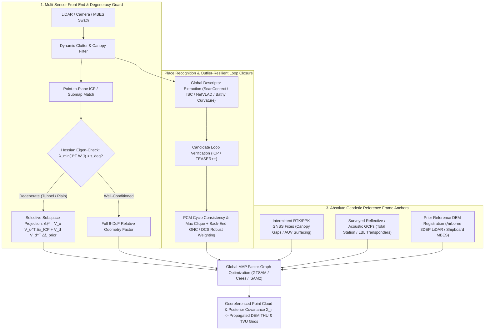

## 6.2 Loop Closure, Drift, and Georeferencing SLAM Maps

While Chapter 6.1 established how LiDAR-Inertial Odometry (LIO), Visual-Inertial Odometry (VIO), and bathymetric submap matching estimate incremental sensor motion in GNSS-denied environments, any purely dead-reckoned or open-loop odometry system is fundamentally an integrator of noisy differential measurements. Because each relative pose constraint $\Delta\mathbf{T}_{i-1,i} \in \text{SE}(3)$ introduces both stochastic random error and subtle systematic bias, open-loop trajectories inevitably diverge from true geodetic space. For Digital Elevation Model (DEM) generation, the most damaging manifestation of this divergence is not horizontal translation error, but **super-linear vertical drift ($z$-drift)**—a phenomenon that warps flat valley floors, highway corridors, tunnel inverts, and abyssal plains into parabolic, "banana-shaped" surfaces.

Transforming a locally consistent Simultaneous Localization and Mapping (SLAM) point cloud into a survey-grade, geodetically accurate DEM requires four interlocking mechanisms:
1. **Mitigating super-linear $z$-drift** by understanding how pitch errors and asymmetric scan geometry integrate along the trajectory;
2. **Detecting loop closures and rejecting perceptual aliasing outliers** using global spatial descriptors and robust non-convex back-end optimization;
3. **Detecting and isolating geometric and environmental degeneracy** when surface normals fail to constrain all six degrees of freedom; and
4. **Anchoring the relative factor graph to an absolute geodetic reference frame** via intermittent GNSS factors, surveyed Ground Control Points (GCPs), or cloud-to-DEM registration against prior airborne or shipboard reference surfaces.

---

### 6.2.1 Why Open-Loop Odometry Drifts Super-Linearly in Elevation ($z$-Drift)

To understand why open-loop SLAM maps exhibit severe vertical bowing, consider a mobile mapping platform (a terrestrial backpack/vehicle or an Autonomous Underwater Vehicle, AUV) traversing a trajectory parameterized by cumulative arc length $s \in [0, L]$ (in $\text{m}$). We define a local-level navigation frame $N$ (East-North-Up, where elevation $z$ is positive-up in $\text{m}$, or bathymetric depth $d = -z$ is positive-down in $\text{m}$) and a body frame $B$ advancing with speed $v(s) = ds/dt$ ($\text{m}\cdot\text{s}^{-1}$).

At arc length $s$, let $\delta\theta(s)$ (in $\text{rad}$) denote the small error in the estimated elevation pitch angle of the platform's velocity vector relative to the true trajectory inclination $\theta_{\text{true}}(s)$ (with $\delta\theta > 0$ corresponding to an upward-pitched trajectory estimate). For near-horizontal motion ($|\theta_{\text{true}}| \ll 1\text{ rad}$) and small pitch errors ($|\delta\theta| \ll 1\text{ rad}$), the kinematic rate of vertical elevation error $\delta z(s) = \hat{z}(s) - z_{\text{true}}(s)$ with respect to path length $s$ is governed by the projection of forward motion across the pitch error:

$$\frac{d(\delta z)}{ds} = \sin\big(\theta_{\text{true}}(s) + \delta\theta(s)\big) - \sin\big(\theta_{\text{true}}(s)\big) + \epsilon_{z,\text{local}}(s) \approx \delta\theta(s) + \epsilon_{z,\text{local}}(s)$$

where $\epsilon_{z,\text{local}}(s)$ (dimensionless, $\text{m}\cdot\text{m}^{-1}$) represents local vertical scan-matching noise per unit distance with power spectral density $q_z$ ($\text{m}^2\cdot\text{m}^{-1}$). How $\delta\theta(s)$ evolves along $s$ depends on whether the pitch angle is unconstrained or gravity-tethered, and whether the scan geometry induces a systematic pitch bias rate $\kappa_\theta$ (in $\text{rad}\cdot\text{m}^{-1}$):

$$\delta\theta(s) = \delta\theta_0 + \kappa_\theta \, s + \int_0^s \eta_\theta(u)\,du$$

Here, $\delta\theta_0$ ($\text{rad}$) is the initial pitch alignment error at $s=0$, $\kappa_\theta$ ($\text{rad}\cdot\text{m}^{-1}$) is a systematic per-meter pitch drift rate induced by asymmetric scan registration, and $\eta_\theta(u)$ ($\text{rad}\cdot\text{m}^{-1/2}$) is zero-mean white spatial pitch rate noise with power spectral density $q_\theta$ ($\text{rad}^2\cdot\text{m}^{-1}$). Integrating $\delta\theta(s)$ from $s=0$ to $s$ yields the fundamental **elevation drift equation**:

$$\delta z(s) = \int_0^s \delta\theta(s')\,ds' + \int_0^s \epsilon_{z,\text{local}}(s')\,ds' = \underbrace{\delta\theta_0 \, s}_{\text{Linear tilt}} + \underbrace{\frac{1}{2}\kappa_\theta \, s^2}_{\text{Quadratic bowing}} + \underbrace{\int_0^s \int_0^{s'} \eta_\theta(u)\,du\,ds'}_{\text{Super-linear random walk }\mathcal{O}(s^{3/2})} + \underbrace{\int_0^s \epsilon_{z,\text{local}}(s')\,ds'}_{\text{Local random walk }\mathcal{O}(s^{1/2})}$$

This decomposition reveals three distinct physical mechanisms that corrupt DEM vertical accuracy in open-loop corridors, tunnels, highways, flat agricultural fields, and marine transects:

1. **Quadratic "Banana-Shaped" Vertical Bowing ($\frac{1}{2}\kappa_\theta s^2$):** In planar environments or long tunnels, a terrestrial LiDAR or multibeam echosounder observes the ground or seafloor predominantly below the sensor, often with a forward-backward asymmetry (e.g., an inclined LiDAR puck, occlusion by the operator or vehicle chassis, or shallow grazing angles $\alpha < 15^\circ$ at long range). Because laser pulse stretching and acoustic footprint elongation at shallow grazing angles introduce a small range-dependent vertical bias $\delta z_{\text{grazing}}(r)$, point-to-plane Iterative Closest Point (ICP) systematically tilts each new scan by a tiny bias $\Delta\theta_{\text{ICP}}$ per keyframe spacing $\Delta s$, creating a non-zero effective curvature $\kappa_\theta = \Delta\theta_{\text{ICP}} / \Delta s$. Even a minuscule systematic pitch curvature of $\kappa_\theta = 2 \times 10^{-5}\text{ rad}\cdot\text{m}^{-1}$ ($0.00115^\circ\text{ m}^{-1}$) produces a quadratic vertical bow of $\frac{1}{2}\kappa_\theta s^2 = 2.50\text{ m}$ over a $500\text{ m}$ transect!
2. **Residual Gravity-Alignment Bias ($\delta\theta_0 \approx b_{a,x}/g$):** Tightly coupling a 6-axis Inertial Measurement Unit (IMU) bounds unbounded pitch random walk because an accelerometer in static or quasi-static equilibrium measures the upward specific force reaction $\mathbf{f}^N = -\mathbf{g}^N = [0, 0, +g]^T$ against local gravity $\mathbf{g}^N = [0, 0, -g]^T$ ($g \approx 9.80665\text{ m}\cdot\text{s}^{-2}$). However, any uncompensated longitudinal accelerometer bias $b_{a,x}$ ($\text{m}\cdot\text{s}^{-2}$) along the forward body axis is physically indistinguishable from a static pitch tilt of the gravity vector:
   $$\delta\theta_{\text{grav}} \approx \arcsin\left(\frac{b_{a,x}}{g}\right) \approx \frac{b_{a,x}}{g}$$
   For a tactical/industrial MEMS accelerometer with residual in-run bias $b_{a,x} = 5\text{ mg} \approx 0.049\text{ m}\cdot\text{s}^{-2}$, the resulting pitch offset is $\delta\theta_0 \approx 5.0 \times 10^{-3}\text{ rad}$ ($0.286^\circ$), which integrates to a $2.50\text{ m}$ vertical ramp over a $500\text{ m}$ path. Worse still, as internal sensor temperature fluctuates during a survey, $b_{a,x}(s)$ drifts slowly along $s$, re-introducing quadratic elevation curvature even with IMU gravity coupling.
3. **Stochastic Super-Linear Variance Growth ($\mathcal{O}(s^3)$ in variance, $\mathcal{O}(s^{3/2})$ in standard deviation):** When pitch is estimated from scan matching or visual odometry without absolute inclinometer/gravity damping (or over spatial scales shorter than the IMU accelerometer bias observability horizon), combining the uncorrelated local vertical scan-matching random walk and the double integral of white angular rate noise $\eta_\theta(u)$ yields a total vertical error variance that transitions from linear to cubic in path length $s$:
   $$\sigma_z^2(s) = \mathbb{E}\left[\left(\int_0^s \epsilon_{z,\text{local}}(s')\,ds'\right)^2\right] + \mathbb{E}\left[\left(\int_0^s \int_0^{s'} \eta_\theta(u)\,du\,ds'\right)^2\right] = q_z \, s + \frac{1}{3} q_\theta \, s^3$$
   Beyond the crossover distance $s_c = \sqrt{3 q_z / q_\theta}$ (typically $15\text{--}40\text{ m}$), the cubic term $\frac{1}{3}q_\theta s^3$ dominates completely. Consequently, the 95% Total Vertical Uncertainty ($\text{TVU}_{95} = 1.96\,\sigma_z$) grows super-linearly as $s^{3/2}$, rapidly violating USGS 3DEP Quality Level 1 ($\text{RMSE}_z \le 0.10\text{ m}$, $\text{NVA}_{95} \le 0.196\text{ m}$), ASPRS Positional Accuracy Standards, or IHO S-44 Special Order limits ($\text{TVU}_{\max}(d) = \sqrt{a^2 + (b \cdot d)^2}$ with $a = 0.25\text{ m}, b = 0.0075$) within tens to hundreds of meters unless constrained by cross-loops or external geodetic anchors.

#### Worked Numerical Example: Open-Loop $z$-Drift in a $600\text{ m}$ Tunnel Survey

Consider a mobile LiDAR-inertial mapping system surveying a $L = 600\text{ m}$ mine drift. Suppose the IMU has a residual longitudinal accelerometer bias $b_{a,x} = 1.5\text{ mg} = 0.01471\text{ m}\cdot\text{s}^{-2}$, and grazing-angle floor returns induce a tiny uncompensated pitch bias curvature $\kappa_\theta = -1.2 \times 10^{-5}\text{ rad}\cdot\text{m}^{-1}$ ($-0.000688^\circ\text{ m}^{-1}$), with local vertical registration noise $q_z = 4.0 \times 10^{-6}\text{ m}^2\cdot\text{m}^{-1}$ and residual white pitch random walk spectral density $q_\theta = 1.0 \times 10^{-8}\text{ rad}^2\cdot\text{m}^{-1}$ (crossover scale $s_c = \sqrt{3(4.0 \times 10^{-6})/(1.0 \times 10^{-8})} = 34.6\text{ m}$):
* **Initial gravity-coupled pitch error:** $\delta\theta_0 = b_{a,x}/g = 0.01471 / 9.80665 = +1.50 \times 10^{-3}\text{ rad}$ ($+0.0859^\circ$).
* **Deterministic elevation error at $s = 600\text{ m}$:**
  $$\delta z_{\text{det}}(600) = (1.50 \times 10^{-3})(600) + \frac{1}{2}(-1.2 \times 10^{-5})(600)^2 = +0.90\text{ m} - 2.16\text{ m} = -1.26\text{ m}$$
* **Stochastic $1\sigma$ elevation uncertainty at $s = 600\text{ m}$:**
  $$\sigma_z(600) = \sqrt{(4.0 \times 10^{-6})(600) + \frac{1}{3}(1.0 \times 10^{-8})(600)^3} = \sqrt{0.0024 + 0.7200}\text{ m} \approx 0.850\text{ m} \quad (\text{95\% TVU} = 1.67\text{ m})$$

Note that if the operator executes an **out-and-back trajectory** along the same $600\text{ m}$ tunnel without intermediate cross-loops, the sign of $\kappa_\theta$ in the world frame reverses on the return leg while the accumulated elevation offset at the turnaround point ($s = 600\text{ m}$) folds back toward the origin, bowing the middle of the DEM downward by over a meter even if the start and end poses are pinned together at $s = 0$!

---

### 6.2.2 Place Recognition, Loop Closure, and Robust Outlier Rejection

To arrest super-linear drift in the absence of external GNSS, a SLAM system must recognize when it revisits a previously mapped terrain patch (**place recognition**) and establish a non-sequential relative pose constraint $\tilde{\mathbf{T}}_{ij} \in \text{SE}(3)$ between historical keyframe $i$ and current keyframe $j$ (**loop closure**).

#### Global Descriptors Across Sensor Modalities

Because brute-force ICP or submap cross-correlation against thousands of historical keyframes is computationally intractable and prone to local minima when accumulated drift exceeds $1\text{--}5\text{ m}$, place recognition proceeds in two stages: (1) fast candidate retrieval using a rotation-invariant global descriptor, followed by (2) metric geometric verification (coarse-to-fine ICP, TEASER++, or RANSAC).

* **3D LiDAR Egocentric Polar Descriptors (ScanContext):** Kim and Kim (2018) partition a 3D LiDAR sweep into $N_r$ radial rings (up to maximum radius $L_{\max}$, e.g., $80\text{ m}$ with $N_r = 20$) and $N_s$ azimuthal sectors (e.g., $N_s = 60$), forming a 2D matrix $\mathbf{I} \in \mathbb{R}^{N_r \times N_s}$ whose $(p,q)$ entry records the maximum point height $I_{pq} = \max_{\mathbf{p} \in \mathcal{P}_{pq}} z(\mathbf{p})$ within bin $\mathcal{P}_{pq}$. A rotation-invariant **ring key** $\mathbf{k} \in \mathbb{R}^{N_r}$ summarizes the occupancy ratio of each ring, $k_p = \frac{1}{N_s}\sum_{q=1}^{N_s} \mathbb{I}(I_{pq} > 0)$, enabling sub-millisecond $k$-d tree candidate lookup. Given query descriptor $\mathbf{I}^q$ and candidate $\mathbf{I}^c$ with azimuthal column vectors $\mathbf{c}_j^q, \mathbf{c}_j^c \in \mathbb{R}^{N_r}$, ScanContext simultaneously verifies similarity and estimates the relative yaw shift $s^*$ by minimizing the column-shifted cosine distance across all $N_s$ cyclic column permutations:
  $$d_{\text{SC}}(\mathbf{I}^q, \mathbf{I}^c) = \min_{s \in \{0,\dots,N_s-1\}} \frac{1}{N_s} \sum_{j=1}^{N_s} \left( 1 - \frac{\mathbf{c}_j^q \cdot \mathbf{c}_{(j+s)\bmod N_s}^c}{\|\mathbf{c}_j^q\|_2 \, \|\mathbf{c}_{(j+s)\bmod N_s}^c\|_2} \right), \qquad \Delta\psi_0 = \frac{2\pi s^*}{N_s}$$
  where $\Delta\psi_0$ provides the coarse azimuth alignment required to warm-start local ICP within its convergence basin.
* **Visual Vocabulary Trees (DBoW2) and Learned Residual Aggregation (NetVLAD):** In camera and VIO pipelines, **DBoW2** (Gálvez-López & Tardós, 2012) quantizes local binary descriptors (ORB/BRIEF) into sparse Term Frequency–Inverse Document Frequency (TF-IDF) bag-of-words vectors $\mathbf{v}_q, \mathbf{v}_c$ and evaluates the $L_1$-normalized similarity score $s(\mathbf{v}_q, \mathbf{v}_c) = 1 - \frac{1}{2}\big\|\frac{\mathbf{v}_q}{\|\mathbf{v}_q\|_1} - \frac{\mathbf{v}_c}{\|\mathbf{v}_c\|_1}\big\|_1$. For greater resilience to seasonal and illumination changes, **NetVLAD** (Arandjelović et al., 2016) aggregates $N$ local $D$-dimensional CNN feature maps $\{\mathbf{f}_i\}_{i=1}^N$ across $K$ learned cluster centers $\{\mathbf{c}_k\}_{k=1}^K$ via differentiable soft-assignment weights $\bar{a}_k(\mathbf{f}_i) = \frac{\exp(\mathbf{w}_k^T \mathbf{f}_i + b_k)}{\sum_{k'} \exp(\mathbf{w}_{k'}^T \mathbf{f}_i + b_{k'})}$, yielding the $(D \times K)$ VLAD matrix components $V(j,k) = \sum_{i=1}^N \bar{a}_k(\mathbf{f}_i)\big(f_i(j) - c_k(j)\big)$ prior to intra-normalization and $L_2$ projection.

| Descriptor Family | Primary Modality | Mathematical Encoding & Rotation Invariance | Strengths & Failure Modes in DEM Generation |
| :--- | :--- | :--- | :--- |
| **ScanContext (SC)** (Kim & Kim, 2018) | 3D LiDAR | Projects a 3D scan into an egocentric polar grid of $N_r \times N_s$ bins ($20 \times 60$), storing maximum point height $z_{\max}$ per bin. Summarizes each ring into an $N_r$-dimensional $L_0$ **ring key** for fast $k$-d tree lookup; resolves yaw $\Delta\psi_0$ via column-shift cosine distance $d_{\text{SC}}$. | Highly effective in urban and forest canopies with vertical structure; fails on featureless flat plains where $z_{\max} \approx \text{const}$. |
| **Intensity ScanContext (ISC)** & **LiDAR Iris** (Wang et al., 2020) | 3D LiDAR (Calibrated Intensity / BEV) | ISC replaces or augments bin height with calibrated return reflectivity $\eta_{\text{refl}}$; LiDAR Iris applies LoG-Gabor wavelets to bird's-eye-view (BEV) strips and takes the Fourier magnitude spectrum for exact yaw invariance. | ISC discriminates road markings, rock lithology, and tunnel linings even when geometry is uniform; sensitive to wet/dry surface changes. |
| **DBoW2** (Gálvez-López & Tardós, 2012) | Visual / VIO / RGB-D | Quantizes local binary features (ORB/BRIEF) into a hierarchical vocabulary tree using TF-IDF weighting, direct/inverse file indexing, and $L_1$ similarity scoring. | Microsecond retrieval over $10^5$ keyframes; vulnerable to illumination changes, shadows, and viewpoint rotation $>30^\circ$. |
| **NetVLAD** (Arandjelović et al., 2016) | Visual / Multi-Camera | End-to-end CNN architecture with a generalized Vector of Locally Aggregated Descriptors (VLAD) soft-assignment pooling layer trained with weakly supervised triplet loss. | Robust to seasonal, lighting, and moderate viewpoint variations; requires GPU inference and texture-rich surfaces. |
| **Bathymetric Curvature & Contour Matching (TERCOM / 3D Zernike)** | Marine MBES / Side-Scan Sonar | Computes multi-scale principal curvatures $(\kappa_1, \kappa_2)$, bathymetric rugosity, or 3D Zernike moment invariants on 2.5D AUV swath submaps, followed by normalized cross-correlation (NCC) of demeaned depth grids (e.g., MB-System `mbnavadjust`). | Operates in total darkness and turbid water; degrades on low-relief abyssal plains where topographic variance approaches sonar TVU. |

#### Perceptual Aliasing and Robust Back-End Outlier Rejection

While a true-positive loop closure dramatically collapses pose-graph uncertainty, **a single false-positive loop closure is catastrophic**. In environments exhibiting **perceptual aliasing**—such as repetitive precast concrete rings in a bored tunnel, timber sets in a mine shaft, uniform rows in an orchard or vineyard, or periodic marine sand waves—two physically distinct locations $i$ and $j$ can produce nearly identical ScanContext, DBoW2, or bathymetric descriptors and even pass local ICP fitness checks.

In a standard Gaussian factor graph, a loop-closure measurement $\tilde{\mathbf{T}}_{ij}$ contributes a quadratic Mahalanobis cost $\|\mathbf{r}_{\text{loop}}(\mathbf{x}_i, \mathbf{x}_j)\|_{\Sigma_{ij}}^2$, where $\mathbf{r}_{\text{loop}}(\mathbf{x}_i, \mathbf{x}_j) = \text{Log}\big(\tilde{\mathbf{T}}_{ij}^{-1} \mathbf{T}_i^{-1} \mathbf{T}_j\big)^\vee \in \mathbb{R}^6$. Because the gradient of a quadratic cost grows linearly without bound as residual $\|\mathbf{r}_{\text{loop}}\|$ increases, a single false loop linking two poses $200\text{ m}$ apart exerts an enormous fictitious force that twists the entire pose graph into a knotted, self-intersecting DEM. Modern SLAM back-ends prevent this catastrophe using four mathematical defenses:

1. **Pairwise Consistent Measurement Set Maximization (PCM)** (Mangelson et al., 2018): Before inserting candidate loops into the factor graph, PCM checks whether pairs of candidate loop closures $(i,j)$ and $(k,l)$ are mutually consistent with the odometry estimates $\hat{\mathbf{T}}_{ik} \approx \mathbf{T}_i^{-1}\mathbf{T}_k$ and $\hat{\mathbf{T}}_{jl} \approx \mathbf{T}_j^{-1}\mathbf{T}_l$ connecting them along the trajectory. Specifically, the 6-DoF cycle error around the closed quadrilateral $i \to j \to l \to k \to i$ is evaluated:
   $$\mathbf{r}_{\text{cycle}} = \text{Log}\left(\tilde{\mathbf{T}}_{ij} \, \hat{\mathbf{T}}_{jl} \, \tilde{\mathbf{T}}_{kl}^{-1} \, \hat{\mathbf{T}}_{ik}^{-1}\right)^\vee, \qquad d_{\text{PCM}}^2 = \mathbf{r}_{\text{cycle}}^T \boldsymbol{\Sigma}_{\text{cycle}}^{-1} \mathbf{r}_{\text{cycle}} \le \chi^2_{6, 1-\alpha}$$
   Candidates satisfying $d_{\text{PCM}}^2 \le \chi^2_{6, 1-\alpha}$ form edges in a consistency graph; finding the **Maximum Clique** of this graph isolates the largest mutually consistent set of true loop closures while rejecting isolated perceptual aliases.
2. **Switchable Constraints (SC)** (Sünderhauf & Protzel, 2012): Each candidate loop closure $(i,j) \in \mathcal{E}_{\text{loop}}$ is augmented with a continuous scalar switch variable $s_{ij} \in [0, 1]$ with prior variance $\sigma_s^2 = 1/\Phi$, optimized jointly with the poses $\mathcal{X}$:
   $$J_{\text{SC}}(\mathcal{X}, \mathcal{S}) = \sum_{i} \|\mathbf{r}_{\text{odom}}(\mathbf{x}_{i-1}, \mathbf{x}_i)\|_{\Sigma_i}^2 + \sum_{(i,j) \in \mathcal{E}_{\text{loop}}} \left( \big\| s_{ij} \, \mathbf{r}_{\text{loop}}(\mathbf{x}_i, \mathbf{x}_j) \big\|_{\Sigma_{ij}}^2 + \Phi\,(1 - s_{ij})^2 \right)$$
   If a loop closure conflicts with the odometry chain, driving $s_{ij} \to 0$ incurs only the bounded scalar penalty $\Phi = 1/\sigma_s^2$, cleanly disabling the outlier edge.
3. **Dynamic Covariance Scaling (DCS)** (Agarwal et al., 2013): Setting the partial derivative $\partial J_{\text{SC}} / \partial s_{ij} = 2 s_{ij}\chi_{ij}^2 - 2\Phi(1 - s_{ij}) = 0$ yields the unconstrained stationary point $s_{ij} = \Phi / (\Phi + \chi_{ij}^2)$. To keep true inliers ($\chi_{ij}^2 \le \Phi$) completely unscaled ($s_{ij}^* = 1$), DCS doubles this ratio and clamps it to unity in closed form at every Gauss-Newton/Levenberg-Marquardt iteration without expanding the state vector:
   $$s_{ij}^* = \min\left(1, \; \frac{2\Phi}{\Phi + \chi_{ij}^2}\right), \qquad \chi_{ij}^2 = \big\|\mathbf{r}_{\text{loop}}(\mathbf{x}_i, \mathbf{x}_j)\big\|_{\Sigma_{ij}}^2$$
   where $\Phi = 1/\sigma_s^2$ sets the chi-square outlier threshold. For large residuals ($\chi_{ij}^2 \gg \Phi$), the effective information scaling $(s_{ij}^*)^2 \propto \chi_{ij}^{-4}$ decays rapidly toward zero.
4. **Graduated Non-Convexity (GNC)** (Yang et al., 2020): Rather than relying on a fragile initial trajectory guess, GNC embeds the non-convex **Truncated Least Squares (TLS)** or **Geman-McClure (GM)** cost function into a continuation homotopy controlled by parameter $\mu$ and truncation threshold $\bar{c}^2$ (typically $\chi^2_{6, 0.99} = 16.81$). Using Black-Rangarajan duality, GNC alternates between weighted pose-graph optimization and closed-form weight updates $w_{ij}^* \in [0, 1]$:
   $$w_{ij}^*(\chi_{ij}^2; \mu) = \begin{cases} \left(\dfrac{\mu\,\bar{c}^2}{\chi_{ij}^2 + \mu\,\bar{c}^2}\right)^2 & \text{(GNC-GM, decreasing }\mu \text{ from }\mu_{\max} \to 1\text{)} \\[10pt] 1 \;\text{if }\chi_{ij}^2 \le \frac{\mu}{\mu+1}\bar{c}^2, \;\; \frac{\bar{c}}{\chi_{ij}}\sqrt{\mu(\mu+1)} - \mu \;\text{if }\chi_{ij}^2 \in \big(\frac{\mu}{\mu+1}\bar{c}^2, \frac{\mu+1}{\mu}\bar{c}^2\big), \;\; 0 \;\text{otherwise} & \text{(GNC-TLS, increasing }\mu \text{ from }\mu_0 \to \infty\text{)} \end{cases}$$
   Starting in a convex regime where all candidate loops participate equally, GNC gradually hardens $w_{ij}^*$ toward binary inlier/outlier decisions, tolerating up to $80\text{--}90\%$ corrupted loop candidates without initial pose guesses.

---

### 6.2.3 Geometric and Environmental Degeneracy in SLAM

Even before loop closure, local scan matching can fail catastrophically when the surrounding terrain lacks sufficient geometric diversity to constrain all six degrees of freedom of $\text{SE}(3)$, or when moving objects violate the static-world assumption.

#### Eigenvalue Analysis of the Point-to-Plane ICP Hessian

In point-to-plane ICP (used across LIO-SAM, Fast-LIO2, and bathymetric surface registration), each matched source point $\mathbf{p}_k \in \mathbb{R}^3$ (transformed into the local map frame via current pose estimate $(\mathbf{R}, \mathbf{t})$) with corresponding target surface point $\mathbf{q}_k$ and unit surface normal $\mathbf{n}_k \in \mathbb{S}^2$ yields a scalar signed-distance residual $r_k = \mathbf{n}_k^T (\mathbf{R}\mathbf{p}_k + \mathbf{t} - \mathbf{q}_k)$. Applying a world-aligned 6-DoF Lie algebra perturbation $\Delta\boldsymbol{\xi} = [\Delta\boldsymbol{\theta}^T, \, \Delta\mathbf{t}^T]^T \in \mathfrak{se}(3)$ via $\mathbf{R} \leftarrow \exp([\Delta\boldsymbol{\theta}]_\times)\mathbf{R} \approx (\mathbf{I}_3 + [\Delta\boldsymbol{\theta}]_\times)\mathbf{R}$ and $\mathbf{t} \leftarrow \mathbf{t} + \Delta\mathbf{t}$, and invoking the skew-symmetric triple-product identity $\mathbf{n}_k^T([\Delta\boldsymbol{\theta}]_\times \mathbf{R}\mathbf{p}_k) = -\mathbf{n}_k^T[\mathbf{R}\mathbf{p}_k]_\times \Delta\boldsymbol{\theta} = (\mathbf{R}\mathbf{p}_k \times \mathbf{n}_k)^T \Delta\boldsymbol{\theta}$, yields the $k$-th row of the Jacobian $\mathbf{J}_t \in \mathbb{R}^{K \times 6}$:

$$\mathbf{j}_k = \frac{\partial r_k}{\partial \Delta\boldsymbol{\xi}} = \begin{bmatrix} (\mathbf{R}\mathbf{p}_k \times \mathbf{n}_k)^T & \mathbf{n}_k^T \end{bmatrix} \in \mathbb{R}^{1 \times 6}$$

Summing over all $K$ correspondences with weights $\mathbf{W}_t = \text{diag}(w_1, \dots, w_K)$ (or unweighted $\mathbf{W}_t = \mathbf{I}_K$, so $\mathbf{H}_t = \mathbf{J}_t^T \mathbf{J}_t$) forms the $6 \times 6$ normal-equation Hessian (information matrix) $\mathbf{H}_t = \mathbf{J}_t^T \mathbf{W}_t \mathbf{J}_t$:

$$\mathbf{H}_t = \sum_{k=1}^{K} w_k \begin{bmatrix} (\mathbf{R}\mathbf{p}_k \times \mathbf{n}_k)(\mathbf{R}\mathbf{p}_k \times \mathbf{n}_k)^T & (\mathbf{R}\mathbf{p}_k \times \mathbf{n}_k)\mathbf{n}_k^T \\ \mathbf{n}_k(\mathbf{R}\mathbf{p}_k \times \mathbf{n}_k)^T & \mathbf{n}_k \mathbf{n}_k^T \end{bmatrix}$$

Inspecting the translational block $\mathbf{H}_{t,\text{trans}} = \sum_{k=1}^K w_k \mathbf{n}_k \mathbf{n}_k^T$ and rotational block $\mathbf{H}_{t,\text{rot}} = \sum_{k=1}^K w_k (\mathbf{R}\mathbf{p}_k \times \mathbf{n}_k)(\mathbf{R}\mathbf{p}_k \times \mathbf{n}_k)^T$ reveals why specific natural and engineered environments become **geometrically degenerate**:
* **Flat Agricultural Fields, Salt Flats, and Abyssal Plains ($\mathbf{n}_k \approx [0, 0, 1]^T$):** All surface normals point vertically upward. Consequently, $\mathbf{H}_{t,\text{trans}} \approx (\sum w_k)\,\text{diag}(0, 0, 1)$ and $\mathbf{R}\mathbf{p}_k \times \mathbf{n}_k$ has zero $z$-component. Elevation $z$, roll $\phi$, and pitch $\theta$ are tightly constrained, but the eigenvalues corresponding to **horizontal translation ($\Delta x, \Delta y$) and yaw ($\Delta\psi$) collapse toward zero** ($\lambda_{\min}(\mathbf{J}_t^T \mathbf{J}_t) \to 0$). Without external aids, the point cloud slides freely across the horizontal plane.
* **Smooth Straight Tunnels, Mine Adits, and Featureless Corridors (axis along $\mathbf{e}_x = [1, 0, 0]^T$):** All wall, roof, and floor normals are orthogonal to the tunnel axis ($\mathbf{n}_k \cdot \mathbf{e}_x = 0$). Thus $\mathbf{e}_x$ lies in the nullspace of $\mathbf{H}_{t,\text{trans}}$ ($\mathbf{e}_x^T \mathbf{H}_{t,\text{trans}} \mathbf{e}_x = 0$), rendering **along-track translation $\Delta x$ completely unobservable** from geometry alone (and in a circular cross-section where $\mathbf{R}\mathbf{p}_k \parallel \mathbf{n}_k$ in the $y\text{--}z$ plane, roll $\Delta\phi$ about $\mathbf{e}_x$ also becomes degenerate).

#### Zhang et al. (2016) Degeneracy Factor and Selective Subspace Remapping

Following Zhang, Kaess, and Singh (2016), degeneracy is quantified and mitigated by performing an eigendecomposition of the pose-estimation Hessian $\mathbf{H}_t = \mathbf{J}_t^T \mathbf{W}_t \mathbf{J}_t = \mathbf{V}\boldsymbol{\Lambda}\mathbf{V}^T$, where $\boldsymbol{\Lambda} = \text{diag}(\lambda_1, \dots, \lambda_6)$ and $\mathbf{V} = [\mathbf{v}_1, \dots, \mathbf{v}_6]$ is the orthonormal matrix of eigenvectors (computed separately on rotational and translational blocks or in characteristic-length-scaled coordinates so $\Delta\boldsymbol{\theta}$ and $\Delta\mathbf{t}$ share commensurate units). The minimum eigenvalue $\mathcal{D}_{\min} = \lambda_{\min}(\mathbf{J}_t^T \mathbf{W}_t \mathbf{J}_t)$ (or $\lambda_{\min}(\mathbf{J}_t^T \mathbf{J}_t)$ for unit weights) defines the governing **degeneracy factor**.

Any eigen-direction with $\lambda_m < \tau_{\text{deg}}$ is classified as degenerate and grouped into the degenerate subspace basis $\mathbf{V}_d \in \mathbb{R}^{6 \times m_d}$, while well-conditioned directions ($\lambda_m \ge \tau_{\text{deg}}$) form the observable subspace basis $\mathbf{V}_u \in \mathbb{R}^{6 \times (6 - m_d)}$. Rather than inverting an ill-conditioned $\mathbf{H}_t$ (which amplifies sensor noise into meter-scale trajectory jumps), the state update $\Delta\boldsymbol{\xi}^*$ uses the complementary orthogonal projectors $\mathbf{P}_u = \mathbf{V}_u \mathbf{V}_u^T$ and $\mathbf{P}_d = \mathbf{V}_d \mathbf{V}_d^T$ ($\mathbf{P}_u + \mathbf{P}_d = \mathbf{I}_6$) to fuse the ICP update $\Delta\boldsymbol{\xi}_{\text{ICP}}$ strictly along $\mathbf{V}_u$ with the IMU/wheel/DVL odometry prior $\Delta\boldsymbol{\xi}_{\text{prior}}$ along $\mathbf{V}_d$:

$$\Delta\boldsymbol{\xi}^* = \mathbf{V}_u \mathbf{V}_u^T \, \Delta\boldsymbol{\xi}_{\text{ICP}} + \mathbf{V}_d \mathbf{V}_d^T \, \Delta\boldsymbol{\xi}_{\text{prior}}$$

#### Dynamic and Environmental Degeneracy

In vegetated terrestrial landscapes and biologically active marine waters, SLAM faces **environmental degeneracy** even when static geometry exists:
* **Wind-Blown Forests and Understory Foliage:** When scanning a forest under moderate wind ($>5\text{ m}\cdot\text{s}^{-1}$), upper canopy branches and ferns sway coherently or chaotically between consecutive LiDAR sweeps. Because foliage often constitutes $60\text{--}85\%$ of raw LiDAR returns, unweighted point-to-plane ICP locks onto the swaying canopy rather than the rigid ground and tree trunks, introducing spurious pitch and translation oscillations and corrupting local PCA surface normals $\mathbf{n}_k$.
* **Moving Crowds, Vehicles, and Marine Biological Clutter:** Urban pedestrians/traffic and marine schools of fish, swaying kelp beds, or dense benthic nepheloid layers generate transient point clouds that bias registration.
* **Mitigation Strategies:** Production DEM pipelines filter dynamic returns *prior* to scan matching by: (1) weighting each point by its local planarity $\sigma_{\text{plan}} = (\lambda_2 - \lambda_3)/\lambda_1$ (where $\lambda_1 \ge \lambda_2 \ge \lambda_3 \ge 0$ are the eigenvalues of the local $3 \times 3$ neighborhood covariance matrix) and normal temporal consistency across sliding-window submaps; (2) restricting ICP correspondences in forested terrain strictly to segmented bare-ground facets and vertical cylindrical trunk stems; and (3) applying dynamic voxel occupancy decay (e.g., octree ray-casting or spatio-temporal visibility consistency) to purge transient returns before DEM gridding.

---

### 6.2.4 Tying Relative SLAM Maps to Absolute Geodetic Reference Frames

Even a drift-free, loop-closed SLAM factor graph remains floating in an arbitrary local coordinate frame (typically anchored at the initial sensor pose $\mathbf{x}_0 = \mathbf{I}_4$). Mathematically, a pure relative pose graph possesses a **6-DoF $\text{SE}(3)$ gauge freedom** $(\mathbf{R}_0 \in \text{SO}(3), \mathbf{t}_0 \in \mathbb{R}^3)$, corresponding to a six-dimensional nullspace of the global relative-odometry Hessian. When tightly coupled with a 6-axis IMU, the local gravity vector $\mathbf{g}^N = [0, 0, -g]^T$ constrains global roll $\phi_0$ and pitch $\theta_0$ to the local plumb line (astrogeodetic vertical, differing from the geodetic ellipsoid normal only by the deflection of the vertical $\xi, \eta$, typically $< 5\text{--}30''$), reducing the gauge freedom to a **4-DoF similarity/isometry subgroup** $(\text{SO}(2) \times \mathbb{R}^3)$: 3D global translation $\mathbf{t}_0 = [E_0, N_0, H_0]^T \in \mathbb{R}^3$ and global azimuth/yaw $\psi_0 \in (-\pi, \pi]$ about the vertical axis:

$$\mathbf{T}_{\text{global}}(\psi_0, \mathbf{t}_0) = \begin{bmatrix} \mathbf{R}_z(\psi_0) & \mathbf{t}_0 \\ \mathbf{0}^T & 1 \end{bmatrix} \in \text{SE}(3), \qquad \mathbf{R}_z(\psi_0) = \begin{bmatrix} \cos\psi_0 & -\sin\psi_0 & 0 \\ \sin\psi_0 & \cos\psi_0 & 0 \\ 0 & 0 & 1 \end{bmatrix}$$

To transform a relative SLAM map into an absolute geodetic CRS (e.g., NAD83(2011) / NAVD88 or ITRF2020 / WGS84) and eliminate both the 4-DoF/6-DoF gauge freedom and residual long-wavelength elevation bowing, external **geodetic anchor factors** are injected directly into the factor-graph objective:



1. **Intermittent RTK/PPK GNSS Factors:** When a backpack/vehicle traverses a forest clearing or tunnel portal, or an AUV surfaces for a GNSS fix, an absolute position measurement $\mathbf{p}_{\text{GNSS}, i} \in \mathbb{R}^3$ (transformed into a local geodetic tangent frame or projected CRS, with gravimetric/hybrid geoid height $N_{\text{geoid}}$ applied when converting ellipsoidal height $h$ to orthometric elevation $H = h - N_{\text{geoid}}$) is added as a unary factor (e.g., GTSAM `GPSFactor`) on pose $\mathbf{x}_i = (\mathbf{R}_i, \mathbf{t}_i)$ accounting for the calibrated body-frame antenna lever arm $\mathbf{l}_{\text{GNSS}}^B$:
   $$\mathbf{r}_{\text{GNSS}}(\mathbf{x}_i) = \mathbf{t}_i + \mathbf{R}_i \mathbf{l}_{\text{GNSS}}^B - \mathbf{p}_{\text{GNSS}, i}, \qquad \boldsymbol{\Sigma}_{\text{GNSS}, i} = \text{diag}\big(\sigma_E^2, \, \sigma_N^2, \, \sigma_U^2\big)$$
   Critically, $\boldsymbol{\Sigma}_{\text{GNSS}, i}$ must reflect the instantaneous RTK ambiguity status ($0.02\text{ m}$ for fixed integer vs. $0.5\text{--}3.0\text{ m}$ for float/multipath under partial canopy), guarded by a Huber, Cauchy, or GNC M-estimator to reject canopy multipath spikes. While a single GNSS epoch pins 3D translation $\mathbf{t}_0$, two or more non-collinear GNSS epochs separated by baseline $B_{\text{GNSS}}$ also constrain global yaw $\psi_0$ with angular uncertainty $\sigma_{\psi_0} \approx \sqrt{2}\,\sigma_{\text{THU}} / B_{\text{GNSS}}$.
2. **Surveyed Ground Control Points (GCPs):** In subterranean mines, indoor complexes, or dense forests, surveyors establish retro-reflective spheres, checkerboard paddles, AprilTags, or seafloor Long-Baseline (LBL) acoustic transponders with known geodetic coordinates $\mathbf{g}_m \in \mathbb{R}^3$ and survey covariance $\boldsymbol{\Sigma}_{\text{GCP}, m}$. When keyframe $i$ detects target $m$ at centroid $\tilde{\mathbf{p}}_{im}^B$ in the sensor frame, the factor residual is:
   $$\mathbf{r}_{\text{GCP}}(\mathbf{x}_i) = \mathbf{t}_i + \mathbf{R}_i \tilde{\mathbf{p}}_{im}^B - \mathbf{g}_m, \qquad \boldsymbol{\Sigma}_{im} = \mathbf{R}_i \boldsymbol{\Sigma}_{\text{meas}, im} \mathbf{R}_i^T + \boldsymbol{\Sigma}_{\text{GCP}, m}$$
   Unlike rigid 7-parameter Helmert post-alignment of an already-warped cloud, embedding GCP factors *inside* the pose graph bends the elastic trajectory spline, removing quadratic $z$-bowing between control points.
3. **Cloud-to-Cloud and DEM-to-DEM Prior Map Registration:** When field deployment of GNSS or GCPs is impossible (e.g., rapid disaster reconnaissance under forest canopy or deep-ocean AUV mapping at $3000\text{ m}$ depth), the SLAM submaps $\mathcal{S}_i$ are registered directly against an existing, geodetically accurate **reference DEM** $z_{\text{ref}}(E, N)$—such as an airborne USGS 3DEP bare-earth LiDAR DEM (where airborne laser pulses penetrate canopy gaps) or a lower-resolution shipboard multibeam bathymetric surface (via `xdem` Nuth & Kääb / ICP coregistration, `PDAL`, or MB-System `mbnavadjust`). For each ground-classified submap keyframe $\mathcal{S}_i$, ground points $\mathbf{p}_{ik}^B$ with world coordinates $[E_{ik}, N_{ik}, H_{ik}]^T = \mathbf{t}_i + \mathbf{R}_i \mathbf{p}_{ik}^B$ induce point-to-prior-DEM surface-normal factors:
   $$r_{\text{DEM}, ik}(\mathbf{x}_i) = \mathbf{n}_{\text{ref}}(E_{ik}, N_{ik})^T \left( \mathbf{t}_i + \mathbf{R}_i \mathbf{p}_{ik}^B - \begin{bmatrix} E_{ik} \\ N_{ik} \\ z_{\text{ref}}(E_{ik}, N_{ik}) \end{bmatrix} \right)$$
   Because the prior airborne/shipboard DEM has bounded absolute TVU across the entire domain, these distributed factors eliminate long-wavelength SLAM $z$-drift while preserving the millimeter-to-centimeter local detail captured by the mobile or AUV sensor.

#### Propagating Uncertainty from Geodetic Anchors Across the DEM

Once the global factor graph converges to the Maximum A Posteriori (MAP) estimate $\mathcal{X}^*$, the $6 \times 6$ marginal posterior covariance $\boldsymbol{\Sigma}_{ii}$ of every keyframe pose $\mathbf{x}_i$ is recovered from the block-diagonal entries of the inverse global information matrix $\boldsymbol{\Sigma}_{\mathcal{X}} = \big(\mathbf{J}_{\text{total}}^T \boldsymbol{\Sigma}_{\text{total}}^{-1} \mathbf{J}_{\text{total}}\big)^{-1}$. Parameterizing the pose perturbation as $\Delta\boldsymbol{\xi}_i = [(\Delta\boldsymbol{\theta}_i^B)^T, \, (\Delta\mathbf{t}_i^N)^T]^T$ (body-frame rotation perturbation $\mathbf{R}_i \leftarrow \mathbf{R}_i \exp([\Delta\boldsymbol{\theta}_i^B]_\times)$ and navigation-frame translation perturbation $\mathbf{t}_i \leftarrow \mathbf{t}_i + \Delta\mathbf{t}_i^N$; or equivalently $-[\mathbf{R}_i \mathbf{p}^B]_\times \Delta\boldsymbol{\theta}_i^N$ for navigation-frame rotation perturbation via the Lie algebra adjoint identity $\mathbf{R}_i [\mathbf{p}^B]_\times \mathbf{R}_i^T = [\mathbf{R}_i \mathbf{p}^B]_\times$), first-order error propagation for any terrain point $\mathbf{p}^N = \mathbf{t}_i + \mathbf{R}_i \mathbf{p}^B$ yields its $3 \times 3$ geodetic coordinate covariance in the East-North-Up ($E, N, U$) frame:

$$\boldsymbol{\Sigma}_{\mathbf{p}^N} = \begin{bmatrix} \Sigma_{EE} & \Sigma_{EN} & \Sigma_{EU} \\ \Sigma_{NE} & \Sigma_{NN} & \Sigma_{NU} \\ \Sigma_{UE} & \Sigma_{UN} & \Sigma_{UU} \end{bmatrix} = \mathbf{J}_{\text{pose}, i} \, \boldsymbol{\Sigma}_{ii} \, \mathbf{J}_{\text{pose}, i}^T + \mathbf{R}_i \, \boldsymbol{\Sigma}_{\mathbf{p}^B} \, \mathbf{R}_i^T, \qquad \mathbf{J}_{\text{pose}, i} = \begin{bmatrix} -\mathbf{R}_i [\mathbf{p}^B]_\times & \mathbf{I}_3 \end{bmatrix}$$

From the diagonal and horizontal blocks of $\boldsymbol{\Sigma}_{\mathbf{p}^N}$, the 95% confidence **Total Vertical Uncertainty ($\text{TVU}_{95}$)** and **Total Horizontal Uncertainty ($\text{THU}_{95}$)** (following IHO S-44, NOAA HSSD, and ASPRS/USGS 3DEP conventions) are evaluated at every DEM grid cell:

$$\text{TVU}_{95} = 1.96\,\sqrt{\Sigma_{UU}}, \qquad \text{THU}_{95} \approx 2.4477\,\sqrt{\frac{\Sigma_{EE} + \Sigma_{NN}}{2}}$$

Consequently, both $\text{THU}_{95}$ and $\text{TVU}_{95}$ achieve their minimum directly at GCP/GNSS anchor locations and inflate smoothly into parabolic "uncertainty bridges" midway between anchors or along unclosed dead-end branches.

```python
import numpy as np

def solve_1d_elevation_pose_graph(n_nodes: int, ds: float, kappa_theta: float,
                                  sigma_odom_z: float, gcp_nodes: dict, sigma_gcp_z: float):
    """
    Demonstrate quadratic open-loop z-drift vs. factor-graph GCP georeferencing
    and posterior TVU propagation along a 1D trajectory of length L = (n_nodes-1)*ds.
    """
    s = np.arange(n_nodes) * ds
    # Simulate open-loop elevation with quadratic pitch-curvature bowing: dz/ds = kappa_theta * s
    z_open_loop = 0.5 * kappa_theta * (s ** 2)
    dz_meas = np.diff(z_open_loop)  # Biased relative elevation increments

    # Build sparse linear information matrix H (Lambda) and information vector b
    H = np.zeros((n_nodes, n_nodes))
    b = np.zeros(n_nodes)
    w_odom = 1.0 / (sigma_odom_z ** 2)
    w_gcp = 1.0 / (sigma_gcp_z ** 2)

    for i in range(n_nodes - 1):
        H[i, i] += w_odom;     H[i+1, i+1] += w_odom
        H[i, i+1] -= w_odom;   H[i+1, i] -= w_odom
        b[i] -= w_odom * dz_meas[i]
        b[i+1] += w_odom * dz_meas[i]

    for idx, z_true in gcp_nodes.items():
        H[idx, idx] += w_gcp
        b[idx] += w_gcp * z_true

    Cov_post = np.linalg.inv(H)
    z_opt = Cov_post @ b
    tvu_95 = 1.96 * np.sqrt(np.diag(Cov_post))
    return s, z_open_loop, z_opt, tvu_95

# Example: 500 m tunnel (101 keyframes every 5 m), kappa_theta = -2e-5 rad/m, 3 GCPs at 0, 250, 500 m
s, z_raw, z_corr, tvu = solve_1d_elevation_pose_graph(
    n_nodes=101, ds=5.0, kappa_theta=-2.0e-5, sigma_odom_z=0.015,
    gcp_nodes={0: 100.0, 50: 100.0, 100: 100.0}, sigma_gcp_z=0.010
)
print(f"Max open-loop z-error at 500 m: {np.max(np.abs(z_raw)):.2f} m")           # -> 2.50 m
print(f"Max GCP-anchored z-error:       {np.max(np.abs(z_corr - 100.0)):.3f} m")  # -> 0.156 m
print(f"95% TVU at GCP (s=250 m):       {tvu[50]:.3f} m | Mid-span (s=125 m): {tvu[25]:.3f} m")  # -> 0.018 m | 0.105 m
```

> [!WARNING]
> **Common Pitfalls in SLAM Loop Closure and Georeferencing**
> * **Walking a Single Out-and-Back Line Without Cross-Loops:** A single out-and-back traverse along a corridor, road, or stream channel without intermediate loop closures or distributed GCPs allows quadratic pitch curvature ($\frac{1}{2}\kappa_\theta s^2$) to bow the middle of the DEM vertically by decimeters to meters, even when the start and end points coincide at $s=0$. Always design trajectories as overlapping figure-eights or ladder grids with cross-ties every $50\text{--}100\text{ m}$.
> * **Applying a Rigid 7-Parameter Helmert Transformation to a Drifted SLAM Cloud:** Fitting a single global similarity transform $(\text{scale}, \mathbf{R}_0, \mathbf{t}_0)$ to $N \ge 3$ GCPs *after* SLAM completes cannot remove internal quadratic $z$-bowing or yaw twist; it merely distributes the internal warp as large residuals across the GCPs. GCPs must be injected as non-linear factors *inside* the pose-graph optimization.
> * **Trusting Unfiltered Loop Closures in Repetitive Environments:** In tunnels, orchards, or sand-wave fields, disabling PCM/GNC/DCS or setting an overly permissive ICP fitness threshold allows perceptual aliasing to fold the map upon itself.

Table 6.2 summarizes the observability and error-budget characteristics of the three primary geodetic anchoring modalities used to eliminate gauge freedom and bound DEM uncertainty across terrestrial and marine SLAM campaigns.

| Geodetic Anchor Modality | Observable DoFs per Anchor | Typical Anchor Accuracy ($1\sigma$ THU / TVU) | Primary Terrestrial & Marine Use Cases |
| :--- | :--- | :--- | :--- |
| **Intermittent RTK / PPK GNSS Factor** | 3D Translation $(E, N, H)$; $\ge 2$ epochs or lever-arm motion constrain Yaw $\psi_0$ | $0.01\text{--}0.03\text{ m}$ (Fixed RTK/PPK); $0.3\text{--}2.0\text{ m}$ (Float/Canopy) | Forest canopy openings, urban canyons, mine/tunnel portals, AUV surface fixes. |
| **Surveyed Reflective / Acoustic GCP** | 3D Translation $(E, N, H)$ at target centroid; $\ge 2$ non-collinear GCPs constrain Yaw $\psi_0$ | $0.002\text{--}0.010\text{ m}$ (Total Station); $0.05\text{--}0.20\text{ m}$ (Subsea LBL) | Underground mines, indoor facilities, bridge underdecks, deep-water LBL transponder arrays. |
| **Point-to-Prior-DEM Registration** | Elevation $H$, Roll $\phi$, Pitch $\theta$ on flat terrain; full 6-DoF on sloped/rough topography | Inherited from reference DEM ($0.05\text{--}0.15\text{ m}$ 3DEP LiDAR; $0.5\text{--}2.0\text{ m}$ Ship MBES) | Under-canopy forestry SLAM registered to airborne 3DEP bare-earth DEM; AUV MBES tied to shipboard bathymetry. |

> [!IMPORTANT]
> **Key Takeaways**
> * **Open-loop elevation error grows super-linearly with path length $s$:** Systematic scan-registration pitch bias $\kappa_\theta$ integrates to quadratic bowing ($\frac{1}{2}\kappa_\theta s^2$), residual IMU longitudinal accelerometer bias $b_{a,x}$ induces a linear tilt ($\approx (b_{a,x}/g)s$), and uncompensated pitch random walk produces $\mathcal{O}(s^{3/2})$ TVU growth ($\sigma_z^2(s) = q_z s + \frac{1}{3}q_\theta s^3$).
> * **Outlier-resilient back-ends are mandatory:** Combining fast global descriptors (ScanContext, ISC, DBoW2, NetVLAD, bathymetric curvature) with cycle-consistency clique filtering (PCM) and Graduated Non-Convexity (GNC) or Dynamic Covariance Scaling (DCS) prevents catastrophic map twisting.
> * **Degenerate subspaces must be isolated:** When $\lambda_{\min}(\mathbf{J}_t^T \mathbf{W}_t \mathbf{J}_t) < \tau_{\text{deg}}$ in tunnels or flat plains, projecting ICP updates onto the well-conditioned subspace $\mathbf{V}_u$ prevents longitudinal or planar sliding.
> * **Absolute geodetic accuracy requires distributed graph anchors:** Integrating intermittent RTK/PPK GNSS, surveyed GCPs, or point-to-prior-DEM constraints directly into the factor graph pins the 4-DoF/6-DoF gauge freedom and provides rigorous marginal covariance matrices $\boldsymbol{\Sigma}_{ii}$ for spatially varying DEM $\text{THU}_{95}$ and $\text{TVU}_{95}$ maps.

---

### References

* Agarwal, P., Tipaldi, G. D., Spinello, L., Stachniss, C., & Burgard, W. (2013). Robust map optimization using dynamic covariance scaling. In *Proceedings of the IEEE International Conference on Robotics and Automation (ICRA)* (pp. 62–69). https://doi.org/10.1109/ICRA.2013.6630557
* Arandjelović, R., Gronat, P., Torii, A., Pajdla, T., & Sivic, J. (2016). NetVLAD: CNN architecture for weakly supervised place recognition. In *Proceedings of the IEEE Conference on Computer Vision and Pattern Recognition (CVPR)* (pp. 5297–5307). https://doi.org/10.1109/CVPR.2016.572
* Gálvez-López, D., & Tardós, J. D. (2012). Bags of binary words for fast place recognition in image sequences. *IEEE Transactions on Robotics*, 28(5), 1188–1197. https://doi.org/10.1109/TRO.2012.2197158
* Kim, G., & Kim, A. (2018). Scan Context: Egocentric spatial descriptor for place recognition within 3D point cloud map. In *Proceedings of the IEEE/RSJ International Conference on Intelligent Robots and Systems (IROS)* (pp. 4802–4809). https://doi.org/10.1109/IROS.2018.8593953
* Mangelson, J. G., Dominic, D., Eustice, R. M., & Vasudevan, R. (2018). Pairwise consistent measurement set maximization for robust multi-robot map merging. In *Proceedings of the IEEE International Conference on Robotics and Automation (ICRA)* (pp. 2916–2923). https://doi.org/10.1109/ICRA.2018.8460217
* Sünderhauf, N., & Protzel, P. (2012). Switchable constraints for robust pose graph SLAM. In *Proceedings of the IEEE/RSJ International Conference on Intelligent Robots and Systems (IROS)* (pp. 1879–1884). https://doi.org/10.1109/IROS.2012.6385590
* Wang, H., Wang, C., & Xie, L. (2020). Intensity Scan Context: Coding intensity and geometry relations for loop closure detection. In *Proceedings of the IEEE International Conference on Robotics and Automation (ICRA)* (pp. 2095–2101). https://doi.org/10.1109/ICRA40945.2020.9196764
* Wang, Y., Sun, Z., Xu, C.-Z., Sarma, S. E., Yang, J., & Kong, H. (2020). LiDAR Iris for loop-closure detection. In *Proceedings of the IEEE/RSJ International Conference on Intelligent Robots and Systems (IROS)* (pp. 5769–5775). https://doi.org/10.1109/IROS45743.2020.9341010
* Yang, H., Antonante, P., Tzoumas, V., & Carlone, L. (2020). Graduated non-convexity for robust spatial perception: From non-minimal solvers to global outlier rejection. *IEEE Robotics and Automation Letters*, 5(2), 1127–1134. https://doi.org/10.1109/LRA.2020.2965893
* Zhang, J., Kaess, M., & Singh, S. (2016). On degeneracy of optimization-based state estimation problems. In *Proceedings of the IEEE International Conference on Robotics and Automation (ICRA)* (pp. 809–816). https://doi.org/10.1109/ICRA.2016.7487211
