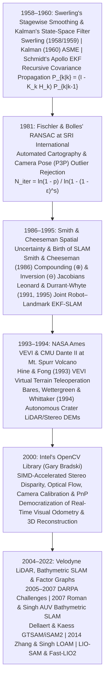

## 6.3 Historical Evolution (`gis-history` Context)

For most of the twentieth century, topographic and hydrographic surveying relied on a strict separation between **control networks** and **terrain measurement**. Geodesists first established a rigid skeleton of brass benchmarks, optical triangulation stations, or seafloor acoustic transponders; only after that reference frame was frozen could photogrammetrists, plane-table topographers, or hydrographers populate it with elevation points. If a platform entered an environment devoid of external control—an underground mine, a dense forest canopy, a volcanic crater choked with acidic steam, or the abyssal seafloor beyond acoustic transponder range—dead-reckoning errors accumulated without bound, warping the resulting Digital Elevation Model (DEM) beyond recognition.

Between **1958** and the **2020s**, six foundational breakthroughs across control theory, automated cartography, artificial intelligence, planetary field robotics, and open-source computer vision dismantled this barrier. By proving that the **3D geometry of the terrain itself can serve as the geodetic reference frame**, these milestones created Simultaneous Localization and Mapping (SLAM) and enabled centimeter-scale DEM generation in the most extreme GNSS-denied environments on Earth and beyond.



---

### 1958–1960: Peter Swerling, Rudolf E. Kalman, and Recursive State-Space Estimation

In **September 1958**, radar and information theorist **Peter Swerling** at the **RAND Corporation** circulated memorandum RM-2222 (published in **1959** in *The Journal of the Astronautical Sciences* as *"First Order Error Propagation in a Stagewise Smoothing Procedure for Satellite Observations"*), deriving a recursive minimum-variance sequential estimator that updated satellite orbit parameters and their error covariance matrix stage-by-stage as new tracking observations arrived. Almost simultaneously, in late **November 1958**, while returning by train to Baltimore from a visit to Princeton University, Hungarian-born electrical engineer and mathematician **Rudolf Emil Kálmán** (working at the Research Institute for Advanced Study, RIAS) independently conceived the general framework of replacing Norbert Wiener's frequency-domain integral filtering equations with a **recursive, time-domain state-space estimator** governed by linear dynamical systems with process noise. Published in **March 1960** in the *Transactions of the ASME—Journal of Basic Engineering* as *"A New Approach to Linear Filtering and Prediction Problems"* (and extended to continuous-time systems with **Richard S. Bucy** in 1961), the **Kalman filter** unified stochastic control, navigation, and dynamic geodesy. Almost immediately in **1960–1961**, **Stanley F. Schmidt** at **NASA Ames Research Center** linearized Kalman's equations around a reference trajectory to guide the Apollo spacecraft's circumlunar navigation, creating the **Extended Kalman Filter (EKF)**—known for decades in aerospace engineering as the *Kalman–Schmidt filter* (McGee & Schmidt, 1985).

For elevation mapping, Swerling and Kalman's enduring contribution was showing how to propagate and update the **full variance–covariance matrix** $\mathbf{P}_k = \text{Cov}(\mathbf{y}_k)$ of a dynamic system state $\mathbf{y}_k \in \mathbb{R}^n$ in real time without storing the entire past history of raw observations. Given a discrete-time state transition matrix $\mathbf{\Phi}_{k-1}$, process noise covariance $\mathbf{Q}_{k-1}$, measurement sensitivity Jacobian $\mathbf{H}_k$, and sensor measurement noise covariance $\mathbf{R}_k$, the Kalman filter cycles through a two-step **Predict–Update** recursion:

$$\hat{\mathbf{y}}_{k|k-1} = \mathbf{\Phi}_{k-1}\hat{\mathbf{y}}_{k-1|k-1}, \qquad \mathbf{P}_{k|k-1} = \mathbf{\Phi}_{k-1}\mathbf{P}_{k-1|k-1}\mathbf{\Phi}_{k-1}^\top + \mathbf{Q}_{k-1}$$

$$\mathbf{K}_k = \mathbf{P}_{k|k-1}\mathbf{H}_k^\top\left(\mathbf{H}_k\mathbf{P}_{k|k-1}\mathbf{H}_k^\top + \mathbf{R}_k\right)^{-1}, \qquad \mathbf{P}_{k|k} = \left(\mathbf{I} - \mathbf{K}_k\mathbf{H}_k\right)\mathbf{P}_{k|k-1}\left(\mathbf{I} - \mathbf{K}_k\mathbf{H}_k\right)^\top + \mathbf{K}_k\mathbf{R}_k\mathbf{K}_k^\top$$

where the final expression is **Bucy and Joseph's (1968) stabilized symmetric form**, which guarantees that $\mathbf{P}_{k|k}$ remains symmetric positive-definite even under finite floating-point precision.

When robotics researchers later stacked the 6-DoF platform pose $\mathbf{x}_r \in \mathbb{R}^6$ and $N$ 3D terrain landmarks $\mathbf{m}_1, \dots, \mathbf{m}_N \in \mathbb{R}^{3N}$ into a single augmented state vector $\mathbf{y} = [\mathbf{x}_r^\top, \mathbf{m}_1^\top, \dots, \mathbf{m}_N^\top]^\top \in \mathbb{R}^{6+3N}$, the partitioned covariance matrix took the block structure:

$$\mathbf{P} = \begin{bmatrix} \mathbf{P}_{rr} & \mathbf{P}_{rm_1} & \cdots & \mathbf{P}_{rm_N} \\ \mathbf{P}_{m_1 r} & \mathbf{P}_{m_1 m_1} & \cdots & \mathbf{P}_{m_1 m_N} \\ \vdots & \vdots & \ddots & \vdots \\ \mathbf{P}_{m_N r} & \mathbf{P}_{m_N m_1} & \cdots & \mathbf{P}_{m_N m_N} \end{bmatrix}$$

Kalman's covariance update equation revealed a profound physical truth: because every landmark $\mathbf{m}_i$ is initialized and observed from an uncertain robot pose $\mathbf{x}_r$, the off-diagonal cross-covariance blocks $\mathbf{P}_{rm_i}$ and $\mathbf{P}_{m_i m_j}$ become progressively correlated through the shared platform trajectory error. Conversely, maintaining those dense $3N \times 3N$ off-diagonal blocks required $\mathcal{O}(N^2)$ memory and $\mathcal{O}(N^2)$ floating-point operations per measurement update—a computational bottleneck that restricted classical EKF-SLAM to a few hundred sparse landmarks until twenty-first-century sparse factor graphs exploited the conditional independence of the inverse covariance (**information matrix** $\mathbf{\Lambda} = \mathbf{P}^{-1}$).

---

### 1981: Martin A. Fischler and Robert C. Bolles' RANSAC (Random Sample Consensus)

While the Kalman filter provided optimal estimation under zero-mean Gaussian noise, real-world 3D point clouds, stereo image pairs, and multibeam sonar swaths are routinely contaminated by **gross non-Gaussian outliers**: moving foliage, multipath reflections, water-column acoustic schools, and false feature correspondences across repetitive textures. In classical Gauss–Markov least-squares adjustment, the statistical **breakdown point is $0\%$**—even a single catastrophic blunder can pull an estimated 3D rigid transformation $(\mathbf{R}, \mathbf{t})$ or local DEM plane fit arbitrarily far from the true surface.

In **June 1981**, computer scientists **Martin A. Fischler** and **Robert C. Bolles** at **SRI International** (Menlo Park, California) solved this problem in their landmark *Communications of the ACM* paper, *"Random Sample Consensus: A Paradigm for Model Fitting with Applications to Image Analysis and Automated Cartography."* Notably, Fischler and Bolles invented **RANSAC** explicitly for a photogrammetric and cartographic task: the **Location Determination Problem (LDP)**, now universally called the **Perspective-3-Point (P3P)** problem—determining the 3D position and orientation of an aerial or terrestrial camera relative to a DEM reference frame from 2D-to-3D landmark correspondences riddled with matching blunders.

Instead of initializing a model with *all* available data and attempting to prune largest-residual points afterward (which fails because gross outliers smear their residuals across the inliers via the hat matrix $\mathbf{H}_{\text{hat}} = \mathbf{A}(\mathbf{A}^\top\mathbf{A})^{-1}\mathbf{A}^\top$), RANSAC reverses the paradigm:
1. **Minimal Hypothesis Generation:** Randomly draw the **smallest possible subset** of $s$ data points capable of uniquely determining the geometric model parameters (e.g., $s = 3$ non-collinear point pairs for a 6-DoF 3D rigid transformation or P3P camera pose; $s = 3$ points for a 3D terrain plane $ax + by + cz + d = 0$; $s = 5$ point pairs for calibrated stereo relative pose).
2. **Consensus Scoring:** Score the candidate model by counting how many points in the full dataset of size $M$ fall within a physically motivated inlier threshold $\tau$ (typically $\tau = 2\sigma_{\text{sensor}}$ to $3\sigma_{\text{sensor}}$).
3. **Probabilistic Stopping Criterion and Final Polish:** Repeat for $N_{\text{iter}}$ trials and re-estimate the model via weighted least squares using **all consensus inliers** of the winning hypothesis.

Fischler and Bolles derived the closed-form equation governing $N_{\text{iter}}$. Let $\epsilon \in [0, 1)$ denote the fraction of gross outliers in the dataset, so $w = 1 - \epsilon$ is the probability of selecting a true inlier on a single draw. Assuming $s \ll M$, the probability that all $s$ points in a single random draw are uncorrupted inliers is $(1 - \epsilon)^s$, and the probability that a draw is contaminated by at least one outlier is $1 - (1 - \epsilon)^s$. For $N_{\text{iter}}$ independent trials to succeed in drawing at least one pure all-inlier minimal sample with confidence probability $p$ (typically $p = 0.99$ or $0.999$), the failure probability over all $N_{\text{iter}}$ trials must satisfy:

$$1 - p = \left(1 - (1 - \epsilon)^s\right)^{N_{\text{iter}}} \quad \Longrightarrow \quad N_{\text{iter}} = \frac{\ln(1 - p)}{\ln\!\left(1 - (1 - \epsilon)^s\right)}$$

Crucially, **$N_{\text{iter}}$ depends only on the minimal sample size $s$ and the outlier ratio $\epsilon$—not on the total number of points $M$ in the point cloud** ($M = 10^3$ or $M = 10^7$), though evaluating the consensus set scales linearly as $\mathcal{O}(N_{\text{iter}} M)$. At a severe **$50\%$ outlier rate ($\epsilon = 0.50$)** and $p = 0.99$ confidence:
- For **3-point 3D rigid registration or P3P camera pose ($s = 3$):** $N_{\text{iter}} = \lceil \ln(0.01) / \ln(1 - 0.5^3) \rceil = \lceil -4.6052 / -0.13353 \rceil = \mathbf{35\text{ iterations}}$.
- For **5-point calibrated stereo Essential matrix ($s = 5$, Nistér, 2004):** $N_{\text{iter}} = \lceil \ln(0.01) / \ln(1 - 0.5^5) \rceil = \lceil -4.6052 / -0.03175 \rceil = \lceil 145.05 \rceil = \mathbf{146\text{ iterations}}$.
- For **8-point uncalibrated Fundamental matrix ($s = 8$):** $N_{\text{iter}} = \lceil \ln(0.01) / \ln(1 - 0.5^8) \rceil = \lceil -4.6052 / -0.003914 \rceil = \lceil 1176.62 \rceil = \mathbf{1177\text{ iterations}}$.

This exponential dependence on $s$ explained why minimizing the algebraic degree of geometric solvers ($s = 3$ vs. $s = 8$) is vital in real-time SLAM, and cemented RANSAC as the universal gatekeeper against false loop closures in terrestrial LiDAR, photogrammetric bundle adjustment, and multibeam bathymetric submap registration.

---

### 1986–1995: Smith & Cheeseman's Spatial Uncertainty Operators ($\oplus, \ominus$) and the Birth of SLAM

By the mid-1980s, mobile robotics pioneers recognized that navigating with a pre-surveyed map was a luxury rarely available in practice. Also working at **SRI International**, **Randall C. Smith** and **Peter Cheeseman** published their seminal paper *"On the Representation and Estimation of Spatial Uncertainty"* in the **Winter 1986** issue of *The International Journal of Robotics Research* (expanded with **Matthew Self** at the 1987 IEEE International Conference on Robotics and Automation as *"Estimating Uncertain Spatial Relationships in Robotics"*).

Smith and Cheeseman introduced a general algebra for propagating 6-DoF (or 3-DoF planar) coordinate frames and their first-order covariance matrices across an arbitrary graph of relative spatial observations. Representing the relative transformation from coordinate frame $i$ to coordinate frame $j$ by a mean parameter vector $\hat{\mathbf{x}}_{ij}$ (e.g., $\mathbf{x}_{ij} = [x_{ij}, y_{ij}, z_{ij}, \phi_{ij}, \theta_{ij}, \psi_{ij}]^\top$, or in planar 2D, $[x_{ij}, y_{ij}, \theta_{ij}]^\top$) and an associated $6 \times 6$ (or $3 \times 3$) covariance matrix $\mathbf{\Sigma}_{ij}$, they defined two fundamental non-commutative spatial operators:
1. **The Compounding (Head-to-Tail Composition) Operator ($\oplus$):** Given sequential relative transformations $\mathbf{x}_{ij}$ (from frame $i$ to $j$) and $\mathbf{x}_{jk}$ (from frame $j$ to $k$), the compounded transformation from $i$ to $k$ is $\mathbf{x}_{ik} = \mathbf{x}_{ij} \oplus \mathbf{x}_{jk}$. In 2D $(x, y, \theta)$ for concreteness, this nonlinear composition and its exact $3 \times 3$ first-order Taylor-series Jacobians $\mathbf{J}_{1\oplus} = \frac{\partial(\mathbf{x}_{ij}\oplus\mathbf{x}_{jk})}{\partial\mathbf{x}_{ij}}$ and $\mathbf{J}_{2\oplus} = \frac{\partial(\mathbf{x}_{ij}\oplus\mathbf{x}_{jk})}{\partial\mathbf{x}_{jk}}$ are:

$$\mathbf{x}_{ik} = \mathbf{x}_{ij} \oplus \mathbf{x}_{jk} = \begin{bmatrix} x_{ij} + x_{jk}\cos\theta_{ij} - y_{jk}\sin\theta_{ij} \\ y_{ij} + x_{jk}\sin\theta_{ij} + y_{jk}\cos\theta_{ij} \\ \theta_{ij} + \theta_{jk} \end{bmatrix}$$

$$\mathbf{J}_{1\oplus} = \begin{bmatrix} 1 & 0 & -(x_{jk}\sin\theta_{ij} + y_{jk}\cos\theta_{ij}) \\ 0 & 1 & x_{jk}\cos\theta_{ij} - y_{jk}\sin\theta_{ij} \\ 0 & 0 & 1 \end{bmatrix} = \begin{bmatrix} 1 & 0 & -(y_{ik} - y_{ij}) \\ 0 & 1 & x_{ik} - x_{ij} \\ 0 & 0 & 1 \end{bmatrix}, \qquad \mathbf{J}_{2\oplus} = \begin{bmatrix} \cos\theta_{ij} & -\sin\theta_{ij} & 0 \\ \sin\theta_{ij} & \cos\theta_{ij} & 0 \\ 0 & 0 & 1 \end{bmatrix}$$

$$\mathbf{\Sigma}_{ik} \approx \mathbf{J}_{1\oplus}\mathbf{\Sigma}_{ij}\mathbf{J}_{1\oplus}^\top + \mathbf{J}_{2\oplus}\mathbf{\Sigma}_{jk}\mathbf{J}_{2\oplus}^\top + \mathbf{J}_{1\oplus}\mathbf{\Sigma}_{ij,jk}\mathbf{J}_{2\oplus}^\top + \mathbf{J}_{2\oplus}\mathbf{\Sigma}_{jk,ij}\mathbf{J}_{1\oplus}^\top$$

2. **The Inversion (Reverse-Frame) Operator ($\ominus$):** Reversing the direction of a transformation yields $\mathbf{x}_{ji} = \ominus\mathbf{x}_{ij}$, with covariance $\mathbf{\Sigma}_{ji} \approx \mathbf{J}_{\ominus}\mathbf{\Sigma}_{ij}\mathbf{J}_{\ominus}^\top$:

$$\mathbf{x}_{ji} = \ominus\mathbf{x}_{ij} = \begin{bmatrix} -x_{ij}\cos\theta_{ij} - y_{ij}\sin\theta_{ij} \\ x_{ij}\sin\theta_{ij} - y_{ij}\cos\theta_{ij} \\ -\theta_{ij} \end{bmatrix}, \qquad \mathbf{J}_{\ominus} = \frac{\partial(\ominus\mathbf{x}_{ij})}{\partial\mathbf{x}_{ij}} = \begin{bmatrix} -\cos\theta_{ij} & -\sin\theta_{ij} & y_{ji} \\ \sin\theta_{ij} & -\cos\theta_{ij} & -x_{ji} \\ 0 & 0 & -1 \end{bmatrix}$$

Notice the rightmost column of $\mathbf{J}_{1\oplus}$, $[- (y_{ik} - y_{ij}),\; (x_{ik} - x_{ij}),\; 1]^\top$ (and its 3D vertical analog $r \sin\theta \cdot \delta\phi$ for pitch/roll in elevation): **angular uncertainty $\sigma_\theta^2$ in an early pose $i \to j$ is multiplied by the lever-arm distance $(\Delta x, \Delta y) = (x_{ik}-x_{ij}, y_{ik}-y_{ij})$ of all subsequent motion**, causing cross-track and vertical position variance to grow *quadratically* with distance traveled ($\sigma_\perp^2(L) \propto L^3 \text{ or } L^2 \sigma_{\theta,0}^2$). Smith, Self, and Cheeseman (1987) then showed that if the robot combines compounding ($\oplus$) and inversion ($\ominus$) with a Kalman filter update over the joint robot–landmark state vector, a **loop closure**—re-observing a landmark mapped near the start of the traverse—propagates backward through the off-diagonal cross-covariances $\mathbf{P}_{rm_i}$ to shrink the uncertainty of the entire map at once.

Building directly on Smith and Cheeseman's stochastic map, **John J. Leonard** and **Hugh F. Durrant-Whyte** at the University of Oxford published *"Simultaneous Map Building and Localization for an Autonomous Mobile Robot"* at IEEE/RSJ IROS in **1991** (using sonar ring tracks of geometric beacons), and at the **1995** International Symposium on Robotics Research (ISRR), **Hugh Durrant-Whyte, David Rye, and Eduardo Nebot** formally coined the acronym **SLAM (*Simultaneous Localization and Mapping*)**. Soon thereafter, **Csorba (1997)** and **Dissanayake, Newman, Clark, Durrant-Whyte, and Csorba (2001)** proved three foundational convergence theorems for linear-Gaussian EKF-SLAM: (1) the determinant of any submatrix of the map covariance $\mathbf{P}_{mm}$ decreases monotonically with every observation; (2) in the limit of infinite observations, the relative distances between all landmarks become perfectly known (the map becomes rigid); and (3) the irreducible absolute uncertainty of the map is lower-bounded by the initial pose covariance $\mathbf{P}_{rr,0}$ when the first landmark was initialized.

---

### 1993 NASA Ames VEVI and 1994 CMU *Dante II* in Mount Spurr Volcano, Alaska

While Oxford and SRI developed the estimation theory of stochastic mapping, **NASA Ames Research Center** and **Carnegie Mellon University's (CMU) Field Robotics Center** demonstrated how real-time 3D laser/stereo elevation mapping could guide autonomous robots through lethal, GNSS-denied planetary-analog terrain.

In **1993**, the Intelligent Mechanisms Group at **NASA Ames Research Center**—led by **Butler Hine**, **Terrence Fong**, **Phil Hontalas**, **Ed Bachelder**, and **Laurent Nguyen**—created **VEVI (*Virtual Environment Vehicle Interface*)** (Hine et al., 1994; Fong et al., 1995). Designed for high-latency, low-bandwidth planetary and subsea teleoperation where live video streaming was impossible or disorienting, VEVI ingested live telemetry and sparse 3D range scans from a remote vehicle and rendered an interactive, georeferenced **3D Virtual Terrain Model (DEM mesh)** inside a head-mounted stereoscopic display or Silicon Graphics (SGI) workstation. First field-tested in **October–November 1993** to pilot the NASA/MBRI *TROV* (*Telepresent Remotely Operated Vehicle*) beneath the sea ice of **McMurdo Sound, Antarctica** via satellite link from California, VEVI proved that operators could safely pilot a submerged vehicle by flying a virtual avatar inside a continuously updated bathymetric DEM.

In **July 1994**, NASA Ames teamed with CMU's Field Robotics Center—led by **John Bares**, **David Wettergreen**, **William "Red" Whittaker**, **Eric Krotkov**, **Martial Hebert**, and **Reid Simmons**—for one of the boldest field experiments in robotics history: deploying the autonomous rappelling robot ***Dante II*** into the active crater of **Mount Spurr Volcano** in the Aleutian Arc, $130\text{ km}$ west of Anchorage, Alaska (Bares & Wettergreen, 1999; Wettergreen et al., 1995). Mount Spurr had erupted violently three times in 1992, leaving a steep ($30^\circ\text{--}50^\circ$), $300\text{-m}$-deep crater floor covered in unstable wet volcanic ash, melting snowfields, meter-scale rockfall boulders, and toxic sulfur dioxide ($\text{SO}_2$) and hydrogen sulfide ($\text{H}_2\text{S}$) fumarole plumes. Inside the steep crater walls and dense acidic steam clouds, satellite line-of-sight was obstructed and visual visibility routinely collapsed to zero.

To descend this vertical hazard zone, *Dante II* was engineered as a $770\text{-kg}$, $3.0\text{-m}$-long, $3.7\text{-m}$-tall **eight-legged frame-walking rappelling robot** (arranged as an inner frame of four pantograph legs and an outer frame of four legs that alternately lifted, stroked up to $1.0\text{ m}$, and planted while paying out a $350\text{-m}$ armored electro-optical winch tether anchored at the crater rim). Because stepping blindly onto a boulder edge or hidden fumarole trench would capsize the vehicle, *Dante II* had to **build its own high-resolution Digital Elevation Models in real time** using a multi-sensor perception payload mounted atop its pan-tilt sensor mast:
- **Perceptron 3D Scanning Laser Rangefinder:** A continuous-wave (CW) amplitude-modulated gallium-arsenide ($\lambda \approx 820\text{ nm}$) phase-shift LiDAR scanning a $60^\circ\text{ azimuth} \times 50^\circ\text{ elevation}$ field of view ($256 \times 256\text{ pixels}$ at $2\text{ Hz}$) with a $40\text{-m}$ ambiguity interval and $\sim 2\text{--}5\text{ cm}$ range precision.
- **Trinocular Stereo Camera Rig + Inertial/Proprioceptive Dead Reckoning:** Three synchronized CCD cameras for dense stereo disparity, fused with dual-axis inclinometers (pitch/roll), a heading gyroscope, tether tension/payout encoders, and force-sensing pantograph leg potentiometers.

To avoid the severe shadowing and interpolation artifacts that occur when forward-projecting oblique spherical range images $(r(\alpha,\beta), \alpha, \beta)$ onto a horizontal grid $(x,y)$ across steep crater terrain, *Dante II* implemented **Martial Hebert, In So Kweon, and Takeo Kanade's locus method for DEM construction** (Hebert et al., 1989; Kweon & Kanade, 1992). Rather than scattering noisy 3D points into discrete grid bins, the locus algorithm treats each vertical line $\mathcal{L}(x, y) = \{[x, y, z]^\top : z \in \mathbb{R}\}$ at a target DEM grid node $(x, y)$ as a **1D curve (locus) in the sensor's spherical image space** $(\alpha(z), \beta(z), r_{\text{locus}}(z)) = \mathbf{T}_{\text{sensor}}^{\text{world}\,-1}([x, y, z]^\top)$, and solves for the exact elevation $z^*(x,y)$ where that vertical locus intersects the continuous range image surface $r_{\text{meas}}(\alpha, \beta)$:

$$z^*(x, y) = \text{root}_z \left[ r_{\text{locus}}(x, y, z) - r_{\text{meas}}\!\left(\alpha(x,y,z),\, \beta(x,y,z)\right) = 0 \right], \qquad \hat{z}_{\text{fused}}(x,y) = \frac{\sum_{m} \sigma_{z,m}^{-2}(x,y)\,\hat{z}_m(x,y)}{\sum_{m} \sigma_{z,m}^{-2}(x,y)}$$

where multiple overlapping scans $m$ (and proprioceptive leg-contact elevations) are fused at each grid cell $(x,y)$ via inverse-variance Kalman weighting $\sigma_{z,m}^{-2}(x,y)$ propagated from range noise $\sigma_r^2$ and inclinometer pitch/roll covariance $\sigma_{\phi,\theta}^2$. Using this pipeline, *Dante II* maintained two nested **Digital Elevation Maps**:
1. **A High-Resolution Local Locomotion DEM ($2\text{--}5\text{ cm}$ grid spacing over a $5\text{ m} \times 5\text{ m}$ patch directly beneath and ahead of the robot's eight legs):** As the inner or outer leg frame prepared to step, *Dante II*'s onboard planner evaluated the local DEM's elevation $z(x,y)$, surface slope $\|\nabla z\|$, roughness residual, and vertical clearance for all four impending footfalls, automatically adjusting leg stroke length and vertical extension to step smoothly over $1\text{-m}$ boulders. Furthermore, as each foot made physical contact with the ground, the leg's vertical contact coordinate provided a **proprioceptive ground-truth elevation constraint** that corrected laser/inclinometer vertical bias.
2. **A Regional Navigation Terrain Mesh ($15\text{--}25\text{ cm}$ grid spacing out to $20\text{--}30\text{ m}$):** Transmitted over an ACTS satellite link to operators in Anchorage, NASA Ames, and Washington, D.C., where **VEVI** merged consecutive scans into a growing 3D virtual crater model. Over **five days in July 1994**, *Dante II* descended more than $160\text{ m}$ down the steep crater wall—navigating autonomously for roughly $25\%$ of the traverse and under supervisory VEVI terrain-model guidance for $75\%$—successfully reaching the crater floor and sampling volcanic fumarole gases before being recovered after tipping in soft, undercut mud during its ascent. *Dante II* and VEVI proved that real-time LiDAR/stereo DEM generation could replace human surveyors in the most hazardous terrestrial and planetary environments.

---

### 2000: Intel's Release of OpenCV (Gary Bradski) and the 2004–2022 Modern SLAM Era

Prior to the year 2000, every university robotics lab and photogrammetry group wrote its own proprietary, incompatible C or Fortran routines for camera calibration, stereo correspondence, feature tracking, and RANSAC pose estimation. In **June 2000** at the IEEE Conference on Computer Vision and Pattern Recognition (CVPR), **Gary Bradski** at **Intel Corporation** (joined by **Vadim Pisarevsky** and Intel's Russia software team in Nizhny Novgorod) publicly released **OpenCV (*Open Source Computer Vision Library*)** under an open-source BSD license (Bradski, 2000; Bradski & Kaehler, 2008).

OpenCV revolutionized 3D spatial mapping by placing hardware-accelerated, peer-reviewed implementations of the entire geometric vision pipeline into the hands of every researcher and engineer:
- **Intrinsic & Extrinsic Camera Calibration (`calibrateCamera`, Zhang, 2000):** Automated estimation of focal lengths $(f_x, f_y)$, principal point $(c_x, c_y)$, and radial/tangential lens distortion $(k_1, k_2, k_3, p_1, p_2)$ from planar checkerboards—the prerequisite for metric Visual Odometry and photogrammetric DEMs.
- **Real-Time Optical Flow and Feature Tracking (`calcOpticalFlowPyrLK`, Bouguet, 2000):** Pyramidal Lucas–Kanade feature tracking together with corner/blob detectors (`GoodFeaturesToTrack`, `ORB`, `SIFT`) that feed Visual-Inertial Odometry (VIO) front-ends.
- **Dense Stereo Disparity to 3D Point Clouds (`StereoBM`, `StereoSGBM`, Hirschmüller, 2008):** Real-time Block Matching and Semi-Global Block Matching that convert rectified stereo pairs into dense disparity maps $d_{\text{disp}}(u,v)$ and metric depth $Z = f B / d_{\text{disp}}$ via `reprojectImageTo3D`.
- **RANSAC-Guarded Geometric Solvers (`solvePnPRansac`, `findEssentialMat`, `findFundamentalMat`):** Combining Fischler and Bolles' 1981 RANSAC loop directly with P3P/EPnP and 5-point solvers to compute outlier-free 6-DoF camera trajectories.

With OpenCV providing the open-source foundation, the following two decades witnessed an explosion of 3D SLAM across both **terrestrial** and **marine** elevation mapping:
1. **2004–2007 DARPA Grand and Urban Challenges and the Velodyne Spinning LiDAR:** During the 2004 and 2005 DARPA Grand Challenges in the Mojave Desert, **Sebastian Thrun** and **Michael Montemerlo's** Stanford Racing Team (*Stanley*, 2005 winner; Thrun et al., 2006) fused GPS/INS with roof-mounted SICK laser scanners using probabilistic terrain grids and **FastSLAM** (Rao-Blackwellized particle filters; Montemerlo et al., 2002) to classify drivable elevation surfaces at highway speeds. Simultaneously, competitor **David Hall** invented the **64-beam $360^\circ$ spinning multi-beam LiDAR (Velodyne HDL-64E)**, which dominated the 2007 DARPA Urban Challenge (won by CMU's *Boss* and Stanford's *Junior*) and became the ubiquitous 3D sensor for mobile mapping.
2. **2007 Bathymetric Terrain-Aided SLAM on Deep-Sea AUVs:** Extending SLAM into the deep ocean, **Chris Roman** and **Hanumant Singh** at Woods Hole Oceanographic Institution (WHOI) published *"A Self-Consistent Bathymetric Mapping Algorithm"* (2007), applying **submap-based Bathymetric 3D Point-Cloud SLAM** to multibeam echosounder data collected by the ***ABE* (*Autonomous Benthic Explorer*)** AUV over hydrothermal vent fields at $>2000\text{ m}$ depth. By breaking the AUV's trajectory into locally rigid INS/DVL multibeam submaps and registering overlapping swaths via 3D ICP and pose-graph optimization, Roman and Singh eliminated meter-scale dead-reckoning cross-track step artifacts without relying on seafloor LBL transponders (later extended to Gaussian Process bathymetric SLAM on Kongsberg *HUGIN* AUVs by **Barkby et al., 2012** and **Torroba et al., 2020**).
3. **2006–2022 Sparse Factor Graphs (`GTSAM`) and Tightly Coupled LiDAR-Inertial Odometry (`LOAM`, `LIO-SAM`, `Fast-LIO2`):** Recognizing that the full SLAM problem is naturally a sparse bipartite **factor graph** over all historical robot poses $\mathcal{X} = \{\mathbf{x}_0, \dots, \mathbf{x}_T\}$ rather than a Markovian filter over only the current pose, **Frank Dellaert** and **Michael Kaess** introduced **Square Root SAM (`√SAM`, 2006)** and **Incremental Smoothing and Mapping (`iSAM2`, 2012)** in the **`GTSAM`** library (alongside **`g2o`** by Kümmerle et al., 2011, **`Ceres Solver`**, and Google's **`Cartographer`** by Hess et al., 2016). In **2014**, CMU's **Ji Zhang** and **Sanjiv Singh** introduced **LOAM (*LiDAR Odometry and Mapping in Real-Time*)**, which decoupled high-frequency ($10\text{--}20\text{ Hz}$) scan-to-scan edge/planar motion estimation (including continuous within-sweep motion undistortion) from low-frequency ($1\text{--}2\text{ Hz}$) scan-to-map registration. Coupled with high-rate IMU preintegration (Forster et al., 2017) in **LIO-SAM** (Shan et al., 2020) and direct point-to-plane iterated Kalman filtering on `ikd-Tree` structures in **Fast-LIO2** (Xu et al., 2022), modern handheld, backpack, and UAV SLAM systems now map forests, caves, mines, and urban canyons at centimeter-level local relative accuracy.

| Year | Historical Milestone & Pioneers | Primary Mathematical / Algorithmic Innovation | Direct Impact on Terrestrial & Bathymetric DEMs |
| :--- | :--- | :--- | :--- |
| **1958–1960** | **Stagewise Smoothing, Kalman Filter & Apollo EKF** (P. Swerling, 1958/1959; R. E. Kalman, 1960; S. F. Schmidt, 1960–1961) | Recursive time-domain state-space prediction and Joseph-form covariance update $\mathbf{P}_{k|k}$ | Enables real-time INS/GNSS/DVL trajectory fusion and joint robot–landmark cross-covariance tracking ($\mathbf{P}_{rm}$). |
| **1981** | **RANSAC** (M. A. Fischler & R. C. Bolles, SRI International) | Minimal-sample consensus outlier rejection: $N_{\text{iter}} = \frac{\ln(1-p)}{\ln(1-(1-\epsilon)^s)}$ | Rejects gross feature, multipath, and false loop-closure blunders in P3P, stereo matching, and 3D ICP registration. |
| **1986–1995** | **Spatial Uncertainty ($\oplus, \ominus$) & EKF-SLAM** (Smith & Cheeseman, 1986; Leonard & Durrant-Whyte, 1991, 1995) | First-order Jacobian compounding ($\mathbf{J}_{1\oplus}, \mathbf{J}_{2\oplus}$) and inversion ($\mathbf{J}_{\ominus}$) of uncertain frames; loop-closure covariance collapse | Proves that re-observing terrain landmarks bounds dead-reckoning drift and enforces global map consistency. |
| **1993–1994** | **NASA Ames VEVI & CMU *Dante II*** (B. Hine, T. Fong; J. Bares, D. Wettergreen, W. Whittaker) | Real-time 3D laser/stereo locus elevation gridding + virtual-environment supervisory teleoperation | First autonomous 3D DEM footfall planning and live remote virtual-terrain navigation inside an active volcanic crater (Mt. Spurr) and under Antarctic ice. |
| **2000** | **Intel OpenCV Library** (G. Bradski, V. Pisarevsky) | Open-source SIMD-optimized camera calibration, optical flow, `StereoSGBM`, and `solvePnPRansac` | Democratizes real-time Visual Odometry, dense stereo DEM extraction, and structure-from-motion across science and industry. |
| **2006–2022** | **Bathymetric SLAM, Factor Graphs & LIO** (Dellaert & Kaess `GTSAM`; Roman & Singh, 2007; Zhang & Singh `LOAM`, 2014; `LIO-SAM`; `Fast-LIO2`) | Sparse Cholesky/Bayes-tree MAP optimization, multibeam submap ICP, and IMU-preintegrated point-to-plane LiDAR odometry | Enables survey-grade GNSS-denied DEM generation from backpacks, drones, subterranean robots, and deep-sea AUVs. |

---

### Worked Numerical Example: Smith & Cheeseman Compounding Drift vs. Loop-Closure Collapse

To see how Smith and Cheeseman's (1986) compounding operator ($\oplus$) and Swerling and Kalman's (1958–1960) covariance update govern vertical DEM error in a GNSS-denied tunnel or seafloor AUV survey, consider a 1D-vertical / 2D-profile traverse along $(x, z)$ with pitch angle $\theta$. A mobile scanner (or AUV without pressure aiding) executes $K = 100$ sequential odometry steps of horizontal length $\Delta x = 5.0\text{ m}$ each (total traverse length $L = 500\text{ m}$), starting from a fixed benchmark at $\mathbf{x}_0 = [0, 0, 0]^\top$ ($\mathbf{\Sigma}_0 = \mathbf{0}$). Each relative step $\mathbf{u}_k = [\Delta x, \Delta z, \Delta\theta]^\top = [5.0\text{ m}, 0\text{ m}, 0\text{ rad}]^\top$ has independent step measurement noise $\mathbf{\Sigma}_u = \text{diag}(\sigma_{\Delta x}^2, \sigma_{\Delta z}^2, \sigma_{\Delta\theta}^2)$ with $\sigma_{\Delta z} = 0.005\text{ m}$ ($5\text{ mm}$) and pitch step noise $\sigma_{\Delta\theta} = 1.0\text{ mrad}$ ($\approx 0.057^\circ$).

1. **Open-Loop Compounding ($\oplus$) Over $K = 100$ Steps ($L = 500\text{ m}$):**
   Applying Smith and Cheeseman's vertical-plane compounding Jacobian $\mathbf{J}_{1\oplus}$ across $K$ steps, a pitch perturbation $\delta\theta_j$ incurred at step $j$ levers across the remaining horizontal distance $(K - j)\Delta x$, inducing a terminal vertical elevation error $\delta z_K = \sum_{j=1}^K \delta z_j + \sum_{j=1}^K (K - j)\Delta x \, \delta\theta_j$. Summing the variances yields the open-loop terminal vertical variance $\sigma_{z,K}^2$ and pitch variance $\sigma_{\theta,K}^2$:

   $$\sigma_{\theta, K}^2 = K \sigma_{\Delta\theta}^2 = 100 \times (10^{-3}\text{ rad})^2 = 1.0 \times 10^{-4}\text{ rad}^2 \quad (\sigma_{\theta, K} = 10.0\text{ mrad} \approx 0.573^\circ)$$

   $$\sigma_{z, K}^2 = K \sigma_{\Delta z}^2 + \Delta x^2 \sigma_{\Delta\theta}^2 \sum_{j=1}^{K} (K - j)^2 = K\sigma_{\Delta z}^2 + \Delta x^2 \sigma_{\Delta\theta}^2 \frac{(K-1)K(2K-1)}{6}$$

   Substituting $K = 100$, $\Delta x = 5.0\text{ m}$, $\sigma_{\Delta z} = 0.005\text{ m}$, and $\sigma_{\Delta\theta} = 10^{-3}\text{ rad}$:

   $$\sigma_{z, 100}^2 = 100(2.5 \times 10^{-5}\text{ m}^2) + (25\text{ m}^2)(10^{-6}\text{ rad}^2)\frac{99 \times 100 \times 199}{6} = 0.0025 + 8.20875 = 8.21125\text{ m}^2 \quad \Longrightarrow \quad \sigma_{z, 100} = \mathbf{2.866\text{ m}}$$

   Notice that pure translational vertical noise contributes only $\sqrt{0.0025\text{ m}^2} = 0.050\text{ m}$ ($5\text{ cm}$), whereas **compounded pitch uncertainty through the $\mathbf{J}_{1\oplus}$ lever arm contributes $2.865\text{ m}$**—over $99.9\%$ of the total vertical variance! Simultaneously, at the midpoint of the traverse ($k = 50$, $x = 250\text{ m}$), the open-loop vertical variance is $\sigma_{z, 50}^2 = 50(2.5\times 10^{-5}) + 25\times 10^{-6}\frac{49\times 50\times 99}{6} = 0.00125 + 1.010625 = 1.0119\text{ m}^2$ ($\sigma_{z, 50} = \mathbf{1.006\text{ m}}$), and the midpoint elevation is strongly cross-correlated with the endpoint via $P_{z_{50}, z_{100}} = 50\sigma_{\Delta z}^2 + \Delta x^2 \sigma_{\Delta\theta}^2 \sum_{j=1}^{50}(50-j)(100-j) = 0.00125 + 25\times 10^{-6}(101{,}675) = \mathbf{2.5431\text{ m}^2}$ (correlation coefficient $\rho_{50,100} = 2.5431 / \sqrt{1.0119 \times 8.2113} = \mathbf{0.882}$).

2. **Kalman Loop-Closure Update at $x = 500\text{ m}$:**
   Suppose at step $K = 100$ the scanner closes a loop onto a surveyed benchmark (or returns to $\mathbf{x}_0$ along a rigid level reference) with measurement residual $r_z = z_{\text{obs}} - \hat{z}_{100}$ and measurement noise $\sigma_{\text{loop}} = 0.020\text{ m}$ ($2\text{ cm}$). Applying Kalman's covariance update equation to the midpoint elevation $z_{50}$ using the scalar cross-covariance $P_{z_{50}, z_{100}} = 2.5431\text{ m}^2$:

   $$\sigma_{z, 50\text{ (post-loop)}}^2 = \sigma_{z, 50}^2 - \frac{P_{z_{50}, z_{100}}^2}{\sigma_{z, 100}^2 + \sigma_{\text{loop}}^2} = 1.0119 - \frac{(2.5431)^2}{8.2113 + 0.0004} = 1.0119 - 0.7876 = 0.2243\text{ m}^2 \quad \Longrightarrow \quad \sigma_{z, 50\text{ (post-loop)}} = \mathbf{0.474\text{ m}}$$

   If the loop closure also observes the relative pitch angle ($\sigma_{\theta,\text{loop}} = 0.5\text{ mrad}$) in a $2 \times 2$ block Kalman update over $[z_{100}, \theta_{100}]^\top$ (leveraging the elevation–pitch cross-covariances $P_{z_{100},\theta_{100}} = 0.02475\text{ m}\cdot\text{rad}$ and $P_{z_{50},\theta_{100}} = 0.006125\text{ m}\cdot\text{rad}$), the midpoint vertical variance collapses further to $\sigma_{z, 50\text{ (full loop)}}^2 = 1.0119 - 0.8800 = 0.1318\text{ m}^2$, or $\sigma_{z, 50\text{ (full loop)}} = \mathbf{0.363\text{ m}}$—cutting the mid-tunnel DEM vertical variance by nearly a factor of eight without ever placing a control point at $x = 250\text{ m}$.

```python
import numpy as np

# 1. Fischler & Bolles (1981) RANSAC minimum iteration formula
def ransac_iterations(p: float, eps: float, s: int) -> int:
    return int(np.ceil(np.log(1.0 - p) / np.log(1.0 - (1.0 - eps) ** s)))

for s_pts, label in [(3, "P3P / 3D Rigid (s=3)"), (5, "Essential Mat (s=5)"), (8, "Fundamental Mat (s=8)")]:
    print(f"{label}: N_iter = {ransac_iterations(p=0.99, eps=0.50, s=s_pts)}")

# 2. Smith & Cheeseman (1986) Compounding (⊕) & Kalman (1960) Loop-Closure Collapse
K, dx, sig_dz, sig_dth = 100, 5.0, 0.005, 1e-3
# State vector y = [z_1, theta_1, z_2, theta_2, ..., z_K, theta_K]^T of dimension 2K
P = np.zeros((2 * K, 2 * K))
Q_step = np.diag([sig_dz**2, sig_dth**2])
J1 = np.array([[1.0, dx], [0.0, 1.0]])

# Initialize step 1 from fixed benchmark x_0 = 0 (Sigma_0 = 0)
P[0:2, 0:2] = Q_step
for k in range(1, K):
    # Propagate step k -> k+1 via Smith & Cheeseman Jacobian J_{1\oplus}
    idx_prev, idx_curr = slice(2 * (k - 1), 2 * k), slice(2 * k, 2 * (k + 1))
    P[idx_curr, :2*k] = J1 @ P[idx_prev, :2*k]
    P[:2*k, idx_curr] = P[idx_curr, :2*k].T
    P[idx_curr, idx_curr] = J1 @ P[idx_prev, idx_prev] @ J1.T + Q_step

sig_z50_open = np.sqrt(P[2 * 49, 2 * 49])
sig_z100_open = np.sqrt(P[2 * 99, 2 * 99])

# Scalar z-only loop closure at step K=100 (sigma_loop = 0.02 m) using Joseph form
I_mat = np.eye(2 * K)
H_z = np.zeros((1, 2 * K)); H_z[0, 2 * 99] = 1.0
R_z = np.array([[0.020**2]])
K_gain_z = P @ H_z.T @ np.linalg.inv(H_z @ P @ H_z.T + R_z)
IKH_z = I_mat - K_gain_z @ H_z
P_post_z = IKH_z @ P @ IKH_z.T + K_gain_z @ R_z @ K_gain_z.T

# Full [z, theta] loop closure at step K=100 (sigma_z = 0.02 m, sigma_theta = 0.5 mrad)
H_full = np.zeros((2, 2 * K)); H_full[:, 2 * 99 : 2 * 100] = np.eye(2)
R_full = np.diag([0.020**2, (0.5e-3)**2])
K_gain_full = P @ H_full.T @ np.linalg.inv(H_full @ P @ H_full.T + R_full)
IKH_full = I_mat - K_gain_full @ H_full
P_post_full = IKH_full @ P @ IKH_full.T + K_gain_full @ R_full @ K_gain_full.T

print(f"Open-loop:   sigma_z(250m) = {sig_z50_open:.3f} m, sigma_z(500m) = {sig_z100_open:.3f} m")
print(f"Post z-loop: sigma_z(250m) = {np.sqrt(P_post_z[2*49, 2*49]):.3f} m")
print(f"Post 2DoF:   sigma_z(250m) = {np.sqrt(P_post_full[2*49, 2*49]):.3f} m")
```

> [!IMPORTANT]
> **Historical Synthesis for DEM Practitioners:** Every modern mobile mapping workflow directly executes the algorithms forged between 1958 and 2000: **RANSAC (1981)** filters outliers out of **OpenCV (2000)** visual features and **Perceptron/*Dante II*-heritage (1994)** 3D LiDAR point clouds; **Smith & Cheeseman's (1986)** $\text{SE}(3)$ compounding Jacobians propagate relative pose uncertainty along the trajectory; and **Swerling and Kalman's (1958–1960)** recursive covariance update—generalized into sparse factor graphs—propagates loop closures backward through the trajectory to pull warped terrestrial and bathymetric DEMs back into geometric alignment.
