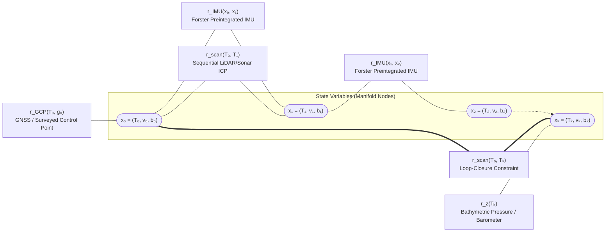

## 6.4 Mathematical Foundations

Simultaneous Localization and Mapping (SLAM) transforms sequential, body-frame range measurements—from terrestrial mobile LiDAR, uncrewed aerial vehicles (UAVs), or subsea autonomous underwater vehicle (AUV) multibeam sonars—into a globally consistent Digital Elevation Model (DEM) or Digital Bathymetric Model (DBM). Because 3D rigid-body rotations and transformations do not form a vector space, applying standard Euclidean least squares to Euler angles introduces gimbal lock, parameterization singularities, and bias under large angular uncertainties. Modern SLAM back-ends resolve this by formulating state estimation directly on matrix Lie groups and solving a sparse Maximum A Posteriori (MAP) factor-graph optimization problem.

---

### 6.4.1 Lie Group $\text{SO}(3)$ and $\text{SE}(3)$ Perturbation Calculus

#### Matrix Lie Groups and Lie Algebras

The 3D orientation of a mobile mapping sensor at epoch $i$ is represented by a rotation matrix belonging to the Special Orthogonal group $\text{SO}(3)$, and its full 6-degree-of-freedom (6-DOF) rigid-body pose is represented by a transformation matrix belonging to the Special Euclidean group $\text{SE}(3)$:

$$\text{SO}(3) = \left\{ \mathbf{R} \in \mathbb{R}^{3\times 3} \;\middle|\; \mathbf{R}^T\mathbf{R} = \mathbf{I}_3, \;\det(\mathbf{R}) = +1 \right\}$$

$$\text{SE}(3) = \left\{ \mathbf{T} = \begin{bmatrix} \mathbf{R} & \mathbf{t} \\ \mathbf{0}^T & 1 \end{bmatrix} \in \mathbb{R}^{4\times 4} \;\middle|\; \mathbf{R} \in \text{SO}(3), \;\mathbf{t} \in \mathbb{R}^3 \right\}$$

where $\mathbf{R}$ rotates coordinates from the moving sensor body frame $\mathcal{B}$ to the fixed world (mapping) frame $\mathcal{W}$, and $\mathbf{t} = [x, y, z]^T \in \mathbb{R}^3$ (in $\text{m}$) is the position of the sensor origin in $\mathcal{W}$. Throughout this section, we adopt a right-handed world coordinate frame where $z$ denotes positive-up orthometric or ellipsoidal elevation (related to positive-down bathymetric depth $d$ via $z = -d$).

Because $\text{SO}(3)$ and $\text{SE}(3)$ are smooth non-linear manifolds rather than Euclidean spaces ($\mathbf{T}_1 + \mathbf{T}_2 \notin \text{SE}(3)$), differential calculus and Gauss-Newton optimization are performed in their tangent spaces at the identity—the Lie algebras $\mathfrak{so}(3)$ and $\mathfrak{se}(3)$. A minimal 6-DOF tangent vector (or *twist*) is parameterized as:

$$\boldsymbol{\xi} = \begin{bmatrix} \boldsymbol{\phi} \\ \boldsymbol{\rho} \end{bmatrix} \in \mathbb{R}^6, \quad \boldsymbol{\phi} = \theta\mathbf{u} \in \mathbb{R}^3 \text{ (rad)}, \quad \boldsymbol{\rho} \in \mathbb{R}^3 \text{ (m)}$$

where $\boldsymbol{\phi}$ is the axis-angle rotation vector of magnitude $\theta = \|\boldsymbol{\phi}\|_2$ around unit axis $\mathbf{u} \in \mathbb{S}^2$, and $\boldsymbol{\rho}$ is the translational tangent component. The linear **hat operator** $(\cdot)^\wedge$ maps tangent vectors in $\mathbb{R}^3$ and $\mathbb{R}^6$ to skew-symmetric matrices in $\mathfrak{so}(3)$ and $4\times 4$ matrices in $\mathfrak{se}(3)$, while the inverse **vee operator** $(\cdot)^\vee$ extracts the vector coordinates:

$$[\boldsymbol{\phi}]_\times \equiv \boldsymbol{\phi}^\wedge = \begin{bmatrix} 0 & -\phi_z & \phi_y \\ \phi_z & 0 & -\phi_x \\ -\phi_y & \phi_x & 0 \end{bmatrix} \in \mathfrak{so}(3), \qquad \boldsymbol{\xi}^\wedge = \begin{bmatrix} [\boldsymbol{\phi}]_\times & \boldsymbol{\rho} \\ \mathbf{0}^T & 0 \end{bmatrix} \in \mathfrak{se}(3)$$

$$\left([\boldsymbol{\phi}]_\times\right)^\vee = \boldsymbol{\phi} \in \mathbb{R}^3, \qquad \left(\boldsymbol{\xi}^\wedge\right)^\vee = \boldsymbol{\xi} \in \mathbb{R}^6$$

For any two vectors $\mathbf{a}, \mathbf{b} \in \mathbb{R}^3$, the skew-symmetric matrix satisfies the cross-product identity $[\mathbf{a}]_\times \mathbf{b} = \mathbf{a} \times \mathbf{b} = -[\mathbf{b}]_\times \mathbf{a}$.

#### Exponential and Logarithmic Maps

The **exponential map** $\exp : \mathfrak{se}(3) \to \text{SE}(3)$ wraps a tangent twist $\boldsymbol{\xi}^\wedge$ onto the non-linear manifold via the matrix exponential series. For $\mathfrak{so}(3)$, grouping powers of $[\boldsymbol{\phi}]_\times$ using $[\boldsymbol{\phi}]_\times^3 = -\theta^2[\boldsymbol{\phi}]_\times$ yields **Rodrigues' rotation formula**:

$$\mathbf{R} = \exp\left([\boldsymbol{\phi}]_\times\right) = \mathbf{I}_3 + \frac{\sin\theta}{\theta}[\boldsymbol{\phi}]_\times + \frac{1 - \cos\theta}{\theta^2}[\boldsymbol{\phi}]_\times^2$$

For $\mathfrak{se}(3)$, the exponential map couples rotation and translation through the **left Jacobian of $\text{SO}(3)$**, denoted $\mathbf{J}_l(\boldsymbol{\phi}) \in \mathbb{R}^{3\times 3}$:

$$\exp\left(\boldsymbol{\xi}^\wedge\right) = \begin{bmatrix} \exp([\boldsymbol{\phi}]_\times) & \mathbf{J}_l(\boldsymbol{\phi})\boldsymbol{\rho} \\ \mathbf{0}^T & 1 \end{bmatrix}, \qquad \mathbf{J}_l(\boldsymbol{\phi}) = \mathbf{I}_3 + \frac{1 - \cos\theta}{\theta^2}[\boldsymbol{\phi}]_\times + \frac{\theta - \sin\theta}{\theta^3}[\boldsymbol{\phi}]_\times^2$$

In the small-angle limit ($\theta \to 0$), first-order linearization gives $\exp([\boldsymbol{\phi}]_\times) \approx \mathbf{I}_3 + [\boldsymbol{\phi}]_\times$ and $\mathbf{J}_l(\boldsymbol{\phi}) \approx \mathbf{I}_3 + \frac{1}{2}[\boldsymbol{\phi}]_\times$. In production Lie-group libraries (e.g., `Sophus`, `GTSAM`), when $\theta < 10^{-4}\text{ rad}$, the trigonometric ratios are evaluated via truncated Taylor series—$\frac{\sin\theta}{\theta} \approx 1 - \frac{\theta^2}{6}$, $\frac{1-\cos\theta}{\theta^2} \approx \frac{1}{2} - \frac{\theta^2}{24}$, and $\frac{\theta-\sin\theta}{\theta^3} \approx \frac{1}{6} - \frac{\theta^2}{120}$—to prevent $0/0$ floating-point cancellation.

Conversely, the **logarithmic map** $\log : \text{SE}(3) \to \mathfrak{se}(3)$ inverts this mapping to express a relative rigid-body transformation as a 6-vector residual in tangent space:

$$\boldsymbol{\xi} = \log(\mathbf{T})^\vee = \begin{bmatrix} \boldsymbol{\phi} \\ \mathbf{J}_l^{-1}(\boldsymbol{\phi})\mathbf{t} \end{bmatrix}, \qquad \theta = \arccos\left(\frac{\text{tr}(\mathbf{R}) - 1}{2}\right), \qquad [\boldsymbol{\phi}]_\times = \frac{\theta}{2\sin\theta}\left(\mathbf{R} - \mathbf{R}^T\right)$$

where the inverse left Jacobian is $\mathbf{J}_l^{-1}(\boldsymbol{\phi}) = \mathbf{I}_3 - \frac{1}{2}[\boldsymbol{\phi}]_\times + \left(\frac{1}{\theta^2} - \frac{1 + \cos\theta}{2\theta\sin\theta}\right)[\boldsymbol{\phi}]_\times^2$ (with small-angle series $\frac{1}{\theta^2} - \frac{1+\cos\theta}{2\theta\sin\theta} \approx \frac{1}{12} + \frac{\theta^2}{720}$).

#### Manifold Retraction ($\boxplus$ and $\boxminus$ Operators)

To optimize a pose $\mathbf{T} \in \text{SE}(3)$ iteratively without violating orthogonality constraints ($\mathbf{R}^T\mathbf{R} = \mathbf{I}_3$), we define a local perturbation $\delta\boldsymbol{\xi} = [\delta\boldsymbol{\phi}^T, \delta\boldsymbol{\rho}^T]^T \in \mathbb{R}^6$ and apply the **right-perturbation retraction** ($\boxplus$) and its inverse ($\boxminus$):

$$\mathbf{T} \boxplus \delta\boldsymbol{\xi} \triangleq \mathbf{T}\exp\left(\delta\boldsymbol{\xi}^\wedge\right), \qquad \mathbf{T}_2 \boxminus \mathbf{T}_1 \triangleq \log\left(\mathbf{T}_1^{-1}\mathbf{T}_2\right)^\vee \in \mathbb{R}^6$$

Under a right perturbation $\mathbf{T}\exp(\delta\boldsymbol{\xi}^\wedge)$, the perturbation $\delta\boldsymbol{\xi}$ is expressed in the local body frame $\mathcal{B}$, directly matching the physical measurement axes of body-mounted IMU gyroscopes, accelerometers, LiDARs, and multibeam sonars.

---

### 6.4.2 Factor-Graph Maximum A Posteriori (MAP) Optimization

#### Bipartite Factor-Graph Formulation

Let $\mathcal{X} = \{\mathbf{x}_i\}_{i=0}^M$ denote the trajectory of discrete sensor states at keyframe epochs $t_i$, where each state $\mathbf{x}_i = (\mathbf{T}_i, \mathbf{v}_i, \mathbf{b}_i^g, \mathbf{b}_i^a)$ comprises the 6-DOF pose $\mathbf{T}_i \in \text{SE}(3)$, linear velocity $\mathbf{v}_i \in \mathbb{R}^3$ ($\text{m s}^{-1}$), gyroscope bias $\mathbf{b}_i^g \in \mathbb{R}^3$ ($\text{rad s}^{-1}$), and accelerometer bias $\mathbf{b}_i^a \in \mathbb{R}^3$ ($\text{m s}^{-2}$). Let $\mathcal{L} = \{\boldsymbol{\ell}_m\}_{m=1}^{N_L}$ denote distinct 3D geometric landmarks or planar patches when explicitly parameterized.

Assuming conditional independence of sensor measurements corrupted by zero-mean Gaussian noise, taking the negative log-posterior of the joint probability distribution $P(\mathcal{X}, \mathcal{L} \mid \mathcal{Z})$ yields the **non-linear least-squares factor-graph objective**:

$$\mathcal{X}^*, \mathcal{L}^* = \arg\min_{\mathcal{X}, \mathcal{L}} \sum_i \left\|\mathbf{r}_{\text{IMU}}(\mathbf{x}_{i-1}, \mathbf{x}_i)\right\|_{\boldsymbol{\Sigma}_{\text{IMU}}}^2 + \sum_{(i,j) \in \mathcal{E}_{\text{scan}}} \left\|\mathbf{r}_{\text{scan}}(\mathbf{x}_i, \mathbf{x}_j)\right\|_{\boldsymbol{\Sigma}_{ij}}^2 + \sum_{k \in \mathcal{E}_{\text{GCP}}} \left\|\mathbf{r}_{\text{GCP}}(\mathbf{x}_k, \mathbf{g}_k)\right\|_{\boldsymbol{\Sigma}_{\text{GCP}}}^2 + \sum_{i \in \mathcal{E}_z} \left\|r_{z,i}(\mathbf{x}_i)\right\|_{\sigma_{z,i}^2}^2$$

where $\|\mathbf{r}\|_{\boldsymbol{\Sigma}}^2 \equiv \mathbf{r}^T\boldsymbol{\Sigma}^{-1}\mathbf{r}$ is the squared Mahalanobis distance weighted by the measurement information matrix $\boldsymbol{\Omega} = \boldsymbol{\Sigma}^{-1}$.



Each factor type constrains specific degrees of freedom of the DEM/DBM trajectory:

1. **Manifold Preintegrated IMU Factors ($\mathbf{r}_{\text{IMU}} \equiv \mathbf{r}_{\mathcal{I}_{ij}} \in \mathbb{R}^{15}$):**
   Following Forster et al. (2017), high-rate IMU specific force $\tilde{\mathbf{a}}(t)$ and angular velocity $\tilde{\boldsymbol{\omega}}(t)$ measurements between keyframes $t_i$ and $t_j$ ($\Delta t_{ij} = t_j - t_i$) are preintegrated in the local body frame $\mathcal{B}_i$ into relative rotation $\Delta\tilde{\mathbf{R}}_{ij}$, velocity $\Delta\tilde{\mathbf{v}}_{ij}$, and position $\Delta\tilde{\mathbf{p}}_{ij}$ increments independent of the global pose $\mathbf{T}_i$ and gravity vector $\mathbf{g}^{\mathcal{W}} = [0, 0, -g]^T$:
   $$\mathbf{r}_{\mathcal{I}_{ij}}(\mathbf{x}_i, \mathbf{x}_j) = \begin{bmatrix} \mathbf{r}_{\Delta\mathbf{R}_{ij}} \\ \mathbf{r}_{\Delta\mathbf{v}_{ij}} \\ \mathbf{r}_{\Delta\mathbf{p}_{ij}} \\ \mathbf{r}_{\mathbf{b}_{ij}^g} \\ \mathbf{r}_{\mathbf{b}_{ij}^a} \end{bmatrix} = \begin{bmatrix} \log\left(\left(\Delta\tilde{\mathbf{R}}_{ij}(\bar{\mathbf{b}}_i^g)\exp\left(\frac{\partial\Delta\bar{\mathbf{R}}_{ij}}{\partial\mathbf{b}^g}\delta\mathbf{b}_i^g\right)\right)^T \mathbf{R}_i^T \mathbf{R}_j\right)^\vee \\ \mathbf{R}_i^T\left(\mathbf{v}_j - \mathbf{v}_i - \mathbf{g}^{\mathcal{W}}\Delta t_{ij}\right) - \left(\Delta\tilde{\mathbf{v}}_{ij}(\bar{\mathbf{b}}_i) + \frac{\partial\Delta\bar{\mathbf{v}}_{ij}}{\partial\mathbf{b}^g}\delta\mathbf{b}_i^g + \frac{\partial\Delta\bar{\mathbf{v}}_{ij}}{\partial\mathbf{b}^a}\delta\mathbf{b}_i^a\right) \\ \mathbf{R}_i^T\left(\mathbf{t}_j - \mathbf{t}_i - \mathbf{v}_i\Delta t_{ij} - \frac{1}{2}\mathbf{g}^{\mathcal{W}}\Delta t_{ij}^2\right) - \left(\Delta\tilde{\mathbf{p}}_{ij}(\bar{\mathbf{b}}_i) + \frac{\partial\Delta\bar{\mathbf{p}}_{ij}}{\partial\mathbf{b}^g}\delta\mathbf{b}_i^g + \frac{\partial\Delta\bar{\mathbf{p}}_{ij}}{\partial\mathbf{b}^a}\delta\mathbf{b}_i^a\right) \\ \mathbf{b}_j^g - \mathbf{b}_i^g \\ \mathbf{b}_j^a - \mathbf{b}_i^a \end{bmatrix}$$
   The first-order Jacobians $\frac{\partial\Delta\bar{\mathbf{R}}_{ij}}{\partial\mathbf{b}^g}, \frac{\partial\Delta\bar{\mathbf{v}}_{ij}}{\partial\mathbf{b}}, \frac{\partial\Delta\bar{\mathbf{p}}_{ij}}{\partial\mathbf{b}}$ allow the optimizer to update IMU biases $\mathbf{b}_i = \bar{\mathbf{b}}_i + \delta\mathbf{b}_i$ during Gauss-Newton iterations without re-integrating raw $200\text{–}1000\text{ Hz}$ inertial streams. Crucially, the gravity vector $\mathbf{g}^{\mathcal{W}}$ renders global roll ($\phi$) and pitch ($\theta$) observable wherever the sensor experiences non-degenerate specific force.

2. **Relative Scan-Matching and Loop-Closure Pose Factors ($\mathbf{r}_{\text{scan}} \in \mathbb{R}^6$):**
   Given a relative pose measurement $\bar{\mathbf{T}}_{ij} \in \text{SE}(3)$ with covariance $\boldsymbol{\Sigma}_{ij} \in \mathbb{R}^{6\times 6}$ obtained by registering keyframe scan $j$ to keyframe scan $i$ (either sequential LiDAR/sonar odometry $j = i+1$ or a non-sequential place-recognition loop closure $j \ll i$), the manifold residual is:
   $$\mathbf{r}_{\text{scan}}(\mathbf{T}_i, \mathbf{T}_j) = \log\left(\bar{\mathbf{T}}_{ij}^{-1}\mathbf{T}_i^{-1}\mathbf{T}_j\right)^\vee \in \mathbb{R}^6$$

3. **Absolute GNSS / Surveyed Ground Control Point (GCP) Anchor Factors ($\mathbf{r}_{\text{GCP}} \in \mathbb{R}^3$):**
   When a surveyed target $\mathbf{g}_k \in \mathbb{R}^3$ (in $\text{m}$, referenced to NAD83/ITRF and an orthometric datum) is observed at body-frame coordinates $\mathbf{p}_k^{\mathcal{B}}$, or when an RTK-GNSS antenna with lever arm $\mathbf{p}_{\text{ant}}^{\mathcal{B}}$ records an absolute fix $\mathbf{g}_k$, the unary/landmark anchor residual is:
   $$\mathbf{r}_{\text{GCP}}(\mathbf{T}_k, \mathbf{g}_k) = \mathbf{R}_k\mathbf{p}_k^{\mathcal{B}} + \mathbf{t}_k - \mathbf{g}_k \in \mathbb{R}^3$$

4. **Bathymetric Pressure-Depth Factors ($r_{z,i} \in \mathbb{R}$):**
   In underwater AUV/ROV bathymetric SLAM (where GNSS is unavailable), a quartz pressure transducer measures hydrostatic pressure $P_i$ ($\text{dbar}$), which is converted via the UNESCO (Fofonoff & Millard, 1983) or TEOS-10 equation of state and local latitude $\varphi$ to positive-down physical depth $d_{\text{pres},i}$ and thus positive-up elevation $z_{\text{pres},i} = -d_{\text{pres},i} + \eta_{\text{tide}}(t_i)$:
   $$r_{z,i}(\mathbf{T}_i) = \mathbf{e}_3^T\left(\mathbf{R}_i\mathbf{p}_{\text{pres}}^{\mathcal{B}} + \mathbf{t}_i\right) - z_{\text{pres},i} \in \mathbb{R}, \qquad \mathbf{e}_3 = \begin{bmatrix} 0 & 0 & 1 \end{bmatrix}^T$$
   Because high-grade Paroscientific Digiquartz pressure sensors achieve $\sigma_{z,\text{pres}} \approx 0.01\%$ of full-scale depth ($\sim 1\text{–}5\text{ cm}$ in coastal/shelf surveys), this unary factor bounds vertical drift across multi-kilometer subsea trajectories.

#### Gauss-Newton / Levenberg-Marquardt Normal Equations and Covariance Recovery

Stacking all residuals into a global column vector $\mathbf{r}(\mathcal{X}) \in \mathbb{R}^{N_r}$ with block-diagonal measurement covariance $\boldsymbol{\Sigma} = \text{diag}(\dots, \boldsymbol{\Sigma}_{\text{IMU}}, \boldsymbol{\Sigma}_{ij}, \boldsymbol{\Sigma}_{\text{GCP}}, \sigma_{z,i}^2, \dots)$, we linearize $\mathbf{r}(\mathcal{X} \boxplus \delta\boldsymbol{\xi}) \approx \mathbf{r}(\mathcal{X}) + \mathbf{J}\delta\boldsymbol{\xi}$ around the current manifold estimate $\mathcal{X}^{(t)}$, where $\mathbf{J} = \left.\frac{\partial \mathbf{r}(\mathcal{X} \boxplus \delta\boldsymbol{\xi})}{\partial \delta\boldsymbol{\xi}}\right|_{\delta\boldsymbol{\xi}=\mathbf{0}}$ is the sparse measurement Jacobian. Setting the gradient of the damped quadratic approximation to zero yields the **Levenberg-Marquardt normal equations**:

$$\left(\mathbf{J}^T\boldsymbol{\Sigma}^{-1}\mathbf{J} + \lambda\mathbf{I}\right)\delta\boldsymbol{\xi} = -\mathbf{J}^T\boldsymbol{\Sigma}^{-1}\mathbf{r}\left(\mathcal{X}^{(t)}\right)$$

where $\lambda \ge 0$ is the damping parameter ($\lambda = 0$ recovers pure Gauss-Newton) and $\boldsymbol{\Lambda}_{\mathcal{X}} = \mathbf{J}^T\boldsymbol{\Sigma}^{-1}\mathbf{J}$ is the sparse **posterior information matrix** (Hessian of the negative log-posterior). After solving for the tangent step $\delta\boldsymbol{\xi}$ via sparse Cholesky factorization ($\mathbf{L}\mathbf{L}^T = \boldsymbol{\Lambda}_{\mathcal{X}} + \lambda\mathbf{I}$) or incremental Bayes-tree updates (iSAM2; Kaess et al., 2012), each pose is retracted onto $\text{SE}(3)$:

$$\mathbf{T}_i^{(t+1)} = \mathbf{T}_i^{(t)}\exp\left(\delta\boldsymbol{\xi}_{\mathbf{T}_i}^\wedge\right)$$

Upon convergence, the **marginal posterior covariance** of the trajectory is the inverse of the information matrix:

$$\boldsymbol{\Sigma}_{\mathcal{X}} = \boldsymbol{\Lambda}_{\mathcal{X}}^{-1} = \left(\mathbf{J}^T\boldsymbol{\Sigma}^{-1}\mathbf{J}\right)^{-1}$$

Although $\boldsymbol{\Sigma}_{\mathcal{X}}$ is dense, the $6\times 6$ marginal diagonal block $\boldsymbol{\Sigma}_{\mathbf{T}_i} = \begin{bmatrix} \boldsymbol{\Sigma}_{\boldsymbol{\phi}_i} & \boldsymbol{\Sigma}_{\boldsymbol{\phi}_i\boldsymbol{\rho}_i} \\ \boldsymbol{\Sigma}_{\boldsymbol{\rho}_i\boldsymbol{\phi}_i} & \boldsymbol{\Sigma}_{\boldsymbol{\rho}_i} \end{bmatrix}$ for keyframe $i$ can be recovered in $O(M)$ time via the Takahashi recursions on the sparse Cholesky factor $\mathbf{L}$ (or directly from the Bayes tree). Because a right pose perturbation $\mathbf{T}_i\exp(\delta\boldsymbol{\xi}_i^\wedge)$ perturbs a mapped 3D surface point $\mathbf{p}_k^{\mathcal{W}} = \mathbf{R}_i\mathbf{p}_k^{\mathcal{B}} + \mathbf{t}_i$ by $\delta\mathbf{p}_k^{\mathcal{W}} \approx \mathbf{R}_i\left([\delta\boldsymbol{\phi}_i]_\times\mathbf{p}_k^{\mathcal{B}} + \delta\boldsymbol{\rho}_i\right) = \mathbf{R}_i\begin{bmatrix} -\left[\mathbf{p}_k^{\mathcal{B}}\right]_\times & \mathbf{I}_3 \end{bmatrix}\delta\boldsymbol{\xi}_i$, and because skew-symmetry implies $\left(-\left[\mathbf{p}_k^{\mathcal{B}}\right]_\times\right)^T = +\left[\mathbf{p}_k^{\mathcal{B}}\right]_\times$, rigorous first-order error propagation yields:

$$\boldsymbol{\Sigma}_{\mathbf{p}_k^{\mathcal{W}}} = \mathbf{R}_i \begin{bmatrix} -\left[\mathbf{p}_k^{\mathcal{B}}\right]_\times & \mathbf{I}_3 \end{bmatrix} \boldsymbol{\Sigma}_{\mathbf{T}_i} \begin{bmatrix} \left[\mathbf{p}_k^{\mathcal{B}}\right]_\times \\ \mathbf{I}_3 \end{bmatrix} \mathbf{R}_i^T + \mathbf{R}_i \boldsymbol{\Sigma}_{\mathbf{p}_k^{\mathcal{B}}} \mathbf{R}_i^T \in \mathbb{R}^{3\times 3}$$

From the diagonal variances $(\sigma_x^2, \sigma_y^2, \sigma_z^2) = \text{diag}\left(\boldsymbol{\Sigma}_{\mathbf{p}_k^{\mathcal{W}}}\right)$, the 95% confidence **Total Vertical Uncertainty ($\text{TVU}$)** and **Total Horizontal Uncertainty ($\text{THU}$)** of the resulting DEM/DBM grid cell are:

$$\text{TVU}_{95\%} = 1.96\,\sigma_z, \qquad \text{THU}_{95\%} \approx 2.4477\sqrt{\frac{\sigma_x^2 + \sigma_y^2}{2}}$$

---

### 6.4.3 Point-to-Plane Iterative Closest Point (ICP) Linearization

While point-to-point ICP (Besl & McKay, 1992) penalizes Euclidean distance between discrete points and suffers from discretization artifacts on sloped terrain, **Point-to-Plane ICP** (Chen & Medioni, 1992; Low, 2004) minimizes the orthogonal distance from each source point $\mathbf{p}_k \in \mathbb{R}^3$ to the local tangent plane of its corresponding target point $\mathbf{q}_k \in \mathbb{R}^3$ with unit surface normal $\mathbf{n}_k \in \mathbb{S}^2$ ($\|\mathbf{n}_k\|_2 = 1$).

Let $\bar{\mathbf{T}} = (\bar{\mathbf{R}}, \bar{\mathbf{t}}) \in \text{SE}(3)$ be the current estimate of the alignment from the source scan to the target map, and let $\bar{\mathbf{p}}_k = \bar{\mathbf{R}}\mathbf{p}_k + \bar{\mathbf{t}}$ denote the currently transformed source point. Applying a small left perturbation $\exp(\delta\boldsymbol{\xi}^\wedge)$ in the target frame with $\delta\boldsymbol{\xi} = [\delta\boldsymbol{\phi}^T, \delta\boldsymbol{\rho}^T]^T \in \mathbb{R}^6$ ($\delta\boldsymbol{\phi} = [\delta\phi, \delta\theta, \delta\psi]^T$ in $\text{rad}$, $\delta\boldsymbol{\rho} = [\delta x, \delta y, \delta z]^T$ in $\text{m}$), the perturbed point-to-plane scalar residual $e_k(\delta\boldsymbol{\xi})$ is:

$$e_k(\delta\boldsymbol{\xi}) = \mathbf{n}_k^T\left(\exp\left([\delta\boldsymbol{\phi}]_\times\right)\bar{\mathbf{p}}_k + \delta\boldsymbol{\rho} - \mathbf{q}_k\right)$$

Linearizing the rotation exponential for small angles ($\|\delta\boldsymbol{\phi}\|_2 \ll 1\text{ rad}$) via $\exp([\delta\boldsymbol{\phi}]_\times) \approx \mathbf{I}_3 + [\delta\boldsymbol{\phi}]_\times$:

$$e_k(\delta\boldsymbol{\xi}) \approx \mathbf{n}_k^T\left(\bar{\mathbf{p}}_k + [\delta\boldsymbol{\phi}]_\times \bar{\mathbf{p}}_k + \delta\boldsymbol{\rho} - \mathbf{q}_k\right) = \mathbf{n}_k^T(\bar{\mathbf{p}}_k - \mathbf{q}_k) + \mathbf{n}_k^T\left(\delta\boldsymbol{\phi} \times \bar{\mathbf{p}}_k\right) + \mathbf{n}_k^T\delta\boldsymbol{\rho}$$

Applying the cyclic invariance of the scalar triple product, $\mathbf{n}_k^T(\delta\boldsymbol{\phi} \times \bar{\mathbf{p}}_k) = (\bar{\mathbf{p}}_k \times \mathbf{n}_k)^T\delta\boldsymbol{\phi}$, yields the exact linearized residual:

$$e_k(\delta\boldsymbol{\xi}) \approx \underbrace{\mathbf{n}_k^T(\bar{\mathbf{p}}_k - \mathbf{q}_k)}_{r_k} + \underbrace{\begin{bmatrix} (\bar{\mathbf{p}}_k \times \mathbf{n}_k)^T & \mathbf{n}_k^T \end{bmatrix}}_{\mathbf{j}_k \in \mathbb{R}^{1\times 6}} \begin{bmatrix} \delta\boldsymbol{\phi} \\ \delta\boldsymbol{\rho} \end{bmatrix}$$

Thus, the **$1\times 6$ Point-to-Plane Jacobian row** $\mathbf{j}_k$ for correspondence $k$ is:

$$\mathbf{j}_k = \frac{\partial e_k}{\partial \delta\boldsymbol{\xi}} = \begin{bmatrix} (\bar{\mathbf{p}}_k \times \mathbf{n}_k)^T & \mathbf{n}_k^T \end{bmatrix}$$

Note that flipping the surface normal orientation ($\mathbf{n}_k \to -\mathbf{n}_k$, e.g., upward vs. downward terrain normal or inward vs. outward tunnel normal) negates both $r_k$ and $\mathbf{j}_k$ simultaneously, leaving both the normal-equation gradient $\mathbf{J}^T\mathbf{r} = \sum_k \mathbf{j}_k^T r_k$ and the Hessian $\mathbf{H} = \mathbf{J}^T\mathbf{J} = \sum_k \mathbf{j}_k^T\mathbf{j}_k$ strictly invariant.

> [!IMPORTANT]
> **Physical Screw-Theory Interpretation of $\mathbf{j}_k$:** The $1\times 6$ Jacobian row $\mathbf{j}_k = [(\bar{\mathbf{p}}_k \times \mathbf{n}_k)^T, \;\mathbf{n}_k^T]$ is a **Plücker wrench (unit line coordinate)** in screw theory. If we imagine a mechanical spring acting along the surface normal $\mathbf{n}_k$ at position $\bar{\mathbf{p}}_k$, then $\mathbf{n}_k$ is the unit **linear force** resisting translation, and $\bar{\mathbf{p}}_k \times \mathbf{n}_k$ is the **mechanical torque (moment)** resisting rotation about the coordinate origin. A surface patch constrains only those translations parallel to $\mathbf{n}_k$ and those rotations whose axis is non-orthogonal to the torque $\bar{\mathbf{p}}_k \times \mathbf{n}_k$.

---

### 6.4.4 Hessian $\mathbf{H} = \mathbf{J}^T\mathbf{J}$ Eigenvalue Observability & Degeneracy Analysis

#### Spectral Decomposition and Zhang et al. (2016) Degeneracy Detection

Stacking the $N$ correspondence rows into $\mathbf{J} = [\mathbf{j}_1^T, \dots, \mathbf{j}_N^T]^T \in \mathbb{R}^{N\times 6}$, the Gauss-Newton scan-matching normal equations take the form $\mathbf{H}\,\delta\boldsymbol{\xi} = -\mathbf{J}^T\mathbf{r}$, where the $6\times 6$ symmetric positive semi-definite **Hessian (geometric information) matrix** $\mathbf{H}$ is:

$$\mathbf{H} = \mathbf{J}^T\mathbf{J} = \sum_{k=1}^N \mathbf{j}_k^T\mathbf{j}_k = \sum_{k=1}^N \begin{bmatrix} (\bar{\mathbf{p}}_k \times \mathbf{n}_k)(\bar{\mathbf{p}}_k \times \mathbf{n}_k)^T & (\bar{\mathbf{p}}_k \times \mathbf{n}_k)\mathbf{n}_k^T \\ \mathbf{n}_k(\bar{\mathbf{p}}_k \times \mathbf{n}_k)^T & \mathbf{n}_k\mathbf{n}_k^T \end{bmatrix} \in \mathbb{R}^{6\times 6}$$

Applying spectral (eigenvalue) decomposition yields:

$$\mathbf{H} = \mathbf{V}\boldsymbol{\Lambda}\mathbf{V}^T = \sum_{m=1}^6 \lambda_m \mathbf{v}_m \mathbf{v}_m^T, \qquad 0 \le \lambda_1 \le \lambda_2 \le \dots \le \lambda_6$$

where $\lambda_m$ represents the directional curvature (geometric Fisher information) along the orthonormal eigenvector $\mathbf{v}_m \in \mathbb{R}^6$. (Note that the upper-left $3\times 3$ rotational block of $\mathbf{H}$ has units of $\text{m}^2\,\text{rad}^{-2}$ while the lower-right $3\times 3$ translational block is dimensionless; in practice, coordinates $\bar{\mathbf{p}}_k$ are either normalized by a characteristic sensor range $L_c$ or analyzed via separate rotation/translation sub-blocks.) Because the unconstrained scan-matching covariance scales as $\boldsymbol{\Sigma}_{\text{ICP}} = \sigma_n^2 \mathbf{H}^{-1} = \sigma_n^2 \sum_{m=1}^6 \lambda_m^{-1}\mathbf{v}_m\mathbf{v}_m^T$, any eigenvalue $\lambda_m \to 0$ causes the pose variance along $\mathbf{v}_m$ to diverge to infinity ($\lambda_m^{-1} \to \infty$).

Following Zhang, Kaess, and Singh (2016), a degree of freedom $\mathbf{v}_m$ is classified as **geometrically degenerate** whenever its eigenvalue falls below a calibrated observability threshold $\tau_{\text{deg}}$:

$$\lambda_m < \tau_{\text{deg}} \implies \text{unobservable subspace } \mathcal{V}_{\text{deg}} = \text{span}\left\{\mathbf{v}_m \;\middle|\; \lambda_m < \tau_{\text{deg}}\right\}$$

By projecting the ICP update exclusively onto the well-conditioned subspace $\mathcal{V}_{\text{obs}} = \text{span}\{\mathbf{v}_m \mid \lambda_m \ge \tau_{\text{deg}}\}$ (or down-weighting $\lambda_m < \tau_{\text{deg}}$ in the factor-graph covariance $\boldsymbol{\Sigma}_{ij}^{-1}$), the SLAM back-end prevents LiDAR/sonar noise from corrupting the degenerate directions, relying smoothly on IMU preintegration, wheel/DVL odometry, or pressure sensors across those directions.

#### Explicit Proof: Nullspace of a Flat Horizontal Plain or Abyssal Seafloor

Consider a UAV LiDAR flying over a featureless flat agricultural plain, or an AUV multibeam echosounder mapping a flat abyssal seafloor, where every surface point $\bar{\mathbf{p}}_k = [x_k, y_k, z_0]^T$ has a vertical unit normal $\mathbf{n}_k = [0, 0, 1]^T$. Computing the torque vector:

$$\bar{\mathbf{p}}_k \times \mathbf{n}_k = \begin{bmatrix} x_k \\ y_k \\ z_0 \end{bmatrix} \times \begin{bmatrix} 0 \\ 0 \\ 1 \end{bmatrix} = \begin{bmatrix} y_k \\ -x_k \\ 0 \end{bmatrix}$$

Substituting this into $\mathbf{j}_k = [(\bar{\mathbf{p}}_k \times \mathbf{n}_k)^T, \;\mathbf{n}_k^T]$ yields the exact $1\times 6$ Jacobian row for every point $k \in \{1, \dots, N\}$:

$$\mathbf{j}_k = \begin{bmatrix} \underbrace{y_k}_{\delta\phi\text{ (roll)}} & \underbrace{-x_k}_{\delta\theta\text{ (pitch)}} & \underbrace{0}_{\delta\psi\text{ (yaw)}} & \underbrace{0}_{\delta x} & \underbrace{0}_{\delta y} & \underbrace{1}_{\delta z} \end{bmatrix}$$

Because columns 3, 4, and 5 of $\mathbf{J}$ are identically zero for *any* point distribution on the plane $z = z_0$, $\mathbf{H}_{\text{flat}} = \mathbf{J}^T\mathbf{J}$ always possesses at least three exact zero eigenvalues along $\delta\psi$, $\delta x$, and $\delta y$. Evaluating $\mathbf{H} = \sum_{k=1}^N \mathbf{j}_k^T\mathbf{j}_k$ over a centered, symmetric scan footprint ($\sum x_k = \sum y_k = \sum x_k y_k = 0$) diagonalizes the remaining observable block to yield the $6\times 6$ Hessian matrix:

$$\mathbf{H}_{\text{flat}} = \begin{bmatrix} \sum_{k=1}^N y_k^2 & 0 & 0 & 0 & 0 & 0 \\ 0 & \sum_{k=1}^N x_k^2 & 0 & 0 & 0 & 0 \\ 0 & 0 & 0 & 0 & 0 & 0 \\ 0 & 0 & 0 & 0 & 0 & 0 \\ 0 & 0 & 0 & 0 & 0 & 0 \\ 0 & 0 & 0 & 0 & 0 & N \end{bmatrix}$$

By inspection, $\mathbf{H}_{\text{flat}}$ has **rank 3** with **three exact zero eigenvalues**:

$$\lambda_1 = \lambda_2 = \lambda_3 = 0 \quad \text{with eigenvectors} \quad \mathbf{v}_1 = \mathbf{e}_{\delta\psi}, \;\mathbf{v}_2 = \mathbf{e}_{\delta x}, \;\mathbf{v}_3 = \mathbf{e}_{\delta y}$$

$$\lambda_4 = \sum_{k=1}^N y_k^2 \;\;(\text{roll }\delta\phi), \qquad \lambda_5 = \sum_{k=1}^N x_k^2 \;\;(\text{pitch }\delta\theta), \qquad \lambda_6 = N \;\;(\text{vertical }\delta z)$$

Thus, a flat plane provides **zero geometric information** in horizontal translation ($\delta x, \delta y$) and heading ($\delta\psi$), while strongly constraining roll ($\delta\phi$, weighted by cross-track lever arm $y_k^2$), pitch ($\delta\theta$, weighted by along-track lever arm $x_k^2$), and elevation ($\delta z$, weighted by point count $N$).

| Canonical Environment | Surface Normals $\mathbf{n}_k$ | Zero Eigenvalues ($\lambda_m = 0$) | Unobservable Nullspace ($\mathcal{V}_{\text{deg}}$) | Observable Subspace ($\mathcal{V}_{\text{obs}}$) | Required Stabilizing Sensor Factors |
| :--- | :--- | :---: | :--- | :--- | :--- |
| **Flat Plain / Abyssal Seafloor** | $\mathbf{n}_k = [0, 0, 1]^T$ | $3$ | $\delta x, \;\delta y, \;\delta\psi$ (Surge, Sway, Yaw) | $\delta\phi, \;\delta\theta, \;\delta z$ (Roll, Pitch, Heave) | GNSS, DVL/Wheel Odometry, Magnetometer/Gyrocompass |
| **Straight Uniform Tunnel / Pipeline** (along $x$-axis) | $n_{k,x} = 0$ ($\mathbf{n}_k \perp \mathbf{e}_x$) | $1$ (rect.) or $2$ (cyl.) | $\delta x$ (along-tunnel translation) $+\;\delta\phi$ (if circular) | $\delta y, \;\delta z, \;\delta\theta, \;\delta\psi$ ($+\;\delta\phi$ if rectangular) | IMU/Wheel Odometry, UWB/RFID Beacons, Surveyed GCPs |
| **Vertical Shaft / Silo** (along $z$-axis) | $n_{k,z} = 0$ ($\mathbf{n}_k \perp \mathbf{e}_z$) | $2$ (cyl.) | $\delta z$ (vertical heave), $\delta\psi$ (yaw) | $\delta x, \;\delta y, \;\delta\phi, \;\delta\theta$ | Barometer / Pressure Sensor, Tether Encoder, IMU |
| **3-Orthogonal-Wall Corner / Complex Terrain** | Span $\mathbb{R}^3$ with varied lever arms | $0$ | $\emptyset$ (Full Rank 6) | All 6 DOFs ($\delta\phi, \delta\theta, \delta\psi, \delta x, \delta y, \delta z$) | Self-contained via Point-to-Plane ICP |

---

### 6.4.5 Worked Numerical Example: 1 km Tunnel / Corridor SLAM Vertical Error Budget

To quantify why open-loop SLAM trajectories exhibit severe super-linear elevation warping ("banana bowing") and how factor-graph anchors restore millimeter-to-centimeter DEM accuracy, consider a mobile mapping survey through a horizontal $L = 1000\text{ m}$ subterranean tunnel (or subsea canyon) along the $x$-axis.

#### Survey Parameters
* **Trajectory discretization:** $N = 1000$ keyframes spaced at $\Delta s = 1.0\text{ m}$ intervals ($x_n = n\,\Delta s$ for $n = 1, \dots, N$).
* **Stepwise relative scan-matching / IMU pitch uncertainty:** $\sigma_{\delta\theta} = 0.05^\circ = 8.7266 \times 10^{-4}\text{ rad}$ per $1\text{ m}$ step (uncompensated pitch noise), plus a tiny residual uncalibrated pitch-rate bias $b_{\delta\theta} = 1.0 \times 10^{-5}\text{ rad m}^{-1}$ ($0.00057^\circ\text{ m}^{-1}$).
* **Stepwise relative vertical translation uncertainty:** $\sigma_{\delta z} = 2.0\text{ mm} = 0.002\text{ m}$ per $1\text{ m}$ step.

#### Case A: Open-Loop Odometry (Dead Reckoning without Loop Closure or GCPs)

In open-loop kinematics, the global pitch angle $\theta_n$ at keyframe $n$ accumulates the stepwise pitch increments $\delta\theta_i$:

$$\theta_n = \sum_{i=1}^n \left(\delta\theta_i + b_{\delta\theta}\Delta s\right), \qquad z_n = \sum_{k=1}^n \left(\Delta s\,\sin\theta_k + \delta z_k\right) \approx \sum_{k=1}^n \left(\Delta s\,\theta_k + \delta z_k\right)$$

1. **Deterministic Quadratic Bias ("Banana Bowing"):**
   The constant pitch-rate bias $b_{\delta\theta} = 1.0 \times 10^{-5}\text{ rad m}^{-1}$ causes pitch to drift linearly ($\bar{\theta}_n = n\,\Delta s\,b_{\delta\theta}$), which integrates into a **quadratic vertical elevation bias**:
   $$\Delta \bar{z}_N = \Delta s^2 b_{\delta\theta} \sum_{k=1}^N k = \Delta s^2 b_{\delta\theta} \frac{N(N+1)}{2} \approx \frac{1}{2} b_{\delta\theta} L^2 = \frac{1}{2}\left(1.0 \times 10^{-5}\text{ m}^{-1}\right)(1000\text{ m})^2 = +5.00\text{ m}\;\;(+5.005\text{ m exact})$$
   Even a microscopic $0.00057^\circ\text{ m}^{-1}$ pitch-rate bias bows the DEM upward by **$5.00\text{ m}$** over $1\text{ km}$!

2. **Stochastic Cubic Variance Growth ($L^{3/2}$ Standard Deviation):**
   Reordering the double summation $\sum_{k=1}^N \sum_{i=1}^k \delta\theta_i = \sum_{i=1}^N (N - i + 1)\delta\theta_i$, the random vertical error at the end of the $1\text{ km}$ tunnel has variance:
   $$\sigma_{z_N}^2 = \Delta s^2 \sigma_{\delta\theta}^2 \sum_{i=1}^N (N - i + 1)^2 + N\sigma_{\delta z}^2 = \Delta s^2 \sigma_{\delta\theta}^2 \frac{N(N+1)(2N+1)}{6} + N\sigma_{\delta z}^2 \approx \frac{L^3 \sigma_{\delta\theta}^2}{3\,\Delta s} + \frac{L\,\sigma_{\delta z}^2}{\Delta s}$$
   Substituting $N = 1000$, $\Delta s = 1.0\text{ m}$, $\sigma_{\delta\theta} = 8.7266 \times 10^{-4}\text{ rad}$, and $\sigma_{\delta z} = 0.002\text{ m}$ into the exact discrete sum:
   $$\sigma_{z_N}^2 = (1.0\text{ m})^2 \left(8.7266 \times 10^{-4}\text{ rad}\right)^2 \frac{1000(1001)(2001)}{6} + 1000(0.002\text{ m})^2 = 254.226\text{ m}^2 + 0.004\text{ m}^2 = 254.230\text{ m}^2$$
   $$\sigma_{z_N} = \sqrt{254.230\text{ m}^2} = 15.94\text{ m} \quad \implies \quad \text{TVU}_{95\%,\text{open}} = 1.96\,\sigma_{z_N} = 31.25\text{ m}$$
   Notice that integrated angular pitch uncertainty ($254.2\text{ m}^2$) exceeds direct vertical translation noise ($0.004\text{ m}^2$) by **five orders of magnitude**.

#### Case B: Closed-Loop Factor Graph with Gravity Alignment and Sparse GCPs

Now suppose we include (1) Forster preintegrated IMU gravity factors that bound global pitch error at each keyframe to $\sigma_{\theta,\text{grav}} = 0.02^\circ = 3.4907 \times 10^{-4}\text{ rad}$ (eliminating the unbounded random walk of $\theta_n$), and (2) surveyed Ground Control Points (or subsea pressure/beacon fixes) every $D = 200\text{ m}$ ($x \in \{0, 200, 400, 600, 800, 1000\}\text{ m}$) with vertical precision $\sigma_{\text{GCP},z} = 0.010\text{ m}$ ($10\text{ mm}$).

With pitch bounded by gravity at each step, the effective stepwise vertical random-walk variance per $\Delta s = 1.0\text{ m}$ step is $\sigma_{\Delta z,\text{eff}}^2 = (\Delta s\,\sigma_{\theta,\text{grav}})^2 + \sigma_{\delta z}^2 = (0.349\text{ mm})^2 + (2.0\text{ mm})^2 = 4.122\text{ mm}^2 = 4.122 \times 10^{-6}\text{ m}^2$. Between any two GCPs separated by $D = 200\text{ m}$, the forward and backward information chains combine in parallel within the factor-graph Hessian $\boldsymbol{\Lambda}_{\mathcal{X}} = \mathbf{J}^T\boldsymbol{\Sigma}^{-1}\mathbf{J}$. At the worst-case mid-span point ($x = 100\text{ m}$, $N_{\text{half}} = \frac{D}{2\,\Delta s} = 100$ steps from either anchor), each independent $100\text{ m}$ odometry chain has variance $\sigma_{\text{chain}}^2 = \frac{D}{2\,\Delta s}\sigma_{\Delta z,\text{eff}}^2 + \sigma_{\text{GCP},z}^2 = 100(4.122 \times 10^{-6}\text{ m}^2) + (0.010\text{ m})^2 = 5.122 \times 10^{-4}\text{ m}^2$. Fusing both chains in information space yields the posterior mid-span vertical variance:

$$\sigma_{z,\text{mid}}^2 = \left(\frac{1}{\sigma_{\text{chain, left}}^2} + \frac{1}{\sigma_{\text{chain, right}}^2}\right)^{-1} = \frac{\sigma_{\text{chain}}^2}{2} = \frac{5.122 \times 10^{-4}\text{ m}^2}{2} = 2.561 \times 10^{-4}\text{ m}^2$$

$$\sigma_{z,\text{mid}} = 0.0160\text{ m} = 16.0\text{ mm} \quad \implies \quad \text{TVU}_{95\%,\text{closed}} = 1.96\,\sigma_{z,\text{mid}} = 31.4\text{ mm}$$

Furthermore, the quadratic pitch-rate bias is completely observable and removed by the GCP residuals, reducing maximum vertical DEM error by **three orders of magnitude** (from $31.25\text{ m}$ to $3.14\text{ cm}$)—well within USGS 3DEP Quality Level 1 ($\text{RMSE}_z \le 10\text{ cm}$, $\text{NVA}_{95\%} \le 19.6\text{ cm}$) and IHO S-44 Exclusive Order ($\text{TVU}_{95\%} \le 15\text{ cm}$ in shallow water) tolerances.

```python
import numpy as np

def point_to_plane_hessian(points: np.ndarray, normals: np.ndarray) -> tuple[np.ndarray, np.ndarray]:
    """
    Compute the 6x6 Point-to-Plane ICP Hessian H = J^T J and its eigenvalues.
    points:  (N, 3) array of transformed source points \bar{p}_k [m]
    normals: (N, 3) array of unit target surface normals n_k [-]
    """
    torques = np.cross(points, normals)          # \bar{p}_k x n_k : (N, 3)
    J = np.hstack([torques, normals])            # 1x6 rows j_k    : (N, 6)
    H = J.T @ J                                  # 6x6 Hessian     : (6, 6)
    eigenvalues, eigenvectors = np.linalg.eigh(H)
    return H, eigenvalues

# Verify flat seafloor/plain degeneracy: N=400 points on z=0 with n_k = [0, 0, 1]^T
rng = np.random.default_rng(42)
pts_flat = np.column_stack([rng.uniform(-10, 10, 400), rng.uniform(-10, 10, 400), np.zeros(400)])
nrms_flat = np.tile([0.0, 0.0, 1.0], (400, 1))
_, evals_flat = point_to_plane_hessian(pts_flat, nrms_flat)
print("Flat terrain eigenvalues (3 zero DOFs):", np.round(evals_flat, 3))
# Output: [    0.     0.     0.   400. 13182. 13965.]
```

> [!WARNING]
> **Never Substitute Unscaled $\mathbf{H}^{-1} = (\mathbf{J}^T\mathbf{J})^{-1}$ Directly into a Factor Graph:** The raw point-to-plane matrix $(\mathbf{J}^T\mathbf{J})^{-1}$ scales inversely with point cloud density $N$ and fails to account for spatial autocorrelation among neighboring LiDAR/sonar points on the same surface patch. Over-dense scans produce artificially tiny covariance matrices $\boldsymbol{\Sigma}_{ij}$ that lock the factor graph and prevent loop closures or GCPs from correcting trajectory drift. Always scale $\boldsymbol{\Sigma}_{ij}$ by the robust MAD variance of the converged point-to-plane residuals $\hat{\sigma}_r^2$ and decimate correspondences via voxel-grid normal-space sampling (Rusinkiewicz & Levoy, 2001).
