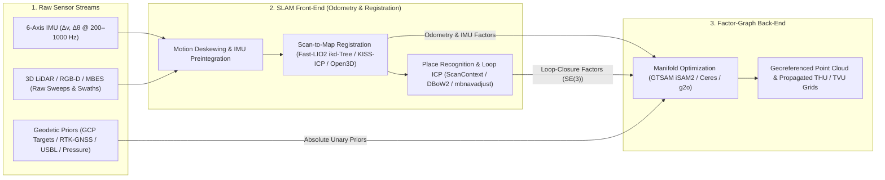

## 6.5 Software Ecosystem

Translating the factor-graph formulations, preintegrated inertial factors, point-to-plane Iterative Closest Point (ICP) registration, and loop-closure constraints of Sections 6.1–6.4 into survey-grade Digital Elevation Models requires a two-tier software architecture:

1. **The SLAM Front-End (Odometry, Deskewing, and Data Association):** High-rate processing ($10\text{–}1000\text{ Hz}$) that removes motion distortion from raw LiDAR sweeps or multibeam echosounder (MBES) submaps using high-frequency IMU integration, extracts geometric primitives or direct point correspondences, evaluates information-matrix degeneracy ($\lambda_{\min}(\mathbf{J}^T\mathbf{J})$), and detects place-recognition loop closures (e.g., via ScanContext, DBoW2, or bathymetric grid correlation).
2. **The Non-Linear Optimization Back-End (Smoothing, Loop Closure, and Geodetic Anchoring):** A sparse non-linear least-squares or Bayes-tree solver that jointly optimizes keyframe poses $\mathcal{X} = \{\mathbf{x}_i \in \text{SE}(3)\}$, IMU biases $\mathbf{b}_i$, relative scan-matching factors, loop-closure constraints, and absolute Ground Control Point (GCP) or intermittent GNSS/USBL priors to produce a globally consistent trajectory and uncertainty envelope.



---

### 6.5.1 Open-Source Optimization Back-Ends and SLAM Frameworks

Modern open-source SLAM decouples general-purpose manifold optimization libraries from sensor-specific front-ends, enabling practitioners to swap registration engines or inject custom geodetic priors without rewriting the underlying sparse linear algebra.

#### Non-Linear Factor-Graph and Manifold Optimization Back-Ends

* **GTSAM (Georgia Tech Smoothing and Mapping)** (Dellaert, 2012; Dellaert & Kaess, 2017): The foundational C++ and Python (`gtsam`) library for factor-graph estimation in robotics and mobile mapping. GTSAM models estimation via a `NonlinearFactorGraph` populated with manifold variables (`Pose3` on $\text{SE}(3)$, `Rot3` on $\text{SO}(3)$, `Point3`, and `imuBias::ConstantBias`). Its primary building blocks for terrain mapping include:
  * `PreintegratedImuMeasurements` and `CombinedImuFactor` (Forster et al., 2017), which integrate high-rate accelerometer and gyroscope increments between keyframes on $\text{SO}(3) \times \mathbb{R}^3$ while analytically propagating the $15 \times 15$ preintegration covariance and first-order bias Jacobians;
  * `BetweenFactorPose3`, which encodes relative $\text{SE}(3)$ scan-matching odometry and loop-closure constraints weighted by their $6 \times 6$ information matrices $\boldsymbol{\Lambda}_{ij} = \boldsymbol{\Sigma}_{ij}^{-1}$;
  * `GPSFactor`, `PoseTranslationPrior`, and `PriorFactorPose3`, which anchor keyframe poses to absolute `ECEF` or local `ENU`/`NED` coordinates from intermittent RTK-GNSS fixes, surveyed GCP targets, or subsea USBL/pressure-depth fixes; and
  * **`ISAM2` (Incremental Smoothing and Mapping 2)** (Kaess et al., 2012) and **`Marginals`**, which maintain a directed **Bayes Tree** data structure (the graphical counterpart to sparse $QR$ factorization) to perform fluid relinearization and incremental variable updates in real time, and subsequently recover exact $6 \times 6$ posterior marginal pose covariances $\boldsymbol{\Sigma}_{\mathbf{T}_i}$ (`marginals.marginalCovariance(key)`) to propagate per-cell **Total Horizontal Uncertainty (THU)** and **Total Vertical Uncertainty (TVU)** for **USGS 3DEP**, **ASPRS**, and **IHO S-44 / S-102** compliance (Section 6.4.2).
* **Ceres Solver** (Agarwal et al., 2022): Developed at Google, Ceres is a portable C++ library for modeling and solving large, complicated non-linear least-squares problems of the form $\min_{\mathbf{x}} \frac{1}{2}\sum_i \rho_i\left(\|\mathbf{f}_i(\mathbf{x}_{i_1}, \dots, \mathbf{x}_{i_k})\|^2\right)$. Ceres is prized in LiDAR-visual-inertial odometry (e.g., `VINS-Mono`, `ALOAM`, `Cartographer`) for its **compile-time automatic differentiation** (`AutoDiffCostFunction` using dual numbers/jets), built-in robust loss functions (`HuberLoss`, `CauchyLoss`, `TukeyLoss`), covariance estimation (`ceres::Covariance`), and **`Manifold`** API (formerly `LocalParameterization`), which maps tangent-space perturbations $\delta\boldsymbol{\xi} \in \mathbb{R}^6$ onto over-parameterized state representations such as unit quaternions ($\mathbb{S}^3 \subset \mathbb{R}^4$) via the $\boxplus$ (`Plus`) operator.
* **`g2o` (General Graph Optimization)** (Kümmerle et al., 2011): A C++ framework specialized for sparse hyper-graph optimization (`OptimizableGraph`). By exploiting the block-sparsity pattern of pose-landmark and pose-pose graphs (via the Schur complement trick and sparse Cholesky/PCG solvers from `SuiteSparse` and `Eigen`), `g2o` serves as the core back-end for visual and RGB-D SLAM pipelines including `ORB-SLAM3` and `RTAB-Map`.

#### LiDAR, Visual, and Subsea SLAM Frameworks

* **LIO-SAM (Tightly-Coupled LiDAR Inertial Odometry via Smoothing and Mapping)** (Shan et al., 2020): Built directly atop GTSAM's `ISAM2`, LIO-SAM formulates a two-factor-graph architecture in ROS 1/2. A high-rate IMU preintegration graph estimates instantaneous sensor velocity and bias at $200\text{–}500\text{ Hz}$ to deskew incoming 3D LiDAR point clouds, while a keyframe factor graph jointly optimizes four factor types: (1) IMU preintegration factors, (2) LiDAR odometry factors (computed by registering extracted edge and planar features to a local sliding-window voxel map), (3) `GPSFactor` nodes (ingested only when the pose-graph translation covariance exceeds the reported GNSS covariance), and (4) Euclidean / ScanContext loop-closure factors.
* **Fast-LIO2 (Fast Direct LiDAR-Inertial Odometry)** (Xu et al., 2022; HKU MARS Lab): Bypasses heuristic feature extraction entirely, registering raw motion-compensated 3D points directly to the map within a tightly coupled **Iterated Extended Kalman Filter (IEKF)** on manifolds ($\text{SO}(3) \times \mathbb{R}^n$). Fast-LIO2 introduces two critical innovations for terrain mapping: first, by reformulating the Kalman gain via the matrix inversion lemma, its computational complexity scales with the state dimension ($18 \times 18$) rather than the measurement dimension (thousands of points); second, it maintains the global map in an **incremental $k$-d tree (`ikd-Tree`)** that supports dynamic point insertion, box-wise downsampling, and tree rebalancing in microseconds, handling both spinning multi-beam (Velodyne, Ouster, Hesai) and solid-state non-repetitive (Livox Avia/Mid-360) LiDARs at up to $100\text{ Hz}$.
* **KISS-ICP ("Keep It Small and Simple" Iterative Closest Point)** (Vizzo et al., 2023; Photogrammetry & Robotics Lab, University of Bonn): A sensor-agnostic, pure-LiDAR odometry pipeline available as a zero-configuration Python CLI (`pip install kiss-icp`). By combining constant-velocity motion deskewing, a dual-density 3D voxel hash grid (maintaining a sparse set of points per voxel for registration and a denser set for map storage), adaptive correspondence distance thresholding derived from kinematic trajectory residuals, and robust point-to-point ICP (with a Geman-McClure kernel), KISS-ICP achieves state-of-the-art odometry across airborne UAV, terrestrial vehicle, and handheld LiDAR datasets without tuning dozens of sensor-specific hyperparameters.
* **Google Cartographer** (Hess et al., 2016): A real-time 2D and 3D indoor/outdoor SLAM system that groups short sequences of laser scans into locally consistent **probability grid submaps** via Ceres-based scan matching, while a background thread runs branch-and-bound correlative scan matching to detect loop closures and optimize a global sparse pose graph.
* **RTAB-Map and ORB-SLAM3:** For RGB-D, stereo, and visual-inertial terrain mapping, **RTAB-Map** (Labbé & Michaud, 2019) provides a multi-sensor graph-SLAM framework combining visual bag-of-words loop closure with 3D LiDAR ICP refinement and `g2o`/`GTSAM` optimization, while **ORB-SLAM3** (Campos et al., 2021) executes maximum *a posteriori* Visual-Inertial Odometry (VIO) and multi-map atlas merging for UAVs and underwater ROV cameras.
* **Open3D Registration and Multiway PoseGraph** (Zhou et al., 2018; Choi et al., 2015): Provides high-performance C++/Python implementations (`open3d.pipelines.registration`) of Point-to-Point (`TransformationEstimationPointToPoint`), Point-to-Plane (`TransformationEstimationPointToPlane`), and Generalized ICP (`TransformationEstimationForGeneralizedICP`), alongside `get_information_matrix_from_point_clouds` and `global_optimization` (Levenberg-Marquardt pose-graph optimization with line-process outlier rejection).
* **Subsea Bathymetric SLAM (`MB-System mbnavadjust` and `auvlib`):** In GNSS-denied deep-ocean AUV multibeam surveys, **`mbnavadjust`** (part of the open-source `MB-System` suite; Caress & Chayes, 1996) acts as an interactive and automated bathymetric pose-graph optimizer. It subdivides continuous MBES swaths into short sub-sections ($100\text{–}250\text{ pings}$), uses 3D terrain cross-correlation to determine horizontal and vertical offsets $(\Delta x, \Delta y, \Delta z)$ between crossing and overlapping swaths, and solves a global sparse least-squares normal equation tying relative swath crossings to high-accuracy fixed tie-points. For programmatic research in Python/C++, **`auvlib`** (Bore et al., 2019; KTH Royal Institute of Technology) provides native parsers (`GSF`, `XTF`, `.all`) and submap-based bathymetric SLAM data structures for AUV multibeam and sidescan sonar.

---

### 6.5.2 Commercial and Closed-Source Mobile & Subsea SLAM Suites

Commercial SLAM systems pair proprietary hardware synchronization and spinning/multi-axis laser heads with closed-source continuous-time trajectory optimization and automated GCP ingestion.

| Software / Hardware Suite | Vendor | Sensor Modality & Architecture | Primary Mapping Domain | Georeferencing & Uncertainty Output |
| :--- | :--- | :--- | :--- | :--- |
| **GTSAM / LIO-SAM / Fast-LIO2** | Open-Source (GT / MIT / HKU) | Factor-Graph (`iSAM2`) / Manifold IEKF (`ikd-Tree`) | UAV, UGV, Backpack, Research | Full $6\times 6$ marginal pose covariances (`LAS`/`PCD`) |
| **KISS-ICP + Open3D** | Univ. of Bonn / Intel ISL | Voxel-Grid Deskewed ICP + Multiway PoseGraph | Sensor-Agnostic LiDAR Odometry | TUM/KITTI poses, Information matrices $\mathbf{J}^T\mathbf{J}$ |
| **`MB-System` (`mbnavadjust`)** | MBARI / LDEO (Open-Source) | Submap Bathymetric Cross-Correlation + LSQ Graph | Deep-Sea AUV / Towfish MBES | Adjusted navigation (`.na*`), bathymetric DEM grids |
| **Faro Connect / Orbis** | Faro / GeoSLAM | Spinning 3D LiDAR + Continuous-Time Sliding-Window SLAM | Caves, Forests, Mines, Indoor | Automated GeoSLAM Control Plates, `LAS`/`LAZ` |
| **Emesent Hovermap / Aura** | Emesent | Rotating Velodyne/Hesai + Autonomy + Wildcat SLAM | Underground Stopes, Bridges, Forest | Ground/Wall GCP targets, RTK-PPK fusion |
| **NavVis VLX / IVION** | NavVis | Dual Multi-Beam LiDAR + 4-Camera Panorama + Pose Graph | Architectural BIM, Complex Sites | Survey Control-Point Plates ($\text{mm}$ accuracy), `E57` |
| **Leica BLK2GO / Cyclone** | Hexagon / Leica Geosystems | Dual-Axis LiDAR + 3-Camera VIO + GrandSLAM | Handheld Indoor/Outdoor Corridors | Cyclone REGISTER 360 target bundle adjustment |
| **HUGIN TAN / NavLab** | Kongsberg Discovery | FOG INS + DVL + MBES Terrain-Aided Navigation / SLAM | Deep-Water AUV Hydrography | Real-time/Post-processed SBET & IHO S-44 TVU/THU |

* **Faro Orbis and GeoSLAM Connect (Zeb-Horizon / Zeb-Revo):** Originating from CSIRO's *Zebedee* spring-mounted and motorized rotating laser scanners (Bosse et al., 2012), GeoSLAM (now Faro) employs a continuous-time sliding-window surfel-matching algorithm that estimates a piecewise continuous trajectory spline $\mathbf{x}(t) \in \text{SE}(3)$ jointly with surface planar patches. In **Faro Connect**, users place the scanner base onto surveyed reference plates for $5\text{–}10\text{ s}$ during the walk; the post-processor automatically detects these stationary intervals and injects stiff 3D coordinate priors into the global trajectory spline to suppress vertical $z$-bowing.
* **Emesent Hovermap and Aura:** Designed around CSIRO's *Wildcat* SLAM engine, Hovermap mounts a spinning 3D LiDAR inside a protective cage for autonomous beyond-visual-line-of-sight (BVLOS) UAV flight or backpack capture inside GPS-denied underground mining stopes, culverts, and dense forest canopies. **Emesent Aura** post-processes raw sweeps by combining local continuous-time LiDAR-inertial odometry with automated retro-reflective disk target extraction and intermittent RTK-GNSS trajectory fusion.
* **NavVis VLX and IVION:** A wearable mobile mapping system integrating two orthogonally inclined 32-beam LiDAR scanners (providing both horizontal wall and nadir ground coverage), an IMU, and four high-resolution panoramic cameras. During capture, the operator touches a physical probe on the VLX chassis against surveyed wall or floor control-point plates; NavVis post-processing fuses these hard metric constraints with multi-loop 6-DoF pose-graph optimization to achieve $5\text{–}10\text{ mm}$ local accuracy over hectare-scale facilities.
* **Leica BLK2GO and Pegasus TRK:** The handheld **BLK2GO** fuses a high-speed dual-axis LiDAR with three panoramic cameras and an IMU via Leica's **GrandSLAM** (Visual-Inertial-LiDAR) engine, while the vehicle-mounted **Pegasus TRK** combines GNSS-INS direct georeferencing with LiDAR SLAM strip adjustment in **Leica Cyclone Pegasus OFFICE** to bridge urban-canyon GNSS outages.
* **Kongsberg HUGIN Terrain-Aided Navigation (TAN) and SeeByte SeeTrack:** On deep-water AUVs operating beneath ice shelves or at abyssal depths ($3000\text{–}6000\text{ m}$), Kongsberg's **Terrain Navigation (TAN)** and **NavLab** fuse MBES/DVL bathymetric profiles with a pre-existing coarse shipboard grid (or self-generated overlapping submaps) using a point-mass / particle filter or bathymetric contour-matching back-end, bounding horizontal INS+DVL drift to $<2\text{–}5\text{ m}$ over multi-day missions.

---

### 6.5.3 Reproducible CLI and Python Workflows

#### 1. Sensor-Agnostic LiDAR Odometry and Bathymetric Swath SLAM (`kiss_icp` + `MB-System`)
The following CLI commands demonstrate running `kiss_icp_pipeline` on a directory of raw terrestrial/UAV LiDAR scans (`.ply`/`.pcd`/`.bin`) and adjusting overlapping AUV multibeam bathymetry swaths with `MB-System`:

```bash
# 1. Run KISS-ICP with constant-velocity deskewing on a sequence of point clouds
#    --deskew: compensate intra-scan motion distortion using per-point timestamps
#    --max-range 80.0 (or --config config.yaml): filter noisy far-field sky/multipath returns
kiss_icp_pipeline --deskew --max-range 80.0 ./raw_lidar_scans/

# 2. Subsea AUV Bathymetric SLAM in MB-System:
#    Add raw MBES datalist to an mbnavadjust project, invert the global sparse pose graph
#    (--invert), apply adjusted navigation (.na*) via mbprocess, and grid the bathymetric DEM
mbnavadjustmerge --input=auv_survey_project.nvh --add-file=datalist_raw.mb-1
mbnavadjustmerge --input=auv_survey_project.nvh --invert
mbprocess -I datalist_raw.mb-1
mbgrid -I datalistp.mb-1 -O auv_bathymetry_slam -A2 -E1.0/1.0/meters!
```

> [!IMPORTANT]
> **Information Matrix Scaling, Tangent-Space Ordering, and Point-to-Plane Observability Across SLAM Libraries**
> When coupling an ICP front-end (e.g., `Open3D` or `PCL`) to a factor-graph back-end (`GTSAM`, `Ceres`, or `g2o`), three silent conventions must be verified:
> 1. **Tangent-Space Ordering ($\text{SE}(3)$):** `Open3D` orders its 6-DOF tangent vector and $6\times 6$ Hessian $\boldsymbol{\Lambda} = \mathbf{J}^T\mathbf{J}$ as $[\text{rotation } (\phi_x, \phi_y, \phi_z), \text{translation } (\rho_x, \rho_y, \rho_z)]^T$, which matches `GTSAM` (`Pose3`), whereas ROS messages (`geometry_msgs/PoseWithCovariance`) order translation *before* rotation. Failing to permute the $3\times 3$ blocks swaps angular and metric uncertainties!
> 2. **Unscaled Geometric Sum vs. Metric Variance:** Geometric ICP solvers accumulate the raw normal matrix $\mathbf{H} = \sum_{k=1}^N \mathbf{j}_k^T \mathbf{j}_k$ without dividing by the per-point range variance $\sigma_n^2$. To convert $\mathbf{H}$ into a statistically calibrated inverse covariance matrix $\boldsymbol{\Sigma}_{\text{ICP}}^{-1}$ for fuse-weighting against surveyed GCPs, scale $\boldsymbol{\Lambda} = \sigma_n^{-2}\mathbf{H}$ (where $\sigma_n \approx 0.01\text{–}0.03\text{ m}$ is the point-to-plane residual standard deviation).
> 3. **Point-to-Point vs. Point-to-Plane Information Matrix (`get_information_matrix_from_point_clouds`):** `Open3D`'s built-in helper `get_information_matrix_from_point_clouds()` implements Equation (11) of Choi et al. (2015) using the **isotropic Point-to-Point Jacobian** $\mathbf{J}_{\text{pt2pt},k} = \begin{bmatrix} -[\mathbf{p}_k]_\times & \mathbf{I}_3 \end{bmatrix} \in \mathbb{R}^{3\times 6}$, ignoring target surface normals $\mathbf{n}_k$. Because its lower-right $3\times 3$ translational block is always $\sum_{k=1}^N \mathbf{I}_3 = N\mathbf{I}_3$, it reports full translational rank ($\lambda_x = \lambda_y = \lambda_z = N$) even on a featureless flat plane or uniform corridor! To perform a true **Zhang et al. (2016) Point-to-Plane degeneracy audit** (Section 6.4.4), assemble the exact Point-to-Plane Jacobian rows $\mathbf{j}_k = \begin{bmatrix} (\bar{\mathbf{p}}_k \times \mathbf{n}_k)^T & \mathbf{n}_k^T \end{bmatrix} \in \mathbb{R}^{1\times 6}$ from `reg.correspondence_set` and the target normals as shown below.

#### 2. Point-to-Plane ICP Degeneracy Audit and Georeferenced Pose-Graph Optimization in Python
The self-contained Python script below executes **Point-to-Plane ICP** in `Open3D`, constructs the exact $6\times 6$ **Point-to-Plane Hessian** $\mathbf{H} = \sum_{k=1}^N \mathbf{j}_k^T\mathbf{j}_k$ (Equation 6.4.4) for an **eigenvalue degeneracy audit** (Zhang et al., 2016) to detect unconstrained directions (e.g., a featureless corridor or flat terrain), and solves a **3D Pose-Graph loop-closure and Ground Control Point (GCP) georeferencing adjustment** to eliminate vertical $z$-drift:

```python
import numpy as np
import open3d as o3d

def register_pair_with_degeneracy_check(
    source: o3d.geometry.PointCloud,
    target: o3d.geometry.PointCloud,
    init_T: np.ndarray = np.eye(4),
    max_corr_dist: float = 0.5,
    sigma_n: float = 0.02,
    eigen_thresh: float = 50.0,
) -> dict:
    """
    Run Point-to-Plane ICP, assemble the exact 6x6 Point-to-Plane geometric
    Hessian H = J^T J (Section 6.4.4), scale by sigma_n^-2 for metric inverse
    covariance, and audit eigenvalues for degeneracy (Zhang et al., 2016).
    """
    # Ensure unit surface normals are estimated for Point-to-Plane objective
    for pcd in (source, target):
        if not pcd.has_normals():
            pcd.estimate_normals(
                o3d.geometry.KDTreeSearchParamHybrid(radius=1.0, max_nn=30)
            )

    reg = o3d.pipelines.registration.registration_icp(
        source, target, max_corr_dist, init_T,
        o3d.pipelines.registration.TransformationEstimationPointToPlane(),
        o3d.pipelines.registration.ICPConvergenceCriteria(max_iteration=50),
    )

    # Assemble exact Point-to-Plane Jacobian J_k = [(p_bar_k x n_k)^T, n_k^T]
    corrs = np.asarray(reg.correspondence_set)
    if len(corrs) > 0:
        p_src = np.asarray(source.points)[corrs[:, 0]]
        p_bar = (reg.transformation[:3, :3] @ p_src.T).T + reg.transformation[:3, 3]
        n_tgt = np.asarray(target.normals)[corrs[:, 1]]
        J_pt2pl = np.hstack([np.cross(p_bar, n_tgt), n_tgt])  # shape (N, 6)
        H_geom = J_pt2pl.T @ J_pt2pl                          # unscaled 6x6 Hessian
    else:
        H_geom = np.zeros((6, 6))

    info_metric = H_geom / (sigma_n ** 2)
    eigvals, eigvecs = np.linalg.eigh(H_geom)
    degen_mask = eigvals < eigen_thresh

    return {
        "T_target_from_source": reg.transformation,
        "fitness": reg.fitness,
        "inlier_rmse": reg.inlier_rmse,
        "hessian_geom": H_geom,
        "information_matrix": info_metric,
        "eigenvalues": eigvals,
        "is_degenerate": bool(np.any(degen_mask)),
        "degenerate_directions": eigvecs[:, degen_mask],
    }

def optimize_slam_pose_graph_with_gcps(
    odometry_transforms: list[np.ndarray],
    odometry_infos: list[np.ndarray],
    loop_edges: list[tuple[int, int, np.ndarray, np.ndarray]],
    gcp_priors: dict[int, tuple[np.ndarray, np.ndarray]],
    init_world_pose: np.ndarray = np.eye(4),
) -> tuple[o3d.pipelines.registration.PoseGraph, list[np.ndarray]]:
    """
    Build and optimize a 3D PoseGraph combining sequential LiDAR odometry
    (K = len(odometry_transforms) steps across M = K + 1 keyframes, indexed 1..M),
    loop-closure edges, and absolute surveyed GCP pose anchors (via a fixed
    world-frame datum node 0) to eliminate long-wavelength elevation drift.
    """
    pose_graph = o3d.pipelines.registration.PoseGraph()
    # Node 0 is the fixed absolute geodetic datum origin (Identity in ENU)
    pose_graph.nodes.append(o3d.pipelines.registration.PoseGraphNode(np.eye(4)))

    # Node 1 is the initial keyframe pose T_world_from_kf1
    T_accum = init_world_pose.copy()
    pose_graph.nodes.append(o3d.pipelines.registration.PoseGraphNode(T_accum))

    # Add sequential odometry nodes (2..M) and edges (curr_id -> next_id)
    # In Open3D, PoseGraphEdge(s, t, T_t_from_s) relates node poses via T_t_from_s ≈ X_t^-1 X_s
    for idx, (T_next_from_curr, info_step) in enumerate(
        zip(odometry_transforms, odometry_infos), start=1
    ):
        curr_id = idx
        next_id = idx + 1
        T_accum = T_accum @ np.linalg.inv(T_next_from_curr)
        pose_graph.nodes.append(o3d.pipelines.registration.PoseGraphNode(T_accum))
        pose_graph.edges.append(
            o3d.pipelines.registration.PoseGraphEdge(
                curr_id, next_id, T_next_from_curr, info_step, uncertain=False
            )
        )

    # Inject loop-closure constraints (uncertain=True activates robust line-process weighting)
    for src_id, dst_id, T_dst_from_src, info_loop in loop_edges:
        pose_graph.edges.append(
            o3d.pipelines.registration.PoseGraphEdge(
                src_id, dst_id, T_dst_from_src, info_loop, uncertain=True
            )
        )

    # Inject absolute GCP priors as rigid edges from fixed world origin (Node 0) to keyframe kf_id
    for kf_id, (T_world_from_kf, info_gcp) in gcp_priors.items():
        pose_graph.edges.append(
            o3d.pipelines.registration.PoseGraphEdge(
                0, kf_id, np.linalg.inv(T_world_from_kf), info_gcp, uncertain=False
            )
        )

    # Solve non-linear least-squares PoseGraph via Levenberg-Marquardt
    option = o3d.pipelines.registration.GlobalOptimizationOption(
        max_correspondence_distance=0.5,
        edge_prune_threshold=0.25,
        preference_loop_closure=2.0,
        reference_node=0,  # Lock Node 0 to anchor the graph in absolute geodetic ENU
    )
    o3d.pipelines.registration.global_optimization(
        pose_graph,
        o3d.pipelines.registration.GlobalOptimizationLevenbergMarquardt(),
        o3d.pipelines.registration.GlobalOptimizationConvergenceCriteria(),
        option,
    )
    optimized_poses = [node.pose for node in pose_graph.nodes[1:]]
    return pose_graph, optimized_poses
```
