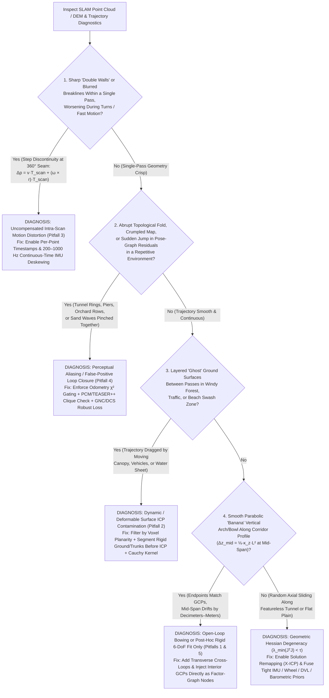

## 6.6 Common Pitfalls & Key Takeaways

Simultaneous Localization and Mapping (SLAM) has revolutionized high-resolution terrain and bathymetric mapping beneath forest canopies, inside underground mines and lava tubes, under bridges, and across deep-ocean hydrothermal vent fields where satellite GNSS signals are completely obstructed (Sections 6.1–6.5). Modern LiDAR-Inertial Odometry (`Fast-LIO2`, `LIO-SAM`) and commercial mobile mapping systems (`Emesent Hovermap`, `Faro Orbis`, `NavVis VLX`, `Leica BLK2GO`) routinely achieve millimeter-to-centimeter **local relative precision** within a single $10\text{–}30\text{ m}$ scan neighborhood. Yet this extraordinary local sharpness creates a dangerous operational illusion: a point cloud that looks crisp, dense, and noise-free at the $1\text{ m}$ scale can simultaneously harbor **decimeter-to-meter-scale global vertical warping**, internal topological folds, or motion-blurred breaklines across a $500\text{ m}$ survey corridor.

Unlike GNSS/INS-referenced swaths (Chapter 5), where absolute position errors are bounded at every epoch by external satellite ranges, an unanchored SLAM trajectory estimates each pose $\mathbf{x}_i \in \text{SE}(3)$ recursively from noisy relative scan-to-scan, scan-to-map, and preintegrated IMU factors (Section 6.4). Consequently, small systematic biases in Point-to-Plane Iterative Closest Point (ICP) normals, uncalibrated IMU accelerometer/gyro biases, uncompensated intra-scan motion distortion, or false-positive place-recognition matches accumulate nonlinearly across the factor graph. This section examines five canonical SLAM failure modes in DEM production—complete with governing mathematical derivations and worked numerical case studies—followed by a summary diagnostic matrix, a survey-design and artifact-troubleshooting flowchart, and a practitioner quality-assurance checklist.

---

### 6.6.1 Detailed Case Studies of SLAM Trajectory, Registration, and Georeferencing Failure Modes

#### Pitfall 1: Walking or Flying a Single Open-Loop or Out-and-Back Corridor Without Cross-Loops or GCPs ("Banana-Shaped" Vertical Bowing)

* **Physical & Estimation Mechanism:** When mapping an elongated linear feature—such as a $500\text{ m}$ forest trail, river levee crown, coastal cliff toe, subterranean mine drift, or subsea pipeline corridor—operators frequently walk or fly a single one-way pass (open loop) or a simple out-and-back line along the exact same centerline without intermediate Ground Control Points (GCPs) or transverse cross-loops. In LiDAR-Inertial SLAM, horizontal pitch $\theta(s)$ and vertical elevation $z(s)$ along the travel distance $s \in [0, L]$ are governed by the double spatial integration of small per-scan pitch registration residuals $\delta\theta_{\text{ICP}}$ coupled with uncompensated IMU accelerometer/gyro biases $(\mathbf{b}_a, \mathbf{b}_g)$. In planar or corridor environments, consecutive scan-to-map patches overlap over a short longitudinal baseline $D_{\text{fov}}$ ($20\text{–}40\text{ m}$), acting like a slender cantilever beam with weak rotational stiffness around the horizontal cross-track axis ($y$). Even if the surveyor walks straight back along the identical path to close a loop at $s = 0$, a narrow 1D out-and-back trajectory only constrains the **relative difference** between the outbound and inbound passes; any symmetric systematic pitch curvature $\kappa_z$ (induced by directional scan-angle incidence bias, thermal IMU bias drift, or asymmetric canopy/ground visibility) bends both passes together into a classic **"banana-shaped" quadratic vertical arch or bowl**.
* **Governing Equations:** Let $s \in [0, L]$ denote the arc length along a corridor of length $L$ composed of $N = L / \Delta s$ discrete keyframes spaced by $\Delta s$. Taking elevation $z$ as positive-up and defining $\theta_{\text{inc}}(s)$ as the local vertical path inclination angle ($dz/ds = \sin\theta_{\text{inc}}(s) \approx \theta_{\text{inc}}(s)$ for small angles, corresponding to $-\theta_{\text{pitch}}$ in a right-handed Forward-Left-Up body frame), the per-step vertical inclination rate $d\theta_{\text{inc}}/ds$ suffers from a small systematic vertical curvature bias $\kappa_z = \delta\theta_{\text{bias}} / \Delta s$ (in $\text{rad m}^{-1}$, driven by asymmetric forward/backward LiDAR or multibeam incidence angles or unobservable accelerometer-pitch coupling) plus a zero-mean white-noise random walk $\eta_\theta(s)$ with step variance $\sigma_{\delta\theta}^2$ per interval $\Delta s$:
  $$
  \frac{d\theta_{\text{inc}}(s)}{ds} = \kappa_z + \eta_\theta(s), \qquad \theta_{\text{inc}}(s) = \int_0^s \frac{d\theta_{\text{inc}}(u)}{du}\,du = \kappa_z s + \int_0^s \eta_\theta(u)\,du
  $$
  Integrating $\theta_{\text{inc}}(s)$ a second time along the trajectory ($dz/ds \approx \theta_{\text{inc}}(s)$) yields the open-loop vertical elevation drift $\Delta z_{\text{open}}(s)$ as the sum of a deterministic **quadratic bowing term** and a stochastic **integrated random-walk term** whose standard deviation grows super-linearly as $L^{3/2}$:
  $$
  \Delta z_{\text{open}}(s) \approx \frac{1}{2}\kappa_z s^2 + \varepsilon_{\text{rw}}(s), \qquad \sigma_{z,\text{rw}}(s) = \frac{\sigma_{\delta\theta}}{\sqrt{3\,\Delta s}}\,s^{3/2} = \frac{\sigma_{\delta\theta}\,\Delta s}{\sqrt{3}}\,N^{3/2}
  $$
  Notice the severity of both terms: doubling the corridor length $L$ **quadruples** ($4\times$) the deterministic quadratic vertical bow $\frac{1}{2}\kappa_z L^2$ and increases the random-walk vertical standard deviation by $2^{3/2} \approx 2.83\times$! Furthermore, if an out-and-back survey pins only the start/end location at $s = 0$ (or if GCPs are placed only at the two ends $s = 0$ and $s = L$), the linear tilt is removed, leaving the first-mode parabolic vertical arch across the interior of the DEM:
  $$
  \Delta z_{\text{pinned}}(s) = \frac{1}{2}\kappa_z s(s - L), \qquad \left|\Delta z_{\text{pinned}}\!\left(\frac{L}{2}\right)\right| = \frac{1}{8}|\kappa_z| L^2
  $$
* **Worked Numerical Case:** A surveyor walks a $L = 500.0\text{ m}$ forest stream corridor using a handheld rotating SLAM scanner with keyframe spacing $\Delta s = 2.0\text{ m}$ ($N = 250$ keyframes). Within each $2.0\text{ m}$ step, local point cloud thickness is $<5\text{ mm}$, but asymmetric terrain occlusion and residual IMU pitch-accelerometer coupling introduce a tiny, imperceptible systematic pitch curvature of $\delta\theta_{\text{bias}} = 0.020\text{ mrad}$ per $2\text{ m}$ step ($\kappa_z = 1.0 \times 10^{-5}\text{ rad m}^{-1} \approx 2.06''/\text{m}$), alongside a per-step random pitch noise of $\sigma_{\delta\theta} = 0.15\text{ mrad}$ ($0.0086^\circ$).
  * **Deterministic Quadratic Bowing at $s = 500\text{ m}$:**
    $$
    \Delta z_{\text{quad}}(500\text{ m}) = \frac{1}{2}\left(1.0 \times 10^{-5}\text{ rad m}^{-1}\right)(500.0\text{ m})^2 = 0.5 \times 10^{-5} \times 250{,}000 = +1.250\text{ m}
    $$
  * **Stochastic $L^{3/2}$ Random-Walk Uncertainty ($1\sigma$) at $s = 500\text{ m}$:**
    $$
    \sigma_{z,\text{rw}}(500\text{ m}) = \frac{1.5 \times 10^{-4}\text{ rad}}{\sqrt{3 \times 2.0\text{ m}}}\,(500.0\text{ m})^{3/2} = \left(6.1237 \times 10^{-5}\text{ rad m}^{-1/2}\right) \times 11{,}180.34\text{ m}^{3/2} = 0.685\text{ m} \quad (1\sigma)
    $$
  * Combining the deterministic bias and random walk yields an expected root-sum-square vertical error of $\text{RMSE}_z(500\text{ m}) = \sqrt{1.250^2 + 0.685^2} = \mathbf{1.425\text{ m}}$, a $1\sigma$ upper excursion of $|\Delta z_{\text{quad}}| + \sigma_{z,\text{rw}} = \mathbf{1.935\text{ m}}$, and a $95\%$ confidence vertical error ($\text{LE95} = |\Delta z_{\text{quad}}| + 1.96\,\sigma_{z,\text{rw}}$) of **$\mathbf{2.593\text{ m}}$** at the end of the $500\text{ m}$ open-loop DEM—completely reversing the apparent hydraulic gradient of a gentle $0.2\%$ ($1.0\text{ m}$ per $500\text{ m}$) stream channel! Even if the two endpoints ($s = 0$ and $s = 500\text{ m}$) are pinned to RTK-GNSS monuments, a curvature of $\kappa_z = 4.0 \times 10^{-5}\text{ rad m}^{-1}$ bows the mid-span ($s = 250\text{ m}$) vertically by $\frac{1}{8}\kappa_z L^2 = \frac{1}{8}(4.0\times 10^{-5})(250{,}000) = \mathbf{1.250\text{ m}}$.
* **Remediation & Operational Verification:** Never rely on single open-loop passes or unanchored 1D out-and-back spines for corridors exceeding $100\text{–}150\text{ m}$. Configure the survey as a **multi-loop ladder or figure-8 network** with transverse cross-ties every $50\text{–}100\text{ m}$, and place surveyed 3D reflective SLAM target spheres/plates (or seafloor acoustic transponders / visual fiducial markers in bathymetric SLAM) at maximum spacings of $\Delta s_{\text{GCP}} \le 100\text{–}150\text{ m}$ along the corridor to clamp quadratic vertical modes inside the factor graph.

---

#### Pitfall 2: Scanning in Dynamic or Deformable Environments (Wind-Swaying Forest Canopy, Moving Crowds/Traffic, Swash-Zone Waves, or Subtidal Kelp/Fish Schools)

* **Physical & Registration Mechanism:** The Point-to-Plane ICP registration factor (Section 6.4.2) relies on a foundational physical postulate: **the environment is a rigid body ($\text{SE}(3)$)** between epoch $t_{i-1}$ and epoch $t_i$. When mapping beneath a forest canopy during a $15\text{–}25\text{ knot}$ wind event, along an urban roadway with moving vehicles, on a sandy beach where swash-zone bores run up and down the foreshore, or near subtidal kelp forests and schooling fish swaying in orbital wave currents during AUV multibeam bathymetric SLAM, a large fraction of the returned laser or acoustic pulses strike **non-static surfaces**. In a wooded valley, upper-hemisphere LiDAR channels ($+15^\circ\text{ to }+45^\circ$ elevation) collect $70\text{–}85\%$ of their returns from swaying branches, trunks, and foliage, while only $15\text{–}30\%$ strike the rigid forest floor. If all returns are fed indiscriminately into voxelized Point-to-Plane ICP (`Fast-LIO2`, `KISS-ICP`), two failure modes occur simultaneously:
  1. **Corrupted Local Surface Normals ($\mathbf{n}_k$):** Oscillating foliage, kelp fronds, and branches blur local voxel covariance matrices $\boldsymbol{\Sigma}_k$, flattening the eigenvalue spectrum ($\lambda_1 \approx \lambda_2 \approx \lambda_3$) and rotating the estimated normal vector $\mathbf{n}_k$ away from true structural surfaces.
  2. **Coherent Kinematic Drag on the Trajectory:** When wind gusts push tree crowns coherently downwind by $\mathbf{u}_k$ (or a swash sheet slides landward up a beach face, or wave surge sweeps benthic kelp across a reef), Point-to-Plane ICP interprets the moving environment as **ego-motion of the scanner in the opposite direction**, dragging the estimated trajectory upwind/seaward and tilting the vertical axis!
* **Governing Equations:** In linearized Point-to-Plane ICP (Section 6.4.2), the incremental 6-DoF pose update $\boldsymbol{\delta\xi} = (\boldsymbol{\delta\theta}^T, \boldsymbol{\delta t}^T)^T \in \mathfrak{se}(3)$ minimizes the weighted point-to-plane residuals across the matched point set $\mathcal{S} = \mathcal{S}_{\text{ground}} \cup \mathcal{S}_{\text{dyn}}$, where $\mathcal{S}_{\text{ground}}$ ($N_g$ points) lies on the rigid terrain or seabed ($\mathbf{u}_k = \mathbf{0}$) and $\mathcal{S}_{\text{dyn}}$ ($N_d$ points) undergoes an unmodeled environmental displacement $\mathbf{u}_k = \mathbf{v}_{\text{env},k}\,\Delta t$ between scans. With Jacobian row $\mathbf{J}_k = \bigl[(\mathbf{p}_k \times \mathbf{n}_k)^T, \mathbf{n}_k^T\bigr] \in \mathbb{R}^{1\times 6}$ and weight $w_k$, the normal equations $\mathbf{H}\,\boldsymbol{\delta\xi} = -\mathbf{g}$ partition as:
  $$
  \left(\sum_{k \in \mathcal{S}_{\text{ground}}} w_k \mathbf{J}_k^T \mathbf{J}_k + \sum_{k \in \mathcal{S}_{\text{dyn}}} w_k \mathbf{J}_k^T \mathbf{J}_k\right) \boldsymbol{\delta\xi} = -\sum_{k \in \mathcal{S}_{\text{ground}}} w_k \mathbf{J}_k^T r_k^0 - \sum_{k \in \mathcal{S}_{\text{dyn}}} w_k \mathbf{J}_k^T \bigl(r_k^0 + \mathbf{n}_k^T \mathbf{u}_k\bigr)
  $$
  At the true sensor pose where rigid terrain residuals vanish ($r_k^0 = 0$), the moving points $\mathcal{S}_{\text{dyn}}$ inject a non-zero spurious gradient that biases the single-scan pose estimate by:
  $$
  \boldsymbol{\delta\xi}_{\text{bias}} = -\left(\mathbf{H}_{\text{ground}} + \mathbf{H}_{\text{dyn}}\right)^{-1} \sum_{k \in \mathcal{S}_{\text{dyn}}} w_k \mathbf{J}_k^T \bigl(\mathbf{n}_k^T \mathbf{u}_k\bigr)
  $$
  Specifically, if the rigid ground points provide primarily vertical normals ($\mathbf{n}_k \approx [0, 0, 1]^T$ on flat terrain) while horizontal translation $(x, y)$ and pitch/roll rely heavily on tree trunks and canopy returns with dynamic fraction $\alpha_{\text{dyn}} = \frac{\sum_{k \in \mathcal{S}_{\text{dyn}}} w_k (\mathbf{n}_{k,H}^T \mathbf{e}_w)^2}{\sum_{k \in \mathcal{S}} w_k (\mathbf{n}_{k,H}^T \mathbf{e}_w)^2}$, a coherent canopy displacement $\bar{u}_{\text{wind}}$ along wind direction $\mathbf{e}_w$ biases each scan by $\delta t_w \approx -\alpha_{\text{dyn}}\,\bar{u}_{\text{wind}}$ and induces a compensating pitch tilt $\delta\theta_{\text{wind}} \approx -\alpha_{\text{dyn}}\,\bar{u}_{\text{wind}} / \bar{z}_{\text{canopy}}$ (because the canopy at height $\bar{z}_{\text{canopy}}$ shifts relative to the stationary ground at $z = 0$!).
* **Worked Numerical Case:** A backpack LiDAR-SLAM operator maps a forested floodplain during a gusty afternoon where tree crowns at mean height $\bar{z}_{\text{canopy}} = 12.0\text{ m}$ sway downwind by a mean net inter-scan displacement of $\bar{u}_{\text{wind}} = +1.5\text{ cm}$ ($0.015\text{ m}$) per $\Delta t = 0.1\text{ s}$ scan during a $10\text{ s}$ wind gust ($M = 100$ scans), and dynamic canopy/branch returns represent $\alpha_{\text{dyn}} = 60\%$ ($0.60$) of the horizontal normal weight.
  * **Per-Scan Pitch Tilt & Horizontal Drag:** Because the upper canopy ($z \approx 12\text{ m}$) moves $+1.5\text{ cm}$ while the ground ($z = 0\text{ m}$) stays fixed, the rigid-body ICP solver compromises by translating the scanner pose horizontally by $\delta x \approx -0.60 \times 1.5\text{ cm} = -0.90\text{ cm}$ and pitching the scan plane by:
    $$
    \delta\theta_{\text{wind}} \approx -\frac{0.60 \times 0.015\text{ m}}{12.0\text{ m}} = -0.75\text{ mrad} \quad (-0.043^\circ \text{ per scan})
    $$
  * Even when bounded by IMU gravity preintegration over the $10\text{ s}$ ($100$-scan) gust, the coherent horizontal drag accumulates to **$0.45\text{ to }0.90\text{ m}$ of horizontal trajectory translation** and **$15\text{ to }35\text{ cm}$ of vertical ground-surface splitting** ("ghosted double ground" where outbound and inbound ground layers separate vertically). Similarly, scanning a beach swash zone where a $5\text{ cm}$-thick water bore slides $2.0\text{ m}$ landward over featureless sand ($\mathbf{H}_{\text{ground},H} \approx \mathbf{0}$) pulls the horizontal SLAM trajectory seaward by meters!
* **Remediation & Operational Verification:** (1) Enforce strict **planarity/eigenvalue filtering** ($\sigma_{\text{planar}} = \frac{\lambda_2 - \lambda_3}{\lambda_1} > \tau_p$, rejecting rough foliage or kelp voxels where $\lambda_3 \approx \lambda_2$); (2) apply **semantic or cloth-simulation ground/trunk segmentation** (`CSF`, `RangeNet++`, or dynamic-object removal such as `ERASOR` / `Removert` on land and water-column / kelp gate filtering in `MB-System` / `Qimera` at sea) *prior* to ICP correspondence matching so only rigid bare-earth, bedrock, and lower basal tree-trunk points ($z_{\text{rel}} < 2.5\text{ m}$) enter $\mathbf{H}$; and (3) down-weight correspondence residuals using a robust **Cauchy or Geman–McClure kernel** $\rho(r_k)$ alongside robust **NMAD** ($\text{NMAD} = 1.4826 \times \text{median}(|\Delta z - \text{median}(\Delta z)|)$) vertical split monitoring.

---

#### Pitfall 3: Uncompensated Intra-Scan LiDAR & Multibeam Motion Distortion (Omitting Continuous-Time IMU Deskewing)

* **Physical & Kinematic Mechanism:** Mechanical spinning LiDARs (`Velodyne VLP-16`, `Ouster OS1`, `Hesai XT32`), rotating prism/nodding scanners (`Emesent Hovermap`, `Faro Orbis`), and mechanically scanned or AUV multibeam echosounders (MBES) do **not** capture a 3D point cloud or bathymetric submap instantaneously like a global-shutter framing camera. Instead, laser points are acquired sequentially over a finite sweep interval $T_{\text{scan}} = 1 / f_{\text{scan}}$ (typically $T_{\text{scan}} = 100\text{ ms}$ at $f_{\text{scan}} = 10\text{ Hz}$, or $50\text{ ms}$ at $20\text{ Hz}$), while underwater MBES soundings experience both a finite **two-way acoustic travel time** $\Delta t_{\text{acoustic}} = 2R / c_w$ (where $c_w \approx 1500\text{ m/s}$ is sound speed in water, so $\Delta t_{\text{acoustic}} = 100\text{ ms}$ at slant range $R = 75\text{ m}$) between transmit ($t_{\text{tx}}$) and receive ($t_{\text{rx}}$) and a multi-second dead-reckoning sweep interval $T_{\text{submap}}$ over which an AUV accumulates a bathymetric patch for SLAM matching. If a software pipeline treats all points collected during $[t_0, t_0 + T_{\text{scan}}]$ as if they were measured simultaneously at a single static frame timestamp $t_0$—or neglects transmit-to-receive attitude change $\mathbf{R}(t_{\text{rx}})\neq\mathbf{R}(t_{\text{tx}})$ in MBES—the moving sensor's translation $\mathbf{v}(t)$ and angular rate $\boldsymbol{\omega}(t)$ **geometrically shear and twist the raw scan** before ICP registration even begins!
* **Governing Equations:** Let $t_k \in [t_0, t_{\text{end}}]$ be the exact hardware laser firing (or sonar receive) timestamp of point $\mathbf{p}_k^{\text{raw}}$ (measured in the instantaneous sensor body frame at time $t_k$), and let $\Delta t_k = t_k - t_0 \in [0, T_{\text{scan}}]$ denote the intra-scan elapsed time. Given the continuous-time trajectory $\mathbf{T}(t) = \bigl(\mathbf{R}(t), \mathbf{p}(t)\bigr) \in \text{SE}(3)$ propagated at $200\text{–}1000\text{ Hz}$ via IMU preintegration (Section 6.4.1), the exact **motion-deskewed point** $\mathbf{p}_k^{\text{deskew}}$ referenced to the end-of-scan frame $t_{\text{end}}$ (or start frame $t_0$) is:
  $$
  \begin{bmatrix} \mathbf{p}_k^{\text{deskew}} \\ 1 \end{bmatrix} = \mathbf{T}(t_{\text{end}})^{-1}\,\mathbf{T}(t_k) \begin{bmatrix} \mathbf{p}_k^{\text{raw}} \\ 1 \end{bmatrix} \implies \mathbf{p}_k^{\text{deskew}} = \mathbf{R}(t_{\text{end}})^T \Bigl(\mathbf{R}(t_k)\,\mathbf{p}_k^{\text{raw}} + \mathbf{p}(t_k) - \mathbf{p}(t_{\text{end}})\Bigr)
  $$
  When intra-scan deskewing is omitted ($\mathbf{T}(t_k) \equiv \mathbf{T}(t_0)$), a platform translating at velocity $\mathbf{v}$ and rotating at angular velocity $\boldsymbol{\omega} = (\omega_\phi, \omega_\theta, \omega_\psi)^T$ over sweep duration $T_{\text{scan}}$ (or acoustic round-trip delay $\Delta t_{\text{acoustic}} = 2R/c_w$) injects a 3D geometric distortion $\boldsymbol{\Delta p}_{\text{skew}}(t_k)$ at target vector $\mathbf{r}_k = \mathbf{R}(t_0)\mathbf{p}_k^{\text{raw}}$ (at slant range $R = \|\mathbf{r}_k\|$) equal to:
  $$
  \boldsymbol{\Delta p}_{\text{skew}}(\Delta t_k) = \mathbf{p}_{\text{undeskewed}} - \mathbf{p}_{\text{true}} \approx -\Bigl(\mathbf{v}\,\Delta t_k + (\boldsymbol{\omega} \times \mathbf{r}_k)\,\Delta t_k\Bigr), \qquad \|\boldsymbol{\Delta p}_{\text{skew},\max}\| \le \|\mathbf{v}\| T_{\text{scan}} + \|\boldsymbol{\omega}\| R\,T_{\text{scan}}
  $$
  Crucially, for a $360^\circ$ spinning LiDAR, a point at azimuth $\alpha = 0^\circ$ is sampled at both the very start of the sweep ($\Delta t = 0$) and the very end of the sweep ($\Delta t = T_{\text{scan}}$), causing any stationary wall or terrain breakline at range $R$ to split into a **discontinuous step ("double wall" or "spiral tear")** of width $\|\boldsymbol{\Delta p}_{\text{skew}}(T_{\text{scan}})\|$!
* **Worked Numerical Case:** Consider two standard operational scenarios using a $f_{\text{scan}} = 10\text{ Hz}$ spinning LiDAR ($T_{\text{scan}} = 0.100\text{ s}$) scanning terrain and retaining walls at range $R = 30.0\text{ m}$ (or an AUV multibeam sonar at range $R = 75.0\text{ m}$ where $\Delta t_{\text{acoustic}} = 2(75.0)/1500 = 0.100\text{ s}$):
  * **Case 3A (Translational Velocity Distortion on a UAV / Mobile Vehicle at $v = 10.0\text{ m/s}$):** Over a single $100\text{ ms}$ sweep, the platform translates forward by:
    $$
    \Delta x_{\text{trans}} = v\,T_{\text{scan}} = 10.0\text{ m/s} \times 0.100\text{ s} = \mathbf{1.000\text{ m}}
    $$
    Without deskewing, every single scan is stretched or compressed by **$1.00\text{ m}$ along-track**, blurring $1\text{ m}$-wide drainage ditches and shifting curb breaklines by up to a meter!
  * **Case 3B (Rotational Distortion During a $\omega_\psi = 45.0^\circ/\text{s}$ Turn or $\omega_\theta = 15.0^\circ/\text{s}$ Walking Pitch / Wave Roll Jolt):** During a normal handheld or UAV turn at $\omega_\psi = 45.0^\circ/\text{s} = 0.7854\text{ rad/s}$, the scanner rotates by $\Delta\psi = 45.0^\circ/\text{s} \times 0.100\text{ s} = \mathbf{4.50^\circ}$ ($0.07854\text{ rad}$) within one revolution. At range $R = 30.0\text{ m}$, the start and end of the $360^\circ$ sweep misalign laterally by:
    $$
    \Delta y_{\text{rot}} = R\,\omega_\psi\,T_{\text{scan}} = 30.0\text{ m} \times 0.7854\text{ rad/s} \times 0.100\text{ s} = \mathbf{2.356\text{ m}}
    $$
    Simultaneously, a normal human heel-strike walking pitch oscillation of $\omega_\theta = 15.0^\circ/\text{s}$ ($0.2618\text{ rad/s}$) warps the vertical elevation of terrain at $R = 30.0\text{ m}$ by **$\Delta z_{\text{pitch}} = 30.0 \times 0.2618 \times 0.100 = \mathbf{0.785\text{ m}}$** ($78.5\text{ cm}$) within a single $100\text{ ms}$ scan (and an uncompensated $10^\circ/\text{s}$ vessel roll rate over a $100\text{ ms}$ acoustic travel time at $R = 75\text{ m}$ outer-beam slant range biases seafloor depth by $75.0 \times \sin 60^\circ \times 0.1745\text{ rad/s} \times 0.100\text{ s} = \mathbf{1.134\text{ m}}$, violating IHO S-44 Special Order TVU by $>4\times$)!
* **Remediation & Operational Verification:** Never ingest frame-aggregated `.las` or `.pcd` sweeps into SLAM without **per-point timestamps** (`t_offset` field in Ouster/Velodyne/Livox packets) or MBES dual-epoch transmit/receive motion compensation (`MB-System`, `Qimera`, `CARIS HIPS and SIPS`). Always execute continuous-time IMU backward propagation (`Fast-LIO2`, `LIO-SAM`, `CT-ICP`) at $\ge 200\text{–}500\text{ Hz}$ to deskew every individual laser or acoustic return to a common epoch prior to voxelization and ICP matching.

---

#### Pitfall 4: Perceptual Aliasing & Catastrophic False-Positive Loop Closures in Repetitive Environments

* **Physical & Topological Mechanism:** Place-recognition descriptors (`ScanContext`, `Iris`, `DBoW2`, `NetVLAD`, or bathymetric contour correlation in `MB-System mbnavadjust`; Section 6.2.2) search for historical keyframes $\mathbf{x}_i$ whose geometric or visual signature matches the current keyframe $\mathbf{x}_j$. However, many engineered and natural environments exhibit **periodic spatial self-similarity** at wavelength $\lambda_{\text{rep}}$: segmented concrete tunnel linings, underground room-and-pillar mine grids, highway viaduct bridge piers, planted orchard rows, and submarine sand-wave fields or pipeline anode spans. When the descriptor similarity score between two physically distinct locations $s_i$ and $s_j$ (separated by $\Delta s_{\text{alias}} = |s_j - s_i| = k\,\lambda_{\text{rep}} \gg 0$) exceeds the acceptance threshold—and the local geometries are sufficiently identical that local ICP converges with a low point-to-plane residual—the back-end factor graph inserts a **catastrophic false-positive loop closure** that pinches the two distinct places onto the same coordinate, folding the entire DEM onto itself like an accordioned ribbon!
* **Governing Equations:** Consider a 1D pose-graph chain of $N$ poses with odometry transitions $\Delta x_{m,m+1} = \Delta s$ (each with variance $\sigma_{\text{odom}}^2$), so the cumulative open-loop covariance between poses $i$ and $j$ separated by $M_{\text{span}} = j - i$ steps is $\sigma_{\text{chain}}^2 = M_{\text{span}}\,\sigma_{\text{odom}}^2$. If a false loop-closure factor asserts that pose $\mathbf{x}_j$ coincides with $\mathbf{x}_i$ ($z_{\text{loop}} = 0$, whereas the true separation is $\Delta s_{\text{alias}} = M_{\text{span}}\Delta s$) with assigned loop variance $\sigma_{\text{loop}}^2$, standard non-robust L2 Gauss–Newton optimization minimizes:
  $$
  \mathcal{J}_{\text{L2}}(\mathcal{X}) = \sum_{m=i}^{j-1} \frac{\bigl((x_{m+1} - x_m) - \Delta s\bigr)^2}{\sigma_{\text{odom}}^2} + \frac{(x_j - x_i - 0)^2}{\sigma_{\text{loop}}^2}
  $$
  Solving $\partial\mathcal{J}_{\text{L2}}/\partial\mathcal{X} = \mathbf{0}$ yields the posterior separation $x_j^* - x_i^*$ and the resulting topological compression error $\Delta x_{\text{fold}}$ distributed across the $M_{\text{span}}$ intermediate DEM submaps:
  $$
  x_j^* - x_i^* = \frac{\sigma_{\text{loop}}^2}{\sigma_{\text{chain}}^2 + \sigma_{\text{loop}}^2}\,\Delta s_{\text{alias}}, \qquad \Delta x_{\text{fold}} = (x_j^* - x_i^*) - \Delta s_{\text{alias}} = -\frac{\sigma_{\text{chain}}^2}{\sigma_{\text{chain}}^2 + \sigma_{\text{loop}}^2}\,\Delta s_{\text{alias}}
  $$
  Because $\sigma_{\text{loop}}^2 \ll \sigma_{\text{chain}}^2 = M_{\text{span}}\sigma_{\text{odom}}^2$ over any long loop, the weight ratio $\frac{\sigma_{\text{chain}}^2}{\sigma_{\text{chain}}^2 + \sigma_{\text{loop}}^2} \to 1$, meaning **a single stiff L2 outlier loop factor overpowers hundreds of valid odometry factors** and collapses the distance $\Delta s_{\text{alias}}$ to nearly zero!
* **Worked Numerical Case:** A mobile tunnel-mapping system or AUV surveys a repetitive structure with pier/rib spacing $\lambda_{\text{rep}} = 20.0\text{ m}$. After advancing $M_{\text{span}} = 40$ keyframes ($\Delta s = 2.0\text{ m}$ per keyframe, true separation $\Delta s_{\text{alias}} = 4\,\lambda_{\text{rep}} = 80.0\text{ m}$) with per-step odometry precision $\sigma_{\text{odom}} = 0.05\text{ m}$ ($\sigma_{\text{chain}}^2 = 40 \times (0.05)^2 = 0.100\text{ m}^2$, i.e., $\sigma_{\text{chain}} = 0.316\text{ m}$), `ScanContext` mistakes Pier #5 for Pier #1 and ICP locks onto the identical concrete rib geometry with high confidence ($\sigma_{\text{loop}} = 0.02\text{ m}$, $\sigma_{\text{loop}}^2 = 0.0004\text{ m}^2$).
  * **Catastrophic L2 Collapse:** Plugging into the L2 normal equation gives the collapsed distance between Pier #1 and Pier #5:
    $$
    x_j^* - x_i^* = \frac{0.0004}{0.1000 + 0.0004} \times 80.0\text{ m} = 0.003984 \times 80.0\text{ m} = \mathbf{0.319\text{ m}} \quad (\text{compression } \Delta x_{\text{fold}} = \mathbf{-79.68\text{ m}}!)
    $$
    The normalized innovation squared (chi-squared Mahalanobis distance) of this false loop is $\chi^2 = \frac{\Delta s_{\text{alias}}^2}{\sigma_{\text{chain}}^2 + \sigma_{\text{loop}}^2} = \frac{6400}{0.1004} = 63{,}745 \gg \chi^2_{6,0.999} = 22.46$. If ingested without gating, the optimizer teleports the trajectory backward by $79.7\text{ m}$ and compresses the intermediate $80\text{ m}$ of terrain into a $32\text{ cm}$ crumpled pile!
* **Remediation & Operational Verification:** (1) Enforce strict **Mahalanobis $\chi^2$ odometry-prior gating** ($\mathbf{r}_{\text{loop}}^T (\boldsymbol{\Sigma}_{\text{chain}} + \boldsymbol{\Sigma}_{\text{loop}})^{-1} \mathbf{r}_{\text{loop}} < \gamma_{\chi^2}$) before allowing place-recognition candidates into the graph; (2) require **Pairwise Consistent Measurement Set Maximization (`PCM`)** or `TEASER++` clique consistency across a sequence of $\ge 3\text{–}5$ consecutive keyframes before committing a loop; and (3) wrap all loop-closure factors in **Dynamic Covariance Scaling (`DCS`)**, **Switchable Constraints**, or **Graduated Non-Convexity (`GNC`)** in `GTSAM`/`Ceres` so isolated outliers are automatically assigned weight $w_{\text{loop}} \to 0$.

---

#### Pitfall 5: Treating Relative SLAM Coordinates as Geodetic or Applying Only a Rigid 6-DoF Transformation to a Warped Long-Corridor Cloud

* **Physical & Geodetic Mechanism:** By default, a SLAM engine initializes its world coordinate frame $\mathcal{F}_W$ at the first pose $\mathbf{x}_0 = (\mathbf{I}_3, \mathbf{0})$ at $t = 0$: horizontal $(X_{\text{SLAM}}, Y_{\text{SLAM}})$ are oriented along the scanner's arbitrary initial heading, and the vertical axis $Z_{\text{SLAM}}$ is aligned only with the initial raw accelerometer gravity vector $\tilde{\mathbf{g}}_0 = -\mathbf{f}_0 / \|\mathbf{f}_0\|$ (which is corrupted by initial acceleration and uncalibrated accelerometer bias $\mathbf{b}_a$). A pervasive and costly mistake in civil engineering and hydrographic workflows is exporting a $1\text{ km}$ drifted SLAM point cloud as a monolithic `.las` file and attempting to georeference it in `CloudCompare` or GIS software by fitting a **single global 6-DoF rigid-body (or 7-DoF Helmert similarity) transformation** $\mathbf{p}_{\text{geo}} = s_0 \mathbf{R}_0 \mathbf{p}_{\text{SLAM}} + \mathbf{t}_0$ to surveyed Ground Control Points (GCPs). While a rigid transformation removes global translation $\mathbf{t}_0$ and mean rotation $\mathbf{R}_0$, **it cannot bend the point cloud**: all internal non-rigid trajectory drift, quadratic vertical bowing $\frac{1}{2}\kappa_z s^2$ (Pitfall 1), and local Earth-curvature / geoid-undulation gradients remain frozen inside the DEM!
* **Governing Equations:** Suppose a corridor SLAM point cloud of length $L$ has accumulated a quadratic vertical drift $\Delta z_{\text{SLAM}}(s) = \theta_0 s + \frac{1}{2}\kappa_z s^2$ along arc length $s \in [0, L]$, where $\theta_0 = \|\mathbf{b}_{a,H}\|/g$ is the initial gravity-alignment tilt error and $\kappa_z$ is the internal trajectory curvature.
  1. **Global Rigid 6-DoF Fit to Endpoint GCPs ($s = 0$ and $s = L$):** A rigid transformation can only adjust the global vertical translation $\Delta z_0$ and global pitch angle $\Delta\theta_{\text{rigid}} = -\theta_0 - \frac{1}{2}\kappa_z L$. After subtracting this best-fit linear plane, the **uncorrectable internal vertical DEM residual** $e_z^{\text{rigid}}(s)$ across the corridor is:
     $$
     e_z^{\text{rigid}}(s) = \Delta z_{\text{SLAM}}(s) - \left(\theta_0 + \frac{1}{2}\kappa_z L\right) s = \frac{1}{2}\kappa_z s(s - L), \qquad \max_{s \in [0,L]} \bigl|e_z^{\text{rigid}}(s)\bigr| = \frac{1}{8}|\kappa_z| L^2 \quad \text{at } s = \frac{L}{2}
     $$
     with continuous corridor root-mean-square error $\text{RMSE}_z^{\text{rigid-end}} = \frac{|\kappa_z|L^2}{4\sqrt{7.5}} \approx 0.7303\,\max|e_z^{\text{rigid}}|$. Even if GCPs are distributed uniformly along $[0, L]$ and fit with an **all-GCP least-squares rigid plane**, the residual quadratic parabola $e_z^{\text{LS-rigid}}(s) = \frac{1}{2}\kappa_z\bigl(s^2 - sL + \frac{1}{6}L^2\bigr)$ still leaves a peak-to-peak vertical distortion of $\frac{1}{8}|\kappa_z|L^2$ (spanning $+\frac{1}{12}\kappa_z L^2$ at the ends to $-\frac{1}{24}\kappa_z L^2$ at mid-span) with continuous $\text{RMSE}_z^{\text{LS-rigid}} = \frac{|\kappa_z|L^2}{12\sqrt{5}} \approx 0.2981\,\max|e_z^{\text{rigid}}|$!
  2. **Non-Rigid Factor-Graph Georeferencing with $K$ Interior GCPs (Spacing $d_{\text{GCP}} = L / (K-1)$):** When the $K$ GCPs are injected directly as unary prior factors $\|\mathbf{r}_{\text{GCP}}(\mathbf{x}_k, \mathbf{g}_k)\|_{\Sigma_{\text{GCP}}}^2$ into the SLAM pose graph (Equation 6.4.1), the trajectory spline is clamped at every interval $d_{\text{GCP}} = L / M_{\text{seg}}$ ($M_{\text{seg}} = K - 1$), reducing the maximum mid-segment vertical bowing by the **square of the number of segments** ($M_{\text{seg}}^2$):
     $$
     \max_{s} \bigl|e_z^{\text{graph}}(s)\bigr| = \frac{1}{8}|\kappa_z|\,d_{\text{GCP}}^2 = \frac{1}{8}|\kappa_z|\left(\frac{L}{M_{\text{seg}}}\right)^2 = \frac{\max |e_z^{\text{rigid}}|}{M_{\text{seg}}^2}, \qquad \text{RMSE}_z^{\text{graph}} = \frac{\text{RMSE}_z^{\text{rigid-end}}}{M_{\text{seg}}^2}
     $$
* **Worked Numerical Case:** A $L = 1{,}000.0\text{ m}$ ($1.0\text{ km}$) subterranean tunnel, canyon, or subsea pipeline survey accumulates an internal vertical curvature of $\kappa_z = 1.6 \times 10^{-5}\text{ rad m}^{-1}$ (open-loop tip drift of $\frac{1}{2}\kappa_z L^2 = 8.00\text{ m}$) plus an initial uncalibrated MEMS accelerometer bias of $b_{ax} = 0.015\text{ m s}^{-2}$ ($\theta_0 = 0.015 / 9.81 = 1.53\text{ mrad}$, causing an additional $1.53\text{ m}$ of raw tilt over $1\text{ km}$). Surveyed RTK/total-station or seafloor LBL transponder GCP targets are installed every $d_{\text{GCP}} = 100.0\text{ m}$ ($M_{\text{seg}} = 10$ segments, $K = 11$ GCPs).
  * **Workflow A (Export Raw Cloud $\to$ Fit Global 6-DoF Rigid Transformation in GIS):** Fitting a single rigid transformation to the endpoints ($s = 0$ and $s = 1{,}000\text{ m}$) eliminates the $1.53\text{ m}$ initial tilt and pins both ends to $0.00\text{ m}$ error, but leaves a massive mid-corridor ($s = 500\text{ m}$) vertical error of:
    $$
    \bigl|e_z^{\text{rigid}}(500\text{ m})\bigr| = \frac{1}{8}\left(1.6 \times 10^{-5}\text{ rad m}^{-1}\right)(1{,}000.0\text{ m})^2 = \mathbf{2.000\text{ m}} \quad \bigl(\text{RMSE}_z = \mathbf{1.393\text{ m}}\text{ across the } 11\text{ GCPs; } \mathbf{1.461\text{ m}}\text{ continuous}\bigr)
    $$
    Even if a least-squares rigid 6-DoF plane is fit simultaneously to all $11$ GCPs, the uncorrectable parabola leaves errors of $+0.667\text{ m}$ at the ends and $-1.333\text{ m}$ at mid-span ($\text{RMSE}_z = \mathbf{0.609\text{ m}}$ across the $11$ GCPs; $\mathbf{0.596\text{ m}}$ continuous)—failing USGS 3DEP QL1/QL2 ($\text{RMSE}_z \le 0.10\text{ m}$) and IHO S-44 Special Order ($\text{TVU}_{\max}(10\text{ m}) = \sqrt{0.25^2 + (0.0075 \times 10)^2} = 0.261\text{ m}$ at $95\%$) by an order of magnitude!
  * **Workflow B (Inject All $11$ GCPs Directly into the SLAM Pose Graph at $d_{\text{GCP}} = 100\text{ m}$):** Clamping the pose graph every $100\text{ m}$ reduces both the maximum mid-span bowing and the corridor $\text{RMSE}_z$ by $M_{\text{seg}}^2 = 10^2 = 100\times$:
    $$
    \bigl|e_z^{\text{graph}}\bigr|_{\max} = \frac{1}{8}\left(1.6 \times 10^{-5}\text{ rad m}^{-1}\right)(100.0\text{ m})^2 = \frac{2.000\text{ m}}{100} = \mathbf{0.020\text{ m}} \quad \bigl(\text{corridor }\text{RMSE}_z^{\text{graph}} = \mathbf{0.0146\text{ m}} = \mathbf{1.46\text{ cm}}!\bigr)
    $$
    This non-rigid pose-graph solution achieves an ASPRS Non-Vegetated Vertical Accuracy of $\text{NVA}_{95\%} = 1.96 \times \text{RMSE}_z^{\text{graph}} = \mathbf{2.86\text{ cm}}$, comfortably meeting ASPRS $5\text{ cm}$ Vertical Accuracy Class, USGS 3DEP QL1 ($\text{RMSE}_z \le 10\text{ cm}$), and IHO S-44 Exclusive Order ($\text{TVU}_{\max} \le 0.15\text{ m}$)!
* **Remediation & Operational Verification:** Never apply a rigid 6-DoF/7-DoF post-transformation to a long SLAM corridor. Always feed surveyed GCP coordinates (transformed into a local Cartesian tangent frame $\text{ENU}$ with explicit geoid height $N_{\text{geoid}}$ removal via `PROJ` / `GDAL`) or intermittent PPK-GNSS / USBL acoustic segments directly into the **factor-graph optimizer** (`GTSAM`, `LIO-SAM`, `Faro Connect`, `Hovermap Aura`, `MB-System mbnavadjust`) so the pose graph distributes non-rigid deformation smoothly across all intermediate keyframes before generating the final point cloud.

---

### 6.6.2 Summary Matrix of SLAM Trajectory, Loop-Closure, and Georeferencing Failure Modes

| Failure Mode | Root Physical / Mathematical Cause | Typical Error Magnitude | Primary Symptom in DEM / Point Cloud | Definitive Remediation |
| :--- | :--- | :--- | :--- | :--- |
| **1. Open-Loop / 1D Out-and-Back Vertical Bowing** | Double spatial integration of pitch bias $\kappa_z$ ($\frac{1}{2}\kappa_z L^2$) and random walk ($\propto L^{3/2}$) along weak cross-axis baseline | $0.5\text{–}2.5\text{ m}$ vertical bow across a $500\text{ m}$ corridor | Classic "banana-shaped" upward arch or downward bowl in longitudinal profile; reversed stream slope | Survey closed multi-loop ladders/figure-8s with cross-ties; place 3D GCPs every $100\text{–}150\text{ m}$ |
| **2. Dynamic Canopy, Crowd, or Swash-Zone Drag** | Moving surfaces ($\mathbf{u}_k \neq \mathbf{0}$) violate rigid-world ICP postulate, biasing normal equations $\mathbf{H}\boldsymbol{\delta\xi} = -\mathbf{g}$ | $0.2\text{–}1.5\text{ m}$ trajectory drag; $10\text{–}35\text{ cm}$ ground splitting | Double/layered bare-earth surfaces; blurred tree trunks; seaward trajectory drift on beaches | Filter by voxel planarity ($\lambda_2-\lambda_3)/\lambda_1$; segment ground/trunks (`CSF`/`ERASOR`) before ICP; use Cauchy loss |
| **3. Uncompensated Intra-Scan Motion Distortion** | Treating a $50\text{–}100\text{ ms}$ LiDAR sweep or $2R/c_w$ MBES travel time as static instead of continuous-time $\text{SE}(3)$ deskewing | $\Delta x = v T_{\text{scan}} \approx 0.5\text{–}1.5\text{ m}$; $\Delta y = R\omega T_{\text{scan}} \approx 1\text{–}3\text{ m}$ | "Double walls" at $360^\circ$ seam; twisted corridors during turns; outer-beam MBES roll artifacts | Retain per-point hardware timestamps; execute $200\text{–}1000\text{ Hz}$ IMU backward propagation deskewing |
| **4. Perceptual Aliasing & False Loop Closures** | Repetitive structures ($\lambda_{\text{rep}}$) fool place recognition + local ICP into pinching Pose $i$ to Pose $j$ | Meter- to $100\text{ m}$-scale topological collapse ($\Delta x_{\text{fold}} \approx -\Delta s_{\text{alias}}$) | DEM folded onto itself ("accordion effect"); missing tunnel bays or sand waves | Gate loops via odometry Mahalanobis $\chi^2$; enforce multi-keyframe `PCM`/`TEASER++` consistency & `GNC`/`DCS` kernels |
| **5. Rigid 6-DoF Fit on a Warped SLAM Corridor** | Rigid Helmert transform ($\mathbf{R}_0, \mathbf{t}_0$) cannot correct internal non-rigid trajectory curvature $\frac{1}{8}\kappa_z L^2$ | $0.5\text{–}3.0\text{ m}$ mid-corridor vertical residual on $1\text{ km}$ lines | Zero error at endpoint GCPs but severe systematic vertical error at mid-span check points | Inject GCPs and PPK-GNSS segments directly as unary factors inside the non-rigid pose-graph optimizer |

---

### 6.6.3 Synthesis of Key Takeaways & SLAM Diagnostic Workflow

> [!IMPORTANT]
> **Key Takeaways—The Four Laws of SLAM for Digital Elevation Modeling:**
> 1. **High Local Point Density Does Not Imply Global Vertical Accuracy:** A SLAM point cloud can exhibit $5\text{ mm}$ local surface precision while drifting vertically by $>1.5\text{ m}$ over $500\text{ m}$. Because vertical drift grows quadratically ($\frac{1}{2}\kappa_z L^2$) with open-loop distance and as $L^{3/2}$ under pitch random walk, long-wavelength DEM accuracy is governed entirely by loop topology and GCP spacing $d_{\text{GCP}}$—never by scanner pulse rate.
> 2. **Geometric Observability Requires 3D Structural Diversity ($\lambda_{\min}(\mathbf{J}^T\mathbf{J}) > \tau$):** Point-to-Plane ICP requires surface normals spanning all three orthogonal axes. In featureless flats (salt pans, abyssal plains) or axially symmetric tunnels, the translational eigenvectors of $\mathbf{H} = \mathbf{J}^T\mathbf{J}$ degenerate, requiring solution-remapping (`X-ICP`) or tight IMU/DVL/wheel-odometry priors to prevent runaway drift along the unconstrained axis.
> 3. **Continuous-Time IMU Deskewing and Rigid-Feature Filtering Are Mandatory Front-End Prerequisites:** Every rotating LiDAR or multibeam sweep collected from a moving platform is a space-time trajectory, not an instantaneous snapshot. Deskewing individual returns with $\ge 200\text{ Hz}$ IMU preintegration and stripping dynamic canopy/swash/kelp returns prior to ICP are essential to prevent scan shearing and trajectory drag.
> 4. **Georeferencing Must Happen *Inside* the Factor Graph, Not After It:** Fitting a global 6-DoF rigid transformation to a drifted SLAM cloud leaves internal bowing $\frac{1}{8}\kappa_z L^2$ untouched. Surveyed GCPs, PPK-GNSS trajectory segments, USBL/LBL acoustic fixes, or airborne LiDAR reference surfaces must be incorporated as weighted factors inside the pose graph so internal trajectory curvature is relaxed non-rigidly ($e_{z,\max} \propto d_{\text{GCP}}^2$).



---

### 6.6.4 Practitioner Pre-Survey & Post-Processing SLAM Audit Checklist

Before mobilizing a terrestrial, subterranean, UAV, or AUV SLAM campaign—and before accepting any SLAM-derived DEM deliverable against **ASPRS Positional Accuracy Standards**, **USGS 3DEP Lidar Base Specification**, **NOAA HSSD**, or **IHO S-44 / S-102** hydrographic orders—verify the following six engineering quality gates:

1. **Closed-Loop Ladder Topology & Maximum Unanchored Span ($d_{\text{GCP}} \le 100\text{–}150\text{ m}$):** Does the planned trajectory avoid single open-loop cantilevers and 1D out-and-back lines by incorporating transverse figure-8 or ladder cross-loops every $50\text{–}100\text{ m}$, and are surveyed 3D GCP targets spaced closely enough that $\frac{1}{8}|\kappa_z| d_{\text{GCP}}^2$ satisfies the project vertical accuracy specification (e.g., $\text{RMSE}_z \le 10\text{ cm}$ for USGS 3DEP QL1/QL2 or $\text{TVU}_{95\%} \le \sqrt{a^2 + (b\,d)^2}$ for IHO S-44 Special/Exclusive Order)?
2. **Per-Point Hardware Timestamp & Continuous-Time IMU Deskewing Verification:** Are raw sensor packets preserving per-point firing timestamps $\Delta t_k \in [0, T_{\text{scan}}]$ (and dual-epoch transmit/receive timestamps in MBES), and is continuous-time IMU preintegration deskewing verified on a high-rate rotational "spin test" (confirming zero wall doubling during a $45^\circ/\text{s}$ yaw rotation)?
3. **Dynamic Object & Foliage Rejection in the ICP Front End:** In forested, coastal swash, or benthic kelp environments, are non-planar returns and moving objects filtered via eigenvalue planarity thresholds ($\frac{\lambda_2 - \lambda_3}{\lambda_1} > \tau_p$) and bare-earth/trunk segmentation prior to Point-to-Plane normal calculation, with multi-pass elevation differences audited using both parametric $\text{RMSE}_z$ and outlier-robust $\text{NMAD}$?
4. **Hessian Conditioning ($\lambda_{\min}(\mathbf{J}^T\mathbf{J})$) Monitoring Along Featureless Segments:** Does the SLAM log record the six eigenvalues of the registration Hessian $\mathbf{H} = \mathbf{J}^T\mathbf{J}$ at every keyframe, confirming either well-conditioned 6-DoF geometry or active degeneracy-aware subspace projection (`X-ICP`) during flat or tunnel transits?
5. **Outlier-Robust Loop-Closure Gating (`PCM` / `GNC` / $\chi^2$):** Have all accepted loop closures passed Mahalanobis $\chi^2$ innovation gating and multi-keyframe geometric consistency checks, with zero topological folds on trajectory-versus-time inspection plots?
6. **In-Graph Non-Rigid Georeferencing & Independent Mid-Span Check Points:** Were GCPs and PPK-GNSS/USBL segments optimized *inside* the factor graph (with proper $\text{ENU}$ tangent-plane conversion and geoid undulation model via `PROJ`), and are ASPRS Non-Vegetated Vertical Accuracy ($\text{NVA}_{95\%} = 1.96 \times \text{RMSE}_z$) and Vegetated Vertical Accuracy ($\text{VVA}_{95\text{th}}$) validated against **withheld check points located at the midpoints** between active GCPs ($s = \bigl(k + \frac{1}{2}\bigr)d_{\text{GCP}}$) where residual quadratic bowing is maximum?

```python
# Automated Python SLAM audit: (1) Open-loop vs. GCP-clamped vertical bowing, (2) Intra-scan skew, (3) Loop χ² gate
import numpy as np

def audit_slam_corridor_and_scan_error_budget(
    corridor_len_m: float, step_m: float, kappa_z_rad_m: float, sigma_pitch_step_rad: float,
    gcp_spacing_m: float, vel_m_s: float, yaw_rate_deg_s: float, scan_hz: float, range_m: float,
    alias_dist_m: float, odom_step_sigma_m: float, loop_sigma_m: float
) -> dict:
    # 1. Open-loop cantilever drift vs. rigid endpoint fit vs. factor-graph interior GCP clamping
    dz_open_quad_m = 0.5 * abs(kappa_z_rad_m) * (corridor_len_m ** 2)
    dz_open_rw_m = (sigma_pitch_step_rad / np.sqrt(3.0 * step_m)) * (corridor_len_m ** 1.5)
    dz_open_rmse_m = np.hypot(dz_open_quad_m, dz_open_rw_m)
    dz_rigid_midspan_m = 0.125 * abs(kappa_z_rad_m) * (corridor_len_m ** 2)
    dz_rigid_cont_rmse_m = dz_rigid_midspan_m * np.sqrt(16.0 / 30.0)
    dz_graph_gcp_midspan_m = 0.125 * abs(kappa_z_rad_m) * (gcp_spacing_m ** 2)
    dz_graph_cont_rmse_m = dz_graph_gcp_midspan_m * np.sqrt(16.0 / 30.0)

    # 2. Uncompensated intra-scan motion distortion over T_scan = 1 / scan_hz
    t_scan_s = 1.0 / scan_hz
    skew_trans_m = vel_m_s * t_scan_s
    skew_rot_m = range_m * np.radians(yaw_rate_deg_s) * t_scan_s

    # 3. Perceptual aliasing L2 collapse vs. Mahalanobis chi-squared innovation gate
    n_steps_alias = alias_dist_m / step_m
    chain_var = n_steps_alias * (odom_step_sigma_m ** 2)
    loop_var = loop_sigma_m ** 2
    l2_collapsed_fold_m = -alias_dist_m * (chain_var / (chain_var + loop_var))
    mahalanobis_chi2 = (alias_dist_m ** 2) / (chain_var + loop_var)

    return {
        "dz_open_quad_m": round(float(dz_open_quad_m), 3),
        "dz_open_rw_1sigma_m": round(float(dz_open_rw_m), 3),
        "dz_open_rmse_m": round(float(dz_open_rmse_m), 3),
        "dz_rigid_fit_midspan_m": round(float(dz_rigid_midspan_m), 3),
        "dz_rigid_fit_cont_rmse_m": round(float(dz_rigid_cont_rmse_m), 3),
        "dz_graph_gcp_midspan_m": round(float(dz_graph_gcp_midspan_m), 3),
        "dz_graph_gcp_cont_rmse_m": round(float(dz_graph_cont_rmse_m), 4),
        "intrascan_trans_skew_m": round(float(skew_trans_m), 3),
        "intrascan_rot_skew_m": round(float(skew_rot_m), 3),
        "alias_l2_fold_error_m": round(float(l2_collapsed_fold_m), 2),
        "alias_mahalanobis_chi2": round(float(mahalanobis_chi2), 1),
    }
```
