## 6.7 Curated Key References

Constructing a metrically consistent, geodetically anchored Digital Elevation Model (DEM) in GNSS-denied or GNSS-degraded environments—ranging from sub-canopy forest plots, slot canyons, and subterranean lava tubes to deep-sea hydrothermal vent fields—requires synthesizing literature across three interconnected robotics and estimation domains: **probabilistic state estimation, bipartite factor graphs, and Lie-group inertial preintegration** (compounding spatial uncertainty on $\text{SE}(3)$, maximum a posteriori smoothing over sparse nonlinear factor graphs, and on-manifold $\text{SO}(3)$ IMU preintegration), **3D point-cloud registration, LiDAR-inertial odometry, and observability analysis** (point-to-plane Iterative Closest Point, robust outlier rejection, continuous-time deskewing, iterated Kalman filtering on manifolds, global place recognition, and Hessian eigenvalue degeneracy analysis), and **domain-specific terrain-aided and bathymetric SLAM** (subterranean/planetary robotic exploration, under-canopy forestry mobile laser scanning, and multibeam bathymetric submap registration on Autonomous Underwater Vehicles). The following annotated bibliography curates the foundational papers, monographs, and operational studies that underpin the mathematical formulations, open-source software architectures, and trajectory uncertainty budgets developed throughout Chapter 6.

```mermaid
flowchart LR
    subgraph Theory["6.7.1 SLAM Theory, Factor Graphs & Preintegration"]
        T1["Smith & Cheeseman (1986) / Durrant-Whyte & Bailey (2006) — Spatial Uncertainty & EKF-SLAM"]
        T2["Cadena et al. (2016) & Dellaert & Kaess (2017) — Robust SLAM & Factor Graphs (iSAM2)"]
        T3["Forster et al. (2017) — On-Manifold SO(3) IMU Preintegration"]
    end

    subgraph LiDAR["6.7.2 Registration, LIO & Degeneracy"]
        L1["Besl & McKay (1992) / Chen & Medioni (1992) ICP & Fischler & Bolles (1981) RANSAC / TEASER++"]
        L2["Zhang & Singh (2014) LOAM / Shan et al. (2020) LIO-SAM / Xu et al. (2022) Fast-LIO2"]
        L3["Zhang, Kaess, & Singh (2016) Degeneracy λ_min(J^T J) & Kim & Kim (2018) ScanContext"]
    end

    subgraph Domain["6.7.3 Subterranean, Forest & Bathymetric SLAM"]
        D1["Bares & Wettergreen (1999) Dante II & Hine et al. (1994) NASA Ames VEVI"]
        D2["Roman & Singh (2007) / Barkby et al. (2012) — AUV Bathymetric Submap & Particle SLAM"]
        D3["Pierzchała et al. (2018) / Gollob et al. (2020) — Under-Canopy Forest MLS SLAM"]
    end

    Theory -->|"Manifold Optimization & IMU Factors"| LiDAR
    LiDAR -->|"6-DoF Trajectory & Loop Closures"| Domain
```

---

### 6.7.1 Foundational SLAM Theory, Factor Graphs, and On-Manifold IMU Preintegration

1. **Smith, R. C., & Cheeseman, P. (1986).** On the representation and estimation of spatial uncertainty. *The International Journal of Robotics Research*, 5(4), 56–68. https://doi.org/10.1177/027836498600500404 *(Paired with Smith, R., Self, M., & Cheeseman, P. (1990). Estimating uncertain spatial relationships in robotics. In Autonomous Robot Vehicles, pp. 167–193, Springer. https://doi.org/10.1007/978-1-4613-8997-2_14)*

   * **Scope and Theoretical Contribution:** The foundational milestone in `gis-history` and mobile robotics that formalized how uncertain relative spatial transformations (6-DoF poses $\mathbf{x}_{ij}$ with first-order covariance matrices $\boldsymbol{\Sigma}_{ij}$) are sequentially **compounded** ($\mathbf{x}_{ik} = \mathbf{x}_{ij} \oplus \mathbf{x}_{jk}$), inverted ($\mathbf{x}_{ji} = \ominus \mathbf{x}_{ij}$), and fused in a stochastic map when a mobile sensor observes landmarks from uncertain vantage points. Derives the exact first-order Taylor-series Jacobian propagation for sequential pose compounding:
     $$\mathbf{x}_{ik} = \mathbf{x}_{ij} \oplus \mathbf{x}_{jk}, \qquad \boldsymbol{\Sigma}_{ik} \approx \mathbf{J}_{1\oplus}\,\boldsymbol{\Sigma}_{ij}\,\mathbf{J}_{1\oplus}^T + \mathbf{J}_{2\oplus}\,\boldsymbol{\Sigma}_{jk}\,\mathbf{J}_{2\oplus}^T + \mathbf{J}_{1\oplus}\,\boldsymbol{\Sigma}_{ij,jk}\,\mathbf{J}_{2\oplus}^T + \mathbf{J}_{2\oplus}\,\boldsymbol{\Sigma}_{jk,ij}\,\mathbf{J}_{1\oplus}^T$$
     where $\mathbf{J}_{1\oplus} = \partial(\mathbf{x}_{ij}\oplus\mathbf{x}_{jk})/\partial\mathbf{x}_{ij}$ and $\mathbf{J}_{2\oplus} = \partial(\mathbf{x}_{ij}\oplus\mathbf{x}_{jk})/\partial\mathbf{x}_{jk}$ are the compounding Jacobians.
   * **Validation and Error Budget:** Proves analytically via the off-diagonal lever-arm entries of $\mathbf{J}_{1\oplus}$ that an initial angular uncertainty $\sigma_{\theta,0}$ is amplified linearly by subsequent travel distance $L$ ($\sigma_z^2 \propto L^2 \sigma_{\theta,0}^2$), stepwise random-walk angular increments $\sigma_{\delta\theta}$ per step $\Delta s$ accumulate into **cubic position variance growth** ($\sigma_z^2(L) \approx \frac{L^3 \sigma_{\delta\theta}^2}{3\Delta s}$), and a constant angular-rate bias $b_{\delta\theta}$ integrates into a **quadratic deterministic elevation bias** ($\Delta\bar{z}(L) \approx \frac{1}{2}b_{\delta\theta}L^2$), while loop closures collapse accumulated covariance back toward the anchor uncertainty.
   * **Relevance to DEM Practitioners:** Explains the exact geometric mechanism behind "banana-shaped" vertical DEM bowing on open-loop mobile laser scanning (`MLS`) or AUV traverses (Section 6.4.5) and why cross-correlations between trajectory states and terrain landmarks can never be ignored.

2. **Durrant-Whyte, H., & Bailey, T. (2006).** Simultaneous localization and mapping: Part I. *IEEE Robotics & Automation Magazine*, 13(2), 99–110. https://doi.org/10.1109/MRA.2006.1638022 *(Paired with Bailey, T., & Durrant-Whyte, H. (2006). Simultaneous localization and mapping (SLAM): Part II. IEEE Robotics & Automation Magazine, 13(3), 108–117. https://doi.org/10.1109/MRA.2006.1678144; and Dissanayake, M. W. M. G., Newman, P., Clark, S., Durrant-Whyte, H. F., & Csorba, M. (2001). A solution to the simultaneous localization and map building (SLAM) problem. IEEE Transactions on Robotics and Automation, 17(3), 229–241. https://doi.org/10.1109/70.938381)*

   * **Scope and Theoretical Contribution:** The classic two-part tutorial synthesizing the first two decades of probabilistic **Simultaneous Localization and Mapping (`SLAM`)** across Extended Kalman Filter (`EKF-SLAM`), Rao–Blackwellized particle filters (`FastSLAM`), and information-form estimators. Formulates the recursive Bayesian time-prediction and measurement-update recursion for the joint vehicle-pose and landmark state vector $\mathbf{x}_k = [\mathbf{x}_{v,k}^T, \mathbf{m}_1^T, \dots, \mathbf{m}_M^T]^T$:
     $$p(\mathbf{x}_{v,k}, \mathbf{m} \mid \mathbf{Z}_{0:k}, \mathbf{U}_{0:k}, \mathbf{x}_{v,0}) \propto p(\mathbf{z}_k \mid \mathbf{x}_{v,k}, \mathbf{m}) \int p(\mathbf{x}_{v,k} \mid \mathbf{x}_{v,k-1}, \mathbf{u}_k)\,p(\mathbf{x}_{v,k-1}, \mathbf{m} \mid \mathbf{Z}_{0:k-1}, \mathbf{U}_{0:k-1}, \mathbf{x}_{v,0})\,d\mathbf{x}_{v,k-1}$$
     and summarizes the three convergence theorems of Dissanayake et al. (2001): in the monotonic limit of repeated landmark re-observations, the determinant of any map covariance submatrix decreases monotonically, off-diagonal vehicle-landmark correlations converge to complete interdependence (yielding a rigid relative map), and absolute map error covariance reaches a lower bound determined strictly by the initial vehicle pose uncertainty $\mathbf{P}_{vv,0}$ when the first landmark was recorded.
   * **Validation and Error Budget:** Demonstrates why classic `EKF-SLAM` suffers from quadratic $\mathcal{O}(M^2)$ memory and update complexity in landmark count $M$ and is vulnerable to catastrophic filter inconsistency (optimistic overconfidence) when nonlinear heading errors are linearized prematurely via first-order Jacobians before loop closure.
   * **Relevance to DEM Practitioners:** Provides the foundational probabilistic intuition for how re-observing static topographic features transfers information across an entire survey network and why modern 3D terrain mapping transitioned from sequential `EKF-SLAM` to full-trajectory non-linear smoothing.

3. **Cadena, C., Carlone, L., Carrillo, H., Latif, Y., Scaramuzza, D., Neira, J., Reid, I., & Leonard, J. J. (2016).** Past, present, and future of simultaneous localization and mapping: Toward the robust-perception age. *IEEE Transactions on Robotics*, 32(6), 1309–1332. https://doi.org/10.1109/TRO.2016.2624754

   * **Scope and Theoretical Contribution:** Monumental community survey dividing the history of SLAM into three eras: the *classical age* (1986–2004: probabilistic formulation, `EKF`, particle filters), the *algorithmic-analysis age* (2004–2015: observability, consistency, sparsity, and maximum a posteriori `MAP` pose-graph optimization), and the *robust-perception age* (2016–present: resilient outlier rejection, resource-aware lifelong mapping, active SLAM, and high-level semantic scene understanding). Establishes the canonical modular architecture coupling a real-time **sensor-dependent front-end** (feature extraction, scan matching, data association, and loop-closure detection) to a **sparse nonlinear optimization back-end**:
     $$\mathcal{X}^* = \operatorname*{arg\,min}_{\mathcal{X}} \sum_{k} \bigl\|\mathbf{r}_k(\mathcal{X}_k)\bigr\|_{\boldsymbol{\Sigma}_k}^2 + \sum_{j} \rho_{\text{robust}}\!\left(\bigl\|\mathbf{r}_{\text{loop},j}(\mathcal{X}_j)\bigr\|_{\boldsymbol{\Sigma}_{\text{loop},j}}^2\right)$$
     where $\|\mathbf{r}\|_{\boldsymbol{\Sigma}}^2 \equiv \mathbf{r}^T\boldsymbol{\Sigma}^{-1}\mathbf{r}$ denotes the squared Mahalanobis distance and $\rho_{\text{robust}}(\cdot)$ is an M-estimator penalty (Huber, Cauchy, Dynamic Covariance Scaling, or graduated non-convexity) shielding the trajectory from perceptual aliasing (false loop closures).
   * **Validation and Error Budget:** Benchmarks failure modes in perceptually degraded environments (repetitive corridors, featureless plains, dynamic vegetation) and establishes quantitative metrics—Absolute Trajectory Error (`ATE`) and Relative Pose Error (`RPE`)—for evaluating SLAM trajectories against ground-truth geodetic control.
   * **Relevance to DEM Practitioners:** The definitive architectural roadmap for understanding modern commercial and open-source LiDAR/visual/bathymetric SLAM pipelines (`LIO-SAM`, `Cartographer`, `RTAB-Map`, `Faro Orbis`, `Emesent Hovermap`).

4. **Dellaert, F., & Kaess, M. (2017).** Factor graphs for robot perception. *Foundations and Trends in Robotics*, 6(1–2), 1–139. https://doi.org/10.1561/2300000043 *(Paired with Kaess, M., Johannsson, H., Roberts, R., Ila, V., Leonard, J. J., & Dellaert, F. (2012). iSAM2: Incremental smoothing and mapping using the Bayes tree. The International Journal of Robotics Research, 31(2), 216–235. https://doi.org/10.1177/0278364911430419)*

   * **Scope and Theoretical Contribution:** The authoritative monograph on **bipartite factor graphs** $\mathcal{G} = (\mathcal{F}, \mathcal{X}, \mathcal{E})$ and sparse incremental nonlinear least squares—the mathematical engine powering `GTSAM` and `iSAM2` (`Incremental Smoothing and Mapping` via the Bayes Tree). Proves that under zero-mean Gaussian measurement noise, maximizing the posterior probability $p(\mathcal{X} \mid \mathcal{Z}) \propto \prod_i \phi_i(\mathcal{X}_i)$ over variable nodes $\mathcal{X}_i$ on the Lie manifold $\text{SE}(3) \times \mathbb{R}^9$ reduces at each Gauss–Newton or Levenberg–Marquardt step to solving a sparse linear system over the tangent space $\boldsymbol{\Delta} \in \mathbb{R}^n$:
     $$\bigl(\mathbf{J}^T \boldsymbol{\Sigma}^{-1} \mathbf{J}\bigr)\boldsymbol{\Delta}^* = -\mathbf{J}^T \boldsymbol{\Sigma}^{-1}\mathbf{r}(\mathcal{X}^0), \qquad \mathbf{A}^T\mathbf{A} = \mathbf{R}^T\mathbf{R} \quad (\text{sparse QR / Cholesky})$$
     where $\mathbf{A} = \boldsymbol{\Sigma}^{-1/2}\mathbf{J}$ is the whitened Jacobian and $\mathbf{R}$ is its sparse upper-triangular Cholesky/QR factor encoded as a directed **Bayes Tree** that updates only the fluid subset of variables affected by new measurements or loop closures.
   * **Validation and Error Budget:** Demonstrates that exploiting variable-elimination ordering (`COLAMD` / nested dissection) and incremental Bayes Tree updates enables real-time $\mathcal{O}(1)$ average-case trajectory updates and exact marginal covariance recovery $\boldsymbol{\Sigma}_{ii} = (\mathbf{J}^T\boldsymbol{\Sigma}^{-1}\mathbf{J})^{-1}_{ii}$ across tens of thousands of poses without fill-in explosion.
   * **Relevance to DEM Practitioners:** Directly explains how asynchronous multi-rate sensors—$400\text{ Hz}$ IMU preintegration factors, $10\text{ Hz}$ LiDAR/multibeam odometry factors, $1\text{ Hz}$ intermittent GNSS or pressure-depth priors, and surveyed Ground Control Point (`GCP`) factors—are fused into a single globally consistent DEM trajectory.

5. **Forster, C., Carlone, L., Dellaert, F., & Scaramuzza, D. (2017).** On-manifold preintegration theory for fast and accurate visual-inertial navigation. *IEEE Transactions on Robotics*, 33(1), 1–21. https://doi.org/10.1109/TRO.2016.2597321

   * **Scope and Theoretical Contribution:** Extends Lupton & Sukkarieh's (2012) inertial preintegration to the **rotation Lie group $\text{SO}(3)$**, eliminating Euler-angle singularities and enabling hundreds-of-hertz raw gyroscope ($\tilde{\boldsymbol{\omega}}_k$) and accelerometer ($\tilde{\mathbf{a}}_k$) measurements between consecutive keyframes $t_i$ and $t_j$ to be summarized into a **single compound preintegrated IMU factor** $(\Delta\tilde{\mathbf{R}}_{ij}, \Delta\tilde{\mathbf{v}}_{ij}, \Delta\tilde{\mathbf{p}}_{ij})$ that is completely independent of the global gravity vector $\mathbf{g}^w$ and initial pose $(\mathbf{R}_i, \mathbf{p}_i)$:
     $$\Delta\tilde{\mathbf{R}}_{ij}(\bar{\mathbf{b}}_i^g) = \prod_{k=i}^{j-1} \operatorname{Exp}\!\Bigl(\bigl(\tilde{\boldsymbol{\omega}}_k - \bar{\mathbf{b}}_i^g\bigr)\Delta t\Bigr), \qquad \Delta\tilde{\mathbf{R}}_{ij}(\bar{\mathbf{b}}_i^g + \delta\mathbf{b}_i^g) \approx \Delta\tilde{\mathbf{R}}_{ij}(\bar{\mathbf{b}}_i^g)\,\operatorname{Exp}\!\left(\frac{\partial\Delta\bar{\mathbf{R}}_{ij}}{\partial\mathbf{b}^g}\,\delta\mathbf{b}_i^g\right)$$
     where $\operatorname{Exp}(\boldsymbol{\phi}) = \exp(\boldsymbol{\phi}^\wedge) \in \text{SO}(3)$ is the exponential map, $\bar{\mathbf{b}}_i^g, \bar{\mathbf{b}}_i^a$ are the linearization-point IMU biases, and first-order Jacobians $\partial(\Delta\bar{\mathbf{R}}_{ij}, \Delta\bar{\mathbf{v}}_{ij}, \Delta\bar{\mathbf{p}}_{ij})/\partial(\mathbf{b}^g, \mathbf{b}^a)$ allow the factor graph to update IMU biases during global loop closures **without ever re-integrating the raw $200\text{–}1000\text{ Hz}$ IMU stream**.
   * **Validation and Error Budget:** Derives the exact iterative first-order propagation of discrete-time gyroscope and accelerometer noise ($\boldsymbol{\eta}_k^{gd}, \boldsymbol{\eta}_k^{ad}$) into the preintegrated covariance matrix $\boldsymbol{\Sigma}_{ij}^{\text{IMU}} \in \mathbb{R}^{9\times 9}$ on the tangent space of $\text{SO}(3) \times \mathbb{R}^6$, proving sub-millimeter and sub-milliradian agreement with full batch IMU optimization at less than $1\%$ of the computational cost.
   * **Relevance to DEM Practitioners:** Forms the core `ImuFactor` / `CombinedImuFactor` in `GTSAM`, `LIO-SAM`, and `Kimera`, binding consecutive LiDAR or camera keyframes together across severe canopy/subterranean motion and keeping roll/pitch locked to the physical gravity vector $\mathbf{g}^w$.

---

### 6.7.2 3D Point-Cloud Registration, LiDAR-Inertial Odometry, and Degeneracy Analysis

1. **Besl, P. J., & McKay, N. D. (1992).** A method for registration of 3-D shapes. *IEEE Transactions on Pattern Analysis and Machine Intelligence*, 14(2), 239–256. https://doi.org/10.1109/34.121791 *(Paired with Chen, Y., & Medioni, G. (1992). Object modelling by registration of multiple range images. Image and Vision Computing, 10(3), 145–155. https://doi.org/10.1016/0262-8856(92)90066-C)*

   * **Scope and Theoretical Contribution:** The twin seminal papers introducing the **Iterative Closest Point (`ICP`)** algorithm for 3D geometric registration. Besl & McKay (1992) formulate **point-to-point ICP**, minimizing $\sum_k \|\mathbf{R}\mathbf{p}_k + \mathbf{t} - \mathbf{q}_k\|_2^2$ via closed-form SVD/quaternion decomposition at each correspondence iteration, whereas Chen & Medioni (1992) introduce **point-to-plane ICP**, projecting the residual onto the target surface unit normal $\mathbf{n}_k$ and linearizing for small incremental twist $\boldsymbol{\xi} = [\boldsymbol{\delta\theta}^T, \boldsymbol{\delta t}^T]^T \in \mathfrak{se}(3)$:
     $$E_{\text{pt-plane}}(\mathbf{R}, \mathbf{t}) = \sum_{k=1}^N \Bigl(\bigl[(\mathbf{R}\mathbf{p}_k + \mathbf{t}) - \mathbf{q}_k\bigr] \cdot \mathbf{n}_k\Bigr)^2 \approx \sum_{k=1}^N \Bigl(\underbrace{(\mathbf{p}_k \times \mathbf{n}_k)^T}_{\mathbf{J}_{\text{rot},k}}\boldsymbol{\delta\theta} + \underbrace{\mathbf{n}_k^T}_{\mathbf{J}_{\text{trans},k}}\boldsymbol{\delta t} + (\mathbf{p}_k - \mathbf{q}_k)\cdot\mathbf{n}_k\Bigr)^2$$
   * **Validation and Error Budget:** Point-to-plane ICP allows source points to slide frictionlessly along local tangent planes, exhibiting quadratic Gauss–Newton convergence near the minimum and avoiding the artificial staircase pinning caused by discrete scanline spacing in point-to-point ICP.
   * **Relevance to DEM Practitioners:** The fundamental mathematical workhorse inside every terrestrial laser scanning (`TLS`) multi-station registration tool (`CloudCompare`, `Open3D`, `PDAL filters.icp`), LiDAR-inertial odometry scan matcher, and airborne strip-adjustment engine.

2. **Fischler, M. A., & Bolles, R. C. (1981).** Random sample consensus: A paradigm for model fitting with applications to image analysis and automated cartography. *Communications of the ACM*, 24(6), 381–395. https://doi.org/10.1145/358669.358692 *(Paired with Yang, H., Shi, J., & Carlone, L. (2021). TEASER: Fast and certifiable point cloud registration. IEEE Transactions on Robotics, 37(2), 314–333. https://doi.org/10.1109/TRO.2020.3033695)*

   * **Scope and Theoretical Contribution:** A classic `gis-history` automated cartography and computer vision landmark introducing **Random Sample Consensus (`RANSAC`)** to estimate mathematical models (originally the Perspective-3-Point `P3P` camera location problem) from datasets heavily contaminated by gross non-Gaussian outliers (gross false correspondences, swaying branches, moving vehicles/pedestrians, or water-column acoustic multipath). Given an outlier fraction $\varepsilon$ and a minimal solver requiring $s$ points ($s = 3$ non-collinear correspondences for a 6-DoF rigid 3D transform), the number of random trials $N_{\text{iter}}$ required to draw at least one all-inlier minimal sample with confidence $p$ (typically $p = 0.99$) is:
     $$1 - \bigl(1 - (1 - \varepsilon)^s\bigr)^{N_{\text{iter}}} = p \quad \Longrightarrow \quad N_{\text{iter}} = \frac{\ln(1 - p)}{\ln\!\bigl(1 - (1 - \varepsilon)^s\bigr)}$$
   * **Validation and Error Budget:** Whereas ordinary least squares has a breakdown point of $0\%$ (a single gross outlier can corrupt an entire 6-DoF transformation), `RANSAC` and modern polynomial-time graph-theoretic/graduated-non-convexity extensions (`TEASER++` maximum clique and truncated least squares; Yang et al., 2021) reliably recover certifiable coarse 6-DoF alignments even when outlier rates exceed $\varepsilon = 50\%\text{–}95\%$.
   * **Relevance to DEM Practitioners:** Essential for coarse global registration of unaligned `TLS` point clouds (via `FPFH` + `RANSAC` or `TEASER++`), ground-plane extraction, and rejecting false loop-closure candidates before inserting factors into a SLAM pose graph.

3. **Zhang, J., & Singh, S. (2014).** LOAM: Lidar Odometry and Mapping in real-time. *Robotics: Science and Systems (RSS)*, Berkeley, CA, 1–9. https://doi.org/10.15607/RSS.2014.X.007

   * **Scope and Theoretical Contribution:** Introduces **LiDAR Odometry and Mapping (`LOAM`)**, the foundational architecture for modern spinning/solid-state 3D LiDAR SLAM. Computes a local spatial smoothness curvature metric $c_i$ along each scan ring $\mathcal{S}$ to classify points into sharp **edge features** (high $c_i$: tree trunks, building corners, rock crests) and **planar surface patches** (low $c_i$: ground terrain, walls), continuously de-skews intra-sweep motion distortion $\mathbf{T}(s)$ ($s \in [0, 1]$), and splits estimation into a high-rate ($\sim 10\text{ Hz}$) scan-to-scan odometry thread and a lower-rate ($\sim 1\text{–}2\text{ Hz}$) scan-to-map registration thread minimizing point-to-line ($d_{\mathcal{E}}$) and point-to-plane ($d_{\mathcal{H}}$) distances:
     $$c_i = \frac{1}{|\mathcal{S}|\,\|\mathbf{p}_i\|}\left\|\sum_{j \in \mathcal{S},\, j \neq i} (\mathbf{p}_i - \mathbf{p}_j)\right\|, \qquad d_{\mathcal{E}} = \frac{\bigl\|(\tilde{\mathbf{p}}_i - \mathbf{q}_a) \times (\tilde{\mathbf{p}}_i - \mathbf{q}_b)\bigr\|}{\|\mathbf{q}_a - \mathbf{q}_b\|}, \qquad d_{\mathcal{H}} = \frac{\bigl|(\tilde{\mathbf{p}}_i - \mathbf{q}_a) \cdot \bigl((\mathbf{q}_a - \mathbf{q}_b) \times (\mathbf{q}_a - \mathbf{q}_c)\bigr)\bigr|}{\bigl\|(\mathbf{q}_a - \mathbf{q}_b) \times (\mathbf{q}_a - \mathbf{q}_c)\bigr\|}$$
   * **Validation and Error Budget:** Achieved long-standing top accuracy on the KITTI Odometry Benchmark ($\sim 0.55\%\text{–}0.88\%$ translational drift), demonstrating that extracting structured geometric primitives suppresses raw range noise and reduces correspondence search complexity by an order of magnitude.
   * **Relevance to DEM Practitioners:** Directly inspired nearly all subsequent open-source and commercial backpack, UAV, and mobile LiDAR mapping algorithms used in topographic and forestry surveying.

4. **Shan, T., Englot, B., Meyers, D., Wang, W., Ratti, C., & Rus, D. (2020).** LIO-SAM: Tightly-coupled lidar inertial odometry via smoothing and mapping. *IEEE/RSJ International Conference on Intelligent Robots and Systems (IROS)*, Las Vegas, NV, 5135–5142. https://doi.org/10.1109/IROS45743.2020.9341176 *(Paired with Xu, W., Cai, Y., He, D., Lin, J., & Zhang, F. (2022). FAST-LIO2: Fast direct lidar-inertial odometry. IEEE Transactions on Robotics, 38(4), 2053–2073. https://doi.org/10.1109/TRO.2022.3141876)*

   * **Scope and Theoretical Contribution:** Represent the two dominant modern paradigms of **tightly coupled LiDAR-Inertial Odometry (`LIO`)**:
     * **`LIO-SAM` (Shan et al., 2020)** formulates LiDAR-inertial odometry atop a **`GTSAM` (`iSAM2`) factor graph**, coupling Forster et al. (2017) IMU preintegration factors, `LOAM` edge/planar local submap scan-matching factors, Euclidean/ScanContext loop-closure factors, and intermittent absolute GNSS position factors.
     * **`Fast-LIO2` (Xu et al., 2022)** bypasses heuristic feature extraction entirely, registering raw motion-deskewed 3D points directly against a dynamic incremental $k$-d tree (`ikd-Tree`) via an **Iterated Extended Kalman Filter (`IEKF`) on the manifold $\text{SO}(3) \times \mathbb{R}^{15}$** ($3\text{ attitude} + 3\text{ position} + 3\text{ velocity} + 6\text{ IMU biases} + 3\text{ gravity} = 18\text{-DoF}$ tangent space, or $23\text{–}24\text{ DoF}$ when co-estimating online LiDAR–IMU extrinsics) using the Sherman–Morrison–Woodbury Kalman-gain identity $\mathbf{K} = (\mathbf{H}^T\mathbf{R}^{-1}\mathbf{H} + \mathbf{P}^{-1})^{-1}\mathbf{H}^T\mathbf{R}^{-1}$, which scales with state dimension ($18 \times 18$) rather than point count $m$ ($m \sim 10^3\text{–}10^4$).
   * **Validation and Error Budget:** Both architectures achieve $\pm 1\text{–}3\text{ cm}$ local relative terrain precision and $<0.1\%\text{–}0.3\%$ open-loop trajectory drift across aggressive 6-DoF UAV/backpack motion, with `Fast-LIO2` running at $>50\text{–}100\text{ Hz}$ on embedded CPUs across both spinning (`Velodyne`/`Ouster`) and non-repetitive solid-state (`Livox`) LiDARs.
   * **Relevance to DEM Practitioners:** The two gold-standard open-source engines for generating dense, motion-deskewed 3D point clouds from handheld, backpack, terrestrial vehicle, and canopy-penetrating UAV LiDAR payloads.

5. **Zhang, J., Kaess, M., & Singh, S. (2016).** On degeneracy of optimization-based state estimation problems. *IEEE International Conference on Robotics and Automation (ICRA)*, Stockholm, Sweden, 809–816. https://doi.org/10.1109/ICRA.2016.7487211

   * **Scope and Theoretical Contribution:** Provides the rigorous mathematical framework for detecting and mitigating **geometric optimization degeneracy** when scan-matching across featureless or symmetric terrain (e.g., flat desert/salt pans, calm water surfaces, long straight mine tunnels, or smooth concrete canals). Performs an eigendecomposition of the $6 \times 6$ Gauss–Newton Hessian information matrix $\mathbf{H} = \mathbf{J}^T\mathbf{J} = \mathbf{V}\boldsymbol{\Lambda}\mathbf{V}^T$ ($\boldsymbol{\Lambda} = \operatorname{diag}(\lambda_1, \dots, \lambda_6)$), identifying any orthonormal eigenvector $\mathbf{v}_k$ with eigenvalue $\lambda_k < \lambda_{\text{thresh}}$ as a degenerate direction in $\mathfrak{se}(3)$ and projecting the state update $\boldsymbol{\Delta}\mathbf{x}$ onto the well-constrained observable subspace ($\mathbf{P}_{\text{obs}}$) while falling back to the IMU/odometry prior $\boldsymbol{\Delta}\mathbf{x}_p$ along the degenerate nullspace ($\mathbf{P}_{\text{deg}}$):
     $$\mathbf{J}^T\mathbf{J} = \mathbf{V}\boldsymbol{\Lambda}\mathbf{V}^T, \qquad \boldsymbol{\Delta}\mathbf{x}_{\text{remapped}} = \mathbf{V}_f^{-1}\mathbf{V}_p\,\boldsymbol{\Delta}\mathbf{x}_p + \mathbf{V}_f^{-1}\mathbf{V}_u\,\boldsymbol{\Delta}\mathbf{x}_u = \underbrace{\Bigl(\sum_{\lambda_k < \lambda_{\text{thresh}}} \mathbf{v}_k\mathbf{v}_k^T\Bigr)}_{\mathbf{P}_{\text{deg}}}\boldsymbol{\Delta}\mathbf{x}_p + \underbrace{\Bigl(\sum_{\lambda_k \ge \lambda_{\text{thresh}}} \mathbf{v}_k\mathbf{v}_k^T\Bigr)}_{\mathbf{P}_{\text{obs}}}\boldsymbol{\Delta}\mathbf{x}_u$$
     where $\mathbf{V}_f = [\mathbf{v}_1, \dots, \mathbf{v}_6]^T$ is the full eigenvector row basis and $\mathbf{V}_p, \mathbf{V}_u$ retain only the degenerate ($\lambda_k < \lambda_{\text{thresh}}$) and well-conditioned ($\lambda_k \ge \lambda_{\text{thresh}}$) rows, respectively.
   * **Validation and Error Budget:** Prevents the scan matcher from diverging or "jumping" tens of meters along the axis of a smooth tunnel or across a flat plain where surface normals $\mathbf{n}_k$ span only one or two dimensions (Section 6.4.4).
   * **Relevance to DEM Practitioners:** Crucial for diagnosing why LiDAR and bathymetric SLAM trajectories slide horizontally across flat mudflats or featureless abyssal plains while remaining vertically locked, and how modern solvers (`LIO-SAM`, `X-ICP`) prevent trajectory collapse in corridor/tunnel mapping.

6. **Kim, G., & Kim, A. (2018).** Scan Context: Egocentric spatial descriptor for place recognition within 3D point cloud map. *IEEE/RSJ International Conference on Intelligent Robots and Systems (IROS)*, Madrid, Spain, 4802–4809. https://doi.org/10.1109/IROS.2018.8593953

   * **Scope and Theoretical Contribution:** Introduces **Scan Context**, a fast, global 3D LiDAR place-recognition descriptor designed to detect loop closures even when revisiting a site from an arbitrary heading angle ($360^\circ$ viewpoint invariance). Partitions an egocentric 3D point cloud $\mathcal{P}$ into $N_r$ radial rings (width $L_{\max}/N_r$) and $N_s$ azimuthal sectors (width $2\pi/N_s$), encoding each bin $(i, j)$ by the maximum point height $z$ within that cell:
     $$I(i, j) = \max_{\mathbf{p} \in \mathcal{P}_{ij}} z(\mathbf{p}), \qquad \mathbf{k}_{\text{ring}}(i) = \frac{\|\mathbf{I}_{i,:}\|_0}{N_s}, \qquad d(\mathbf{I}^q, \mathbf{I}^c) = \min_{n \in [1, N_s]} D_{\text{cos}}\!\bigl(\mathbf{I}^q,\, \operatorname{shift}(\mathbf{I}^c, n)\bigr)$$
     where the rotation-invariant $N_r$-dimensional **ring key** $\mathbf{k}_{\text{ring}}$ enables fast $k$-d tree candidate retrieval, and the column-shift $n^*$ that minimizes the sector-wise cosine distance $D_{\text{cos}}$ directly yields the coarse yaw alignment $\Delta\psi_0 = 2\pi n^*/N_s$ for warm-starting local `ICP` verification.
   * **Validation and Error Budget:** Achieves high precision-recall place recognition in microseconds without requiring dense local surface normals or visual lighting consistency, overcoming the $\sim 15^\circ\text{–}30^\circ$ yaw basin-of-attraction limit of standard `ICP`.
   * **Relevance to DEM Practitioners:** Powers automated global loop-closure detection (`SC-LIO-SAM`, `SC-A-LOAM`) when a backpack or mobile mapper crosses an earlier path at an orthogonal or opposite heading.

---

### 6.7.3 Subterranean, Planetary, Forest, and Bathymetric Terrain-Aided SLAM

1. **Bares, J. E., & Wettergreen, D. S. (1999).** Dante II: Technical description, results, and lessons learned. *The International Journal of Robotics Research*, 18(7), 621–649. https://doi.org/10.1177/02783649922066475 *(Paired with Hine, B., Stoker, C., Sims, M., Rasmussen, D., Hontalas, P., Fong, T., Steele, J., Bachelder, E., & Nguyen, L. (1994). The application of telepresence and virtual reality to subsea exploration. Proc. 2nd Workshop on Mobile Robots for Subsea Environments / IEEE ICRA Workshop, Monterey, CA; and Fong, T., Pangels, H., Wettergreen, D., Nygren, E., Hine, B., & Coyle, E. (1995). Operator interfaces and network-based participation for Dante II. SAE Technical Paper 951555. https://doi.org/10.4271/951555)*

   * **Scope and Theoretical Contribution:** Documents the landmark July 1994 expedition of the **Dante II** eight-legged frame-walking tether-assisted robot into the active, snow- and boulder-choked volcanic crater of Mount Spurr, Alaska—a pioneering milestone in `gis-history` for autonomous 3D terrain mapping in extreme, GNSS-denied environments (Section 6.3). Details how Dante II fused a mast-mounted **Perceptron CW phase-shift 3D scanning laser rangefinder** ($60^\circ\text{ azimuth} \times 50^\circ\text{ elevation}$ field of view, $256 \times 256\text{ pixels}$ at $2\text{ Hz}$), a trinocular stereo camera rig, dual-axis pitch/roll inclinometers, a heading gyroscope, and pantograph leg/tether kinematic sensors to construct nested high-resolution local locomotion DEMs ($2\text{–}5\text{ cm}$ cell size over a $5\text{ m} \times 5\text{ m}$ patch beneath the legs for autonomous footfall planning) and regional navigation terrain meshes ($15\text{–}25\text{ cm}$ cell size out to $20\text{–}30\text{ m}$) streamed via satellite to NASA Ames's **VEVI** (*Virtual Environment Vehicle Interface*).
   * **Validation and Error Budget:** Demonstrated that dead-reckoning slip on steep ($30^\circ\text{–}50^\circ$), unconsolidated volcanic ash and wet snow rapidly corrupted local elevation maps unless successive laser range scans were registered against overlapping terrain features and proprioceptive foot-contact height constraints—motivating the next two decades of subterranean and planetary 3D LiDAR SLAM culminating in the DARPA Subterranean (`SubT`) Challenge.
   * **Relevance to DEM Practitioners:** Illustrates the physical origin of robotic terrain mapping and virtual terrain teleoperation in volcanic craters, lava tubes, subsea vents, and collapsed subterranean voids where human surveyors cannot safely enter and GNSS signals are physically blocked.

2. **Roman, C., & Singh, H. (2007).** A self-consistent bathymetric mapping algorithm. *Journal of Field Robotics*, 24(1–2), 23–50. https://doi.org/10.1002/rob.20164 *(Paired with Barkby, S., Williams, S. B., Pizarro, O., & Jakuba, M. V. (2012). Bathymetric particle filter SLAM using trajectory maps. The International Journal of Robotics Research, 31(12), 1409–1430. https://doi.org/10.1177/0278364912459666)*

   * **Scope and Theoretical Contribution:** Establish the two canonical frameworks for **AUV Bathymetric Terrain-Aided SLAM (`BPSLAM`)** in the deep ocean:
     * **Roman & Singh (2007)** aggregate continuous multibeam echosounder (`MBES`) pings over short intervals where `DVL + FOG/RLG INS` dead-reckoning drift is negligible ($\sim 1\text{–}3\text{ min}$) into rigid **3D bathymetric submaps** $\mathcal{S}_k$. Because hydrostatic pressure-depth $d(p, \varphi)$ and gravity-referenced roll/pitch $(\phi, \theta)$ are bounded to centimeter/arcminute accuracy, inter-submap registration over overlapping swath crossings reduces from 6-DoF to a **3-DoF horizontal-plus-heading (`2D + yaw`) optimization** $(\Delta x_{ij}, \Delta y_{ij}, \Delta\psi_{ij})$ inside a sparse pose graph.
     * **Barkby et al. (2012)** formulate **featureless Bathymetric Particle Filter SLAM**, where each Rao–Blackwellized particle maintains its own trajectory history and enforces consistency at swath crossovers by weighting particles directly via the Gaussian process elevation discrepancy and uncertainty between overlapping multibeam swaths—even across relatively featureless seafloor lacking discrete rock pinnacles.
   * **Validation and Error Budget:** Eliminates the $2\text{–}15\text{ m}$ horizontal dead-reckoning offsets between adjacent AUV survey lines at $1{,}000\text{–}4{,}000\text{ m}$ ocean depth, collapsing vertical step cliffs ($\delta z \approx -\nabla_H z \cdot \delta\mathbf{x}_H$, or in positive-down depth $\delta d \approx -\nabla_H d \cdot \delta\mathbf{x}_H$) across steep hydrothermal vents and fault scarps to sub-decimeter self-consistency ($\pm 5\text{–}15\text{ cm}$), enabling deep-submergence surveys to meet **IHO S-44** Special/Order 1a relative Total Vertical Uncertainty ($\text{TVU}_{95\%}$) and **IHO S-102** bathymetric surface uncertainty specifications.
   * **Relevance to DEM Practitioners:** Directly underpins operational deep-sea bathymetric navigation adjustment workflows in `MB-System` (`mbnavadjust`), `AUVlib`, and autonomous subsea terrain-relative navigation (`TRN`).

3. **Pierzchała, M., Giguère, P., & Astrup, R. (2018).** Mapping forests using an unmanned ground vehicle with 3D LiDAR and graph-SLAM. *Computers and Electronics in Agriculture*, 145, 217–225. https://doi.org/10.1016/j.compag.2017.12.034 *(Paired with Gollob, C., Ritter, T., & Nothdurft, A. (2020). Forest inventory with long range and high-speed personal laser scanning (PLS) and simultaneous localization and mapping (SLAM) technology. Remote Sensing, 12(9), 1509. https://doi.org/10.3390/rs12091509)*

   * **Scope and Theoretical Contribution:** Foundational empirical and methodological evaluations of **Personal and Mobile Laser Scanning (`PLS` / `MLS`) with 3D Graph-SLAM** beneath dense forest canopies where multipath and crown attenuation degrade GNSS RTK fixes to meter-level errors. Pierzchała et al. (2018) demonstrate how extracting vertical tree-stem cylinders and ground-surface facets as persistent landmarks in a 3D pose graph constrains sub-canopy UGV trajectories, while Gollob et al. (2020) rigorously benchmark handheld SLAM (`GeoSLAM ZEB Horizon`) across multi-species forest inventory plots using multi-loop figure-8 walking patterns.
   * **Validation and Error Budget:** Prove that closed-loop figure-8 trajectories under dense canopy achieve $\pm 1\text{–}3\text{ cm}$ relative horizontal/vertical accuracy, $>95\%$ stem detection completeness, and $\pm 1.5\text{–}2.3\text{ cm}$ RMSE in Diameter at Breast Height (`DBH`) and bare-earth micro-topography—satisfying **USGS 3DEP Lidar Base Specification (`LBS`)** Quality Level 1/2 Non-Vegetated and Vegetated Vertical Accuracy ($\text{NVA}_{95\%} = 1.96\,\text{RMSE}_z \le 19.6\text{ cm}$, $\text{VVA}_{95\%} \le 29.4\text{ cm}$) and **ASPRS Positional Accuracy Standards** when anchored to surveyed ground control and filtered for dynamic wind-swaying foliage.
   * **Relevance to DEM Practitioners:** Establishes the standard operational field protocol (closed perimeter loops with interior cross-ties and at least $3\text{–}4$ non-collinear total-station/RTK ground control targets) for sub-canopy forest DEM generation and ecological structural monitoring.

---

### 6.7.4 Practitioner's Reading Guide Matrix

To assist geospatial engineers, mobile laser scanning operators, and deep-sea hydrographers in linking specific GNSS-denied mapping challenges to the authoritative literature and open-source software tools, Table 6.7 maps core Chapter 6 workflows to their foundational references.

| Practitioner Role / Engineering Task | Primary Theoretical Reference | Applied / Operational Specification | Key Mathematical / Physical Concept | Open-Source Software Implementation |
| :--- | :--- | :--- | :--- | :--- |
| **Factor-Graph Trajectory Optimization & IMU Preintegration** | Dellaert & Kaess (2017); Forster et al. (2017) | Cadena et al. (2016); Smith & Cheeseman (1986) | Bipartite factor graphs; `iSAM2` Bayes Tree; on-manifold $\text{SO}(3)$ IMU preintegration $\Delta\tilde{\mathbf{R}}_{ij}$ | `GTSAM` (`ISAM2`, `ImuFactor`), `Ceres Solver`, `g2o` |
| **3D Point-Cloud Registration & Outlier-Robust Alignment** | Besl & McKay (1992); Chen & Medioni (1992) | Fischler & Bolles (1981) `RANSAC`; Yang et al. (2021) `TEASER++` | Point-to-plane ICP $(\mathbf{p}_k\times\mathbf{n}_k)^T\boldsymbol{\delta\theta} + \mathbf{n}_k^T\boldsymbol{\delta t}$; `RANSAC` trials $N_{\text{iter}}(\varepsilon, s)$ | `Open3D`, `PDAL` (`filters.icp`), `CloudCompare`, `Kiss-ICP` |
| **Real-Time LiDAR-Inertial Odometry (Backpack, UAV, Vehicle)** | Zhang & Singh (2014) `LOAM` | Shan et al. (2020) `LIO-SAM`; Xu et al. (2022) `Fast-LIO2` | Continuous-time IMU motion deskewing; edge/planar curvature $c_i$; manifold `IEKF` on `ikd-Tree` | `LIO-SAM`, `Fast-LIO2`, `Kiss-ICP`, `Cartographer` |
| **Degeneracy Mitigation & Global 3D Loop-Closure Detection** | Zhang, Kaess, & Singh (2016) | Kim & Kim (2018) `Scan Context` | Hessian observability $\lambda_{\min}(\mathbf{J}^T\mathbf{J}) < \lambda_{\text{thresh}}$; egocentric ring-key descriptor $I(i,j)$ | `SC-LIO-SAM`, `X-ICP`, `RTAB-Map` |
| **Subterranean, Planetary & Under-Canopy Forest MLS Mapping** | Bares & Wettergreen (1999) *Dante II*; Hine et al. (1994) `VEVI` | Pierzchała et al. (2018); Gollob et al. (2020) | Multi-loop figure-8 cross-tie topology; stem-cylinder & ground-plane constraints; dynamic foliage rejection | `3DForest`, `CloudCompare` (`CSF`), `PDAL` |
| **Deep-Sea AUV Multibeam Bathymetric Submap SLAM** | Roman & Singh (2007) | Barkby et al. (2012) `BPSLAM` | Rigid `DVL/INS` bathymetric submaps; pressure/gravity-constrained `3-DoF` $(x, y, \psi)$ swath crossover alignment | `MB-System` (`mbnavadjust`), `AUVlib` |

> [!TIP]
> **Monitoring the Minimum Hessian Eigenvalue $\lambda_{\min}(\mathbf{J}^T\mathbf{J})$ in Real Time:** When running `LIO-SAM`, `Fast-LIO2`, or custom `Open3D`/`Ceres` registration across corridors, tunnels, sand dunes, or flat agricultural fields, always log the six eigenvalues $(\lambda_1, \dots, \lambda_6)$ of the $6 \times 6$ scan-matching information matrix $\mathbf{H} = \mathbf{J}^T\mathbf{J}$ at every keyframe. Any sudden drop in $\lambda_{\min}$ below $\sim 10\text{–}100$ pinpoints the exact trajectory segment where geometric observability collapsed, allowing you to downweight scan-matching factors in the degenerate subspace or place artificial geometric targets (reflective tripods/spheres) in the field.

> [!IMPORTANT]
> **Propagating Marginal Pose-Graph Covariance $\boldsymbol{\Sigma}_{\mathbf{T}_i}$ into DEM Total Vertical Uncertainty (`TVU`):** Never treat a SLAM-derived point cloud as having uniform, stationary elevation accuracy across the survey block. After solving the final pose graph with loop closures and `GCP` anchor factors in `GTSAM` or `g2o`, query the sparse $6 \times 6$ marginal covariance block $\boldsymbol{\Sigma}_{\mathbf{T}_i} = (\mathbf{J}^T\boldsymbol{\Sigma}^{-1}\mathbf{J})^{-1}_{ii}$ for each keyframe $i$ and propagate it to every mapped terrain point $\mathbf{p}_k^{\mathcal{W}} = \mathbf{R}_i\mathbf{p}_k^{\mathcal{B}} + \mathbf{t}_i$ via the first-order Lie-algebra covariance propagation derived in Section 6.4.2: $\boldsymbol{\Sigma}_{\mathbf{p}_k^{\mathcal{W}}} = \mathbf{R}_i\bigl[-\bigl[\mathbf{p}_k^{\mathcal{B}}\bigr]_\times \;\; \mathbf{I}_3\bigr]\boldsymbol{\Sigma}_{\mathbf{T}_i}\bigl[-\bigl[\mathbf{p}_k^{\mathcal{B}}\bigr]_\times \;\; \mathbf{I}_3\bigr]^T\mathbf{R}_i^T + \mathbf{R}_i\boldsymbol{\Sigma}_{\mathbf{p}_k^{\mathcal{B}}}\mathbf{R}_i^T$ (which for a near-level sensor reduces in the vertical component to $\sigma_{z,\text{DEM}}^2(\mathbf{p}_k) \approx \sigma_{z,i}^2 + y_k^2\sigma_{\phi,i}^2 + x_k^2\sigma_{\theta,i}^2 + \sigma_{z,\text{sensor}}^2$, yielding $\text{TVU}_{95\%} = 1.96\,\sigma_{z,\text{DEM}}$). This ensures that downstream DEM/DBM uncertainty grids accurately reflect lower error near `GCP` anchors and loop intersections and higher uncertainty toward unanchored survey perimeters.
