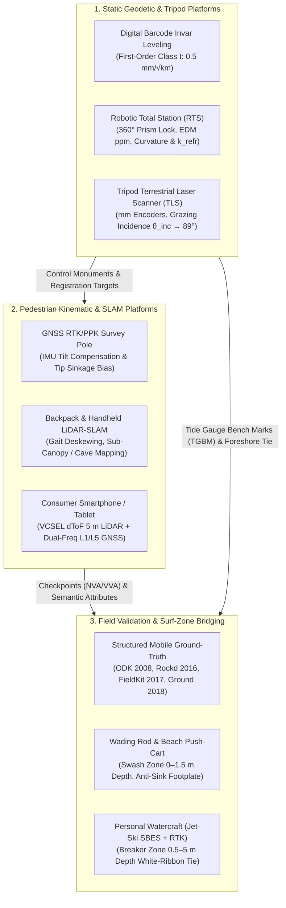

# Chapter 7: Platforms for Collecting Elevation Data

*How the carrier vehicle—from a human boot or a kite to a deep-sea AUV or a formation-flying radar satellite—shapes coverage, resolution, cost, and error.*

---

## 7.1 Humans on Foot (Pedestrian & Terrestrial Static/Mobile Surveying)

Every Digital Elevation Model (DEM) inherits the kinematic signature, viewing geometry, and environmental coupling of the physical platform that carried the sensor. Whereas Chapters 5 and 6 established the mathematical frameworks for geodetic positioning (GNSS/INS) and Simultaneous Localization and Mapping (SLAM), Chapter 7 examines how the **carrier platform** itself governs spatial resolution, swath coverage, occlusion topology, and the spatial frequency spectrum of elevation errors.

At the foundational scale of the platform hierarchy stands the **human surveyor on foot**—operating static tripods, kinematic rover poles, backpack/handheld SLAM rigs, consumer mobile devices, or surf-zone wading rods. Despite rapid advances in airborne and spaceborne remote sensing, pedestrian and static terrestrial surveys remain indispensable to terrain modeling for three fundamental reasons:

1. **Metrological Calibration and Independent Validation:** National elevation programs (such as the USGS 3D Elevation Program, 3DEP) and hydrographic standards (IHO S-44 and NOAA HSSD) require that airborne and satellite DEMs be anchored to and validated against independent ground checkpoints whose vertical uncertainty is at least three times finer than the target DEM specification (ASPRS, 2014). Only static terrestrial instruments and geodetic rover poles routinely achieve millimeter-to-centimeter absolute vertical accuracy.
2. **Sub-Canopy, Subterranean, and Overhang Access:** Airborne nadir sensors are blinded by dense forest canopies, bridge decks, cave roofs, and overhanging coastal cliffs. A human walking beneath the canopy or positioning a tripod inside a culvert reverses the viewing vector from top-down to horizontal or upward-looking.
3. **Bridging the Dynamic Land–Water Interface:** Across intertidal mudflats, salt marshes, and high-energy surf zones—the notorious coastal **"white ribbon"**—shallow depths and breaking wave foam block both hydrographic vessels and airborne bathymetric LiDAR, requiring human-operated wading rods, push-carts, and nearshore personal watercraft.



---

### 7.1.1 Classical and Modern Static Terrestrial Surveying

#### Differential Spirit Leveling and Digital Barcode Invar-Rod Leveling

Differential leveling remains the most accurate method for determining orthometric height differences ($\Delta H_{AB}$) between points separated by tens of meters to hundreds of kilometers. A leveling instrument establishes a horizontal line of sight tangent to the local equipotential surface of Earth's gravity field ($W = \text{const}$) using either a precision spirit vial or a magnetically damped pendulum compensator. In modern geodetic practice, optical readings of graduated rods have been superseded by **digital barcode levels** (e.g., Leica DNA03/LS15, Trimble DiNi), which image a binary pseudo-random barcode etched onto a tensioned **invar alloy strip** ($36\%\text{ Ni}, 64\%\text{ Fe}$, coefficient of thermal expansion $\alpha_T \approx 0.8 \times 10^{-6}\text{ K}^{-1}$) onto a linear CCD/CMOS detector array and correlate the scale pattern to resolve staff height and sight distance simultaneously.

For a single setup between a backsight rod at benchmark $A$ (reading $r_{\text{BS}}$ at horizontal distance $L_{\text{BS}}$) and a foresight rod at point $B$ (reading $r_{\text{FS}}$ at distance $L_{\text{FS}}$), the observed height difference is:

$$\Delta H_{AB} = r_{\text{BS}} - r_{\text{FS}} - (L_{\text{BS}} - L_{\text{FS}})\,\tan\varepsilon_{\text{coll}} - \frac{L_{\text{BS}}^2 - L_{\text{FS}}^2}{2 R_E}\,(1 - k_{\text{refr}}) \tag{7.1}$$

where $\varepsilon_{\text{coll}}$ is the residual instrumental collimation angle (positive when the line of sight is inclined upward above the local horizon), $R_E \approx 6\,371\,000\text{ m}$ is the mean radius of curvature of the Earth, and $k_{\text{refr}}$ is the coefficient of vertical atmospheric refraction. By strictly equalizing backsight and foresight distances ($L_{\text{BS}} = L_{\text{FS}} \le 50\text{ m}$, verified automatically by the digital level's stadia rangefinder), the collimation, Earth curvature, and symmetric refraction terms vanish to first order. Two residual systematic error sources require explicit field mitigation on long slopes: (1) **rod thermal expansion** $\Delta H_{\text{therm}} = \alpha_T\,(T - T_0)\,\Delta H_{AB}$, which is negligible for tensioned invar ($\le 1.6\text{ mm}$ per $100\text{ m}$ of elevation difference for $\Delta T = 20\text{ K}$) but reaches $46\text{ mm}$ per $100\text{ m}$ on aluminum builders' staves ($\alpha_T \approx 23 \times 10^{-6}\text{ K}^{-1}$); and (2) **Kukkamäki asymmetric differential refraction** on sustained hillslopes, where the uphill foresight ray passes near the sun-heated ground while the downhill backsight ray traverses cooler air $2\text{--}3\text{ m}$ aloft (requiring sight heights $\ge 0.5\text{ m}$ above the ground).

Under Federal Geodetic Control Subcommittee (FGCS) and NOAA National Geodetic Survey (NGS) standards (Bossler, 1984), random leveling uncertainty accumulates with the square root of the one-way leveling route length $K$ (in kilometers):

$$\sigma_{\Delta H}(K) = \alpha_{\text{level}}\sqrt{K}, \qquad \text{Maximum Section Misclosure} = c_{\text{max}}\sqrt{K} \tag{7.2}$$

For **First-Order, Class I** geodetic leveling, the experimental standard deviation per kilometer of double-run leveling is bounded by $\alpha_{\text{level}} \le 0.5\text{ mm}/\sqrt{\text{km}}$ (with maximum allowable forward-backward section misclosure $c_{\text{max}} = 3.0\text{ mm}\sqrt{K}$); First-Order, Class II specifies $\alpha_{\text{level}} \le 0.7\text{ mm}/\sqrt{\text{km}}$ ($c_{\text{max}} = 4.0\text{ mm}\sqrt{K}$). Consequently, over a $4\text{ km}$ local control network linking a coastal Tide Gauge Bench Mark (TGBM) to a GNSS Continuously Operating Reference Station (CORS) and airborne LiDAR calibration pads, digital barcode leveling achieves $\sigma_{\Delta H} \approx 1.0\text{ mm}$ ($1\sigma$, or $\text{TVU}_{95\%} \approx 2.0\text{ mm}$), providing an essentially bias-free physical realization of the vertical datum.

#### Theodolites, Total Stations, and Robotic Auto-Tracking Total Stations

Whereas spirit leveling is restricted to horizontal lines of sight ($|\Delta z| \le 3\text{ m}$ per setup), **electronic total stations** combine a dual-axis electronic theodolite (measuring horizontal azimuth $A$ and zenith angle $\zeta$ with angular standard deviations $\sigma_A, \sigma_\zeta \in [0.5'', 5'']$, or $[2.4, 24.2]\ \mu\text{rad}$) with a coaxial **Electronic Distance Measurement (EDM)** unit.

1. **EDM Atmospheric Group-Refractive-Index Correction:** An infrared or visible carrier wave (wavelength $\lambda_c \approx 650\text{--}905\text{ nm}$ or $1550\text{ nm}$) travels through the lower troposphere at the group velocity $v_g = c_0 / n_g$, where $c_0 = 299\,792\,458\text{ m s}^{-1}$ is the vacuum speed of light and $n_g$ is the group refractive index of moist air. Under the International Association of Geodesy (IAG) / Ciddor–Barrel–Sears formulation (Rüeger, 1996), the atmospheric scale correction $\Delta s_{\text{atm}}$ (expressed in parts per million, $\text{ppm} = 10^{-6}\text{ m/m} = \text{mm/km}$) relates the uncorrected slope distance $s_{\text{raw}}$ (calibrated for a reference refractive index $n_{\text{ref}}$) to the true geometric slope distance $s$:

   $$s = s_{\text{raw}}\left(1 + \Delta n_{\text{ppm}} \times 10^{-6}\right), \qquad \Delta n_{\text{ppm}} \approx N_{\text{ref}} - \left[\frac{0.269578\,N_{g0}\,P}{273.15 + T} - \frac{11.27\,e}{273.15 + T}\right] \tag{7.3}$$

   where $N_{\text{ref}} = (n_{\text{ref}} - 1)\times 10^6$ is the manufacturer's reference refractivity (typically $\sim 280\text{--}286\text{ ppm}$), $N_{g0}$ is the standard dry-air group refractivity at $0^\circ\text{C}$ and $1013.25\text{ hPa}$, $P$ is ambient barometric pressure ($\text{hPa}$), $T$ is ambient air temperature ($^\circ\text{C}$), and $e$ is partial water vapor pressure ($\text{hPa}$). Differentiating Equation (7.3) at standard conditions ($T = 15^\circ\text{C}$, $P = 1013.25\text{ hPa}$) reveals that a **$\mathbf{1^\circ\text{C}}$ error in air temperature** or a **$\mathbf{3.5\text{ hPa}}$ error in barometric pressure** introduces a **$1\text{ ppm}$ ($1\text{ mm/km}$) systematic range bias**.

2. **Trigonometric Heighting with Earth Curvature and Refraction:** Given the corrected slope distance $s$, zenith angle $\zeta$ ($0^\circ$ at local plumb zenith, $90^\circ$ horizontal), instrument optical-center height $h_i$ above station $A$, and target reflector height $h_t$ above ground point $B$, the elevation difference $\Delta H_{AB} = H_B - H_A$ is governed by the trigonometric heighting equation:

   $$\Delta H_{AB} = s\cos\zeta + (h_i - h_t) + \frac{(1 - k_{\text{refr}})\,s^2\sin^2\zeta}{2 R_E} \tag{7.4}$$

   Here, the term $+\frac{s^2\sin^2\zeta}{2R_E}$ corrects for the drop of the curved Earth surface away from the local horizontal tangent plane at $A$ ($+7.85\text{ cm}$ at $s\sin\zeta = 1\text{ km}$), while $-\frac{k_{\text{refr}}\,s^2\sin^2\zeta}{2R_E}$ accounts for the downward bending of the optical ray in a vertically stratified atmosphere of radius of curvature $R_{\text{ray}} = R_E / k_{\text{refr}}$. In a well-mixed daytime boundary layer over vegetated terrain, the **coefficient of terrestrial refraction** averages $k_{\text{refr}} \approx +0.13$ (reducing the net curvature-minus-refraction correction to $+6.83\text{ cm}$ at $1\text{ km}$). However, near the ground ($0.5\text{--}2\text{ m}$ height) over sun-heated rock or asphalt, super-adiabatic temperature lapse rates ($\partial T/\partial z \ll -0.034^\circ\text{C m}^{-1}$) bend rays *upward* ($k_{\text{refr}} < 0$, down to $-0.5$), whereas strong nocturnal or over-water temperature inversions bend rays sharply downward ($k_{\text{refr}} \to +0.5\text{ to }+1.0$). Applying first-order variance propagation to Equation (7.4) (with $\sigma_\zeta$ in radians) yields the Total Vertical Uncertainty (TVU) variance of a trigonometric height tie:

   $$\sigma_{\Delta H}^2 \approx (\cos\zeta)^2\,\sigma_s^2 + (s\sin\zeta)^2\,\sigma_\zeta^2 + \sigma_{h_i}^2 + \sigma_{h_t}^2 + \left(\frac{s^2\sin^2\zeta}{2R_E}\right)^2\sigma_{k_{\text{refr}}}^2 \tag{7.5}$$

   Notice that zenith-angle uncertainty grows linearly with distance ($s\,\sigma_\zeta$), while atmospheric refraction uncertainty grows *quadratically* ($\propto s^2\,\sigma_{k_{\text{refr}}}$). Over long lines ($s > 500\text{ m}$), **simultaneous reciprocal trigonometric leveling** (measuring $\zeta_{AB}$ from $A$ and $\zeta_{BA}$ from $B$ simultaneously) cancels the mean curvature and refraction terms identically: $\Delta H_{AB} = \frac{1}{2}\left[s(\cos\zeta_{AB} - \cos\zeta_{BA}) + (h_{iA} - h_{tB}) - (h_{iB} - h_{tA})\right]$.

3. **Robotic Auto-Tracking Total Stations (RTS):** Modern robotic total stations (e.g., Leica TS16/MS60, Trimble S9) integrate precision piezoelectric or magnetic direct-drive servos with an Automated Target Recognition (ATR) CMOS tracker that locks onto a **$360^\circ$ omnidirectional prism** carried by a lone pedestrian surveyor or mounted on a shallow-water wading rod. When operating an RTS in continuous kinematic mode (logging coordinates at $5\text{--}20\text{ Hz}$ while the surveyor walks breaklines), two platform-specific error sources arise:
   * **Facet-Dependent $360^\circ$ Prism Offset ($\Delta_{\text{prism}}$):** A $360^\circ$ prism assembly consists of six corner-cube prisms bonded around a central axis. Depending on the horizontal azimuth and vertical incidence angle from which the laser strikes the cluster, the effective optical reflection center shifts by $\pm 1.0\text{--}2.5\text{ mm}$ horizontally and vertically relative to a single oriented circular prism (Lackner & Lienhart, 2016).
   * **Angular–Range Spatiotemporal Synchronization Latency ($\Delta t_{\text{sync}}$):** If the EDM range measurement and the angular encoder readout are separated by an internal latency $\Delta t_{\text{sync}} \approx 5\text{--}25\text{ ms}$ while a surveyor walks cross-track at $v_\perp = 1.5\text{ m s}^{-1}$, a systematic cross-track horizontal bias $\Delta x_{\text{sync}} = v_\perp\,\Delta t_{\text{sync}} \approx 7.5\text{--}37.5\text{ mm}$ is injected into the trajectory unless time-tag interpolation is applied.

#### Tripod-Mounted Terrestrial Laser Scanners (TLS)

Tripod-mounted **Terrestrial Laser Scanners (TLS)**—such as the Riegl VZ-400i/VZ-2000i, Leica ScanStation P50/RTC360, and Faro Focus—extend the polar total-station paradigm to $10^5\text{--}2\times 10^6\text{ points s}^{-1}$ across a panoramic field of view ($360^\circ$ horizontal by $270^\circ\text{--}300^\circ$ vertical). Equipped with dual-axis angular encoders ($\sigma_A, \sigma_\zeta \approx 8''\text{--}18''$, or $39\text{--}87\ \mu\text{rad}$), dual-axis liquid tilt compensators ($\sigma_{\text{tilt}} \approx 1''\text{--}3''$), and pulsed time-of-flight or multi-frequency phase-shift laser rangefinders ($\sigma_r \approx 1\text{--}3\text{ mm}$ at $100\text{ m}$), static TLS achieves sub-centimeter 3D precision on vertical rock faces, dams, tunnels, and landslide scarps. Multiple tripod setups (scan stations) are registered into a unified geodetic frame either via surveyed retroreflective/spherical targets or via targetless multi-station plane-patch bundle adjustment (in commercial suites such as `RiPROCESS` and `Leica Cyclone`, or open-source pipelines using `PDAL`, `CloudCompare`, and `Open3D` multiway registration; Soudarissanane et al., 2011; Telling et al., 2017).

However, when a tripod-mounted TLS is deployed to map **flat or gently sloping terrain** (such as river floodplains, mudflats, beaches, or agricultural fields), its low vantage height $h_{\text{scanner}} \approx 1.5\text{--}2.0\text{ m}$ above the ground creates a severe geometric pathology: **grazing incidence**. Across a planar horizontal surface at horizontal radial distance $r_{\text{horiz}}$ from the tripod, the slant range $s$, incidence angle $\theta_{\text{inc}}$ (measured between the laser ray and the local upward surface normal $\mathbf{n} = [0,0,1]^T$), and elliptical footprint dimensions $(d_{\text{minor}}, d_{\text{major}})$ for a laser beam with initial exit aperture diameter $d_0$ and full-angle divergence $\beta_{\text{div}}$ (in radians) are:

$$s = \sqrt{r_{\text{horiz}}^2 + h_{\text{scanner}}^2}, \qquad \theta_{\text{inc}} = \arctan\!\left(\frac{r_{\text{horiz}}}{h_{\text{scanner}}}\right), \qquad \cos\theta_{\text{inc}} = \frac{h_{\text{scanner}}}{s} \tag{7.6}$$

$$d_{\text{minor}}(s) = d_0 + s\,\beta_{\text{div}}, \qquad d_{\text{major}}(s) = \frac{d_0 + s\,\beta_{\text{div}}}{\cos\theta_{\text{inc}}} = \frac{s\,(d_0 + s\,\beta_{\text{div}})}{h_{\text{scanner}}} \tag{7.7}$$

Equation (7.7) reveals that while the cross-radial footprint width $d_{\text{minor}}$ grows linearly with range ($\propto s$), the **radial footprint length $d_{\text{major}}$ grows quadratically with range** ($\propto s^2 / h_{\text{scanner}}$)! At $r_{\text{horiz}} = 20\text{ m}$ to $100\text{ m}$ with $h_{\text{scanner}} = 1.8\text{ m}$, the incidence angle reaches $\theta_{\text{inc}} = 84.9^\circ\text{ to }89.0^\circ$. Simultaneously, for uniform angular step increments $\Delta\alpha$ in azimuth and zenith (sweeping cross-radial arc $\Delta\ell_\perp = s\sin\theta_{\text{inc}}\,\Delta\alpha$ and radial ground step $\Delta\ell_r = s\,\Delta\alpha / \cos\theta_{\text{inc}}$), the areal ground point density $\rho_{\text{pts}}(r_{\text{horiz}}) = (\Delta\ell_\perp\,\Delta\ell_r)^{-1}$ collapses with the **inverse cube of distance**:

$$\rho_{\text{pts}}(r_{\text{horiz}}) = \frac{\cos\theta_{\text{inc}}}{s^2\sin\theta_{\text{inc}}\,(\Delta\alpha)^2} = \frac{h_{\text{scanner}}}{r_{\text{horiz}}\left(r_{\text{horiz}}^2 + h_{\text{scanner}}^2\right)(\Delta\alpha)^2} \underset{r_{\text{horiz}} \gg h_{\text{scanner}}}{\approx} \frac{h_{\text{scanner}}}{r_{\text{horiz}}^3\,(\Delta\alpha)^2} \tag{7.8}$$

Furthermore, any microtopographic protrusion—a cobble, furrow ridge, or grass tussock of height $\Delta h_{\text{obj}}$ above the mean ground plane—casts a radial **range-shadow dead zone** behind it of length:

$$L_{\text{shadow}} = \Delta h_{\text{obj}}\tan\theta_{\text{inc}} = \Delta h_{\text{obj}}\,\frac{r_{\text{horiz}}}{h_{\text{scanner}}} \tag{7.9}$$

At $r_{\text{horiz}} = 60\text{ m}$ ($h_{\text{scanner}} = 1.8\text{ m}$, $\theta_{\text{inc}} = 88.3^\circ$), a mere $10\text{ cm}$ pebble or sedge hummock casts a **$3.33\text{ m}$ radial occlusion shadow**, and the laser only illuminates the scanner-facing tops of micro-ridges, inducing a systematic positive elevation bias of $+2\text{ to }+15\text{ cm}$ in the resulting ground DEM unless the scanner is elevated on a mast/vehicle roof or supplemented by closely spaced stations.

---

### 7.1.2 Pedestrian Mobile Mapping, GNSS Rover Poles, and Consumer Handheld Sensing

#### GNSS RTK/PPK Survey Rover Poles: Tilt Compensation and Tip Sinkage

The single most ubiquitous tool for collecting DEM Ground Control Points (GCPs), topographic breaklines, and ASPRS vertical accuracy checkpoints is the **GNSS RTK/PPK survey rover pole** (typically a fixed $L_{\text{pole}} = 2.000\text{ m}$ carbon-fiber rod topped by a multi-constellation, multi-frequency GNSS receiver, processed in real time via NTRIP or post-processed in open-source `RTKLIB` or commercial suites such as `Trimble Business Center (TBC)` and `Leica Infinity`). Under NOAA National Geodetic Survey guidelines for establishing GNSS-derived ellipsoid and orthometric heights (**NGS-58 / NGS-59**; Zilkoski et al., 1997), high-accuracy static/rapid-static control checkpoints require independent re-occupations separated by at least $3\text{--}4\text{ hours}$ (to decorrelate satellite geometry and tropospheric wet delay) using fixed-height tripods or bipod-braced poles. In classical kinematic or stop-and-go GNSS surveying, the operator centers a circular spirit bubble (sensitivity $8'\text{--}20'$ per $2\text{ mm}$ division) to align the pole with the local gravity vector before recording an epoch, computing the ground-tip coordinate via a purely vertical subtraction from the Antenna Reference Point (ARP): $z_{\text{tip}}^{\text{naive}} = z_{\text{ARP}} - L_{\text{pole}}$.

If the pole is inadvertently tilted by an angle $\theta_{\text{tilt}}$ from local plumb along azimuth $\alpha_{\text{tilt}}$ (due to wind gusting, hurried walking in "continuous topo" mode, or misadjusted spirit vials), the naive vertical subtraction ($z_{\text{tip}}^{\text{naive}}$) relative to the true ground tip elevation ($z_{\text{tip}}^{\text{true}} = z_{\text{ARP}} - L_{\text{pole}}\cos\theta_{\text{tilt}}$) commits both a **systematic negative vertical bias** $\Delta z_{\text{tilt}}$ (the ARP drops along a circular arc, so subtracting the full $L_{\text{pole}}$ places the computed ground point *below* the true terrain surface) and a **horizontal position offset** $\Delta xy_{\text{tilt}}$:

$$\Delta z_{\text{tilt}} = z_{\text{tip}}^{\text{naive}} - z_{\text{tip}}^{\text{true}} = -L_{\text{pole}}(1 - \cos\theta_{\text{tilt}}) \approx -\frac{1}{2}L_{\text{pole}}\,\theta_{\text{tilt}}^2, \qquad \Delta xy_{\text{tilt}} = L_{\text{pole}}\sin\theta_{\text{tilt}} \approx L_{\text{pole}}\,\theta_{\text{tilt}} \tag{7.10}$$

For a standard $L_{\text{pole}} = 2.000\text{ m}$ pole, a modest $3^\circ$ tilt ($0.0524\text{ rad}$) causes a **$10.5\text{ cm}$ horizontal error** and a **$-2.7\text{ mm}$ vertical error**, while a $10^\circ$ tilt during rapid continuous-topo walking causes a **$34.7\text{ cm}$ horizontal error** and a **$-30.4\text{ mm}$ vertical bias**.

Modern survey rovers (e.g., Leica GS18 T, Trimble R12i, Emlid Reach RS3) eliminate this constraint via **calibration-free IMU pole-tilt compensation**. Rather than relying on solid-state magnetometers (which are easily corrupted by ferromagnetic rebar, chain-link fences, or steel sheet piling), these systems fuse a $200\text{--}400\text{ Hz}$ 6-axis MEMS IMU with carrier-phase RTK position/velocity updates in an Extended Kalman Filter (Section 5.4), resolving the pole's 3D rotation matrix $\mathbf{R}_{\text{ENU}\leftarrow B}(t) \in \text{SO}(3)$ (roll $\phi$, pitch $\theta$, yaw $\psi$) directly from the horizontal acceleration increments induced as the operator walks and tilts the pole. The exact 3D ground-tip coordinate vector in the local East-North-Up (`ENU`) frame is then:

$$\mathbf{p}_{\text{tip}}^{\text{ENU}}(t) = \mathbf{p}_{\text{ARP}}^{\text{ENU}}(t) + \mathbf{R}_{\text{ENU}\leftarrow B}(t)\begin{bmatrix} 0 \\ 0 \\ -L_{\text{pole}} \end{bmatrix} \tag{7.11}$$

Propagating the RTK-GNSS covariance $\boldsymbol{\Sigma}_{\text{ARP}}$ and the IMU attitude variances $(\sigma_{\theta_{\text{tilt}}}^2, \sigma_\psi^2$, in $\text{rad}^2)$ through the Jacobian of Equation (7.11) yields the tilt-compensated tip vertical variance $\sigma_{z,\text{tip}}^2$ and horizontal radial+azimuthal variance $\sigma_{xy,\text{tip}}^2$:

$$\sigma_{z,\text{tip}}^2 = \sigma_{z,\text{ARP}}^2 + \left(L_{\text{pole}}\sin\theta_{\text{tilt}}\right)^2\sigma_{\theta_{\text{tilt}}}^2 + \cos^2\theta_{\text{tilt}}\,\sigma_{L_{\text{pole}}}^2, \qquad \sigma_{xy,\text{tip}}^2 = \sigma_{xy,\text{ARP}}^2 + \left(L_{\text{pole}}\cos\theta_{\text{tilt}}\right)^2\sigma_{\theta_{\text{tilt}}}^2 + \left(L_{\text{pole}}\sin\theta_{\text{tilt}}\right)^2\sigma_\psi^2 + \sin^2\theta_{\text{tilt}}\,\sigma_{L_{\text{pole}}}^2 \tag{7.12}$$

With a calibrated IMU tilt accuracy of $\sigma_{\theta_{\text{tilt}}} \approx 0.15^\circ\text{--}0.30^\circ$ ($2.6\text{--}5.2\text{ mrad}$) and kinematic heading accuracy $\sigma_\psi \approx 0.5^\circ\text{--}1.5^\circ$ ($8.7\text{--}26.2\text{ mrad}$), even at a $30^\circ$ pole tilt ($L_{\text{pole}}\sin 30^\circ = 1.0\text{ m}$), the additional *vertical* uncertainty is only $\pm 2.6\text{--}5.2\text{ mm}$ ($1\sigma$), whereas the *horizontal* uncertainty grows with heading error as $L_{\text{pole}}\sin\theta_{\text{tilt}}\,\sigma_\psi \approx 8.7\text{--}26.2\text{ mm}$.

However, no IMU can detect **physical tip sinkage ($\Delta z_{\text{sink}}$)**: a sharp conical metal survey point ($1\text{--}3\text{ mm}$ tip radius) exerts $>5\text{ MPa}$ contact pressure under the weight of the pole and operator hand, penetrating $2\text{--}15\text{ cm}$ into soft estuarine mud, saturated salt-marsh peat, loose beach sand, forest duff, or snowpack. Whenever surveying soft substrates to validate a topobathymetric DEM, the sharp point **must** be replaced with a flat **$5\text{--}10\text{ cm}$ diameter topographic disk/shoe**, so that the mechanical reference plane matches the optical/acoustic reflection plane of the remote sensor.

#### Backpack and Handheld SLAM Systems vs. Consumer VCSEL LiDAR Smartphones

When dense forest canopy, deep slot canyons, or subterranean tunnels block GNSS carrier lock, pedestrian surveyors turn to **backpack and handheld mobile mapping systems** (e.g., Leica Pegasus:Backpack / BLK2GO, Faro/GeoSLAM Zeb Horizon, NavVis VLX, Emesent Hovermap) or **consumer mobile devices** equipped with solid-state depth sensors.

* **Backpack and Handheld LiDAR-SLAM Rigs:** These systems pair one or two multi-beam spinning or non-repetitive solid-state LiDARs ($16\text{--}64$ channels, $\lambda = 905\text{ nm}$, range $100\text{--}300\text{ m}$, $300\,000\text{--}1\,300\,000\text{ pts s}^{-1}$) with an industrial MEMS IMU ($200\text{--}500\text{ Hz}$) and panoramic cameras. Unlike wheeled vehicles or aircraft, a walking human subjects a backpack or handheld scanner to a $1.5\text{--}2.5\text{ Hz}$ bipedal gait cycle with heel-strike accelerations of $1\text{--}3\text{ g}$ and angular rates exceeding $60^\circ\text{ s}^{-1}$. As derived in Chapter 6 (Sections 6.2 and 6.5), accurate point cloud generation requires continuous-time or point-wise IMU motion deskewing (`Fast-LIO2`, `LIO-SAM`, `KISS-ICP`) plus closed-loop walking trajectories tied to surveyed GCP targets to bound super-linear vertical drift ($\sigma_z \approx 1\text{--}3\text{ cm}$ local relative precision; $0.1\%\text{--}0.3\%$ of path length without GNSS/GCPs).
* **Consumer Smartphones and Tablets (VCSEL dToF LiDAR + Dual-Frequency L1/L5 GNSS):** Beginning in 2020 (Apple iPad Pro 2020 and iPhone 12 Pro through 16 Pro), consumer mobile devices integrated a solid-state **Vertical-Cavity Surface-Emitting Laser (VCSEL)** array paired with a **Single-Photon Avalanche Diode (SPAD)** direct Time-of-Flight (dToF) receiver operating at $\lambda \approx 940\text{ nm}$ (Luetzenburg et al., 2021; Tavani et al., 2022). The VCSEL projects a sparse grid of near-infrared pulses whose SPAD time-of-flight measurements are fused via on-chip neural depth completion with high-resolution RGB imagery and $60\text{ Hz}$ Visual-Inertial Odometry (VIO, via ARKit/RealityKit in apps such as `Polycam`, `3dScannerApp`, and `SiteScape`).
  * **Range and Resolution Ceiling:** Because eye-safety limits ($<1\text{ mW}$ average optical power) and ambient solar background noise at $940\text{ nm}$ restrict the SPAD signal-to-noise ratio, the Apple dToF LiDAR has a strict hardware **maximum range ceiling of $5.0\text{ m}$** (optimal operating window $0.3\text{--}3.5\text{ m}$), producing meshes with $5\text{--}20\text{ mm}$ vertex spacing and $1\text{--}3\text{ cm}$ local relative accuracy over small scenes ($<10\text{ m}$ span: open utility trenches, small aggregate stockpiles, Paleolithic cave art panels, structural geology rock outcrops, and forensic crime/accident scenes). Over trajectories $>20\text{ m}$, uncompensated VIO scale and orientation drift reaches $2\%\text{--}5\%$ unless constrained by coded ArUco/AprilTag GCPs.
  * **Dual-Frequency L1/L5 Consumer GNSS:** Following the introduction of the Broadcom BCM47755 chipset (2018) and the Android Raw GNSS Measurements API, smartphones now track both L1/E1 ($1575.42\text{ MHz}$, chipping rate $1.023\text{ MHz}$, chip length $293\text{ m}$) and **L5/E5a** ($1176.45\text{ MHz}$, chipping rate $10.23\text{ MHz}$, chip length $29.3\text{ m}$). The tenfold narrower autocorrelation peak of L5 rejects reflections with path delays $>30\text{ m}$, slashing urban code multipath and enabling $0.5\text{--}1.5\text{ m}$ horizontal positioning. However, because internal smartphone antennas are tiny, linearly polarized PIFA/monopole elements without ground planes or calibrated Phase Center Variations (PCVs), standalone smartphone **vertical uncertainty remains $\text{TVU}_{95\%} \approx 2\text{--}5\text{ m}$** unless the phone is paired via Bluetooth/NTRIP with an external survey-grade RTK antenna.

---

### 7.1.3 Field Data Collection Ecosystems and Surf-Zone Wading Surveys

#### Mobile Field-Validation and Ground-Truth Ecosystems (`gis-history` Context)

A validation checkpoint or high-water mark is only scientifically defensible if its 3D coordinate is immutably bound to structured, schema-validated field metadata: land-cover class (needed to partition checkpoints into Non-Vegetated Vertical Accuracy $\text{NVA}$ vs. Vegetated Vertical Accuracy $\text{VVA}$ under ASPRS 2014), substrate firmness, rod height, tip attachment, GNSS dilution of precision, and cardinal-direction site photographs. Four key open-source milestones from the `schwehr/gis-history` chronology transformed pedestrian ground-truthing from paper notebooks into reproducible digital workflows:

1. **Open Data Kit (ODK, 2008):** Created in 2008 by Carl Hartung, Yaw Anokwa, Gaetano Borriello, and colleagues at the University of Washington (Hartung et al., 2010), **ODK** pioneered open-source, offline-first mobile data collection (`ODK Collect` / `XLSForm`) on Android devices. By enforcing conditional logic, mandatory GPS accuracy thresholds, and geotagged benchmark/land-cover photography in disconnected field environments, ODK became the global standard for humanitarian mapping, agricultural/forestry biomass inventory, and post-disaster flood High-Water Mark (HWM) surveys.
2. **Rockd (2016):** Launched in 2016 by Shanan Peters and the Macrostrat research group at the University of Wisconsin–Madison, **Rockd** turned the pedestrian smartphone into a quantitative geologic field instrument—combining offline global geological map synthesis with IMU-derived strike-and-dip bedding plane attitude measurements ($\text{strike}, \text{dip}, \text{dip direction}$) and georeferenced outcrop descriptions essential for structural terrain analysis and landslide susceptibility modeling.
3. **FieldKit (2017):** Initiated in 2017 by Conservify (led by Shah Selbe and Jer Thorp), **FieldKit** established an open-source hardware and mobile-app ecosystem for low-cost, modular environmental sensing—enabling field teams to deploy ultrasonic/pressure river-stage loggers, weather stations, and synchronized mobile calibration logs across remote, unmonitored watersheds.
4. **Google Ground (2018):** Introduced in 2018 as an open-source, map-first offline mobile data collection platform, **Ground** was engineered specifically to close the loop between overhead imagery/DEMs and pedestrian field verification—allowing surveyors to walk directly onto polygons traced over satellite or drone basemaps, verify ground-cover semantics, and record training/validation labels with centimeter-to-meter GPS provenance.

#### Surf-Zone Wading Rods, Push-Carts, and Personal Watercraft (Jet-Ski) Surveys

Along sandy beaches, barrier islands, and macro-tidal estuaries, terrestrial and marine elevation datasets frequently fail to meet across the **$0\text{ m}$ to $4\text{ m}$ depth "white ribbon"**:
* **Airborne Topobathymetric LiDAR ($532\text{ nm}$)** suffers severe photon scattering and bottom-return extinction in the surf zone due to whitecap foam (entrained air micro-bubbles) and dense plumes of wave-suspended sand.
* **Conventional Hydrographic Survey Launches** cannot safely enter breaking waves or water shallower than $1.5\text{--}2.5\text{ m}$ without risking grounding or broaching.

To construct a seamless coastal topobathymetric DEM (critical for storm-surge and tsunami inundation modeling; Ruggiero et al., 2005; Holman & Haller, 2013), coastal engineers pair two specialized human-operated nearshore platforms across the tidal cycle under **Ellipsoidally Referenced Surveying (ERS)** protocols (NOAA Field Procedures Manual, 2020; NOAA HSSD):

1. **Surf-Zone Wading Rods and Wheeled Beach Push-Carts ($0\text{ to }1.5\text{ m}$ Depth):** Operating around **low tide**, a swimmer/wader in a wetsuit or drysuit walks cross-shore transects from the dry dune toe out to chest-deep water ($\sim 1.5\text{ m}$), carrying a rigid $2.5\text{--}3.0\text{ m}$ graduated aluminum or carbon-fiber survey rod topped by an RTK-GNSS rover antenna (or $360^\circ$ RTS prism) and fitted at the base with a **$10\text{--}15\text{ cm}$ perforated circular footplate**. The wide footplate prevents the rod from sinking into wave-fluidized sand under oscillatory orbital currents, achieving $\text{TVU}_{95\%} \approx 3\text{--}5\text{ cm}$. For multi-kilometer beaches, the rod is mounted on a large-wheeled fiberglass beach push-cart (or motorized amphibious tripods such as the USACE Field Research Facility's $10.7\text{ m}$-tall **CRAB**—Coastal Research Amphibious Buggy, Birkemeier & Mason, 1984—which achieves $\pm 1\text{--}2\text{ cm}$ vertical accuracy across the entire breaker zone out to $8\text{ m}$ depth).
2. **Nearshore Personal Watercraft (Jet-Ski SBES + RTK-GNSS, $0.5\text{ to }10\text{ m}$ Depth):** Operating around **high tide** over the exact same cross-shore lines, a modified personal watercraft (PWC / jet-ski, such as the Coastal Profiling System; Dugan et al., 2001; MacMahan, 2001; Ruggiero et al., 2005) drives through plunging breakers where propeller vessels cannot survive. The jet-ski integrates a hull- or transom-mounted high-frequency **single-beam echosounder (SBES, $192\text{--}235\text{ kHz}$)**, a dual-frequency RTK-GNSS antenna mounted coaxially on a rigid mast of vertical length $\Delta z_{\text{mast}}$ directly above the transducer ($\Delta x_b = \Delta y_b = 0$), a 6-axis IMU for roll ($\phi$) and pitch ($\theta$) compensation, and a temperature/salinity sensor for local harmonic mean sound speed $c_w$. The instantaneous seabed elevation $z_{\text{bed}}(t)$ (positive-up in the vertical datum) is computed continuously at $5\text{--}20\text{ Hz}$ from the two-way acoustic travel time $\Delta\tau_{\text{acoustic}}(t)$ without requiring water-level or tidal-stage assumptions:

   $$z_{\text{bed}}(t) = z_{\text{ARP}}(t) - \Delta z_{\text{mast}}\cos\phi(t)\cos\theta(t) - \frac{1}{2}\,c_w\,\Delta\tau_{\text{acoustic}}(t)\cos\phi(t)\cos\theta(t) \tag{7.13}$$

   Because the high-tide jet-ski profile reaches landward to the $0.5\text{ m}$ water depth contour and the low-tide pedestrian wading survey reaches seaward to $1.5\text{ m}$ below low water, a tidal range of $1.5\text{ m}$ creates a **$1.0\text{--}2.5\text{ m}$ vertical/horizontal overlap zone**. Differencing the wading-rod and jet-ski elevations within this overlap strip provides an immediate, rigorous in-situ check on acoustic sound-speed calibration, transducer draft, and dynamic vessel squat ($\text{TVU}_{95\%} \approx 5\text{--}10\text{ cm}$).

---

### 7.1.4 Platform Comparison and Quantitative Error Budget

| Platform / Sensor Modality | Typical Range / Swath | Typical Point Spacing | $\text{THU}_{95\%}$ (Horizontal) | $\text{TVU}_{95\%}$ (Vertical) | Dominant Error Sources & Biases | Primary Role in DEM Workflows |
| :--- | :--- | :--- | :--- | :--- | :--- | :--- |
| **Digital Barcode Level + Invar Rod** | $5\text{--}50\text{ m}$ sights ($1\text{--}100\text{ km}$ lines) | Discrete bench marks | $\text{N/A}$ (1D height) | $1.0\text{ mm}\sqrt{K\text{ (km)}}$ | Unbalanced sight lengths ($L_{\text{BS}} \ne L_{\text{FS}}$), tripod/rod settlement, slope refraction | Primary vertical datum realization, TGBM ties, CORS leveling |
| **Robotic Total Station (RTS + $360^\circ$ Prism)** | $1\text{--}1000\text{ m}$ | $0.1\text{--}5\text{ m}$ (profiles) | $3\text{--}10\text{ mm}$ | $3\text{--}15\text{ mm}$ | Atmospheric EDM $\text{ppm}$ error, $k_{\text{refr}}$ gradient, $360^\circ$ prism facet offset, sync latency | Engineering grade control, bridge/dam monitoring, wading-rod tracking |
| **Tripod Terrestrial Laser Scanner (TLS)** | $1\text{--}500\text{ m}$ (flat ground $<60\text{ m}$) | $1\text{--}50\text{ mm}$ | $3\text{--}20\text{ mm}$ | $3\text{--}50\text{ mm}$ ($>10\text{ cm}$ at $\theta_{\text{inc}}>87^\circ$) | Grazing-incidence footprint elongation ($\propto s^2/h$), hummock range shadows, multi-station target registration | Cliff/landslide scarps, cultural heritage, local microtopography |
| **GNSS RTK/PPK Rover Pole (IMU Tilt)** | Unlimited (within base/NTRIP range) | $0.5\text{--}20\text{ m}$ (discrete/kinematic) | $1.5\text{--}3.5\text{ cm}$ | $2.5\text{--}5.0\text{ cm}$ | Canopy/urban multipath, baseline ionosphere, **physical tip sinkage** in soft mud/snow | ASPRS NVA/VVA checkpoints, photogrammetric GCPs, breaklines |
| **Backpack / Handheld LiDAR-SLAM** | $15\text{--}100\text{ m}$ local radius | $5\text{--}30\text{ mm}$ | $2\text{--}10\text{ cm}$ (with GCP/loop) | $2\text{--}10\text{ cm}$ (with GCP/loop) | Gait-induced motion blur, IMU bias drift in featureless corridors, unclosed loops | Forest understory DEMs, caves, mines, building interiors |
| **Smartphone VCSEL dToF LiDAR + L1/L5** | **$0.3\text{--}5.0\text{ m}$** hard ceiling | $5\text{--}20\text{ mm}$ | $2\text{--}10\text{ cm}$ (rel.) / $1\text{--}3\text{ m}$ (abs.) | $2\text{--}10\text{ cm}$ (rel.) / $2\text{--}5\text{ m}$ (abs.) | $5\text{ m}$ SPAD range cutoff, VIO scale drift $>15\text{ m}$, uncalibrated consumer GNSS antenna PCV | Open utility trenches, small stockpiles, rock outcrops, forensic scenes |
| **Surf-Zone Wading Rod + RTK Jet-Ski** | $0\text{--}10\text{ m}$ water depth | $0.2\text{--}2\text{ m}$ along-track | $3\text{--}8\text{ cm}$ | $4\text{--}10\text{ cm}$ | Wave bubble acoustic dropouts, rod footplate scour, jet-ski dynamic pitch/squat | Bridging the coastal "white ribbon" between terrestrial and ship surveys |

---

### 7.1.5 Worked Numerical Example and Computational Verification

Consider a coastal floodplain and beach-profile campaign combining three pedestrian instruments:
1. **Tripod TLS ($h_{\text{scanner}} = 1.80\text{ m}$, $d_0 = 5.0\text{ mm}$, $\beta_{\text{div}} = 0.30\text{ mrad}$)** scanning across a salt-marsh flat at $r_{\text{horiz}} = 50.0\text{ m}$ populated by $\Delta h_{\text{obj}} = 0.12\text{ m}$ *Spartina* grass hummocks.
2. **GNSS RTK Rover Pole ($L_{\text{pole}} = 2.000\text{ m}$)** tilted by $\theta_{\text{tilt}} = 8.0^\circ$ during continuous-topo walking, with RTK vertical accuracy $\sigma_{z,\text{ARP}} = 15.0\text{ mm}$ and IMU tilt accuracy $\sigma_{\theta_{\text{tilt}}} = 0.20^\circ$.
3. **Total Station Trigonometric Tie ($s = 800.0\text{ m}$, $\zeta = 89^\circ 30' 00''$)** over sun-baked beach sand where the operator assumes standard refraction $k_{\text{std}} = +0.13$, but the actual super-adiabatic near-ground lapse rate produces $k_{\text{true}} = -0.35$.

The Python script below computes the exact geometric distortions and vertical biases for all three scenarios:

```python
import numpy as np

# 1. Tripod TLS Grazing-Incidence Geometry on Flat Terrain (Eqs. 7.6 - 7.9)
h_scan = 1.80          # Scanner optical center height above ground [m]
r_horiz = 50.0         # Horizontal radial distance across flat marsh [m]
d0 = 0.005             # Laser beam exit diameter [m] (5 mm)
beta_div = 0.30e-3     # Full-angle beam divergence [rad] (0.3 mrad)
dh_hummock = 0.12      # Height of vegetation hummock [m] (12 cm)

s_tls = np.hypot(r_horiz, h_scan)
theta_inc_deg = np.degrees(np.arctan2(r_horiz, h_scan))
d_minor = d0 + s_tls * beta_div
d_major = d_minor * (s_tls / h_scan)
L_shadow = dh_hummock * (r_horiz / h_scan)

print(f"[TLS @ 50 m] Incidence Angle: {theta_inc_deg:.2f} deg")
print(f"[TLS @ 50 m] Footprint: d_minor = {d_minor*1e3:.1f} mm, d_major = {d_major*1e2:.1f} cm")
print(f"[TLS @ 50 m] Range-Shadow Dead Zone behind 12 cm hummock: {L_shadow:.2f} m\n")

# 2. GNSS Rover Pole Tilt Error vs. IMU Tilt Compensation (Eqs. 7.10 - 7.12)
L_pole = 2.000         # Survey pole length [m]
tilt_rad = np.radians(8.0)
sigma_z_arp = 0.015    # RTK vertical 1-sigma [m] (15.0 mm)
sigma_tilt = np.radians(0.20)  # IMU tilt 1-sigma [rad] (0.20 deg)

dz_uncomp_bias = -L_pole * (1.0 - np.cos(tilt_rad))  # z_naive - z_true [m]
dxy_uncomp_bias = L_pole * np.sin(tilt_rad)          # Horizontal offset [m]
sigma_z_imu_tip = np.hypot(sigma_z_arp, L_pole * np.sin(tilt_rad) * sigma_tilt)
tvu_95_imu = 1.9600 * sigma_z_imu_tip

print(f"[Rover Pole @ 8 deg tilt] Uncompensated Bias: dXY = {dxy_uncomp_bias*1e2:.1f} cm, dZ = {dz_uncomp_bias*1e3:.1f} mm")
print(f"[Rover Pole @ 8 deg tilt] IMU-Compensated Tip TVU_95%: +/-{tvu_95_imu*1e3:.2f} mm (vs. +/-{1.96*sigma_z_arp*1e3:.2f} mm base RTK)\n")

# 3. Total Station Trigonometric Heighting Refraction Bias: H_computed - H_true (Eq. 7.4)
R_E = 6371000.0        # Mean Earth radius [m]
s_ts = 800.0           # Slope distance [m]
zeta_rad = np.radians(89.5)
k_std, k_true = 0.13, -0.35

dz_refr_bias = ((k_true - k_std) * (s_ts * np.sin(zeta_rad))**2) / (2.0 * R_E)
print(f"[Total Station @ 800 m] Unmodeled Refraction Bias (k={k_true} vs {k_std}): {dz_refr_bias*1e3:.1f} mm")
```

Executing these equations yields three striking quantitative insights:
* **TLS Grazing Incidence at $r_{\text{horiz}} = 50.0\text{ m}$:** The laser strikes the marsh at $\theta_{\text{inc}} = 87.94^\circ$. While the cross-radial beam width is only $d_{\text{minor}} = 20.0\text{ mm}$, the radial footprint stretches to **$d_{\text{major}} = 55.6\text{ cm}$**, and every $12\text{ cm}$ grass hummock casts a **$3.33\text{ m}$ radial shadow** where the true mud surface is completely invisible to the scanner.
* **GNSS Rover Pole at $\theta_{\text{tilt}} = 8.0^\circ$:** Without IMU tilt compensation, an $8^\circ$ pole tilt shifts the coordinate horizontally by **$27.8\text{ cm}$** and biases the elevation downward by **$-19.5\text{ mm}$**. With IMU tilt compensation ($\sigma_{\theta_{\text{tilt}}} = 0.20^\circ$), the systematic bias vanishes and the $95\%$ Total Vertical Uncertainty increases by only $0.06\text{ mm}$ over the base RTK noise ($\text{TVU}_{95\%} = \pm 29.46\text{ mm}$ vs. $\pm 29.40\text{ mm}$).
* **Trigonometric Refraction over Hot Sand at $s = 800.0\text{ m}$:** Assuming $k_{\text{std}} = +0.13$ when grazing rays pass through a super-adiabatic surface layer ($k_{\text{true}} = -0.35$) induces a **$-24.1\text{ mm}$ systematic vertical bias** ($\Delta H_{\text{computed}} - \Delta H_{\text{true}}$), exceeding First-Order leveling tolerances by an order of magnitude unless reciprocal observations or short sight lengths ($s \le 150\text{ m}$) are enforced.

> [!WARNING]
> **Common Pitfalls in Pedestrian and Static Terrestrial Surveys**
> * **Surveying Soft Sediments with a Sharp Conical Rover Tip:** Using a pointed steel tip on mudflats, salt marshes, or snowpack causes $3\text{--}15\text{ cm}$ of mechanical penetration. When those checkpoints are subtracted from an airborne LiDAR DEM ($Z_{\text{LiDAR}} - Z_{\text{GNSS}}$), the analyst falsely concludes that the LiDAR has a positive vertical bias of $+5\text{ to }+15\text{ cm}$ and may erroneously shift the entire DEM downward. Always fit a $5\text{--}10\text{ cm}$ topographic disk on soft ground.
> * **Trusting Flat-Terrain TLS Point Clouds Beyond $30\text{--}40\text{ m}$:** Because $\theta_{\text{inc}} > 87^\circ$ beyond $35\text{ m}$ for a $1.8\text{ m}$ tripod, TLS returns at medium-to-long range on flat ground hit only the upper blades of grass or micro-ridge crests while leaving meters of intervening bare ground in shadow. Never use long-range tripod TLS returns as bare-earth ground truth on flat terrain.
> * **Mixing $360^\circ$ Mini-Prisms and Standard Circular Prisms Without Updating the Additive Constant:** Switching between a standard nodal prism ($c_{\text{prism}} = -34.4\text{ mm}$ or $0\text{ mm}$) and a $360^\circ$ robotic tracking prism ($c_{\text{prism}} = +23.1\text{ mm}$, Leica standard) without updating the total station firmware injects an immediate $23\text{--}57\text{ mm}$ range error into every radial tie.

> [!IMPORTANT]
> **Key Takeaways**
> 1. **Spirit/Barcode Leveling vs. Trigonometric/GNSS Heights:** Differential digital barcode leveling with balanced sight lengths ($L_{\text{BS}} = L_{\text{FS}} \le 50\text{ m}$) directly tracks the gravity equipotential surface with $\sigma_{\Delta H} \le 0.5\text{ mm}\sqrt{K}$, whereas trigonometric heighting and GNSS rover poles require explicit modeling of Earth curvature, atmospheric refraction ($k_{\text{refr}}$), and the geoid undulation ($N$).
> 2. **Vantage Height Controls Grazing Incidence:** A tripod TLS ($h \approx 1.8\text{ m}$) suffers quadratic radial footprint elongation ($d_{\text{major}} \propto s^2/h$) and inverse-cubic density decay ($\rho_{\text{pts}} \propto h/r^3$) on flat terrain; elevating the scanner onto a vehicle mast ($h \approx 4\text{ m}$) or low-altitude UAV ($h \approx 30\text{ m}$) dramatically reduces range-shadow occlusions.
> 3. **Seamless Nearshore Topobathymetry Requires Overlapping Tidal Operations:** Bridging the hazardous $0\text{--}4\text{ m}$ surf-zone "white ribbon" requires pairing low-tide pedestrian wading-rod/push-cart transects with high-tide RTK-GNSS personal watercraft (jet-ski) echosounder profiles across a common $1\text{--}2\text{ m}$ vertical overlap zone.

---

### 7.1.6 Curated References

* ASPRS. (2014). *ASPRS Positional Accuracy Standards for Digital Geospatial Data* (Edition 1, Version 1.0). Photogrammetric Engineering & Remote Sensing, 81(3), A1–A26. https://doi.org/10.14358/PERS.81.3.A1-A26
* Birkemeier, W. A., & Mason, C. (1984). The CRAB: A unique nearshore surveying vehicle. *Journal of Surveying Engineering*, 110(1), 1–7. https://doi.org/10.1061/(ASCE)0733-9453(1984)110:1(1)
* Bossler, J. D. (1984). *Standards and Specifications for Geodetic Control Networks*. Federal Geodetic Control Committee (FGCC), National Geodetic Survey, NOAA, Rockville, MD.
* Dugan, J. P., Morris, W. D., Vierra, K. C., Piotrowski, C. C., Farruggia, G. J., & Campion, D. C. (2001). Jetski-based nearshore bathymetric and current survey system. *Journal of Coastal Research*, 17(4), 900–908.
* Hartung, C., Lerer, A., Anokwa, Y., Tseng, C., Brunette, W., & Borriello, G. (2010). Open Data Kit: Tools to build information services for developing regions. In *Proceedings of the 4th ACM/IEEE International Conference on Information and Communication Technologies and Development (ICTD '10)* (Article 18, pp. 1–12). https://doi.org/10.1145/2369220.2369236
* Holman, R., & Haller, M. C. (2013). Remote sensing of the nearshore. *Annual Review of Marine Science*, 5, 95–113. https://doi.org/10.1146/annurev-marine-121211-172408
* Koenig, T. A., Bruce, J. L., O'Connor, J. E., McGee, B. D., Holmes, R. R., Jr., Hollins, R., Forbes, B. T., Kohn, M. S., Schellekens, M. F., Martin, Z. W., & Peppler, M. C. (2016). *Identifying and preserving high-water mark data* (Techniques and Methods 3–A24). U.S. Geological Survey. https://doi.org/10.3133/tm3A24
* Lackner, S., & Lienhart, W. (2016). Impact of prism type and prism orientation on the accuracy of automated total station measurements. In *Proceedings of the 3rd Joint International Symposium on Deformation Monitoring (JISDM)*, Vienna, Austria.
* Luetzenburg, G., Kroon, A., & Bjørk, A. A. (2021). Evaluation of the Apple iPhone 12 Pro LiDAR for an application in geosciences. *Scientific Reports*, 11, 22221. https://doi.org/10.1038/s41598-021-01763-9
* MacMahan, J. (2001). Hydrographic surveying from personal watercraft. *Journal of Surveying Engineering*, 127(1), 12–24. https://doi.org/10.1061/(ASCE)0733-9453(2001)127:1(12)
* Rüeger, J. M. (1996). *Electronic Distance Measurement: An Introduction* (4th ed.). Springer-Verlag, Berlin. https://doi.org/10.1007/978-3-642-80233-1
* Ruggiero, P., Kaminsky, G. M., Gelfenbaum, G., & Voigt, B. (2005). Seasonal to interannual morphodynamics along a high-energy dissipative littoral cell. *Journal of Coastal Research*, 21(3), 553–578. https://doi.org/10.2112/03-0029.1
* Soudarissanane, S., Lindenbergh, R., Menenti, M., & Teunissen, P. (2011). Scanning geometry: Influencing factor on the quality of terrestrial laser scanning points. *ISPRS Journal of Photogrammetry and Remote Sensing*, 66(4), 389–399. https://doi.org/10.1016/j.isprsjprs.2011.01.005
* Tavani, S., Billi, A., Corradetti, A., Mercuri, M., Bosman, A., Cuffaro, M., Seers, T., & Carminati, E. (2022). Smartphone assisted fieldwork: Towards the digital transition of geoscience fieldwork using LiDAR-equipped iPhones. *Earth-Science Reviews*, 227, 103969. https://doi.org/10.1016/j.earscirev.2022.103969
* Telling, J., Lyda, A., Hartzell, P., & Glennie, C. (2017). Review of Earth science research using terrestrial laser scanning. *Earth-Science Reviews*, 169, 35–68. https://doi.org/10.1016/j.earscirev.2017.04.007
* Zilkoski, D. B., D'Onofrio, J. D., & Frakes, S. J. (1997). *Guidelines for Establishing GPS-Derived Ellipsoid Heights (Standards: 2 cm and 5 cm), Version 4.3* (NOAA Technical Memorandum NOS NGS-58). National Geodetic Survey, Silver Spring, MD.
