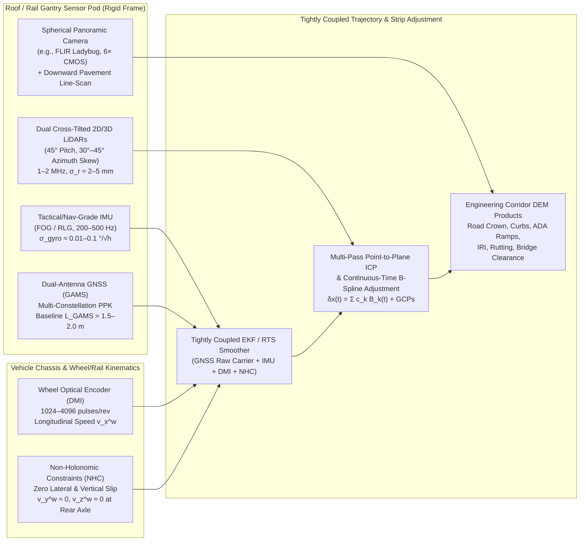

## 7.2 Car-Based and Rail-Based Surveying (Mobile Mapping Systems—MMS)

While pedestrian and tripod-mounted terrestrial laser scanners (Section 7.1) deliver millimeter-level precision over localized sites, surveying thousands of kilometers of highways, urban street grids, and railway corridors on foot is both economically prohibitive and hazardous to field crews. **Car-based and rail-based Mobile Mapping Systems (MMS)** bridge the scale gap between static terrestrial surveying and airborne mapping by mounting synchronized LiDAR scanners, panoramic and line-scan cameras, tactical- or navigation-grade Inertial Navigation Systems (GNSS/INS), and wheel-mounted odometers onto road vehicles and railway cars. Operating at normal traffic or track speeds ($30\text{–}110\text{ km/h}$, or $8.3\text{–}30.6\text{ m/s}$), a single MMS vehicle captures point densities of $2,000\text{–}15,000\text{ pts/m}^2$ along the roadway surface and adjacent building facades, achieving **$1\text{–}3\text{ mm}$ relative (local) vertical precision** and **$1\text{–}3\text{ cm}$ absolute geodetic accuracy** when supported by ground control or loop-closed trajectory adjustment.

First demonstrated by the Ohio State University **GPSVan** in **1991** (Bossler et al., 1991) and the University of Calgary **VISAT** van in **1993** (Schwarz et al., 1993; El-Sheimy, 1996), vehicle-borne mobile mapping reached planetary scale in **2007–2008** with the launch and global expansion of **Google Street View** (`gis-history` 2008 milestone; Anguelov et al., 2010). By pairing roof-mounted spherical multi-camera rosettes (such as Point Grey / FLIR **Ladybug** panoramic cameras) with 3D laser rangefinders, GNSS/INS, and wheel encoders across millions of kilometers of public roads, Street View proved that continuous street-level 3D geometry and radiometry could be acquired, georeferenced, and served globally. In the decade following the 2005–2007 DARPA Grand and Urban Challenges, road- and rail-borne MMS bifurcated into three specialized engineering classes:
1. **3D Corridor Mobile Mapping Pods** (e.g., Riegl VMX-2HA, Leica Pegasus:Two Ultimate, Trimble MX9, ZF Profiler 9012) for highway engineering, urban digital twins, utility asset management, and autonomous-vehicle (AV) High-Definition (HD) maps;
2. **High-Speed Highway Pavement Laser Profilers** (e.g., Pavemetrics LCMS-2, Greenwood Profilograph, SSI inertial profilers) for millimeter-scale pavement roughness, rutting, faulting, and micro-drainage modeling; and
3. **Rail-Borne Track Geometry and Clearance Cars** (e.g., Plasser & Theurer EM-SAT, ENSCO, Amberg GRP, Applanix POS TG) for track gauge, cant (superelevation), ballast profiling, and tunnel structure gauge verification.



---

### 7.2.1 Architecture of Road and Rail Mobile Mapping Systems

#### Multi-Sensor Roof Pods and Dual-LiDAR Cross-Fire Geometry

A modern survey-grade road MMS mounts its primary optical and inertial payload on a rigid, thermally stable carbon-fiber or machined aluminum roof gantry at height $h_s \approx 2.0\text{–}2.6\text{ m}$ above the pavement, isolating the IMU, LiDARs, and cameras from differential chassis flex so that factory and boresight lever arms remain constant to sub-millimeter and arc-second tolerances. Rather than pointing a single scanner straight down (which would miss vertical building facades) or horizontally (which would strike the road at grazing incidence and suffer severe vehicle-roof occlusion), production MMS pods typically deploy **dual 2D single-beam profile scanners or 3D multi-beam spinning LiDARs** in a **tilted cross-fire ("butterfly") configuration**:

- **Cross-Track Pitch Tilt ($\alpha_{\text{pitch}} \approx 45^\circ$):** Each scanner head is tilted backward by approximately $45^\circ$ relative to the local vertical, so its $360^\circ$ rotating mirror sweeps an inclined plane that intersects the road surface $2\text{–}3\text{ m}$ behind the rear bumper as well as the full vertical extent of adjacent curbs, utility poles, bridge soffits, and multi-story building facades.
- **Azimuth Toe-Out Skew ($\beta_{\text{yaw}} \approx \pm 30^\circ\text{–}45^\circ$):** The left and right scanner planes are rotated outward symmetrically around the vertical axis. As the vehicle advances along the $x$-axis at speed $v$, the two inclined scan planes trace intersecting **crisscrossing helices** across the corridor. If a parked car, tree trunk, or signpost blocks the forward-angled scan ray from the left scanner, the backward-angled ray from the right scanner illuminates the occluded face milliseconds later.

Given a laser pulse repetition rate $f_{\text{PRR}}$ (typically $500\text{ kHz}$ to $2.0\text{ MHz}$ across dual scanners), mirror rotation frequency $f_{\text{scan}}$ ($100\text{–}250\text{ Hz}$), and vehicle forward speed $v$, let $R_0 = h_s / \cos\alpha_{\text{pitch}}$ denote the slant range in the tilted scan plane from the scanner to the road centerline ($y = 0$). The along-track spacing between successive scan lines and the cross-track point spacing along the ground scan trace are:

$$\Delta x_{\text{scan}} = \frac{v}{f_{\text{scan}}}, \qquad \Delta y_{\text{cross}}(y) = \frac{2\pi f_{\text{scan}}}{f_{\text{PRR}}} \frac{R_0^2 + y^2}{R_0}, \quad R_0 = \frac{h_s}{\cos\alpha_{\text{pitch}}}$$

At $v = 15\text{ m/s}$ ($54\text{ km/h}$), $f_{\text{scan}} = 200\text{ Hz}$, and $f_{\text{PRR}} = 1.0\text{ MHz}$ per scanner ($5000\text{ pts/rev}$), successive scan lines are spaced by $\Delta x_{\text{scan}} = 7.5\text{ cm}$ along the direction of travel, while cross-track point spacing directly beneath the vehicle ($h_s = 2.2\text{ m}, \alpha_{\text{pitch}} = 45^\circ \implies R_0 = 3.11\text{ m}, y = 0$) is $\Delta y_{\text{cross}}(0) \approx 3.9\text{ mm}$ (expanding to $14.0\text{ mm}$ at $y = 5.0\text{ m}$)—yielding an anisotropic point distribution that is ultra-dense across the lane profile and moderately spaced along the driving direction. Synchronized with the LiDARs via hardware GNSS Pulse-Per-Second (PPS) triggers is a $360^\circ$ **spherical panoramic camera** (such as the six-lens FLIR Ladybug5+/Ladybug6 or multi-camera ring arrays) triggered at fixed distance intervals (e.g., every $\Delta s = 2\text{–}5\text{ m}$) via DMI pulses to colorize the point cloud and enable photogrammetric feature verification.

#### Tightly Coupled GNSS/INS, GAMS, Wheel Odometry (DMI), and Non-Holonomic Constraints (NHC)

Unlike an aircraft flying in unobstructed sky, a ground vehicle accelerates, brakes, turns sharply, and stops at traffic lights while passing beneath highway overpasses, dense street trees, and urban canyons. To maintain continuous 6-DoF pose estimation $(\mathbf{p}_{wb}^n(t), \mathbf{R}_b^n(t))$ processed in tightly coupled post-processing suites (such as Applanix `POSPac MMS` or NovAtel `Inertial Explorer`), road and rail MMS platforms (**Applanix POS LV** for road vehicles, **POS TG** for track geometry cars, or **NovAtel SPAN**) augment their tactical- or navigation-grade Fiber-Optic Gyro (FOG) or Ring-Laser Gyro (RLG) IMU with three ground-specific aiding mechanisms:

1. **GNSS Azimuth Measurement Subsystem (GAMS):** When a road vehicle sits stationary at a red light or crawls through heavy traffic, horizontal kinematic accelerations are too weak to make IMU heading $(\psi)$ observable through Kalman filter motion alignment alone. A dual-antenna GNSS array separated by a rigid roof baseline $\boldsymbol{\ell}_{\text{GAMS}}^b$ ($1.5\text{–}2.0\text{ m}$) resolves single-epoch carrier-phase double differences to provide a drift-free heading measurement with standard deviation $\sigma_\psi \approx \frac{\sigma_{\Delta\phi}}{L_{\text{GAMS}}} \approx \frac{3\text{ mm}}{2.0\text{ m}} = 1.5\text{ mrad} \approx 0.086^\circ$, even at zero velocity.
2. **Distance Measurement Indicator (DMI) / Wheel Optical Encoder:** Mounted directly to the non-steered rear wheel hub, a quadrature optical shaft encoder emits $N_{\text{pulses}}$ discrete electrical pulses per revolution (typically $1024\text{–}4096\text{ pulses/rev}$), detecting both forward and reverse rotation. Given the nominal effective tire rolling radius $r_0$ and a time-varying **DMI scale-factor error** $s_{\text{DMI}}(t)$ (which varies by $0.1\%\text{–}0.5\%$ with tire inflation pressure, thermal expansion, vehicle payload, and centrifugal growth at highway speed), the measured longitudinal speed at the wheel contact frame ($w$-frame) over interval $\Delta t$ with pulse count $\Delta n$ is:
   $$v_{\text{DMI}} = \frac{2\pi r_0}{N_{\text{pulses}}} \frac{\Delta n}{\Delta t}$$
   Furthermore, when $\Delta n = 0$ over consecutive epochs, the DMI triggers an automatic **Zero-Velocity Update (ZUPT)** and **Zero Integrated Heading Rate (ZIHR)** constraint, clamping all three velocity components ($\mathbf{v}^n = \mathbf{0}$) and estimating gyro and accelerometer biases while stopped in traffic.
3. **Non-Holonomic Constraints (NHC):** As formalized by Dissanayake et al. (2001) and Niu et al. (2007), a wheeled vehicle rolling without lateral skidding or vertical wheel lift cannot move sideways or vertically at the rear axle contact point. In the wheel contact frame ($w$-frame, with $x^w$ aligned along the wheel rolling direction, $y^w$ transverse along the axle, and $z^w$ normal to the road surface), the 3D velocity vector satisfies a pseudo-measurement equation:

$$\mathbf{z}_v^w = \begin{bmatrix} v_{\text{DMI}} \\ 0 \\ 0 \end{bmatrix} = \mathbf{D}_{\text{scale}}^{-1} \mathbf{C}_b^w \left( \mathbf{C}_n^b \mathbf{v}^n + \boldsymbol{\omega}_{nb}^b \times \boldsymbol{\ell}_{bw}^b \right) + \boldsymbol{\eta}_v^w, \qquad \mathbf{D}_{\text{scale}} = \text{diag}(1 + s_{\text{DMI}}, 1, 1)$$

where $\mathbf{v}^n \in \mathbb{R}^3$ is the IMU velocity in the local navigation frame (East-North-Up or North-East-Down), $\mathbf{C}_n^b$ is the navigation-to-body rotation matrix, $\boldsymbol{\omega}_{nb}^b$ is the body angular rate vector corrected for Earth rotation and transport rate, $\boldsymbol{\ell}_{bw}^b$ is the 3D lever arm from the IMU reference center to the rear wheel-ground contact point, $\mathbf{C}_b^w$ is the small boresight rotation matrix between the IMU body frame and the wheel frame, and $\boldsymbol{\eta}_v^w \sim \mathcal{N}(\mathbf{0}, \mathbf{R}_{v}^w)$ accounts for tire slip, suspension deflection, and pavement micro-roughness (typically $\sigma_{v_x} \approx 0.02\text{ m/s}$, $\sigma_{v_y} \approx 0.03\text{ m/s}$, $\sigma_{v_z} \approx 0.02\text{ m/s}$). Crucially, the vertical non-holonomic constraint ($v_z^w \approx 0$) directly couples forward speed $v_x^w$ with the vehicle pitch angle $\theta$ and upward vertical velocity $v_z^n$ ($v_z^n \approx v_x^w \sin\theta$), clamping the unconstrained quadratic vertical drift from accelerometer bias ($\propto \frac{1}{2} \delta b_z \Delta t^2$) and cubic drift from pitch-rate gyro bias ($\propto \frac{1}{6} g \, \delta b_{\omega_y} \Delta t^3$) during GNSS blackouts.

#### High-Speed Highway Pavement Laser Profilers and Rail Track Geometry Cars

For state Departments of Transportation (DOTs) and national railway authorities, general-purpose $360^\circ$ spinning LiDARs (~$2\text{–}5\text{ mm}$ range noise) are supplemented by specialized sub-millimeter profiling instruments:

- **Highway Pavement Laser Profilers ($100\text{ km/h}$):** Modern pavement condition survey vehicles integrate two complementary optical-inertial subsystems:
  1. **Inertial Profilometers (ASTM E950 / AASHTO R 56 & M 328):** A high-bandwidth single-spot or wide-spot laser triangulation/time-of-flight rangefinder ($f_s \ge 16\text{ kHz}$, vertical resolution $\le 0.05\text{ mm}$) mounted in each wheel path measures the instantaneous vertical distance $h_{\text{laser}}(s)$ from the vehicle bumper/chassis down to the pavement, while a co-located precision servo-accelerometer measures upward vertical chassis acceleration $\ddot{z}_{\text{chassis}}(t)$. Double-integrating the accelerometer signal in the spatial domain ($s = \int v\,dt$, high-pass filtered at cutoff wavelength $\lambda_c \approx 91\text{ m}$ to remove low-frequency bias drift) and subtracting the downward laser range yields the true longitudinal road elevation profile $z_{\text{road}}(s)$, freed from vehicle suspension bounce:
     $$z_{\text{road}}(s) = \iint \frac{\ddot{z}_{\text{chassis}}(s)}{v^2}\,ds^2 - h_{\text{laser}}(s)$$
     This longitudinal profile is fed through the standardized **Quarter-Car Simulation (QCS)** mechanical filter (a "Golden Car" sprung mass supported by a suspension spring/damper above an unsprung tire mass simulated at the standard reference speed $v_{\text{ref}} = 80\text{ km/h} = 22.22\text{ m/s}$; Sayers, 1995; ASTM E1926) to compute the **International Roughness Index ($\text{IRI}$)**, defined as the accumulated vertical suspension stroke divided by traveled profile length $L$ (expressed in $\text{m/km}$ or $\text{in/mi}$):
     $$\text{IRI} = \frac{1}{L} \int_0^{L/v_{\text{ref}}} \left| \dot{z}_{\text{sprung}}(t) - \dot{z}_{\text{unsprung}}(t) \right| dt$$
  2. **3D Transverse Line-Scan Laser Profilers (e.g., Pavemetrics LCMS-2):** Twin downward-looking sheet-of-light laser projectors illuminate a $4.0\text{ m}$-wide transverse line across the full lane, imaged by high-speed scheimpflug CMOS cameras at $28\text{ kHz}$ with $4096$ transverse pixels ($1\text{ mm}$ cross-track spacing, $0.5\text{ mm}$ vertical precision). From each transverse elevation profile $z(y)$, software automatically extracts **wheel-path rut depth** $d_{\text{rut}}$ (the maximum vertical distance between the pavement surface and a virtual $1.8\text{ m}$ straightedge or tensioned wire spanning the wheel path), **pavement cross-slope** $\tan\alpha_{\text{cross}} = \partial z / \partial y$ (coupled with IMU roll $\phi$ to detect hydroplaning-prone flat spots where drainage slope falls below $1.5\%$), joint faulting, macrotexture Mean Profile Depth (MPD), and $0.5\text{ mm}$-wide surface cracks.
- **Rail-Borne Track Geometry and Clearance Cars:** Railway MMS platforms enjoy a decisive kinematic advantage over road vehicles: steel wheels guided by steel rails eliminate pneumatic tire compression and lateral drift, reducing NHC noise to sub-millimeter levels. High-speed **Track Geometry Cars** (operating at $80\text{–}300\text{ km/h}$ using systems such as **Applanix POS TG** and optical laser-chord / inertial gauge modules) measure the 3D centerline trajectory and the internal geometry of the track:
  - **Track Gauge ($G$):** The perpendicular distance between the inner gauge faces of the two rails measured $14\text{–}16\text{ mm}$ ($5/8\text{ in}$) below the Top of Rail (TOR), compared against nominal standard gauge ($G_0 = 1435.0\text{ mm}$);
  - **Cant / Superelevation ($\Delta h_{\text{cant}}$):** The cross-level elevation difference between the left and right TOR across the rail head centerline spacing ($b_{\text{rail}} \approx 1500\text{ mm}$), $\Delta h_{\text{cant}} = b_{\text{rail}} \sin\phi$, engineered to balance centrifugal acceleration $\frac{v^2}{R}$ in curves;
  - **Twist, Alignment, and Longitudinal Level:** Short-, medium-, and long-chord vertical and horizontal rail deviations ($3\text{–}150\text{ m}$ wavelengths) governing derailment safety; and
  - **Ballast Profile, Overhead Catenary, and Tunnel Structure Gauge:** Synchronized 2D/3D roof profilers measure crushed-stone ballast shoulder volume, overhead contact wire height and lateral stagger relative to TOR, and millimeter clearances inside tunnels and station platforms against kinematic rolling-stock envelopes.

| Platform Class | Representative Sensors & Georeferencing | Typical Survey Speed | Relative Precision (Local $<10\text{ m}$) | Absolute Accuracy (Open Sky / GCPs) | Primary DEM & Engineering Deliverables |
| :--- | :--- | :--- | :--- | :--- | :--- |
| **3D Corridor MMS Pod** (Car / Van Roof) | Riegl VMX-2HA, Leica Pegasus:Two, Trimble MX9; Applanix POS LV (FOG IMU + GAMS + DMI); Ladybug6 | $30\text{–}80\text{ km/h}$ ($8\text{–}22\text{ m/s}$) | $1\text{–}3\text{ mm}$ vertical, $3\text{–}5\text{ mm}$ horizontal | $10\text{–}25\text{ mm}$ $(Z)$, $10\text{–}20\text{ mm}$ $(X,Y)$ | Road crown, curbs/gutters, ADA ramps, catch basins, bridge clearance, AV HD maps |
| **Highway Pavement Laser Profiler** | Pavemetrics LCMS-2 (4096-px 3D line-scan) + ASTM E950 Inertial Profiler + POS LV | $80\text{–}110\text{ km/h}$ ($22\text{–}31\text{ m/s}$) | $0.1\text{–}0.5\text{ mm}$ vertical, $1.0\text{ mm}$ transverse | $15\text{–}30\text{ mm}$ $(Z)$ (corridor-level) | $\text{IRI}$ ($\text{m/km}$), rut depth ($\text{mm}$), cross-slope ($\%$), MPD macrotexture, crack maps |
| **Rail Track Geometry & Tunnel Car** | Applanix POS TG + Optical Rail-Head Laser Gauge + Z+F Profiler 9012 (200 Hz) | $60\text{–}250\text{ km/h}$ ($17\text{–}70\text{ m/s}$) | $0.2\text{–}0.5\text{ mm}$ (gauge/cant), $1\text{–}2\text{ mm}$ (tunnel wall) | $5\text{–}15\text{ mm}$ $(Z)$ tied to track control monuments | Track gauge ($1435\text{ mm}$), cant/superelevation, ballast profile, catenary, tunnel clearance |
| **Crowd-Sourced AV / Fleet Vehicles** | Automotive Solid-State/MEMS LiDAR, Monocular/Stereo Cameras, Consumer IMU + Wheel Ticks | $10\text{–}120\text{ km/h}$ (millions of passes) | $10\text{–}30\text{ mm}$ (single pass), $5\text{–}10\text{ mm}$ (multi-pass mean) | $30\text{–}100\text{ mm}$ (aligned to base HD map) | Semantic lane graphs, curb breaklines, change detection (work zones, potholes) |

---

### 7.2.2 Engineering Applications: Curbs, Gutters, ADA Ramps, Crown, Underpasses, and HD Maps

Airborne nadir LiDAR (typical pulse density $8\text{–}30\text{ pts/m}^2$, footprint diameter $15\text{–}30\text{ cm}$, single-pulse vertical noise $\sigma_z \approx 3\text{–}8\text{ cm}$) cannot resolve the sharp centimeter-scale breaklines that govern urban surface hydrology, pavement repaving design, and pedestrian accessibility. Under **NCHRP Report 748** (*Guidelines for the Use of Mobile LIDAR in Transportation Applications*; Olsen et al., 2013) and the **ASPRS Positional Accuracy Standards** (2014/2023), high-accuracy engineering corridor surveys require local relative vertical precision $\le 1\text{–}3\text{ mm}$ and network-adjusted absolute vertical accuracy $\text{RMSE}_z \le 1.0\text{–}2.5\text{ cm}$ ($\text{VVA}_{95} = 1.96\,\text{RMSE}_z \le 2.0\text{–}4.9\text{ cm}$). Road- and rail-borne MMS (processed in specialized CAD/BIM feature-extraction suites such as `TopoDOT`, `TerraScan`, `Leica Cyclone`, or open-source `PDAL` and `CloudCompare` pipelines) fills this niche because its short slant range ($R \approx 2.2\text{–}10\text{ m}$), millimeter laser beam waist ($2\text{–}6\text{ mm}$), and $5,000+\text{ pts/m}^2$ point density preserve high-frequency topographic gradients:

1. **Roadway Crown, Cross-Slope, and Curb-and-Gutter Flowlines:** Urban roadways are graded with a central **crown** breakline pitching outward at a nominal $1.5\%\text{–}2.5\%$ cross-slope toward concrete **curb-and-gutter** channels. A standard barrier curb and gutter comprises four distinct geometric breaklines separated by only $15\text{–}45\text{ cm}$ horizontally: the *lip of gutter* (pavement-gutter seam), the *gutter flowline / invert* (lowest hydraulic elevation), the *top face of curb* ($10\text{–}20\text{ cm}$ above the flowline), and the *back of curb*. Resolving the $1\text{–}2\text{ cm}$ drop from the lip of gutter to the flowline—and the longitudinal gutter grade (often as flat as $0.3\%\text{–}0.5\%$, or $3\text{–}5\text{ mm}$ per meter)—requires MMS relative vertical precision ($\sigma_{\Delta z} \le 2\text{ mm}$). In coastal and estuarine cities (e.g., Miami, Norfolk, Rotterdam), continuous MMS gutter flowline and **stormwater catch-basin grate** invert elevations provide the exact hydraulic sill heights where high-tide ("sunny-day") estuarine backwater surges up storm drains and spills onto street surfaces; similarly, ATV- and truck-mounted coastal MMS surveys along low-tide ocean beaches and seawalls provide the subaerial topographic boundary that ties directly into nearshore jet-ski and USV bathymetry (Sections 7.1 and 7.4).
2. **ADA Curb-Ramp Compliance Auditing:** Under the Americans with Disabilities Act (ADA) Standards for Accessible Design (PROWAG), pedestrian curb ramps at street intersections must satisfy strict slope tolerances: a maximum **running slope of $8.33\%$ ($1:12$)**, a maximum **cross-slope of $2.0\%$ ($1:48$)**, flare slopes $\le 10.0\%$, and a top landing of at least $1.22\text{ m} \times 1.22\text{ m}$ ($4\text{ ft} \times 4\text{ ft}$) with slope $\le 2.0\%$ in all directions, plus flush transitions at the gutter counter-slope ($\le 5.0\%$). Because an error of just $\pm 1.5\text{ cm}$ across a $1.2\text{ m}$ ramp changes the computed slope by $\pm 1.25\%$—enough to falsely pass or fail legal compliance—DOTs rely on MMS point clouds segmented into planar ramp facets via RANSAC plane fitting ($ax + by + cz + d = 0$), where the local surface normal $\mathbf{n} = [n_x, n_y, n_z]^\top$ directly yields the total slope $\tan\beta = \frac{\sqrt{n_x^2 + n_y^2}}{|n_z|}$ with sub-$0.1\%$ local repeatability.
3. **Highway Bridge Underpass and Overhead Utility Clearances:** Airborne LiDAR is completely blind to the underside (soffit and girders) of highway overpasses and tunnels. MMS vehicles driving beneath bridges capture both the underlying pavement lanes and the overhead steel/concrete girders within the same millisecond scan revolution. Because any residual GNSS/INS trajectory vertical bias $\delta z_{\text{traj}}(t)$ cancels out in the simultaneous difference, the **vertical clearance height** $H_{\text{clear}}(x,y) = z_{\text{girder}}(x,y) - z_{\text{pavement}}(x,y)$ is recovered with millimeter accuracy across every travel lane and shoulder, flagging low-clearance strikes induced by successive asphalt overlays. Similarly, MMS extracts 3D **utility poles**, cross-arms, and overhead power/telecom conductors, fitting catenary curves $z(s) = z_0 + a\cosh\!\left(\frac{s - s_0}{a}\right)$ to verify National Electrical Safety Code (NESC) vertical sag clearances above roadways and rail tracks.
4. **Autonomous-Vehicle (AV) High-Definition (HD) Maps:** Level 4 autonomous driving fleets (e.g., Waymo, Cruise, Zoox) and crowd-sourced mapping platforms (e.g., Mobileye REM, TomTom RoadDNA, HERE HD Live Map) rely on multi-layered **HD Maps** comprising: (a) a centimeter-resolved **3D ground elevation and intensity/reflectance raster** used for real-time 6-DoF online LiDAR/visual localization; (b) 3D parametric **curb and barrier polylines**; and (c) a **semantic lane graph** encoding lane centerlines, stop bars, crosswalks, and 3D traffic signals. Survey-grade MMS fleets establish the geodetic backbone DEM, while millions of consumer vehicles equipped with forward cameras, radar, and wheel encoders transmit lightweight semantic landmark packets (lane markings, curb edges, poles) that are aggregated in the cloud via factor-graph bundle adjustment to detect road work zones and repaving within hours.

---

### 7.2.3 Urban Canyon Trajectory Degradation, Multi-Pass Alignment, and Occlusion Shadows

#### GNSS Multipath, Dilution of Precision, and Vertical Drift in Urban Canyons

The supreme operational challenge of car-based MMS is the **urban canyon**: street corridors flanked by continuous high-rise buildings of height $H_{\text{bldg}} = 30\text{–}200\text{ m}$ across a street width $W_{\text{street}} = 15\text{–}30\text{ m}$ (aspect ratio $H/W > 2$). Above the vehicle roof, the cross-street sky elevation mask angle rises to $\theta_{\text{mask}} = \arctan\!\left(\frac{2 H_{\text{bldg}}}{W_{\text{street}}}\right) \approx 70^\circ\text{–}85^\circ$, leaving only a narrow slit of sky aligned along the street azimuth. This geometry inflicts a dual catastrophe on GNSS positioning:
- **Severe Dilution of Precision (PDOP and VDOP):** Because all remaining line-of-sight (LOS) satellites lie in a single vertical plane parallel to the street centerline and at high elevation angles, cross-track horizontal observability collapses and vertical-to-clock correlation spikes, driving $\text{VDOP}$ from $\sim 1.5$ in open sky to $6\text{–}20+$.
- **Non-Line-of-Sight (NLOS) Multipath Reflections:** Signals from blocked cross-street satellites bounce off specular glass and concrete building facades before reaching the roof antenna. An NLOS reflection always travels a longer path than the blocked direct ray, injecting a strictly positive pseudorange bias $\Delta\rho_{\text{NLOS}} = d_{\text{reflected}} - d_{\text{direct}} \approx 2 w_{\text{wall}} \cos\theta_{\text{el}} \sin\Delta\alpha \in [5\text{ m}, 60\text{ m}]$ and carrier-phase cycle slips that corrupt Post-Processed Kinematic (PPK) ambiguity resolution.

When PPK carrier-phase locks are lost or rejected by innovation gating over an urban canyon outage of duration $\Delta t$, the MMS trajectory falls back on INS + DMI + NHC dead reckoning. Without DMI/NHC aiding, free-inertial vertical position error $\sigma_{z,\text{free}}(\Delta t)$ grows due to initial vertical velocity error $\sigma_{v_{z,0}}$ (often corrupted by NLOS pulls just before lock loss) and uncompensated vertical accelerometer/gravity bias $\sigma_{b_z}$ ($\frac{1}{2}\sigma_{b_z}\Delta t^2$), while horizontal position drifts quadratically with pitch/roll tilt error $\sigma_{\theta,0}$ ($\frac{1}{2}g\,\sigma_{\theta,0}\Delta t^2$). When DMI + NHC aiding ($v_z^w \approx 0$) is active, the unbounded $\frac{1}{2}\sigma_{b_z}\Delta t^2$ vertical accelerometer drift is clamped because $v_z^n(t)$ is tied to forward speed via pitch ($v_z^n \approx v_x^w \sin\theta$). Over forward travel distance $\Delta s = v \Delta t$, the NHC-constrained **vertical trajectory uncertainty** $\sigma_{z,\text{NHC}}(\Delta t)$ is governed by residual pitch uncertainty $\sigma_{\theta,\text{NHC}} \approx \sigma_{b_x}/g$ and integrated NHC vertical velocity noise $\sigma_{v_z,\text{NHC}}$ with correlation time $\tau_v$ (typically $\tau_v \approx 1.0\text{ s}$):

$$\sigma_{z,\text{NHC}}(\Delta t) \approx \sqrt{ \sigma_{z,0}^2 + \left( \Delta s \, \sigma_{\theta,\text{NHC}} \right)^2 + \sigma_{v_z,\text{NHC}}^2 \, \tau_v \, \Delta t }$$

Without DMI/NHC, pure inertial navigation with a tactical-grade IMU ($\sigma_{b_z} \approx 50\text{ }\mu\text{g} \approx 5\times 10^{-4}\text{ m/s}^2$, $\sigma_{\theta,0} \approx 0.02^\circ$) coupled with NLOS GNSS velocity pulls can drift vertically by **$0.5\text{–}3.0\text{ m}$ over a single $200\text{ m}$ city block** ($60\text{–}120\text{ s}$ including traffic stops). Even with tightly coupled RTS (Rauch–Tung–Striebel) forward-backward smoothing and DMI/NHC ($\sigma_{\theta,\text{NHC}} \approx 0.015^\circ \approx 0.26\text{ mrad}$), a $400\text{ m}$ GNSS blackout leaves a residual vertical trajectory bow of $\sigma_z \approx 400\text{ m} \times 2.6\times 10^{-4}\text{ rad} \approx \mathbf{10.4\text{ cm}}$.

#### Multi-Pass (Strip-to-Strip) Trajectory Adjustment

When an MMS vehicle maps an urban grid, it traverses each street in opposite directions or intersects north–south avenues with east–west cross streets minutes or hours apart. Residual trajectory drift $\delta\mathbf{x}(t) = [\delta x(t), \delta y(t), \delta z(t), \delta\phi(t), \delta\theta(t), \delta\psi(t)]^\top$ manifests immediately in the merged point cloud as **vertical "ghosting" or double surfaces**: two parallel road surfaces separated by $5\text{–}30\text{ cm}$ at an intersection, or split curb faces that corrupt DEM interpolation into artificial steps.

Because the trajectory error $\delta\mathbf{x}(t)$ is driven by smoothly varying inertial biases, it cannot be fixed by a single rigid 6-DoF shift per pass. Instead, modern MMS post-processing engines (e.g., Riegl `RiPROCESS`, Leica `Pegasus Office`, Trimble `Business Center`, and open-source factor-graph solvers built on `Ceres Solver` or `GTSAM`) parameterize the trajectory correction as a **continuous-time cubic B-spline or piecewise-linear spline** spaced at knot intervals $\Delta\tau_{\text{knot}} \approx 1\text{–}5\text{ s}$:

$$\delta\mathbf{x}(t) = \sum_{k=1}^{K} \mathbf{c}_k B_k(t)$$

The control vertices $\{\mathbf{c}_k\}$ are estimated by minimizing a joint weighted nonlinear least-squares objective combining: (1) **Point-to-Plane ICP correspondence factors** between overlapping planar patches $(\mathbf{p}_i(t_a), \mathbf{p}_j(t_b))$ with surface normal $\mathbf{n}_j$ extracted from intersecting passes at times $t_a$ and $t_b$; (2) **absolute Ground Control Point (GCP) factors** at surveyed pavement targets (e.g., painted chevrons, manhole rims, catch-basin corners); and (3) **INS stiffness regularization priors** penalizing physically implausible high-frequency trajectory kinks between knots $\mathbf{c}_k$ and $\mathbf{c}_{k+1}$:

$$\min_{\{\mathbf{c}_k\}} \sum_{(i,j) \in \mathcal{C}_{\text{ICP}}} w_{ij} \left( \mathbf{n}_j^\top \left[ \left(\mathbf{p}_i + \mathbf{J}_i \delta\mathbf{x}(t_a)\right) - \left(\mathbf{p}_j + \mathbf{J}_j \delta\mathbf{x}(t_b)\right) \right] \right)^2 + \sum_{m \in \mathcal{C}_{\text{GCP}}} \left\| \mathbf{p}_m + \mathbf{J}_m \delta\mathbf{x}(t_m) - \mathbf{x}_{\text{GCP},m} \right\|_{\mathbf{\Sigma}_m^{-1}}^2 + \sum_{k=1}^{K-1} \left\| \mathbf{c}_{k+1} - \mathbf{c}_k \right\|_{\mathbf{\Lambda}_{\text{INS}}(t_k)}^2$$

This strip-to-strip trajectory adjustment collapses $10\text{–}30\text{ cm}$ urban canyon vertical discrepancies down to **$\le 3\text{–}5\text{ mm}$ root-mean-square (RMS) pass-to-pass agreement** across the entire street network.

#### Viewing-Geometry Occlusion Shadows, Dynamic Traffic Artifacts, and Multi-Platform DEM Fusion

A fundamental geometric limitation of car-based MMS stems from its low sensor vantage point ($h_s \approx 2.2\text{ m}$). As cross-track distance $y$ increases away from the vehicle centerline, the laser incidence angle relative to the vertical normal of a flat road surface, $\theta_{\text{inc}}(y) = \arctan(y / h_s)$, approaches grazing incidence ($\theta_{\text{inc}} = 77.6^\circ$ at $y = 10\text{ m}$ and $84.9^\circ$ at $y = 25\text{ m}$). Any roadside obstacle of height $h_{\text{obs}} < h_s$ located at cross-track distance $y_{\text{obs}}$ casts a **viewing-geometry occlusion shadow** of ground width $\Delta y_{\text{shadow}}$ on its far side:

$$\Delta y_{\text{shadow}} = y_{\text{obs}} \left( \frac{h_{\text{obs}}}{h_s - h_{\text{obs}}} \right)$$

Consequently:
- **Parked Vehicles ($h_{\text{obs}} \approx 1.55\text{ m}$ at $y_{\text{obs}} = 3.5\text{ m}$):** Cast a shadow $\Delta y_{\text{shadow}} = 3.5 \times \frac{1.55}{2.20 - 1.55} = \mathbf{8.35\text{ m}}$ wide, completely hiding the adjacent curb face, gutter flowline, and sidewalk behind every parked car.
- **Concrete Jersey Barriers ($h_{\text{obs}} \approx 0.81\text{ m}$ at $y_{\text{obs}} = 4.0\text{ m}$) and Roadside Berms:** Cast a $2.33\text{ m}$ shadow across the opposite gutter or drainage ditch; if a floodwall or levee berm exceeds $h_s = 2.2\text{ m}$, the entire floodplain behind the crest is invisible from the road.
- **Dynamic Traffic ("Ghost Vehicles") and Wet-Pavement Specular Dropouts:** Overtaking or oncoming vehicles and pedestrians scanned by the inclined LiDAR planes appear as elongated 3D point streaks hovering above the lane; if ground-classification filters fail to remove low-clearance bumpers and tires via multi-pass ray-casting occupancy or 3D deep-learning segmentation, they create artificial bumps in the road DEM. Conversely, standing water films on wet asphalt act as specular mirrors at grazing angles ($\theta_{\text{inc}} > 60^\circ$), reflecting $905\text{ nm}$ and $1550\text{ nm}$ laser pulses away from the receiver and causing complete road-edge data dropouts.
- **Flat Building Roofs and Backyards:** While MMS captures vertical building facades with millimeter density, it has zero visibility of flat or low-slope building rooftops, courtyards, and backyard topography.

Therefore, complete urban and coastal digital twins require **hybrid multi-platform fusion**: aligning car-borne MMS point clouds (providing millimeter curb, gutter, underpass, and facade geometry) with **nadir airborne or UAS LiDAR** (filling in rooftops, backyards, drainage swales behind berms, and gaps between parked vehicles).

---

### 7.2.4 Worked Numerical Example & Computational Implementation

#### Worked Example: Urban Canyon Vertical Drift, Parked-Car Occlusion, and ADA Ramp Slope

Consider a road MMS with scanner height $h_s = 2.25\text{ m}$ driving through a downtown urban canyon at $v = 10\text{ m/s}$ ($36\text{ km/h}$):
1. **Unadjusted vs. DMI/NHC Drift over a $30\text{ s}$ ($300\text{ m}$) GNSS Blackout:** Suppose NLOS gating rejects all GNSS satellites for $\Delta t = 30\text{ s}$ following an NLOS velocity perturbation $\sigma_{v_{z,0}} = 0.04\text{ m/s}$, with uncompensated vertical accelerometer/gravity bias $\sigma_{b_z} = 8\times 10^{-4}\text{ m/s}^2$ ($80\text{ }\mu\text{g}$) and initial attitude error $\sigma_{\theta,0} = 0.03^\circ = 5.24\times 10^{-4}\text{ rad}$:
   - *Free-inertial drift (no DMI/NHC):* Vertical position drifts by $\sigma_{z,\text{free}} = \sqrt{(\sigma_{v_{z,0}}\Delta t)^2 + (\frac{1}{2}\sigma_{b_z}\Delta t^2)^2} = \sqrt{(0.04 \times 30)^2 + (0.5 \times 8\times 10^{-4} \times 30^2)^2} = \sqrt{1.20^2 + 0.36^2} = \mathbf{1.25\text{ m}}$, while horizontal position drifts due to tilt projection $\frac{1}{2} g \sigma_{\theta,0} \Delta t^2 = 0.5 \times 9.81 \times 5.24\times 10^{-4} \times 30^2 = \mathbf{2.31\text{ m}}$.
   - *With DMI + NHC aiding ($\sigma_{\theta,\text{NHC}} = 0.012^\circ = 2.09\times 10^{-4}\text{ rad}$, $\sigma_{v_z,\text{NHC}} = 0.015\text{ m/s}$, $\tau_v = 1.0\text{ s}$):* $\sigma_{z,\text{NHC}} = \sqrt{(300\text{ m} \times 2.09\times 10^{-4}\text{ rad})^2 + (0.015\text{ m/s})^2 (1.0\text{ s})(30\text{ s})} = \sqrt{0.0627^2 + 0.0822^2} = \mathbf{0.103\text{ m}}$ ($10.3\text{ cm}$), which is subsequently reduced to $<4\text{ mm}$ via cross-street B-spline ICP adjustment.
2. **SUV Occlusion Shadow:** A parked SUV of height $h_{\text{obs}} = 1.80\text{ m}$ sits in the parking lane at $y_{\text{obs}} = 3.60\text{ m}$ from the MMS trajectory. Its ground shadow width is $\Delta y_{\text{shadow}} = 3.60 \times \frac{1.80}{2.25 - 1.80} = 3.60 \times 4.0 = \mathbf{14.40\text{ m}}$, extending from $y = 3.60\text{ m}$ to $y = 18.00\text{ m}$ and completely occluding the curb, gutter, sidewalk, and the lower $h_{\text{wall}} = 2.25 - \frac{2.25 - 1.80}{3.60}(8.00) = \mathbf{1.25\text{ m}}$ of a building storefront located at $y_{\text{wall}} = 8.00\text{ m}$.
3. **ADA Curb-Ramp Slope Compliance & Uncertainty:** On a $L_{\text{ramp}} = 1.50\text{ m}$ pedestrian curb ramp containing $N = 1,200$ MMS points ($\sigma_z = 2.5\text{ mm}$), RANSAC plane fitting yields unit normal $\mathbf{n} = [-0.0780, -0.0165, 0.9968]^\top$. The running slope is $|n_x/n_z| = 7.82\%$ ($\le 8.33\%$ ADA limit) and the cross-slope is $|n_y/n_z| = 1.66\%$ ($\le 2.00\%$ limit), with fitted slope uncertainty $\sigma_{\text{slope}} = \frac{\sigma_z}{\sqrt{N}(L_{\text{ramp}}/\sqrt{12})} = 0.017\%$ ($95\%$ CI $\pm 0.033\%$)—confirming ADA compliance, whereas an unadjusted $1.5\text{ cm}$ pass-to-pass step across the ramp would bias the slope by $1.00\%$ and trigger a false failure.

#### Python Implementation: Multi-Pass B-Spline Trajectory Adjustment and Curb/Cross-Slope Extraction

```python
import numpy as np

def adjust_multipass_vertical_trajectory(t_obs, z_mismatch, dt_knot=2.0, lam_smooth=50.0):
    """
    Reconcile vertical trajectory drift delta_z(t) across intersecting/overlapping
    MMS passes using a regularized piecewise-linear spline over time knots.
    """
    t_min, t_max = np.min(t_obs[:, :2]), np.max(t_obs[:, :2])
    knots = np.arange(t_min, t_max + dt_knot, dt_knot)
    n_knots = len(knots)
    n_obs = len(z_mismatch)

    # Build sparse design matrix A for tie-point differences: delta_z(t_a) - delta_z(t_b) = -z_mismatch
    A = np.zeros((n_obs + (n_knots - 1) + 1, n_knots))
    b = np.zeros(n_obs + (n_knots - 1) + 1)

    for r, (ta, tb) in enumerate(t_obs):
        for sign, t in [(1.0, ta), (-1.0, tb)]:
            idx = np.clip(np.searchsorted(knots, t, side="right") - 1, 0, n_knots - 2)
            alpha = (t - knots[idx]) / dt_knot
            A[r, idx] += sign * (1.0 - alpha)
            A[r, idx + 1] += sign * alpha
        b[r] = -z_mismatch[r]

    # INS smoothness regularization between consecutive knots: sqrt(lam) * (c_{k+1} - c_k) = 0
    for k in range(n_knots - 1):
        row = n_obs + k
        A[row, k] = -np.sqrt(lam_smooth)
        A[row, k + 1] = np.sqrt(lam_smooth)

    # Anchor first knot to GCP reference (delta_z(t_0) = 0)
    A[-1, 0] = 100.0
    c_knots, *_ = np.linalg.lstsq(A, b, rcond=None)
    residuals = A[:n_obs] @ c_knots - b[:n_obs]
    return knots, c_knots, np.sqrt(np.mean(residuals**2))

def extract_curb_and_cross_slope(y_profile, z_profile):
    """
    Extract pavement cross-slope (%), gutter flowline invert, and top-of-curb height
    from a transverse MMS cross-section (y: cross-track m, z: elevation m).
    """
    # Fit road lane cross-slope on y in [0.5 m, 3.2 m]
    lane_mask = (y_profile >= 0.5) & (y_profile <= 3.2)
    slope_m_per_m, intercept = np.polyfit(y_profile[lane_mask], z_profile[lane_mask], 1)
    cross_slope_pct = slope_m_per_m * 100.0

    # Locate gutter flowline (local minimum in curb zone y in [3.3 m, 4.0 m])
    curb_zone = (y_profile >= 3.3) & (y_profile <= 4.0)
    y_cz, z_cz = y_profile[curb_zone], z_profile[curb_zone]
    idx_invert = np.argmin(z_cz)
    y_flowline, z_flowline = y_cz[idx_invert], z_cz[idx_invert]

    # Top of curb is local maximum within 0.35 m outboard of flowline
    top_mask = (y_cz > y_flowline) & (y_cz <= y_flowline + 0.35)
    z_top_curb = np.max(z_cz[top_mask])
    curb_reveal_cm = (z_top_curb - z_flowline) * 100.0
    return cross_slope_pct, y_flowline, z_flowline, curb_reveal_cm
```

---

> [!WARNING]
> **Common Pitfalls in Car- and Rail-Based Mobile Mapping**
> - **Gridding Overlapping Passes Before Trajectory Strip Adjustment:** Rasterizing raw multi-pass MMS point clouds in urban canyons without first executing continuous-time strip-to-strip ICP and GCP trajectory adjustment averages or steps across $5\text{–}30\text{ cm}$ vertical pass offsets, creating phantom curbs and destroying gutter drainage gradients.
> - **Neglecting Tire Pressure and Speed-Dependent DMI Scale Drift:** Treating the wheel encoder rolling radius $r_0$ as a fixed constant ignores $0.2\%\text{–}0.5\%$ changes from cold-to-warm tire inflation pressure and highway centrifugal expansion, injecting $2\text{–}5\text{ m}$ of along-track drift per kilometer of GNSS blackout if $s_{\text{DMI}}(t)$ is not dynamically estimated in the Kalman filter.
> - **Surveying During Peak Parking Hours or Retaining "Ghost" Traffic:** Collecting urban curb-and-gutter MMS surveys during daytime business hours leaves up to $60\%\text{–}80\%$ of curb flowlines and catch-basin grates inside the $8\text{–}15\text{ m}$ occlusion shadow of parked cars, while moving vehicles leave elongated 3D point streaks that corrupt road surface DEMs unless removed via multi-pass dynamic occupancy filtering. Nighttime or early-morning collection on dry pavement is standard practice for hydraulic and engineering corridor mapping.

> [!IMPORTANT]
> **Key Takeaways**
> 1. **Relative Precision vs. Absolute Accuracy:** Road and rail MMS deliver $0.5\text{–}3\text{ mm}$ relative local precision—essential for IRI roughness, rut depth, cross-slope, ADA ramp compliance, and bridge underpass clearance—while absolute geodetic elevation accuracy ($1\text{–}3\text{ cm}$) is governed by the tightly coupled GNSS/INS/DMI/NHC trajectory and ground control network.
> 2. **Kinematic Constraints Bound Dead-Reckoning Drift:** Wheel odometry (DMI), Zero-Velocity Updates (ZUPTs), dual-antenna GAMS heading, and Non-Holonomic Constraints ($v_y^w \approx 0, v_z^w \approx 0$) are indispensable for clamping quadratic and cubic free-inertial vertical and horizontal drift in urban canyons and railway tunnels.
> 3. **Complementary Viewing Geometry:** Because low-vantage grazing angles ($h_s \approx 2.2\text{ m}$) excel under bridges and along vertical faces but cast wide shadows behind parked cars and roadside berms—and cannot see flat roofs—complete corridor DEMs require fusing terrestrial MMS with nadir airborne or UAS LiDAR.

---

### References

- Anguelov, D., Dulong, C., Filip, D., Frueh, C., Lafon, S., Lyon, R., Ogale, A., Vincent, L., & Weaver, J. (2010). Google Street View: Capturing the world at street level. *Computer*, 43(6), 32–38. https://doi.org/10.1109/MC.2010.170
- Bossler, J. D., Goad, C. C., Johnson, P. C., & Novak, K. (1991). GPS and GIS map the nation's highways. *Geo Info Systems*, 1(3), 26–37.
- Dissanayake, G., Sukkarieh, S., Nebot, E., & Durrant-Whyte, H. (2001). The aiding of a low-cost strapdown inertial measurement unit using vehicle model constraints for land vehicle applications. *IEEE Transactions on Robotics and Automation*, 17(5), 731–747. https://doi.org/10.1109/70.964672
- El-Sheimy, N. (1996). *The Development of VISAT—A Mobile Survey System for GIS Applications* (Ph.D. dissertation, UCGE Report No. 20101). Department of Geomatics Engineering, University of Calgary.
- Elseicy, A., Alonso-Díaz, A., Solla, M., Rasol, M., & Santos-Assunçao, S. (2022). Combined use of GPR and other NDTs for road pavement assessment: An overview. *Remote Sensing*, 14(17), 4336. https://doi.org/10.3390/rs14174336
- Niu, X., Nassar, S., & El-Sheimy, N. (2007). An accurate land-vehicle MEMS IMU/GPS navigation system using 3D auxiliary velocity updates. *Navigation*, 54(3), 177–188. https://doi.org/10.1002/j.2161-4296.2007.tb00403.x
- Olsen, M. J., Roe, G. V., Glennie, C., Persi, F., Reedy, M., Hurwitz, D., Williams, K., Tuss, H., Squellati, A., & Knodler, M. (2013). *Guidelines for the Use of Mobile LIDAR in Transportation Applications* (NCHRP Report 748). Transportation Research Board of the National Academies. https://doi.org/10.17226/22483
- Puente, I., González-Jorge, H., Martínez-Sánchez, J., & Arias, P. (2013). Review of mobile mapping and surveying technologies. *Measurement*, 46(7), 2127–2145. https://doi.org/10.1016/j.measurement.2013.03.006
- Sayers, M. W. (1995). On the calculation of International Roughness Index from longitudinal road profile. *Transportation Research Record*, 1501, 1–12.
- Schwarz, K. P., Martell, H. E., El-Sheimy, N., Li, R., Chapman, M. A., & Cosandier, D. (1993). VIASAT—A mobile highway survey system of high accuracy. In *Proceedings of the IEEE-IEE Vehicle Navigation and Information Systems Conference (VNIS '93)* (pp. 476–481). IEEE. https://doi.org/10.1109/VNIS.1993.585673
