## 7.3 Airborne Platforms: Balloons, Kites, Drones (UAS), and Crewed Aircraft

Lifting an elevation sensor above the Earth's surface fundamentally transforms the geometry of topographic and shallow-water bathymetric mapping. Whereas pedestrian and vehicle-mounted terrestrial systems (Sections 7.1–7.2) view the landscape at grazing incidence angles ($\theta_{\text{inc}} \to 80^\circ\text{--}90^\circ$) and suffer severe occlusion behind every berm, boulder, and vegetation hedge, an airborne platform looks downward near nadir ($\theta \in [0^\circ, 30^\circ]$), illuminating rooftops, forest canopy gaps, riverbeds, and coastal shoals with uniform geometric strength.

Yet freeing the sensor from the ground introduces a strict **kinematic and aerodynamic coupling** between flying altitude above ground level ($H_{\text{AGL}}$, in $\text{m}$), ground speed ($v_g$, in $\text{m s}^{-1}$), platform attitude stability (roll $\phi$, pitch $\theta_p$, and heading $\psi$), payload mass capacity ($m_{\text{pay}}$, in $\text{kg}$), and the resulting 3D error budget. For any nadir-looking optical or laser sensor with total cross-track field of view $\text{FOV}$ (in radians) operating at slant range $R(\theta) = H_{\text{AGL}}\sec\theta$, the ground swath width $W$ grows linearly with altitude, while the cross-track horizontal lever arm $y(\theta) = R(\theta)\sin\theta = H_{\text{AGL}}\tan\theta$ that amplifies angular attitude and boresight uncertainty ($\sigma_{\phi,\theta}$, in radians) into vertical elevation error also scales linearly with $H_{\text{AGL}}$:

$$W = 2\,H_{\text{AGL}}\tan\!\left(\frac{\text{FOV}}{2}\right), \qquad \sigma_{z,\text{att}}(\theta) = R(\theta)\sin\theta\,\sigma_{\phi,\theta} = H_{\text{AGL}}\tan\theta\,\sigma_{\phi,\theta}$$

where $\theta$ is the instantaneous off-nadir look angle (while the ray-plane horizontal footprint shift on flat ground scales as $\sigma_{y,\text{ray}}(\theta) = H_{\text{AGL}}\sec^2\theta\,\sigma_{\phi,\theta}$). Consequently, low-altitude platforms ($H_{\text{AGL}} = 30\text{--}120\text{ m}$, such as kites, tethered blimps, and small drones) can achieve centimeter-level vertical accuracy even with lightweight, milliradian-class Micro-Electro-Mechanical Systems (MEMS) inertial measurement units (IMUs), whereas high-altitude crewed aircraft ($H_{\text{AGL}} = 1,000\text{--}6,000\text{ m}$) must carry heavy, navigation-grade fiber-optic or ring-laser gyro (FOG/RLG) IMUs ($\sigma_{\phi,\theta} \le 0.0025^\circ \approx 44\text{ }\mu\text{rad}$) to keep cross-track edge errors below a decimeter.

```mermaid
flowchart LR
    subgraph A["Tethered Aerostats & Kites (10–150 m AGL)"]
        A1["Aerostatic Blimps / Balloons\nArchimedes Buoyancy, Zero Fuel"]
        A2["Kite Aerial Photography (KAP)\nWind-Driven Lift, Picavet Rig"]
    end
    subgraph B["Uncrewed Aerial Systems — UAS (30–120 m AGL)"]
        B1["Multi-Rotor (Quad/Hex/Octo)\nHover, Cliffs, 1–6 kg LiDAR/RTK"]
        B2["Fixed-Wing & VTOL Hybrid\n1–3 hr Endurance, Corridor/Basin"]
        B3["Tethered Multi-Rotor\n400V DC Umbilical, Days-Long Stare"]
    end
    subgraph C["Crewed Helicopters (30–300 m AGL)"]
        C1["Nose/Step Hardpoints\nPowerline Catenary & Alpine Cliffs"]
        C2["Cable-Slung Pods\nAEM Geophysics + Laser Altimetry"]
    end
    subgraph D["Crewed Fixed-Wing Aircraft (500–11,000 m AGL)"]
        D1["Twin Turboprops (3DEP / JALBTCX)\nHeavy Topo & 532 nm Bathy LiDAR"]
        D2["Pressurized High-Altitude Jets\nStatewide Frame/Pushbroom Stereo"]
    end
    A -->|"Increasing Speed, Swath Width & IMU Grade"| B --> C --> D
```



---

### 7.3.1 Balloons, Blimps, Kites, and Tethered Aerostats

Long before the invention of the airplane or the microchip, airborne remote sensing began on a tether. In **October 1858** (`gis-history` milestone), the French caricaturist, journalist, and photographer **Gaspard-Félix Tournachon**—known universally by his pseudonym **Nadar**—ascended $80\text{ m}$ in a captive gas balloon above the village of **Petit-Becêtre** (now Petit-Clamart, south of Paris). Because nineteenth-century wet-collodion glass plates lost their chemical sensitivity if allowed to dry before exposure and development, Nadar outfitted his wicker gondola as a light-tight darkroom tent, sensitizing and developing the plate aloft to capture the world's first aerial photograph (Newhall, 1969). Contemporaneously, Colonel **Aimé Laussedat** of the French Army Corps of Engineers recognized that overlapping perspective views taken from known baselines could be inverted mathematically into topographic contour maps—founding the discipline of **metrological photogrammetry**. Three decades later, in **1888**, **Arthur Batut** suspended a plate camera with a slow-burning fuse shutter and a barometer altimeter beneath a lozenge-shaped kite over Labruguière, France, inaugurating **Kite Aerial Photography (KAP)**; and in **May 1906**, American innovator **George R. Lawrence** hoisted a $22\text{-kg}$ curved-film panoramic camera $600\text{ m}$ above the smoldering ruins of post-earthquake **San Francisco** using a train of up to $17$ **Conyne ("French military") kites** along a steel piano-wire tether.

#### Aerostatic vs. Aerodynamic Lift and Tether Catenary Mechanics

Tethered platforms divide physically into **aerostats** (lighter-than-air balloons and streamlined blimps governed by Archimedes' principle) and **kites / helikites** (heavier-than-air lifting surfaces governed by wind dynamic pressure, or hybrid helium-kite combinations). For a helium-filled aerostat of envelope volume $V_{\text{env}}$ ($\text{m}^3$) operating at altitude $z$, the net vertical excess lift (free lift) $F_{\text{net}}$ (in $\text{N}$) remaining at the tether anchor after supporting the envelope, camera/sensor rig, and suspended tether is:

$$F_{\text{net}}(z) = V_{\text{env}}\!\left[\rho_{\text{air}}(z) - \rho_{\text{He}}(z)\right]g - \left(m_{\text{env}} + m_{\text{rig}} + \mu_{\text{tether}}\,L\right)g$$

where $\rho_{\text{air}}(0) \approx 1.225\text{ kg m}^{-3}$ and $\rho_{\text{He}}(0) \approx 0.169\text{ kg m}^{-3}$ at standard sea-level pressure and $15^\circ\text{C}$ (yielding $\sim 1.056\text{ kg m}^{-3}$ of gross buoyancy, or roughly $1\text{ kg}$ of gross lift per cubic meter of helium), $g = 9.80665\text{ m s}^{-2}$, $m_{\text{env}}$ is the polyurethane or Tedlar envelope mass, $m_{\text{rig}}$ is the gimbal/camera suspension mass, $\mu_{\text{tether}}$ is the linear mass density of the braided ultra-high-molecular-weight polyethylene (Spectra/Dyneema) or Kevlar tether ($\text{kg m}^{-1}$), and $L$ is the paid-out tether length ($\text{m}$).

By contrast, a single-line parafoil, Rokkaku, or delta kite of planform area $A_{\text{kite}}$ ($\text{m}^2$) in a horizontal wind of speed $v_w$ ($\text{m s}^{-1}$) generates aerodynamic lift $L_{\text{aero}}$ perpendicular to the apparent wind and drag $D_{\text{aero}}$ parallel to the wind:

$$L_{\text{aero}} = \frac{1}{2}\,\rho_{\text{air}}\,v_w^2\,A_{\text{kite}}\,C_L(\alpha), \qquad D_{\text{aero}} = \frac{1}{2}\,\rho_{\text{air}}\,v_w^2\,A_{\text{kite}}\,C_D(\alpha)$$

where $C_L(\alpha)$ and $C_D(\alpha)$ are the lift and drag coefficients at angle of attack $\alpha$. Under horizontal wind loading, neither a balloon nor a kite flies directly above its ground anchor. Instead, aerodynamic drag deflects the platform downwind by a **blowdown angle** $\theta_{\text{blow}}$ measured from the local vertical, while the distributed weight and wind drag of the tether curve the line into an elastic catenary. Approximating the tether tension at the platform attachment point as $T_{\text{top}}$, the actual sensor height above the ground anchor $H_{\text{AGL}}$ and horizontal downwind layback $\Delta x_{\text{down}}$ satisfy to first order in $\mu_{\text{tether}}gL/T_{\text{top}}$:

$$\tan\theta_{\text{blow}} = \frac{D_{\text{aero}}}{F_{\text{net}} + L_{\text{aero}}}, \qquad H_{\text{AGL}} \approx L\cos\theta_{\text{blow}} - \frac{\mu_{\text{tether}}\,g\,L^2\sin^2\theta_{\text{blow}}}{2\,T_{\text{top}}}, \qquad \Delta x_{\text{down}} \approx L\sin\theta_{\text{blow}} + \frac{\mu_{\text{tether}}\,g\,L^2\sin\theta_{\text{blow}}\cos\theta_{\text{blow}}}{2\,T_{\text{top}}}$$

To isolate the camera from high-frequency tether jerks without heavy battery-powered brushless gimbals, KAP practitioners frequently employ the **Picavet suspension** (invented by Pierre Picavet in 1912): a self-leveling cross-bar threaded by a single continuous low-friction cord through four pulleys hanging from two points spaced along the inclined tether. As wind gusts change $\theta_{\text{blow}}$, the cord slides freely through the pulleys so the camera platform remains gravitationally horizontal.

#### Modern Scientific Niches for KAP, Blimps, and Tethered Aerostats

Despite the ubiquity of battery-powered drones, tethered lighter-than-air and wind-borne platforms retain four irreplaceable operational advantages in modern geomatics:
1. **Zero-Acoustic Disturbance in Sensitive Wildlife and Shallow Marine Habitats:** Multi-rotor propellers generate intense broadband acoustic noise ($70\text{--}85\text{ dBA}$ at $15\text{ m}$), triggering panic flight in colonial seabirds, pinniped haul-outs, and nesting waterbirds. Silent helium blimps, helikites, and kites carry lightweight dual-frequency PPK GNSS and global-shutter cameras over penguin rookeries, coral flats, and intertidal sandy beaches (Bryson et al., 2013; Duffy et al., 2018) with zero behavioral disturbance.
2. **Permitting and Logistics in Drone-Restricted or Remote Polar/Expeditionary Zones:** In national parks, military buffer zones, dense urban heritage sites, and remote field camps where commercial airline transport of high-capacity Lithium-Polymer (LiPo) batteries ($>100\text{ Wh}$) is prohibited by IATA dangerous-goods regulations, a foldable $2\text{ m}^2$ parafoil kite and a compact camera rig weighing $<800\text{ g}$ can be deployed indefinitely whenever $v_w \in [4, 12]\text{ m s}^{-1}$ (Verhoeven, 2009).
3. **Zero-Magnetic-Signature Sensor Carriages:** Electric propulsion motors and high-current DC wiring generate severe electromagnetic interference (EMI) that corrupts total-field magnetometers. Non-metallic helium blimps and long non-conductive tethers provide magnetically clean aerial platforms for micro-topographic and archeo-magnetic surveys.
4. **Multi-Day Persistent Stare Monitoring:** Industrial **tethered aerostats** ($V_{\text{env}} = 30\text{--}500\text{ m}^3$) carrying stabilized optical/thermal stereo rigs, laser scanners, or millimeter-wave radar can stay aloft at $150\text{--}500\text{ m}$ AGL for days to weeks on a fiber-optic and power umbilical, continuously tracking active landslide creep, glacier calving fronts, coastal wave runup, or volcanic dome extrusion.

---

### 7.3.2 Drones / Uncrewed Aerial Systems (UAS)

The democratization of centimeter-scale elevation mapping in the twenty-first century was catalyzed by the convergence of smartphone-grade MEMS inertial sensors, high-discharge lithium-polymer battery chemistry, Rare-Earth neodymium brushless DC motors, and automated Structure-from-Motion (SfM) photogrammetry. In **2006** (`gis-history` milestone), **Frank Wang (Wang Tao)** founded **DJI (SZ DJI Technology Co., Ltd.)** in his dormitory at the Hong Kong University of Science and Technology (HKUST) before moving production to Shenzhen, China. Alongside open-source autopilot communities (**ArduPilot**, founded 2009; **PX4**, founded 2011 at ETH Zurich), commercial UAS transformed aerial surveying from a high-mobilization crewed-aviation industry into an on-demand field tool capable of producing $1\text{--}5\text{ cm}$ Ground Sampling Distance (GSD) DEMs on a single battery charge (Colomina & Molina, 2014; Nex & Remondino, 2014).

#### Airframe Taxonomy: Multi-Rotor, Fixed-Wing, VTOL Hybrid, and Tethered UAS

Selecting a UAS airframe requires balancing **hover stability and minimum flight speed** against **aerodynamic range and endurance**:

* **Multi-Rotor UAS (Quad-, Hexa-, and Octocopters):** Lift and 3-axis attitude control are generated entirely by varying the angular velocities ($\omega_1, \dots, \omega_N$) of $N \in \{4, 6, 8\}$ fixed-pitch rotors. By classical momentum (actuator-disk) theory, the mechanical power $P_{\text{hover}}$ (in $\text{W}$) required to hover a platform of total takeoff mass $m_{\text{tot}} = m_{\text{empty}} + m_{\text{bat}} + m_{\text{pay}}$ in air of density $\rho_{\text{air}}(z)$ over total swept rotor disk area $A_{\text{disk}} = N \pi R_{\text{rotor}}^2$ is:

  $$P_{\text{hover}}(z) = \frac{(m_{\text{tot}}\,g)^{3/2}}{\text{FM}\,\sqrt{2\,\rho_{\text{air}}(z)\,A_{\text{disk}}}}$$

  where $\text{FM} \in [0.55, 0.72]$ is the rotor aerodynamic Figure of Merit. Notice two severe physical penalties in this equation: first, $P_{\text{hover}} \propto m_{\text{tot}}^{3/2}$, meaning that adding a $2.5\text{-kg}$ survey-grade LiDAR to a $6\text{-kg}$ hexacopter increases power consumption by $(8.5/6.0)^{1.5} - 1 \approx 69\%$, slashing flight endurance from $38\text{ min}$ to $\sim 20\text{ min}$; second, $P_{\text{hover}} \propto \rho_{\text{air}}(z)^{-1/2}$, so flying an alpine glacier survey at $4,500\text{ m}$ MSL ($\rho_{\text{air}} \approx 0.777\text{ kg m}^{-3}$) demands $26\%$ more hover power than at sea level. In return, multi-rotors can fly slowly ($v_g = 2\text{--}10\text{ m s}^{-1}$), follow steep terrain profiles closely, and hover sideways to scan vertical rock faces, bridge abutments, and dam walls.
* **Fixed-Wing UAS:** By generating lift across an airfoil with lift-to-drag ratio $L/D \in [10, 18]$, fixed-wing drones require only $P_{\text{cruise}} = \frac{m_{\text{tot}}\,g\,v_g}{\eta_{\text{prop}}(L/D)}$, enabling $60\text{--}180\text{ min}$ flights at $v_g = 15\text{--}25\text{ m s}^{-1}$ and mapping $2\text{--}12\text{ km}^2$ per sortie. However, pure fixed-wing platforms cannot fly slower than their stall speed ($v_{\text{stall}} = \sqrt{2 m_{\text{tot}} g / (\rho_{\text{air}} S_{\text{wing}} C_{L,\max})} \approx 10\text{--}14\text{ m s}^{-1}$) and require open linear clearings for pneumatic catapult launch and belly-skid, deep-stall, or parachute landing—posing high impact risk to expensive optical ports and spinning LiDAR mirrors.
* **Vertical Take-Off and Landing (VTOL) Hybrid UAS:** Quadplanes (fixed-wing airframes fitted with four dedicated vertical lift motors plus a forward pusher propeller), tilt-rotors (e.g., WingtraOne, Quantum-Systems Trinity), and tail-sitters launch and land vertically inside a $5 \times 5\text{ m}$ forest clearing, road shoulder, or research vessel deck, then transition to efficient wing-borne cruise. Although carrying inactive vertical lift motors during cruise imposes a $10\text{--}18\%$ dead-weight penalty compared to a pure fixed-wing airframe, VTOL hybrids dominate $1\text{--}20\text{ km}^2$ photogrammetric and light-LiDAR corridor mapping.
* **Tethered Multi-Rotor UAS:** By replacing the heavy onboard flight battery with a lightweight step-down converter fed by $300\text{--}400\text{ V DC}$ over a micro-gauge Kevlar/copper-clad-aluminum and single-mode fiber-optic tether ($50\text{--}150\text{ m}$ long), a tethered multi-rotor achieves $12\text{--}72+\text{ hours}$ of uninterrupted station-keeping (plus a small backup battery for safe auto-land if tether power is lost). In elevation and hydrographic science, tethered drones serve as "virtual 100-meter masts" for continuous stereo wave-field and surf-zone bathymetry inversion, flood-wave hydrograph tracking, and active earthwork monitoring.

#### Payload Integration, Rolling-Shutter Errors, and Time-Synchronization Physics

To eliminate or drastically reduce the need for labor-intensive Ground Control Points (GCPs), modern survey UAS integrate multi-frequency, multi-constellation **Real-Time Kinematic (RTK)** or **Post-Processed Kinematic (PPK)** GNSS receivers with calibrated cameras or lightweight LiDAR payloads. In direct georeferencing, the 3D position of the camera perspective center (or laser optical origin) $\mathbf{r}_{\text{sensor}}^{\text{M}}(t)$ in the mapping frame $\text{M}$ at exposure epoch $t_k = t_{\text{trig}} + \Delta t_{\text{sync}}$ is related to the GNSS antenna phase center $\mathbf{r}_{\text{GNSS}}^{\text{M}}(t)$ by the **lever-arm and time-tag equation**:

$$\mathbf{r}_{\text{sensor}}^{\text{M}}(t_k) = \mathbf{r}_{\text{GNSS}}^{\text{M}}(t_{\text{trig}}) + \mathbf{R}_{\text{B}}^{\text{M}}(t_{\text{trig}})\,\boldsymbol{\ell}_{\text{GNSS}\to\text{sensor}}^{\text{B}} + \mathbf{v}_{g}^{\text{M}}(t_{\text{trig}})\,\Delta t_{\text{sync}}$$

where $\mathbf{R}_{\text{B}}^{\text{M}} \in \text{SO}(3)$ is the body-to-mapping rotation matrix, $\boldsymbol{\ell}_{\text{GNSS}\to\text{sensor}}^{\text{B}} = [\ell_x, \ell_y, \ell_z]^\top$ is the rigid body-frame lever-arm vector from the GNSS antenna phase center (APC) to the sensor origin, and $\Delta t_{\text{sync}}$ is the uncalibrated hardware latency between the GNSS event-marker timestamp and the mid-exposure optical opening. Notice the third term: at a fixed-wing cruise speed of $v_g = 20\text{ m s}^{-1}$, a mere $\Delta t_{\text{sync}} = 5\text{ ms}$ trigger delay (typical of triggering via a camera USB cable rather than a hardware flash hot-shoe mid-exposure pulse) induces a **$10.0\text{ cm}$ systematic forward shift** on every photograph. Across antiparallel flight strips, this forward bias masquerades as an artificial change in focal length or flying height during bundle adjustment, warping the output DEM vertically by $\delta z \approx \frac{H_{\text{AGL}}}{B}\,(2\,v_g\,\Delta t_{\text{sync}})$.

Equally critical is the camera shutter mechanism. A **global (or mechanical leaf/focal-plane) shutter** exposes all $R_{\text{rows}}$ pixel rows nearly simultaneously ($t_{\text{readout}} \le 1\text{--}3\text{ ms}$). Conversely, low-cost CMOS **electronic rolling shutters** read out sequentially row-by-row over $t_{\text{readout}} \approx 15\text{--}35\text{ ms}$. While the drone translates at speed $v_g$ and pitches at angular rate $\omega_p = \dot{\theta}_p$ due to wind gusts, row $r \in [0, R_{\text{rows}}-1]$ is exposed at time $t(r) = t_0 + t_{\text{readout}}\frac{r - R_{\text{rows}}/2}{R_{\text{rows}}}$, shearing the image along-track by:

$$\Delta x_{\text{ground}}(r) = \left(v_g + H_{\text{AGL}}\,\omega_p\right) t_{\text{readout}}\,\frac{r - R_{\text{rows}}/2}{R_{\text{rows}}}$$

At $v_g = 12\text{ m s}^{-1}$, $H_{\text{AGL}} = 80\text{ m}$, $\omega_p = 5^\circ\text{ s}^{-1} = 0.0873\text{ rad s}^{-1}$, and $t_{\text{readout}} = 30\text{ ms}$, the top and bottom rows of a single frame are displaced relative to each other on the ground by $(12 + 80 \times 0.0873)\times 0.030 = \mathbf{56.9\text{ cm}}$ ($>20\text{ pixels}$ at $2.5\text{ cm}$ GSD!). Unless a linear rolling-shutter kinematic camera model is explicitly enabled inside the bundle adjustment (Vautherin et al., 2016), rolling-shutter imagery produces severe ripple and bowling artifacts across the DEM.

#### Lightweight Topographic & Topo-Bathymetric UAS LiDAR and Vibration Isolation

Since the mid-2010s, miniaturized multi-return Time-of-Flight (ToF) laser scanners weighing $0.8\text{--}2.5\text{ kg}$—such as the Riegl miniVUX-3UAV and VUX-1UAV22 ($905/1550\text{ nm}$), DJI Zenmuse L1/L2 (Livox non-repetitive rosette/frame prism scanners), and Hesai/Velodyne pucks—have enabled UAS to penetrate dense forest canopy where optical photogrammetry sees only the upper leaves. In shallow aquatic environments ($d \le 1.5\text{--}2.0\text{ Secchi depths}$), specialized **green-wavelength ($532\text{ nm}$) topo-bathymetric UAS LiDARs** (e.g., Riegl VQ-840-G, $\sim 12\text{ kg}$ carried on heavy-lift octocopters or large VTOLs; Astralite *edge*, $\sim 5\text{ kg}$) map submerged river gravel bars, braided channels, and nearshore reefs with $20\text{--}50\text{ pts m}^{-2}$ (Mandlburger et al., 2020). Where water turbidity blocks optical penetration entirely, heavy-lift multi-rotors can deploy **tethered, float-mounted single-beam or dual-frequency acoustic echosounders** skimmed across swift mountain rivers, glacial lakes, or toxic mine-tailings ponds.

Because LiDAR provides no overlapping 2D perspective frames for self-calibrating camera poses, **every single laser pulse relies on direct georeferencing via the onboard GNSS/INS trajectory**. Two platform integration rules are paramount:
1. **High-Frequency Rotor Vibration Isolation:** Multi-rotor propellers rotating at $\text{RPM} \in [3,000, 7,500]$ with $N_b \in \{2, 3\}$ blades inject intense mechanical vibration at the blade-passing frequency $f_{\text{blade}} = N_b \cdot \frac{\text{RPM}}{60} \in [100, 375]\text{ Hz}$. If coupled directly into a MEMS IMU (typically sampled at $200\text{--}400\text{ Hz}$), this vibration causes **coning and sculling aliasing** that corrupts attitude integration. The LiDAR + IMU assembly must be mounted as a **single rigid unit** on tuned elastomeric or wire-rope isolators whose natural frequency $f_n = \frac{1}{2\pi}\sqrt{k_{\text{mount}}/m_{\text{pay}}}$ lies well below $f_{\text{blade}}/\sqrt{2}$ ($\sim 25\text{--}40\text{ Hz}$), while never placing the GNSS antenna on the vibrating side of a soft mount without accounting for dynamic lever-arm deflection.
2. **IMU Heading ($\psi$) Kinematic Alignment Maneuvers:** Unlike dual-antenna marine or aircraft GNSS systems, single-antenna UAS GNSS/INS filters cannot observe yaw/heading error ($\delta\psi$) during hovering or constant-velocity straight flight because gravity acts purely vertically ($\mathbf{g}^{\text{M}} = [0, 0, -g]^\top$). Operators must execute horizontal **figure-eight or S-turn acceleration maneuvers** immediately after takeoff and before landing (plus banking turns between strips) so horizontal acceleration vectors $\mathbf{a}_{\text{horiz}} = \dot{\mathbf{v}}_g$ make $\delta\psi$ observable in the Extended Kalman Filter.
3. **Regulatory Airspace Ceilings:** Under **FAA 14 CFR Part 107** in the United States and **EASA Open Category (A1/A2/A3)** rules in the European Union, standard UAS operations are restricted to **Visual Line of Sight (VLOS)**, maximum takeoff mass $<25\text{ kg}$, and a maximum ceiling of **$400\text{ ft}$ ($120\text{ m}$) AGL** (unless operating within $400\text{ ft}$ of a taller structure or under a Specific Operations Risk Assessment [SORA] / Beyond Visual Line of Sight [BVLOS] waiver). This $120\text{-m}$ ceiling strictly caps the single-strip swath width of UAS sensors ($W \approx 140\text{--}240\text{ m}$).

---

### 7.3.3 Crewed Aircraft (Fixed-Wing Turboprops, Jets, and Helicopters)

When mapping scales expand from individual construction sites and $5\text{-km}$ river reaches to entire watersheds, coastlines, states, or nations ($10^3\text{--}10^6\text{ km}^2$), **crewed fixed-wing aircraft and helicopters** remain the undisputed workhorses of elevation data collection (Toth & Jóźków, 2016). Crewed platforms overcome the three fundamental bottlenecks of small UAS: (1) they operate legally in controlled airspace from $300\text{ m}$ to $11,000\text{ m}$ AGL at ground speeds of $50\text{--}150\text{ m s}^{-1}$ ($100\text{--}300\text{ knots}$) for $4\text{--}8\text{ hours}$ per sortie; (2) they supply $1\text{--}5\text{ kW}$ of regulated $28\text{ V DC}$ electrical power; and (3) they carry $50\text{--}400\text{ kg}$ of multi-sensor payloads, rack-mounted liquid/air chillers, operator consoles, and navigation-grade FOG/RLG inertial systems.

#### Regional and National Fixed-Wing Mapping Workhorses (3DEP and JALBTCX)

Fixed-wing survey aircraft fall into two structural classes:
* **Unpressurized Piston and Turboprop Survey Aircraft ($500\text{--}3,500\text{ m}$ AGL):** Aircraft such as the Cessna 206/208 Caravan, Piper Navajo Chieftain, Partenavia P.68, Diamond DA42/DA62 MPP (Multi-Purpose Platform), and De Havilland DHC-6 Twin Otter feature open belly camera ports or exterior nose/wing pods. Because the cabin is unpressurized, sensors shoot directly through open air (protected in transit by a retractable mechanical belly door), avoiding any optical window refraction.
* **Pressurized Twin-Turboprops and High-Altitude Jets ($3,000\text{--}11,000\text{ m}$ AGL):** Platforms such as the Beechcraft King Air B200/350, Rockwell Twin Commander 690, and Learjet 35/60 fly above weather and air-traffic corridors to acquire statewide stereo photogrammetry (e.g., Vexcel UltraCam Eagle/Osprey, Leica DMC-III, or Leica ADS100 three-line pushbroom scanners) and wide-area topographic LiDAR for the **USGS 3D Elevation Program (3DEP)**. At these altitudes, high-pulse-repetition-rate ($1\text{--}4\text{ MHz}$) dual-channel linear-mode LiDARs (e.g., Riegl VQ-1560 II-S, Leica TerrainMapper-2, Teledyne Optech Galaxy T2000 with dynamic pulse-on-demand / swath-width stabilization) or **Geiger-mode / Single-Photon LiDAR (SPL)** systems deliver USGS **Quality Level 2 (QL2: $\ge 2\text{ pts m}^{-2}$, $\text{RMSE}_z \le 10\text{ cm}$, $\text{NVA}_{95\%} \le 19.6\text{ cm}$)** and **Quality Level 1 (QL1: $\ge 8\text{ pts m}^{-2}$, $\text{RMSE}_z \le 10\text{ cm}$, $\text{NVA}_{95\%} \le 19.6\text{ cm}$)** under the USGS Lidar Base Specification and ASPRS Positional Accuracy Standards at areal productivities of $300\text{--}1,500\text{ km}^2\text{ day}^{-1}$.

When operating inside a **pressurized fuselage**, the sensor must view the terrain through a structural **optical port window** (typically $25\text{--}50\text{ mm}$-thick BK7 optical crown glass or fused silica with anti-reflective coatings, dual-band coated for $532\text{ nm}$ and $1064/1550\text{ nm}$). Under a cabin-to-ambient pressure differential $\Delta P = P_{\text{cabin}} - P_{\text{atm}}(z) \approx 35\text{--}60\text{ kPa}$ and a vertical thermal gradient $\Delta T = T_{\text{cabin}} - T_{\text{outside}} \approx 40\text{--}70\text{ K}$, the glass plate elastically bows outward into a weak meniscus lens of radius of curvature $R_{\text{bow}} \propto E\,t_{\text{glass}}^3 / (\Delta P\,r_{\text{port}}^4)$ while Snell's law shifts off-nadir rays by an in-plane radial displacement $\Delta r_{\text{win}}(\theta)$:

$$\Delta r_{\text{win}}(\theta) = t_{\text{glass}}\tan\theta\left(1 - \frac{\cos\theta}{\sqrt{n_{\text{glass}}^2 - \sin^2\theta}}\right)$$

At $\theta = 25^\circ$, $t_{\text{glass}} = 38\text{ mm}$, and $n_{\text{glass}} = 1.517$, this planar window radial shift is $\Delta r_{\text{win}} = 6.70\text{ mm}$ ($6.07\text{ mm}$ perpendicular to the ray) at the aperture, accompanied by radially symmetric wavefront aberration that must be absorbed into the camera's Brown–Conrady radial distortion coefficients ($k_1, k_2, k_3$) or the LiDAR's scan-angle lookup table.

In the coastal zone, crewed fixed-wing aircraft are essential for **heavy airborne laser bathymetry (ALB)** conducted by the Joint Airborne Lidar Bathymetry Technical Center of Expertise (**JALBTCX**—a partnership of USACE, NOAA, and USGS). Penetrating $20\text{--}70\text{ m}$ of coastal ocean water (up to $2.5\text{--}3.5\times$ the Secchi depth, or diffuse attenuation product $K_d d \approx 3.0\text{--}4.5$) requires high pulse energies ($1\text{--}5\text{ mJ}$ per pulse at $\lambda = 532\text{ nm}$), wide receiver telescopes ($200\text{--}300\text{ mm}$ aperture) to capture weak seafloor backscatter across a $15^\circ\text{--}20^\circ$ constant-incidence Palmer conical scan, and explicit water-surface refraction and group-velocity scaling ($n_w \approx 1.334$) to meet **IHO S-44 Order 1b / Special Order** and **NOAA Hydrographic Surveys Specifications and Deliverables (HSSD)** Total Vertical Uncertainty limits ($\text{TVU}_{95\%}(d) = \sqrt{a^2 + (b\,d)^2}$). Flagship deep/shallow dual-channel systems—such as the **Teledyne Optech CZMIL SuperNova**, **Leica Chiroptera-5 / Hawkeye-5**, and **Riegl VQ-880-G II**—weigh $60\text{--}150\text{ kg}$, draw $800\text{--}2,000\text{ W}$, and require dedicated aircraft cabins to bridge the white-ribbon surf zone between terrestrial 3DEP LiDAR and shipborne multibeam sonar (Section 7.4).

#### Helicopter Hardpoints and Aerodynamic Slung Pods

Crewed **helicopters** (e.g., Airbus AS350 / H125 Écureuil, Bell 206L/407) occupy a specialized niche between UAS and fixed-wing airplanes: **ultra-low-altitude ($30\text{--}150\text{ m}$ AGL), terrain-following mapping over long linear corridors and extreme alpine relief** where regulatory BVLOS limits or battery swaps rule out drones, and steep valley gradients prevent fixed-wing aircraft from maintaining a safe height above terrain.
* **Rigid Nose, Belly, and Skid/Step Hardpoints:** By bolting the LiDAR, IMU, GNSS antenna, and medium-format metric + oblique cameras to an aviation-certified external truss or nose mount (and isolating the sensor cage from the main-rotor fundamental frequency $f_{1\text{R}} \approx 5\text{--}7\text{ Hz}$ and blade-passing harmonics $N_b f_{1\text{R}} \approx 18\text{--}28\text{ Hz}$), helicopters fly $50\text{--}100\text{ m}$ above high-voltage transmission lines at $15\text{--}30\text{ m s}^{-1}$. This yields $100\text{--}300\text{ pts m}^{-2}$ to model individual $15\text{-mm}$ aluminum-conductor-steel-reinforced (ACSR) powerline catenaries and vegetation clearance. For vertical alpine rockwalls and avalanche chutes (e.g., the Swiss **Helimap** system; Skaloud et al., 2006), the laser scanner and camera are tilted $35^\circ\text{--}60^\circ$ off-nadir so the beam strikes $70^\circ\text{--}90^\circ$ cliff faces nearly orthogonally.
* **Cable-Slung Aerodynamic Pods ("Birds"):** In airborne electromagnetic (AEM), magnetic, and gravity geophysical surveys (e.g., SkyTEM, VTEM, RESOLVE) over permafrost, coastal aquifers, and mineral belts, a $30\text{--}40\text{ m}$ tow cable suspends the transmitter/receiver loop well below the helicopter's electromagnetic and rotor-wash field. To tie the subsurface resistivity inversions to a precise surface DEM, the slung bird carries its own dedicated **laser altimeter, RTK/PPK GNSS antennas, and pitch/roll inclinometers**, measuring bird-to-ground clearance $h_{\text{bird}}$ and computing surface elevation $z_{\text{DEM}}(t) = z_{\text{GNSS,bird}}(t) - h_{\text{bird}}(t)\cos\phi_{\text{bird}}(t)\cos\theta_{\text{bird}}(t)$.

---

### 7.3.4 Airborne Direct-Georeferencing Error Propagation and Platform Comparison

To compare how platform altitude and IMU grade interact across the airborne spectrum (Baltsavias, 1999; Glennie, 2007), consider the first-order **Vertical Error Budget ($\sigma_z^2$)** of an airborne LiDAR or stereo point acquired from flying height $H_{\text{AGL}}$ (slant range $R = H_{\text{AGL}}\sec\theta$) at off-nadir scan angle $\theta$ over terrain of local slope angle $\alpha$:

$$\sigma_z^2(H_{\text{AGL}}, \theta, \alpha) = \sigma_{z,\text{GNSS/INS}}^2 + \sigma_r^2\cos^2\theta + H_{\text{AGL}}^2\tan^2\theta\,\sigma_{\phi,\theta}^2 + \tan^2\alpha\,\sigma_{xy}^2(H_{\text{AGL}}, \theta)$$

where:
* $\sigma_{z,\text{GNSS/INS}}$ is the post-processed PPK/INS trajectory vertical uncertainty ($\text{m}$, e.g., from Applanix POSPac MMS, NovAtel Inertial Explorer, or RTKLIB),
* $\sigma_r$ is the laser rangefinder precision ($\text{m}$, including atmospheric delay residual),
* $\sigma_{\phi,\theta}$ is the combined IMU roll/pitch and boresight angular uncertainty ($\text{rad}$), which projects into vertical error via the cross-track lever arm $R\sin\theta = H_{\text{AGL}}\tan\theta$, and
* $\sigma_{xy}(H_{\text{AGL}}, \theta) \approx \sqrt{\sigma_{xy,\text{GNSS/INS}}^2 + (H_{\text{AGL}}\sec^2\theta\,\sigma_{\phi,\theta})^2 + (H_{\text{AGL}}\tan\theta\,\sigma_\psi)^2}$ is the Total Horizontal Uncertainty ($\text{THU}$, $1\sigma$), which couples into vertical error via $\tan\alpha$ on sloping terrain.

#### Worked Numerical Comparison: Multi-Rotor UAS vs. Crewed Turboprop at $\theta = 20^\circ$, $\alpha = 15^\circ$

1. **Multi-Rotor UAS at $H_{\text{AGL}} = 80\text{ m}$ with a Tactical MEMS IMU:**
   Suppose $\sigma_{z,\text{GNSS/INS}} = 0.025\text{ m}$, $\sigma_{xy,\text{GNSS/INS}} = 0.020\text{ m}$, $\sigma_r = 0.015\text{ m}$, $\sigma_{\phi,\theta} = 0.015^\circ = 2.618 \times 10^{-4}\text{ rad}$, and $\sigma_\psi = 0.040^\circ = 6.981 \times 10^{-4}\text{ rad}$. At $\theta = 20^\circ$ ($\tan 20^\circ = 0.3640$, $\sec^2 20^\circ = 1.1325$) and slope $\alpha = 15^\circ$ ($\tan 15^\circ = 0.2679$):
   * Attitude-induced vertical error: $\sigma_{z,\text{att}} = 80 \times 0.3640 \times 2.618 \times 10^{-4} = \mathbf{0.0076\text{ m}}$ ($0.76\text{ cm}$).
   * Horizontal uncertainty: $\sigma_{xy} \approx \sqrt{0.020^2 + (80 \times 1.1325 \times 2.618\times 10^{-4})^2 + (80 \times 0.3640 \times 6.981\times 10^{-4})^2} = \sqrt{0.0004 + 0.000563 + 0.000413} = \mathbf{0.0371\text{ m}}$ ($3.71\text{ cm}$).
   * Slope-induced vertical error: $\tan(15^\circ)\,\sigma_{xy} = 0.2679 \times 0.0371 = \mathbf{0.0099\text{ m}}$ ($0.99\text{ cm}$).
   * **Total $1\sigma$ Vertical Uncertainty ($\sigma_z$):** $\sqrt{0.025^2 + (0.015\cos 20^\circ)^2 + 0.0076^2 + 0.0099^2} = \mathbf{0.0313\text{ m}}$ ($\mathbf{3.1\text{ cm}}$, or $95\%$ $\text{NVA} = 1.96\,\sigma_z = \mathbf{6.1\text{ cm}}$).

2. **Crewed Fixed-Wing Turboprop at $H_{\text{AGL}} = 1,800\text{ m}$ with a Navigation-Grade FOG/RLG IMU:**
   Suppose $\sigma_{z,\text{GNSS/INS}} = 0.040\text{ m}$, $\sigma_{xy,\text{GNSS/INS}} = 0.030\text{ m}$, $\sigma_r = 0.015\text{ m}$, $\sigma_{\phi,\theta} = 0.0025^\circ = 4.363 \times 10^{-5}\text{ rad}$ ($6\times$ more precise than the UAS MEMS IMU!), and $\sigma_\psi = 0.005^\circ = 8.727 \times 10^{-5}\text{ rad}$.
   * Attitude-induced vertical error: $\sigma_{z,\text{att}} = 1800 \times 0.3640 \times 4.363 \times 10^{-5} = \mathbf{0.0286\text{ m}}$ ($2.86\text{ cm}$).
   * Horizontal uncertainty: $\sigma_{xy} \approx \sqrt{0.030^2 + (1800 \times 1.1325 \times 4.363\times 10^{-5})^2 + (1800 \times 0.3640 \times 8.727\times 10^{-5})^2} = \sqrt{0.0009 + 0.00791 + 0.00327} = \mathbf{0.1099\text{ m}}$ ($11.0\text{ cm}$).
   * Slope-induced vertical error: $\tan(15^\circ)\,\sigma_{xy} = 0.2679 \times 0.1099 = \mathbf{0.0295\text{ m}}$ ($2.95\text{ cm}$).
   * **Total $1\sigma$ Vertical Uncertainty ($\sigma_z$):** $\sqrt{0.040^2 + (0.015\cos 20^\circ)^2 + 0.0286^2 + 0.0295^2} = \mathbf{0.0590\text{ m}}$ ($\mathbf{5.9\text{ cm}}$, or $95\%$ $\text{NVA} = \mathbf{11.6\text{ cm}}$, easily meeting USGS QL1/QL2 $\text{RMSE}_z \le 10\text{ cm}$ and $\text{NVA}_{95\%} \le 19.6\text{ cm}$ standards!).
   * *What if the crewed aircraft at $1,800\text{ m}$ had flown the UAS MEMS IMU ($\sigma_{\phi,\theta} = 0.015^\circ$, $\sigma_\psi = 0.040^\circ$)?* Then $\sigma_{z,\text{att}}$ alone would jump to $1800 \times 0.3640 \times 2.618\times 10^{-4} = \mathbf{17.15\text{ cm}}$ and $\sigma_{xy}$ to $\mathbf{70.35\text{ cm}}$ (contributing $18.85\text{ cm}$ of slope-induced vertical error), yielding $\sigma_z = \mathbf{25.8\text{ cm}}$ ($95\%$ $\text{NVA} = \mathbf{50.6\text{ cm}}$)—failing 3DEP survey standards by more than a factor of $2.5$.

```python
import numpy as np


def airborne_error_budget(
    h_agl_m: float,
    scan_deg: float,
    slope_deg: float,
    sigma_z_gnss_m: float,
    sigma_xy_gnss_m: float,
    sigma_r_m: float,
    sigma_rp_deg: float,
    sigma_yaw_deg: float,
) -> tuple[float, float]:
    """Return 1-sigma (THU_m, TVU_m) for an airborne LiDAR/stereo platform."""
    theta = np.deg2rad(scan_deg)
    alpha = np.deg2rad(slope_deg)
    sig_rp = np.deg2rad(sigma_rp_deg)
    sig_yaw = np.deg2rad(sigma_yaw_deg)

    thu = np.hypot(
        sigma_xy_gnss_m,
        np.hypot(
            h_agl_m * (1.0 / np.cos(theta) ** 2) * sig_rp,
            h_agl_m * np.tan(theta) * sig_yaw,
        ),
    )
    sig_z_att = h_agl_m * np.tan(theta) * sig_rp
    sig_z_slope = np.tan(alpha) * thu
    tvu = np.sqrt(
        sigma_z_gnss_m**2
        + (sigma_r_m * np.cos(theta)) ** 2
        + sig_z_att**2
        + sig_z_slope**2
    )
    return float(thu), float(tvu)


if __name__ == "__main__":
    uas_thu, uas_tvu = airborne_error_budget(80.0, 20.0, 15.0, 0.025, 0.020, 0.015, 0.015, 0.040)
    ac_thu, ac_tvu = airborne_error_budget(1800.0, 20.0, 15.0, 0.040, 0.030, 0.015, 0.0025, 0.005)
    bad_thu, bad_tvu = airborne_error_budget(1800.0, 20.0, 15.0, 0.040, 0.030, 0.015, 0.015, 0.040)
    print(f"UAS (80 m, MEMS IMU):          THU = {uas_thu*100:5.1f} cm, TVU = {uas_tvu*100:4.1f} cm")
    print(f"Turboprop (1800 m, FOG IMU):   THU = {ac_thu*100:5.1f} cm, TVU = {ac_tvu*100:4.1f} cm")
    print(f"Turboprop (1800 m, MEMS IMU):  THU = {bad_thu*100:5.1f} cm, TVU = {bad_tvu*100:4.1f} cm")
```

| Platform Class | Typical Altitude $H_{\text{AGL}}$ ($\text{m}$) | Ground Speed $v_g$ ($\text{m s}^{-1}$) | Swath Width $W$ ($\text{m}$) | Payload Capacity ($\text{kg}$) | Typical Point Density / GSD | Areal Productivity ($\text{km}^2\text{ day}^{-1}$) | Mobilization Cost & Logistics | Vertical Accuracy $\text{RMSE}_z$ ($\text{cm}$) |
| :--- | :--- | :--- | :--- | :--- | :--- | :--- | :--- | :--- |
| **KAP / Helium Blimp / Tethered Aerostat** | $15\text{--}150$ | $0\text{--}5$ (walking / wind) | $20\text{--}180$ | $0.2\text{--}15$ (up to $100+$ industrial) | $0.5\text{--}3\text{ cm}$ GSD (SfM) | $0.05\text{--}0.5$ (or persistent stare) | Very Low ($\$0.5\text{k}\text{--}\$10\text{k}$); helium cylinders or wind required | $2\text{--}10$ (with GCPs or PPK) |
| **Multi-Rotor UAS (Quad/Hex/Octo)** | $30\text{--}120$ (Part 107 / EASA ceiling) | $3\text{--}12$ | $40\text{--}180$ | $0.5\text{--}6.0$ | $50\text{--}500\text{ pts m}^{-2}$; $0.5\text{--}3\text{ cm}$ GSD | $0.2\text{--}2.5$ | Low ($\$5\text{k}\text{--}\$80\text{k}$); backpack/van, frequent battery swaps | $2\text{--}5$ (RTK/PPK + LiDAR/SfM) |
| **Fixed-Wing & VTOL Hybrid UAS** | $60\text{--}120$ (up to $400$ w/ BVLOS waiver) | $14\text{--}26$ | $80\text{--}350$ | $0.8\text{--}5.0$ | $15\text{--}80\text{ pts m}^{-2}$; $1.5\text{--}5\text{ cm}$ GSD | $2.0\text{--}15$ | Low–Moderate ($\$15\text{k}\text{--}\$150\text{k}$); VTOL pad or catapult | $3\text{--}7$ (PPK + global shutter) |
| **Crewed Helicopter (Hardpoint / Slung Pod)** | $30\text{--}300$ | $15\text{--}45$ | $50\text{--}400$ | $30\text{--}250$ | $30\text{--}300\text{ pts m}^{-2}$; $1\text{--}5\text{ cm}$ GSD | $20\text{--}120$ (corridor $\text{km}$) | High ($\$15\text{k}\text{--}\$60\text{k}$); aviation STC hardpoint, fuel trucks | $2\text{--}6$ (Tactical/Nav IMU) |
| **Crewed Fixed-Wing Turboprop / Jet** | $500\text{--}11,000$ | $55\text{--}150$ | $400\text{--}4,500$ | $80\text{--}500$ | $2\text{--}30\text{ pts m}^{-2}$ (QL2–QL1); $5\text{--}30\text{ cm}$ GSD | $200\text{--}1,500+$ | High ($\$25\text{k}\text{--}\$150\text{k}$); airport base, ATC coordination | $5\text{--}10$ (vegetated/open 3DEP); $10\text{--}25$ (bathy) |

> [!WARNING]
> **Common Pitfalls in Airborne Platform Operations**
>
> * **Flying Nadir-Only UAS Blocks with Rolling-Shutter Cameras at High Speed:** Operating a consumer rolling-shutter camera at $v_g > 8\text{ m s}^{-1}$ in gusty winds without enabling a rolling-shutter readout model ($t_{\text{readout}}$) and without adding $15^\circ\text{--}20^\circ$ oblique cross-strips couples radial lens distortion ($k_1$) and readout shear directly into meter-scale "doming" or "bowling" of the DEM (James & Robson, 2014).
> * **Omitting Dynamic IMU Alignment Maneuvers on Drone LiDAR Flights:** Taking off vertically in a multi-rotor, flying a single straight line down a river or road corridor at constant speed, and landing vertically leaves the single-antenna MEMS IMU heading state ($\psi$) unobservable. The resulting $0.1^\circ\text{--}0.5^\circ$ heading drift tilts the LiDAR swath cross-track and produces decimeter step offsets between adjacent strips.
> * **Mounting the GNSS Antenna on the Soft Side of Vibration Isolators or Changing Landing Gear State:** Placing the LiDAR/IMU on soft elastomeric dampers while leaving the GNSS antenna bolted to the rigid airframe (or retracting landing gear that shifts the center of mass or occludes lower-elevation GNSS satellites) invalidates the fixed lever-arm vector $\boldsymbol{\ell}_{\text{GNSS}\to\text{sensor}}^{\text{B}}$ under aerodynamic g-loading.

> [!IMPORTANT]
> **Key Takeaways**
>
> * **Altitude Scales Both Productivity and Angular Sensitivity:** Increasing flying height $H_{\text{AGL}}$ widens the swath $W \propto H_{\text{AGL}}$ and boosts areal productivity by orders of magnitude, but linearly amplifies attitude and boresight uncertainty across the cross-track lever arm ($\sigma_{z,\text{att}} = R\sin\theta\,\sigma_{\phi,\theta} = H_{\text{AGL}}\tan\theta\,\sigma_{\phi,\theta}$), dictating the transition from lightweight MEMS IMUs on drones ($H_{\text{AGL}} \le 120\text{ m}$) to heavy FOG/RLG IMUs on crewed aircraft ($H_{\text{AGL}} \ge 1,000\text{ m}$).
> * **Match the Airframe to the Spatial-Temporal Scale and Environment:** Tethered aerostats and kites excel at zero-disturbance or multi-day persistent site monitoring; multi-rotor and VTOL UAS dominate $0.1\text{--}15\text{ km}^2$ high-density site and shallow-stream surveys; helicopters own low-altitude transmission-line and vertical-cliff corridors; and crewed fixed-wing aircraft remain indispensable for regional/national topographic (3DEP) and deep coastal topo-bathymetric (JALBTCX) campaigns.

---

### Curated References for Section 7.3

* Baltsavias, E. P. (1999). Airborne laser scanning: Basic relations and formulas. *ISPRS Journal of Photogrammetry and Remote Sensing*, 54(2–3), 199–214. https://doi.org/10.1016/S0924-2716(99)00015-5
* Bryson, M., Johnson-Roberson, M., Murphy, R. J., & Bongiorno, D. (2013). Kite aerial photography for low-cost, ultra-high spatial resolution multi-spectral mapping of intertidal landscapes. *PLOS ONE*, 8(9), e73550. https://doi.org/10.1371/journal.pone.0073550
* Colomina, I., & Molina, P. (2014). Unmanned aerial systems for photogrammetry and remote sensing: A review. *ISPRS Journal of Photogrammetry and Remote Sensing*, 92, 79–97. https://doi.org/10.1016/j.isprsjprs.2014.02.013
* Duffy, J. P., Cunliffe, A. M., DeBell, L., Sandbrook, C., Wich, S. A., Shutler, J. D., Myers-Smith, I. H., Varela, M. R., & Anderson, K. (2018). Location, location, location: Considerations when using lightweight drones in challenging environments. *Remote Sensing in Ecology and Conservation*, 4(1), 7–19. https://doi.org/10.1002/rse2.58
* Glennie, C. (2007). Rigorous 3D error analysis of kinematic scanning LIDAR systems. *Journal of Applied Geodesy*, 1(3), 147–157. https://doi.org/10.1515/JAG.2007.017
* James, M. R., & Robson, S. (2014). Mitigating systematic error in topographic models derived from UAV and ground-based image networks. *Earth Surface Processes and Landforms*, 39(10), 1413–1420. https://doi.org/10.1002/esp.3609
* Mandlburger, G., Pfennigbauer, M., Schwarz, R., Flöry, S., & Nussbaumer, L. (2020). Concept and performance evaluation of a novel UAV-borne topo-bathymetric LiDAR sensor. *Remote Sensing*, 12(6), 986. https://doi.org/10.3390/rs12060986
* Newhall, B. (1969). *Airborne Camera: The World from the Air and Outer Space*. Hastings House.
* Nex, F., & Remondino, F. (2014). UAV for 3D mapping applications: A review. *Applied Geomatics*, 6(1), 1–15. https://doi.org/10.1007/s12518-013-0120-x
* Skaloud, J., Vallet, J., Keller, K., Veyssière, G., & Kölbl, O. (2006). An eye for landscapes: Rapid aerial mapping with handheld sensors. *GPS World*, 17(5), 26–32.
* Toth, C., & Jóźków, G. (2016). Remote sensing platforms and sensors: A survey. *ISPRS Journal of Photogrammetry and Remote Sensing*, 115, 22–36. https://doi.org/10.1016/j.isprsjprs.2015.10.004
* Vautherin, J., Rutishauser, S., Schneider-Zapp, K., Choi, H. F., Chovancova, V., Glass, A., & Strecha, C. (2016). Photogrammetric accuracy and modeling of rolling shutter cameras. *ISPRS Annals of the Photogrammetry, Remote Sensing and Spatial Information Sciences*, III-3, 139–146. https://doi.org/10.5194/isprs-annals-III-3-139-2016
* Verhoeven, G. J. (2009). Providing an archaeological bird's-eye view—an overall picture of ground-based means to execute low-altitude aerial photography (LAAP) in Archaeology. *Archaeological Prospection*, 16(4), 233–249. https://doi.org/10.1002/arp.354
